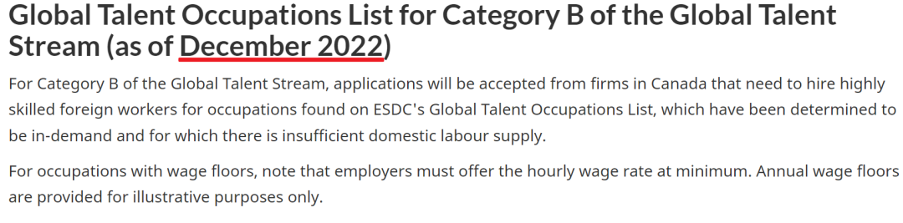
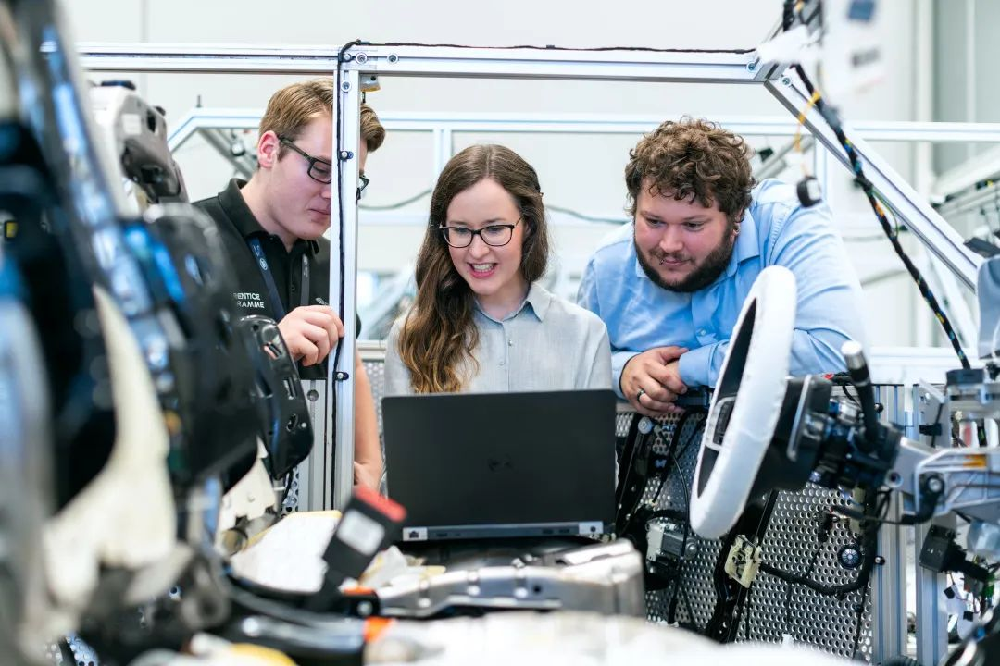
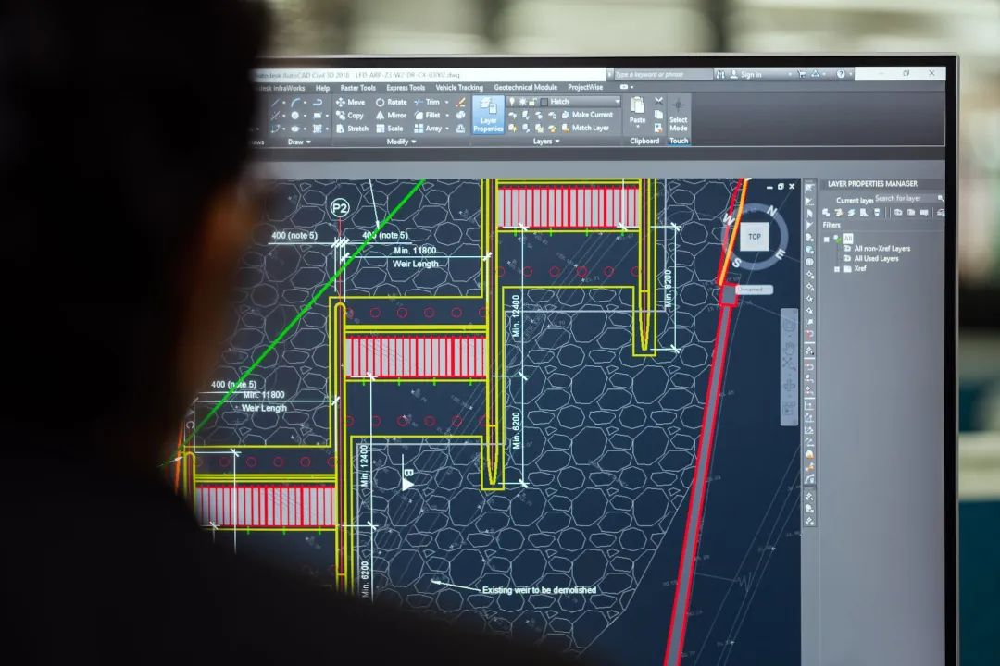

# 无标题

**链接地址:** http://mp.weixin.qq.com/s?__biz=MzUyNzA2NTAwNg==&mid=2247492255&idx=1&sn=0ef40f149482887b58d9ba36fef7fdc6&chksm=fa07e85ecd706148b30e1ad811dfc0e71dc41ee76435961a1135ff59140f0940fe43a6d6afdd&mpshare=1&scene=2&srcid=12287yvjqhNwOcVBpK94FRfJ&sharer_sharetime=1672174890635&sharer_shareid=77848a6b3852ae4dcb6c74ffee84743c#rd
**作者:** 你身边的签证专家
**获取时间:** 2025/8/28 19:22:23
**图片数量:** 15

---

## 原始HTML内容

<section style="box-sizing: border-box;font-size: 16px;"><section style="text-align: center;margin-top: 10px;margin-bottom: 10px;line-height: 0;box-sizing: border-box;" powered-by="xiumi.us"><section style="max-width: 100%;vertical-align: middle;display: inline-block;line-height: 0;box-sizing: border-box;"></section></section><section style="text-align: center;margin-top: 10px;margin-bottom: 10px;line-height: 0;box-sizing: border-box;" powered-by="xiumi.us"><section style="max-width: 100%;vertical-align: middle;display: inline-block;line-height: 0;box-sizing: border-box;"></section></section>
 
<section style="font-size: 19px;text-align: center;margin-top: 10px;margin-bottom: 3px;box-sizing: border-box;" powered-by="xiumi.us"><section style="display: inline-block;border-width: 1px;border-style: solid;border-color: rgb(188, 65, 65);background-color: rgb(188, 65, 65);width: 1.8em;height: 1.8em;line-height: 1.8em;border-radius: 100%;margin-left: auto;margin-right: auto;font-size: 16px;color: rgb(255, 255, 255);box-sizing: border-box;">
<strong style="box-sizing: border-box;">1</strong>
</section></section><section style="text-align: center;box-sizing: border-box;" powered-by="xiumi.us"><section style="display: inline-block;width: 0px;height: 0px;vertical-align: top;overflow: hidden;border-style: solid;border-width: 9px 6px 0px;border-color: rgb(188, 65, 65) rgba(255, 255, 255, 0) rgba(255, 255, 255, 0);box-sizing: border-box;"><svg viewBox="0 0 1 1" style="float:left;line-height:0;width:0;vertical-align:top;"></svg></section></section><section style="margin-bottom: 10px;text-align: center;justify-content: center;display: flex;flex-flow: row nowrap;box-sizing: border-box;" powered-by="xiumi.us"><section style="display: inline-block;width: auto;vertical-align: middle;background-color: rgba(109, 155, 209, 0.1);min-width: 10%;max-width: 100%;flex: 0 0 auto;height: auto;align-self: center;padding: 12px;box-sizing: border-box;"><section style="color: rgb(109, 155, 209);text-align: justify;box-sizing: border-box;" powered-by="xiumi.us">
<strong style="box-sizing: border-box;">加拿大“全球人才计划”职业列表扩大</strong>
</section></section></section><section style="font-size: 14px;padding-right: 15px;padding-left: 15px;letter-spacing: 1px;box-sizing: border-box;" powered-by="xiumi.us">
 

身在加拿大境外，准备移民加拿大的精英朋友们请注意，加拿大<strong style="box-sizing: border-box;">“全球人才计划”扩表</strong>啦！

 

全球人才计划是加拿大根据劳动力市场情况，引进外国精英人才的一项工作签证<strong style="box-sizing: border-box;">加速</strong>计划。符合要求的该项目申请者可以<strong style="box-sizing: border-box;">在短短两周内获得工签</strong>，而拥有劳动力市场影响评估（LMIA）的签证持有者在申请永居时也可以在许多申请通道中获得极高的加分，可以说是<strong style="box-sizing: border-box;">海外工签直申到永居最快的捷径之一</strong>！

 
</section><section style="text-align: center;margin-top: 10px;margin-bottom: 10px;line-height: 0;box-sizing: border-box;" powered-by="xiumi.us"><section style="max-width: 100%;vertical-align: middle;display: inline-block;line-height: 0;width: 90%;height: auto;box-sizing: border-box;"></section></section><section style="font-size: 14px;padding-right: 15px;padding-left: 15px;letter-spacing: 1px;box-sizing: border-box;" powered-by="xiumi.us">
 

随着加国疫后经济复苏的发展，一些行业格局出现变化，人才紧缺的情况尤其凸显。就在12月22日，加拿大就业和社会发展部（ESDC）扩大了<strong style="box-sizing: border-box;">全球人才计划（Global Talent Stream Program，GTS）中符合条件的职业清单</strong>。

 

所谓“全球人才计划”可以加快处理工作签证，旨在帮助加拿大雇主在技术领域<strong style="box-sizing: border-box;">在最短的时间内雇用到合适的外国技术工人</strong>。

 
</section><section style="text-align: center;box-sizing: border-box;" powered-by="xiumi.us"><section style="max-width: 100%;vertical-align: middle;display: inline-block;line-height: 0;width: 90%;height: auto;box-sizing: border-box;"></section></section><section style="font-size: 14px;padding-right: 15px;padding-left: 15px;letter-spacing: 1px;box-sizing: border-box;" powered-by="xiumi.us">
 

加拿大就业和社会发展部是一个致力于支持加拿大劳动力的政府部门，因此需要管理许多移民事务，包括<strong style="box-sizing: border-box;">劳动力市场内部评估（LMIA）和全球人才通道</strong>。

 

 
</section><section style="font-size: 19px;text-align: center;margin-top: 10px;margin-bottom: 3px;box-sizing: border-box;" powered-by="xiumi.us"><section style="display: inline-block;border-width: 1px;border-style: solid;border-color: rgb(188, 65, 65);background-color: rgb(188, 65, 65);width: 1.8em;height: 1.8em;line-height: 1.8em;border-radius: 100%;margin-left: auto;margin-right: auto;font-size: 16px;color: rgb(255, 255, 255);box-sizing: border-box;">
<strong style="box-sizing: border-box;">2</strong>
</section></section><section style="text-align: center;box-sizing: border-box;" powered-by="xiumi.us"><section style="display: inline-block;width: 0px;height: 0px;vertical-align: top;overflow: hidden;border-style: solid;border-width: 9px 6px 0px;border-color: rgb(188, 65, 65) rgba(255, 255, 255, 0) rgba(255, 255, 255, 0);box-sizing: border-box;"><svg viewBox="0 0 1 1" style="float:left;line-height:0;width:0;vertical-align:top;"></svg></section></section><section style="margin-bottom: 10px;text-align: center;justify-content: center;display: flex;flex-flow: row nowrap;box-sizing: border-box;" powered-by="xiumi.us"><section style="display: inline-block;width: auto;vertical-align: middle;background-color: rgba(109, 155, 209, 0.1);min-width: 10%;max-width: 100%;flex: 0 0 auto;height: auto;align-self: center;padding: 12px;box-sizing: border-box;"><section style="color: rgb(109, 155, 209);text-align: justify;box-sizing: border-box;" powered-by="xiumi.us">
<strong style="box-sizing: border-box;">新增5个职业全在工程领域</strong>
</section></section></section><section style="font-size: 14px;padding-right: 15px;padding-left: 15px;letter-spacing: 1px;box-sizing: border-box;" powered-by="xiumi.us">
 

根据全球人才通道的更新显示，加拿大GTS项目目前有<strong style="box-sizing: border-box;">17种紧缺职业</strong>。雇主雇用该列表内的外国技术工人的可以快速帮助他们申请并获得工作签证。

 
</section><section style="text-align: center;margin-top: 10px;margin-bottom: 10px;line-height: 0;box-sizing: border-box;" powered-by="xiumi.us"><section style="max-width: 100%;vertical-align: middle;display: inline-block;line-height: 0;width: 90%;height: auto;box-sizing: border-box;"></section></section><section style="font-size: 14px;padding-right: 15px;padding-left: 15px;letter-spacing: 1px;box-sizing: border-box;" powered-by="xiumi.us">
 

之前有12个职位，符合条件的职业现在已经扩大到17 个，<strong style="box-sizing: border-box;">增加了5个工程职位</strong>，其中包括<strong style="box-sizing: border-box;">中国学生们最爱的计算机工程师和电子工程师等</strong>：

 
<ul class="list-paddingleft-1"><li style="box-sizing: border-box;">
土木工程师（NOC代码21300）
</li><li style="box-sizing: border-box;">
电气和电子工程师（NOC代码21310）
</li><li style="box-sizing: border-box;">
采矿工程师（NOC代码21330）
</li><li style="box-sizing: border-box;">
航空航天工程师（NOC代码21390）
</li><li style="box-sizing: border-box;">
计算机工程师（软件工程师和设计师除外，NOC代码 21311）
</li></ul>
 

<strong style="box-sizing: border-box;">之前的12个GTS职业列表</strong>

 
<ul class="list-paddingleft-1"><li style="box-sizing: border-box;">
计算机和信息系统经理（NOC代码20012）
</li><li style="box-sizing: border-box;">
计算机工程师（NOC代码21311） 
</li><li style="box-sizing: border-box;">
数学家和统计学家（NOC代码21210）
</li><li style="box-sizing: border-box;">
信息系统分析师和顾问（NOC代码21211、21220、21221、21222、21233） 
</li><li style="box-sizing: border-box;">
数据库分析员和数据管理员（NOC代码21211、21223） 
</li><li style="box-sizing: border-box;">
软件工程师和设计师（NOC代码21231、21211） 
</li><li style="box-sizing: border-box;">
计算机程序员和交互式媒体开发者（NOC代码21230、21232、21234）
</li><li style="box-sizing: border-box;">
网页设计师和开发人员（NOC代码21233、21234） 
</li><li style="box-sizing: border-box;">
计算机网络技术人员（NOC代码22220） 
</li><li style="box-sizing: border-box;">
信息系统测试技术人员（NOC代码22222）
</li><li style="box-sizing: border-box;">
制片人、导演、编舞和相关职业*（NOC代码51120） 
</li><li style="box-sizing: border-box;">
数字媒体与设计（NOC代码52120） 
</li></ul>
 

通过全球人才计划雇用外国人才的雇主需要确保他们已经准备好申请材料，包括制定<strong style="box-sizing: border-box;">劳动力市场福利计划（LMBP）</strong>，以证明他们致力于实行对加拿大劳动力市场产生持久、积极影响的活动。

 
</section><section style="font-size: 19px;text-align: center;margin-top: 10px;margin-bottom: 3px;box-sizing: border-box;" powered-by="xiumi.us"><section style="display: inline-block;border-width: 1px;border-style: solid;border-color: rgb(188, 65, 65);background-color: rgb(188, 65, 65);width: 1.8em;height: 1.8em;line-height: 1.8em;border-radius: 100%;margin-left: auto;margin-right: auto;font-size: 16px;color: rgb(255, 255, 255);box-sizing: border-box;">
<strong style="box-sizing: border-box;">3</strong>
</section></section><section style="text-align: center;box-sizing: border-box;" powered-by="xiumi.us"><section style="display: inline-block;width: 0px;height: 0px;vertical-align: top;overflow: hidden;border-style: solid;border-width: 9px 6px 0px;border-color: rgb(188, 65, 65) rgba(255, 255, 255, 0) rgba(255, 255, 255, 0);box-sizing: border-box;"><svg viewBox="0 0 1 1" style="float:left;line-height:0;width:0;vertical-align:top;"></svg></section></section><section style="margin-bottom: 10px;text-align: center;justify-content: center;display: flex;flex-flow: row nowrap;box-sizing: border-box;" powered-by="xiumi.us"><section style="display: inline-block;width: auto;vertical-align: middle;background-color: rgba(109, 155, 209, 0.1);min-width: 10%;max-width: 100%;flex: 0 0 auto;height: auto;align-self: center;padding: 12px;box-sizing: border-box;"><section style="color: rgb(109, 155, 209);text-align: justify;box-sizing: border-box;" powered-by="xiumi.us">
<strong style="box-sizing: border-box;">为什么要新增职业</strong>
</section></section></section><section style="font-size: 14px;padding-right: 15px;padding-left: 15px;letter-spacing: 1px;box-sizing: border-box;" powered-by="xiumi.us">
 

根据加拿大信息和通信技术行业联合会公布的报告显示，未来四年内，加拿大有<strong style="box-sizing: border-box;">218,000份技术岗位急需相关人才填补空缺</strong>。

 

不仅如此，根据OECD公布的调查数据，<strong style="box-sizing: border-box;">加拿大的人才紧缺率为31%</strong>。这就意味着在加拿大至少有31%的公司(员工人数10人以上)面临人才不足。另外<strong style="box-sizing: border-box;">53%的人从事的工作与自己的专业技能并不对口</strong>，这也是人才紧缺的一大原因。

 
</section><section style="text-align: center;margin-top: 10px;margin-bottom: 10px;line-height: 0;box-sizing: border-box;" powered-by="xiumi.us"><section style="max-width: 100%;vertical-align: middle;display: inline-block;line-height: 0;width: 90%;height: auto;box-sizing: border-box;"></section></section><section style="font-size: 14px;padding-right: 15px;padding-left: 15px;letter-spacing: 1px;box-sizing: border-box;" powered-by="xiumi.us">
 

全球人才通道的合格职业会根据加拿大劳动力市场的需求而变化，这5个新职位的加入说明了加拿大对工程类劳动人才的内部需求。 

 
</section><section style="font-size: 19px;text-align: center;margin-top: 10px;margin-bottom: 3px;box-sizing: border-box;" powered-by="xiumi.us"><section style="display: inline-block;border-width: 1px;border-style: solid;border-color: rgb(188, 65, 65);background-color: rgb(188, 65, 65);width: 1.8em;height: 1.8em;line-height: 1.8em;border-radius: 100%;margin-left: auto;margin-right: auto;font-size: 16px;color: rgb(255, 255, 255);box-sizing: border-box;">
<strong style="box-sizing: border-box;">4</strong>
</section></section><section style="text-align: center;box-sizing: border-box;" powered-by="xiumi.us"><section style="display: inline-block;width: 0px;height: 0px;vertical-align: top;overflow: hidden;border-style: solid;border-width: 9px 6px 0px;border-color: rgb(188, 65, 65) rgba(255, 255, 255, 0) rgba(255, 255, 255, 0);box-sizing: border-box;"><svg viewBox="0 0 1 1" style="float:left;line-height:0;width:0;vertical-align:top;"></svg></section></section><section style="margin-bottom: 10px;text-align: center;justify-content: center;display: flex;flex-flow: row nowrap;box-sizing: border-box;" powered-by="xiumi.us"><section style="display: inline-block;width: auto;vertical-align: middle;background-color: rgba(109, 155, 209, 0.1);min-width: 10%;max-width: 100%;flex: 0 0 auto;height: auto;align-self: center;padding: 12px;box-sizing: border-box;"><section style="color: rgb(109, 155, 209);text-align: justify;box-sizing: border-box;" powered-by="xiumi.us">
<strong style="box-sizing: border-box;">申请人2周内即可获得签证审批</strong>
</section></section></section><section style="font-size: 14px;padding-right: 15px;padding-left: 15px;letter-spacing: 1px;box-sizing: border-box;" powered-by="xiumi.us">
 

加拿大全球人才计划（Global Talent Stream）是<strong style="box-sizing: border-box;">加拿大外劳计划</strong>（Temporary Foreign Worker Program）的其中一部分。该项目最初成立于2017年，是一个临时工作签证计划，旨在快速吸引全球各地的科技精英来到加拿大工作。为了让加拿大境内快速发展的公司快速聘请到海外高级人才，签证部门要<strong style="box-sizing: border-box;">加快这些人的签证审批过程</strong>。

 
</section><section style="text-align: center;margin-top: 10px;margin-bottom: 10px;line-height: 0;box-sizing: border-box;" powered-by="xiumi.us"><section style="max-width: 100%;vertical-align: middle;display: inline-block;line-height: 0;box-sizing: border-box;"></section></section><section style="font-size: 14px;padding-right: 15px;padding-left: 15px;letter-spacing: 1px;box-sizing: border-box;" powered-by="xiumi.us">
 

加拿大雇主通过获得<strong style="box-sizing: border-box;">劳动力市场影响评估（LMIA）</strong>，来证明他们已经用尽了所有从本地人才库招聘的可能性。这个过程结束后，外国公民便可以通过全球人才计划申请来加拿大。

 

加拿大联邦移民部的签证官会在<strong style="box-sizing: border-box;">短短2周内处理这些申请</strong>。这意味着，通过该计划，外国国民只需要差不多<strong style="box-sizing: border-box;">4周时间即可登陆加拿大</strong>，从此开始在加拿大累积工作经验和申请永居的道路。 

 

 
</section><section style="font-size: 19px;text-align: center;margin-top: 10px;margin-bottom: 3px;box-sizing: border-box;" powered-by="xiumi.us"><section style="display: inline-block;border-width: 1px;border-style: solid;border-color: rgb(188, 65, 65);background-color: rgb(188, 65, 65);width: 1.8em;height: 1.8em;line-height: 1.8em;border-radius: 100%;margin-left: auto;margin-right: auto;font-size: 16px;color: rgb(255, 255, 255);box-sizing: border-box;">
<strong style="box-sizing: border-box;">5</strong>
</section></section><section style="text-align: center;box-sizing: border-box;" powered-by="xiumi.us"><section style="display: inline-block;width: 0px;height: 0px;vertical-align: top;overflow: hidden;border-style: solid;border-width: 9px 6px 0px;border-color: rgb(188, 65, 65) rgba(255, 255, 255, 0) rgba(255, 255, 255, 0);box-sizing: border-box;"><svg viewBox="0 0 1 1" style="float:left;line-height:0;width:0;vertical-align:top;"></svg></section></section><section style="margin-bottom: 10px;text-align: center;justify-content: center;display: flex;flex-flow: row nowrap;box-sizing: border-box;" powered-by="xiumi.us"><section style="display: inline-block;width: auto;vertical-align: middle;background-color: rgba(109, 155, 209, 0.1);min-width: 10%;max-width: 100%;flex: 0 0 auto;height: auto;align-self: center;padding: 12px;box-sizing: border-box;"><section style="color: rgb(109, 155, 209);text-align: justify;box-sizing: border-box;" powered-by="xiumi.us">
<strong style="box-sizing: border-box;">加拿大全球人才计划申请条件</strong>
</section></section></section><section style="font-size: 14px;padding-right: 15px;padding-left: 15px;letter-spacing: 1px;box-sizing: border-box;" powered-by="xiumi.us">
 

全球人才计划(Global Talent Stream)有<strong style="box-sizing: border-box;">2个类别</strong>：

 

<strong style="box-sizing: border-box;">A类：处于快速增长期的公司，需要科技精英以满足公司发展的需求；</strong>

 

可以证明需要从国外招聘<strong style="box-sizing: border-box;">独特专业人才</strong>的高增长公司属于A类。此类别的雇主<strong style="box-sizing: border-box;">必须由指定的推荐合作伙伴推荐给全球人才计划</strong>。任何类别的公司都可能符合A类的要求，但是海外员工必须经由GTS全球人才计划合作机构介绍，且该公司必须经过评测确定处于快速增长期。

 
</section><section style="text-align: center;margin-top: 10px;margin-bottom: 10px;line-height: 0;box-sizing: border-box;" powered-by="xiumi.us"><section style="max-width: 100%;vertical-align: middle;display: inline-block;line-height: 0;width: 90%;height: auto;box-sizing: border-box;"></section></section><section style="font-size: 14px;padding-right: 15px;padding-left: 15px;letter-spacing: 1px;box-sizing: border-box;" powered-by="xiumi.us">
 

<strong style="box-sizing: border-box;">B类：公司需要高技术人才，且该岗位属于紧缺职业列表。</strong>

 

B类适用于希望雇佣某些<strong style="box-sizing: border-box;">高技能外国工人</strong>从事全球人才职业列表所列职业的雇主，这些职业已被确定为紧缺且国内劳动力供应不足。这个列表可能会定期更新，以满足劳动力市场的需求。

 

如果公司可以<strong style="box-sizing: border-box;">证明需要全球人才来填补紧缺职业列表上的高技能职业，并愿意向雇员支付现行工资或更高的工资</strong>，则属于B类。需要注意的是，<strong style="box-sizing: border-box;">部分工作岗位有最低工资要求</strong>。 

 
</section><section style="text-align: center;margin-top: 10px;margin-bottom: 10px;line-height: 0;box-sizing: border-box;" powered-by="xiumi.us"><section style="max-width: 100%;vertical-align: middle;display: inline-block;line-height: 0;width: 90%;height: auto;box-sizing: border-box;"></section></section><section style="font-size: 14px;padding-right: 15px;padding-left: 15px;letter-spacing: 1px;box-sizing: border-box;" powered-by="xiumi.us">
 

这两类雇主都必须满足与支付技术工人工资有关的条件。通过全球人才计划GTS雇佣的外国工人必须按照现行工资或更高的工资支付。现行工资被定义为以下选项中的最高者：

 
<ul class="list-paddingleft-1"><li style="box-sizing: border-box;">
<em style="box-sizing: border-box;">加拿大政府Job Bank中职业工资中位数；</em>
</li><li style="box-sizing: border-box;">
<em style="box-sizing: border-box;">雇主支付给在同一地点同一职位、具备相同技能和经验的现有雇员的工资数；</em>
</li><li style="box-sizing: border-box;">
<em style="box-sizing: border-box;">全球人才职业列表中规定的工资最低标准（如适用）。</em>
</li></ul>
 

 
</section><section style="font-size: 19px;text-align: center;margin-top: 10px;margin-bottom: 3px;box-sizing: border-box;" powered-by="xiumi.us"><section style="display: inline-block;border-width: 1px;border-style: solid;border-color: rgb(188, 65, 65);background-color: rgb(188, 65, 65);width: 1.8em;height: 1.8em;line-height: 1.8em;border-radius: 100%;margin-left: auto;margin-right: auto;font-size: 16px;color: rgb(255, 255, 255);box-sizing: border-box;">
<strong style="box-sizing: border-box;">6</strong>
</section></section><section style="text-align: center;box-sizing: border-box;" powered-by="xiumi.us"><section style="display: inline-block;width: 0px;height: 0px;vertical-align: top;overflow: hidden;border-style: solid;border-width: 9px 6px 0px;border-color: rgb(188, 65, 65) rgba(255, 255, 255, 0) rgba(255, 255, 255, 0);box-sizing: border-box;"><svg viewBox="0 0 1 1" style="float:left;line-height:0;width:0;vertical-align:top;"></svg></section></section><section style="margin-bottom: 10px;text-align: center;justify-content: center;display: flex;flex-flow: row nowrap;box-sizing: border-box;" powered-by="xiumi.us"><section style="display: inline-block;width: auto;vertical-align: middle;background-color: rgba(109, 155, 209, 0.1);min-width: 10%;max-width: 100%;flex: 0 0 auto;height: auto;align-self: center;padding: 12px;box-sizing: border-box;"><section style="color: rgb(109, 155, 209);text-align: justify;box-sizing: border-box;" powered-by="xiumi.us">
<strong style="box-sizing: border-box;">2023年将迎来更多改革</strong>
</section></section></section><section style="font-size: 14px;padding-right: 15px;padding-left: 15px;letter-spacing: 1px;box-sizing: border-box;" powered-by="xiumi.us">
 

目前全球人才计划还属于临时劳动力计划中的一种，雇主向政府申请后允许符合资格人才来到加拿大工作，但是实质<strong style="box-sizing: border-box;">为雇主担保移民的前站工作</strong>。 

 

而且，移民部明年也将出台了<strong style="box-sizing: border-box;">针对特定职业发出移民邀请的政策</strong>，以更直接地解决加拿大的劳动力市场短缺的问题。

 
</section><section style="text-align: center;margin-top: 10px;margin-bottom: 10px;line-height: 0;box-sizing: border-box;" powered-by="xiumi.us"><section style="max-width: 100%;vertical-align: middle;display: inline-block;line-height: 0;box-sizing: border-box;"></section></section><section style="font-size: 14px;padding-right: 15px;padding-left: 15px;letter-spacing: 1px;box-sizing: border-box;" powered-by="xiumi.us">
 

这些政策包括：

 
<ul class="list-paddingleft-1"><li style="box-sizing: border-box;">
引入<strong style="box-sizing: border-box;">新省必要工人试点项目（NBCWP）</strong>，与六家雇主合作，直接解决新省劳动力需求；
</li><li style="box-sizing: border-box;">
消除医护人员申请的快速通道移民的障碍；
</li><li style="box-sizing: border-box;">
批准C-19法案。它授予移民部长在快速通道池中对特定人群发出移民邀请的权力。
</li></ul></section><section style="font-size: 14px;padding-right: 15px;padding-left: 15px;letter-spacing: 1px;box-sizing: border-box;" powered-by="xiumi.us">
 

IT类职业、医护类职业、具备法语语言能力的申请人短期内应该不必感到担忧，但是从事一些非紧缺职业的申请人就要注意了：如果你的职业不在被定向邀请范围，进入常规邀请的候选池将面临<strong style="box-sizing: border-box;">更长的邀请周期，更少的邀请名额和更高的邀请分数</strong>，这意味着你可能<strong style="box-sizing: border-box;">很难通过快速通道成功上岸</strong>。

 

定向邀请最令人担忧的是邀请条件可能会根据加拿大劳动力市场的需求<strong style="box-sizing: border-box;">不定期轮换</strong>，这对于想通过留学后拿到毕业工签，积累一定工作经验再走CEC的申请人来说不是一个好消息，因为很难判断从留学到入池这么长的时间内，目标职业是否还在被邀请之列。

 
<section><mp-common-profile class="js_uneditable custom_select_card mp_profile_iframe" data-pluginname="mpprofile" data-weui-theme="light" data-id="MzUyNzA2NTAwNg==" data-headimg="http://mmbiz.qpic.cn/mmbiz_png/904kUibXm7Y6gq02PdSyzYZvibpBf0icbsnWtqW39AwrqqK8DRQdfwaE8UtUmwOd05nWcoYKrorN7ZuRngiaFhPlibQ/0?wx_fmt=png" data-nickname="新时代留学移民法律事务所" data-alias="" data-signature="加拿大移民顾问监管委员会会员/加拿大注册持牌移民顾问" data-from="0" data-is_biz_ban="0"></mp-common-profile></section>
 

所以目前能入池的客户朋友们请尽快入池，抓紧改革实施前的窗口期。还在上学的客户朋友们也请把眼光放长远，<strong style="box-sizing: border-box;">提前做好自己的职业规划</strong>。<strong style="box-sizing: border-box;">不同职业在加拿大的拿卡体验可谓天差地别！</strong>

 

如果你认为自己的目前分数和职业不太有被打捞上岸的希望，也欢迎联系我们帮你进行<strong style="box-sizing: border-box;">系统又专业的移民方案规划</strong>。留在加拿大的方式比你想象的多，只要你不放弃，<strong style="box-sizing: border-box;">一定有一条路适合你</strong>！

 
</section>
 
<section style="text-align: left;justify-content: flex-start;display: flex;flex-flow: row nowrap;margin-top: 10px;box-sizing: border-box;" powered-by="xiumi.us"><section style="display: inline-block;vertical-align: top;width: auto;align-self: stretch;flex: 0 0 auto;background-color: rgb(188, 65, 65);min-width: 5%;max-width: 100%;height: auto;padding-top: 9px;padding-right: 9px;padding-left: 20px;box-sizing: border-box;"><section style="text-align: justify;font-size: 18px;color: rgb(252, 252, 252);box-sizing: border-box;" powered-by="xiumi.us">
<strong style="box-sizing: border-box;">阅读更多</strong>
</section></section><section style="display: inline-block;vertical-align: top;width: auto;min-width: 5%;max-width: 100%;flex: 0 0 auto;height: auto;align-self: stretch;box-sizing: border-box;"><section style="box-sizing: border-box;" powered-by="xiumi.us"><section style="display: inline-block;width: 0px;height: 0px;vertical-align: top;overflow: hidden;border-style: solid;border-width: 45px 0px 0px 19px;border-color: rgba(255, 255, 255, 0) rgba(255, 255, 255, 0) rgba(255, 255, 255, 0) rgb(188, 65, 65);box-sizing: border-box;"><svg viewBox="0 0 1 1" style="float:left;line-height:0;width:0;vertical-align:top;"></svg></section></section></section></section><section style="margin-bottom: 10px;box-sizing: border-box;" powered-by="xiumi.us"><section style="background-color: rgb(188, 65, 65);height: 3px;box-sizing: border-box;"><svg viewBox="0 0 1 1" style="float:left;line-height:0;width:0;vertical-align:top;"></svg></section></section><section style="margin: 10px 0%;text-align: left;justify-content: flex-start;display: flex;flex-flow: row nowrap;box-sizing: border-box;" powered-by="xiumi.us"><section style="display: inline-block;width: 100%;vertical-align: top;background-position: -26.3755% 52.8617%;background-repeat: repeat;background-size: 100.637%;background-attachment: scroll;padding: 30px;align-self: flex-start;flex: 0 0 auto;background-image: url(&quot;https://mmbiz.qpic.cn/mmbiz_png/904kUibXm7Y6VdpawN8yGtMQspsWDQ0cibWqEjhYkogEGoC6YcDRRLzibDA19wOTfYOVWD6CJx5PlPKvNJPrqfAibA/640?wx_fmt=png&quot;);box-sizing: border-box;"><section style="text-align: justify;justify-content: flex-start;display: flex;flex-flow: row nowrap;box-sizing: border-box;" powered-by="xiumi.us"><section style="display: inline-block;width: 100%;vertical-align: top;background-color: rgba(188, 65, 65, 0.22);padding: 10px;border-width: 0px;border-style: none;border-color: rgb(62, 62, 62);align-self: flex-start;flex: 0 0 auto;box-sizing: border-box;"><section style="text-align: center;color: rgb(255, 255, 255);font-size: 14px;box-sizing: border-box;" powered-by="xiumi.us">
<a target="_blank" href="http://mp.weixin.qq.com/s?__biz=MzUyNzA2NTAwNg==&amp;mid=2247492231&amp;idx=1&amp;sn=2fe3a1169fcbf4381228afd1750ae169&amp;chksm=fa07e846cd7061508af89114a46de2c7a5714db7ae84c6db270fc44d05c2794102cb554b1351&amp;scene=21#wechat_redirect" textvalue="加拿大“太卷了”！移民大省安省人口流出创纪录！新移民最喜欢的竟是这个省？" linktype="text" imgurl="" imgdata="null" data-itemshowtype="0" tab="innerlink" style="color: rgb(255, 255, 255);" data-linktype="2"><strong style="box-sizing: border-box;">加拿大“太卷了”！移民大省安省人口流出创纪录！新移民最喜欢的竟是这个省？</strong></a>
</section></section></section></section></section><section style="margin: 10px 0%;text-align: left;justify-content: flex-start;display: flex;flex-flow: row nowrap;box-sizing: border-box;" powered-by="xiumi.us"><section style="display: inline-block;width: 100%;background-position: 25.9688% 31.446%;background-repeat: repeat;background-size: 103.375%;background-attachment: scroll;padding: 30px;vertical-align: top;align-self: flex-start;flex: 0 0 auto;background-image: url(&quot;https://mmbiz.qpic.cn/mmbiz_jpg/904kUibXm7Y6VdpawN8yGtMQspsWDQ0cibMF0olibMmWduazffRoUOziccFYmj0bntSpmichicuR3KghhDicib1gOVmxuA/640?wx_fmt=jpeg&quot;);box-sizing: border-box;"><section style="text-align: justify;justify-content: flex-start;display: flex;flex-flow: row nowrap;box-sizing: border-box;" powered-by="xiumi.us"><section style="display: inline-block;width: 100%;vertical-align: top;background-color: rgba(188, 65, 65, 0.22);padding: 10px;border-width: 0px;border-style: none;border-color: rgb(62, 62, 62);align-self: flex-start;flex: 0 0 auto;box-sizing: border-box;"><section style="text-align: center;color: rgb(255, 255, 255);font-size: 14px;box-sizing: border-box;" powered-by="xiumi.us">
<a target="_blank" href="http://mp.weixin.qq.com/s?__biz=MzUyNzA2NTAwNg==&amp;mid=2247492189&amp;idx=1&amp;sn=d99fa6fa07a759daa4275bef204d7008&amp;chksm=fa07e89ccd70618aa3f572682a698873468f3f38c8ea226e3efba873239ae04c092663a94fb2&amp;scene=21#wechat_redirect" textvalue="再破纪录！加拿大移民部今年审批480万！留学生67万，新移民41万！" linktype="text" imgurl="" imgdata="null" data-itemshowtype="0" tab="innerlink" style="color: rgb(255, 255, 255);" data-linktype="2"><strong style="box-sizing: border-box;">再破纪录！加拿大移民部今年审批480万！留学生67万，新移民41万！</strong></a>
</section></section></section></section></section><section style="margin: 10px 0%;text-align: left;justify-content: flex-start;display: flex;flex-flow: row nowrap;box-sizing: border-box;" powered-by="xiumi.us"><section style="display: inline-block;width: 100%;vertical-align: top;background-position: 55.6015% 33.1154%;background-repeat: repeat;background-size: 100.637%;background-attachment: scroll;padding: 30px;align-self: flex-start;flex: 0 0 auto;background-image: url(&quot;https://mmbiz.qpic.cn/mmbiz_png/904kUibXm7Y6VdpawN8yGtMQspsWDQ0cibn60JLJic6ptl4a1tqsmQSOz6sdLPw1zNAdoBIbiaHTdI1ZZvLNHHlh3A/640?wx_fmt=png&quot;);box-sizing: border-box;"><section style="text-align: justify;justify-content: flex-start;display: flex;flex-flow: row nowrap;box-sizing: border-box;" powered-by="xiumi.us"><section style="display: inline-block;width: 100%;vertical-align: top;background-color: rgba(188, 65, 65, 0.22);padding: 10px;border-width: 0px;border-style: none;border-color: rgb(62, 62, 62);align-self: flex-start;flex: 0 0 auto;box-sizing: border-box;"><section style="text-align: center;color: rgb(255, 255, 255);font-size: 14px;box-sizing: border-box;" powered-by="xiumi.us">
<a target="_blank" href="http://mp.weixin.qq.com/s?__biz=MzUyNzA2NTAwNg==&amp;mid=2247492145&amp;idx=1&amp;sn=bf12265be963ed7652b22183fbf2844a&amp;chksm=fa07e8f0cd7061e681e448fa57f5c2a60dc305107e61eb1cf8c9f1a2ecb5c49b87e5b7fd01c1&amp;scene=21#wechat_redirect" textvalue="加拿大移民政策利好：承认医护领域新移民外国学历资历，各类移民通道放宽标准！" linktype="text" imgurl="" imgdata="null" data-itemshowtype="0" tab="innerlink" style="color: rgb(255, 255, 255);" data-linktype="2"><strong style="box-sizing: border-box;">加拿大移民政策利好：承认医护领域新移民外国学历资历，各类移民通道放宽标准！</strong></a>
</section></section></section></section></section><section style="margin: 10px 0%;text-align: left;justify-content: flex-start;display: flex;flex-flow: row nowrap;box-sizing: border-box;" powered-by="xiumi.us"><section style="display: inline-block;width: 100%;vertical-align: top;background-position: 55.6015% 33.1154%;background-repeat: repeat;background-size: 100.637%;background-attachment: scroll;padding: 30px;align-self: flex-start;flex: 0 0 auto;background-image: url(&quot;https://mmbiz.qpic.cn/mmbiz_jpg/904kUibXm7Y6VdpawN8yGtMQspsWDQ0cibWLxVmicdC9taaGRj2ug9HHfecc2hmwtThQFAc4ctuVlJKf1picfd1GoQ/640?wx_fmt=jpeg&quot;);box-sizing: border-box;"><section style="text-align: justify;justify-content: flex-start;display: flex;flex-flow: row nowrap;box-sizing: border-box;" powered-by="xiumi.us"><section style="display: inline-block;width: 100%;vertical-align: top;background-color: rgba(188, 65, 65, 0.22);padding: 10px;border-width: 0px;border-style: none;border-color: rgb(62, 62, 62);align-self: flex-start;flex: 0 0 auto;box-sizing: border-box;"><section style="text-align: center;color: rgb(255, 255, 255);font-size: 14px;box-sizing: border-box;" powered-by="xiumi.us">
<a target="_blank" href="http://mp.weixin.qq.com/s?__biz=MzUyNzA2NTAwNg==&amp;mid=2247492107&amp;idx=1&amp;sn=c2565a5de1f92cc838acb6c31459957f&amp;chksm=fa07e8cacd7061dc6d66a50bb20e346a2ffdabb6ac8964a3e2b42fb1b544189b248460589f23&amp;scene=21#wechat_redirect" textvalue="加媒爆料：5万多份移民申请被分配给已经离职移民官员！移民签证石沉大海不是你的错！" linktype="text" imgurl="" imgdata="null" data-itemshowtype="0" tab="innerlink" style="color: rgb(255, 255, 255);" data-linktype="2"><strong style="box-sizing: border-box;">加媒爆料：5万多份移民申请被分配给已经离职移民官员！移民签证石沉大海不是你的错！</strong></a>
</section></section></section></section></section><section style="text-align: center;font-size: 12px;color: rgb(180, 180, 180);box-sizing: border-box;" powered-by="xiumi.us">
（点击文字阅读）
</section><section style="margin: 10px 0%;text-align: left;justify-content: flex-start;display: flex;flex-flow: row nowrap;box-sizing: border-box;" powered-by="xiumi.us"><section style="display: inline-block;width: 100%;vertical-align: top;background-color: rgb(216, 202, 160);line-height: 0;align-self: flex-start;flex: 0 0 auto;box-sizing: border-box;"><section style="text-align: justify;justify-content: flex-start;display: flex;flex-flow: row nowrap;box-sizing: border-box;" powered-by="xiumi.us"><section style="display: inline-block;width: 100%;vertical-align: top;background-position: 0% 0%;background-repeat: repeat;background-size: 1.56658%;background-attachment: scroll;align-self: flex-start;flex: 0 0 auto;background-image: url(&quot;https://mmbiz.qpic.cn/mmbiz_png/904kUibXm7Y6VdpawN8yGtMQspsWDQ0cibISJljvPSYRyXCVFszTI5aHjp10LsdOHjYeFLXTWvlFmdC2auEVsm3g/640?wx_fmt=png&quot;);box-sizing: border-box;"><section style="text-align: center;box-sizing: border-box;" powered-by="xiumi.us"><section style="display: inline-block;width: 100%;height: 11px;vertical-align: top;overflow: hidden;background-color: rgba(255, 255, 255, 0);box-sizing: border-box;"><svg viewBox="0 0 1 1" style="float:left;line-height:0;width:0;vertical-align:top;"></svg></section></section></section></section></section></section><section style="text-align: center;margin-top: 10px;margin-bottom: 10px;line-height: 0;box-sizing: border-box;" powered-by="xiumi.us"><section style="max-width: 100%;vertical-align: middle;display: inline-block;line-height: 0;box-sizing: border-box;"></section></section><section style="text-align: center;margin-top: 10px;margin-bottom: 10px;line-height: 0;box-sizing: border-box;" powered-by="xiumi.us"><section style="max-width: 100%;vertical-align: middle;display: inline-block;line-height: 0;box-sizing: border-box;"></section></section><section style="text-align: center;margin-top: 10px;margin-bottom: 10px;line-height: 0;box-sizing: border-box;" powered-by="xiumi.us"><section style="max-width: 100%;vertical-align: middle;display: inline-block;line-height: 0;box-sizing: border-box;"></section></section><section style="padding-right: 15px;padding-left: 15px;font-size: 12px;color: rgb(121, 121, 121);box-sizing: border-box;" powered-by="xiumi.us">
<strong style="box-sizing: border-box;">参考信息：</strong>

<strong style="box-sizing: border-box;">https://www.cicnews.com/2022/12/global-talent-stream-adds-five-new-eligible-occupations-to-program-1232299.html#gs.lxgagj</strong>
</section><section style="text-align: center;margin-top: 10px;margin-bottom: 10px;line-height: 0;box-sizing: border-box;" powered-by="xiumi.us"><section style="max-width: 100%;vertical-align: middle;display: inline-block;line-height: 0;box-sizing: border-box;"></section></section><section style="text-align: center;margin-top: 10px;margin-bottom: 10px;line-height: 0;box-sizing: border-box;" powered-by="xiumi.us"><section style="max-width: 100%;vertical-align: middle;display: inline-block;line-height: 0;box-sizing: border-box;"></section></section></section>
 

<mp-style-type data-value="3"></mp-style-type>

---

## 纯文本内容

1加拿大“全球人才计划”职业列表扩大身在加拿大境外，准备移民加拿大的精英朋友们请注意，加拿大“全球人才计划”扩表啦！全球人才计划是加拿大根据劳动力市场情况，引进外国精英人才的一项工作签证加速计划。符合要求的该项目申请者可以在短短两周内获得工签，而拥有劳动力市场影响评估（LMIA）的签证持有者在申请永居时也可以在许多申请通道中获得极高的加分，可以说是海外工签直申到永居最快的捷径之一！随着加国疫后经济复苏的发展，一些行业格局出现变化，人才紧缺的情况尤其凸显。就在12月22日，加拿大就业和社会发展部（ESDC）扩大了全球人才计划（Global Talent Stream Program，GTS）中符合条件的职业清单。所谓“全球人才计划”可以加快处理工作签证，旨在帮助加拿大雇主在技术领域在最短的时间内雇用到合适的外国技术工人。加拿大就业和社会发展部是一个致力于支持加拿大劳动力的政府部门，因此需要管理许多移民事务，包括劳动力市场内部评估（LMIA）和全球人才通道。2新增5个职业全在工程领域根据全球人才通道的更新显示，加拿大GTS项目目前有17种紧缺职业。雇主雇用该列表内的外国技术工人的可以快速帮助他们申请并获得工作签证。之前有12个职位，符合条件的职业现在已经扩大到17 个，增加了5个工程职位，其中包括中国学生们最爱的计算机工程师和电子工程师等：土木工程师（NOC代码21300）电气和电子工程师（NOC代码21310）采矿工程师（NOC代码21330）航空航天工程师（NOC代码21390）计算机工程师（软件工程师和设计师除外，NOC代码 21311）之前的12个GTS职业列表计算机和信息系统经理（NOC代码20012）计算机工程师（NOC代码21311）数学家和统计学家（NOC代码21210）信息系统分析师和顾问（NOC代码21211、21220、21221、21222、21233）数据库分析员和数据管理员（NOC代码21211、21223）软件工程师和设计师（NOC代码21231、21211）计算机程序员和交互式媒体开发者（NOC代码21230、21232、21234）网页设计师和开发人员（NOC代码21233、21234）计算机网络技术人员（NOC代码22220）信息系统测试技术人员（NOC代码22222）制片人、导演、编舞和相关职业*（NOC代码51120）数字媒体与设计（NOC代码52120）通过全球人才计划雇用外国人才的雇主需要确保他们已经准备好申请材料，包括制定劳动力市场福利计划（LMBP），以证明他们致力于实行对加拿大劳动力市场产生持久、积极影响的活动。3为什么要新增职业根据加拿大信息和通信技术行业联合会公布的报告显示，未来四年内，加拿大有218,000份技术岗位急需相关人才填补空缺。不仅如此，根据OECD公布的调查数据，加拿大的人才紧缺率为31%。这就意味着在加拿大至少有31%的公司(员工人数10人以上)面临人才不足。另外53%的人从事的工作与自己的专业技能并不对口，这也是人才紧缺的一大原因。全球人才通道的合格职业会根据加拿大劳动力市场的需求而变化，这5个新职位的加入说明了加拿大对工程类劳动人才的内部需求。4申请人2周内即可获得签证审批加拿大全球人才计划（Global Talent Stream）是加拿大外劳计划（Temporary Foreign Worker Program）的其中一部分。该项目最初成立于2017年，是一个临时工作签证计划，旨在快速吸引全球各地的科技精英来到加拿大工作。为了让加拿大境内快速发展的公司快速聘请到海外高级人才，签证部门要加快这些人的签证审批过程。加拿大雇主通过获得劳动力市场影响评估（LMIA），来证明他们已经用尽了所有从本地人才库招聘的可能性。这个过程结束后，外国公民便可以通过全球人才计划申请来加拿大。加拿大联邦移民部的签证官会在短短2周内处理这些申请。这意味着，通过该计划，外国国民只需要差不多4周时间即可登陆加拿大，从此开始在加拿大累积工作经验和申请永居的道路。5加拿大全球人才计划申请条件全球人才计划(Global Talent Stream)有2个类别：A类：处于快速增长期的公司，需要科技精英以满足公司发展的需求；可以证明需要从国外招聘独特专业人才的高增长公司属于A类。此类别的雇主必须由指定的推荐合作伙伴推荐给全球人才计划。任何类别的公司都可能符合A类的要求，但是海外员工必须经由GTS全球人才计划合作机构介绍，且该公司必须经过评测确定处于快速增长期。B类：公司需要高技术人才，且该岗位属于紧缺职业列表。B类适用于希望雇佣某些高技能外国工人从事全球人才职业列表所列职业的雇主，这些职业已被确定为紧缺且国内劳动力供应不足。这个列表可能会定期更新，以满足劳动力市场的需求。如果公司可以证明需要全球人才来填补紧缺职业列表上的高技能职业，并愿意向雇员支付现行工资或更高的工资，则属于B类。需要注意的是，部分工作岗位有最低工资要求。这两类雇主都必须满足与支付技术工人工资有关的条件。通过全球人才计划GTS雇佣的外国工人必须按照现行工资或更高的工资支付。现行工资被定义为以下选项中的最高者：加拿大政府Job Bank中职业工资中位数；雇主支付给在同一地点同一职位、具备相同技能和经验的现有雇员的工资数；全球人才职业列表中规定的工资最低标准（如适用）。62023年将迎来更多改革目前全球人才计划还属于临时劳动力计划中的一种，雇主向政府申请后允许符合资格人才来到加拿大工作，但是实质为雇主担保移民的前站工作。而且，移民部明年也将出台了针对特定职业发出移民邀请的政策，以更直接地解决加拿大的劳动力市场短缺的问题。这些政策包括：引入新省必要工人试点项目（NBCWP），与六家雇主合作，直接解决新省劳动力需求；消除医护人员申请的快速通道移民的障碍；批准C-19法案。它授予移民部长在快速通道池中对特定人群发出移民邀请的权力。IT类职业、医护类职业、具备法语语言能力的申请人短期内应该不必感到担忧，但是从事一些非紧缺职业的申请人就要注意了：如果你的职业不在被定向邀请范围，进入常规邀请的候选池将面临更长的邀请周期，更少的邀请名额和更高的邀请分数，这意味着你可能很难通过快速通道成功上岸。定向邀请最令人担忧的是邀请条件可能会根据加拿大劳动力市场的需求不定期轮换，这对于想通过留学后拿到毕业工签，积累一定工作经验再走CEC的申请人来说不是一个好消息，因为很难判断从留学到入池这么长的时间内，目标职业是否还在被邀请之列。所以目前能入池的客户朋友们请尽快入池，抓紧改革实施前的窗口期。还在上学的客户朋友们也请把眼光放长远，提前做好自己的职业规划。不同职业在加拿大的拿卡体验可谓天差地别！如果你认为自己的目前分数和职业不太有被打捞上岸的希望，也欢迎联系我们帮你进行系统又专业的移民方案规划。留在加拿大的方式比你想象的多，只要你不放弃，一定有一条路适合你！阅读更多加拿大“太卷了”！移民大省安省人口流出创纪录！新移民最喜欢的竟是这个省？再破纪录！加拿大移民部今年审批480万！留学生67万，新移民41万！加拿大移民政策利好：承认医护领域新移民外国学历资历，各类移民通道放宽标准！加媒爆料：5万多份移民申请被分配给已经离职移民官员！移民签证石沉大海不是你的错！（点击文字阅读）参考信息：https://www.cicnews.com/2022/12/global-talent-stream-adds-five-new-eligible-occupations-to-program-1232299.html#gs.lxgagj

---

## 图片列表

-  (原始链接: https://mmbiz.qpic.cn/mmbiz_jpg/904kUibXm7Y6VdpawN8yGtMQspsWDQ0cibJ5x7jfSjkUP4lex2CqPdgjQCVBDvicuU9aUzS9X0v2pZGaqZkfibRIAQ/640?wx_fmt=jpeg)
-  (原始链接: https://mmbiz.qpic.cn/mmbiz_jpg/904kUibXm7Y6VdpawN8yGtMQspsWDQ0cibIVK1IkJricJclKglF9Kd322vWvISKYWBWlOgv1jRFpf9tibegCsZXQ5g/640?wx_fmt=jpeg)
-  (原始链接: https://mmbiz.qpic.cn/mmbiz_png/904kUibXm7Y6VdpawN8yGtMQspsWDQ0cib3q4zhibVMQg0X157P8BmMHEt8ecmkB8JVawic2ed4LEOZHPxtAGHHLiaA/640?wx_fmt=png)
-  (原始链接: https://mmbiz.qpic.cn/mmbiz_png/904kUibXm7Y6VdpawN8yGtMQspsWDQ0cib8dEjP7npaKARwsO6lLHhbPgtWT16D5qSsDJYfliaNkmx0icZGm93Kpzg/640?wx_fmt=png)
-  (原始链接: https://mmbiz.qpic.cn/mmbiz_jpg/904kUibXm7Y6VdpawN8yGtMQspsWDQ0cibibuHdbCtUYVpkEDa9HOdTg4oBr74ibeia0SJWUAHWwrm0mvNwxhibliaPOg/640?wx_fmt=jpeg)
-  (原始链接: https://mmbiz.qpic.cn/mmbiz_jpg/904kUibXm7Y6VdpawN8yGtMQspsWDQ0cibuibG8PbyPHRNq5EdcqkOKfE7FMJg4pw9hZbBJDOvEn38PIibkjCNOKdQ/640?wx_fmt=jpeg)
-  (原始链接: https://mmbiz.qpic.cn/mmbiz_png/904kUibXm7Y6VdpawN8yGtMQspsWDQ0cibyTjRqlRTnDA0cic2tHLE7UlcuENwuJMcicAmlJXWibAKhSx01hicE5DdEA/640?wx_fmt=png)
-  (原始链接: https://mmbiz.qpic.cn/mmbiz_jpg/904kUibXm7Y6VdpawN8yGtMQspsWDQ0cibeUQ0bTRgcTdN4GEbMTvDGSuYC2zbGIRNyV0HLh1JlV5kPzBdYPicKxA/640?wx_fmt=jpeg)
-  (原始链接: https://mmbiz.qpic.cn/mmbiz_jpg/904kUibXm7Y6VdpawN8yGtMQspsWDQ0cibX4lSpoxt9Dan6yuRT32aziccCyTFzkwpic2put5j7fRD9Q1Mz6IjjUFw/640?wx_fmt=jpeg)
-  (原始链接: https://mmbiz.qpic.cn/mmbiz_png/904kUibXm7Y6VdpawN8yGtMQspsWDQ0cib2YuAtTUETxyYAa4BaFytkluBwgPYqicEtWkpUib5FP9F8kcTdlrDGOPw/640?wx_fmt=png)
-  (原始链接: https://mmbiz.qpic.cn/mmbiz_jpg/904kUibXm7Y6VdpawN8yGtMQspsWDQ0cibZ8wUuibhSVta1OiattqwdIDm5V4mCV8uDdjY1UbVLow2PSDG1DibYupIg/640?wx_fmt=jpeg)
-  (原始链接: https://mmbiz.qpic.cn/mmbiz_png/904kUibXm7Y6VdpawN8yGtMQspsWDQ0cib5MRZBHY143T8Hs2bqblFPMMvJJ5U2NGczKLAQoqf7aakoEZ7ge8jdg/640?wx_fmt=png)
-  (原始链接: https://mmbiz.qpic.cn/mmbiz_jpg/904kUibXm7Y6VdpawN8yGtMQspsWDQ0cibxGBGTmKOWg03rwoeJzFAaDuwR1pu0ib0F52xKIVFm2e70lWZtIxq4HA/640?wx_fmt=jpeg)
-  (原始链接: https://mmbiz.qpic.cn/mmbiz_jpg/904kUibXm7Y6VdpawN8yGtMQspsWDQ0cibg26ONYwgsnJibrQHpxg9cy2xSkcpcwyVEoDw2hHDc1icSicLoVHVBhxaw/640?wx_fmt=jpeg)
-  (原始链接: https://mmbiz.qpic.cn/mmbiz_jpg/904kUibXm7Y6VdpawN8yGtMQspsWDQ0cibfVHYkYz2YkekR7t1NLxXSjXlJMyU2FYMfUgQz4o08b66g9c782QwpQ/640?wx_fmt=jpeg)
