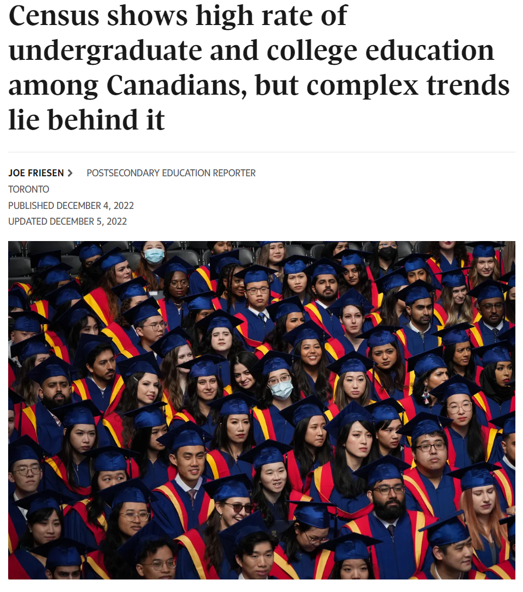
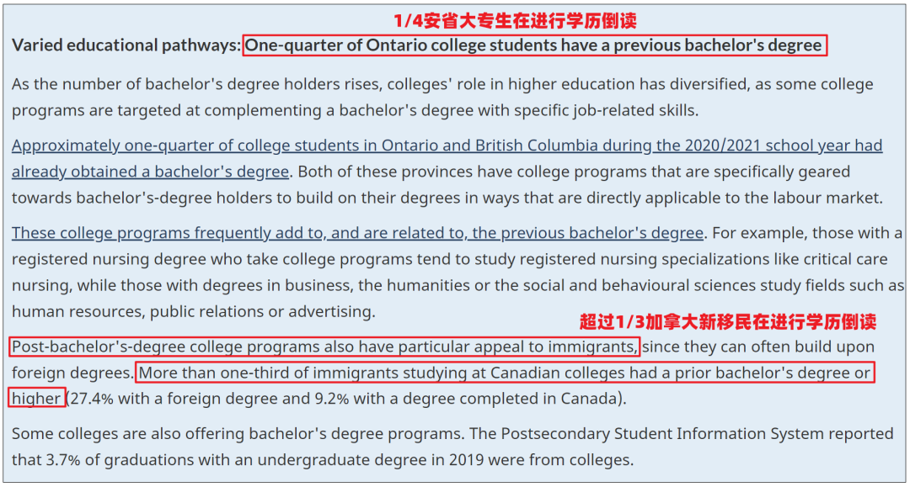
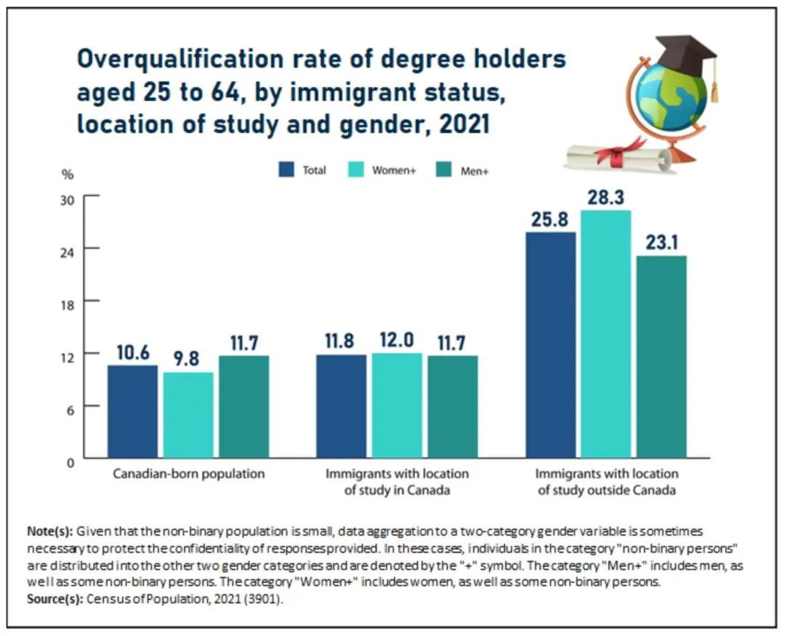
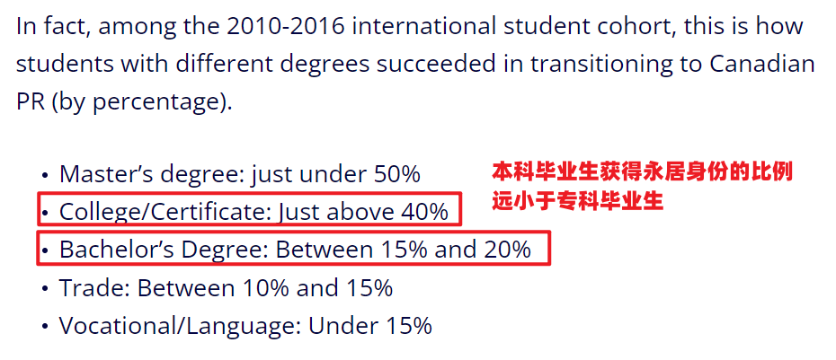
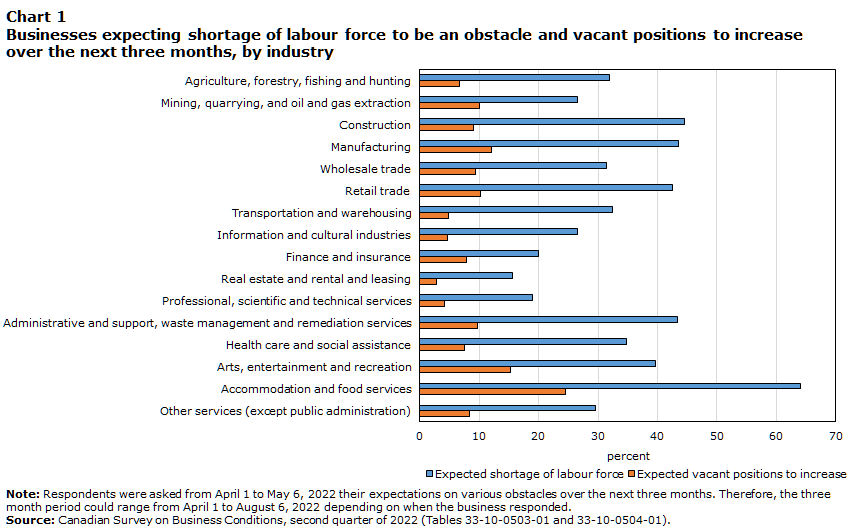
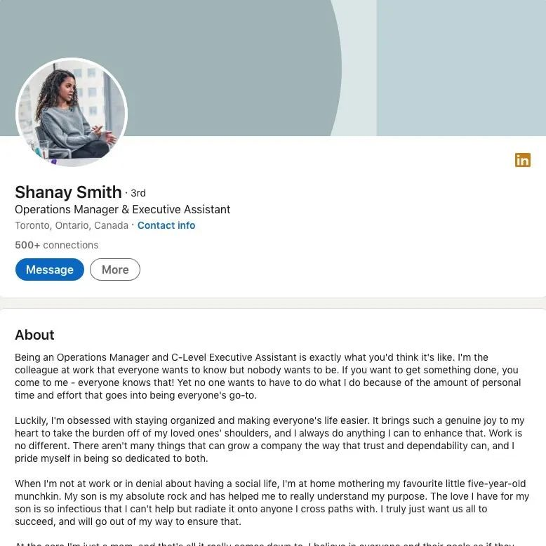

# 无标题

**链接地址:** http://mp.weixin.qq.com/s?__biz=MzI4NDYyNjAwNw==&mid=2247486795&idx=1&sn=735086eaf051ab28b3729ca21574bfd5&chksm=ebf9d073dc8e5965afc2a06d65200cf747723c783378d754d615e1fd83e9c20916b12533de30&mpshare=1&scene=2&srcid=0116Ej0s5l0pSQH2cNcpu5Ap&sharer_sharetime=1673830949286&sharer_shareid=77848a6b3852ae4dcb6c74ffee84743c#rd
**作者:** 关注我们
**获取时间:** 2025/8/28 19:21:24
**图片数量:** 26

---

## 原始HTML内容

<section style="box-sizing: border-box;font-size: 16px;"><section style="text-align: center;justify-content: center;display: flex;flex-flow: row nowrap;margin-top: 10px;margin-bottom: 10px;box-sizing: border-box;" powered-by="xiumi.us"><section style="display: inline-block;vertical-align: bottom;width: auto;align-self: flex-end;flex: 0 0 auto;min-width: 5%;max-width: 100%;height: auto;box-sizing: border-box;"><section style="text-align: left;justify-content: flex-start;display: flex;flex-flow: row nowrap;box-sizing: border-box;" powered-by="xiumi.us"><section style="display: inline-block;vertical-align: top;width: auto;align-self: flex-start;flex: 0 0 auto;min-width: 5%;max-width: 100%;height: auto;margin-left: -6px;box-sizing: border-box;"><section style="transform: rotateZ(45deg);-webkit-transform: rotateZ(45deg);-moz-transform: rotateZ(45deg);-o-transform: rotateZ(45deg);box-sizing: border-box;" powered-by="xiumi.us"><section style="text-align: center;box-sizing: border-box;"><section style="display: inline-block;width: 16px;height: 16px;vertical-align: top;overflow: hidden;border-style: solid;border-width: 3px 3px 0px 0px;border-color: rgb(237, 128, 15) rgb(237, 128, 15) rgb(69, 107, 176) rgb(69, 107, 176);box-sizing: border-box;"><section style="text-align: justify;box-sizing: border-box;" powered-by="xiumi.us">
 
</section></section></section></section></section><section style="display: inline-block;vertical-align: top;width: auto;align-self: flex-start;flex: 0 0 auto;min-width: 5%;max-width: 100%;height: auto;margin-left: -6px;box-sizing: border-box;"><section style="transform: rotateZ(45deg);-webkit-transform: rotateZ(45deg);-moz-transform: rotateZ(45deg);-o-transform: rotateZ(45deg);box-sizing: border-box;" powered-by="xiumi.us"><section style="text-align: center;box-sizing: border-box;"><section style="display: inline-block;width: 16px;height: 16px;vertical-align: top;overflow: hidden;border-style: solid;border-width: 3px 3px 0px 0px;border-color: rgb(237, 128, 15) rgb(237, 128, 15) rgb(69, 107, 176) rgb(69, 107, 176);box-sizing: border-box;"><section style="text-align: justify;box-sizing: border-box;" powered-by="xiumi.us">
 
</section></section></section></section></section><section style="display: inline-block;vertical-align: top;width: auto;align-self: flex-start;flex: 0 0 auto;min-width: 5%;max-width: 100%;height: auto;margin-left: -6px;box-sizing: border-box;"><section style="transform: rotateZ(45deg);-webkit-transform: rotateZ(45deg);-moz-transform: rotateZ(45deg);-o-transform: rotateZ(45deg);box-sizing: border-box;" powered-by="xiumi.us"><section style="text-align: center;box-sizing: border-box;"><section style="display: inline-block;width: 16px;height: 16px;vertical-align: top;overflow: hidden;border-style: solid;border-width: 3px 3px 0px 0px;border-color: rgb(237, 128, 15) rgb(237, 128, 15) rgb(69, 107, 176) rgb(69, 107, 176);box-sizing: border-box;"><section style="text-align: justify;box-sizing: border-box;" powered-by="xiumi.us">
 
</section></section></section></section></section></section></section><section style="display: inline-block;vertical-align: bottom;width: auto;align-self: flex-end;flex: 0 0 auto;min-width: 5%;max-width: 100%;height: auto;padding: 3px 23px;box-sizing: border-box;"><section style="text-align: justify;color: rgb(237, 128, 15);box-sizing: border-box;" powered-by="xiumi.us">
<strong style="box-sizing: border-box;">点击蓝字 关注我们</strong>
</section></section><section style="display: inline-block;vertical-align: bottom;width: auto;align-self: flex-end;flex: 0 0 auto;min-width: 5%;max-width: 100%;height: auto;box-sizing: border-box;"><section style="transform: perspective(0px);-webkit-transform: perspective(0px);-moz-transform: perspective(0px);-o-transform: perspective(0px);transform-style: flat;box-sizing: border-box;" powered-by="xiumi.us"><section style="text-align: left;justify-content: flex-start;display: flex;flex-flow: row nowrap;transform: rotateY(180deg);-webkit-transform: rotateY(180deg);-moz-transform: rotateY(180deg);-o-transform: rotateY(180deg);box-sizing: border-box;"><section style="display: inline-block;vertical-align: top;width: auto;align-self: flex-start;flex: 0 0 auto;min-width: 5%;max-width: 100%;height: auto;margin-left: -6px;box-sizing: border-box;"><section style="transform: rotateZ(45deg);-webkit-transform: rotateZ(45deg);-moz-transform: rotateZ(45deg);-o-transform: rotateZ(45deg);box-sizing: border-box;" powered-by="xiumi.us"><section style="text-align: center;box-sizing: border-box;"><section style="display: inline-block;width: 16px;height: 16px;vertical-align: top;overflow: hidden;border-style: solid;border-width: 3px 3px 0px 0px;border-color: rgb(237, 128, 15) rgb(237, 128, 15) rgb(69, 107, 176) rgb(69, 107, 176);box-sizing: border-box;"><section style="text-align: justify;box-sizing: border-box;" powered-by="xiumi.us">
 
</section></section></section></section></section><section style="display: inline-block;vertical-align: top;width: auto;align-self: flex-start;flex: 0 0 auto;min-width: 5%;max-width: 100%;height: auto;margin-left: -6px;box-sizing: border-box;"><section style="transform: rotateZ(45deg);-webkit-transform: rotateZ(45deg);-moz-transform: rotateZ(45deg);-o-transform: rotateZ(45deg);box-sizing: border-box;" powered-by="xiumi.us"><section style="text-align: center;box-sizing: border-box;"><section style="display: inline-block;width: 16px;height: 16px;vertical-align: top;overflow: hidden;border-style: solid;border-width: 3px 3px 0px 0px;border-color: rgb(237, 128, 15) rgb(237, 128, 15) rgb(69, 107, 176) rgb(69, 107, 176);box-sizing: border-box;"><section style="text-align: justify;box-sizing: border-box;" powered-by="xiumi.us">
 
</section></section></section></section></section><section style="display: inline-block;vertical-align: top;width: auto;align-self: flex-start;flex: 0 0 auto;min-width: 5%;max-width: 100%;height: auto;margin-left: -6px;box-sizing: border-box;"><section style="transform: rotateZ(45deg);-webkit-transform: rotateZ(45deg);-moz-transform: rotateZ(45deg);-o-transform: rotateZ(45deg);box-sizing: border-box;" powered-by="xiumi.us"><section style="text-align: center;box-sizing: border-box;"><section style="display: inline-block;width: 16px;height: 16px;vertical-align: top;overflow: hidden;border-style: solid;border-width: 3px 3px 0px 0px;border-color: rgb(237, 128, 15) rgb(237, 128, 15) rgb(69, 107, 176) rgb(69, 107, 176);box-sizing: border-box;"><section style="text-align: justify;box-sizing: border-box;" powered-by="xiumi.us">
 
</section></section></section></section></section></section></section></section></section>
 

 
<section style="text-align: left;justify-content: flex-start;display: flex;flex-flow: row nowrap;margin-top: 10px;margin-bottom: 4px;box-sizing: border-box;" powered-by="xiumi.us"><section style="display: inline-block;width: auto;vertical-align: top;align-self: flex-start;flex: 0 0 auto;min-width: 5%;max-width: 100%;height: auto;border-style: solid;border-width: 3px 0px 0px;border-color: rgb(237, 128, 15) rgb(69, 107, 176) rgb(69, 107, 176);padding-top: 4px;box-sizing: border-box;"><section style="justify-content: flex-start;display: flex;flex-flow: row nowrap;box-sizing: border-box;" powered-by="xiumi.us"><section style="display: inline-block;width: 100%;vertical-align: top;align-self: flex-start;flex: 0 0 auto;background-color: rgb(237, 128, 15);padding: 7px 20px;box-sizing: border-box;"><section style="text-align: justify;color: rgb(255, 255, 255);box-sizing: border-box;" powered-by="xiumi.us">
<strong style="box-sizing: border-box;">为什么“本科学历”在加拿大不香了？</strong>
</section></section></section></section></section><section style="margin-bottom: 8px;box-sizing: border-box;" powered-by="xiumi.us"><section style="background-color: rgb(237, 128, 15);height: 3px;box-sizing: border-box;"><svg viewBox="0 0 1 1" style="float:left;line-height:0;width:0;vertical-align:top;"></svg></section></section><section style="text-align: center;margin-top: 10px;margin-bottom: 10px;line-height: 0;box-sizing: border-box;" powered-by="xiumi.us"><section style="max-width: 100%;vertical-align: middle;display: inline-block;line-height: 0;box-sizing: border-box;"></section></section><section style="text-align: left;justify-content: flex-start;display: flex;flex-flow: row nowrap;margin-top: 10px;margin-bottom: 10px;box-sizing: border-box;" powered-by="xiumi.us"><section style="display: inline-block;width: 100%;vertical-align: top;align-self: flex-start;flex: 0 0 auto;background-color: rgb(237, 128, 15);padding-right: 6px;padding-bottom: 6px;padding-left: 6px;box-sizing: border-box;"><section style="margin-top: 10px;margin-bottom: 10px;transform: translate3d(19px, 0px, 0px);box-sizing: border-box;" powered-by="xiumi.us"><section style="text-align: justify;color: rgb(255, 255, 255);box-sizing: border-box;">
<strong style="box-sizing: border-box;">“学历倒读”现象在加拿大很普遍！</strong>
</section></section><section style="justify-content: flex-start;display: flex;flex-flow: row nowrap;box-sizing: border-box;" powered-by="xiumi.us"><section style="display: inline-block;width: 100%;vertical-align: top;align-self: flex-start;flex: 0 0 auto;background-color: rgb(255, 248, 244);padding: 23px;box-sizing: border-box;"><section style="text-align: justify;font-size: 14px;line-height: 2;letter-spacing: 2px;box-sizing: border-box;" powered-by="xiumi.us">
过去，大多数的中国留学来到加拿大留学都是为了更好的教育水平和更高的学历。因为深谙<strong style="box-sizing: border-box;">“知识改变命运”</strong>的中国学生家长们大多希望孩子能够<strong style="box-sizing: border-box;">手握高等学府毕业证的敲门金砖</strong>，去争取一个坐在办公室的“轻松”工作机会。 

 
</section><section style="text-align: center;margin-top: 10px;margin-bottom: 10px;line-height: 0;box-sizing: border-box;" powered-by="xiumi.us"><section style="max-width: 100%;vertical-align: middle;display: inline-block;line-height: 0;box-sizing: border-box;"></section></section><section style="text-align: justify;font-size: 14px;line-height: 2;letter-spacing: 2px;box-sizing: border-box;" powered-by="xiumi.us">
 

加拿大是世界上拥有最高教育水平的国家之一：<strong style="box-sizing: border-box;">超过一半的劳动年龄人口具有专科以上学历</strong>。然而这背后却隐藏着一个十分有趣的显现：本科生毕业后再读大专课程的比例很高，尤其在新移民群体中更为普遍，其<strong style="box-sizing: border-box;">“学历倒读”的比例甚至超过1/3</strong>！

 
</section><section style="text-align: center;margin-top: 10px;margin-bottom: 10px;line-height: 0;box-sizing: border-box;" powered-by="xiumi.us"><section style="max-width: 100%;vertical-align: middle;display: inline-block;line-height: 0;box-sizing: border-box;"></section></section><section style="text-align: center;color: rgb(121, 121, 121);font-size: 12px;box-sizing: border-box;" powered-by="xiumi.us">
信息来源：https://www150.statcan.gc.ca/n1/daily-quotidien/221130/dq221130a-eng.htm

（点击放大图片）
</section><section style="text-align: justify;font-size: 14px;line-height: 2;letter-spacing: 2px;box-sizing: border-box;" powered-by="xiumi.us">
 

<strong style="box-sizing: border-box;">“学历倒读”</strong>（Post-bachelor's-degree college）指的就是<strong style="box-sizing: border-box;">本科毕业后再修习大专课程并获取专科学位</strong>的情况。BadaB在和留学生、毕业生和求职者的咨询中也时常遇到这个问题：“我学的本科专业不好求职/移民，我应该再去拿个好求职/移民的专科毕业证吗？”

 
</section><section style="text-align: center;margin-top: 10px;margin-bottom: 10px;line-height: 0;box-sizing: border-box;" powered-by="xiumi.us"><section style="max-width: 100%;vertical-align: middle;display: inline-block;line-height: 0;box-sizing: border-box;"></section></section><section style="text-align: justify;font-size: 14px;line-height: 2;letter-spacing: 2px;box-sizing: border-box;" powered-by="xiumi.us">
 

今天BadaB将帮助各位读者朋友根据这些因素去分析站在教育和职业选择人生重大交叉口的<strong style="box-sizing: border-box;">“我，到底该选择学历倒读吗？”</strong>
</section></section></section></section></section>
 
<section style="text-align: left;justify-content: flex-start;display: flex;flex-flow: row nowrap;margin-top: 10px;margin-bottom: 10px;box-sizing: border-box;" powered-by="xiumi.us"><section style="display: inline-block;width: 100%;vertical-align: top;align-self: flex-start;flex: 0 0 auto;background-color: rgb(237, 128, 15);padding-right: 6px;padding-bottom: 6px;padding-left: 6px;box-sizing: border-box;"><section style="margin-top: 10px;margin-bottom: 10px;transform: translate3d(19px, 0px, 0px);box-sizing: border-box;" powered-by="xiumi.us"><section style="text-align: justify;color: rgb(255, 255, 255);box-sizing: border-box;">
<strong style="box-sizing: border-box;">为什么会出现学历倒读的情况？</strong>
</section></section><section style="justify-content: flex-start;display: flex;flex-flow: row nowrap;box-sizing: border-box;" powered-by="xiumi.us"><section style="display: inline-block;width: 100%;vertical-align: top;align-self: flex-start;flex: 0 0 auto;background-color: rgb(255, 248, 244);padding: 23px;box-sizing: border-box;"><section style="text-align: justify;box-sizing: border-box;" powered-by="xiumi.us">
 
</section><section style="justify-content: flex-start;display: flex;flex-flow: row nowrap;margin-top: 10px;margin-bottom: 10px;transform: translate3d(5px, 0px, 0px);box-sizing: border-box;" powered-by="xiumi.us"><section style="display: inline-block;vertical-align: middle;width: auto;background-color: rgb(217, 68, 1);min-width: 5%;max-width: 100%;flex: 0 0 auto;height: auto;align-self: center;padding: 4px;box-sizing: border-box;"><section style="font-size: 19px;margin-right: 0%;margin-left: 0%;text-align: center;box-sizing: border-box;" powered-by="xiumi.us"><section style="display: inline-block;border-width: 1px;border-style: solid;border-color: rgb(255, 248, 244);background-color: rgb(255, 248, 244);width: 1.8em;height: 1.8em;line-height: 1.8em;border-radius: 100%;margin-left: auto;margin-right: auto;font-size: 15px;color: rgb(188, 65, 65);box-sizing: border-box;">
<strong style="box-sizing: border-box;">1</strong>
</section></section></section><section style="display: inline-block;vertical-align: middle;width: auto;align-self: center;flex: 0 0 auto;min-width: 5%;max-width: 100%;height: auto;margin-left: 11px;box-sizing: border-box;"><section style="text-align: justify;box-sizing: border-box;" powered-by="xiumi.us">
<strong style="box-sizing: border-box;">低学历歧视造就“学历崇拜”</strong>
</section></section></section><section style="text-align: justify;box-sizing: border-box;" powered-by="xiumi.us">
 
</section><section style="text-align: justify;font-size: 14px;line-height: 2;letter-spacing: 2px;box-sizing: border-box;" powered-by="xiumi.us">
<strong style="box-sizing: border-box;">“低学历歧视”</strong>这个问题几乎在世界上每个国家都会出现，因为在人们的固有印象中，只有拥有高学历的人群才配从事光鲜亮丽的工作，获取丰厚的薪资福利。但加拿大偏偏是一个<strong style="box-sizing: border-box;">老龄化严重，技工类人才紧缺</strong>的国家。高市场需求不断拉高“蓝领”群体的收入，让他们在获取优厚薪酬同时拥有<strong style="box-sizing: border-box;">极高的岗位稳定性和议价权</strong>。这也成为许多人决定学历倒读，从事技工行业的主要原因。 

 
</section><section style="text-align: center;margin-top: 10px;margin-bottom: 10px;line-height: 0;box-sizing: border-box;" powered-by="xiumi.us"><section style="max-width: 100%;vertical-align: middle;display: inline-block;line-height: 0;box-sizing: border-box;"></section></section><section style="text-align: justify;font-size: 14px;line-height: 2;letter-spacing: 2px;box-sizing: border-box;" powered-by="xiumi.us">
 
</section><section style="justify-content: flex-start;display: flex;flex-flow: row nowrap;margin-top: 10px;margin-bottom: 10px;transform: translate3d(5px, 0px, 0px);box-sizing: border-box;" powered-by="xiumi.us"><section style="display: inline-block;vertical-align: middle;width: auto;background-color: rgb(217, 68, 1);min-width: 5%;max-width: 100%;flex: 0 0 auto;height: auto;align-self: center;padding: 4px;box-sizing: border-box;"><section style="font-size: 19px;margin-right: 0%;margin-left: 0%;text-align: center;box-sizing: border-box;" powered-by="xiumi.us"><section style="display: inline-block;border-width: 1px;border-style: solid;border-color: rgb(255, 248, 244);background-color: rgb(255, 248, 244);width: 1.8em;height: 1.8em;line-height: 1.8em;border-radius: 100%;margin-left: auto;margin-right: auto;font-size: 15px;color: rgb(188, 65, 65);box-sizing: border-box;">
<strong style="box-sizing: border-box;">2</strong>
</section></section></section><section style="display: inline-block;vertical-align: middle;width: auto;align-self: center;flex: 0 0 auto;min-width: 5%;max-width: 100%;height: auto;margin-left: 11px;box-sizing: border-box;"><section style="text-align: justify;box-sizing: border-box;" powered-by="xiumi.us">
<strong style="box-sizing: border-box;">加拿大教育和就业资源分配不均</strong>
</section></section></section><section style="text-align: justify;font-size: 14px;line-height: 2;letter-spacing: 2px;box-sizing: border-box;" powered-by="xiumi.us">
 

加拿大的教育资源充沛，且国家积极鼓励民众接受高等教育。几乎每一位学生只要愿意，都可以拥有接受<strong style="box-sizing: border-box;">“Post-secondary education”（高等教育）</strong>的机会。但这也造成一个严重的社会问题：尚在发展中的经济市场无法为如此多手握本科或以上文凭的毕业生们提供合适的岗位，大本分人毕业后只能去竞争<strong style="box-sizing: border-box;">“overqualified”（大材小用）</strong>的工作职位，让教育和工作的投入产出不成正比的同时，也逐步增加着高学历毕业生的就业难度。

 
</section><section style="text-align: center;margin-top: 10px;margin-bottom: 10px;line-height: 0;box-sizing: border-box;" powered-by="xiumi.us"><section style="max-width: 100%;vertical-align: middle;display: inline-block;line-height: 0;width: 90%;height: auto;box-sizing: border-box;"></section></section><section style="text-align: center;color: rgb(121, 121, 121);font-size: 12px;box-sizing: border-box;" powered-by="xiumi.us">
加拿大移民海外学历过高比例已超过1/4 

（点击放大图片）
</section><section style="text-align: justify;font-size: 14px;line-height: 2;letter-spacing: 2px;box-sizing: border-box;" powered-by="xiumi.us">
 
</section><section style="justify-content: flex-start;display: flex;flex-flow: row nowrap;margin-top: 10px;margin-bottom: 10px;transform: translate3d(5px, 0px, 0px);box-sizing: border-box;" powered-by="xiumi.us"><section style="display: inline-block;vertical-align: middle;width: auto;background-color: rgb(217, 68, 1);min-width: 5%;max-width: 100%;flex: 0 0 auto;height: auto;align-self: center;padding: 4px;box-sizing: border-box;"><section style="font-size: 19px;margin-right: 0%;margin-left: 0%;text-align: center;box-sizing: border-box;" powered-by="xiumi.us"><section style="display: inline-block;border-width: 1px;border-style: solid;border-color: rgb(255, 248, 244);background-color: rgb(255, 248, 244);width: 1.8em;height: 1.8em;line-height: 1.8em;border-radius: 100%;margin-left: auto;margin-right: auto;font-size: 15px;color: rgb(188, 65, 65);box-sizing: border-box;">
<strong style="box-sizing: border-box;">3</strong>
</section></section></section><section style="display: inline-block;vertical-align: middle;width: auto;align-self: center;flex: 0 0 auto;min-width: 5%;max-width: 100%;height: auto;margin-left: 11px;box-sizing: border-box;"><section style="text-align: justify;box-sizing: border-box;" powered-by="xiumi.us">
<strong style="box-sizing: border-box;">自我教育和就业规划不清晰</strong>
</section></section></section><section style="text-align: justify;font-size: 14px;line-height: 2;letter-spacing: 2px;box-sizing: border-box;" powered-by="xiumi.us">
 

大部分学生在自己未成年时就需要申请决定自己人生发展方向的学校和专业，但对于几乎<strong style="box-sizing: border-box;">没有社会经验且对职业规划没有概念</strong>的他们来说，选择一个不合适的规划方向还是很常见的。

 

一些学生硬着头皮艰难完成四年的学业，再在毕业找工作时碰一鼻子灰，甚至因为舍不得几年的金钱和时间投入，而一辈子从事自己不擅长也不喜欢的工作……因此，在意识到自己教育和职业规划出现问题时<strong style="box-sizing: border-box;">“及时止损”</strong>，去选择一个更适合自己的专业和工作领域成为一些打工人步入社会后的一次必要的调整。

 
</section><section style="text-align: center;margin-top: 10px;margin-bottom: 10px;line-height: 0;box-sizing: border-box;" powered-by="xiumi.us"><section style="max-width: 100%;vertical-align: middle;display: inline-block;line-height: 0;box-sizing: border-box;"></section></section><section style="text-align: justify;font-size: 14px;line-height: 2;letter-spacing: 2px;box-sizing: border-box;" powered-by="xiumi.us">
 
</section><section style="justify-content: flex-start;display: flex;flex-flow: row nowrap;margin-top: 10px;margin-bottom: 10px;transform: translate3d(5px, 0px, 0px);box-sizing: border-box;" powered-by="xiumi.us"><section style="display: inline-block;vertical-align: middle;width: auto;background-color: rgb(217, 68, 1);min-width: 5%;max-width: 100%;flex: 0 0 auto;height: auto;align-self: center;padding: 4px;box-sizing: border-box;"><section style="font-size: 19px;margin-right: 0%;margin-left: 0%;text-align: center;box-sizing: border-box;" powered-by="xiumi.us"><section style="display: inline-block;border-width: 1px;border-style: solid;border-color: rgb(255, 248, 244);background-color: rgb(255, 248, 244);width: 1.8em;height: 1.8em;line-height: 1.8em;border-radius: 100%;margin-left: auto;margin-right: auto;font-size: 15px;color: rgb(188, 65, 65);box-sizing: border-box;">
<strong style="box-sizing: border-box;">4</strong>
</section></section></section><section style="display: inline-block;vertical-align: middle;width: auto;align-self: center;flex: 0 0 auto;min-width: 5%;max-width: 100%;height: auto;margin-left: 11px;box-sizing: border-box;"><section style="text-align: justify;box-sizing: border-box;" powered-by="xiumi.us">
<strong style="box-sizing: border-box;">加拿大专科更容易移民</strong>
</section></section></section><section style="text-align: justify;font-size: 14px;line-height: 2;letter-spacing: 2px;box-sizing: border-box;" powered-by="xiumi.us">
 

除了教育和就业问题之外，留学毕业生还面临着移民加拿大的压力。毕竟毕业生们只拥有一到三年的开放式毕业工签，如果不在这段时间内顺利获取加拿大永居的身份，今后想要继续在加拿大工作，其工作签证的续签将会成为一个麻烦的问题。

 
</section><section style="text-align: center;margin-top: 10px;margin-bottom: 10px;line-height: 0;box-sizing: border-box;" powered-by="xiumi.us"><section style="max-width: 100%;vertical-align: middle;display: inline-block;line-height: 0;box-sizing: border-box;"></section></section><section style="text-align: justify;font-size: 14px;line-height: 2;letter-spacing: 2px;box-sizing: border-box;" powered-by="xiumi.us">
 

加拿大由于其独特的就业市场结构和移民邀请政策，本科<strong style="box-sizing: border-box;">国际毕业生获得永居身份的比例远小于专科国际毕业生</strong>。而2023年开始，新的移民政策改革将更加偏向于医疗、建筑、教育、IT等<strong style="box-sizing: border-box;">紧缺职业</strong>的从业人员，这无疑增加了许多“学错”专业的留学生们留在加拿大的难度，因此选择倒读“紧缺专业”去获取一个专科学历成为他们<strong style="box-sizing: border-box;">获得加拿大永居的“捷径”</strong>。
</section></section></section></section></section>
 
<section style="text-align: left;justify-content: flex-start;display: flex;flex-flow: row nowrap;margin-top: 10px;margin-bottom: 10px;box-sizing: border-box;" powered-by="xiumi.us"><section style="display: inline-block;width: 100%;vertical-align: top;align-self: flex-start;flex: 0 0 auto;background-color: rgb(237, 128, 15);padding-right: 6px;padding-bottom: 6px;padding-left: 6px;box-sizing: border-box;"><section style="margin-top: 10px;margin-bottom: 10px;transform: translate3d(19px, 0px, 0px);box-sizing: border-box;" powered-by="xiumi.us"><section style="text-align: justify;color: rgb(255, 255, 255);box-sizing: border-box;">
<strong style="box-sizing: border-box;">我应该为了就业/移民进行学历倒读吗？</strong>
</section></section><section style="justify-content: flex-start;display: flex;flex-flow: row nowrap;box-sizing: border-box;" powered-by="xiumi.us"><section style="display: inline-block;width: 100%;vertical-align: top;align-self: flex-start;flex: 0 0 auto;background-color: rgb(255, 248, 244);padding: 23px;box-sizing: border-box;"><section style="text-align: justify;font-size: 14px;line-height: 2;letter-spacing: 2px;box-sizing: border-box;" powered-by="xiumi.us">
BadaB经常在和客户朋友们的咨询中被问及“我是否应该为了就业或移民而选择学历倒读”。想回答这个问题需要结合个人的情况进行分析，以下<strong style="box-sizing: border-box;">三个原因</strong>是大家最需要考虑到的因素： 

 
</section><section style="text-align: justify;box-sizing: border-box;" powered-by="xiumi.us">
 
</section><section style="justify-content: flex-start;display: flex;flex-flow: row nowrap;margin-top: 10px;margin-bottom: 10px;transform: translate3d(5px, 0px, 0px);box-sizing: border-box;" powered-by="xiumi.us"><section style="display: inline-block;vertical-align: middle;width: auto;background-color: rgb(217, 68, 1);min-width: 5%;max-width: 100%;flex: 0 0 auto;height: auto;align-self: center;padding: 4px;box-sizing: border-box;"><section style="font-size: 19px;margin-right: 0%;margin-left: 0%;text-align: center;box-sizing: border-box;" powered-by="xiumi.us"><section style="display: inline-block;border-width: 1px;border-style: solid;border-color: rgb(255, 248, 244);background-color: rgb(255, 248, 244);width: 1.8em;height: 1.8em;line-height: 1.8em;border-radius: 100%;margin-left: auto;margin-right: auto;font-size: 15px;color: rgb(188, 65, 65);box-sizing: border-box;">
<strong style="box-sizing: border-box;">1</strong>
</section></section></section><section style="display: inline-block;vertical-align: middle;width: auto;align-self: center;flex: 0 0 auto;min-width: 5%;max-width: 100%;height: auto;margin-left: 11px;box-sizing: border-box;"><section style="text-align: justify;box-sizing: border-box;" powered-by="xiumi.us">
<strong style="box-sizing: border-box;">“好找工作”是学历倒读的理由吗？</strong>
</section></section></section><section style="text-align: justify;box-sizing: border-box;" powered-by="xiumi.us">
 
</section><section style="text-align: justify;font-size: 14px;line-height: 2;letter-spacing: 2px;box-sizing: border-box;" powered-by="xiumi.us">
找工作的难易程度成为许多本科毕业生计划学历倒读的重要理由，特别是那些无法通过本科学历顺利获取对口工作的毕业生们。由于加拿大劳动力稀缺程度在产业间分配严重不均，不同专业找工作的难易程度也确实天差地别，但是BadaB在这里想要提醒各位，能否找到一份心仪的工作，更多的还是<strong style="box-sizing: border-box;">依靠个人的业务能力和工作经验</strong>。

 
</section><section style="text-align: center;margin-top: 10px;margin-bottom: 10px;line-height: 0;box-sizing: border-box;" powered-by="xiumi.us"><section style="max-width: 100%;vertical-align: middle;display: inline-block;line-height: 0;box-sizing: border-box;"></section></section><section style="text-align: center;color: rgb(121, 121, 121);font-size: 12px;box-sizing: border-box;" powered-by="xiumi.us">
加拿大劳动力紧缺产业列表 

（点击放大图片）
</section><section style="text-align: justify;font-size: 14px;line-height: 2;letter-spacing: 2px;box-sizing: border-box;" powered-by="xiumi.us">
 

就算你的毕业证为你幸运地敲开了就业的大门，但你的职场发展和未来职业生涯的走向还要靠你个人的努力。如果你很喜欢自己所学的专业，也期待在这个领域有所发展，请不要把学历倒读排在Plan B的首位，试着通过<strong style="box-sizing: border-box;">积极的职场人脉社交和相关工作经验积累</strong>去为自己多争取一次的工作机会吧！

 
</section><section style="text-align: justify;font-size: 14px;line-height: 2;letter-spacing: 2px;box-sizing: border-box;" powered-by="xiumi.us">
 
</section><section style="justify-content: flex-start;display: flex;flex-flow: row nowrap;margin-top: 10px;margin-bottom: 10px;transform: translate3d(5px, 0px, 0px);box-sizing: border-box;" powered-by="xiumi.us"><section style="display: inline-block;vertical-align: middle;width: auto;background-color: rgb(217, 68, 1);min-width: 5%;max-width: 100%;flex: 0 0 auto;height: auto;align-self: center;padding: 4px;box-sizing: border-box;"><section style="font-size: 19px;margin-right: 0%;margin-left: 0%;text-align: center;box-sizing: border-box;" powered-by="xiumi.us"><section style="display: inline-block;border-width: 1px;border-style: solid;border-color: rgb(255, 248, 244);background-color: rgb(255, 248, 244);width: 1.8em;height: 1.8em;line-height: 1.8em;border-radius: 100%;margin-left: auto;margin-right: auto;font-size: 15px;color: rgb(188, 65, 65);box-sizing: border-box;">
<strong style="box-sizing: border-box;">2</strong>
</section></section></section><section style="display: inline-block;vertical-align: middle;width: auto;align-self: center;flex: 0 0 auto;min-width: 5%;max-width: 100%;height: auto;margin-left: 11px;box-sizing: border-box;"><section style="text-align: justify;box-sizing: border-box;" powered-by="xiumi.us">
<strong style="box-sizing: border-box;">“热门专业”是学历倒读的理由吗？</strong>
</section></section></section><section style="text-align: justify;font-size: 14px;line-height: 2;letter-spacing: 2px;box-sizing: border-box;" powered-by="xiumi.us">
 

由于自己“年少无知”，不懂“社会险恶”而在高中时申报了所谓<strong style="box-sizing: border-box;">“冷门”专业，甚至“天坑”专业</strong>的毕业生们，在找工作时向BadaB频倒苦水，因此想要倒读一个所谓“热门专业”去感受一下被雇主竞价出Offer的快乐，以此弥补这些年来在求职和职场上所遇到的不顺。

 

BadaB想要在这里提醒各位，在选择是否真的要<strong style="box-sizing: border-box;">彻底扭转自己的职业规划</strong>去倒读一个学历前还请三思。

 
</section><section style="margin: 10px 0%;justify-content: flex-start;display: flex;flex-flow: row nowrap;box-sizing: border-box;" powered-by="xiumi.us"><section style="display: inline-block;vertical-align: middle;width: 50%;padding-right: 5px;align-self: center;flex: 0 0 auto;box-sizing: border-box;"><section style="text-align: center;margin-right: 0%;margin-left: 0%;line-height: 0;box-sizing: border-box;" powered-by="xiumi.us"><section style="max-width: 100%;vertical-align: middle;display: inline-block;line-height: 0;box-sizing: border-box;"></section></section></section><section style="display: inline-block;vertical-align: middle;width: 50%;padding-left: 5px;align-self: center;flex: 0 0 auto;box-sizing: border-box;"><section style="text-align: center;margin-right: 0%;margin-left: 0%;line-height: 0;box-sizing: border-box;" powered-by="xiumi.us"><section style="max-width: 100%;vertical-align: middle;display: inline-block;line-height: 0;box-sizing: border-box;"></section></section></section></section><section style="margin: 10px 0%;justify-content: flex-start;display: flex;flex-flow: row nowrap;box-sizing: border-box;" powered-by="xiumi.us"><section style="display: inline-block;vertical-align: middle;width: 50%;padding-right: 5px;align-self: center;flex: 0 0 auto;box-sizing: border-box;"><section style="text-align: center;margin-right: 0%;margin-left: 0%;line-height: 0;box-sizing: border-box;" powered-by="xiumi.us"><section style="max-width: 100%;vertical-align: middle;display: inline-block;line-height: 0;box-sizing: border-box;"></section></section></section><section style="display: inline-block;vertical-align: middle;width: 50%;padding-left: 5px;align-self: center;flex: 0 0 auto;box-sizing: border-box;"><section style="text-align: center;margin-right: 0%;margin-left: 0%;line-height: 0;box-sizing: border-box;" powered-by="xiumi.us"><section style="max-width: 100%;vertical-align: middle;display: inline-block;line-height: 0;box-sizing: border-box;"></section></section></section></section><section style="text-align: justify;font-size: 14px;line-height: 2;letter-spacing: 2px;box-sizing: border-box;" powered-by="xiumi.us">
 

我是否真的感兴趣这个新的职业方向？我的技能学习和经验积累是否适合在这个新的职业领域发展？这些沉默成本的损失和额外的金钱精力的投入对于我的职业生涯来说是值得的吗？

 

想要转业热门专业<strong style="box-sizing: border-box;">并非只有回到学校再造这一个选择</strong>。通过在业余时间就可以完成的网络课程和证书先学习部分技能，在工作中找机会应用实践，再通过一部分“Transferable Skills”（可转移技能）的帮助，或许可以让你在职业生涯的<strong style="box-sizing: border-box;">某个节点开启新的职场赛道</strong>。

 
</section><section style="justify-content: flex-start;display: flex;flex-flow: row nowrap;margin-top: 10px;margin-bottom: 10px;transform: translate3d(5px, 0px, 0px);box-sizing: border-box;" powered-by="xiumi.us"><section style="display: inline-block;vertical-align: middle;width: auto;background-color: rgb(217, 68, 1);min-width: 5%;max-width: 100%;flex: 0 0 auto;height: auto;align-self: center;padding: 4px;box-sizing: border-box;"><section style="font-size: 19px;margin-right: 0%;margin-left: 0%;text-align: center;box-sizing: border-box;" powered-by="xiumi.us"><section style="display: inline-block;border-width: 1px;border-style: solid;border-color: rgb(255, 248, 244);background-color: rgb(255, 248, 244);width: 1.8em;height: 1.8em;line-height: 1.8em;border-radius: 100%;margin-left: auto;margin-right: auto;font-size: 15px;color: rgb(188, 65, 65);box-sizing: border-box;">
<strong style="box-sizing: border-box;">3</strong>
</section></section></section><section style="display: inline-block;vertical-align: middle;width: auto;align-self: center;flex: 0 0 auto;min-width: 5%;max-width: 100%;height: auto;margin-left: 11px;box-sizing: border-box;"><section style="text-align: justify;box-sizing: border-box;" powered-by="xiumi.us">
<strong style="box-sizing: border-box;">“容易移民”是学历倒读的理由吗？</strong>
</section></section></section><section style="text-align: justify;font-size: 14px;line-height: 2;letter-spacing: 2px;box-sizing: border-box;" powered-by="xiumi.us">
 

近年来，选择学历倒读的趋势在<strong style="box-sizing: border-box;">大龄中国留学生</strong>的群体中十分常见。拥有本科甚至更高学历的他们在加拿大没有工作经验，想要一步到位的获取加国的枫叶卡是非常具有挑战性的，因此用最低的成本和最少的时间获取一份加拿大的学历成为许多人移居本国的<strong style="box-sizing: border-box;">唯一跳板</strong>。

 
</section><section style="text-align: center;margin-top: 10px;margin-bottom: 10px;line-height: 0;box-sizing: border-box;" powered-by="xiumi.us"><section style="max-width: 100%;vertical-align: middle;display: inline-block;line-height: 0;box-sizing: border-box;"></section></section><section style="text-align: justify;font-size: 14px;line-height: 2;letter-spacing: 2px;box-sizing: border-box;" powered-by="xiumi.us">
 

在顺利获取加国永居身份后，你将拥有<strong style="box-sizing: border-box;">多重职业发展的选择和更广阔的的就业前景</strong>，千万不要把自己局限在一份毕业证书带给你的职场起跑线上。
</section><section style="text-align: justify;box-sizing: border-box;" powered-by="xiumi.us">
 
</section></section></section></section></section>
 
<section style="text-align: left;justify-content: flex-start;display: flex;flex-flow: row nowrap;margin-top: 10px;margin-bottom: 10px;box-sizing: border-box;" powered-by="xiumi.us"><section style="display: inline-block;width: 100%;vertical-align: top;align-self: flex-start;flex: 0 0 auto;background-color: rgb(237, 128, 15);padding-right: 6px;padding-bottom: 6px;padding-left: 6px;box-sizing: border-box;"><section style="margin-top: 10px;margin-bottom: 10px;transform: translate3d(19px, 0px, 0px);box-sizing: border-box;" powered-by="xiumi.us"><section style="text-align: justify;color: rgb(255, 255, 255);box-sizing: border-box;">
<strong style="box-sizing: border-box;">清晰+可执行的教育和职业规划才是必须！</strong>
</section></section><section style="justify-content: flex-start;display: flex;flex-flow: row nowrap;box-sizing: border-box;" powered-by="xiumi.us"><section style="display: inline-block;width: 100%;vertical-align: top;align-self: flex-start;flex: 0 0 auto;background-color: rgb(255, 248, 244);padding: 23px;box-sizing: border-box;"><section style="text-align: justify;font-size: 14px;line-height: 2;letter-spacing: 2px;box-sizing: border-box;" powered-by="xiumi.us">
是否要进行学历倒读，对于打工人们来说是一个<strong style="box-sizing: border-box;">无奈又艰难的决定</strong>。这是<strong style="box-sizing: border-box;">对自己没有做好教育和职业规划所偿还的代价</strong>，可能意味着大量时间精力的再投入，职业生涯的重新开始，和人生预期的重大调整。

 

但请明白，我们所持有的文凭和所从事的工作永远都不会让我们的职业生涯一锤定音。<strong style="box-sizing: border-box;">在职业发展的进程中我们要做的是升级综合能力去提升自己的职场竞争力，扩大眼界去适应劳动力市场的转变，抓住机遇去站上时代发展的风口。</strong>

 
</section><section style="line-height: 2;letter-spacing: 2px;text-align: justify;box-sizing: border-box;" powered-by="xiumi.us">
其实根据个人情况、企业和产业发展进行职业再规划是非常正常的。但在就业环境产生巨大变动，信息繁杂影响个人判断的时代，很容易让我们在<strong style="box-sizing: border-box;">冲动下做出不理智的决定</strong>，让打工人被眼前的幻想蒙蔽，偏离到不合理的规划方向上去。 

 
</section><section style="text-align: center;margin-top: 10px;margin-bottom: 10px;line-height: 0;box-sizing: border-box;" powered-by="xiumi.us"><section style="max-width: 100%;vertical-align: middle;display: inline-block;line-height: 0;width: 50%;height: auto;box-sizing: border-box;"></section></section><section style="line-height: 2;letter-spacing: 2px;text-align: justify;box-sizing: border-box;" powered-by="xiumi.us">
 

别怕，<strong style="box-sizing: border-box;">BadaB</strong> 可以帮助大家进行引导。如果你对职业规划内容感兴趣，想要通过<strong style="box-sizing: border-box;">专</strong><strong style="box-sizing: border-box;">业HR丰富的经验</strong>给自己指明方向，请扫描上方二维码进入我们的20门在线求职网课，重点对于<strong style="box-sizing: border-box;">第三模块</strong><strong style="box-sizing: border-box;">《Career Change》</strong>进行学习。

 
</section><section style="text-align: center;margin-top: 10px;margin-bottom: 10px;line-height: 0;box-sizing: border-box;" powered-by="xiumi.us"><section style="max-width: 100%;vertical-align: middle;display: inline-block;line-height: 0;width: 90%;height: auto;box-sizing: border-box;"></section></section><section style="font-size: 14px;line-height: 2;letter-spacing: 2px;text-align: justify;box-sizing: border-box;" powered-by="xiumi.us">
 

希望大家在学习完20门网课以后可以对加拿大的就业环境和职业发展有一个充分的认识，<strong style="box-sizing: border-box;">重新评估自己职业发展的目标和预期</strong>，做出最适合自己的正确选择。

 

如果你依然对自己的职业前景感到迷茫，也欢迎戳开我们的微信公众号后台，和我们联系取得<strong style="box-sizing: border-box;">一对一咨询的机会</strong>！
</section></section></section></section></section><section style="font-size: 14px;padding-right: 15px;padding-left: 15px;line-height: 2;letter-spacing: 2px;box-sizing: border-box;" powered-by="xiumi.us">
 
</section>
 
<section style="margin-top: 10px;margin-bottom: 10px;box-sizing: border-box;" powered-by="xiumi.us"><section style="width: 100%;text-align: left;box-sizing: border-box;"><section style="display: inline-block;vertical-align: top;max-width: 100%;border-radius: 3px 3px 0px 0px;margin-right: 3px;background-color: rgb(237, 128, 15);color: rgb(255, 255, 255);font-size: 18px;padding-left: 6px;padding-right: 6px;box-sizing: border-box;">
<strong style="box-sizing: border-box;">往期精选</strong>
</section> </section><section style="width: 100%;font-size: 0px;margin-top: -2px;box-sizing: border-box;"><section style="display: inline-block;vertical-align: top;width: 100%;margin-right: -6px;border-bottom: 2px solid rgb(237, 128, 15);box-sizing: border-box;"><svg viewBox="0 0 1 1" style="float:left;line-height:0;width:0;vertical-align:top;"></svg></section><section style="display: inline-block;vertical-align: top;margin-top: -2px;width: 6px;height: 6px;border-radius: 50%;background-color: rgb(237, 128, 15);box-sizing: border-box;"><svg viewBox="0 0 1 1" style="float:left;line-height:0;width:0;vertical-align:top;"></svg></section></section></section><section style="margin: 10px 0%;text-align: left;justify-content: flex-start;display: flex;flex-flow: row nowrap;box-sizing: border-box;" powered-by="xiumi.us"><section style="display: inline-block;width: 100%;vertical-align: top;background-position: 96.59% 62.0687%;background-repeat: repeat;background-size: 100.637%;background-attachment: scroll;padding: 30px;align-self: flex-start;flex: 0 0 auto;background-image: url(&quot;https://mmbiz.qpic.cn/mmbiz_png/cY0qSDjdkFdeCdib7FUzRtKOU5BrQkN53HvnWV7U8kRyt7459wYib8o0DLMERK5058fQvdGsVoEleWwm3BYnpsGg/640?wx_fmt=png&quot;);box-sizing: border-box;"><section style="text-align: justify;justify-content: flex-start;display: flex;flex-flow: row nowrap;box-sizing: border-box;" powered-by="xiumi.us"><section style="display: inline-block;width: 100%;vertical-align: top;background-color: rgba(188, 65, 65, 0.22);padding: 10px;border-width: 0px;border-style: none;border-color: rgb(62, 62, 62);align-self: flex-start;flex: 0 0 auto;box-sizing: border-box;"><section style="text-align: center;color: rgb(255, 255, 255);font-size: 14px;box-sizing: border-box;" powered-by="xiumi.us">
<a target="_blank" href="http://mp.weixin.qq.com/s?__biz=MzI4NDYyNjAwNw==&amp;mid=2247486652&amp;idx=1&amp;sn=ec7f3f523b6e5b6f11cc29d7fe313fcd&amp;chksm=ebf9d184dc8e5892d2a970f4bdbde50d6de039167080d2498ede6b38b9cea3fc6c7c35d7d841&amp;scene=21#wechat_redirect" textvalue="加国留学生打工必读！什么样的“神仙工作”才最适合你呢？" linktype="text" imgurl="" imgdata="null" data-itemshowtype="0" tab="innerlink" style="color: rgb(255, 255, 255);" data-linktype="2"><strong style="box-sizing: border-box;">加国留学生打工必读！</strong></a>

<a target="_blank" href="http://mp.weixin.qq.com/s?__biz=MzI4NDYyNjAwNw==&amp;mid=2247486652&amp;idx=1&amp;sn=ec7f3f523b6e5b6f11cc29d7fe313fcd&amp;chksm=ebf9d184dc8e5892d2a970f4bdbde50d6de039167080d2498ede6b38b9cea3fc6c7c35d7d841&amp;scene=21#wechat_redirect" textvalue="加国留学生打工必读！什么样的“神仙工作”才最适合你呢？" linktype="text" imgurl="" imgdata="null" data-itemshowtype="0" tab="innerlink" style="color: rgb(255, 255, 255);" data-linktype="2"><strong style="box-sizing: border-box;">什么样的“神仙工作”才最适合你呢？</strong></a>
</section></section></section></section></section><section style="margin: 10px 0%;text-align: left;justify-content: flex-start;display: flex;flex-flow: row nowrap;box-sizing: border-box;" powered-by="xiumi.us"><section style="display: inline-block;width: 100%;vertical-align: top;background-position: 55.6015% 33.1154%;background-repeat: repeat;background-size: 100.637%;background-attachment: scroll;padding: 30px;align-self: flex-start;flex: 0 0 auto;background-image: url(&quot;https://mmbiz.qpic.cn/mmbiz_jpg/cY0qSDjdkFdeCdib7FUzRtKOU5BrQkN53RqfHGnRjqaicXzpXnRLDbxYJl8eoic4ibo3dTY4E8FicgjyejnoSibBGYGA/640?wx_fmt=jpeg&quot;);box-sizing: border-box;"><section style="text-align: justify;justify-content: flex-start;display: flex;flex-flow: row nowrap;box-sizing: border-box;" powered-by="xiumi.us"><section style="display: inline-block;width: 100%;vertical-align: top;background-color: rgba(188, 65, 65, 0.22);padding: 10px;border-width: 0px;border-style: none;border-color: rgb(62, 62, 62);align-self: flex-start;flex: 0 0 auto;box-sizing: border-box;"><section style="text-align: center;color: rgb(255, 255, 255);font-size: 14px;box-sizing: border-box;" powered-by="xiumi.us">
<a target="_blank" href="http://mp.weixin.qq.com/s?__biz=MzI4NDYyNjAwNw==&amp;mid=2247486557&amp;idx=1&amp;sn=61345e53fe2636262cbfde9977e1e4cc&amp;chksm=ebf9d165dc8e587310a35fb4103b0aebeaa438f5ab464e839fdf8a9e056b5cd9984c1e1f54a2&amp;scene=21#wechat_redirect" textvalue="“冷门职业”分享：在加拿大做HR是怎样一种体验？华人的职场天花板到底在哪？" linktype="text" imgurl="" imgdata="null" data-itemshowtype="0" tab="innerlink" style="color: rgb(255, 255, 255);" data-linktype="2"><strong style="box-sizing: border-box;">“冷门职业”分享：在加拿大做HR是怎样一种体验？华人的职场天花板到底在哪？</strong></a>
</section></section></section></section></section><section style="margin: 10px 0%;text-align: left;justify-content: flex-start;display: flex;flex-flow: row nowrap;box-sizing: border-box;" powered-by="xiumi.us"><section style="display: inline-block;width: 100%;vertical-align: top;background-position: 55.6015% 33.1154%;background-repeat: repeat;background-size: 100.637%;background-attachment: scroll;padding: 30px;align-self: flex-start;flex: 0 0 auto;background-image: url(&quot;https://mmbiz.qpic.cn/mmbiz_jpg/cY0qSDjdkFdeCdib7FUzRtKOU5BrQkN53kdFwdOVK1eCNyrjpPJUf2qHKBnJM0A5xaTK7U1uicbJbn9sVic66tzYQ/640?wx_fmt=jpeg&quot;);box-sizing: border-box;"><section style="text-align: justify;justify-content: flex-start;display: flex;flex-flow: row nowrap;box-sizing: border-box;" powered-by="xiumi.us"><section style="display: inline-block;width: 100%;vertical-align: top;background-color: rgba(188, 65, 65, 0.22);padding: 10px;border-width: 0px;border-style: none;border-color: rgb(62, 62, 62);align-self: flex-start;flex: 0 0 auto;box-sizing: border-box;"><section style="text-align: center;color: rgb(255, 255, 255);font-size: 14px;box-sizing: border-box;" powered-by="xiumi.us">
<a target="_blank" href="http://mp.weixin.qq.com/s?__biz=MzI4NDYyNjAwNw==&amp;mid=2247486473&amp;idx=1&amp;sn=b25968860c5cb4fdac1fd890044fd1b9&amp;chksm=ebf9d131dc8e5827a037157d4642a66acf0cb0b7e351cecc767b5ed1fd1b9409b70614c75d4b&amp;scene=21#wechat_redirect" textvalue="解除尴尬和焦虑！北美职场新手入职后必做8件事：" linktype="text" imgurl="" imgdata="null" data-itemshowtype="0" tab="innerlink" style="color: rgb(255, 255, 255);" data-linktype="2"><strong style="box-sizing: border-box;">解除尴尬和焦虑！</strong></a>

<a target="_blank" href="http://mp.weixin.qq.com/s?__biz=MzI4NDYyNjAwNw==&amp;mid=2247486473&amp;idx=1&amp;sn=b25968860c5cb4fdac1fd890044fd1b9&amp;chksm=ebf9d131dc8e5827a037157d4642a66acf0cb0b7e351cecc767b5ed1fd1b9409b70614c75d4b&amp;scene=21#wechat_redirect" textvalue="解除尴尬和焦虑！北美职场新手入职后必做8件事：" linktype="text" imgurl="" imgdata="null" data-itemshowtype="0" tab="innerlink" style="color: rgb(255, 255, 255);" data-linktype="2"><strong style="box-sizing: border-box;">北美职场新手入职后必做8件事：</strong></a>
</section></section></section></section></section><section style="margin: 10px 0%;text-align: left;justify-content: flex-start;display: flex;flex-flow: row nowrap;box-sizing: border-box;" powered-by="xiumi.us"><section style="display: inline-block;width: 100%;vertical-align: top;background-color: rgb(249, 245, 239);padding: 8px;box-shadow: rgb(207, 207, 207) 0.707107px 0.707107px 2px;align-self: flex-start;flex: 0 0 auto;box-sizing: border-box;"><section style="text-align: justify;box-sizing: border-box;" powered-by="xiumi.us">
 
</section><section style="text-align: center;margin-right: 0%;margin-bottom: 20px;margin-left: 0%;justify-content: center;display: flex;flex-flow: row nowrap;box-sizing: border-box;" powered-by="xiumi.us"><section style="display: inline-block;vertical-align: middle;width: 41%;align-self: center;flex: 0 0 auto;box-sizing: border-box;"><section style="justify-content: center;display: flex;flex-flow: row nowrap;box-sizing: border-box;" powered-by="xiumi.us"><section style="display: inline-block;vertical-align: top;width: 50%;box-shadow: rgb(0, 0, 0) 0px 0px 0px;align-self: flex-start;flex: 0 0 auto;box-sizing: border-box;"><section style="margin-right: 0%;margin-left: 0%;box-sizing: border-box;" powered-by="xiumi.us"><section style="padding: 4px;display: inline-block;background-color: rgb(237, 128, 15);box-sizing: border-box;"><section style="border-color: rgb(255, 255, 255);width: 1.6em;height: 1.6em;border-style: solid;border-width: 1px;font-size: 28px;line-height: 1.5em;color: rgb(255, 255, 255);box-sizing: border-box;">
號
</section></section></section></section><section style="display: inline-block;vertical-align: top;width: 50%;align-self: flex-start;flex: 0 0 auto;box-sizing: border-box;"><section style="margin-right: 0%;margin-left: 0%;box-sizing: border-box;" powered-by="xiumi.us"><section style="padding: 4px;display: inline-block;background-color: rgb(237, 128, 15);box-sizing: border-box;"><section style="border-color: white;width: 1.6em;height: 1.6em;border-style: solid;border-width: 1px;font-size: 28px;line-height: 1.5em;color: rgb(255, 255, 255);box-sizing: border-box;">
外
</section></section></section></section></section></section><section style="display: inline-block;vertical-align: middle;width: 59%;align-self: center;flex: 0 0 auto;box-sizing: border-box;"><section style="line-height: 1.4;box-sizing: border-box;" powered-by="xiumi.us">
<strong style="box-sizing: border-box;">小红书，</strong><strong style="font-size: 18px;color: rgb(180, 38, 30);box-sizing: border-box;">我们来啦！</strong>
</section></section></section><section style="text-align: justify;box-sizing: border-box;" powered-by="xiumi.us">
 
</section><section style="text-align: justify;padding-right: 15px;padding-left: 15px;box-sizing: border-box;" powered-by="xiumi.us">
久等了，加拿大的朋友们！BadaB Consulting Inc. 终于入驻小红书啦！<strong style="box-sizing: border-box;">（小红书ID：5288561530）</strong>
</section><section style="text-align: center;margin-top: 10px;margin-bottom: 10px;line-height: 0;box-sizing: border-box;" powered-by="xiumi.us"><section style="max-width: 100%;vertical-align: middle;display: inline-block;line-height: 0;box-shadow: rgb(0, 0, 0) 0px 0px 0px;box-sizing: border-box;"></section></section><section style="text-align: center;font-size: 12px;color: rgb(180, 180, 180);box-sizing: border-box;" powered-by="xiumi.us">
扫描二维码即刻关注我们吧！
</section><section style="color: rgb(62, 62, 62);text-align: center;box-sizing: border-box;" powered-by="xiumi.us">
<strong style="box-sizing: border-box;"> </strong>

<strong style="box-sizing: border-box;">如果你需要一对一</strong>

<strong style="box-sizing: border-box;">职业规划和系统的建议，</strong>

<strong style="box-sizing: border-box;">请找我们！</strong>

<strong style="box-sizing: border-box;"> </strong>

<strong style="box-sizing: border-box;"></strong><strong style="box-sizing: border-box;">如果你需要修改简历和cover letter，</strong>

<strong style="box-sizing: border-box;">培训面试，建立LinkedIn主页</strong><strong style="box-sizing: border-box;"></strong>

<strong style="box-sizing: border-box;">请找我们！</strong>

<strong style="box-sizing: border-box;"> </strong>

<strong style="box-sizing: border-box;">如果你需要来自</strong>

<strong style="box-sizing: border-box;">人力资源顾问的</strong><strong style="box-sizing: border-box;">模拟面试，</strong>

<strong style="box-sizing: border-box;">请找我们！</strong>

<strong style="box-sizing: border-box;"> </strong>
</section><section style="justify-content: flex-start;display: flex;flex-flow: row nowrap;margin-top: 10px;margin-bottom: 10px;box-sizing: border-box;" powered-by="xiumi.us"><section style="display: inline-block;vertical-align: middle;width: auto;align-self: center;flex: 100 100 0%;padding-left: 10px;height: auto;box-sizing: border-box;"><section style="transform: rotateZ(357deg);-webkit-transform: rotateZ(357deg);-moz-transform: rotateZ(357deg);-o-transform: rotateZ(357deg);box-sizing: border-box;" powered-by="xiumi.us"><section style="justify-content: flex-start;display: flex;flex-flow: row nowrap;box-sizing: border-box;"><section style="display: inline-block;width: 100%;vertical-align: top;align-self: flex-start;flex: 0 0 auto;box-sizing: border-box;"><section style="text-align: center;margin-top: 10px;margin-bottom: -10px;isolation: isolate;line-height: 0;box-sizing: border-box;" powered-by="xiumi.us"><section style="max-width: 100%;vertical-align: middle;display: inline-block;line-height: 0;width: 23px;height: auto;box-sizing: border-box;"></section></section><section style="text-align: center;justify-content: center;display: flex;flex-flow: row nowrap;margin-bottom: 10px;box-sizing: border-box;" powered-by="xiumi.us"><section style="display: inline-block;width: 100%;vertical-align: top;align-self: flex-start;flex: 0 0 auto;background-color: rgb(255, 255, 255);padding: 15px 15px 20px;height: auto;box-shadow: rgb(147, 147, 147) 0px 0px 5px;box-sizing: border-box;"><section style="margin-bottom: 20px;line-height: 0;box-sizing: border-box;" powered-by="xiumi.us"><section style="max-width: 100%;vertical-align: middle;display: inline-block;line-height: 0;box-sizing: border-box;"></section></section></section></section></section></section></section></section><section style="display: inline-block;vertical-align: middle;width: 45%;align-self: center;flex: 0 0 auto;height: auto;margin-right: -15px;margin-left: -15px;z-index: 3;box-sizing: border-box;"><section style="transform: rotateZ(5deg);-webkit-transform: rotateZ(5deg);-moz-transform: rotateZ(5deg);-o-transform: rotateZ(5deg);box-sizing: border-box;" powered-by="xiumi.us"><section style="justify-content: flex-start;display: flex;flex-flow: row nowrap;box-sizing: border-box;"><section style="display: inline-block;width: 100%;vertical-align: top;align-self: flex-start;flex: 0 0 auto;box-sizing: border-box;"><section style="text-align: center;margin-top: 10px;margin-bottom: -10px;isolation: isolate;line-height: 0;box-sizing: border-box;" powered-by="xiumi.us"><section style="max-width: 100%;vertical-align: middle;display: inline-block;line-height: 0;width: 23px;height: auto;box-sizing: border-box;"></section></section><section style="text-align: center;justify-content: center;display: flex;flex-flow: row nowrap;margin-bottom: 10px;box-sizing: border-box;" powered-by="xiumi.us"><section style="display: inline-block;width: 100%;vertical-align: top;align-self: flex-start;flex: 0 0 auto;background-color: rgb(255, 255, 255);padding: 17px 17px 20px;height: auto;box-shadow: rgb(147, 147, 147) 0px 0px 5px;box-sizing: border-box;"><section style="margin-bottom: 20px;line-height: 0;box-sizing: border-box;" powered-by="xiumi.us"><section style="max-width: 100%;vertical-align: middle;display: inline-block;line-height: 0;box-sizing: border-box;"></section></section></section></section></section></section></section></section><section style="display: inline-block;vertical-align: middle;width: auto;align-self: center;flex: 100 100 0%;height: auto;padding-right: 10px;box-sizing: border-box;"><section style="transform: rotateZ(357deg);-webkit-transform: rotateZ(357deg);-moz-transform: rotateZ(357deg);-o-transform: rotateZ(357deg);box-sizing: border-box;" powered-by="xiumi.us"><section style="justify-content: flex-start;display: flex;flex-flow: row nowrap;box-sizing: border-box;"><section style="display: inline-block;width: 100%;vertical-align: top;align-self: flex-start;flex: 0 0 auto;box-sizing: border-box;"><section style="text-align: center;margin-top: 10px;margin-bottom: -10px;isolation: isolate;line-height: 0;box-sizing: border-box;" powered-by="xiumi.us"><section style="max-width: 100%;vertical-align: middle;display: inline-block;line-height: 0;width: 23px;height: auto;box-sizing: border-box;"></section></section><section style="text-align: center;justify-content: center;display: flex;flex-flow: row nowrap;margin-bottom: 10px;box-sizing: border-box;" powered-by="xiumi.us"><section style="display: inline-block;width: 100%;vertical-align: top;align-self: flex-start;flex: 0 0 auto;background-color: rgb(255, 255, 255);padding: 15px 15px 20px;height: auto;box-shadow: rgb(147, 147, 147) 0px 0px 5px;box-sizing: border-box;"><section style="margin-bottom: 20px;line-height: 0;box-sizing: border-box;" powered-by="xiumi.us"><section style="max-width: 100%;vertical-align: middle;display: inline-block;line-height: 0;box-sizing: border-box;"></section></section></section></section></section></section></section></section></section><section style="color: rgb(62, 62, 62);text-align: center;box-sizing: border-box;" powered-by="xiumi.us">
 
</section><section style="text-align: justify;padding-right: 15px;padding-left: 15px;box-sizing: border-box;" powered-by="xiumi.us">
BadaB会不定期地在小红书主页上更新大家最想了解的<strong style="box-sizing: border-box;">北美职场经验和建议</strong>，还有一些<strong style="box-sizing: border-box;">内部的岗位招聘信</strong>息哦~希望找工作和就业中的打工人们关注我学起来！<strong style="box-sizing: border-box;">让我们一起在职场中乘风破浪，披荆斩棘吧！</strong>
</section><section style="text-align: justify;box-sizing: border-box;" powered-by="xiumi.us">
 
</section></section></section>
 
<section style="margin: 10px 0%;text-align: center;justify-content: center;display: flex;flex-flow: row nowrap;box-sizing: border-box;" powered-by="xiumi.us"><section style="display: inline-block;width: 100%;vertical-align: top;background-color: rgba(255, 174, 174, 0.13);padding-right: 10px;padding-left: 10px;align-self: flex-start;flex: 0 0 auto;box-sizing: border-box;"><section style="display: flex;flex-flow: row nowrap;margin: -5px 0%;justify-content: center;box-sizing: border-box;" powered-by="xiumi.us"><section style="display: inline-block;width: auto;vertical-align: middle;min-width: 10%;max-width: 100%;flex: 0 0 auto;height: auto;border-style: solid;border-width: 1px;border-color: rgb(237, 128, 15);padding: 4px;background-color: rgb(255, 255, 255);box-shadow: rgb(255, 255, 255) 0px 0px 0px inset;align-self: center;box-sizing: border-box;"><section style="justify-content: center;display: flex;flex-flow: row nowrap;box-sizing: border-box;" powered-by="xiumi.us"><section style="display: inline-block;width: 100%;vertical-align: top;border-width: 0px;background-color: rgba(255, 174, 174, 0.13);padding-right: 10px;padding-left: 10px;align-self: flex-start;flex: 0 0 auto;box-sizing: border-box;"><section style="color: rgb(106, 106, 106);letter-spacing: 1px;text-align: justify;box-sizing: border-box;" powered-by="xiumi.us">
<strong style="box-sizing: border-box;">关于我们</strong>
</section></section></section></section></section></section></section>
 
<section style="text-align: center;margin: 10px 0%;justify-content: center;display: flex;flex-flow: row nowrap;box-sizing: border-box;" powered-by="xiumi.us"><section style="display: inline-block;width: 90%;vertical-align: top;border-style: solid;border-width: 2px;border-color: rgb(237, 128, 15);letter-spacing: 0px;padding: 10px;align-self: flex-start;flex: 0 0 auto;box-sizing: border-box;"><section style="justify-content: center;display: flex;flex-flow: row nowrap;box-sizing: border-box;" powered-by="xiumi.us"><section style="display: inline-block;vertical-align: middle;width: 40%;align-self: center;flex: 0 0 auto;box-sizing: border-box;"><section style="margin-right: 0%;margin-left: 0%;line-height: 0;box-sizing: border-box;" powered-by="xiumi.us"><section style="max-width: 100%;vertical-align: middle;display: inline-block;line-height: 0;border-width: 0px;width: 100%;box-sizing: border-box;"></section></section></section><section style="display: inline-block;vertical-align: middle;width: 60%;padding-left: 10px;align-self: center;flex: 0 0 auto;box-sizing: border-box;"><section style="margin-right: 0%;margin-bottom: 5px;margin-left: 0%;box-sizing: border-box;" powered-by="xiumi.us"><section style="display: inline-block;border-width: 2px;border-style: solid;border-color: rgb(237, 128, 15);padding: 0.1em 0.3em;background-color: rgb(237, 128, 15);color: rgb(255, 255, 255);font-size: 12px;box-sizing: border-box;">
<strong style="box-sizing: border-box;">Ada&nbsp; Tai</strong>
</section></section><section style="margin-right: 0%;margin-left: 0%;box-sizing: border-box;" powered-by="xiumi.us"><section style="font-size: 13px;box-sizing: border-box;">
<strong style="box-sizing: border-box;">MBA, CPHR, SHRM-SCP</strong>
</section></section><section style="justify-content: center;display: flex;flex-flow: row nowrap;box-sizing: border-box;" powered-by="xiumi.us"><section style="display: inline-block;vertical-align: middle;width: 10%;border-width: 0px;align-self: center;flex: 0 0 auto;box-sizing: border-box;"><section style="margin: 5px 0%;text-align: left;font-size: 0px;box-sizing: border-box;" powered-by="xiumi.us"><section style="padding: 4px;display: inline-block;background-color: rgb(237, 128, 15);box-sizing: border-box;"><section style="border-color: rgba(255, 255, 255, 0);width: 1.6em;height: 1.6em;border-style: solid;border-width: 1px;text-align: center;line-height: 1.5em;color: rgb(255, 255, 255);box-sizing: border-box;">
 
</section></section></section></section><section style="display: inline-block;vertical-align: middle;width: 90%;align-self: center;flex: 0 0 auto;box-sizing: border-box;"><section style="font-size: 12px;text-align: justify;box-sizing: border-box;" powered-by="xiumi.us">
修改简历与求职信
</section></section></section><section style="justify-content: center;display: flex;flex-flow: row nowrap;box-sizing: border-box;" powered-by="xiumi.us"><section style="display: inline-block;vertical-align: middle;width: 10%;align-self: center;flex: 0 0 auto;box-sizing: border-box;"><section style="margin: 5px 0%;text-align: left;font-size: 0px;box-sizing: border-box;" powered-by="xiumi.us"><section style="padding: 4px;display: inline-block;background-color: rgb(237, 128, 15);box-sizing: border-box;"><section style="border-color: rgba(255, 255, 255, 0);width: 1.6em;height: 1.6em;border-style: solid;border-width: 1px;text-align: center;line-height: 1.5em;color: rgb(255, 255, 255);box-sizing: border-box;">
 
</section></section></section></section><section style="display: inline-block;vertical-align: middle;width: 90%;align-self: center;flex: 0 0 auto;box-sizing: border-box;"><section style="font-size: 12px;text-align: justify;box-sizing: border-box;" powered-by="xiumi.us">
培训面试
</section></section></section><section style="justify-content: center;display: flex;flex-flow: row nowrap;box-sizing: border-box;" powered-by="xiumi.us"><section style="display: inline-block;vertical-align: middle;width: 10%;border-width: 0px;align-self: center;flex: 0 0 auto;box-sizing: border-box;"><section style="margin: 5px 0%;text-align: left;font-size: 0px;box-sizing: border-box;" powered-by="xiumi.us"><section style="padding: 4px;display: inline-block;background-color: rgb(237, 128, 15);box-sizing: border-box;"><section style="border-color: rgba(255, 255, 255, 0);width: 1.6em;height: 1.6em;border-style: solid;border-width: 1px;text-align: center;line-height: 1.5em;color: rgb(255, 255, 255);box-sizing: border-box;">
 
</section></section></section></section><section style="display: inline-block;vertical-align: middle;width: 90%;align-self: center;flex: 0 0 auto;box-sizing: border-box;"><section style="font-size: 12px;text-align: justify;box-sizing: border-box;" powered-by="xiumi.us">
建立LinkedIn Profile
</section></section></section><section style="justify-content: center;display: flex;flex-flow: row nowrap;box-sizing: border-box;" powered-by="xiumi.us"><section style="display: inline-block;vertical-align: middle;width: 10%;align-self: center;flex: 0 0 auto;box-sizing: border-box;"><section style="margin: 5px 0%;text-align: left;font-size: 0px;box-sizing: border-box;" powered-by="xiumi.us"><section style="padding: 4px;display: inline-block;background-color: rgb(237, 128, 15);box-sizing: border-box;"><section style="border-color: rgba(255, 255, 255, 0);width: 1.6em;height: 1.6em;border-style: solid;border-width: 1px;text-align: center;line-height: 1.5em;color: rgb(255, 255, 255);box-sizing: border-box;">
 
</section></section></section></section><section style="display: inline-block;vertical-align: middle;width: 90%;align-self: center;flex: 0 0 auto;box-sizing: border-box;"><section style="font-size: 12px;text-align: justify;box-sizing: border-box;" powered-by="xiumi.us">
职业评估与规划、社交培训
</section></section></section><section style="justify-content: center;display: flex;flex-flow: row nowrap;box-sizing: border-box;" powered-by="xiumi.us"><section style="display: inline-block;vertical-align: middle;width: 10%;align-self: center;flex: 0 0 auto;box-sizing: border-box;"><section style="margin: 5px 0%;text-align: left;font-size: 0px;box-sizing: border-box;" powered-by="xiumi.us"><section style="padding: 4px;display: inline-block;background-color: rgb(237, 128, 15);box-sizing: border-box;"><section style="border-color: rgba(255, 255, 255, 0);width: 1.6em;height: 1.6em;border-style: solid;border-width: 1px;text-align: center;line-height: 1.5em;color: rgb(255, 255, 255);box-sizing: border-box;">
 
</section></section></section></section><section style="display: inline-block;vertical-align: middle;width: 90%;align-self: center;flex: 0 0 auto;box-sizing: border-box;"><section style="font-size: 12px;text-align: justify;box-sizing: border-box;" powered-by="xiumi.us">
求职、职场文化等多种讲座
</section></section></section></section></section></section></section><section style="margin: 20px 0%;box-sizing: border-box;" powered-by="xiumi.us"><section style="letter-spacing: 2px;font-size: 14px;color: rgba(51, 51, 51, 0.61);padding-right: 20px;padding-left: 20px;line-height: 2;box-sizing: border-box;">
 

Ada Tai 毕业于埃尔伯塔大学工商管理硕士学位,并拥有加拿大和美国“注册人力资源管理师”资格证。十几年来 Ada 一直在不同的领域从事人力资源的管理工作。在最近的几年时间里，Ada与她的团队BadaB Consulting Inc. 已成功帮助超过500名不同年龄和职业背景的求职者找到心仪的工作，并帮助他们克服职场困难，向理想的职业成长方向稳步前进。
</section></section>
 
<section style="display: flex;flex-flow: row nowrap;margin: 10px 0%;text-align: center;justify-content: center;box-sizing: border-box;" powered-by="xiumi.us"><section style="display: inline-block;vertical-align: middle;width: auto;flex: 0 0 0%;align-self: center;height: auto;box-sizing: border-box;"><section style="box-sizing: border-box;" powered-by="xiumi.us"><section style="display: inline-block;width: 90px;height: 150px;vertical-align: top;overflow: hidden;border-style: solid;border-width: 4px;border-color: rgb(255, 226, 196);box-sizing: border-box;"><svg viewBox="0 0 1 1" style="float:left;line-height:0;width:0;vertical-align:top;"></svg></section></section></section><section style="display: inline-block;vertical-align: middle;width: auto;flex: 89.2857 89.2857 0%;align-self: center;height: auto;background-color: rgb(255, 255, 255);margin-left: -65px;box-sizing: border-box;"><section style="display: flex;flex-flow: row nowrap;justify-content: center;box-sizing: border-box;" powered-by="xiumi.us"><section style="display: inline-block;vertical-align: middle;width: auto;padding-right: 5px;flex: 0 0 0%;height: auto;align-self: center;box-sizing: border-box;"><section style="display: flex;flex-flow: row nowrap;justify-content: center;box-sizing: border-box;" powered-by="xiumi.us"><section style="display: inline-block;width: 120px;vertical-align: top;flex: 0 0 auto;height: auto;align-self: flex-start;box-sizing: border-box;"><section style="margin-right: 0%;margin-left: 0%;line-height: 0;box-sizing: border-box;" powered-by="xiumi.us"><section style="max-width: 100%;vertical-align: middle;display: inline-block;line-height: 0;width: 100%;border-color: rgba(118, 178, 124, 0);border-width: 5px;border-style: solid;box-shadow: rgb(0, 0, 0) 0px 0px 0px;box-sizing: border-box;"></section></section></section></section></section><section style="display: inline-block;vertical-align: middle;width: auto;padding-left: 5px;flex: 100 100 0%;height: auto;align-self: center;box-sizing: border-box;"><section style="margin-right: 0%;margin-left: 0%;box-sizing: border-box;" powered-by="xiumi.us"><section style="color: rgb(121, 121, 121);font-size: 12px;text-align: justify;box-sizing: border-box;">
微信号 : badab101

新浪微博：BadaB_Consulting

小红书：5288561530

LinkedIn：BadaB Consulting Inc.

Facebook：BadaB Consulting Inc.

YouTube:&nbsp;BadaB Consulting Inc.

Website：www.badab101.com
</section></section></section></section></section></section>
 
</section>
 

<mp-style-type data-value="3"></mp-style-type>

---

## 纯文本内容

点击蓝字 关注我们为什么“本科学历”在加拿大不香了？“学历倒读”现象在加拿大很普遍！过去，大多数的中国留学来到加拿大留学都是为了更好的教育水平和更高的学历。因为深谙“知识改变命运”的中国学生家长们大多希望孩子能够手握高等学府毕业证的敲门金砖，去争取一个坐在办公室的“轻松”工作机会。加拿大是世界上拥有最高教育水平的国家之一：超过一半的劳动年龄人口具有专科以上学历。然而这背后却隐藏着一个十分有趣的显现：本科生毕业后再读大专课程的比例很高，尤其在新移民群体中更为普遍，其“学历倒读”的比例甚至超过1/3！信息来源：https://www150.statcan.gc.ca/n1/daily-quotidien/221130/dq221130a-eng.htm（点击放大图片）“学历倒读”（Post-bachelor's-degree college）指的就是本科毕业后再修习大专课程并获取专科学位的情况。BadaB在和留学生、毕业生和求职者的咨询中也时常遇到这个问题：“我学的本科专业不好求职/移民，我应该再去拿个好求职/移民的专科毕业证吗？”今天BadaB将帮助各位读者朋友根据这些因素去分析站在教育和职业选择人生重大交叉口的“我，到底该选择学历倒读吗？”为什么会出现学历倒读的情况？1低学历歧视造就“学历崇拜”“低学历歧视”这个问题几乎在世界上每个国家都会出现，因为在人们的固有印象中，只有拥有高学历的人群才配从事光鲜亮丽的工作，获取丰厚的薪资福利。但加拿大偏偏是一个老龄化严重，技工类人才紧缺的国家。高市场需求不断拉高“蓝领”群体的收入，让他们在获取优厚薪酬同时拥有极高的岗位稳定性和议价权。这也成为许多人决定学历倒读，从事技工行业的主要原因。2加拿大教育和就业资源分配不均加拿大的教育资源充沛，且国家积极鼓励民众接受高等教育。几乎每一位学生只要愿意，都可以拥有接受“Post-secondary education”（高等教育）的机会。但这也造成一个严重的社会问题：尚在发展中的经济市场无法为如此多手握本科或以上文凭的毕业生们提供合适的岗位，大本分人毕业后只能去竞争“overqualified”（大材小用）的工作职位，让教育和工作的投入产出不成正比的同时，也逐步增加着高学历毕业生的就业难度。加拿大移民海外学历过高比例已超过1/4（点击放大图片）3自我教育和就业规划不清晰大部分学生在自己未成年时就需要申请决定自己人生发展方向的学校和专业，但对于几乎没有社会经验且对职业规划没有概念的他们来说，选择一个不合适的规划方向还是很常见的。一些学生硬着头皮艰难完成四年的学业，再在毕业找工作时碰一鼻子灰，甚至因为舍不得几年的金钱和时间投入，而一辈子从事自己不擅长也不喜欢的工作……因此，在意识到自己教育和职业规划出现问题时“及时止损”，去选择一个更适合自己的专业和工作领域成为一些打工人步入社会后的一次必要的调整。4加拿大专科更容易移民除了教育和就业问题之外，留学毕业生还面临着移民加拿大的压力。毕竟毕业生们只拥有一到三年的开放式毕业工签，如果不在这段时间内顺利获取加拿大永居的身份，今后想要继续在加拿大工作，其工作签证的续签将会成为一个麻烦的问题。加拿大由于其独特的就业市场结构和移民邀请政策，本科国际毕业生获得永居身份的比例远小于专科国际毕业生。而2023年开始，新的移民政策改革将更加偏向于医疗、建筑、教育、IT等紧缺职业的从业人员，这无疑增加了许多“学错”专业的留学生们留在加拿大的难度，因此选择倒读“紧缺专业”去获取一个专科学历成为他们获得加拿大永居的“捷径”。我应该为了就业/移民进行学历倒读吗？BadaB经常在和客户朋友们的咨询中被问及“我是否应该为了就业或移民而选择学历倒读”。想回答这个问题需要结合个人的情况进行分析，以下三个原因是大家最需要考虑到的因素：1“好找工作”是学历倒读的理由吗？找工作的难易程度成为许多本科毕业生计划学历倒读的重要理由，特别是那些无法通过本科学历顺利获取对口工作的毕业生们。由于加拿大劳动力稀缺程度在产业间分配严重不均，不同专业找工作的难易程度也确实天差地别，但是BadaB在这里想要提醒各位，能否找到一份心仪的工作，更多的还是依靠个人的业务能力和工作经验。加拿大劳动力紧缺产业列表（点击放大图片）就算你的毕业证为你幸运地敲开了就业的大门，但你的职场发展和未来职业生涯的走向还要靠你个人的努力。如果你很喜欢自己所学的专业，也期待在这个领域有所发展，请不要把学历倒读排在Plan B的首位，试着通过积极的职场人脉社交和相关工作经验积累去为自己多争取一次的工作机会吧！2“热门专业”是学历倒读的理由吗？由于自己“年少无知”，不懂“社会险恶”而在高中时申报了所谓“冷门”专业，甚至“天坑”专业的毕业生们，在找工作时向BadaB频倒苦水，因此想要倒读一个所谓“热门专业”去感受一下被雇主竞价出Offer的快乐，以此弥补这些年来在求职和职场上所遇到的不顺。BadaB想要在这里提醒各位，在选择是否真的要彻底扭转自己的职业规划去倒读一个学历前还请三思。我是否真的感兴趣这个新的职业方向？我的技能学习和经验积累是否适合在这个新的职业领域发展？这些沉默成本的损失和额外的金钱精力的投入对于我的职业生涯来说是值得的吗？想要转业热门专业并非只有回到学校再造这一个选择。通过在业余时间就可以完成的网络课程和证书先学习部分技能，在工作中找机会应用实践，再通过一部分“Transferable Skills”（可转移技能）的帮助，或许可以让你在职业生涯的某个节点开启新的职场赛道。3“容易移民”是学历倒读的理由吗？近年来，选择学历倒读的趋势在大龄中国留学生的群体中十分常见。拥有本科甚至更高学历的他们在加拿大没有工作经验，想要一步到位的获取加国的枫叶卡是非常具有挑战性的，因此用最低的成本和最少的时间获取一份加拿大的学历成为许多人移居本国的唯一跳板。在顺利获取加国永居身份后，你将拥有多重职业发展的选择和更广阔的的就业前景，千万不要把自己局限在一份毕业证书带给你的职场起跑线上。清晰+可执行的教育和职业规划才是必须！是否要进行学历倒读，对于打工人们来说是一个无奈又艰难的决定。这是对自己没有做好教育和职业规划所偿还的代价，可能意味着大量时间精力的再投入，职业生涯的重新开始，和人生预期的重大调整。但请明白，我们所持有的文凭和所从事的工作永远都不会让我们的职业生涯一锤定音。在职业发展的进程中我们要做的是升级综合能力去提升自己的职场竞争力，扩大眼界去适应劳动力市场的转变，抓住机遇去站上时代发展的风口。其实根据个人情况、企业和产业发展进行职业再规划是非常正常的。但在就业环境产生巨大变动，信息繁杂影响个人判断的时代，很容易让我们在冲动下做出不理智的决定，让打工人被眼前的幻想蒙蔽，偏离到不合理的规划方向上去。别怕，BadaB 可以帮助大家进行引导。如果你对职业规划内容感兴趣，想要通过专业HR丰富的经验给自己指明方向，请扫描上方二维码进入我们的20门在线求职网课，重点对于第三模块《Career Change》进行学习。希望大家在学习完20门网课以后可以对加拿大的就业环境和职业发展有一个充分的认识，重新评估自己职业发展的目标和预期，做出最适合自己的正确选择。如果你依然对自己的职业前景感到迷茫，也欢迎戳开我们的微信公众号后台，和我们联系取得一对一咨询的机会！往期精选 加国留学生打工必读！什么样的“神仙工作”才最适合你呢？“冷门职业”分享：在加拿大做HR是怎样一种体验？华人的职场天花板到底在哪？解除尴尬和焦虑！北美职场新手入职后必做8件事：號外小红书，我们来啦！久等了，加拿大的朋友们！BadaB Consulting Inc. 终于入驻小红书啦！（小红书ID：5288561530）扫描二维码即刻关注我们吧！如果你需要一对一职业规划和系统的建议，请找我们！如果你需要修改简历和cover letter，培训面试，建立LinkedIn主页请找我们！如果你需要来自人力资源顾问的模拟面试，请找我们！BadaB会不定期地在小红书主页上更新大家最想了解的北美职场经验和建议，还有一些内部的岗位招聘信息哦~希望找工作和就业中的打工人们关注我学起来！让我们一起在职场中乘风破浪，披荆斩棘吧！关于我们Ada  TaiMBA, CPHR, SHRM-SCP修改简历与求职信培训面试建立LinkedIn Profile职业评估与规划、社交培训求职、职场文化等多种讲座Ada Tai 毕业于埃尔伯塔大学工商管理硕士学位,并拥有加拿大和美国“注册人力资源管理师”资格证。十几年来 Ada 一直在不同的领域从事人力资源的管理工作。在最近的几年时间里，Ada与她的团队BadaB Consulting Inc. 已成功帮助超过500名不同年龄和职业背景的求职者找到心仪的工作，并帮助他们克服职场困难，向理想的职业成长方向稳步前进。微信号 : badab101新浪微博：BadaB_Consulting小红书：5288561530LinkedIn：BadaB Consulting Inc.Facebook：BadaB Consulting Inc.YouTube: BadaB Consulting Inc.Website：www.badab101.com

---

## 图片列表

-  (原始链接: https://mmbiz.qpic.cn/mmbiz_png/cY0qSDjdkFdeCdib7FUzRtKOU5BrQkN532oz6zBxI3Kyqm50E1ocv5ME7icsbO93yspmx3vXDlCNQdiaMrZ1oajhg/640?wx_fmt=png)
-  (原始链接: https://mmbiz.qpic.cn/mmbiz_png/cY0qSDjdkFdeCdib7FUzRtKOU5BrQkN53GL9VuziaC84OzqTyyHTvZOtBODow70PxJTLseRz1nIQ3PlX7ibxzh44g/640?wx_fmt=png)
-  (原始链接: https://mmbiz.qpic.cn/mmbiz_png/cY0qSDjdkFdeCdib7FUzRtKOU5BrQkN53kOvcUAwo9u1gQWicC9HS63gByCGRFQvkCcRu0laVd0f0tHI16vWT5fw/640?wx_fmt=png)
-  (原始链接: https://mmbiz.qpic.cn/mmbiz_png/cY0qSDjdkFdeCdib7FUzRtKOU5BrQkN53r6VkwFTag4Zd9h5Oh85bCldHs4hftEnlZT0JcH1akibOcCr4wZoibQOw/640?wx_fmt=png)
-  (原始链接: https://mmbiz.qpic.cn/mmbiz_png/cY0qSDjdkFdeCdib7FUzRtKOU5BrQkN53lfgxRUkCund9MP11FYic02PJNPIBO8iaSncQTmToMxZCUXm2MDMRnlrQ/640?wx_fmt=png)
-  (原始链接: https://mmbiz.qpic.cn/mmbiz_jpg/cY0qSDjdkFdeCdib7FUzRtKOU5BrQkN53HQEiczOt25rea7YUibeAZpOZ1ZGHGsDtOgNJ3ic5sazliaYlue88NiasEBw/640?wx_fmt=jpeg)
-  (原始链接: https://mmbiz.qpic.cn/mmbiz_jpg/cY0qSDjdkFdeCdib7FUzRtKOU5BrQkN536h1VKOcj2Ew30hJ2LcbcicdRUsKLu47LkZ3lfKHy0YQIM4lSJibJiaHnQ/640?wx_fmt=jpeg)
-  (原始链接: https://mmbiz.qpic.cn/mmbiz_png/cY0qSDjdkFdeCdib7FUzRtKOU5BrQkN53PibMDbQMvN9rNUa4jP9FPg2H4CiawuaSdialIhfSJU9KJBCTuH1FuN1kw/640?wx_fmt=png)
-  (原始链接: https://mmbiz.qpic.cn/mmbiz_png/cY0qSDjdkFdeCdib7FUzRtKOU5BrQkN53VeIxZs4kAoNkEL3a8Lia2Ps7fchxgAA1UlHamrOiahNU6obL8Oen48Tw/640?wx_fmt=png)
-  (原始链接: https://mmbiz.qpic.cn/mmbiz_jpg/cY0qSDjdkFdeCdib7FUzRtKOU5BrQkN53pTeMvzs6QQZ1iahX8UlgPKcJpuAwty4e3pUKKl6HJ48icQ9Rph15I6IA/640?wx_fmt=jpeg)
-  (原始链接: https://mmbiz.qpic.cn/mmbiz_png/cY0qSDjdkFdeCdib7FUzRtKOU5BrQkN53MWQW1eqroQo6QYicpWiauJCD4ibMBLjHzu0xJrGTf7KA8oDnJeetbl3gw/640?wx_fmt=png)
-  (原始链接: https://mmbiz.qpic.cn/mmbiz_png/cY0qSDjdkFdeCdib7FUzRtKOU5BrQkN53iaOFILRzVuleTbKnGplKMz8WDFxGoEiaJWNOZvQ4uA1g1BjGVEBaLQ0A/640?wx_fmt=png)
-  (原始链接: https://mmbiz.qpic.cn/mmbiz_png/cY0qSDjdkFdeCdib7FUzRtKOU5BrQkN53Kl6qibVts3iaZWP5P2bPeupCekiaaM0PzpOFHLen0iaics0VB1kHfibTrAgQ/640?wx_fmt=png)
-  (原始链接: https://mmbiz.qpic.cn/mmbiz_png/cY0qSDjdkFdeCdib7FUzRtKOU5BrQkN53cGZHc8nkn6a0OSJ8icPTOndtric3Ckg9bmcDFCJFG6qLWJeCxQ0BWZpQ/640?wx_fmt=png)
-  (原始链接: https://mmbiz.qpic.cn/mmbiz_png/cY0qSDjdkFdeCdib7FUzRtKOU5BrQkN53BJYDfWuYL7Kj5teMnI6aPyqvwqtzic3xoLblYlLzicQuLjOicxf7grSjw/640?wx_fmt=png)
-  (原始链接: https://mmbiz.qpic.cn/mmbiz_jpg/cY0qSDjdkFdeCdib7FUzRtKOU5BrQkN53BndibhRObHkunPYB6Vl1bqhMKdBWpLPic0DxQ911HVOhh9z758c1GgFQ/640?wx_fmt=jpeg)
-  (原始链接: https://mmbiz.qpic.cn/mmbiz_png/cY0qSDjdkFdeCdib7FUzRtKOU5BrQkN53jkarxL8tZTcNseMObBotcia9vlxGOjSPG5QEV38MVudwT3gA3XP2mnw/640?wx_fmt=png)
-  (原始链接: https://mmbiz.qpic.cn/mmbiz_png/cY0qSDjdkFdeCdib7FUzRtKOU5BrQkN53ibSOStKobBs1MRTMyoicxnV9E1X5cNVh7B6wCJHsAKsK3ZYquRTwrmhw/640?wx_fmt=png)
-  (原始链接: https://mmbiz.qpic.cn/mmbiz_png/cY0qSDjdkFdeCdib7FUzRtKOU5BrQkN53RTdFMjQRwDS9g6wmkSgCrn8lPf2q8icEHozGphOiapVhMJPvFed5BF1Q/640?wx_fmt=png)
-  (原始链接: https://mmbiz.qpic.cn/mmbiz_jpg/cY0qSDjdkFdeCdib7FUzRtKOU5BrQkN53xcufibibH2O1qruicx30zwNu8zZawIEf9u9kbu6MONkonafz2iaxc4Miaxw/640?wx_fmt=jpeg)
-  (原始链接: https://mmbiz.qpic.cn/mmbiz_png/cY0qSDjdkFdeCdib7FUzRtKOU5BrQkN53RTdFMjQRwDS9g6wmkSgCrn8lPf2q8icEHozGphOiapVhMJPvFed5BF1Q/640?wx_fmt=png)
-  (原始链接: https://mmbiz.qpic.cn/mmbiz_jpg/cY0qSDjdkFdeCdib7FUzRtKOU5BrQkN53WWG7XTGAsXuSVIBE7TJOt0O96cwR9VJdSib1icFWS8jZCDhOXt7rXR8Q/640?wx_fmt=jpeg)
-  (原始链接: https://mmbiz.qpic.cn/mmbiz_png/cY0qSDjdkFdeCdib7FUzRtKOU5BrQkN53RTdFMjQRwDS9g6wmkSgCrn8lPf2q8icEHozGphOiapVhMJPvFed5BF1Q/640?wx_fmt=png)
-  (原始链接: https://mmbiz.qpic.cn/mmbiz_jpg/cY0qSDjdkFdeCdib7FUzRtKOU5BrQkN53Cbdia6r5nicHhuqIGTHuq8hh2brN4Nia8PwmIxng8kj1vPCoz57b06ibIg/640?wx_fmt=jpeg)
-  (原始链接: https://mmbiz.qpic.cn/mmbiz_jpg/cY0qSDjdkFdeCdib7FUzRtKOU5BrQkN53FkdZJoicbSD4LNXK4p1n15ibc6CFY8HsibolGTYAQWya45v0BcBN2Ub8A/640?wx_fmt=jpeg)
-  (原始链接: https://mmbiz.qpic.cn/mmbiz_jpg/cY0qSDjdkFdeCdib7FUzRtKOU5BrQkN53TVxmOgdBDPibySdIfQFHNY9PFqMxpLKsolia0RruVqrp0N4E2kLdSg8w/640?wx_fmt=jpeg)
