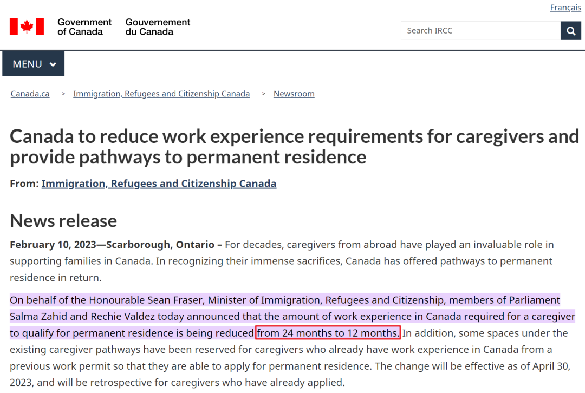
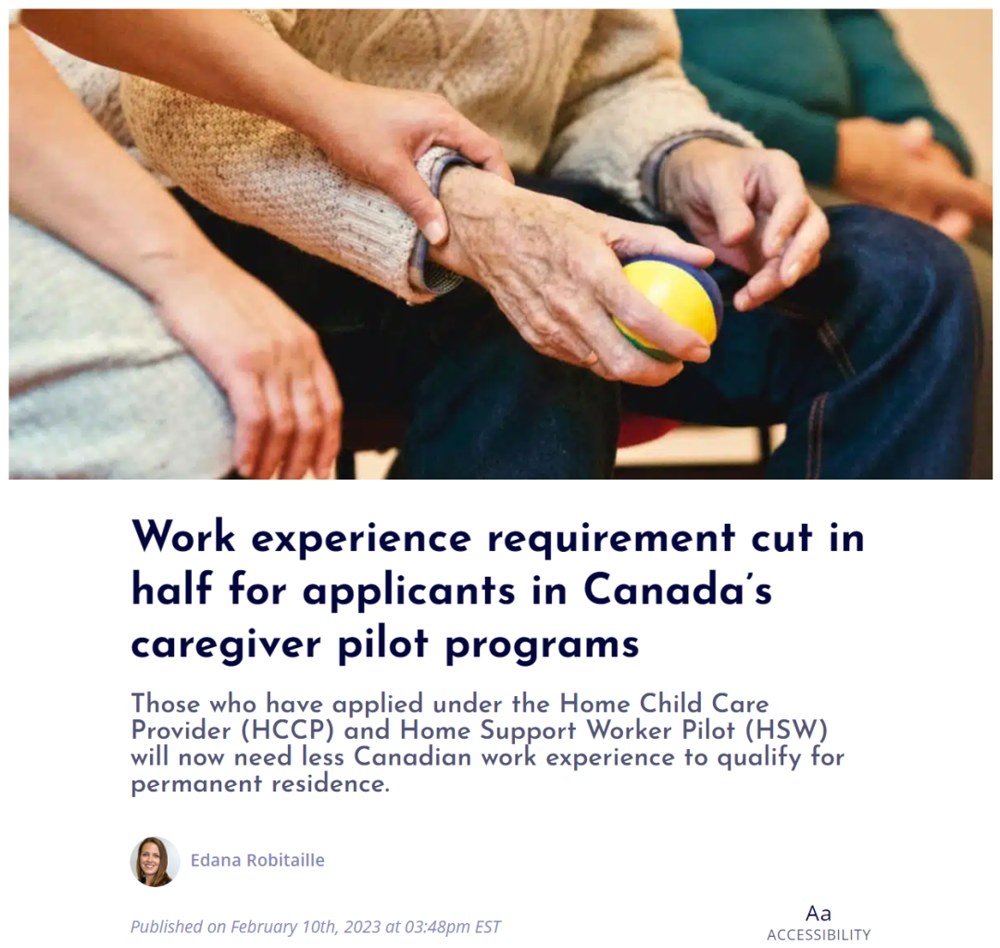
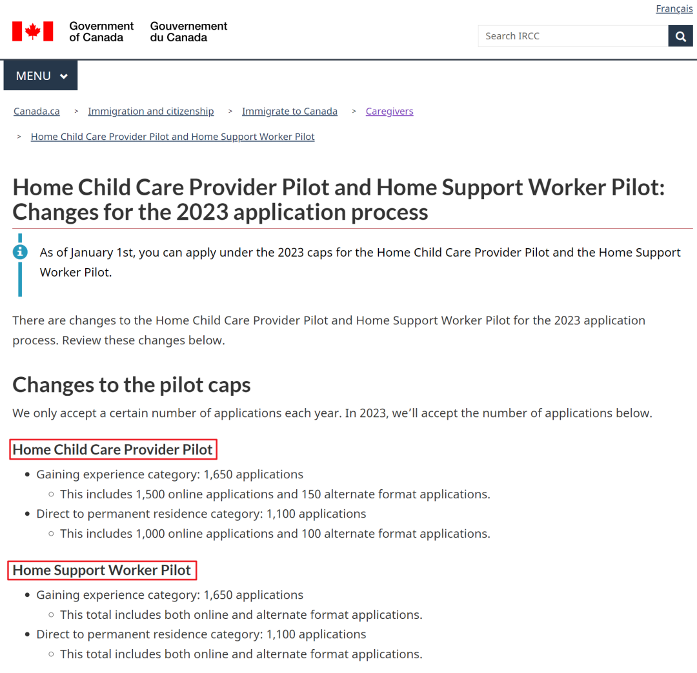

# 无标题

**链接地址:** http://mp.weixin.qq.com/s?__biz=MzUyNzA2NTAwNg==&mid=2247492863&idx=1&sn=bf5281c657c335c08f16736301e98f94&chksm=fa07ee3ecd70672832e87a9f7ebcad0d27f46df72b06b25810f535965966b10ba6ef5315bf06&mpshare=1&scene=2&srcid=0222gVwszJgeppODilABko6d&sharer_sharetime=1677014535164&sharer_shareid=77848a6b3852ae4dcb6c74ffee84743c#rd
**作者:** 你身边的签证专家
**获取时间:** 2025/8/28 19:20:10
**图片数量:** 17

---

## 原始HTML内容

<section style="box-sizing: border-box;font-size: 16px;"><section style="text-align: center;margin-top: 10px;margin-bottom: 10px;line-height: 0;box-sizing: border-box;" powered-by="xiumi.us"><section style="max-width: 100%;vertical-align: middle;display: inline-block;line-height: 0;box-sizing: border-box;"></section></section><section style="text-align: center;margin-top: 10px;margin-bottom: 10px;line-height: 0;box-sizing: border-box;" powered-by="xiumi.us"><section style="max-width: 100%;vertical-align: middle;display: inline-block;line-height: 0;box-sizing: border-box;"></section></section>
 
<section style="font-size: 19px;text-align: center;margin-top: 10px;margin-bottom: 3px;box-sizing: border-box;" powered-by="xiumi.us"><section style="display: inline-block;border-width: 1px;border-style: solid;border-color: rgb(188, 65, 65);background-color: rgb(188, 65, 65);width: 1.8em;height: 1.8em;line-height: 1.8em;border-radius: 100%;margin-left: auto;margin-right: auto;font-size: 16px;color: rgb(255, 255, 255);box-sizing: border-box;">
<strong style="box-sizing: border-box;">1</strong>
</section></section><section style="text-align: center;box-sizing: border-box;" powered-by="xiumi.us"><section style="display: inline-block;width: 0px;height: 0px;vertical-align: top;overflow: hidden;border-style: solid;border-width: 9px 6px 0px;border-color: rgb(188, 65, 65) rgba(255, 255, 255, 0) rgba(255, 255, 255, 0);box-sizing: border-box;"><svg viewBox="0 0 1 1" style="float:left;line-height:0;width:0;vertical-align:top;"></svg></section></section><section style="margin-bottom: 10px;text-align: center;justify-content: center;display: flex;flex-flow: row nowrap;box-sizing: border-box;" powered-by="xiumi.us"><section style="display: inline-block;width: auto;vertical-align: middle;background-color: rgba(109, 155, 209, 0.1);min-width: 10%;max-width: 100%;flex: 0 0 auto;height: auto;align-self: center;padding: 12px;box-sizing: border-box;"><section style="color: rgb(109, 155, 209);text-align: justify;box-sizing: border-box;" powered-by="xiumi.us">
<strong style="box-sizing: border-box;">加拿大保姆移民要求大幅降低</strong>
</section></section></section>
 
<section style="font-size: 14px;padding-right: 15px;padding-left: 15px;letter-spacing: 1px;box-sizing: border-box;" powered-by="xiumi.us">
在加拿大经济和社会中，护理人员扮演者重要的角色，是一个<strong style="box-sizing: border-box;">非常稀缺的工种</strong>。随着发达国家的人口老龄化和低出生率问题逐渐严重化，加拿大为护理人员提供了大量的移民和获得工作签证的途径，为加拿大更多的儿童、老人以及其他需要照顾的人提供支持。

 

近日加国移民部再次优化了保姆移民计划，大幅放宽要求。加拿大联邦移民部(IRCC)于2月10日发布最新公告，将对目前保姆移民试点项目的申请人<strong style="box-sizing: border-box;">降低工作经验要求</strong>，这一改变将会让更多申请人受益。

 

 
</section><section style="text-align: center;box-sizing: border-box;" powered-by="xiumi.us"><section style="max-width: 100%;vertical-align: middle;display: inline-block;line-height: 0;width: 90%;height: auto;box-sizing: border-box;"></section></section><section style="font-size: 14px;padding-right: 15px;padding-left: 15px;letter-spacing: 1px;box-sizing: border-box;" powered-by="xiumi.us">
 

<strong style="box-sizing: border-box;">新政内容：</strong>

 
<ol class="list-paddingleft-1"><li style="box-sizing: border-box;">
<em style="box-sizing: border-box;">将该项目申请人的加拿大工作经验<strong style="box-sizing: border-box;">从24个月减少到12个月</strong></em>
</li><li style="box-sizing: border-box;">
<em style="box-sizing: border-box;">现有的一部分保姆移民名额已预留给之前持工签在加拿大拥有工作经验的护理人 </em>
</li><li style="box-sizing: border-box;">
<em style="box-sizing: border-box;">该新政将从2023年4月30日开始生效，并且对已经递交申请的候选人<strong style="box-sizing: border-box;">有追溯力</strong></em>
</li></ol></section>
 
<section style="text-align: center;margin-top: 10px;margin-bottom: 10px;line-height: 0;box-sizing: border-box;" powered-by="xiumi.us"><section style="max-width: 100%;vertical-align: middle;display: inline-block;line-height: 0;width: 90%;height: auto;box-sizing: border-box;"></section></section><section style="font-size: 14px;padding-right: 15px;padding-left: 15px;letter-spacing: 1px;box-sizing: border-box;" powered-by="xiumi.us">
 

移民部除了将减少保姆移民申请人在加拿大所需的工作经验， 还<strong style="box-sizing: border-box;">打算改进处理和申请进度</strong>。此次更新预计将使目前正在处理的大约 90% 的申请受益。

 

随着现有保姆移民试点项目的结束日期即将临近，移民部目前也正在规划<strong style="box-sizing: border-box;"> 2024 年 6 月试点结束后的下一步</strong>。

 

 
</section><section style="font-size: 19px;text-align: center;margin-top: 10px;margin-bottom: 3px;box-sizing: border-box;" powered-by="xiumi.us"><section style="display: inline-block;border-width: 1px;border-style: solid;border-color: rgb(188, 65, 65);background-color: rgb(188, 65, 65);width: 1.8em;height: 1.8em;line-height: 1.8em;border-radius: 100%;margin-left: auto;margin-right: auto;font-size: 16px;color: rgb(255, 255, 255);box-sizing: border-box;">
<strong style="box-sizing: border-box;">2</strong>
</section></section><section style="text-align: center;box-sizing: border-box;" powered-by="xiumi.us"><section style="display: inline-block;width: 0px;height: 0px;vertical-align: top;overflow: hidden;border-style: solid;border-width: 9px 6px 0px;border-color: rgb(188, 65, 65) rgba(255, 255, 255, 0) rgba(255, 255, 255, 0);box-sizing: border-box;"><svg viewBox="0 0 1 1" style="float:left;line-height:0;width:0;vertical-align:top;"></svg></section></section><section style="margin-bottom: 10px;text-align: center;justify-content: center;display: flex;flex-flow: row nowrap;box-sizing: border-box;" powered-by="xiumi.us"><section style="display: inline-block;width: auto;vertical-align: middle;background-color: rgba(109, 155, 209, 0.1);min-width: 10%;max-width: 100%;flex: 0 0 auto;height: auto;align-self: center;padding: 12px;box-sizing: border-box;"><section style="color: rgb(109, 155, 209);text-align: justify;box-sizing: border-box;" powered-by="xiumi.us">
<strong style="box-sizing: border-box;">加拿大保姆移民项目概述</strong>
</section></section></section><section style="font-size: 14px;padding-right: 15px;padding-left: 15px;letter-spacing: 1px;box-sizing: border-box;" powered-by="xiumi.us">
 

保姆移民具体来讲分为Home Child Care Provider Pilot（<strong style="box-sizing: border-box;">家庭保姆移民</strong>） 和 Home Support Worker Pilot（<strong style="box-sizing: border-box;">家庭护工移民</strong>）这两大类移民项目，并且是一项<strong style="box-sizing: border-box;">为期 5 年的试点项目</strong>。 

 
</section><section style="text-align: center;margin-top: 10px;margin-bottom: 10px;line-height: 0;box-sizing: border-box;" powered-by="xiumi.us"><section style="max-width: 100%;vertical-align: middle;display: inline-block;line-height: 0;width: 90%;height: auto;box-sizing: border-box;"></section></section><section style="font-size: 14px;padding-right: 15px;padding-left: 15px;letter-spacing: 1px;box-sizing: border-box;" powered-by="xiumi.us">
 

如果您已获得在加拿大担任看护人（caregiver）的工作或有在加拿大担任看护人的工作经验，您可以通过这些试点之一申请永久居留权。

 

<strong style="box-sizing: border-box;">2023年家庭保姆移民</strong>，将分为： 

 

1. <strong style="box-sizing: border-box;">获得经验类别：1,650个申请</strong>，包括：
<ul class="list-paddingleft-1"><li style="box-sizing: border-box;">
1,500个网上申请（已满额，于2023年1月1日关闭） 
</li><li style="box-sizing: border-box;">
150个其它形式申请（已满额，于2023年2月1日关闭） 
</li></ul>
 

2. <strong style="box-sizing: border-box;">直接移民类别：1,100个申请</strong>， 包括：
<ul class="list-paddingleft-1"><li style="box-sizing: border-box;">
1,000个网上申请 
</li><li style="box-sizing: border-box;">
100 其它形式申请&nbsp; 
</li></ul>
<strong style="box-sizing: border-box;">举例：</strong>保姆Nanny、住家保姆Live-in caregiver、健康中心保育 Fitness Centre Babysitter，etc。

 
</section><section style="text-align: center;margin-top: 10px;margin-bottom: 10px;line-height: 0;box-sizing: border-box;" powered-by="xiumi.us"><section style="max-width: 100%;vertical-align: middle;display: inline-block;line-height: 0;width: 90%;height: auto;box-sizing: border-box;"></section></section><section style="font-size: 14px;padding-right: 15px;padding-left: 15px;letter-spacing: 1px;box-sizing: border-box;" powered-by="xiumi.us">
 

 

<strong style="box-sizing: border-box;">2023年家庭护工移民</strong>，将分为个类别： 

 

<strong style="box-sizing: border-box;">获得经验类别 (Gaining Experience Category)</strong>：1,650个申请；
<ul class="list-paddingleft-1"><li style="box-sizing: border-box;">
直接移民类别 (Direct to PR category)：1,100个申请；&nbsp; 
</li></ul>
<strong style="box-sizing: border-box;">举例：</strong>月嫂/产妇陪护 Doula、残疾人陪护 Attention for Person with Disabilities、住家陪护Live-in Caregivers、老人陪护Senior Caregivers，etc。

 
</section><section style="text-align: center;margin-top: 10px;margin-bottom: 10px;line-height: 0;box-sizing: border-box;" powered-by="xiumi.us"><section style="max-width: 100%;vertical-align: middle;display: inline-block;line-height: 0;box-sizing: border-box;"></section></section><section style="font-size: 14px;padding-right: 15px;padding-left: 15px;letter-spacing: 1px;box-sizing: border-box;" powered-by="xiumi.us">
 

<strong style="box-sizing: border-box;">获得经验类别</strong>：如果申请人没有工作时长合资格的工作经验，则属于获得经验类别（Gaining Experience Category);

 

<strong style="box-sizing: border-box;">直接移民类别</strong>：如果申请人已经有了工作时长合资格的工作经验，则属于直接移民类别（Direct to PR Category);

 

 
</section><section style="font-size: 19px;text-align: center;margin-top: 10px;margin-bottom: 3px;box-sizing: border-box;" powered-by="xiumi.us"><section style="display: inline-block;border-width: 1px;border-style: solid;border-color: rgb(188, 65, 65);background-color: rgb(188, 65, 65);width: 1.8em;height: 1.8em;line-height: 1.8em;border-radius: 100%;margin-left: auto;margin-right: auto;font-size: 16px;color: rgb(255, 255, 255);box-sizing: border-box;">
<strong style="box-sizing: border-box;">3</strong>
</section></section><section style="text-align: center;box-sizing: border-box;" powered-by="xiumi.us"><section style="display: inline-block;width: 0px;height: 0px;vertical-align: top;overflow: hidden;border-style: solid;border-width: 9px 6px 0px;border-color: rgb(188, 65, 65) rgba(255, 255, 255, 0) rgba(255, 255, 255, 0);box-sizing: border-box;"><svg viewBox="0 0 1 1" style="float:left;line-height:0;width:0;vertical-align:top;"></svg></section></section><section style="margin-bottom: 10px;text-align: center;justify-content: center;display: flex;flex-flow: row nowrap;box-sizing: border-box;" powered-by="xiumi.us"><section style="display: inline-block;width: auto;vertical-align: middle;background-color: rgba(109, 155, 209, 0.1);min-width: 10%;max-width: 100%;flex: 0 0 auto;height: auto;align-self: center;padding: 12px;box-sizing: border-box;"><section style="color: rgb(109, 155, 209);text-align: justify;box-sizing: border-box;" powered-by="xiumi.us">
<strong style="box-sizing: border-box;">加拿大保姆移民项目优势</strong>
</section></section></section><section style="font-size: 14px;padding-right: 15px;padding-left: 15px;letter-spacing: 1px;box-sizing: border-box;" powered-by="xiumi.us">
 
<ul class="list-paddingleft-1"><li style="box-sizing: border-box;">
雇主不用打广告证明请不到当地人；&nbsp;
</li><li style="box-sizing: border-box;">
学历要求较低：1年制大专毕业即可； 
</li><li style="box-sizing: border-box;">
英语要求较低：语言CLB 5（雅思5分左右）； 
</li><li style="box-sizing: border-box;">
工签和全家移民申请一起递交；&nbsp;&nbsp; 
</li><li style="box-sizing: border-box;">
全家享加拿大福利，包含医疗福利：申请人持有工签工作，配偶申请开放式工签，孩子享受当地学生免费读书待遇；&nbsp;

 
</li></ul></section><section style="text-align: center;margin-top: 10px;margin-bottom: 10px;line-height: 0;box-sizing: border-box;" powered-by="xiumi.us"><section style="max-width: 100%;vertical-align: middle;display: inline-block;line-height: 0;width: 90%;height: auto;box-sizing: border-box;"></section></section><section style="font-size: 14px;padding-right: 15px;padding-left: 15px;letter-spacing: 1px;box-sizing: border-box;" powered-by="xiumi.us">
 

项目英文名称是：Home Child Care Provider Pilot and Home Support Worker Pilot，可以看到，<strong style="box-sizing: border-box;">针对的是2个职位</strong>，分别是：&nbsp;

 
<ol class="list-paddingleft-1"><li style="box-sizing: border-box;">
Home Child Care Provider NOC 4411/NOC 44100: <strong style="box-sizing: border-box;">家庭保姆</strong>（照顾18周岁以下的孩子）；注：养父母不符合资格；
</li><li style="box-sizing: border-box;">
Home support worker NOC 4412/NOC 44101<strong style="box-sizing: border-box;"> 家庭护工</strong>；注：Housekeeper (管家)不符合资格； 
</li></ol>
 

 
</section><section style="font-size: 19px;text-align: center;margin-top: 10px;margin-bottom: 3px;box-sizing: border-box;" powered-by="xiumi.us"><section style="display: inline-block;border-width: 1px;border-style: solid;border-color: rgb(188, 65, 65);background-color: rgb(188, 65, 65);width: 1.8em;height: 1.8em;line-height: 1.8em;border-radius: 100%;margin-left: auto;margin-right: auto;font-size: 16px;color: rgb(255, 255, 255);box-sizing: border-box;">
<strong style="box-sizing: border-box;">4</strong>
</section></section><section style="text-align: center;box-sizing: border-box;" powered-by="xiumi.us"><section style="display: inline-block;width: 0px;height: 0px;vertical-align: top;overflow: hidden;border-style: solid;border-width: 9px 6px 0px;border-color: rgb(188, 65, 65) rgba(255, 255, 255, 0) rgba(255, 255, 255, 0);box-sizing: border-box;"><svg viewBox="0 0 1 1" style="float:left;line-height:0;width:0;vertical-align:top;"></svg></section></section><section style="margin-bottom: 10px;text-align: center;justify-content: center;display: flex;flex-flow: row nowrap;box-sizing: border-box;" powered-by="xiumi.us"><section style="display: inline-block;width: auto;vertical-align: middle;background-color: rgba(109, 155, 209, 0.1);min-width: 10%;max-width: 100%;flex: 0 0 auto;height: auto;align-self: center;padding: 12px;box-sizing: border-box;"><section style="color: rgb(109, 155, 209);text-align: justify;box-sizing: border-box;" powered-by="xiumi.us">
<strong style="box-sizing: border-box;">加拿大保姆移民申请人条件及程序</strong>
</section></section></section><section style="font-size: 14px;padding-right: 15px;padding-left: 15px;letter-spacing: 1px;box-sizing: border-box;" powered-by="xiumi.us">
 

<strong style="box-sizing: border-box;">申请条件：</strong>

 
<ul class="list-paddingleft-1"><li style="box-sizing: border-box;">
获得雇主提供的真实有效的工作邀请 Job Offer；&nbsp; 
</li><li style="box-sizing: border-box;">
能够证明可以胜任该工作（可以包括过往的教育/培训/工作经历文件） 
</li><li style="box-sizing: border-box;">
语言：最低 CLB5（雅思3个5，1个4（阅读）） 
</li><li style="box-sizing: border-box;">
教育：最低1年大专或以上文凭 （海外学历要做ECA学历认证） 
</li></ul>
 

<strong style="box-sizing: border-box;">申请程序：</strong>

 
<ul class="list-paddingleft-1"><li style="box-sizing: border-box;">
通过上面2种类别的一种申请（根据工种不同）； 
</li><li style="box-sizing: border-box;">
工签和移民申请一起提交； 
</li><li style="box-sizing: border-box;">
若符合要求，会先获得工签到加拿大工作； 
</li><li style="box-sizing: border-box;">
该工签只限定工种，不限定雇主，你可以为任何雇主工作； 
</li><li style="box-sizing: border-box;">
工作24个月，满足移民申请条件（若已经有24个月工作经验，则可直接递交移民）；从4月30日开始，工作时长要求则由24个月减少至12个月； 
</li><li style="box-sizing: border-box;">
将工作相关文件补充给移民局； 
</li><li style="box-sizing: border-box;">
移民局批准全家移民申请； 
</li></ul></section>
 
<section style="text-align: center;margin-top: 10px;margin-bottom: 10px;line-height: 0;box-sizing: border-box;" powered-by="xiumi.us"><section style="max-width: 100%;vertical-align: middle;display: inline-block;line-height: 0;width: 90%;height: auto;box-sizing: border-box;"></section></section><section style="font-size: 14px;padding-right: 15px;padding-left: 15px;letter-spacing: 1px;box-sizing: border-box;" powered-by="xiumi.us">
 

<strong style="box-sizing: border-box;">家庭成员：</strong>

 
<ul class="list-paddingleft-1"><li style="box-sizing: border-box;">
递交申请时，可以同时为配偶申请配偶工签，为孩子申请学签；
</li></ul>
 

<strong style="box-sizing: border-box;">工签时间：</strong>

 
<ul class="list-paddingleft-1"><li style="box-sizing: border-box;">
通常可以获得长达3年的开放式工签(Open Work Permit), 限定职位（保姆或家庭护工），但不限定雇主；
</li></ul>
 

<strong style="box-sizing: border-box;">申请费：</strong>

 
<ul class="list-paddingleft-1"><li style="box-sizing: border-box;">
主申请人和配偶：1085加币/人（含登陆费），155加币/22周岁以下孩子
</li><li style="box-sizing: border-box;">
工签申请费（若需要）：255加币

 
</li></ul></section><section style="text-align: center;margin-top: 10px;margin-bottom: 10px;line-height: 0;box-sizing: border-box;" powered-by="xiumi.us"><section style="max-width: 100%;vertical-align: middle;display: inline-block;line-height: 0;box-sizing: border-box;"></section></section><section style="margin: 10px 0%;text-align: left;justify-content: flex-start;display: flex;flex-flow: row nowrap;box-sizing: border-box;" powered-by="xiumi.us"><section style="display: inline-block;width: 100%;vertical-align: top;background-color: rgb(216, 202, 160);line-height: 0;align-self: flex-start;flex: 0 0 auto;box-sizing: border-box;"><section style="text-align: justify;justify-content: flex-start;display: flex;flex-flow: row nowrap;box-sizing: border-box;" powered-by="xiumi.us"><section style="display: inline-block;width: 100%;vertical-align: top;background-position: 0% 0%;background-repeat: repeat;background-size: 1.56658%;background-attachment: scroll;align-self: flex-start;flex: 0 0 auto;background-image: url(&quot;https://mmbiz.qpic.cn/mmbiz_png/904kUibXm7Y4ee1gaD0z0ebGwJjNeohXN41vad6lynQ4A11qm5IZMEXO5iaJzJ0r366Ysn64PK344EiaOSAn2E3Eg/640?wx_fmt=png&quot;);box-sizing: border-box;"><section style="text-align: center;box-sizing: border-box;" powered-by="xiumi.us"><section style="display: inline-block;width: 100%;height: 11px;vertical-align: top;overflow: hidden;background-color: rgba(255, 255, 255, 0);box-sizing: border-box;"><svg viewBox="0 0 1 1" style="float:left;line-height:0;width:0;vertical-align:top;"></svg></section></section></section></section></section></section>
 
<section style="font-size: 19px;text-align: center;margin-top: 10px;margin-bottom: 3px;box-sizing: border-box;" powered-by="xiumi.us"><section style="display: inline-block;border-width: 1px;border-style: solid;border-color: rgb(188, 65, 65);background-color: rgb(188, 65, 65);width: 1.8em;height: 1.8em;line-height: 1.8em;border-radius: 100%;margin-left: auto;margin-right: auto;font-size: 16px;color: rgb(255, 255, 255);box-sizing: border-box;">
<strong style="box-sizing: border-box;">5</strong>
</section></section><section style="text-align: center;box-sizing: border-box;" powered-by="xiumi.us"><section style="display: inline-block;width: 0px;height: 0px;vertical-align: top;overflow: hidden;border-style: solid;border-width: 9px 6px 0px;border-color: rgb(188, 65, 65) rgba(255, 255, 255, 0) rgba(255, 255, 255, 0);box-sizing: border-box;"><svg viewBox="0 0 1 1" style="float:left;line-height:0;width:0;vertical-align:top;"></svg></section></section><section style="margin-bottom: 10px;text-align: center;justify-content: center;display: flex;flex-flow: row nowrap;box-sizing: border-box;" powered-by="xiumi.us"><section style="display: inline-block;width: auto;vertical-align: middle;background-color: rgba(109, 155, 209, 0.1);min-width: 10%;max-width: 100%;flex: 0 0 auto;height: auto;align-self: center;padding: 12px;box-sizing: border-box;"><section style="color: rgb(109, 155, 209);text-align: justify;box-sizing: border-box;" powered-by="xiumi.us">
<strong style="box-sizing: border-box;">加拿大保姆移民的难点在哪？</strong>
</section></section></section><section style="text-align: center;margin-top: 10px;margin-bottom: 10px;line-height: 0;box-sizing: border-box;" powered-by="xiumi.us"><section style="max-width: 100%;vertical-align: middle;display: inline-block;line-height: 0;width: 90%;height: auto;box-sizing: border-box;"></section></section><section style="font-size: 14px;padding-right: 15px;padding-left: 15px;letter-spacing: 1px;box-sizing: border-box;" powered-by="xiumi.us">
 

无需巨额投资，也无需资产审核，只要具有一定的教育背景、工作经验以及中等以上的英语/法语水平，就可以申请加拿大保姆移民，那么<strong style="box-sizing: border-box;">难点</strong>在何处？

 
<ol class="list-paddingleft-1"><li style="box-sizing: border-box;">
必须证明申请人能够胜任工作要求。保姆移民主要分为两个职业：照顾小孩和照顾老人病人。这样的工作要求和强度并非所有人都可以胜任的。
</li><li style="box-sizing: border-box;">
实际生活中，雇主往往还会有额外针对性的要求，例如：要会开车，会做饭，会基础的医疗护理只是等等。这对没有多少加拿大本地生存经验的国内申请者来说并不友好。
</li><li style="box-sizing: border-box;">
加拿大对于以往工作经验和培训经历的认定非常严格。相比之下，接受过加拿大境内培训机构的专业培训并获得毕业证书的申请人，更容易被批准。
</li></ol>
 

不过，加拿大既然推出这个项目就是因为本地的保姆严重不足，想要吸引海外众多合格的保姆到加拿大工作。而且在目前后疫情时代的大背景下，加拿大对于护理人员的需求也<strong style="box-sizing: border-box;">只增不减</strong>，因此也在逐年放宽该项目的申请门槛。所以护工移民项目将成为一个<strong style="box-sizing: border-box;">高性价比的长期项目</strong>。

 
<section><mp-common-profile class="js_uneditable custom_select_card mp_profile_iframe" data-pluginname="mpprofile" data-weui-theme="light" data-id="MzUyNzA2NTAwNg==" data-headimg="http://mmbiz.qpic.cn/mmbiz_png/904kUibXm7Y6gq02PdSyzYZvibpBf0icbsnWtqW39AwrqqK8DRQdfwaE8UtUmwOd05nWcoYKrorN7ZuRngiaFhPlibQ/0?wx_fmt=png" data-nickname="新时代留学移民法律事务所" data-alias="" data-signature="加拿大移民顾问监管委员会会员/加拿大注册持牌移民顾问" data-from="0" data-is_biz_ban="0"></mp-common-profile></section>
 

通过这个项目，外籍劳工就可以相对轻松地拿到<strong style="box-sizing: border-box;">加拿大工作签证</strong>，工作满一年后就可以申请全家移民。可以说是一个双赢的好事。建议有意向的朋友们赶早不赶晚，尽早规划、尽早申请、早日获取加国的永居身份。

 
</section>
 
<section style="text-align: left;justify-content: flex-start;display: flex;flex-flow: row nowrap;margin-top: 10px;box-sizing: border-box;" powered-by="xiumi.us"><section style="display: inline-block;vertical-align: top;width: auto;align-self: stretch;flex: 0 0 auto;background-color: rgb(188, 65, 65);min-width: 5%;max-width: 100%;height: auto;padding-top: 9px;padding-right: 9px;padding-left: 20px;box-sizing: border-box;"><section style="text-align: justify;font-size: 18px;color: rgb(252, 252, 252);box-sizing: border-box;" powered-by="xiumi.us">
<strong style="box-sizing: border-box;">阅读更多</strong>
</section></section><section style="display: inline-block;vertical-align: top;width: auto;min-width: 5%;max-width: 100%;flex: 0 0 auto;height: auto;align-self: stretch;box-sizing: border-box;"><section style="box-sizing: border-box;" powered-by="xiumi.us"><section style="display: inline-block;width: 0px;height: 0px;vertical-align: top;overflow: hidden;border-style: solid;border-width: 45px 0px 0px 19px;border-color: rgba(255, 255, 255, 0) rgba(255, 255, 255, 0) rgba(255, 255, 255, 0) rgb(188, 65, 65);box-sizing: border-box;"><svg viewBox="0 0 1 1" style="float:left;line-height:0;width:0;vertical-align:top;"></svg></section></section></section></section><section style="margin-bottom: 10px;box-sizing: border-box;" powered-by="xiumi.us"><section style="background-color: rgb(188, 65, 65);height: 3px;box-sizing: border-box;"><svg viewBox="0 0 1 1" style="float:left;line-height:0;width:0;vertical-align:top;"></svg></section></section><section style="margin: 10px 0%;text-align: left;justify-content: flex-start;display: flex;flex-flow: row nowrap;box-sizing: border-box;" powered-by="xiumi.us"><section style="display: inline-block;width: 100%;vertical-align: top;background-position: 55.6015% 49.3971%;background-repeat: repeat;background-size: 100.637%;background-attachment: scroll;padding: 30px;align-self: flex-start;flex: 0 0 auto;background-image: url(&quot;https://mmbiz.qpic.cn/mmbiz_png/904kUibXm7Y4ee1gaD0z0ebGwJjNeohXNOJJMlvIiaJPlhLa0MxUqDTwxvV4mTRsiaia3gYHOUaoZwxMia6WzkAApgw/640?wx_fmt=png&quot;);box-sizing: border-box;"><section style="text-align: justify;justify-content: flex-start;display: flex;flex-flow: row nowrap;box-sizing: border-box;" powered-by="xiumi.us"><section style="display: inline-block;width: 100%;vertical-align: top;background-color: rgba(188, 65, 65, 0.22);padding: 10px;border-width: 0px;border-style: none;border-color: rgb(62, 62, 62);align-self: flex-start;flex: 0 0 auto;box-sizing: border-box;"><section style="text-align: center;color: rgb(255, 255, 255);font-size: 14px;box-sizing: border-box;" powered-by="xiumi.us">
<a target="_blank" href="http://mp.weixin.qq.com/s?__biz=MzUyNzA2NTAwNg==&amp;mid=2247492835&amp;idx=1&amp;sn=1512046f9d6a6136a3d5bed038b6ba3c&amp;chksm=fa07ee22cd7067347d55475635b098fd92ee909c620773c4993593005d7250c73e80c73241e4&amp;scene=21#wechat_redirect" textvalue="加拿大银行可能还欠你加拿大医疗人才荒，考虑从中国“抢”护士！" linktype="text" imgurl="" imgdata="null" data-itemshowtype="0" tab="innerlink" style="color: rgb(255, 255, 255);" data-linktype="2"><strong style="box-sizing: border-box;">加拿大医疗人才荒，考虑从中国“抢”护士！联邦政府投资9000万加元启动“外国资历认证计划”！</strong></a>
</section></section></section></section></section><section style="margin: 10px 0%;text-align: left;justify-content: flex-start;display: flex;flex-flow: row nowrap;box-sizing: border-box;" powered-by="xiumi.us"><section style="display: inline-block;width: 100%;vertical-align: top;background-position: 18.2326% 54.4757%;background-repeat: repeat;background-size: 103.375%;background-attachment: scroll;padding: 30px;align-self: flex-start;flex: 0 0 auto;background-image: url(&quot;https://mmbiz.qpic.cn/mmbiz_jpg/904kUibXm7Y4ee1gaD0z0ebGwJjNeohXNLkqwMZ5lvpRCE8wfhqpUzatqKO0EuqZOaSztmFoHfroUL4tSD0mrug/640?wx_fmt=jpeg&quot;);box-sizing: border-box;"><section style="text-align: justify;justify-content: flex-start;display: flex;flex-flow: row nowrap;box-sizing: border-box;" powered-by="xiumi.us"><section style="display: inline-block;width: 100%;vertical-align: top;background-color: rgba(188, 65, 65, 0.22);padding: 10px;border-width: 0px;border-style: none;border-color: rgb(62, 62, 62);align-self: flex-start;flex: 0 0 auto;box-sizing: border-box;"><section style="text-align: center;color: rgb(255, 255, 255);font-size: 14px;box-sizing: border-box;" powered-by="xiumi.us">
<a target="_blank" href="http://mp.weixin.qq.com/s?__biz=MzUyNzA2NTAwNg==&amp;mid=2247492802&amp;idx=1&amp;sn=c772f1be100992657f0f1adf513e635a&amp;chksm=fa07ee03cd706715f0d96e8396f40e44990fd6e6c6977633d6df372a0679a8d3460a2aa0e4c9&amp;scene=21#wechat_redirect" textvalue="加国移民部官宣：HK居民特殊工签申请政策延期两年，同时放宽申请条件！" linktype="text" imgurl="" imgdata="null" data-itemshowtype="0" tab="innerlink" style="color: rgb(255, 255, 255);" data-linktype="2"><strong style="box-sizing: border-box;">加国移民部官宣：HK居民特殊工签申请政策延期两年，同时放宽申请条件！</strong></a>
</section></section></section></section></section><section style="margin: 10px 0%;text-align: left;justify-content: flex-start;display: flex;flex-flow: row nowrap;box-sizing: border-box;" powered-by="xiumi.us"><section style="display: inline-block;width: 100%;vertical-align: top;background-position: 19.2003% 20.8591%;background-repeat: repeat;background-size: 104.564%;background-attachment: scroll;padding: 30px;align-self: flex-start;flex: 0 0 auto;background-image: url(&quot;https://mmbiz.qpic.cn/mmbiz_png/904kUibXm7Y4ee1gaD0z0ebGwJjNeohXNAFJId5FYynfjSSicNcYu1ARxspezdOCJ0ExywpHbDMw5cXcnWGD2bzQ/640?wx_fmt=png&quot;);box-sizing: border-box;"><section style="text-align: justify;justify-content: flex-start;display: flex;flex-flow: row nowrap;box-sizing: border-box;" powered-by="xiumi.us"><section style="display: inline-block;width: 100%;vertical-align: top;background-color: rgba(188, 65, 65, 0.22);padding: 10px;border-width: 0px;border-style: none;border-color: rgb(62, 62, 62);align-self: flex-start;flex: 0 0 auto;box-sizing: border-box;"><section style="text-align: center;color: rgb(255, 255, 255);font-size: 14px;box-sizing: border-box;" powered-by="xiumi.us">
<a target="_blank" href="http://mp.weixin.qq.com/s?__biz=MzUyNzA2NTAwNg==&amp;mid=2247492778&amp;idx=1&amp;sn=ed58bfad7ff71654f6dbd62a20108e6e&amp;chksm=fa07ee6bcd70677d04e38259a8797a57a2e0220c3b34f700c8d54bfe074e7bc0c5d9d06495bc&amp;scene=21#wechat_redirect" textvalue="加国移民部历史首次定向邀请技术移民3300名！新的语言考试被批准用于移民和签证申请！" linktype="text" imgurl="" imgdata="null" data-itemshowtype="0" tab="innerlink" style="color: rgb(255, 255, 255);" data-linktype="2"><strong style="box-sizing: border-box;">加国移民部历史首次定向邀请技术移民3300名！新的语言考试被批准用于移民和签证申请！</strong></a>
</section></section></section></section></section><section style="margin: 10px 0%;text-align: left;justify-content: flex-start;display: flex;flex-flow: row nowrap;box-sizing: border-box;" powered-by="xiumi.us"><section style="display: inline-block;width: 100%;vertical-align: top;background-position: 55.6015% 33.1154%;background-repeat: repeat;background-size: 100.637%;background-attachment: scroll;padding: 30px;align-self: flex-start;flex: 0 0 auto;background-image: url(&quot;https://mmbiz.qpic.cn/mmbiz_png/904kUibXm7Y4ee1gaD0z0ebGwJjNeohXNvya7iaXEK4CiaRMwiauAVt0p1rc9VGGkp7EHvHpb5QU96AQqG2DHLzzow/640?wx_fmt=png&quot;);box-sizing: border-box;"><section style="text-align: justify;justify-content: flex-start;display: flex;flex-flow: row nowrap;box-sizing: border-box;" powered-by="xiumi.us"><section style="display: inline-block;width: 100%;vertical-align: top;background-color: rgba(188, 65, 65, 0.22);padding: 10px;border-width: 0px;border-style: none;border-color: rgb(62, 62, 62);align-self: flex-start;flex: 0 0 auto;box-sizing: border-box;"><section style="text-align: center;color: rgb(255, 255, 255);font-size: 14px;box-sizing: border-box;" powered-by="xiumi.us">
<a target="_blank" href="http://mp.weixin.qq.com/s?__biz=MzUyNzA2NTAwNg==&amp;mid=2247492747&amp;idx=1&amp;sn=49fd10d802b8026683423b5d1311e3ca&amp;chksm=fa07ee4acd70675c738e273aa12017c8e2115837dd4c8f6be9cd9dd9579a8c6abe5ac8ea51ab&amp;scene=21#wechat_redirect" textvalue="【高校巡礼】安省就业率第一，起薪第一的学校正是——劳伦森大学！" linktype="text" imgurl="" imgdata="null" data-itemshowtype="0" tab="innerlink" style="color: rgb(255, 255, 255);" data-linktype="2"><strong style="box-sizing: border-box;">【高校巡礼】安省就业率第一，起薪第一的学校正是——劳伦森大学！</strong></a>
</section></section></section></section></section><section style="text-align: center;font-size: 12px;color: rgb(180, 180, 180);box-sizing: border-box;" powered-by="xiumi.us">
（点击文字阅读）
</section><section style="margin: 10px 0%;text-align: left;justify-content: flex-start;display: flex;flex-flow: row nowrap;box-sizing: border-box;" powered-by="xiumi.us"><section style="display: inline-block;width: 100%;vertical-align: top;background-color: rgb(216, 202, 160);line-height: 0;align-self: flex-start;flex: 0 0 auto;box-sizing: border-box;"><section style="text-align: justify;justify-content: flex-start;display: flex;flex-flow: row nowrap;box-sizing: border-box;" powered-by="xiumi.us"><section style="display: inline-block;width: 100%;vertical-align: top;background-position: 0% 0%;background-repeat: repeat;background-size: 1.56658%;background-attachment: scroll;align-self: flex-start;flex: 0 0 auto;background-image: url(&quot;https://mmbiz.qpic.cn/mmbiz_png/904kUibXm7Y4ee1gaD0z0ebGwJjNeohXN41vad6lynQ4A11qm5IZMEXO5iaJzJ0r366Ysn64PK344EiaOSAn2E3Eg/640?wx_fmt=png&quot;);box-sizing: border-box;"><section style="text-align: center;box-sizing: border-box;" powered-by="xiumi.us"><section style="display: inline-block;width: 100%;height: 11px;vertical-align: top;overflow: hidden;background-color: rgba(255, 255, 255, 0);box-sizing: border-box;"><svg viewBox="0 0 1 1" style="float:left;line-height:0;width:0;vertical-align:top;"></svg></section></section></section></section></section></section><section style="text-align: center;margin-top: 10px;margin-bottom: 10px;line-height: 0;box-sizing: border-box;" powered-by="xiumi.us"><section style="max-width: 100%;vertical-align: middle;display: inline-block;line-height: 0;box-sizing: border-box;"></section></section><section style="text-align: center;margin-top: 10px;margin-bottom: 10px;line-height: 0;box-sizing: border-box;" powered-by="xiumi.us"><section style="max-width: 100%;vertical-align: middle;display: inline-block;line-height: 0;box-sizing: border-box;"></section></section><section style="text-align: center;margin-top: 10px;margin-bottom: 10px;line-height: 0;box-sizing: border-box;" powered-by="xiumi.us"><section style="max-width: 100%;vertical-align: middle;display: inline-block;line-height: 0;box-sizing: border-box;"></section></section><section style="text-align: center;margin-top: 10px;margin-bottom: 10px;line-height: 0;box-sizing: border-box;" powered-by="xiumi.us"><section style="max-width: 100%;vertical-align: middle;display: inline-block;line-height: 0;box-sizing: border-box;"></section></section><section style="padding-right: 15px;padding-left: 15px;font-size: 12px;color: rgb(121, 121, 121);box-sizing: border-box;" powered-by="xiumi.us">
<strong style="box-sizing: border-box;">参考信息：</strong>

<strong style="box-sizing: border-box;"> </strong>

<strong style="box-sizing: border-box;">https://www.canada.ca/en/immigration-refugees-citizenship/news/2023/02/canada-to-reduce-work-experience-requirements-for-caregivers-and-provide-pathways-to-permanent-residence.html</strong>

 

<strong style="box-sizing: border-box;">https://www.cicnews.com/2023/02/work-experience-requirement-cut-in-half-for-applicants-in-canadas-caregiver-pilot-programs-0233054.html#gs.p759nn</strong>

 
</section><section style="text-align: center;margin-top: 10px;margin-bottom: 10px;line-height: 0;box-sizing: border-box;" powered-by="xiumi.us"><section style="max-width: 100%;vertical-align: middle;display: inline-block;line-height: 0;box-sizing: border-box;"></section></section><section style="text-align: center;margin-top: 10px;margin-bottom: 10px;line-height: 0;box-sizing: border-box;" powered-by="xiumi.us"><section style="max-width: 100%;vertical-align: middle;display: inline-block;line-height: 0;box-sizing: border-box;"></section></section></section>
 

<mp-style-type data-value="3"></mp-style-type>

---

## 纯文本内容

1加拿大保姆移民要求大幅降低在加拿大经济和社会中，护理人员扮演者重要的角色，是一个非常稀缺的工种。随着发达国家的人口老龄化和低出生率问题逐渐严重化，加拿大为护理人员提供了大量的移民和获得工作签证的途径，为加拿大更多的儿童、老人以及其他需要照顾的人提供支持。近日加国移民部再次优化了保姆移民计划，大幅放宽要求。加拿大联邦移民部(IRCC)于2月10日发布最新公告，将对目前保姆移民试点项目的申请人降低工作经验要求，这一改变将会让更多申请人受益。新政内容：将该项目申请人的加拿大工作经验从24个月减少到12个月现有的一部分保姆移民名额已预留给之前持工签在加拿大拥有工作经验的护理人该新政将从2023年4月30日开始生效，并且对已经递交申请的候选人有追溯力移民部除了将减少保姆移民申请人在加拿大所需的工作经验， 还打算改进处理和申请进度。此次更新预计将使目前正在处理的大约 90% 的申请受益。随着现有保姆移民试点项目的结束日期即将临近，移民部目前也正在规划 2024 年 6 月试点结束后的下一步。2加拿大保姆移民项目概述保姆移民具体来讲分为Home Child Care Provider Pilot（家庭保姆移民） 和 Home Support Worker Pilot（家庭护工移民）这两大类移民项目，并且是一项为期 5 年的试点项目。如果您已获得在加拿大担任看护人（caregiver）的工作或有在加拿大担任看护人的工作经验，您可以通过这些试点之一申请永久居留权。2023年家庭保姆移民，将分为：1. 获得经验类别：1,650个申请，包括：1,500个网上申请（已满额，于2023年1月1日关闭）150个其它形式申请（已满额，于2023年2月1日关闭）2. 直接移民类别：1,100个申请， 包括：1,000个网上申请100 其它形式申请 举例：保姆Nanny、住家保姆Live-in caregiver、健康中心保育 Fitness Centre Babysitter，etc。2023年家庭护工移民，将分为个类别：获得经验类别 (Gaining Experience Category)：1,650个申请；直接移民类别 (Direct to PR category)：1,100个申请； 举例：月嫂/产妇陪护 Doula、残疾人陪护 Attention for Person with Disabilities、住家陪护Live-in Caregivers、老人陪护Senior Caregivers，etc。获得经验类别：如果申请人没有工作时长合资格的工作经验，则属于获得经验类别（Gaining Experience Category);直接移民类别：如果申请人已经有了工作时长合资格的工作经验，则属于直接移民类别（Direct to PR Category);3加拿大保姆移民项目优势雇主不用打广告证明请不到当地人； 学历要求较低：1年制大专毕业即可；英语要求较低：语言CLB 5（雅思5分左右）；工签和全家移民申请一起递交；  全家享加拿大福利，包含医疗福利：申请人持有工签工作，配偶申请开放式工签，孩子享受当地学生免费读书待遇； 项目英文名称是：Home Child Care Provider Pilot and Home Support Worker Pilot，可以看到，针对的是2个职位，分别是： Home Child Care Provider NOC 4411/NOC 44100: 家庭保姆（照顾18周岁以下的孩子）；注：养父母不符合资格；Home support worker NOC 4412/NOC 44101 家庭护工；注：Housekeeper (管家)不符合资格；4加拿大保姆移民申请人条件及程序申请条件：获得雇主提供的真实有效的工作邀请 Job Offer； 能够证明可以胜任该工作（可以包括过往的教育/培训/工作经历文件）语言：最低 CLB5（雅思3个5，1个4（阅读））教育：最低1年大专或以上文凭 （海外学历要做ECA学历认证）申请程序：通过上面2种类别的一种申请（根据工种不同）；工签和移民申请一起提交；若符合要求，会先获得工签到加拿大工作；该工签只限定工种，不限定雇主，你可以为任何雇主工作；工作24个月，满足移民申请条件（若已经有24个月工作经验，则可直接递交移民）；从4月30日开始，工作时长要求则由24个月减少至12个月；将工作相关文件补充给移民局；移民局批准全家移民申请；家庭成员：递交申请时，可以同时为配偶申请配偶工签，为孩子申请学签；工签时间：通常可以获得长达3年的开放式工签(Open Work Permit), 限定职位（保姆或家庭护工），但不限定雇主；申请费：主申请人和配偶：1085加币/人（含登陆费），155加币/22周岁以下孩子工签申请费（若需要）：255加币5加拿大保姆移民的难点在哪？无需巨额投资，也无需资产审核，只要具有一定的教育背景、工作经验以及中等以上的英语/法语水平，就可以申请加拿大保姆移民，那么难点在何处？必须证明申请人能够胜任工作要求。保姆移民主要分为两个职业：照顾小孩和照顾老人病人。这样的工作要求和强度并非所有人都可以胜任的。实际生活中，雇主往往还会有额外针对性的要求，例如：要会开车，会做饭，会基础的医疗护理只是等等。这对没有多少加拿大本地生存经验的国内申请者来说并不友好。加拿大对于以往工作经验和培训经历的认定非常严格。相比之下，接受过加拿大境内培训机构的专业培训并获得毕业证书的申请人，更容易被批准。不过，加拿大既然推出这个项目就是因为本地的保姆严重不足，想要吸引海外众多合格的保姆到加拿大工作。而且在目前后疫情时代的大背景下，加拿大对于护理人员的需求也只增不减，因此也在逐年放宽该项目的申请门槛。所以护工移民项目将成为一个高性价比的长期项目。通过这个项目，外籍劳工就可以相对轻松地拿到加拿大工作签证，工作满一年后就可以申请全家移民。可以说是一个双赢的好事。建议有意向的朋友们赶早不赶晚，尽早规划、尽早申请、早日获取加国的永居身份。阅读更多加拿大医疗人才荒，考虑从中国“抢”护士！联邦政府投资9000万加元启动“外国资历认证计划”！加国移民部官宣：HK居民特殊工签申请政策延期两年，同时放宽申请条件！加国移民部历史首次定向邀请技术移民3300名！新的语言考试被批准用于移民和签证申请！【高校巡礼】安省就业率第一，起薪第一的学校正是——劳伦森大学！（点击文字阅读）参考信息：https://www.canada.ca/en/immigration-refugees-citizenship/news/2023/02/canada-to-reduce-work-experience-requirements-for-caregivers-and-provide-pathways-to-permanent-residence.htmlhttps://www.cicnews.com/2023/02/work-experience-requirement-cut-in-half-for-applicants-in-canadas-caregiver-pilot-programs-0233054.html#gs.p759nn

---

## 图片列表

-  (原始链接: https://mmbiz.qpic.cn/mmbiz_jpg/904kUibXm7Y4ee1gaD0z0ebGwJjNeohXNYT2Hbtx0KgU22RKm3K5wKUAjveXSulia5dq7Fwbw9qDGUpj7ZHHuaicg/640?wx_fmt=jpeg)
-  (原始链接: https://mmbiz.qpic.cn/mmbiz_jpg/904kUibXm7Y4ee1gaD0z0ebGwJjNeohXNImvKwfmsshibqzxMnMz74G04picjWndk8zrdAeibib216JEIMA31Kql5FQ/640?wx_fmt=jpeg)
-  (原始链接: https://mmbiz.qpic.cn/mmbiz_png/904kUibXm7Y4ee1gaD0z0ebGwJjNeohXNvTe9rVBoicVpMBbcB2jmh1pawgDCx2SoEzoYJj3ZUZqqOjxXXxCQJVQ/640?wx_fmt=png)
-  (原始链接: https://mmbiz.qpic.cn/mmbiz_png/904kUibXm7Y4ee1gaD0z0ebGwJjNeohXNicAseKoMoytRbpicEO2QsNCXzxu98CNZzFiaGVlLhaFY1m95ibiaWMK2sVw/640?wx_fmt=png)
-  (原始链接: https://mmbiz.qpic.cn/mmbiz_png/904kUibXm7Y4ee1gaD0z0ebGwJjNeohXNiaOzykIUNHmxVwyz7En8UH6tV5ia0Bia8fxrZyOIckd19oyy07Z30onFw/640?wx_fmt=png)
-  (原始链接: https://mmbiz.qpic.cn/mmbiz_jpg/904kUibXm7Y4ee1gaD0z0ebGwJjNeohXNL9N335ia9UJniaYermuMKZHibL9icqdGibBxyvCEPxwzb5JCK1V6ccUmBOA/640?wx_fmt=jpeg)
-  (原始链接: https://mmbiz.qpic.cn/mmbiz_png/904kUibXm7Y4ee1gaD0z0ebGwJjNeohXNQZ0GQ6AXTwVuKFYsklHO8QgThicwNr3uzAGCXuCmNA0hcjQKE7MYsnA/640?wx_fmt=png)
-  (原始链接: https://mmbiz.qpic.cn/mmbiz_png/904kUibXm7Y4ee1gaD0z0ebGwJjNeohXNkfzVGRVdesWun1liczv6qicctwHxFWqryByvdLojtJSqXHQzL6HJWFXg/640?wx_fmt=png)
-  (原始链接: https://mmbiz.qpic.cn/mmbiz_png/904kUibXm7Y4ee1gaD0z0ebGwJjNeohXNYUVLN8gDcKrjJWyMQyWlbXcMnvO1kTFnrtWib9l87YvVYoepgPC2Q6g/640?wx_fmt=png)
-  (原始链接: https://mmbiz.qpic.cn/mmbiz_png/904kUibXm7Y4ee1gaD0z0ebGwJjNeohXNffyHayIxfIgPb7xeIuY8Kazv88icNhNfGGA30YRdK4xOBMXqs0jxDoQ/640?wx_fmt=png)
-  (原始链接: https://mmbiz.qpic.cn/mmbiz_png/904kUibXm7Y4ee1gaD0z0ebGwJjNeohXNY6f2icKk2k5Dt4DicuY3LfOt6VIs8pYWq644YlYpqGsxa6RMJJDY0EKg/640?wx_fmt=png)
-  (原始链接: https://mmbiz.qpic.cn/mmbiz_png/904kUibXm7Y4ee1gaD0z0ebGwJjNeohXNVhibq0oaO7VbpnpiarKsMVtC2v8NQfXXrXiboPD6gRibSkU7SmFKP1Fvyw/640?wx_fmt=png)
-  (原始链接: https://mmbiz.qpic.cn/mmbiz_jpg/904kUibXm7Y4ee1gaD0z0ebGwJjNeohXNKtFjguribwDIydia7JMDHWJQzcvhyZJSwJ17fHR1kA37Dsukzs5tPLVg/640?wx_fmt=jpeg)
-  (原始链接: https://mmbiz.qpic.cn/mmbiz_png/904kUibXm7Y4ee1gaD0z0ebGwJjNeohXNEu0YAgpjicqg2cfiacen46MUVYkWrHuGSZlfeicZOicSJbr8pd4jfBRV0Q/640?wx_fmt=png)
-  (原始链接: https://mmbiz.qpic.cn/mmbiz_jpg/904kUibXm7Y4ee1gaD0z0ebGwJjNeohXNggJpEz0UYdNMMhj0mgYTOVicYiaIDHGJWgZB9RcofSEdrKfsdJrkC4Tw/640?wx_fmt=jpeg)
-  (原始链接: https://mmbiz.qpic.cn/mmbiz_jpg/904kUibXm7Y4ee1gaD0z0ebGwJjNeohXN0ibTdproqEDwGvKEWuW2TRFyNT895mpK0BQzvhBWsK7Tc6q41tic7AvA/640?wx_fmt=jpeg)
-  (原始链接: https://mmbiz.qpic.cn/mmbiz_jpg/904kUibXm7Y4ee1gaD0z0ebGwJjNeohXNC5rrKEdTnc65zRbQxeNeN2NYQnHSI9jPsehVkXQslDPTPB3MKjBRVg/640?wx_fmt=jpeg)
