# 无标题

**链接地址:** http://mp.weixin.qq.com/s?__biz=MzUyNzA2NTAwNg==&mid=2247493006&idx=1&sn=313d60e416e1aff961c41b621ff531ec&chksm=fa07ef4fcd7066590f87da79c5c5b13f12b870c629990c48db1a229f4c91b64496f2aab1b6e3&mpshare=1&scene=2&srcid=02222weoIecgXQ5Nt86a1A2s&sharer_sharetime=1677014464164&sharer_shareid=77848a6b3852ae4dcb6c74ffee84743c#rd
**作者:** 你身边的签证专家
**获取时间:** 2025/8/28 19:20:34
**图片数量:** 31

---

## 原始HTML内容

<section style="box-sizing: border-box;font-size: 16px;"><section style="text-align: center;margin-top: 10px;margin-bottom: 10px;line-height: 0;box-sizing: border-box;" powered-by="xiumi.us"><section style="max-width: 100%;vertical-align: middle;display: inline-block;line-height: 0;box-sizing: border-box;"></section></section><section style="text-align: center;margin-top: 10px;margin-bottom: 10px;line-height: 0;box-sizing: border-box;" powered-by="xiumi.us"><section style="max-width: 100%;vertical-align: middle;display: inline-block;line-height: 0;box-sizing: border-box;"></section></section>
 
<section style="font-size: 19px;text-align: center;margin-top: 10px;margin-bottom: 3px;box-sizing: border-box;" powered-by="xiumi.us"><section style="display: inline-block;border-width: 1px;border-style: solid;border-color: rgb(188, 65, 65);background-color: rgb(188, 65, 65);width: 1.8em;height: 1.8em;line-height: 1.8em;border-radius: 100%;margin-left: auto;margin-right: auto;font-size: 16px;color: rgb(255, 255, 255);box-sizing: border-box;">
<strong style="box-sizing: border-box;">1</strong>
</section></section><section style="text-align: center;box-sizing: border-box;" powered-by="xiumi.us"><section style="display: inline-block;width: 0px;height: 0px;vertical-align: top;overflow: hidden;border-style: solid;border-width: 9px 6px 0px;border-color: rgb(188, 65, 65) rgba(255, 255, 255, 0) rgba(255, 255, 255, 0);box-sizing: border-box;"><svg viewBox="0 0 1 1" style="float:left;line-height:0;width:0;vertical-align:top;"></svg></section></section><section style="margin-bottom: 10px;text-align: center;justify-content: center;display: flex;flex-flow: row nowrap;box-sizing: border-box;" powered-by="xiumi.us"><section style="display: inline-block;width: auto;vertical-align: middle;background-color: rgba(109, 155, 209, 0.1);min-width: 10%;max-width: 100%;flex: 0 0 auto;height: auto;align-self: center;padding: 12px;box-sizing: border-box;"><section style="color: rgb(109, 155, 209);text-align: justify;box-sizing: border-box;" powered-by="xiumi.us">
<strong style="box-sizing: border-box;">2022年加拿大留学生数量破纪录</strong>
</section></section></section><section style="font-size: 14px;padding-right: 15px;padding-left: 15px;letter-spacing: 1px;box-sizing: border-box;" powered-by="xiumi.us">
 

随着国际留学增长趋势的快速发展，每年去往加拿大留学的学生数量不断增加。尤其是因为受到疫情的影响，留学生的学习签证申请数量更是在疫后出现<strong style="box-sizing: border-box;">井喷</strong>的趋势。
</section><section style="font-size: 14px;padding-right: 15px;padding-left: 15px;letter-spacing: 1px;box-sizing: border-box;" powered-by="xiumi.us">
 

根据加拿大移民部(IRCC)的新数据显示，加拿大在2022年一年内迎来了<strong style="box-sizing: border-box;">来自184个国家</strong>的<strong style="box-sizing: border-box;">551,405名留学生</strong>。此外，截至2022年12月31日，持有有效学习签证的留学生人数为807,750人，再创历史新高！ 

 
</section><section style="text-align: center;margin-top: 10px;margin-bottom: 10px;line-height: 0;box-sizing: border-box;" powered-by="xiumi.us"><section style="max-width: 100%;vertical-align: middle;display: inline-block;line-height: 0;width: 90%;height: auto;box-sizing: border-box;"></section></section><section style="font-size: 14px;padding-right: 15px;padding-left: 15px;letter-spacing: 1px;box-sizing: border-box;" powered-by="xiumi.us">
 

2022年，加拿大签发的学习签证数量较前年也<strong style="box-sizing: border-box;">大幅增加</strong>，2021年加拿大共签发的444260个学习签证，从数量上，2022年生效的学签比2021年多了整整107145个。

 

而与疫情前后的对比，加拿大国际留学生的<strong style="box-sizing: border-box;">增长也非常巨大</strong>。2019年，加拿大迎来了637860名国际学生。由于疫情问题在2020年有所下降，而到2021年留学生总数回升至617315人。随着去年全球疫情逐渐恢复正常，截止2022年底，加拿大的国际学生人数比疫情前的2019年多了近170000人！

 
</section><section style="text-align: center;margin-top: 10px;margin-bottom: 10px;line-height: 0;box-sizing: border-box;" powered-by="xiumi.us"><section style="max-width: 100%;vertical-align: middle;display: inline-block;line-height: 0;width: 90%;height: auto;box-sizing: border-box;"></section></section><section style="font-size: 14px;padding-right: 15px;padding-left: 15px;letter-spacing: 1px;box-sizing: border-box;" powered-by="xiumi.us">
 

2022年来加拿大就读国际学生大增的原因，主要在于：

 
<ol class="list-paddingleft-1"><li style="box-sizing: border-box;">
加拿大大部分的学校纷纷<strong style="box-sizing: border-box;">恢复线下授课</strong>，并同时减少（或者取消）线上课程，导致原来网课学生纷纷回到加拿大学习； 
</li><li style="box-sizing: border-box;">
全世界范围内，<strong style="box-sizing: border-box;">疫情政策放开</strong>，其他国家的学生恢复到加拿大学习的脚步已经开始； 
</li><li style="box-sizing: border-box;">
加拿大去年推出了很多<strong style="box-sizing: border-box;">吸引留学生在读期间和毕业工签的新政策</strong>，大大鼓励国际学生来加拿大就读。
</li></ol></section><section style="font-size: 14px;padding-right: 15px;padding-left: 15px;letter-spacing: 1px;box-sizing: border-box;" powered-by="xiumi.us">
 
</section><section style="transform: scale(0.9);-webkit-transform: scale(0.9);-moz-transform: scale(0.9);-o-transform: scale(0.9);transform-origin: center center;-webkit-transform-origin: center center;-moz-transform-origin: center center;-o-transform-origin: center center;margin-top: -4px;margin-bottom: -4px;box-sizing: border-box;" powered-by="xiumi.us"><section style="text-align: left;justify-content: flex-start;display: flex;flex-flow: row nowrap;margin-top: 10px;box-sizing: border-box;"><section style="display: inline-block;width: 100%;vertical-align: bottom;align-self: flex-end;flex: 0 0 auto;background-color: rgb(188, 65, 65);height: auto;padding: 4px 10px;box-sizing: border-box;"><section style="text-align: justify;color: rgb(252, 252, 252);box-sizing: border-box;" powered-by="xiumi.us">
<strong style="box-sizing: border-box;">2022年进入加拿大的新留学生的前10名来源国</strong>
</section></section></section></section><section style="transform: scale(0.9);-webkit-transform: scale(0.9);-moz-transform: scale(0.9);-o-transform: scale(0.9);transform-origin: center center;-webkit-transform-origin: center center;-moz-transform-origin: center center;-o-transform-origin: center center;margin-top: -16px;margin-bottom: -16px;box-sizing: border-box;" powered-by="xiumi.us"><section style="text-align: left;justify-content: flex-start;display: flex;flex-flow: row nowrap;margin-bottom: 10px;box-sizing: border-box;"><section style="display: inline-block;width: 100%;vertical-align: top;align-self: flex-start;flex: 0 0 auto;padding: 24px;border-style: solid;border-width: 2px;border-color: rgb(188, 65, 65);box-sizing: border-box;"><section style="text-align: center;box-sizing: border-box;" powered-by="xiumi.us"><section style="font-size: 14px;text-align: justify;box-sizing: border-box;">
印度（226,450 名学生）；

<strong style="box-sizing: border-box;">中国（52,165 名学生）</strong>；

菲律宾（23,380 名学生）；

法国（16,725 名学生）；

尼日利亚（16,195 名学生）；

伊朗（13,525 名学生）；

韩国（11,535 名学生）；

日本（10,955 名学生）；

墨西哥（10,405 名学生）；

巴西（10,405 名学生）。
</section></section></section></section></section><section style="font-size: 14px;padding-right: 15px;padding-left: 15px;letter-spacing: 1px;box-sizing: border-box;" powered-by="xiumi.us">
 

 
</section><section style="transform: scale(0.9);-webkit-transform: scale(0.9);-moz-transform: scale(0.9);-o-transform: scale(0.9);transform-origin: center center;-webkit-transform-origin: center center;-moz-transform-origin: center center;-o-transform-origin: center center;margin-top: -4px;margin-bottom: -4px;box-sizing: border-box;" powered-by="xiumi.us"><section style="text-align: left;justify-content: flex-start;display: flex;flex-flow: row nowrap;margin-top: 10px;box-sizing: border-box;"><section style="display: inline-block;width: 100%;vertical-align: bottom;align-self: flex-end;flex: 0 0 auto;background-color: rgb(188, 65, 65);height: auto;padding: 4px 10px;box-sizing: border-box;"><section style="text-align: justify;color: rgb(252, 252, 252);box-sizing: border-box;" powered-by="xiumi.us">
<strong style="box-sizing: border-box;">截至2022年12月31日，已经在加拿大生活和学习的留学生前10名来源国</strong>
</section></section></section></section><section style="transform: scale(0.9);-webkit-transform: scale(0.9);-moz-transform: scale(0.9);-o-transform: scale(0.9);transform-origin: center center;-webkit-transform-origin: center center;-moz-transform-origin: center center;-o-transform-origin: center center;margin-top: -16px;margin-bottom: -16px;box-sizing: border-box;" powered-by="xiumi.us"><section style="text-align: left;justify-content: flex-start;display: flex;flex-flow: row nowrap;margin-bottom: 10px;box-sizing: border-box;"><section style="display: inline-block;width: 100%;vertical-align: top;align-self: flex-start;flex: 0 0 auto;padding: 24px;border-style: solid;border-width: 2px;border-color: rgb(188, 65, 65);box-sizing: border-box;"><section style="text-align: center;box-sizing: border-box;" powered-by="xiumi.us"><section style="text-align: justify;font-size: 14px;box-sizing: border-box;">
印度（319,130 名学生）；

<strong style="box-sizing: border-box;">中国（100,075 名学生）</strong>；

菲律宾（32,455 名学生）；

法国（27,135 名学生）；

尼日利亚（21,660 名学生）；

伊朗（21,115 名学生）；

韩国（16,505 名学生）；

越南（16,140 名学生）；

墨西哥（14,930 名学生）；

美国（14,485 名学生）。
</section></section></section></section></section><section style="font-size: 14px;padding-right: 15px;padding-left: 15px;letter-spacing: 1px;box-sizing: border-box;" powered-by="xiumi.us">
 

 
</section><section style="transform: scale(0.9);-webkit-transform: scale(0.9);-moz-transform: scale(0.9);-o-transform: scale(0.9);transform-origin: center center;-webkit-transform-origin: center center;-moz-transform-origin: center center;-o-transform-origin: center center;margin-top: -4px;margin-bottom: -4px;box-sizing: border-box;" powered-by="xiumi.us"><section style="text-align: left;justify-content: flex-start;display: flex;flex-flow: row nowrap;margin-top: 10px;box-sizing: border-box;"><section style="display: inline-block;width: 100%;vertical-align: bottom;align-self: flex-end;flex: 0 0 auto;background-color: rgb(188, 65, 65);height: auto;padding: 4px 10px;box-sizing: border-box;"><section style="text-align: justify;color: rgb(252, 252, 252);box-sizing: border-box;" powered-by="xiumi.us">
<strong style="box-sizing: border-box;">2022年加拿大境内留学生各省份分布情况</strong>
</section></section></section></section><section style="transform: scale(0.9);-webkit-transform: scale(0.9);-moz-transform: scale(0.9);-o-transform: scale(0.9);transform-origin: center center;-webkit-transform-origin: center center;-moz-transform-origin: center center;-o-transform-origin: center center;margin-top: -16px;margin-bottom: -16px;box-sizing: border-box;" powered-by="xiumi.us"><section style="text-align: left;justify-content: flex-start;display: flex;flex-flow: row nowrap;margin-bottom: 10px;box-sizing: border-box;"><section style="display: inline-block;width: 100%;vertical-align: top;align-self: flex-start;flex: 0 0 auto;padding: 24px;border-style: solid;border-width: 2px;border-color: rgb(188, 65, 65);box-sizing: border-box;"><section style="text-align: center;box-sizing: border-box;" powered-by="xiumi.us"><section style="text-align: justify;font-size: 14px;box-sizing: border-box;">
安大略省（411,000 名学生）；

不列颠哥伦比亚省（164,000 名学生）；

魁北克（93,000 名学生）；

阿尔伯塔省（43,000 名学生）；

曼尼托巴省（22,000 名学生）；

新斯科舍省（20,850 名学生）；

萨斯喀彻温省（13,135 名学生）；

新不伦瑞克省（11,140 名学生）；

纽芬兰和拉布拉多（6,175 名学生）；

爱德华王子岛（4,485 名学生）。
</section></section></section></section></section><section style="font-size: 14px;padding-right: 15px;padding-left: 15px;letter-spacing: 1px;box-sizing: border-box;" powered-by="xiumi.us">
 

对于国际学生来源国，<strong style="box-sizing: border-box;">印度学生继续占据绝对的领先地位。</strong>2022年新增留学生55万中，有超过22万来自印度（占全部国际学生的40%），而<strong style="box-sizing: border-box;">来自中国的只有5万人</strong>，加上其他前十位的国家总和（17万），都比不上印度一个国家的学生。

 

加拿大官方的这些数据，体现了目前加拿大留学生的结构和状况。但是，随着中国的疫情过去，我们国内大多数人对新冠的认知程度大大改变，积压这几年的留学需求被释放，估计2023年的中国学生，<strong style="box-sizing: border-box;">数量和占比数字将会增加</strong>！
</section>
 
<section style="text-align: center;margin-top: 10px;margin-bottom: 10px;line-height: 0;box-sizing: border-box;" powered-by="xiumi.us"><section style="max-width: 100%;vertical-align: middle;display: inline-block;line-height: 0;box-sizing: border-box;"></section></section><section style="font-size: 14px;padding-right: 15px;padding-left: 15px;letter-spacing: 1px;box-sizing: border-box;" powered-by="xiumi.us">
 
</section>
 
<section style="font-size: 19px;text-align: center;margin-top: 10px;margin-bottom: 3px;box-sizing: border-box;" powered-by="xiumi.us"><section style="display: inline-block;border-width: 1px;border-style: solid;border-color: rgb(188, 65, 65);background-color: rgb(188, 65, 65);width: 1.8em;height: 1.8em;line-height: 1.8em;border-radius: 100%;margin-left: auto;margin-right: auto;font-size: 16px;color: rgb(255, 255, 255);box-sizing: border-box;">
<strong style="box-sizing: border-box;">2</strong>
</section></section><section style="text-align: center;box-sizing: border-box;" powered-by="xiumi.us"><section style="display: inline-block;width: 0px;height: 0px;vertical-align: top;overflow: hidden;border-style: solid;border-width: 9px 6px 0px;border-color: rgb(188, 65, 65) rgba(255, 255, 255, 0) rgba(255, 255, 255, 0);box-sizing: border-box;"><svg viewBox="0 0 1 1" style="float:left;line-height:0;width:0;vertical-align:top;"></svg></section></section><section style="margin-bottom: 10px;text-align: center;justify-content: center;display: flex;flex-flow: row nowrap;box-sizing: border-box;" powered-by="xiumi.us"><section style="display: inline-block;width: auto;vertical-align: middle;background-color: rgba(109, 155, 209, 0.1);min-width: 10%;max-width: 100%;flex: 0 0 auto;height: auto;align-self: center;padding: 12px;box-sizing: border-box;"><section style="color: rgb(109, 155, 209);text-align: justify;box-sizing: border-box;" powered-by="xiumi.us">
<strong style="box-sizing: border-box;">加国留学费用报告一览</strong>
</section></section></section><section style="font-size: 14px;padding-right: 15px;padding-left: 15px;letter-spacing: 1px;box-sizing: border-box;" powered-by="xiumi.us">
 

在选择留学院校的时候，除了院校的排名、学术质量、学习氛围等，<strong style="box-sizing: border-box;">留学费用</strong>也是一个非常重要的参考因素。

 

加拿大统计局（Statistics Canada）近期公布了<strong style="box-sizing: border-box;">2022/2023年大学学费报告</strong>，报告显示了通货膨胀对大学生学费和其他生活开销的影响。

 
</section><section style="text-align: center;margin-top: 10px;margin-bottom: 10px;line-height: 0;box-sizing: border-box;" powered-by="xiumi.us"><section style="max-width: 100%;vertical-align: middle;display: inline-block;line-height: 0;width: 90%;height: auto;box-sizing: border-box;"></section></section><section style="text-align: center;margin-top: 10px;margin-bottom: 10px;line-height: 0;box-sizing: border-box;" powered-by="xiumi.us"><section style="max-width: 100%;vertical-align: middle;display: inline-block;line-height: 0;width: 90%;height: auto;box-sizing: border-box;"></section></section><section style="font-size: 14px;padding-right: 15px;padding-left: 15px;letter-spacing: 1px;box-sizing: border-box;" powered-by="xiumi.us">
 

报告显示，<strong style="box-sizing: border-box;">加拿大所有省的学费都有所增加</strong>。从2019年到2023年，对于国际留学生来说，平均学费持续增加，<strong style="box-sizing: border-box;">尤其是本科生</strong>。研究生学费方面，新斯科舍省和安省的研究生学费最高。

 
</section><section style="text-align: center;margin-top: 10px;margin-bottom: 10px;line-height: 0;box-sizing: border-box;" powered-by="xiumi.us"><section style="max-width: 100%;vertical-align: middle;display: inline-block;line-height: 0;width: 90%;height: auto;box-sizing: border-box;"></section></section><section style="text-align: center;margin-top: 10px;margin-bottom: 10px;line-height: 0;box-sizing: border-box;" powered-by="xiumi.us"><section style="max-width: 100%;vertical-align: middle;display: inline-block;line-height: 0;width: 90%;height: auto;box-sizing: border-box;"></section></section><section style="font-size: 14px;padding-right: 15px;padding-left: 15px;letter-spacing: 1px;box-sizing: border-box;" powered-by="xiumi.us">
 

在全国范围内， 2022/2023学年平均学费为：

 
<ul class="list-paddingleft-1"><li style="box-sizing: border-box;">
本地研究生$7,437加元，比前一年增加1.7%
</li><li style="box-sizing: border-box;">
本地本科生$6,834加元，比前一年增加2.6% 
</li><li style="box-sizing: border-box;">
国际研究生$21,111加元，比前一年增加4.2% 
</li><li style="box-sizing: border-box;">
国际本科生$36,123加元，<strong style="box-sizing: border-box;">比前一年增加8.0%</strong> 
</li></ul>
 

从各省国际生学费来看，2022/2023学年<strong style="box-sizing: border-box;">安省学费最高</strong> 
<ul class="list-paddingleft-1"><li style="box-sizing: border-box;">
国际研究生$27,149加元
</li><li style="box-sizing: border-box;">
国际本科生$45,242加元 
</li></ul>
 

其次为<strong style="box-sizing: border-box;">BC省</strong> 
<ul class="list-paddingleft-1"><li style="box-sizing: border-box;">
国际研究生$21,750加元
</li><li style="box-sizing: border-box;">
国际本科生$32,909加元 
</li></ul>
 

以下是加拿大<strong style="box-sizing: border-box;">各省2022/2023学年本地生/国际生学费</strong>一览： 

 
</section><section style="text-align: left;justify-content: flex-start;display: flex;flex-flow: row nowrap;margin-top: 10px;margin-bottom: 10px;transform: translate3d(15px, 0px, 0px);box-sizing: border-box;" powered-by="xiumi.us"><section style="display: inline-block;vertical-align: middle;width: auto;background-color: rgb(188, 65, 65);min-width: 5%;max-width: 100%;flex: 0 0 auto;height: auto;align-self: center;padding: 4px;box-sizing: border-box;"><section style="font-size: 19px;margin-right: 0%;margin-left: 0%;text-align: center;box-sizing: border-box;" powered-by="xiumi.us"><section style="display: inline-block;border-width: 1px;border-style: solid;border-color: rgb(255, 255, 255);background-color: rgb(255, 255, 255);width: 1.8em;height: 1.8em;line-height: 1.8em;border-radius: 100%;margin-left: auto;margin-right: auto;font-size: 15px;color: rgb(188, 65, 65);box-sizing: border-box;">
<strong style="box-sizing: border-box;">1</strong>
</section></section></section><section style="display: inline-block;vertical-align: middle;width: auto;align-self: center;flex: 0 0 auto;min-width: 5%;max-width: 100%;height: auto;margin-left: 11px;box-sizing: border-box;"><section style="text-align: justify;box-sizing: border-box;" powered-by="xiumi.us">
<strong style="box-sizing: border-box;">安省</strong>
</section></section></section><section style="box-sizing: border-box;" powered-by="xiumi.us"><section style="max-width: 100%;vertical-align: middle;display: inline-block;line-height: 0;box-sizing: border-box;"></section></section><section style="font-size: 14px;padding-right: 15px;padding-left: 15px;letter-spacing: 1px;box-sizing: border-box;" powered-by="xiumi.us">
 
</section><section style="text-align: left;justify-content: flex-start;display: flex;flex-flow: row nowrap;margin-top: 10px;margin-bottom: 10px;transform: translate3d(15px, 0px, 0px);box-sizing: border-box;" powered-by="xiumi.us"><section style="display: inline-block;vertical-align: middle;width: auto;background-color: rgb(188, 65, 65);min-width: 5%;max-width: 100%;flex: 0 0 auto;height: auto;align-self: center;padding: 4px;box-sizing: border-box;"><section style="font-size: 19px;margin-right: 0%;margin-left: 0%;text-align: center;box-sizing: border-box;" powered-by="xiumi.us"><section style="display: inline-block;border-width: 1px;border-style: solid;border-color: rgb(255, 255, 255);background-color: rgb(255, 255, 255);width: 1.8em;height: 1.8em;line-height: 1.8em;border-radius: 100%;margin-left: auto;margin-right: auto;font-size: 15px;color: rgb(188, 65, 65);box-sizing: border-box;">
<strong style="box-sizing: border-box;">2</strong>
</section></section></section><section style="display: inline-block;vertical-align: middle;width: auto;align-self: center;flex: 0 0 auto;min-width: 5%;max-width: 100%;height: auto;margin-left: 11px;box-sizing: border-box;"><section style="text-align: justify;box-sizing: border-box;" powered-by="xiumi.us">
<strong style="box-sizing: border-box;">BC省</strong>
</section></section></section><section style="box-sizing: border-box;" powered-by="xiumi.us"><section style="max-width: 100%;vertical-align: middle;display: inline-block;line-height: 0;box-sizing: border-box;"></section></section><section style="font-size: 14px;padding-right: 15px;padding-left: 15px;letter-spacing: 1px;box-sizing: border-box;" powered-by="xiumi.us">
 
</section><section style="text-align: left;justify-content: flex-start;display: flex;flex-flow: row nowrap;margin-top: 10px;margin-bottom: 10px;transform: translate3d(15px, 0px, 0px);box-sizing: border-box;" powered-by="xiumi.us"><section style="display: inline-block;vertical-align: middle;width: auto;background-color: rgb(188, 65, 65);min-width: 5%;max-width: 100%;flex: 0 0 auto;height: auto;align-self: center;padding: 4px;box-sizing: border-box;"><section style="font-size: 19px;margin-right: 0%;margin-left: 0%;text-align: center;box-sizing: border-box;" powered-by="xiumi.us"><section style="display: inline-block;border-width: 1px;border-style: solid;border-color: rgb(255, 255, 255);background-color: rgb(255, 255, 255);width: 1.8em;height: 1.8em;line-height: 1.8em;border-radius: 100%;margin-left: auto;margin-right: auto;font-size: 15px;color: rgb(188, 65, 65);box-sizing: border-box;">
<strong style="box-sizing: border-box;">3</strong>
</section></section></section><section style="display: inline-block;vertical-align: middle;width: auto;align-self: center;flex: 0 0 auto;min-width: 5%;max-width: 100%;height: auto;margin-left: 11px;box-sizing: border-box;"><section style="text-align: justify;box-sizing: border-box;" powered-by="xiumi.us">
<strong style="box-sizing: border-box;">魁省</strong>
</section></section></section><section style="box-sizing: border-box;" powered-by="xiumi.us"><section style="max-width: 100%;vertical-align: middle;display: inline-block;line-height: 0;box-sizing: border-box;"></section></section><section style="font-size: 14px;padding-right: 15px;padding-left: 15px;letter-spacing: 1px;box-sizing: border-box;" powered-by="xiumi.us">
 
</section><section style="text-align: left;justify-content: flex-start;display: flex;flex-flow: row nowrap;margin-top: 10px;margin-bottom: 10px;transform: translate3d(15px, 0px, 0px);box-sizing: border-box;" powered-by="xiumi.us"><section style="display: inline-block;vertical-align: middle;width: auto;background-color: rgb(188, 65, 65);min-width: 5%;max-width: 100%;flex: 0 0 auto;height: auto;align-self: center;padding: 4px;box-sizing: border-box;"><section style="font-size: 19px;margin-right: 0%;margin-left: 0%;text-align: center;box-sizing: border-box;" powered-by="xiumi.us"><section style="display: inline-block;border-width: 1px;border-style: solid;border-color: rgb(255, 255, 255);background-color: rgb(255, 255, 255);width: 1.8em;height: 1.8em;line-height: 1.8em;border-radius: 100%;margin-left: auto;margin-right: auto;font-size: 15px;color: rgb(188, 65, 65);box-sizing: border-box;">
<strong style="box-sizing: border-box;">4</strong>
</section></section></section><section style="display: inline-block;vertical-align: middle;width: auto;align-self: center;flex: 0 0 auto;min-width: 5%;max-width: 100%;height: auto;margin-left: 11px;box-sizing: border-box;"><section style="text-align: justify;box-sizing: border-box;" powered-by="xiumi.us">
<strong style="box-sizing: border-box;">阿尔伯塔省</strong>
</section></section></section><section style="box-sizing: border-box;" powered-by="xiumi.us"><section style="max-width: 100%;vertical-align: middle;display: inline-block;line-height: 0;box-sizing: border-box;"></section></section><section style="font-size: 14px;padding-right: 15px;padding-left: 15px;letter-spacing: 1px;box-sizing: border-box;" powered-by="xiumi.us">
 
</section><section style="text-align: left;justify-content: flex-start;display: flex;flex-flow: row nowrap;margin-top: 10px;margin-bottom: 10px;transform: translate3d(15px, 0px, 0px);box-sizing: border-box;" powered-by="xiumi.us"><section style="display: inline-block;vertical-align: middle;width: auto;background-color: rgb(188, 65, 65);min-width: 5%;max-width: 100%;flex: 0 0 auto;height: auto;align-self: center;padding: 4px;box-sizing: border-box;"><section style="font-size: 19px;margin-right: 0%;margin-left: 0%;text-align: center;box-sizing: border-box;" powered-by="xiumi.us"><section style="display: inline-block;border-width: 1px;border-style: solid;border-color: rgb(255, 255, 255);background-color: rgb(255, 255, 255);width: 1.8em;height: 1.8em;line-height: 1.8em;border-radius: 100%;margin-left: auto;margin-right: auto;font-size: 15px;color: rgb(188, 65, 65);box-sizing: border-box;">
<strong style="box-sizing: border-box;">5</strong>
</section></section></section><section style="display: inline-block;vertical-align: middle;width: auto;align-self: center;flex: 0 0 auto;min-width: 5%;max-width: 100%;height: auto;margin-left: 11px;box-sizing: border-box;"><section style="text-align: justify;box-sizing: border-box;" powered-by="xiumi.us">
<strong style="box-sizing: border-box;">曼省</strong>
</section></section></section><section style="box-sizing: border-box;" powered-by="xiumi.us"><section style="max-width: 100%;vertical-align: middle;display: inline-block;line-height: 0;box-sizing: border-box;"></section></section><section style="font-size: 14px;padding-right: 15px;padding-left: 15px;letter-spacing: 1px;box-sizing: border-box;" powered-by="xiumi.us">
 
</section><section style="text-align: left;justify-content: flex-start;display: flex;flex-flow: row nowrap;margin-top: 10px;margin-bottom: 10px;transform: translate3d(15px, 0px, 0px);box-sizing: border-box;" powered-by="xiumi.us"><section style="display: inline-block;vertical-align: middle;width: auto;background-color: rgb(188, 65, 65);min-width: 5%;max-width: 100%;flex: 0 0 auto;height: auto;align-self: center;padding: 4px;box-sizing: border-box;"><section style="font-size: 19px;margin-right: 0%;margin-left: 0%;text-align: center;box-sizing: border-box;" powered-by="xiumi.us"><section style="display: inline-block;border-width: 1px;border-style: solid;border-color: rgb(255, 255, 255);background-color: rgb(255, 255, 255);width: 1.8em;height: 1.8em;line-height: 1.8em;border-radius: 100%;margin-left: auto;margin-right: auto;font-size: 15px;color: rgb(188, 65, 65);box-sizing: border-box;">
<strong style="box-sizing: border-box;">6</strong>
</section></section></section><section style="display: inline-block;vertical-align: middle;width: auto;align-self: center;flex: 0 0 auto;min-width: 5%;max-width: 100%;height: auto;margin-left: 11px;box-sizing: border-box;"><section style="text-align: justify;box-sizing: border-box;" powered-by="xiumi.us">
<strong style="box-sizing: border-box;">萨省</strong>
</section></section></section><section style="box-sizing: border-box;" powered-by="xiumi.us"><section style="max-width: 100%;vertical-align: middle;display: inline-block;line-height: 0;box-sizing: border-box;"></section></section><section style="font-size: 14px;padding-right: 15px;padding-left: 15px;letter-spacing: 1px;box-sizing: border-box;" powered-by="xiumi.us">
 
</section><section style="text-align: left;justify-content: flex-start;display: flex;flex-flow: row nowrap;margin-top: 10px;margin-bottom: 10px;transform: translate3d(15px, 0px, 0px);box-sizing: border-box;" powered-by="xiumi.us"><section style="display: inline-block;vertical-align: middle;width: auto;background-color: rgb(188, 65, 65);min-width: 5%;max-width: 100%;flex: 0 0 auto;height: auto;align-self: center;padding: 4px;box-sizing: border-box;"><section style="font-size: 19px;margin-right: 0%;margin-left: 0%;text-align: center;box-sizing: border-box;" powered-by="xiumi.us"><section style="display: inline-block;border-width: 1px;border-style: solid;border-color: rgb(255, 255, 255);background-color: rgb(255, 255, 255);width: 1.8em;height: 1.8em;line-height: 1.8em;border-radius: 100%;margin-left: auto;margin-right: auto;font-size: 15px;color: rgb(188, 65, 65);box-sizing: border-box;">
<strong style="box-sizing: border-box;">7</strong>
</section></section></section><section style="display: inline-block;vertical-align: middle;width: auto;align-self: center;flex: 0 0 auto;min-width: 5%;max-width: 100%;height: auto;margin-left: 11px;box-sizing: border-box;"><section style="text-align: justify;box-sizing: border-box;" powered-by="xiumi.us">
<strong style="box-sizing: border-box;">新斯科舍省</strong>
</section></section></section><section style="box-sizing: border-box;" powered-by="xiumi.us"><section style="max-width: 100%;vertical-align: middle;display: inline-block;line-height: 0;box-sizing: border-box;"></section></section><section style="font-size: 14px;padding-right: 15px;padding-left: 15px;letter-spacing: 1px;box-sizing: border-box;" powered-by="xiumi.us">
 
</section><section style="text-align: left;justify-content: flex-start;display: flex;flex-flow: row nowrap;margin-top: 10px;margin-bottom: 10px;transform: translate3d(15px, 0px, 0px);box-sizing: border-box;" powered-by="xiumi.us"><section style="display: inline-block;vertical-align: middle;width: auto;background-color: rgb(188, 65, 65);min-width: 5%;max-width: 100%;flex: 0 0 auto;height: auto;align-self: center;padding: 4px;box-sizing: border-box;"><section style="font-size: 19px;margin-right: 0%;margin-left: 0%;text-align: center;box-sizing: border-box;" powered-by="xiumi.us"><section style="display: inline-block;border-width: 1px;border-style: solid;border-color: rgb(255, 255, 255);background-color: rgb(255, 255, 255);width: 1.8em;height: 1.8em;line-height: 1.8em;border-radius: 100%;margin-left: auto;margin-right: auto;font-size: 15px;color: rgb(188, 65, 65);box-sizing: border-box;">
<strong style="box-sizing: border-box;">8</strong>
</section></section></section><section style="display: inline-block;vertical-align: middle;width: auto;align-self: center;flex: 0 0 auto;min-width: 5%;max-width: 100%;height: auto;margin-left: 11px;box-sizing: border-box;"><section style="text-align: justify;box-sizing: border-box;" powered-by="xiumi.us">
<strong style="box-sizing: border-box;">PEI省</strong>
</section></section></section><section style="box-sizing: border-box;" powered-by="xiumi.us"><section style="max-width: 100%;vertical-align: middle;display: inline-block;line-height: 0;box-sizing: border-box;"></section></section><section style="font-size: 14px;padding-right: 15px;padding-left: 15px;letter-spacing: 1px;box-sizing: border-box;" powered-by="xiumi.us">
 
</section><section style="text-align: left;justify-content: flex-start;display: flex;flex-flow: row nowrap;margin-top: 10px;margin-bottom: 10px;transform: translate3d(15px, 0px, 0px);box-sizing: border-box;" powered-by="xiumi.us"><section style="display: inline-block;vertical-align: middle;width: auto;background-color: rgb(188, 65, 65);min-width: 5%;max-width: 100%;flex: 0 0 auto;height: auto;align-self: center;padding: 4px;box-sizing: border-box;"><section style="font-size: 19px;margin-right: 0%;margin-left: 0%;text-align: center;box-sizing: border-box;" powered-by="xiumi.us"><section style="display: inline-block;border-width: 1px;border-style: solid;border-color: rgb(255, 255, 255);background-color: rgb(255, 255, 255);width: 1.8em;height: 1.8em;line-height: 1.8em;border-radius: 100%;margin-left: auto;margin-right: auto;font-size: 15px;color: rgb(188, 65, 65);box-sizing: border-box;">
<strong style="box-sizing: border-box;">9</strong>
</section></section></section><section style="display: inline-block;vertical-align: middle;width: auto;align-self: center;flex: 0 0 auto;min-width: 5%;max-width: 100%;height: auto;margin-left: 11px;box-sizing: border-box;"><section style="text-align: justify;box-sizing: border-box;" powered-by="xiumi.us">
<strong style="box-sizing: border-box;">纽布伦瑞克省 </strong>
</section></section></section><section style="box-sizing: border-box;" powered-by="xiumi.us"><section style="max-width: 100%;vertical-align: middle;display: inline-block;line-height: 0;box-sizing: border-box;"></section></section><section style="font-size: 14px;padding-right: 15px;padding-left: 15px;letter-spacing: 1px;box-sizing: border-box;" powered-by="xiumi.us">
 
</section><section style="text-align: left;justify-content: flex-start;display: flex;flex-flow: row nowrap;margin-top: 10px;margin-bottom: 10px;transform: translate3d(15px, 0px, 0px);box-sizing: border-box;" powered-by="xiumi.us"><section style="display: inline-block;vertical-align: middle;width: auto;background-color: rgb(188, 65, 65);min-width: 5%;max-width: 100%;flex: 0 0 auto;height: auto;align-self: center;padding: 4px;box-sizing: border-box;"><section style="font-size: 19px;margin-right: 0%;margin-left: 0%;text-align: center;box-sizing: border-box;" powered-by="xiumi.us"><section style="display: inline-block;border-width: 1px;border-style: solid;border-color: rgb(255, 255, 255);background-color: rgb(255, 255, 255);width: 1.8em;height: 1.8em;line-height: 1.8em;border-radius: 100%;margin-left: auto;margin-right: auto;font-size: 15px;color: rgb(188, 65, 65);box-sizing: border-box;">
<strong style="box-sizing: border-box;">10</strong>
</section></section></section><section style="display: inline-block;vertical-align: middle;width: auto;align-self: center;flex: 0 0 auto;min-width: 5%;max-width: 100%;height: auto;margin-left: 11px;box-sizing: border-box;"><section style="text-align: justify;box-sizing: border-box;" powered-by="xiumi.us">
<strong style="box-sizing: border-box;">纽芬兰省</strong>
</section></section></section><section style="box-sizing: border-box;" powered-by="xiumi.us"><section style="max-width: 100%;vertical-align: middle;display: inline-block;line-height: 0;box-sizing: border-box;"></section></section>
 

 
<section style="font-size: 19px;text-align: center;margin-top: 10px;margin-bottom: 3px;box-sizing: border-box;" powered-by="xiumi.us"><section style="display: inline-block;border-width: 1px;border-style: solid;border-color: rgb(188, 65, 65);background-color: rgb(188, 65, 65);width: 1.8em;height: 1.8em;line-height: 1.8em;border-radius: 100%;margin-left: auto;margin-right: auto;font-size: 16px;color: rgb(255, 255, 255);box-sizing: border-box;">
<strong style="box-sizing: border-box;">3</strong>
</section></section><section style="text-align: center;box-sizing: border-box;" powered-by="xiumi.us"><section style="display: inline-block;width: 0px;height: 0px;vertical-align: top;overflow: hidden;border-style: solid;border-width: 9px 6px 0px;border-color: rgb(188, 65, 65) rgba(255, 255, 255, 0) rgba(255, 255, 255, 0);box-sizing: border-box;"><svg viewBox="0 0 1 1" style="float:left;line-height:0;width:0;vertical-align:top;"></svg></section></section><section style="margin-bottom: 10px;text-align: center;justify-content: center;display: flex;flex-flow: row nowrap;box-sizing: border-box;" powered-by="xiumi.us"><section style="display: inline-block;width: auto;vertical-align: middle;background-color: rgba(109, 155, 209, 0.1);min-width: 10%;max-width: 100%;flex: 0 0 auto;height: auto;align-self: center;padding: 12px;box-sizing: border-box;"><section style="color: rgb(109, 155, 209);text-align: justify;box-sizing: border-box;" powered-by="xiumi.us">
<strong style="box-sizing: border-box;">加拿大为何是留学热门选择？</strong>
</section></section></section><section style="font-size: 14px;padding-right: 15px;padding-left: 15px;letter-spacing: 1px;box-sizing: border-box;" powered-by="xiumi.us">
 

加拿大作为留学生的首选目的地有几个原因——包括<strong style="box-sizing: border-box;">教育标准、较低的成本、获得工作和毕业后的移民机会</strong>等等。

 
</section><section style="text-align: center;margin-top: 10px;margin-bottom: 10px;line-height: 0;box-sizing: border-box;" powered-by="xiumi.us"><section style="max-width: 100%;vertical-align: middle;display: inline-block;line-height: 0;width: 90%;height: auto;box-sizing: border-box;"></section></section><section style="text-align: center;margin-top: 10px;margin-bottom: 10px;line-height: 0;box-sizing: border-box;" powered-by="xiumi.us"><section style="max-width: 100%;vertical-align: middle;display: inline-block;line-height: 0;width: 90%;height: auto;box-sizing: border-box;"></section></section><section style="font-size: 14px;padding-right: 15px;padding-left: 15px;letter-spacing: 1px;box-sizing: border-box;" powered-by="xiumi.us">
 

根据汇款平台Remitly发布的一份报告，加拿大是从哥伦比亚到印度的36个国家中<strong style="box-sizing: border-box;">搜索次数最多的留学目的地</strong>，比任何其他国家都多！

 
</section><section style="font-size: 14px;padding-right: 15px;padding-left: 15px;letter-spacing: 1px;box-sizing: border-box;" powered-by="xiumi.us">
 
</section><section style="display: flex;width: 100%;flex-flow: column nowrap;box-sizing: border-box;" powered-by="xiumi.us"><section style="z-index: auto;box-sizing: border-box;" powered-by="xiumi.us"><section style="text-align: left;justify-content: flex-start;display: flex;flex-flow: row nowrap;margin-top: 20px;margin-bottom: 20px;transform: translate3d(15px, 0px, 0px);box-sizing: border-box;"><section style="display: inline-block;vertical-align: middle;width: auto;background-color: rgb(188, 65, 65);min-width: 5%;max-width: 100%;flex: 0 0 auto;height: auto;align-self: center;box-sizing: border-box;"><section style="text-align: center;transform: translate3d(10px, 0px, 0px);margin-top: -4px;margin-bottom: -4px;box-sizing: border-box;" powered-by="xiumi.us"><section style="display: inline-block;width: 42px;height: 42px;vertical-align: top;overflow: hidden;border-radius: 235px;background-color: rgb(233, 224, 245);border-style: solid;border-width: 7px;border-color: rgb(255, 255, 255);box-sizing: border-box;"><section style="margin-top: 1px;box-sizing: border-box;" powered-by="xiumi.us"><section style="color: rgb(0, 0, 0);box-sizing: border-box;">
<strong style="box-sizing: border-box;">01</strong>
</section></section></section></section></section><section style="display: inline-block;vertical-align: middle;width: auto;align-self: center;flex: 0 0 auto;min-width: 5%;max-width: 100%;height: auto;padding-left: 10px;box-sizing: border-box;"><section style="text-align: justify;color: rgb(0, 0, 0);box-sizing: border-box;" powered-by="xiumi.us">
<strong style="box-sizing: border-box;">教育质量</strong>
</section></section></section></section></section><section style="font-size: 14px;padding-right: 15px;padding-left: 15px;letter-spacing: 1px;box-sizing: border-box;" powered-by="xiumi.us">
 

根据经济合作与发展组织的调查，在2017年的全球教育质量国家排名中，<strong style="box-sizing: border-box;">加拿大排第一位</strong>。&nbsp;

 

加拿大的教育会得到如此高的评价，主要得益于其<strong style="box-sizing: border-box;">宽容的教育特色及合理的教育体制</strong>，还有符合社会需求的教学内容等。

 
</section><section style="text-align: center;margin-top: 10px;margin-bottom: 10px;line-height: 0;box-sizing: border-box;" powered-by="xiumi.us"><section style="max-width: 100%;vertical-align: middle;display: inline-block;line-height: 0;width: 90%;height: auto;box-sizing: border-box;"></section></section><section style="font-size: 14px;padding-right: 15px;padding-left: 15px;letter-spacing: 1px;box-sizing: border-box;" powered-by="xiumi.us">
 

加拿大可以提供的<strong style="box-sizing: border-box;">卓越教育质量</strong>。许多加拿大机构跻身于国际上最负盛名的学校之列（尤其是在考虑特定课程和院系时）。因此，加拿大的学校的教育质量在全球范围内得到广泛认可。 

 
</section><section style="display: flex;width: 100%;flex-flow: column nowrap;box-sizing: border-box;" powered-by="xiumi.us"><section style="z-index: auto;box-sizing: border-box;" powered-by="xiumi.us"><section style="text-align: left;justify-content: flex-start;display: flex;flex-flow: row nowrap;margin-top: 20px;margin-bottom: 20px;transform: translate3d(15px, 0px, 0px);box-sizing: border-box;"><section style="display: inline-block;vertical-align: middle;width: auto;background-color: rgb(188, 65, 65);min-width: 5%;max-width: 100%;flex: 0 0 auto;height: auto;align-self: center;box-sizing: border-box;"><section style="text-align: center;transform: translate3d(10px, 0px, 0px);margin-top: -4px;margin-bottom: -4px;box-sizing: border-box;" powered-by="xiumi.us"><section style="display: inline-block;width: 42px;height: 42px;vertical-align: top;overflow: hidden;border-radius: 235px;background-color: rgb(233, 224, 245);border-style: solid;border-width: 7px;border-color: rgb(255, 255, 255);box-sizing: border-box;"><section style="margin-top: 1px;box-sizing: border-box;" powered-by="xiumi.us"><section style="color: rgb(0, 0, 0);box-sizing: border-box;">
<strong style="box-sizing: border-box;">02</strong>
</section></section></section></section></section><section style="display: inline-block;vertical-align: middle;width: auto;align-self: center;flex: 0 0 auto;min-width: 5%;max-width: 100%;height: auto;padding-left: 10px;box-sizing: border-box;"><section style="text-align: justify;color: rgb(0, 0, 0);box-sizing: border-box;" powered-by="xiumi.us">
<strong style="box-sizing: border-box;">&nbsp;成本</strong>
</section></section></section></section></section><section style="font-size: 14px;padding-right: 15px;padding-left: 15px;letter-spacing: 1px;box-sizing: border-box;" powered-by="xiumi.us">
 

加元的汇率更有利，与国际货币的兑换率比其对应货币更好。这意味着国际学生可以以<strong style="box-sizing: border-box;">低于许多其他教育水平相当的国家</strong>（如美国或英国）的价格获得高等教育。加拿大本科教育的平均费用（取决于省份、机构和学习计划）在20,000加元到40,000加元之间。此外，加拿大还为国际学生提供<strong style="box-sizing: border-box;">多项经济援助计划</strong>，进一步缓解经济压力。

 
</section><section style="text-align: center;margin-top: 10px;margin-bottom: 10px;line-height: 0;box-sizing: border-box;" powered-by="xiumi.us"><section style="max-width: 100%;vertical-align: middle;display: inline-block;line-height: 0;width: 90%;height: auto;box-sizing: border-box;"></section></section><section style="font-size: 14px;padding-right: 15px;padding-left: 15px;letter-spacing: 1px;box-sizing: border-box;" powered-by="xiumi.us">
 
</section><section style="display: flex;width: 100%;flex-flow: column nowrap;box-sizing: border-box;" powered-by="xiumi.us"><section style="z-index: auto;box-sizing: border-box;" powered-by="xiumi.us"><section style="text-align: left;justify-content: flex-start;display: flex;flex-flow: row nowrap;margin-top: 20px;margin-bottom: 20px;transform: translate3d(15px, 0px, 0px);box-sizing: border-box;"><section style="display: inline-block;vertical-align: middle;width: auto;background-color: rgb(188, 65, 65);min-width: 5%;max-width: 100%;flex: 0 0 auto;height: auto;align-self: center;box-sizing: border-box;"><section style="text-align: center;transform: translate3d(10px, 0px, 0px);margin-top: -4px;margin-bottom: -4px;box-sizing: border-box;" powered-by="xiumi.us"><section style="display: inline-block;width: 42px;height: 42px;vertical-align: top;overflow: hidden;border-radius: 235px;background-color: rgb(233, 224, 245);border-style: solid;border-width: 7px;border-color: rgb(255, 255, 255);box-sizing: border-box;"><section style="margin-top: 1px;box-sizing: border-box;" powered-by="xiumi.us"><section style="color: rgb(0, 0, 0);box-sizing: border-box;">
<strong style="box-sizing: border-box;">01</strong>
</section></section></section></section></section><section style="display: inline-block;vertical-align: middle;width: auto;align-self: center;flex: 0 0 auto;min-width: 5%;max-width: 100%;height: auto;padding-left: 10px;box-sizing: border-box;"><section style="text-align: justify;color: rgb(0, 0, 0);box-sizing: border-box;" powered-by="xiumi.us">
<strong style="box-sizing: border-box;">&nbsp;工作机会</strong>
</section></section></section></section></section><section style="font-size: 14px;padding-right: 15px;padding-left: 15px;letter-spacing: 1px;box-sizing: border-box;" powered-by="xiumi.us">
 

在加拿大工作的可能性也增加了其在外国学生中的受欢迎程度。加拿大的国际毕业生在完成学业后有资格获得<strong style="box-sizing: border-box;">毕业后工作签证(PGWP)</strong>。这是一种<strong style="box-sizing: border-box;">开放式工作许可</strong>，允许学生毕业后在该国<strong style="box-sizing: border-box;">居住和全职工作</strong>，这是加拿大国际毕业生移民过程中的关键一步。国际毕业生在加拿大的就业率也很高，<strong style="box-sizing: border-box;">各级教育毕业生的平均就业率为73%</strong> 。

 
</section><section style="text-align: center;margin-top: 10px;margin-bottom: 10px;line-height: 0;box-sizing: border-box;" powered-by="xiumi.us"><section style="max-width: 100%;vertical-align: middle;display: inline-block;line-height: 0;width: 90%;height: auto;box-sizing: border-box;"></section></section><section style="font-size: 14px;padding-right: 15px;padding-left: 15px;letter-spacing: 1px;box-sizing: border-box;" powered-by="xiumi.us">
 

去年有132,650名全日制学生通过PGWP计划转为工人，与每年进入劳动力市场的PGWP持有者人数都在增长。此外，直到2023年底，持有有效学习许可的国际学生现在可以在学期内<strong style="box-sizing: border-box;">无限时工作</strong>。 

 
</section><section style="display: flex;width: 100%;flex-flow: column nowrap;box-sizing: border-box;" powered-by="xiumi.us"><section style="z-index: auto;box-sizing: border-box;" powered-by="xiumi.us"><section style="text-align: left;justify-content: flex-start;display: flex;flex-flow: row nowrap;margin-top: 20px;margin-bottom: 20px;transform: translate3d(15px, 0px, 0px);box-sizing: border-box;"><section style="display: inline-block;vertical-align: middle;width: auto;background-color: rgb(188, 65, 65);min-width: 5%;max-width: 100%;flex: 0 0 auto;height: auto;align-self: center;box-sizing: border-box;"><section style="text-align: center;transform: translate3d(10px, 0px, 0px);margin-top: -4px;margin-bottom: -4px;box-sizing: border-box;" powered-by="xiumi.us"><section style="display: inline-block;width: 42px;height: 42px;vertical-align: top;overflow: hidden;border-radius: 235px;background-color: rgb(233, 224, 245);border-style: solid;border-width: 7px;border-color: rgb(255, 255, 255);box-sizing: border-box;"><section style="margin-top: 1px;box-sizing: border-box;" powered-by="xiumi.us"><section style="color: rgb(0, 0, 0);box-sizing: border-box;">
<strong style="box-sizing: border-box;">04</strong>
</section></section></section></section></section><section style="display: inline-block;vertical-align: middle;width: auto;align-self: center;flex: 0 0 auto;min-width: 5%;max-width: 100%;height: auto;padding-left: 10px;box-sizing: border-box;"><section style="text-align: justify;color: rgb(0, 0, 0);box-sizing: border-box;" powered-by="xiumi.us">
<strong style="box-sizing: border-box;">&nbsp;毕业后移民的可能性</strong>
</section></section></section></section></section><section style="font-size: 14px;padding-right: 15px;padding-left: 15px;letter-spacing: 1px;box-sizing: border-box;" powered-by="xiumi.us">
 

加拿大是为国际学生<strong style="box-sizing: border-box;">提供永久定居选择的少数几个国家之一</strong>。此外，在加拿大接受教育是提高移民资格的最佳途径之一。

 

加拿大对留学生的移民政策可以说足够稳定。从学生到移民的途径通常包括获得PGWP和获得最低限度的必要<strong style="box-sizing: border-box;">合格全职工作经验</strong>（一年）。从这里开始，学生可以通过加拿大的<strong style="box-sizing: border-box;">多项移民计划</strong>申请永久居留权。

 
</section><section style="text-align: center;margin-top: 10px;margin-bottom: 10px;line-height: 0;box-sizing: border-box;" powered-by="xiumi.us"><section style="max-width: 100%;vertical-align: middle;display: inline-block;line-height: 0;box-sizing: border-box;"></section></section><section style="font-size: 14px;padding-right: 15px;padding-left: 15px;letter-spacing: 1px;box-sizing: border-box;" powered-by="xiumi.us">
 

仅去年一年，就有大约53,725人从PGWP过渡到永久居留权——这说明移民对于想要从目前的身份过渡到加拿大永久居民的国际学生来说<strong style="box-sizing: border-box;">很受欢迎，也很容易实现</strong>。
</section><section style="font-size: 14px;padding-right: 15px;padding-left: 15px;letter-spacing: 1px;box-sizing: border-box;" powered-by="xiumi.us">
 

长久以来，<strong style="box-sizing: border-box;">留学生一直是加拿大移民部最想要的移民资源，没有之一</strong>！

 
</section><section style="text-align: center;margin-top: 10px;margin-bottom: 10px;line-height: 0;box-sizing: border-box;" powered-by="xiumi.us"><section style="max-width: 100%;vertical-align: middle;display: inline-block;line-height: 0;width: 90%;height: auto;box-sizing: border-box;"></section></section><section style="font-size: 14px;padding-right: 15px;padding-left: 15px;letter-spacing: 1px;box-sizing: border-box;" powered-by="xiumi.us">
 
</section><section style="font-size: 14px;padding-right: 15px;padding-left: 15px;letter-spacing: 1px;box-sizing: border-box;" powered-by="xiumi.us">
<em style="box-sizing: border-box;"><strong style="box-sizing: border-box;">“我们不只希望你来留学，我们更希望你能留下来”</strong></em>，是加拿大移民部长对留学生的期盼。 

 
</section><section style="font-size: 14px;padding-right: 15px;padding-left: 15px;letter-spacing: 1px;box-sizing: border-box;" powered-by="xiumi.us">
如果屏幕前的你也希望能够通过留学的方式来到加拿大，并留在这里。欢迎扫描二维码联系我们的<strong style="box-sizing: border-box;">资深留学移民顾问</strong>进行专业咨询，为你制定最高效，最实用，也是最适合你的留学移民方案！ 

 

 

<strong style="box-sizing: border-box;">新时代留学移民法律事务所</strong>

<strong style="box-sizing: border-box;">在加拿大等你哟！</strong>
</section><section style="font-size: 14px;padding-right: 15px;padding-left: 15px;letter-spacing: 1px;box-sizing: border-box;" powered-by="xiumi.us">
 
</section>
 
<section style="text-align: left;justify-content: flex-start;display: flex;flex-flow: row nowrap;margin-top: 10px;box-sizing: border-box;" powered-by="xiumi.us"><section style="display: inline-block;vertical-align: top;width: auto;align-self: stretch;flex: 0 0 auto;background-color: rgb(188, 65, 65);min-width: 5%;max-width: 100%;height: auto;padding-top: 9px;padding-right: 9px;padding-left: 20px;box-sizing: border-box;"><section style="text-align: justify;font-size: 18px;color: rgb(252, 252, 252);box-sizing: border-box;" powered-by="xiumi.us">
<strong style="box-sizing: border-box;">阅读更多</strong>
</section></section><section style="display: inline-block;vertical-align: top;width: auto;min-width: 5%;max-width: 100%;flex: 0 0 auto;height: auto;align-self: stretch;box-sizing: border-box;"><section style="box-sizing: border-box;" powered-by="xiumi.us"><section style="display: inline-block;width: 0px;height: 0px;vertical-align: top;overflow: hidden;border-style: solid;border-width: 45px 0px 0px 19px;border-color: rgba(255, 255, 255, 0) rgba(255, 255, 255, 0) rgba(255, 255, 255, 0) rgb(188, 65, 65);box-sizing: border-box;"><svg viewBox="0 0 1 1" style="float:left;line-height:0;width:0;vertical-align:top;"></svg></section></section></section></section><section style="margin-bottom: 10px;box-sizing: border-box;" powered-by="xiumi.us"><section style="background-color: rgb(188, 65, 65);height: 3px;box-sizing: border-box;"><svg viewBox="0 0 1 1" style="float:left;line-height:0;width:0;vertical-align:top;"></svg></section></section><section style="margin: 10px 0%;text-align: left;justify-content: flex-start;display: flex;flex-flow: row nowrap;box-sizing: border-box;" powered-by="xiumi.us"><section style="display: inline-block;width: 100%;vertical-align: top;background-position: 49.1774% 2.379%;background-repeat: repeat;background-size: 103.375%;background-attachment: scroll;padding: 30px;align-self: flex-start;flex: 0 0 auto;background-image: url(&quot;https://mmbiz.qpic.cn/mmbiz_png/904kUibXm7Y55wF2icjZfHzUp6Jiaicb5k3UBI1mZNkKUtBz3GCoiaDbqU00pIOGYicNk2iaOE8SpDbe17fyccNxLkEgQ/640?wx_fmt=png&quot;);box-sizing: border-box;"><section style="text-align: justify;justify-content: flex-start;display: flex;flex-flow: row nowrap;box-sizing: border-box;" powered-by="xiumi.us"><section style="display: inline-block;width: 100%;vertical-align: top;background-color: rgba(188, 65, 65, 0.22);padding: 10px;border-width: 0px;border-style: none;border-color: rgb(62, 62, 62);align-self: flex-start;flex: 0 0 auto;box-sizing: border-box;"><section style="text-align: center;color: rgb(255, 255, 255);font-size: 14px;box-sizing: border-box;" powered-by="xiumi.us">
<a target="_blank" href="http://mp.weixin.qq.com/s?__biz=MzUyNzA2NTAwNg==&amp;mid=2247492935&amp;idx=1&amp;sn=11ced79ba00da5295de285c6e3cc6391&amp;chksm=fa07ef86cd70669048eb93c00d02750a038186bbaad002034f0724fe1a13b55db77a8798f3eb&amp;scene=21#wechat_redirect" textvalue="加拿大超级签证政策新调整，申请更容易？！新时代喜报频传，近期好消息有点多！" linktype="text" imgurl="" imgdata="null" data-itemshowtype="0" tab="innerlink" style="color: rgb(255, 255, 255);" data-linktype="2"><strong style="box-sizing: border-box;">加拿大超级签证政策新调整，申请更容易？！新时代喜报频传，近期好消息有点多！</strong></a>
</section></section></section></section></section><section style="margin: 10px 0%;text-align: left;justify-content: flex-start;display: flex;flex-flow: row nowrap;box-sizing: border-box;" powered-by="xiumi.us"><section style="display: inline-block;width: 100%;vertical-align: top;background-position: 36.3627% 46.2136%;background-repeat: repeat;background-size: 104.564%;background-attachment: scroll;padding: 30px;align-self: flex-start;flex: 0 0 auto;background-image: url(&quot;https://mmbiz.qpic.cn/mmbiz_jpg/904kUibXm7Y55wF2icjZfHzUp6Jiaicb5k3UibThF4VCGnqxmqHuDAtTEHlzDC20MAZ2pm2QuIo5ICsMxAz76nPbDyg/640?wx_fmt=jpeg&quot;);box-sizing: border-box;"><section style="text-align: justify;justify-content: flex-start;display: flex;flex-flow: row nowrap;box-sizing: border-box;" powered-by="xiumi.us"><section style="display: inline-block;width: 100%;vertical-align: top;background-color: rgba(188, 65, 65, 0.22);padding: 10px;border-width: 0px;border-style: none;border-color: rgb(62, 62, 62);align-self: flex-start;flex: 0 0 auto;box-sizing: border-box;"><section style="text-align: center;color: rgb(255, 255, 255);font-size: 14px;box-sizing: border-box;" powered-by="xiumi.us">
<a target="_blank" href="http://mp.weixin.qq.com/s?__biz=MzUyNzA2NTAwNg==&amp;mid=2247492891&amp;idx=1&amp;sn=1fccd66cb63e2b2fbbd3dfe9ff2118bd&amp;chksm=fa07efdacd7066cc1946818ce4094bf23f9e97780705962d3b1bc4b447b5bc651ab5b20c83a8&amp;scene=21#wechat_redirect" textvalue="新增4个热门类别！加拿大移民签证迎来电子化时代！更快，更有效率追踪各类申请！" linktype="text" imgurl="" imgdata="null" data-itemshowtype="0" tab="innerlink" style="color: rgb(255, 255, 255);" data-linktype="2"><strong style="box-sizing: border-box;">新增4个热门类别！加拿大移民签证迎来电子化时代！更快，更有效率追踪各类申请！</strong></a>
</section></section></section></section></section><section style="margin: 10px 0%;text-align: left;justify-content: flex-start;display: flex;flex-flow: row nowrap;box-sizing: border-box;" powered-by="xiumi.us"><section style="display: inline-block;width: 100%;vertical-align: top;background-position: 55.6015% 33.1154%;background-repeat: repeat;background-size: 100.637%;background-attachment: scroll;padding: 30px;align-self: flex-start;flex: 0 0 auto;background-image: url(&quot;https://mmbiz.qpic.cn/mmbiz_png/904kUibXm7Y55wF2icjZfHzUp6Jiaicb5k3Uvfgg9PgNGYrmPicqHibAFWCXRthXHyia3LMiaRHia13SEicDIlstgia7zOnFA/640?wx_fmt=png&quot;);box-sizing: border-box;"><section style="text-align: justify;justify-content: flex-start;display: flex;flex-flow: row nowrap;box-sizing: border-box;" powered-by="xiumi.us"><section style="display: inline-block;width: 100%;vertical-align: top;background-color: rgba(188, 65, 65, 0.22);padding: 10px;border-width: 0px;border-style: none;border-color: rgb(62, 62, 62);align-self: flex-start;flex: 0 0 auto;box-sizing: border-box;"><section style="text-align: center;color: rgb(255, 255, 255);font-size: 14px;box-sizing: border-box;" powered-by="xiumi.us">
<a target="_blank" href="http://mp.weixin.qq.com/s?__biz=MzUyNzA2NTAwNg==&amp;mid=2247492863&amp;idx=1&amp;sn=bf5281c657c335c08f16736301e98f94&amp;chksm=fa07ee3ecd70672832e87a9f7ebcad0d27f46df72b06b25810f535965966b10ba6ef5315bf06&amp;scene=21#wechat_redirect" textvalue="好消息！加拿大保姆移民要求大幅降低，工作1年即可申请移民！" linktype="text" imgurl="" imgdata="null" data-itemshowtype="0" tab="innerlink" style="color: rgb(255, 255, 255);" data-linktype="2"><strong style="box-sizing: border-box;">好消息！加拿大保姆移民要求大幅降低，工作1年即可申请移民！</strong></a>
</section></section></section></section></section><section style="margin: 10px 0%;text-align: left;justify-content: flex-start;display: flex;flex-flow: row nowrap;box-sizing: border-box;" powered-by="xiumi.us"><section style="display: inline-block;width: 100%;vertical-align: top;background-position: 55.6015% 49.3971%;background-repeat: repeat;background-size: 100.637%;background-attachment: scroll;padding: 30px;align-self: flex-start;flex: 0 0 auto;background-image: url(&quot;https://mmbiz.qpic.cn/mmbiz_png/904kUibXm7Y55wF2icjZfHzUp6Jiaicb5k3UMicJArriaEEHLK2o5hL0v22oGFUNxRU6pS9mBV9ArGehQ2qJQqqsibF0g/640?wx_fmt=png&quot;);box-sizing: border-box;"><section style="text-align: justify;justify-content: flex-start;display: flex;flex-flow: row nowrap;box-sizing: border-box;" powered-by="xiumi.us"><section style="display: inline-block;width: 100%;vertical-align: top;background-color: rgba(188, 65, 65, 0.22);padding: 10px;border-width: 0px;border-style: none;border-color: rgb(62, 62, 62);align-self: flex-start;flex: 0 0 auto;box-sizing: border-box;"><section style="text-align: center;color: rgb(255, 255, 255);font-size: 14px;box-sizing: border-box;" powered-by="xiumi.us">
<a target="_blank" href="http://mp.weixin.qq.com/s?__biz=MzUyNzA2NTAwNg==&amp;mid=2247492835&amp;idx=1&amp;sn=1512046f9d6a6136a3d5bed038b6ba3c&amp;chksm=fa07ee22cd7067347d55475635b098fd92ee909c620773c4993593005d7250c73e80c73241e4&amp;scene=21#wechat_redirect" textvalue="加拿大医疗人才荒，考虑从中国“抢”护士！联邦政府投资9000万加元启动“外国资历认证计划”！" linktype="text" imgurl="" imgdata="null" data-itemshowtype="0" tab="innerlink" style="color: rgb(255, 255, 255);" data-linktype="2"><strong style="box-sizing: border-box;">加拿大医疗人才荒，考虑从中国“抢”护士！联邦政府投资9000万加元启动“外国资历认证计划”！</strong></a>
</section></section></section></section></section><section style="text-align: center;font-size: 12px;color: rgb(180, 180, 180);box-sizing: border-box;" powered-by="xiumi.us">
（点击文字阅读）
</section><section style="margin: 10px 0%;text-align: left;justify-content: flex-start;display: flex;flex-flow: row nowrap;box-sizing: border-box;" powered-by="xiumi.us"><section style="display: inline-block;width: 100%;vertical-align: top;background-color: rgb(216, 202, 160);line-height: 0;align-self: flex-start;flex: 0 0 auto;box-sizing: border-box;"><section style="text-align: justify;justify-content: flex-start;display: flex;flex-flow: row nowrap;box-sizing: border-box;" powered-by="xiumi.us"><section style="display: inline-block;width: 100%;vertical-align: top;background-position: 0% 0%;background-repeat: repeat;background-size: 1.56658%;background-attachment: scroll;align-self: flex-start;flex: 0 0 auto;background-image: url(&quot;https://mmbiz.qpic.cn/mmbiz_png/904kUibXm7Y55wF2icjZfHzUp6Jiaicb5k3UtWOfXCHuZm8jABHiaA4WVVcW6ZvwxQ7N7aLJ75Ukictsia3QUkEKkPmQw/640?wx_fmt=png&quot;);box-sizing: border-box;"><section style="text-align: center;box-sizing: border-box;" powered-by="xiumi.us"><section style="display: inline-block;width: 100%;height: 11px;vertical-align: top;overflow: hidden;background-color: rgba(255, 255, 255, 0);box-sizing: border-box;"><svg viewBox="0 0 1 1" style="float:left;line-height:0;width:0;vertical-align:top;"></svg></section></section></section></section></section></section><section style="text-align: center;margin-top: 10px;margin-bottom: 10px;line-height: 0;box-sizing: border-box;" powered-by="xiumi.us"><section style="max-width: 100%;vertical-align: middle;display: inline-block;line-height: 0;box-sizing: border-box;"></section></section><section style="text-align: center;margin-top: 10px;margin-bottom: 10px;line-height: 0;box-sizing: border-box;" powered-by="xiumi.us"><section style="max-width: 100%;vertical-align: middle;display: inline-block;line-height: 0;box-sizing: border-box;"></section></section><section style="text-align: center;margin-top: 10px;margin-bottom: 10px;line-height: 0;box-sizing: border-box;" powered-by="xiumi.us"><section style="max-width: 100%;vertical-align: middle;display: inline-block;line-height: 0;box-sizing: border-box;"></section></section><section style="padding-right: 15px;padding-left: 15px;font-size: 12px;color: rgb(121, 121, 121);box-sizing: border-box;" powered-by="xiumi.us">
<strong style="box-sizing: border-box;">参考信息：</strong>

<strong style="box-sizing: border-box;"> </strong>

https://www.cicnews.com/2023/02/canada-breaks-record-by-welcoming-over-550000-new-international-students-in-2022-0233097.html#gs.ql6qno

 

https://www150.statcan.gc.ca/n1/daily-quotidien/220907/dq220907b-eng.htm
</section><section style="text-align: center;margin-top: 10px;margin-bottom: 10px;line-height: 0;box-sizing: border-box;" powered-by="xiumi.us"><section style="max-width: 100%;vertical-align: middle;display: inline-block;line-height: 0;box-sizing: border-box;"></section></section><section style="text-align: center;margin-top: 10px;margin-bottom: 10px;line-height: 0;box-sizing: border-box;" powered-by="xiumi.us"><section style="max-width: 100%;vertical-align: middle;display: inline-block;line-height: 0;box-sizing: border-box;"></section></section></section>
 

<mp-style-type data-value="3"></mp-style-type>

---

## 纯文本内容

12022年加拿大留学生数量破纪录随着国际留学增长趋势的快速发展，每年去往加拿大留学的学生数量不断增加。尤其是因为受到疫情的影响，留学生的学习签证申请数量更是在疫后出现井喷的趋势。根据加拿大移民部(IRCC)的新数据显示，加拿大在2022年一年内迎来了来自184个国家的551,405名留学生。此外，截至2022年12月31日，持有有效学习签证的留学生人数为807,750人，再创历史新高！2022年，加拿大签发的学习签证数量较前年也大幅增加，2021年加拿大共签发的444260个学习签证，从数量上，2022年生效的学签比2021年多了整整107145个。而与疫情前后的对比，加拿大国际留学生的增长也非常巨大。2019年，加拿大迎来了637860名国际学生。由于疫情问题在2020年有所下降，而到2021年留学生总数回升至617315人。随着去年全球疫情逐渐恢复正常，截止2022年底，加拿大的国际学生人数比疫情前的2019年多了近170000人！2022年来加拿大就读国际学生大增的原因，主要在于：加拿大大部分的学校纷纷恢复线下授课，并同时减少（或者取消）线上课程，导致原来网课学生纷纷回到加拿大学习；全世界范围内，疫情政策放开，其他国家的学生恢复到加拿大学习的脚步已经开始；加拿大去年推出了很多吸引留学生在读期间和毕业工签的新政策，大大鼓励国际学生来加拿大就读。2022年进入加拿大的新留学生的前10名来源国印度（226,450 名学生）；中国（52,165 名学生）；菲律宾（23,380 名学生）；法国（16,725 名学生）；尼日利亚（16,195 名学生）；伊朗（13,525 名学生）；韩国（11,535 名学生）；日本（10,955 名学生）；墨西哥（10,405 名学生）；巴西（10,405 名学生）。截至2022年12月31日，已经在加拿大生活和学习的留学生前10名来源国印度（319,130 名学生）；中国（100,075 名学生）；菲律宾（32,455 名学生）；法国（27,135 名学生）；尼日利亚（21,660 名学生）；伊朗（21,115 名学生）；韩国（16,505 名学生）；越南（16,140 名学生）；墨西哥（14,930 名学生）；美国（14,485 名学生）。2022年加拿大境内留学生各省份分布情况安大略省（411,000 名学生）；不列颠哥伦比亚省（164,000 名学生）；魁北克（93,000 名学生）；阿尔伯塔省（43,000 名学生）；曼尼托巴省（22,000 名学生）；新斯科舍省（20,850 名学生）；萨斯喀彻温省（13,135 名学生）；新不伦瑞克省（11,140 名学生）；纽芬兰和拉布拉多（6,175 名学生）；爱德华王子岛（4,485 名学生）。对于国际学生来源国，印度学生继续占据绝对的领先地位。2022年新增留学生55万中，有超过22万来自印度（占全部国际学生的40%），而来自中国的只有5万人，加上其他前十位的国家总和（17万），都比不上印度一个国家的学生。加拿大官方的这些数据，体现了目前加拿大留学生的结构和状况。但是，随着中国的疫情过去，我们国内大多数人对新冠的认知程度大大改变，积压这几年的留学需求被释放，估计2023年的中国学生，数量和占比数字将会增加！2加国留学费用报告一览在选择留学院校的时候，除了院校的排名、学术质量、学习氛围等，留学费用也是一个非常重要的参考因素。加拿大统计局（Statistics Canada）近期公布了2022/2023年大学学费报告，报告显示了通货膨胀对大学生学费和其他生活开销的影响。报告显示，加拿大所有省的学费都有所增加。从2019年到2023年，对于国际留学生来说，平均学费持续增加，尤其是本科生。研究生学费方面，新斯科舍省和安省的研究生学费最高。在全国范围内， 2022/2023学年平均学费为：本地研究生$7,437加元，比前一年增加1.7%本地本科生$6,834加元，比前一年增加2.6%国际研究生$21,111加元，比前一年增加4.2%国际本科生$36,123加元，比前一年增加8.0%从各省国际生学费来看，2022/2023学年安省学费最高国际研究生$27,149加元国际本科生$45,242加元其次为BC省国际研究生$21,750加元国际本科生$32,909加元以下是加拿大各省2022/2023学年本地生/国际生学费一览：1安省2BC省3魁省4阿尔伯塔省5曼省6萨省7新斯科舍省8PEI省9纽布伦瑞克省10纽芬兰省3加拿大为何是留学热门选择？加拿大作为留学生的首选目的地有几个原因——包括教育标准、较低的成本、获得工作和毕业后的移民机会等等。根据汇款平台Remitly发布的一份报告，加拿大是从哥伦比亚到印度的36个国家中搜索次数最多的留学目的地，比任何其他国家都多！01教育质量根据经济合作与发展组织的调查，在2017年的全球教育质量国家排名中，加拿大排第一位。 加拿大的教育会得到如此高的评价，主要得益于其宽容的教育特色及合理的教育体制，还有符合社会需求的教学内容等。加拿大可以提供的卓越教育质量。许多加拿大机构跻身于国际上最负盛名的学校之列（尤其是在考虑特定课程和院系时）。因此，加拿大的学校的教育质量在全球范围内得到广泛认可。02 成本加元的汇率更有利，与国际货币的兑换率比其对应货币更好。这意味着国际学生可以以低于许多其他教育水平相当的国家（如美国或英国）的价格获得高等教育。加拿大本科教育的平均费用（取决于省份、机构和学习计划）在20,000加元到40,000加元之间。此外，加拿大还为国际学生提供多项经济援助计划，进一步缓解经济压力。01 工作机会在加拿大工作的可能性也增加了其在外国学生中的受欢迎程度。加拿大的国际毕业生在完成学业后有资格获得毕业后工作签证(PGWP)。这是一种开放式工作许可，允许学生毕业后在该国居住和全职工作，这是加拿大国际毕业生移民过程中的关键一步。国际毕业生在加拿大的就业率也很高，各级教育毕业生的平均就业率为73% 。去年有132,650名全日制学生通过PGWP计划转为工人，与每年进入劳动力市场的PGWP持有者人数都在增长。此外，直到2023年底，持有有效学习许可的国际学生现在可以在学期内无限时工作。04 毕业后移民的可能性加拿大是为国际学生提供永久定居选择的少数几个国家之一。此外，在加拿大接受教育是提高移民资格的最佳途径之一。加拿大对留学生的移民政策可以说足够稳定。从学生到移民的途径通常包括获得PGWP和获得最低限度的必要合格全职工作经验（一年）。从这里开始，学生可以通过加拿大的多项移民计划申请永久居留权。仅去年一年，就有大约53,725人从PGWP过渡到永久居留权——这说明移民对于想要从目前的身份过渡到加拿大永久居民的国际学生来说很受欢迎，也很容易实现。长久以来，留学生一直是加拿大移民部最想要的移民资源，没有之一！“我们不只希望你来留学，我们更希望你能留下来”，是加拿大移民部长对留学生的期盼。如果屏幕前的你也希望能够通过留学的方式来到加拿大，并留在这里。欢迎扫描二维码联系我们的资深留学移民顾问进行专业咨询，为你制定最高效，最实用，也是最适合你的留学移民方案！新时代留学移民法律事务所在加拿大等你哟！阅读更多加拿大超级签证政策新调整，申请更容易？！新时代喜报频传，近期好消息有点多！新增4个热门类别！加拿大移民签证迎来电子化时代！更快，更有效率追踪各类申请！好消息！加拿大保姆移民要求大幅降低，工作1年即可申请移民！加拿大医疗人才荒，考虑从中国“抢”护士！联邦政府投资9000万加元启动“外国资历认证计划”！（点击文字阅读）参考信息：https://www.cicnews.com/2023/02/canada-breaks-record-by-welcoming-over-550000-new-international-students-in-2022-0233097.html#gs.ql6qnohttps://www150.statcan.gc.ca/n1/daily-quotidien/220907/dq220907b-eng.htm

---

## 图片列表

-  (原始链接: https://mmbiz.qpic.cn/mmbiz_jpg/904kUibXm7Y55wF2icjZfHzUp6Jiaicb5k3UbxJNkMhlicdZ5ALh0GyYqzWLJAL4OjzMSz2RGL9sjsKQicWrW6IwonHA/640?wx_fmt=jpeg)
-  (原始链接: https://mmbiz.qpic.cn/mmbiz_jpg/904kUibXm7Y55wF2icjZfHzUp6Jiaicb5k3UiafM8up7icmCa7K7IGTc2bbSRbibkdavI0icE7PCqFCtNdFosQXzlZRb7g/640?wx_fmt=jpeg)
- 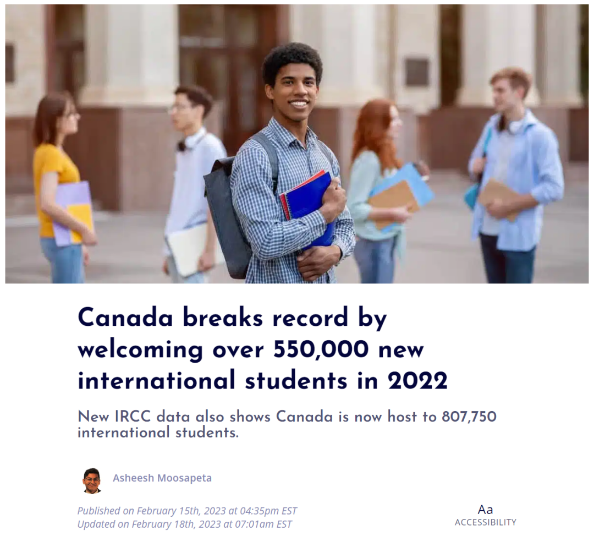 (原始链接: https://mmbiz.qpic.cn/mmbiz_png/904kUibXm7Y55wF2icjZfHzUp6Jiaicb5k3UIKQLvpxZq2d2nn9Pu3tuS434fS5j62Q7stZdpXXzRx4rs4h6X3LHvQ/640?wx_fmt=png)
-  (原始链接: https://mmbiz.qpic.cn/mmbiz_png/904kUibXm7Y55wF2icjZfHzUp6Jiaicb5k3Ukiaia9yTtWCPPTjnVNBfnfvyUO5y8LU6ia8WfnSTwLo3j7ayWAJMicEDyA/640?wx_fmt=png)
-  (原始链接: https://mmbiz.qpic.cn/mmbiz_png/904kUibXm7Y55wF2icjZfHzUp6Jiaicb5k3UC1icf9Uic4ibOPyoCTbDyCC8DpqRkmV3HfU7B54JfY7CiaS8RDEPtApD0g/640?wx_fmt=png)
- 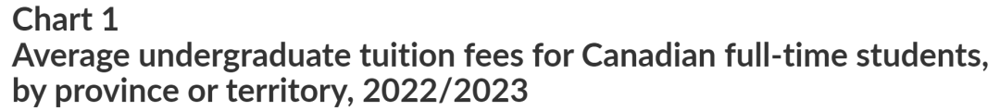 (原始链接: https://mmbiz.qpic.cn/mmbiz_png/904kUibXm7Y55wF2icjZfHzUp6Jiaicb5k3UiavzX9wOOPV4a8cpeguuKzP2XsIePJAcanhIwibzDgbksicqZhFicnxZibg/640?wx_fmt=png)
- 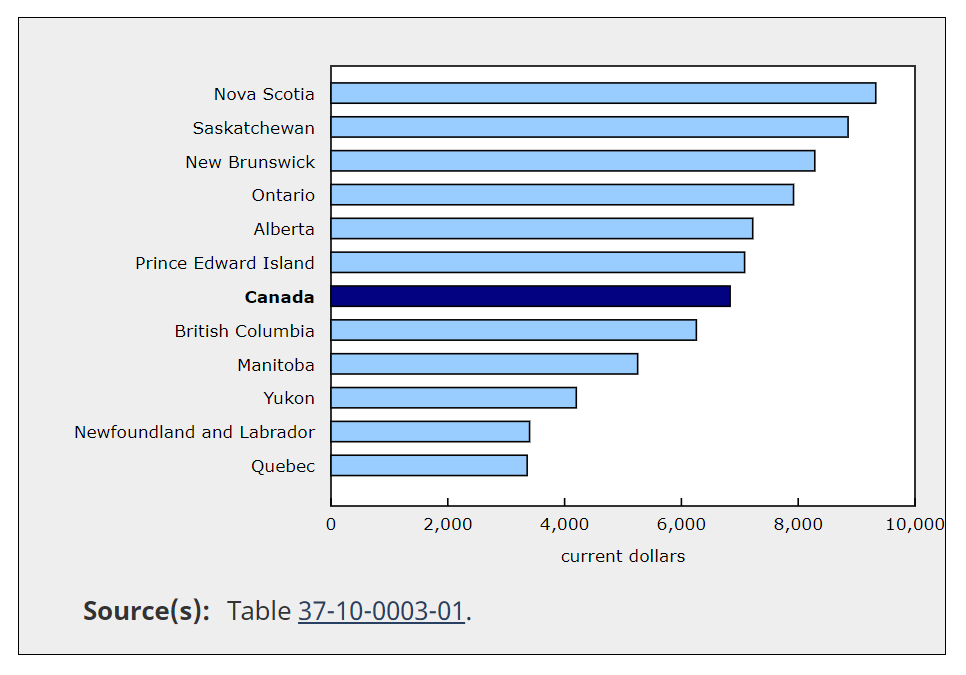 (原始链接: https://mmbiz.qpic.cn/mmbiz_png/904kUibXm7Y55wF2icjZfHzUp6Jiaicb5k3UkUhCWB4PKo10OYNDUBZLMMYEQdn6KAax230m6rD8tu8YGaE2ybhDKQ/640?wx_fmt=png)
- 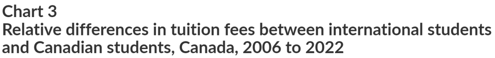 (原始链接: https://mmbiz.qpic.cn/mmbiz_png/904kUibXm7Y55wF2icjZfHzUp6Jiaicb5k3U4AJvictialfEO3tfxjhoI5mhWBYviaD8bLPhNw8FwicVCuc91J38oCiaHPg/640?wx_fmt=png)
- 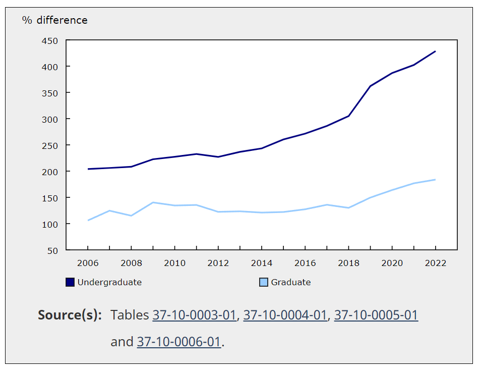 (原始链接: https://mmbiz.qpic.cn/mmbiz_png/904kUibXm7Y55wF2icjZfHzUp6Jiaicb5k3UEicYwVp33uqIazvHVWPWkJCn2VXuFq9R6icTWLNYkquDDaMc7iaV0r0DQ/640?wx_fmt=png)
- 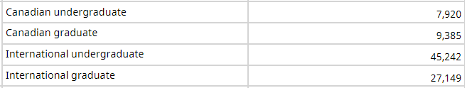 (原始链接: https://mmbiz.qpic.cn/mmbiz_png/904kUibXm7Y55wF2icjZfHzUp6Jiaicb5k3UbqhMh9DxxltoaMerxr7YHKiadqHePXu9VAgacWbqh6Hdic6Bx0UhZOmg/640?wx_fmt=png)
- 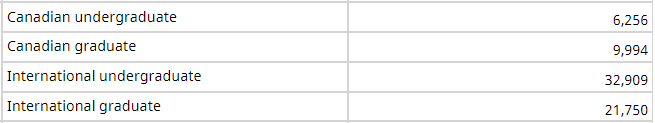 (原始链接: https://mmbiz.qpic.cn/mmbiz_png/904kUibXm7Y55wF2icjZfHzUp6Jiaicb5k3U3BMVND3oZQrOULz0jm2yrDpz18KvLx3sIjQ2ypxIlPBDjaqIB55crA/640?wx_fmt=png)
- 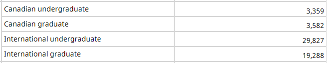 (原始链接: https://mmbiz.qpic.cn/mmbiz_png/904kUibXm7Y55wF2icjZfHzUp6Jiaicb5k3U2VJmJicJQDMn17wXQOa76S07uv6Kads6LqQwUdqyW5tWOoQ8nurLT3g/640?wx_fmt=png)
- 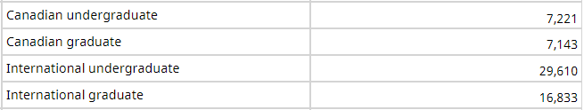 (原始链接: https://mmbiz.qpic.cn/mmbiz_png/904kUibXm7Y55wF2icjZfHzUp6Jiaicb5k3U8DqO9h4cmItEZmicrgIVMumvxqW5vT2AEXRppSBoMeUH48OZr2mf5sw/640?wx_fmt=png)
- 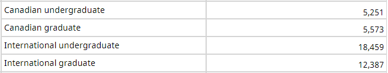 (原始链接: https://mmbiz.qpic.cn/mmbiz_png/904kUibXm7Y55wF2icjZfHzUp6Jiaicb5k3UGxngytS0z28qRc1ZEOQq98laQRvNA4cOxSwD3AzYl9I2kwSciadBcbQ/640?wx_fmt=png)
- 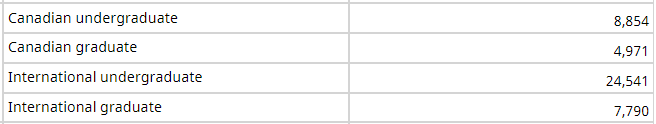 (原始链接: https://mmbiz.qpic.cn/mmbiz_png/904kUibXm7Y55wF2icjZfHzUp6Jiaicb5k3UcYeibdWWic2I0caFeib7CK22NN6osRWbuZVDxM6ic1jbHcyl4p0hib3cuXA/640?wx_fmt=png)
- 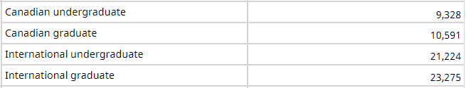 (原始链接: https://mmbiz.qpic.cn/mmbiz_png/904kUibXm7Y55wF2icjZfHzUp6Jiaicb5k3UVUv2tPfxjFjloIwngvtDJXL4Sal3Hm7iattkX2rGRU94EjfTtRcGxqg/640?wx_fmt=png)
- 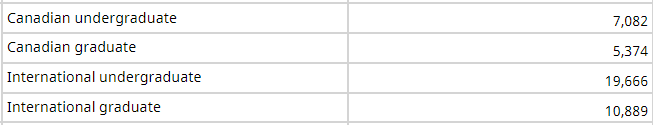 (原始链接: https://mmbiz.qpic.cn/mmbiz_png/904kUibXm7Y55wF2icjZfHzUp6Jiaicb5k3UibFj9AgrrBFuHZricnzmuLW9Aia1QjgRrW02ibBe7kmBRDb8Gk252jDmpQ/640?wx_fmt=png)
- 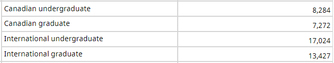 (原始链接: https://mmbiz.qpic.cn/mmbiz_png/904kUibXm7Y55wF2icjZfHzUp6Jiaicb5k3UNO49VqrfmnFlQAJ0RFFBEJyvBK5dabGhaklqVvrTybbj95xTicYKceQ/640?wx_fmt=png)
- 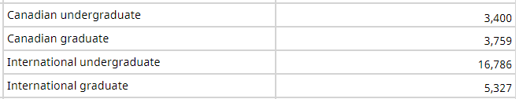 (原始链接: https://mmbiz.qpic.cn/mmbiz_png/904kUibXm7Y55wF2icjZfHzUp6Jiaicb5k3UD2EGd9tpRHMlibljsXFBOoqiawOEgzCg2mmP4icVAeIY9hMxpRta2CMYg/640?wx_fmt=png)
- 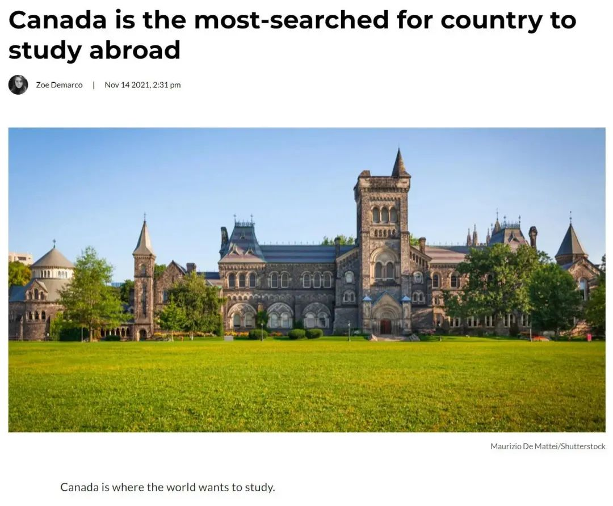 (原始链接: https://mmbiz.qpic.cn/mmbiz_jpg/904kUibXm7Y55wF2icjZfHzUp6Jiaicb5k3ULm2lIXznaBh1FA4CHFNjSNPzA9rWfUUB1ibn78tndshPZtfWfz7VAog/640?wx_fmt=jpeg)
- 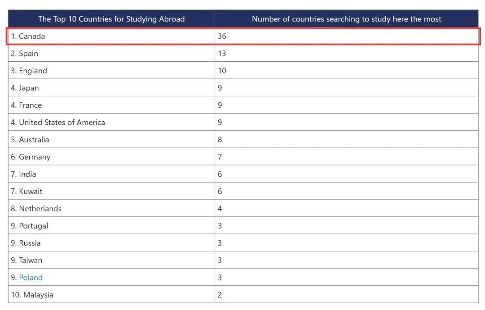 (原始链接: https://mmbiz.qpic.cn/mmbiz_jpg/904kUibXm7Y55wF2icjZfHzUp6Jiaicb5k3UNFBGaAgWXsicCgShaPzfx4rTRtcE2ferxnw60ezJZUcu6lSURvKB6Fg/640?wx_fmt=jpeg)
-  (原始链接: https://mmbiz.qpic.cn/mmbiz_jpg/904kUibXm7Y55wF2icjZfHzUp6Jiaicb5k3UXEaDibvKnGfPdl1ziaOBiaay1so1WKwGx7vpv0cstxVN2vAGDbYtGK67g/640?wx_fmt=jpeg)
-  (原始链接: https://mmbiz.qpic.cn/mmbiz_jpg/904kUibXm7Y55wF2icjZfHzUp6Jiaicb5k3UQytjDRexnbMgEqE8ORm0hSdL9klHVeNmNYia6f5DjsoP57klQt6RrqA/640?wx_fmt=jpeg)
-  (原始链接: https://mmbiz.qpic.cn/mmbiz_jpg/904kUibXm7Y55wF2icjZfHzUp6Jiaicb5k3Ukmdh8AJZKL87uNCibvup5XboS0phVIiaOlYtvwCfqJOicyJZGw8Vy8qSQ/640?wx_fmt=jpeg)
-  (原始链接: https://mmbiz.qpic.cn/mmbiz_png/904kUibXm7Y55wF2icjZfHzUp6Jiaicb5k3U3HOaRbm6ljHib0KZzV9XdRMhbFBrqQbhhN2Z9VnQmabJL36nCiaBkElg/640?wx_fmt=png)
-  (原始链接: https://mmbiz.qpic.cn/mmbiz_jpg/904kUibXm7Y55wF2icjZfHzUp6Jiaicb5k3UwvnMibJ6qCNBNWNTsEggue9Q6Rdu2UauuCKHEWiaeJoQh0QxcpU1Xjcw/640?wx_fmt=jpeg)
-  (原始链接: https://mmbiz.qpic.cn/mmbiz_jpg/904kUibXm7Y55wF2icjZfHzUp6Jiaicb5k3UBfa4V8mkWOviaNhvQpicPdg677RynMic6o97wF1tCltKHia0pCXwR9a0GQ/640?wx_fmt=jpeg)
-  (原始链接: https://mmbiz.qpic.cn/mmbiz_png/904kUibXm7Y55wF2icjZfHzUp6Jiaicb5k3UmkcAEfL31Zac8M9rsVfLhLWFRFQmOLHNpgnhKLwIn1ic98Ar3Uibic9mA/640?wx_fmt=png)
-  (原始链接: https://mmbiz.qpic.cn/mmbiz_jpg/904kUibXm7Y55wF2icjZfHzUp6Jiaicb5k3UPgTBKLfyyn1Q2hlC1BJTqkVcULHc5ZNLApQiaO2z0D2C2iauk40UODBQ/640?wx_fmt=jpeg)
-  (原始链接: https://mmbiz.qpic.cn/mmbiz_jpg/904kUibXm7Y55wF2icjZfHzUp6Jiaicb5k3UVUwGopyMOiaRT7oeOxsjYgGfXqW7AgqjrrTWbMOGECMr2icrK9wmNdhw/640?wx_fmt=jpeg)
-  (原始链接: https://mmbiz.qpic.cn/mmbiz_jpg/904kUibXm7Y55wF2icjZfHzUp6Jiaicb5k3UR0KVH6VIZeLPWwJeEc0ibrXaKXxXhLDFN177jHscKd22WgjXsbLp0gA/640?wx_fmt=jpeg)
