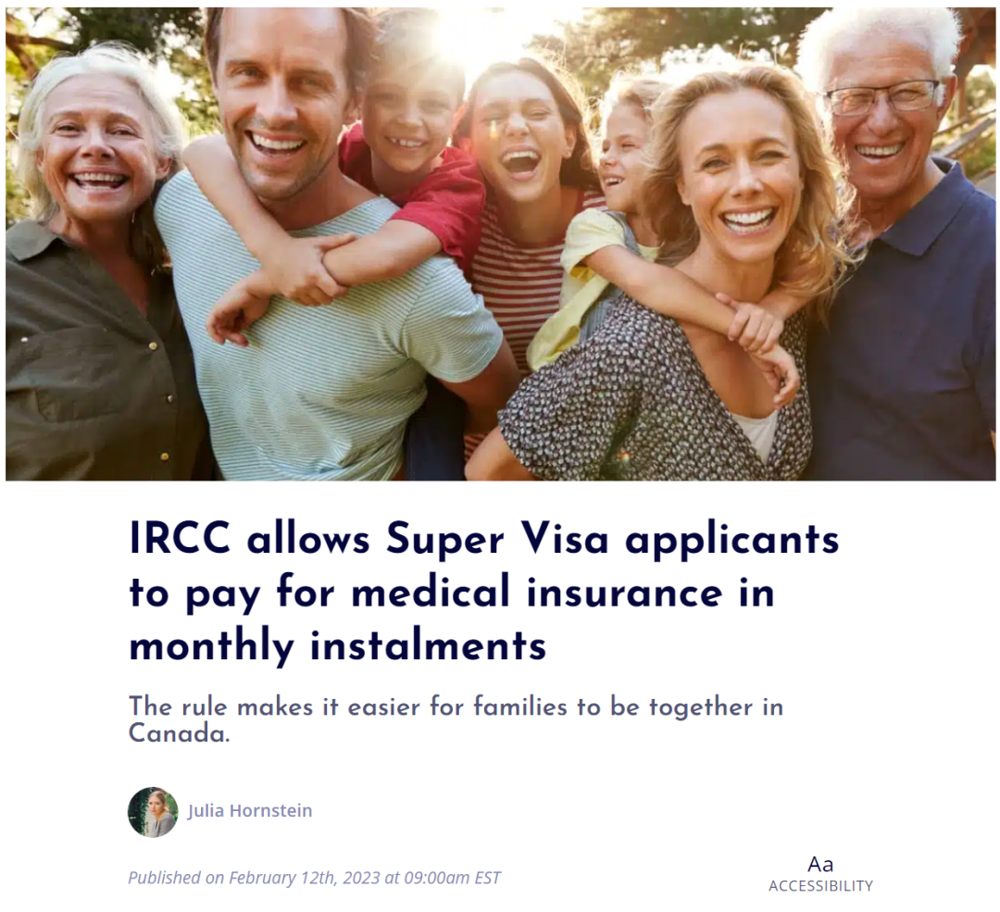
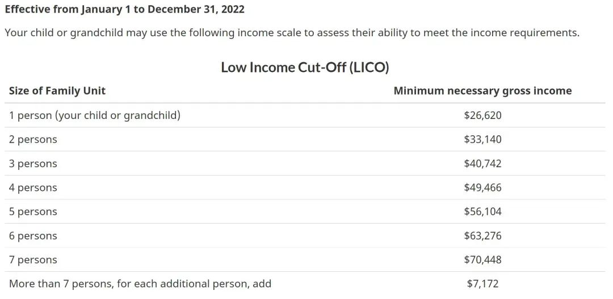
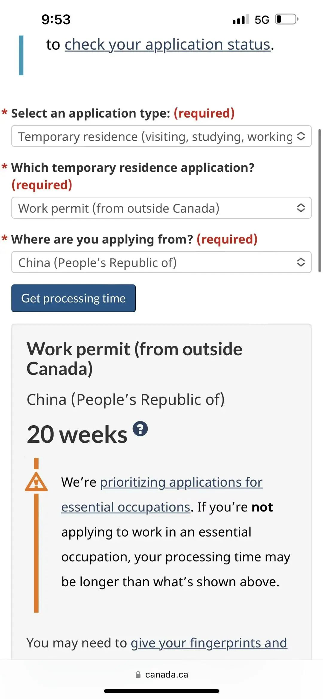
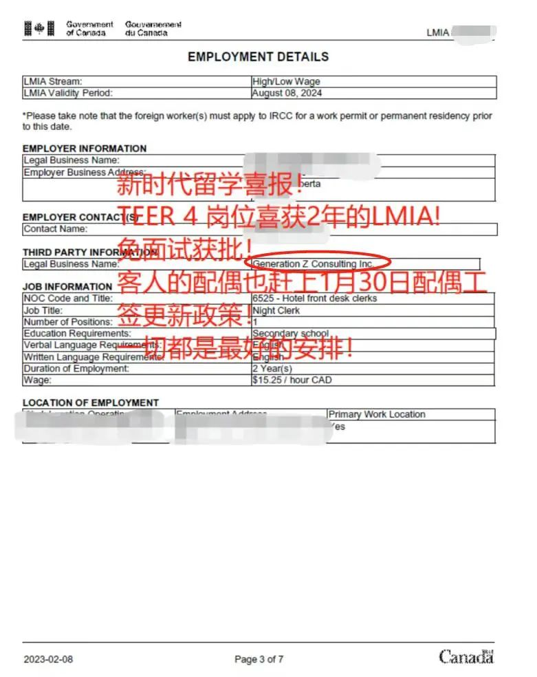
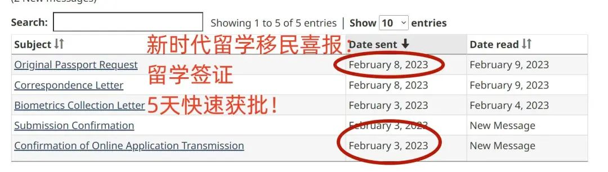
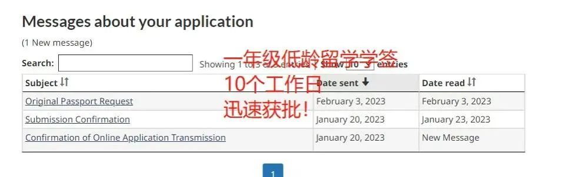
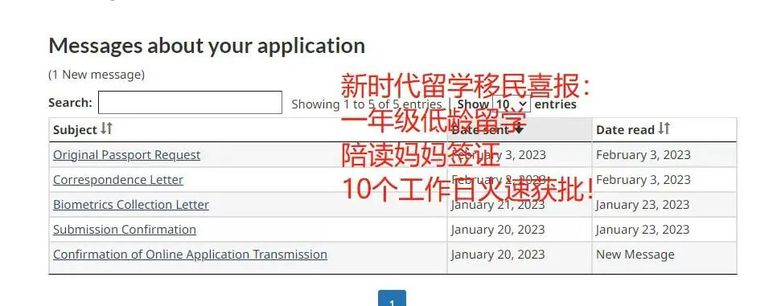
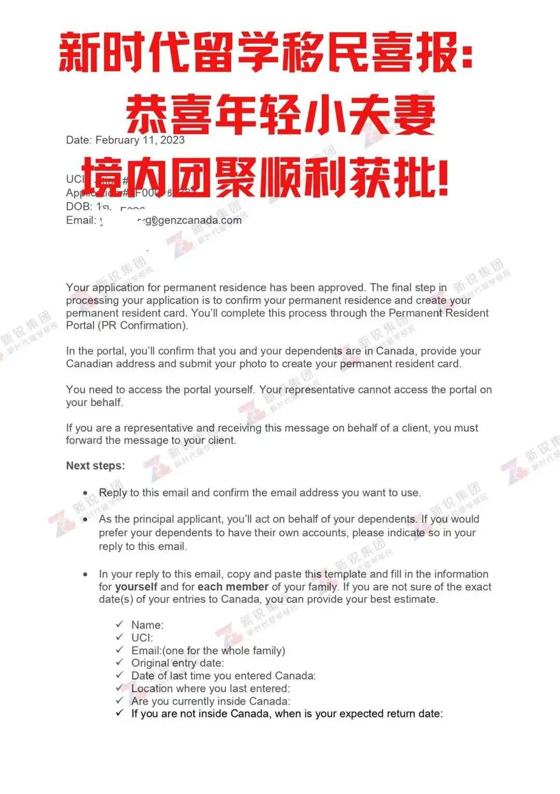
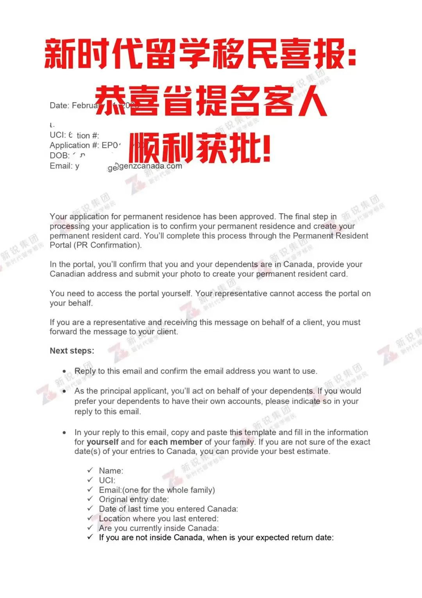

# 无标题

**链接地址:** http://mp.weixin.qq.com/s?__biz=MzUyNzA2NTAwNg==&mid=2247492935&idx=1&sn=11ced79ba00da5295de285c6e3cc6391&chksm=fa07ef86cd70669048eb93c00d02750a038186bbaad002034f0724fe1a13b55db77a8798f3eb&mpshare=1&scene=2&srcid=0222v7DnQlb8x8BnXu7M2MiJ&sharer_sharetime=1677014807281&sharer_shareid=77848a6b3852ae4dcb6c74ffee84743c#rd
**作者:** 你身边的签证专家
**获取时间:** 2025/8/28 19:19:55
**图片数量:** 33

---

## 原始HTML内容

<section style="box-sizing: border-box;font-size: 16px;"><section style="text-align: center;margin-top: 10px;margin-bottom: 10px;line-height: 0;box-sizing: border-box;" powered-by="xiumi.us"><section style="max-width: 100%;vertical-align: middle;display: inline-block;line-height: 0;box-sizing: border-box;"></section></section><section style="text-align: center;margin-top: 10px;margin-bottom: 10px;line-height: 0;box-sizing: border-box;" powered-by="xiumi.us"><section style="max-width: 100%;vertical-align: middle;display: inline-block;line-height: 0;box-sizing: border-box;"></section></section>
 
<section style="font-size: 19px;text-align: center;margin-top: 10px;margin-bottom: 3px;box-sizing: border-box;" powered-by="xiumi.us"><section style="display: inline-block;border-width: 1px;border-style: solid;border-color: rgb(188, 65, 65);background-color: rgb(188, 65, 65);width: 1.8em;height: 1.8em;line-height: 1.8em;border-radius: 100%;margin-left: auto;margin-right: auto;font-size: 16px;color: rgb(255, 255, 255);box-sizing: border-box;">
<strong style="box-sizing: border-box;">1</strong>
</section></section><section style="text-align: center;box-sizing: border-box;" powered-by="xiumi.us"><section style="display: inline-block;width: 0px;height: 0px;vertical-align: top;overflow: hidden;border-style: solid;border-width: 9px 6px 0px;border-color: rgb(188, 65, 65) rgba(255, 255, 255, 0) rgba(255, 255, 255, 0);box-sizing: border-box;"><svg viewBox="0 0 1 1" style="float:left;line-height:0;width:0;vertical-align:top;"></svg></section></section><section style="margin-bottom: 10px;text-align: center;justify-content: center;display: flex;flex-flow: row nowrap;box-sizing: border-box;" powered-by="xiumi.us"><section style="display: inline-block;width: auto;vertical-align: middle;background-color: rgba(109, 155, 209, 0.1);min-width: 10%;max-width: 100%;flex: 0 0 auto;height: auto;align-self: center;padding: 12px;box-sizing: border-box;"><section style="color: rgb(109, 155, 209);text-align: justify;box-sizing: border-box;" powered-by="xiumi.us">
<strong style="box-sizing: border-box;">加拿大超级签证政策新调整</strong>
</section></section></section><section style="font-size: 14px;padding-right: 15px;padding-left: 15px;letter-spacing: 1px;box-sizing: border-box;" powered-by="xiumi.us">
 

近日，加拿大移民部(IRCC)宣布对超级签证<strong style="box-sizing: border-box;">申请人支付医疗保险的方式进行调整</strong>。

 

想要获得超级签证，申请人需要拥有符合以下标准的<strong style="box-sizing: border-box;">私人医疗保险:</strong> 

 
<ul class="list-paddingleft-1"><li style="box-sizing: border-box;">
<em style="box-sizing: border-box;">保险涵盖申请人的保健、住院和遣返费用</em>
</li><li style="box-sizing: border-box;">
<em style="box-sizing: border-box;">提供至少10万加币的的紧急保险 </em>
</li><li style="box-sizing: border-box;">
<em style="box-sizing: border-box;">从进入加拿大之日起有效期至少为一年，并可在再次进入加拿大时由边境服务官员审查</em>
</li></ul></section>
 
<section style="text-align: center;margin-top: 10px;margin-bottom: 10px;line-height: 0;box-sizing: border-box;" powered-by="xiumi.us"><section style="max-width: 100%;vertical-align: middle;display: inline-block;line-height: 0;width: 90%;height: auto;box-sizing: border-box;"></section></section><section style="font-size: 14px;padding-right: 15px;padding-left: 15px;letter-spacing: 1px;box-sizing: border-box;" powered-by="xiumi.us">
 

虽然申请人以前被允许以每月分期付款的方式支付保险，但移民局在<strong style="box-sizing: border-box;">2022年8月</strong>宣布将要求每年预付费用。 

 

这一政策遭到了申请人群体的强烈反对，他们认为要求提前支付一整年的费用会<strong style="box-sizing: border-box;">对申请人造成经济上的负担</strong>。

 

此外，许多人认为这对那些希望能够家庭团聚但无力支付前期医疗费用的家庭是一种惩罚，导致符合条件的家庭非常少。

 
</section><section style="text-align: center;margin-top: 10px;margin-bottom: 10px;line-height: 0;box-sizing: border-box;" powered-by="xiumi.us"><section style="max-width: 100%;vertical-align: middle;display: inline-block;line-height: 0;width: 90%;height: auto;box-sizing: border-box;"></section></section><section style="font-size: 14px;padding-right: 15px;padding-left: 15px;letter-spacing: 1px;box-sizing: border-box;" powered-by="xiumi.us">
 

近日，加拿大移民局宣布取消这项要求，申请人可以<strong style="box-sizing: border-box;">再次按月分期支付保险费用</strong>。

 

移民局一位发言人表示，新规定的改变是为了展示<strong style="box-sizing: border-box;">加拿大对家庭团聚的重视</strong>。

 

 
</section><section style="font-size: 19px;text-align: center;margin-top: 10px;margin-bottom: 3px;box-sizing: border-box;" powered-by="xiumi.us"><section style="display: inline-block;border-width: 1px;border-style: solid;border-color: rgb(188, 65, 65);background-color: rgb(188, 65, 65);width: 1.8em;height: 1.8em;line-height: 1.8em;border-radius: 100%;margin-left: auto;margin-right: auto;font-size: 16px;color: rgb(255, 255, 255);box-sizing: border-box;">
<strong style="box-sizing: border-box;">2</strong>
</section></section><section style="text-align: center;box-sizing: border-box;" powered-by="xiumi.us"><section style="display: inline-block;width: 0px;height: 0px;vertical-align: top;overflow: hidden;border-style: solid;border-width: 9px 6px 0px;border-color: rgb(188, 65, 65) rgba(255, 255, 255, 0) rgba(255, 255, 255, 0);box-sizing: border-box;"><svg viewBox="0 0 1 1" style="float:left;line-height:0;width:0;vertical-align:top;"></svg></section></section><section style="margin-bottom: 10px;text-align: center;justify-content: center;display: flex;flex-flow: row nowrap;box-sizing: border-box;" powered-by="xiumi.us"><section style="display: inline-block;width: auto;vertical-align: middle;background-color: rgba(109, 155, 209, 0.1);min-width: 10%;max-width: 100%;flex: 0 0 auto;height: auto;align-self: center;padding: 12px;box-sizing: border-box;"><section style="color: rgb(109, 155, 209);text-align: justify;box-sizing: border-box;" powered-by="xiumi.us">
<strong style="box-sizing: border-box;">性价比超高的“超级签证”</strong> 
</section></section></section>
 
<section style="font-size: 14px;padding-right: 15px;padding-left: 15px;letter-spacing: 1px;box-sizing: border-box;" powered-by="xiumi.us">
海外的游子最大的心愿就是能与天各一方的家人团聚，然而近年来受到疫情和战事影响，加拿大的移民部无暇顾及<strong style="box-sizing: border-box;">家庭类别（Family Class）</strong>的移民需求，让本来就名额稀少的<strong style="box-sizing: border-box;">加拿大父母团聚移民（</strong><strong style="box-sizing: border-box;">Parents and Grandparents Program）</strong>项目受到牵连，<strong style="box-sizing: border-box;">纯靠运气抽签</strong>的方式更是让各位子女们操碎了心。

 

不过，加拿大作为一个十分人性化的国家，为本国公民或永久居民想要与海外的家人团聚提供了许多<strong style="box-sizing: border-box;">高性价比的替代方法</strong>，比如近期询问度飙升的<strong style="box-sizing: border-box;">超级签证</strong>！

 
</section><section style="text-align: center;margin-top: 10px;margin-bottom: 10px;line-height: 0;box-sizing: border-box;" powered-by="xiumi.us"><section style="max-width: 100%;vertical-align: middle;display: inline-block;line-height: 0;width: 90%;height: auto;box-sizing: border-box;"></section></section><section style="font-size: 14px;padding-right: 15px;padding-left: 15px;letter-spacing: 1px;box-sizing: border-box;" powered-by="xiumi.us">
 

这个不用参与靠人品抽签制度就可以帮助父母长辈来到加拿大的办法，申请门槛更低！还可以帮助家里的亲人迅速来到加拿大团聚，可是加拿大<strong style="box-sizing: border-box;">移民部官方推荐的哦！</strong>

 
</section>
 
<section style="font-size: 19px;text-align: center;margin-top: 10px;margin-bottom: 3px;box-sizing: border-box;" powered-by="xiumi.us"><section style="display: inline-block;border-width: 1px;border-style: solid;border-color: rgb(188, 65, 65);background-color: rgb(188, 65, 65);width: 1.8em;height: 1.8em;line-height: 1.8em;border-radius: 100%;margin-left: auto;margin-right: auto;font-size: 16px;color: rgb(255, 255, 255);box-sizing: border-box;">
<strong style="box-sizing: border-box;">3</strong>
</section></section><section style="text-align: center;box-sizing: border-box;" powered-by="xiumi.us"><section style="display: inline-block;width: 0px;height: 0px;vertical-align: top;overflow: hidden;border-style: solid;border-width: 9px 6px 0px;border-color: rgb(188, 65, 65) rgba(255, 255, 255, 0) rgba(255, 255, 255, 0);box-sizing: border-box;"><svg viewBox="0 0 1 1" style="float:left;line-height:0;width:0;vertical-align:top;"></svg></section></section><section style="margin-bottom: 10px;text-align: center;justify-content: center;display: flex;flex-flow: row nowrap;box-sizing: border-box;" powered-by="xiumi.us"><section style="display: inline-block;width: auto;vertical-align: middle;background-color: rgba(109, 155, 209, 0.1);min-width: 10%;max-width: 100%;flex: 0 0 auto;height: auto;align-self: center;padding: 12px;box-sizing: border-box;"><section style="color: rgb(109, 155, 209);text-align: justify;box-sizing: border-box;" powered-by="xiumi.us">
<strong style="box-sizing: border-box;">2022年超级签证新政推出</strong> 
</section></section></section><section style="font-size: 14px;padding-right: 15px;padding-left: 15px;letter-spacing: 1px;box-sizing: border-box;" powered-by="xiumi.us">
 

从2022年7月4日起，超级签证入境最长可以<strong style="box-sizing: border-box;">停留5年</strong>，<strong style="box-sizing: border-box;">续签后最长可以停留2年</strong>，且没有官方说明不可多次续签。新政之后，公民或永久居民的父母在境内停留的时间被极大延长，让即使没有移民的父母们也能愉快享受在加拿大居住生活的幸福时光！

 
</section><section style="text-align: center;margin-top: 10px;margin-bottom: 10px;line-height: 0;box-sizing: border-box;" powered-by="xiumi.us"><section style="max-width: 100%;vertical-align: middle;display: inline-block;line-height: 0;width: 100%;height: auto;box-sizing: border-box;"></section></section>
 
<section style="font-size: 19px;text-align: center;margin-top: 10px;margin-bottom: 3px;box-sizing: border-box;" powered-by="xiumi.us"><section style="display: inline-block;border-width: 1px;border-style: solid;border-color: rgb(188, 65, 65);background-color: rgb(188, 65, 65);width: 1.8em;height: 1.8em;line-height: 1.8em;border-radius: 100%;margin-left: auto;margin-right: auto;font-size: 16px;color: rgb(255, 255, 255);box-sizing: border-box;">
<strong>4</strong>
</section></section><section style="text-align: center;box-sizing: border-box;" powered-by="xiumi.us"><section style="display: inline-block;width: 0px;height: 0px;vertical-align: top;overflow: hidden;border-style: solid;border-width: 9px 6px 0px;border-color: rgb(188, 65, 65) rgba(255, 255, 255, 0) rgba(255, 255, 255, 0);box-sizing: border-box;"><svg viewBox="0 0 1 1" style="float:left;line-height:0;width:0;vertical-align:top;"></svg></section></section><section style="margin-bottom: 10px;text-align: center;justify-content: center;display: flex;flex-flow: row nowrap;box-sizing: border-box;" powered-by="xiumi.us"><section style="display: inline-block;width: auto;vertical-align: middle;background-color: rgba(109, 155, 209, 0.1);min-width: 10%;max-width: 100%;flex: 0 0 auto;height: auto;align-self: center;padding: 12px;box-sizing: border-box;"><section style="color: rgb(109, 155, 209);text-align: justify;box-sizing: border-box;" powered-by="xiumi.us">
<strong style="box-sizing: border-box;">什么是加拿大“超级签证”</strong> 
</section></section></section><section style="font-size: 14px;padding-right: 15px;padding-left: 15px;letter-spacing: 1px;box-sizing: border-box;" powered-by="xiumi.us">
 

十多年来，超级签证一直是加拿大永久居民和公民与他们的父母/祖父母团聚加拿大的<strong style="box-sizing: border-box;">热门选项</strong>。每年，加拿大移民、难民和公民部都会签发大约<strong style="box-sizing: border-box;">17,000张超级签证</strong>。

 

父母/祖父母超级签证 (Super Visa) 是加拿大针对永久居民/公民的探亲家长推出的长期居住签证项目。Super Visa允许家长入境后居住长达5年，<strong style="box-sizing: border-box;">非常适合个人时间充裕的父母，或自己在加拿大需要家长陪伴的朋友们</strong>。 (比如有了孩子后想要父母来长期陪伴孩子) 

 

因为是长期居住的访客签证，除了申请人必须是加拿大永久居民或公民之外，还要提供充足的<strong style="box-sizing: border-box;">资金证明，以及提前购买医疗保险等</strong>。

 
</section><section style="text-align: center;margin-top: 10px;margin-bottom: 10px;line-height: 0;box-sizing: border-box;" powered-by="xiumi.us"><section style="max-width: 100%;vertical-align: middle;display: inline-block;line-height: 0;width: 90%;height: auto;box-sizing: border-box;"></section></section><section style="font-size: 14px;padding-right: 15px;padding-left: 15px;letter-spacing: 1px;box-sizing: border-box;" powered-by="xiumi.us">
 

 

<strong style="box-sizing: border-box;">资金和收入要求?</strong> 

<strong style="box-sizing: border-box;"> </strong>
</section><section style="font-size: 14px;padding-right: 15px;padding-left: 15px;letter-spacing: 1px;box-sizing: border-box;" powered-by="xiumi.us">
超级签证适用于加拿大永久居民和公民的父母和祖父母。为了帮助他们获得签证，你需要写一封<strong style="box-sizing: border-box;">邀请函</strong>，并附上你的永久居住权或公民身份文件。&nbsp;&nbsp; 

 
</section><section style="text-align: center;margin-top: 10px;margin-bottom: 10px;line-height: 0;box-sizing: border-box;" powered-by="xiumi.us"><section style="max-width: 100%;vertical-align: middle;display: inline-block;line-height: 0;width: 90%;height: auto;box-sizing: border-box;"></section></section><section style="font-size: 14px;padding-right: 15px;padding-left: 15px;letter-spacing: 1px;box-sizing: border-box;" powered-by="xiumi.us">
 

在邀请函中，需要承诺父母在加拿大的整个逗留期间， 会在经济上支持他们。还需要证明你的收入达到或超过<strong style="box-sizing: border-box;">低收入分界点(LICO)</strong>。为此，需要一份家庭中所有人的名单，因为LICO部分取决于家庭规模。

 

比如，邀请人的家庭是一家3口的小家庭，邀请父母2人来加拿大，那么这个家庭就是<strong style="box-sizing: border-box;">5人家庭</strong>，邀请人和配偶的收入总和需要超过图中的<strong style="box-sizing: border-box;">56,104加元</strong>。

 

（注意，低收入分界点的最低要求每年会根据多项因素改变，通常是提高！因此为父母申请超级签证的朋友们，宜早不宜晚哦~）

 
</section><section style="margin-top: 10px;margin-bottom: 10px;text-align: center;box-sizing: border-box;" powered-by="xiumi.us"><section style="padding-left: 1em;padding-right: 1em;display: inline-block;box-sizing: border-box;">
<strong style="box-sizing: border-box;">资金证明文件包括</strong>
 </section><section style="border-width: 1px;border-style: solid;border-color: rgb(192, 200, 209);margin-top: -1em;padding: 20px 10px 10px;background-color: rgb(239, 239, 239);box-sizing: border-box;"><section style="font-size: 14px;box-sizing: border-box;" powered-by="xiumi.us">
 

<strong style="box-sizing: border-box;">最近纳税年度的评估通知NOA </strong>

<strong style="box-sizing: border-box;">T4或T1 </strong>

<strong style="box-sizing: border-box;">就业保险单 </strong>

<strong style="box-sizing: border-box;">包括工资和雇佣日期的雇佣信 </strong>

<strong style="box-sizing: border-box;">工资单和银行对帐单</strong>

 
</section></section></section>
 

 
<section style="font-size: 19px;text-align: center;margin-top: 10px;margin-bottom: 3px;box-sizing: border-box;" powered-by="xiumi.us"><section style="display: inline-block;border-width: 1px;border-style: solid;border-color: rgb(188, 65, 65);background-color: rgb(188, 65, 65);width: 1.8em;height: 1.8em;line-height: 1.8em;border-radius: 100%;margin-left: auto;margin-right: auto;font-size: 16px;color: rgb(255, 255, 255);box-sizing: border-box;">
<strong>5</strong>
</section></section><section style="text-align: center;box-sizing: border-box;" powered-by="xiumi.us"><section style="display: inline-block;width: 0px;height: 0px;vertical-align: top;overflow: hidden;border-style: solid;border-width: 9px 6px 0px;border-color: rgb(188, 65, 65) rgba(255, 255, 255, 0) rgba(255, 255, 255, 0);box-sizing: border-box;"><svg viewBox="0 0 1 1" style="float:left;line-height:0;width:0;vertical-align:top;"></svg></section></section><section style="margin-bottom: 10px;text-align: center;justify-content: center;display: flex;flex-flow: row nowrap;box-sizing: border-box;" powered-by="xiumi.us"><section style="display: inline-block;width: auto;vertical-align: middle;background-color: rgba(109, 155, 209, 0.1);min-width: 10%;max-width: 100%;flex: 0 0 auto;height: auto;align-self: center;padding: 12px;box-sizing: border-box;"><section style="color: rgb(109, 155, 209);text-align: justify;box-sizing: border-box;" powered-by="xiumi.us">
<strong style="box-sizing: border-box;">“超级签证”和“探亲签证”的区别</strong> 
</section></section></section><section style="font-size: 14px;padding-right: 15px;padding-left: 15px;letter-spacing: 1px;box-sizing: border-box;" powered-by="xiumi.us">
 
</section><section style="text-align: center;margin-top: 10px;margin-bottom: 10px;line-height: 0;box-sizing: border-box;" powered-by="xiumi.us"><section style="max-width: 100%;vertical-align: middle;display: inline-block;line-height: 0;width: 90%;height: auto;box-sizing: border-box;"></section></section><section style="font-size: 14px;padding-right: 15px;padding-left: 15px;letter-spacing: 1px;box-sizing: border-box;" powered-by="xiumi.us">
 

<strong style="box-sizing: border-box;">超级签证（Super Visa）</strong>是加拿大政府签发给加拿大公民或永久居民的父母及祖父母，帮助家庭探亲团聚的一种签证。

 

<strong style="box-sizing: border-box;">加拿大父母探亲签证（Visitor Visa）</strong>是父母前往加拿大探访在加工作，定居或是留学的子女所需要申请的一种签证, 属于因私临时居民访问签证（temporary residence visa）的一种。
</section><section style="font-size: 14px;padding-right: 15px;padding-left: 15px;letter-spacing: 1px;box-sizing: border-box;" powered-by="xiumi.us">
 

<strong style="box-sizing: border-box;">看起来十分相似，但这两种类型的签证区别在哪里呢？</strong>

 

<strong style="box-sizing: border-box;">子女身份</strong>

对于申请父母探亲签证，申请人子女不一定是加拿大公民或永久居民，只要长期在此生活，比如留学，工作。但对于超级签证，申请人的子女却必须是加拿大公民或永久居民。 

 

<strong style="box-sizing: border-box;">签证有效期</strong>

这一点上，两种签证是相同的。最高都可达到10年，申请人可以申请单次或多次往返。 

 

<strong style="box-sizing: border-box;">每次入境停留时间</strong>

对于申请父母探亲签证，每次入境由移民局官员批准可停留时间，一般在半年左右。但对于超级签证，<strong style="box-sizing: border-box;">每次最长可在加停留5年而不需要更新身份</strong>。 

 

<strong style="box-sizing: border-box;">移民倾向</strong>

和探亲签证等其他签证相比，超级签证的审核并不看重申请人的移民倾向，也就是与原居住国的联结关系。

 

普通探亲签证的申请人通常会被要求递交房产存款，国内的亲属配偶证明等文件以向签证官员证明自己在逗留期结束后无意长期停留而回返回居住国。因此，超级签证也适合移民申请递交后处于等待期的父母，以及申请普通探亲签证失败的父母（前提是在加子女/孙子女需是加拿大公民或是永久居民），超级签证的申请都会为他们带来很好的效果。 

 
</section><section style="text-align: center;margin-top: 10px;margin-bottom: 10px;line-height: 0;box-sizing: border-box;" powered-by="xiumi.us"><section style="max-width: 100%;vertical-align: middle;display: inline-block;line-height: 0;width: 90%;height: auto;box-sizing: border-box;"></section></section><section style="font-size: 14px;padding-right: 15px;padding-left: 15px;letter-spacing: 1px;box-sizing: border-box;" powered-by="xiumi.us">
 

<strong style="box-sizing: border-box;">收入要求</strong>

在邀请一方的收入要求上，二者也存在一些差别。普通的父母探亲签证申请虽然需要在加邀请方递交收入证明，但是并没有做出收入上的要求。通常在加工作的子女需要出具可靠的收入及财政状况证明，如加拿大税务总局出具的税单(NOA)，显示收入情况的雇佣证明信，工资单，银行对账单，执业专业 人士出具的薪酬支付报表或财务报表。在加拿大留学的学生则不需要递交，只需要提供校方出具的接受函。但是对于超级签证，在邀请方的收入上却有明确的规定，并且标准每年都在浮动变化。
</section><section style="font-size: 14px;padding-right: 15px;padding-left: 15px;letter-spacing: 1px;box-sizing: border-box;" powered-by="xiumi.us">
 

<strong style="box-sizing: border-box;">保险</strong>

<strong style="box-sizing: border-box;">父母探亲签证对于保险没有任何要求</strong>，但是也鼓励申请人在赴加逗留期内有旅游意外险以保证自身安全。但是<strong style="box-sizing: border-box;">超级签证需要申请人提供一份个人的保险证明</strong>: 必须是<strong style="box-sizing: border-box;">自入境之日起至少一年内有效</strong>；并且需是来自于加拿大保险公司；它应当涵盖申请人医疗、住院和医疗转运费用; 至少十万加元的保险；并且每次入加均有效。 

 
</section><section style="text-align: center;margin-top: 10px;margin-bottom: 10px;line-height: 0;box-sizing: border-box;" powered-by="xiumi.us"><section style="max-width: 100%;vertical-align: middle;display: inline-block;line-height: 0;box-sizing: border-box;"></section></section><section style="font-size: 14px;padding-right: 15px;padding-left: 15px;letter-spacing: 1px;box-sizing: border-box;" powered-by="xiumi.us">
 
</section><section style="font-size: 14px;padding-right: 15px;padding-left: 15px;letter-spacing: 1px;box-sizing: border-box;" powered-by="xiumi.us">
 

通过如上的对比，我们对这两种签证也有了很好的认识。申请时也应根据自身条件和需求来选择适合自己的类型。

<strong style="box-sizing: border-box;"> </strong>

<strong style="box-sizing: border-box;">如果你需要申请超级签证、父母探亲签证或者父母团聚移民，都欢迎联系新时代留学移民法律事务所进行办理哦~</strong>
</section>
 
<section style="margin: 10px 0%;text-align: left;justify-content: flex-start;display: flex;flex-flow: row nowrap;box-sizing: border-box;" powered-by="xiumi.us"><section style="display: inline-block;width: 100%;vertical-align: top;background-color: rgb(216, 202, 160);line-height: 0;align-self: flex-start;flex: 0 0 auto;box-sizing: border-box;"><section style="text-align: justify;justify-content: flex-start;display: flex;flex-flow: row nowrap;box-sizing: border-box;" powered-by="xiumi.us"><section style="display: inline-block;width: 100%;vertical-align: top;background-position: 0% 0%;background-repeat: repeat;background-size: 1.56658%;background-attachment: scroll;align-self: flex-start;flex: 0 0 auto;background-image: url(&quot;https://mmbiz.qpic.cn/mmbiz_png/904kUibXm7Y7b9mibfan2T93zY74qtwNwE7Yu237Z8c0yO6As6AhUg5mHPwibQsoHEzsX3xBFQIK5yrZO63HvmiaoA/640?wx_fmt=png&quot;);box-sizing: border-box;"><section style="text-align: center;box-sizing: border-box;" powered-by="xiumi.us"><section style="display: inline-block;width: 100%;height: 11px;vertical-align: top;overflow: hidden;background-color: rgba(255, 255, 255, 0);box-sizing: border-box;"><svg viewBox="0 0 1 1" style="float:left;line-height:0;width:0;vertical-align:top;"></svg></section></section></section></section></section></section><section style="font-size: 14px;padding-right: 15px;padding-left: 15px;letter-spacing: 1px;box-sizing: border-box;" powered-by="xiumi.us">
 

为了加快加拿大疫情后的经济复苏，加拿大移民部门对于各类签证和移民申请的<strong style="box-sizing: border-box;">审批也逐步加速</strong>。近期加拿大移民政策进入变革期，不少项目都进行了大幅度的调整，影响到申请者的<strong style="box-sizing: border-box;">申请策略和效率</strong>。

 

近期，新时代捷报频传，和客户们一起收到了许多好消息！移民部的审批速度大幅提高，许多签证的办理速度都<strong style="box-sizing: border-box;">远远快于官方给出的时间参考</strong>：
</section>
 
<section style="margin: 20px 0% 5px;text-align: center;transform: translate3d(1px, 0px, 0px);-webkit-transform: translate3d(1px, 0px, 0px);-moz-transform: translate3d(1px, 0px, 0px);-o-transform: translate3d(1px, 0px, 0px);box-sizing: border-box;" powered-by="xiumi.us"><section style="font-size: 26px;font-family: Optima-Regular, PingFangTC-light;color: rgb(0, 0, 0);letter-spacing: 2px;line-height: 1;box-sizing: border-box;">
<strong style="box-sizing: border-box;"># LMIA境外工签 #</strong>
</section></section><section style="text-align: center;justify-content: center;margin-top: 1px;margin-right: 0%;margin-left: 0%;display: flex;flex-flow: row nowrap;box-sizing: border-box;" powered-by="xiumi.us"><section style="display: inline-block;width: 100px;vertical-align: top;flex: 0 0 auto;height: auto;border-top: 0px solid rgb(43, 65, 110);border-top-left-radius: 0px;align-self: flex-start;line-height: 0;box-sizing: border-box;"><section style="margin-right: 0%;margin-bottom: 8px;margin-left: 0%;transform: translate3d(1px, 0px, 0px);box-sizing: border-box;" powered-by="xiumi.us"><section style="background-color: rgb(43, 65, 110);height: 1px;box-sizing: border-box;"><svg viewBox="0 0 1 1" style="float:left;line-height:0;width:0;vertical-align:top;"></svg></section></section></section></section><section style="text-align: center;margin: -24px 0% 10px;box-sizing: border-box;" powered-by="xiumi.us"><section style="display: inline-block;width: 46px;height: 33px;vertical-align: top;overflow: hidden;background-color: rgba(255, 174, 174, 0.13);border-width: 0px;border-radius: 206% 134% 167% 138%;border-style: none;border-color: rgb(62, 62, 62);box-sizing: border-box;"><svg viewBox="0 0 1 1" style="float:left;line-height:0;width:0;vertical-align:top;"></svg></section></section><section style="margin-top: 10px;margin-right: 0%;margin-left: 0%;text-align: left;justify-content: flex-start;display: flex;flex-flow: row nowrap;box-sizing: border-box;" powered-by="xiumi.us"><section style="display: inline-block;width: 100%;vertical-align: top;background-color: rgb(255, 244, 229);padding: 20px 20px 25px;box-shadow: rgb(0, 0, 0) 0px 0px 0px;align-self: flex-start;flex: 0 0 auto;box-sizing: border-box;"><section style="text-align: center;margin-top: 10px;margin-right: 0%;margin-left: 0%;justify-content: center;display: flex;flex-flow: row nowrap;box-sizing: border-box;" powered-by="xiumi.us"><section style="display: inline-block;width: 100%;vertical-align: top;border-width: 0px;border-radius: 8px;border-style: none;border-color: rgb(62, 62, 62);overflow: hidden;box-shadow: rgb(235, 198, 159) 0px 0px 6px;background-color: rgb(255, 255, 255);padding-bottom: 10px;flex: 0 0 auto;height: auto;align-self: flex-start;box-sizing: border-box;"><section style="justify-content: center;display: flex;flex-flow: row nowrap;box-sizing: border-box;" powered-by="xiumi.us"><section style="display: inline-block;width: 100%;vertical-align: top;box-shadow: rgb(0, 0, 0) 0px 0px 0px;padding: 5px 10px 10px;align-self: flex-start;flex: 0 0 auto;box-sizing: border-box;"><section style="margin-top: 10px;margin-bottom: 10px;line-height: 0;box-sizing: border-box;" powered-by="xiumi.us"><section style="max-width: 100%;vertical-align: middle;display: inline-block;line-height: 0;box-sizing: border-box;"></section></section><section style="margin-top: 10px;margin-bottom: 10px;line-height: 0;box-sizing: border-box;" powered-by="xiumi.us"><section style="max-width: 100%;vertical-align: middle;display: inline-block;line-height: 0;box-sizing: border-box;"></section></section><section style="text-align: justify;box-sizing: border-box;" powered-by="xiumi.us">
 
</section><section style="text-align: justify;box-sizing: border-box;" powered-by="xiumi.us">
 
</section><section style="color: rgb(106, 106, 106);font-size: 15px;padding-right: 15px;padding-left: 15px;box-sizing: border-box;" powered-by="xiumi.us">
<strong style="box-sizing: border-box;">LMIA based 工签境外申请，官方显示20周的审批时间，我们拿到获批信却只花了25个工作日，主申请和配偶一起获批！EE马上也快上岸了，恭喜客人新生活开启～</strong>

<strong style="box-sizing: border-box;"> </strong>
</section></section></section></section></section></section></section><section style="box-sizing: border-box;" powered-by="xiumi.us"><section style="text-align: center;margin: -50px 0% 10px;line-height: 0;box-sizing: border-box;"><section style="max-width: 100%;vertical-align: middle;display: inline-block;line-height: 0;box-shadow: rgb(0, 0, 0) 0px 0px 0px;box-sizing: border-box;"></section></section></section>
 
<section style="margin: 20px 0% 5px;text-align: center;transform: translate3d(1px, 0px, 0px);-webkit-transform: translate3d(1px, 0px, 0px);-moz-transform: translate3d(1px, 0px, 0px);-o-transform: translate3d(1px, 0px, 0px);box-sizing: border-box;" powered-by="xiumi.us"><section style="font-size: 26px;font-family: Optima-Regular, PingFangTC-light;color: rgb(0, 0, 0);letter-spacing: 2px;line-height: 1;box-sizing: border-box;">
<strong style="box-sizing: border-box;"># LMIA #</strong>
</section></section><section style="text-align: center;justify-content: center;margin-top: 1px;margin-right: 0%;margin-left: 0%;display: flex;flex-flow: row nowrap;box-sizing: border-box;" powered-by="xiumi.us"><section style="display: inline-block;width: 100px;vertical-align: top;flex: 0 0 auto;height: auto;border-top: 0px solid rgb(43, 65, 110);border-top-left-radius: 0px;align-self: flex-start;line-height: 0;box-sizing: border-box;"><section style="margin-right: 0%;margin-bottom: 8px;margin-left: 0%;transform: translate3d(1px, 0px, 0px);box-sizing: border-box;" powered-by="xiumi.us"><section style="background-color: rgb(43, 65, 110);height: 1px;box-sizing: border-box;"><svg viewBox="0 0 1 1" style="float:left;line-height:0;width:0;vertical-align:top;"></svg></section></section></section></section><section style="text-align: center;margin: -24px 0% 10px;box-sizing: border-box;" powered-by="xiumi.us"><section style="display: inline-block;width: 46px;height: 33px;vertical-align: top;overflow: hidden;background-color: rgba(255, 174, 174, 0.13);border-width: 0px;border-radius: 206% 134% 167% 138%;border-style: none;border-color: rgb(62, 62, 62);box-sizing: border-box;"><svg viewBox="0 0 1 1" style="float:left;line-height:0;width:0;vertical-align:top;"></svg></section></section><section style="margin-top: 10px;margin-right: 0%;margin-left: 0%;text-align: left;justify-content: flex-start;display: flex;flex-flow: row nowrap;box-sizing: border-box;" powered-by="xiumi.us"><section style="display: inline-block;width: 100%;vertical-align: top;background-color: rgb(255, 244, 229);padding: 20px 20px 25px;box-shadow: rgb(0, 0, 0) 0px 0px 0px;align-self: flex-start;flex: 0 0 auto;box-sizing: border-box;"><section style="text-align: center;margin-top: 10px;margin-right: 0%;margin-left: 0%;justify-content: center;display: flex;flex-flow: row nowrap;box-sizing: border-box;" powered-by="xiumi.us"><section style="display: inline-block;width: 100%;vertical-align: top;border-width: 0px;border-radius: 8px;border-style: none;border-color: rgb(62, 62, 62);overflow: hidden;box-shadow: rgb(235, 198, 159) 0px 0px 6px;background-color: rgb(255, 255, 255);padding-bottom: 10px;flex: 0 0 auto;height: auto;align-self: flex-start;box-sizing: border-box;"><section style="justify-content: center;display: flex;flex-flow: row nowrap;box-sizing: border-box;" powered-by="xiumi.us"><section style="display: inline-block;width: 100%;vertical-align: top;box-shadow: rgb(0, 0, 0) 0px 0px 0px;padding: 5px 10px 10px;align-self: flex-start;flex: 0 0 auto;box-sizing: border-box;"><section style="margin-top: 10px;margin-bottom: 10px;line-height: 0;box-sizing: border-box;" powered-by="xiumi.us"><section style="max-width: 100%;vertical-align: middle;display: inline-block;line-height: 0;box-sizing: border-box;"></section></section><section style="text-align: justify;box-sizing: border-box;" powered-by="xiumi.us">
 
</section><section style="text-align: justify;box-sizing: border-box;" powered-by="xiumi.us">
 
</section><section style="color: rgb(106, 106, 106);font-size: 15px;box-sizing: border-box;" powered-by="xiumi.us">
<strong style="box-sizing: border-box;">TEER 4 岗位免面试直接给2年工签</strong>

<strong style="box-sizing: border-box;">配偶也可以赶上新政申请配偶工签了</strong>

<strong style="box-sizing: border-box;">一切都是最好的安排！</strong>

<strong style="box-sizing: border-box;"> </strong>
</section></section></section></section></section></section></section><section style="box-sizing: border-box;" powered-by="xiumi.us"><section style="text-align: center;margin: -50px 0% 10px;line-height: 0;box-sizing: border-box;"><section style="max-width: 100%;vertical-align: middle;display: inline-block;line-height: 0;box-shadow: rgb(0, 0, 0) 0px 0px 0px;box-sizing: border-box;"></section></section></section><section style="font-size: 14px;padding-right: 15px;padding-left: 15px;letter-spacing: 1px;box-sizing: border-box;" powered-by="xiumi.us">
 
</section><section style="margin: 20px 0% 5px;text-align: center;transform: translate3d(1px, 0px, 0px);-webkit-transform: translate3d(1px, 0px, 0px);-moz-transform: translate3d(1px, 0px, 0px);-o-transform: translate3d(1px, 0px, 0px);box-sizing: border-box;" powered-by="xiumi.us"><section style="font-size: 26px;font-family: Optima-Regular, PingFangTC-light;color: rgb(0, 0, 0);letter-spacing: 2px;line-height: 1;box-sizing: border-box;">
<strong style="box-sizing: border-box;"># 学习签证 #</strong>
</section></section><section style="text-align: center;justify-content: center;margin-top: 1px;margin-right: 0%;margin-left: 0%;display: flex;flex-flow: row nowrap;box-sizing: border-box;" powered-by="xiumi.us"><section style="display: inline-block;width: 100px;vertical-align: top;flex: 0 0 auto;height: auto;border-top: 0px solid rgb(43, 65, 110);border-top-left-radius: 0px;align-self: flex-start;line-height: 0;box-sizing: border-box;"><section style="margin-right: 0%;margin-bottom: 8px;margin-left: 0%;transform: translate3d(1px, 0px, 0px);box-sizing: border-box;" powered-by="xiumi.us"><section style="background-color: rgb(43, 65, 110);height: 1px;box-sizing: border-box;"><svg viewBox="0 0 1 1" style="float:left;line-height:0;width:0;vertical-align:top;"></svg></section></section></section></section><section style="text-align: center;margin: -24px 0% 10px;box-sizing: border-box;" powered-by="xiumi.us"><section style="display: inline-block;width: 46px;height: 33px;vertical-align: top;overflow: hidden;background-color: rgba(255, 174, 174, 0.13);border-width: 0px;border-radius: 206% 134% 167% 138%;border-style: none;border-color: rgb(62, 62, 62);box-sizing: border-box;"><svg viewBox="0 0 1 1" style="float:left;line-height:0;width:0;vertical-align:top;"></svg></section></section><section style="margin-top: 10px;margin-right: 0%;margin-left: 0%;text-align: left;justify-content: flex-start;display: flex;flex-flow: row nowrap;box-sizing: border-box;" powered-by="xiumi.us"><section style="display: inline-block;width: 100%;vertical-align: top;background-color: rgb(255, 244, 229);padding: 20px 20px 25px;box-shadow: rgb(0, 0, 0) 0px 0px 0px;align-self: flex-start;flex: 0 0 auto;box-sizing: border-box;"><section style="text-align: center;margin-top: 10px;margin-right: 0%;margin-left: 0%;justify-content: center;display: flex;flex-flow: row nowrap;box-sizing: border-box;" powered-by="xiumi.us"><section style="display: inline-block;width: 100%;vertical-align: top;border-width: 0px;border-radius: 8px;border-style: none;border-color: rgb(62, 62, 62);overflow: hidden;box-shadow: rgb(235, 198, 159) 0px 0px 6px;background-color: rgb(255, 255, 255);padding-bottom: 10px;flex: 0 0 auto;height: auto;align-self: flex-start;box-sizing: border-box;"><section style="justify-content: center;display: flex;flex-flow: row nowrap;box-sizing: border-box;" powered-by="xiumi.us"><section style="display: inline-block;width: 100%;vertical-align: top;box-shadow: rgb(0, 0, 0) 0px 0px 0px;padding: 5px 10px 10px;align-self: flex-start;flex: 0 0 auto;box-sizing: border-box;"><section style="margin-top: 10px;margin-bottom: 10px;line-height: 0;box-sizing: border-box;" powered-by="xiumi.us"><section style="max-width: 100%;vertical-align: middle;display: inline-block;line-height: 0;box-sizing: border-box;"></section></section><section style="text-align: justify;box-sizing: border-box;" powered-by="xiumi.us">
 
</section><section style="text-align: justify;box-sizing: border-box;" powered-by="xiumi.us">
 
</section><section style="color: rgb(106, 106, 106);font-size: 15px;box-sizing: border-box;" powered-by="xiumi.us">
<strong style="box-sizing: border-box;">又一个“天选之子”！</strong>

<strong style="box-sizing: border-box;">申请多伦多优质私校，</strong>

<strong style="box-sizing: border-box;">通过我们的培训后，面试完马上下Offer！</strong>

<strong style="box-sizing: border-box;">申请学签，5天就获批！</strong>

<strong style="box-sizing: border-box;">恭喜孩子！</strong>

<strong style="box-sizing: border-box;"> </strong>
</section></section></section></section></section></section></section><section style="box-sizing: border-box;" powered-by="xiumi.us"><section style="text-align: center;margin: -50px 0% 10px;line-height: 0;box-sizing: border-box;"><section style="max-width: 100%;vertical-align: middle;display: inline-block;line-height: 0;box-shadow: rgb(0, 0, 0) 0px 0px 0px;box-sizing: border-box;"></section></section></section><section style="margin-top: 10px;margin-right: 0%;margin-left: 0%;text-align: left;justify-content: flex-start;display: flex;flex-flow: row nowrap;box-sizing: border-box;" powered-by="xiumi.us"><section style="display: inline-block;width: 100%;vertical-align: top;background-color: rgb(255, 244, 229);padding: 20px 20px 25px;box-shadow: rgb(0, 0, 0) 0px 0px 0px;align-self: flex-start;flex: 0 0 auto;box-sizing: border-box;"><section style="text-align: center;margin-top: 10px;margin-right: 0%;margin-left: 0%;justify-content: center;display: flex;flex-flow: row nowrap;box-sizing: border-box;" powered-by="xiumi.us"><section style="display: inline-block;width: 100%;vertical-align: top;border-width: 0px;border-radius: 8px;border-style: none;border-color: rgb(62, 62, 62);overflow: hidden;box-shadow: rgb(235, 198, 159) 0px 0px 6px;background-color: rgb(255, 255, 255);padding-bottom: 10px;flex: 0 0 auto;height: auto;align-self: flex-start;box-sizing: border-box;"><section style="justify-content: center;display: flex;flex-flow: row nowrap;box-sizing: border-box;" powered-by="xiumi.us"><section style="display: inline-block;width: 100%;vertical-align: top;box-shadow: rgb(0, 0, 0) 0px 0px 0px;padding: 5px 10px 10px;align-self: flex-start;flex: 0 0 auto;box-sizing: border-box;"><section style="margin-top: 10px;margin-bottom: 10px;line-height: 0;box-sizing: border-box;" powered-by="xiumi.us"><section style="max-width: 100%;vertical-align: middle;display: inline-block;line-height: 0;box-sizing: border-box;"></section></section><section style="margin-top: 10px;margin-bottom: 10px;line-height: 0;box-sizing: border-box;" powered-by="xiumi.us"><section style="max-width: 100%;vertical-align: middle;display: inline-block;line-height: 0;box-sizing: border-box;"></section></section><section style="text-align: justify;box-sizing: border-box;" powered-by="xiumi.us">
 
</section><section style="text-align: justify;box-sizing: border-box;" powered-by="xiumi.us">
 
</section><section style="color: rgb(106, 106, 106);font-size: 15px;padding-right: 15px;padding-left: 15px;box-sizing: border-box;" powered-by="xiumi.us">
<strong style="box-sizing: border-box;">在学位紧张的情况下，我们第一时间为客人争取到西温小学的学位。</strong>

 

<strong style="box-sizing: border-box;">因为客人在第三国工作，且属于敏感工作。在我们的一系列合理安排下，妈妈和孩子都在10天内顺利拿到学签和陪读签。恭喜他们！</strong>

<strong style="box-sizing: border-box;"> </strong>
</section></section></section></section></section></section></section><section style="box-sizing: border-box;" powered-by="xiumi.us"><section style="text-align: center;margin: -50px 0% 10px;line-height: 0;box-sizing: border-box;"><section style="max-width: 100%;vertical-align: middle;display: inline-block;line-height: 0;box-shadow: rgb(0, 0, 0) 0px 0px 0px;box-sizing: border-box;"></section></section></section>
 
<section style="margin: 20px 0% 5px;text-align: center;transform: translate3d(1px, 0px, 0px);-webkit-transform: translate3d(1px, 0px, 0px);-moz-transform: translate3d(1px, 0px, 0px);-o-transform: translate3d(1px, 0px, 0px);box-sizing: border-box;" powered-by="xiumi.us"><section style="font-size: 26px;font-family: Optima-Regular, PingFangTC-light;color: rgb(0, 0, 0);letter-spacing: 2px;line-height: 1;box-sizing: border-box;">
<strong style="box-sizing: border-box;"># 配偶团聚移民 #</strong>
</section></section><section style="text-align: center;justify-content: center;margin-top: 1px;margin-right: 0%;margin-left: 0%;display: flex;flex-flow: row nowrap;box-sizing: border-box;" powered-by="xiumi.us"><section style="display: inline-block;width: 100px;vertical-align: top;flex: 0 0 auto;height: auto;border-top: 0px solid rgb(43, 65, 110);border-top-left-radius: 0px;align-self: flex-start;line-height: 0;box-sizing: border-box;"><section style="margin-right: 0%;margin-bottom: 8px;margin-left: 0%;transform: translate3d(1px, 0px, 0px);box-sizing: border-box;" powered-by="xiumi.us"><section style="background-color: rgb(43, 65, 110);height: 1px;box-sizing: border-box;"><svg viewBox="0 0 1 1" style="float:left;line-height:0;width:0;vertical-align:top;"></svg></section></section></section></section><section style="text-align: center;margin: -24px 0% 10px;box-sizing: border-box;" powered-by="xiumi.us"><section style="display: inline-block;width: 46px;height: 33px;vertical-align: top;overflow: hidden;background-color: rgba(255, 174, 174, 0.13);border-width: 0px;border-radius: 206% 134% 167% 138%;border-style: none;border-color: rgb(62, 62, 62);box-sizing: border-box;"><svg viewBox="0 0 1 1" style="float:left;line-height:0;width:0;vertical-align:top;"></svg></section></section><section style="margin-top: 10px;margin-right: 0%;margin-left: 0%;text-align: left;justify-content: flex-start;display: flex;flex-flow: row nowrap;box-sizing: border-box;" powered-by="xiumi.us"><section style="display: inline-block;width: 100%;vertical-align: top;background-color: rgb(255, 244, 229);padding: 20px 20px 25px;box-shadow: rgb(0, 0, 0) 0px 0px 0px;align-self: flex-start;flex: 0 0 auto;box-sizing: border-box;"><section style="text-align: center;margin-top: 10px;margin-right: 0%;margin-left: 0%;justify-content: center;display: flex;flex-flow: row nowrap;box-sizing: border-box;" powered-by="xiumi.us"><section style="display: inline-block;width: 100%;vertical-align: top;border-width: 0px;border-radius: 8px;border-style: none;border-color: rgb(62, 62, 62);overflow: hidden;box-shadow: rgb(235, 198, 159) 0px 0px 6px;background-color: rgb(255, 255, 255);padding-bottom: 10px;flex: 0 0 auto;height: auto;align-self: flex-start;box-sizing: border-box;"><section style="justify-content: center;display: flex;flex-flow: row nowrap;box-sizing: border-box;" powered-by="xiumi.us"><section style="display: inline-block;width: 100%;vertical-align: top;box-shadow: rgb(0, 0, 0) 0px 0px 0px;padding: 5px 10px 10px;align-self: flex-start;flex: 0 0 auto;box-sizing: border-box;"><section style="margin-top: 10px;margin-bottom: 10px;line-height: 0;box-sizing: border-box;" powered-by="xiumi.us"><section style="max-width: 100%;vertical-align: middle;display: inline-block;line-height: 0;box-sizing: border-box;"></section></section></section></section></section></section></section></section><section style="box-sizing: border-box;" powered-by="xiumi.us"><section style="text-align: center;margin: -50px 0% 10px;line-height: 0;box-sizing: border-box;"><section style="max-width: 100%;vertical-align: middle;display: inline-block;line-height: 0;box-shadow: rgb(0, 0, 0) 0px 0px 0px;box-sizing: border-box;"></section></section></section>
 
<section style="margin: 20px 0% 5px;text-align: center;transform: translate3d(1px, 0px, 0px);-webkit-transform: translate3d(1px, 0px, 0px);-moz-transform: translate3d(1px, 0px, 0px);-o-transform: translate3d(1px, 0px, 0px);box-sizing: border-box;" powered-by="xiumi.us"><section style="font-size: 26px;font-family: Optima-Regular, PingFangTC-light;color: rgb(0, 0, 0);letter-spacing: 2px;line-height: 1;box-sizing: border-box;">
<strong style="box-sizing: border-box;"># 省提名移民 #</strong>
</section></section><section style="text-align: center;justify-content: center;margin-top: 1px;margin-right: 0%;margin-left: 0%;display: flex;flex-flow: row nowrap;box-sizing: border-box;" powered-by="xiumi.us"><section style="display: inline-block;width: 100px;vertical-align: top;flex: 0 0 auto;height: auto;border-top: 0px solid rgb(43, 65, 110);border-top-left-radius: 0px;align-self: flex-start;line-height: 0;box-sizing: border-box;"><section style="margin-right: 0%;margin-bottom: 8px;margin-left: 0%;transform: translate3d(1px, 0px, 0px);box-sizing: border-box;" powered-by="xiumi.us"><section style="background-color: rgb(43, 65, 110);height: 1px;box-sizing: border-box;"><svg viewBox="0 0 1 1" style="float:left;line-height:0;width:0;vertical-align:top;"></svg></section></section></section></section><section style="text-align: center;margin: -24px 0% 10px;box-sizing: border-box;" powered-by="xiumi.us"><section style="display: inline-block;width: 46px;height: 33px;vertical-align: top;overflow: hidden;background-color: rgba(255, 174, 174, 0.13);border-width: 0px;border-radius: 206% 134% 167% 138%;border-style: none;border-color: rgb(62, 62, 62);box-sizing: border-box;"><svg viewBox="0 0 1 1" style="float:left;line-height:0;width:0;vertical-align:top;"></svg></section></section><section style="margin-top: 10px;margin-right: 0%;margin-left: 0%;text-align: left;justify-content: flex-start;display: flex;flex-flow: row nowrap;box-sizing: border-box;" powered-by="xiumi.us"><section style="display: inline-block;width: 100%;vertical-align: top;background-color: rgb(255, 244, 229);padding: 20px 20px 25px;box-shadow: rgb(0, 0, 0) 0px 0px 0px;align-self: flex-start;flex: 0 0 auto;box-sizing: border-box;"><section style="text-align: center;margin-top: 10px;margin-right: 0%;margin-left: 0%;justify-content: center;display: flex;flex-flow: row nowrap;box-sizing: border-box;" powered-by="xiumi.us"><section style="display: inline-block;width: 100%;vertical-align: top;border-width: 0px;border-radius: 8px;border-style: none;border-color: rgb(62, 62, 62);overflow: hidden;box-shadow: rgb(235, 198, 159) 0px 0px 6px;background-color: rgb(255, 255, 255);padding-bottom: 10px;flex: 0 0 auto;height: auto;align-self: flex-start;box-sizing: border-box;"><section style="justify-content: center;display: flex;flex-flow: row nowrap;box-sizing: border-box;" powered-by="xiumi.us"><section style="display: inline-block;width: 100%;vertical-align: top;box-shadow: rgb(0, 0, 0) 0px 0px 0px;padding: 5px 10px 10px;align-self: flex-start;flex: 0 0 auto;box-sizing: border-box;"><section style="margin-top: 10px;margin-bottom: 10px;line-height: 0;box-sizing: border-box;" powered-by="xiumi.us"><section style="max-width: 100%;vertical-align: middle;display: inline-block;line-height: 0;box-sizing: border-box;"></section></section><section style="margin-top: 10px;margin-bottom: 10px;line-height: 0;box-sizing: border-box;" powered-by="xiumi.us"><section style="max-width: 100%;vertical-align: middle;display: inline-block;line-height: 0;box-sizing: border-box;"></section></section></section></section></section></section></section></section><section style="box-sizing: border-box;" powered-by="xiumi.us"><section style="text-align: center;margin: -50px 0% 10px;line-height: 0;box-sizing: border-box;"><section style="max-width: 100%;vertical-align: middle;display: inline-block;line-height: 0;box-shadow: rgb(0, 0, 0) 0px 0px 0px;box-sizing: border-box;"></section></section></section><section style="text-align: center;margin-top: 10px;margin-bottom: 10px;line-height: 0;box-sizing: border-box;" powered-by="xiumi.us"><section style="max-width: 100%;vertical-align: middle;display: inline-block;line-height: 0;box-sizing: border-box;"></section></section><section style="text-align: center;margin-top: 10px;margin-bottom: 10px;line-height: 0;box-sizing: border-box;" powered-by="xiumi.us"><section style="max-width: 100%;vertical-align: middle;display: inline-block;line-height: 0;box-sizing: border-box;"></section></section>
 

 
<section style="text-align: left;justify-content: flex-start;display: flex;flex-flow: row nowrap;margin-top: 10px;box-sizing: border-box;" powered-by="xiumi.us"><section style="display: inline-block;vertical-align: top;width: auto;align-self: stretch;flex: 0 0 auto;background-color: rgb(188, 65, 65);min-width: 5%;max-width: 100%;height: auto;padding-top: 9px;padding-right: 9px;padding-left: 20px;box-sizing: border-box;"><section style="text-align: justify;font-size: 18px;color: rgb(252, 252, 252);box-sizing: border-box;" powered-by="xiumi.us">
<strong style="box-sizing: border-box;">阅读更多</strong>
</section></section><section style="display: inline-block;vertical-align: top;width: auto;min-width: 5%;max-width: 100%;flex: 0 0 auto;height: auto;align-self: stretch;box-sizing: border-box;"><section style="box-sizing: border-box;" powered-by="xiumi.us"><section style="display: inline-block;width: 0px;height: 0px;vertical-align: top;overflow: hidden;border-style: solid;border-width: 45px 0px 0px 19px;border-color: rgba(255, 255, 255, 0) rgba(255, 255, 255, 0) rgba(255, 255, 255, 0) rgb(188, 65, 65);box-sizing: border-box;"><svg viewBox="0 0 1 1" style="float:left;line-height:0;width:0;vertical-align:top;"></svg></section></section></section></section><section style="margin-bottom: 10px;box-sizing: border-box;" powered-by="xiumi.us"><section style="background-color: rgb(188, 65, 65);height: 3px;box-sizing: border-box;"><svg viewBox="0 0 1 1" style="float:left;line-height:0;width:0;vertical-align:top;"></svg></section></section><section style="margin: 10px 0%;text-align: left;justify-content: flex-start;display: flex;flex-flow: row nowrap;box-sizing: border-box;" powered-by="xiumi.us"><section style="display: inline-block;width: 100%;vertical-align: top;background-position: 36.3627% 46.2136%;background-repeat: repeat;background-size: 104.564%;background-attachment: scroll;padding: 30px;align-self: flex-start;flex: 0 0 auto;background-image: url(&quot;https://mmbiz.qpic.cn/mmbiz_jpg/904kUibXm7Y7b9mibfan2T93zY74qtwNwEEXBj44ALfDriau23jUyoiaIp8ibyyP4m0SotF4Aa30dpicgNgWs912bwRA/640?wx_fmt=jpeg&quot;);box-sizing: border-box;"><section style="text-align: justify;justify-content: flex-start;display: flex;flex-flow: row nowrap;box-sizing: border-box;" powered-by="xiumi.us"><section style="display: inline-block;width: 100%;vertical-align: top;background-color: rgba(188, 65, 65, 0.22);padding: 10px;border-width: 0px;border-style: none;border-color: rgb(62, 62, 62);align-self: flex-start;flex: 0 0 auto;box-sizing: border-box;"><section style="text-align: center;color: rgb(255, 255, 255);font-size: 14px;box-sizing: border-box;" powered-by="xiumi.us">
<a target="_blank" href="http://mp.weixin.qq.com/s?__biz=MzUyNzA2NTAwNg==&amp;mid=2247492891&amp;idx=1&amp;sn=1fccd66cb63e2b2fbbd3dfe9ff2118bd&amp;chksm=fa07efdacd7066cc1946818ce4094bf23f9e97780705962d3b1bc4b447b5bc651ab5b20c83a8&amp;scene=21#wechat_redirect" textvalue="新增4个热门类别！加拿大移民签证迎来电子化时代！更快，更有效率追踪各类申请！" linktype="text" imgurl="" imgdata="null" data-itemshowtype="0" tab="innerlink" style="color: rgb(255, 255, 255);" data-linktype="2"><strong style="box-sizing: border-box;">新增4个热门类别！加拿大移民签证迎来电子化时代！更快，更有效率追踪各类申请！</strong></a>
</section></section></section></section></section><section style="margin: 10px 0%;text-align: left;justify-content: flex-start;display: flex;flex-flow: row nowrap;box-sizing: border-box;" powered-by="xiumi.us"><section style="display: inline-block;width: 100%;vertical-align: top;background-position: 55.6015% 33.1154%;background-repeat: repeat;background-size: 100.637%;background-attachment: scroll;padding: 30px;align-self: flex-start;flex: 0 0 auto;background-image: url(&quot;https://mmbiz.qpic.cn/mmbiz_png/904kUibXm7Y7b9mibfan2T93zY74qtwNwEH7uZr4xPyevdvt9E0cgBgKPh49LN7xxtoUrdHK3BV2fp8eicMU1ZFRQ/640?wx_fmt=png&quot;);box-sizing: border-box;"><section style="text-align: justify;justify-content: flex-start;display: flex;flex-flow: row nowrap;box-sizing: border-box;" powered-by="xiumi.us"><section style="display: inline-block;width: 100%;vertical-align: top;background-color: rgba(188, 65, 65, 0.22);padding: 10px;border-width: 0px;border-style: none;border-color: rgb(62, 62, 62);align-self: flex-start;flex: 0 0 auto;box-sizing: border-box;"><section style="text-align: center;color: rgb(255, 255, 255);font-size: 14px;box-sizing: border-box;" powered-by="xiumi.us">
<a target="_blank" href="http://mp.weixin.qq.com/s?__biz=MzUyNzA2NTAwNg==&amp;mid=2247492863&amp;idx=1&amp;sn=bf5281c657c335c08f16736301e98f94&amp;chksm=fa07ee3ecd70672832e87a9f7ebcad0d27f46df72b06b25810f535965966b10ba6ef5315bf06&amp;scene=21#wechat_redirect" textvalue="好消息！加拿大保姆移民要求大幅降低，工作1年即可申请移民！" linktype="text" imgurl="" imgdata="null" data-itemshowtype="0" tab="innerlink" data-linktype="2"><strong style="box-sizing: border-box;">好消息！加拿大保姆移民要求大幅降低，工作一年即可申请移民！</strong><strong style="box-sizing: border-box;"></strong></a>
</section></section></section></section></section><section style="margin: 10px 0%;text-align: left;justify-content: flex-start;display: flex;flex-flow: row nowrap;box-sizing: border-box;" powered-by="xiumi.us"><section style="display: inline-block;width: 100%;vertical-align: top;background-position: 55.6015% 49.3971%;background-repeat: repeat;background-size: 100.637%;background-attachment: scroll;padding: 30px;align-self: flex-start;flex: 0 0 auto;background-image: url(&quot;https://mmbiz.qpic.cn/mmbiz_png/904kUibXm7Y7b9mibfan2T93zY74qtwNwENXcnKG7wZQT814amPdqG9LT0xb0JLic9RvQI9b3ajNa51iaHDem5ze8A/640?wx_fmt=png&quot;);box-sizing: border-box;"><section style="text-align: justify;justify-content: flex-start;display: flex;flex-flow: row nowrap;box-sizing: border-box;" powered-by="xiumi.us"><section style="display: inline-block;width: 100%;vertical-align: top;background-color: rgba(188, 65, 65, 0.22);padding: 10px;border-width: 0px;border-style: none;border-color: rgb(62, 62, 62);align-self: flex-start;flex: 0 0 auto;box-sizing: border-box;"><section style="text-align: center;color: rgb(255, 255, 255);font-size: 14px;box-sizing: border-box;" powered-by="xiumi.us">
<a target="_blank" href="http://mp.weixin.qq.com/s?__biz=MzUyNzA2NTAwNg==&amp;mid=2247492835&amp;idx=1&amp;sn=1512046f9d6a6136a3d5bed038b6ba3c&amp;chksm=fa07ee22cd7067347d55475635b098fd92ee909c620773c4993593005d7250c73e80c73241e4&amp;scene=21#wechat_redirect" textvalue="加拿大医疗人才荒，考虑从中国“抢”护士！联邦政府投资9000万加元启动“外国资历认证计划”！" linktype="text" imgurl="" imgdata="null" data-itemshowtype="0" tab="innerlink" style="color: rgb(255, 255, 255);" data-linktype="2"><strong style="box-sizing: border-box;">加拿大医疗人才荒，考虑从中国“抢”护士！联邦政府投资9000万加元启动“外国资历认证计划”！</strong></a><strong style="box-sizing: border-box;"></strong>
</section></section></section></section></section><section style="margin: 10px 0%;text-align: left;justify-content: flex-start;display: flex;flex-flow: row nowrap;box-sizing: border-box;" powered-by="xiumi.us"><section style="display: inline-block;width: 100%;vertical-align: top;background-position: 18.2326% 54.4757%;background-repeat: repeat;background-size: 103.375%;background-attachment: scroll;padding: 30px;align-self: flex-start;flex: 0 0 auto;background-image: url(&quot;https://mmbiz.qpic.cn/mmbiz_jpg/904kUibXm7Y7b9mibfan2T93zY74qtwNwEJT66LNGrT1gbVUdxpMLpJojSGas1wZms3QoUhr73N5lYglLVvibgjfw/640?wx_fmt=jpeg&quot;);box-sizing: border-box;"><section style="text-align: justify;justify-content: flex-start;display: flex;flex-flow: row nowrap;box-sizing: border-box;" powered-by="xiumi.us"><section style="display: inline-block;width: 100%;vertical-align: top;background-color: rgba(188, 65, 65, 0.22);padding: 10px;border-width: 0px;border-style: none;border-color: rgb(62, 62, 62);align-self: flex-start;flex: 0 0 auto;box-sizing: border-box;"><section style="text-align: center;color: rgb(255, 255, 255);font-size: 14px;box-sizing: border-box;" powered-by="xiumi.us">
<a target="_blank" href="http://mp.weixin.qq.com/s?__biz=MzUyNzA2NTAwNg==&amp;mid=2247492802&amp;idx=1&amp;sn=c772f1be100992657f0f1adf513e635a&amp;chksm=fa07ee03cd706715f0d96e8396f40e44990fd6e6c6977633d6df372a0679a8d3460a2aa0e4c9&amp;scene=21#wechat_redirect" textvalue="加国移民部官宣：HK居民特殊工签申请政策延期两年，同时放宽申请条件！" linktype="text" imgurl="" imgdata="null" data-itemshowtype="0" tab="innerlink" style="color: rgb(255, 255, 255);" data-linktype="2"><strong style="box-sizing: border-box;">加国移民部官宣：HK居民特殊工签申请政策延期两年，同时放宽申请条件！</strong></a><strong style="box-sizing: border-box;"></strong>
</section></section></section></section></section><section style="text-align: center;font-size: 12px;color: rgb(180, 180, 180);box-sizing: border-box;" powered-by="xiumi.us">
（点击文字阅读）
</section><section style="margin: 10px 0%;text-align: left;justify-content: flex-start;display: flex;flex-flow: row nowrap;box-sizing: border-box;" powered-by="xiumi.us"><section style="display: inline-block;width: 100%;vertical-align: top;background-color: rgb(216, 202, 160);line-height: 0;align-self: flex-start;flex: 0 0 auto;box-sizing: border-box;"><section style="text-align: justify;justify-content: flex-start;display: flex;flex-flow: row nowrap;box-sizing: border-box;" powered-by="xiumi.us"><section style="display: inline-block;width: 100%;vertical-align: top;background-position: 0% 0%;background-repeat: repeat;background-size: 1.56658%;background-attachment: scroll;align-self: flex-start;flex: 0 0 auto;background-image: url(&quot;https://mmbiz.qpic.cn/mmbiz_png/904kUibXm7Y7b9mibfan2T93zY74qtwNwE7Yu237Z8c0yO6As6AhUg5mHPwibQsoHEzsX3xBFQIK5yrZO63HvmiaoA/640?wx_fmt=png&quot;);box-sizing: border-box;"><section style="text-align: center;box-sizing: border-box;" powered-by="xiumi.us"><section style="display: inline-block;width: 100%;height: 11px;vertical-align: top;overflow: hidden;background-color: rgba(255, 255, 255, 0);box-sizing: border-box;"><svg viewBox="0 0 1 1" style="float:left;line-height:0;width:0;vertical-align:top;"></svg></section></section></section></section></section></section><section style="text-align: center;margin-top: 10px;margin-bottom: 10px;line-height: 0;box-sizing: border-box;" powered-by="xiumi.us"><section style="max-width: 100%;vertical-align: middle;display: inline-block;line-height: 0;box-sizing: border-box;"></section></section><section style="text-align: center;margin-top: 10px;margin-bottom: 10px;line-height: 0;box-sizing: border-box;" powered-by="xiumi.us"><section style="max-width: 100%;vertical-align: middle;display: inline-block;line-height: 0;box-sizing: border-box;"></section></section><section style="text-align: center;margin-top: 10px;margin-bottom: 10px;line-height: 0;box-sizing: border-box;" powered-by="xiumi.us"><section style="max-width: 100%;vertical-align: middle;display: inline-block;line-height: 0;box-sizing: border-box;"></section></section><section style="padding-right: 15px;padding-left: 15px;font-size: 12px;color: rgb(121, 121, 121);box-sizing: border-box;" powered-by="xiumi.us">
<strong style="box-sizing: border-box;">参考信息：</strong>

<strong style="box-sizing: border-box;">https://www.cicnews.com/2023/02/ircc-allows-super-visa-applicants-to-pay-for-medical-insurance-in-monthly-instalments-0232984.html#gs.pstl1d</strong>
</section><section style="text-align: center;margin-top: 10px;margin-bottom: 10px;line-height: 0;box-sizing: border-box;" powered-by="xiumi.us"><section style="max-width: 100%;vertical-align: middle;display: inline-block;line-height: 0;box-sizing: border-box;"></section></section><section style="text-align: center;margin-top: 10px;margin-bottom: 10px;line-height: 0;box-sizing: border-box;" powered-by="xiumi.us"><section style="max-width: 100%;vertical-align: middle;display: inline-block;line-height: 0;box-sizing: border-box;"></section></section></section>
 

<mp-style-type data-value="3"></mp-style-type>

---

## 纯文本内容

1加拿大超级签证政策新调整近日，加拿大移民部(IRCC)宣布对超级签证申请人支付医疗保险的方式进行调整。想要获得超级签证，申请人需要拥有符合以下标准的私人医疗保险:保险涵盖申请人的保健、住院和遣返费用提供至少10万加币的的紧急保险从进入加拿大之日起有效期至少为一年，并可在再次进入加拿大时由边境服务官员审查虽然申请人以前被允许以每月分期付款的方式支付保险，但移民局在2022年8月宣布将要求每年预付费用。这一政策遭到了申请人群体的强烈反对，他们认为要求提前支付一整年的费用会对申请人造成经济上的负担。此外，许多人认为这对那些希望能够家庭团聚但无力支付前期医疗费用的家庭是一种惩罚，导致符合条件的家庭非常少。近日，加拿大移民局宣布取消这项要求，申请人可以再次按月分期支付保险费用。移民局一位发言人表示，新规定的改变是为了展示加拿大对家庭团聚的重视。2性价比超高的“超级签证”海外的游子最大的心愿就是能与天各一方的家人团聚，然而近年来受到疫情和战事影响，加拿大的移民部无暇顾及家庭类别（Family Class）的移民需求，让本来就名额稀少的加拿大父母团聚移民（Parents and Grandparents Program）项目受到牵连，纯靠运气抽签的方式更是让各位子女们操碎了心。不过，加拿大作为一个十分人性化的国家，为本国公民或永久居民想要与海外的家人团聚提供了许多高性价比的替代方法，比如近期询问度飙升的超级签证！这个不用参与靠人品抽签制度就可以帮助父母长辈来到加拿大的办法，申请门槛更低！还可以帮助家里的亲人迅速来到加拿大团聚，可是加拿大移民部官方推荐的哦！32022年超级签证新政推出从2022年7月4日起，超级签证入境最长可以停留5年，续签后最长可以停留2年，且没有官方说明不可多次续签。新政之后，公民或永久居民的父母在境内停留的时间被极大延长，让即使没有移民的父母们也能愉快享受在加拿大居住生活的幸福时光！4什么是加拿大“超级签证”十多年来，超级签证一直是加拿大永久居民和公民与他们的父母/祖父母团聚加拿大的热门选项。每年，加拿大移民、难民和公民部都会签发大约17,000张超级签证。父母/祖父母超级签证 (Super Visa) 是加拿大针对永久居民/公民的探亲家长推出的长期居住签证项目。Super Visa允许家长入境后居住长达5年，非常适合个人时间充裕的父母，或自己在加拿大需要家长陪伴的朋友们。 (比如有了孩子后想要父母来长期陪伴孩子)因为是长期居住的访客签证，除了申请人必须是加拿大永久居民或公民之外，还要提供充足的资金证明，以及提前购买医疗保险等。资金和收入要求?超级签证适用于加拿大永久居民和公民的父母和祖父母。为了帮助他们获得签证，你需要写一封邀请函，并附上你的永久居住权或公民身份文件。  在邀请函中，需要承诺父母在加拿大的整个逗留期间， 会在经济上支持他们。还需要证明你的收入达到或超过低收入分界点(LICO)。为此，需要一份家庭中所有人的名单，因为LICO部分取决于家庭规模。比如，邀请人的家庭是一家3口的小家庭，邀请父母2人来加拿大，那么这个家庭就是5人家庭，邀请人和配偶的收入总和需要超过图中的56,104加元。（注意，低收入分界点的最低要求每年会根据多项因素改变，通常是提高！因此为父母申请超级签证的朋友们，宜早不宜晚哦~）资金证明文件包括 最近纳税年度的评估通知NOAT4或T1就业保险单包括工资和雇佣日期的雇佣信工资单和银行对帐单5“超级签证”和“探亲签证”的区别超级签证（Super Visa）是加拿大政府签发给加拿大公民或永久居民的父母及祖父母，帮助家庭探亲团聚的一种签证。加拿大父母探亲签证（Visitor Visa）是父母前往加拿大探访在加工作，定居或是留学的子女所需要申请的一种签证, 属于因私临时居民访问签证（temporary residence visa）的一种。看起来十分相似，但这两种类型的签证区别在哪里呢？子女身份对于申请父母探亲签证，申请人子女不一定是加拿大公民或永久居民，只要长期在此生活，比如留学，工作。但对于超级签证，申请人的子女却必须是加拿大公民或永久居民。签证有效期这一点上，两种签证是相同的。最高都可达到10年，申请人可以申请单次或多次往返。每次入境停留时间对于申请父母探亲签证，每次入境由移民局官员批准可停留时间，一般在半年左右。但对于超级签证，每次最长可在加停留5年而不需要更新身份。移民倾向和探亲签证等其他签证相比，超级签证的审核并不看重申请人的移民倾向，也就是与原居住国的联结关系。普通探亲签证的申请人通常会被要求递交房产存款，国内的亲属配偶证明等文件以向签证官员证明自己在逗留期结束后无意长期停留而回返回居住国。因此，超级签证也适合移民申请递交后处于等待期的父母，以及申请普通探亲签证失败的父母（前提是在加子女/孙子女需是加拿大公民或是永久居民），超级签证的申请都会为他们带来很好的效果。收入要求在邀请一方的收入要求上，二者也存在一些差别。普通的父母探亲签证申请虽然需要在加邀请方递交收入证明，但是并没有做出收入上的要求。通常在加工作的子女需要出具可靠的收入及财政状况证明，如加拿大税务总局出具的税单(NOA)，显示收入情况的雇佣证明信，工资单，银行对账单，执业专业 人士出具的薪酬支付报表或财务报表。在加拿大留学的学生则不需要递交，只需要提供校方出具的接受函。但是对于超级签证，在邀请方的收入上却有明确的规定，并且标准每年都在浮动变化。保险父母探亲签证对于保险没有任何要求，但是也鼓励申请人在赴加逗留期内有旅游意外险以保证自身安全。但是超级签证需要申请人提供一份个人的保险证明: 必须是自入境之日起至少一年内有效；并且需是来自于加拿大保险公司；它应当涵盖申请人医疗、住院和医疗转运费用; 至少十万加元的保险；并且每次入加均有效。通过如上的对比，我们对这两种签证也有了很好的认识。申请时也应根据自身条件和需求来选择适合自己的类型。如果你需要申请超级签证、父母探亲签证或者父母团聚移民，都欢迎联系新时代留学移民法律事务所进行办理哦~为了加快加拿大疫情后的经济复苏，加拿大移民部门对于各类签证和移民申请的审批也逐步加速。近期加拿大移民政策进入变革期，不少项目都进行了大幅度的调整，影响到申请者的申请策略和效率。近期，新时代捷报频传，和客户们一起收到了许多好消息！移民部的审批速度大幅提高，许多签证的办理速度都远远快于官方给出的时间参考：# LMIA境外工签 #LMIA based 工签境外申请，官方显示20周的审批时间，我们拿到获批信却只花了25个工作日，主申请和配偶一起获批！EE马上也快上岸了，恭喜客人新生活开启～# LMIA #TEER 4 岗位免面试直接给2年工签配偶也可以赶上新政申请配偶工签了一切都是最好的安排！# 学习签证 #又一个“天选之子”！申请多伦多优质私校，通过我们的培训后，面试完马上下Offer！申请学签，5天就获批！恭喜孩子！在学位紧张的情况下，我们第一时间为客人争取到西温小学的学位。因为客人在第三国工作，且属于敏感工作。在我们的一系列合理安排下，妈妈和孩子都在10天内顺利拿到学签和陪读签。恭喜他们！# 配偶团聚移民 ## 省提名移民 #阅读更多新增4个热门类别！加拿大移民签证迎来电子化时代！更快，更有效率追踪各类申请！好消息！加拿大保姆移民要求大幅降低，工作一年即可申请移民！加拿大医疗人才荒，考虑从中国“抢”护士！联邦政府投资9000万加元启动“外国资历认证计划”！加国移民部官宣：HK居民特殊工签申请政策延期两年，同时放宽申请条件！（点击文字阅读）参考信息：https://www.cicnews.com/2023/02/ircc-allows-super-visa-applicants-to-pay-for-medical-insurance-in-monthly-instalments-0232984.html#gs.pstl1d

---

## 图片列表

-  (原始链接: https://mmbiz.qpic.cn/mmbiz_jpg/904kUibXm7Y7b9mibfan2T93zY74qtwNwE0Miboe1ChnLA2rOYwicV2lpLySibRrTzIfIlEc0ARm3435agN1X70EpwQ/640?wx_fmt=jpeg)
-  (原始链接: https://mmbiz.qpic.cn/mmbiz_jpg/904kUibXm7Y7b9mibfan2T93zY74qtwNwEgAIPu7oPPsmCXzWLdiaUibzCUnibziaXzhDcTN6fnTU75zWOP9ETeXKm4g/640?wx_fmt=jpeg)
-  (原始链接: https://mmbiz.qpic.cn/mmbiz_png/904kUibXm7Y7b9mibfan2T93zY74qtwNwEZ3svqnnX60LMyfTNezMZMNXzhqMg8EwSauBzZYIOvsGkcywkNUicGyA/640?wx_fmt=png)
-  (原始链接: https://mmbiz.qpic.cn/mmbiz_png/904kUibXm7Y7b9mibfan2T93zY74qtwNwExcTuywpA3ibsLGUOUZgDuBj4T8LqSZUNpqvrDuVFm9ibHp8t7jgIDhew/640?wx_fmt=png)
-  (原始链接: https://mmbiz.qpic.cn/mmbiz_jpg/904kUibXm7Y7b9mibfan2T93zY74qtwNwEo2Fh3OiciaTDOrAVNdLFxOCnxL7rZAIq4SlveQgC52zDY2cgacttbl7g/640?wx_fmt=jpeg)
-  (原始链接: https://mmbiz.qpic.cn/mmbiz_jpg/904kUibXm7Y7b9mibfan2T93zY74qtwNwEYGJPGep5iciaOQmOhq4iaSj3HdWAQkQic2wuyjtHdIsruQJ7a0DIhm9X8Q/640?wx_fmt=jpeg)
-  (原始链接: https://mmbiz.qpic.cn/mmbiz_jpg/904kUibXm7Y7b9mibfan2T93zY74qtwNwEGXerHzib7ra84fP2iaSGrz1DvMCuugj36dkQzJhf4dvF61FYytxpSeGA/640?wx_fmt=jpeg)
-  (原始链接: https://mmbiz.qpic.cn/mmbiz_jpg/904kUibXm7Y7b9mibfan2T93zY74qtwNwEc1tDty08DbQbszSgRStuHDBXGVzwr1gyHHOHyZ2dfzvNJEOTUanLbQ/640?wx_fmt=jpeg)
-  (原始链接: https://mmbiz.qpic.cn/mmbiz_jpg/904kUibXm7Y7b9mibfan2T93zY74qtwNwE9OZbgMDJb4JTzW1m6Xh5ImLx4jXtzgNB5KOKSLovOc04ibGUy4Zjsww/640?wx_fmt=jpeg)
-  (原始链接: https://mmbiz.qpic.cn/mmbiz_jpg/904kUibXm7Y7b9mibfan2T93zY74qtwNwEt5EzqR1xPjkU5Totjbzl1DPfwdPTrMwB5pWF0Z96ibMruk0ZDxcqYUQ/640?wx_fmt=jpeg)
-  (原始链接: https://mmbiz.qpic.cn/mmbiz_png/904kUibXm7Y7b9mibfan2T93zY74qtwNwExcTuywpA3ibsLGUOUZgDuBj4T8LqSZUNpqvrDuVFm9ibHp8t7jgIDhew/640?wx_fmt=png)
-  (原始链接: https://mmbiz.qpic.cn/mmbiz_jpg/904kUibXm7Y7b9mibfan2T93zY74qtwNwEcLCAPRcPMgexId7YO8AxVxmdgLib3mFDRIZGL1ib76pjGGGz2RaHMPXw/640?wx_fmt=jpeg)
-  (原始链接: https://mmbiz.qpic.cn/mmbiz_jpg/904kUibXm7Y7b9mibfan2T93zY74qtwNwEkk98hPYoTzZ3t63RC1zsqDaXuYicL4NvTjgUbK7KkORp92YPouU2LgQ/640?wx_fmt=jpeg)
-  (原始链接: https://mmbiz.qpic.cn/mmbiz_png/904kUibXm7Y7b9mibfan2T93zY74qtwNwE2hJ8ngW19HzenLl9z6GI2fFNfGJvoibJwzKJv7rzd5uGvZIF5VBuXFw/640?wx_fmt=png)
-  (原始链接: https://mmbiz.qpic.cn/mmbiz_jpg/904kUibXm7Y7b9mibfan2T93zY74qtwNwEyMBBucASUNIjWGUp5vqmzicUM2qPQUYho9kP0ffibiaFczzZLiclicZgWjA/640?wx_fmt=jpeg)
-  (原始链接: https://mmbiz.qpic.cn/mmbiz_png/904kUibXm7Y7b9mibfan2T93zY74qtwNwE2hJ8ngW19HzenLl9z6GI2fFNfGJvoibJwzKJv7rzd5uGvZIF5VBuXFw/640?wx_fmt=png)
-  (原始链接: https://mmbiz.qpic.cn/mmbiz_jpg/904kUibXm7Y7b9mibfan2T93zY74qtwNwEMzDSjNzcBYNgFF1SAPKmNYLyVOVyGic2jzQZy270ticqDytmN1b2TMCA/640?wx_fmt=jpeg)
-  (原始链接: https://mmbiz.qpic.cn/mmbiz_png/904kUibXm7Y7b9mibfan2T93zY74qtwNwE2hJ8ngW19HzenLl9z6GI2fFNfGJvoibJwzKJv7rzd5uGvZIF5VBuXFw/640?wx_fmt=png)
-  (原始链接: https://mmbiz.qpic.cn/mmbiz_jpg/904kUibXm7Y7b9mibfan2T93zY74qtwNwEBUL6QJpE292icj7Fic1lJno1qzLjX3V19HnIw6pj6GsQoppXbK00pg4g/640?wx_fmt=jpeg)
-  (原始链接: https://mmbiz.qpic.cn/mmbiz_jpg/904kUibXm7Y7b9mibfan2T93zY74qtwNwEsWXL9OMWVDemX1BassO4vljcaIqHibMBw12UtHeRO1L91ndavtic5zxw/640?wx_fmt=jpeg)
-  (原始链接: https://mmbiz.qpic.cn/mmbiz_png/904kUibXm7Y7b9mibfan2T93zY74qtwNwE2hJ8ngW19HzenLl9z6GI2fFNfGJvoibJwzKJv7rzd5uGvZIF5VBuXFw/640?wx_fmt=png)
-  (原始链接: https://mmbiz.qpic.cn/mmbiz_jpg/904kUibXm7Y7b9mibfan2T93zY74qtwNwEP2Lstddqjb0dYWYd13hhq6Uxk4mQMTmicMhBibxlfRa4TNBBwCmcHhhw/640?wx_fmt=jpeg)
-  (原始链接: https://mmbiz.qpic.cn/mmbiz_png/904kUibXm7Y7b9mibfan2T93zY74qtwNwE2hJ8ngW19HzenLl9z6GI2fFNfGJvoibJwzKJv7rzd5uGvZIF5VBuXFw/640?wx_fmt=png)
-  (原始链接: https://mmbiz.qpic.cn/mmbiz_jpg/904kUibXm7Y7b9mibfan2T93zY74qtwNwEb2wfh0CA2upAPWjF5WuZ8GqZk8URmZAxVDCjZdoA53fugcyiaWeU5Gg/640?wx_fmt=jpeg)
-  (原始链接: https://mmbiz.qpic.cn/mmbiz_jpg/904kUibXm7Y7b9mibfan2T93zY74qtwNwEI8o7SIicTZ86KXAYJKUzvBiayibic6NIrgkLnezEN6ldXfPZef82iaJiaSxg/640?wx_fmt=jpeg)
-  (原始链接: https://mmbiz.qpic.cn/mmbiz_png/904kUibXm7Y7b9mibfan2T93zY74qtwNwE2hJ8ngW19HzenLl9z6GI2fFNfGJvoibJwzKJv7rzd5uGvZIF5VBuXFw/640?wx_fmt=png)
-  (原始链接: https://mmbiz.qpic.cn/mmbiz_png/904kUibXm7Y7b9mibfan2T93zY74qtwNwEIDicic18I1fmMYd2uSsEGac7Ertvs84AAa7IjRY2F0hVsPzgn71kDObg/640?wx_fmt=png)
-  (原始链接: https://mmbiz.qpic.cn/mmbiz_png/904kUibXm7Y7b9mibfan2T93zY74qtwNwEy1L0ZFRpbJiaoYcict5Q5iaZ9IJTYy4UjZzD4PwYohaM9z11oXqfpmDWQ/640?wx_fmt=png)
-  (原始链接: https://mmbiz.qpic.cn/mmbiz_jpg/904kUibXm7Y7b9mibfan2T93zY74qtwNwESsQ9kFibxB3oJwmGZthw6pE6GCFz9zht0s8Mcjp5aHkg6z82QH0K43Q/640?wx_fmt=jpeg)
-  (原始链接: https://mmbiz.qpic.cn/mmbiz_png/904kUibXm7Y7b9mibfan2T93zY74qtwNwEhgqRSoqHViblpFw1t0BcGyOIZ8msH934DvPHjcibWdGdRVAxbXfO0a7w/640?wx_fmt=png)
-  (原始链接: https://mmbiz.qpic.cn/mmbiz_jpg/904kUibXm7Y7b9mibfan2T93zY74qtwNwEXUmfQEs9yCnH7ticVVMAbibGFWeFHXQliaRHzLroPQeAxWlB6yTPLuxtw/640?wx_fmt=jpeg)
-  (原始链接: https://mmbiz.qpic.cn/mmbiz_jpg/904kUibXm7Y7b9mibfan2T93zY74qtwNwEsbKGCcKKNhb29mAzJnduuPaZw4hxjFGo83D4Jh9tvMuksGEzwng61g/640?wx_fmt=jpeg)
-  (原始链接: https://mmbiz.qpic.cn/mmbiz_jpg/904kUibXm7Y7b9mibfan2T93zY74qtwNwEDI5smB55mGY8H949NvehqsCoRh5SZp2UP02p0zC3WibwOvpXLhLTGJg/640?wx_fmt=jpeg)
