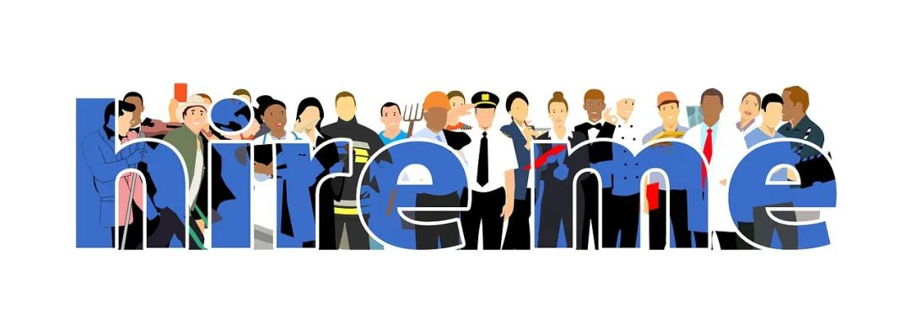

# 无标题

**链接地址:** http://mp.weixin.qq.com/s?__biz=MzI4NDYyNjAwNw==&mid=2247486901&idx=1&sn=4f605ac6b07258987abd287a26f79bbc&chksm=ebf9d08ddc8e599b280580ed622972914428d8bd2034b2a8f7f8ac8c3c22c39816edf403eb9f&mpshare=1&scene=2&srcid=0224h8keL2ipemcnTqivRtUq&sharer_sharetime=1677181653295&sharer_shareid=77848a6b3852ae4dcb6c74ffee84743c#rd
**作者:** 欢迎转发
**获取时间:** 2025/8/28 19:19:35
**图片数量:** 13

---

## 原始HTML内容

<section style="box-sizing: border-box;font-size: 16px;"><section style="text-align: center;justify-content: center;margin-top: 10px;margin-right: 0%;margin-left: 0%;display: flex;flex-flow: row nowrap;box-sizing: border-box;" powered-by="xiumi.us"><section style="display: inline-block;vertical-align: bottom;width: auto;box-shadow: rgb(0, 0, 0) 0px 0px 0px;min-width: 10%;max-width: 100%;flex: 0 0 auto;height: auto;align-self: flex-end;margin-right: -17px;box-sizing: border-box;"><section style="transform: translate3d(1px, 0px, 0px);margin-right: 0%;margin-bottom: 2px;margin-left: 0%;box-sizing: border-box;" powered-by="xiumi.us"><section style="font-size: 18px;color: rgb(111, 128, 255);letter-spacing: 2px;line-height: 1;text-shadow: rgb(255, 255, 255) 0px 0px 5px, rgb(255, 255, 255) 0px 0px 5px;text-align: justify;box-sizing: border-box;">
<strong style="box-sizing: border-box;">职位招聘</strong>
</section></section><section style="margin-right: 0%;margin-left: 0%;font-size: 0px;box-sizing: border-box;" powered-by="xiumi.us"><section style="display: inline-block;width: 100%;height: 2px;vertical-align: top;overflow: hidden;background-position: 12.6984% 72.7273%;background-repeat: repeat;background-size: 138.889%;background-attachment: scroll;border-width: 0px;background-image: url(&quot;https://mmbiz.qpic.cn/mmbiz_gif/cY0qSDjdkFfib9T7gfCu5e4r3vCvnEKjGwm8iawhtic6zSIhPBicick75e38hjfUIdfWX4U3YlcI4tPPLsOUPlQl56g/640?wx_fmt=gif&quot;);box-sizing: border-box;"><svg viewBox="0 0 1 1" style="float:left;line-height:0;width:0;vertical-align:top;"></svg></section></section></section><section style="display: inline-block;vertical-align: bottom;width: auto;align-self: flex-end;box-shadow: rgb(0, 0, 0) 0px 0px 0px;min-width: 10%;max-width: 100%;flex: 0 0 auto;height: auto;box-sizing: border-box;"><section style="text-align: left;font-size: 0px;margin-right: 0%;margin-bottom: 4px;margin-left: 0%;box-sizing: border-box;" powered-by="xiumi.us"><section style="display: inline-block;width: 28px;height: 28px;vertical-align: top;overflow: hidden;border-width: 0px;border-radius: 50%;border-style: none;border-color: rgb(62, 62, 62);box-shadow: rgba(34, 82, 237, 0.14) -4px 4px 12px inset;box-sizing: border-box;"><svg viewBox="0 0 1 1" style="float:left;line-height:0;width:0;vertical-align:top;"></svg></section></section></section></section><section style="margin: -2px 0% 12px;box-sizing: border-box;" powered-by="xiumi.us"><section style="background-color: rgb(244, 244, 244);height: 2px;box-sizing: border-box;"><svg viewBox="0 0 1 1" style="float:left;line-height:0;width:0;vertical-align:top;"></svg></section></section><section style="margin: -10px 0% 10px;transform: translate3d(-10px, 0px, 0px);-webkit-transform: translate3d(-10px, 0px, 0px);-moz-transform: translate3d(-10px, 0px, 0px);-o-transform: translate3d(-10px, 0px, 0px);opacity: 0.71;box-sizing: border-box;" powered-by="xiumi.us"><section style="text-align: center;font-size: 12px;letter-spacing: 1px;box-sizing: border-box;">
<strong style="box-sizing: border-box;">Job Posting</strong>
</section></section><section style="text-align: center;margin-right: 0%;margin-left: 0%;line-height: 0;box-sizing: border-box;" powered-by="xiumi.us"><section style="max-width: 100%;vertical-align: middle;display: inline-block;line-height: 0;box-shadow: rgb(15, 76, 129) 0px 0px 0px;box-sizing: border-box;"></section></section><section style="margin: 20px 0%;box-sizing: border-box;" powered-by="xiumi.us"><section style="letter-spacing: 2px;font-size: 14px;color: rgb(121, 121, 121);padding-right: 20px;padding-left: 20px;line-height: 2;box-sizing: border-box;">
BADAB Consulting是一个成立于阿省埃德蒙顿市的<strong style="box-sizing: border-box;">人力资源咨询公司</strong>。今天，我们将要给大家分享一个埃德蒙顿地区的入门级<strong style="box-sizing: border-box;">全职工作机会</strong>：

 
</section></section><section style="display: flex;flex-flow: row nowrap;justify-content: flex-start;box-sizing: border-box;" powered-by="xiumi.us"><section style="display: inline-block;vertical-align: middle;width: auto;flex: 100 100 0%;align-self: center;height: auto;box-sizing: border-box;"><section style="margin-top: 0.5em;margin-bottom: 0.5em;box-sizing: border-box;" powered-by="xiumi.us"><section style="background-color: rgba(34, 82, 237, 0.14);height: 2px;box-sizing: border-box;"><svg viewBox="0 0 1 1" style="float:left;line-height:0;width:0;vertical-align:top;"></svg></section></section><section style="margin-top: 0.5em;margin-bottom: 0.5em;box-sizing: border-box;" powered-by="xiumi.us"><section style="background-color: rgba(34, 82, 237, 0.14);height: 2px;box-sizing: border-box;"><svg viewBox="0 0 1 1" style="float:left;line-height:0;width:0;vertical-align:top;"></svg></section></section><section style="margin-top: 0.5em;margin-bottom: 0.5em;box-sizing: border-box;" powered-by="xiumi.us"><section style="background-color: rgba(34, 82, 237, 0.14);height: 2px;box-sizing: border-box;"><svg viewBox="0 0 1 1" style="float:left;line-height:0;width:0;vertical-align:top;"></svg></section></section></section><section style="display: inline-block;vertical-align: middle;width: auto;min-width: 10%;max-width: 100%;flex: 0 0 auto;height: auto;align-self: center;box-sizing: border-box;"><section style="text-align: center;margin-right: 0%;margin-left: 0%;box-sizing: border-box;" powered-by="xiumi.us"><section style="display: inline-block;min-width: 10%;max-width: 100%;vertical-align: top;transform: matrix(1, 0, -0.2, 1, 0, 0);border-style: none;border-width: 0px;border-color: rgb(37, 180, 170);background-color: rgba(255, 255, 255, 0);line-height: 1.6;box-sizing: border-box;"><section style="padding-right: 10px;padding-left: 10px;letter-spacing: 3px;line-height: 1.5;font-size: 30px;text-align: justify;box-sizing: border-box;" powered-by="xiumi.us">
<strong style="box-sizing: border-box;">人力资源/办公室助理</strong>
</section></section></section></section><section style="display: inline-block;vertical-align: middle;width: auto;flex: 100 100 0%;align-self: center;height: auto;box-sizing: border-box;"><section style="margin-top: 0.5em;margin-bottom: 0.5em;box-sizing: border-box;" powered-by="xiumi.us"><section style="background-color: rgba(34, 82, 237, 0.14);height: 2px;box-sizing: border-box;"><svg viewBox="0 0 1 1" style="float:left;line-height:0;width:0;vertical-align:top;"></svg></section></section><section style="margin-top: 0.5em;margin-bottom: 0.5em;box-sizing: border-box;" powered-by="xiumi.us"><section style="background-color: rgba(34, 82, 237, 0.14);height: 2px;box-sizing: border-box;"><svg viewBox="0 0 1 1" style="float:left;line-height:0;width:0;vertical-align:top;"></svg></section></section><section style="margin-top: 0.5em;margin-bottom: 0.5em;box-sizing: border-box;" powered-by="xiumi.us"><section style="background-color: rgba(34, 82, 237, 0.14);height: 2px;box-sizing: border-box;"><svg viewBox="0 0 1 1" style="float:left;line-height:0;width:0;vertical-align:top;"></svg></section></section></section></section><section style="margin-top: 8px;margin-right: 0%;margin-left: 0%;box-sizing: border-box;" powered-by="xiumi.us"><section style="background-image: linear-gradient(to right, rgb(85, 167, 255), rgb(122, 104, 255));height: 2px;box-sizing: border-box;"><svg viewBox="0 0 1 1" style="float:left;line-height:0;width:0;vertical-align:top;"></svg></section></section><section style="margin-right: 0%;margin-bottom: 10px;margin-left: 0%;justify-content: flex-start;display: flex;flex-flow: row nowrap;box-sizing: border-box;" powered-by="xiumi.us"><section style="display: inline-block;width: 100%;vertical-align: top;background-color: rgba(34, 82, 237, 0.07);padding: 15px;align-self: flex-start;flex: 0 0 auto;box-sizing: border-box;"><section style="text-align: center;margin-right: 0%;margin-left: 0%;line-height: 0;box-sizing: border-box;" powered-by="xiumi.us"><section style="max-width: 100%;vertical-align: middle;display: inline-block;line-height: 0;box-sizing: border-box;"></section></section>
 
<section style="text-align: center;margin-top: 10px;margin-bottom: 10px;line-height: 0;box-sizing: border-box;" powered-by="xiumi.us"><section style="max-width: 100%;vertical-align: middle;display: inline-block;line-height: 0;box-sizing: border-box;"></section></section><section style="text-align: left;box-sizing: border-box;" powered-by="xiumi.us">
<strong style="box-sizing: border-box;">Transforming the Industrial Workplace&nbsp;</strong>

<strong style="box-sizing: border-box;">Into a Digital Wonderland</strong>

 
</section><section style="display: flex;flex-flow: row nowrap;margin-right: 0%;margin-left: 0%;justify-content: flex-start;box-sizing: border-box;" powered-by="xiumi.us"><section style="display: inline-block;vertical-align: top;width: auto;flex: 0 0 auto;align-self: stretch;min-width: 10%;max-width: 100%;height: auto;background-image: linear-gradient(to right, rgb(135, 69, 255) 0%, rgb(74, 179, 255) 100%);box-sizing: border-box;"><section style="margin: 6px 0%;box-sizing: border-box;" powered-by="xiumi.us"><section style="font-size: 12px;color: rgb(244, 244, 244);text-align: center;padding-right: 10px;padding-left: 10px;line-height: 1.3;letter-spacing: 0px;box-sizing: border-box;">
公司

介绍
</section></section></section><section style="display: inline-block;vertical-align: top;width: auto;flex: 100 100 0%;align-self: stretch;height: auto;background-image: linear-gradient(to right, rgb(244, 238, 255) 0%, rgb(245, 251, 255) 100%);box-sizing: border-box;"><section style="margin-top: 6px;margin-right: 0%;margin-left: 0%;box-sizing: border-box;" powered-by="xiumi.us"><section style="color: rgb(34, 82, 237);padding-right: 12px;padding-left: 12px;letter-spacing: 0.6px;line-height: 2;box-sizing: border-box;">
<strong style="box-sizing: border-box;">ABOUT US</strong>
</section></section></section></section><section style="justify-content: flex-start;display: flex;flex-flow: row nowrap;box-sizing: border-box;" powered-by="xiumi.us"><section style="display: inline-block;width: 100%;vertical-align: top;padding-left: 20px;align-self: flex-start;flex: 0 0 auto;box-sizing: border-box;"><section style="justify-content: flex-start;display: flex;flex-flow: row nowrap;box-sizing: border-box;" powered-by="xiumi.us"><section style="display: inline-block;width: 100%;vertical-align: top;border-left: 1px solid rgb(111, 128, 255);border-bottom-left-radius: 0px;padding-right: 10px;padding-bottom: 10px;padding-left: 15px;align-self: flex-start;flex: 0 0 auto;box-sizing: border-box;">
 
<section style="text-align: left;box-sizing: border-box;" powered-by="xiumi.us">
We are an industrial technology company that provides innovative digital solutions to the modern industrial workplace.

 

InfoSignal can offer data analytics, allowing you to see what factors, external and internal, are affecting your workplace. Our system outputs information in a readable format of graphics and tables, with a dashboard based interface designed for ease of use.&nbsp;

 

In order to offer the safest and most efficient solutions to our customers, we’ve partnered with excellent technical partners.&nbsp;The partnership between InfoSignal and these organizations results in systems that are both efficient and scale-able via third party integration.

 
</section></section></section></section></section><section style="display: flex;flex-flow: row nowrap;margin-right: 0%;margin-left: 0%;justify-content: flex-start;box-sizing: border-box;" powered-by="xiumi.us"><section style="display: inline-block;vertical-align: top;width: auto;flex: 0 0 auto;align-self: stretch;min-width: 10%;max-width: 100%;height: auto;background-image: linear-gradient(to right, rgb(135, 69, 255) 0%, rgb(74, 179, 255) 100%);box-sizing: border-box;"><section style="margin: 6px 0%;box-sizing: border-box;" powered-by="xiumi.us"><section style="font-size: 12px;color: rgb(244, 244, 244);text-align: center;padding-right: 10px;padding-left: 10px;line-height: 1.3;letter-spacing: 0px;box-sizing: border-box;">
岗位

要求
</section></section></section><section style="display: inline-block;vertical-align: top;width: auto;flex: 100 100 0%;align-self: stretch;height: auto;background-image: linear-gradient(to right, rgb(244, 238, 255) 0%, rgb(245, 251, 255) 100%);box-sizing: border-box;"><section style="margin-top: 6px;margin-right: 0%;margin-left: 0%;box-sizing: border-box;" powered-by="xiumi.us"><section style="color: rgb(34, 82, 237);padding-right: 12px;padding-left: 12px;letter-spacing: 0.6px;line-height: 2;box-sizing: border-box;">
<strong style="box-sizing: border-box;">REQUIREMENTS</strong>
</section></section></section></section><section style="justify-content: flex-start;display: flex;flex-flow: row nowrap;box-sizing: border-box;" powered-by="xiumi.us"><section style="display: inline-block;width: 100%;vertical-align: top;padding-left: 20px;align-self: flex-start;flex: 0 0 auto;box-sizing: border-box;"><section style="justify-content: flex-start;display: flex;flex-flow: row nowrap;box-sizing: border-box;" powered-by="xiumi.us"><section style="display: inline-block;width: 100%;vertical-align: top;border-left: 1px solid rgb(111, 128, 255);border-bottom-left-radius: 0px;padding-right: 10px;padding-bottom: 10px;padding-left: 15px;align-self: flex-start;flex: 0 0 auto;box-sizing: border-box;"><section style="margin: 10px 0% 6px;box-sizing: border-box;" powered-by="xiumi.us"><section style="font-size: 14px;letter-spacing: 0px;line-height: 1.6;box-sizing: border-box;"><ul class="list-paddingleft-1"><li style="box-sizing: border-box;">
大专（含大专）以上学历，人力资源相关专业优先考虑；
</li><li style="box-sizing: border-box;">
有较强英语交流能力； 
</li><li style="box-sizing: border-box;">
熟练Excel、World等相关办公软件，具备基本的网络知识；
</li><li style="box-sizing: border-box;">
熟练使用电脑、打印机、复印机等常见办公设备；
</li><li style="box-sizing: border-box;">
熟悉国家、地区及企业关于合同管理，薪金制度，人事机制；
</li><li style="box-sizing: border-box;">
具有较强的数据统计、整理和分析能力。
</li><li style="box-sizing: border-box;">
有责任心和上进心，具有优秀的协调组织能力和一定的项目策划能力。
</li></ul></section></section></section></section></section></section><section style="display: flex;flex-flow: row nowrap;margin-right: 0%;margin-left: 0%;justify-content: flex-start;box-sizing: border-box;" powered-by="xiumi.us"><section style="display: inline-block;vertical-align: top;width: auto;flex: 0 0 auto;align-self: stretch;min-width: 10%;max-width: 100%;height: auto;background-image: linear-gradient(to right, rgb(135, 69, 255) 0%, rgb(74, 179, 255) 100%);box-sizing: border-box;"><section style="margin: 6px 0%;box-sizing: border-box;" powered-by="xiumi.us"><section style="font-size: 12px;color: rgb(244, 244, 244);text-align: center;padding-right: 10px;padding-left: 10px;line-height: 1.3;letter-spacing: 0px;box-sizing: border-box;">
职员

责任 
</section></section></section><section style="display: inline-block;vertical-align: top;width: auto;flex: 100 100 0%;align-self: stretch;height: auto;background-image: linear-gradient(to right, rgb(244, 238, 255) 0%, rgb(245, 251, 255) 100%);box-sizing: border-box;"><section style="margin-top: 6px;margin-right: 0%;margin-left: 0%;box-sizing: border-box;" powered-by="xiumi.us"><section style="color: rgb(34, 82, 237);padding-right: 12px;padding-left: 12px;letter-spacing: 0.6px;line-height: 2;box-sizing: border-box;">
<strong style="box-sizing: border-box;">JOB DUTIES</strong>
</section></section></section></section><section style="justify-content: flex-start;display: flex;flex-flow: row nowrap;box-sizing: border-box;" powered-by="xiumi.us"><section style="display: inline-block;width: 100%;vertical-align: top;padding-left: 20px;align-self: flex-start;flex: 0 0 auto;box-sizing: border-box;"><section style="justify-content: flex-start;display: flex;flex-flow: row nowrap;box-sizing: border-box;" powered-by="xiumi.us"><section style="display: inline-block;width: 100%;vertical-align: top;border-left: 1px solid rgb(111, 128, 255);border-bottom-left-radius: 0px;padding-right: 10px;padding-bottom: 10px;padding-left: 15px;align-self: flex-start;flex: 0 0 auto;box-sizing: border-box;"><section style="margin: 10px 0% 6px;box-sizing: border-box;" powered-by="xiumi.us"><section style="font-size: 14px;letter-spacing: 0px;line-height: 1.6;text-align: left;box-sizing: border-box;"><ul class="list-paddingleft-1"><li style="box-sizing: border-box;">
负责公司招聘版块。简历筛选、面试复试和岗前培训；
</li><li style="box-sizing: border-box;">
负责面试人员的通知、资料整理、存档。负责招聘人才库的维护； 
</li><li style="box-sizing: border-box;">
利用各种招聘渠道发布招聘广告，充分利用各种招聘渠道满足公司的人才需求；
</li><li style="box-sizing: border-box;">
协助审核、修订公司各项管理规章制度，进行日常行政工作的组织与管理；
</li><li style="box-sizing: border-box;">
协助办理会议、培训、公司集体活动组织与安排及各部门之间的协调工作；
</li><li style="box-sizing: border-box;">
负责办公室的日常管理工作。负责来访接待、收发信件、考勤登记、接听电话等工作;
</li><li style="box-sizing: border-box;">
负责企业员工和客户的差旅及接待准备工作，包括酒店、机票和餐饮预定等。
</li><li style="box-sizing: border-box;">
协助公司的其他人事及行政事务管理。
</li></ul></section></section></section></section></section></section><section style="display: flex;flex-flow: row nowrap;margin-right: 0%;margin-left: 0%;justify-content: flex-start;box-sizing: border-box;" powered-by="xiumi.us"><section style="display: inline-block;vertical-align: top;width: auto;flex: 0 0 auto;align-self: stretch;min-width: 10%;max-width: 100%;height: auto;background-image: linear-gradient(to right, rgb(135, 69, 255) 0%, rgb(74, 179, 255) 100%);box-sizing: border-box;"><section style="margin: 6px 0%;box-sizing: border-box;" powered-by="xiumi.us"><section style="font-size: 12px;color: rgb(244, 244, 244);text-align: center;padding-right: 10px;padding-left: 10px;line-height: 1.3;letter-spacing: 0px;box-sizing: border-box;">
经验

要求 
</section></section></section><section style="display: inline-block;vertical-align: top;width: auto;flex: 100 100 0%;align-self: stretch;height: auto;background-image: linear-gradient(to right, rgb(244, 238, 255) 0%, rgb(245, 251, 255) 100%);box-sizing: border-box;"><section style="margin-top: 6px;margin-right: 0%;margin-left: 0%;box-sizing: border-box;" powered-by="xiumi.us"><section style="color: rgb(34, 82, 237);padding-right: 12px;padding-left: 12px;letter-spacing: 0.6px;line-height: 2;box-sizing: border-box;">
<strong style="box-sizing: border-box;">EXPERIENCE</strong>
</section></section></section></section><section style="justify-content: flex-start;display: flex;flex-flow: row nowrap;box-sizing: border-box;" powered-by="xiumi.us"><section style="display: inline-block;width: 100%;vertical-align: top;padding-left: 20px;align-self: flex-start;flex: 0 0 auto;box-sizing: border-box;"><section style="justify-content: flex-start;display: flex;flex-flow: row nowrap;box-sizing: border-box;" powered-by="xiumi.us"><section style="display: inline-block;width: 100%;vertical-align: top;border-left: 1px solid rgb(111, 128, 255);border-bottom-left-radius: 0px;padding-right: 10px;padding-bottom: 10px;padding-left: 15px;align-self: flex-start;flex: 0 0 auto;box-sizing: border-box;"><section style="margin: 10px 0% 6px;box-sizing: border-box;" powered-by="xiumi.us"><section style="font-size: 14px;letter-spacing: 0px;line-height: 1.6;text-align: left;box-sizing: border-box;"><ul class="list-paddingleft-1"><li style="box-sizing: border-box;">
人力资源管理岗位一年或以上工作经验者优先考虑； 
</li><li style="box-sizing: border-box;">
办公室助理岗位一年或以上工作经验者优先考虑；
</li><li style="box-sizing: border-box;">
此岗位接受应届毕业生申请。
</li></ul></section></section></section></section></section></section><section style="display: flex;flex-flow: row nowrap;margin-right: 0%;margin-left: 0%;justify-content: flex-start;box-sizing: border-box;" powered-by="xiumi.us"><section style="display: inline-block;vertical-align: top;width: auto;flex: 0 0 auto;align-self: stretch;min-width: 10%;max-width: 100%;height: auto;background-image: linear-gradient(to right, rgb(135, 69, 255) 0%, rgb(74, 179, 255) 100%);box-sizing: border-box;"><section style="margin: 6px 0%;box-sizing: border-box;" powered-by="xiumi.us"><section style="font-size: 12px;color: rgb(244, 244, 244);text-align: center;padding-right: 10px;padding-left: 10px;line-height: 1.3;letter-spacing: 0px;box-sizing: border-box;">
语言

要求
</section></section></section><section style="display: inline-block;vertical-align: top;width: auto;flex: 100 100 0%;align-self: stretch;height: auto;background-image: linear-gradient(to right, rgb(244, 238, 255) 0%, rgb(245, 251, 255) 100%);box-sizing: border-box;"><section style="margin-top: 6px;margin-right: 0%;margin-left: 0%;box-sizing: border-box;" powered-by="xiumi.us"><section style="color: rgb(34, 82, 237);padding-right: 12px;padding-left: 12px;letter-spacing: 0.6px;line-height: 2;box-sizing: border-box;">
<strong style="box-sizing: border-box;">LANGUAGE</strong>
</section></section></section></section><section style="justify-content: flex-start;display: flex;flex-flow: row nowrap;box-sizing: border-box;" powered-by="xiumi.us"><section style="display: inline-block;width: 100%;vertical-align: top;padding-left: 20px;align-self: flex-start;flex: 0 0 auto;box-sizing: border-box;"><section style="justify-content: flex-start;display: flex;flex-flow: row nowrap;box-sizing: border-box;" powered-by="xiumi.us"><section style="display: inline-block;width: 100%;vertical-align: top;border-left: 1px solid rgb(111, 128, 255);border-bottom-left-radius: 0px;padding-right: 10px;padding-bottom: 10px;padding-left: 15px;align-self: flex-start;flex: 0 0 auto;box-sizing: border-box;"><section style="margin: 10px 0% 6px;box-sizing: border-box;" powered-by="xiumi.us"><section style="font-size: 14px;letter-spacing: 0px;line-height: 1.6;text-align: left;box-sizing: border-box;"><ul class="list-paddingleft-1"><li style="box-sizing: border-box;">
英语
</li></ul></section></section></section></section></section></section><section style="display: flex;flex-flow: row nowrap;margin-right: 0%;margin-left: 0%;justify-content: flex-start;box-sizing: border-box;" powered-by="xiumi.us"><section style="display: inline-block;vertical-align: top;width: auto;flex: 0 0 auto;align-self: stretch;min-width: 10%;max-width: 100%;height: auto;background-image: linear-gradient(to right, rgb(135, 69, 255) 0%, rgb(74, 179, 255) 100%);box-sizing: border-box;"><section style="margin: 6px 0%;box-sizing: border-box;" powered-by="xiumi.us"><section style="font-size: 12px;color: rgb(244, 244, 244);text-align: center;padding-right: 10px;padding-left: 10px;line-height: 1.3;letter-spacing: 0px;box-sizing: border-box;">
工作

地点
</section></section></section><section style="display: inline-block;vertical-align: top;width: auto;flex: 100 100 0%;align-self: stretch;height: auto;background-image: linear-gradient(to right, rgb(244, 238, 255) 0%, rgb(245, 251, 255) 100%);box-sizing: border-box;"><section style="margin-top: 6px;margin-right: 0%;margin-left: 0%;box-sizing: border-box;" powered-by="xiumi.us"><section style="color: rgb(34, 82, 237);padding-right: 12px;padding-left: 12px;letter-spacing: 0.6px;line-height: 2;box-sizing: border-box;">
<strong style="box-sizing: border-box;">LOCATION</strong>
</section></section></section></section><section style="justify-content: flex-start;display: flex;flex-flow: row nowrap;box-sizing: border-box;" powered-by="xiumi.us"><section style="display: inline-block;width: 100%;vertical-align: top;padding-left: 20px;align-self: flex-start;flex: 0 0 auto;box-sizing: border-box;"><section style="justify-content: flex-start;display: flex;flex-flow: row nowrap;box-sizing: border-box;" powered-by="xiumi.us"><section style="display: inline-block;width: 100%;vertical-align: top;border-left: 1px solid rgb(111, 128, 255);border-bottom-left-radius: 0px;padding-right: 10px;padding-bottom: 10px;padding-left: 15px;align-self: flex-start;flex: 0 0 auto;box-sizing: border-box;"><section style="margin: 10px 0% 6px;box-sizing: border-box;" powered-by="xiumi.us"><section style="font-size: 14px;letter-spacing: 0px;line-height: 1.6;text-align: left;box-sizing: border-box;"><ul class="list-paddingleft-1"><li style="box-sizing: border-box;">
埃德蒙顿
</li><li style="box-sizing: border-box;">
坐班制
</li></ul></section></section></section></section></section></section><section style="display: flex;flex-flow: row nowrap;margin-right: 0%;margin-left: 0%;justify-content: flex-start;box-sizing: border-box;" powered-by="xiumi.us"><section style="display: inline-block;vertical-align: top;width: auto;flex: 0 0 auto;align-self: stretch;min-width: 10%;max-width: 100%;height: auto;background-image: linear-gradient(to right, rgb(135, 69, 255) 0%, rgb(74, 179, 255) 100%);box-sizing: border-box;"><section style="margin: 6px 0%;box-sizing: border-box;" powered-by="xiumi.us"><section style="font-size: 12px;color: rgb(244, 244, 244);text-align: center;padding-right: 10px;padding-left: 10px;line-height: 1.3;letter-spacing: 0px;box-sizing: border-box;">
工时

种类
</section></section></section><section style="display: inline-block;vertical-align: top;width: auto;flex: 100 100 0%;align-self: stretch;height: auto;background-image: linear-gradient(to right, rgb(244, 238, 255) 0%, rgb(245, 251, 255) 100%);box-sizing: border-box;"><section style="margin-top: 6px;margin-right: 0%;margin-left: 0%;box-sizing: border-box;" powered-by="xiumi.us"><section style="color: rgb(34, 82, 237);padding-right: 12px;padding-left: 12px;letter-spacing: 0.6px;line-height: 2;box-sizing: border-box;">
<strong style="box-sizing: border-box;">JOB TYPES</strong>
</section></section></section></section><section style="justify-content: flex-start;display: flex;flex-flow: row nowrap;box-sizing: border-box;" powered-by="xiumi.us"><section style="display: inline-block;width: 100%;vertical-align: top;padding-left: 20px;align-self: flex-start;flex: 0 0 auto;box-sizing: border-box;"><section style="justify-content: flex-start;display: flex;flex-flow: row nowrap;box-sizing: border-box;" powered-by="xiumi.us"><section style="display: inline-block;width: 100%;vertical-align: top;border-left: 1px solid rgb(111, 128, 255);border-bottom-left-radius: 0px;padding-right: 10px;padding-bottom: 10px;padding-left: 15px;align-self: flex-start;flex: 0 0 auto;box-sizing: border-box;"><section style="margin: 10px 0% 6px;box-sizing: border-box;" powered-by="xiumi.us"><section style="font-size: 14px;letter-spacing: 0px;line-height: 1.6;text-align: left;box-sizing: border-box;"><ul class="list-paddingleft-1"><li style="box-sizing: border-box;">
全职工作
</li><li style="box-sizing: border-box;">
时薪制 
</li></ul></section></section></section></section></section></section><section style="display: flex;flex-flow: row nowrap;margin-right: 0%;margin-left: 0%;justify-content: flex-start;box-sizing: border-box;" powered-by="xiumi.us"><section style="display: inline-block;vertical-align: top;width: auto;flex: 0 0 auto;align-self: stretch;min-width: 10%;max-width: 100%;height: auto;background-image: linear-gradient(to right, rgb(135, 69, 255) 0%, rgb(74, 179, 255) 100%);box-sizing: border-box;"><section style="margin: 6px 0%;box-sizing: border-box;" powered-by="xiumi.us"><section style="font-size: 12px;color: rgb(244, 244, 244);text-align: center;padding-right: 10px;padding-left: 10px;line-height: 1.3;letter-spacing: 0px;box-sizing: border-box;">
资薪

福利
</section></section></section><section style="display: inline-block;vertical-align: top;width: auto;flex: 100 100 0%;align-self: stretch;height: auto;background-image: linear-gradient(to right, rgb(244, 238, 255) 0%, rgb(245, 251, 255) 100%);box-sizing: border-box;"><section style="margin-top: 6px;margin-right: 0%;margin-left: 0%;box-sizing: border-box;" powered-by="xiumi.us"><section style="color: rgb(34, 82, 237);padding-right: 12px;padding-left: 12px;letter-spacing: 0.6px;line-height: 2;box-sizing: border-box;">
<strong style="box-sizing: border-box;">SALARY</strong>
</section></section></section></section><section style="justify-content: flex-start;display: flex;flex-flow: row nowrap;box-sizing: border-box;" powered-by="xiumi.us"><section style="display: inline-block;width: 100%;vertical-align: top;padding-left: 20px;align-self: flex-start;flex: 0 0 auto;box-sizing: border-box;"><section style="justify-content: flex-start;display: flex;flex-flow: row nowrap;box-sizing: border-box;" powered-by="xiumi.us"><section style="display: inline-block;width: 100%;vertical-align: top;border-left: 1px solid rgba(118, 178, 124, 0);border-bottom-left-radius: 0px;padding-right: 10px;padding-bottom: 10px;padding-left: 15px;align-self: flex-start;flex: 0 0 auto;box-sizing: border-box;"><section style="margin: 10px 0% 6px;box-sizing: border-box;" powered-by="xiumi.us"><section style="font-size: 14px;letter-spacing: 0px;line-height: 1.6;text-align: left;box-sizing: border-box;"><ul class="list-paddingleft-1"><li style="box-sizing: border-box;">
薪资面议
</li></ul></section></section></section></section>
 
</section></section>
 
<section style="text-align: right;justify-content: flex-end;margin: -20px 0% 10px;display: flex;flex-flow: row nowrap;box-sizing: border-box;" powered-by="xiumi.us"><section style="display: inline-block;width: 100%;vertical-align: top;background-color: rgb(239, 243, 254);flex: 0 0 auto;height: auto;padding-right: 20px;padding-bottom: 10px;padding-left: 20px;align-self: flex-start;box-sizing: border-box;"><section style="font-size: 0px;justify-content: flex-end;display: flex;flex-flow: row nowrap;margin-top: -10px;margin-bottom: 10px;box-sizing: border-box;" powered-by="xiumi.us"><section style="display: inline-block;width: 50%;vertical-align: top;flex: 0 0 auto;height: auto;align-self: flex-start;box-sizing: border-box;"><section style="margin-right: 0%;margin-bottom: 4px;margin-left: 0%;opacity: 0.62;box-sizing: border-box;" powered-by="xiumi.us"><section style="background-image: linear-gradient(to right, rgb(135, 69, 255) 0%, rgb(74, 179, 255) 100%);height: 1px;box-sizing: border-box;"><svg viewBox="0 0 1 1" style="float:left;line-height:0;width:0;vertical-align:top;"></svg></section></section></section></section><section style="margin-top: 10px;margin-bottom: 10px;line-height: 0;box-sizing: border-box;" powered-by="xiumi.us"><section style="max-width: 100%;vertical-align: middle;display: inline-block;line-height: 0;width: 50%;height: auto;box-sizing: border-box;"></section></section><section style="text-align: left;justify-content: flex-start;display: flex;flex-flow: row nowrap;margin-bottom: 10px;box-sizing: border-box;" powered-by="xiumi.us"><section style="display: inline-block;width: auto;vertical-align: top;min-width: 10%;max-width: 100%;flex: 0 0 auto;height: auto;background-color: rgb(111, 128, 255);align-self: flex-start;box-sizing: border-box;"><section style="font-size: 12px;text-align: center;padding-right: 4px;padding-left: 4px;color: rgb(239, 243, 254);letter-spacing: 0px;line-height: 2;box-sizing: border-box;" powered-by="xiumi.us">
<strong style="box-sizing: border-box;">联系方式</strong>
</section></section></section><section style="font-size: 14px;text-align: justify;line-height: 1.8;box-sizing: border-box;" powered-by="xiumi.us">
<strong style="box-sizing: border-box;">邮箱：Info@infosignal.ca</strong> 

<strong style="box-sizing: border-box;">地址：4327 Roper Rd NW, Edmonton, AB</strong>

<strong style="box-sizing: border-box;">网址：https://infosignal.ca</strong>
</section></section></section></section></section><section style="margin-top: 8px;margin-right: 0%;margin-left: 0%;box-sizing: border-box;" powered-by="xiumi.us"><section style="background-image: linear-gradient(to right, rgb(85, 167, 255), rgb(122, 104, 255));height: 2px;box-sizing: border-box;"><svg viewBox="0 0 1 1" style="float:left;line-height:0;width:0;vertical-align:top;"></svg></section></section><section style="margin: 10px 0%;box-sizing: border-box;" powered-by="xiumi.us"><section style="font-size: 15px;letter-spacing: 0px;line-height: 2;padding-right: 15px;padding-left: 15px;text-align: center;box-sizing: border-box;">
<strong style="box-sizing: border-box;">本职位信息由BADAB Consulting Inc.整理发布</strong>
</section></section>
 
<section style="margin: 20px 0%;box-sizing: border-box;" powered-by="xiumi.us"><section style="font-size: 14px;color: rgba(51, 51, 51, 0.61);letter-spacing: 2px;padding-right: 20px;padding-left: 20px;line-height: 2;box-sizing: border-box;">
<strong style="box-sizing: border-box;">好的工作机会不等人！</strong>

在你犹豫的片刻之间，

或许你心仪的Offer已经被<strong style="box-sizing: border-box;">发到了别人的手里</strong>！

 

如果你在<strong style="box-sizing: border-box;">求职就业</strong>方面需要帮助，

请尽快<strong style="box-sizing: border-box;">联系我们</strong>吧！
</section></section>
 
<section style="margin: 10px 0%;text-align: left;justify-content: flex-start;display: flex;flex-flow: row nowrap;box-sizing: border-box;" powered-by="xiumi.us"><section style="display: inline-block;width: 100%;vertical-align: top;background-color: rgb(249, 245, 239);padding: 8px;box-shadow: rgb(207, 207, 207) 0.707107px 0.707107px 2px;align-self: flex-start;flex: 0 0 auto;box-sizing: border-box;"><section style="text-align: justify;box-sizing: border-box;" powered-by="xiumi.us">
 
</section><section style="text-align: center;margin-right: 0%;margin-bottom: 20px;margin-left: 0%;justify-content: center;display: flex;flex-flow: row nowrap;box-sizing: border-box;" powered-by="xiumi.us"><section style="display: inline-block;vertical-align: middle;width: 41%;align-self: center;flex: 0 0 auto;box-sizing: border-box;"><section style="justify-content: center;display: flex;flex-flow: row nowrap;box-sizing: border-box;" powered-by="xiumi.us"><section style="display: inline-block;vertical-align: top;width: 50%;box-shadow: rgb(0, 0, 0) 0px 0px 0px;align-self: flex-start;flex: 0 0 auto;box-sizing: border-box;"><section style="margin-right: 0%;margin-left: 0%;box-sizing: border-box;" powered-by="xiumi.us"><section style="padding: 4px;display: inline-block;background-color: rgb(237, 128, 15);box-sizing: border-box;"><section style="border-color: rgb(255, 255, 255);width: 1.6em;height: 1.6em;border-style: solid;border-width: 1px;font-size: 28px;line-height: 1.5em;color: rgb(255, 255, 255);box-sizing: border-box;">
號
</section></section></section></section><section style="display: inline-block;vertical-align: top;width: 50%;align-self: flex-start;flex: 0 0 auto;box-sizing: border-box;"><section style="margin-right: 0%;margin-left: 0%;box-sizing: border-box;" powered-by="xiumi.us"><section style="padding: 4px;display: inline-block;background-color: rgb(237, 128, 15);box-sizing: border-box;"><section style="border-color: white;width: 1.6em;height: 1.6em;border-style: solid;border-width: 1px;font-size: 28px;line-height: 1.5em;color: rgb(255, 255, 255);box-sizing: border-box;">
外
</section></section></section></section></section></section><section style="display: inline-block;vertical-align: middle;width: 59%;align-self: center;flex: 0 0 auto;box-sizing: border-box;"><section style="line-height: 1.4;box-sizing: border-box;" powered-by="xiumi.us">
<strong style="box-sizing: border-box;">小红书，</strong><strong style="font-size: 18px;color: rgb(180, 38, 30);box-sizing: border-box;">我们来啦！</strong>
</section></section></section><section style="text-align: justify;box-sizing: border-box;" powered-by="xiumi.us">
 
</section><section style="text-align: justify;padding-right: 15px;padding-left: 15px;box-sizing: border-box;" powered-by="xiumi.us">
久等了，加拿大的朋友们！BadaB Consulting Inc. 终于入驻小红书啦！<strong style="box-sizing: border-box;">（小红书ID：5288561530）</strong>
</section><section style="text-align: center;margin-top: 10px;margin-bottom: 10px;line-height: 0;box-sizing: border-box;" powered-by="xiumi.us"><section style="max-width: 100%;vertical-align: middle;display: inline-block;line-height: 0;box-shadow: rgb(0, 0, 0) 0px 0px 0px;box-sizing: border-box;"></section></section><section style="text-align: center;font-size: 12px;color: rgb(180, 180, 180);box-sizing: border-box;" powered-by="xiumi.us">
扫描二维码即刻关注我们吧！
</section><section style="color: rgb(62, 62, 62);text-align: center;box-sizing: border-box;" powered-by="xiumi.us">
<strong style="box-sizing: border-box;"> </strong>

<strong style="box-sizing: border-box;">如果你需要一对一</strong>

<strong style="box-sizing: border-box;">职业规划和系统的建议，</strong>

<strong style="box-sizing: border-box;">请找我们！</strong>

<strong style="box-sizing: border-box;"> </strong>

<strong style="box-sizing: border-box;"></strong><strong style="box-sizing: border-box;">如果你需要修改简历和cover letter，</strong>

<strong style="box-sizing: border-box;">培训面试，建立LinkedIn主页</strong><strong style="box-sizing: border-box;"></strong>

<strong style="box-sizing: border-box;">请找我们！</strong>

<strong style="box-sizing: border-box;"> </strong>

<strong style="box-sizing: border-box;">如果你需要来自</strong>

<strong style="box-sizing: border-box;">人力资源顾问的</strong><strong style="box-sizing: border-box;">模拟面试，</strong>

<strong style="box-sizing: border-box;">请找我们！</strong>

<strong style="box-sizing: border-box;"> </strong>
</section><section style="justify-content: flex-start;display: flex;flex-flow: row nowrap;margin-top: 10px;margin-bottom: 10px;box-sizing: border-box;" powered-by="xiumi.us"><section style="display: inline-block;vertical-align: middle;width: auto;align-self: center;flex: 100 100 0%;padding-left: 10px;height: auto;box-sizing: border-box;"><section style="transform: rotateZ(357deg);-webkit-transform: rotateZ(357deg);-moz-transform: rotateZ(357deg);-o-transform: rotateZ(357deg);box-sizing: border-box;" powered-by="xiumi.us"><section style="justify-content: flex-start;display: flex;flex-flow: row nowrap;box-sizing: border-box;"><section style="display: inline-block;width: 100%;vertical-align: top;align-self: flex-start;flex: 0 0 auto;box-sizing: border-box;"><section style="text-align: center;margin-top: 10px;margin-bottom: -10px;isolation: isolate;line-height: 0;box-sizing: border-box;" powered-by="xiumi.us"><section style="max-width: 100%;vertical-align: middle;display: inline-block;line-height: 0;width: 23px;height: auto;box-sizing: border-box;"></section></section><section style="text-align: center;justify-content: center;display: flex;flex-flow: row nowrap;margin-bottom: 10px;box-sizing: border-box;" powered-by="xiumi.us"><section style="display: inline-block;width: 100%;vertical-align: top;align-self: flex-start;flex: 0 0 auto;background-color: rgb(255, 255, 255);padding: 15px 15px 20px;height: auto;box-shadow: rgb(147, 147, 147) 0px 0px 5px;box-sizing: border-box;"><section style="margin-bottom: 20px;line-height: 0;box-sizing: border-box;" powered-by="xiumi.us"><section style="max-width: 100%;vertical-align: middle;display: inline-block;line-height: 0;box-sizing: border-box;"></section></section></section></section></section></section></section></section><section style="display: inline-block;vertical-align: middle;width: 45%;align-self: center;flex: 0 0 auto;height: auto;margin-right: -15px;margin-left: -15px;z-index: 3;box-sizing: border-box;"><section style="transform: rotateZ(5deg);-webkit-transform: rotateZ(5deg);-moz-transform: rotateZ(5deg);-o-transform: rotateZ(5deg);box-sizing: border-box;" powered-by="xiumi.us"><section style="justify-content: flex-start;display: flex;flex-flow: row nowrap;box-sizing: border-box;"><section style="display: inline-block;width: 100%;vertical-align: top;align-self: flex-start;flex: 0 0 auto;box-sizing: border-box;"><section style="text-align: center;margin-top: 10px;margin-bottom: -10px;isolation: isolate;line-height: 0;box-sizing: border-box;" powered-by="xiumi.us"><section style="max-width: 100%;vertical-align: middle;display: inline-block;line-height: 0;width: 23px;height: auto;box-sizing: border-box;"></section></section><section style="text-align: center;justify-content: center;display: flex;flex-flow: row nowrap;margin-bottom: 10px;box-sizing: border-box;" powered-by="xiumi.us"><section style="display: inline-block;width: 100%;vertical-align: top;align-self: flex-start;flex: 0 0 auto;background-color: rgb(255, 255, 255);padding: 17px 17px 20px;height: auto;box-shadow: rgb(147, 147, 147) 0px 0px 5px;box-sizing: border-box;"><section style="margin-bottom: 20px;line-height: 0;box-sizing: border-box;" powered-by="xiumi.us"><section style="max-width: 100%;vertical-align: middle;display: inline-block;line-height: 0;box-sizing: border-box;"></section></section></section></section></section></section></section></section><section style="display: inline-block;vertical-align: middle;width: auto;align-self: center;flex: 100 100 0%;height: auto;padding-right: 10px;box-sizing: border-box;"><section style="transform: rotateZ(357deg);-webkit-transform: rotateZ(357deg);-moz-transform: rotateZ(357deg);-o-transform: rotateZ(357deg);box-sizing: border-box;" powered-by="xiumi.us"><section style="justify-content: flex-start;display: flex;flex-flow: row nowrap;box-sizing: border-box;"><section style="display: inline-block;width: 100%;vertical-align: top;align-self: flex-start;flex: 0 0 auto;box-sizing: border-box;"><section style="text-align: center;margin-top: 10px;margin-bottom: -10px;isolation: isolate;line-height: 0;box-sizing: border-box;" powered-by="xiumi.us"><section style="max-width: 100%;vertical-align: middle;display: inline-block;line-height: 0;width: 23px;height: auto;box-sizing: border-box;"></section></section><section style="text-align: center;justify-content: center;display: flex;flex-flow: row nowrap;margin-bottom: 10px;box-sizing: border-box;" powered-by="xiumi.us"><section style="display: inline-block;width: 100%;vertical-align: top;align-self: flex-start;flex: 0 0 auto;background-color: rgb(255, 255, 255);padding: 15px 15px 20px;height: auto;box-shadow: rgb(147, 147, 147) 0px 0px 5px;box-sizing: border-box;"><section style="margin-bottom: 20px;line-height: 0;box-sizing: border-box;" powered-by="xiumi.us"><section style="max-width: 100%;vertical-align: middle;display: inline-block;line-height: 0;box-sizing: border-box;"></section></section></section></section></section></section></section></section></section><section style="color: rgb(62, 62, 62);text-align: center;box-sizing: border-box;" powered-by="xiumi.us">
 
</section><section style="text-align: justify;padding-right: 15px;padding-left: 15px;box-sizing: border-box;" powered-by="xiumi.us">
BadaB会不定期地在小红书主页上更新大家最想了解的<strong style="box-sizing: border-box;">北美职场经验和建议</strong>，还有一些<strong style="box-sizing: border-box;">内部的岗位招聘信</strong>息哦~希望找工作和就业中的打工人们关注我学起来！<strong style="box-sizing: border-box;">让我们一起在职场中乘风破浪，披荆斩棘吧！</strong>
</section><section style="text-align: justify;box-sizing: border-box;" powered-by="xiumi.us">
 
</section></section></section>
 
<section style="margin: 10px 0%;text-align: center;justify-content: center;display: flex;flex-flow: row nowrap;box-sizing: border-box;" powered-by="xiumi.us"><section style="display: inline-block;width: 100%;vertical-align: top;background-color: rgba(255, 174, 174, 0.13);padding-right: 10px;padding-left: 10px;align-self: flex-start;flex: 0 0 auto;box-sizing: border-box;"><section style="display: flex;flex-flow: row nowrap;margin: -5px 0%;justify-content: center;box-sizing: border-box;" powered-by="xiumi.us"><section style="display: inline-block;width: auto;vertical-align: middle;min-width: 10%;max-width: 100%;flex: 0 0 auto;height: auto;border-style: solid;border-width: 1px;border-color: rgb(237, 128, 15);padding: 4px;background-color: rgb(255, 255, 255);box-shadow: rgb(255, 255, 255) 0px 0px 0px inset;align-self: center;box-sizing: border-box;"><section style="justify-content: center;display: flex;flex-flow: row nowrap;box-sizing: border-box;" powered-by="xiumi.us"><section style="display: inline-block;width: 100%;vertical-align: top;border-width: 0px;background-color: rgba(255, 174, 174, 0.13);padding-right: 10px;padding-left: 10px;align-self: flex-start;flex: 0 0 auto;box-sizing: border-box;"><section style="color: rgb(106, 106, 106);letter-spacing: 1px;text-align: justify;box-sizing: border-box;" powered-by="xiumi.us">
<strong style="box-sizing: border-box;">关于我们</strong>
</section></section></section></section></section></section></section>
 
<section style="text-align: center;margin: 10px 0%;justify-content: center;display: flex;flex-flow: row nowrap;box-sizing: border-box;" powered-by="xiumi.us"><section style="display: inline-block;width: 90%;vertical-align: top;border-style: solid;border-width: 2px;border-color: rgb(237, 128, 15);letter-spacing: 0px;padding: 10px;align-self: flex-start;flex: 0 0 auto;box-sizing: border-box;"><section style="justify-content: center;display: flex;flex-flow: row nowrap;box-sizing: border-box;" powered-by="xiumi.us"><section style="display: inline-block;vertical-align: middle;width: 40%;align-self: center;flex: 0 0 auto;box-sizing: border-box;"><section style="margin-right: 0%;margin-left: 0%;line-height: 0;box-sizing: border-box;" powered-by="xiumi.us"><section style="max-width: 100%;vertical-align: middle;display: inline-block;line-height: 0;border-width: 0px;width: 100%;box-sizing: border-box;"></section></section></section><section style="display: inline-block;vertical-align: middle;width: 60%;padding-left: 10px;align-self: center;flex: 0 0 auto;box-sizing: border-box;"><section style="margin-right: 0%;margin-bottom: 5px;margin-left: 0%;box-sizing: border-box;" powered-by="xiumi.us"><section style="display: inline-block;border-width: 2px;border-style: solid;border-color: rgb(237, 128, 15);padding: 0.1em 0.3em;background-color: rgb(237, 128, 15);color: rgb(255, 255, 255);font-size: 12px;box-sizing: border-box;">
<strong style="box-sizing: border-box;">Ada&nbsp; Tai</strong>
</section></section><section style="margin-right: 0%;margin-left: 0%;box-sizing: border-box;" powered-by="xiumi.us"><section style="font-size: 13px;box-sizing: border-box;">
<strong style="box-sizing: border-box;">MBA, CPHR, SHRM-SCP</strong>
</section></section><section style="justify-content: center;display: flex;flex-flow: row nowrap;box-sizing: border-box;" powered-by="xiumi.us"><section style="display: inline-block;vertical-align: middle;width: 10%;border-width: 0px;align-self: center;flex: 0 0 auto;box-sizing: border-box;"><section style="margin: 5px 0%;text-align: left;font-size: 0px;box-sizing: border-box;" powered-by="xiumi.us"><section style="padding: 4px;display: inline-block;background-color: rgb(237, 128, 15);box-sizing: border-box;"><section style="border-color: rgba(255, 255, 255, 0);width: 1.6em;height: 1.6em;border-style: solid;border-width: 1px;text-align: center;line-height: 1.5em;color: rgb(255, 255, 255);box-sizing: border-box;">
 
</section></section></section></section><section style="display: inline-block;vertical-align: middle;width: 90%;align-self: center;flex: 0 0 auto;box-sizing: border-box;"><section style="font-size: 12px;text-align: justify;box-sizing: border-box;" powered-by="xiumi.us">
修改简历与求职信
</section></section></section><section style="justify-content: center;display: flex;flex-flow: row nowrap;box-sizing: border-box;" powered-by="xiumi.us"><section style="display: inline-block;vertical-align: middle;width: 10%;align-self: center;flex: 0 0 auto;box-sizing: border-box;"><section style="margin: 5px 0%;text-align: left;font-size: 0px;box-sizing: border-box;" powered-by="xiumi.us"><section style="padding: 4px;display: inline-block;background-color: rgb(237, 128, 15);box-sizing: border-box;"><section style="border-color: rgba(255, 255, 255, 0);width: 1.6em;height: 1.6em;border-style: solid;border-width: 1px;text-align: center;line-height: 1.5em;color: rgb(255, 255, 255);box-sizing: border-box;">
 
</section></section></section></section><section style="display: inline-block;vertical-align: middle;width: 90%;align-self: center;flex: 0 0 auto;box-sizing: border-box;"><section style="font-size: 12px;text-align: justify;box-sizing: border-box;" powered-by="xiumi.us">
培训面试
</section></section></section><section style="justify-content: center;display: flex;flex-flow: row nowrap;box-sizing: border-box;" powered-by="xiumi.us"><section style="display: inline-block;vertical-align: middle;width: 10%;border-width: 0px;align-self: center;flex: 0 0 auto;box-sizing: border-box;"><section style="margin: 5px 0%;text-align: left;font-size: 0px;box-sizing: border-box;" powered-by="xiumi.us"><section style="padding: 4px;display: inline-block;background-color: rgb(237, 128, 15);box-sizing: border-box;"><section style="border-color: rgba(255, 255, 255, 0);width: 1.6em;height: 1.6em;border-style: solid;border-width: 1px;text-align: center;line-height: 1.5em;color: rgb(255, 255, 255);box-sizing: border-box;">
 
</section></section></section></section><section style="display: inline-block;vertical-align: middle;width: 90%;align-self: center;flex: 0 0 auto;box-sizing: border-box;"><section style="font-size: 12px;text-align: justify;box-sizing: border-box;" powered-by="xiumi.us">
建立LinkedIn Profile
</section></section></section><section style="justify-content: center;display: flex;flex-flow: row nowrap;box-sizing: border-box;" powered-by="xiumi.us"><section style="display: inline-block;vertical-align: middle;width: 10%;align-self: center;flex: 0 0 auto;box-sizing: border-box;"><section style="margin: 5px 0%;text-align: left;font-size: 0px;box-sizing: border-box;" powered-by="xiumi.us"><section style="padding: 4px;display: inline-block;background-color: rgb(237, 128, 15);box-sizing: border-box;"><section style="border-color: rgba(255, 255, 255, 0);width: 1.6em;height: 1.6em;border-style: solid;border-width: 1px;text-align: center;line-height: 1.5em;color: rgb(255, 255, 255);box-sizing: border-box;">
 
</section></section></section></section><section style="display: inline-block;vertical-align: middle;width: 90%;align-self: center;flex: 0 0 auto;box-sizing: border-box;"><section style="font-size: 12px;text-align: justify;box-sizing: border-box;" powered-by="xiumi.us">
职业评估与规划、社交培训
</section></section></section><section style="justify-content: center;display: flex;flex-flow: row nowrap;box-sizing: border-box;" powered-by="xiumi.us"><section style="display: inline-block;vertical-align: middle;width: 10%;align-self: center;flex: 0 0 auto;box-sizing: border-box;"><section style="margin: 5px 0%;text-align: left;font-size: 0px;box-sizing: border-box;" powered-by="xiumi.us"><section style="padding: 4px;display: inline-block;background-color: rgb(237, 128, 15);box-sizing: border-box;"><section style="border-color: rgba(255, 255, 255, 0);width: 1.6em;height: 1.6em;border-style: solid;border-width: 1px;text-align: center;line-height: 1.5em;color: rgb(255, 255, 255);box-sizing: border-box;">
 
</section></section></section></section><section style="display: inline-block;vertical-align: middle;width: 90%;align-self: center;flex: 0 0 auto;box-sizing: border-box;"><section style="font-size: 12px;text-align: justify;box-sizing: border-box;" powered-by="xiumi.us">
求职、职场文化等多种讲座
</section></section></section></section></section></section></section><section style="margin: 20px 0%;box-sizing: border-box;" powered-by="xiumi.us"><section style="letter-spacing: 2px;font-size: 14px;color: rgba(51, 51, 51, 0.61);padding-right: 20px;padding-left: 20px;line-height: 2;box-sizing: border-box;">
 

Ada Tai 毕业于埃尔伯塔大学工商管理硕士学位,并拥有加拿大和美国“注册人力资源管理师”资格证。十几年来 Ada 一直在不同的领域从事人力资源的管理工作。在最近的几年时间里，Ada与她的团队BadaB Consulting Inc. 已成功帮助超过500名不同年龄和职业背景的求职者找到心仪的工作，并帮助他们克服职场困难，向理想的职业成长方向稳步前进。
</section></section>
 
<section style="display: flex;flex-flow: row nowrap;margin: 10px 0%;text-align: center;justify-content: center;box-sizing: border-box;" powered-by="xiumi.us"><section style="display: inline-block;vertical-align: middle;width: auto;flex: 0 0 0%;align-self: center;height: auto;box-sizing: border-box;"><section style="box-sizing: border-box;" powered-by="xiumi.us"><section style="display: inline-block;width: 90px;height: 150px;vertical-align: top;overflow: hidden;border-style: solid;border-width: 4px;border-color: rgb(255, 226, 196);box-sizing: border-box;"><svg viewBox="0 0 1 1" style="float:left;line-height:0;width:0;vertical-align:top;"></svg></section></section></section><section style="display: inline-block;vertical-align: middle;width: auto;flex: 89.2857 89.2857 0%;align-self: center;height: auto;background-color: rgb(255, 255, 255);margin-left: -65px;box-sizing: border-box;"><section style="display: flex;flex-flow: row nowrap;justify-content: center;box-sizing: border-box;" powered-by="xiumi.us"><section style="display: inline-block;vertical-align: middle;width: auto;padding-right: 5px;flex: 0 0 0%;height: auto;align-self: center;box-sizing: border-box;"><section style="display: flex;flex-flow: row nowrap;justify-content: center;box-sizing: border-box;" powered-by="xiumi.us"><section style="display: inline-block;width: 120px;vertical-align: top;flex: 0 0 auto;height: auto;align-self: flex-start;box-sizing: border-box;"><section style="margin-right: 0%;margin-left: 0%;line-height: 0;box-sizing: border-box;" powered-by="xiumi.us"><section style="max-width: 100%;vertical-align: middle;display: inline-block;line-height: 0;width: 100%;border-color: rgba(118, 178, 124, 0);border-width: 5px;border-style: solid;box-shadow: rgb(0, 0, 0) 0px 0px 0px;box-sizing: border-box;"></section></section></section></section></section><section style="display: inline-block;vertical-align: middle;width: auto;padding-left: 5px;flex: 100 100 0%;height: auto;align-self: center;box-sizing: border-box;"><section style="margin-right: 0%;margin-left: 0%;box-sizing: border-box;" powered-by="xiumi.us"><section style="color: rgb(121, 121, 121);font-size: 12px;text-align: justify;box-sizing: border-box;">
微信号 : badab101

新浪微博：BadaB_Consulting

小红书：5288561530

LinkedIn：BadaB Consulting Inc.

Facebook：BadaB Consulting Inc.

YouTube:&nbsp;BadaB Consulting Inc.

Website：www.badab101.com
</section></section></section></section></section></section>
 
</section>
 

<mp-style-type data-value="3"></mp-style-type>

---

## 纯文本内容

职位招聘Job PostingBADAB Consulting是一个成立于阿省埃德蒙顿市的人力资源咨询公司。今天，我们将要给大家分享一个埃德蒙顿地区的入门级全职工作机会：人力资源/办公室助理Transforming the Industrial Workplace Into a Digital Wonderland公司介绍ABOUT USWe are an industrial technology company that provides innovative digital solutions to the modern industrial workplace.InfoSignal can offer data analytics, allowing you to see what factors, external and internal, are affecting your workplace. Our system outputs information in a readable format of graphics and tables, with a dashboard based interface designed for ease of use. In order to offer the safest and most efficient solutions to our customers, we’ve partnered with excellent technical partners. The partnership between InfoSignal and these organizations results in systems that are both efficient and scale-able via third party integration.岗位要求REQUIREMENTS大专（含大专）以上学历，人力资源相关专业优先考虑；有较强英语交流能力；熟练Excel、World等相关办公软件，具备基本的网络知识；熟练使用电脑、打印机、复印机等常见办公设备；熟悉国家、地区及企业关于合同管理，薪金制度，人事机制；具有较强的数据统计、整理和分析能力。有责任心和上进心，具有优秀的协调组织能力和一定的项目策划能力。职员责任JOB DUTIES负责公司招聘版块。简历筛选、面试复试和岗前培训；负责面试人员的通知、资料整理、存档。负责招聘人才库的维护；利用各种招聘渠道发布招聘广告，充分利用各种招聘渠道满足公司的人才需求；协助审核、修订公司各项管理规章制度，进行日常行政工作的组织与管理；协助办理会议、培训、公司集体活动组织与安排及各部门之间的协调工作；负责办公室的日常管理工作。负责来访接待、收发信件、考勤登记、接听电话等工作;负责企业员工和客户的差旅及接待准备工作，包括酒店、机票和餐饮预定等。协助公司的其他人事及行政事务管理。经验要求EXPERIENCE人力资源管理岗位一年或以上工作经验者优先考虑；办公室助理岗位一年或以上工作经验者优先考虑；此岗位接受应届毕业生申请。语言要求LANGUAGE英语工作地点LOCATION埃德蒙顿坐班制工时种类JOB TYPES全职工作时薪制资薪福利SALARY薪资面议联系方式邮箱：Info@infosignal.ca地址：4327 Roper Rd NW, Edmonton, AB网址：https://infosignal.ca本职位信息由BADAB Consulting Inc.整理发布好的工作机会不等人！在你犹豫的片刻之间，或许你心仪的Offer已经被发到了别人的手里！如果你在求职就业方面需要帮助，请尽快联系我们吧！號外小红书，我们来啦！久等了，加拿大的朋友们！BadaB Consulting Inc. 终于入驻小红书啦！（小红书ID：5288561530）扫描二维码即刻关注我们吧！如果你需要一对一职业规划和系统的建议，请找我们！如果你需要修改简历和cover letter，培训面试，建立LinkedIn主页请找我们！如果你需要来自人力资源顾问的模拟面试，请找我们！BadaB会不定期地在小红书主页上更新大家最想了解的北美职场经验和建议，还有一些内部的岗位招聘信息哦~希望找工作和就业中的打工人们关注我学起来！让我们一起在职场中乘风破浪，披荆斩棘吧！关于我们Ada  TaiMBA, CPHR, SHRM-SCP修改简历与求职信培训面试建立LinkedIn Profile职业评估与规划、社交培训求职、职场文化等多种讲座Ada Tai 毕业于埃尔伯塔大学工商管理硕士学位,并拥有加拿大和美国“注册人力资源管理师”资格证。十几年来 Ada 一直在不同的领域从事人力资源的管理工作。在最近的几年时间里，Ada与她的团队BadaB Consulting Inc. 已成功帮助超过500名不同年龄和职业背景的求职者找到心仪的工作，并帮助他们克服职场困难，向理想的职业成长方向稳步前进。微信号 : badab101新浪微博：BadaB_Consulting小红书：5288561530LinkedIn：BadaB Consulting Inc.Facebook：BadaB Consulting Inc.YouTube: BadaB Consulting Inc.Website：www.badab101.com

---

## 图片列表

-  (原始链接: https://mmbiz.qpic.cn/mmbiz_jpg/cY0qSDjdkFfib9T7gfCu5e4r3vCvnEKjGDxtQXJ82tEIDaVwV0lwwRfwsEHG7hjbeia5uMvNH5qADx1ew5bds6xA/640?wx_fmt=jpeg)
-  (原始链接: https://mmbiz.qpic.cn/mmbiz_png/cY0qSDjdkFfib9T7gfCu5e4r3vCvnEKjGps9C92OSFgD4pFoDUhriawsaFzYUU6VXyyY7TOXNdibj75x0E23WxTicw/640?wx_fmt=png)
-  (原始链接: https://mmbiz.qpic.cn/mmbiz_png/cY0qSDjdkFfib9T7gfCu5e4r3vCvnEKjG7Cd0gnxSlSGrO4cvfHq99BP4qvvjufJZDiahWfomJPlErMGHCzH1HXg/640?wx_fmt=png)
-  (原始链接: https://mmbiz.qpic.cn/mmbiz_png/cY0qSDjdkFfib9T7gfCu5e4r3vCvnEKjG7Cd0gnxSlSGrO4cvfHq99BP4qvvjufJZDiahWfomJPlErMGHCzH1HXg/640?wx_fmt=png)
-  (原始链接: https://mmbiz.qpic.cn/mmbiz_png/cY0qSDjdkFfib9T7gfCu5e4r3vCvnEKjGZpiarmyyxRKOGkE8BlKGy8awiaBkoyTBerfAZqPwztwzYibL4zb0oJ7tQ/640?wx_fmt=png)
-  (原始链接: https://mmbiz.qpic.cn/mmbiz_png/cY0qSDjdkFfib9T7gfCu5e4r3vCvnEKjGbG3pjxgeBkyqiajyozHt2RI8eN7m4Qe7ib4ebaoicV3icibubib2XWy28lXQ/640?wx_fmt=png)
-  (原始链接: https://mmbiz.qpic.cn/mmbiz_jpg/cY0qSDjdkFfib9T7gfCu5e4r3vCvnEKjGPSLvngn4sfxETe6Se10WdBSzy9OmFmfjM7F4EmnI4sXDug6blehEdA/640?wx_fmt=jpeg)
-  (原始链接: https://mmbiz.qpic.cn/mmbiz_png/cY0qSDjdkFfib9T7gfCu5e4r3vCvnEKjGbG3pjxgeBkyqiajyozHt2RI8eN7m4Qe7ib4ebaoicV3icibubib2XWy28lXQ/640?wx_fmt=png)
-  (原始链接: https://mmbiz.qpic.cn/mmbiz_jpg/cY0qSDjdkFfib9T7gfCu5e4r3vCvnEKjGSMfryrfwGA4xmqy5n1fJ3AgHfeObeJIgFFYtDSX6LWhViaAb26j3mqA/640?wx_fmt=jpeg)
-  (原始链接: https://mmbiz.qpic.cn/mmbiz_png/cY0qSDjdkFfib9T7gfCu5e4r3vCvnEKjGbG3pjxgeBkyqiajyozHt2RI8eN7m4Qe7ib4ebaoicV3icibubib2XWy28lXQ/640?wx_fmt=png)
-  (原始链接: https://mmbiz.qpic.cn/mmbiz_jpg/cY0qSDjdkFfib9T7gfCu5e4r3vCvnEKjGdJz7x7T4bicM3tCdLicjtTibo3DtUWA9NyicsBzTFIl0d4wHZGJ6yXvMEw/640?wx_fmt=jpeg)
-  (原始链接: https://mmbiz.qpic.cn/mmbiz_jpg/cY0qSDjdkFfib9T7gfCu5e4r3vCvnEKjGal4CT2x3N63KwANvXGzmiaic0DjKZCiabdfOMJSdrYUtUe5ibIrdFE3csg/640?wx_fmt=jpeg)
-  (原始链接: https://mmbiz.qpic.cn/mmbiz_jpg/cY0qSDjdkFfib9T7gfCu5e4r3vCvnEKjGiboSzMeSH5zjvaOES19ZlGS72j1LBNGjSPnONjQ6Qpfy8dt2A5KabOQ/640?wx_fmt=jpeg)
