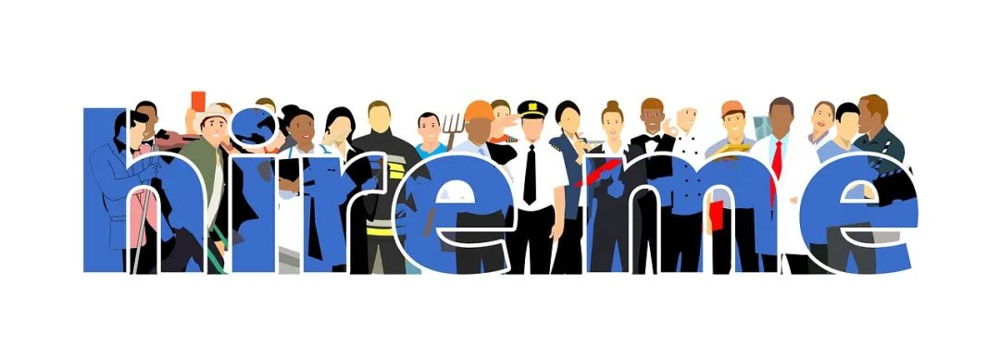

# 无标题

**链接地址:** http://mp.weixin.qq.com/s?__biz=MzI4NDYyNjAwNw==&mid=2247486995&idx=1&sn=0e6a2b966a686637e1a62c5ed05bbce0&chksm=ebf9d32bdc8e5a3d2b39ed37382ee30aad85c35a52baddb515d9c70bc2441455a36b530a66e9&mpshare=1&scene=2&srcid=0304xuo8h5DDcwufn2g32Evq&sharer_sharetime=1677897929245&sharer_shareid=77848a6b3852ae4dcb6c74ffee84743c#rd
**作者:** 欢迎转发
**获取时间:** 2025/8/28 19:18:38
**图片数量:** 13

---

## 原始HTML内容

<section style="box-sizing: border-box;font-size: 16px;"><section style="text-align: center;justify-content: center;margin-top: 10px;margin-right: 0%;margin-left: 0%;display: flex;flex-flow: row nowrap;box-sizing: border-box;" powered-by="xiumi.us"><section style="display: inline-block;vertical-align: bottom;width: auto;box-shadow: rgb(0, 0, 0) 0px 0px 0px;min-width: 10%;max-width: 100%;flex: 0 0 auto;height: auto;align-self: flex-end;margin-right: -17px;box-sizing: border-box;"><section style="transform: translate3d(1px, 0px, 0px);margin-right: 0%;margin-bottom: 2px;margin-left: 0%;box-sizing: border-box;" powered-by="xiumi.us"><section style="font-size: 18px;color: rgb(111, 128, 255);letter-spacing: 2px;line-height: 1;text-shadow: rgb(255, 255, 255) 0px 0px 5px, rgb(255, 255, 255) 0px 0px 5px;text-align: justify;box-sizing: border-box;">
<strong style="box-sizing: border-box;">职位招聘</strong>
</section></section><section style="margin-right: 0%;margin-left: 0%;font-size: 0px;box-sizing: border-box;" powered-by="xiumi.us"><section style="display: inline-block;width: 100%;height: 2px;vertical-align: top;overflow: hidden;background-position: 12.6984% 72.7273%;background-repeat: repeat;background-size: 138.889%;background-attachment: scroll;border-width: 0px;background-image: url(&quot;https://mmbiz.qpic.cn/mmbiz_gif/cY0qSDjdkFesic6IMZeL7t15rItasXRdn0HXwibon2DezvA6hT6KwqCA0GmGJIgflj3gUcla9nz3IqkInT0Z2A3A/640?wx_fmt=gif&quot;);box-sizing: border-box;"><svg viewBox="0 0 1 1" style="float:left;line-height:0;width:0;vertical-align:top;"></svg></section></section></section><section style="display: inline-block;vertical-align: bottom;width: auto;align-self: flex-end;box-shadow: rgb(0, 0, 0) 0px 0px 0px;min-width: 10%;max-width: 100%;flex: 0 0 auto;height: auto;box-sizing: border-box;"><section style="text-align: left;font-size: 0px;margin-right: 0%;margin-bottom: 4px;margin-left: 0%;box-sizing: border-box;" powered-by="xiumi.us"><section style="display: inline-block;width: 28px;height: 28px;vertical-align: top;overflow: hidden;border-width: 0px;border-radius: 50%;border-style: none;border-color: rgb(62, 62, 62);box-shadow: rgba(34, 82, 237, 0.14) -4px 4px 12px inset;box-sizing: border-box;"><svg viewBox="0 0 1 1" style="float:left;line-height:0;width:0;vertical-align:top;"></svg></section></section></section></section><section style="margin: -2px 0% 12px;box-sizing: border-box;" powered-by="xiumi.us"><section style="background-color: rgb(244, 244, 244);height: 2px;box-sizing: border-box;"><svg viewBox="0 0 1 1" style="float:left;line-height:0;width:0;vertical-align:top;"></svg></section></section><section style="margin: -10px 0% 10px;transform: translate3d(-10px, 0px, 0px);-webkit-transform: translate3d(-10px, 0px, 0px);-moz-transform: translate3d(-10px, 0px, 0px);-o-transform: translate3d(-10px, 0px, 0px);opacity: 0.71;box-sizing: border-box;" powered-by="xiumi.us"><section style="text-align: center;font-size: 12px;letter-spacing: 1px;box-sizing: border-box;">
<strong style="box-sizing: border-box;">Job Posting</strong>
</section></section><section style="text-align: center;margin-right: 0%;margin-left: 0%;line-height: 0;box-sizing: border-box;" powered-by="xiumi.us"><section style="max-width: 100%;vertical-align: middle;display: inline-block;line-height: 0;box-shadow: rgb(15, 76, 129) 0px 0px 0px;box-sizing: border-box;"></section></section><section style="margin: 20px 0%;box-sizing: border-box;" powered-by="xiumi.us"><section style="letter-spacing: 2px;font-size: 14px;color: rgb(121, 121, 121);padding-right: 20px;padding-left: 20px;line-height: 2;box-sizing: border-box;">
BADAB Consulting是一个成立于阿省埃德蒙顿市的<strong style="box-sizing: border-box;">人力资源咨询公司</strong>。今天，我们将要给大家分享一个埃德蒙顿地区的入门级<strong style="box-sizing: border-box;">兼职/全职工作机会</strong>：

 
</section></section><section style="display: flex;flex-flow: row nowrap;justify-content: flex-start;box-sizing: border-box;" powered-by="xiumi.us"><section style="display: inline-block;vertical-align: middle;width: auto;flex: 100 100 0%;align-self: center;height: auto;box-sizing: border-box;"><section style="margin-top: 0.5em;margin-bottom: 0.5em;box-sizing: border-box;" powered-by="xiumi.us"><section style="background-color: rgba(34, 82, 237, 0.14);height: 2px;box-sizing: border-box;"><svg viewBox="0 0 1 1" style="float:left;line-height:0;width:0;vertical-align:top;"></svg></section></section><section style="margin-top: 0.5em;margin-bottom: 0.5em;box-sizing: border-box;" powered-by="xiumi.us"><section style="background-color: rgba(34, 82, 237, 0.14);height: 2px;box-sizing: border-box;"><svg viewBox="0 0 1 1" style="float:left;line-height:0;width:0;vertical-align:top;"></svg></section></section><section style="margin-top: 0.5em;margin-bottom: 0.5em;box-sizing: border-box;" powered-by="xiumi.us"><section style="background-color: rgba(34, 82, 237, 0.14);height: 2px;box-sizing: border-box;"><svg viewBox="0 0 1 1" style="float:left;line-height:0;width:0;vertical-align:top;"></svg></section></section></section><section style="display: inline-block;vertical-align: middle;width: auto;min-width: 10%;max-width: 100%;flex: 0 0 auto;height: auto;align-self: center;box-sizing: border-box;"><section style="text-align: center;margin-right: 0%;margin-left: 0%;box-sizing: border-box;" powered-by="xiumi.us"><section style="display: inline-block;min-width: 10%;max-width: 100%;vertical-align: top;transform: matrix(1, 0, -0.2, 1, 0, 0);border-style: none;border-width: 0px;border-color: rgb(37, 180, 170);background-color: rgba(255, 255, 255, 0);line-height: 1.6;box-sizing: border-box;"><section style="padding-right: 10px;padding-left: 10px;letter-spacing: 3px;line-height: 1.5;font-size: 30px;text-align: justify;box-sizing: border-box;" powered-by="xiumi.us">
<strong style="box-sizing: border-box;">销售经理助理</strong>
</section></section></section></section><section style="display: inline-block;vertical-align: middle;width: auto;flex: 100 100 0%;align-self: center;height: auto;box-sizing: border-box;"><section style="margin-top: 0.5em;margin-bottom: 0.5em;box-sizing: border-box;" powered-by="xiumi.us"><section style="background-color: rgba(34, 82, 237, 0.14);height: 2px;box-sizing: border-box;"><svg viewBox="0 0 1 1" style="float:left;line-height:0;width:0;vertical-align:top;"></svg></section></section><section style="margin-top: 0.5em;margin-bottom: 0.5em;box-sizing: border-box;" powered-by="xiumi.us"><section style="background-color: rgba(34, 82, 237, 0.14);height: 2px;box-sizing: border-box;"><svg viewBox="0 0 1 1" style="float:left;line-height:0;width:0;vertical-align:top;"></svg></section></section><section style="margin-top: 0.5em;margin-bottom: 0.5em;box-sizing: border-box;" powered-by="xiumi.us"><section style="background-color: rgba(34, 82, 237, 0.14);height: 2px;box-sizing: border-box;"><svg viewBox="0 0 1 1" style="float:left;line-height:0;width:0;vertical-align:top;"></svg></section></section></section></section><section style="margin-top: 8px;margin-right: 0%;margin-left: 0%;box-sizing: border-box;" powered-by="xiumi.us"><section style="background-image: linear-gradient(to right, rgb(85, 167, 255), rgb(122, 104, 255));height: 2px;box-sizing: border-box;"><svg viewBox="0 0 1 1" style="float:left;line-height:0;width:0;vertical-align:top;"></svg></section></section><section style="margin-right: 0%;margin-bottom: 10px;margin-left: 0%;justify-content: flex-start;display: flex;flex-flow: row nowrap;box-sizing: border-box;" powered-by="xiumi.us"><section style="display: inline-block;width: 100%;vertical-align: top;background-color: rgba(34, 82, 237, 0.07);padding: 15px;align-self: flex-start;flex: 0 0 auto;box-sizing: border-box;"><section style="text-align: center;margin-right: 0%;margin-left: 0%;line-height: 0;box-sizing: border-box;" powered-by="xiumi.us"><section style="max-width: 100%;vertical-align: middle;display: inline-block;line-height: 0;box-sizing: border-box;"></section></section>
 

 
<section style="display: flex;flex-flow: row nowrap;justify-content: flex-start;box-sizing: border-box;" powered-by="xiumi.us"><section style="display: inline-block;vertical-align: middle;width: auto;flex: 100 100 0%;align-self: center;height: auto;box-sizing: border-box;"><section style="margin-top: 0.5em;margin-bottom: 0.5em;box-sizing: border-box;" powered-by="xiumi.us"><section style="background-color: rgba(34, 82, 237, 0.14);height: 2px;box-sizing: border-box;"><svg viewBox="0 0 1 1" style="float:left;line-height:0;width:0;vertical-align:top;"></svg></section></section><section style="margin-top: 0.5em;margin-bottom: 0.5em;box-sizing: border-box;" powered-by="xiumi.us"><section style="background-color: rgba(34, 82, 237, 0.14);height: 2px;box-sizing: border-box;"><svg viewBox="0 0 1 1" style="float:left;line-height:0;width:0;vertical-align:top;"></svg></section></section><section style="margin-top: 0.5em;margin-bottom: 0.5em;box-sizing: border-box;" powered-by="xiumi.us"><section style="background-color: rgba(34, 82, 237, 0.14);height: 2px;box-sizing: border-box;"><svg viewBox="0 0 1 1" style="float:left;line-height:0;width:0;vertical-align:top;"></svg></section></section></section><section style="display: inline-block;vertical-align: middle;width: auto;min-width: 10%;max-width: 100%;flex: 0 0 auto;height: auto;align-self: center;box-sizing: border-box;"><section style="text-align: center;margin-right: 0%;margin-left: 0%;box-sizing: border-box;" powered-by="xiumi.us"><section style="display: inline-block;min-width: 10%;max-width: 100%;vertical-align: top;transform: matrix(1, 0, -0.2, 1, 0, 0);border-style: none;border-width: 0px;border-color: rgb(37, 180, 170);background-color: rgba(255, 255, 255, 0);line-height: 1.6;box-sizing: border-box;"><section style="padding-right: 10px;padding-left: 10px;letter-spacing: 3px;line-height: 1.5;font-size: 30px;text-align: justify;box-sizing: border-box;" powered-by="xiumi.us">
<strong style="box-sizing: border-box;">陆娟管理团队</strong>
</section></section></section></section><section style="display: inline-block;vertical-align: middle;width: auto;flex: 100 100 0%;align-self: center;height: auto;box-sizing: border-box;"><section style="margin-top: 0.5em;margin-bottom: 0.5em;box-sizing: border-box;" powered-by="xiumi.us"><section style="background-color: rgba(34, 82, 237, 0.14);height: 2px;box-sizing: border-box;"><svg viewBox="0 0 1 1" style="float:left;line-height:0;width:0;vertical-align:top;"></svg></section></section><section style="margin-top: 0.5em;margin-bottom: 0.5em;box-sizing: border-box;" powered-by="xiumi.us"><section style="background-color: rgba(34, 82, 237, 0.14);height: 2px;box-sizing: border-box;"><svg viewBox="0 0 1 1" style="float:left;line-height:0;width:0;vertical-align:top;"></svg></section></section><section style="margin-top: 0.5em;margin-bottom: 0.5em;box-sizing: border-box;" powered-by="xiumi.us"><section style="background-color: rgba(34, 82, 237, 0.14);height: 2px;box-sizing: border-box;"><svg viewBox="0 0 1 1" style="float:left;line-height:0;width:0;vertical-align:top;"></svg></section></section></section></section><section style="margin-top: 8px;margin-right: 0%;margin-left: 0%;box-sizing: border-box;" powered-by="xiumi.us"><section style="background-image: linear-gradient(to right, rgb(85, 167, 255), rgb(122, 104, 255));height: 2px;box-sizing: border-box;"><svg viewBox="0 0 1 1" style="float:left;line-height:0;width:0;vertical-align:top;"></svg></section></section><section style="text-align: center;margin-top: 10px;margin-bottom: 10px;line-height: 0;box-sizing: border-box;" powered-by="xiumi.us"><section style="max-width: 100%;vertical-align: middle;display: inline-block;line-height: 0;box-sizing: border-box;"></section></section>
 

 
<section style="display: flex;flex-flow: row nowrap;margin-right: 0%;margin-left: 0%;justify-content: flex-start;box-sizing: border-box;" powered-by="xiumi.us"><section style="display: inline-block;vertical-align: top;width: auto;flex: 0 0 auto;align-self: stretch;min-width: 10%;max-width: 100%;height: auto;background-image: linear-gradient(to right, rgb(135, 69, 255) 0%, rgb(74, 179, 255) 100%);box-sizing: border-box;"><section style="margin: 6px 0%;box-sizing: border-box;" powered-by="xiumi.us"><section style="font-size: 12px;color: rgb(244, 244, 244);text-align: center;padding-right: 10px;padding-left: 10px;line-height: 1.3;letter-spacing: 0px;box-sizing: border-box;">
职位

介绍
</section></section></section><section style="display: inline-block;vertical-align: top;width: auto;flex: 100 100 0%;align-self: stretch;height: auto;background-image: linear-gradient(to right, rgb(244, 238, 255) 0%, rgb(245, 251, 255) 100%);box-sizing: border-box;"><section style="margin-top: 6px;margin-right: 0%;margin-left: 0%;box-sizing: border-box;" powered-by="xiumi.us"><section style="color: rgb(34, 82, 237);padding-right: 12px;padding-left: 12px;letter-spacing: 0.6px;line-height: 2;box-sizing: border-box;">
<strong style="box-sizing: border-box;">DESCRIPTION</strong>
</section></section></section></section><section style="justify-content: flex-start;display: flex;flex-flow: row nowrap;box-sizing: border-box;" powered-by="xiumi.us"><section style="display: inline-block;width: 100%;vertical-align: top;padding-left: 20px;align-self: flex-start;flex: 0 0 auto;box-sizing: border-box;"><section style="justify-content: flex-start;display: flex;flex-flow: row nowrap;box-sizing: border-box;" powered-by="xiumi.us"><section style="display: inline-block;width: 100%;vertical-align: top;border-left: 1px solid rgb(111, 128, 255);border-bottom-left-radius: 0px;padding-right: 10px;padding-bottom: 10px;padding-left: 15px;align-self: flex-start;flex: 0 0 auto;box-sizing: border-box;">
 
<section style="text-align: left;box-sizing: border-box;" powered-by="xiumi.us">
This is a 4h – 5h part-time job working as an assistant to support an insurance sales manager. The main duty is to organize all paperwork, communicate between the provider and customer for daily administration work and generate a sales report of the whole team.Any office administration, customer service or banking work experience would be helpful. Most of time you will be working at home from 9:30AM-1:30PM (more flexible working hours can be provided if need) though we will need to arrange on site meetings sometimes, so Edmonton location is preferred.

 

这是一个4-5个小时的兼职保险销售经理助理的职位。该职位主要职责处理所有文本工作，以及日常与保险公司和客户的沟通，并每周生成团队的销售报告。该工作可以远程在家工作 ，大部分工作时间是周一至周五9:30AM-1:30PM，如需要，工作时间可灵活调整。但希望工作本人在Edmonton。

 

<strong style="box-sizing: border-box;">如果员工工作能力突出，表现良好，团队会考虑提供全职工作机会，并协助办理移民。</strong>

 

 
</section></section></section></section></section><section style="display: flex;flex-flow: row nowrap;margin-right: 0%;margin-left: 0%;justify-content: flex-start;box-sizing: border-box;" powered-by="xiumi.us"><section style="display: inline-block;vertical-align: top;width: auto;flex: 0 0 auto;align-self: stretch;min-width: 10%;max-width: 100%;height: auto;background-image: linear-gradient(to right, rgb(135, 69, 255) 0%, rgb(74, 179, 255) 100%);box-sizing: border-box;"><section style="margin: 6px 0%;box-sizing: border-box;" powered-by="xiumi.us"><section style="font-size: 12px;color: rgb(244, 244, 244);text-align: center;padding-right: 10px;padding-left: 10px;line-height: 1.3;letter-spacing: 0px;box-sizing: border-box;">
职位

要求
</section></section></section><section style="display: inline-block;vertical-align: top;width: auto;flex: 100 100 0%;align-self: stretch;height: auto;background-image: linear-gradient(to right, rgb(244, 238, 255) 0%, rgb(245, 251, 255) 100%);box-sizing: border-box;"><section style="margin-top: 6px;margin-right: 0%;margin-left: 0%;box-sizing: border-box;" powered-by="xiumi.us"><section style="color: rgb(34, 82, 237);padding-right: 12px;padding-left: 12px;letter-spacing: 0.6px;line-height: 2;box-sizing: border-box;">
<strong style="box-sizing: border-box;">REQUIREMENTS</strong>
</section></section></section></section><section style="justify-content: flex-start;display: flex;flex-flow: row nowrap;box-sizing: border-box;" powered-by="xiumi.us"><section style="display: inline-block;width: 100%;vertical-align: top;padding-left: 20px;align-self: flex-start;flex: 0 0 auto;box-sizing: border-box;"><section style="justify-content: flex-start;display: flex;flex-flow: row nowrap;box-sizing: border-box;" powered-by="xiumi.us"><section style="display: inline-block;width: 100%;vertical-align: top;border-left: 1px solid rgb(111, 128, 255);border-bottom-left-radius: 0px;padding-right: 10px;padding-bottom: 10px;padding-left: 15px;align-self: flex-start;flex: 0 0 auto;box-sizing: border-box;"><section style="margin: 10px 0% 6px;box-sizing: border-box;" powered-by="xiumi.us"><section style="font-size: 14px;letter-spacing: 0px;line-height: 1.6;text-align: left;box-sizing: border-box;"><ul class="list-paddingleft-1" style="padding-left: 40px;list-style-position: outside;"><li style="box-sizing: border-box;">
Any education background is welcome; finance, banking or accounting backgrounds are definitely an asset 
</li><li style="box-sizing: border-box;">
Excellent communication skills (written and verbal) in English and Chinese
</li><li style="box-sizing: border-box;">
Proficient in Microsoft Office packages, Adobe, Zoom
</li><li style="box-sizing: border-box;">
Familiar with social media tools (Facebook, LinkedIn, WeChat,&nbsp;小红书&nbsp;etc.)
</li><li style="box-sizing: border-box;">
Experience in data entry and maintenance, customer service and filing
</li><li style="box-sizing: border-box;">
Ability to multitask, prioritize, organize, meet deadlines, be dependable, and stay flexible.
</li></ul>
 
<ul class="list-paddingleft-1" style="padding-left: 40px;list-style-position: outside;"><li style="box-sizing: border-box;">
欢迎任何教育背景；金融，银行或会计背景优先
</li><li style="box-sizing: border-box;">
做事认真，小心
</li><li style="box-sizing: border-box;">
良好的中英文书面和口头的沟通能力
</li><li style="box-sizing: border-box;">
精通&nbsp;Microsoft Office，Adobe、Zoom
</li><li style="box-sizing: border-box;">
熟悉社交媒体软件（Facebook、LinkedIn、WeChat、小红书等）
</li><li style="box-sizing: border-box;">
具有数据维护、客户服务和归档方面的经验
</li><li style="box-sizing: border-box;">
能够同时处理多项任务、具有良好的组织，交流能力
</li></ul></section></section>
 
</section></section></section></section><section style="display: flex;flex-flow: row nowrap;margin-right: 0%;margin-left: 0%;justify-content: flex-start;box-sizing: border-box;" powered-by="xiumi.us"><section style="display: inline-block;vertical-align: top;width: auto;flex: 0 0 auto;align-self: stretch;min-width: 10%;max-width: 100%;height: auto;background-image: linear-gradient(to right, rgb(135, 69, 255) 0%, rgb(74, 179, 255) 100%);box-sizing: border-box;"><section style="margin: 6px 0%;box-sizing: border-box;" powered-by="xiumi.us"><section style="font-size: 12px;color: rgb(244, 244, 244);text-align: center;padding-right: 10px;padding-left: 10px;line-height: 1.3;letter-spacing: 0px;box-sizing: border-box;">
职员

责任 
</section></section></section><section style="display: inline-block;vertical-align: top;width: auto;flex: 100 100 0%;align-self: stretch;height: auto;background-image: linear-gradient(to right, rgb(244, 238, 255) 0%, rgb(245, 251, 255) 100%);box-sizing: border-box;"><section style="margin-top: 6px;margin-right: 0%;margin-left: 0%;box-sizing: border-box;" powered-by="xiumi.us"><section style="color: rgb(34, 82, 237);padding-right: 12px;padding-left: 12px;letter-spacing: 0.6px;line-height: 2;box-sizing: border-box;">
<strong style="box-sizing: border-box;">JOB DUTIES</strong>
</section></section></section></section><section style="justify-content: flex-start;display: flex;flex-flow: row nowrap;box-sizing: border-box;" powered-by="xiumi.us"><section style="display: inline-block;width: 100%;vertical-align: top;padding-left: 20px;align-self: flex-start;flex: 0 0 auto;box-sizing: border-box;"><section style="justify-content: flex-start;display: flex;flex-flow: row nowrap;box-sizing: border-box;" powered-by="xiumi.us"><section style="display: inline-block;width: 100%;vertical-align: top;border-left: 1px solid rgb(111, 128, 255);border-bottom-left-radius: 0px;padding-right: 10px;padding-bottom: 10px;padding-left: 15px;align-self: flex-start;flex: 0 0 auto;box-sizing: border-box;"><section style="margin: 10px 0% 6px;box-sizing: border-box;" powered-by="xiumi.us"><section style="font-size: 14px;letter-spacing: 0px;line-height: 1.6;text-align: left;box-sizing: border-box;"><ul class="list-paddingleft-1" style="padding-left: 40px;list-style-position: outside;"><li style="box-sizing: border-box;">
Ability to stay polite and confident while resolving daily customer questions
</li><li style="box-sizing: border-box;">
Communicate between multiple provider and customers about insurance and investment enquiries
</li><li style="box-sizing: border-box;">
Organize and file customer data
</li><li style="box-sizing: border-box;">
Notify clients regarding their payment deadline, investment updates, and write monthly newsletters in English or Chinese
</li><li style="box-sizing: border-box;">
Review the accuracy of business forms submitted by team members
</li><li style="box-sizing: border-box;">
Generate weekly sales performance report
</li><li style="box-sizing: border-box;">
Help new team members on board, getting their licensing and answering their basic administration questions
</li><li style="box-sizing: border-box;">
Prepare a monthly newsletter for customers, a seminar flyer, and edit a team video for multiple social media platforms
</li></ul>
 
<ul class="list-paddingleft-1" style="padding-left: 40px;list-style-position: outside;"><li style="box-sizing: border-box;">
高效，礼貌的在邮件或电话中解决客户和保险公司的日常问题
</li><li style="box-sizing: border-box;">
组织和归档客户数据
</li><li style="box-sizing: border-box;">
生成每周销售业绩报告
</li><li style="box-sizing: border-box;">
审查团队成员提交文件的准确性
</li><li style="box-sizing: border-box;">
帮助新队员入职、文件管理并解答基本公司流程事务
</li><li style="box-sizing: border-box;">
撰写中/英文月度通讯，编辑宣传单和小视频，并发布到多个社交媒体平台
</li></ul></section></section>
 
</section></section></section></section><section style="justify-content: flex-start;display: flex;flex-flow: row nowrap;box-sizing: border-box;" powered-by="xiumi.us"><section style="display: inline-block;width: 100%;vertical-align: top;padding-left: 20px;align-self: flex-start;flex: 0 0 auto;box-sizing: border-box;"><section style="text-align: center;margin-top: 10px;margin-bottom: 10px;line-height: 0;box-sizing: border-box;" powered-by="xiumi.us"><section style="max-width: 100%;vertical-align: middle;display: inline-block;line-height: 0;box-sizing: border-box;"></section></section></section></section>
 
<section style="text-align: right;justify-content: flex-end;margin: -20px 0% 10px;display: flex;flex-flow: row nowrap;box-sizing: border-box;" powered-by="xiumi.us"><section style="display: inline-block;width: 100%;vertical-align: top;background-color: rgb(239, 243, 254);flex: 0 0 auto;height: auto;padding-right: 20px;padding-bottom: 10px;padding-left: 20px;align-self: flex-start;box-sizing: border-box;"><section style="font-size: 0px;justify-content: flex-end;display: flex;flex-flow: row nowrap;margin-top: -10px;margin-bottom: 10px;box-sizing: border-box;" powered-by="xiumi.us"><section style="display: inline-block;width: 50%;vertical-align: top;flex: 0 0 auto;height: auto;align-self: flex-start;box-sizing: border-box;"><section style="margin-right: 0%;margin-bottom: 4px;margin-left: 0%;opacity: 0.62;box-sizing: border-box;" powered-by="xiumi.us"><section style="background-image: linear-gradient(to right, rgb(135, 69, 255) 0%, rgb(74, 179, 255) 100%);height: 1px;box-sizing: border-box;"><svg viewBox="0 0 1 1" style="float:left;line-height:0;width:0;vertical-align:top;"></svg></section></section></section></section><section style="text-align: left;justify-content: flex-start;display: flex;flex-flow: row nowrap;margin-bottom: 10px;box-sizing: border-box;" powered-by="xiumi.us"><section style="display: inline-block;width: auto;vertical-align: top;min-width: 10%;max-width: 100%;flex: 0 0 auto;height: auto;background-color: rgb(111, 128, 255);align-self: flex-start;box-sizing: border-box;"><section style="font-size: 12px;text-align: center;padding-right: 4px;padding-left: 4px;color: rgb(239, 243, 254);letter-spacing: 0px;line-height: 2;box-sizing: border-box;" powered-by="xiumi.us">
<strong style="box-sizing: border-box;">联系方式</strong>
</section></section></section><section style="font-size: 14px;text-align: justify;line-height: 1.8;box-sizing: border-box;" powered-by="xiumi.us">
Please send your resume to <em style="box-sizing: border-box;">juan.lu.canada@gmail.com</em> or&nbsp;

wechat: <em style="box-sizing: border-box;">smallbird2000</em> if interested.

 

Only those selected candidate for interview will be contacted.

 

有意者请将简历发送至

<em style="box-sizing: border-box;">juan.lu.canada@gmail.com</em> 或

微信：<em style="box-sizing: border-box;">smallbird2000</em>。

 

只有被选中参加面试的候选人才会被联系。
</section></section></section></section></section><section style="margin-top: 8px;margin-right: 0%;margin-left: 0%;box-sizing: border-box;" powered-by="xiumi.us"><section style="background-image: linear-gradient(to right, rgb(85, 167, 255), rgb(122, 104, 255));height: 2px;box-sizing: border-box;"><svg viewBox="0 0 1 1" style="float:left;line-height:0;width:0;vertical-align:top;"></svg></section></section><section style="margin: 10px 0%;box-sizing: border-box;" powered-by="xiumi.us"><section style="font-size: 15px;letter-spacing: 0px;line-height: 2;padding-right: 15px;padding-left: 15px;text-align: center;box-sizing: border-box;">
<strong style="box-sizing: border-box;">本职位信息由BADAB Consulting Inc.整理发布</strong>
</section></section>
 
<section style="margin: 20px 0%;box-sizing: border-box;" powered-by="xiumi.us"><section style="font-size: 14px;text-align: center;color: rgba(51, 51, 51, 0.61);letter-spacing: 2px;padding-right: 20px;padding-left: 20px;line-height: 2;box-sizing: border-box;">
<strong style="box-sizing: border-box;">好的工作机会不等人！</strong>

在你犹豫的片刻之间，

或许你心仪的Offer已经被<strong style="box-sizing: border-box;">发到了别人的手里</strong>！

 

如果你在<strong style="box-sizing: border-box;">求职就业</strong>方面需要帮助，

请尽快<strong style="box-sizing: border-box;">联系我们</strong>吧！
</section></section>
 
<section style="margin: 10px 0%;text-align: left;justify-content: flex-start;display: flex;flex-flow: row nowrap;box-sizing: border-box;" powered-by="xiumi.us"><section style="display: inline-block;width: 100%;vertical-align: top;background-color: rgb(249, 245, 239);padding: 8px;box-shadow: rgb(207, 207, 207) 0.707107px 0.707107px 2px;align-self: flex-start;flex: 0 0 auto;box-sizing: border-box;"><section style="text-align: justify;box-sizing: border-box;" powered-by="xiumi.us">
 
</section><section style="text-align: center;margin-right: 0%;margin-bottom: 20px;margin-left: 0%;justify-content: center;display: flex;flex-flow: row nowrap;box-sizing: border-box;" powered-by="xiumi.us"><section style="display: inline-block;vertical-align: middle;width: 41%;align-self: center;flex: 0 0 auto;box-sizing: border-box;"><section style="justify-content: center;display: flex;flex-flow: row nowrap;box-sizing: border-box;" powered-by="xiumi.us"><section style="display: inline-block;vertical-align: top;width: 50%;box-shadow: rgb(0, 0, 0) 0px 0px 0px;align-self: flex-start;flex: 0 0 auto;box-sizing: border-box;"><section style="margin-right: 0%;margin-left: 0%;box-sizing: border-box;" powered-by="xiumi.us"><section style="padding: 4px;display: inline-block;background-color: rgb(237, 128, 15);box-sizing: border-box;"><section style="border-color: rgb(255, 255, 255);width: 1.6em;height: 1.6em;border-style: solid;border-width: 1px;font-size: 28px;line-height: 1.5em;color: rgb(255, 255, 255);box-sizing: border-box;">
號
</section></section></section></section><section style="display: inline-block;vertical-align: top;width: 50%;align-self: flex-start;flex: 0 0 auto;box-sizing: border-box;"><section style="margin-right: 0%;margin-left: 0%;box-sizing: border-box;" powered-by="xiumi.us"><section style="padding: 4px;display: inline-block;background-color: rgb(237, 128, 15);box-sizing: border-box;"><section style="border-color: white;width: 1.6em;height: 1.6em;border-style: solid;border-width: 1px;font-size: 28px;line-height: 1.5em;color: rgb(255, 255, 255);box-sizing: border-box;">
外
</section></section></section></section></section></section><section style="display: inline-block;vertical-align: middle;width: 59%;align-self: center;flex: 0 0 auto;box-sizing: border-box;"><section style="line-height: 1.4;box-sizing: border-box;" powered-by="xiumi.us">
<strong style="box-sizing: border-box;">小红书，</strong><strong style="font-size: 18px;color: rgb(180, 38, 30);box-sizing: border-box;">我们来啦！</strong>
</section></section></section><section style="text-align: justify;box-sizing: border-box;" powered-by="xiumi.us">
 
</section><section style="text-align: justify;padding-right: 15px;padding-left: 15px;box-sizing: border-box;" powered-by="xiumi.us">
久等了，加拿大的朋友们！BadaB Consulting Inc. 终于入驻小红书啦！<strong style="box-sizing: border-box;">（小红书ID：5288561530）</strong>
</section><section style="text-align: center;margin-top: 10px;margin-bottom: 10px;line-height: 0;box-sizing: border-box;" powered-by="xiumi.us"><section style="max-width: 100%;vertical-align: middle;display: inline-block;line-height: 0;box-shadow: rgb(0, 0, 0) 0px 0px 0px;box-sizing: border-box;"></section></section><section style="text-align: center;font-size: 12px;color: rgb(180, 180, 180);box-sizing: border-box;" powered-by="xiumi.us">
扫描二维码即刻关注我们吧！
</section><section style="color: rgb(62, 62, 62);text-align: center;box-sizing: border-box;" powered-by="xiumi.us">
<strong style="box-sizing: border-box;"> </strong>

<strong style="box-sizing: border-box;">如果你需要一对一</strong>

<strong style="box-sizing: border-box;">职业规划和系统的建议，</strong>

<strong style="box-sizing: border-box;">请找我们！</strong>

<strong style="box-sizing: border-box;"> </strong>

<strong style="box-sizing: border-box;"></strong><strong style="box-sizing: border-box;">如果你需要修改简历和cover letter，</strong>

<strong style="box-sizing: border-box;">培训面试，建立LinkedIn主页</strong><strong style="box-sizing: border-box;"></strong>

<strong style="box-sizing: border-box;">请找我们！</strong>

<strong style="box-sizing: border-box;"> </strong>

<strong style="box-sizing: border-box;">如果你需要来自</strong>

<strong style="box-sizing: border-box;">人力资源顾问的</strong><strong style="box-sizing: border-box;">模拟面试，</strong>

<strong style="box-sizing: border-box;">请找我们！</strong>

<strong style="box-sizing: border-box;"> </strong>
</section><section style="justify-content: flex-start;display: flex;flex-flow: row nowrap;margin-top: 10px;margin-bottom: 10px;box-sizing: border-box;" powered-by="xiumi.us"><section style="display: inline-block;vertical-align: middle;width: auto;align-self: center;flex: 100 100 0%;padding-left: 10px;height: auto;box-sizing: border-box;"><section style="transform: rotateZ(357deg);-webkit-transform: rotateZ(357deg);-moz-transform: rotateZ(357deg);-o-transform: rotateZ(357deg);box-sizing: border-box;" powered-by="xiumi.us"><section style="justify-content: flex-start;display: flex;flex-flow: row nowrap;box-sizing: border-box;"><section style="display: inline-block;width: 100%;vertical-align: top;align-self: flex-start;flex: 0 0 auto;box-sizing: border-box;"><section style="text-align: center;margin-top: 10px;margin-bottom: -10px;isolation: isolate;line-height: 0;box-sizing: border-box;" powered-by="xiumi.us"><section style="max-width: 100%;vertical-align: middle;display: inline-block;line-height: 0;width: 23px;height: auto;box-sizing: border-box;"></section></section><section style="text-align: center;justify-content: center;display: flex;flex-flow: row nowrap;margin-bottom: 10px;box-sizing: border-box;" powered-by="xiumi.us"><section style="display: inline-block;width: 100%;vertical-align: top;align-self: flex-start;flex: 0 0 auto;background-color: rgb(255, 255, 255);padding: 15px 15px 20px;height: auto;box-shadow: rgb(147, 147, 147) 0px 0px 5px;box-sizing: border-box;"><section style="margin-bottom: 20px;line-height: 0;box-sizing: border-box;" powered-by="xiumi.us"><section style="max-width: 100%;vertical-align: middle;display: inline-block;line-height: 0;box-sizing: border-box;"></section></section></section></section></section></section></section></section><section style="display: inline-block;vertical-align: middle;width: 45%;align-self: center;flex: 0 0 auto;height: auto;margin-right: -15px;margin-left: -15px;z-index: 3;box-sizing: border-box;"><section style="transform: rotateZ(5deg);-webkit-transform: rotateZ(5deg);-moz-transform: rotateZ(5deg);-o-transform: rotateZ(5deg);box-sizing: border-box;" powered-by="xiumi.us"><section style="justify-content: flex-start;display: flex;flex-flow: row nowrap;box-sizing: border-box;"><section style="display: inline-block;width: 100%;vertical-align: top;align-self: flex-start;flex: 0 0 auto;box-sizing: border-box;"><section style="text-align: center;margin-top: 10px;margin-bottom: -10px;isolation: isolate;line-height: 0;box-sizing: border-box;" powered-by="xiumi.us"><section style="max-width: 100%;vertical-align: middle;display: inline-block;line-height: 0;width: 23px;height: auto;box-sizing: border-box;"></section></section><section style="text-align: center;justify-content: center;display: flex;flex-flow: row nowrap;margin-bottom: 10px;box-sizing: border-box;" powered-by="xiumi.us"><section style="display: inline-block;width: 100%;vertical-align: top;align-self: flex-start;flex: 0 0 auto;background-color: rgb(255, 255, 255);padding: 17px 17px 20px;height: auto;box-shadow: rgb(147, 147, 147) 0px 0px 5px;box-sizing: border-box;"><section style="margin-bottom: 20px;line-height: 0;box-sizing: border-box;" powered-by="xiumi.us"><section style="max-width: 100%;vertical-align: middle;display: inline-block;line-height: 0;box-sizing: border-box;"></section></section></section></section></section></section></section></section><section style="display: inline-block;vertical-align: middle;width: auto;align-self: center;flex: 100 100 0%;height: auto;padding-right: 10px;box-sizing: border-box;"><section style="transform: rotateZ(357deg);-webkit-transform: rotateZ(357deg);-moz-transform: rotateZ(357deg);-o-transform: rotateZ(357deg);box-sizing: border-box;" powered-by="xiumi.us"><section style="justify-content: flex-start;display: flex;flex-flow: row nowrap;box-sizing: border-box;"><section style="display: inline-block;width: 100%;vertical-align: top;align-self: flex-start;flex: 0 0 auto;box-sizing: border-box;"><section style="text-align: center;margin-top: 10px;margin-bottom: -10px;isolation: isolate;line-height: 0;box-sizing: border-box;" powered-by="xiumi.us"><section style="max-width: 100%;vertical-align: middle;display: inline-block;line-height: 0;width: 23px;height: auto;box-sizing: border-box;"></section></section><section style="text-align: center;justify-content: center;display: flex;flex-flow: row nowrap;margin-bottom: 10px;box-sizing: border-box;" powered-by="xiumi.us"><section style="display: inline-block;width: 100%;vertical-align: top;align-self: flex-start;flex: 0 0 auto;background-color: rgb(255, 255, 255);padding: 15px 15px 20px;height: auto;box-shadow: rgb(147, 147, 147) 0px 0px 5px;box-sizing: border-box;"><section style="margin-bottom: 20px;line-height: 0;box-sizing: border-box;" powered-by="xiumi.us"><section style="max-width: 100%;vertical-align: middle;display: inline-block;line-height: 0;box-sizing: border-box;"></section></section></section></section></section></section></section></section></section><section style="color: rgb(62, 62, 62);text-align: center;box-sizing: border-box;" powered-by="xiumi.us">
 
</section><section style="text-align: justify;padding-right: 15px;padding-left: 15px;box-sizing: border-box;" powered-by="xiumi.us">
BadaB会不定期地在小红书主页上更新大家最想了解的<strong style="box-sizing: border-box;">北美职场经验和建议</strong>，还有一些<strong style="box-sizing: border-box;">内部的岗位招聘信</strong>息哦~希望找工作和就业中的打工人们关注我学起来！<strong style="box-sizing: border-box;">让我们一起在职场中乘风破浪，披荆斩棘吧！</strong>
</section><section style="text-align: justify;box-sizing: border-box;" powered-by="xiumi.us">
 
</section></section></section>
 
<section style="margin: 10px 0%;text-align: center;justify-content: center;display: flex;flex-flow: row nowrap;box-sizing: border-box;" powered-by="xiumi.us"><section style="display: inline-block;width: 100%;vertical-align: top;background-color: rgba(255, 174, 174, 0.13);padding-right: 10px;padding-left: 10px;align-self: flex-start;flex: 0 0 auto;box-sizing: border-box;"><section style="display: flex;flex-flow: row nowrap;margin: -5px 0%;justify-content: center;box-sizing: border-box;" powered-by="xiumi.us"><section style="display: inline-block;width: auto;vertical-align: middle;min-width: 10%;max-width: 100%;flex: 0 0 auto;height: auto;border-style: solid;border-width: 1px;border-color: rgb(237, 128, 15);padding: 4px;background-color: rgb(255, 255, 255);box-shadow: rgb(255, 255, 255) 0px 0px 0px inset;align-self: center;box-sizing: border-box;"><section style="justify-content: center;display: flex;flex-flow: row nowrap;box-sizing: border-box;" powered-by="xiumi.us"><section style="display: inline-block;width: 100%;vertical-align: top;border-width: 0px;background-color: rgba(255, 174, 174, 0.13);padding-right: 10px;padding-left: 10px;align-self: flex-start;flex: 0 0 auto;box-sizing: border-box;"><section style="color: rgb(106, 106, 106);letter-spacing: 1px;text-align: justify;box-sizing: border-box;" powered-by="xiumi.us">
<strong style="box-sizing: border-box;">关于我们</strong>
</section></section></section></section></section></section></section>
 
<section style="text-align: center;margin: 10px 0%;justify-content: center;display: flex;flex-flow: row nowrap;box-sizing: border-box;" powered-by="xiumi.us"><section style="display: inline-block;width: 90%;vertical-align: top;border-style: solid;border-width: 2px;border-color: rgb(237, 128, 15);letter-spacing: 0px;padding: 10px;align-self: flex-start;flex: 0 0 auto;box-sizing: border-box;"><section style="justify-content: center;display: flex;flex-flow: row nowrap;box-sizing: border-box;" powered-by="xiumi.us"><section style="display: inline-block;vertical-align: middle;width: 40%;align-self: center;flex: 0 0 auto;box-sizing: border-box;"><section style="margin-right: 0%;margin-left: 0%;line-height: 0;box-sizing: border-box;" powered-by="xiumi.us"><section style="max-width: 100%;vertical-align: middle;display: inline-block;line-height: 0;border-width: 0px;width: 100%;box-sizing: border-box;"></section></section></section><section style="display: inline-block;vertical-align: middle;width: 60%;padding-left: 10px;align-self: center;flex: 0 0 auto;box-sizing: border-box;"><section style="margin-right: 0%;margin-bottom: 5px;margin-left: 0%;box-sizing: border-box;" powered-by="xiumi.us"><section style="display: inline-block;border-width: 2px;border-style: solid;border-color: rgb(237, 128, 15);padding: 0.1em 0.3em;background-color: rgb(237, 128, 15);color: rgb(255, 255, 255);font-size: 12px;box-sizing: border-box;">
<strong style="box-sizing: border-box;">Ada&nbsp; Tai</strong>
</section></section><section style="margin-right: 0%;margin-left: 0%;box-sizing: border-box;" powered-by="xiumi.us"><section style="font-size: 13px;box-sizing: border-box;">
<strong style="box-sizing: border-box;">MBA, CPHR, SHRM-SCP</strong>
</section></section><section style="justify-content: center;display: flex;flex-flow: row nowrap;box-sizing: border-box;" powered-by="xiumi.us"><section style="display: inline-block;vertical-align: middle;width: 10%;border-width: 0px;align-self: center;flex: 0 0 auto;box-sizing: border-box;"><section style="margin: 5px 0%;text-align: left;font-size: 0px;box-sizing: border-box;" powered-by="xiumi.us"><section style="padding: 4px;display: inline-block;background-color: rgb(237, 128, 15);box-sizing: border-box;"><section style="border-color: rgba(255, 255, 255, 0);width: 1.6em;height: 1.6em;border-style: solid;border-width: 1px;text-align: center;line-height: 1.5em;color: rgb(255, 255, 255);box-sizing: border-box;">
 
</section></section></section></section><section style="display: inline-block;vertical-align: middle;width: 90%;align-self: center;flex: 0 0 auto;box-sizing: border-box;"><section style="font-size: 12px;text-align: justify;box-sizing: border-box;" powered-by="xiumi.us">
修改简历与求职信
</section></section></section><section style="justify-content: center;display: flex;flex-flow: row nowrap;box-sizing: border-box;" powered-by="xiumi.us"><section style="display: inline-block;vertical-align: middle;width: 10%;align-self: center;flex: 0 0 auto;box-sizing: border-box;"><section style="margin: 5px 0%;text-align: left;font-size: 0px;box-sizing: border-box;" powered-by="xiumi.us"><section style="padding: 4px;display: inline-block;background-color: rgb(237, 128, 15);box-sizing: border-box;"><section style="border-color: rgba(255, 255, 255, 0);width: 1.6em;height: 1.6em;border-style: solid;border-width: 1px;text-align: center;line-height: 1.5em;color: rgb(255, 255, 255);box-sizing: border-box;">
 
</section></section></section></section><section style="display: inline-block;vertical-align: middle;width: 90%;align-self: center;flex: 0 0 auto;box-sizing: border-box;"><section style="font-size: 12px;text-align: justify;box-sizing: border-box;" powered-by="xiumi.us">
培训面试
</section></section></section><section style="justify-content: center;display: flex;flex-flow: row nowrap;box-sizing: border-box;" powered-by="xiumi.us"><section style="display: inline-block;vertical-align: middle;width: 10%;border-width: 0px;align-self: center;flex: 0 0 auto;box-sizing: border-box;"><section style="margin: 5px 0%;text-align: left;font-size: 0px;box-sizing: border-box;" powered-by="xiumi.us"><section style="padding: 4px;display: inline-block;background-color: rgb(237, 128, 15);box-sizing: border-box;"><section style="border-color: rgba(255, 255, 255, 0);width: 1.6em;height: 1.6em;border-style: solid;border-width: 1px;text-align: center;line-height: 1.5em;color: rgb(255, 255, 255);box-sizing: border-box;">
 
</section></section></section></section><section style="display: inline-block;vertical-align: middle;width: 90%;align-self: center;flex: 0 0 auto;box-sizing: border-box;"><section style="font-size: 12px;text-align: justify;box-sizing: border-box;" powered-by="xiumi.us">
建立LinkedIn Profile
</section></section></section><section style="justify-content: center;display: flex;flex-flow: row nowrap;box-sizing: border-box;" powered-by="xiumi.us"><section style="display: inline-block;vertical-align: middle;width: 10%;align-self: center;flex: 0 0 auto;box-sizing: border-box;"><section style="margin: 5px 0%;text-align: left;font-size: 0px;box-sizing: border-box;" powered-by="xiumi.us"><section style="padding: 4px;display: inline-block;background-color: rgb(237, 128, 15);box-sizing: border-box;"><section style="border-color: rgba(255, 255, 255, 0);width: 1.6em;height: 1.6em;border-style: solid;border-width: 1px;text-align: center;line-height: 1.5em;color: rgb(255, 255, 255);box-sizing: border-box;">
 
</section></section></section></section><section style="display: inline-block;vertical-align: middle;width: 90%;align-self: center;flex: 0 0 auto;box-sizing: border-box;"><section style="font-size: 12px;text-align: justify;box-sizing: border-box;" powered-by="xiumi.us">
职业评估与规划、社交培训
</section></section></section><section style="justify-content: center;display: flex;flex-flow: row nowrap;box-sizing: border-box;" powered-by="xiumi.us"><section style="display: inline-block;vertical-align: middle;width: 10%;align-self: center;flex: 0 0 auto;box-sizing: border-box;"><section style="margin: 5px 0%;text-align: left;font-size: 0px;box-sizing: border-box;" powered-by="xiumi.us"><section style="padding: 4px;display: inline-block;background-color: rgb(237, 128, 15);box-sizing: border-box;"><section style="border-color: rgba(255, 255, 255, 0);width: 1.6em;height: 1.6em;border-style: solid;border-width: 1px;text-align: center;line-height: 1.5em;color: rgb(255, 255, 255);box-sizing: border-box;">
 
</section></section></section></section><section style="display: inline-block;vertical-align: middle;width: 90%;align-self: center;flex: 0 0 auto;box-sizing: border-box;"><section style="font-size: 12px;text-align: justify;box-sizing: border-box;" powered-by="xiumi.us">
求职、职场文化等多种讲座
</section></section></section></section></section></section></section><section style="margin: 20px 0%;box-sizing: border-box;" powered-by="xiumi.us"><section style="letter-spacing: 2px;font-size: 14px;color: rgba(51, 51, 51, 0.61);padding-right: 20px;padding-left: 20px;line-height: 2;box-sizing: border-box;">
 

Ada Tai 毕业于埃尔伯塔大学工商管理硕士学位,并拥有加拿大和美国“注册人力资源管理师”资格证。十几年来 Ada 一直在不同的领域从事人力资源的管理工作。在最近的几年时间里，Ada与她的团队BadaB Consulting Inc. 已成功帮助超过500名不同年龄和职业背景的求职者找到心仪的工作，并帮助他们克服职场困难，向理想的职业成长方向稳步前进。
</section></section>
 
<section style="display: flex;flex-flow: row nowrap;margin: 10px 0%;text-align: center;justify-content: center;box-sizing: border-box;" powered-by="xiumi.us"><section style="display: inline-block;vertical-align: middle;width: auto;flex: 0 0 0%;align-self: center;height: auto;box-sizing: border-box;"><section style="box-sizing: border-box;" powered-by="xiumi.us"><section style="display: inline-block;width: 90px;height: 150px;vertical-align: top;overflow: hidden;border-style: solid;border-width: 4px;border-color: rgb(255, 226, 196);box-sizing: border-box;"><svg viewBox="0 0 1 1" style="float:left;line-height:0;width:0;vertical-align:top;"></svg></section></section></section><section style="display: inline-block;vertical-align: middle;width: auto;flex: 89.2857 89.2857 0%;align-self: center;height: auto;background-color: rgb(255, 255, 255);margin-left: -65px;box-sizing: border-box;"><section style="display: flex;flex-flow: row nowrap;justify-content: center;box-sizing: border-box;" powered-by="xiumi.us"><section style="display: inline-block;vertical-align: middle;width: auto;padding-right: 5px;flex: 0 0 0%;height: auto;align-self: center;box-sizing: border-box;"><section style="display: flex;flex-flow: row nowrap;justify-content: center;box-sizing: border-box;" powered-by="xiumi.us"><section style="display: inline-block;width: 120px;vertical-align: top;flex: 0 0 auto;height: auto;align-self: flex-start;box-sizing: border-box;"><section style="margin-right: 0%;margin-left: 0%;line-height: 0;box-sizing: border-box;" powered-by="xiumi.us"><section style="max-width: 100%;vertical-align: middle;display: inline-block;line-height: 0;width: 100%;border-color: rgba(118, 178, 124, 0);border-width: 5px;border-style: solid;box-shadow: rgb(0, 0, 0) 0px 0px 0px;box-sizing: border-box;"></section></section></section></section></section><section style="display: inline-block;vertical-align: middle;width: auto;padding-left: 5px;flex: 100 100 0%;height: auto;align-self: center;box-sizing: border-box;"><section style="margin-right: 0%;margin-left: 0%;box-sizing: border-box;" powered-by="xiumi.us"><section style="color: rgb(121, 121, 121);font-size: 12px;text-align: justify;box-sizing: border-box;">
微信号 : badab101

新浪微博：BadaB_Consulting

小红书：5288561530

LinkedIn：BadaB Consulting Inc.

Facebook：BadaB Consulting Inc.

YouTube:&nbsp;BadaB Consulting Inc.

Website：www.badab101.com
</section></section></section></section></section></section>
 
</section>
 

<mp-style-type data-value="3"></mp-style-type>

---

## 纯文本内容

职位招聘Job PostingBADAB Consulting是一个成立于阿省埃德蒙顿市的人力资源咨询公司。今天，我们将要给大家分享一个埃德蒙顿地区的入门级兼职/全职工作机会：销售经理助理陆娟管理团队职位介绍DESCRIPTIONThis is a 4h – 5h part-time job working as an assistant to support an insurance sales manager. The main duty is to organize all paperwork, communicate between the provider and customer for daily administration work and generate a sales report of the whole team.Any office administration, customer service or banking work experience would be helpful. Most of time you will be working at home from 9:30AM-1:30PM (more flexible working hours can be provided if need) though we will need to arrange on site meetings sometimes, so Edmonton location is preferred.这是一个4-5个小时的兼职保险销售经理助理的职位。该职位主要职责处理所有文本工作，以及日常与保险公司和客户的沟通，并每周生成团队的销售报告。该工作可以远程在家工作 ，大部分工作时间是周一至周五9:30AM-1:30PM，如需要，工作时间可灵活调整。但希望工作本人在Edmonton。如果员工工作能力突出，表现良好，团队会考虑提供全职工作机会，并协助办理移民。职位要求REQUIREMENTSAny education background is welcome; finance, banking or accounting backgrounds are definitely an assetExcellent communication skills (written and verbal) in English and ChineseProficient in Microsoft Office packages, Adobe, ZoomFamiliar with social media tools (Facebook, LinkedIn, WeChat, 小红书 etc.)Experience in data entry and maintenance, customer service and filingAbility to multitask, prioritize, organize, meet deadlines, be dependable, and stay flexible.欢迎任何教育背景；金融，银行或会计背景优先做事认真，小心良好的中英文书面和口头的沟通能力精通 Microsoft Office，Adobe、Zoom熟悉社交媒体软件（Facebook、LinkedIn、WeChat、小红书等）具有数据维护、客户服务和归档方面的经验能够同时处理多项任务、具有良好的组织，交流能力职员责任JOB DUTIESAbility to stay polite and confident while resolving daily customer questionsCommunicate between multiple provider and customers about insurance and investment enquiriesOrganize and file customer dataNotify clients regarding their payment deadline, investment updates, and write monthly newsletters in English or ChineseReview the accuracy of business forms submitted by team membersGenerate weekly sales performance reportHelp new team members on board, getting their licensing and answering their basic administration questionsPrepare a monthly newsletter for customers, a seminar flyer, and edit a team video for multiple social media platforms高效，礼貌的在邮件或电话中解决客户和保险公司的日常问题组织和归档客户数据生成每周销售业绩报告审查团队成员提交文件的准确性帮助新队员入职、文件管理并解答基本公司流程事务撰写中/英文月度通讯，编辑宣传单和小视频，并发布到多个社交媒体平台联系方式Please send your resume to juan.lu.canada@gmail.com or wechat: smallbird2000 if interested.Only those selected candidate for interview will be contacted.有意者请将简历发送至juan.lu.canada@gmail.com 或微信：smallbird2000。只有被选中参加面试的候选人才会被联系。本职位信息由BADAB Consulting Inc.整理发布好的工作机会不等人！在你犹豫的片刻之间，或许你心仪的Offer已经被发到了别人的手里！如果你在求职就业方面需要帮助，请尽快联系我们吧！號外小红书，我们来啦！久等了，加拿大的朋友们！BadaB Consulting Inc. 终于入驻小红书啦！（小红书ID：5288561530）扫描二维码即刻关注我们吧！如果你需要一对一职业规划和系统的建议，请找我们！如果你需要修改简历和cover letter，培训面试，建立LinkedIn主页请找我们！如果你需要来自人力资源顾问的模拟面试，请找我们！BadaB会不定期地在小红书主页上更新大家最想了解的北美职场经验和建议，还有一些内部的岗位招聘信息哦~希望找工作和就业中的打工人们关注我学起来！让我们一起在职场中乘风破浪，披荆斩棘吧！关于我们Ada  TaiMBA, CPHR, SHRM-SCP修改简历与求职信培训面试建立LinkedIn Profile职业评估与规划、社交培训求职、职场文化等多种讲座Ada Tai 毕业于埃尔伯塔大学工商管理硕士学位,并拥有加拿大和美国“注册人力资源管理师”资格证。十几年来 Ada 一直在不同的领域从事人力资源的管理工作。在最近的几年时间里，Ada与她的团队BadaB Consulting Inc. 已成功帮助超过500名不同年龄和职业背景的求职者找到心仪的工作，并帮助他们克服职场困难，向理想的职业成长方向稳步前进。微信号 : badab101新浪微博：BadaB_Consulting小红书：5288561530LinkedIn：BadaB Consulting Inc.Facebook：BadaB Consulting Inc.YouTube: BadaB Consulting Inc.Website：www.badab101.com

---

## 图片列表

-  (原始链接: https://mmbiz.qpic.cn/mmbiz_jpg/cY0qSDjdkFesic6IMZeL7t15rItasXRdnDXDtdEUc23h134HgAlGDQHqEoJicia0VmuffhSDme1QCia57IHRW6GBXA/640?wx_fmt=jpeg)
-  (原始链接: https://mmbiz.qpic.cn/mmbiz_png/cY0qSDjdkFesic6IMZeL7t15rItasXRdnxaYoibicxH5FwevRPgJiaoNOXTbEzjJXN6zHzf4lgjM4JGW0rqfp1nY4Q/640?wx_fmt=png)
-  (原始链接: https://mmbiz.qpic.cn/mmbiz_jpg/cY0qSDjdkFesic6IMZeL7t15rItasXRdnukyhdjicXcgerLINtBqdvEEtSQtjrESareKzibdHiaBYB2raKpib42kxpw/640?wx_fmt=jpeg)
-  (原始链接: https://mmbiz.qpic.cn/mmbiz_png/cY0qSDjdkFesic6IMZeL7t15rItasXRdnMMmhtEoomFSaIia8pDqtB7iaibYlc833mq8yHfAcE7Sbf89SfRLNkZ3WQ/640?wx_fmt=png)
-  (原始链接: https://mmbiz.qpic.cn/mmbiz_png/cY0qSDjdkFesic6IMZeL7t15rItasXRdnh23MrMchJqkVyMiaVib8xbTPiaZ2NRSU4wicRMbZ7waUuPjRs8xRXY459Q/640?wx_fmt=png)
-  (原始链接: https://mmbiz.qpic.cn/mmbiz_png/cY0qSDjdkFesic6IMZeL7t15rItasXRdnhco3fVzg0sK1icxyFh0aEZUKp4WElHsgg1NkBrU9GovVwhncBbUHoqQ/640?wx_fmt=png)
-  (原始链接: https://mmbiz.qpic.cn/mmbiz_jpg/cY0qSDjdkFesic6IMZeL7t15rItasXRdnyYrCdQr5u7e8r1FUSH4icuMoKIicdOsEMKFf7ic4TjeBzwdMibmJ3sjQSA/640?wx_fmt=jpeg)
-  (原始链接: https://mmbiz.qpic.cn/mmbiz_png/cY0qSDjdkFesic6IMZeL7t15rItasXRdnhco3fVzg0sK1icxyFh0aEZUKp4WElHsgg1NkBrU9GovVwhncBbUHoqQ/640?wx_fmt=png)
-  (原始链接: https://mmbiz.qpic.cn/mmbiz_jpg/cY0qSDjdkFesic6IMZeL7t15rItasXRdnjdwftzf7oSTmEp83PDbpCgwfwKibgp22q03MfbMXGIbknmAiccCibeNEQ/640?wx_fmt=jpeg)
-  (原始链接: https://mmbiz.qpic.cn/mmbiz_png/cY0qSDjdkFesic6IMZeL7t15rItasXRdnhco3fVzg0sK1icxyFh0aEZUKp4WElHsgg1NkBrU9GovVwhncBbUHoqQ/640?wx_fmt=png)
-  (原始链接: https://mmbiz.qpic.cn/mmbiz_jpg/cY0qSDjdkFesic6IMZeL7t15rItasXRdndpzqk1NHjV3x3I0iblLoW2AFYicoAWyXxlbOwQY6xFL4u5hbbKsAdk4Q/640?wx_fmt=jpeg)
-  (原始链接: https://mmbiz.qpic.cn/mmbiz_jpg/cY0qSDjdkFesic6IMZeL7t15rItasXRdnkNCdzia0d8loJUMDWXiaNozWbiaY0v9GAdwv7AjZusZ5zGLou0VOibzv4Q/640?wx_fmt=jpeg)
-  (原始链接: https://mmbiz.qpic.cn/mmbiz_jpg/cY0qSDjdkFesic6IMZeL7t15rItasXRdnwiaFEdacQlOtaiaodKAJyg6UpbOeZS1xUZv9G7icEHINNGiboB6mH6pvmQ/640?wx_fmt=jpeg)
