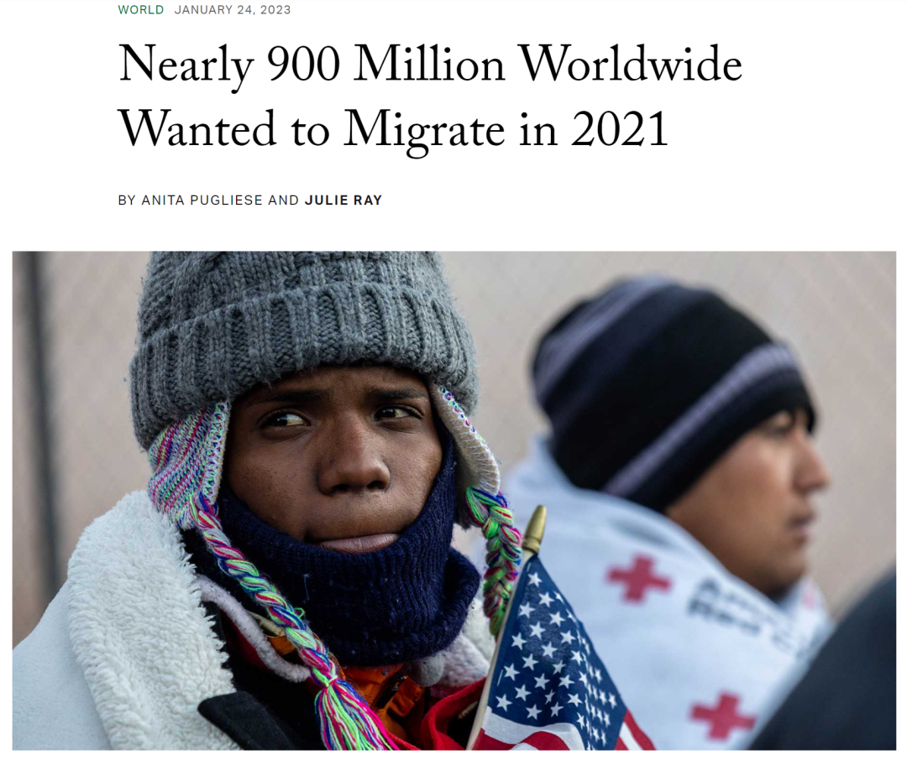
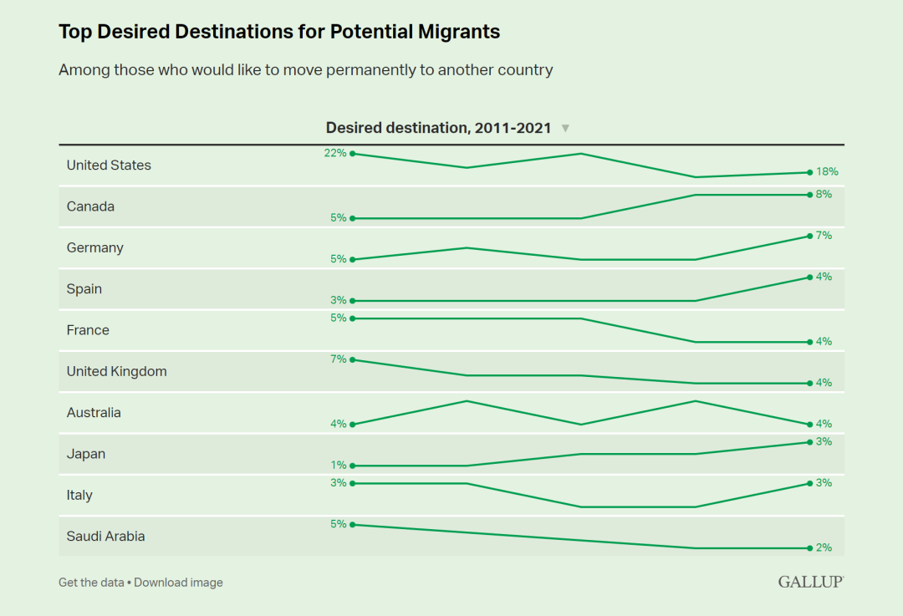
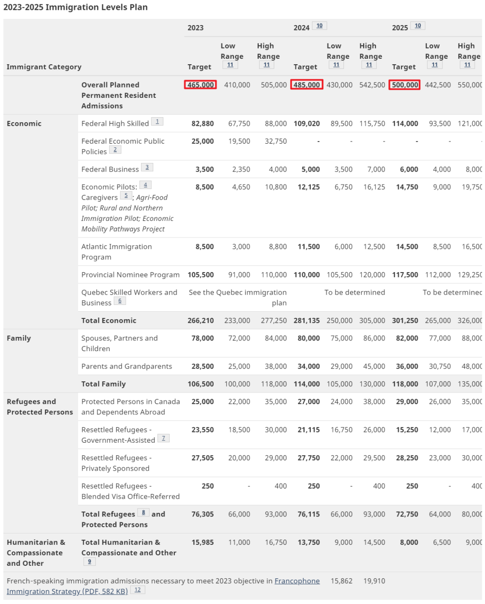
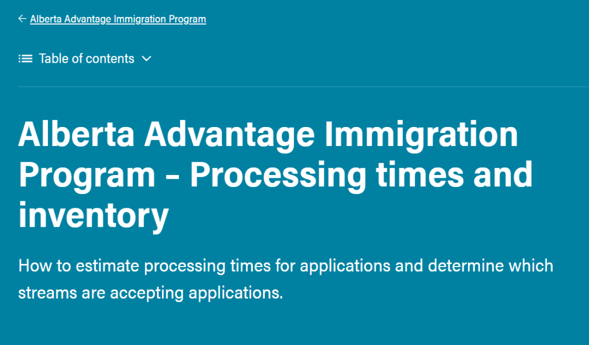
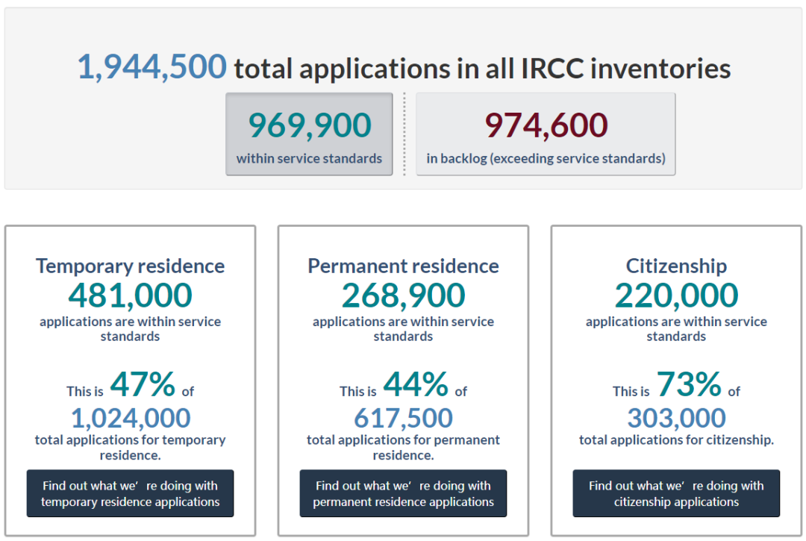
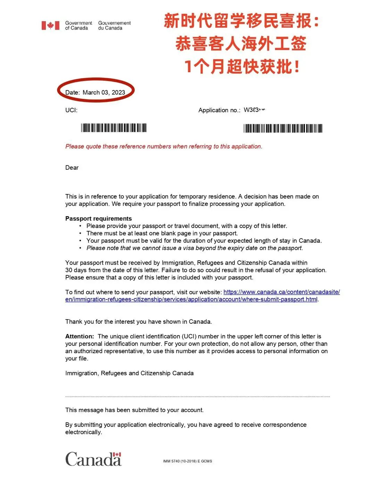
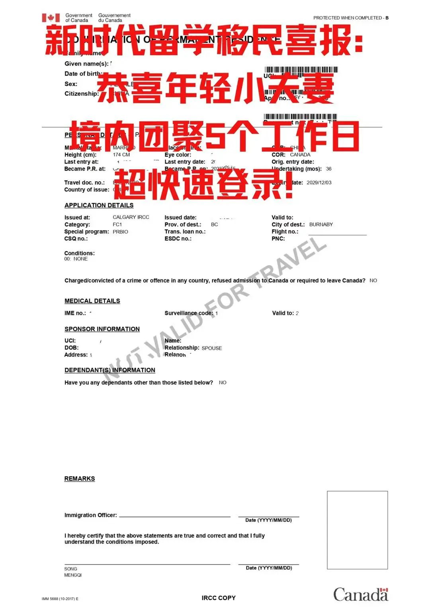

# 无标题

**链接地址:** http://mp.weixin.qq.com/s?__biz=MzUyNzA2NTAwNg==&mid=2247493147&idx=1&sn=39a384b15ed44141536939d97a01b195&chksm=fa07ecdacd7065cc033cb7827e8717a54489e8c49b702a3667ff67a668b5aeef84d9e7913e60&mpshare=1&scene=2&srcid=0307OZNBCCpAX0Q3bn4Bkd48&sharer_sharetime=1678154865160&sharer_shareid=77848a6b3852ae4dcb6c74ffee84743c#rd
**作者:** 
**获取时间:** 2025/8/28 19:18:25
**图片数量:** 33

---

## 原始HTML内容

<section style="box-sizing: border-box;font-size: 16px;"><section style="text-align: center;margin-top: 10px;margin-bottom: 10px;line-height: 0;box-sizing: border-box;" powered-by="xiumi.us"><section style="max-width: 100%;vertical-align: middle;display: inline-block;line-height: 0;box-sizing: border-box;"></section></section><section style="text-align: center;margin-top: 10px;margin-bottom: 10px;line-height: 0;box-sizing: border-box;" powered-by="xiumi.us"><section style="max-width: 100%;vertical-align: middle;display: inline-block;line-height: 0;box-sizing: border-box;"></section></section>
 
<section style="font-size: 19px;text-align: center;margin-top: 10px;margin-bottom: 3px;box-sizing: border-box;" powered-by="xiumi.us"><section style="display: inline-block;border-width: 1px;border-style: solid;border-color: rgb(188, 65, 65);background-color: rgb(188, 65, 65);width: 1.8em;height: 1.8em;line-height: 1.8em;border-radius: 100%;margin-left: auto;margin-right: auto;font-size: 16px;color: rgb(255, 255, 255);box-sizing: border-box;">
<strong style="box-sizing: border-box;">1</strong>
</section></section><section style="text-align: center;box-sizing: border-box;" powered-by="xiumi.us"><section style="display: inline-block;width: 0px;height: 0px;vertical-align: top;overflow: hidden;border-style: solid;border-width: 9px 6px 0px;border-color: rgb(188, 65, 65) rgba(255, 255, 255, 0) rgba(255, 255, 255, 0);box-sizing: border-box;"><svg viewBox="0 0 1 1" style="float:left;line-height:0;width:0;vertical-align:top;"></svg></section></section><section style="margin-bottom: 10px;text-align: center;justify-content: center;display: flex;flex-flow: row nowrap;box-sizing: border-box;" powered-by="xiumi.us"><section style="display: inline-block;width: auto;vertical-align: middle;background-color: rgba(109, 155, 209, 0.1);min-width: 10%;max-width: 100%;flex: 0 0 auto;height: auto;align-self: center;padding: 12px;box-sizing: border-box;"><section style="color: rgb(109, 155, 209);text-align: justify;box-sizing: border-box;" powered-by="xiumi.us">
<strong style="box-sizing: border-box;">加拿大成为第二受移民欢迎目的地</strong> 
</section></section></section><section style="font-size: 14px;padding-right: 15px;padding-left: 15px;letter-spacing: 1px;box-sizing: border-box;" powered-by="xiumi.us">
 

在全球分析和咨询公司盖洛普最近的一项民意调查中，加拿大首次成为继美国之后最受潜在<strong style="box-sizing: border-box;">新移民欢迎的第二大目的地</strong>。

 

这是自 2018 年以来盖洛普首次发布有关该主题的数据。&nbsp; 

 
</section><section style="text-align: center;margin-top: 10px;margin-bottom: 10px;line-height: 0;box-sizing: border-box;" powered-by="xiumi.us"><section style="max-width: 100%;vertical-align: middle;display: inline-block;line-height: 0;width: 90%;height: auto;box-sizing: border-box;"></section></section><section style="font-size: 14px;padding-right: 15px;padding-left: 15px;letter-spacing: 1px;box-sizing: border-box;" powered-by="xiumi.us">
 

民意调查显示，到2021年，如果有机会，将有<strong style="box-sizing: border-box;">9亿人表示想永久移居另一个国家</strong>。这是自该公司2011年开始收集数据以来记录的最高数字。&nbsp;

 

总体而言，从2011年到2021年，想要永久移居另一个国家的人数<strong style="box-sizing: border-box;">从12%跃升至16%</strong>。只有欧盟国家和整个东亚国家的人愿意离开祖国的人数有所减少。

 

数据表明，COVID-19大流行并没有阻止人们想要移民的愿望。
</section>
 

 
<section style="font-size: 19px;text-align: center;margin-top: 10px;margin-bottom: 3px;box-sizing: border-box;" powered-by="xiumi.us"><section style="display: inline-block;border-width: 1px;border-style: solid;border-color: rgb(188, 65, 65);background-color: rgb(188, 65, 65);width: 1.8em;height: 1.8em;line-height: 1.8em;border-radius: 100%;margin-left: auto;margin-right: auto;font-size: 16px;color: rgb(255, 255, 255);box-sizing: border-box;">
<strong style="box-sizing: border-box;">2</strong>
</section></section><section style="text-align: center;box-sizing: border-box;" powered-by="xiumi.us"><section style="display: inline-block;width: 0px;height: 0px;vertical-align: top;overflow: hidden;border-style: solid;border-width: 9px 6px 0px;border-color: rgb(188, 65, 65) rgba(255, 255, 255, 0) rgba(255, 255, 255, 0);box-sizing: border-box;"><svg viewBox="0 0 1 1" style="float:left;line-height:0;width:0;vertical-align:top;"></svg></section></section><section style="margin-bottom: 10px;text-align: center;justify-content: center;display: flex;flex-flow: row nowrap;box-sizing: border-box;" powered-by="xiumi.us"><section style="display: inline-block;width: auto;vertical-align: middle;background-color: rgba(109, 155, 209, 0.1);min-width: 10%;max-width: 100%;flex: 0 0 auto;height: auto;align-self: center;padding: 12px;box-sizing: border-box;"><section style="color: rgb(109, 155, 209);text-align: justify;box-sizing: border-box;" powered-by="xiumi.us">
<strong style="box-sizing: border-box;">加拿大越来越受移民群体欢迎</strong> 
</section></section></section><section style="font-size: 14px;padding-right: 15px;padding-left: 15px;letter-spacing: 1px;box-sizing: border-box;" powered-by="xiumi.us">
 

在过去五年中，<strong style="box-sizing: border-box;">加拿大已成为更受移民欢迎的目的地</strong>，2021年有8%（即全球约7400万人）的受访者表示他们希望移民加拿大而不是美国。&nbsp;

 

其反移民立场导致许多人放弃美国作为移民选择而转向其他地方。基于此，<strong style="box-sizing: border-box;">8%的潜在移民表示他们会选择加拿大而不是任何其他国家</strong>，比2011年的5%大幅上升。

 
</section><section style="text-align: center;margin-top: 10px;margin-bottom: 10px;line-height: 0;box-sizing: border-box;" powered-by="xiumi.us"><section style="max-width: 100%;vertical-align: middle;display: inline-block;line-height: 0;width: 90%;height: auto;box-sizing: border-box;"></section></section><section style="font-size: 14px;padding-right: 15px;padding-left: 15px;letter-spacing: 1px;box-sizing: border-box;" powered-by="xiumi.us">
 

在同一时期，选择美国的移民人数从22%下降到 18%。德国、西班牙、法国、英国、澳大利亚和日本都在3-7%之间。

 

<strong style="box-sizing: border-box;">想要离开自己国家的人比例最高的是塞拉利昂</strong>，那里有76%的受访者表示他们考虑离开。黎巴嫩的比例第二高，为63%，超过了阿富汗的53%。&nbsp;

 
</section><section style="text-align: center;margin-top: 10px;margin-bottom: 10px;line-height: 0;box-sizing: border-box;" powered-by="xiumi.us"><section style="max-width: 100%;vertical-align: middle;display: inline-block;line-height: 0;box-sizing: border-box;"></section></section><section style="font-size: 14px;padding-right: 15px;padding-left: 15px;letter-spacing: 1px;box-sizing: border-box;" powered-by="xiumi.us">
 

不过，永久移居到另一个国家的人数总体增幅最高的地区是拉丁美洲和加勒比地区，在2011年至2021年间增长了19%。超过45%的受访者来自洪都拉斯、厄瓜多尔和多米尼加共和国。如果有机会，他们表示自己会选择移民。&nbsp; 

 

民意调查指出，想要离开自己祖国的受访者与愿意离开祖国的受访者之间存在差异。许多想要移民的人<strong style="box-sizing: border-box;">受到财务、家庭和工作机会等情况的阻碍</strong>，永远无法离开自己的国家。 

 

 
</section><section style="font-size: 19px;text-align: center;margin-top: 10px;margin-bottom: 3px;box-sizing: border-box;" powered-by="xiumi.us"><section style="display: inline-block;border-width: 1px;border-style: solid;border-color: rgb(188, 65, 65);background-color: rgb(188, 65, 65);width: 1.8em;height: 1.8em;line-height: 1.8em;border-radius: 100%;margin-left: auto;margin-right: auto;font-size: 16px;color: rgb(255, 255, 255);box-sizing: border-box;">
<strong style="box-sizing: border-box;">3</strong>
</section></section><section style="text-align: center;box-sizing: border-box;" powered-by="xiumi.us"><section style="display: inline-block;width: 0px;height: 0px;vertical-align: top;overflow: hidden;border-style: solid;border-width: 9px 6px 0px;border-color: rgb(188, 65, 65) rgba(255, 255, 255, 0) rgba(255, 255, 255, 0);box-sizing: border-box;"><svg viewBox="0 0 1 1" style="float:left;line-height:0;width:0;vertical-align:top;"></svg></section></section><section style="margin-bottom: 10px;text-align: center;justify-content: center;display: flex;flex-flow: row nowrap;box-sizing: border-box;" powered-by="xiumi.us"><section style="display: inline-block;width: auto;vertical-align: middle;background-color: rgba(109, 155, 209, 0.1);min-width: 10%;max-width: 100%;flex: 0 0 auto;height: auto;align-self: center;padding: 12px;box-sizing: border-box;"><section style="color: rgb(109, 155, 209);text-align: justify;box-sizing: border-box;" powered-by="xiumi.us">
<strong style="box-sizing: border-box;">加拿大主动寻求更多移民&nbsp;</strong>
</section></section></section><section style="font-size: 14px;padding-right: 15px;padding-left: 15px;letter-spacing: 1px;box-sizing: border-box;" powered-by="xiumi.us">
 

加拿大广为人知的高移民配额可能是其作为新移民目的地受欢迎的一个因素。&nbsp;

 

加拿大需要移民来应对<strong style="box-sizing: border-box;">劳动力老龄化</strong>和全球出生率最低之一造成的长期<strong style="box-sizing: border-box;">劳动力短缺问题</strong>。没有移民，加拿大就没有足够大的税基来维持医疗保健和教育等社会服务。&nbsp;

 
</section><section style="text-align: center;margin-top: 10px;margin-bottom: 10px;line-height: 0;box-sizing: border-box;" powered-by="xiumi.us"><section style="max-width: 100%;vertical-align: middle;display: inline-block;line-height: 0;width: 90%;height: auto;box-sizing: border-box;"></section></section><section style="font-size: 14px;padding-right: 15px;padding-left: 15px;letter-spacing: 1px;box-sizing: border-box;" powered-by="xiumi.us">
 

因此，加拿大每年都会发布一项移民水平计划，确定以各种途径接纳新永久居民的人数设定目标。 

 

2022年，加拿大迎来了超过437,000名永久居民。这一目标在2023年设定为更高的465,000人，<strong style="box-sizing: border-box;">到2025年每年增加500,000人</strong>。

 
</section><section style="text-align: center;margin-top: 10px;margin-bottom: 10px;line-height: 0;box-sizing: border-box;" powered-by="xiumi.us"><section style="max-width: 100%;vertical-align: middle;display: inline-block;line-height: 0;width: 90%;height: auto;box-sizing: border-box;"></section></section><section style="font-size: 14px;padding-right: 15px;padding-left: 15px;letter-spacing: 1px;box-sizing: border-box;" powered-by="xiumi.us">
 

为了实现这些目标，加拿大更是绞尽脑汁。此前的的一份政策备忘录显示，联邦政府正考虑采<strong style="box-sizing: border-box;">取激进的、非常规的措施来减少移民申请积压</strong>，包括免除近50万份访客签证的资格要求等。

 
</section>
 
<section style="font-size: 19px;text-align: center;margin-top: 10px;margin-bottom: 3px;box-sizing: border-box;" powered-by="xiumi.us"><section style="display: inline-block;border-width: 1px;border-style: solid;border-color: rgb(188, 65, 65);background-color: rgb(188, 65, 65);width: 1.8em;height: 1.8em;line-height: 1.8em;border-radius: 100%;margin-left: auto;margin-right: auto;font-size: 16px;color: rgb(255, 255, 255);box-sizing: border-box;">
<strong style="box-sizing: border-box;">4</strong>
</section></section><section style="text-align: center;box-sizing: border-box;" powered-by="xiumi.us"><section style="display: inline-block;width: 0px;height: 0px;vertical-align: top;overflow: hidden;border-style: solid;border-width: 9px 6px 0px;border-color: rgb(188, 65, 65) rgba(255, 255, 255, 0) rgba(255, 255, 255, 0);box-sizing: border-box;"><svg viewBox="0 0 1 1" style="float:left;line-height:0;width:0;vertical-align:top;"></svg></section></section><section style="margin-bottom: 10px;text-align: center;justify-content: center;display: flex;flex-flow: row nowrap;box-sizing: border-box;" powered-by="xiumi.us"><section style="display: inline-block;width: auto;vertical-align: middle;background-color: rgba(109, 155, 209, 0.1);min-width: 10%;max-width: 100%;flex: 0 0 auto;height: auto;align-self: center;padding: 12px;box-sizing: border-box;"><section style="color: rgb(109, 155, 209);text-align: justify;box-sizing: border-box;" powered-by="xiumi.us">
<strong style="box-sizing: border-box;">2023年加拿大移民的新方向</strong>
</section></section></section><section style="font-size: 14px;padding-right: 15px;padding-left: 15px;letter-spacing: 1px;box-sizing: border-box;" powered-by="xiumi.us">
 

进入2023年，加拿大政府仍坚定不移地致力于欢迎新移民来到这个国家，通过增加移民人数来帮助社会和经济发展。同时，加拿大政府努力通过人道主义通道来帮助更多的家庭团聚。

 

<strong style="box-sizing: border-box;">2023年加拿大移民有什么新展望？</strong> 

 
</section><section style="display: flex;width: 100%;flex-flow: column nowrap;box-sizing: border-box;" powered-by="xiumi.us"><section style="z-index: auto;box-sizing: border-box;" powered-by="xiumi.us"><section style="text-align: left;justify-content: flex-start;display: flex;flex-flow: row nowrap;margin-top: 20px;margin-bottom: 20px;transform: translate3d(15px, 0px, 0px);box-sizing: border-box;"><section style="display: inline-block;vertical-align: middle;width: auto;background-color: rgb(188, 65, 65);min-width: 5%;max-width: 100%;flex: 0 0 auto;height: auto;align-self: center;box-sizing: border-box;"><section style="text-align: center;transform: translate3d(10px, 0px, 0px);margin-top: -4px;margin-bottom: -4px;box-sizing: border-box;" powered-by="xiumi.us"><section style="display: inline-block;width: 42px;height: 42px;vertical-align: top;overflow: hidden;border-radius: 235px;background-color: rgb(233, 224, 245);border-style: solid;border-width: 7px;border-color: rgb(255, 255, 255);box-sizing: border-box;"><section style="margin-top: 1px;box-sizing: border-box;" powered-by="xiumi.us"><section style="color: rgb(0, 0, 0);box-sizing: border-box;">
<strong style="box-sizing: border-box;">01</strong>
</section></section></section></section></section><section style="display: inline-block;vertical-align: middle;width: auto;align-self: center;flex: 0 0 auto;min-width: 5%;max-width: 100%;height: auto;padding-left: 10px;box-sizing: border-box;"><section style="text-align: justify;color: rgb(0, 0, 0);box-sizing: border-box;" powered-by="xiumi.us">
<strong style="box-sizing: border-box;">&nbsp;移民配额增加</strong>
</section></section></section></section></section><section style="font-size: 14px;padding-right: 15px;padding-left: 15px;letter-spacing: 1px;box-sizing: border-box;" powered-by="xiumi.us">
 

加拿大移民、难民和公民部 (IRCC)在2023年移民水平计划设定了<strong style="box-sizing: border-box;">创纪录的移民目标</strong>，证明IRCC相信它可以处理积压的申请，同时也欢迎大量新移民。按移民类别划分，2023年移民水平计划目标（465,000人）细分如下： 

 
<ul class="list-paddingleft-1" style="padding-left: 40px;list-style-position: outside;"><li style="box-sizing: border-box;">
<em style="box-sizing: border-box;">快速通道：82,880</em>
</li><li style="box-sizing: border-box;">
<em style="box-sizing: border-box;">省提名计划（PNP）：105,500</em>
</li><li style="box-sizing: border-box;">
<em style="box-sizing: border-box;">父母和祖父母：28,500</em>
</li><li style="box-sizing: border-box;">
<em style="box-sizing: border-box;">配偶/伴侣和子女：78,000</em>
</li></ul>
 

加拿大各省的<strong style="box-sizing: border-box;">省提名计划（PNP）</strong>，是各个省份根据当地的经济发展和人才需求，制定符合本省需求的移民项目。
</section>
 
<section style="text-align: center;margin-top: 10px;margin-bottom: 10px;line-height: 0;box-sizing: border-box;" powered-by="xiumi.us"><section style="max-width: 100%;vertical-align: middle;display: inline-block;line-height: 0;width: 90%;height: auto;box-sizing: border-box;"></section></section><section style="text-align: center;margin-top: 10px;margin-bottom: 10px;line-height: 0;box-sizing: border-box;" powered-by="xiumi.us"><section style="max-width: 100%;vertical-align: middle;display: inline-block;line-height: 0;width: 90%;height: auto;box-sizing: border-box;"></section></section><section style="text-align: center;margin-top: 10px;margin-bottom: 10px;line-height: 0;box-sizing: border-box;" powered-by="xiumi.us"><section style="max-width: 100%;vertical-align: middle;display: inline-block;line-height: 0;width: 90%;height: auto;box-sizing: border-box;"></section></section><section style="font-size: 14px;padding-right: 15px;padding-left: 15px;letter-spacing: 1px;box-sizing: border-box;" powered-by="xiumi.us">
 

其实从大方向来看，<strong style="box-sizing: border-box;">省提名计划的总名额会超过EE联邦快速移民通道配额</strong>，这将会成为加拿大移民的主流途径。 

 

加拿大全国的PNP配额预计是105,500个名额，<strong style="box-sizing: border-box;">比去年的配额分配增加了十分之一</strong>，比联邦技术移民的配额还要高，<strong style="box-sizing: border-box;">成为了所有类别中占比最高的项目</strong>。

 

即使从全国配额来看，总数额是增加，但是具体分配到每个省的增加额度不是很大，所以省提名项目依旧是一个竞争十分激烈的移民项目。 

 

 
</section><section style="display: flex;width: 100%;flex-flow: column nowrap;box-sizing: border-box;" powered-by="xiumi.us"><section style="z-index: auto;box-sizing: border-box;" powered-by="xiumi.us"><section style="text-align: left;justify-content: flex-start;display: flex;flex-flow: row nowrap;margin-top: 20px;margin-bottom: 20px;transform: translate3d(15px, 0px, 0px);box-sizing: border-box;"><section style="display: inline-block;vertical-align: middle;width: auto;background-color: rgb(188, 65, 65);min-width: 5%;max-width: 100%;flex: 0 0 auto;height: auto;align-self: center;box-sizing: border-box;"><section style="text-align: center;transform: translate3d(10px, 0px, 0px);margin-top: -4px;margin-bottom: -4px;box-sizing: border-box;" powered-by="xiumi.us"><section style="display: inline-block;width: 42px;height: 42px;vertical-align: top;overflow: hidden;border-radius: 235px;background-color: rgb(233, 224, 245);border-style: solid;border-width: 7px;border-color: rgb(255, 255, 255);box-sizing: border-box;"><section style="margin-top: 1px;box-sizing: border-box;" powered-by="xiumi.us"><section style="color: rgb(0, 0, 0);box-sizing: border-box;">
<strong style="box-sizing: border-box;">02</strong>
</section></section></section></section></section><section style="display: inline-block;vertical-align: middle;width: auto;align-self: center;flex: 0 0 auto;min-width: 5%;max-width: 100%;height: auto;padding-left: 10px;box-sizing: border-box;"><section style="text-align: justify;color: rgb(0, 0, 0);box-sizing: border-box;" powered-by="xiumi.us">
<strong style="box-sizing: border-box;">&nbsp;国际留学生</strong>
</section></section></section></section></section><section style="font-size: 14px;padding-right: 15px;padding-left: 15px;letter-spacing: 1px;box-sizing: border-box;" powered-by="xiumi.us">
 

该政策旨在帮助加拿大更好地应对劳动力短缺问题，同时这一变化也显示了加拿大政府对于<strong style="box-sizing: border-box;">超过一百万国际留学生</strong>所带来的社会和经济影响的重视。 

 

预计在2023年，IRCC将会提出<strong style="box-sizing: border-box;">对加拿大留学生更多的倾向性政策</strong>，比如结合快速通道的目标抽选来增加留学生占移民人数的比例。

 
</section><section style="text-align: center;margin-top: 10px;margin-bottom: 10px;line-height: 0;box-sizing: border-box;" powered-by="xiumi.us"><section style="max-width: 100%;vertical-align: middle;display: inline-block;line-height: 0;width: 90%;height: auto;box-sizing: border-box;"></section></section><section style="text-align: center;margin-top: 10px;margin-bottom: 10px;line-height: 0;box-sizing: border-box;" powered-by="xiumi.us"><section style="max-width: 100%;vertical-align: middle;display: inline-block;line-height: 0;width: 90%;height: auto;box-sizing: border-box;"></section></section><section style="font-size: 14px;padding-right: 15px;padding-left: 15px;letter-spacing: 1px;box-sizing: border-box;" powered-by="xiumi.us">
 

加拿大面临着充满挑战的后疫情时代，经济增长缓慢、劳动力紧缺、通货膨胀以及国际关系紧张等问题都在深刻影响加拿大社会和经济。

 

因此，加拿大政府非常重视移民对解决加拿大社会问题的正面影响，并逐年提高移民计划来吸引更多有能力的<strong style="box-sizing: border-box;">技术移民来减轻劳动力市场的压力</strong>，并且为加拿大经济提供循环动力。

 
</section><section style="text-align: center;margin-top: 10px;margin-bottom: 10px;line-height: 0;box-sizing: border-box;" powered-by="xiumi.us"><section style="max-width: 100%;vertical-align: middle;display: inline-block;line-height: 0;width: 90%;height: auto;box-sizing: border-box;"></section></section><section style="font-size: 14px;padding-right: 15px;padding-left: 15px;letter-spacing: 1px;box-sizing: border-box;" powered-by="xiumi.us">
 

综上所示，我们预计2023年加拿大技术移民<strong style="box-sizing: border-box;">将更多的以就业为重点，提高各省提名和快速通道分类抽选的比例和数量</strong>。同时，IRCC也将致力于减少审理积压，加快移民登陆的进度，让更多的家庭得到团聚。

 
</section><section style="display: flex;width: 100%;flex-flow: column nowrap;box-sizing: border-box;" powered-by="xiumi.us"><section style="z-index: auto;box-sizing: border-box;" powered-by="xiumi.us"><section style="text-align: left;justify-content: flex-start;display: flex;flex-flow: row nowrap;margin-top: 20px;margin-bottom: 20px;transform: translate3d(15px, 0px, 0px);box-sizing: border-box;"><section style="display: inline-block;vertical-align: middle;width: auto;background-color: rgb(188, 65, 65);min-width: 5%;max-width: 100%;flex: 0 0 auto;height: auto;align-self: center;box-sizing: border-box;"><section style="text-align: center;transform: translate3d(10px, 0px, 0px);margin-top: -4px;margin-bottom: -4px;box-sizing: border-box;" powered-by="xiumi.us"><section style="display: inline-block;width: 42px;height: 42px;vertical-align: top;overflow: hidden;border-radius: 235px;background-color: rgb(233, 224, 245);border-style: solid;border-width: 7px;border-color: rgb(255, 255, 255);box-sizing: border-box;"><section style="margin-top: 1px;box-sizing: border-box;" powered-by="xiumi.us"><section style="color: rgb(0, 0, 0);box-sizing: border-box;">
<strong style="box-sizing: border-box;">03</strong>
</section></section></section></section></section><section style="display: inline-block;vertical-align: middle;width: auto;align-self: center;flex: 0 0 auto;min-width: 5%;max-width: 100%;height: auto;padding-left: 10px;box-sizing: border-box;"><section style="text-align: justify;color: rgb(0, 0, 0);box-sizing: border-box;" powered-by="xiumi.us">
<strong style="box-sizing: border-box;">&nbsp;审批速度加快 </strong>
</section></section></section></section></section><section style="font-size: 14px;padding-right: 15px;padding-left: 15px;letter-spacing: 1px;box-sizing: border-box;" powered-by="xiumi.us">
自2022年9月以来，IRCC一直致力于减少申请积压的总量。并上线了申请积压系统，而且会及时更新当前库存和案件积压情况。 

 
</section><section style="text-align: center;margin-top: 10px;margin-bottom: 10px;line-height: 0;box-sizing: border-box;" powered-by="xiumi.us"><section style="max-width: 100%;vertical-align: middle;display: inline-block;line-height: 0;width: 90%;height: auto;box-sizing: border-box;"></section></section><section style="font-size: 14px;padding-right: 15px;padding-left: 15px;letter-spacing: 1px;box-sizing: border-box;" powered-by="xiumi.us">
 

目前，IRCC永久居民申请积压案件的进展如下： 

 
<ul class="list-paddingleft-1" style="padding-left: 40px;list-style-position: outside;"><li style="box-sizing: border-box;">
联邦高技术类移民申请实际积压案件比例从90%降低到31%，领先预定目标15%
</li><li style="box-sizing: border-box;">
省提名快速通道类移民申请实际积压案件比例维持在42%，仍高于预定目标14%
</li><li style="box-sizing: border-box;">
团聚类移民申请实际积压案件比例从25%降低到24%，高于预定目标4%
</li><li style="box-sizing: border-box;">
另外，IRCC入籍申请积压案件比例从31%降低到27%，符合预定目标

 
</li></ul></section><section style="text-align: center;margin-top: 10px;margin-bottom: 10px;line-height: 0;box-sizing: border-box;" powered-by="xiumi.us"><section style="max-width: 100%;vertical-align: middle;display: inline-block;line-height: 0;box-sizing: border-box;"></section></section><section style="font-size: 14px;padding-right: 15px;padding-left: 15px;letter-spacing: 1px;box-sizing: border-box;" powered-by="xiumi.us">
 

从案件积压减少的幅度来看，IRCC将更多的审理精力投入到技术类移民申请中。预计在2023年，经济类移民申请，如联邦技术移民，<strong style="box-sizing: border-box;">加拿大经验类移民以及各省省提名申请审理速度将进一步加快</strong>。

 

此外，IRCC还获得了 联邦政府8500万加币的资金以<strong style="box-sizing: border-box;">“减少申请库存”</strong>，并在2019年3月至2022年11月期间<strong style="box-sizing: border-box;">增加了2521名“一线审理人员”</strong>。

 

这些因素将在2023年继续对IRCC解决申请积压产生积极影响。

 
</section><section style="display: flex;width: 100%;flex-flow: column nowrap;box-sizing: border-box;" powered-by="xiumi.us"><section style="z-index: auto;box-sizing: border-box;" powered-by="xiumi.us"><section style="text-align: left;justify-content: flex-start;display: flex;flex-flow: row nowrap;margin-top: 20px;margin-bottom: 20px;transform: translate3d(15px, 0px, 0px);box-sizing: border-box;"><section style="display: inline-block;vertical-align: middle;width: auto;background-color: rgb(188, 65, 65);min-width: 5%;max-width: 100%;flex: 0 0 auto;height: auto;align-self: center;box-sizing: border-box;"><section style="text-align: center;transform: translate3d(10px, 0px, 0px);margin-top: -4px;margin-bottom: -4px;box-sizing: border-box;" powered-by="xiumi.us"><section style="display: inline-block;width: 42px;height: 42px;vertical-align: top;overflow: hidden;border-radius: 235px;background-color: rgb(233, 224, 245);border-style: solid;border-width: 7px;border-color: rgb(255, 255, 255);box-sizing: border-box;"><section style="margin-top: 1px;box-sizing: border-box;" powered-by="xiumi.us"><section style="color: rgb(0, 0, 0);box-sizing: border-box;">
<strong style="box-sizing: border-box;">04</strong>
</section></section></section></section></section><section style="display: inline-block;vertical-align: middle;width: auto;align-self: center;flex: 0 0 auto;min-width: 5%;max-width: 100%;height: auto;padding-left: 10px;box-sizing: border-box;"><section style="text-align: justify;color: rgb(0, 0, 0);box-sizing: border-box;" powered-by="xiumi.us">
<strong style="box-sizing: border-box;">&nbsp;快速通道项目</strong>
</section></section></section></section></section><section style="font-size: 14px;padding-right: 15px;padding-left: 15px;letter-spacing: 1px;box-sizing: border-box;" powered-by="xiumi.us">
 

根据去年国会通过的C-19法案，IRCC预计将在2023年正式在快速通道项目中<strong style="box-sizing: border-box;">引入“目标抽选”</strong>。

 

该抽选方式将根据特定的<strong style="box-sizing: border-box;">职业、语言水平、教育背景或工作经验</strong>对快速通道池子中的申请人发出邀请，从而满足加拿大解决特定劳动力紧缺的问题。

 
</section><section style="text-align: center;margin-top: 10px;margin-bottom: 10px;line-height: 0;box-sizing: border-box;" powered-by="xiumi.us"><section style="max-width: 100%;vertical-align: middle;display: inline-block;line-height: 0;width: 90%;height: auto;box-sizing: border-box;"></section></section><section style="font-size: 14px;padding-right: 15px;padding-left: 15px;letter-spacing: 1px;box-sizing: border-box;" powered-by="xiumi.us">
 

该项改革将给来自<strong style="box-sizing: border-box;">紧缺职业</strong>，诸如教育，技术，IT以及工程类的申请人更多的机会。

 

 
</section><section style="font-size: 19px;text-align: center;margin-top: 10px;margin-bottom: 3px;box-sizing: border-box;" powered-by="xiumi.us"><section style="display: inline-block;border-width: 1px;border-style: solid;border-color: rgb(188, 65, 65);background-color: rgb(188, 65, 65);width: 1.8em;height: 1.8em;line-height: 1.8em;border-radius: 100%;margin-left: auto;margin-right: auto;font-size: 16px;color: rgb(255, 255, 255);box-sizing: border-box;">
<strong style="box-sizing: border-box;">5</strong>
</section></section><section style="text-align: center;box-sizing: border-box;" powered-by="xiumi.us"><section style="display: inline-block;width: 0px;height: 0px;vertical-align: top;overflow: hidden;border-style: solid;border-width: 9px 6px 0px;border-color: rgb(188, 65, 65) rgba(255, 255, 255, 0) rgba(255, 255, 255, 0);box-sizing: border-box;"><svg viewBox="0 0 1 1" style="float:left;line-height:0;width:0;vertical-align:top;"></svg></section></section><section style="margin-bottom: 10px;text-align: center;justify-content: center;display: flex;flex-flow: row nowrap;box-sizing: border-box;" powered-by="xiumi.us"><section style="display: inline-block;width: auto;vertical-align: middle;background-color: rgba(109, 155, 209, 0.1);min-width: 10%;max-width: 100%;flex: 0 0 auto;height: auto;align-self: center;padding: 12px;box-sizing: border-box;"><section style="color: rgb(109, 155, 209);text-align: justify;box-sizing: border-box;" powered-by="xiumi.us">
<strong style="box-sizing: border-box;">近期成功案例分享</strong> 
</section></section></section>
 
<section style="margin: 20px 0% 5px;text-align: center;transform: translate3d(1px, 0px, 0px);-webkit-transform: translate3d(1px, 0px, 0px);-moz-transform: translate3d(1px, 0px, 0px);-o-transform: translate3d(1px, 0px, 0px);box-sizing: border-box;" powered-by="xiumi.us"><section style="font-size: 26px;font-family: Optima-Regular, PingFangTC-light;color: rgb(0, 0, 0);letter-spacing: 2px;line-height: 1;box-sizing: border-box;">
<strong style="box-sizing: border-box;"># LMIA工签境外递交&nbsp;#</strong>
</section></section><section style="text-align: center;justify-content: center;margin-top: 1px;margin-right: 0%;margin-left: 0%;display: flex;flex-flow: row nowrap;box-sizing: border-box;" powered-by="xiumi.us"><section style="display: inline-block;width: 100px;vertical-align: top;flex: 0 0 auto;height: auto;border-top: 0px solid rgb(43, 65, 110);border-top-left-radius: 0px;align-self: flex-start;line-height: 0;box-sizing: border-box;"><section style="margin-right: 0%;margin-bottom: 8px;margin-left: 0%;transform: translate3d(1px, 0px, 0px);box-sizing: border-box;" powered-by="xiumi.us"><section style="background-color: rgb(43, 65, 110);height: 1px;box-sizing: border-box;"><svg viewBox="0 0 1 1" style="float:left;line-height:0;width:0;vertical-align:top;"></svg></section></section></section></section><section style="text-align: center;margin: -24px 0% 10px;box-sizing: border-box;" powered-by="xiumi.us"><section style="display: inline-block;width: 46px;height: 33px;vertical-align: top;overflow: hidden;background-color: rgba(255, 174, 174, 0.13);border-width: 0px;border-radius: 206% 134% 167% 138%;border-style: none;border-color: rgb(62, 62, 62);box-sizing: border-box;"><svg viewBox="0 0 1 1" style="float:left;line-height:0;width:0;vertical-align:top;"></svg></section></section><section style="margin-top: 10px;margin-right: 0%;margin-left: 0%;text-align: left;justify-content: flex-start;display: flex;flex-flow: row nowrap;box-sizing: border-box;" powered-by="xiumi.us"><section style="display: inline-block;width: 100%;vertical-align: top;background-color: rgb(255, 244, 229);padding: 20px 20px 25px;box-shadow: rgb(0, 0, 0) 0px 0px 0px;align-self: flex-start;flex: 0 0 auto;box-sizing: border-box;"><section style="text-align: center;margin-top: 10px;margin-right: 0%;margin-left: 0%;justify-content: center;display: flex;flex-flow: row nowrap;box-sizing: border-box;" powered-by="xiumi.us"><section style="display: inline-block;width: 100%;vertical-align: top;border-width: 0px;border-radius: 8px;border-style: none;border-color: rgb(62, 62, 62);overflow: hidden;box-shadow: rgb(235, 198, 159) 0px 0px 6px;background-color: rgb(255, 255, 255);padding-bottom: 10px;flex: 0 0 auto;height: auto;align-self: flex-start;box-sizing: border-box;"><section style="justify-content: center;display: flex;flex-flow: row nowrap;box-sizing: border-box;" powered-by="xiumi.us"><section style="display: inline-block;width: 100%;vertical-align: top;box-shadow: rgb(0, 0, 0) 0px 0px 0px;padding: 5px 10px 10px;align-self: flex-start;flex: 0 0 auto;box-sizing: border-box;"><section style="margin-top: 10px;margin-bottom: 10px;line-height: 0;box-sizing: border-box;" powered-by="xiumi.us"><section style="max-width: 100%;vertical-align: middle;display: inline-block;line-height: 0;box-sizing: border-box;"></section></section><section style="margin-top: 10px;margin-bottom: 10px;line-height: 0;box-sizing: border-box;" powered-by="xiumi.us"><section style="max-width: 100%;vertical-align: middle;display: inline-block;line-height: 0;box-sizing: border-box;"></section></section><section style="margin-top: 10px;margin-bottom: 10px;line-height: 0;box-sizing: border-box;" powered-by="xiumi.us"><section style="max-width: 100%;vertical-align: middle;display: inline-block;line-height: 0;box-sizing: border-box;"></section></section></section></section></section></section></section></section><section style="box-sizing: border-box;" powered-by="xiumi.us"><section style="text-align: center;margin: -50px 0% 10px;line-height: 0;box-sizing: border-box;"><section style="max-width: 100%;vertical-align: middle;display: inline-block;line-height: 0;box-shadow: rgb(0, 0, 0) 0px 0px 0px;box-sizing: border-box;"></section></section></section>
 
<section style="margin: 20px 0% 5px;text-align: center;transform: translate3d(1px, 0px, 0px);-webkit-transform: translate3d(1px, 0px, 0px);-moz-transform: translate3d(1px, 0px, 0px);-o-transform: translate3d(1px, 0px, 0px);box-sizing: border-box;" powered-by="xiumi.us"><section style="font-size: 26px;font-family: Optima-Regular, PingFangTC-light;color: rgb(0, 0, 0);letter-spacing: 2px;line-height: 1;box-sizing: border-box;">
<strong style="box-sizing: border-box;"># 超级签证 #</strong>
</section></section><section style="text-align: center;justify-content: center;margin-top: 1px;margin-right: 0%;margin-left: 0%;display: flex;flex-flow: row nowrap;box-sizing: border-box;" powered-by="xiumi.us"><section style="display: inline-block;width: 100px;vertical-align: top;flex: 0 0 auto;height: auto;border-top: 0px solid rgb(43, 65, 110);border-top-left-radius: 0px;align-self: flex-start;line-height: 0;box-sizing: border-box;"><section style="margin-right: 0%;margin-bottom: 8px;margin-left: 0%;transform: translate3d(1px, 0px, 0px);box-sizing: border-box;" powered-by="xiumi.us"><section style="background-color: rgb(43, 65, 110);height: 1px;box-sizing: border-box;"><svg viewBox="0 0 1 1" style="float:left;line-height:0;width:0;vertical-align:top;"></svg></section></section></section></section><section style="text-align: center;margin: -24px 0% 10px;box-sizing: border-box;" powered-by="xiumi.us"><section style="display: inline-block;width: 46px;height: 33px;vertical-align: top;overflow: hidden;background-color: rgba(255, 174, 174, 0.13);border-width: 0px;border-radius: 206% 134% 167% 138%;border-style: none;border-color: rgb(62, 62, 62);box-sizing: border-box;"><svg viewBox="0 0 1 1" style="float:left;line-height:0;width:0;vertical-align:top;"></svg></section></section><section style="margin-top: 10px;margin-right: 0%;margin-left: 0%;text-align: left;justify-content: flex-start;display: flex;flex-flow: row nowrap;box-sizing: border-box;" powered-by="xiumi.us"><section style="display: inline-block;width: 100%;vertical-align: top;background-color: rgb(255, 244, 229);padding: 20px 20px 25px;box-shadow: rgb(0, 0, 0) 0px 0px 0px;align-self: flex-start;flex: 0 0 auto;box-sizing: border-box;"><section style="text-align: center;margin-top: 10px;margin-right: 0%;margin-left: 0%;justify-content: center;display: flex;flex-flow: row nowrap;box-sizing: border-box;" powered-by="xiumi.us"><section style="display: inline-block;width: 100%;vertical-align: top;border-width: 0px;border-radius: 8px;border-style: none;border-color: rgb(62, 62, 62);overflow: hidden;box-shadow: rgb(235, 198, 159) 0px 0px 6px;background-color: rgb(255, 255, 255);padding-bottom: 10px;flex: 0 0 auto;height: auto;align-self: flex-start;box-sizing: border-box;"><section style="justify-content: center;display: flex;flex-flow: row nowrap;box-sizing: border-box;" powered-by="xiumi.us"><section style="display: inline-block;width: 100%;vertical-align: top;box-shadow: rgb(0, 0, 0) 0px 0px 0px;padding: 5px 10px 10px;align-self: flex-start;flex: 0 0 auto;box-sizing: border-box;"><section style="margin-top: 10px;margin-bottom: 10px;line-height: 0;box-sizing: border-box;" powered-by="xiumi.us"><section style="max-width: 100%;vertical-align: middle;display: inline-block;line-height: 0;box-sizing: border-box;"></section></section><section style="margin-top: 10px;margin-bottom: 10px;line-height: 0;box-sizing: border-box;" powered-by="xiumi.us"><section style="max-width: 100%;vertical-align: middle;display: inline-block;line-height: 0;box-sizing: border-box;"></section></section></section></section></section></section></section></section><section style="box-sizing: border-box;" powered-by="xiumi.us"><section style="text-align: center;margin: -50px 0% 10px;line-height: 0;box-sizing: border-box;"><section style="max-width: 100%;vertical-align: middle;display: inline-block;line-height: 0;box-shadow: rgb(0, 0, 0) 0px 0px 0px;box-sizing: border-box;"></section></section></section>
 
<section style="margin: 20px 0% 5px;text-align: center;transform: translate3d(1px, 0px, 0px);-webkit-transform: translate3d(1px, 0px, 0px);-moz-transform: translate3d(1px, 0px, 0px);-o-transform: translate3d(1px, 0px, 0px);box-sizing: border-box;" powered-by="xiumi.us"><section style="font-size: 26px;font-family: Optima-Regular, PingFangTC-light;color: rgb(0, 0, 0);letter-spacing: 2px;line-height: 1;box-sizing: border-box;">
<strong style="box-sizing: border-box;"># 境内团聚移民 #</strong>
</section></section><section style="text-align: center;justify-content: center;margin-top: 1px;margin-right: 0%;margin-left: 0%;display: flex;flex-flow: row nowrap;box-sizing: border-box;" powered-by="xiumi.us"><section style="display: inline-block;width: 100px;vertical-align: top;flex: 0 0 auto;height: auto;border-top: 0px solid rgb(43, 65, 110);border-top-left-radius: 0px;align-self: flex-start;line-height: 0;box-sizing: border-box;"><section style="margin-right: 0%;margin-bottom: 8px;margin-left: 0%;transform: translate3d(1px, 0px, 0px);box-sizing: border-box;" powered-by="xiumi.us"><section style="background-color: rgb(43, 65, 110);height: 1px;box-sizing: border-box;"><svg viewBox="0 0 1 1" style="float:left;line-height:0;width:0;vertical-align:top;"></svg></section></section></section></section><section style="text-align: center;margin: -24px 0% 10px;box-sizing: border-box;" powered-by="xiumi.us"><section style="display: inline-block;width: 46px;height: 33px;vertical-align: top;overflow: hidden;background-color: rgba(255, 174, 174, 0.13);border-width: 0px;border-radius: 206% 134% 167% 138%;border-style: none;border-color: rgb(62, 62, 62);box-sizing: border-box;"><svg viewBox="0 0 1 1" style="float:left;line-height:0;width:0;vertical-align:top;"></svg></section></section><section style="margin-top: 10px;margin-right: 0%;margin-left: 0%;text-align: left;justify-content: flex-start;display: flex;flex-flow: row nowrap;box-sizing: border-box;" powered-by="xiumi.us"><section style="display: inline-block;width: 100%;vertical-align: top;background-color: rgb(255, 244, 229);padding: 20px 20px 25px;box-shadow: rgb(0, 0, 0) 0px 0px 0px;align-self: flex-start;flex: 0 0 auto;box-sizing: border-box;"><section style="text-align: center;margin-top: 10px;margin-right: 0%;margin-left: 0%;justify-content: center;display: flex;flex-flow: row nowrap;box-sizing: border-box;" powered-by="xiumi.us"><section style="display: inline-block;width: 100%;vertical-align: top;border-width: 0px;border-radius: 8px;border-style: none;border-color: rgb(62, 62, 62);overflow: hidden;box-shadow: rgb(235, 198, 159) 0px 0px 6px;background-color: rgb(255, 255, 255);padding-bottom: 10px;flex: 0 0 auto;height: auto;align-self: flex-start;box-sizing: border-box;"><section style="justify-content: center;display: flex;flex-flow: row nowrap;box-sizing: border-box;" powered-by="xiumi.us"><section style="display: inline-block;width: 100%;vertical-align: top;box-shadow: rgb(0, 0, 0) 0px 0px 0px;padding: 5px 10px 10px;align-self: flex-start;flex: 0 0 auto;box-sizing: border-box;"><section style="margin-top: 10px;margin-bottom: 10px;line-height: 0;box-sizing: border-box;" powered-by="xiumi.us"><section style="max-width: 100%;vertical-align: middle;display: inline-block;line-height: 0;box-sizing: border-box;"></section></section><section style="text-align: justify;box-sizing: border-box;" powered-by="xiumi.us">
 
</section></section></section></section></section></section></section><section style="box-sizing: border-box;" powered-by="xiumi.us"><section style="text-align: center;margin: -50px 0% 10px;line-height: 0;box-sizing: border-box;"><section style="max-width: 100%;vertical-align: middle;display: inline-block;line-height: 0;box-shadow: rgb(0, 0, 0) 0px 0px 0px;box-sizing: border-box;"></section></section></section>
 
<section style="margin: 20px 0% 5px;text-align: center;transform: translate3d(1px, 0px, 0px);-webkit-transform: translate3d(1px, 0px, 0px);-moz-transform: translate3d(1px, 0px, 0px);-o-transform: translate3d(1px, 0px, 0px);box-sizing: border-box;" powered-by="xiumi.us"><section style="font-size: 26px;font-family: Optima-Regular, PingFangTC-light;color: rgb(0, 0, 0);letter-spacing: 2px;line-height: 1;box-sizing: border-box;">
<strong style="box-sizing: border-box;"># 父母团聚移民 #</strong>
</section></section><section style="text-align: center;justify-content: center;margin-top: 1px;margin-right: 0%;margin-left: 0%;display: flex;flex-flow: row nowrap;box-sizing: border-box;" powered-by="xiumi.us"><section style="display: inline-block;width: 100px;vertical-align: top;flex: 0 0 auto;height: auto;border-top: 0px solid rgb(43, 65, 110);border-top-left-radius: 0px;align-self: flex-start;line-height: 0;box-sizing: border-box;"><section style="margin-right: 0%;margin-bottom: 8px;margin-left: 0%;transform: translate3d(1px, 0px, 0px);box-sizing: border-box;" powered-by="xiumi.us"><section style="background-color: rgb(43, 65, 110);height: 1px;box-sizing: border-box;"><svg viewBox="0 0 1 1" style="float:left;line-height:0;width:0;vertical-align:top;"></svg></section></section></section></section><section style="text-align: center;margin: -24px 0% 10px;box-sizing: border-box;" powered-by="xiumi.us"><section style="display: inline-block;width: 46px;height: 33px;vertical-align: top;overflow: hidden;background-color: rgba(255, 174, 174, 0.13);border-width: 0px;border-radius: 206% 134% 167% 138%;border-style: none;border-color: rgb(62, 62, 62);box-sizing: border-box;"><svg viewBox="0 0 1 1" style="float:left;line-height:0;width:0;vertical-align:top;"></svg></section></section><section style="margin-top: 10px;margin-right: 0%;margin-left: 0%;text-align: left;justify-content: flex-start;display: flex;flex-flow: row nowrap;box-sizing: border-box;" powered-by="xiumi.us"><section style="display: inline-block;width: 100%;vertical-align: top;background-color: rgb(255, 244, 229);padding: 20px 20px 25px;box-shadow: rgb(0, 0, 0) 0px 0px 0px;align-self: flex-start;flex: 0 0 auto;box-sizing: border-box;"><section style="text-align: center;margin-top: 10px;margin-right: 0%;margin-left: 0%;justify-content: center;display: flex;flex-flow: row nowrap;box-sizing: border-box;" powered-by="xiumi.us"><section style="display: inline-block;width: 100%;vertical-align: top;border-width: 0px;border-radius: 8px;border-style: none;border-color: rgb(62, 62, 62);overflow: hidden;box-shadow: rgb(235, 198, 159) 0px 0px 6px;background-color: rgb(255, 255, 255);padding-bottom: 10px;flex: 0 0 auto;height: auto;align-self: flex-start;box-sizing: border-box;"><section style="justify-content: center;display: flex;flex-flow: row nowrap;box-sizing: border-box;" powered-by="xiumi.us"><section style="display: inline-block;width: 100%;vertical-align: top;box-shadow: rgb(0, 0, 0) 0px 0px 0px;padding: 5px 10px 10px;align-self: flex-start;flex: 0 0 auto;box-sizing: border-box;"><section style="margin-top: 10px;margin-bottom: 10px;line-height: 0;box-sizing: border-box;" powered-by="xiumi.us"><section style="max-width: 100%;vertical-align: middle;display: inline-block;line-height: 0;box-sizing: border-box;"></section></section><section style="text-align: justify;padding-right: 15px;padding-left: 15px;box-sizing: border-box;" powered-by="xiumi.us">
 

父母团聚移民近期收到四个档案号，递交日期都是去年11月底和12月初之间，供大家参考。

 
</section></section></section></section></section></section></section><section style="box-sizing: border-box;" powered-by="xiumi.us"><section style="text-align: center;margin: -50px 0% 10px;line-height: 0;box-sizing: border-box;"><section style="max-width: 100%;vertical-align: middle;display: inline-block;line-height: 0;box-shadow: rgb(0, 0, 0) 0px 0px 0px;box-sizing: border-box;"></section></section></section><section style="margin: 10px 0%;text-align: left;justify-content: flex-start;display: flex;flex-flow: row nowrap;box-sizing: border-box;" powered-by="xiumi.us"><section style="display: inline-block;width: 100%;vertical-align: top;background-color: rgb(216, 202, 160);line-height: 0;align-self: flex-start;flex: 0 0 auto;box-sizing: border-box;"><section style="text-align: justify;justify-content: flex-start;display: flex;flex-flow: row nowrap;box-sizing: border-box;" powered-by="xiumi.us"><section style="display: inline-block;width: 100%;vertical-align: top;background-position: 0% 0%;background-repeat: repeat;background-size: 1.56658%;background-attachment: scroll;align-self: flex-start;flex: 0 0 auto;background-image: url(&quot;https://mmbiz.qpic.cn/mmbiz_png/904kUibXm7Y5LtWIVHpibLpCXdFwGZDId6ls9FqAZa6r07meKpsGNtEk4ZXpnGjjVzGgQJayAgTAKQOtPQ2xyWog/640?wx_fmt=png&quot;);box-sizing: border-box;"><section style="text-align: center;box-sizing: border-box;" powered-by="xiumi.us"><section style="display: inline-block;width: 100%;height: 11px;vertical-align: top;overflow: hidden;background-color: rgba(255, 255, 255, 0);box-sizing: border-box;"><svg viewBox="0 0 1 1" style="float:left;line-height:0;width:0;vertical-align:top;"></svg></section></section></section></section></section></section><section style="font-size: 14px;padding-right: 15px;padding-left: 15px;letter-spacing: 1px;box-sizing: border-box;" powered-by="xiumi.us">
 

加拿大移民途径大大小小<strong style="box-sizing: border-box;">高达上百种</strong>，不管各位意向申请人最终选择哪种方式移民加拿大，需要注意的是，有时候往往一个<strong style="box-sizing: border-box;">很小的政策改动或是分数浮动</strong>，就可能严重影响到全局的移民规划。下定决心紧握机会才是整个办理流程中至为关键的因素！

 
</section><section style="text-align: center;margin-top: 10px;margin-bottom: 10px;line-height: 0;box-sizing: border-box;" powered-by="xiumi.us"><section style="max-width: 100%;vertical-align: middle;display: inline-block;line-height: 0;box-sizing: border-box;"></section></section><section style="font-size: 14px;padding-right: 15px;padding-left: 15px;letter-spacing: 1px;box-sizing: border-box;" powered-by="xiumi.us">
 

欢迎扫描<strong style="box-sizing: border-box;">新时代留学移民法律事务所名片上的微信号二维码</strong>，和专业负责的加国持牌移民顾问预约一对一的咨询服务。<strong style="box-sizing: border-box;">枫叶国之路，即刻启航！</strong>
</section><section style="font-size: 14px;padding-right: 15px;padding-left: 15px;letter-spacing: 1px;box-sizing: border-box;" powered-by="xiumi.us">
 
</section>
 
<section style="text-align: left;justify-content: flex-start;display: flex;flex-flow: row nowrap;margin-top: 10px;box-sizing: border-box;" powered-by="xiumi.us"><section style="display: inline-block;vertical-align: top;width: auto;align-self: stretch;flex: 0 0 auto;background-color: rgb(188, 65, 65);min-width: 5%;max-width: 100%;height: auto;padding-top: 9px;padding-right: 9px;padding-left: 20px;box-sizing: border-box;"><section style="text-align: justify;font-size: 18px;color: rgb(252, 252, 252);box-sizing: border-box;" powered-by="xiumi.us">
<strong style="box-sizing: border-box;">阅读更多</strong>
</section></section><section style="display: inline-block;vertical-align: top;width: auto;min-width: 5%;max-width: 100%;flex: 0 0 auto;height: auto;align-self: stretch;box-sizing: border-box;"><section style="box-sizing: border-box;" powered-by="xiumi.us"><section style="display: inline-block;width: 0px;height: 0px;vertical-align: top;overflow: hidden;border-style: solid;border-width: 45px 0px 0px 19px;border-color: rgba(255, 255, 255, 0) rgba(255, 255, 255, 0) rgba(255, 255, 255, 0) rgb(188, 65, 65);box-sizing: border-box;"><svg viewBox="0 0 1 1" style="float:left;line-height:0;width:0;vertical-align:top;"></svg></section></section></section></section><section style="margin-bottom: 10px;box-sizing: border-box;" powered-by="xiumi.us"><section style="background-color: rgb(188, 65, 65);height: 3px;box-sizing: border-box;"><svg viewBox="0 0 1 1" style="float:left;line-height:0;width:0;vertical-align:top;"></svg></section></section><section style="margin: 10px 0%;text-align: left;justify-content: flex-start;display: flex;flex-flow: row nowrap;box-sizing: border-box;" powered-by="xiumi.us"><section style="display: inline-block;width: 100%;vertical-align: top;background-position: 49.1774% 36.8646%;background-repeat: repeat;background-size: 103.375%;background-attachment: scroll;padding: 30px;align-self: flex-start;flex: 0 0 auto;background-image: url(&quot;https://mmbiz.qpic.cn/mmbiz_png/904kUibXm7Y5LtWIVHpibLpCXdFwGZDId6ERKrbyX8sCV0CaZEZDD7mBpjrpV9MF5gSvOfO8HRx9np0vOFY7ibicFQ/640?wx_fmt=png&quot;);box-sizing: border-box;"><section style="text-align: justify;justify-content: flex-start;display: flex;flex-flow: row nowrap;box-sizing: border-box;" powered-by="xiumi.us"><section style="display: inline-block;width: 100%;vertical-align: top;background-color: rgba(188, 65, 65, 0.22);padding: 10px;border-width: 0px;border-style: none;border-color: rgb(62, 62, 62);align-self: flex-start;flex: 0 0 auto;box-sizing: border-box;"><section style="text-align: center;color: rgb(255, 255, 255);font-size: 14px;box-sizing: border-box;" powered-by="xiumi.us">
<a target="_blank" href="http://mp.weixin.qq.com/s?__biz=MzUyNzA2NTAwNg==&amp;mid=2247493103&amp;idx=1&amp;sn=210b432398198c6d39c8a5b4d419ca3a&amp;chksm=fa07ef2ecd706638d3ed35cad3cf3781a8f21dbbd6ce6b016283bf22fcf4a987d2e53384fc74&amp;scene=21#wechat_redirect" textvalue="阿省宣布：省提名配额大增50%！今年名额才用了1/10！" linktype="text" imgurl="" imgdata="null" data-itemshowtype="0" tab="innerlink" style="color: rgb(255, 255, 255);" data-linktype="2"><strong style="box-sizing: border-box;">阿省宣布：省提名配额大增50%！今年名额才用了1/10！</strong></a>
</section></section></section></section></section><section style="margin: 10px 0%;text-align: left;justify-content: flex-start;display: flex;flex-flow: row nowrap;box-sizing: border-box;" powered-by="xiumi.us"><section style="display: inline-block;width: 100%;vertical-align: top;background-position: 36.3627% 46.2136%;background-repeat: repeat;background-size: 104.564%;background-attachment: scroll;padding: 30px;align-self: flex-start;flex: 0 0 auto;background-image: url(&quot;https://mmbiz.qpic.cn/mmbiz_png/904kUibXm7Y5LtWIVHpibLpCXdFwGZDId69wewnddAibZnUlXevkTJVWlZuzgYIzkPuicMWKiaTiaacPglSJgKvLcEzA/640?wx_fmt=png&quot;);box-sizing: border-box;"><section style="text-align: justify;justify-content: flex-start;display: flex;flex-flow: row nowrap;box-sizing: border-box;" powered-by="xiumi.us"><section style="display: inline-block;width: 100%;vertical-align: top;background-color: rgba(188, 65, 65, 0.22);padding: 10px;border-width: 0px;border-style: none;border-color: rgb(62, 62, 62);align-self: flex-start;flex: 0 0 auto;box-sizing: border-box;"><section style="text-align: center;color: rgb(255, 255, 255);font-size: 14px;box-sizing: border-box;" powered-by="xiumi.us">
<a target="_blank" href="http://mp.weixin.qq.com/s?__biz=MzUyNzA2NTAwNg==&amp;mid=2247493061&amp;idx=1&amp;sn=abe8594dde86594125e3f34d83063126&amp;chksm=fa07ef04cd706612c4ef5fbddce720c3d4384e4bf7f316c719a9312842bda96ade60def99b3a&amp;scene=21#wechat_redirect" textvalue="喜讯：延期两年！临时签证持有者可以继续在加拿大境内申请工作签证！" linktype="text" imgurl="" imgdata="null" data-itemshowtype="0" tab="innerlink" style="color: rgb(255, 255, 255);" data-linktype="2"><strong style="box-sizing: border-box;">喜讯：延期两年！临时签证持有者可以继续在加拿大境内申请工作签证！</strong></a>
</section></section></section></section></section><section style="margin: 10px 0%;text-align: left;justify-content: flex-start;display: flex;flex-flow: row nowrap;box-sizing: border-box;" powered-by="xiumi.us"><section style="display: inline-block;width: 100%;vertical-align: top;background-position: 55.6015% 33.1154%;background-repeat: repeat;background-size: 100.637%;background-attachment: scroll;padding: 30px;align-self: flex-start;flex: 0 0 auto;background-image: url(&quot;https://mmbiz.qpic.cn/mmbiz_png/904kUibXm7Y5LtWIVHpibLpCXdFwGZDId6xmIzs76Jgn4CqCTmFWDAcNiaQax2iaMLyKk0D7Q7QUJ98OLzfUtp7bow/640?wx_fmt=png&quot;);box-sizing: border-box;"><section style="text-align: justify;justify-content: flex-start;display: flex;flex-flow: row nowrap;box-sizing: border-box;" powered-by="xiumi.us"><section style="display: inline-block;width: 100%;vertical-align: top;background-color: rgba(188, 65, 65, 0.22);padding: 10px;border-width: 0px;border-style: none;border-color: rgb(62, 62, 62);align-self: flex-start;flex: 0 0 auto;box-sizing: border-box;"><section style="text-align: center;color: rgb(255, 255, 255);font-size: 14px;box-sizing: border-box;" powered-by="xiumi.us">
<a target="_blank" href="http://mp.weixin.qq.com/s?__biz=MzUyNzA2NTAwNg==&amp;mid=2247493034&amp;idx=1&amp;sn=d867ca0af0fcece9949fa90b8cbf9ca8&amp;chksm=fa07ef6bcd70667d322033ecf325ef4021002f4d5773bd6efb053d64b4ccaafd1353776c93ce&amp;scene=21#wechat_redirect" textvalue="即时生效：加拿大境内申请临时签证恢复指纹录入流程！" linktype="text" imgurl="" imgdata="null" data-itemshowtype="0" tab="innerlink" style="color: rgb(255, 255, 255);" data-linktype="2"><strong style="box-sizing: border-box;">即时生效：加拿大境内申请临时签证恢复指纹录入流程！</strong></a>
</section></section></section></section></section><section style="margin: 10px 0%;text-align: left;justify-content: flex-start;display: flex;flex-flow: row nowrap;box-sizing: border-box;" powered-by="xiumi.us"><section style="display: inline-block;width: 100%;vertical-align: top;background-position: 55.6015% 24.3895%;background-repeat: repeat;background-size: 100.637%;background-attachment: scroll;padding: 30px;align-self: flex-start;flex: 0 0 auto;background-image: url(&quot;https://mmbiz.qpic.cn/mmbiz_png/904kUibXm7Y5LtWIVHpibLpCXdFwGZDId6pnstS5UD0yeRYnNZJtzQIGicZgmyMAM2uzujEjmibJbaYs2AC9iaJo36w/640?wx_fmt=png&quot;);box-sizing: border-box;"><section style="text-align: justify;justify-content: flex-start;display: flex;flex-flow: row nowrap;box-sizing: border-box;" powered-by="xiumi.us"><section style="display: inline-block;width: 100%;vertical-align: top;background-color: rgba(188, 65, 65, 0.22);padding: 10px;border-width: 0px;border-style: none;border-color: rgb(62, 62, 62);align-self: flex-start;flex: 0 0 auto;box-sizing: border-box;"><section style="text-align: center;color: rgb(255, 255, 255);font-size: 14px;box-sizing: border-box;" powered-by="xiumi.us">
<a target="_blank" href="http://mp.weixin.qq.com/s?__biz=MzUyNzA2NTAwNg==&amp;mid=2247493006&amp;idx=1&amp;sn=313d60e416e1aff961c41b621ff531ec&amp;chksm=fa07ef4fcd7066590f87da79c5c5b13f12b870c629990c48db1a229f4c91b64496f2aab1b6e3&amp;scene=21#wechat_redirect" textvalue="最新数据：2022年加拿大留学生数量破纪录！或成为最受留学生欢迎的国家！" linktype="text" imgurl="" imgdata="null" data-itemshowtype="0" tab="innerlink" style="color: rgb(255, 255, 255);" data-linktype="2"><strong style="box-sizing: border-box;">最新数据：2022年加拿大留学生数量破纪录！或成为最受留学生欢迎的国家！</strong></a>
</section></section></section></section></section><section style="text-align: center;font-size: 12px;color: rgb(180, 180, 180);box-sizing: border-box;" powered-by="xiumi.us">
（点击文字阅读）
</section><section style="margin: 10px 0%;text-align: left;justify-content: flex-start;display: flex;flex-flow: row nowrap;box-sizing: border-box;" powered-by="xiumi.us"><section style="display: inline-block;width: 100%;vertical-align: top;background-color: rgb(216, 202, 160);line-height: 0;align-self: flex-start;flex: 0 0 auto;box-sizing: border-box;"><section style="text-align: justify;justify-content: flex-start;display: flex;flex-flow: row nowrap;box-sizing: border-box;" powered-by="xiumi.us"><section style="display: inline-block;width: 100%;vertical-align: top;background-position: 0% 0%;background-repeat: repeat;background-size: 1.56658%;background-attachment: scroll;align-self: flex-start;flex: 0 0 auto;background-image: url(&quot;https://mmbiz.qpic.cn/mmbiz_png/904kUibXm7Y5LtWIVHpibLpCXdFwGZDId6ls9FqAZa6r07meKpsGNtEk4ZXpnGjjVzGgQJayAgTAKQOtPQ2xyWog/640?wx_fmt=png&quot;);box-sizing: border-box;"><section style="text-align: center;box-sizing: border-box;" powered-by="xiumi.us"><section style="display: inline-block;width: 100%;height: 11px;vertical-align: top;overflow: hidden;background-color: rgba(255, 255, 255, 0);box-sizing: border-box;"><svg viewBox="0 0 1 1" style="float:left;line-height:0;width:0;vertical-align:top;"></svg></section></section></section></section></section></section><section style="text-align: center;margin-top: 10px;margin-bottom: 10px;line-height: 0;box-sizing: border-box;" powered-by="xiumi.us"><section style="max-width: 100%;vertical-align: middle;display: inline-block;line-height: 0;box-sizing: border-box;"></section></section><section style="text-align: center;margin-top: 10px;margin-bottom: 10px;line-height: 0;box-sizing: border-box;" powered-by="xiumi.us"><section style="max-width: 100%;vertical-align: middle;display: inline-block;line-height: 0;box-sizing: border-box;"></section></section><section style="text-align: center;margin-top: 10px;margin-bottom: 10px;line-height: 0;box-sizing: border-box;" powered-by="xiumi.us"><section style="max-width: 100%;vertical-align: middle;display: inline-block;line-height: 0;box-sizing: border-box;"></section></section><section style="padding-right: 15px;padding-left: 15px;font-size: 12px;color: rgb(121, 121, 121);box-sizing: border-box;" powered-by="xiumi.us">
<strong style="box-sizing: border-box;">参考信息：</strong>

<strong style="box-sizing: border-box;">https://news.gallup.com/poll/468218/nearly-900-million-worldwide-wanted-migrate-2021.aspx</strong>
</section><section style="text-align: center;margin-top: 10px;margin-bottom: 10px;line-height: 0;box-sizing: border-box;" powered-by="xiumi.us"><section style="max-width: 100%;vertical-align: middle;display: inline-block;line-height: 0;box-sizing: border-box;"></section></section><section style="text-align: center;margin-top: 10px;margin-bottom: 10px;line-height: 0;box-sizing: border-box;" powered-by="xiumi.us"><section style="max-width: 100%;vertical-align: middle;display: inline-block;line-height: 0;box-sizing: border-box;"></section></section></section>
 

<mp-style-type data-value="3"></mp-style-type>

---

## 纯文本内容

1加拿大成为第二受移民欢迎目的地在全球分析和咨询公司盖洛普最近的一项民意调查中，加拿大首次成为继美国之后最受潜在新移民欢迎的第二大目的地。这是自 2018 年以来盖洛普首次发布有关该主题的数据。 民意调查显示，到2021年，如果有机会，将有9亿人表示想永久移居另一个国家。这是自该公司2011年开始收集数据以来记录的最高数字。 总体而言，从2011年到2021年，想要永久移居另一个国家的人数从12%跃升至16%。只有欧盟国家和整个东亚国家的人愿意离开祖国的人数有所减少。数据表明，COVID-19大流行并没有阻止人们想要移民的愿望。2加拿大越来越受移民群体欢迎在过去五年中，加拿大已成为更受移民欢迎的目的地，2021年有8%（即全球约7400万人）的受访者表示他们希望移民加拿大而不是美国。 其反移民立场导致许多人放弃美国作为移民选择而转向其他地方。基于此，8%的潜在移民表示他们会选择加拿大而不是任何其他国家，比2011年的5%大幅上升。在同一时期，选择美国的移民人数从22%下降到 18%。德国、西班牙、法国、英国、澳大利亚和日本都在3-7%之间。想要离开自己国家的人比例最高的是塞拉利昂，那里有76%的受访者表示他们考虑离开。黎巴嫩的比例第二高，为63%，超过了阿富汗的53%。 不过，永久移居到另一个国家的人数总体增幅最高的地区是拉丁美洲和加勒比地区，在2011年至2021年间增长了19%。超过45%的受访者来自洪都拉斯、厄瓜多尔和多米尼加共和国。如果有机会，他们表示自己会选择移民。 民意调查指出，想要离开自己祖国的受访者与愿意离开祖国的受访者之间存在差异。许多想要移民的人受到财务、家庭和工作机会等情况的阻碍，永远无法离开自己的国家。3加拿大主动寻求更多移民 加拿大广为人知的高移民配额可能是其作为新移民目的地受欢迎的一个因素。 加拿大需要移民来应对劳动力老龄化和全球出生率最低之一造成的长期劳动力短缺问题。没有移民，加拿大就没有足够大的税基来维持医疗保健和教育等社会服务。 因此，加拿大每年都会发布一项移民水平计划，确定以各种途径接纳新永久居民的人数设定目标。2022年，加拿大迎来了超过437,000名永久居民。这一目标在2023年设定为更高的465,000人，到2025年每年增加500,000人。为了实现这些目标，加拿大更是绞尽脑汁。此前的的一份政策备忘录显示，联邦政府正考虑采取激进的、非常规的措施来减少移民申请积压，包括免除近50万份访客签证的资格要求等。42023年加拿大移民的新方向进入2023年，加拿大政府仍坚定不移地致力于欢迎新移民来到这个国家，通过增加移民人数来帮助社会和经济发展。同时，加拿大政府努力通过人道主义通道来帮助更多的家庭团聚。2023年加拿大移民有什么新展望？01 移民配额增加加拿大移民、难民和公民部 (IRCC)在2023年移民水平计划设定了创纪录的移民目标，证明IRCC相信它可以处理积压的申请，同时也欢迎大量新移民。按移民类别划分，2023年移民水平计划目标（465,000人）细分如下：快速通道：82,880省提名计划（PNP）：105,500父母和祖父母：28,500配偶/伴侣和子女：78,000加拿大各省的省提名计划（PNP），是各个省份根据当地的经济发展和人才需求，制定符合本省需求的移民项目。其实从大方向来看，省提名计划的总名额会超过EE联邦快速移民通道配额，这将会成为加拿大移民的主流途径。加拿大全国的PNP配额预计是105,500个名额，比去年的配额分配增加了十分之一，比联邦技术移民的配额还要高，成为了所有类别中占比最高的项目。即使从全国配额来看，总数额是增加，但是具体分配到每个省的增加额度不是很大，所以省提名项目依旧是一个竞争十分激烈的移民项目。02 国际留学生该政策旨在帮助加拿大更好地应对劳动力短缺问题，同时这一变化也显示了加拿大政府对于超过一百万国际留学生所带来的社会和经济影响的重视。预计在2023年，IRCC将会提出对加拿大留学生更多的倾向性政策，比如结合快速通道的目标抽选来增加留学生占移民人数的比例。加拿大面临着充满挑战的后疫情时代，经济增长缓慢、劳动力紧缺、通货膨胀以及国际关系紧张等问题都在深刻影响加拿大社会和经济。因此，加拿大政府非常重视移民对解决加拿大社会问题的正面影响，并逐年提高移民计划来吸引更多有能力的技术移民来减轻劳动力市场的压力，并且为加拿大经济提供循环动力。综上所示，我们预计2023年加拿大技术移民将更多的以就业为重点，提高各省提名和快速通道分类抽选的比例和数量。同时，IRCC也将致力于减少审理积压，加快移民登陆的进度，让更多的家庭得到团聚。03 审批速度加快自2022年9月以来，IRCC一直致力于减少申请积压的总量。并上线了申请积压系统，而且会及时更新当前库存和案件积压情况。目前，IRCC永久居民申请积压案件的进展如下：联邦高技术类移民申请实际积压案件比例从90%降低到31%，领先预定目标15%省提名快速通道类移民申请实际积压案件比例维持在42%，仍高于预定目标14%团聚类移民申请实际积压案件比例从25%降低到24%，高于预定目标4%另外，IRCC入籍申请积压案件比例从31%降低到27%，符合预定目标从案件积压减少的幅度来看，IRCC将更多的审理精力投入到技术类移民申请中。预计在2023年，经济类移民申请，如联邦技术移民，加拿大经验类移民以及各省省提名申请审理速度将进一步加快。此外，IRCC还获得了 联邦政府8500万加币的资金以“减少申请库存”，并在2019年3月至2022年11月期间增加了2521名“一线审理人员”。这些因素将在2023年继续对IRCC解决申请积压产生积极影响。04 快速通道项目根据去年国会通过的C-19法案，IRCC预计将在2023年正式在快速通道项目中引入“目标抽选”。该抽选方式将根据特定的职业、语言水平、教育背景或工作经验对快速通道池子中的申请人发出邀请，从而满足加拿大解决特定劳动力紧缺的问题。该项改革将给来自紧缺职业，诸如教育，技术，IT以及工程类的申请人更多的机会。5近期成功案例分享# LMIA工签境外递交 ## 超级签证 ## 境内团聚移民 ## 父母团聚移民 #父母团聚移民近期收到四个档案号，递交日期都是去年11月底和12月初之间，供大家参考。加拿大移民途径大大小小高达上百种，不管各位意向申请人最终选择哪种方式移民加拿大，需要注意的是，有时候往往一个很小的政策改动或是分数浮动，就可能严重影响到全局的移民规划。下定决心紧握机会才是整个办理流程中至为关键的因素！欢迎扫描新时代留学移民法律事务所名片上的微信号二维码，和专业负责的加国持牌移民顾问预约一对一的咨询服务。枫叶国之路，即刻启航！阅读更多阿省宣布：省提名配额大增50%！今年名额才用了1/10！喜讯：延期两年！临时签证持有者可以继续在加拿大境内申请工作签证！即时生效：加拿大境内申请临时签证恢复指纹录入流程！最新数据：2022年加拿大留学生数量破纪录！或成为最受留学生欢迎的国家！（点击文字阅读）参考信息：https://news.gallup.com/poll/468218/nearly-900-million-worldwide-wanted-migrate-2021.aspx

---

## 图片列表

-  (原始链接: https://mmbiz.qpic.cn/mmbiz_jpg/904kUibXm7Y5LtWIVHpibLpCXdFwGZDId6gLRNkL082h4DMDR2VVkWYFjKHLQsKNNAxOfPljp02yklReIs3Qok4Q/640?wx_fmt=jpeg)
-  (原始链接: https://mmbiz.qpic.cn/mmbiz_jpg/904kUibXm7Y5LtWIVHpibLpCXdFwGZDId6lPiaZgnJ4oyueS7dlmOYia8ibEibMsk6gJFF0I9RyfGkLaJpOOJ6iaTxpcg/640?wx_fmt=jpeg)
-  (原始链接: https://mmbiz.qpic.cn/mmbiz_png/904kUibXm7Y5LtWIVHpibLpCXdFwGZDId6nBDPOqWzwzibeO0hGYxKgZy5nomeWJxibdTj1TTKFQRNPbXbYfYs1ibyw/640?wx_fmt=png)
-  (原始链接: https://mmbiz.qpic.cn/mmbiz_png/904kUibXm7Y5LtWIVHpibLpCXdFwGZDId6ZdC7iabv99icggYWtdodTNZDSCvdUOObI3A3SrOlgI5qribyu6hCoyI2g/640?wx_fmt=png)
-  (原始链接: https://mmbiz.qpic.cn/mmbiz_png/904kUibXm7Y5LtWIVHpibLpCXdFwGZDId6jSVXNxIBic4tnjR5dVuJe4PjSBnyAusUIRibAvcsScxRXKGzw9bRfomw/640?wx_fmt=png)
-  (原始链接: https://mmbiz.qpic.cn/mmbiz_png/904kUibXm7Y5LtWIVHpibLpCXdFwGZDId6wJ4pa74hBSOkqtruo9rjQaviaFU11q49fJ0u3rEBgefVxteU41mQb8g/640?wx_fmt=png)
-  (原始链接: https://mmbiz.qpic.cn/mmbiz_png/904kUibXm7Y5LtWIVHpibLpCXdFwGZDId661kmicjLCtCpmrJdZicdrwJatOCR15V1JyzNsU5udfLKPEBPDv84KYfw/640?wx_fmt=png)
-  (原始链接: https://mmbiz.qpic.cn/mmbiz_png/904kUibXm7Y5LtWIVHpibLpCXdFwGZDId61IpISiaExFThSNl9q81pUYXB5PwUXV1mpsXwSib3TTPMkb8G6Xg4JJag/640?wx_fmt=png)
-  (原始链接: https://mmbiz.qpic.cn/mmbiz_png/904kUibXm7Y5LtWIVHpibLpCXdFwGZDId6UBFJx16kV3jx1uoEwXQaQp5XDuibUNgj88ib36RXrwrEb7dC3icspF2VQ/640?wx_fmt=png)
-  (原始链接: https://mmbiz.qpic.cn/mmbiz_png/904kUibXm7Y5LtWIVHpibLpCXdFwGZDId69viaIArhPIicwqnunWaL2FBuSUnibN3wXibNQW5N00OE7ibajt5aqqNYh9w/640?wx_fmt=png)
-  (原始链接: https://mmbiz.qpic.cn/mmbiz_jpg/904kUibXm7Y5LtWIVHpibLpCXdFwGZDId6iblVZ51Ub2LUO5HTibFem0YjPomuwfdrDf8Qz8ybvvyp8NXKmEM8WHkQ/640?wx_fmt=jpeg)
-  (原始链接: https://mmbiz.qpic.cn/mmbiz_jpg/904kUibXm7Y5LtWIVHpibLpCXdFwGZDId6pNTwv1Mk4H4YxvxjLOia25uK3aV1aRaP9ialBqXUIdNAiab8I1icgbuqPQ/640?wx_fmt=jpeg)
-  (原始链接: https://mmbiz.qpic.cn/mmbiz_jpg/904kUibXm7Y5LtWIVHpibLpCXdFwGZDId6UHYeSTtiaa0nJ9ofyx4kyhgdqd9MKvSo9u0EXyltb5nJFwe0yDtJtkg/640?wx_fmt=jpeg)
-  (原始链接: https://mmbiz.qpic.cn/mmbiz_png/904kUibXm7Y5LtWIVHpibLpCXdFwGZDId6LoDFhYibTw0BXicOcXe4J3ay7sHHMsDZ7Zr1oF62JWmBzvTJROZwdMKQ/640?wx_fmt=png)
-  (原始链接: https://mmbiz.qpic.cn/mmbiz_png/904kUibXm7Y5LtWIVHpibLpCXdFwGZDId6k82u9VePbKIPXYZWTicFtOuFNtcDEPFVxd2Jc8gsqiakgpO1TgDJ6QUg/640?wx_fmt=png)
-  (原始链接: https://mmbiz.qpic.cn/mmbiz_jpg/904kUibXm7Y5LtWIVHpibLpCXdFwGZDId6RHYReNxUcicicVUTm3NsbWKdBxmh0C8BR6ftj2cstICOiacGOEl4DCC6Q/640?wx_fmt=jpeg)
-  (原始链接: https://mmbiz.qpic.cn/mmbiz_jpg/904kUibXm7Y5LtWIVHpibLpCXdFwGZDId6IK68CxsQKtmXpkibicoib2Bn7oywDxW9bgesUOq6wvcUsejjickwwTruiaQ/640?wx_fmt=jpeg)
-  (原始链接: https://mmbiz.qpic.cn/mmbiz_jpg/904kUibXm7Y5LtWIVHpibLpCXdFwGZDId6gIttqI72n7SpVx9wqlz87RgIrHmRm6HFvjZrJUad4ich1lP1icuYhatA/640?wx_fmt=jpeg)
-  (原始链接: https://mmbiz.qpic.cn/mmbiz_jpg/904kUibXm7Y5LtWIVHpibLpCXdFwGZDId6VV58fibO8R8ykOzUvt9wkduKudTSDvA80UaxiblCYO9lTNib3f5KHrsmw/640?wx_fmt=jpeg)
-  (原始链接: https://mmbiz.qpic.cn/mmbiz_png/904kUibXm7Y5LtWIVHpibLpCXdFwGZDId6HNefYOGrPlbiaVBc4tTYMwkJVgyGRQ1vG1du08wh9ywrmWJicJx81YYg/640?wx_fmt=png)
-  (原始链接: https://mmbiz.qpic.cn/mmbiz_jpg/904kUibXm7Y5LtWIVHpibLpCXdFwGZDId6sR433qGwTzWvKCNgtVvOZykfQC2yHUXn5CpWLUfjtsJmicXZ7dVgB5g/640?wx_fmt=jpeg)
-  (原始链接: https://mmbiz.qpic.cn/mmbiz_jpg/904kUibXm7Y5LtWIVHpibLpCXdFwGZDId63ncFUGg9LR3od65LLzul7vUVzUn99ORJBLVFhDbveCpOxQKcy5Rk9w/640?wx_fmt=jpeg)
-  (原始链接: https://mmbiz.qpic.cn/mmbiz_png/904kUibXm7Y5LtWIVHpibLpCXdFwGZDId6HNefYOGrPlbiaVBc4tTYMwkJVgyGRQ1vG1du08wh9ywrmWJicJx81YYg/640?wx_fmt=png)
-  (原始链接: https://mmbiz.qpic.cn/mmbiz_jpg/904kUibXm7Y5LtWIVHpibLpCXdFwGZDId64dniahibuBOIcvEbHWOCpZrMLYXTgrbJH24oJPMFahUlGDtiakXBNCpow/640?wx_fmt=jpeg)
-  (原始链接: https://mmbiz.qpic.cn/mmbiz_png/904kUibXm7Y5LtWIVHpibLpCXdFwGZDId6HNefYOGrPlbiaVBc4tTYMwkJVgyGRQ1vG1du08wh9ywrmWJicJx81YYg/640?wx_fmt=png)
-  (原始链接: https://mmbiz.qpic.cn/mmbiz_jpg/904kUibXm7Y5LtWIVHpibLpCXdFwGZDId6ojG1PKUSOnQJUbKzXC98icrbib3sLFtBkdY6bcxbZRIGjsJqyOj6nuLA/640?wx_fmt=jpeg)
-  (原始链接: https://mmbiz.qpic.cn/mmbiz_png/904kUibXm7Y5LtWIVHpibLpCXdFwGZDId6HNefYOGrPlbiaVBc4tTYMwkJVgyGRQ1vG1du08wh9ywrmWJicJx81YYg/640?wx_fmt=png)
-  (原始链接: https://mmbiz.qpic.cn/mmbiz_png/904kUibXm7Y5LtWIVHpibLpCXdFwGZDId6k82u9VePbKIPXYZWTicFtOuFNtcDEPFVxd2Jc8gsqiakgpO1TgDJ6QUg/640?wx_fmt=png)
-  (原始链接: https://mmbiz.qpic.cn/mmbiz_jpg/904kUibXm7Y5LtWIVHpibLpCXdFwGZDId6J88uib0py64AsLSQxa4nlTGOdWDoOIMqKSBPkzrCWJQuqJWbQaZHfCw/640?wx_fmt=jpeg)
-  (原始链接: https://mmbiz.qpic.cn/mmbiz_png/904kUibXm7Y5LtWIVHpibLpCXdFwGZDId6ricS6OibBXvicx7GlFy9C2TRRNnaE9ZdZMYXPUysEpWZ37MwDKs3C57mw/640?wx_fmt=png)
-  (原始链接: https://mmbiz.qpic.cn/mmbiz_jpg/904kUibXm7Y5LtWIVHpibLpCXdFwGZDId60wAMIkZshHBLOJ6YQgoUZUMaYJRFtGLYtKgB6OwLsKty8MicibHDMFQA/640?wx_fmt=jpeg)
-  (原始链接: https://mmbiz.qpic.cn/mmbiz_jpg/904kUibXm7Y5LtWIVHpibLpCXdFwGZDId6GEpqnficv9a5UsjkR2C9icZ5xLpRGe5IydDwcvXribyL6Auhu5PB1RDMg/640?wx_fmt=jpeg)
-  (原始链接: https://mmbiz.qpic.cn/mmbiz_jpg/904kUibXm7Y5LtWIVHpibLpCXdFwGZDId6VNIXibaX6f6w31L5Vn0e7IFOia9Giaq4MBWkaaqbFlSUGTx4JEu0Kd7NQ/640?wx_fmt=jpeg)
