# 无标题

**链接地址:** http://mp.weixin.qq.com/s?__biz=MjM5MDQ1NzE0MQ==&mid=2247487293&idx=1&sn=6a0134e31690cba0240ecf2338768877&chksm=a645c36791324a7151a429b5761269232bcf3dd941a0f297332921a50a3f64d4e958403710b8&mpshare=1&scene=2&srcid=03177kBWEjZrkoMhPh8ySWmX&sharer_sharetime=1679020861664&sharer_shareid=77848a6b3852ae4dcb6c74ffee84743c#rd
**作者:** 穿行者2049
**获取时间:** 2025/8/28 19:16:43
**图片数量:** 49

---

## 原始HTML内容

我的专栏《<a target="_blank" href="http://mp.weixin.qq.com/s?__biz=MjM5MDQ1NzE0MQ==&amp;mid=2247486504&amp;idx=1&amp;sn=b9a5924901e4735515c6f38dc3f239ad&amp;chksm=a645c0729132496424300560cc2c0beef2fdf08ed22cd9019142090e32a94ff79ab6c7fcf080&amp;scene=21#wechat_redirect" textvalue="AI绘画与AIGC技术实践：深入浅出掌握核心技能之路！（欢迎入群）" linktype="text" imgurl="" imgdata="null" data-itemshowtype="0" tab="innerlink" data-linktype="2" hasload="1" style="outline: 0px;color: rgb(0, 82, 255);text-decoration: underline;-webkit-tap-highlight-color: rgba(0, 0, 0, 0);cursor: pointer;max-width: 100%;visibility: visible;box-sizing: border-box !important;overflow-wrap: break-word !important;">AI绘画与AIGC实践之路！</a>》
<section style="margin-bottom: 0px;outline: 0px;max-width: 100%;color: rgb(34, 34, 34);font-family: system-ui, -apple-system, &quot;system-ui&quot;, &quot;Helvetica Neue&quot;, &quot;PingFang SC&quot;, &quot;Hiragino Sans GB&quot;, &quot;Microsoft YaHei UI&quot;, &quot;Microsoft YaHei&quot;, Arial, sans-serif;letter-spacing: 0.544px;white-space: normal;background-color: rgb(255, 255, 255);visibility: visible;text-align: center;box-sizing: border-box !important;overflow-wrap: break-word !important;">已经开通，欢迎加入！</section>

<section style="white-space: normal;margin-bottom: 24px;">昨天早上的文章《<a target="_blank" href="http://mp.weixin.qq.com/s?__biz=MjM5MDQ1NzE0MQ==&amp;mid=2247487226&amp;idx=1&amp;sn=67d974a255970c74e7defaf39b25ef2f&amp;chksm=a645c2a091324bb6fa24916152ed465e5b0df540337ffcb9707fcc421390aca452b9b309d2f6&amp;scene=21#wechat_redirect" textvalue="GPT-4已经是昨天，Midjourney V5今日已发布！看看它画的手！" linktype="text" imgurl="" imgdata="null" data-itemshowtype="0" tab="innerlink" style="color: rgb(0, 82, 255);text-decoration: underline;" data-linktype="2">Midjourney V5今日已发布！</a>》简单展示了一下Midjourney新版初步使用的一些效果，由于第一天发布用的人太多，速度明显较慢，没有做详细的对比实验，到了后来干脆不给Relax模式使用了。</section>

<section style="white-space: normal;margin-bottom: 24px;">用了一天后今天详细介绍一下新版的一些特性，和旧版的详细对比，以及官方公告的一些解读。 </section>
<strong>一、V4和V5图像对比：</strong><strong>所有图片建议点击看大图</strong> 
<table><tbody><tr><td width="268" valign="top" style="word-break: break-all;">V4 </td><td width="268" valign="top" style="word-break: break-all;">V5 </td></tr><tr><td width="268" valign="top" style="word-break: break-all;">

</td><td width="268" valign="top" style="word-break: break-all;">
 
</td></tr><tr><td valign="top" colspan="1" rowspan="1" style="word-break: break-all;">偏艺术表现，最喜欢那抹光 </td><td valign="top" colspan="1" rowspan="1" style="word-break: break-all;">看瓦片，整体更偏写实、立体一些，注意墙面、地面光影投射。 </td></tr><tr><td width="268" valign="top" style="word-break: break-all;">

</td><td width="268" valign="top" style="word-break: break-all;">

</td></tr><tr><td valign="top" colspan="1" rowspan="1" style="word-break: break-all;">色泽更平面一些，偏插画风格。 </td><td valign="top" colspan="1" rowspan="1" style="word-break: break-all;">对比度更强烈，光泽更立体，材质的真实感，地面的阴影。 </td></tr><tr><td width="268" valign="top" style="word-break: break-all;">

</td><td width="268" valign="top" style="word-break: break-all;">

</td></tr><tr><td width="268" valign="top" style="word-break: break-all;">眼睫毛像种植的，硬的能扎人。 </td><td width="268" valign="top" style="word-break: break-all;">眼睫毛更真实，粗细变化明显，放大感觉一下从毛孔里长出的效果。 </td></tr><tr><td width="268" valign="top" style="word-break: break-all;">

</td><td width="268" valign="top" style="word-break: break-all;">

</td></tr><tr><td width="268" valign="top" style="word-break: break-all;">面部柔化效果强。 </td><td width="268" valign="top" style="word-break: break-all;">毛孔细节、仔细对比左图，观察脸上的各处光线投影！衣服锁线。 </td></tr><tr><td width="268" valign="top" style="word-break: break-all;">

</td><td width="268" valign="top" style="word-break: break-all;">

</td></tr><tr><td width="268" valign="top" style="word-break: break-all;">电影海报的感觉 </td><td width="268" valign="top" style="word-break: break-all;">电影场景，左上角光线投射的感觉！ </td></tr><tr><td width="268" valign="top" style="word-break: break-all;">

</td><td width="268" valign="top" style="word-break: break-all;">

</td></tr><tr><td valign="top" colspan="1" rowspan="1" style="word-break: break-all;">看着很漂亮，但其实玻璃窗上的树影是计算错误的，既不是建筑后面的，也不是反射的内容。 </td><td valign="top" colspan="1" rowspan="1" style="word-break: break-all;">透明玻璃正确的展示了建筑后面的树木场景。 </td></tr><tr><td valign="top" colspan="1" rowspan="1" style="word-break: break-all;">

</td><td valign="top" colspan="1" rowspan="1" style="word-break: break-all;">

</td></tr><tr><td valign="top" colspan="1" rowspan="1" style="word-break: break-all;">室内 </td><td valign="top" colspan="1" rowspan="1" style="word-break: break-all;">这张亮色调的没有发现明显的优劣 </td></tr></tbody></table>
从上面的各类图像对比中，我看到的最明显进步不是简单的真实性，而是光线计算的准确性，在所有图像的光线、阴影和投影的处理上，新版都更加准确，令人印象深刻。

<strong>二、V5 版有什么新功能？</strong>

这部分我挑几句官方公告里的内容解读一下。

1、官方：更广泛的风格化范围和更灵敏的提示

这里指的是风格化参数，可以通过在提示末尾添加 --stylize 参数来调整图像的 Midjourney 样式数值，范围从0-1000，根据测试0 更偏向于艺术化处理，1000&nbsp;偏向真实化处理。
<table><tbody><tr><td width="104" valign="top" style="word-break: break-all;">stylize=0</td><td width="431" valign="top" style="word-break: break-all;">

</td></tr><tr><td width="104" valign="top" style="word-break: break-all;">stylize=100</td><td width="431" valign="top" style="word-break: break-all;">

</td></tr><tr><td width="104" valign="top" style="word-break: break-all;">stylize=500</td><td width="431" valign="top" style="word-break: break-all;">

</td></tr><tr><td width="104" valign="top" style="word-break: break-all;">stylize=1000</td><td width="431" valign="top" style="word-break: break-all;">

</td></tr></tbody></table>
2、官方：改进的动态范围dynamic range

图像的动态范围是图像中最白值（最亮）和最暗值之间的比率。对于相机，动态范围决定了可以在图像中捕获多少细节。动态范围越高，图像中可以捕捉到的细节就越多，也就是暗处可以看到更多的细节。

这个特性在上面的展示中可以看到，不过公众号估计压缩后丢失的也多。

3、官方：支持无缝平铺的 --tile 参数

这个以前就有，这次有了些改进。
<table><tbody><tr><td width="268" valign="top" style="word-break: break-all;"></td><td width="268" valign="top" style="word-break: break-all;">

</td></tr><tr><td width="268" valign="top" style="word-break: break-all;">
 
</td><td width="268" valign="top" style="word-break: break-all;">

</td></tr></tbody></table><section style="margin-bottom: 24px;">4、官方：它比 v3 和 v4 更“不拘一格”，并且经过调整可以提供广泛多样的输出，并对你的输入做出非常敏感的反应。</section>
官方：这里的权衡是它可能更难使用，简短的提示可能也不起作用，你应该尝试写更长、更明确的文字来说明你想要什么（例如：“带有戏剧性灯光的电影照片”）。

从实际测试来看，Midjourney V5对自然化的语言理解更好，也就是说你可以用更日常化的语言描述内容，ChatGPT技术也在引导着各类AI努力更像人类一样进行语言的交流，看一下同样的提示语不同时间的表现对比。
<table><tbody><tr><td width="268" valign="top" style="word-break: break-all;">

</td><td width="268" valign="top" style="word-break: break-all;">

</td></tr><tr><td width="268" valign="top" style="word-break: break-all;">在火星上吃鸡腿的熊猫 2022.6.16 </td><td width="268" valign="top" style="word-break: break-all;">V5 饿不着了 </td></tr><tr><td valign="top" colspan="1" rowspan="1" style="word-break: break-all;">

</td><td valign="top" colspan="1" rowspan="1" style="word-break: break-all;">

</td></tr><tr><td valign="top" colspan="1" rowspan="1" style="word-break: break-all;">V4姿势不错 </td><td valign="top" colspan="1" rowspan="1" style="word-break: break-all;">V5，背景细节更多，光线更丰富 </td></tr></tbody></table>
7、官方：现在还没有提供 V5 的放大功能，V5 现在的默认分辨率与 V4 放大后的相同。所以现在你点击放大，它会立即给你一张图片，因为不经过放大过程。

也就是说现在的默认尺寸直接是旧版的2倍！ 

8、官方：支持 --ar 宽高比大于 2:1

意味着什么，你可以做《地上一百层》的超长插图了，或者清明上河图超宽画幅，公众号里就不方便展示了。

9、画手如何？啥也不说了，看图，数数，六指狂魔偶尔还在。
<table><tbody><tr><td width="268" valign="top" style="word-break: break-all;">
 
</td><td width="268" valign="top" style="word-break: break-all;">

</td></tr><tr><td width="268" valign="top" style="word-break: break-all;">

</td><td width="268" valign="top" style="word-break: break-all;">

</td></tr></tbody></table>
从实际表现看，如果你的提示语中提到了手，大概率表现会好一些，如果没有提到手，但实际内容出现人手了，还是有很明显的瑕疵，但整体比以往的版本表现要好。感觉这次主要解决的是手的数量问题，手指的长度比例绝大多数都还比较怪异，具体到手的动作表现，更是有很多问题。 
<table><tbody><tr><td width="268" valign="top" style="word-break: break-all;">

</td><td width="268" valign="top" style="word-break: break-all;">

</td></tr><tr><td width="268" valign="top" style="word-break: break-all;">

</td><td width="268" valign="top" style="word-break: break-all;">

</td></tr></tbody></table>
（点击看大图，光线都好美），拿笔的姿势好难，类似这种需要手部姿势的，很少有完全对的。感觉手需要解决的变量还是很多：数量-比例-姿势-质感-纹理-左右，都是一个一个需要攻克的难关，好在都看到希望了。今年应该可以解决掉。

10、人像的统一性

 

 
<section style="text-align: center;margin-bottom: 24px;"></section><section style="text-align: center;margin-bottom: 24px;"></section>
 

 
<section style="margin-bottom: 24px;">
看到上面的图片，你有没有注意到这些是同一人物不同角度的展示！细节的相似性相当高，这个功能意味着什么？以往公众号多次探讨过《<a target="_blank" href="http://mp.weixin.qq.com/s?__biz=MjM5MDQ1NzE0MQ==&amp;mid=2247486678&amp;idx=1&amp;sn=83ac3755eb0190784c59dac8d1d8ce0e&amp;chksm=a645c08c9132499a3ae1b17dca2b78e0ccd45ef6e2d26f8935c0bdd113fbee331e71d432bc7f&amp;scene=21#wechat_redirect" textvalue="AI绘画：如何在Midjourney中创建风格一致的角色？" linktype="text" imgurl="" imgdata="null" data-itemshowtype="0" tab="innerlink" data-linktype="2" style="font-family: mp-quote, -apple-system-font, BlinkMacSystemFont, &quot;Helvetica Neue&quot;, &quot;PingFang SC&quot;, &quot;Hiragino Sans GB&quot;, &quot;Microsoft YaHei UI&quot;, &quot;Microsoft YaHei&quot;, Arial, sans-serif;color: rgb(0, 82, 255);text-decoration: underline;">如何在Midjourney中创建风格一致的角色？</a>》，上面的展示说明Midjourney已经具备了实现人物外观统一性的技术能力，这是以往很多人一直在期盼的功能，目前的实验还很简单，没有详细研究，未来看结合种子数等等是否有更好的呈现方式。 
</section>
<strong>三、One more thing：发布Midjourney月刊</strong> 
<h1></h1><h1 style="margin-bottom: 24px;">Midjourney官方还发布了一份展示 Midjourney 社区多元化创意的月刊，每期都有采访、令人叹为观止的图片，当然还有提示。</h1>
订阅地址：https://mag.midjourney.com/ 
<h4 style="margin-bottom: 24px;">现在订阅的前10000名可免费获得第一期（使用促销码：subscriber），Issue One 将以先到先得的方式提供，供应有限，每期定价$4。每本杂志都精选了 10,000 张评价最高的图片，以及对 Midjourney 社区成员的采访。</h4><section style="text-align: center;margin-bottom: 24px;"></section><section style="text-align: center;margin-bottom: 24px;"></section><section style="text-align: center;margin-bottom: 24px;"></section>
我先定上了，但这是实体书？实体书的话发国际快递？中国分公司发货？

 

 

<a target="_blank" href="https://mp.weixin.qq.com/mp/appmsgalbum?__biz=MjM5MDQ1NzE0MQ==&amp;action=getalbum&amp;album_id=2803480070366461953#wechat_redirect" textvalue="《2023 AIGC从‍入门到精通专栏》" linktype="text" imgurl="" imgdata="null" tab="innerlink" style="text-decoration: underline;" data-linktype="2">《2023 AIGC从入门到精通专栏》</a>

欢迎您的加入！

 

<strong><em>根据你的喜好，推荐阅读以下AI绘画内容：</em></strong>

 
<ul class="list-paddingleft-1" style="width: 577.422px;white-space: normal;list-style-type: circle;margin-left: 0px;margin-right: 0px;"><ul class="list-paddingleft-1" style="width: 577.422px;white-space: normal;list-style-type: disc;"><li style="color: rgb(0, 82, 255);font-size: 15px;">
<a target="_blank" href="http://mp.weixin.qq.com/s?__biz=MjM5MDQ1NzE0MQ==&amp;mid=2247485473&amp;idx=1&amp;sn=72fa9bba8be26fddf7bc9104417caad8&amp;chksm=a645c47b91324d6d402327d52dcd24632a86f982c9aa0184ac6ea8fc33a3f674a21de06ca9f8&amp;scene=21#wechat_redirect" textvalue="在Midjourney创作中，如何保持人物形象的一致性？" linktype="text" imgurl="" imgdata="null" data-itemshowtype="0" tab="innerlink" data-linktype="2" style="color: rgb(0, 82, 255);text-decoration: underline;">Midjourney如何保持人物的一致性</a>
</li><li style="color: rgb(0, 82, 255);font-size: 15px;">
<a target="_blank" href="http://mp.weixin.qq.com/s?__biz=MjM5MDQ1NzE0MQ==&amp;mid=2247485967&amp;idx=1&amp;sn=876d2d439b37f3375429e73ba2c588ac&amp;chksm=a645c65591324f431195868db466637be4667a1c93f1877381b7ab9c120c7cfeeb47a084d3ac&amp;scene=21#wechat_redirect" textvalue="AI绘画：Midjourney微信中文版有何优缺点？看他做的年夜饭就知道了！" linktype="text" imgurl="" imgdata="null" data-itemshowtype="0" tab="innerlink" data-linktype="2" style="color: rgb(0, 82, 255);text-decoration: underline;">Midjourney微信中文版有何优缺点？</a>
</li><li style="color: rgb(0, 82, 255);font-size: 15px;">
<a target="_blank" href="http://mp.weixin.qq.com/s?__biz=MjM5MDQ1NzE0MQ==&amp;mid=2247485971&amp;idx=1&amp;sn=5df151fd2f0d61071d4197fe3ac55a09&amp;chksm=a645c64991324f5f9099b53426aa068125470700206898fd0043560cf811544e960c58384d6e&amp;scene=21#wechat_redirect" textvalue="春节票房创纪录，AI 绘画《满江红》设计稿曝光！" linktype="text" imgurl="" imgdata="null" data-itemshowtype="0" tab="innerlink" data-linktype="2" style="color: rgb(0, 82, 255);text-decoration: underline;">AI 绘画《满江红》设计稿曝光！</a>
</li><li style="color: rgb(0, 82, 255);font-size: 15px;">
<a target="_blank" href="http://mp.weixin.qq.com/s?__biz=MjM5MDQ1NzE0MQ==&amp;mid=2247486006&amp;idx=1&amp;sn=e39e9521f1d60f7e028f68b594695854&amp;chksm=a645c66c91324f7aa2553c5ec8074a119b82de235bea644bad90e57218f6956f7b855fda6b6c&amp;scene=21#wechat_redirect" textvalue="AI绘画如何理解中文：Midjourney画出《满江红》激昂情调！" linktype="text" imgurl="" imgdata="null" data-itemshowtype="0" tab="innerlink" data-linktype="2" style="color: rgb(0, 82, 255);text-decoration: underline;">Midjourney画出《满江红》激昂情调！</a>
</li><li style="color: rgb(0, 82, 255);font-size: 15px;">
<a target="_blank" href="http://mp.weixin.qq.com/s?__biz=MjM5MDQ1NzE0MQ==&amp;mid=2247485151&amp;idx=1&amp;sn=501d06d1082c07039256f5fcacd6d233&amp;chksm=a645ca85913243935e5f1772e4bbea460e97fcf4906a243d8388aba06703014ce5c5b43c4a20&amp;scene=21#wechat_redirect" textvalue="Midjourney新模型niji · journey表现怎么样？" linktype="text" imgurl="" imgdata="null" data-itemshowtype="0" tab="innerlink" style="color: rgb(0, 82, 255);text-decoration: underline;" data-linktype="2">Midjourney新模型niji · journey表现怎么样？</a> 
</li><li style="color: rgb(0, 82, 255);font-size: 15px;">
<a target="_blank" href="http://mp.weixin.qq.com/s?__biz=MjM5MDQ1NzE0MQ==&amp;mid=2247484968&amp;idx=1&amp;sn=bae79276d12930c307ba75c1330673d2&amp;chksm=a645ca72913243648ade606832422ae84c5c7dfbe5efcba142584851749304d7893694f69c98&amp;scene=21#wechat_redirect" textvalue="Midjourney新玩法，img2img超强效果" linktype="text" imgurl="" imgdata="null" data-itemshowtype="0" tab="innerlink" style="color: rgb(0, 82, 255);text-decoration: underline;" data-linktype="2">Midjourney新玩法，img2img超强效果</a>
</li><li style="color: rgb(0, 82, 255);font-size: 15px;">
<a target="_blank" href="http://mp.weixin.qq.com/s?__biz=MjM5MDQ1NzE0MQ==&amp;mid=2247484953&amp;idx=1&amp;sn=4637d7f879eb88600709046a7683b7c7&amp;chksm=a645ca4391324355e03380dd911685c44c69fe989e17f4ac17c6e8a010163ab68a85f68323e3&amp;scene=21#wechat_redirect" textvalue="AI程序Midjourney新版模型发布，语义理解能力惊人！" linktype="text" imgurl="" imgdata="null" data-itemshowtype="0" tab="innerlink" style="color: rgb(0, 82, 255);text-decoration: underline;" data-linktype="2">Midjourney新版发布，语义理解能力惊人！</a>
</li><li style="color: rgb(0, 82, 255);font-size: 15px;">
<a target="_blank" href="http://mp.weixin.qq.com/s?__biz=MjM5MDQ1NzE0MQ==&amp;mid=2247483997&amp;idx=1&amp;sn=5b7bb511be534f96e4ba504c365250c7&amp;chksm=a645ce079132471124fa912506aecf05b0fab97852a19abaced16ff11e9c82131fcb9ddae497&amp;scene=21#wechat_redirect" textvalue="写书自己配插图？看AI程序Midjourney如何解放作者！" linktype="text" imgurl="" imgdata="null" data-itemshowtype="0" tab="innerlink" style="color: rgb(0, 82, 255);text-decoration: underline;" data-linktype="2">写书自己配插图？Midjourney如何解放作者！</a>
</li><li style="color: rgb(0, 82, 255);font-size: 15px;">
<a target="_blank" href="http://mp.weixin.qq.com/s?__biz=MjM5MDQ1NzE0MQ==&amp;mid=2247483914&amp;idx=1&amp;sn=6fa65c9db1a8eec662813d56b31556e3&amp;chksm=a645ce5091324746bde892cd70c3f0b46e63d06bb6e68fac29ed3b5b8fadb71b8b4e204a1789&amp;scene=21#wechat_redirect" textvalue="AI程序Midjourney在建筑设计中的应用" linktype="text" imgurl="" imgdata="null" data-itemshowtype="0" tab="innerlink" style="color: rgb(0, 82, 255);text-decoration: underline;" data-linktype="2">AI程序Midjourney在建筑设计中的应用</a>
</li><li style="color: rgb(0, 82, 255);font-size: 15px;">
<a target="_blank" href="http://mp.weixin.qq.com/s?__biz=MjM5MDQ1NzE0MQ==&amp;mid=2247483923&amp;idx=1&amp;sn=1cae4b8ae205282278d1ca0506c8c20d&amp;chksm=a645ce499132475f4ed3838a3d8e9bc7691afdd1d69b563fa22bda86181dfa5f8a41ab736473&amp;scene=21#wechat_redirect" textvalue="AI程序Midjourney常用命令和参数详解" linktype="text" imgurl="" imgdata="null" data-itemshowtype="0" tab="innerlink" style="color: rgb(0, 82, 255);text-decoration: underline;" data-linktype="2">AI程序Midjourney常用命令和参数详解</a>
</li><li style="color: rgb(0, 82, 255);font-size: 15px;">
<a target="_blank" href="http://mp.weixin.qq.com/s?__biz=MjM5MDQ1NzE0MQ==&amp;mid=2247483887&amp;idx=1&amp;sn=4c0ec3209df1a9b539a8601eb7b4c248&amp;chksm=a645cdb5913244a3f3b571c34c603b09a8f992e6006815b44373cfa5f823a012438842295420&amp;scene=21#wechat_redirect" textvalue="AI设计软件Midjourney初体验" linktype="text" imgurl="" imgdata="null" data-itemshowtype="0" tab="innerlink" style="color: rgb(0, 82, 255);text-decoration: underline;" data-linktype="2">AI设计软件Midjourney初体验</a> 
</li><li style="color: rgb(0, 82, 255);font-size: 15px;">
<a target="_blank" href="http://mp.weixin.qq.com/s?__biz=MjM5MDQ1NzE0MQ==&amp;mid=2247485751&amp;idx=1&amp;sn=c7a56d44196429908ef07d00f8e01a12&amp;chksm=a645c56d91324c7b08b2acaee1384d5ddc5f4fea3e58668a85b061981f23f06037d7dddf45b9&amp;scene=21#wechat_redirect" textvalue="2022年AI绘画的回顾与展望：见证技术与艺术的新时代！" linktype="text" imgurl="" imgdata="null" data-itemshowtype="0" tab="innerlink" data-linktype="2" style="color: rgb(0, 82, 255);text-decoration: underline;">2022年AI绘画入门到精通文章合集！</a>
</li></ul></ul>
 

欢迎&nbsp;转发、点赞、关注、打赏

 

<mp-style-type data-value="3"></mp-style-type>

---

## 纯文本内容

我的专栏《AI绘画与AIGC实践之路！》已经开通，欢迎加入！昨天早上的文章《Midjourney V5今日已发布！》简单展示了一下Midjourney新版初步使用的一些效果，由于第一天发布用的人太多，速度明显较慢，没有做详细的对比实验，到了后来干脆不给Relax模式使用了。用了一天后今天详细介绍一下新版的一些特性，和旧版的详细对比，以及官方公告的一些解读。一、V4和V5图像对比：所有图片建议点击看大图V4V5偏艺术表现，最喜欢那抹光看瓦片，整体更偏写实、立体一些，注意墙面、地面光影投射。色泽更平面一些，偏插画风格。对比度更强烈，光泽更立体，材质的真实感，地面的阴影。眼睫毛像种植的，硬的能扎人。眼睫毛更真实，粗细变化明显，放大感觉一下从毛孔里长出的效果。面部柔化效果强。毛孔细节、仔细对比左图，观察脸上的各处光线投影！衣服锁线。电影海报的感觉电影场景，左上角光线投射的感觉！看着很漂亮，但其实玻璃窗上的树影是计算错误的，既不是建筑后面的，也不是反射的内容。透明玻璃正确的展示了建筑后面的树木场景。室内这张亮色调的没有发现明显的优劣从上面的各类图像对比中，我看到的最明显进步不是简单的真实性，而是光线计算的准确性，在所有图像的光线、阴影和投影的处理上，新版都更加准确，令人印象深刻。二、V5 版有什么新功能？这部分我挑几句官方公告里的内容解读一下。1、官方：更广泛的风格化范围和更灵敏的提示这里指的是风格化参数，可以通过在提示末尾添加 --stylize 参数来调整图像的 Midjourney 样式数值，范围从0-1000，根据测试0 更偏向于艺术化处理，1000 偏向真实化处理。stylize=0stylize=100stylize=500stylize=10002、官方：改进的动态范围dynamic range图像的动态范围是图像中最白值（最亮）和最暗值之间的比率。对于相机，动态范围决定了可以在图像中捕获多少细节。动态范围越高，图像中可以捕捉到的细节就越多，也就是暗处可以看到更多的细节。这个特性在上面的展示中可以看到，不过公众号估计压缩后丢失的也多。3、官方：支持无缝平铺的 --tile 参数这个以前就有，这次有了些改进。4、官方：它比 v3 和 v4 更“不拘一格”，并且经过调整可以提供广泛多样的输出，并对你的输入做出非常敏感的反应。官方：这里的权衡是它可能更难使用，简短的提示可能也不起作用，你应该尝试写更长、更明确的文字来说明你想要什么（例如：“带有戏剧性灯光的电影照片”）。从实际测试来看，Midjourney V5对自然化的语言理解更好，也就是说你可以用更日常化的语言描述内容，ChatGPT技术也在引导着各类AI努力更像人类一样进行语言的交流，看一下同样的提示语不同时间的表现对比。在火星上吃鸡腿的熊猫 2022.6.16V5 饿不着了V4姿势不错V5，背景细节更多，光线更丰富7、官方：现在还没有提供 V5 的放大功能，V5 现在的默认分辨率与 V4 放大后的相同。所以现在你点击放大，它会立即给你一张图片，因为不经过放大过程。也就是说现在的默认尺寸直接是旧版的2倍！8、官方：支持 --ar 宽高比大于 2:1意味着什么，你可以做《地上一百层》的超长插图了，或者清明上河图超宽画幅，公众号里就不方便展示了。9、画手如何？啥也不说了，看图，数数，六指狂魔偶尔还在。从实际表现看，如果你的提示语中提到了手，大概率表现会好一些，如果没有提到手，但实际内容出现人手了，还是有很明显的瑕疵，但整体比以往的版本表现要好。感觉这次主要解决的是手的数量问题，手指的长度比例绝大多数都还比较怪异，具体到手的动作表现，更是有很多问题。（点击看大图，光线都好美），拿笔的姿势好难，类似这种需要手部姿势的，很少有完全对的。感觉手需要解决的变量还是很多：数量-比例-姿势-质感-纹理-左右，都是一个一个需要攻克的难关，好在都看到希望了。今年应该可以解决掉。10、人像的统一性看到上面的图片，你有没有注意到这些是同一人物不同角度的展示！细节的相似性相当高，这个功能意味着什么？以往公众号多次探讨过《如何在Midjourney中创建风格一致的角色？》，上面的展示说明Midjourney已经具备了实现人物外观统一性的技术能力，这是以往很多人一直在期盼的功能，目前的实验还很简单，没有详细研究，未来看结合种子数等等是否有更好的呈现方式。三、One more thing：发布Midjourney月刊Midjourney官方还发布了一份展示 Midjourney 社区多元化创意的月刊，每期都有采访、令人叹为观止的图片，当然还有提示。订阅地址：https://mag.midjourney.com/现在订阅的前10000名可免费获得第一期（使用促销码：subscriber），Issue One 将以先到先得的方式提供，供应有限，每期定价$4。每本杂志都精选了 10,000 张评价最高的图片，以及对 Midjourney 社区成员的采访。我先定上了，但这是实体书？实体书的话发国际快递？中国分公司发货？《2023 AIGC从入门到精通专栏》欢迎您的加入！根据你的喜好，推荐阅读以下AI绘画内容：Midjourney如何保持人物的一致性Midjourney微信中文版有何优缺点？AI 绘画《满江红》设计稿曝光！Midjourney画出《满江红》激昂情调！Midjourney新模型niji · journey表现怎么样？Midjourney新玩法，img2img超强效果Midjourney新版发布，语义理解能力惊人！写书自己配插图？Midjourney如何解放作者！AI程序Midjourney在建筑设计中的应用AI程序Midjourney常用命令和参数详解AI设计软件Midjourney初体验2022年AI绘画入门到精通文章合集！欢迎 转发、点赞、关注、打赏

---

## 图片列表

-  (原始链接: https://mmbiz.qpic.cn/mmbiz_png/6YuwSbqEwLvqT2B05w6nmbmtQRllodkPstdfme8SuYxq2ZegiaY28BEdPLETH66HiaUs8cZpiccJIsh3Z1dh0Q7iaA/640?wx_fmt=png&wxfrom=5&wx_lazy=1&wx_co=1)
- 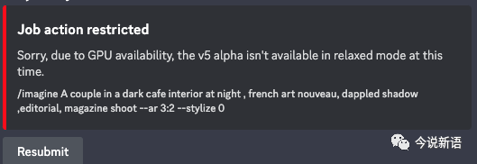 (原始链接: https://mmbiz.qpic.cn/mmbiz_png/DicuR7atBfy9BjicBYRrFyAjehye1eNlw3gvxcvSahx0hl4t5gVSAEZOWmj9cSh1e1cumiagXlsMTSiahvr3IYzhFg/640?wx_fmt=png)
-  (原始链接: https://mmbiz.qpic.cn/mmbiz_png/DicuR7atBfy9BjicBYRrFyAjehye1eNlw3m6AWFlbu3wODNonNggNVibpDia8A9KnOGx5Miac1N6bQnnWcGt0GkJJmQ/640?wx_fmt=png)
- 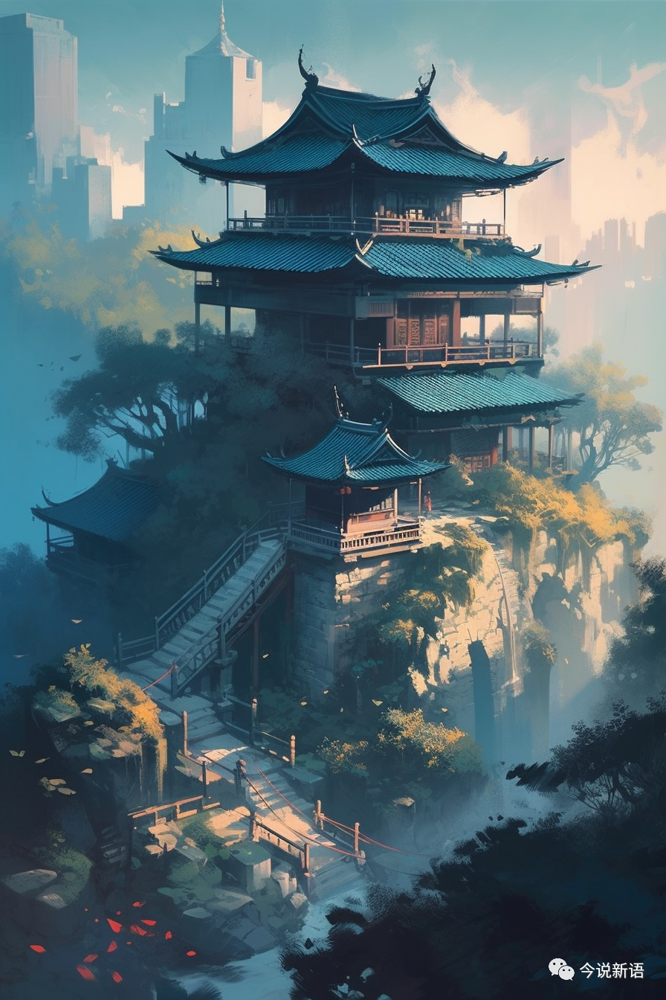 (原始链接: https://mmbiz.qpic.cn/mmbiz_png/DicuR7atBfy9BjicBYRrFyAjehye1eNlw3qGakEHAAG1mS5OPYpWZ8QlplRkBRGbVOCj6qKiaPibIy1ga1LibgiaBD3A/640?wx_fmt=png)
- 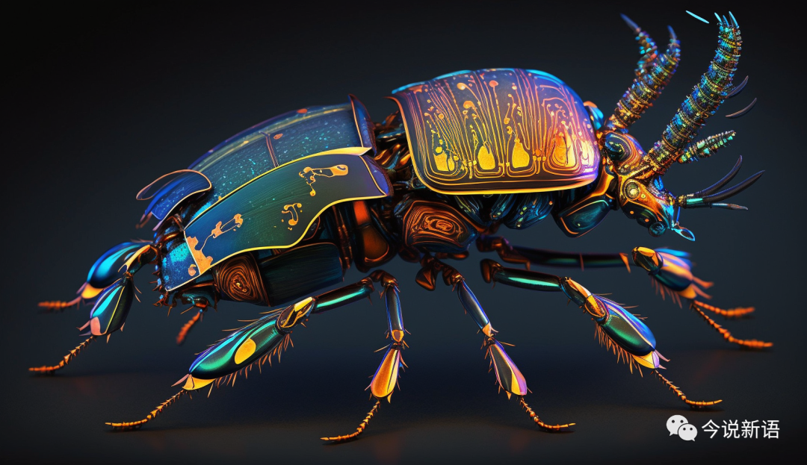 (原始链接: https://mmbiz.qpic.cn/mmbiz_png/DicuR7atBfy9BjicBYRrFyAjehye1eNlw3X2UolJU4yXlzG045cCNLicyKBW5NHEfhS6icYqU4PKetD5aNVDs0OrKQ/640?wx_fmt=png)
- 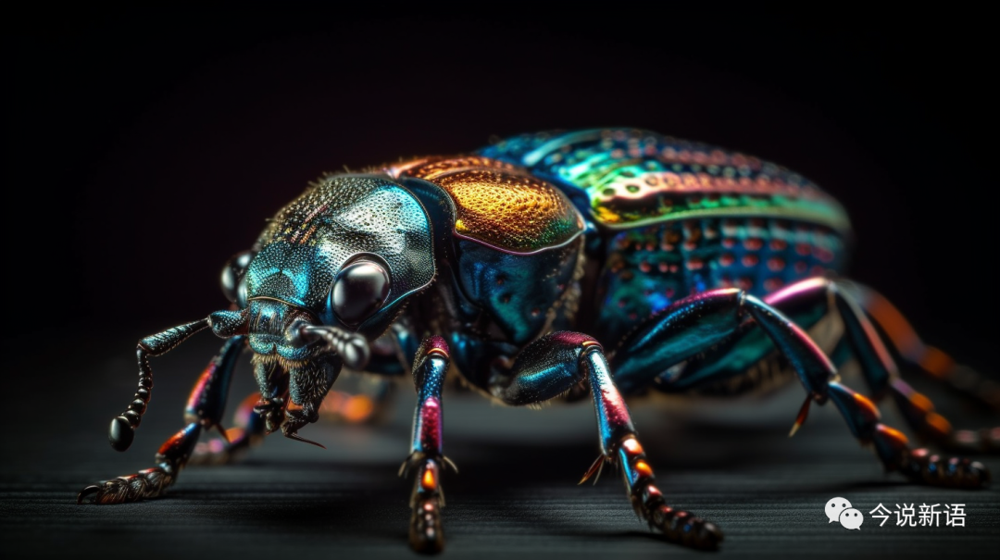 (原始链接: https://mmbiz.qpic.cn/mmbiz_png/DicuR7atBfy9BjicBYRrFyAjehye1eNlw3mLmARnyejxh7ZyxX6QQTadapLFySXIbibKzSsCaZPbmDQ2iaY6duTibTA/640?wx_fmt=png)
- 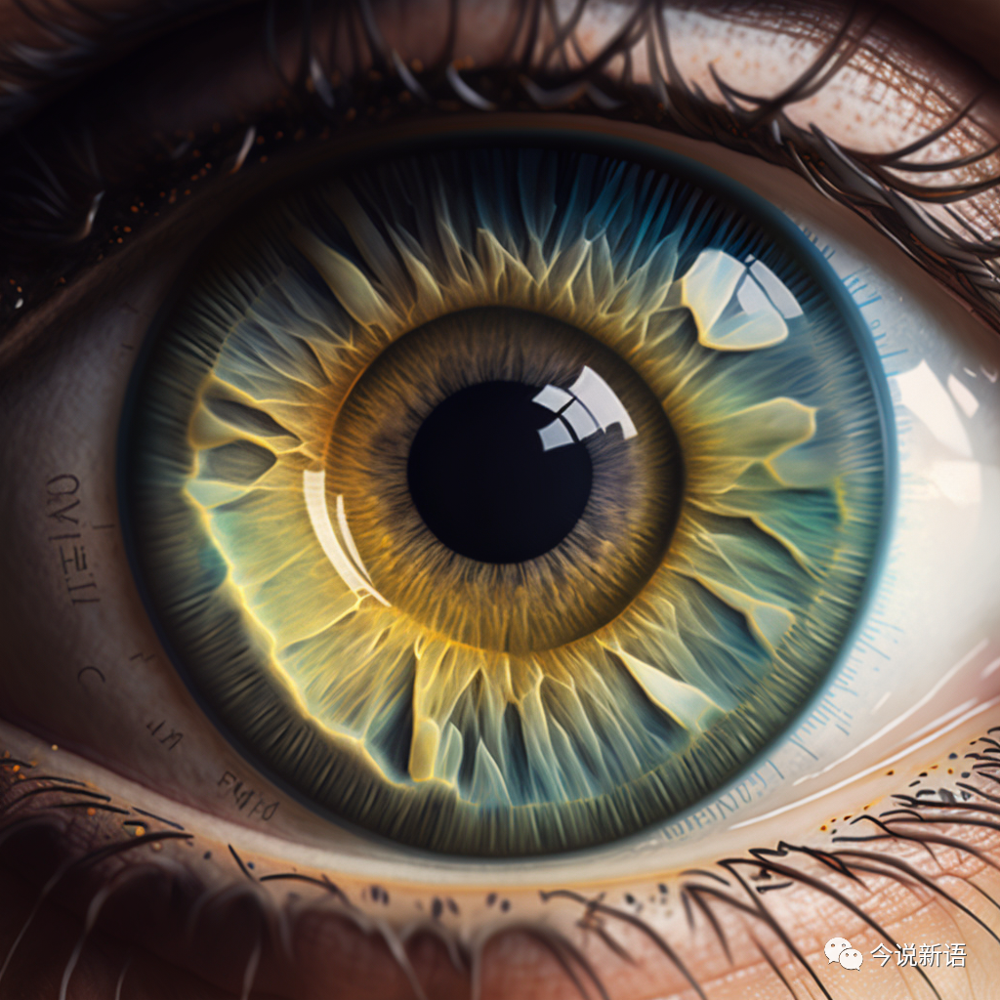 (原始链接: https://mmbiz.qpic.cn/mmbiz_png/DicuR7atBfy9BjicBYRrFyAjehye1eNlw3fL2iahY07MxvVqcjR3e8x5ibe1ibRckkZyu3YnrmepB3icE4UEkbCQ2hNQ/640?wx_fmt=png)
- 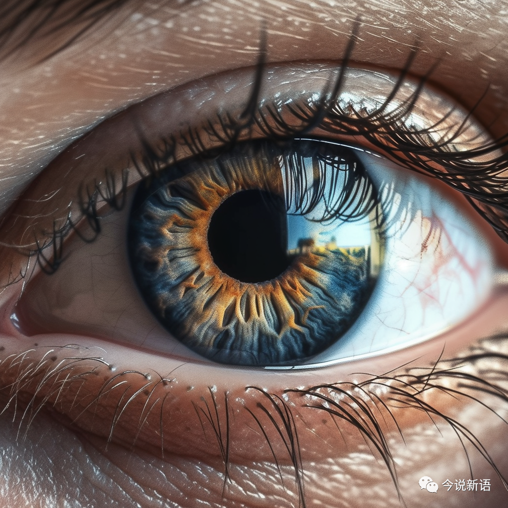 (原始链接: https://mmbiz.qpic.cn/mmbiz_png/DicuR7atBfy9BjicBYRrFyAjehye1eNlw3vGb6wkuClNs88Jy5kzZRjjore2FNPkeO3luzqr34fLFbcNd2qHBZrg/640?wx_fmt=png)
- 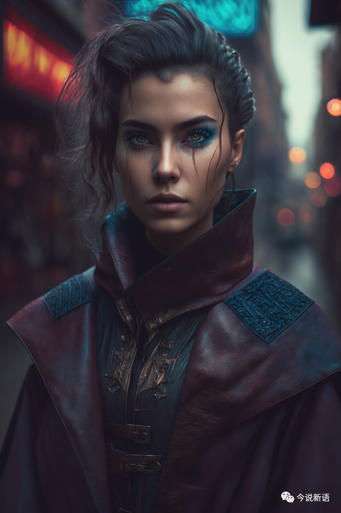 (原始链接: https://mmbiz.qpic.cn/mmbiz_png/DicuR7atBfy9BjicBYRrFyAjehye1eNlw3iaAbaxYUAiaM4GcTKYicBzzruqsDuVppPWJ7OEVJAekCdrDKV3icia33xLw/640?wx_fmt=png)
-  (原始链接: https://mmbiz.qpic.cn/mmbiz_png/DicuR7atBfy9BjicBYRrFyAjehye1eNlw3e7tHibZqmuUhRibiafibxcdCZHVVicrGS2LsK8TCh7WPLsrOsIQbmoP22NQ/640?wx_fmt=png)
- 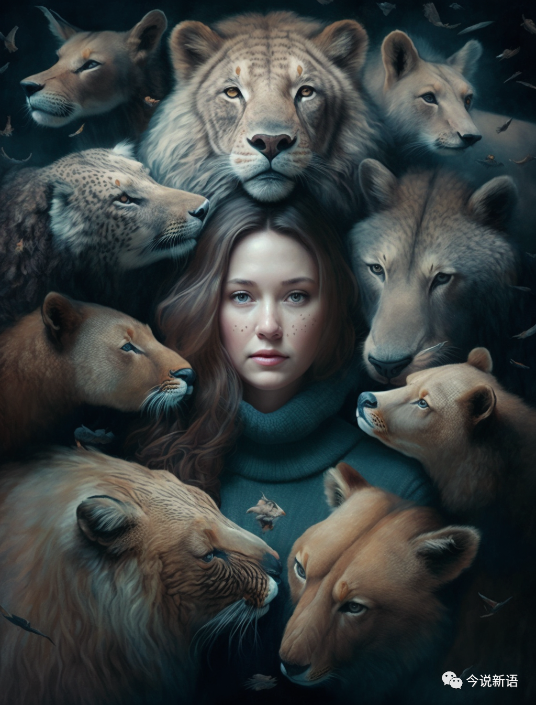 (原始链接: https://mmbiz.qpic.cn/mmbiz_png/DicuR7atBfy9BjicBYRrFyAjehye1eNlw3K0WUMl3icOPGvpx9Hfa3riakQLyh4ZLIyL1c4Nv6HicYbxQHnA8hDpgKQ/640?wx_fmt=png)
- 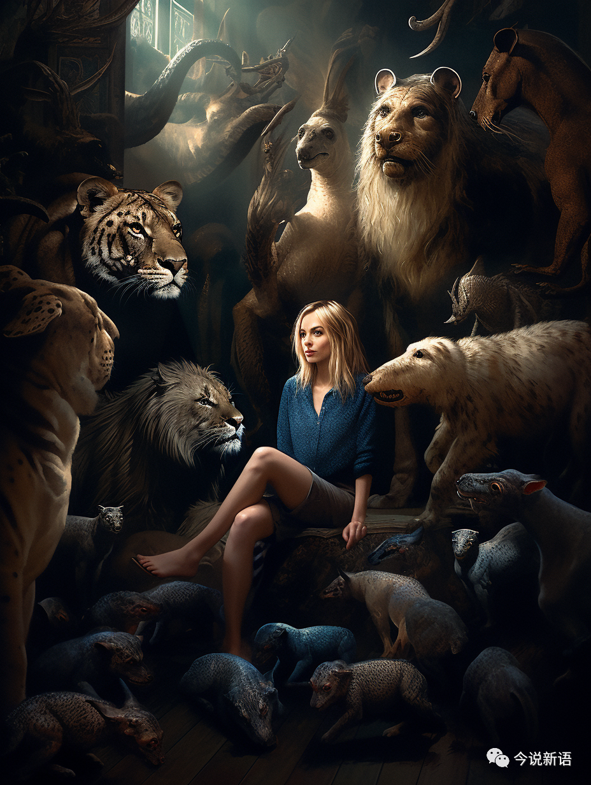 (原始链接: https://mmbiz.qpic.cn/mmbiz_png/DicuR7atBfy9BjicBYRrFyAjehye1eNlw31jCsgE6ibNWoV6UZUfy4JtfnY6167OUqcDU4rcjrXKNN4k6G8owopAA/640?wx_fmt=png)
- 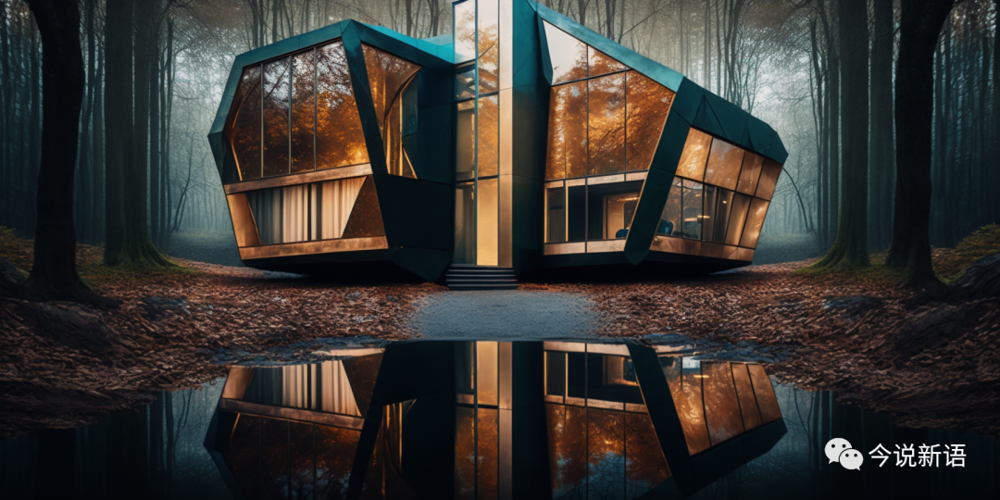 (原始链接: https://mmbiz.qpic.cn/mmbiz_png/DicuR7atBfy9BjicBYRrFyAjehye1eNlw3tsSTGmZicO5SdHIUO74oLYHyGH2qO9ic91tW6pYnzOBXUKYBdMlqIE1g/640?wx_fmt=png)
- 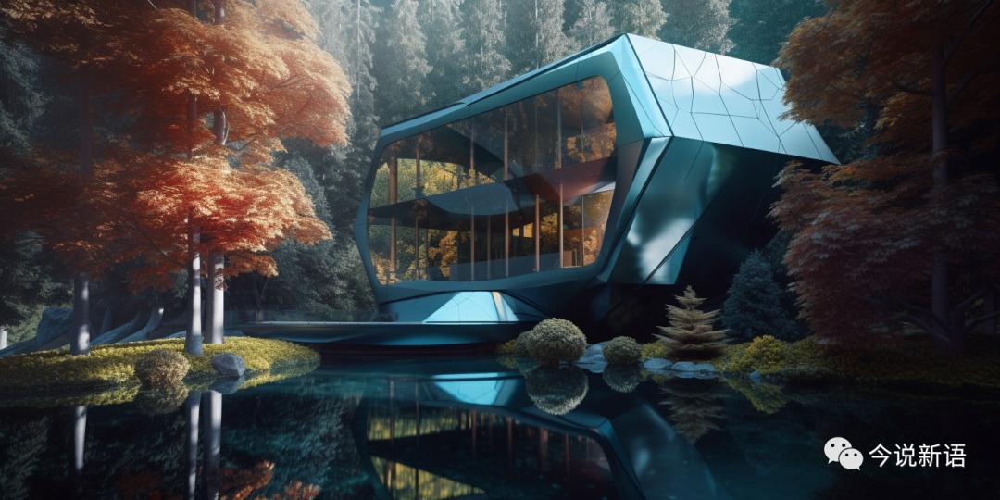 (原始链接: https://mmbiz.qpic.cn/mmbiz_png/DicuR7atBfy9BjicBYRrFyAjehye1eNlw3CUBmjkHCTxbhW3ZCDuze8EwbL9wOvDutQMic1yBZj9CseT4UqyuGkicQ/640?wx_fmt=png)
-  (原始链接: https://mmbiz.qpic.cn/mmbiz_png/DicuR7atBfy9BjicBYRrFyAjehye1eNlw3VdjXv6VhRwSiayzMEJ84wqzibuiawTbsfib7ianc1yagicQvPLFa6CWY3SIg/640?wx_fmt=png)
- 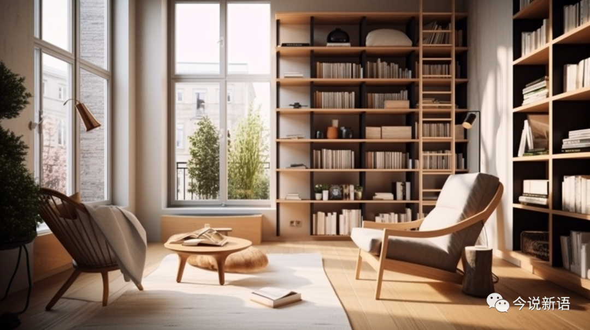 (原始链接: https://mmbiz.qpic.cn/mmbiz_png/DicuR7atBfy9BjicBYRrFyAjehye1eNlw3ylDiaapgj5YlGXg0QECSuov6LXMqASopdgzO4lMicsbbBqAc5ZzgRghg/640?wx_fmt=png)
- 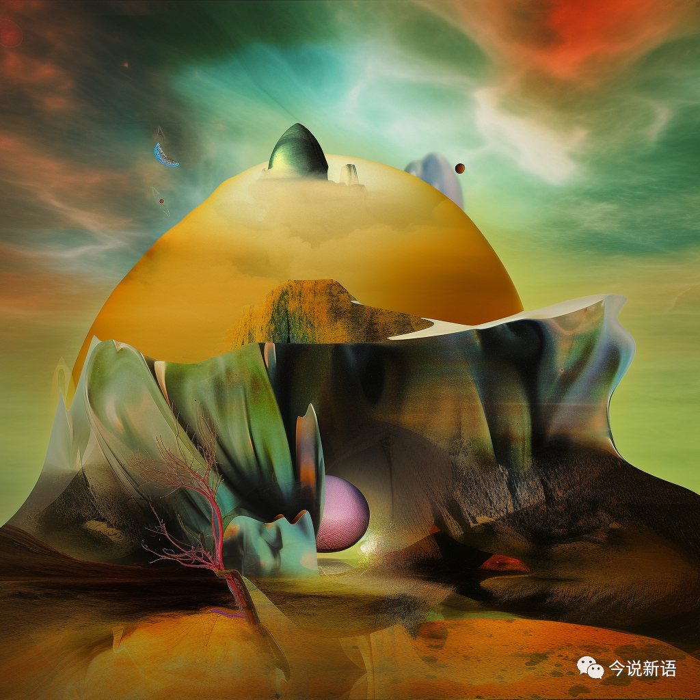 (原始链接: https://mmbiz.qpic.cn/mmbiz_png/DicuR7atBfy9BjicBYRrFyAjehye1eNlw3Mg4cdOuiaLkwYwM6wCC3RPyyMfbhO4dsx9ibPgIfUGiawEE6Ztk0aib6tA/640?wx_fmt=png)
- 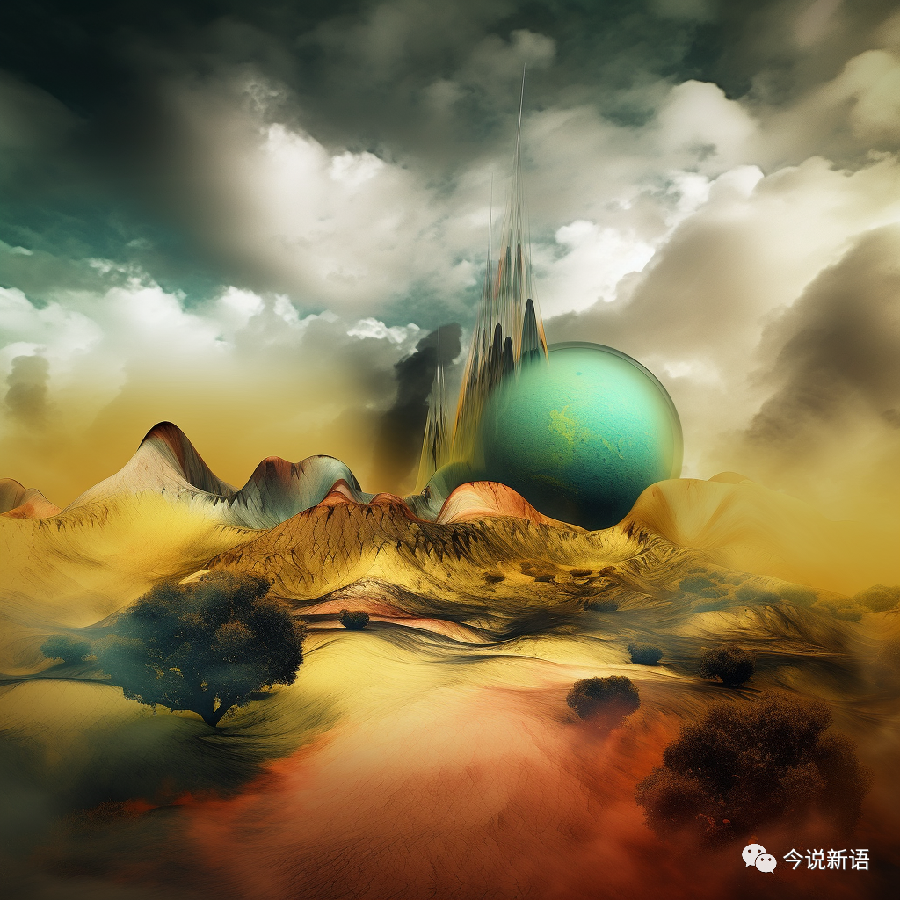 (原始链接: https://mmbiz.qpic.cn/mmbiz_png/DicuR7atBfy9BjicBYRrFyAjehye1eNlw3vQKEJlAuDq4FLWvgv8dwwFjZu0MpMGP5pFk1Nl9ePibpjbicC5QeKiavQ/640?wx_fmt=png)
- 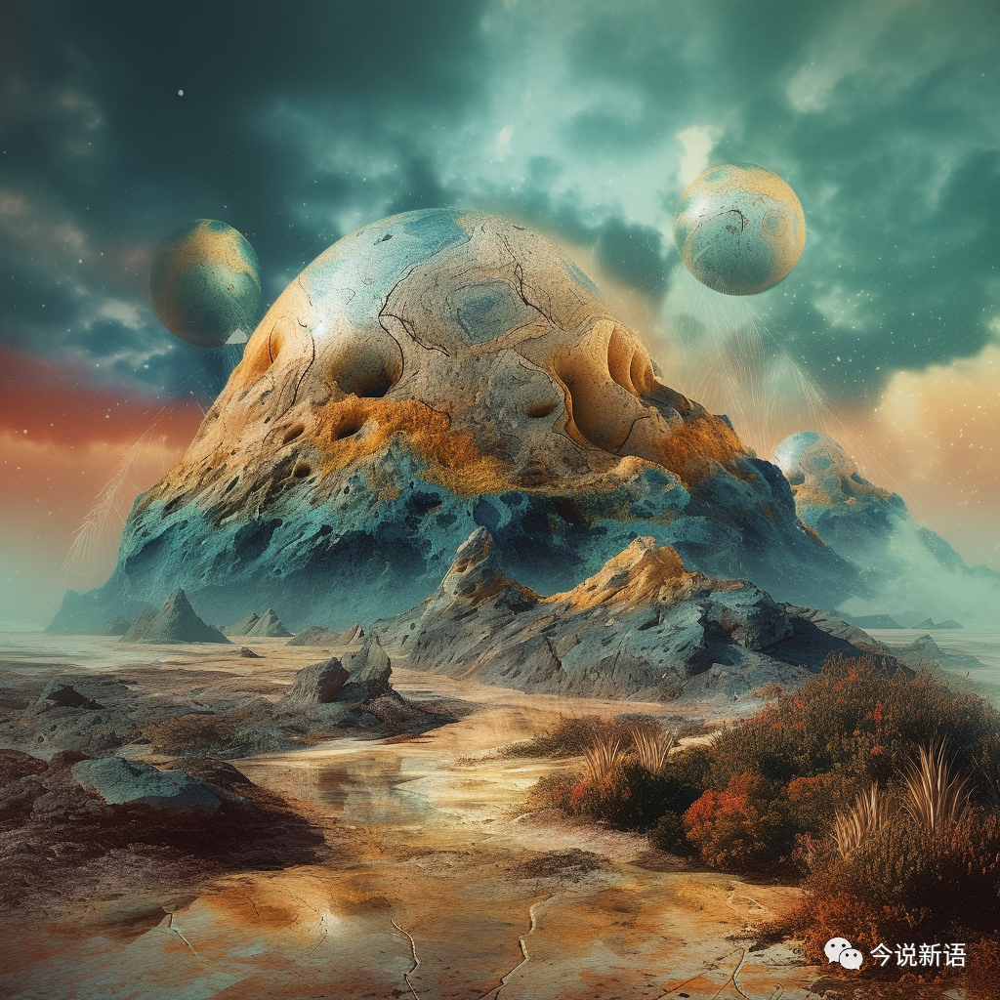 (原始链接: https://mmbiz.qpic.cn/mmbiz_png/DicuR7atBfy9BjicBYRrFyAjehye1eNlw3B4hn20BKia8kTmiaZSplFXiaufvyNGGkTR5cNBB3gPeq3qtLp2P9Zib0NA/640?wx_fmt=png)
- 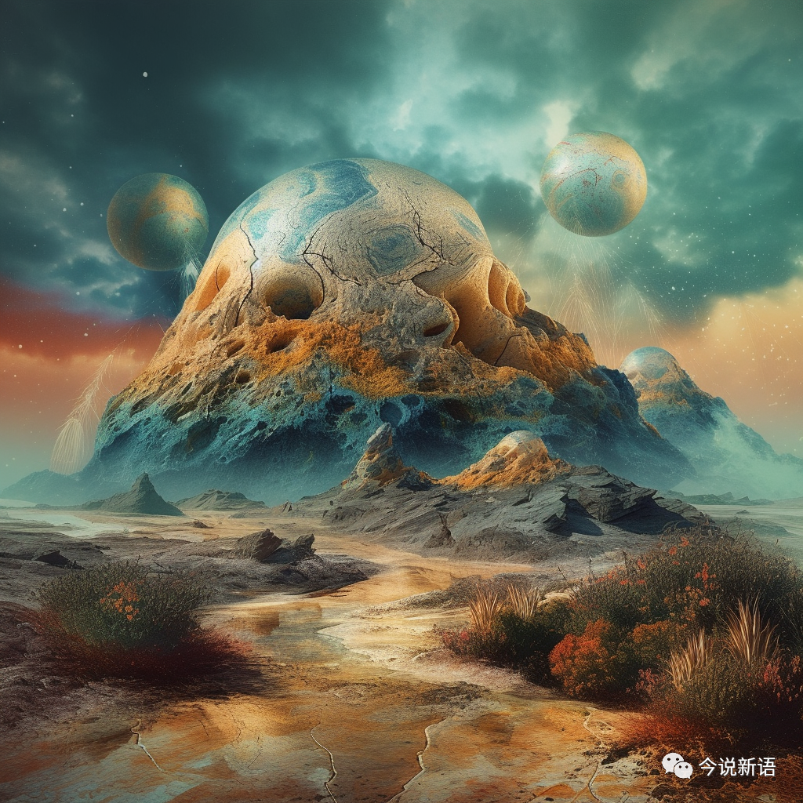 (原始链接: https://mmbiz.qpic.cn/mmbiz_png/DicuR7atBfy9BjicBYRrFyAjehye1eNlw36CFjyYgCPKt9wYoic7rZsRXiaKZ3YvJpQDA5KR7ibuoDuSemCYCTbXCug/640?wx_fmt=png)
-  (原始链接: https://mmbiz.qpic.cn/mmbiz_png/DicuR7atBfy9BjicBYRrFyAjehye1eNlw30uZOUg6AQBUyWCcZKpo5mv4VaNKqBWQlkezxjcMibxlE9bobduRBSwg/640?wx_fmt=png)
- 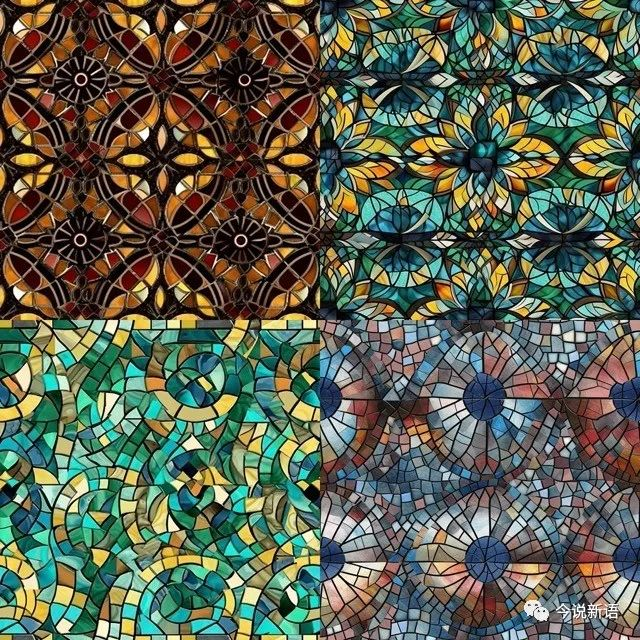 (原始链接: https://mmbiz.qpic.cn/mmbiz_jpg/DicuR7atBfy9BjicBYRrFyAjehye1eNlw3iaCL0NCRZghG6vdQSzbweR8J4Y4IFGSrB9csQCbRBzzY957LRKbuDfw/640?wx_fmt=jpeg)
- 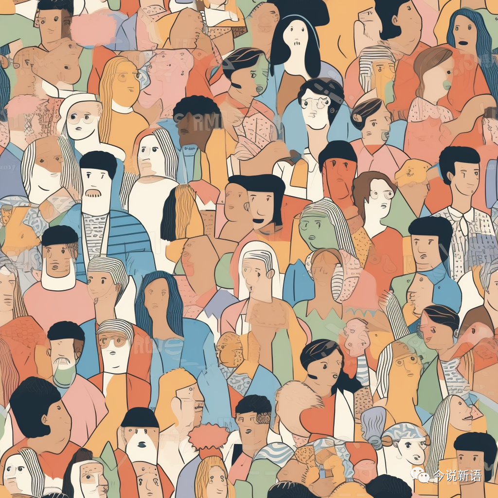 (原始链接: https://mmbiz.qpic.cn/mmbiz_png/DicuR7atBfy9BjicBYRrFyAjehye1eNlw36kYYde3cTmgcJTWsfZ2UjlkusuOdHxvoSpFFDjM89P66iceicg03bK6Q/640?wx_fmt=png)
- 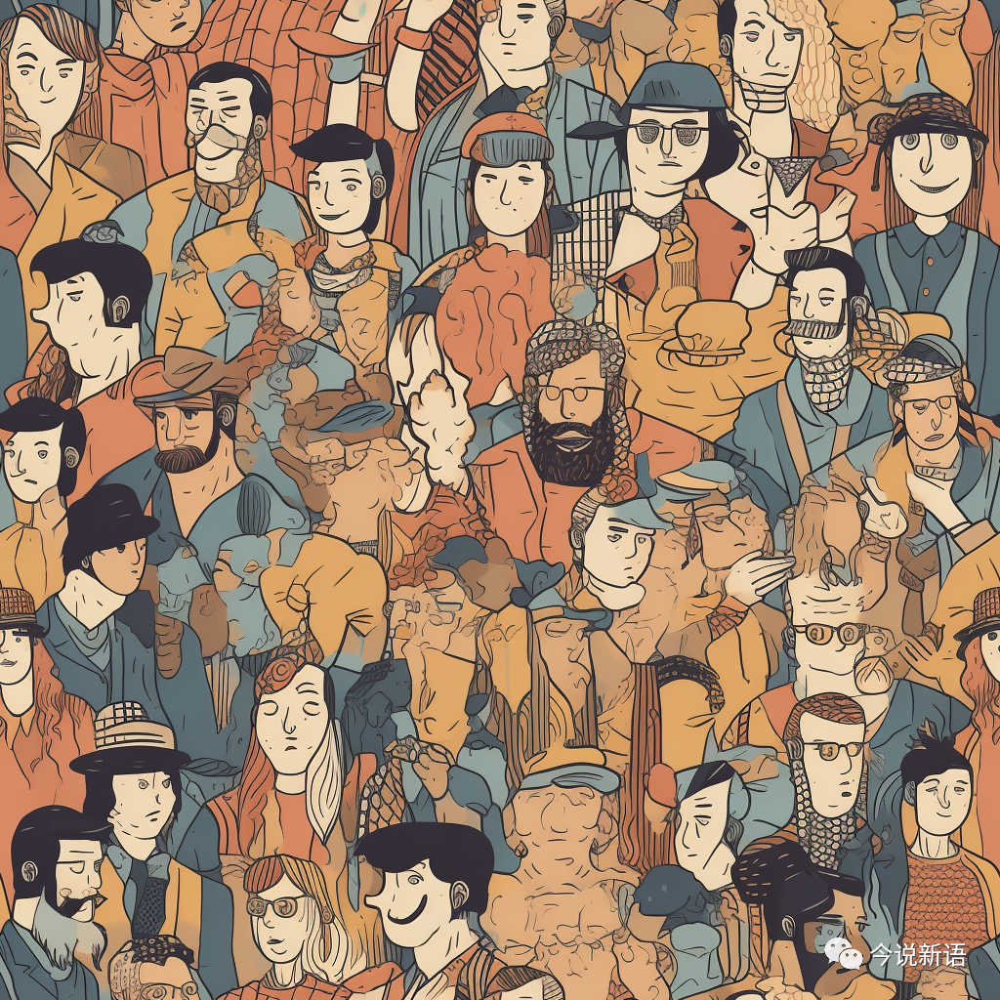 (原始链接: https://mmbiz.qpic.cn/mmbiz_png/DicuR7atBfy9BjicBYRrFyAjehye1eNlw3yXVKBXGXfiaiasKN9oQSLUVJwnXkn2NmicoL0bIFcUc9qicy2qoVHBA2WQ/640?wx_fmt=png)
- 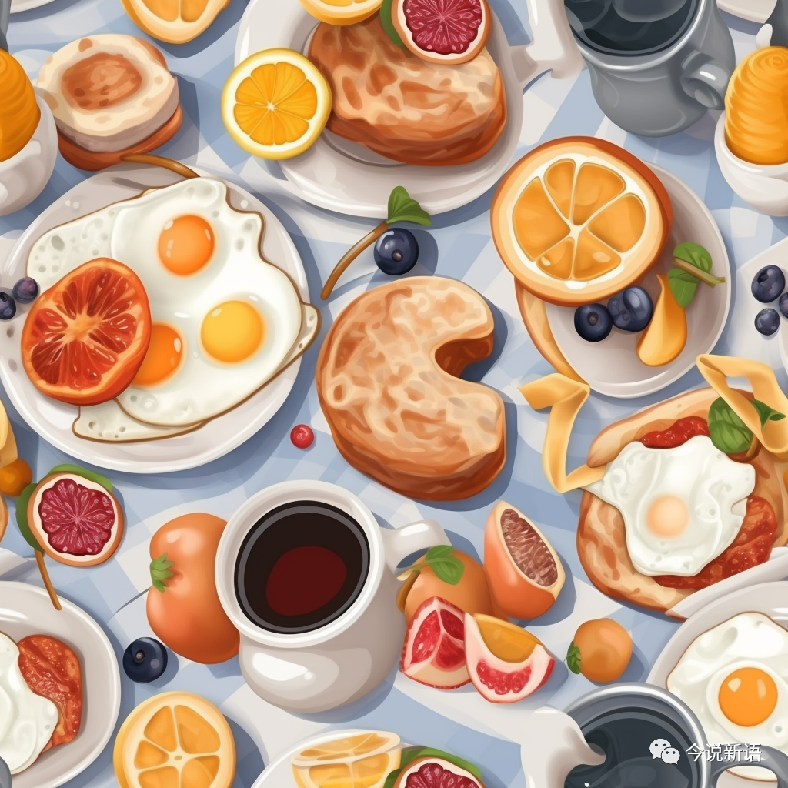 (原始链接: https://mmbiz.qpic.cn/mmbiz_png/DicuR7atBfy9BjicBYRrFyAjehye1eNlw31dbibEKDDb3wOdsu55DT5pnU7vDQiak1QAibODuOTfibJVwU5s85k5kngw/640?wx_fmt=png)
- 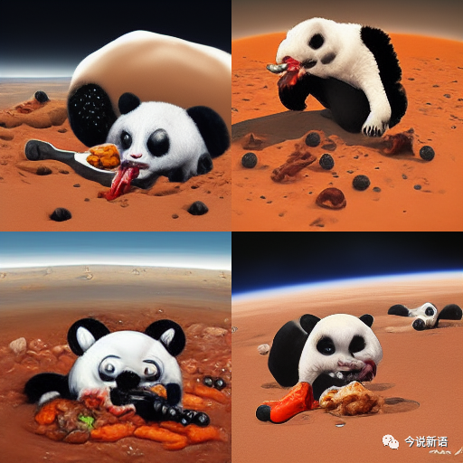 (原始链接: https://mmbiz.qpic.cn/mmbiz_png/DicuR7atBfy9BjicBYRrFyAjehye1eNlw3Vq2EE9iauwGUcicczmao9T2TjgmJ7AiapDVlSIUct3gQY7ASqeksh03dQ/640?wx_fmt=png)
- 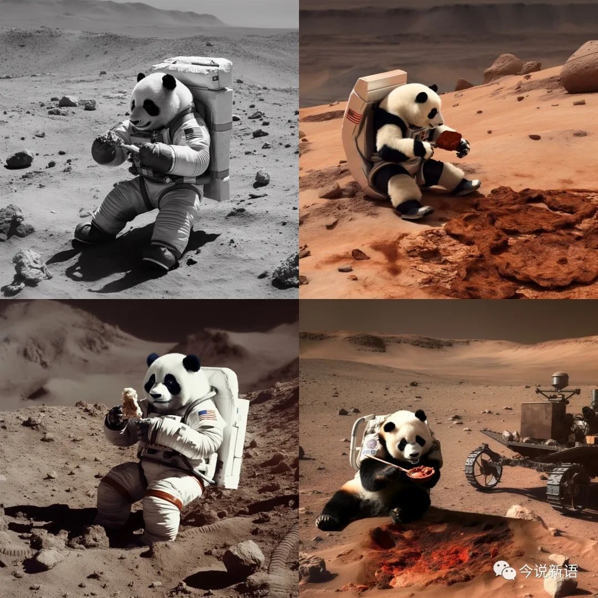 (原始链接: https://mmbiz.qpic.cn/mmbiz_jpg/DicuR7atBfy9BjicBYRrFyAjehye1eNlw3xbMYFIC55wyly45RRuv2RjTyS9e4PPBzPlHvP53No3m8FRldF2GUJw/640?wx_fmt=jpeg)
-  (原始链接: https://mmbiz.qpic.cn/mmbiz_png/DicuR7atBfy9BjicBYRrFyAjehye1eNlw3fjCwt9RcfwENZsnUHUibE5YkiaOx1lvwibPw5wGyxiaP4yNDZNgSpqmS4g/640?wx_fmt=png)
-  (原始链接: https://mmbiz.qpic.cn/mmbiz_png/DicuR7atBfy9BjicBYRrFyAjehye1eNlw3CNB1vBLlvIZV0X5fFCIgo4tv6C9reV0dBMkveyXAxQXWtpnOUD4uhw/640?wx_fmt=png)
-  (原始链接: https://res.wx.qq.com/t/wx_fed/we-emoji/res/v1.3.10/assets/Expression/Expression_3@2x.png)
- 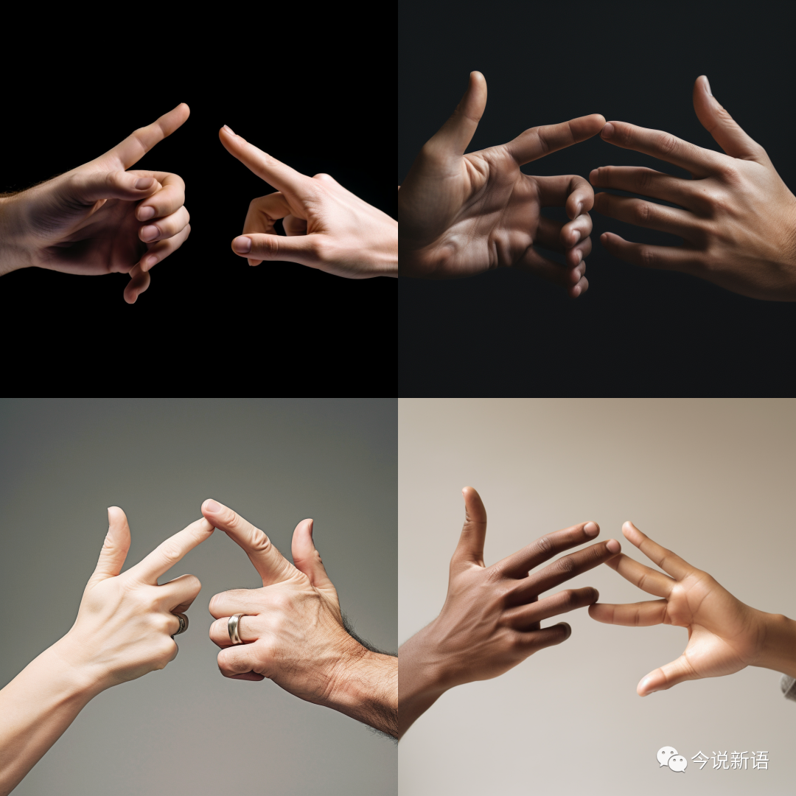 (原始链接: https://mmbiz.qpic.cn/mmbiz_png/DicuR7atBfy9BjicBYRrFyAjehye1eNlw32IlibNkUmtX8sOynMs8bfLncibPMcnmvWzHIoZPHQrzic3RoS5ZlTyKxA/640?wx_fmt=png)
-  (原始链接: https://mmbiz.qpic.cn/mmbiz_png/DicuR7atBfy9BjicBYRrFyAjehye1eNlw3oUelmsUtUTvL2kbeSbBpY0cFL2k4icpSdKVqxBlYQonBtMrZQzIqqvA/640?wx_fmt=png)
-  (原始链接: https://mmbiz.qpic.cn/mmbiz_png/DicuR7atBfy9BjicBYRrFyAjehye1eNlw3WfgcSLLUzwpTk9ROlIEQeyr9D54oZLWkImBQ007VWXbPI2LpvW9vVA/640?wx_fmt=png)
- 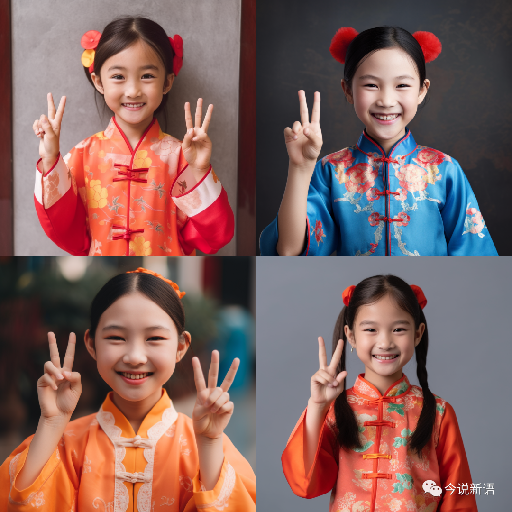 (原始链接: https://mmbiz.qpic.cn/mmbiz_png/DicuR7atBfy9BjicBYRrFyAjehye1eNlw3OuXWzsr1sn3yhwNIzYaib8l1WkibJECsV1QPtj5WjiaWd2iadJia0icVEN6g/640?wx_fmt=png)
- 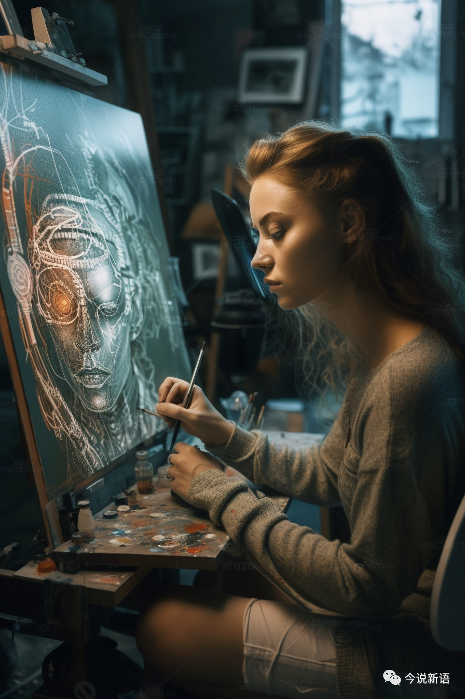 (原始链接: https://mmbiz.qpic.cn/mmbiz_png/DicuR7atBfy9BjicBYRrFyAjehye1eNlw3qibPjic7EGwZ92Sk4sNybYiaehPDp7lr9r5ameKuPdjAdqCWh8JBrJT7g/640?wx_fmt=png)
- 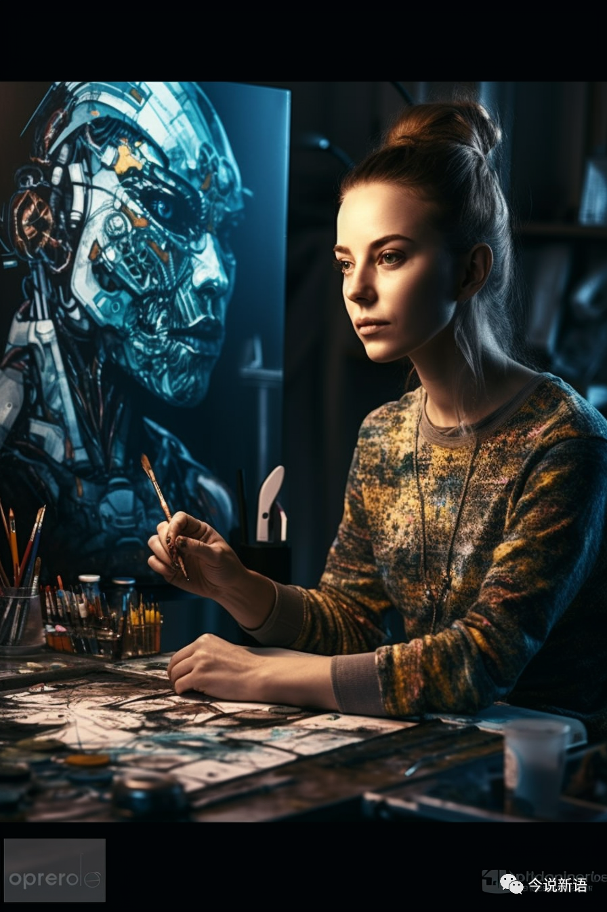 (原始链接: https://mmbiz.qpic.cn/mmbiz_png/DicuR7atBfy9BjicBYRrFyAjehye1eNlw3U8X1ZurwDGbAiakyUcRfsnZDbqf3monicwaACfrB0sS0dr7JVnctDNvw/640?wx_fmt=png)
- 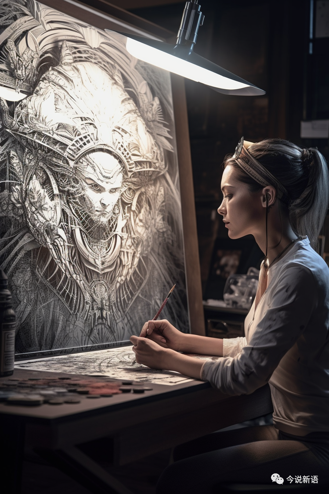 (原始链接: https://mmbiz.qpic.cn/mmbiz_png/DicuR7atBfy9BjicBYRrFyAjehye1eNlw3Qicq9aP4b0FcTCkhfMR01H3N0Ifich42GgXUFEm6icsC9xN6Kp71U5Phw/640?wx_fmt=png)
- 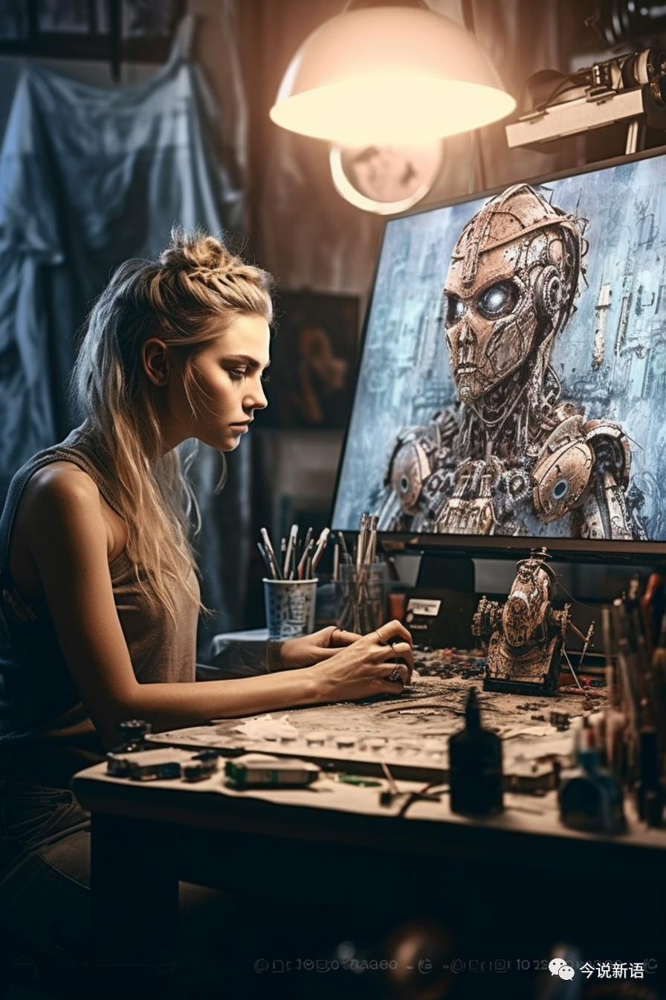 (原始链接: https://mmbiz.qpic.cn/mmbiz_png/DicuR7atBfy9BjicBYRrFyAjehye1eNlw3XT26b5PxCZmRK2VCuGicJUkYuqXqFRyy3BBGZQQ42Rf40PTdMIib0Y3g/640?wx_fmt=png)
- 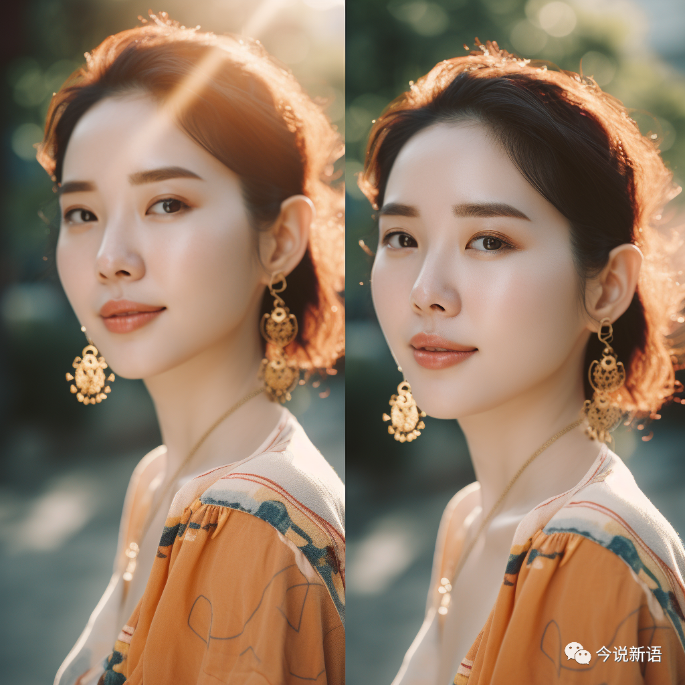 (原始链接: https://mmbiz.qpic.cn/mmbiz_png/DicuR7atBfy85ZH1aT4cS5PmwphwSKgiaOjFE9cZG4blpJtRA6w0bvMfQAkic6egdAAVSWuIsIswrfJla5uicCZibIw/640?wx_fmt=png)
- 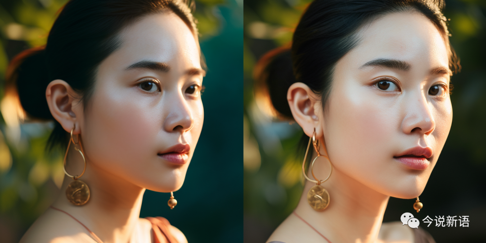 (原始链接: https://mmbiz.qpic.cn/mmbiz_png/DicuR7atBfy85ZH1aT4cS5PmwphwSKgiaOgByGWZdHgZAhtEjLjNoddfOdvQJ8UJiakNtb1WJCurKP806XYVuxkPg/640?wx_fmt=png)
- 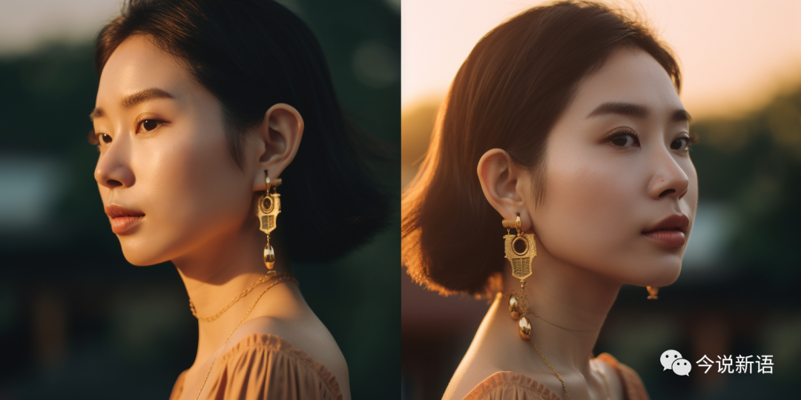 (原始链接: https://mmbiz.qpic.cn/mmbiz_png/DicuR7atBfy85ZH1aT4cS5PmwphwSKgiaOqMVJr9R255wIxPOFmw2Ct1nI0Ub3DE9M5WCam0x1YWrkGVPbeIZUFw/640?wx_fmt=png)
-  (原始链接: https://mmbiz.qpic.cn/mmbiz_png/DicuR7atBfy85ZH1aT4cS5PmwphwSKgiaOtKNBaDGfWUUTc5sHUFBTMjvmDGJv9jsubYXcVYKjuu3UYcZAd0HjHg/640?wx_fmt=png)
- 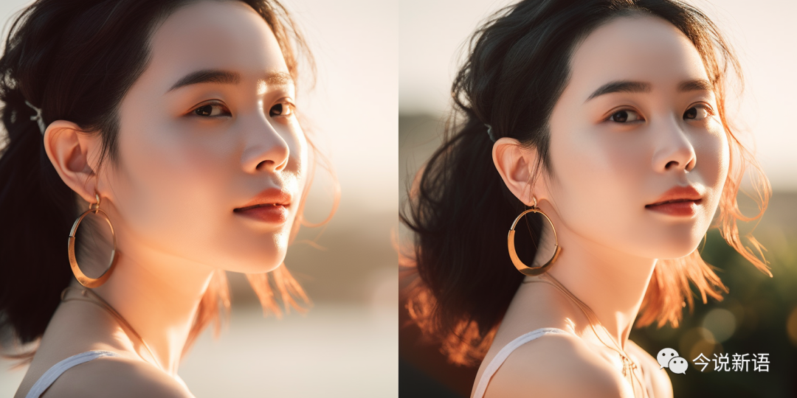 (原始链接: https://mmbiz.qpic.cn/mmbiz_png/DicuR7atBfy85ZH1aT4cS5PmwphwSKgiaOcQbU36nvwXfdjDxBNUyUxdrItuYtIwm3rLXKqsDPPUdjLxetEPSJibg/640?wx_fmt=png)
- 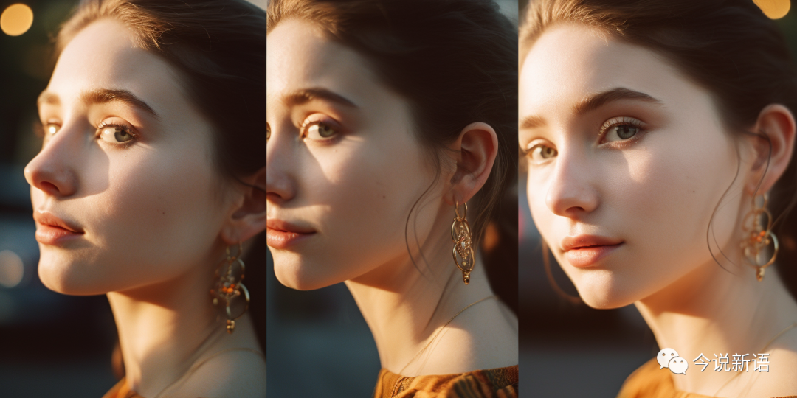 (原始链接: https://mmbiz.qpic.cn/mmbiz_png/DicuR7atBfy85ZH1aT4cS5PmwphwSKgiaOXC7PJG8ku6KYOhnUCXyeiaW69D3IQXakIuR1CzXxah7MN3IMh0kYFIQ/640?wx_fmt=png)
-  (原始链接: https://mmbiz.qpic.cn/mmbiz_png/DicuR7atBfy9BjicBYRrFyAjehye1eNlw364ia7FgcahWl5qT2zNFbiaOiatLQtJsJsPzIGkF0ibHAse7AicWAW42qicicg/640?wx_fmt=png)
- 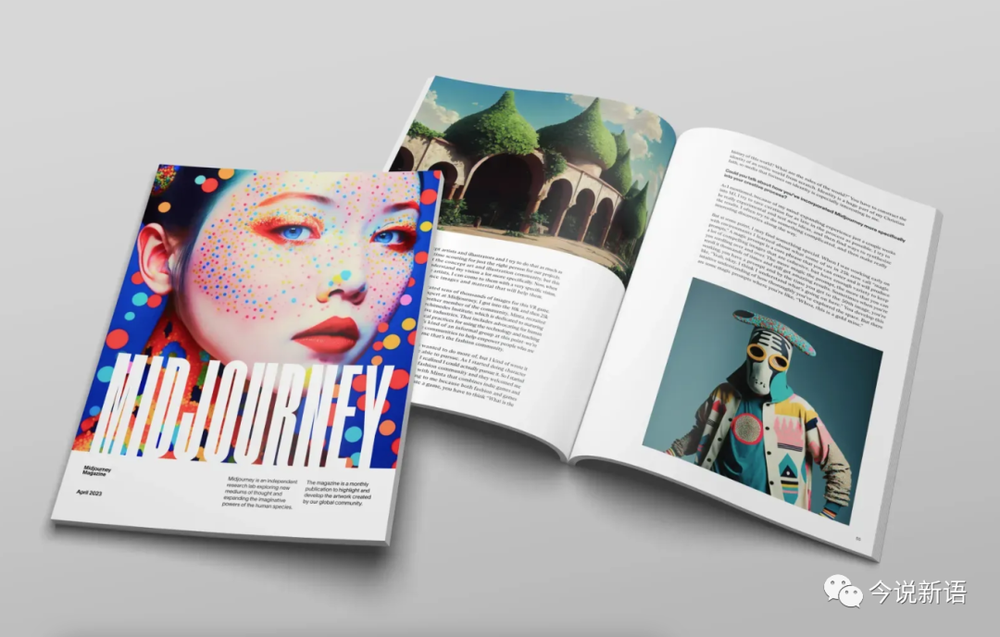 (原始链接: https://mmbiz.qpic.cn/mmbiz_png/DicuR7atBfy9BjicBYRrFyAjehye1eNlw3Pa3gBj9CmYapc0wBbAw0H9F7GA3dJ3ug3xDydXdhFtIIbicRjvO96mw/640?wx_fmt=png)
- 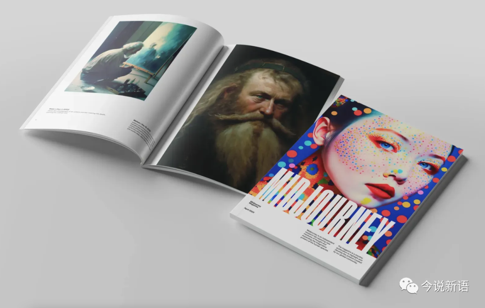 (原始链接: https://mmbiz.qpic.cn/mmbiz_png/DicuR7atBfy9BjicBYRrFyAjehye1eNlw3DZHjry4lQasibick5uVPricS6AWicgl0QQTyfspSlWSiaxeGgeicMwtV1IJQ/640?wx_fmt=png)
-  (原始链接: https://res.wx.qq.com/t/wx_fed/we-emoji/res/v1.3.10/assets/Expression/Expression_4@2x.png)
-  (原始链接: https://res.wx.qq.com/t/wx_fed/we-emoji/res/v1.3.10/assets/Expression/Expression_33@2x.png)
