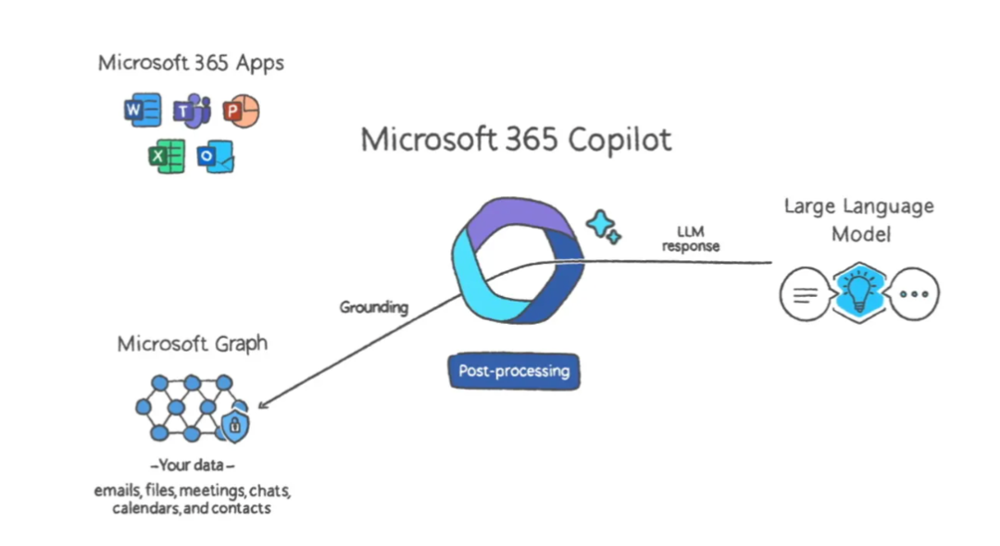
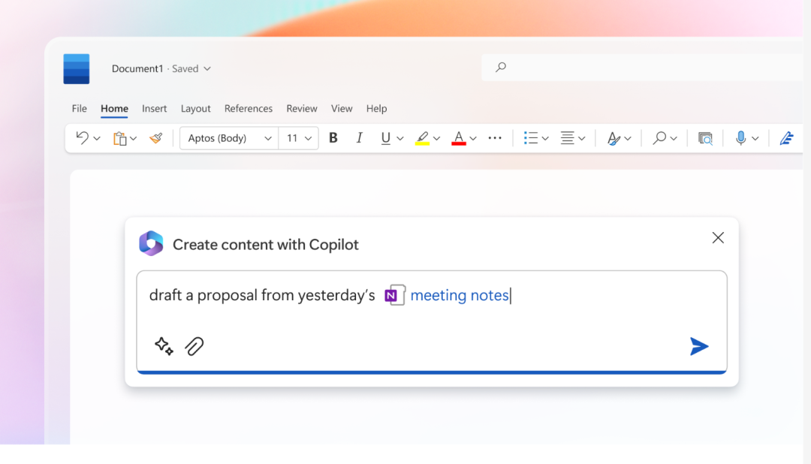
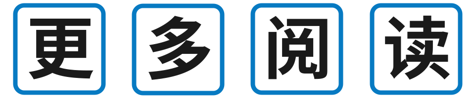

# 无标题

**链接地址:** http://mp.weixin.qq.com/s?__biz=MzA5NzgzODI5NA==&mid=2454089725&idx=1&sn=a741effb1c423ce60a211f4778684b84&chksm=87287a44b05ff35280d749c9abb0d2e4dffaba8a4cd9da199a0373e2e788c96c56ed3f31d051&mpshare=1&scene=2&srcid=03176ymwCt5XLnRJEBBa4i71&sharer_sharetime=1679021166987&sharer_shareid=77848a6b3852ae4dcb6c74ffee84743c#rd
**作者:** 
**获取时间:** 2025/8/28 19:15:44
**图片数量:** 8

---

## 原始HTML内容

 
<section style="margin: 0px 8px 15px;padding: 0px;color: rgb(51, 51, 51);font-size: 17px;font-style: normal;font-variant-ligatures: normal;font-variant-caps: normal;font-weight: 400;orphans: 2;text-indent: 0px;text-transform: none;white-space: normal;widows: 2;word-spacing: 0px;-webkit-text-stroke-width: 0px;text-decoration-thickness: initial;text-decoration-style: initial;text-decoration-color: initial;max-width: 100%;font-family: -apple-system-font, system-ui, &quot;Helvetica Neue&quot;, &quot;PingFang SC&quot;, &quot;Hiragino Sans GB&quot;, &quot;Microsoft YaHei UI&quot;, &quot;Microsoft YaHei&quot;, Arial, sans-serif;background-color: rgb(255, 255, 255);letter-spacing: 1px;text-align: left;line-height: normal;box-sizing: border-box !important;overflow-wrap: break-word !important;">作者 | 屠敏 </section><section style="margin: 0px 8px 15px;padding: 0px;color: rgb(51, 51, 51);font-size: 17px;font-style: normal;font-variant-ligatures: normal;font-variant-caps: normal;font-weight: 400;orphans: 2;text-indent: 0px;text-transform: none;white-space: normal;widows: 2;word-spacing: 0px;-webkit-text-stroke-width: 0px;text-decoration-thickness: initial;text-decoration-style: initial;text-decoration-color: initial;max-width: 100%;font-family: -apple-system-font, system-ui, &quot;Helvetica Neue&quot;, &quot;PingFang SC&quot;, &quot;Hiragino Sans GB&quot;, &quot;Microsoft YaHei UI&quot;, &quot;Microsoft YaHei&quot;, Arial, sans-serif;background-color: rgb(255, 255, 255);letter-spacing: 1px;line-height: normal;text-align: left;box-sizing: border-box !important;overflow-wrap: break-word !important;">出品 | CSDN（ID：CSDNnews）</section><section><mp-common-profile class="js_uneditable custom_select_card mp_profile_iframe" data-pluginname="mpprofile" data-weui-theme="light" data-id="MzI4OTI2Nzg4Mg==" data-headimg="http://mmbiz.qpic.cn/mmbiz_png/MNfsibwsgTqZH2JO5lDr8nm2KZaNn1OnjSc6xpTFQA5ArYMrrgk0FxROvZSgBmFPiaI3jPjFbtWuX8Wgr4cqLsrQ/0?wx_fmt=png" data-nickname="程序员技术指南" data-alias="javajst" data-signature="程序员技术指南，发现程序员之美。专注于分享 Java、Python、前端技术文章、工具资源、视频课程、热点资讯、学习资料等 。每天自动更新和推送 ！" data-from="0" data-is_biz_ban="0"></mp-common-profile></section><section style="margin: 0px 8px 15px;padding: 0px;color: rgb(51, 51, 51);font-size: 17px;font-style: normal;font-variant-ligatures: normal;font-variant-caps: normal;font-weight: 400;orphans: 2;text-indent: 0px;text-transform: none;white-space: normal;widows: 2;word-spacing: 0px;-webkit-text-stroke-width: 0px;text-decoration-thickness: initial;text-decoration-style: initial;text-decoration-color: initial;max-width: 100%;font-family: -apple-system-font, system-ui, &quot;Helvetica Neue&quot;, &quot;PingFang SC&quot;, &quot;Hiragino Sans GB&quot;, &quot;Microsoft YaHei UI&quot;, &quot;Microsoft YaHei&quot;, Arial, sans-serif;background-color: rgb(255, 255, 255);letter-spacing: 1px;line-height: normal;text-align: left;box-sizing: border-box !important;overflow-wrap: break-word !important;"></section>
这一周的科技圈异常地热闹，且多数都是大模型给的：

周二晚间，OpenAI 突然上线 GPT-4 最强大模型，以多模态的能力震惊四座；

周四下午，百度揭开了中文理解力更胜一筹的「文心一言」的神秘面纱；

北京时间 3 月 17 日凌晨，继将 GPT-4&nbsp;引入搜索引擎之后，微软再出“杀手锏”，重磅宣布由 AI 驱动的&nbsp;Microsoft 365 Copilot ，它将大模型（LLM）与&nbsp;Microsoft Graph 和 Microsoft 365 应用中的数据相结合，打破了传统办公软件的方式，能自动生成文档、电子邮件、PPT，让Word、Excel、PowerPoint、Outlook、Teams 等办公软件的效率提升多倍。

对于一直走在「开会」路上的打工人而言，过去动辄几个小时乃至几天要准备的演示文档、PPT、图表等内容，现在几分钟就可以轻松搞定初版。

<strong>Office 用上了&nbsp;GPT-4</strong> 

 

据悉，Microsoft 365 Copilot 也是由 OpenAI 的 GPT-4 驱动的，它以一种聊天机器人的形式，呈现在办公软件的侧边栏上。

微软董事长兼首席执行官 Satya Nadella 表示：“今天标志着我们与计算交互方式演变的下一个重要步骤，这将从根本上改变我们的工作方式并开启新一波生产力增长。通过新的 Copilot，我们为用户提供了更多的代理权，并通过最通用的界面——自然语言——使技术更容易获得。”

当前，Copilot 主要通过两种方式集成到了 Microsoft 365 中：

一、直接嵌入 Microsoft 365 应用中——Word、Excel、PowerPoint、Outlook、Teams 等等。

二、微软宣布一项全新的体验：Business Chat（商务聊天）。Business Chat 可以在 Microsoft 365 应用程序以及日历、电子邮件、聊天记录、文档、会议和联系人等程序里使用，只要用一些自然语言，它就可以根据早上的会议、电子邮件和聊天记录生成状态更新。

接下来，我们不妨详细看看 Microsoft 365 Copilot 强大的功能。

<strong></strong>

<strong>一键让 Word 变成 PPT，不记函数 Excel 也能轻松做数据分析&nbsp;</strong>

 

对于普通用户而言，最大的惊喜莫过于 Copilot 可以在 Office 中一键调用了。

在 Word 中，Copilot 可以在你写作时，对文件进行总结并提出编辑建议。此外，它也能根据组织的信息内容直接生成一份文件的草稿，你可以自由编辑和改编 AI 生成的内容。

Word 中的 Copilot 的智能程度远超我们的想象，因为它还支持在各种语调之间切换，如专业的场合用专业的术语，在休闲的场合又是另一番描述。
<section><iframe class="video_iframe rich_pages" data-vidtype="2" data-mpvid="wxv_2842271125756887040" data-cover="http%3A%2F%2Fmmbiz.qpic.cn%2Fmmbiz_jpg%2FPn4Sm0RsAugDzyicGu1LewOSMYNKAgUpp4tPk22dL77sbjNCkZa1icnSCW6M8NJAtdv54aib9sAichMuWDCicUYPPXg%2F0%3Fwx_fmt%3Djpeg" allowfullscreen="" frameborder="0" data-ratio="1.7777777777777777" data-w="1280" style="border-radius: 4px;" data-src="https://mp.weixin.qq.com/mp/readtemplate?t=pages/video_player_tmpl&amp;action=mpvideo&amp;auto=0&amp;vid=wxv_2842271125756887040"></iframe></section>
在 Excel 中，使用 Copilot 可以让制作复杂的电子表格变得更容易。对于不懂 Excel 里面各种函数调用、宏、VBA 语言的用户而言，基于 Copilot，可以直接用“人话”（自然语言），提出各种问题，然后它会推荐一些实用的公式。

Excel 中的 Copilot 也可以找到数据的相关性，根据问题生成模型，并得出趋势。它还可以即时创建基于数据的 SWOT 分析或数据透视表。
<section><iframe class="video_iframe rich_pages" data-vidtype="2" data-mpvid="wxv_2842270416969842689" data-cover="http%3A%2F%2Fmmbiz.qpic.cn%2Fmmbiz_jpg%2FPn4Sm0RsAugDzyicGu1LewOSMYNKAgUppFrIUNJLRGjibVcWVicCunNeFokcG8MOAeR8sE4R3qnzKaKZzPObiagzfg%2F0%3Fwx_fmt%3Djpeg" allowfullscreen="" frameborder="0" data-ratio="1.7777777777777777" data-w="1280" style="border-radius: 4px;" data-src="https://mp.weixin.qq.com/mp/readtemplate?t=pages/video_player_tmpl&amp;action=mpvideo&amp;auto=0&amp;vid=wxv_2842270416969842689"></iframe></section>
PowerPoint 的 Copilot 功能可以让 PPT 和 Word 实现一键转换。Copilot 本质上是一个聊天机器人，你可以直接对它说，“帮我把 Word 文档里面的内容生成一份 PPT 文件”，它就能轻松实现。

此外，你也可以用 Copilot&nbsp;压缩预先存在的演示文稿，使 PPT 变得更短。

像 Excel 一样，PowerPoint 中的 Copilot&nbsp;也能通过自然语言输入，直接实现动画切换和重新设置文本格式等等。
<section><iframe class="video_iframe rich_pages" data-vidtype="2" data-mpvid="wxv_2842268282052329472" data-cover="http%3A%2F%2Fmmbiz.qpic.cn%2Fmmbiz_jpg%2FPn4Sm0RsAugDzyicGu1LewOSMYNKAgUpphpAw2HOKbx5tfEXRUyxfRHsC9oKODVP5ZSVn0fRoUUpCXqwVbWvwEA%2F0%3Fwx_fmt%3Djpeg" allowfullscreen="" frameborder="0" data-ratio="1.7777777777777777" data-w="1280" style="border-radius: 4px;" data-src="https://mp.weixin.qq.com/mp/readtemplate?t=pages/video_player_tmpl&amp;action=mpvideo&amp;auto=0&amp;vid=wxv_2842268282052329472"></iframe></section>

<strong>再也不怕会议迟到了</strong>

 

除了办公软件 Office 三件套之外，微软也在其他办公软件、低代码平台中嵌入了 Copilot 功能。

在 Microsoft Teams 中，Copilot 功能可以转录会议。如果你在团队会议上迟到了，如果你在团队会议上迟到了，Copilot 能够帮助你，创建一个从会议开始到最后所讲内容的摘要。它还可以回答有关会议的具体问题。

另外，Copilot 还能根据聊天记录直接生成会议议程，建议谁应该跟进特定项目，并建议安排签到的时间，样样俱全。
<section><iframe class="video_iframe rich_pages" data-vidtype="2" data-mpvid="wxv_2842269703619395585" data-cover="http%3A%2F%2Fmmbiz.qpic.cn%2Fmmbiz_jpg%2FPn4Sm0RsAugDzyicGu1LewOSMYNKAgUpp1F8CjyWwbNUQJ9UOhE6weia2KWTwONBUJicSLVt616CjNjKrWfVeLolQ%2F0%3Fwx_fmt%3Djpeg" allowfullscreen="" frameborder="0" data-ratio="1.7777777777777777" data-w="1280" style="border-radius: 4px;" data-src="https://mp.weixin.qq.com/mp/readtemplate?t=pages/video_player_tmpl&amp;action=mpvideo&amp;auto=0&amp;vid=wxv_2842269703619395585"></iframe></section>
在 Outlook 中的 Copilot 可以使用 AI 来阅读邮件，然后它可以为你自动生成回复，这应该可以节省一些时间。像 Word 文档一样，Outlook 中的 Copilot 生成的文本可以被编辑，所以它更多的是帮助你打草稿，而不是直接给你提供一个固定的模板内容。

当然，你也能够从 AI 生成的内容修改任何东西，包括语调也可以调整。
<section><iframe class="video_iframe rich_pages" data-vidtype="2" data-mpvid="wxv_2842267628697206785" data-cover="http%3A%2F%2Fmmbiz.qpic.cn%2Fmmbiz_jpg%2FPn4Sm0RsAugDzyicGu1LewOSMYNKAgUpp9q1ibjNGjz3a2BcJbFQdvvINsazXxpAu3Aic6tNIdkOUFak9Vv4MQNGA%2F0%3Fwx_fmt%3Djpeg" allowfullscreen="" frameborder="0" data-ratio="1.7777777777777777" data-w="1280" style="border-radius: 4px;" data-src="https://mp.weixin.qq.com/mp/readtemplate?t=pages/video_player_tmpl&amp;action=mpvideo&amp;auto=0&amp;vid=wxv_2842267628697206785"></iframe></section>
此外，Power Platform 中的 Copilot 将通过在 Power Apps 和 Power Virtual Agents 中引入两项新功能，，任人都可以将重复性的任务自动化，创建聊天机器人，并在几分钟内从想法变成工作应用，帮助所有技能水平的开发人员使用低代码工具加速和简化开发。

<strong>集多数据源于一体的&nbsp;Business Chat</strong>

 

Business Chat（商务聊天）是本次微软发布的一种全新的体验，它使用 Microsoft Graph 和人工智能将 Word、PPT、电子邮件、日历、备忘录、联系人等程序中收集信息汇聚到 Microsoft Teams 中单个聊天界面中，这个界面可以生成摘要、计划概述。

比如说：
<ul class="list-paddingleft-1" style="margin: 0px 8px 15px;padding: 0px;min-height: 1em;color: rgb(51, 51, 51);font-size: 17px;font-style: normal;font-variant-ligatures: normal;font-variant-caps: normal;font-weight: 400;orphans: 2;text-align: justify;text-indent: 0px;text-transform: none;white-space: normal;widows: 2;word-spacing: 0px;-webkit-text-stroke-width: 0px;text-decoration-thickness: initial;text-decoration-style: initial;text-decoration-color: initial;max-width: 100%;font-family: -apple-system-font, system-ui, &quot;Helvetica Neue&quot;, &quot;PingFang SC&quot;, &quot;Hiragino Sans GB&quot;, &quot;Microsoft YaHei UI&quot;, &quot;Microsoft YaHei&quot;, Arial, sans-serif;background-color: rgb(255, 255, 255);line-height: 1.75em;letter-spacing: 1px;box-sizing: border-box !important;overflow-wrap: break-word !important;"><li style="margin: 0px 8px 15px;padding: 0px;min-height: 1em;color: rgb(51, 51, 51);font-size: 17px;font-style: normal;font-variant-ligatures: normal;font-variant-caps: normal;font-weight: 400;orphans: 2;text-align: justify;text-indent: 0px;text-transform: none;white-space: normal;widows: 2;word-spacing: 0px;-webkit-text-stroke-width: 0px;text-decoration-thickness: initial;text-decoration-style: initial;text-decoration-color: initial;max-width: 100%;font-family: -apple-system-font, system-ui, &quot;Helvetica Neue&quot;, &quot;PingFang SC&quot;, &quot;Hiragino Sans GB&quot;, &quot;Microsoft YaHei UI&quot;, &quot;Microsoft YaHei&quot;, Arial, sans-serif;background-color: rgb(255, 255, 255);line-height: 1.75em;letter-spacing: 1px;box-sizing: border-box !important;overflow-wrap: break-word !important;">
总结一下昨天晚上关于[客户]升级的聊天记录、电子邮件和文件。
</li><li style="margin: 0px 8px 15px;padding: 0px;min-height: 1em;color: rgb(51, 51, 51);font-size: 17px;font-style: normal;font-variant-ligatures: normal;font-variant-caps: normal;font-weight: 400;orphans: 2;text-align: justify;text-indent: 0px;text-transform: none;white-space: normal;widows: 2;word-spacing: 0px;-webkit-text-stroke-width: 0px;text-decoration-thickness: initial;text-decoration-style: initial;text-decoration-color: initial;max-width: 100%;font-family: -apple-system-font, system-ui, &quot;Helvetica Neue&quot;, &quot;PingFang SC&quot;, &quot;Hiragino Sans GB&quot;, &quot;Microsoft YaHei UI&quot;, &quot;Microsoft YaHei&quot;, Arial, sans-serif;background-color: rgb(255, 255, 255);line-height: 1.75em;letter-spacing: 1px;box-sizing: border-box !important;overflow-wrap: break-word !important;">
关于[项目]的下一个里程碑是什么。有没有发现任何风险？帮我集思广益，列出一些潜在的缓解措施。 
</li><li style="margin: 0px 8px 15px;padding: 0px;min-height: 1em;color: rgb(51, 51, 51);font-size: 17px;font-style: normal;font-variant-ligatures: normal;font-variant-caps: normal;font-weight: 400;orphans: 2;text-align: justify;text-indent: 0px;text-transform: none;white-space: normal;widows: 2;word-spacing: 0px;-webkit-text-stroke-width: 0px;text-decoration-thickness: initial;text-decoration-style: initial;text-decoration-color: initial;max-width: 100%;font-family: -apple-system-font, system-ui, &quot;Helvetica Neue&quot;, &quot;PingFang SC&quot;, &quot;Hiragino Sans GB&quot;, &quot;Microsoft YaHei UI&quot;, &quot;Microsoft YaHei&quot;, Arial, sans-serif;background-color: rgb(255, 255, 255);line-height: 1.75em;letter-spacing: 1px;box-sizing: border-box !important;overflow-wrap: break-word !important;">
按照[文件名A]的风格写一个新的计划概述，包含[文件名B]中的计划时间表，并结合[人]的电子邮件中的项目清单。
</li></ul>
 

<strong>边走边学，让打工人专注于 20% 的工作</strong>

 

当下，AI 驱动下的 Office 无疑让微软更上一层楼，不过，也有很多人对其生成的准确性感到担忧。

Microsoft 365 负责人 Jared Spataro 表示，“有时 Copilot 会做对，有时它会出错，给你一个不完美的想法，但仍然让你领先一步。我们通过指出局限性，链接到来源，并提示用户根据主题专业知识审查、事实核查和调整内容，来明确系统如何做出决定。”

“同时，为了服务于我们客户未满足的需求，我们必须快速而负责任地行动，边走边学”，Jared Spataro 说道。

当然边走边学也是需要保障的，微软的首席科学家 Jamie Teevan 表示，"当系统出错，或有偏见，或被滥用时，我们有缓解措施。我们正在处理长期的影响和新的风险，如越狱。我们会犯错，但当我们犯错时，我们会迅速解决。"

随着&nbsp;Copilot 在办公套件中的应用，微软希望能够帮助打工人，实现专注于 20% 工作的初心，让众人从被繁忙的工作所消耗 80% 的时间中脱身出来。

在道德方面，微软官方博客写道，它是基于AI 原则和 Responsible AI Standard 以及数十年的研究，基于其对企业数据安全和隐私的现有承诺构建了 Microsoft 365 Copilot 。Copilot 的大型语言模型未针对客户内容或个别提示进行训练。Microsoft 365 Copilot 将大规模提供企业级人工智能。

微软表示，目前正在与 20 位客户一起测试其 Microsoft 365 Copilot，并将在未来几个月内扩展预览版。同时，将在未来几个月分享更多关于定价和细节的信息。

参考： 

https://news.microsoft.com/2023/03/16/introducing-microsoft-365-copilot-your-copilot-for-work/

https://blogs.microsoft.com/blog/2023/03/16/introducing-microsoft-365-copilot-your-copilot-for-work/

https://www.windowscentral.com/microsoft/everything-announced-at-microsofts-future-of-work-with-ai-event-including-copilot-for-office-teams-and-more

 

<strong style="outline: 0px;">扫码加群，前200人直接进</strong> 

 

<strong mpa-from-tpl="t" style="outline: 0px;"><strong mpa-from-tpl="t" style="outline: 0px;color: rgb(51, 51, 51);font-size: 17px;line-height: 29.75px;text-align: center;"></strong></strong>

<strong mpa-from-tpl="t" style="outline: 0px;"><strong mpa-from-tpl="t" style="outline: 0px;color: rgb(51, 51, 51);font-size: 17px;line-height: 29.75px;text-align: center;"> </strong></strong>
<ul class="list-paddingleft-1" style="outline: 0px;white-space: normal;color: rgb(89, 89, 89);font-family: Optima-Regular, Optima, PingFangSC-light, PingFangTC-light, &quot;PingFang SC&quot;, Cambria, Cochin, Georgia, Times, &quot;Times New Roman&quot;, serif;font-size: 15px;letter-spacing: 0.75px;background-color: rgb(255, 255, 255);"><li style="outline: 0px;"><section style="outline: 0px;line-height: 2em;"><strong mpa-from-tpl="t" style="outline: 0px;"><a target="_blank" href="http://mp.weixin.qq.com/s?__biz=MzA5NzgzODI5NA==&amp;mid=2454089575&amp;idx=1&amp;sn=603b48719c8674c8d695822fb31a0a62&amp;chksm=87287adeb05ff3c834c51ee3c65823cc3d1f56fba1d383f7384e050adb15fc71751f982426c3&amp;scene=21#wechat_redirect" textvalue="鸿蒙是不是安卓？ChatGPT是这样回答的" linktype="text" imgurl="" imgdata="null" data-itemshowtype="0" tab="innerlink" data-linktype="2" hasload="1" style="outline: 0px;-webkit-tap-highlight-color: rgba(0, 0, 0, 0);cursor: pointer;">鸿蒙是不是安卓？ChatGPT是这样回答的</a> </strong></section></li><li style="outline: 0px;font-weight: bold;"><section style="outline: 0px;line-height: 2em;"><a target="_blank" href="http://mp.weixin.qq.com/s?__biz=MzA5NzgzODI5NA==&amp;mid=2454089695&amp;idx=1&amp;sn=5988ed2abb6b803dbe9f82cd70fa6de4&amp;chksm=87287a66b05ff3702afcf3e97cfe474359e2076fb0990789efb53afc59403224004613353db5&amp;scene=21#wechat_redirect" textvalue="帝都某外企裁员，补偿673252.62元 ！准备回家躺平了 ！" linktype="text" imgurl="" imgdata="null" data-itemshowtype="0" tab="innerlink" data-linktype="2"><strong>帝都某外企裁员，补偿673252.62元 ！准备回家躺平了 ！</strong></a> </section></li><li style="outline: 0px;font-weight: bold;"><section style="line-height: 2em;"><a target="_blank" href="http://mp.weixin.qq.com/s?__biz=MzA5NzgzODI5NA==&amp;mid=2454089701&amp;idx=1&amp;sn=44e81bcf04842e19884afa0b38d1a5ee&amp;chksm=87287a5cb05ff34a9455724e27d1dd12133d22b84c47c097ccb3bbdf078e0f80cae457be1b18&amp;scene=21#wechat_redirect" textvalue="GPT-4正式发布！ChatGPT大升级！太强了！" linktype="text" imgurl="" imgdata="null" data-itemshowtype="0" tab="innerlink" data-linktype="2"><strong>GPT-4正式发布！ChatGPT大升级！太强了！</strong></a></section>
 
</li></ul>

<section data-tool="mdnice编辑器" data-website="https://www.mdnice.com" style="outline: 0px;color: rgb(34, 34, 34);letter-spacing: 0.544px;white-space: normal;font-family: -apple-system, BlinkMacSystemFont, &quot;Helvetica Neue&quot;, &quot;PingFang SC&quot;, &quot;Hiragino Sans GB&quot;, &quot;Microsoft YaHei UI&quot;, &quot;Microsoft YaHei&quot;, Arial, sans-serif;font-size: 14px;text-align: left;caret-color: rgba(0, 0, 0, 0);background-color: rgb(255, 255, 255);"><section data-role="paragraph" style="outline: 0px;"><section data-role="paragraph" style="outline: 0px;"><section style="outline: 0px;"><section data-support="96编辑器" data-style-id="27718" style="outline: 0px;"><section data-support="96编辑器" data-style-id="27718" style="outline: 0px;"><section style="outline: 0px;"><section style="outline: 0px;"><section style="outline: 0px;"><section data-support="96编辑器" data-style-id="27719" style="outline: 0px;"><section data-support="96编辑器" data-style-id="27719" style="outline: 0px;"><section style="margin-top: 10px;margin-bottom: 10px;outline: 0px;text-align: center;"><section style="outline: 0px;display: flex;justify-content: space-between;align-items: center;"><section style="outline: 0px;">

点分享
</section><section style="margin-left: auto;outline: 0px;">

点点赞
</section><section style="margin-left: 10px;outline: 0px;">

点在看
</section></section></section></section></section></section></section></section></section></section></section></section></section></section><section></section>
<mp-style-type data-value="3"></mp-style-type>

---

## 纯文本内容

作者 | 屠敏出品 | CSDN（ID：CSDNnews）这一周的科技圈异常地热闹，且多数都是大模型给的：周二晚间，OpenAI 突然上线 GPT-4 最强大模型，以多模态的能力震惊四座；周四下午，百度揭开了中文理解力更胜一筹的「文心一言」的神秘面纱；北京时间 3 月 17 日凌晨，继将 GPT-4 引入搜索引擎之后，微软再出“杀手锏”，重磅宣布由 AI 驱动的 Microsoft 365 Copilot ，它将大模型（LLM）与 Microsoft Graph 和 Microsoft 365 应用中的数据相结合，打破了传统办公软件的方式，能自动生成文档、电子邮件、PPT，让Word、Excel、PowerPoint、Outlook、Teams 等办公软件的效率提升多倍。对于一直走在「开会」路上的打工人而言，过去动辄几个小时乃至几天要准备的演示文档、PPT、图表等内容，现在几分钟就可以轻松搞定初版。Office 用上了 GPT-4据悉，Microsoft 365 Copilot 也是由 OpenAI 的 GPT-4 驱动的，它以一种聊天机器人的形式，呈现在办公软件的侧边栏上。微软董事长兼首席执行官 Satya Nadella 表示：“今天标志着我们与计算交互方式演变的下一个重要步骤，这将从根本上改变我们的工作方式并开启新一波生产力增长。通过新的 Copilot，我们为用户提供了更多的代理权，并通过最通用的界面——自然语言——使技术更容易获得。”当前，Copilot 主要通过两种方式集成到了 Microsoft 365 中：一、直接嵌入 Microsoft 365 应用中——Word、Excel、PowerPoint、Outlook、Teams 等等。二、微软宣布一项全新的体验：Business Chat（商务聊天）。Business Chat 可以在 Microsoft 365 应用程序以及日历、电子邮件、聊天记录、文档、会议和联系人等程序里使用，只要用一些自然语言，它就可以根据早上的会议、电子邮件和聊天记录生成状态更新。接下来，我们不妨详细看看 Microsoft 365 Copilot 强大的功能。一键让 Word 变成 PPT，不记函数 Excel 也能轻松做数据分析 对于普通用户而言，最大的惊喜莫过于 Copilot 可以在 Office 中一键调用了。在 Word 中，Copilot 可以在你写作时，对文件进行总结并提出编辑建议。此外，它也能根据组织的信息内容直接生成一份文件的草稿，你可以自由编辑和改编 AI 生成的内容。Word 中的 Copilot 的智能程度远超我们的想象，因为它还支持在各种语调之间切换，如专业的场合用专业的术语，在休闲的场合又是另一番描述。在 Excel 中，使用 Copilot 可以让制作复杂的电子表格变得更容易。对于不懂 Excel 里面各种函数调用、宏、VBA 语言的用户而言，基于 Copilot，可以直接用“人话”（自然语言），提出各种问题，然后它会推荐一些实用的公式。Excel 中的 Copilot 也可以找到数据的相关性，根据问题生成模型，并得出趋势。它还可以即时创建基于数据的 SWOT 分析或数据透视表。PowerPoint 的 Copilot 功能可以让 PPT 和 Word 实现一键转换。Copilot 本质上是一个聊天机器人，你可以直接对它说，“帮我把 Word 文档里面的内容生成一份 PPT 文件”，它就能轻松实现。此外，你也可以用 Copilot 压缩预先存在的演示文稿，使 PPT 变得更短。像 Excel 一样，PowerPoint 中的 Copilot 也能通过自然语言输入，直接实现动画切换和重新设置文本格式等等。再也不怕会议迟到了除了办公软件 Office 三件套之外，微软也在其他办公软件、低代码平台中嵌入了 Copilot 功能。在 Microsoft Teams 中，Copilot 功能可以转录会议。如果你在团队会议上迟到了，如果你在团队会议上迟到了，Copilot 能够帮助你，创建一个从会议开始到最后所讲内容的摘要。它还可以回答有关会议的具体问题。另外，Copilot 还能根据聊天记录直接生成会议议程，建议谁应该跟进特定项目，并建议安排签到的时间，样样俱全。在 Outlook 中的 Copilot 可以使用 AI 来阅读邮件，然后它可以为你自动生成回复，这应该可以节省一些时间。像 Word 文档一样，Outlook 中的 Copilot 生成的文本可以被编辑，所以它更多的是帮助你打草稿，而不是直接给你提供一个固定的模板内容。当然，你也能够从 AI 生成的内容修改任何东西，包括语调也可以调整。此外，Power Platform 中的 Copilot 将通过在 Power Apps 和 Power Virtual Agents 中引入两项新功能，，任人都可以将重复性的任务自动化，创建聊天机器人，并在几分钟内从想法变成工作应用，帮助所有技能水平的开发人员使用低代码工具加速和简化开发。集多数据源于一体的 Business ChatBusiness Chat（商务聊天）是本次微软发布的一种全新的体验，它使用 Microsoft Graph 和人工智能将 Word、PPT、电子邮件、日历、备忘录、联系人等程序中收集信息汇聚到 Microsoft Teams 中单个聊天界面中，这个界面可以生成摘要、计划概述。比如说：总结一下昨天晚上关于[客户]升级的聊天记录、电子邮件和文件。关于[项目]的下一个里程碑是什么。有没有发现任何风险？帮我集思广益，列出一些潜在的缓解措施。按照[文件名A]的风格写一个新的计划概述，包含[文件名B]中的计划时间表，并结合[人]的电子邮件中的项目清单。边走边学，让打工人专注于 20% 的工作当下，AI 驱动下的 Office 无疑让微软更上一层楼，不过，也有很多人对其生成的准确性感到担忧。Microsoft 365 负责人 Jared Spataro 表示，“有时 Copilot 会做对，有时它会出错，给你一个不完美的想法，但仍然让你领先一步。我们通过指出局限性，链接到来源，并提示用户根据主题专业知识审查、事实核查和调整内容，来明确系统如何做出决定。”“同时，为了服务于我们客户未满足的需求，我们必须快速而负责任地行动，边走边学”，Jared Spataro 说道。当然边走边学也是需要保障的，微软的首席科学家 Jamie Teevan 表示，"当系统出错，或有偏见，或被滥用时，我们有缓解措施。我们正在处理长期的影响和新的风险，如越狱。我们会犯错，但当我们犯错时，我们会迅速解决。"随着 Copilot 在办公套件中的应用，微软希望能够帮助打工人，实现专注于 20% 工作的初心，让众人从被繁忙的工作所消耗 80% 的时间中脱身出来。在道德方面，微软官方博客写道，它是基于AI 原则和 Responsible AI Standard 以及数十年的研究，基于其对企业数据安全和隐私的现有承诺构建了 Microsoft 365 Copilot 。Copilot 的大型语言模型未针对客户内容或个别提示进行训练。Microsoft 365 Copilot 将大规模提供企业级人工智能。微软表示，目前正在与 20 位客户一起测试其 Microsoft 365 Copilot，并将在未来几个月内扩展预览版。同时，将在未来几个月分享更多关于定价和细节的信息。参考：https://news.microsoft.com/2023/03/16/introducing-microsoft-365-copilot-your-copilot-for-work/https://blogs.microsoft.com/blog/2023/03/16/introducing-microsoft-365-copilot-your-copilot-for-work/https://www.windowscentral.com/microsoft/everything-announced-at-microsofts-future-of-work-with-ai-event-including-copilot-for-office-teams-and-more扫码加群，前200人直接进鸿蒙是不是安卓？ChatGPT是这样回答的帝都某外企裁员，补偿673252.62元 ！准备回家躺平了 ！GPT-4正式发布！ChatGPT大升级！太强了！点分享点点赞点在看

---

## 图片列表

-  (原始链接: https://mmbiz.qpic.cn/mmbiz_png/Pn4Sm0RsAugDzyicGu1LewOSMYNKAgUppdd3QiaopgjOj5pHic4BQQ1Q1mC4XLSvRTsbkxyOBuicr9B62X84xqxQBQ/640?wx_fmt=png)
-  (原始链接: https://mmbiz.qpic.cn/mmbiz_png/Pn4Sm0RsAugDzyicGu1LewOSMYNKAgUppEnGe8l4YWicenhODl3rrIjBUicznnlibfOJZjLJQv20ON80ev6PmyFulA/640?wx_fmt=png)
-  (原始链接: https://mmbiz.qpic.cn/mmbiz_jpg/IibUVnJ665WpcIguxZ4W8DGOLWeQOhgjAspEmk5icdov1MTvd2ibnoIiaGwMKD4Fib7glDJEDibu0EjGia1Ia6tafp1xw/640?wx_fmt=jpeg)
-  (原始链接: https://mmbiz.qpic.cn/mmbiz_gif/lDt9micWnclReTtwmUZXr7BR9TXtUXkc4ftOjJkD9ygzfDJOdUQOVvnNawicA8cOYXkqUksG0ia4u0aaT9M0WJp0g/640?wxfrom=5&wx_lazy=1&wx_fmt=gif)
-  (原始链接: https://mmbiz.qpic.cn/mmbiz_png/IibUVnJ665WoeyjG0M9b4WELEBTh0UBUp8EpsJTLwtZibCaqbEksoouUUmQNYLOAA6icga22Th8V9FGZJPkcoo8zw/640?wx_fmt=png&wxfrom=5&wx_lazy=1&wx_co=1)
-  (原始链接: https://mmbiz.qpic.cn/mmbiz_gif/Ljib4So7yuWjKiapL98Oria66bg57VxkiaJwKTjRKYLpzn1Qo9w8Z575nyRVSwGXlw8k4XjEHib1Vic3007YLryicbQhw/640?wx_fmt=gif&wxfrom=5&wx_lazy=1)
-  (原始链接: https://mmbiz.qpic.cn/mmbiz_gif/Ljib4So7yuWjKiapL98Oria66bg57VxkiaJwyNXHpzrB5P8ic30yv2VxDiaFFXmaXkZ959KKYiaPAOAFjGze6Wibdw2N9Q/640?wx_fmt=gif&wxfrom=5&wx_lazy=1)
-  (原始链接: https://mmbiz.qpic.cn/mmbiz_gif/Ljib4So7yuWjKiapL98Oria66bg57VxkiaJwo6zuLZ0zJLXjb8m2ARia9vUF7rGlBXGb9FVN0ZC12MRT0WOZWp7tDibQ/640?wx_fmt=gif&wxfrom=5&wx_lazy=1)
