# 无标题

**链接地址:** http://mp.weixin.qq.com/s?__biz=MzU5OTQ2NjAwNw==&mid=2247515288&idx=1&sn=afddbd4bffcda7c7bf767d0bbe411bbb&chksm=feb675e0c9c1fcf63db017390003b1d93712bf9f8719cafef7970afd3f9d431c05abb6477538&mpshare=1&scene=2&srcid=0318njHjUFpvW7Q61efVDgUk&sharer_sharetime=1679088364051&sharer_shareid=77848a6b3852ae4dcb6c74ffee84743c#rd
**作者:** 加拿大一站式体验
**获取时间:** 2025/8/28 19:15:34
**图片数量:** 39

---

## 原始HTML内容

<section style="box-sizing: border-box;font-size: 16px;"><section style="text-align: center;margin-top: 10px;margin-bottom: 10px;line-height: 0;box-sizing: border-box;" powered-by="xiumi.us"><section style="max-width: 100%;vertical-align: middle;display: inline-block;line-height: 0;box-sizing: border-box;"></section></section><section style="text-align: center;margin-top: 10px;margin-bottom: 10px;line-height: 0;box-sizing: border-box;" powered-by="xiumi.us"><section style="max-width: 100%;vertical-align: middle;display: inline-block;line-height: 0;box-sizing: border-box;"></section></section><section style="text-align: center;margin-top: 10px;margin-bottom: 10px;line-height: 0;box-sizing: border-box;" powered-by="xiumi.us"><section style="max-width: 100%;vertical-align: middle;display: inline-block;line-height: 0;width: 100%;height: auto;box-sizing: border-box;"></section></section><section style="margin-top: 10px;margin-bottom: 10px;box-sizing: border-box;" powered-by="xiumi.us"><section style="display: inline-block;width: 100%;border-width: 2px;border-style: dotted;border-color: rgba(160, 123, 249, 0);padding: 10px;background-color: rgba(116, 159, 238, 0.1);box-sizing: border-box;"><section style="margin: 10px 0%;text-align: left;justify-content: flex-start;display: flex;flex-flow: row nowrap;box-sizing: border-box;" powered-by="xiumi.us"><section style="display: inline-block;width: 100%;vertical-align: top;background-color: rgb(255, 216, 129);border-width: 0px;border-radius: 20px;border-style: none;border-color: rgb(62, 62, 62);overflow: hidden;align-self: flex-start;flex: 0 0 auto;box-sizing: border-box;"><section style="display: flex;flex-flow: row nowrap;text-align: justify;justify-content: flex-start;box-sizing: border-box;" powered-by="xiumi.us"><section style="display: inline-block;vertical-align: top;width: auto;flex: 10 10 0%;align-self: flex-start;height: auto;padding-top: 10px;padding-right: 4px;padding-bottom: 10px;box-sizing: border-box;"><section style="margin-right: 0%;margin-left: 0%;text-align: center;transform: translate3d(2px, 0px, 0px);box-sizing: border-box;" powered-by="xiumi.us"><section style="display: inline-block;border-width: 2px;border-style: solid;border-color: transparent;padding: 0.1em 0.3em;color: rgb(0, 0, 0);font-size: 12px;box-sizing: border-box;">
<strong style="box-sizing: border-box;">精品推荐</strong>

<strong style="box-sizing: border-box;"> </strong>

向上滑动查看

 
</section></section></section><section style="display: inline-block;vertical-align: top;width: 91.649%;background-color: rgba(188, 65, 65, 0.22);flex: 0 0 auto;align-self: stretch;height: auto;padding: 10px;border-width: 0px;border-radius: 16px;border-style: solid;border-color: rgb(62, 62, 62);overflow: hidden;box-sizing: border-box;"><section style="text-align: center;box-sizing: border-box;" powered-by="xiumi.us"><section style="display: inline-block;width: 100%;height: 230px;vertical-align: top;overflow-y: auto;border-width: 0px;border-radius: 6px;border-style: none;border-color: rgb(62, 62, 62);box-sizing: border-box;"><section style="overflow: hidden;box-sizing: border-box;"><section style="margin-right: 0%;margin-left: 0%;line-height: 0;box-sizing: border-box;" powered-by="xiumi.us"><section style="max-width: 100%;vertical-align: middle;display: inline-block;line-height: 0;width: 100%;height: auto;box-sizing: border-box;"></section></section><section style="line-height: 0;box-sizing: border-box;" powered-by="xiumi.us"><section style="max-width: 100%;vertical-align: middle;display: inline-block;line-height: 0;box-sizing: border-box;"></section></section><section style="margin-right: 0%;margin-left: 0%;line-height: 0;box-sizing: border-box;" powered-by="xiumi.us"><section style="max-width: 100%;vertical-align: middle;display: inline-block;line-height: 0;width: 100%;height: auto;box-sizing: border-box;"></section></section><section style="margin-right: 0%;margin-left: 0%;line-height: 0;box-sizing: border-box;" powered-by="xiumi.us"><section style="max-width: 100%;vertical-align: middle;display: inline-block;line-height: 0;width: 100%;height: auto;box-sizing: border-box;"></section></section><section style="line-height: 0;box-sizing: border-box;" powered-by="xiumi.us"><section style="max-width: 100%;vertical-align: middle;display: inline-block;line-height: 0;box-sizing: border-box;"></section></section></section></section></section></section></section></section></section><section style="text-align: right;justify-content: flex-end;display: flex;flex-flow: row nowrap;margin-bottom: 10px;box-sizing: border-box;" powered-by="xiumi.us"><section style="display: inline-block;vertical-align: bottom;width: auto;min-width: 5%;max-width: 100%;flex: 0 0 auto;height: auto;align-self: flex-end;box-sizing: border-box;"><section style="text-align: center;transform: translate3d(1px, 0px, 0px);line-height: 0;box-sizing: border-box;" powered-by="xiumi.us"><section style="max-width: 100%;vertical-align: middle;display: inline-block;line-height: 0;width: 100px;height: auto;box-sizing: border-box;"></section></section></section><section style="display: inline-block;vertical-align: bottom;width: auto;min-width: 10%;max-width: 100%;flex: 0 0 auto;height: auto;align-self: flex-end;margin-left: -20px;background-color: rgba(188, 65, 65, 0.22);padding: 7px 20px 7px 29px;box-sizing: border-box;"><section style="text-align: justify;color: rgb(0, 0, 0);letter-spacing: 2px;line-height: 2;font-size: 18px;box-sizing: border-box;" powered-by="xiumi.us">
<strong style="box-sizing: border-box;">赤水河左岸，庄园酱酒</strong>
</section><section style="font-size: 12px;color: rgb(106, 106, 106);box-sizing: border-box;" powered-by="xiumi.us">
本广告位由郎酒品牌倾情赞助
</section></section></section></section></section>
 
<section style="text-align: left;justify-content: flex-start;display: flex;flex-flow: row nowrap;margin-top: 10px;margin-bottom: 10px;transform: translate3d(15px, 0px, 0px);box-sizing: border-box;" powered-by="xiumi.us"><section style="display: inline-block;vertical-align: middle;width: auto;background-color: rgb(188, 65, 65);min-width: 5%;max-width: 100%;flex: 0 0 auto;height: auto;align-self: center;padding: 4px;box-sizing: border-box;"><section style="font-size: 19px;margin-right: 0%;margin-left: 0%;text-align: center;box-sizing: border-box;" powered-by="xiumi.us"><section style="display: inline-block;border-width: 1px;border-style: solid;border-color: rgb(255, 255, 255);background-color: rgb(255, 255, 255);width: 1.8em;height: 1.8em;line-height: 1.8em;border-radius: 100%;margin-left: auto;margin-right: auto;font-size: 15px;color: rgb(188, 65, 65);box-sizing: border-box;">
<strong style="box-sizing: border-box;">1</strong>
</section></section></section><section style="display: inline-block;vertical-align: middle;width: auto;align-self: center;flex: 0 0 auto;min-width: 5%;max-width: 100%;height: auto;margin-left: 11px;box-sizing: border-box;"><section style="text-align: justify;box-sizing: border-box;" powered-by="xiumi.us">
<strong style="box-sizing: border-box;">全线暴涨！回国机票一票难求</strong>
</section></section></section><section style="font-size: 14px;padding-right: 15px;padding-left: 15px;letter-spacing: 1px;box-sizing: border-box;" powered-by="xiumi.us">
 

从3月15日起，中国正式恢复疫情前发放且仍有效的十年签证，这对因疫情阻隔3年无法回国探亲的加拿大华人来说无疑是个好消息。但是<strong style="box-sizing: border-box;">因为各种原因被取消的航班目前并没有恢复</strong>，僧多粥少，导致回国一票难求，<strong style="box-sizing: border-box;">机票价格涨得吓人</strong>。

 

据中国驻加拿大使馆发布通知，自北京时间2023年3月15日零时起，调整外国人赴华签证，您<strong style="box-sizing: border-box;">可持2020年3月28日前签发且仍在有效期内的签证入境</strong>。 

 
</section><section style="text-align: center;margin-top: 10px;margin-bottom: 10px;line-height: 0;box-sizing: border-box;" powered-by="xiumi.us"><section style="max-width: 100%;vertical-align: middle;display: inline-block;line-height: 0;width: 90%;height: auto;box-sizing: border-box;"></section></section><section style="font-size: 14px;padding-right: 15px;padding-left: 15px;letter-spacing: 1px;box-sizing: border-box;" powered-by="xiumi.us">
 

早在今年1月8日，当中国政府宣布放宽入境检疫政策、海外华人入境中国<strong style="box-sizing: border-box;">不再需要隔离</strong>时，本网记者曾采访旅行社，得知华人开始大量咨询回国签证与机票事宜。如今恢复10年签证，情况如何呢？

 

据阿里旅游负责人何女士介绍，几天前咨询电话就开始多起来，当大使馆官宣恢复10年签证后，咨询电话从早到晚接个不停，这次主要咨询的就是航班和机票价格问题。

 
</section><section style="text-align: center;box-sizing: border-box;" powered-by="xiumi.us"><section style="max-width: 100%;vertical-align: middle;display: inline-block;line-height: 0;width: 90%;height: auto;box-sizing: border-box;"></section></section><section style="text-align: center;box-sizing: border-box;" powered-by="xiumi.us"><section style="max-width: 100%;vertical-align: middle;display: inline-block;line-height: 0;width: 90%;height: auto;box-sizing: border-box;"></section></section><section style="text-align: center;box-sizing: border-box;" powered-by="xiumi.us"><section style="max-width: 100%;vertical-align: middle;display: inline-block;line-height: 0;width: 90%;height: auto;box-sizing: border-box;"></section></section><section style="font-size: 14px;padding-right: 15px;padding-left: 15px;letter-spacing: 1px;box-sizing: border-box;" powered-by="xiumi.us">
 

何女士说，因为<strong style="box-sizing: border-box;">航班少</strong>，华人回国需求大，最近一段时间机票价格比年初涨了许多，差不多翻倍了。现在我跟前就坐着一位女士，咨询回北京的机票，我可以告诉你价格：4月4日多伦多出发，5月2日北京返回，选择国泰航空经香港转机，<strong style="box-sizing: border-box;">票价5213.06加元</strong>，而且去程转机一次，时间需要32小时，返程转机需要两次，全程需要43小时。而东方航空最近只在4月8日有一趟航班，也需要转机到北京，<strong style="box-sizing: border-box;">票价为人民币21461.46元</strong>。

 

何女士说，这个价格<strong style="box-sizing: border-box;">比二三月时贵了一倍多</strong>。根据目前的情况，机票价格要等到今年九十月份会低一些，能找到2000加元以下的机票，之后等到圣诞假期机票价格又会涨上去。为此她建议，如果不是特别着急，可以再<strong style="box-sizing: border-box;">等一等看看中加两国是不是会增加航班</strong>，一旦航班增加，机票价格自然会下降。

 
</section><section style="text-align: center;margin-top: 10px;margin-bottom: 10px;line-height: 0;box-sizing: border-box;" powered-by="xiumi.us"><section style="max-width: 100%;vertical-align: middle;display: inline-block;line-height: 0;width: 90%;height: auto;box-sizing: border-box;"></section></section><section style="font-size: 14px;padding-right: 15px;padding-left: 15px;letter-spacing: 1px;box-sizing: border-box;" powered-by="xiumi.us">
 

天马旅游公司负责人告诉记者，现在咨询回国机票的人特别多。根据目前了解的情况，如果只是回国情况会好一点，<strong style="box-sizing: border-box;">单程票价大概在两三千加元</strong>，但是从中国返回加拿大的机票特别紧张，很多航班几乎就没有票，<strong style="box-sizing: border-box;">个别航班只有一两张头等舱机票</strong>，价格也吓人。这可能与大量留学生最近需返回加拿大上课有关，建议大家避开这个高峰期。

 

枫叶旅游公司负责人说，如果是回中国南方，情况稍微好一点，如果是回中国北方，例如北京，<strong style="box-sizing: border-box;">情况尤其困难</strong>。她说，疫情期间，一些人家中老人去世也无法回国奔丧，现在一开放，很多人选择在清明节前后回国祭奠亲人，这也是为什么这段时间票价尤其高的原因之一。

 
</section><section style="text-align: center;margin-top: 10px;margin-bottom: 10px;line-height: 0;box-sizing: border-box;" powered-by="xiumi.us"><section style="max-width: 100%;vertical-align: middle;display: inline-block;line-height: 0;box-sizing: border-box;"></section></section><section style="text-align: center;margin-top: 10px;margin-bottom: 10px;line-height: 0;box-sizing: border-box;" powered-by="xiumi.us"><section style="max-width: 100%;vertical-align: middle;display: inline-block;line-height: 0;box-sizing: border-box;"></section></section><section style="font-size: 14px;padding-right: 15px;padding-left: 15px;letter-spacing: 1px;box-sizing: border-box;" powered-by="xiumi.us">
 

如果是回上海、广州，目前东航、南航有直达班机，但是航班非常少，机票紧张。最近给客户的选择建议基本上都是<strong style="box-sizing: border-box;">经台北或香港转机回国</strong>，机票价格稍微合理一些，能找到3000加元左右的价格，最低的也有低于2000加元的，但转机时间可能长一些。她预计<strong style="box-sizing: border-box;">一旦航班恢复票价会下降</strong>。

 

一位航空业界人士透露，中国东航等航空公司申请增加加拿大航班但一直没有获加拿大方面批准。与此同时，加航没有宣布何时恢复多伦多飞往中国上海、北京航班。

 

 
</section><section style="text-align: left;justify-content: flex-start;display: flex;flex-flow: row nowrap;margin-top: 10px;margin-bottom: 10px;transform: translate3d(15px, 0px, 0px);box-sizing: border-box;" powered-by="xiumi.us"><section style="display: inline-block;vertical-align: middle;width: auto;background-color: rgb(188, 65, 65);min-width: 5%;max-width: 100%;flex: 0 0 auto;height: auto;align-self: center;padding: 4px;box-sizing: border-box;"><section style="font-size: 19px;margin-right: 0%;margin-left: 0%;text-align: center;box-sizing: border-box;" powered-by="xiumi.us"><section style="display: inline-block;border-width: 1px;border-style: solid;border-color: rgb(255, 255, 255);background-color: rgb(255, 255, 255);width: 1.8em;height: 1.8em;line-height: 1.8em;border-radius: 100%;margin-left: auto;margin-right: auto;font-size: 15px;color: rgb(188, 65, 65);box-sizing: border-box;">
<strong style="box-sizing: border-box;">2</strong>
</section></section></section><section style="display: inline-block;vertical-align: middle;width: auto;align-self: center;flex: 0 0 auto;min-width: 5%;max-width: 100%;height: auto;margin-left: 11px;box-sizing: border-box;"><section style="text-align: justify;box-sizing: border-box;" powered-by="xiumi.us">
<strong style="box-sizing: border-box;">加拿大取消针对中国旅客的新冠检测要求</strong>
</section></section></section><section style="font-size: 14px;padding-right: 15px;padding-left: 15px;letter-spacing: 1px;box-sizing: border-box;" powered-by="xiumi.us">
 

加拿大卫生部3月16日宣布，自明天开始取消针对来自中国大陆、香港和澳门的入境旅客的新冠病毒检测要求。

 

加拿大卫生部表示，自2023年3月17日东部时间凌晨12点01分起，乘坐从中国大陆、香港或澳门出发前往加拿大的航班的旅客将<strong style="box-sizing: border-box;">不再被要求在登机前提供新冠检测结果的证明</strong>。这意味着在这之后将不再有任何针对新冠的边境措施。

 
</section><section style="text-align: center;margin-top: 10px;margin-bottom: 10px;line-height: 0;box-sizing: border-box;" powered-by="xiumi.us"><section style="max-width: 100%;vertical-align: middle;display: inline-block;line-height: 0;width: 90%;height: auto;box-sizing: border-box;"></section></section><section style="font-size: 14px;padding-right: 15px;padding-left: 15px;letter-spacing: 1px;box-sizing: border-box;" powered-by="xiumi.us">
 

“自加拿大和其他国家于2023年1月实施临时边境措施以来，来自中国、国际社会的数据以及在加拿大进行的废水采样<strong style="box-sizing: border-box;">均未发现任何令人担忧的新变化</strong>。此外，<strong style="box-sizing: border-box;">中加两国新冠肺炎疫情形势均有所好转</strong>，加拿大医疗卫生体系保持稳定。

 

加拿大公共卫生机构继续建议人们在飞机上、机场或其他拥挤的室内环境中佩戴结构良好、合适的口罩。如果出现新冠症状，不应旅行。

 
</section><section style="text-align: center;margin-top: 10px;margin-bottom: 10px;line-height: 0;box-sizing: border-box;" powered-by="xiumi.us"><section style="max-width: 100%;vertical-align: middle;display: inline-block;line-height: 0;width: 90%;height: auto;box-sizing: border-box;"></section></section><section style="font-size: 14px;padding-right: 15px;padding-left: 15px;letter-spacing: 1px;box-sizing: border-box;" powered-by="xiumi.us">
 

加拿大政府将继续与国际合作伙伴合作，提高测序能力，并密切监测新冠的全球流行病学和令人关注的新变种。如有必要，加拿大政府<strong style="box-sizing: border-box;">将毫不犹豫地调整措施</strong>，以保护加拿大人民的健康和安全。”

 

早在今年3月10日，<strong style="box-sizing: border-box;">美国宣布取消</strong>从中国前往美国的旅客提供离境前新冠阴性检测结果或新冠肺炎康复证明的要求。

 
</section><section style="text-align: center;margin-top: 10px;margin-bottom: 10px;line-height: 0;box-sizing: border-box;" powered-by="xiumi.us"><section style="max-width: 100%;vertical-align: middle;display: inline-block;line-height: 0;width: 90%;height: auto;box-sizing: border-box;"></section></section><section style="text-align: center;margin-top: 10px;margin-bottom: 10px;line-height: 0;box-sizing: border-box;" powered-by="xiumi.us"><section style="max-width: 100%;vertical-align: middle;display: inline-block;line-height: 0;width: 90%;height: auto;box-sizing: border-box;"></section></section><section style="font-size: 14px;padding-right: 15px;padding-left: 15px;letter-spacing: 1px;box-sizing: border-box;" powered-by="xiumi.us">
 

此政策于美国东部时间<strong style="box-sizing: border-box;">2023年3月10日下午3时正式生效</strong>。这意味着，从美国东部时间2023年3月10日下午3时开始，从中国（含香港和澳门）登机前往美国之前将<strong style="box-sizing: border-box;">不再需要接受新冠检测并出示阴性结果证明，或出示新冠肺炎康复的证明文件</strong>。

 

与此同时，根据中国驻各国大使馆的公告，根据新冠疫情形势发展和便利人员往来需要，自2023年3月15日起(当地时间)，允许搭乘自阿联酋、法国、希腊等国来华直飞航班人员<strong style="box-sizing: border-box;">以抗原检测(包括用试剂盒自测)代替核酸检测</strong>。

 
</section><section style="text-align: center;margin-top: 10px;margin-bottom: 10px;line-height: 0;box-sizing: border-box;" powered-by="xiumi.us"><section style="max-width: 100%;vertical-align: middle;display: inline-block;line-height: 0;width: 90%;height: auto;box-sizing: border-box;"></section></section><section style="font-size: 14px;padding-right: 15px;padding-left: 15px;letter-spacing: 1px;box-sizing: border-box;" powered-by="xiumi.us">
 

看到这里相信不少朋友想问中国何时可以取消由加拿大回国的核酸检测要求，我们来看一组消息，此前2月16日起，<strong style="box-sizing: border-box;">法国</strong>宣布从中国前往法国的旅客不再需要提交48小时核酸阴性证明，到达法国时的随机抽查也取消。接着，从法国入境中国的核酸检测从3月15日起也取消了。

 
</section><section style="text-align: center;margin-top: 10px;margin-bottom: 10px;line-height: 0;box-sizing: border-box;" powered-by="xiumi.us"><section style="max-width: 100%;vertical-align: middle;display: inline-block;line-height: 0;box-sizing: border-box;"></section></section><section style="text-align: center;margin-top: 10px;margin-bottom: 10px;line-height: 0;box-sizing: border-box;" powered-by="xiumi.us"><section style="max-width: 100%;vertical-align: middle;display: inline-block;line-height: 0;box-sizing: border-box;"></section></section><section style="font-size: 14px;padding-right: 15px;padding-left: 15px;letter-spacing: 1px;box-sizing: border-box;" powered-by="xiumi.us">
 

如今，美国、加拿大都已经取消了来自中国旅客的检测要求，<strong style="box-sizing: border-box;">相信中国对这两个国家核酸检测要求也将在不久之后调整</strong>。

 

除此之外，3月13日中国驻美国、加拿大等大使馆发布通知，自北京时间2023年3月15日零时起，调整外国人赴华签证政策，持2020年3月28日前签发且仍在有效期内的签证可以入境，海外华人回国更加便利。

 
</section>
 
<section style="text-align: left;justify-content: flex-start;display: flex;flex-flow: row nowrap;margin-top: 10px;margin-bottom: 10px;transform: translate3d(15px, 0px, 0px);box-sizing: border-box;" powered-by="xiumi.us"><section style="display: inline-block;vertical-align: middle;width: auto;background-color: rgb(188, 65, 65);min-width: 5%;max-width: 100%;flex: 0 0 auto;height: auto;align-self: center;padding: 4px;box-sizing: border-box;"><section style="font-size: 19px;margin-right: 0%;margin-left: 0%;text-align: center;box-sizing: border-box;" powered-by="xiumi.us"><section style="display: inline-block;border-width: 1px;border-style: solid;border-color: rgb(255, 255, 255);background-color: rgb(255, 255, 255);width: 1.8em;height: 1.8em;line-height: 1.8em;border-radius: 100%;margin-left: auto;margin-right: auto;font-size: 15px;color: rgb(188, 65, 65);box-sizing: border-box;">
<strong style="box-sizing: border-box;">3</strong>
</section></section></section><section style="display: inline-block;vertical-align: middle;width: auto;align-self: center;flex: 0 0 auto;min-width: 5%;max-width: 100%;height: auto;margin-left: 11px;box-sizing: border-box;"><section style="text-align: justify;box-sizing: border-box;" powered-by="xiumi.us">
<strong style="box-sizing: border-box;">Meta官宣：第二轮裁员10000人</strong>
</section></section></section><section style="font-size: 14px;padding-right: 15px;padding-left: 15px;letter-spacing: 1px;box-sizing: border-box;" powered-by="xiumi.us">
 

硅谷银行“暴雷”的新闻，还没缓过神，实在不想再传播焦虑了，但没办法，该来的还是来了……

 

刚刚，几个小时之前，马克扎克伯格宣布：<strong style="box-sizing: border-box;">Meta再裁员10000人</strong>！这已经是继去年11月份，裁员1.1万多名员工之后的第二轮了。

 
</section><section style="text-align: center;margin-top: 10px;margin-bottom: 10px;line-height: 0;box-sizing: border-box;" powered-by="xiumi.us"><section style="max-width: 100%;vertical-align: middle;display: inline-block;line-height: 0;width: 90%;height: auto;box-sizing: border-box;"></section></section><section style="font-size: 14px;padding-right: 15px;padding-left: 15px;letter-spacing: 1px;box-sizing: border-box;" powered-by="xiumi.us">
 

小扎表示，Meta这次裁员计划主要是针对，<strong style="box-sizing: border-box;">“削减那些没有表现或可能不再重要的项目”</strong>，同时“裁减中层管理人员，以更快地做出决策”。

 

Facebook母公司Meta首席执行官马克·扎克伯格(Mark Zuckerberg)于周二(3月14日)正式宣布，公司计划在未来几个月内裁员10,000人，并<strong style="box-sizing: border-box;">关闭约5000个尚未聘用的空缺职位</strong>。

 

据悉，进行多轮裁员的第一波预计将从本周开始，主要是招聘组织部门的裁员，随后<strong style="box-sizing: border-box;">将在4月份和5月份分别进行技术岗位和业务岗位的裁员</strong>。

 
</section><section style="text-align: center;margin-top: 10px;margin-bottom: 10px;line-height: 0;box-sizing: border-box;" powered-by="xiumi.us"><section style="max-width: 100%;vertical-align: middle;display: inline-block;line-height: 0;width: 90%;height: auto;box-sizing: border-box;"></section></section><section style="font-size: 14px;padding-right: 15px;padding-left: 15px;letter-spacing: 1px;box-sizing: border-box;" powered-by="xiumi.us">
 

Meta公司去年11月进行了大规模的员工削减，<strong style="box-sizing: border-box;">裁减了13%的员工数量</strong>，共计11000人。此后，有人在Blind平台上进行了分析，指出这只是Meta公司精简人员的开始。

 

Meta公司可能会继续通过多轮自然减员和裁员等方式来继续减少员工人数，直到2023年底为止。

 

Meta这波裁员对华人其实影响很大，将会<strong style="box-sizing: border-box;">暂停对外籍员工PERM劳工证的申请</strong>——公司<strong style="box-sizing: border-box;">不再为外籍员工申请绿卡</strong>。 

 
</section><section style="text-align: center;margin-top: 10px;margin-bottom: 10px;line-height: 0;box-sizing: border-box;" powered-by="xiumi.us"><section style="max-width: 100%;vertical-align: middle;display: inline-block;line-height: 0;width: 90%;height: auto;box-sizing: border-box;"></section></section><section style="font-size: 14px;padding-right: 15px;padding-left: 15px;letter-spacing: 1px;box-sizing: border-box;" powered-by="xiumi.us">
 

<strong style="box-sizing: border-box;">Hiring Freeze暂停招聘</strong>，更是让本是现在挤破头的招聘市场，更卷了……

 

扎克伯格(Zuckerberg)在给员工的备忘录中写道：“我希望在今年尽快进行这些组织变革，这样我们就可以应对不确定的时期，<strong style="box-sizing: border-box;">专注于未来的关键工作</strong>。”

 

“我们开始削减所有业务的成本，包括缩减预算、减少津贴和办公空间。我们还正在进行重组团队以提高效率。但仅仅靠这些措施无法使我们的收入增长和支出保持一致，因此才做出了让员工离职的艰难决定。”

 
</section><section style="text-align: center;margin-top: 10px;margin-bottom: 10px;line-height: 0;box-sizing: border-box;" powered-by="xiumi.us"><section style="max-width: 100%;vertical-align: middle;display: inline-block;line-height: 0;width: 90%;height: auto;box-sizing: border-box;"></section></section><section style="font-size: 14px;padding-right: 15px;padding-left: 15px;letter-spacing: 1px;box-sizing: border-box;" powered-by="xiumi.us">
 

此次裁员主要为达到<strong style="box-sizing: border-box;">“效率年”目标</strong>，使Meta成为一家更好的公司，并在困难的环境中改善公司的财务业绩。重点是扁平化组织，取消优先级较低的项目，并降低招聘率。扎克伯格(Zuckerberg)承诺削减50亿美元的开支，将其<strong style="box-sizing: border-box;">降至890亿美元至950亿美元之间</strong>。

 

今天Meta宣布裁员的消息一出，<strong style="box-sizing: border-box;">股价立马上涨了8%</strong>。

 
</section><section style="text-align: center;margin-top: 10px;margin-bottom: 10px;line-height: 0;box-sizing: border-box;" powered-by="xiumi.us"><section style="max-width: 100%;vertical-align: middle;display: inline-block;line-height: 0;box-sizing: border-box;"></section></section><section style="text-align: center;margin-top: 10px;margin-bottom: 10px;line-height: 0;box-sizing: border-box;" powered-by="xiumi.us"><section style="max-width: 100%;vertical-align: middle;display: inline-block;line-height: 0;box-sizing: border-box;"></section></section><section style="font-size: 14px;padding-right: 15px;padding-left: 15px;letter-spacing: 1px;box-sizing: border-box;" powered-by="xiumi.us">
 

这一幕似曾相识，去年11月时候，而11月份时，在Meta在宣布裁员消息后，<strong style="box-sizing: border-box;">股价也上涨了近8%</strong>。

 
</section><section style="text-align: center;margin-top: 10px;margin-bottom: 10px;line-height: 0;box-sizing: border-box;" powered-by="xiumi.us"><section style="max-width: 100%;vertical-align: middle;display: inline-block;line-height: 0;width: 90%;height: auto;box-sizing: border-box;"></section></section><section style="font-size: 14px;padding-right: 15px;padding-left: 15px;letter-spacing: 1px;box-sizing: border-box;" powered-by="xiumi.us">
 

这个也很好理解，公司主动裁员则表明了意识到这些不足，主动削减较为冗杂、利润低的业务，将节省的资金重新投入<strong style="box-sizing: border-box;">业务增长快，盈利高的业务</strong>中，而这往往会进一步增加公司的营运效率。

 

因此，在这种情况下的裁员，<strong style="box-sizing: border-box;">对投资者来说是一个好消息</strong>，因此股价会上涨。

 
</section>
 
<section style="text-align: left;justify-content: flex-start;display: flex;flex-flow: row nowrap;margin-top: 10px;box-sizing: border-box;" powered-by="xiumi.us"><section style="display: inline-block;vertical-align: top;width: auto;align-self: stretch;flex: 0 0 auto;background-color: rgb(188, 65, 65);min-width: 5%;max-width: 100%;height: auto;padding-top: 9px;padding-right: 9px;padding-left: 20px;box-sizing: border-box;"><section style="text-align: justify;font-size: 18px;color: rgb(252, 252, 252);box-sizing: border-box;" powered-by="xiumi.us">
<strong style="box-sizing: border-box;">阅读更多</strong>
</section></section><section style="display: inline-block;vertical-align: top;width: auto;min-width: 5%;max-width: 100%;flex: 0 0 auto;height: auto;align-self: stretch;box-sizing: border-box;"><section style="box-sizing: border-box;" powered-by="xiumi.us"><section style="display: inline-block;width: 0px;height: 0px;vertical-align: top;overflow: hidden;border-style: solid;border-width: 45px 0px 0px 19px;border-color: rgba(255, 255, 255, 0) rgba(255, 255, 255, 0) rgba(255, 255, 255, 0) rgb(188, 65, 65);box-sizing: border-box;"><svg viewBox="0 0 1 1" style="float:left;line-height:0;width:0;vertical-align:top;"></svg></section></section></section></section><section style="margin-bottom: 10px;box-sizing: border-box;" powered-by="xiumi.us"><section style="background-color: rgb(188, 65, 65);height: 3px;box-sizing: border-box;"><svg viewBox="0 0 1 1" style="float:left;line-height:0;width:0;vertical-align:top;"></svg></section></section><section style="margin: 10px 0%;text-align: left;justify-content: flex-start;display: flex;flex-flow: row nowrap;box-sizing: border-box;" powered-by="xiumi.us"><section style="display: inline-block;width: 100%;vertical-align: top;background-position: 65.75% 38.2285%;background-repeat: repeat;background-size: 107.686%;background-attachment: scroll;padding: 30px;align-self: flex-start;flex: 0 0 auto;background-image: url(&quot;https://mmbiz.qpic.cn/mmbiz_png/Mvb870zkymjkgM46OxiahlPe4v5W3p3BkFJlHtutkFqMfoKic7jlOoaCapqv5OvwogiaVhd72K8bgAw6m34a1Xmicw/640?wx_fmt=png&quot;);box-sizing: border-box;"><section style="text-align: justify;justify-content: flex-start;display: flex;flex-flow: row nowrap;box-sizing: border-box;" powered-by="xiumi.us"><section style="display: inline-block;width: 100%;vertical-align: top;background-color: rgba(121, 121, 121, 0.41);padding: 10px;border-width: 0px;border-style: none;border-color: rgb(62, 62, 62);align-self: flex-start;flex: 0 0 auto;box-sizing: border-box;"><section style="text-align: center;color: rgb(255, 255, 255);font-size: 14px;box-sizing: border-box;" powered-by="xiumi.us">
<a target="_blank" href="http://mp.weixin.qq.com/s?__biz=MzU5OTQ2NjAwNw==&amp;mid=2247515235&amp;idx=1&amp;sn=eff515056018f1b57211664c7835fab3&amp;chksm=feb6751bc9c1fc0d447e3bc32ae91414e8066bb092f1bc791f19fe1cf6d78523f6eaa73fe1f9&amp;scene=21#wechat_redirect" textvalue="特鲁多称有新福利：直接帮助加拿大国民减轻负担 | 瑞信被曝向央行求救 | 加拿大28岁华裔获亚马逊投资大笔资金！……" linktype="text" imgurl="" imgdata="null" data-itemshowtype="0" tab="innerlink" style="color: rgb(255, 255, 255);" data-linktype="2"><strong style="box-sizing: border-box;">特鲁多称有新福利：直接帮助加拿大国民减轻负担 | 瑞信被曝向央行求救 | 加拿大28岁华裔获亚马逊投资大笔资金！……</strong></a>
</section></section></section></section></section><section style="margin: 10px 0%;text-align: left;justify-content: flex-start;display: flex;flex-flow: row nowrap;box-sizing: border-box;" powered-by="xiumi.us"><section style="display: inline-block;width: 100%;vertical-align: top;background-position: 1184.45% 41.1331%;background-repeat: repeat;background-size: 109.85%;background-attachment: scroll;padding: 30px;align-self: flex-start;flex: 0 0 auto;box-shadow: rgb(0, 0, 0) 0px 0px 0px;background-image: url(&quot;https://mmbiz.qpic.cn/mmbiz_jpg/Mvb870zkymjkgM46OxiahlPe4v5W3p3BkDCgYu3yDcNlwIHwp7wRslXb6oMrhSLYvBYn2D0ia6Ik3aQBicVPqBSAw/640?wx_fmt=jpeg&quot;);box-sizing: border-box;"><section style="text-align: justify;justify-content: flex-start;display: flex;flex-flow: row nowrap;box-sizing: border-box;" powered-by="xiumi.us"><section style="display: inline-block;width: 100%;vertical-align: top;background-color: rgba(121, 121, 121, 0.41);padding: 10px;border-width: 0px;border-style: none;border-color: rgb(62, 62, 62);align-self: flex-start;flex: 0 0 auto;box-sizing: border-box;"><section style="text-align: center;color: rgb(255, 255, 255);font-size: 14px;box-sizing: border-box;" powered-by="xiumi.us">
<a target="_blank" href="http://mp.weixin.qq.com/s?__biz=MzU5OTQ2NjAwNw==&amp;mid=2247515185&amp;idx=1&amp;sn=a3056b14c2c7034478944d092859b4a3&amp;chksm=feb67549c9c1fc5f7dfbce813030d9047e9fee66b4b3157cd78a3ba433534db7619168717ee7&amp;scene=21#wechat_redirect" textvalue="加拿大央行可能最快今年中下调利率 | 沃尔玛等企业狂关800家店 | 加拿大宣布：航班取消延误行李丢失航空公司不赔政府赔……" linktype="text" imgurl="" imgdata="null" data-itemshowtype="0" tab="innerlink" style="color: rgb(255, 255, 255);" data-linktype="2"><strong style="box-sizing: border-box;">加拿大央行可能最快今年中下调利率 | 沃尔玛等企业狂关800家店 | 加拿大宣布：航班取消延误行李丢失航空公司不赔政府赔……</strong></a>
</section></section></section></section></section><section style="margin: 10px 0%;text-align: left;justify-content: flex-start;display: flex;flex-flow: row nowrap;box-sizing: border-box;" powered-by="xiumi.us"><section style="display: inline-block;width: 100%;vertical-align: top;background-position: 0% 98.8525%;background-repeat: no-repeat;background-size: 100%;background-attachment: scroll;padding: 30px;align-self: flex-start;flex: 0 0 auto;background-image: url(&quot;https://mmbiz.qpic.cn/mmbiz_png/Mvb870zkymjkgM46OxiahlPe4v5W3p3BkaGAAM1haib5micgfFo37GALMPLu6F6bNPI3S4ZmMVz3XBCicd2naDLxFg/640?wx_fmt=png&quot;);box-sizing: border-box;"><section style="text-align: justify;justify-content: flex-start;display: flex;flex-flow: row nowrap;box-sizing: border-box;" powered-by="xiumi.us"><section style="display: inline-block;width: 100%;vertical-align: top;background-color: rgba(121, 121, 121, 0.41);padding: 10px;border-width: 0px;border-style: none;border-color: rgb(62, 62, 62);align-self: flex-start;flex: 0 0 auto;box-sizing: border-box;"><section style="text-align: center;color: rgb(255, 255, 255);font-size: 14px;box-sizing: border-box;" powered-by="xiumi.us">
<a target="_blank" href="http://mp.weixin.qq.com/s?__biz=MzU5OTQ2NjAwNw==&amp;mid=2247515133&amp;idx=1&amp;sn=f9bb5b74baabae42c62c0d7b8b9cc6ae&amp;chksm=feb67285c9c1fb9364797e3a28423b6e17a5455a5d6e45097cb96884724e50188b32682a9c33&amp;scene=21#wechat_redirect" textvalue="加拿大等多国使馆宣布赴华签证全面恢复，核酸要求放宽 | 加拿大EI重大改革 | 加拿大航空突然严查行李尺寸！……" linktype="text" imgurl="" imgdata="null" data-itemshowtype="0" tab="innerlink" style="color: rgb(255, 255, 255);" data-linktype="2"><strong style="box-sizing: border-box;">加拿大等多国使馆宣布赴华签证全面恢复，核酸要求放宽 | 加拿大EI重大改革 | 加拿大航空突然严查行李尺寸！……</strong></a>
</section></section></section></section></section><section style="text-align: center;font-size: 12px;color: rgb(180, 180, 180);box-sizing: border-box;" powered-by="xiumi.us">
（点击文字阅读）
</section><section style="margin: 10px 0%;text-align: left;justify-content: flex-start;display: flex;flex-flow: row nowrap;box-sizing: border-box;" powered-by="xiumi.us"><section style="display: inline-block;width: 100%;vertical-align: top;background-color: rgb(216, 202, 160);line-height: 0;align-self: flex-start;flex: 0 0 auto;box-sizing: border-box;"><section style="text-align: justify;justify-content: flex-start;display: flex;flex-flow: row nowrap;box-sizing: border-box;" powered-by="xiumi.us"><section style="display: inline-block;width: 100%;vertical-align: top;background-position: 0% 0%;background-repeat: repeat;background-size: 1.56658%;background-attachment: scroll;align-self: flex-start;flex: 0 0 auto;background-image: url(&quot;https://mmbiz.qpic.cn/mmbiz_png/Mvb870zkymjkgM46OxiahlPe4v5W3p3BkgmU9wkuaHIOkHKgDVg23Wh1B473ZDBEF4wApCtGer9hDyA4Otsib4uQ/640?wx_fmt=png&quot;);box-sizing: border-box;"><section style="text-align: center;box-sizing: border-box;" powered-by="xiumi.us"><section style="display: inline-block;width: 100%;height: 11px;vertical-align: top;overflow: hidden;background-color: rgba(255, 255, 255, 0);box-sizing: border-box;"><svg viewBox="0 0 1 1" style="float:left;line-height:0;width:0;vertical-align:top;"></svg></section></section></section></section></section></section><section style="text-align: center;margin-top: 10px;margin-bottom: 10px;line-height: 0;box-sizing: border-box;" powered-by="xiumi.us"><section style="max-width: 100%;vertical-align: middle;display: inline-block;line-height: 0;box-sizing: border-box;"></section></section><section style="text-align: center;margin-top: 10px;margin-bottom: 10px;line-height: 0;box-sizing: border-box;" powered-by="xiumi.us"><section style="max-width: 100%;vertical-align: middle;display: inline-block;line-height: 0;box-sizing: border-box;"></section></section><section style="text-align: center;margin-top: 10px;margin-bottom: 10px;line-height: 0;box-sizing: border-box;" powered-by="xiumi.us"><section style="max-width: 100%;vertical-align: middle;display: inline-block;line-height: 0;box-sizing: border-box;"></section></section><section style="font-size: 14px;padding-right: 15px;padding-left: 15px;letter-spacing: 1px;box-sizing: border-box;" powered-by="xiumi.us">
 

<strong style="box-sizing: border-box;">文章信息来源：</strong>

 

https://www.vansky.com/lxb/3504858.html

 

https://www.canada.ca/en/public-health/news/2023/03/government-of-canada-will-remove-covid-19-testing-requirement-for-air-travellers-arriving-from-the-peoples-republic-of-china-hong-kong-or-macao.html

 

https://globalnews.ca/news/9535415/covid-travel-china-us-rules/

 

https://www.washingtonpost.com/technology/2023/03/15/meta-layoffs/

 

温哥华天空、加国无忧、温哥华华人资讯、加国都市生活、&nbsp;温哥华华人资讯、
</section>
 
<section style="text-align: center;margin-top: 10px;margin-bottom: 10px;line-height: 0;box-sizing: border-box;" powered-by="xiumi.us"><section style="max-width: 100%;vertical-align: middle;display: inline-block;line-height: 0;box-sizing: border-box;"></section></section><section style="text-align: center;margin-top: 10px;margin-bottom: 10px;line-height: 0;box-sizing: border-box;" powered-by="xiumi.us"><section style="max-width: 100%;vertical-align: middle;display: inline-block;line-height: 0;box-sizing: border-box;"></section></section><section style="text-align: center;margin-top: 10px;margin-bottom: 10px;line-height: 0;box-sizing: border-box;" powered-by="xiumi.us"><section style="max-width: 100%;vertical-align: middle;display: inline-block;line-height: 0;box-sizing: border-box;"></section></section><section style="text-align: center;margin-top: 10px;margin-bottom: 10px;line-height: 0;box-sizing: border-box;" powered-by="xiumi.us"><section style="max-width: 100%;vertical-align: middle;display: inline-block;line-height: 0;box-sizing: border-box;"></section></section>
 
<section style="font-size: 12px;color: rgb(0, 0, 0);text-align: center;padding-right: 15px;padding-left: 15px;box-sizing: border-box;" powered-by="xiumi.us">
Presented by
</section>
 
<section style="text-align: center;margin-top: 10px;margin-bottom: 10px;line-height: 0;box-sizing: border-box;" powered-by="xiumi.us"><section style="max-width: 100%;vertical-align: middle;display: inline-block;line-height: 0;box-sizing: border-box;"></section></section><section style="box-sizing: border-box;" powered-by="xiumi.us">
 

- ABOUT -

 

本地资讯 | 留学移民 | 吃喝玩乐 | 求职宝典

 

一站式平台

 

- SAY HI -

 

商务合作微信: Kaixintiger1986

 
</section><section style="text-align: center;margin-top: 10px;margin-bottom: 10px;line-height: 0;box-sizing: border-box;" powered-by="xiumi.us"><section style="max-width: 100%;vertical-align: middle;display: inline-block;line-height: 0;box-sizing: border-box;"></section></section>
 
</section>
 

<mp-style-type data-value="3"></mp-style-type>

---

## 纯文本内容

精品推荐向上滑动查看赤水河左岸，庄园酱酒本广告位由郎酒品牌倾情赞助1全线暴涨！回国机票一票难求从3月15日起，中国正式恢复疫情前发放且仍有效的十年签证，这对因疫情阻隔3年无法回国探亲的加拿大华人来说无疑是个好消息。但是因为各种原因被取消的航班目前并没有恢复，僧多粥少，导致回国一票难求，机票价格涨得吓人。据中国驻加拿大使馆发布通知，自北京时间2023年3月15日零时起，调整外国人赴华签证，您可持2020年3月28日前签发且仍在有效期内的签证入境。早在今年1月8日，当中国政府宣布放宽入境检疫政策、海外华人入境中国不再需要隔离时，本网记者曾采访旅行社，得知华人开始大量咨询回国签证与机票事宜。如今恢复10年签证，情况如何呢？据阿里旅游负责人何女士介绍，几天前咨询电话就开始多起来，当大使馆官宣恢复10年签证后，咨询电话从早到晚接个不停，这次主要咨询的就是航班和机票价格问题。何女士说，因为航班少，华人回国需求大，最近一段时间机票价格比年初涨了许多，差不多翻倍了。现在我跟前就坐着一位女士，咨询回北京的机票，我可以告诉你价格：4月4日多伦多出发，5月2日北京返回，选择国泰航空经香港转机，票价5213.06加元，而且去程转机一次，时间需要32小时，返程转机需要两次，全程需要43小时。而东方航空最近只在4月8日有一趟航班，也需要转机到北京，票价为人民币21461.46元。何女士说，这个价格比二三月时贵了一倍多。根据目前的情况，机票价格要等到今年九十月份会低一些，能找到2000加元以下的机票，之后等到圣诞假期机票价格又会涨上去。为此她建议，如果不是特别着急，可以再等一等看看中加两国是不是会增加航班，一旦航班增加，机票价格自然会下降。天马旅游公司负责人告诉记者，现在咨询回国机票的人特别多。根据目前了解的情况，如果只是回国情况会好一点，单程票价大概在两三千加元，但是从中国返回加拿大的机票特别紧张，很多航班几乎就没有票，个别航班只有一两张头等舱机票，价格也吓人。这可能与大量留学生最近需返回加拿大上课有关，建议大家避开这个高峰期。枫叶旅游公司负责人说，如果是回中国南方，情况稍微好一点，如果是回中国北方，例如北京，情况尤其困难。她说，疫情期间，一些人家中老人去世也无法回国奔丧，现在一开放，很多人选择在清明节前后回国祭奠亲人，这也是为什么这段时间票价尤其高的原因之一。如果是回上海、广州，目前东航、南航有直达班机，但是航班非常少，机票紧张。最近给客户的选择建议基本上都是经台北或香港转机回国，机票价格稍微合理一些，能找到3000加元左右的价格，最低的也有低于2000加元的，但转机时间可能长一些。她预计一旦航班恢复票价会下降。一位航空业界人士透露，中国东航等航空公司申请增加加拿大航班但一直没有获加拿大方面批准。与此同时，加航没有宣布何时恢复多伦多飞往中国上海、北京航班。2加拿大取消针对中国旅客的新冠检测要求加拿大卫生部3月16日宣布，自明天开始取消针对来自中国大陆、香港和澳门的入境旅客的新冠病毒检测要求。加拿大卫生部表示，自2023年3月17日东部时间凌晨12点01分起，乘坐从中国大陆、香港或澳门出发前往加拿大的航班的旅客将不再被要求在登机前提供新冠检测结果的证明。这意味着在这之后将不再有任何针对新冠的边境措施。“自加拿大和其他国家于2023年1月实施临时边境措施以来，来自中国、国际社会的数据以及在加拿大进行的废水采样均未发现任何令人担忧的新变化。此外，中加两国新冠肺炎疫情形势均有所好转，加拿大医疗卫生体系保持稳定。加拿大公共卫生机构继续建议人们在飞机上、机场或其他拥挤的室内环境中佩戴结构良好、合适的口罩。如果出现新冠症状，不应旅行。加拿大政府将继续与国际合作伙伴合作，提高测序能力，并密切监测新冠的全球流行病学和令人关注的新变种。如有必要，加拿大政府将毫不犹豫地调整措施，以保护加拿大人民的健康和安全。”早在今年3月10日，美国宣布取消从中国前往美国的旅客提供离境前新冠阴性检测结果或新冠肺炎康复证明的要求。此政策于美国东部时间2023年3月10日下午3时正式生效。这意味着，从美国东部时间2023年3月10日下午3时开始，从中国（含香港和澳门）登机前往美国之前将不再需要接受新冠检测并出示阴性结果证明，或出示新冠肺炎康复的证明文件。与此同时，根据中国驻各国大使馆的公告，根据新冠疫情形势发展和便利人员往来需要，自2023年3月15日起(当地时间)，允许搭乘自阿联酋、法国、希腊等国来华直飞航班人员以抗原检测(包括用试剂盒自测)代替核酸检测。看到这里相信不少朋友想问中国何时可以取消由加拿大回国的核酸检测要求，我们来看一组消息，此前2月16日起，法国宣布从中国前往法国的旅客不再需要提交48小时核酸阴性证明，到达法国时的随机抽查也取消。接着，从法国入境中国的核酸检测从3月15日起也取消了。如今，美国、加拿大都已经取消了来自中国旅客的检测要求，相信中国对这两个国家核酸检测要求也将在不久之后调整。除此之外，3月13日中国驻美国、加拿大等大使馆发布通知，自北京时间2023年3月15日零时起，调整外国人赴华签证政策，持2020年3月28日前签发且仍在有效期内的签证可以入境，海外华人回国更加便利。3Meta官宣：第二轮裁员10000人硅谷银行“暴雷”的新闻，还没缓过神，实在不想再传播焦虑了，但没办法，该来的还是来了……刚刚，几个小时之前，马克扎克伯格宣布：Meta再裁员10000人！这已经是继去年11月份，裁员1.1万多名员工之后的第二轮了。小扎表示，Meta这次裁员计划主要是针对，“削减那些没有表现或可能不再重要的项目”，同时“裁减中层管理人员，以更快地做出决策”。Facebook母公司Meta首席执行官马克·扎克伯格(Mark Zuckerberg)于周二(3月14日)正式宣布，公司计划在未来几个月内裁员10,000人，并关闭约5000个尚未聘用的空缺职位。据悉，进行多轮裁员的第一波预计将从本周开始，主要是招聘组织部门的裁员，随后将在4月份和5月份分别进行技术岗位和业务岗位的裁员。Meta公司去年11月进行了大规模的员工削减，裁减了13%的员工数量，共计11000人。此后，有人在Blind平台上进行了分析，指出这只是Meta公司精简人员的开始。Meta公司可能会继续通过多轮自然减员和裁员等方式来继续减少员工人数，直到2023年底为止。Meta这波裁员对华人其实影响很大，将会暂停对外籍员工PERM劳工证的申请——公司不再为外籍员工申请绿卡。Hiring Freeze暂停招聘，更是让本是现在挤破头的招聘市场，更卷了……扎克伯格(Zuckerberg)在给员工的备忘录中写道：“我希望在今年尽快进行这些组织变革，这样我们就可以应对不确定的时期，专注于未来的关键工作。”“我们开始削减所有业务的成本，包括缩减预算、减少津贴和办公空间。我们还正在进行重组团队以提高效率。但仅仅靠这些措施无法使我们的收入增长和支出保持一致，因此才做出了让员工离职的艰难决定。”此次裁员主要为达到“效率年”目标，使Meta成为一家更好的公司，并在困难的环境中改善公司的财务业绩。重点是扁平化组织，取消优先级较低的项目，并降低招聘率。扎克伯格(Zuckerberg)承诺削减50亿美元的开支，将其降至890亿美元至950亿美元之间。今天Meta宣布裁员的消息一出，股价立马上涨了8%。这一幕似曾相识，去年11月时候，而11月份时，在Meta在宣布裁员消息后，股价也上涨了近8%。这个也很好理解，公司主动裁员则表明了意识到这些不足，主动削减较为冗杂、利润低的业务，将节省的资金重新投入业务增长快，盈利高的业务中，而这往往会进一步增加公司的营运效率。因此，在这种情况下的裁员，对投资者来说是一个好消息，因此股价会上涨。阅读更多特鲁多称有新福利：直接帮助加拿大国民减轻负担 | 瑞信被曝向央行求救 | 加拿大28岁华裔获亚马逊投资大笔资金！……加拿大央行可能最快今年中下调利率 | 沃尔玛等企业狂关800家店 | 加拿大宣布：航班取消延误行李丢失航空公司不赔政府赔……加拿大等多国使馆宣布赴华签证全面恢复，核酸要求放宽 | 加拿大EI重大改革 | 加拿大航空突然严查行李尺寸！……（点击文字阅读）文章信息来源：https://www.vansky.com/lxb/3504858.htmlhttps://www.canada.ca/en/public-health/news/2023/03/government-of-canada-will-remove-covid-19-testing-requirement-for-air-travellers-arriving-from-the-peoples-republic-of-china-hong-kong-or-macao.htmlhttps://globalnews.ca/news/9535415/covid-travel-china-us-rules/https://www.washingtonpost.com/technology/2023/03/15/meta-layoffs/温哥华天空、加国无忧、温哥华华人资讯、加国都市生活、 温哥华华人资讯、Presented by- ABOUT -本地资讯 | 留学移民 | 吃喝玩乐 | 求职宝典一站式平台- SAY HI -商务合作微信: Kaixintiger1986

---

## 图片列表

-  (原始链接: https://mmbiz.qpic.cn/mmbiz_jpg/Mvb870zkymjkgM46OxiahlPe4v5W3p3BkQrTeicgRbQ2eQibLr4IibzoJc72FJvXOSqSKLqywkDqZn1iaO4euiblm9uA/640?wx_fmt=jpeg)
-  (原始链接: https://mmbiz.qpic.cn/mmbiz_png/Mvb870zkymjkgM46OxiahlPe4v5W3p3BkBo4q2bHwyzTWbx5K3zia2ZyUNfocricibQCepLVhCJGjNpQKSGH5lwWKQ/640?wx_fmt=png)
-  (原始链接: https://mmbiz.qpic.cn/mmbiz_jpg/Mvb870zkymjkgM46OxiahlPe4v5W3p3BkauRoGrDcYlQIdCiaDzMgyAxdpHcibuLRSuPduUic2exd8oFZDGibian8lUg/640?wx_fmt=jpeg)
-  (原始链接: https://mmbiz.qpic.cn/mmbiz_jpg/Mvb870zkymjkgM46OxiahlPe4v5W3p3BkrreuMsf0xIFniaoyicgnr4jFBCM2dFTcbyJsPg8clzP31iakXia6Roc1hw/640?wx_fmt=jpeg)
-  (原始链接: https://mmbiz.qpic.cn/mmbiz_jpg/Mvb870zkymjkgM46OxiahlPe4v5W3p3BkSCvmLDukMUmrXicDVOrnjhYcDxKKp2icJ5uicKjklZIvJcBOB2k4Y1BVQ/640?wx_fmt=jpeg)
-  (原始链接: https://mmbiz.qpic.cn/mmbiz_jpg/Mvb870zkymjkgM46OxiahlPe4v5W3p3BkxhrZG2NXf9GdwSSJrL4mnib6GCrvhOsKR8fmFWbprCsPWPnPFkvJxcg/640?wx_fmt=jpeg)
-  (原始链接: https://mmbiz.qpic.cn/mmbiz_jpg/Mvb870zkymjkgM46OxiahlPe4v5W3p3Bke93eSWiae5yTHibGe7ZdVwbbtnTaYXSO0ylDkRPm3oicVRx5ANbNSQiaZw/640?wx_fmt=jpeg)
-  (原始链接: https://mmbiz.qpic.cn/mmbiz_jpg/Mvb870zkymjkgM46OxiahlPe4v5W3p3BkKkVRrvlPPtibxzngJ5PMEFRIVGvRviaIiaYs2uXnbxalkXEicz74hbIHjQ/640?wx_fmt=jpeg)
-  (原始链接: https://mmbiz.qpic.cn/mmbiz_png/Mvb870zkymjkgM46OxiahlPe4v5W3p3BkVOo7unzXO7Ax8S7xVsdTsGoXahQF3icCYVkOTgFYyCLKwmTBko8tAicw/640?wx_fmt=png)
- 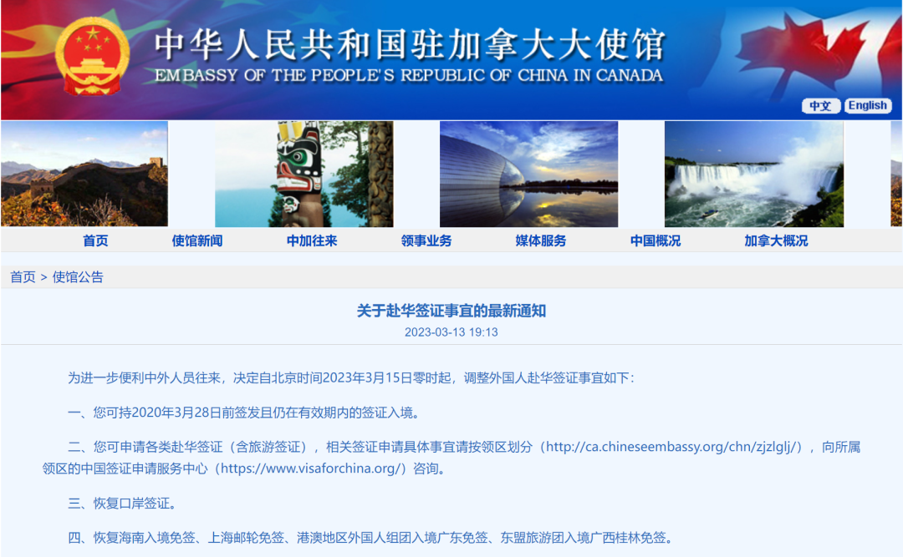 (原始链接: https://mmbiz.qpic.cn/mmbiz_png/Mvb870zkymjkgM46OxiahlPe4v5W3p3BkQUy7nibdOJUqyEBCRk18U4abWibZGIqBrlDN3Ihb1FjLT3fqJEXh4GPg/640?wx_fmt=png)
- 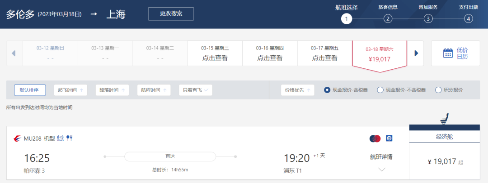 (原始链接: https://mmbiz.qpic.cn/mmbiz_png/Mvb870zkymjkgM46OxiahlPe4v5W3p3BkjuXOjvzicXbLWntswCEMq3Iyd43iayhibIHpcuTVoy2XdSUrPftfDGUzA/640?wx_fmt=png)
- 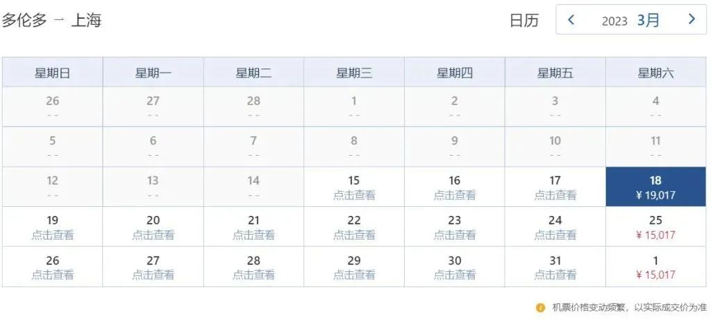 (原始链接: https://mmbiz.qpic.cn/mmbiz_jpg/Mvb870zkymjkgM46OxiahlPe4v5W3p3BkzvlAqYEfAbDPU6o2pibRfUf9efucOPmYU8f682dd9GMNqmR0C8UvSibA/640?wx_fmt=jpeg)
- 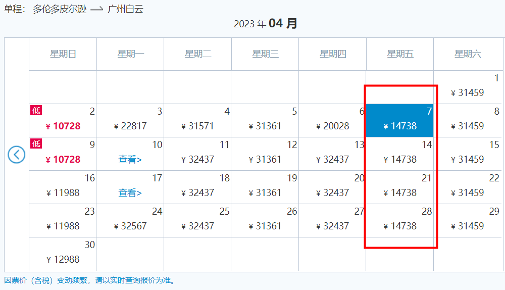 (原始链接: https://mmbiz.qpic.cn/mmbiz_png/Mvb870zkymjkgM46OxiahlPe4v5W3p3BkxsjYwUeoSqNlkq3m9Y3psTry7UxXPADYIw1kqVYRIyzPx5RFl3TmDQ/640?wx_fmt=png)
-  (原始链接: https://mmbiz.qpic.cn/mmbiz_jpg/Mvb870zkymjkgM46OxiahlPe4v5W3p3BkVNibO7uSlbhg8Fum3LcnCCEq8Me07n3J6thFcNibdibR4TXbian3o7Aqiag/640?wx_fmt=jpeg)
-  (原始链接: https://mmbiz.qpic.cn/mmbiz_png/Mvb870zkymjkgM46OxiahlPe4v5W3p3BktC0eI0a5UricTsrSicsBqvMdPTicwCibVWuKmjQUGvwNCibsvvV9J1eVWtw/640?wx_fmt=png)
-  (原始链接: https://mmbiz.qpic.cn/mmbiz_jpg/Mvb870zkymjkgM46OxiahlPe4v5W3p3Bk5qiaVJAqjuZs4nicq3jK7OAyj8h5hycf6JmxZ6EibFVic90kHKTHKf7oSg/640?wx_fmt=jpeg)
- 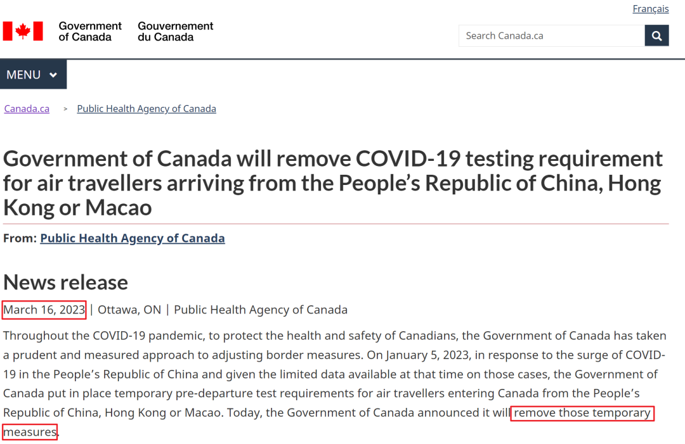 (原始链接: https://mmbiz.qpic.cn/mmbiz_png/Mvb870zkymjkgM46OxiahlPe4v5W3p3BksCcVvxK1A5XUTQcAgJpd66spVaO982orQq5C3bPl9oUHqpichYTSMmw/640?wx_fmt=png)
- 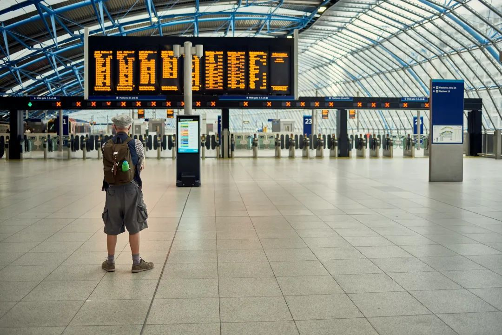 (原始链接: https://mmbiz.qpic.cn/mmbiz_jpg/Mvb870zkymjkgM46OxiahlPe4v5W3p3BktgicDKlQZoMN8HDsuzl4jdIBdTKvEhYkoyHWukqp51luT12bzLN4myA/640?wx_fmt=jpeg)
- 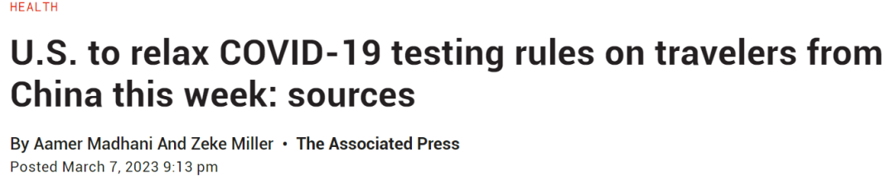 (原始链接: https://mmbiz.qpic.cn/mmbiz_png/Mvb870zkymjkgM46OxiahlPe4v5W3p3BkLibUSXFdh5eibrx3W60o7X2F6kNyH8JPbxsCiaLZ6ds68pAvCkK2C6mZg/640?wx_fmt=png)
- 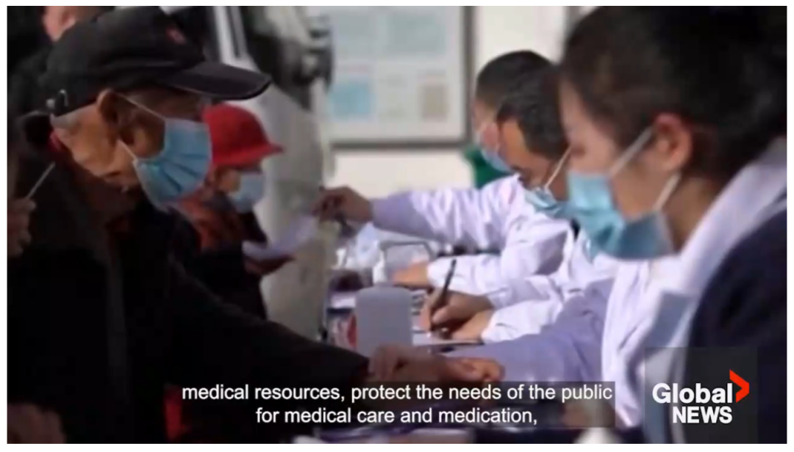 (原始链接: https://mmbiz.qpic.cn/mmbiz_png/Mvb870zkymjkgM46OxiahlPe4v5W3p3Bk286ficuvia3Gk7CF8pazyrNX4IXJTKV49n2n8XGEbJiaAw9ygSmAOvu1A/640?wx_fmt=png)
- 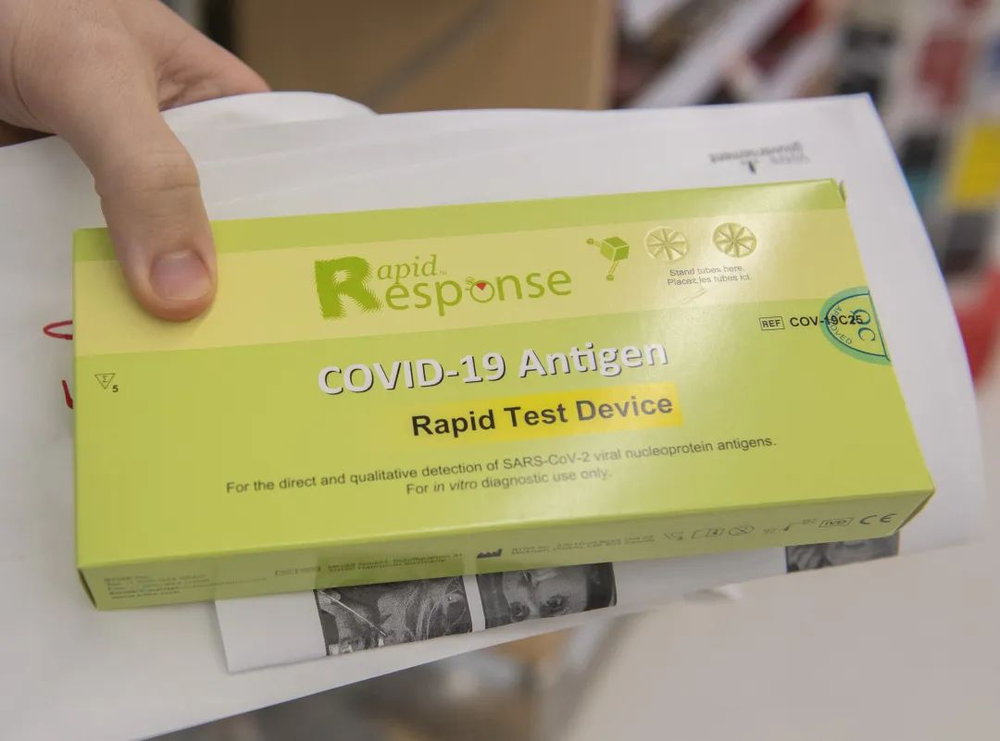 (原始链接: https://mmbiz.qpic.cn/mmbiz_jpg/Mvb870zkymjkgM46OxiahlPe4v5W3p3BkDv5IsnYhgIQRC657uzp4awfBt1icBx8JfLT026iaIgm2snaPKHrYXydA/640?wx_fmt=jpeg)
-  (原始链接: https://mmbiz.qpic.cn/mmbiz_png/Mvb870zkymjkgM46OxiahlPe4v5W3p3BkHicKdWFJHMHNpicafKcXpe09iasbib2W6qOTNVzJicQpOYldLvVicGTHjb7g/640?wx_fmt=png)
-  (原始链接: https://mmbiz.qpic.cn/mmbiz_gif/Mvb870zkymjkgM46OxiahlPe4v5W3p3BkialDsOAhh9cD6jWibZfYshWEwddEw68983icZYTfMaI5nkJHibuBSMYycg/640?wx_fmt=gif)
- 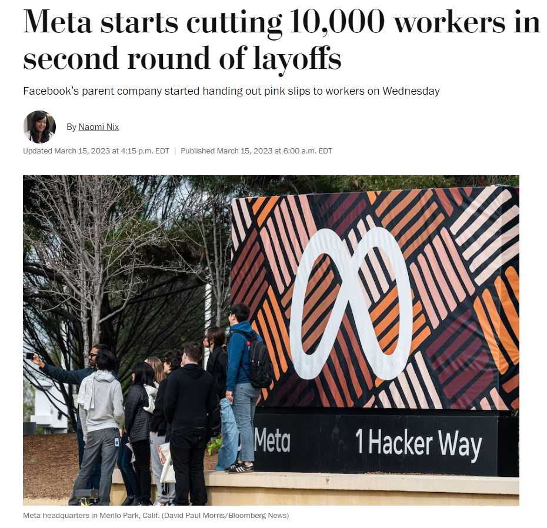 (原始链接: https://mmbiz.qpic.cn/mmbiz_png/Mvb870zkymjkgM46OxiahlPe4v5W3p3Bk8I97z7QdnbSOfhqQQ3FwI9pMs9Ss8wVg1JHhnHLuTcw3ibfQtoH44hA/640?wx_fmt=png)
-  (原始链接: https://mmbiz.qpic.cn/mmbiz_jpg/Mvb870zkymjkgM46OxiahlPe4v5W3p3BkgmuBIx2D8npxKhYKyE9eia7eKwfsNWU1fD1QMkQycefiaNtwgjuRQp1Q/640?wx_fmt=jpeg)
-  (原始链接: https://mmbiz.qpic.cn/mmbiz_jpg/Mvb870zkymjkgM46OxiahlPe4v5W3p3BkeiayiaYlPicoJYD2dYvFxZCogNUaK1fG1B9gGJAg2k0bWSiajXl4xWo1iaQ/640?wx_fmt=jpeg)
-  (原始链接: https://mmbiz.qpic.cn/mmbiz_jpg/Mvb870zkymjkgM46OxiahlPe4v5W3p3BklOHfE9TsHwh2g2bIm6Z3hAZZtZnGMVxC9hlt2qExzzuC0vfb5Tka7Q/640?wx_fmt=jpeg)
- 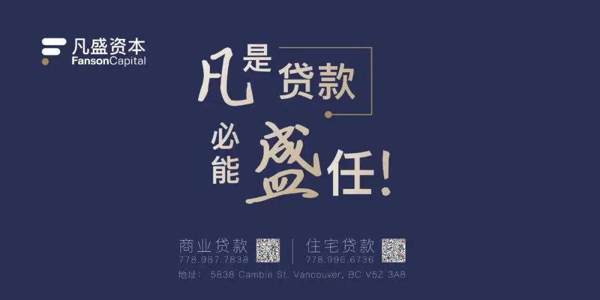 (原始链接: https://mmbiz.qpic.cn/mmbiz_jpg/Mvb870zkymjkgM46OxiahlPe4v5W3p3BkpXr96Jic67BHdW7siaqT6fviaoslfgrBnU7ib0ibqra3CDOJD8jIKmrHOxg/640?wx_fmt=jpeg)
-  (原始链接: https://mmbiz.qpic.cn/mmbiz_png/Mvb870zkymjkgM46OxiahlPe4v5W3p3Bk3HkWXic42bm2I0n5nPdknjkAuYBgy2Kpzic8EJrUv591IHS9o7QnErwg/640?wx_fmt=png)
- 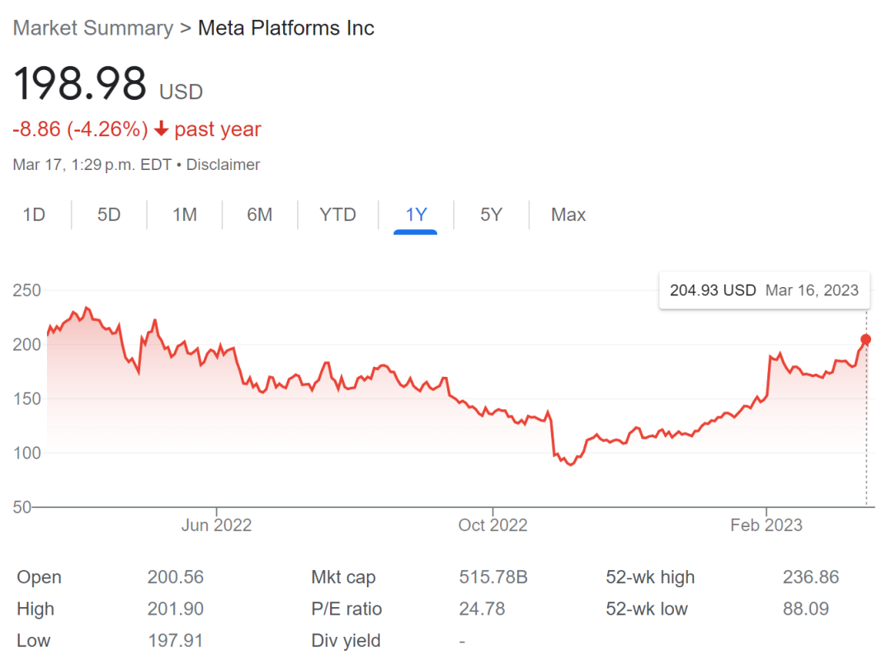 (原始链接: https://mmbiz.qpic.cn/mmbiz_png/Mvb870zkymjkgM46OxiahlPe4v5W3p3Bk9UJU5bC3lcjetg39hrVSP1xh4mibiauYvWIjKYj8hkqNQ0tLET14tVBw/640?wx_fmt=png)
-  (原始链接: https://mmbiz.qpic.cn/mmbiz_png/Mvb870zkymjkgM46OxiahlPe4v5W3p3BkjzE5JfI2xKq1meqH0h2r6mAJrkvg3Cuj9TbhQYxJJPLc9ucW0a3oFw/640?wx_fmt=png)
-  (原始链接: https://mmbiz.qpic.cn/mmbiz_png/Mvb870zkymjkgM46OxiahlPe4v5W3p3BkibsHqIncmicxSxjjGibs7ukzajJfsCRGByXdGyTIHIEiaBGG1a8BYsGFJQ/640?wx_fmt=png)
-  (原始链接: https://mmbiz.qpic.cn/mmbiz_png/Mvb870zkymjkgM46OxiahlPe4v5W3p3BkmpSf19ogicvZQJ9EFur6akkUHslbTkp3HzohksxsmSWqD2E5egSMAHQ/640?wx_fmt=png)
-  (原始链接: https://mmbiz.qpic.cn/mmbiz_jpg/Mvb870zkymjkgM46OxiahlPe4v5W3p3BkLWZ8EpmcFluZJPUldicpoxfq6YeyFYeeNtNwH07y0r52KmTvfg5efwA/640?wx_fmt=jpeg)
-  (原始链接: https://mmbiz.qpic.cn/mmbiz_jpg/Mvb870zkymjkgM46OxiahlPe4v5W3p3BkdDaibYePicib4BibSUDuPoddef8gRm3gX768xj1jpUmWKhV2S3oe8bXuhQ/640?wx_fmt=jpeg)
- 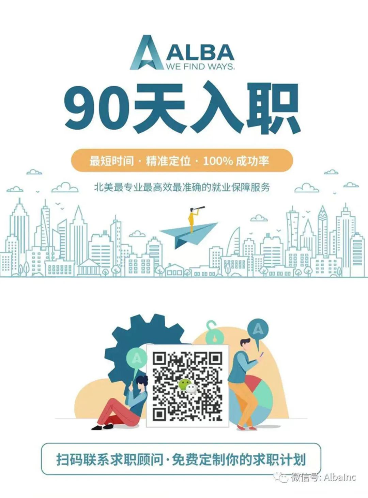 (原始链接: https://mmbiz.qpic.cn/mmbiz_jpg/Mvb870zkymjkgM46OxiahlPe4v5W3p3Bk9cStqvLBia8wOzfQTHyxoBKQm4OQFdRQts6xMibicIylSTic6BgkBvKw7Q/640?wx_fmt=jpeg)
-  (原始链接: https://mmbiz.qpic.cn/mmbiz_png/Mvb870zkymjkgM46OxiahlPe4v5W3p3BkGibYObpqWF8mrl0ne2zcHuOX6iaYarWZeibloNicsV0IgJtJcic0jXxv1Sg/640?wx_fmt=png)
-  (原始链接: https://mmbiz.qpic.cn/mmbiz_jpg/Mvb870zkymjkgM46OxiahlPe4v5W3p3Bk2icccy49UvUA2ORUqXKXLrM51HvTj3mYF4a4xOfricM1eh9ed7Nfa6VA/640?wx_fmt=jpeg)
-  (原始链接: https://mmbiz.qpic.cn/mmbiz_jpg/Mvb870zkymjkgM46OxiahlPe4v5W3p3BkGcVOWbyn8Gj9ZKp0rKXNdd3cn00KnKMgiaFCRtNe33n6eBqGhvpjs6A/640?wx_fmt=jpeg)
