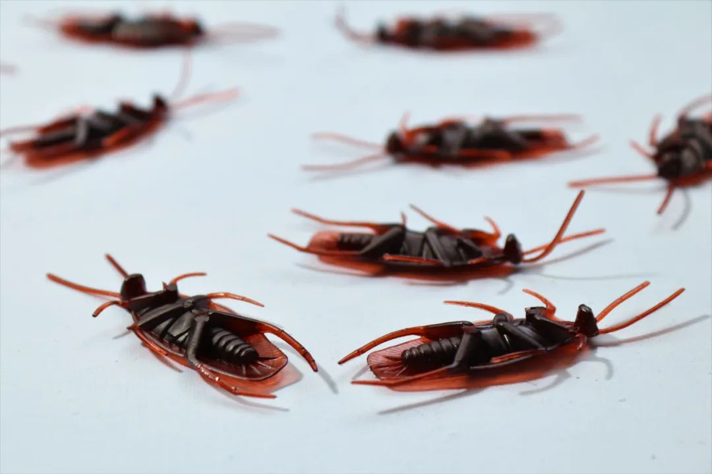
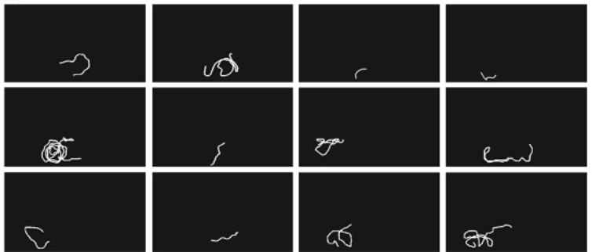
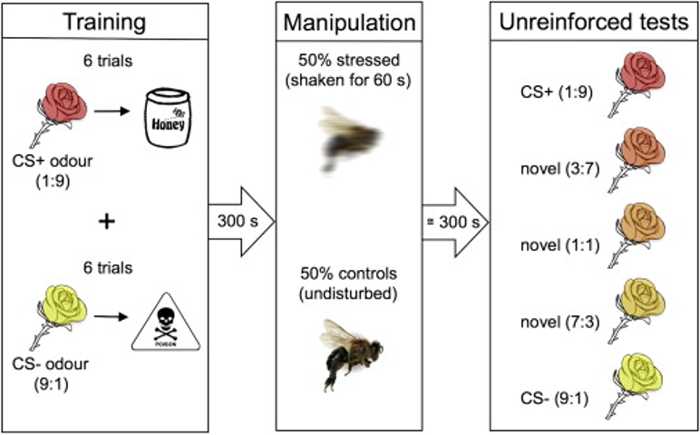
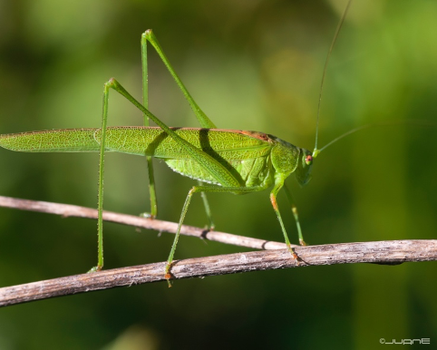

# 无标题

**链接地址:** http://mp.weixin.qq.com/s?__biz=MzAwNTA5NTYxOA==&mid=2651273520&idx=1&sn=01678466571c89d08a70ef91ad325498&chksm=80d2709db7a5f98b966e25e255796d46da749dd6358202981075fb9b648e8c7a22ce1aba2e6d&mpshare=1&scene=2&srcid=0323x6HrARZkgVHq2rSTRJfM&sharer_sharetime=1679561692229&sharer_shareid=77848a6b3852ae4dcb6c74ffee84743c#rd
**作者:** 环球科学
**获取时间:** 2025/8/28 19:14:37
**图片数量:** 10

---

## 原始HTML内容

<section data-role="outer" label="edit by 135editor" style="margin-bottom: 24px;" data-mpa-powered-by="yiban.io">

图片来源：pexels 

 
<section data-tools="135编辑器" data-id="86005"><section data-autoskip="1" style="overflow: auto;font-size: 15px;margin-bottom: 16px;line-height: 1.45;padding: 16px;border-radius: 3px;overflow-wrap: normal;box-sizing: border-box;background-color: rgb(247, 247, 247);">
我们到底忽略了多少没有被表达出来的情绪？
</section></section>
 

撰文 |&nbsp;马东源

审校 |&nbsp;二七

 

花丛中忙碌的蝴蝶和蜜蜂，我们一脚就能踩死的蚂蚁，一巴掌就能拍死的蚊子，家里面怎么都赶不走的蟑螂······这些看似十分渺小简单的生物，也会拥有情绪吗？

 

 

<strong style="outline: 0px;max-width: 100%;box-sizing: border-box !important;overflow-wrap: break-word !important;"><strong>没有表达，不代表不存在</strong></strong>

 

在上个世纪八十年代之前，很多时候医生给婴儿做手术，是不会进行麻醉的，他们有时只是给婴儿注射肌肉松弛剂，以防止婴儿在手术过程中反抗。而在手术全程，<strong>婴儿都是清醒的，他们能清楚地感受到手术过程中的所有痛苦</strong>。

 

这样看似“残酷”的操作，实际来源于当时的无知。在那个时候，医学上普遍认为人类婴儿没有痛觉，他们所有的啼哭等行为，均是没有感情的条件反射。“婴儿被认为是产生‘随机声音’的亚人类有机体，感觉不到疼痛。<strong>科学家们通过针刺、冷水、热水以及头部约束开展的曲折试验，以证明婴儿没有任何感觉。</strong>”美国埃默里大学（Emory University）灵长类动物行为学名誉退休教授弗朗斯·德瓦尔（Frans De Waal）在他的书《最后的拥抱：动物与人类的情绪》（<em>Mama’s Last Hug: Animal Emotions and What They Tell Us about Ourselves</em>）中，这样描述上个世纪八十年代前人们对婴儿的看法。

 

“语言文字能力”通常是我们人类将自己和其它所有动物区分开的一个重要标志。但有时候我们貌似赋予了“语言文字能力”过度的优越性，以至于我们会认为只有通过语言表达出来的，才叫做情感。婴儿不会表达、不会说话，所以过去的人认为婴儿没有情绪、没有感觉。动物也是如此，它们更不可能说人话，因此人类也长期否认动物会有任何的情绪。

 

然而，如今但凡认真养过猫猫狗狗的人，大概都不会同意这个观点。当和宠物相处久了，我们其实能很明显地感受到猫主子或狗子们的各种情绪。珍·古道尔曾描述过一个失去母亲的黑猩猩悲痛欲绝、难以割舍，最终走向死亡的过程。达尔文在他的书《人类与动物的感情表达》（<em>The Expression of the Emotions in Man and Animals</em>）中就曾提出，人类的情感不是突然产生的，动物的情感是在演化过程中不断发展出来的。近几十年来，科学家也通过各种长期细致的观察和实验，发现动物拥有的情绪和感觉可能远比我们想象得丰富。<strong>从与我们相似的灵长类动物，到大多数哺乳动物，再到鱼类，甚至无脊椎的甲壳类身上，都发现了许多能证明它们拥有情绪的例子。</strong>

&nbsp;

德瓦尔：“每当我读到有人很权威地宣称动物没有意向和情感，我都想问：‘这人是没养过狗吗？’”（图片来源：pixabay）

 

在诸多曾被误认为没有情绪的动物中，昆虫似乎是被误解最深的那一类。即使到了今天，绝大多数人或许也认为虫子们“不配”拥有情绪——它们的各种行为，也像上个世纪的人们眼中的婴儿一样，只是没有感情的、简单的神经反射。<strong>然而越来越多的研究发现，昆虫的情绪，或许比我们想象得丰富。</strong>

 

 

<strong style="outline: 0px;max-width: 100%;box-sizing: border-box !important;overflow-wrap: break-word !important;"><strong>昆虫：会开心、会害怕、会悲观</strong></strong>

 

在去年年底发表在《当代生物学》（<em>Current Biology</em>）期刊上的一篇研究中，介绍了<strong>实验室里一群喜欢上玩玩具的熊蜂</strong>。它们的玩具很简单——几颗小木球，但熊蜂们却玩得不亦乐乎，它们会把自己的腿搭在小木球上，扇动翅膀提供动力，然后像杂技演员一样，几条腿协作着滚动小木球。

 
<section><iframe class="video_iframe rich_pages" data-vidtype="2" data-mpvid="wxv_2829808338405425155" data-cover="http%3A%2F%2Fmmbiz.qpic.cn%2Fmmbiz_jpg%2FMjY4A5YVEodiahzszxDwhzicEmnVod9wrslJyZpcicbdd8j9ibWgx61hLU6brr6msqF3MiaTp1BgKVppXzfZOcbicg3g%2F0%3Fwx_fmt%3Djpeg" allowfullscreen="" frameborder="0" data-ratio="1.7777777777777777" data-w="1280" style="border-radius: 4px;" data-src="https://mp.weixin.qq.com/mp/readtemplate?t=pages/video_player_tmpl&amp;action=mpvideo&amp;auto=0&amp;vid=wxv_2829808338405425155"></iframe></section>
熊蜂玩耍小木球的行为。&nbsp;视频来源：Dona et al, 2022

 

它们会踩着这些小木球进行各种复杂的移动。其中有一只熊蜂似乎格外喜欢这样玩耍，它在一天之中出现了44次滚小木球的行为。

 

实验室中记录的这些熊蜂踩着小木球滚出的各种不同的轨迹。（Dona et al, 2022）

 

科学家设计了严密的实验来证明，<strong>这些熊蜂的“玩球行为”，是真的在玩耍，是在放松状态下自发的享乐行为</strong>，而不是为了获取食物，不是在移除异物，不是为了交配，也不是因为应激而出现的刻板行为。（对具体研究过程感兴趣可以阅读<a target="_blank" href="https://www.sciencedirect.com/science/article/pii/S0003347222002366" textvalue="原论文" linktype="text" imgurl="" tab="outerlink" data-linktype="2">原论文</a>）

 

那么通过这样的玩耍行为，它们是不是能真的能感受到快乐呢？答案或许是肯定的。

 

我们人类在感受到快乐和幸福时，有时会觉得整个世界都是甜的；在经历了不开心的事后，有时会觉得全世界都是灰暗的。而一些研究证明，蜂类也会这样。在一项针对蜜蜂的实验中，研究者给蜜蜂展示了两种不同的气味，并将这两种气味分别与奖励和惩罚相关联。接着，研究者把其中一些蜜蜂放在机器上进行了摇晃（以模仿受到捕食者攻击的情况），让这些蜜蜂“心情变差”。随后，又给所有的蜜蜂展示了原先两种气味以不同比例混合的几种新气味（这样蜜蜂就不能确定这些气味对应的是奖励还是惩罚），并观察蜜蜂的反应。<strong>结果显示，经过摇晃的“心情不好”的蜜蜂，更倾向于将这些棱模两可的气味认为是与惩罚相关的，而不是奖励相关。</strong>

 

“心情不好”的蜜蜂对于中立的事物，或许会产生悲观的看法。（Bateson et al, 2011）

 

而在另一个相似的实验中，研究者给一批熊蜂中的一部分个体喂食了含有蔗糖的液体（让它们开心），然后类似地，研究者也给出了一些棱模两可的选项，而“开心的”熊蜂更倾向于认为这些中立选项是与奖励相关的，而非惩罚。

 

这两个实验或许可以说明，<strong>蜜蜂和熊蜂，会因为心情的不同对中立的事物做出乐观或者悲观的判断。</strong>更重要的是，在这两个实验中，“心情不好”的蜜蜂，多巴胺等激素的水平有所下降；“开心的”熊蜂多巴胺水平有所上升。<strong>这种与心情相关的激素变化，与我们人类十分相似。</strong>

 

这样看来，那些玩小木球的熊蜂，或许真的很开心。

 

而这种情绪研究，不只在蜜蜂和熊蜂中有。科学家在果蝇研究中发现，果蝇面对自己不能掌控的负面影响会展现出类似抑郁的状态，对于未知的入侵者会感受到害怕。2016年脑科学家安德鲁·巴伦（Andrew B. Barron）和哲学家科林·克莱因（Colin Klein）在发表于《美国科学院院刊》（<em>PNAS</em>）的一篇文章中，通过对比人类大脑和昆虫的脑部功能，得出结论：昆虫虽然不像人类那样拥有大脑皮层，<strong>但昆虫的大脑足以让它们拥有主观感受。</strong>

 

 

<strong style="outline: 0px;max-width: 100%;box-sizing: border-box !important;overflow-wrap: break-word !important;"><strong>情绪不同，性格不同？</strong></strong>

 

昆虫也能拥有主观感受，这样的结论无疑挑战了当代很多人的常识。在许多人的认知里，昆虫或许就像一堆复制粘贴的简单代码，只会对特定刺激做出“设定好”的反应。然而虫子们可能的确会有自己的感受和情绪，而这或许也意味着，就算是同一种群的不同虫子，互相之间都可能是独特的，甚至有着自己不同的性格。

 

在2018年发表于期刊<em>Behavioural Process</em>的一项研究中，研究者发现<strong>同种的螽斯中，有些比较内向，有些比较外向。</strong>内向螽斯喜欢呆在某个自己觉得安全的地方，而不爱出去探索新事物与新环境，周围一有什么风吹草动就被吓得一动不动。而外向螽斯则更喜欢外出，更敢于探索未知事物，即使遇到了惊吓也能很快缓过来，不会很长时间被吓得不敢动。这些类似“社恐”或“社牛”的性格，导致明明属于同一物种的螽斯，也会采取不同的捕食策略，捕食成功率也有明显差异。

&nbsp;

螽斯也会有“社牛”和“社恐”（图片来源：juan-CC BY-SA 2.0）

 

类似的性格差异在昆虫中并不罕见，在很多社会型昆虫中，比如蚂蚁，生活在一起的不同个体会出现不同的性格。家里的蟑螂也是如此，有些蟑螂更喜欢躲起来，有些更爱外出，不同蟑螂之间可能会有很大差异。一项对蟑螂的研究证明，<strong>蟑螂群体的繁荣正好得利于群体中蟑螂的性格差异</strong>，甚至有些蟑螂个体还会在蟑螂的群体决策（collective decision）中起到非常关键的作用。

 

但必须要强调的是，目前还没有研究明确表明昆虫的性格和它们的情绪和感知相关，要弄清楚昆虫的情绪，我们还有很长的路要走。毕竟，人类对自己的情绪都还没有研究透彻，对于其它物种的情绪研究就显得更为困难。德瓦尔教授在他去年发表在《科学》（<em>Science</em>）上的一篇文章中提到：“<strong>情绪是很私密的意识状态，难以被公开观察，因此（动物的情绪）难以进行科学研究。</strong>”

 

而就算是我们人类自己，有时也会忽略身边人的内在情绪；同时，有时我们自己也倾向于把自己的情绪藏起来，不让别人发现。发现一个人的情绪需要耐心，需要去用心感受和思考，需要去认真沟通，发现动物的情绪更是如此。

 

过去很长一段时间，我们过于习惯只从人类的角度看待动物，自然就难以发现动物的情绪。近年来，科学家们开始尝试用多种方法，站在动物的角度，倾听它们的内心，这才发现，这些动物的内心，也没有我们想象得那么单调。

 
<section style="padding-right: 10px;padding-left: 10px;font-size: 16px;"><section style="text-align: center;margin-top: -10px;" powered-by="xiumi.us"><section style="display: inline-block;width: 100%;vertical-align: top;overflow-y: auto;height: 179px;"><section style="overflow: hidden;"><section style="margin-top: 20px;margin-right: 0%;margin-left: 0%;" powered-by="xiumi.us"><section style="display: inline-block;border-width: 2px;border-style: solid;border-color: rgba(94, 169, 210, 0.6);padding: 0.1em 0.3em;color: rgb(104, 104, 104);font-size: 13px;text-align: justify;line-height: 1.8;">
<strong>参考链接：</strong>

https://www.science.org/doi/10.1126/science.abo2378

https://www.sciencedirect.com/science/article/pii/S0003347222002366

https://www.sciencedirect.com/science/article/pii/S0960982211005446

https://www.cell.com/current-biology/fulltext/S0960-9822(11)00555-0?_returnURL=https%3A%2F%2Flinkinghub.elsevier.com%2Fretrieve%2Fpii%2FS0960982211005550%3Fshowall%3Dtrue

https://www.pnas.org/doi/10.1073/pnas.1520084113

https://www.sciencedirect.com/science/article/pii/S0376635717305119

https://www.cell.com/current-biology/fulltext/S0960-9822(15)00411-X

https://www.science.org/doi/10.1126/science.aaf4454

https://www.cell.com/current-biology/fulltext/S0960-9822(13)00356-4?_returnURL=https%3A%2F%2Flinkinghub.elsevier.com%2Fretrieve%2Fpii%2FS0960982213003564%3Fshowall%3Dtrue#%20

https://www.sciencedirect.com/science/article/pii/S0376635720300218

https://onlinelibrary.wiley.com/doi/abs/10.1002/9780470384947.ch2

https://www.gutenberg.org/files/1227/1227-h/1227-h.htm#link2HCH0014

https://www.bbc.com/future/article/20211126-why-insects-are-more-sensitive-than-they-seem

https://www.discovermagazine.com/planet-earth/do-insects-have-feelings-and-consciousness

弗朗斯·德瓦尔(De Waal, Frans) Frans De Waal. (2022.). 最后的拥抱：动物与人类的情绪 /湖南科学技术出版社.
</section></section></section></section></section></section></section><section powered-by="neko.red" style="margin-bottom: 0px;white-space: normal;max-width: 100%;overflow-wrap: break-word !important;box-sizing: border-box !important;">

转载内容仅代表作者观点 

不代表中科院物理所立场

如需转载请联系原公众号

<strong style="letter-spacing: 0.544px;text-align: left;caret-color: rgb(51, 51, 51);max-width: 100%;color: rgb(136, 136, 136);font-size: 14px;overflow-wrap: break-word !important;box-sizing: border-box !important;">来源：环球科学</strong>
<section style="max-width: 100%;margin-bottom: 8px;overflow-wrap: break-word !important;box-sizing: border-box !important;"><strong style="letter-spacing: 0.544px;text-align: left;caret-color: rgb(51, 51, 51);max-width: 100%;color: rgb(136, 136, 136);font-size: 14px;overflow-wrap: break-word !important;box-sizing: border-box !important;">原标题：</strong><strong>被你拍死的时候，蟑螂也会害怕吗</strong></section>
<strong style="letter-spacing: 0.544px;text-align: left;caret-color: rgb(51, 51, 51);max-width: 100%;color: rgb(136, 136, 136);font-size: 14px;overflow-wrap: break-word !important;box-sizing: border-box !important;"></strong>
<section style="max-width: 100%;font-size: 16px;caret-color: rgb(51, 51, 51);font-family: -apple-system-font, BlinkMacSystemFont, &quot;Helvetica Neue&quot;, &quot;PingFang SC&quot;, &quot;Hiragino Sans GB&quot;, &quot;Microsoft YaHei UI&quot;, &quot;Microsoft YaHei&quot;, Arial, sans-serif;letter-spacing: 0.544px;text-size-adjust: auto;background-color: rgb(255, 255, 255);text-align: right;margin-top: 8px;overflow-wrap: break-word !important;box-sizing: border-box !important;"><strong style="max-width: 100%;letter-spacing: 0.544px;color: rgb(136, 136, 136);font-size: 14px;font-family: mp-quote, -apple-system-font, BlinkMacSystemFont, &quot;Helvetica Neue&quot;, &quot;PingFang SC&quot;, &quot;Hiragino Sans GB&quot;, &quot;Microsoft YaHei UI&quot;, &quot;Microsoft YaHei&quot;, Arial, sans-serif;overflow-wrap: break-word !important;box-sizing: border-box !important;">编辑：Atom</strong></section></section><section powered-by="neko.red" style="margin-bottom: 0px;white-space: normal;max-width: 100%;overflow-wrap: break-word !important;box-sizing: border-box !important;"><section powered-by="neko.red" style="max-width: 100%;overflow-wrap: break-word !important;box-sizing: border-box !important;">
<section style="margin-top: 5px;max-width: 100%;font-size: 16px;caret-color: rgb(51, 51, 51);font-family: -apple-system-font, BlinkMacSystemFont, &quot;Helvetica Neue&quot;, &quot;PingFang SC&quot;, &quot;Hiragino Sans GB&quot;, &quot;Microsoft YaHei UI&quot;, &quot;Microsoft YaHei&quot;, Arial, sans-serif;letter-spacing: 0.544px;text-size-adjust: auto;text-align: center;line-height: 2em;overflow-wrap: break-word !important;box-sizing: border-box !important;">近期热门文章Top10</section></section></section><section powered-by="neko.red" style="margin-bottom: 0px;white-space: normal;max-width: 100%;overflow-wrap: break-word !important;box-sizing: border-box !important;">
↓ 点击标题即可查看 ↓
<h1 style="max-width: 100%;white-space: normal;margin: 0px;text-align: justify;line-height: 2em;overflow-wrap: break-word !important;box-sizing: border-box !important;">1.<a target="_blank" href="https://mp.weixin.qq.com/s?__biz=MzAwNTA5NTYxOA==&amp;mid=2651266194&amp;idx=1&amp;sn=351d9bf2a89b469d854ccb888708e44f&amp;chksm=80d2553fb7a5dc299066e0146fb70785a81628b52ca041cf4d629cad69b90fe042ff3e6cf5ad&amp;scene=21#wechat_redirect" textvalue="‍封杀这个公式，ChatGPT智商将为零‍" linktype="text" imgurl="" imgdata="null" tab="innerlink" style="text-decoration: underline;caret-color: rgb(34, 34, 34);font-family: system-ui, -apple-system, BlinkMacSystemFont, &quot;Helvetica Neue&quot;, &quot;PingFang SC&quot;, &quot;Hiragino Sans GB&quot;, &quot;Microsoft YaHei UI&quot;, &quot;Microsoft YaHei&quot;, Arial, sans-serif;text-align: start;font-size: 14px;letter-spacing: normal;" data-linktype="2">封杀这个公式，ChatGPT智商将为零</a></h1><h1 style="max-width: 100%;margin-top: 0px;margin-bottom: 0px;line-height: 2em;white-space: normal;overflow-wrap: break-word !important;box-sizing: border-box !important;"></h1><h1 style="max-width: 100%;white-space: normal;margin: 0px;text-align: justify;line-height: 2em;overflow-wrap: break-word !important;box-sizing: border-box !important;">2.<a target="_blank" href="http://mp.weixin.qq.com/s?__biz=MzAwNTA5NTYxOA==&amp;mid=2651262034&amp;idx=1&amp;sn=7e9adc8397db602d38f229dd048223d8&amp;chksm=80d245ffb7a5cce9f9c243872a36fb14675f88effcb61fa4f63b6826bad5e9622a5fbea262ff&amp;scene=21#wechat_redirect" textvalue="有人说ChatGPT有物理学博士水平？我们的测试结果令人……" linktype="text" imgurl="" imgdata="null" data-itemshowtype="0" tab="innerlink" style="text-decoration: underline;caret-color: rgb(34, 34, 34);font-family: system-ui, -apple-system, BlinkMacSystemFont, &quot;Helvetica Neue&quot;, &quot;PingFang SC&quot;, &quot;Hiragino Sans GB&quot;, &quot;Microsoft YaHei UI&quot;, &quot;Microsoft YaHei&quot;, Arial, sans-serif;text-align: start;font-size: 14px;letter-spacing: normal;" data-linktype="2">有人说ChatGPT有物理学博士水平？我们的测试结果令人……</a></h1><section style="max-width: 100%;white-space: normal;margin: 0px;text-align: justify;line-height: 2em;overflow-wrap: break-word !important;box-sizing: border-box !important;">3.<a target="_blank" href="http://mp.weixin.qq.com/s?__biz=MzAwNTA5NTYxOA==&amp;mid=2651267478&amp;idx=1&amp;sn=dde33e3b16375e7c056a69dd0bd10424&amp;chksm=80d2683bb7a5e12dac987ba10c059ff584e8d904ecec67f6696dea0dc6be89babcdb6bc5b51f&amp;scene=21#wechat_redirect" textvalue="为什么你一工作就想睡觉，想睡觉时却睡不着？" linktype="text" imgurl="" imgdata="null" data-itemshowtype="11" tab="innerlink" data-linktype="2" style="caret-color: rgb(34, 34, 34);font-family: system-ui, -apple-system, BlinkMacSystemFont, &quot;Helvetica Neue&quot;, &quot;PingFang SC&quot;, &quot;Hiragino Sans GB&quot;, &quot;Microsoft YaHei UI&quot;, &quot;Microsoft YaHei&quot;, Arial, sans-serif;text-align: start;font-size: 14px;letter-spacing: normal;text-decoration: underline;">为什么你一工作就想睡觉，想睡觉时却睡不着？</a></section><h1 style="max-width: 100%;white-space: normal;margin: 0px;text-align: justify;line-height: 2em;overflow-wrap: break-word !important;box-sizing: border-box !important;">4.<a target="_blank" href="http://mp.weixin.qq.com/s?__biz=MzAwNTA5NTYxOA==&amp;mid=2651262146&amp;idx=1&amp;sn=00b8743a7534b9517675e7fb9719f01f&amp;chksm=80d2456fb7a5cc7962d4caea1dd70bd02b5a7f03e98f8bd43663109796983dc0aeb0533e0950&amp;scene=21#wechat_redirect" textvalue="为什么我们吃不上国宴菜？大抵是因为食材过于“变态” | 科到了" linktype="text" imgurl="" imgdata="null" data-itemshowtype="0" tab="innerlink" style="text-decoration: underline;caret-color: rgb(34, 34, 34);font-family: system-ui, -apple-system, BlinkMacSystemFont, &quot;Helvetica Neue&quot;, &quot;PingFang SC&quot;, &quot;Hiragino Sans GB&quot;, &quot;Microsoft YaHei UI&quot;, &quot;Microsoft YaHei&quot;, Arial, sans-serif;text-align: start;font-size: 14px;letter-spacing: normal;" data-linktype="2">为什么我们吃不上国宴菜？大抵是因为食材过于“变态” | 科到了</a></h1><section style="max-width: 100%;white-space: normal;margin: 0px;text-align: justify;line-height: 2em;overflow-wrap: break-word !important;box-sizing: border-box !important;">5.<a target="_blank" href="http://mp.weixin.qq.com/s?__biz=MzAwNTA5NTYxOA==&amp;mid=2651267228&amp;idx=1&amp;sn=392f54736e2c6c61465267edc6504758&amp;chksm=80d26931b7a5e027faea34eaaaf5c4352d2ea92922db6a7dff86d9e2473bbbe9d6d3e8d2f3d8&amp;scene=21#wechat_redirect" textvalue="地球内核正在反向旋转！对我们的日常会有影响吗？" linktype="text" imgurl="" imgdata="null" data-itemshowtype="11" tab="innerlink" style="text-decoration: underline;caret-color: rgb(34, 34, 34);font-family: system-ui, -apple-system, BlinkMacSystemFont, &quot;Helvetica Neue&quot;, &quot;PingFang SC&quot;, &quot;Hiragino Sans GB&quot;, &quot;Microsoft YaHei UI&quot;, &quot;Microsoft YaHei&quot;, Arial, sans-serif;text-align: start;font-size: 14px;letter-spacing: normal;" data-linktype="2">地球内核正在反向旋转！对我们的日常会有影响吗？</a></section><section style="max-width: 100%;margin: 0px;text-align: justify;line-height: 2em;overflow-wrap: break-word !important;box-sizing: border-box !important;">6.<a target="_blank" href="http://mp.weixin.qq.com/s?__biz=MzAwNTA5NTYxOA==&amp;mid=2651255465&amp;idx=1&amp;sn=67bcbcf97d6eaf1a629492e4549829f5&amp;chksm=80d3bb04b7a43212cde0622b277e6430f0efca8b778a1909cacb1b746bbe03afc191c08a5430&amp;scene=21#wechat_redirect" textvalue="地壳会毁灭？流浪地球不可行？地质学告诉你答案！" linktype="text" imgurl="" imgdata="null" data-itemshowtype="11" tab="innerlink" data-linktype="2" style="caret-color: rgb(34, 34, 34);font-family: system-ui, -apple-system, BlinkMacSystemFont, &quot;Helvetica Neue&quot;, &quot;PingFang SC&quot;, &quot;Hiragino Sans GB&quot;, &quot;Microsoft YaHei UI&quot;, &quot;Microsoft YaHei&quot;, Arial, sans-serif;text-align: start;font-size: 14px;letter-spacing: normal;text-decoration: underline;">地壳会毁灭？流浪地球不可行？地质学告诉你答案！</a></section><section style="max-width: 100%;white-space: normal;margin: 0px;text-align: justify;line-height: 2em;overflow-wrap: break-word !important;box-sizing: border-box !important;">7.<a target="_blank" href="http://mp.weixin.qq.com/s?__biz=MzAwNTA5NTYxOA==&amp;mid=2651263195&amp;idx=1&amp;sn=5d6df51c3d6c6208337114c0251bc439&amp;chksm=80d25976b7a5d060c7017f4b1dd26094d60c9c4f3860c680c0490f8a97ad025b40915f4424ba&amp;scene=21#wechat_redirect" textvalue="《较 低 端 鼠 鼠 求 生 图 鉴》" linktype="text" imgurl="" imgdata="null" data-itemshowtype="11" tab="innerlink" data-linktype="2" style="white-space: normal;caret-color: rgb(34, 34, 34);font-family: system-ui, -apple-system, BlinkMacSystemFont, &quot;Helvetica Neue&quot;, &quot;PingFang SC&quot;, &quot;Hiragino Sans GB&quot;, &quot;Microsoft YaHei UI&quot;, &quot;Microsoft YaHei&quot;, Arial, sans-serif;text-align: start;font-size: 14px;letter-spacing: normal;text-decoration: underline;">《较 低 端 鼠 鼠 求 生 图 鉴》</a></section><section style="max-width: 100%;white-space: normal;margin: 0px;text-align: justify;line-height: 2em;overflow-wrap: break-word !important;box-sizing: border-box !important;">8.<a target="_blank" href="http://mp.weixin.qq.com/s?__biz=MzAwNTA5NTYxOA==&amp;mid=2651260508&amp;idx=1&amp;sn=4f4a22ff2d0a5027012ac8d5421fd557&amp;chksm=80d24ff1b7a5c6e7d15c1705f43436f39ce94bc8e1f5b705481ec74b6c85f3b61c77ee2ceff9&amp;scene=21#wechat_redirect" textvalue="明明中心是氮原子，为何不叫氮酸叫硝酸？ | 科到了" linktype="text" imgurl="" imgdata="null" data-itemshowtype="0" tab="innerlink" style="text-decoration: underline;caret-color: rgb(34, 34, 34);font-family: system-ui, -apple-system, BlinkMacSystemFont, &quot;Helvetica Neue&quot;, &quot;PingFang SC&quot;, &quot;Hiragino Sans GB&quot;, &quot;Microsoft YaHei UI&quot;, &quot;Microsoft YaHei&quot;, Arial, sans-serif;text-align: start;font-size: 14px;letter-spacing: normal;" data-linktype="2">明明中心是氮原子，为何不叫氮酸叫硝酸？| 科到了</a></section><section style="max-width: 100%;white-space: normal;margin: 0px;text-align: justify;line-height: 2em;overflow-wrap: break-word !important;box-sizing: border-box !important;">9.<a target="_blank" href="http://mp.weixin.qq.com/s?__biz=MzAwNTA5NTYxOA==&amp;mid=2651266645&amp;idx=1&amp;sn=b77848fa996fbb02d2a00d950a46b058&amp;chksm=80d257f8b7a5deee2af202c6327bbf8d416aa5c2bd2bf9f130d0db44f775bec05bb00cf731e1&amp;scene=21#wechat_redirect" textvalue="脑洞狂飙！当物理博士，扛着显微镜穿越到明朝…" linktype="text" imgurl="" imgdata="null" data-itemshowtype="0" tab="innerlink" data-linktype="2" style="caret-color: rgb(34, 34, 34);font-family: system-ui, -apple-system, BlinkMacSystemFont, &quot;Helvetica Neue&quot;, &quot;PingFang SC&quot;, &quot;Hiragino Sans GB&quot;, &quot;Microsoft YaHei UI&quot;, &quot;Microsoft YaHei&quot;, Arial, sans-serif;text-align: start;font-size: 14px;letter-spacing: normal;text-decoration: underline;">脑洞狂飙！当物理博士，扛着显微镜穿越到明朝…</a></section><section style="max-width: 100%;white-space: normal;margin: 0px;text-align: justify;line-height: 2em;overflow-wrap: break-word !important;box-sizing: border-box !important;">10.<a target="_blank" href="http://mp.weixin.qq.com/s?__biz=MzAwNTA5NTYxOA==&amp;mid=2651263981&amp;idx=1&amp;sn=e69a3dd865a875a3ecf2bb944d0de179&amp;chksm=80d25a40b7a5d3561d5783414900e6ad3b917e5aa400d1b63f0035efb60d4bf30ed15449fbe5&amp;scene=21#wechat_redirect" textvalue="最近实验总做不出来，坏了，不会三体人已经在路上了吧？| 科到了" linktype="text" imgurl="" imgdata="null" data-itemshowtype="0" tab="innerlink" style="text-indent: 0em;text-decoration: underline;caret-color: rgb(34, 34, 34);font-family: system-ui, -apple-system, BlinkMacSystemFont, &quot;Helvetica Neue&quot;, &quot;PingFang SC&quot;, &quot;Hiragino Sans GB&quot;, &quot;Microsoft YaHei UI&quot;, &quot;Microsoft YaHei&quot;, Arial, sans-serif;text-align: start;font-size: 14px;letter-spacing: normal;" data-linktype="2">最近实验总做不出来，坏了，不会三体人已经在路上了吧？| 科到了</a></section><section powered-by="neko.red" style="max-width: 100%;line-height: 2em;overflow-wrap: break-word !important;box-sizing: border-box !important;"><section style="margin-bottom: 5px;outline: 0px;max-width: 100%;color: rgb(34, 34, 34);letter-spacing: 0.544px;background-color: rgb(255, 255, 255);font-size: 16px;caret-color: rgb(51, 51, 51);font-family: -apple-system-font, BlinkMacSystemFont, &quot;Helvetica Neue&quot;, &quot;PingFang SC&quot;, &quot;Hiragino Sans GB&quot;, &quot;Microsoft YaHei UI&quot;, &quot;Microsoft YaHei&quot;, Arial, sans-serif;text-size-adjust: inherit;text-align: center;line-height: 2em;box-sizing: border-box !important;overflow-wrap: break-word !important;"><a target="_blank" href="https://shimo.im/docs/ne3VVl6Y2zh8FB3b/read" textvalue="&nbsp;点此查看以往全部热门文章&nbsp;" tab="outerlink" data-linktype="2" style="outline: 0px;-webkit-tap-highlight-color: rgba(0, 0, 0, 0);cursor: pointer;max-width: 100%;box-sizing: border-box !important;overflow-wrap: break-word !important;">&nbsp;点此查看以往全部热门文章&nbsp;</a></section>

</section></section>

---

## 纯文本内容

图片来源：pexels我们到底忽略了多少没有被表达出来的情绪？撰文 | 马东源审校 | 二七花丛中忙碌的蝴蝶和蜜蜂，我们一脚就能踩死的蚂蚁，一巴掌就能拍死的蚊子，家里面怎么都赶不走的蟑螂······这些看似十分渺小简单的生物，也会拥有情绪吗？没有表达，不代表不存在在上个世纪八十年代之前，很多时候医生给婴儿做手术，是不会进行麻醉的，他们有时只是给婴儿注射肌肉松弛剂，以防止婴儿在手术过程中反抗。而在手术全程，婴儿都是清醒的，他们能清楚地感受到手术过程中的所有痛苦。这样看似“残酷”的操作，实际来源于当时的无知。在那个时候，医学上普遍认为人类婴儿没有痛觉，他们所有的啼哭等行为，均是没有感情的条件反射。“婴儿被认为是产生‘随机声音’的亚人类有机体，感觉不到疼痛。科学家们通过针刺、冷水、热水以及头部约束开展的曲折试验，以证明婴儿没有任何感觉。”美国埃默里大学（Emory University）灵长类动物行为学名誉退休教授弗朗斯·德瓦尔（Frans De Waal）在他的书《最后的拥抱：动物与人类的情绪》（Mama’s Last Hug: Animal Emotions and What They Tell Us about Ourselves）中，这样描述上个世纪八十年代前人们对婴儿的看法。“语言文字能力”通常是我们人类将自己和其它所有动物区分开的一个重要标志。但有时候我们貌似赋予了“语言文字能力”过度的优越性，以至于我们会认为只有通过语言表达出来的，才叫做情感。婴儿不会表达、不会说话，所以过去的人认为婴儿没有情绪、没有感觉。动物也是如此，它们更不可能说人话，因此人类也长期否认动物会有任何的情绪。然而，如今但凡认真养过猫猫狗狗的人，大概都不会同意这个观点。当和宠物相处久了，我们其实能很明显地感受到猫主子或狗子们的各种情绪。珍·古道尔曾描述过一个失去母亲的黑猩猩悲痛欲绝、难以割舍，最终走向死亡的过程。达尔文在他的书《人类与动物的感情表达》（The Expression of the Emotions in Man and Animals）中就曾提出，人类的情感不是突然产生的，动物的情感是在演化过程中不断发展出来的。近几十年来，科学家也通过各种长期细致的观察和实验，发现动物拥有的情绪和感觉可能远比我们想象得丰富。从与我们相似的灵长类动物，到大多数哺乳动物，再到鱼类，甚至无脊椎的甲壳类身上，都发现了许多能证明它们拥有情绪的例子。 德瓦尔：“每当我读到有人很权威地宣称动物没有意向和情感，我都想问：‘这人是没养过狗吗？’”（图片来源：pixabay）在诸多曾被误认为没有情绪的动物中，昆虫似乎是被误解最深的那一类。即使到了今天，绝大多数人或许也认为虫子们“不配”拥有情绪——它们的各种行为，也像上个世纪的人们眼中的婴儿一样，只是没有感情的、简单的神经反射。然而越来越多的研究发现，昆虫的情绪，或许比我们想象得丰富。昆虫：会开心、会害怕、会悲观在去年年底发表在《当代生物学》（Current Biology）期刊上的一篇研究中，介绍了实验室里一群喜欢上玩玩具的熊蜂。它们的玩具很简单——几颗小木球，但熊蜂们却玩得不亦乐乎，它们会把自己的腿搭在小木球上，扇动翅膀提供动力，然后像杂技演员一样，几条腿协作着滚动小木球。熊蜂玩耍小木球的行为。 视频来源：Dona et al, 2022它们会踩着这些小木球进行各种复杂的移动。其中有一只熊蜂似乎格外喜欢这样玩耍，它在一天之中出现了44次滚小木球的行为。实验室中记录的这些熊蜂踩着小木球滚出的各种不同的轨迹。（Dona et al, 2022）科学家设计了严密的实验来证明，这些熊蜂的“玩球行为”，是真的在玩耍，是在放松状态下自发的享乐行为，而不是为了获取食物，不是在移除异物，不是为了交配，也不是因为应激而出现的刻板行为。（对具体研究过程感兴趣可以阅读原论文）那么通过这样的玩耍行为，它们是不是能真的能感受到快乐呢？答案或许是肯定的。我们人类在感受到快乐和幸福时，有时会觉得整个世界都是甜的；在经历了不开心的事后，有时会觉得全世界都是灰暗的。而一些研究证明，蜂类也会这样。在一项针对蜜蜂的实验中，研究者给蜜蜂展示了两种不同的气味，并将这两种气味分别与奖励和惩罚相关联。接着，研究者把其中一些蜜蜂放在机器上进行了摇晃（以模仿受到捕食者攻击的情况），让这些蜜蜂“心情变差”。随后，又给所有的蜜蜂展示了原先两种气味以不同比例混合的几种新气味（这样蜜蜂就不能确定这些气味对应的是奖励还是惩罚），并观察蜜蜂的反应。结果显示，经过摇晃的“心情不好”的蜜蜂，更倾向于将这些棱模两可的气味认为是与惩罚相关的，而不是奖励相关。“心情不好”的蜜蜂对于中立的事物，或许会产生悲观的看法。（Bateson et al, 2011）而在另一个相似的实验中，研究者给一批熊蜂中的一部分个体喂食了含有蔗糖的液体（让它们开心），然后类似地，研究者也给出了一些棱模两可的选项，而“开心的”熊蜂更倾向于认为这些中立选项是与奖励相关的，而非惩罚。这两个实验或许可以说明，蜜蜂和熊蜂，会因为心情的不同对中立的事物做出乐观或者悲观的判断。更重要的是，在这两个实验中，“心情不好”的蜜蜂，多巴胺等激素的水平有所下降；“开心的”熊蜂多巴胺水平有所上升。这种与心情相关的激素变化，与我们人类十分相似。这样看来，那些玩小木球的熊蜂，或许真的很开心。而这种情绪研究，不只在蜜蜂和熊蜂中有。科学家在果蝇研究中发现，果蝇面对自己不能掌控的负面影响会展现出类似抑郁的状态，对于未知的入侵者会感受到害怕。2016年脑科学家安德鲁·巴伦（Andrew B. Barron）和哲学家科林·克莱因（Colin Klein）在发表于《美国科学院院刊》（PNAS）的一篇文章中，通过对比人类大脑和昆虫的脑部功能，得出结论：昆虫虽然不像人类那样拥有大脑皮层，但昆虫的大脑足以让它们拥有主观感受。情绪不同，性格不同？昆虫也能拥有主观感受，这样的结论无疑挑战了当代很多人的常识。在许多人的认知里，昆虫或许就像一堆复制粘贴的简单代码，只会对特定刺激做出“设定好”的反应。然而虫子们可能的确会有自己的感受和情绪，而这或许也意味着，就算是同一种群的不同虫子，互相之间都可能是独特的，甚至有着自己不同的性格。在2018年发表于期刊Behavioural Process的一项研究中，研究者发现同种的螽斯中，有些比较内向，有些比较外向。内向螽斯喜欢呆在某个自己觉得安全的地方，而不爱出去探索新事物与新环境，周围一有什么风吹草动就被吓得一动不动。而外向螽斯则更喜欢外出，更敢于探索未知事物，即使遇到了惊吓也能很快缓过来，不会很长时间被吓得不敢动。这些类似“社恐”或“社牛”的性格，导致明明属于同一物种的螽斯，也会采取不同的捕食策略，捕食成功率也有明显差异。 螽斯也会有“社牛”和“社恐”（图片来源：juan-CC BY-SA 2.0）类似的性格差异在昆虫中并不罕见，在很多社会型昆虫中，比如蚂蚁，生活在一起的不同个体会出现不同的性格。家里的蟑螂也是如此，有些蟑螂更喜欢躲起来，有些更爱外出，不同蟑螂之间可能会有很大差异。一项对蟑螂的研究证明，蟑螂群体的繁荣正好得利于群体中蟑螂的性格差异，甚至有些蟑螂个体还会在蟑螂的群体决策（collective decision）中起到非常关键的作用。但必须要强调的是，目前还没有研究明确表明昆虫的性格和它们的情绪和感知相关，要弄清楚昆虫的情绪，我们还有很长的路要走。毕竟，人类对自己的情绪都还没有研究透彻，对于其它物种的情绪研究就显得更为困难。德瓦尔教授在他去年发表在《科学》（Science）上的一篇文章中提到：“情绪是很私密的意识状态，难以被公开观察，因此（动物的情绪）难以进行科学研究。”而就算是我们人类自己，有时也会忽略身边人的内在情绪；同时，有时我们自己也倾向于把自己的情绪藏起来，不让别人发现。发现一个人的情绪需要耐心，需要去用心感受和思考，需要去认真沟通，发现动物的情绪更是如此。过去很长一段时间，我们过于习惯只从人类的角度看待动物，自然就难以发现动物的情绪。近年来，科学家们开始尝试用多种方法，站在动物的角度，倾听它们的内心，这才发现，这些动物的内心，也没有我们想象得那么单调。参考链接：https://www.science.org/doi/10.1126/science.abo2378https://www.sciencedirect.com/science/article/pii/S0003347222002366https://www.sciencedirect.com/science/article/pii/S0960982211005446https://www.cell.com/current-biology/fulltext/S0960-9822(11)00555-0?_returnURL=https%3A%2F%2Flinkinghub.elsevier.com%2Fretrieve%2Fpii%2FS0960982211005550%3Fshowall%3Dtruehttps://www.pnas.org/doi/10.1073/pnas.1520084113https://www.sciencedirect.com/science/article/pii/S0376635717305119https://www.cell.com/current-biology/fulltext/S0960-9822(15)00411-Xhttps://www.science.org/doi/10.1126/science.aaf4454https://www.cell.com/current-biology/fulltext/S0960-9822(13)00356-4?_returnURL=https%3A%2F%2Flinkinghub.elsevier.com%2Fretrieve%2Fpii%2FS0960982213003564%3Fshowall%3Dtrue#%20https://www.sciencedirect.com/science/article/pii/S0376635720300218https://onlinelibrary.wiley.com/doi/abs/10.1002/9780470384947.ch2https://www.gutenberg.org/files/1227/1227-h/1227-h.htm#link2HCH0014https://www.bbc.com/future/article/20211126-why-insects-are-more-sensitive-than-they-seemhttps://www.discovermagazine.com/planet-earth/do-insects-have-feelings-and-consciousness弗朗斯·德瓦尔(De Waal, Frans) Frans De Waal. (2022.). 最后的拥抱：动物与人类的情绪 /湖南科学技术出版社.转载内容仅代表作者观点不代表中科院物理所立场如需转载请联系原公众号来源：环球科学原标题：被你拍死的时候，蟑螂也会害怕吗编辑：Atom近期热门文章Top10↓ 点击标题即可查看 ↓1.封杀这个公式，ChatGPT智商将为零2.有人说ChatGPT有物理学博士水平？我们的测试结果令人……3.为什么你一工作就想睡觉，想睡觉时却睡不着？4.为什么我们吃不上国宴菜？大抵是因为食材过于“变态” | 科到了5.地球内核正在反向旋转！对我们的日常会有影响吗？6.地壳会毁灭？流浪地球不可行？地质学告诉你答案！7.《较 低 端 鼠 鼠 求 生 图 鉴》8.明明中心是氮原子，为何不叫氮酸叫硝酸？| 科到了9.脑洞狂飙！当物理博士，扛着显微镜穿越到明朝…10.最近实验总做不出来，坏了，不会三体人已经在路上了吧？| 科到了 点此查看以往全部热门文章

---

## 图片列表

-  (原始链接: https://mmbiz.qpic.cn/mmbiz_jpg/MjY4A5YVEodiahzszxDwhzicEmnVod9wrsWLJTwfcQyK0rZp6pKOuw1GcibKHm4fyYic4ZJNIOic6tgHLe9y5icmR6Yw/640?wx_fmt=jpeg)
-  (原始链接: https://mmbiz.qpic.cn/mmbiz_gif/MjY4A5YVEodiahzszxDwhzicEmnVod9wrs3L1zMTkxJ3iaQBtxXzs8qtNrTVPENuBpgSibYjKdgMqemcPoedfAffkA/640?wx_fmt=png)
-  (原始链接: https://mmbiz.qpic.cn/mmbiz_png/MjY4A5YVEodiahzszxDwhzicEmnVod9wrsjick7ic5bRe2M6cy9kHlDI2lk9RLeM0NicdVdetzwlvZiaUSYZonUNtG0g/640?wx_fmt=png)
-  (原始链接: https://mmbiz.qpic.cn/mmbiz_gif/MjY4A5YVEodiahzszxDwhzicEmnVod9wrs3L1zMTkxJ3iaQBtxXzs8qtNrTVPENuBpgSibYjKdgMqemcPoedfAffkA/640?wx_fmt=png)
-  (原始链接: https://mmbiz.qpic.cn/mmbiz_png/MjY4A5YVEodiahzszxDwhzicEmnVod9wrsfHG5k71bvh9G6p7PcAtJmOGpF5Ypg8UhwGjO5BfHd4xich16cibtmibQg/640?wx_fmt=png)
-  (原始链接: https://mmbiz.qpic.cn/mmbiz_png/MjY4A5YVEodiahzszxDwhzicEmnVod9wrsWpkNNuPkTlJFYr0LC3If06G9m3Xib4iaCmE3HZypibulU7eN1ELtzlaSw/640?wx_fmt=png)
-  (原始链接: https://mmbiz.qpic.cn/mmbiz_gif/MjY4A5YVEodiahzszxDwhzicEmnVod9wrs3L1zMTkxJ3iaQBtxXzs8qtNrTVPENuBpgSibYjKdgMqemcPoedfAffkA/640?wx_fmt=png)
-  (原始链接: https://mmbiz.qpic.cn/mmbiz_png/MjY4A5YVEodiahzszxDwhzicEmnVod9wrsPEQfL9kVvMC0dO3ficywZMfseIyPz31gyEddhTjBudL4ibrgxTGhYoyA/640?wx_fmt=png)
-  (原始链接: https://mmbiz.qpic.cn/mmbiz_jpg/MjY4A5YVEoc8HEAic2KOLDbyY8xzk8uWB1MbL2VibtAX9loIF4osLZica74QnGshq4UtSkyB9Sakv98yvPZR9te6A/640?wx_fmt=jpeg&wxfrom=5&wx_lazy=1&wx_co=1)
-  (原始链接: https://mmbiz.qpic.cn/mmbiz_jpg/QAEJXB03eMCG1AE1zmI4iboYP9h1IAAkkYcYUSpUo2IgeicvPWQR7WA4cuTZa1fyZCD7ZDJ6sEP61oS43E5Lgn9Q/640?wx_fmt=jpeg)
