# 无标题

**链接地址:** http://mp.weixin.qq.com/s?__biz=MzUyNzA2NTAwNg==&mid=2247493542&idx=1&sn=d8125fe6538d0b42e42434ac0b942736&chksm=fa07ed67cd70647156f550af03e5b632107c55697a8f483aeed91197c3fba5c9eafc55d16b4e&mpshare=1&scene=2&srcid=03306N0FMhEpbipvBDKDKNeo&sharer_sharetime=1680126762032&sharer_shareid=77848a6b3852ae4dcb6c74ffee84743c#rd
**作者:** 你身边的签证专家
**获取时间:** 2025/8/28 19:14:01
**图片数量:** 33

---

## 原始HTML内容

<section style="box-sizing: border-box;font-size: 16px;"><section style="text-align: center;margin-top: 10px;margin-bottom: 10px;line-height: 0;box-sizing: border-box;" powered-by="xiumi.us"><section style="max-width: 100%;vertical-align: middle;display: inline-block;line-height: 0;box-sizing: border-box;"></section></section><section style="text-align: center;margin-top: 10px;margin-bottom: 10px;line-height: 0;box-sizing: border-box;" powered-by="xiumi.us"><section style="max-width: 100%;vertical-align: middle;display: inline-block;line-height: 0;box-sizing: border-box;"></section></section>
 
<section style="font-size: 19px;text-align: center;margin-top: 10px;margin-bottom: 3px;box-sizing: border-box;" powered-by="xiumi.us"><section style="display: inline-block;border-width: 1px;border-style: solid;border-color: rgb(188, 65, 65);background-color: rgb(188, 65, 65);width: 1.8em;height: 1.8em;line-height: 1.8em;border-radius: 100%;margin-left: auto;margin-right: auto;font-size: 16px;color: rgb(255, 255, 255);box-sizing: border-box;">
<strong style="box-sizing: border-box;">1</strong>
</section></section><section style="text-align: center;box-sizing: border-box;" powered-by="xiumi.us"><section style="display: inline-block;width: 0px;height: 0px;vertical-align: top;overflow: hidden;border-style: solid;border-width: 9px 6px 0px;border-color: rgb(188, 65, 65) rgba(255, 255, 255, 0) rgba(255, 255, 255, 0);box-sizing: border-box;"><svg viewBox="0 0 1 1" style="float:left;line-height:0;width:0;vertical-align:top;"></svg></section></section><section style="margin-bottom: 10px;text-align: center;justify-content: center;display: flex;flex-flow: row nowrap;box-sizing: border-box;" powered-by="xiumi.us"><section style="display: inline-block;width: auto;vertical-align: middle;background-color: rgba(109, 155, 209, 0.1);min-width: 10%;max-width: 100%;flex: 0 0 auto;height: auto;align-self: center;padding: 12px;box-sizing: border-box;"><section style="color: rgb(109, 155, 209);text-align: justify;box-sizing: border-box;" powered-by="xiumi.us">
<strong style="box-sizing: border-box;">加拿大快速通道连续第三周抽签</strong>
</section></section></section><section style="font-size: 14px;padding-right: 15px;padding-left: 15px;letter-spacing: 1px;box-sizing: border-box;" powered-by="xiumi.us">
 

3月29日，快速通道（Express Entry）迎来了2023年第9次抽签！本次抽签仍然为不分类别的全项目抽签，<strong style="box-sizing: border-box;">总共抽取7,000人，抽取分数为481分</strong>，比上一次降低了3分，<strong style="box-sizing: border-box;">刷新了去年7月份快速通道恢复以来的最低分数</strong>。

 
<section class="channels_iframe_wrp wxw_wechannel_card_not_horizontal"><mpvideosnap class="js_uneditable custom_select_card channels_iframe videosnap_video_iframe" data-pluginname="videosnap" data-id="export/UzFfAgtgekIEAQAAAAAA7I0hhwpxkgAAAAstQy6ubaLX4KHWvLEZgBPEuJEETidIPK6AzNPgMIvuotMJ8OsrUniMg6VBntGU" data-url="https://findermp.video.qq.com/251/20304/stodownload?encfilekey=oibeqyX228riaCwo9STVsGLM5YtWluFOonYwKQ55zQIl9ajEarkpicv83TTBCrPnmibVkdPpSFiauaUCB8kIrx3AicIJgnWaA4VPYCUcrH6PFM1LReXbNlRbl83ianqpz4n5uA4m0iaI6VMRoLI&amp;adaptivelytrans=0&amp;bizid=1023&amp;dotrans=0&amp;hy=HK&amp;idx=1&amp;m=92e39da12350eb93db0937e5f83e122d&amp;token=AxricY7RBHdXbpel3gfZlu83mHBOEfkWUnRoKjfAn1icoyxnhR5icQdExVC5pAQsW16FHwJDezxQKM" data-headimgurl="http://wx.qlogo.cn/finderhead/PiajxSqBRaEI4vQJr3aa81ehxKpzshj4t6ZWzDxwztBic5fr9nVMt20g/0" data-username="v2_060000231003b20faec8c7eb811fc3d1ca06ec31b07726617828a16cbc88a282c95def3c7c6d@finder" data-nickname="Zoe说加拿大" data-desc="快速通道连续三周，每周抽签，分数降至481！#加拿大 #快速通道 #加拿大移民" data-nonceid="6415562099237720245" data-type="video" data-authiconurl="https://dldir1v6.qq.com/weixin/checkresupdate/auth_icon_level1_ba9f2ea346de48a3ae0428273fc48117.png" data-width="720" data-height="960"></mpvideosnap></section>
 

这也是加拿大联邦移民部<strong style="box-sizing: border-box;">连续第三周进行快速通道抽签</strong>，人数追平了上周刚刚创下的纪录，也是<strong style="box-sizing: border-box;">快速通道史上规模第二大的抽签</strong>。

 
</section><section style="text-align: center;margin-top: 10px;margin-bottom: 10px;line-height: 0;box-sizing: border-box;" powered-by="xiumi.us"><section style="max-width: 100%;vertical-align: middle;display: inline-block;line-height: 0;width: 90%;height: auto;box-sizing: border-box;"></section></section><section style="font-size: 14px;padding-right: 15px;padding-left: 15px;letter-spacing: 1px;box-sizing: border-box;" powered-by="xiumi.us">
 

从去年七月份恢复非定向（全类型）邀请至今，目前分数从开始的557分大幅下降到了481分，每轮邀请人数也<strong style="box-sizing: border-box;">从刚开始的1,500人增加到了7,000人</strong>，充分显示了移民部鼓励经济移民的决心。

 
</section><section style="text-align: center;margin-top: 10px;margin-bottom: 10px;line-height: 0;box-sizing: border-box;" powered-by="xiumi.us"><section style="max-width: 100%;vertical-align: middle;display: inline-block;line-height: 0;width: 90%;height: auto;box-sizing: border-box;"></section></section><section style="font-size: 14px;padding-right: 15px;padding-left: 15px;letter-spacing: 1px;box-sizing: border-box;" powered-by="xiumi.us">
 

本次抽签继续为全项目抽签，邀请人数维持了上次的大规模，分数线也继续明显下降，降幅达到3分并成为<strong style="box-sizing: border-box;">近期最低分</strong>。目前来看，快速通道有继续降分的趋势，<strong style="box-sizing: border-box;">短时间内连续三次非定向邀请实属罕见</strong>。

 
</section><section style="text-align: center;margin-top: 10px;margin-bottom: 10px;line-height: 0;box-sizing: border-box;" powered-by="xiumi.us"><section style="max-width: 100%;vertical-align: middle;display: inline-block;line-height: 0;width: 90%;height: auto;box-sizing: border-box;"></section></section><section style="font-size: 14px;padding-right: 15px;padding-left: 15px;letter-spacing: 1px;box-sizing: border-box;" powered-by="xiumi.us">
 

到目前为止，快速通道侯选池内有共计234,947位候选人，其中500分以上的高分候选人有729位，比上一次减少了115人。高分人数减少的主要原因是<strong style="box-sizing: border-box;">短时间内抽取了大量非定向邀请的候选人</strong>。

 
</section><section style="text-align: center;margin-top: 10px;margin-bottom: 10px;line-height: 0;box-sizing: border-box;" powered-by="xiumi.us"><section style="max-width: 100%;vertical-align: middle;display: inline-block;line-height: 0;width: 90%;height: auto;box-sizing: border-box;"></section></section><section style="font-size: 14px;padding-right: 15px;padding-left: 15px;letter-spacing: 1px;box-sizing: border-box;" powered-by="xiumi.us">
 

根据目前的趋势，<strong style="box-sizing: border-box;">470 - 480分左右的候选人</strong>应该开始提前准备了！没有入池的需要尽快入池<strong style="box-sizing: border-box;">，入池的则记得更新材料</strong>，以便被邀请时有机会第一时间提交！
</section><section style="font-size: 14px;padding-right: 15px;padding-left: 15px;letter-spacing: 1px;box-sizing: border-box;" powered-by="xiumi.us">
 
</section><section style="text-align: center;margin-top: 10px;margin-bottom: 10px;line-height: 0;box-sizing: border-box;" powered-by="xiumi.us"><section style="max-width: 100%;vertical-align: middle;display: inline-block;line-height: 0;box-sizing: border-box;"></section></section><section style="font-size: 14px;padding-right: 15px;padding-left: 15px;letter-spacing: 1px;box-sizing: border-box;" powered-by="xiumi.us">
 
</section><section style="font-size: 19px;text-align: center;margin-top: 10px;margin-bottom: 3px;box-sizing: border-box;" powered-by="xiumi.us"><section style="display: inline-block;border-width: 1px;border-style: solid;border-color: rgb(188, 65, 65);background-color: rgb(188, 65, 65);width: 1.8em;height: 1.8em;line-height: 1.8em;border-radius: 100%;margin-left: auto;margin-right: auto;font-size: 16px;color: rgb(255, 255, 255);box-sizing: border-box;">
<strong style="box-sizing: border-box;">2</strong>
</section></section><section style="text-align: center;box-sizing: border-box;" powered-by="xiumi.us"><section style="display: inline-block;width: 0px;height: 0px;vertical-align: top;overflow: hidden;border-style: solid;border-width: 9px 6px 0px;border-color: rgb(188, 65, 65) rgba(255, 255, 255, 0) rgba(255, 255, 255, 0);box-sizing: border-box;"><svg viewBox="0 0 1 1" style="float:left;line-height:0;width:0;vertical-align:top;"></svg></section></section><section style="margin-bottom: 10px;text-align: center;justify-content: center;display: flex;flex-flow: row nowrap;box-sizing: border-box;" powered-by="xiumi.us"><section style="display: inline-block;width: auto;vertical-align: middle;background-color: rgba(109, 155, 209, 0.1);min-width: 10%;max-width: 100%;flex: 0 0 auto;height: auto;align-self: center;padding: 12px;box-sizing: border-box;"><section style="color: rgb(109, 155, 209);text-align: justify;box-sizing: border-box;" powered-by="xiumi.us">
<strong style="box-sizing: border-box;">加拿大快速通道是什么？</strong>
</section></section></section>
 
<section style="font-size: 14px;padding-right: 15px;padding-left: 15px;letter-spacing: 1px;box-sizing: border-box;" powered-by="xiumi.us">
Express Entry（EE），即中文的<strong style="box-sizing: border-box;">“快速通道”</strong>。

 

EE本身不是一种“移民项目”，而是一种<strong style="box-sizing: border-box;">审批机制</strong>，对其它移民项目加速处理的一种<strong style="box-sizing: border-box;">绿色通道</strong>。可以借助这个“绿色通道”加速的移民项目包括：

 
<ul class="list-paddingleft-1" style="padding-left: 40px;list-style-position: outside;"><li style="box-sizing: border-box;">
FSW（Federal Skilled Workder）联邦技术移民
</li><li style="box-sizing: border-box;">
CEC（Canadian Experience Class）加拿大经验类移民
</li><li style="box-sizing: border-box;">
FST（Federal Skilled Trades）联邦技工移民
</li></ul>
 

同时部分获得<strong style="box-sizing: border-box;">省提名（PNP）</strong>的人士，也可能被其所在的省份挑选出来通过快速通道来申请联邦的移民。

 
</section><section style="text-align: center;margin-top: 10px;margin-bottom: 10px;line-height: 0;box-sizing: border-box;" powered-by="xiumi.us"><section style="max-width: 100%;vertical-align: middle;display: inline-block;line-height: 0;width: 90%;height: auto;box-sizing: border-box;"></section></section><section style="font-size: 14px;padding-right: 15px;padding-left: 15px;letter-spacing: 1px;box-sizing: border-box;" powered-by="xiumi.us">
 
</section><section style="font-size: 19px;text-align: center;margin-top: 10px;margin-bottom: 3px;box-sizing: border-box;" powered-by="xiumi.us"><section style="display: inline-block;border-width: 1px;border-style: solid;border-color: rgb(188, 65, 65);background-color: rgb(188, 65, 65);width: 1.8em;height: 1.8em;line-height: 1.8em;border-radius: 100%;margin-left: auto;margin-right: auto;font-size: 16px;color: rgb(255, 255, 255);box-sizing: border-box;">
<strong style="box-sizing: border-box;">3</strong>
</section></section><section style="text-align: center;box-sizing: border-box;" powered-by="xiumi.us"><section style="display: inline-block;width: 0px;height: 0px;vertical-align: top;overflow: hidden;border-style: solid;border-width: 9px 6px 0px;border-color: rgb(188, 65, 65) rgba(255, 255, 255, 0) rgba(255, 255, 255, 0);box-sizing: border-box;"><svg viewBox="0 0 1 1" style="float:left;line-height:0;width:0;vertical-align:top;"></svg></section></section><section style="margin-bottom: 10px;text-align: center;justify-content: center;display: flex;flex-flow: row nowrap;box-sizing: border-box;" powered-by="xiumi.us"><section style="display: inline-block;width: auto;vertical-align: middle;background-color: rgba(109, 155, 209, 0.1);min-width: 10%;max-width: 100%;flex: 0 0 auto;height: auto;align-self: center;padding: 12px;box-sizing: border-box;"><section style="color: rgb(109, 155, 209);text-align: justify;box-sizing: border-box;" powered-by="xiumi.us">
<strong style="box-sizing: border-box;">快速通道最低申请要求</strong>
</section></section></section>
 
<section style="text-align: left;justify-content: flex-start;display: flex;flex-flow: row nowrap;margin-top: 10px;margin-bottom: 10px;transform: translate3d(15px, 0px, 0px);box-sizing: border-box;" powered-by="xiumi.us"><section style="display: inline-block;vertical-align: middle;width: auto;background-color: rgb(188, 65, 65);min-width: 5%;max-width: 100%;flex: 0 0 auto;height: auto;align-self: center;padding: 4px;box-sizing: border-box;"><section style="font-size: 19px;margin-right: 0%;margin-left: 0%;text-align: center;box-sizing: border-box;" powered-by="xiumi.us"><section style="display: inline-block;border-width: 1px;border-style: solid;border-color: rgb(255, 255, 255);background-color: rgb(255, 255, 255);width: 1.8em;height: 1.8em;line-height: 1.8em;border-radius: 100%;margin-left: auto;margin-right: auto;font-size: 15px;color: rgb(188, 65, 65);box-sizing: border-box;">
<strong style="box-sizing: border-box;">1</strong>
</section></section></section><section style="display: inline-block;vertical-align: middle;width: auto;align-self: center;flex: 0 0 auto;min-width: 5%;max-width: 100%;height: auto;margin-left: 11px;box-sizing: border-box;"><section style="text-align: justify;box-sizing: border-box;" powered-by="xiumi.us">
<strong style="box-sizing: border-box;">联邦经验类移民</strong>
</section></section></section>
 
<section style="font-size: 14px;padding-right: 15px;padding-left: 15px;letter-spacing: 1px;box-sizing: border-box;" powered-by="xiumi.us"><ul class="list-paddingleft-1" style="padding-left: 40px;list-style-position: outside;"><li style="box-sizing: border-box;">
在加拿大有至少12个月的全职工作经验（全职是指每周至少工作30小时，共1,560小时），或相当于全职工作小时数的兼职工作。该工作必须属于加拿大职业分类表（NOC）中的0类、A类或B类，并且需要在递交CEC申请前的36个月之内完成。自雇或者作为全职学生时的工作时数不能计算在内；
</li><li style="box-sizing: border-box;">
NOC的0类和A类职业对语言要求是加拿大语言基准（CLB）7级，B类职业需达加拿大语言基准5级。&nbsp;

 
</li></ul></section><section style="text-align: left;justify-content: flex-start;display: flex;flex-flow: row nowrap;margin-top: 10px;margin-bottom: 10px;transform: translate3d(15px, 0px, 0px);box-sizing: border-box;" powered-by="xiumi.us"><section style="display: inline-block;vertical-align: middle;width: auto;background-color: rgb(188, 65, 65);min-width: 5%;max-width: 100%;flex: 0 0 auto;height: auto;align-self: center;padding: 4px;box-sizing: border-box;"><section style="font-size: 19px;margin-right: 0%;margin-left: 0%;text-align: center;box-sizing: border-box;" powered-by="xiumi.us"><section style="display: inline-block;border-width: 1px;border-style: solid;border-color: rgb(255, 255, 255);background-color: rgb(255, 255, 255);width: 1.8em;height: 1.8em;line-height: 1.8em;border-radius: 100%;margin-left: auto;margin-right: auto;font-size: 15px;color: rgb(188, 65, 65);box-sizing: border-box;">
<strong style="box-sizing: border-box;">2</strong>
</section></section></section><section style="display: inline-block;vertical-align: middle;width: auto;align-self: center;flex: 0 0 auto;min-width: 5%;max-width: 100%;height: auto;margin-left: 11px;box-sizing: border-box;"><section style="text-align: justify;box-sizing: border-box;" powered-by="xiumi.us">
<strong style="box-sizing: border-box;">联邦技术移民</strong>
</section></section></section><section style="font-size: 14px;padding-right: 15px;padding-left: 15px;letter-spacing: 1px;box-sizing: border-box;" powered-by="xiumi.us">
 
<ul class="list-paddingleft-1" style="padding-left: 40px;list-style-position: outside;"><li style="box-sizing: border-box;">
有至少12个月的连续全职工作（全职是指每周至少工作30小时，共1,560小时），或相当于全职工作小时数的兼职工作。该工作必须属于加拿大职业分类表（NOC）中的0类、A类或B类，并且属于NOC中的同一种工作类型（0、A或B类）。必须是有薪工作，志愿工作或无薪的实习工作不算在内；
</li><li style="box-sizing: border-box;">
英语达到加拿大语言基准（CLB）7级，相当于雅思IELTS听说读写都达到6分；
</li><li style="box-sizing: border-box;">
有加拿大高中或以上教育文凭，或相当于加拿大教育标准的外国同等学历文凭。
</li><li style="box-sizing: border-box;">
在快速通道政策下的联邦技术移民政策取消了以往仅有几十个职业可以申请的限制，只要是NOC中的0、A或B类职业就符合职业要求。
</li></ul>
 
</section><section style="text-align: left;justify-content: flex-start;display: flex;flex-flow: row nowrap;margin-top: 10px;margin-bottom: 10px;transform: translate3d(15px, 0px, 0px);box-sizing: border-box;" powered-by="xiumi.us"><section style="display: inline-block;vertical-align: middle;width: auto;background-color: rgb(188, 65, 65);min-width: 5%;max-width: 100%;flex: 0 0 auto;height: auto;align-self: center;padding: 4px;box-sizing: border-box;"><section style="font-size: 19px;margin-right: 0%;margin-left: 0%;text-align: center;box-sizing: border-box;" powered-by="xiumi.us"><section style="display: inline-block;border-width: 1px;border-style: solid;border-color: rgb(255, 255, 255);background-color: rgb(255, 255, 255);width: 1.8em;height: 1.8em;line-height: 1.8em;border-radius: 100%;margin-left: auto;margin-right: auto;font-size: 15px;color: rgb(188, 65, 65);box-sizing: border-box;">
<strong style="box-sizing: border-box;">3</strong>
</section></section></section><section style="display: inline-block;vertical-align: middle;width: auto;align-self: center;flex: 0 0 auto;min-width: 5%;max-width: 100%;height: auto;margin-left: 11px;box-sizing: border-box;"><section style="text-align: justify;box-sizing: border-box;" powered-by="xiumi.us">
<strong style="box-sizing: border-box;">联邦技工移民</strong>
</section></section></section><section style="font-size: 14px;padding-right: 15px;padding-left: 15px;letter-spacing: 1px;box-sizing: border-box;" powered-by="xiumi.us">
 
<ul class="list-paddingleft-1" style="padding-left: 40px;list-style-position: outside;"><li style="box-sizing: border-box;">
在递交申请前的5年之内，有至少两年某一技工工种的全职工作经验（全职是指每周至少工作30小时，共1,560小时），或相当于全职工作小时数的兼职工作；
</li><li style="box-sizing: border-box;">
获得加拿大雇主提供的至少一年的全职工作聘书（包括正面的劳工市场影响评估Labour Market Impact Assessment，即LMIA)，或由省或地区政府颁发的技工资历证书；
</li><li style="box-sizing: border-box;">
英语听和说达到加拿大语言基准CLB 5以及读写达到CLB 4；或法语听说达到NCLC 5以及读写达到NCLC 4；

 
</li></ul></section><section style="font-size: 19px;text-align: center;margin-top: 10px;margin-bottom: 3px;box-sizing: border-box;" powered-by="xiumi.us"><section style="display: inline-block;border-width: 1px;border-style: solid;border-color: rgb(188, 65, 65);background-color: rgb(188, 65, 65);width: 1.8em;height: 1.8em;line-height: 1.8em;border-radius: 100%;margin-left: auto;margin-right: auto;font-size: 16px;color: rgb(255, 255, 255);box-sizing: border-box;">
<strong style="box-sizing: border-box;">4</strong>
</section></section><section style="text-align: center;box-sizing: border-box;" powered-by="xiumi.us"><section style="display: inline-block;width: 0px;height: 0px;vertical-align: top;overflow: hidden;border-style: solid;border-width: 9px 6px 0px;border-color: rgb(188, 65, 65) rgba(255, 255, 255, 0) rgba(255, 255, 255, 0);box-sizing: border-box;"><svg viewBox="0 0 1 1" style="float:left;line-height:0;width:0;vertical-align:top;"></svg></section></section><section style="margin-bottom: 10px;text-align: center;justify-content: center;display: flex;flex-flow: row nowrap;box-sizing: border-box;" powered-by="xiumi.us"><section style="display: inline-block;width: auto;vertical-align: middle;background-color: rgba(109, 155, 209, 0.1);min-width: 10%;max-width: 100%;flex: 0 0 auto;height: auto;align-self: center;padding: 12px;box-sizing: border-box;"><section style="color: rgb(109, 155, 209);text-align: justify;box-sizing: border-box;" powered-by="xiumi.us">
<strong style="box-sizing: border-box;">2021版NOC国家职业代码更新</strong>
</section></section></section><section style="font-size: 14px;padding-right: 15px;padding-left: 15px;letter-spacing: 1px;box-sizing: border-box;" powered-by="xiumi.us">
 

<strong style="box-sizing: border-box;">2021版NOC国家职业代码</strong>表已于<strong style="box-sizing: border-box;">2022年11月16日正式上线</strong>，此后NOC职业分类将改为<strong style="box-sizing: border-box;">TEER</strong>。使用新版NOC后，将导致加拿大100多个移民计划中的一些计划的资格发生变化，其中就包括快速通道。

 
</section><section style="text-align: left;justify-content: flex-start;display: flex;flex-flow: row nowrap;margin-top: 10px;margin-bottom: 10px;transform: translate3d(15px, 0px, 0px);box-sizing: border-box;" powered-by="xiumi.us"><section style="display: inline-block;vertical-align: middle;width: auto;background-color: rgb(188, 65, 65);min-width: 5%;max-width: 100%;flex: 0 0 auto;height: auto;align-self: center;padding: 4px;box-sizing: border-box;"><section style="font-size: 19px;margin-right: 0%;margin-left: 0%;text-align: center;box-sizing: border-box;" powered-by="xiumi.us"><section style="display: inline-block;border-width: 1px;border-style: solid;border-color: rgb(255, 255, 255);background-color: rgb(255, 255, 255);width: 1.8em;height: 1.8em;line-height: 1.8em;border-radius: 100%;margin-left: auto;margin-right: auto;font-size: 15px;color: rgb(188, 65, 65);box-sizing: border-box;">
<strong style="box-sizing: border-box;">1</strong>
</section></section></section><section style="display: inline-block;vertical-align: middle;width: auto;align-self: center;flex: 0 0 auto;min-width: 5%;max-width: 100%;height: auto;margin-left: 11px;box-sizing: border-box;"><section style="text-align: justify;box-sizing: border-box;" powered-by="xiumi.us">
<strong style="box-sizing: border-box;">什么是NOC？</strong>
</section></section></section><section style="font-size: 14px;padding-right: 15px;padding-left: 15px;letter-spacing: 1px;box-sizing: border-box;" powered-by="xiumi.us">
 

加拿大NOC职业列表，全称National Occupational Classification（国家职业分类），是加拿大用来划分职业的系统，按照技能等级和职业类别对<strong style="box-sizing: border-box;">超过3万个职业进行分类</strong>。

 
</section><section style="text-align: left;justify-content: flex-start;display: flex;flex-flow: row nowrap;margin-top: 10px;margin-bottom: 10px;transform: translate3d(15px, 0px, 0px);box-sizing: border-box;" powered-by="xiumi.us"><section style="display: inline-block;vertical-align: middle;width: auto;background-color: rgb(188, 65, 65);min-width: 5%;max-width: 100%;flex: 0 0 auto;height: auto;align-self: center;padding: 4px;box-sizing: border-box;"><section style="font-size: 19px;margin-right: 0%;margin-left: 0%;text-align: center;box-sizing: border-box;" powered-by="xiumi.us"><section style="display: inline-block;border-width: 1px;border-style: solid;border-color: rgb(255, 255, 255);background-color: rgb(255, 255, 255);width: 1.8em;height: 1.8em;line-height: 1.8em;border-radius: 100%;margin-left: auto;margin-right: auto;font-size: 15px;color: rgb(188, 65, 65);box-sizing: border-box;">
<strong style="box-sizing: border-box;">2</strong>
</section></section></section><section style="display: inline-block;vertical-align: middle;width: auto;align-self: center;flex: 0 0 auto;min-width: 5%;max-width: 100%;height: auto;margin-left: 11px;box-sizing: border-box;"><section style="text-align: justify;box-sizing: border-box;" powered-by="xiumi.us">
<strong style="box-sizing: border-box;">2021版NOC变化</strong>
</section></section></section><section style="font-size: 14px;padding-right: 15px;padding-left: 15px;letter-spacing: 1px;box-sizing: border-box;" powered-by="xiumi.us">
 

2016版的NOC系统将快速通道申请人归类为NOC技能类型0，A或B，而新版2021版NOC系统将转变为TEER系统，对<strong style="box-sizing: border-box;">培训、教育、经验和责任</strong>各方面进行了更加细致的划分：

 
</section><section style="text-align: center;margin-top: 10px;margin-bottom: 10px;line-height: 0;box-sizing: border-box;" powered-by="xiumi.us"><section style="max-width: 100%;vertical-align: middle;display: inline-block;line-height: 0;width: 90%;height: auto;box-sizing: border-box;"></section></section><section style="font-size: 14px;padding-right: 15px;padding-left: 15px;letter-spacing: 1px;box-sizing: border-box;" powered-by="xiumi.us">
（2016版NOC与2021版NOC职业列表对比）

 

 
</section><section style="text-align: left;justify-content: flex-start;display: flex;flex-flow: row nowrap;margin-top: 10px;margin-bottom: 10px;transform: translate3d(15px, 0px, 0px);box-sizing: border-box;" powered-by="xiumi.us"><section style="display: inline-block;vertical-align: middle;width: auto;background-color: rgb(188, 65, 65);min-width: 5%;max-width: 100%;flex: 0 0 auto;height: auto;align-self: center;padding: 4px;box-sizing: border-box;"><section style="font-size: 19px;margin-right: 0%;margin-left: 0%;text-align: center;box-sizing: border-box;" powered-by="xiumi.us"><section style="display: inline-block;border-width: 1px;border-style: solid;border-color: rgb(255, 255, 255);background-color: rgb(255, 255, 255);width: 1.8em;height: 1.8em;line-height: 1.8em;border-radius: 100%;margin-left: auto;margin-right: auto;font-size: 15px;color: rgb(188, 65, 65);box-sizing: border-box;">
<strong style="box-sizing: border-box;">3</strong>
</section></section></section><section style="display: inline-block;vertical-align: middle;width: auto;align-self: center;flex: 0 0 auto;min-width: 5%;max-width: 100%;height: auto;margin-left: 11px;box-sizing: border-box;"><section style="text-align: justify;box-sizing: border-box;" powered-by="xiumi.us">
<strong style="box-sizing: border-box;">新的TEER分类规律</strong>
</section></section></section><section style="font-size: 14px;padding-right: 15px;padding-left: 15px;letter-spacing: 1px;box-sizing: border-box;" powered-by="xiumi.us">
 
</section><section style="text-align: center;margin-top: 10px;margin-bottom: 10px;line-height: 0;box-sizing: border-box;" powered-by="xiumi.us"><section style="max-width: 100%;vertical-align: middle;display: inline-block;line-height: 0;width: 90%;height: auto;box-sizing: border-box;"></section></section><section style="font-size: 14px;padding-right: 15px;padding-left: 15px;letter-spacing: 1px;box-sizing: border-box;" powered-by="xiumi.us">
 

 

<strong style="box-sizing: border-box;">TEER 0：管理职位</strong>

例如人力资源经理、工程经理等。 

 

<strong style="box-sizing: border-box;">TEER 1：通常需要大学学位(university degree)</strong>

例如护士、教师、记者等。 

 

<strong style="box-sizing: border-box;">TEER 2：通常需要大专文凭(college diploma )，或有2年或以上的学徒培训，或监管职位</strong>

例如零售业主管、管工、药剂师等。 

 

<strong style="box-sizing: border-box;">TEER 3：通常需要的大专文凭(college diploma )，或有少于2年的学徒培训，或超过6个月的在职培训</strong>

例如摄影师、行政助理、捕鱼工人等。 

 

<strong style="box-sizing: border-box;">TEER 4：通常需要高中文凭(high school diploma )，或数周的在职培训</strong>

例如调酒师、海鲜工厂工人、保姆等。 

 

<strong style="box-sizing: border-box;">TEER 5：通常需要短期工作经验且不需要正规教育</strong>

例如收银员、畜牧工人、清洁工等。 

 

 
</section><section style="text-align: left;justify-content: flex-start;display: flex;flex-flow: row nowrap;margin-top: 10px;margin-bottom: 10px;transform: translate3d(15px, 0px, 0px);box-sizing: border-box;" powered-by="xiumi.us"><section style="display: inline-block;vertical-align: middle;width: auto;background-color: rgb(188, 65, 65);min-width: 5%;max-width: 100%;flex: 0 0 auto;height: auto;align-self: center;padding: 4px;box-sizing: border-box;"><section style="font-size: 19px;margin-right: 0%;margin-left: 0%;text-align: center;box-sizing: border-box;" powered-by="xiumi.us"><section style="display: inline-block;border-width: 1px;border-style: solid;border-color: rgb(255, 255, 255);background-color: rgb(255, 255, 255);width: 1.8em;height: 1.8em;line-height: 1.8em;border-radius: 100%;margin-left: auto;margin-right: auto;font-size: 15px;color: rgb(188, 65, 65);box-sizing: border-box;">
<strong style="box-sizing: border-box;">4</strong>
</section></section></section><section style="display: inline-block;vertical-align: middle;width: auto;align-self: center;flex: 0 0 auto;min-width: 5%;max-width: 100%;height: auto;margin-left: 11px;box-sizing: border-box;"><section style="text-align: justify;box-sizing: border-box;" powered-by="xiumi.us">
<strong style="box-sizing: border-box;">NOC2021对EE的影响</strong>
</section></section></section><section style="font-size: 14px;padding-right: 15px;padding-left: 15px;letter-spacing: 1px;box-sizing: border-box;" powered-by="xiumi.us">
 

<strong style="box-sizing: border-box;">NOC2021的16个EE新增职业</strong>

 

薪资管理员； 

牙科助理和牙科实验室助理； 

护士助理、护理员和病人服务人员； 

药房技术助理和药房助理；

中小学教师助理；

治安官和法警；

惩教服务官；

执法人员和其他监管人员；

美容师、电学家及相关职业；

住宅和商业安装商和服务商；

害虫控制器和熏蒸器；

其他维修商和服务商；

运输卡车司机；

公交司机、地铁运营商和其它公交运营商；

重型设备操作员；

飞机装配工和飞机装配检验员。

 

 

<strong style="box-sizing: border-box;">NOC2021的3个被删除的EE职业</strong>

 

其他表演者；

娱乐、运动和健身方面的项目负责人和教练； 

裁缝、女装裁缝、毛皮加工者和女帽制造者。 

 

注：虽然以上3个职业将从快速通道中消失，但这些职业仍有机会被<strong style="box-sizing: border-box;">省提名移民项目</strong>接纳。 

 

NOC2021版完整职业类别请至以下网址查询（复制链接至浏览器打开即可查看）：

 

<em style="box-sizing: border-box;">https://noc.esdc.gc.ca/Home/Welcome/4d655901c5a8499d8af705bb2a3aee03?GoCTemplateCulture=en-CA</em>

 
</section>
 
<section style="font-size: 19px;text-align: center;margin-top: 10px;margin-bottom: 3px;box-sizing: border-box;" powered-by="xiumi.us"><section style="display: inline-block;border-width: 1px;border-style: solid;border-color: rgb(188, 65, 65);background-color: rgb(188, 65, 65);width: 1.8em;height: 1.8em;line-height: 1.8em;border-radius: 100%;margin-left: auto;margin-right: auto;font-size: 16px;color: rgb(255, 255, 255);box-sizing: border-box;">
<strong style="box-sizing: border-box;">5</strong>
</section></section><section style="text-align: center;box-sizing: border-box;" powered-by="xiumi.us"><section style="display: inline-block;width: 0px;height: 0px;vertical-align: top;overflow: hidden;border-style: solid;border-width: 9px 6px 0px;border-color: rgb(188, 65, 65) rgba(255, 255, 255, 0) rgba(255, 255, 255, 0);box-sizing: border-box;"><svg viewBox="0 0 1 1" style="float:left;line-height:0;width:0;vertical-align:top;"></svg></section></section><section style="margin-bottom: 10px;text-align: center;justify-content: center;display: flex;flex-flow: row nowrap;box-sizing: border-box;" powered-by="xiumi.us"><section style="display: inline-block;width: auto;vertical-align: middle;background-color: rgba(109, 155, 209, 0.1);min-width: 10%;max-width: 100%;flex: 0 0 auto;height: auto;align-self: center;padding: 12px;box-sizing: border-box;"><section style="color: rgb(109, 155, 209);text-align: justify;box-sizing: border-box;" powered-by="xiumi.us">
<strong style="box-sizing: border-box;">快速通道移民申请步骤</strong>
</section></section></section>
 
<section style="font-size: 14px;padding-right: 15px;padding-left: 15px;letter-spacing: 1px;box-sizing: border-box;" powered-by="xiumi.us"><ol class="list-paddingleft-1" style="padding-left: 40px;list-style-position: outside;"><li style="box-sizing: border-box;">
<strong style="box-sizing: border-box;">建立档案</strong>：申请人在网上建立一个<strong style="box-sizing: border-box;">快速通道个人档案（Express Entry Profile）</strong>；
</li><li style="box-sizing: border-box;">
<strong style="box-sizing: border-box;">获得邀请</strong>：移民局不定期从已递交的档案中，根据评分标准，优先邀请分数较高的人递交正式的移民申请；
</li><li style="box-sizing: border-box;">
<strong style="box-sizing: border-box;">正式申请</strong>：收到邀请信的人，必须在<strong style="box-sizing: border-box;">90天内正式递交</strong>其所属类别的加拿大永久居民申请。通过快速通道递交的加拿大永久居民申请，可在半年内审批完毕。
</li></ol>
 
</section><section style="font-size: 19px;text-align: center;margin-top: 10px;margin-bottom: 3px;box-sizing: border-box;" powered-by="xiumi.us"><section style="display: inline-block;border-width: 1px;border-style: solid;border-color: rgb(188, 65, 65);background-color: rgb(188, 65, 65);width: 1.8em;height: 1.8em;line-height: 1.8em;border-radius: 100%;margin-left: auto;margin-right: auto;font-size: 16px;color: rgb(255, 255, 255);box-sizing: border-box;">
<strong style="box-sizing: border-box;">6</strong>
</section></section><section style="text-align: center;box-sizing: border-box;" powered-by="xiumi.us"><section style="display: inline-block;width: 0px;height: 0px;vertical-align: top;overflow: hidden;border-style: solid;border-width: 9px 6px 0px;border-color: rgb(188, 65, 65) rgba(255, 255, 255, 0) rgba(255, 255, 255, 0);box-sizing: border-box;"><svg viewBox="0 0 1 1" style="float:left;line-height:0;width:0;vertical-align:top;"></svg></section></section><section style="margin-bottom: 10px;text-align: center;justify-content: center;display: flex;flex-flow: row nowrap;box-sizing: border-box;" powered-by="xiumi.us"><section style="display: inline-block;width: auto;vertical-align: middle;background-color: rgba(109, 155, 209, 0.1);min-width: 10%;max-width: 100%;flex: 0 0 auto;height: auto;align-self: center;padding: 12px;box-sizing: border-box;"><section style="color: rgb(109, 155, 209);text-align: justify;box-sizing: border-box;" powered-by="xiumi.us">
<strong style="box-sizing: border-box;">快速通道最新评分系统</strong>
</section></section></section>
 
<section style="font-size: 14px;padding-right: 15px;padding-left: 15px;letter-spacing: 1px;box-sizing: border-box;" powered-by="xiumi.us">
快速移民评分系统<strong style="box-sizing: border-box;"> Comprehensive Ranking System (CRS) </strong>共分为四部分，总分为1,200分：

 
</section><section style="text-align: center;margin-top: 10px;margin-bottom: 10px;line-height: 0;box-sizing: border-box;" powered-by="xiumi.us"><section style="max-width: 100%;vertical-align: middle;display: inline-block;line-height: 0;width: 90%;height: auto;box-sizing: border-box;"></section></section><section style="text-align: center;margin-top: 10px;margin-bottom: 10px;line-height: 0;box-sizing: border-box;" powered-by="xiumi.us"><section style="max-width: 100%;vertical-align: middle;display: inline-block;line-height: 0;width: 90%;height: auto;box-sizing: border-box;"></section></section><section style="text-align: center;margin-top: 10px;margin-bottom: 10px;line-height: 0;box-sizing: border-box;" powered-by="xiumi.us"><section style="max-width: 100%;vertical-align: middle;display: inline-block;line-height: 0;width: 90%;height: auto;box-sizing: border-box;"></section></section><section style="text-align: center;margin-top: 10px;margin-bottom: 10px;line-height: 0;box-sizing: border-box;" powered-by="xiumi.us"><section style="max-width: 100%;vertical-align: middle;display: inline-block;line-height: 0;width: 90%;height: auto;box-sizing: border-box;"></section></section><section style="font-size: 14px;padding-right: 15px;padding-left: 15px;letter-spacing: 1px;box-sizing: border-box;" powered-by="xiumi.us">
 
<ul class="list-paddingleft-1" style="padding-left: 40px;list-style-position: outside;"><li style="box-sizing: border-box;">
<strong style="box-sizing: border-box;">核心人力资本因素</strong>（即对主申请人的年龄、官方语言能力、教育程度及工作经验进行评分。无配偶或同居伴侣的申请人最高分为500，有配偶或同居伴侣的申请人最高分为460）；
</li><li style="box-sizing: border-box;">
<strong style="box-sizing: border-box;">配偶或同居伴侣因素</strong>（即对主申请人的配偶或同居伴侣的年龄、官方语言能力、教育程度及工作经验进行评分。最高分为40分）；
</li><li style="box-sizing: border-box;">
<strong style="box-sizing: border-box;">技能可转移因素</strong>（这一项把受教育程度、在加拿大以外的工作经验、技工资历证书等合并在一起考虑，最高分为100分）；
</li><li style="box-sizing: border-box;">
<strong style="box-sizing: border-box;">附加分数</strong>（获得省提名或者加拿大雇主提供的至少一年的全职工作聘书及正面的劳工市场影响评估Labour Market Impact Assessment，即<strong style="box-sizing: border-box;">LMIA</strong>。该项最高分为600分)。

 
</li></ul>
根据旧政策，加拿大的学历背景并无额外加分。而新政将增加以下加分条件： 

 
<ul class="list-paddingleft-1" style="padding-left: 40px;list-style-position: outside;"><li style="box-sizing: border-box;">
1-2年的大专学历可以获得15分加分
</li><li style="box-sizing: border-box;">
3年或以上的证书或学位课程可以获得30分加分（包含硕士及博士学位）

 
</li></ul></section><section style="text-align: center;margin-top: 10px;margin-bottom: 10px;line-height: 0;box-sizing: border-box;" powered-by="xiumi.us"><section style="max-width: 100%;vertical-align: middle;display: inline-block;line-height: 0;box-sizing: border-box;"></section></section><section style="font-size: 14px;padding-right: 15px;padding-left: 15px;letter-spacing: 1px;box-sizing: border-box;" powered-by="xiumi.us">
 

在新的评分系统下，大部分留学生可获得15或30分的加拿大学历加分。除了<strong style="box-sizing: border-box;">学历</strong>的优势，<strong style="box-sizing: border-box;">语言</strong>也成为许多申请人提分的首选。

 
</section><section style="text-align: center;margin-top: 10px;margin-bottom: 10px;line-height: 0;box-sizing: border-box;" powered-by="xiumi.us"><section style="vertical-align: middle;display: inline-block;line-height: 0;width: 75%;height: auto;box-sizing: border-box;"></section></section><section style="font-size: 14px;padding-right: 15px;padding-left: 15px;letter-spacing: 1px;box-sizing: border-box;" powered-by="xiumi.us">
 

某些申请人即使获得LMIA加分，一般<strong style="box-sizing: border-box;">只能加50分</strong>（只有极少数申请人可获200分加分），但相对于目前依然偏高的分数区间，拥有LMIA对申请者来说的依然是十分重要的。

 
</section><section style="margin: 10px 0%;text-align: left;justify-content: flex-start;display: flex;flex-flow: row nowrap;box-sizing: border-box;" powered-by="xiumi.us"><section style="display: inline-block;width: 100%;vertical-align: top;background-color: rgb(216, 202, 160);line-height: 0;align-self: flex-start;flex: 0 0 auto;box-sizing: border-box;"><section style="text-align: justify;justify-content: flex-start;display: flex;flex-flow: row nowrap;box-sizing: border-box;" powered-by="xiumi.us"><section style="display: inline-block;width: 100%;vertical-align: top;background-position: 0% 0%;background-repeat: repeat;background-size: 1.56658%;background-attachment: scroll;align-self: flex-start;flex: 0 0 auto;background-image: url(&quot;https://mmbiz.qpic.cn/mmbiz_png/904kUibXm7Y5wHwKL4nJJZkzLGeQlBG1qRzSKJeROy7iaH7QQ3E4KvNbVptj9A1VPkhs4Dko4tqAY75fIicxPD6kA/640?wx_fmt=png&quot;);box-sizing: border-box;"><section style="text-align: center;box-sizing: border-box;" powered-by="xiumi.us"><section style="display: inline-block;width: 100%;height: 11px;vertical-align: top;overflow: hidden;background-color: rgba(255, 255, 255, 0);box-sizing: border-box;"><svg viewBox="0 0 1 1" style="float:left;line-height:0;width:0;vertical-align:top;"></svg></section></section></section></section></section></section><section style="font-size: 14px;padding-right: 15px;padding-left: 15px;letter-spacing: 1px;box-sizing: border-box;" powered-by="xiumi.us">
 
</section><section style="font-size: 19px;text-align: center;margin-top: 10px;margin-bottom: 3px;box-sizing: border-box;" powered-by="xiumi.us"><section style="display: inline-block;border-width: 1px;border-style: solid;border-color: rgb(188, 65, 65);background-color: rgb(188, 65, 65);width: 1.8em;height: 1.8em;line-height: 1.8em;border-radius: 100%;margin-left: auto;margin-right: auto;font-size: 16px;color: rgb(255, 255, 255);box-sizing: border-box;">
<strong style="box-sizing: border-box;">7</strong>
</section></section><section style="text-align: center;box-sizing: border-box;" powered-by="xiumi.us"><section style="display: inline-block;width: 0px;height: 0px;vertical-align: top;overflow: hidden;border-style: solid;border-width: 9px 6px 0px;border-color: rgb(188, 65, 65) rgba(255, 255, 255, 0) rgba(255, 255, 255, 0);box-sizing: border-box;"><svg viewBox="0 0 1 1" style="float:left;line-height:0;width:0;vertical-align:top;"></svg></section></section><section style="margin-bottom: 10px;text-align: center;justify-content: center;display: flex;flex-flow: row nowrap;box-sizing: border-box;" powered-by="xiumi.us"><section style="display: inline-block;width: auto;vertical-align: middle;background-color: rgba(109, 155, 209, 0.1);min-width: 10%;max-width: 100%;flex: 0 0 auto;height: auto;align-self: center;padding: 12px;box-sizing: border-box;"><section style="color: rgb(109, 155, 209);text-align: justify;box-sizing: border-box;" powered-by="xiumi.us">
<strong style="box-sizing: border-box;">新时代近期喜报</strong>
</section></section></section>
 
<section style="margin: 20px 0% 5px;text-align: center;transform: translate3d(1px, 0px, 0px);-webkit-transform: translate3d(1px, 0px, 0px);-moz-transform: translate3d(1px, 0px, 0px);-o-transform: translate3d(1px, 0px, 0px);box-sizing: border-box;" powered-by="xiumi.us"><section style="font-size: 26px;font-family: Optima-Regular, PingFangTC-light;color: rgb(0, 0, 0);letter-spacing: 2px;line-height: 1;box-sizing: border-box;">
<strong style="box-sizing: border-box;"># EE 快速通道 #</strong>
</section></section><section style="text-align: center;justify-content: center;margin-top: 1px;margin-right: 0%;margin-left: 0%;display: flex;flex-flow: row nowrap;box-sizing: border-box;" powered-by="xiumi.us"><section style="display: inline-block;width: 100px;vertical-align: top;flex: 0 0 auto;height: auto;border-top: 0px solid rgb(43, 65, 110);border-top-left-radius: 0px;align-self: flex-start;line-height: 0;box-sizing: border-box;"><section style="margin-right: 0%;margin-bottom: 8px;margin-left: 0%;transform: translate3d(1px, 0px, 0px);box-sizing: border-box;" powered-by="xiumi.us"><section style="background-color: rgb(43, 65, 110);height: 1px;box-sizing: border-box;"><svg viewBox="0 0 1 1" style="float:left;line-height:0;width:0;vertical-align:top;"></svg></section></section></section></section><section style="text-align: center;margin: -24px 0% 10px;box-sizing: border-box;" powered-by="xiumi.us"><section style="display: inline-block;width: 46px;height: 33px;vertical-align: top;overflow: hidden;background-color: rgba(255, 174, 174, 0.13);border-width: 0px;border-radius: 206% 134% 167% 138%;border-style: none;border-color: rgb(62, 62, 62);box-sizing: border-box;"><svg viewBox="0 0 1 1" style="float:left;line-height:0;width:0;vertical-align:top;"></svg></section></section><section style="margin-top: 10px;margin-right: 0%;margin-left: 0%;text-align: left;justify-content: flex-start;display: flex;flex-flow: row nowrap;box-sizing: border-box;" powered-by="xiumi.us"><section style="display: inline-block;width: 100%;vertical-align: top;background-color: rgb(255, 244, 229);padding: 20px 20px 25px;box-shadow: rgb(0, 0, 0) 0px 0px 0px;align-self: flex-start;flex: 0 0 auto;box-sizing: border-box;"><section style="text-align: center;margin-top: 10px;margin-right: 0%;margin-left: 0%;justify-content: center;display: flex;flex-flow: row nowrap;box-sizing: border-box;" powered-by="xiumi.us"><section style="display: inline-block;width: 100%;vertical-align: top;border-width: 0px;border-radius: 8px;border-style: none;border-color: rgb(62, 62, 62);overflow: hidden;box-shadow: rgb(235, 198, 159) 0px 0px 6px;background-color: rgb(255, 255, 255);padding-bottom: 10px;flex: 0 0 auto;height: auto;align-self: flex-start;box-sizing: border-box;"><section style="display: flex;flex-flow: row nowrap;margin-right: 0%;margin-left: 0%;isolation: isolate;justify-content: center;box-sizing: border-box;" powered-by="xiumi.us"><section style="display: inline-block;width: auto;vertical-align: top;flex: 0 0 0%;height: auto;line-height: 0.5;align-self: flex-start;box-sizing: border-box;"><section style="text-align: left;margin-right: 0%;margin-left: 0%;box-sizing: border-box;" powered-by="xiumi.us"><section style="display: inline-block;width: 12px;height: 12px;vertical-align: top;overflow: hidden;line-height: 0.5;box-sizing: border-box;"><svg viewBox="0 0 1 1" style="float:left;line-height:0;width:0;vertical-align:top;"></svg></section></section></section></section><section style="justify-content: center;display: flex;flex-flow: row nowrap;box-sizing: border-box;" powered-by="xiumi.us"><section style="display: inline-block;width: 100%;vertical-align: top;box-shadow: rgb(0, 0, 0) 0px 0px 0px;padding: 5px 10px 10px;align-self: flex-start;flex: 0 0 auto;box-sizing: border-box;"><section style="margin-top: 10px;margin-bottom: 10px;line-height: 0;box-sizing: border-box;" powered-by="xiumi.us"><section style="max-width: 100%;vertical-align: middle;display: inline-block;line-height: 0;box-sizing: border-box;"></section></section><section style="margin-top: 10px;margin-bottom: 10px;line-height: 0;box-sizing: border-box;" powered-by="xiumi.us"><section style="max-width: 100%;vertical-align: middle;display: inline-block;line-height: 0;box-sizing: border-box;"></section></section><section style="margin-top: 10px;margin-bottom: 10px;line-height: 0;box-sizing: border-box;" powered-by="xiumi.us"><section style="max-width: 100%;vertical-align: middle;display: inline-block;line-height: 0;box-sizing: border-box;"></section></section></section></section></section></section></section></section><section style="box-sizing: border-box;" powered-by="xiumi.us"><section style="text-align: center;margin: -50px 0% 10px;line-height: 0;box-sizing: border-box;"><section style="max-width: 100%;vertical-align: middle;display: inline-block;line-height: 0;box-shadow: rgb(0, 0, 0) 0px 0px 0px;box-sizing: border-box;"></section></section></section>
 
<section style="margin: 20px 0% 5px;text-align: center;transform: translate3d(1px, 0px, 0px);-webkit-transform: translate3d(1px, 0px, 0px);-moz-transform: translate3d(1px, 0px, 0px);-o-transform: translate3d(1px, 0px, 0px);box-sizing: border-box;" powered-by="xiumi.us"><section style="font-size: 26px;font-family: Optima-Regular, PingFangTC-light;color: rgb(0, 0, 0);letter-spacing: 2px;line-height: 1;box-sizing: border-box;">
<strong style="box-sizing: border-box;"># 境内团聚 #</strong>
</section></section><section style="text-align: center;justify-content: center;margin-top: 1px;margin-right: 0%;margin-left: 0%;display: flex;flex-flow: row nowrap;box-sizing: border-box;" powered-by="xiumi.us"><section style="display: inline-block;width: 100px;vertical-align: top;flex: 0 0 auto;height: auto;border-top: 0px solid rgb(43, 65, 110);border-top-left-radius: 0px;align-self: flex-start;line-height: 0;box-sizing: border-box;"><section style="margin-right: 0%;margin-bottom: 8px;margin-left: 0%;transform: translate3d(1px, 0px, 0px);box-sizing: border-box;" powered-by="xiumi.us"><section style="background-color: rgb(43, 65, 110);height: 1px;box-sizing: border-box;"><svg viewBox="0 0 1 1" style="float:left;line-height:0;width:0;vertical-align:top;"></svg></section></section></section></section><section style="text-align: center;margin: -24px 0% 10px;box-sizing: border-box;" powered-by="xiumi.us"><section style="display: inline-block;width: 46px;height: 33px;vertical-align: top;overflow: hidden;background-color: rgba(255, 174, 174, 0.13);border-width: 0px;border-radius: 206% 134% 167% 138%;border-style: none;border-color: rgb(62, 62, 62);box-sizing: border-box;"><svg viewBox="0 0 1 1" style="float:left;line-height:0;width:0;vertical-align:top;"></svg></section></section><section style="margin-top: 10px;margin-right: 0%;margin-left: 0%;text-align: left;justify-content: flex-start;display: flex;flex-flow: row nowrap;box-sizing: border-box;" powered-by="xiumi.us"><section style="display: inline-block;width: 100%;vertical-align: top;background-color: rgb(255, 244, 229);padding: 20px 20px 25px;box-shadow: rgb(0, 0, 0) 0px 0px 0px;align-self: flex-start;flex: 0 0 auto;box-sizing: border-box;"><section style="text-align: center;margin-top: 10px;margin-right: 0%;margin-left: 0%;justify-content: center;display: flex;flex-flow: row nowrap;box-sizing: border-box;" powered-by="xiumi.us"><section style="display: inline-block;width: 100%;vertical-align: top;border-width: 0px;border-radius: 8px;border-style: none;border-color: rgb(62, 62, 62);overflow: hidden;box-shadow: rgb(235, 198, 159) 0px 0px 6px;background-color: rgb(255, 255, 255);padding-bottom: 10px;flex: 0 0 auto;height: auto;align-self: flex-start;box-sizing: border-box;"><section style="display: flex;flex-flow: row nowrap;margin-right: 0%;margin-left: 0%;isolation: isolate;justify-content: center;box-sizing: border-box;" powered-by="xiumi.us"><section style="display: inline-block;width: auto;vertical-align: top;flex: 0 0 0%;height: auto;line-height: 0.5;align-self: flex-start;box-sizing: border-box;"><section style="text-align: left;margin-right: 0%;margin-left: 0%;box-sizing: border-box;" powered-by="xiumi.us"><section style="display: inline-block;width: 12px;height: 12px;vertical-align: top;overflow: hidden;line-height: 0.5;box-sizing: border-box;"><svg viewBox="0 0 1 1" style="float:left;line-height:0;width:0;vertical-align:top;"></svg></section></section></section></section><section style="justify-content: center;display: flex;flex-flow: row nowrap;box-sizing: border-box;" powered-by="xiumi.us"><section style="display: inline-block;width: 100%;vertical-align: top;box-shadow: rgb(0, 0, 0) 0px 0px 0px;padding: 5px 10px 10px;align-self: flex-start;flex: 0 0 auto;box-sizing: border-box;"><section style="margin-top: 10px;margin-bottom: 10px;line-height: 0;box-sizing: border-box;" powered-by="xiumi.us"><section style="max-width: 100%;vertical-align: middle;display: inline-block;line-height: 0;box-sizing: border-box;"></section></section><section style="text-align: justify;box-sizing: border-box;" powered-by="xiumi.us">
 
</section></section></section><section style="margin-top: 10px;margin-bottom: 10px;line-height: 0;box-sizing: border-box;" powered-by="xiumi.us"><section style="max-width: 100%;vertical-align: middle;display: inline-block;line-height: 0;box-sizing: border-box;"></section></section><section style="text-align: justify;box-sizing: border-box;" powered-by="xiumi.us">
 
</section></section></section></section></section><section style="box-sizing: border-box;" powered-by="xiumi.us"><section style="text-align: center;margin: -50px 0% 10px;line-height: 0;box-sizing: border-box;"><section style="max-width: 100%;vertical-align: middle;display: inline-block;line-height: 0;box-shadow: rgb(0, 0, 0) 0px 0px 0px;box-sizing: border-box;"></section></section></section>
 
<section style="margin: 20px 0% 5px;text-align: center;transform: translate3d(1px, 0px, 0px);-webkit-transform: translate3d(1px, 0px, 0px);-moz-transform: translate3d(1px, 0px, 0px);-o-transform: translate3d(1px, 0px, 0px);box-sizing: border-box;" powered-by="xiumi.us"><section style="font-size: 26px;font-family: Optima-Regular, PingFangTC-light;color: rgb(0, 0, 0);letter-spacing: 2px;line-height: 1;box-sizing: border-box;">
<strong style="box-sizing: border-box;"># EE FSW #</strong>
</section></section><section style="text-align: center;justify-content: center;margin-top: 1px;margin-right: 0%;margin-left: 0%;display: flex;flex-flow: row nowrap;box-sizing: border-box;" powered-by="xiumi.us"><section style="display: inline-block;width: 100px;vertical-align: top;flex: 0 0 auto;height: auto;border-top: 0px solid rgb(43, 65, 110);border-top-left-radius: 0px;align-self: flex-start;line-height: 0;box-sizing: border-box;"><section style="margin-right: 0%;margin-bottom: 8px;margin-left: 0%;transform: translate3d(1px, 0px, 0px);box-sizing: border-box;" powered-by="xiumi.us"><section style="background-color: rgb(43, 65, 110);height: 1px;box-sizing: border-box;"><svg viewBox="0 0 1 1" style="float:left;line-height:0;width:0;vertical-align:top;"></svg></section></section></section></section><section style="text-align: center;margin: -24px 0% 10px;box-sizing: border-box;" powered-by="xiumi.us"><section style="display: inline-block;width: 46px;height: 33px;vertical-align: top;overflow: hidden;background-color: rgba(255, 174, 174, 0.13);border-width: 0px;border-radius: 206% 134% 167% 138%;border-style: none;border-color: rgb(62, 62, 62);box-sizing: border-box;"><svg viewBox="0 0 1 1" style="float:left;line-height:0;width:0;vertical-align:top;"></svg></section></section><section style="margin-top: 10px;margin-right: 0%;margin-left: 0%;text-align: left;justify-content: flex-start;display: flex;flex-flow: row nowrap;box-sizing: border-box;" powered-by="xiumi.us"><section style="display: inline-block;width: 100%;vertical-align: top;background-color: rgb(255, 244, 229);padding: 20px 20px 25px;box-shadow: rgb(0, 0, 0) 0px 0px 0px;align-self: flex-start;flex: 0 0 auto;box-sizing: border-box;"><section style="text-align: center;margin-top: 10px;margin-right: 0%;margin-left: 0%;justify-content: center;display: flex;flex-flow: row nowrap;box-sizing: border-box;" powered-by="xiumi.us"><section style="display: inline-block;width: 100%;vertical-align: top;border-width: 0px;border-radius: 8px;border-style: none;border-color: rgb(62, 62, 62);overflow: hidden;box-shadow: rgb(235, 198, 159) 0px 0px 6px;background-color: rgb(255, 255, 255);padding-bottom: 10px;flex: 0 0 auto;height: auto;align-self: flex-start;box-sizing: border-box;"><section style="display: flex;flex-flow: row nowrap;margin-right: 0%;margin-left: 0%;isolation: isolate;justify-content: center;box-sizing: border-box;" powered-by="xiumi.us"><section style="display: inline-block;width: auto;vertical-align: top;flex: 0 0 0%;height: auto;line-height: 0.5;align-self: flex-start;box-sizing: border-box;"><section style="text-align: left;margin-right: 0%;margin-left: 0%;box-sizing: border-box;" powered-by="xiumi.us"><section style="display: inline-block;width: 12px;height: 12px;vertical-align: top;overflow: hidden;line-height: 0.5;box-sizing: border-box;"><svg viewBox="0 0 1 1" style="float:left;line-height:0;width:0;vertical-align:top;"></svg></section></section></section></section><section style="justify-content: center;display: flex;flex-flow: row nowrap;box-sizing: border-box;" powered-by="xiumi.us"><section style="display: inline-block;width: 100%;vertical-align: top;box-shadow: rgb(0, 0, 0) 0px 0px 0px;padding: 5px 10px 10px;align-self: flex-start;flex: 0 0 auto;box-sizing: border-box;"><section style="margin-top: 10px;margin-bottom: 10px;line-height: 0;box-sizing: border-box;" powered-by="xiumi.us"><section style="max-width: 100%;vertical-align: middle;display: inline-block;line-height: 0;box-sizing: border-box;"></section></section><section style="margin-top: 10px;margin-bottom: 10px;line-height: 0;box-sizing: border-box;" powered-by="xiumi.us"><section style="max-width: 100%;vertical-align: middle;display: inline-block;line-height: 0;box-sizing: border-box;"></section></section></section></section></section></section></section></section><section style="box-sizing: border-box;" powered-by="xiumi.us"><section style="text-align: center;margin: -50px 0% 10px;line-height: 0;box-sizing: border-box;"><section style="max-width: 100%;vertical-align: middle;display: inline-block;line-height: 0;box-shadow: rgb(0, 0, 0) 0px 0px 0px;box-sizing: border-box;"></section></section></section>
 
<section style="margin: 20px 0% 5px;text-align: center;transform: translate3d(1px, 0px, 0px);-webkit-transform: translate3d(1px, 0px, 0px);-moz-transform: translate3d(1px, 0px, 0px);-o-transform: translate3d(1px, 0px, 0px);box-sizing: border-box;" powered-by="xiumi.us"><section style="font-size: 26px;font-family: Optima-Regular, PingFangTC-light;color: rgb(0, 0, 0);letter-spacing: 2px;line-height: 1;box-sizing: border-box;">
<strong style="box-sizing: border-box;"># EE FSW #</strong>
</section></section><section style="text-align: center;justify-content: center;margin-top: 1px;margin-right: 0%;margin-left: 0%;display: flex;flex-flow: row nowrap;box-sizing: border-box;" powered-by="xiumi.us"><section style="display: inline-block;width: 100px;vertical-align: top;flex: 0 0 auto;height: auto;border-top: 0px solid rgb(43, 65, 110);border-top-left-radius: 0px;align-self: flex-start;line-height: 0;box-sizing: border-box;"><section style="margin-right: 0%;margin-bottom: 8px;margin-left: 0%;transform: translate3d(1px, 0px, 0px);box-sizing: border-box;" powered-by="xiumi.us"><section style="background-color: rgb(43, 65, 110);height: 1px;box-sizing: border-box;"><svg viewBox="0 0 1 1" style="float:left;line-height:0;width:0;vertical-align:top;"></svg></section></section></section></section><section style="text-align: center;margin: -24px 0% 10px;box-sizing: border-box;" powered-by="xiumi.us"><section style="display: inline-block;width: 46px;height: 33px;vertical-align: top;overflow: hidden;background-color: rgba(255, 174, 174, 0.13);border-width: 0px;border-radius: 206% 134% 167% 138%;border-style: none;border-color: rgb(62, 62, 62);box-sizing: border-box;"><svg viewBox="0 0 1 1" style="float:left;line-height:0;width:0;vertical-align:top;"></svg></section></section><section style="text-align: center;color: rgb(213, 9, 9);box-sizing: border-box;" powered-by="xiumi.us">
<strong style="box-sizing: border-box;">今日火热出炉！</strong>
</section><section style="margin-top: 10px;margin-right: 0%;margin-left: 0%;text-align: left;justify-content: flex-start;display: flex;flex-flow: row nowrap;box-sizing: border-box;" powered-by="xiumi.us"><section style="display: inline-block;width: 100%;vertical-align: top;background-color: rgb(255, 244, 229);padding: 20px 20px 25px;box-shadow: rgb(0, 0, 0) 0px 0px 0px;align-self: flex-start;flex: 0 0 auto;box-sizing: border-box;"><section style="text-align: center;margin-top: 10px;margin-right: 0%;margin-left: 0%;justify-content: center;display: flex;flex-flow: row nowrap;box-sizing: border-box;" powered-by="xiumi.us"><section style="display: inline-block;width: 100%;vertical-align: top;border-width: 0px;border-radius: 8px;border-style: none;border-color: rgb(62, 62, 62);overflow: hidden;box-shadow: rgb(235, 198, 159) 0px 0px 6px;background-color: rgb(255, 255, 255);padding-bottom: 10px;flex: 0 0 auto;height: auto;align-self: flex-start;box-sizing: border-box;"><section style="display: flex;flex-flow: row nowrap;margin-right: 0%;margin-left: 0%;isolation: isolate;justify-content: center;box-sizing: border-box;" powered-by="xiumi.us"><section style="display: inline-block;width: auto;vertical-align: top;flex: 0 0 0%;height: auto;line-height: 0.5;align-self: flex-start;box-sizing: border-box;"><section style="text-align: left;margin-right: 0%;margin-left: 0%;box-sizing: border-box;" powered-by="xiumi.us"><section style="display: inline-block;width: 12px;height: 12px;vertical-align: top;overflow: hidden;line-height: 0.5;box-sizing: border-box;"><svg viewBox="0 0 1 1" style="float:left;line-height:0;width:0;vertical-align:top;"></svg></section></section></section></section><section style="justify-content: center;display: flex;flex-flow: row nowrap;box-sizing: border-box;" powered-by="xiumi.us"><section style="display: inline-block;width: 100%;vertical-align: top;box-shadow: rgb(0, 0, 0) 0px 0px 0px;padding: 5px 10px 10px;align-self: flex-start;flex: 0 0 auto;box-sizing: border-box;"><section style="margin-top: 10px;margin-bottom: 10px;line-height: 0;box-sizing: border-box;" powered-by="xiumi.us"><section style="max-width: 100%;vertical-align: middle;display: inline-block;line-height: 0;box-sizing: border-box;"></section></section><section style="text-align: justify;box-sizing: border-box;" powered-by="xiumi.us">
 
</section><section style="color: rgb(106, 106, 106);font-size: 15px;box-sizing: border-box;" powered-by="xiumi.us">
<strong style="box-sizing: border-box;">好久没有“纯”FSW上岸了 </strong>

<strong style="box-sizing: border-box;">恭喜实力客人</strong>

 
</section></section></section></section></section></section></section><section style="box-sizing: border-box;" powered-by="xiumi.us"><section style="text-align: center;margin: -50px 0% 10px;line-height: 0;box-sizing: border-box;"><section style="max-width: 100%;vertical-align: middle;display: inline-block;line-height: 0;box-shadow: rgb(0, 0, 0) 0px 0px 0px;box-sizing: border-box;"></section></section></section><section style="font-size: 14px;padding-right: 15px;padding-left: 15px;letter-spacing: 1px;box-sizing: border-box;" powered-by="xiumi.us">
 

近期加拿大快速通道大动作频传，<strong style="box-sizing: border-box;">新时代留学移民法律事务所</strong>也收到了多位成功上岸的客户的好消息。所以目前能入池的客户朋友们请尽快入池，抓紧改革实施前的窗口期。

 

如果你认为自己的目前分数不太有被邀请的希望，也希望你积极通过<strong style="box-sizing: border-box;">提高语言成绩，获取LMIA等办法</strong>提升自己的评分，争取早日上岸。

 
<section><mp-common-profile class="js_uneditable custom_select_card mp_profile_iframe" data-pluginname="mpprofile" data-weui-theme="light" data-id="MzUyNzA2NTAwNg==" data-headimg="http://mmbiz.qpic.cn/mmbiz_png/904kUibXm7Y6gq02PdSyzYZvibpBf0icbsnWtqW39AwrqqK8DRQdfwaE8UtUmwOd05nWcoYKrorN7ZuRngiaFhPlibQ/0?wx_fmt=png" data-nickname="新时代留学移民法律事务所" data-alias="" data-signature="加拿大移民顾问监管委员会会员/加拿大注册持牌移民顾问" data-from="0" data-is_biz_ban="0"></mp-common-profile></section>
 

如果你对快速通道审批机制下的几条移民项目感兴趣，也欢迎联系我们帮你进行<strong style="box-sizing: border-box;">系统又专业的移民方案规划</strong>。留在加拿大的方式比你想象的多，只要你不放弃，<strong style="box-sizing: border-box;">一定有一条路适合你</strong>！

 
</section>
 
<section style="text-align: left;justify-content: flex-start;display: flex;flex-flow: row nowrap;margin-top: 10px;box-sizing: border-box;" powered-by="xiumi.us"><section style="display: inline-block;vertical-align: top;width: auto;align-self: stretch;flex: 0 0 auto;background-color: rgb(188, 65, 65);min-width: 5%;max-width: 100%;height: auto;padding-top: 9px;padding-right: 9px;padding-left: 20px;box-sizing: border-box;"><section style="text-align: justify;font-size: 18px;color: rgb(252, 252, 252);box-sizing: border-box;" powered-by="xiumi.us">
<strong style="box-sizing: border-box;">阅读更多</strong>
</section></section><section style="display: inline-block;vertical-align: top;width: auto;min-width: 5%;max-width: 100%;flex: 0 0 auto;height: auto;align-self: stretch;box-sizing: border-box;"><section style="box-sizing: border-box;" powered-by="xiumi.us"><section style="display: inline-block;width: 0px;height: 0px;vertical-align: top;overflow: hidden;border-style: solid;border-width: 45px 0px 0px 19px;border-color: rgba(255, 255, 255, 0) rgba(255, 255, 255, 0) rgba(255, 255, 255, 0) rgb(188, 65, 65);box-sizing: border-box;"><svg viewBox="0 0 1 1" style="float:left;line-height:0;width:0;vertical-align:top;"></svg></section></section></section></section><section style="margin-bottom: 10px;box-sizing: border-box;" powered-by="xiumi.us"><section style="background-color: rgb(188, 65, 65);height: 3px;box-sizing: border-box;"><svg viewBox="0 0 1 1" style="float:left;line-height:0;width:0;vertical-align:top;"></svg></section></section><section style="margin: 10px 0%;text-align: left;justify-content: flex-start;display: flex;flex-flow: row nowrap;box-sizing: border-box;" powered-by="xiumi.us"><section style="display: inline-block;width: 100%;vertical-align: top;background-position: 41.4412% 63.3022%;background-repeat: repeat;background-size: 103.375%;background-attachment: scroll;padding: 30px;align-self: flex-start;flex: 0 0 auto;background-image: url(&quot;https://mmbiz.qpic.cn/mmbiz_jpg/904kUibXm7Y5wHwKL4nJJZkzLGeQlBG1q7m3wlJ0vSFnVnQ3c48N5ibBNEmHMtSM1VAZo83EmMWWYUIcjn7tuQOw/640?wx_fmt=jpeg&quot;);box-sizing: border-box;"><section style="text-align: justify;justify-content: flex-start;display: flex;flex-flow: row nowrap;box-sizing: border-box;" powered-by="xiumi.us"><section style="display: inline-block;width: 100%;vertical-align: top;background-color: rgba(188, 65, 65, 0.22);padding: 10px;border-width: 0px;border-style: none;border-color: rgb(62, 62, 62);align-self: flex-start;flex: 0 0 auto;box-sizing: border-box;"><section style="text-align: center;color: rgb(255, 255, 255);font-size: 14px;box-sizing: border-box;" powered-by="xiumi.us">
<a target="_blank" href="http://mp.weixin.qq.com/s?__biz=MzUyNzA2NTAwNg==&amp;mid=2247493376&amp;idx=1&amp;sn=c9a7183763c80d94c3874cb4a36e1890&amp;chksm=fa07edc1cd7064d75a8d19b27e2fcd29c63073920ebb1aac3dacc5e1a7c2253c4495a3b82cfc&amp;scene=21#wechat_redirect" textvalue="加拿大移民部长刚刚宣布要“大赦“难民，夏天开始接受申请！条件不简单！" linktype="text" imgurl="" imgdata="null" data-itemshowtype="0" tab="innerlink" style="color: rgb(255, 255, 255);" data-linktype="2"><strong style="box-sizing: border-box;">加拿大移民部长刚刚宣布要“大赦“难民，夏天开始接受申请！条件不简单！</strong></a>
</section></section></section></section></section><section style="margin: 10px 0%;text-align: left;justify-content: flex-start;display: flex;flex-flow: row nowrap;box-sizing: border-box;" powered-by="xiumi.us"><section style="display: inline-block;width: 100%;vertical-align: top;background-position: 53.5251% 58.2494%;background-repeat: repeat;background-size: 104.564%;background-attachment: scroll;padding: 30px;align-self: flex-start;flex: 0 0 auto;background-image: url(&quot;https://mmbiz.qpic.cn/mmbiz_jpg/904kUibXm7Y5wHwKL4nJJZkzLGeQlBG1qczNTk10ibovKIQicYSsZHwD4qFDvYJ6ISia3H7D0bytdbajNcEwqKpSZg/640?wx_fmt=jpeg&quot;);box-sizing: border-box;"><section style="text-align: justify;justify-content: flex-start;display: flex;flex-flow: row nowrap;box-sizing: border-box;" powered-by="xiumi.us"><section style="display: inline-block;width: 100%;vertical-align: top;background-color: rgba(188, 65, 65, 0.22);padding: 10px;border-width: 0px;border-style: none;border-color: rgb(62, 62, 62);align-self: flex-start;flex: 0 0 auto;box-sizing: border-box;"><section style="text-align: center;color: rgb(255, 255, 255);font-size: 14px;box-sizing: border-box;" powered-by="xiumi.us">
<a target="_blank" href="http://mp.weixin.qq.com/s?__biz=MzUyNzA2NTAwNg==&amp;mid=2247493349&amp;idx=1&amp;sn=cf0bc200342861f989f1d4cde9b33dd2&amp;chksm=fa07ec24cd7065328cbb51058e3b559cd162a863d1b9def5e01c277765f717e23ed6d30fab0e&amp;scene=21#wechat_redirect" textvalue="QS全球大学排名火热揭晓！加拿大第一不再是多伦多大学，但大学整体排名上升！" linktype="text" imgurl="" imgdata="null" data-itemshowtype="0" tab="innerlink" style="color: rgb(255, 255, 255);" data-linktype="2"><strong style="box-sizing: border-box;">QS全球大学排名火热揭晓！加拿大第一不再是多伦多大学，但大学整体排名上升！</strong></a>
</section></section></section></section></section><section style="margin: 10px 0%;text-align: left;justify-content: flex-start;display: flex;flex-flow: row nowrap;box-sizing: border-box;" powered-by="xiumi.us"><section style="display: inline-block;width: 100%;vertical-align: top;background-position: 55.6015% 43.7658%;background-repeat: repeat;background-size: 100.637%;background-attachment: scroll;padding: 30px;align-self: flex-start;flex: 0 0 auto;background-image: url(&quot;https://mmbiz.qpic.cn/mmbiz_jpg/904kUibXm7Y5wHwKL4nJJZkzLGeQlBG1qGLq2AEkPpQQSaibfo9PwlsPY6ItWf5MxZIbxMyFpkwPs4iaCPxCz452w/640?wx_fmt=jpeg&quot;);box-sizing: border-box;"><section style="text-align: justify;justify-content: flex-start;display: flex;flex-flow: row nowrap;box-sizing: border-box;" powered-by="xiumi.us"><section style="display: inline-block;width: 100%;vertical-align: top;background-color: rgba(188, 65, 65, 0.22);padding: 10px;border-width: 0px;border-style: none;border-color: rgb(62, 62, 62);align-self: flex-start;flex: 0 0 auto;box-sizing: border-box;"><section style="text-align: center;color: rgb(255, 255, 255);font-size: 14px;box-sizing: border-box;" powered-by="xiumi.us">
<a target="_blank" href="http://mp.weixin.qq.com/s?__biz=MzUyNzA2NTAwNg==&amp;mid=2247493315&amp;idx=1&amp;sn=2ecc328c6f88757d995eb89ccbfd1345&amp;chksm=fa07ec02cd706514ecf34bf3dc9f359d1ca81cc34d01c96dbdea9ebc3cc8444d8355ac2079c7&amp;scene=21#wechat_redirect" textvalue="效率提升！LMIA劳工批文全面改为网上递交，纸质全部取消！" linktype="text" imgurl="" imgdata="null" data-itemshowtype="0" tab="innerlink" style="color: rgb(255, 255, 255);" data-linktype="2"><strong style="box-sizing: border-box;">效率提升！LMIA劳工批文全面改为网上递交，纸质全部取消！</strong></a>
</section></section></section></section></section><section style="margin: 10px 0%;text-align: left;justify-content: flex-start;display: flex;flex-flow: row nowrap;box-sizing: border-box;" powered-by="xiumi.us"><section style="display: inline-block;width: 100%;vertical-align: top;background-position: 55.6015% 50.1549%;background-repeat: repeat;background-size: 100.637%;background-attachment: scroll;padding: 30px;align-self: flex-start;flex: 0 0 auto;background-image: url(&quot;https://mmbiz.qpic.cn/mmbiz_jpg/904kUibXm7Y5wHwKL4nJJZkzLGeQlBG1qu1oiaUnPwgDv4kXZd5VKibXhvIqdIia1Kiat1hUc49TjUCryjFnsc992wQ/640?wx_fmt=jpeg&quot;);box-sizing: border-box;"><section style="text-align: justify;justify-content: flex-start;display: flex;flex-flow: row nowrap;box-sizing: border-box;" powered-by="xiumi.us"><section style="display: inline-block;width: 100%;vertical-align: top;background-color: rgba(188, 65, 65, 0.22);padding: 10px;border-width: 0px;border-style: none;border-color: rgb(62, 62, 62);align-self: flex-start;flex: 0 0 auto;box-sizing: border-box;"><section style="text-align: center;color: rgb(255, 255, 255);font-size: 14px;box-sizing: border-box;" powered-by="xiumi.us">
<a target="_blank" href="http://mp.weixin.qq.com/s?__biz=MzUyNzA2NTAwNg==&amp;mid=2247493278&amp;idx=1&amp;sn=1c70f3913a61d57449c97d70a8067755&amp;chksm=fa07ec5fcd706549d1a0c2b94ae6faf965256b61e78f0148e7ddf9e630cc74cc7743733ebb1f&amp;scene=21#wechat_redirect" textvalue="移民部发大礼包，国际留学生毕业工签再延长18个月，过期超90天都可申请恢复身份！" linktype="text" imgurl="" imgdata="null" data-itemshowtype="0" tab="innerlink" style="color: rgb(255, 255, 255);" data-linktype="2"><strong style="box-sizing: border-box;">移民部发大礼包，国际留学生毕业工签再延长18个月，过期超90天都可申请恢复身份！</strong></a>
</section></section></section></section></section><section style="text-align: center;font-size: 12px;color: rgb(180, 180, 180);box-sizing: border-box;" powered-by="xiumi.us">
（点击文字阅读）
</section><section style="margin: 10px 0%;text-align: left;justify-content: flex-start;display: flex;flex-flow: row nowrap;box-sizing: border-box;" powered-by="xiumi.us"><section style="display: inline-block;width: 100%;vertical-align: top;background-color: rgb(216, 202, 160);line-height: 0;align-self: flex-start;flex: 0 0 auto;box-sizing: border-box;"><section style="text-align: justify;justify-content: flex-start;display: flex;flex-flow: row nowrap;box-sizing: border-box;" powered-by="xiumi.us"><section style="display: inline-block;width: 100%;vertical-align: top;background-position: 0% 0%;background-repeat: repeat;background-size: 1.56658%;background-attachment: scroll;align-self: flex-start;flex: 0 0 auto;background-image: url(&quot;https://mmbiz.qpic.cn/mmbiz_png/904kUibXm7Y5wHwKL4nJJZkzLGeQlBG1qRzSKJeROy7iaH7QQ3E4KvNbVptj9A1VPkhs4Dko4tqAY75fIicxPD6kA/640?wx_fmt=png&quot;);box-sizing: border-box;"><section style="text-align: center;box-sizing: border-box;" powered-by="xiumi.us"><section style="display: inline-block;width: 100%;height: 11px;vertical-align: top;overflow: hidden;background-color: rgba(255, 255, 255, 0);box-sizing: border-box;"><svg viewBox="0 0 1 1" style="float:left;line-height:0;width:0;vertical-align:top;"></svg></section></section></section></section></section></section><section style="text-align: center;margin-top: 10px;margin-bottom: 10px;line-height: 0;box-sizing: border-box;" powered-by="xiumi.us"><section style="max-width: 100%;vertical-align: middle;display: inline-block;line-height: 0;box-sizing: border-box;"></section></section><section style="text-align: center;margin-top: 10px;margin-bottom: 10px;line-height: 0;box-sizing: border-box;" powered-by="xiumi.us"><section style="max-width: 100%;vertical-align: middle;display: inline-block;line-height: 0;box-sizing: border-box;"></section></section><section style="text-align: center;margin-top: 10px;margin-bottom: 10px;line-height: 0;box-sizing: border-box;" powered-by="xiumi.us"><section style="max-width: 100%;vertical-align: middle;display: inline-block;line-height: 0;box-sizing: border-box;"></section></section><section style="padding-right: 15px;padding-left: 15px;font-size: 12px;color: rgb(121, 121, 121);box-sizing: border-box;" powered-by="xiumi.us">
<strong style="box-sizing: border-box;">参考信息：</strong>

<strong style="box-sizing: border-box;">https://www.cicnews.com/2023/03/express-entry-crs-score-falls-to-481-as-canada-invites-another-7000-candidates-0334040.html#gs.twyd7q</strong>
</section><section style="text-align: center;margin-top: 10px;margin-bottom: 10px;line-height: 0;box-sizing: border-box;" powered-by="xiumi.us"><section style="max-width: 100%;vertical-align: middle;display: inline-block;line-height: 0;box-sizing: border-box;"></section></section><section style="text-align: center;margin-top: 10px;margin-bottom: 10px;line-height: 0;box-sizing: border-box;" powered-by="xiumi.us"><section style="max-width: 100%;vertical-align: middle;display: inline-block;line-height: 0;box-sizing: border-box;"></section></section></section>
 

<mp-style-type data-value="3"></mp-style-type>

---

## 纯文本内容

1加拿大快速通道连续第三周抽签3月29日，快速通道（Express Entry）迎来了2023年第9次抽签！本次抽签仍然为不分类别的全项目抽签，总共抽取7,000人，抽取分数为481分，比上一次降低了3分，刷新了去年7月份快速通道恢复以来的最低分数。这也是加拿大联邦移民部连续第三周进行快速通道抽签，人数追平了上周刚刚创下的纪录，也是快速通道史上规模第二大的抽签。从去年七月份恢复非定向（全类型）邀请至今，目前分数从开始的557分大幅下降到了481分，每轮邀请人数也从刚开始的1,500人增加到了7,000人，充分显示了移民部鼓励经济移民的决心。本次抽签继续为全项目抽签，邀请人数维持了上次的大规模，分数线也继续明显下降，降幅达到3分并成为近期最低分。目前来看，快速通道有继续降分的趋势，短时间内连续三次非定向邀请实属罕见。到目前为止，快速通道侯选池内有共计234,947位候选人，其中500分以上的高分候选人有729位，比上一次减少了115人。高分人数减少的主要原因是短时间内抽取了大量非定向邀请的候选人。根据目前的趋势，470 - 480分左右的候选人应该开始提前准备了！没有入池的需要尽快入池，入池的则记得更新材料，以便被邀请时有机会第一时间提交！2加拿大快速通道是什么？Express Entry（EE），即中文的“快速通道”。EE本身不是一种“移民项目”，而是一种审批机制，对其它移民项目加速处理的一种绿色通道。可以借助这个“绿色通道”加速的移民项目包括：FSW（Federal Skilled Workder）联邦技术移民CEC（Canadian Experience Class）加拿大经验类移民FST（Federal Skilled Trades）联邦技工移民同时部分获得省提名（PNP）的人士，也可能被其所在的省份挑选出来通过快速通道来申请联邦的移民。3快速通道最低申请要求1联邦经验类移民在加拿大有至少12个月的全职工作经验（全职是指每周至少工作30小时，共1,560小时），或相当于全职工作小时数的兼职工作。该工作必须属于加拿大职业分类表（NOC）中的0类、A类或B类，并且需要在递交CEC申请前的36个月之内完成。自雇或者作为全职学生时的工作时数不能计算在内；NOC的0类和A类职业对语言要求是加拿大语言基准（CLB）7级，B类职业需达加拿大语言基准5级。 2联邦技术移民有至少12个月的连续全职工作（全职是指每周至少工作30小时，共1,560小时），或相当于全职工作小时数的兼职工作。该工作必须属于加拿大职业分类表（NOC）中的0类、A类或B类，并且属于NOC中的同一种工作类型（0、A或B类）。必须是有薪工作，志愿工作或无薪的实习工作不算在内；英语达到加拿大语言基准（CLB）7级，相当于雅思IELTS听说读写都达到6分；有加拿大高中或以上教育文凭，或相当于加拿大教育标准的外国同等学历文凭。在快速通道政策下的联邦技术移民政策取消了以往仅有几十个职业可以申请的限制，只要是NOC中的0、A或B类职业就符合职业要求。3联邦技工移民在递交申请前的5年之内，有至少两年某一技工工种的全职工作经验（全职是指每周至少工作30小时，共1,560小时），或相当于全职工作小时数的兼职工作；获得加拿大雇主提供的至少一年的全职工作聘书（包括正面的劳工市场影响评估Labour Market Impact Assessment，即LMIA)，或由省或地区政府颁发的技工资历证书；英语听和说达到加拿大语言基准CLB 5以及读写达到CLB 4；或法语听说达到NCLC 5以及读写达到NCLC 4；42021版NOC国家职业代码更新2021版NOC国家职业代码表已于2022年11月16日正式上线，此后NOC职业分类将改为TEER。使用新版NOC后，将导致加拿大100多个移民计划中的一些计划的资格发生变化，其中就包括快速通道。1什么是NOC？加拿大NOC职业列表，全称National Occupational Classification（国家职业分类），是加拿大用来划分职业的系统，按照技能等级和职业类别对超过3万个职业进行分类。22021版NOC变化2016版的NOC系统将快速通道申请人归类为NOC技能类型0，A或B，而新版2021版NOC系统将转变为TEER系统，对培训、教育、经验和责任各方面进行了更加细致的划分：（2016版NOC与2021版NOC职业列表对比）3新的TEER分类规律TEER 0：管理职位例如人力资源经理、工程经理等。TEER 1：通常需要大学学位(university degree)例如护士、教师、记者等。TEER 2：通常需要大专文凭(college diploma )，或有2年或以上的学徒培训，或监管职位例如零售业主管、管工、药剂师等。TEER 3：通常需要的大专文凭(college diploma )，或有少于2年的学徒培训，或超过6个月的在职培训例如摄影师、行政助理、捕鱼工人等。TEER 4：通常需要高中文凭(high school diploma )，或数周的在职培训例如调酒师、海鲜工厂工人、保姆等。TEER 5：通常需要短期工作经验且不需要正规教育例如收银员、畜牧工人、清洁工等。4NOC2021对EE的影响NOC2021的16个EE新增职业薪资管理员；牙科助理和牙科实验室助理；护士助理、护理员和病人服务人员；药房技术助理和药房助理；中小学教师助理；治安官和法警；惩教服务官；执法人员和其他监管人员；美容师、电学家及相关职业；住宅和商业安装商和服务商；害虫控制器和熏蒸器；其他维修商和服务商；运输卡车司机；公交司机、地铁运营商和其它公交运营商；重型设备操作员；飞机装配工和飞机装配检验员。NOC2021的3个被删除的EE职业其他表演者；娱乐、运动和健身方面的项目负责人和教练；裁缝、女装裁缝、毛皮加工者和女帽制造者。注：虽然以上3个职业将从快速通道中消失，但这些职业仍有机会被省提名移民项目接纳。NOC2021版完整职业类别请至以下网址查询（复制链接至浏览器打开即可查看）：https://noc.esdc.gc.ca/Home/Welcome/4d655901c5a8499d8af705bb2a3aee03?GoCTemplateCulture=en-CA5快速通道移民申请步骤建立档案：申请人在网上建立一个快速通道个人档案（Express Entry Profile）；获得邀请：移民局不定期从已递交的档案中，根据评分标准，优先邀请分数较高的人递交正式的移民申请；正式申请：收到邀请信的人，必须在90天内正式递交其所属类别的加拿大永久居民申请。通过快速通道递交的加拿大永久居民申请，可在半年内审批完毕。6快速通道最新评分系统快速移民评分系统 Comprehensive Ranking System (CRS) 共分为四部分，总分为1,200分：核心人力资本因素（即对主申请人的年龄、官方语言能力、教育程度及工作经验进行评分。无配偶或同居伴侣的申请人最高分为500，有配偶或同居伴侣的申请人最高分为460）；配偶或同居伴侣因素（即对主申请人的配偶或同居伴侣的年龄、官方语言能力、教育程度及工作经验进行评分。最高分为40分）；技能可转移因素（这一项把受教育程度、在加拿大以外的工作经验、技工资历证书等合并在一起考虑，最高分为100分）；附加分数（获得省提名或者加拿大雇主提供的至少一年的全职工作聘书及正面的劳工市场影响评估Labour Market Impact Assessment，即LMIA。该项最高分为600分)。根据旧政策，加拿大的学历背景并无额外加分。而新政将增加以下加分条件：1-2年的大专学历可以获得15分加分3年或以上的证书或学位课程可以获得30分加分（包含硕士及博士学位）在新的评分系统下，大部分留学生可获得15或30分的加拿大学历加分。除了学历的优势，语言也成为许多申请人提分的首选。某些申请人即使获得LMIA加分，一般只能加50分（只有极少数申请人可获200分加分），但相对于目前依然偏高的分数区间，拥有LMIA对申请者来说的依然是十分重要的。7新时代近期喜报# EE 快速通道 ## 境内团聚 ## EE FSW ## EE FSW #今日火热出炉！好久没有“纯”FSW上岸了恭喜实力客人近期加拿大快速通道大动作频传，新时代留学移民法律事务所也收到了多位成功上岸的客户的好消息。所以目前能入池的客户朋友们请尽快入池，抓紧改革实施前的窗口期。如果你认为自己的目前分数不太有被邀请的希望，也希望你积极通过提高语言成绩，获取LMIA等办法提升自己的评分，争取早日上岸。如果你对快速通道审批机制下的几条移民项目感兴趣，也欢迎联系我们帮你进行系统又专业的移民方案规划。留在加拿大的方式比你想象的多，只要你不放弃，一定有一条路适合你！阅读更多加拿大移民部长刚刚宣布要“大赦“难民，夏天开始接受申请！条件不简单！QS全球大学排名火热揭晓！加拿大第一不再是多伦多大学，但大学整体排名上升！效率提升！LMIA劳工批文全面改为网上递交，纸质全部取消！移民部发大礼包，国际留学生毕业工签再延长18个月，过期超90天都可申请恢复身份！（点击文字阅读）参考信息：https://www.cicnews.com/2023/03/express-entry-crs-score-falls-to-481-as-canada-invites-another-7000-candidates-0334040.html#gs.twyd7q

---

## 图片列表

-  (原始链接: https://mmbiz.qpic.cn/mmbiz_jpg/904kUibXm7Y5wHwKL4nJJZkzLGeQlBG1q8KZYnicJccclP5Zhwb4hbHhxDVxL0bgyAYqhdjTgZp7Of3LicWrPDQcQ/640?wx_fmt=jpeg)
-  (原始链接: https://mmbiz.qpic.cn/mmbiz_jpg/904kUibXm7Y5wHwKL4nJJZkzLGeQlBG1q4vrTicOLpGgooVKy7yPJSbYL6Szk7BtOCIrCDCy7VF1D6ugBibSempJg/640?wx_fmt=jpeg)
- 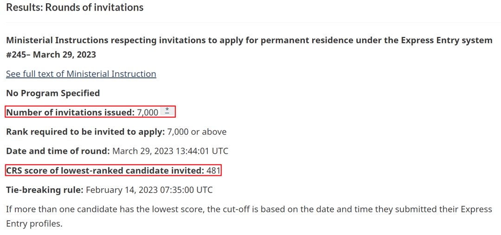 (原始链接: https://mmbiz.qpic.cn/mmbiz_png/904kUibXm7Y5wHwKL4nJJZkzLGeQlBG1qjiahpkl6sexaWL3mXHoNQyPicXYZS2UeF65j3P0TcvfEEZEde9GtJqlw/640?wx_fmt=png)
- 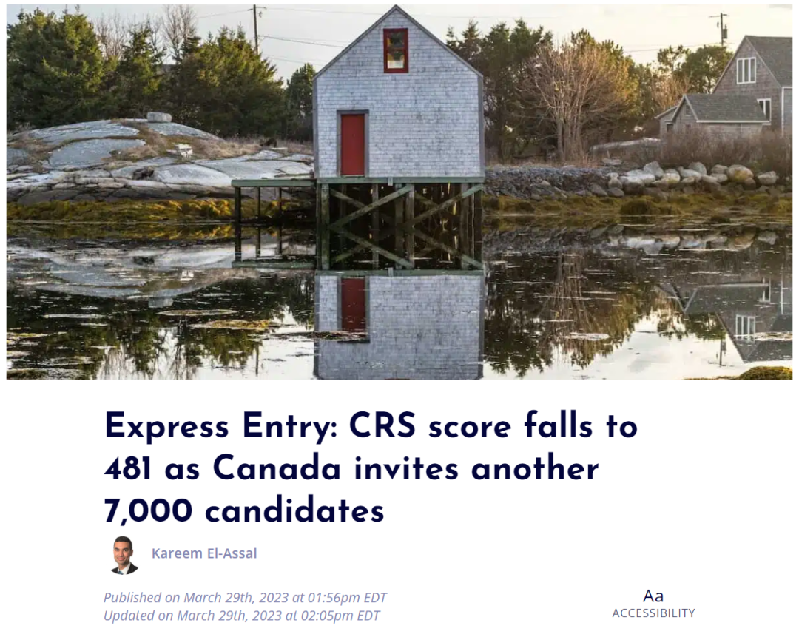 (原始链接: https://mmbiz.qpic.cn/mmbiz_png/904kUibXm7Y5wHwKL4nJJZkzLGeQlBG1qM3ScJhg24gUzQxdN6UQnnTB2aUmgcoZDX0GTEf9ibogQdfGqQH1mc9A/640?wx_fmt=png)
- 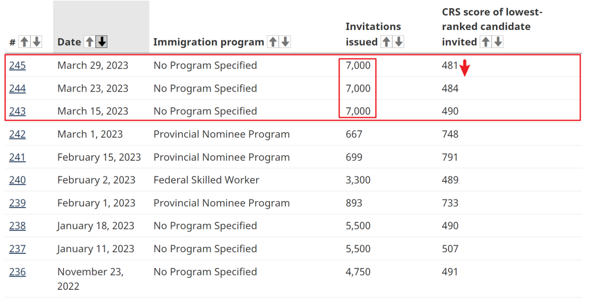 (原始链接: https://mmbiz.qpic.cn/mmbiz_png/904kUibXm7Y5wHwKL4nJJZkzLGeQlBG1qwqUupc5pwOKjztn6blWicAtYhSKOS0tibuzUUbMrJ9RdSTcfA8HbicKkA/640?wx_fmt=png)
- 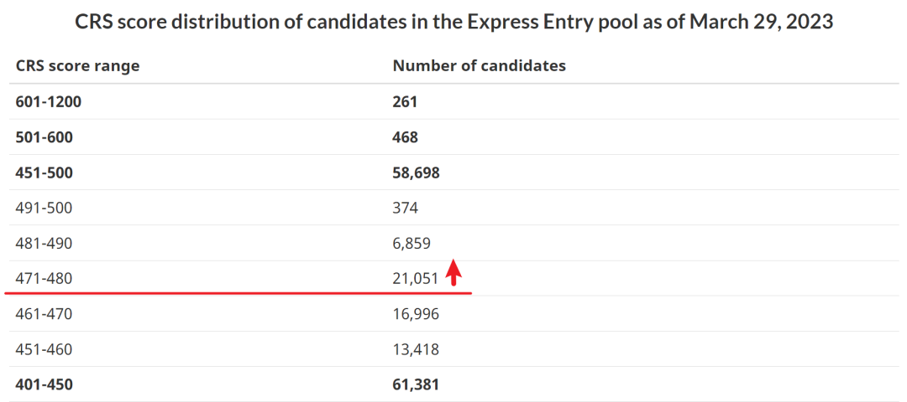 (原始链接: https://mmbiz.qpic.cn/mmbiz_png/904kUibXm7Y5wHwKL4nJJZkzLGeQlBG1qiaUxj7gT6HuKVTia7wKxCrBrTJvdhvZLz4mAIOoOJ7dxAIDkhxrJ0gjQ/640?wx_fmt=png)
-  (原始链接: https://mmbiz.qpic.cn/mmbiz_png/904kUibXm7Y5wHwKL4nJJZkzLGeQlBG1qVwgvwE9LRvQ7c8St6LUicNJv1KjghJfCOBoLJ5LU096fYicfrAupcKdQ/640?wx_fmt=png)
-  (原始链接: https://mmbiz.qpic.cn/mmbiz_jpg/904kUibXm7Y5wHwKL4nJJZkzLGeQlBG1qoE63MFlpJoicBXSubia9aFu1CiaGpcc12zz9xEwjicHavtwZibPoOYMUw7g/640?wx_fmt=jpeg)
- 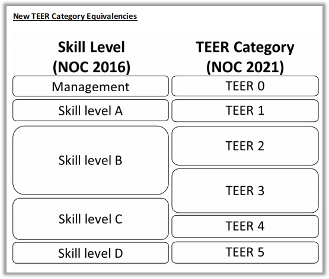 (原始链接: https://mmbiz.qpic.cn/mmbiz_png/904kUibXm7Y5wHwKL4nJJZkzLGeQlBG1q2USiarhoCQmR0ibvjPOtS1lOSatvJ5sjnG2iclEDgBFbflmeiadJ9NLMEA/640?wx_fmt=png)
- 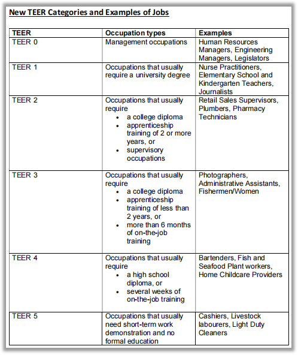 (原始链接: https://mmbiz.qpic.cn/mmbiz_png/904kUibXm7Y5wHwKL4nJJZkzLGeQlBG1qQh2mMII4SX8jpDBwVtecWqYVIuobpdU28cyOTPjc5GtXpS72aVcICw/640?wx_fmt=png)
- 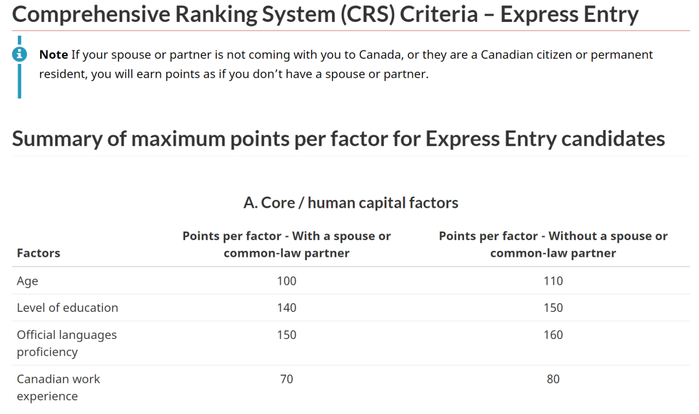 (原始链接: https://mmbiz.qpic.cn/mmbiz_png/904kUibXm7Y5wHwKL4nJJZkzLGeQlBG1qF0iakRfvkFmUyKed3wAamk3kdytjK67gico9icGgUibCiciaIum99qFXf9wA/640?wx_fmt=png)
- 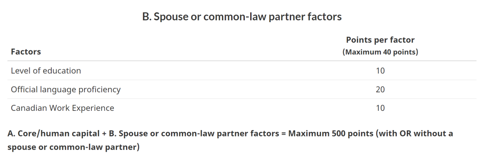 (原始链接: https://mmbiz.qpic.cn/mmbiz_png/904kUibXm7Y5wHwKL4nJJZkzLGeQlBG1q6cnWC2DxylFpb1KUDwsVGj1icFGmtpCn1D8Uj8ZCkLPVXud11sUicYEw/640?wx_fmt=png)
- 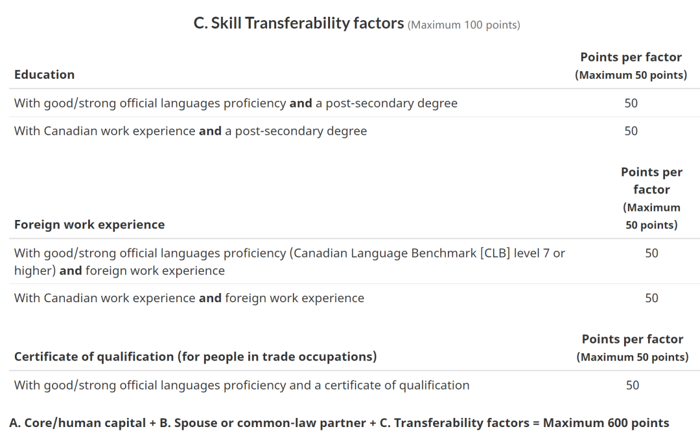 (原始链接: https://mmbiz.qpic.cn/mmbiz_png/904kUibXm7Y5wHwKL4nJJZkzLGeQlBG1qAMMiaDn4gzhyGhou1bx5nrWm5B7DV5d757iaicAYpDrMsNgqkYSOiaGKhw/640?wx_fmt=png)
- 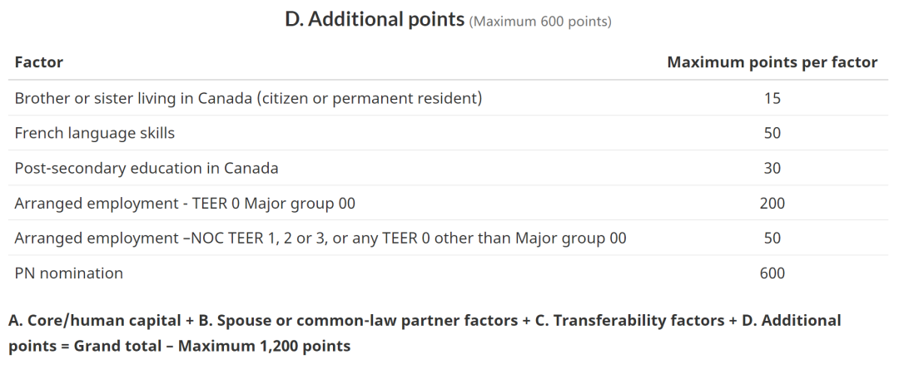 (原始链接: https://mmbiz.qpic.cn/mmbiz_png/904kUibXm7Y5wHwKL4nJJZkzLGeQlBG1qkzDjtMvDNib1u6zqYuPa0NmMExYmyRo78rRDfUzeicibicaPoUeOOicDyKw/640?wx_fmt=png)
-  (原始链接: https://mmbiz.qpic.cn/mmbiz_png/904kUibXm7Y5wHwKL4nJJZkzLGeQlBG1qm0NUrgdaNibLMiaicKib3gpkqOpOstTbZKDTgLjgWxnnr9jAmmiafkJRK3Q/640?wx_fmt=png)
-  (原始链接: https://mmbiz.qpic.cn/mmbiz_jpg/904kUibXm7Y5wHwKL4nJJZkzLGeQlBG1qfdNG2yibkXibMt8OfK3ic9ZKnhiaIkRR6kxnw1YrWI93S3lQvicKV4zDUuA/640?wx_fmt=jpeg)
- 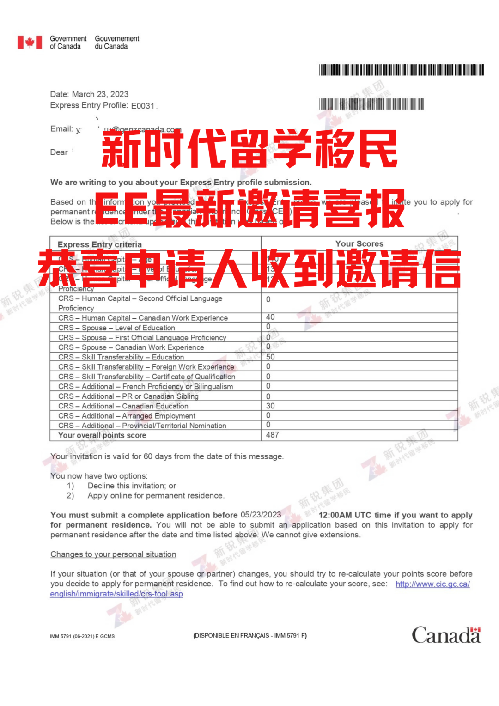 (原始链接: https://mmbiz.qpic.cn/mmbiz_png/904kUibXm7Y5wHwKL4nJJZkzLGeQlBG1qyrVG9wg9KuDIyEJkmEQVBVpXzYU9gchLzuVNaq5bDj5kqibJVWnuZHw/640?wx_fmt=png)
- 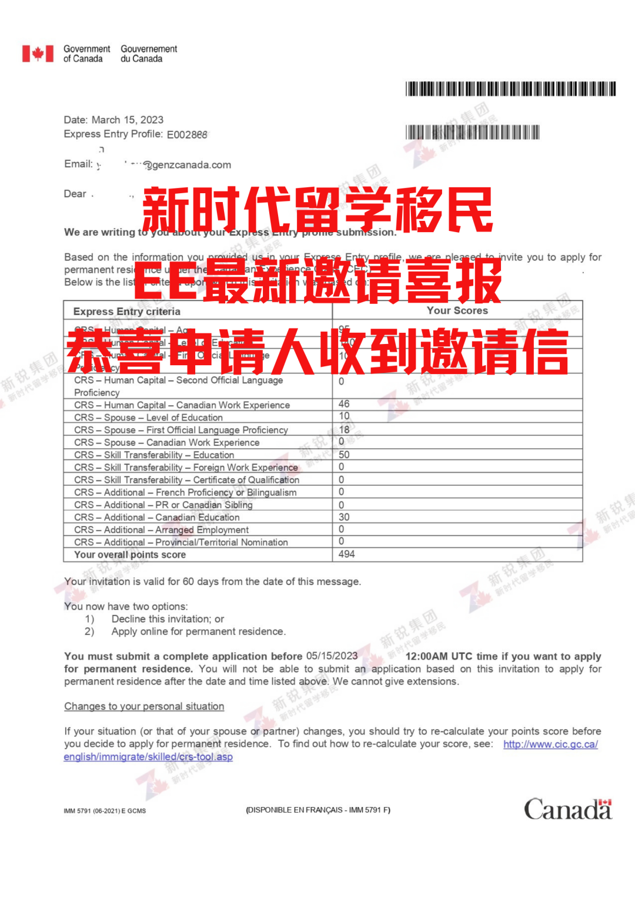 (原始链接: https://mmbiz.qpic.cn/mmbiz_png/904kUibXm7Y5wHwKL4nJJZkzLGeQlBG1qmblEpPkzeYy17Xx39iboKLKr5XjbhSsDIVyMvAunTD7I1pf0lUbbKibA/640?wx_fmt=png)
- 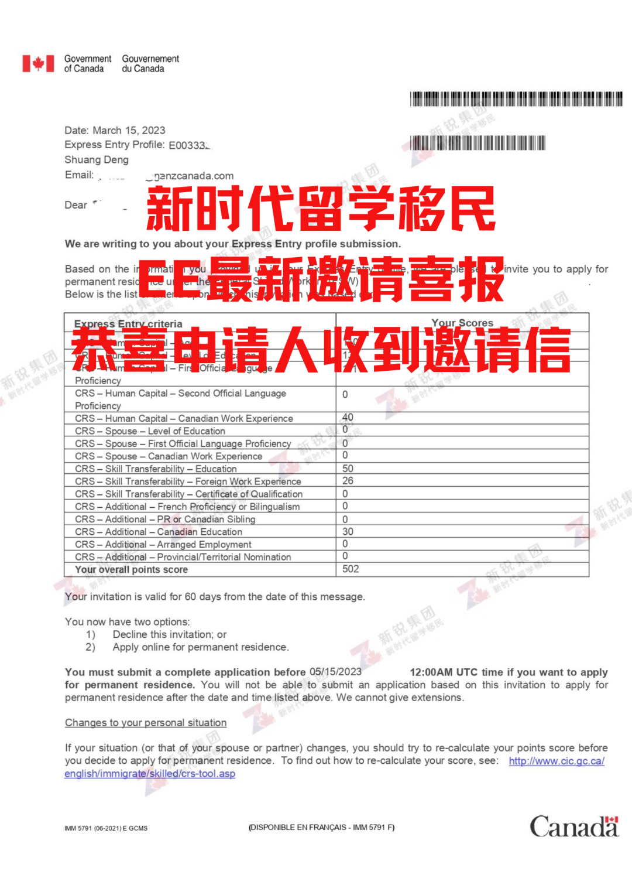 (原始链接: https://mmbiz.qpic.cn/mmbiz_png/904kUibXm7Y5wHwKL4nJJZkzLGeQlBG1qsV7icpYasmTSfUUn7fUlns7oxevyL3HzoUXlA4JYsm8v7gmm34htT4Q/640?wx_fmt=png)
-  (原始链接: https://mmbiz.qpic.cn/mmbiz_png/904kUibXm7Y5wHwKL4nJJZkzLGeQlBG1qgxpKqxDypgTvJhsr2P5eDibmzaGAIFKpOevLS7y0gmvqPULlicv8aNXw/640?wx_fmt=png)
-  (原始链接: https://mmbiz.qpic.cn/mmbiz_png/904kUibXm7Y5wHwKL4nJJZkzLGeQlBG1q2ZF7YlTCnwurXaVMdtibgStyamEkyfoXqVpnicWYoSEMdCFWMEWuRJNQ/640?wx_fmt=png)
-  (原始链接: https://mmbiz.qpic.cn/mmbiz_png/904kUibXm7Y5wHwKL4nJJZkzLGeQlBG1qj6AGuYibdy6ibaKL6he8BIhrgSbIkGicVuS3c6EamuJX2SqYXyicxwWyBw/640?wx_fmt=png)
-  (原始链接: https://mmbiz.qpic.cn/mmbiz_png/904kUibXm7Y5wHwKL4nJJZkzLGeQlBG1qgxpKqxDypgTvJhsr2P5eDibmzaGAIFKpOevLS7y0gmvqPULlicv8aNXw/640?wx_fmt=png)
- 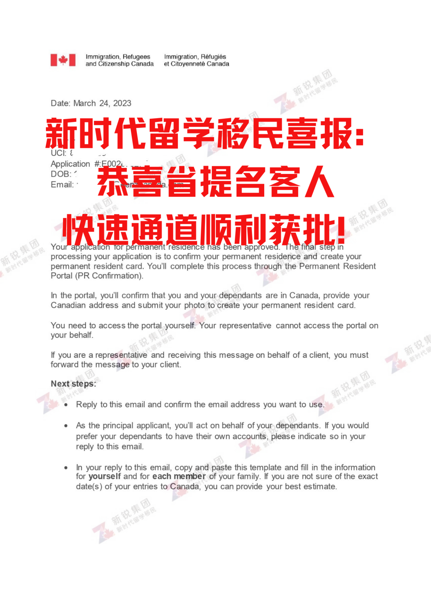 (原始链接: https://mmbiz.qpic.cn/mmbiz_png/904kUibXm7Y5wHwKL4nJJZkzLGeQlBG1qqiajBHCPtXaY3SKo6mO2ax0ymLECao3syyypl1tLjicxIQHtmjtCAsGQ/640?wx_fmt=png)
- 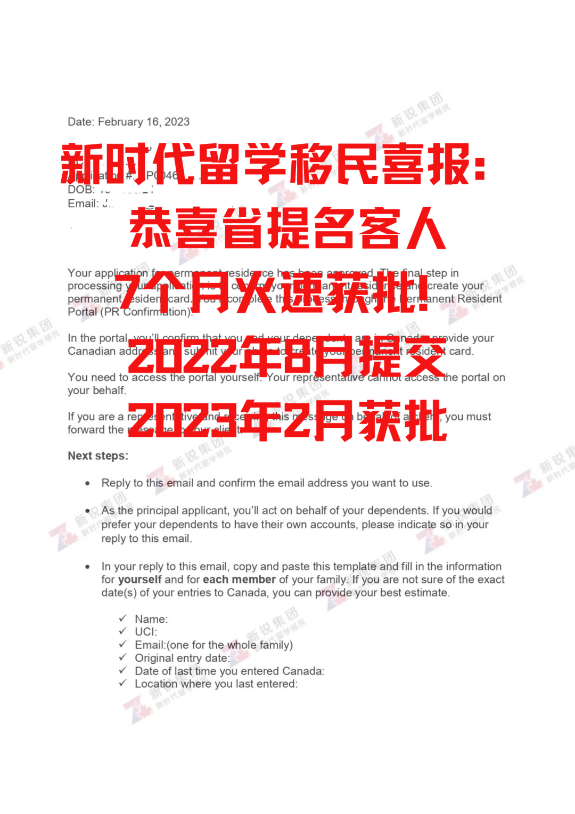 (原始链接: https://mmbiz.qpic.cn/mmbiz_png/904kUibXm7Y5wHwKL4nJJZkzLGeQlBG1qicCcdt10U2zatCRWg4ptUMLicthJghN1IiaDYLRdTyFdNGh5uibWCEUqUQ/640?wx_fmt=png)
-  (原始链接: https://mmbiz.qpic.cn/mmbiz_png/904kUibXm7Y5wHwKL4nJJZkzLGeQlBG1qgxpKqxDypgTvJhsr2P5eDibmzaGAIFKpOevLS7y0gmvqPULlicv8aNXw/640?wx_fmt=png)
- 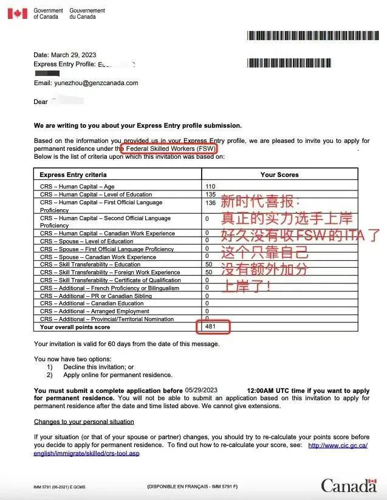 (原始链接: https://mmbiz.qpic.cn/mmbiz_jpg/904kUibXm7Y5wHwKL4nJJZkzLGeQlBG1qlZibBeN0qEkEXpYPvhWQoFCtnMBKZDUIfMLmlufHrQe6Y68qogj6Hgg/640?wx_fmt=jpeg)
-  (原始链接: https://mmbiz.qpic.cn/mmbiz_png/904kUibXm7Y5wHwKL4nJJZkzLGeQlBG1qgxpKqxDypgTvJhsr2P5eDibmzaGAIFKpOevLS7y0gmvqPULlicv8aNXw/640?wx_fmt=png)
- 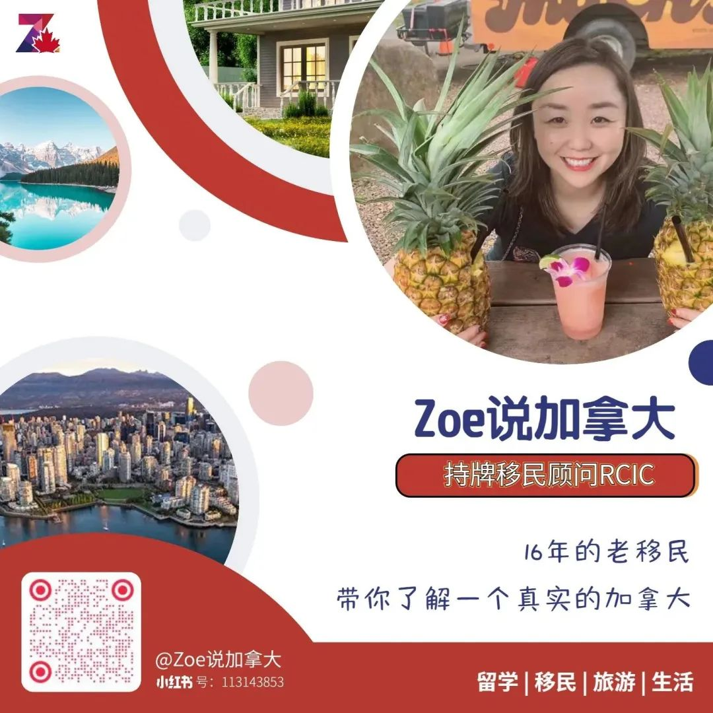 (原始链接: https://mmbiz.qpic.cn/mmbiz_jpg/904kUibXm7Y5wHwKL4nJJZkzLGeQlBG1qTKklTXZ5PTfRGC0t9mEXz9afIVDSPh63EAdcf54ib4evpaujngtyEibA/640?wx_fmt=jpeg)
-  (原始链接: https://mmbiz.qpic.cn/mmbiz_png/904kUibXm7Y5wHwKL4nJJZkzLGeQlBG1q5MasSib3ENKjK1JlxCFsy1BBia4gfKtrvgJqk2G5wcnE8zsM9sZyte3A/640?wx_fmt=png)
-  (原始链接: https://mmbiz.qpic.cn/mmbiz_jpg/904kUibXm7Y5wHwKL4nJJZkzLGeQlBG1q7GECjmwDffRuzD2vMNFCBrRqOH3Vf1abFuibnUCAM9IKpRib6P5z0LwA/640?wx_fmt=jpeg)
-  (原始链接: https://mmbiz.qpic.cn/mmbiz_jpg/904kUibXm7Y5wHwKL4nJJZkzLGeQlBG1qD6Rf1d8GdhjmGt7qYLibKWVfdicd5xHsBhAtWhbrwlrK6USwblFkfBjA/640?wx_fmt=jpeg)
-  (原始链接: https://mmbiz.qpic.cn/mmbiz_jpg/904kUibXm7Y5wHwKL4nJJZkzLGeQlBG1qhcHb7hmoW6sQdrWXAS2sfpB5iayydrCTod0nhiatibNsKvkKSxgFgs6OA/640?wx_fmt=jpeg)
