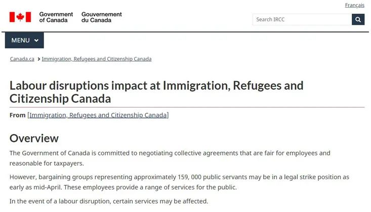
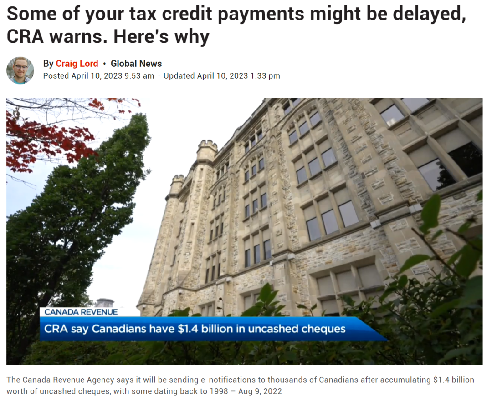
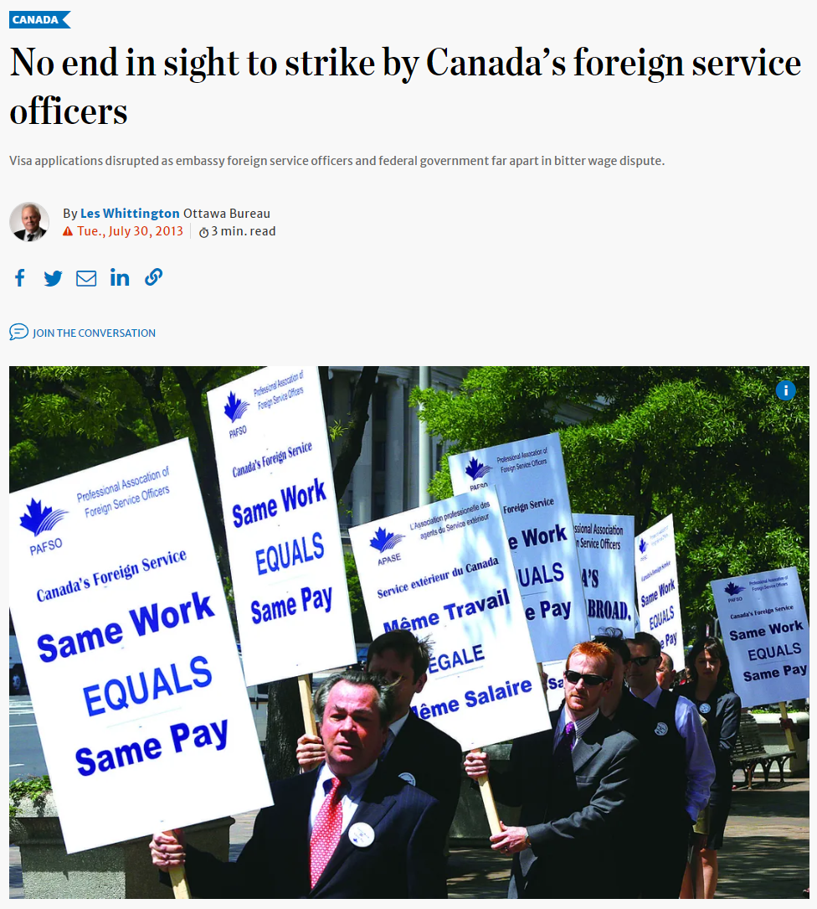

# 无标题

**链接地址:** http://mp.weixin.qq.com/s?__biz=MzUyNzA2NTAwNg==&mid=2247493715&idx=1&sn=52cdb7b597faf91731cba3acbc6c821d&chksm=fa07e292cd706b847f1eaa8f890e7a4d9bec8ea7a1ed34d5857cb6f9a3a69283049570acdeef&mpshare=1&scene=2&srcid=04128JSVoumuJHfoEaqt82xS&sharer_sharetime=1681246462755&sharer_shareid=77848a6b3852ae4dcb6c74ffee84743c#rd
**作者:** 你身边的签证专家
**获取时间:** 2025/8/28 19:12:20
**图片数量:** 14

---

## 原始HTML内容

<section style="box-sizing: border-box;font-size: 16px;"><section style="text-align: center;margin-top: 10px;margin-bottom: 10px;line-height: 0;box-sizing: border-box;" powered-by="xiumi.us"><section style="max-width: 100%;vertical-align: middle;display: inline-block;line-height: 0;box-sizing: border-box;"></section></section><section style="text-align: center;margin-top: 10px;margin-bottom: 10px;line-height: 0;box-sizing: border-box;" powered-by="xiumi.us"><section style="max-width: 100%;vertical-align: middle;display: inline-block;line-height: 0;box-sizing: border-box;"></section></section>
 
<section style="font-size: 19px;text-align: center;margin-top: 10px;margin-bottom: 3px;box-sizing: border-box;" powered-by="xiumi.us"><section style="display: inline-block;border-width: 1px;border-style: solid;border-color: rgb(188, 65, 65);background-color: rgb(188, 65, 65);width: 1.8em;height: 1.8em;line-height: 1.8em;border-radius: 100%;margin-left: auto;margin-right: auto;font-size: 16px;color: rgb(255, 255, 255);box-sizing: border-box;">
<strong style="box-sizing: border-box;">1</strong>
</section></section><section style="text-align: center;box-sizing: border-box;" powered-by="xiumi.us"><section style="display: inline-block;width: 0px;height: 0px;vertical-align: top;overflow: hidden;border-style: solid;border-width: 9px 6px 0px;border-color: rgb(188, 65, 65) rgba(255, 255, 255, 0) rgba(255, 255, 255, 0);box-sizing: border-box;"><svg viewBox="0 0 1 1" style="float:left;line-height:0;width:0;vertical-align:top;"></svg></section></section><section style="margin-bottom: 10px;text-align: center;justify-content: center;display: flex;flex-flow: row nowrap;box-sizing: border-box;" powered-by="xiumi.us"><section style="display: inline-block;width: auto;vertical-align: middle;background-color: rgba(109, 155, 209, 0.1);min-width: 10%;max-width: 100%;flex: 0 0 auto;height: auto;align-self: center;padding: 12px;box-sizing: border-box;"><section style="color: rgb(109, 155, 209);text-align: justify;box-sizing: border-box;" powered-by="xiumi.us">
<strong style="box-sizing: border-box;">加拿大16万公务员准备罢工</strong>
</section></section></section><section style="font-size: 14px;padding-right: 15px;padding-left: 15px;letter-spacing: 1px;box-sizing: border-box;" powered-by="xiumi.us">
 

加拿大移民部（IRCC）近日发布了一份新闻稿，称代表大约<strong style="box-sizing: border-box;">159,000名公务员的谈判团体最早可能在4月中旬处于合法罢工状态</strong>。这些员工为公众提供一系列服务，如果发生劳动力中断，<strong style="box-sizing: border-box;">某些服务可能会受到影响</strong>。

 
</section><section style="text-align: center;margin-top: 10px;margin-bottom: 10px;line-height: 0;box-sizing: border-box;" powered-by="xiumi.us"><section style="max-width: 100%;vertical-align: middle;display: inline-block;line-height: 0;width: 90%;height: auto;box-sizing: border-box;"></section></section><section style="font-size: 14px;padding-right: 15px;padding-left: 15px;letter-spacing: 1px;box-sizing: border-box;" powered-by="xiumi.us">
 

新闻稿称，在劳工中断的情况下，一些移民部服务将继续提供。

 

<strong style="box-sizing: border-box;">仍然可以提供的服务:</strong>

<strong style="box-sizing: border-box;"> </strong>
<ul class="list-paddingleft-1" style="padding-left: 40px;list-style-position: outside;"><li style="box-sizing: border-box;">
在线申请
</li><li style="box-sizing: border-box;">
邮寄申请到IRCC
</li><li style="box-sizing: border-box;">
使用网上帐户
</li><li style="box-sizing: border-box;">
使用一些紧急服务
</li></ul>
 

<strong style="box-sizing: border-box;">这些服务由非政府组织提供，仍可提供:</strong>

<strong style="box-sizing: border-box;"> </strong>
<ul class="list-paddingleft-1" style="padding-left: 40px;list-style-position: outside;"><li style="box-sizing: border-box;">
合作伙伴机构的结算服务
</li><li style="box-sizing: border-box;">
通过临时联邦健康计划提供医疗保健
</li><li style="box-sizing: border-box;">
加拿大以外的签证申请中心
</li></ul>
 

与加拿大政府的大多数服务一样，一旦出现劳工中断，大多数移民部服务将受到影响。应该预料到<strong style="box-sizing: border-box;">以下情况会有延迟:</strong> 

<strong style="box-sizing: border-box;"> </strong>
<ul class="list-paddingleft-1" style="padding-left: 40px;list-style-position: outside;"><li style="box-sizing: border-box;">
处理申请程序
</li><li style="box-sizing: border-box;">
当面的预约或包括公民入籍仪式在内的活动
</li><li style="box-sizing: border-box;">
通过电子邮件、电话或社交媒体联系IRCC
</li><li style="box-sizing: border-box;">
领事公民身份和护照服务
</li><li style="box-sizing: border-box;">
加拿大护照服务
</li></ul>
 

更多关于罢工的消息和影响可随时关注<strong style="box-sizing: border-box;">官网的更新</strong>：

<em style="box-sizing: border-box;">https://www.canada.ca/en/immigration-refugees-citizenship/labour-disruptions.html</em>

 
</section>
 
<section style="font-size: 19px;text-align: center;margin-top: 10px;margin-bottom: 3px;box-sizing: border-box;" powered-by="xiumi.us"><section style="display: inline-block;border-width: 1px;border-style: solid;border-color: rgb(188, 65, 65);background-color: rgb(188, 65, 65);width: 1.8em;height: 1.8em;line-height: 1.8em;border-radius: 100%;margin-left: auto;margin-right: auto;font-size: 16px;color: rgb(255, 255, 255);box-sizing: border-box;">
<strong style="box-sizing: border-box;">2</strong>
</section></section><section style="text-align: center;box-sizing: border-box;" powered-by="xiumi.us"><section style="display: inline-block;width: 0px;height: 0px;vertical-align: top;overflow: hidden;border-style: solid;border-width: 9px 6px 0px;border-color: rgb(188, 65, 65) rgba(255, 255, 255, 0) rgba(255, 255, 255, 0);box-sizing: border-box;"><svg viewBox="0 0 1 1" style="float:left;line-height:0;width:0;vertical-align:top;"></svg></section></section><section style="margin-bottom: 10px;text-align: center;justify-content: center;display: flex;flex-flow: row nowrap;box-sizing: border-box;" powered-by="xiumi.us"><section style="display: inline-block;width: auto;vertical-align: middle;background-color: rgba(109, 155, 209, 0.1);min-width: 10%;max-width: 100%;flex: 0 0 auto;height: auto;align-self: center;padding: 12px;box-sizing: border-box;"><section style="color: rgb(109, 155, 209);text-align: justify;box-sizing: border-box;" powered-by="xiumi.us">
<strong style="box-sizing: border-box;">税务局员工本周五开始罢工</strong>
</section></section></section><section style="font-size: 14px;padding-right: 15px;padding-left: 15px;letter-spacing: 1px;box-sizing: border-box;" powered-by="xiumi.us">
 

但移民部并不是这次罢工群体中的主力军。就在上周五，据CTV报道代表<strong style="box-sizing: border-box;">35,000名加拿大税务局(CRA)服务人员</strong>的工会以“压倒性”投票决定于<strong style="box-sizing: border-box;">4月14日（本周五）开始罢工。</strong>

 

从14日开始，在CRA工作的工会成员将处于合法罢工状态。EJ税务服务公司总统的拉尔斯·乔根森告诉CTV新闻，罢工可能会导致加拿大人需要<strong style="box-sizing: border-box;">在5月1日的最后期限前提交2022年税收</strong>。

 
</section><section style="text-align: center;margin-top: 10px;margin-bottom: 10px;line-height: 0;box-sizing: border-box;" powered-by="xiumi.us"><section style="max-width: 100%;vertical-align: middle;display: inline-block;line-height: 0;width: 90%;height: auto;box-sizing: border-box;"></section></section><section style="font-size: 14px;padding-right: 15px;padding-left: 15px;letter-spacing: 1px;box-sizing: border-box;" powered-by="xiumi.us">
 

加拿大公共服务联盟 (PSAC) 下属的税务雇员工会(UTE)全国主席Marc Brière表示:“随着通胀飙升，我们的成员正进一步落后。我们诚心诚意地谈判，但我们的成员已经受够了。”

 

CRA发表声明表示，它“尊重集体谈判过程”，并承认工会雇员从事罢工活动的权利。

 
</section><section style="text-align: center;margin-top: 10px;margin-bottom: 10px;line-height: 0;box-sizing: border-box;" powered-by="xiumi.us"><section style="max-width: 100%;vertical-align: middle;display: inline-block;line-height: 0;box-sizing: border-box;"></section></section><section style="font-size: 14px;padding-right: 15px;padding-left: 15px;letter-spacing: 1px;box-sizing: border-box;" powered-by="xiumi.us">
 

他们将继续与PSAC和UTE进行”有意义的谈判”，希望正式达成协议，双方<strong style="box-sizing: border-box;">将在4月17日至20日重新展开谈判</strong>。

 

不过近日，加拿大税务局(CRA)透露，出现了一个<strong style="box-sizing: border-box;">“</strong><strong style="box-sizing: border-box;">技术问题”</strong><strong style="box-sizing: border-box;">导致一些加拿大人无法收到福利付款</strong>。

 

CRA周日在Twitter上发布了一份分为四部分的通知。技术问题主要影响了<strong style="box-sizing: border-box;">GST/HST退税和安省低收入补贴</strong>（Ontario Trillium Benefit）。

 
</section><section style="text-align: center;margin-top: 10px;margin-bottom: 10px;line-height: 0;box-sizing: border-box;" powered-by="xiumi.us"><section style="max-width: 100%;vertical-align: middle;display: inline-block;line-height: 0;width: 90%;height: auto;box-sizing: border-box;"></section></section><section style="font-size: 14px;padding-right: 15px;padding-left: 15px;letter-spacing: 1px;box-sizing: border-box;" powered-by="xiumi.us">
 

CRA表示:“我们正处于解决模式，目前正在努力工作，以尽快向受影响的加拿大人发放款项。”

 

它还证实，签署直接存款协议的加拿大人有望<strong style="box-sizing: border-box;">最早于2023年4月14日收到付款</strong>。付款方式选择为支票的将于下星期开始收到。

 

目前还不清楚技术问题是否与罢工有关，但毫无疑问，罢工发生在一个不幸的时间——<strong style="box-sizing: border-box;">报税季</strong>。还没报税的朋友要抓紧了！

 

 
</section><section style="font-size: 19px;text-align: center;margin-top: 10px;margin-bottom: 3px;box-sizing: border-box;" powered-by="xiumi.us"><section style="display: inline-block;border-width: 1px;border-style: solid;border-color: rgb(188, 65, 65);background-color: rgb(188, 65, 65);width: 1.8em;height: 1.8em;line-height: 1.8em;border-radius: 100%;margin-left: auto;margin-right: auto;font-size: 16px;color: rgb(255, 255, 255);box-sizing: border-box;">
<strong style="box-sizing: border-box;">3</strong>
</section></section><section style="text-align: center;box-sizing: border-box;" powered-by="xiumi.us"><section style="display: inline-block;width: 0px;height: 0px;vertical-align: top;overflow: hidden;border-style: solid;border-width: 9px 6px 0px;border-color: rgb(188, 65, 65) rgba(255, 255, 255, 0) rgba(255, 255, 255, 0);box-sizing: border-box;"><svg viewBox="0 0 1 1" style="float:left;line-height:0;width:0;vertical-align:top;"></svg></section></section><section style="margin-bottom: 10px;text-align: center;justify-content: center;display: flex;flex-flow: row nowrap;box-sizing: border-box;" powered-by="xiumi.us"><section style="display: inline-block;width: auto;vertical-align: middle;background-color: rgba(109, 155, 209, 0.1);min-width: 10%;max-width: 100%;flex: 0 0 auto;height: auto;align-self: center;padding: 12px;box-sizing: border-box;"><section style="color: rgb(109, 155, 209);text-align: justify;box-sizing: border-box;" powered-by="xiumi.us">
<strong style="box-sizing: border-box;">时隔十年移民部再罢工</strong>
</section></section></section><section style="font-size: 14px;padding-right: 15px;padding-left: 15px;letter-spacing: 1px;box-sizing: border-box;" powered-by="xiumi.us">
 

2013年6月，加拿大发生<strong style="box-sizing: border-box;">史上第一次移民官集体罢工</strong>。当时在中国、印度等高申请地区的移民官，从6月10日开始决定不再审批各类签证申请，并开始造成申请延误。 

 
</section><section style="text-align: center;margin-top: 10px;margin-bottom: 10px;line-height: 0;box-sizing: border-box;" powered-by="xiumi.us"><section style="max-width: 100%;vertical-align: middle;display: inline-block;line-height: 0;width: 90%;height: auto;box-sizing: border-box;"></section></section><section style="font-size: 14px;padding-right: 15px;padding-left: 15px;letter-spacing: 1px;box-sizing: border-box;" powered-by="xiumi.us">
 

移民部在6月11日在网上张贴有关罢工行动的通知，告知申请人说：加拿大移民官所属的<strong style="box-sizing: border-box;">加拿大外国服务官员专业协会(PAFSO)正在罢工</strong>，在加拿大境内及海外各地负责处理临时居民及永久居民签证申请的官员，已经陆续罢工，并建议申请人：任何准备申请签证的人士，<strong style="box-sizing: border-box;">均要预期申请被延误</strong>，并尽可能<strong style="box-sizing: border-box;">提前送出申请，以避免长时间延误</strong>。

 

为争取<strong style="box-sizing: border-box;">同工同酬</strong>，加拿大外交事务的员工从6月6日起开始陆续展开罢工行动，负责移民审批的官员属于同一工会。罢工期间，仍有职员处理必要事务，但一些<strong style="box-sizing: border-box;">移民申请、贸易谈判等工作却受到影响</strong>。

 
</section><section style="text-align: center;margin-top: 10px;margin-bottom: 10px;line-height: 0;box-sizing: border-box;" powered-by="xiumi.us"><section style="max-width: 100%;vertical-align: middle;display: inline-block;line-height: 0;width: 90%;height: auto;box-sizing: border-box;"></section></section><section style="font-size: 14px;padding-right: 15px;padding-left: 15px;letter-spacing: 1px;box-sizing: border-box;" powered-by="xiumi.us">
 

此外，2021年疫情刚出现转机时，加拿大<strong style="box-sizing: border-box;">公共服务联盟及海关和移民工会宣布也举行过一次小型罢工</strong>。7月27日，加拿大公共服务联盟及海关和移民工会宣布于8月6日举行罢工。这致使加拿大政府<strong style="box-sizing: border-box;">重新开放国境的计划受到直接影响</strong>。

 

工会警告说，罢工将给加拿大的进出口货物流通、服务和人员往来造成严重影响。同时，境内外的邮件往来和关税缴纳也将受到影响。 

 

加拿大公共服务联盟及海关和移民工会主要由<strong style="box-sizing: border-box;">边境服务局的5500名雇员和2000名总部工作人员组成</strong>，另外还有一些加拿大邮政局的工作人员和内陆执法人员。

 
</section><section style="font-size: 19px;text-align: center;margin-top: 10px;margin-bottom: 3px;box-sizing: border-box;" powered-by="xiumi.us"><section style="display: inline-block;border-width: 1px;border-style: solid;border-color: rgb(188, 65, 65);background-color: rgb(188, 65, 65);width: 1.8em;height: 1.8em;line-height: 1.8em;border-radius: 100%;margin-left: auto;margin-right: auto;font-size: 16px;color: rgb(255, 255, 255);box-sizing: border-box;">
<strong style="box-sizing: border-box;">4</strong>
</section></section><section style="text-align: center;box-sizing: border-box;" powered-by="xiumi.us"><section style="display: inline-block;width: 0px;height: 0px;vertical-align: top;overflow: hidden;border-style: solid;border-width: 9px 6px 0px;border-color: rgb(188, 65, 65) rgba(255, 255, 255, 0) rgba(255, 255, 255, 0);box-sizing: border-box;"><svg viewBox="0 0 1 1" style="float:left;line-height:0;width:0;vertical-align:top;"></svg></section></section><section style="margin-bottom: 10px;text-align: center;justify-content: center;display: flex;flex-flow: row nowrap;box-sizing: border-box;" powered-by="xiumi.us"><section style="display: inline-block;width: auto;vertical-align: middle;background-color: rgba(109, 155, 209, 0.1);min-width: 10%;max-width: 100%;flex: 0 0 auto;height: auto;align-self: center;padding: 12px;box-sizing: border-box;"><section style="color: rgb(109, 155, 209);text-align: justify;box-sizing: border-box;" powered-by="xiumi.us">
<strong style="box-sizing: border-box;">提前规划，将罢工影响考虑近自己的计划</strong>
</section></section></section><section style="font-size: 14px;padding-right: 15px;padding-left: 15px;letter-spacing: 1px;box-sizing: border-box;" powered-by="xiumi.us">
 

相较于前几次罢工，本次涉及十六万公务员的集体罢工确实声势浩大，前所未有。尽管加拿大联邦政府刚刚允诺提升联邦雇员的<strong style="box-sizing: border-box;">最低工资到16.65加元/小时</strong>，但依然没能阻挡罢工情绪的蔓延。没人说得清这样大规模的罢工会对加拿大社会运转造成多大危害，这对普通民众的<strong style="box-sizing: border-box;">影响将是方方面面</strong>的。

 

移民部方面，除提交申请外，申请人所关心的案件审理、联系移民部等服务均受到不同程度影响，这是加国移民部继新冠疫情、乌克兰战争、阿富汗难民事件后再次<strong style="box-sizing: border-box;">合法延长审理周期</strong>，使原本饱受审批拖延困扰的申请人的加国身份状况<strong style="box-sizing: border-box;">雪上加霜</strong>。

 
</section><section style="text-align: center;margin-top: 10px;margin-bottom: 10px;line-height: 0;box-sizing: border-box;" powered-by="xiumi.us"><section style="max-width: 100%;vertical-align: middle;display: inline-block;line-height: 0;box-sizing: border-box;"></section></section><section style="font-size: 14px;padding-right: 15px;padding-left: 15px;letter-spacing: 1px;box-sizing: border-box;" powered-by="xiumi.us">
 

申请签证的朋友们要<strong style="box-sizing: border-box;">做好心理准备</strong>，等待签证审理结果有可能会比预期时间更慢些。希望政府大面积罢工能尽早结束！

 

另外，各位加拿大的朋友们也<strong style="box-sizing: border-box;">请尽早完成报税</strong>，避免受加拿大税务局员工的罢工影响，要知道即便发生罢工，报税的最后期限也不可能延长到5月1日以后。尽早处理完报税事宜也可以早一点获得退税和其他福利的累计，不要变成<strong style="box-sizing: border-box;">“技术问题”</strong>的牺牲品！

 

 
</section><section style="text-align: left;justify-content: flex-start;display: flex;flex-flow: row nowrap;margin-top: 10px;box-sizing: border-box;" powered-by="xiumi.us"><section style="display: inline-block;vertical-align: top;width: auto;align-self: stretch;flex: 0 0 auto;background-color: rgb(188, 65, 65);min-width: 5%;max-width: 100%;height: auto;padding-top: 9px;padding-right: 9px;padding-left: 20px;box-sizing: border-box;"><section style="text-align: justify;font-size: 18px;color: rgb(252, 252, 252);box-sizing: border-box;" powered-by="xiumi.us">
<strong style="box-sizing: border-box;">阅读更多</strong>
</section></section><section style="display: inline-block;vertical-align: top;width: auto;min-width: 5%;max-width: 100%;flex: 0 0 auto;height: auto;align-self: stretch;box-sizing: border-box;"><section style="box-sizing: border-box;" powered-by="xiumi.us"><section style="display: inline-block;width: 0px;height: 0px;vertical-align: top;overflow: hidden;border-style: solid;border-width: 45px 0px 0px 19px;border-color: rgba(255, 255, 255, 0) rgba(255, 255, 255, 0) rgba(255, 255, 255, 0) rgb(188, 65, 65);box-sizing: border-box;"><svg viewBox="0 0 1 1" style="float:left;line-height:0;width:0;vertical-align:top;"></svg></section></section></section></section><section style="margin-bottom: 10px;box-sizing: border-box;" powered-by="xiumi.us"><section style="background-color: rgb(188, 65, 65);height: 3px;box-sizing: border-box;"><svg viewBox="0 0 1 1" style="float:left;line-height:0;width:0;vertical-align:top;"></svg></section></section><section style="margin: 10px 0%;text-align: left;justify-content: flex-start;display: flex;flex-flow: row nowrap;box-sizing: border-box;" powered-by="xiumi.us"><section style="display: inline-block;width: 100%;vertical-align: top;background-position: 41.4412% 63.3022%;background-repeat: repeat;background-size: 103.375%;background-attachment: scroll;padding: 30px;align-self: flex-start;flex: 0 0 auto;background-image: url(&quot;https://mmbiz.qpic.cn/mmbiz_png/904kUibXm7Y4g9Cr2mCh9aOc0m7DuiaE7M4eAMH9dwwdKibSEkjz65n1WssUMc9VsAGia5ck5wPur3IFz8oc22TbEg/640?wx_fmt=png&quot;);box-sizing: border-box;"><section style="text-align: justify;justify-content: flex-start;display: flex;flex-flow: row nowrap;box-sizing: border-box;" powered-by="xiumi.us"><section style="display: inline-block;width: 100%;vertical-align: top;background-color: rgba(188, 65, 65, 0.22);padding: 10px;border-width: 0px;border-style: none;border-color: rgb(62, 62, 62);align-self: flex-start;flex: 0 0 auto;box-sizing: border-box;"><section style="text-align: center;color: rgb(255, 255, 255);font-size: 14px;box-sizing: border-box;" powered-by="xiumi.us">
<a target="_blank" href="http://mp.weixin.qq.com/s?__biz=MzUyNzA2NTAwNg==&amp;mid=2247493691&amp;idx=1&amp;sn=6daaffba80b3542c1965801414479309&amp;chksm=fa07e2facd706beceee9573a2c838aa8fafb698dd60643f73b9dfe96a2b105b261c1fb532aa7&amp;scene=21#wechat_redirect" textvalue="好消息！加拿大阿尔伯塔省公布最新5项省提名移民措施，几类申请人群受益！" linktype="text" imgurl="" imgdata="null" data-itemshowtype="0" tab="innerlink" style="color: rgb(255, 255, 255);" data-linktype="2"><strong style="box-sizing: border-box;">好消息！加拿大阿尔伯塔省公布最新5项省提名移民措施，几类申请人群受益！</strong></a>
</section></section></section></section></section><section style="margin: 10px 0%;text-align: left;justify-content: flex-start;display: flex;flex-flow: row nowrap;box-sizing: border-box;" powered-by="xiumi.us"><section style="display: inline-block;width: 100%;vertical-align: top;background-position: 53.5251% 58.2494%;background-repeat: repeat;background-size: 104.564%;background-attachment: scroll;padding: 30px;align-self: flex-start;flex: 0 0 auto;background-image: url(&quot;https://mmbiz.qpic.cn/mmbiz_png/904kUibXm7Y4g9Cr2mCh9aOc0m7DuiaE7McLrLWhPUkzuPVFxprwwnTQne6THNzTrPFWTria2GHDZmPvxdJQUia5cA/640?wx_fmt=png&quot;);box-sizing: border-box;"><section style="text-align: justify;justify-content: flex-start;display: flex;flex-flow: row nowrap;box-sizing: border-box;" powered-by="xiumi.us"><section style="display: inline-block;width: 100%;vertical-align: top;background-color: rgba(188, 65, 65, 0.22);padding: 10px;border-width: 0px;border-style: none;border-color: rgb(62, 62, 62);align-self: flex-start;flex: 0 0 auto;box-sizing: border-box;"><section style="text-align: center;color: rgb(255, 255, 255);font-size: 14px;box-sizing: border-box;" powered-by="xiumi.us">
<a target="_blank" href="http://mp.weixin.qq.com/s?__biz=MzUyNzA2NTAwNg==&amp;mid=2247493614&amp;idx=1&amp;sn=fc3c13270047ff0ed99f6814c76ef334&amp;chksm=fa07ed2fcd7064398c1722481f213166d5b928b0ad4cde4836d3b8c97107ad1b0bee1e24f8c3&amp;scene=21#wechat_redirect" textvalue="揭秘网红移民项目：加拿大联邦自雇移民全球仅不到30%成功率，中国申请人高达八成！" linktype="text" imgurl="" imgdata="null" data-itemshowtype="0" tab="innerlink" style="color: rgb(255, 255, 255);" data-linktype="2"><strong style="box-sizing: border-box;">揭秘网红移民项目：加拿大联邦自雇移民全球仅不到30%成功率，中国申请人高达八成！</strong></a>
</section></section></section></section></section><section style="margin: 10px 0%;text-align: left;justify-content: flex-start;display: flex;flex-flow: row nowrap;box-sizing: border-box;" powered-by="xiumi.us"><section style="display: inline-block;width: 100%;vertical-align: top;background-position: 55.6015% 43.7658%;background-repeat: repeat;background-size: 100.637%;background-attachment: scroll;padding: 30px;align-self: flex-start;flex: 0 0 auto;background-image: url(&quot;https://mmbiz.qpic.cn/mmbiz_png/904kUibXm7Y4g9Cr2mCh9aOc0m7DuiaE7M2jd749nLIkDiaEKPnEwObxSCpzo36kHv739l3cZSaoqORF4iaXzuOKLA/640?wx_fmt=png&quot;);box-sizing: border-box;"><section style="text-align: justify;justify-content: flex-start;display: flex;flex-flow: row nowrap;box-sizing: border-box;" powered-by="xiumi.us"><section style="display: inline-block;width: 100%;vertical-align: top;background-color: rgba(188, 65, 65, 0.22);padding: 10px;border-width: 0px;border-style: none;border-color: rgb(62, 62, 62);align-self: flex-start;flex: 0 0 auto;box-sizing: border-box;"><section style="text-align: center;color: rgb(255, 255, 255);font-size: 14px;box-sizing: border-box;" powered-by="xiumi.us">
<a target="_blank" href="http://mp.weixin.qq.com/s?__biz=MzUyNzA2NTAwNg==&amp;mid=2247493576&amp;idx=1&amp;sn=ae22982ea24e1cf89ae12fc0b870867e&amp;chksm=fa07ed09cd70641fa75543a5f0ba2846ed6a9085733c5a07f0c50555d782eef6999419385d2d&amp;scene=21#wechat_redirect" textvalue="魁省投资移民宣布再度暂停一年，加拿大唯一纯投资移民项目即将暂停四年！" linktype="text" imgurl="" imgdata="null" data-itemshowtype="0" tab="innerlink" style="color: rgb(255, 255, 255);" data-linktype="2"><strong style="box-sizing: border-box;">魁省投资移民宣布再度暂停一年，加拿大唯一纯投资移民项目即将暂停四年！</strong></a>
</section></section></section></section></section><section style="margin: 10px 0%;text-align: left;justify-content: flex-start;display: flex;flex-flow: row nowrap;box-sizing: border-box;" powered-by="xiumi.us"><section style="display: inline-block;width: 100%;vertical-align: top;background-position: 55.6015% 50.1549%;background-repeat: repeat;background-size: 100.637%;background-attachment: scroll;padding: 30px;align-self: flex-start;flex: 0 0 auto;background-image: url(&quot;https://mmbiz.qpic.cn/mmbiz_jpg/904kUibXm7Y4g9Cr2mCh9aOc0m7DuiaE7M02UxQr4JKvJdCjpkVjD7gQEIqw50RpauWOJFpUObXqibdSpbX9niaokw/640?wx_fmt=jpeg&quot;);box-sizing: border-box;"><section style="text-align: justify;justify-content: flex-start;display: flex;flex-flow: row nowrap;box-sizing: border-box;" powered-by="xiumi.us"><section style="display: inline-block;width: 100%;vertical-align: top;background-color: rgba(188, 65, 65, 0.22);padding: 10px;border-width: 0px;border-style: none;border-color: rgb(62, 62, 62);align-self: flex-start;flex: 0 0 auto;box-sizing: border-box;"><section style="text-align: center;color: rgb(255, 255, 255);font-size: 14px;box-sizing: border-box;" powered-by="xiumi.us">
<a target="_blank" href="http://mp.weixin.qq.com/s?__biz=MzUyNzA2NTAwNg==&amp;mid=2247493542&amp;idx=1&amp;sn=d8125fe6538d0b42e42434ac0b942736&amp;chksm=fa07ed67cd70647156f550af03e5b632107c55697a8f483aeed91197c3fba5c9eafc55d16b4e&amp;scene=21#wechat_redirect" textvalue="481分，7000人！加拿大快速通道连续第三周抽签！邀请人数维持历史高点！" linktype="text" imgurl="" imgdata="null" data-itemshowtype="0" tab="innerlink" style="color: rgb(255, 255, 255);" data-linktype="2"><strong style="box-sizing: border-box;">481分，7000人！加拿大快速通道连续第三周抽签！邀请人数维持历史高点！</strong></a>
</section></section></section></section></section><section style="text-align: center;font-size: 12px;color: rgb(180, 180, 180);box-sizing: border-box;" powered-by="xiumi.us">
（点击文字阅读）
</section><section style="margin: 10px 0%;text-align: left;justify-content: flex-start;display: flex;flex-flow: row nowrap;box-sizing: border-box;" powered-by="xiumi.us"><section style="display: inline-block;width: 100%;vertical-align: top;background-color: rgb(216, 202, 160);line-height: 0;align-self: flex-start;flex: 0 0 auto;box-sizing: border-box;"><section style="text-align: justify;justify-content: flex-start;display: flex;flex-flow: row nowrap;box-sizing: border-box;" powered-by="xiumi.us"><section style="display: inline-block;width: 100%;vertical-align: top;background-position: 0% 0%;background-repeat: repeat;background-size: 1.56658%;background-attachment: scroll;align-self: flex-start;flex: 0 0 auto;background-image: url(&quot;https://mmbiz.qpic.cn/mmbiz_png/904kUibXm7Y4g9Cr2mCh9aOc0m7DuiaE7MicAAickkoRTyjPQT06icWsATMeK1iamA1IPOgcYQujp9SlPCaq1VkPD4nw/640?wx_fmt=png&quot;);box-sizing: border-box;"><section style="text-align: center;box-sizing: border-box;" powered-by="xiumi.us"><section style="display: inline-block;width: 100%;height: 11px;vertical-align: top;overflow: hidden;background-color: rgba(255, 255, 255, 0);box-sizing: border-box;"><svg viewBox="0 0 1 1" style="float:left;line-height:0;width:0;vertical-align:top;"></svg></section></section></section></section></section></section><section style="text-align: center;margin-top: 10px;margin-bottom: 10px;line-height: 0;box-sizing: border-box;" powered-by="xiumi.us"><section style="max-width: 100%;vertical-align: middle;display: inline-block;line-height: 0;box-sizing: border-box;"></section></section><section style="text-align: center;margin-top: 10px;margin-bottom: 10px;line-height: 0;box-sizing: border-box;" powered-by="xiumi.us"><section style="max-width: 100%;vertical-align: middle;display: inline-block;line-height: 0;box-sizing: border-box;"></section></section><section style="text-align: center;margin-top: 10px;margin-bottom: 10px;line-height: 0;box-sizing: border-box;" powered-by="xiumi.us"><section style="max-width: 100%;vertical-align: middle;display: inline-block;line-height: 0;box-sizing: border-box;"></section></section><section style="padding-right: 15px;padding-left: 15px;font-size: 12px;color: rgb(121, 121, 121);box-sizing: border-box;" powered-by="xiumi.us">
<strong style="box-sizing: border-box;">参考信息：</strong>

<strong style="box-sizing: border-box;">https://www.canada.ca/en/immigration-refugees-citizenship/labour-disruptions.html</strong>
</section><section style="text-align: center;margin-top: 10px;margin-bottom: 10px;line-height: 0;box-sizing: border-box;" powered-by="xiumi.us"><section style="max-width: 100%;vertical-align: middle;display: inline-block;line-height: 0;box-sizing: border-box;"></section></section><section style="text-align: center;margin-top: 10px;margin-bottom: 10px;line-height: 0;box-sizing: border-box;" powered-by="xiumi.us"><section style="max-width: 100%;vertical-align: middle;display: inline-block;line-height: 0;box-sizing: border-box;"></section></section></section>
 

<mp-style-type data-value="3"></mp-style-type>

---

## 纯文本内容

1加拿大16万公务员准备罢工加拿大移民部（IRCC）近日发布了一份新闻稿，称代表大约159,000名公务员的谈判团体最早可能在4月中旬处于合法罢工状态。这些员工为公众提供一系列服务，如果发生劳动力中断，某些服务可能会受到影响。新闻稿称，在劳工中断的情况下，一些移民部服务将继续提供。仍然可以提供的服务:在线申请邮寄申请到IRCC使用网上帐户使用一些紧急服务这些服务由非政府组织提供，仍可提供:合作伙伴机构的结算服务通过临时联邦健康计划提供医疗保健加拿大以外的签证申请中心与加拿大政府的大多数服务一样，一旦出现劳工中断，大多数移民部服务将受到影响。应该预料到以下情况会有延迟:处理申请程序当面的预约或包括公民入籍仪式在内的活动通过电子邮件、电话或社交媒体联系IRCC领事公民身份和护照服务加拿大护照服务更多关于罢工的消息和影响可随时关注官网的更新：https://www.canada.ca/en/immigration-refugees-citizenship/labour-disruptions.html2税务局员工本周五开始罢工但移民部并不是这次罢工群体中的主力军。就在上周五，据CTV报道代表35,000名加拿大税务局(CRA)服务人员的工会以“压倒性”投票决定于4月14日（本周五）开始罢工。从14日开始，在CRA工作的工会成员将处于合法罢工状态。EJ税务服务公司总统的拉尔斯·乔根森告诉CTV新闻，罢工可能会导致加拿大人需要在5月1日的最后期限前提交2022年税收。加拿大公共服务联盟 (PSAC) 下属的税务雇员工会(UTE)全国主席Marc Brière表示:“随着通胀飙升，我们的成员正进一步落后。我们诚心诚意地谈判，但我们的成员已经受够了。”CRA发表声明表示，它“尊重集体谈判过程”，并承认工会雇员从事罢工活动的权利。他们将继续与PSAC和UTE进行”有意义的谈判”，希望正式达成协议，双方将在4月17日至20日重新展开谈判。不过近日，加拿大税务局(CRA)透露，出现了一个“技术问题”导致一些加拿大人无法收到福利付款。CRA周日在Twitter上发布了一份分为四部分的通知。技术问题主要影响了GST/HST退税和安省低收入补贴（Ontario Trillium Benefit）。CRA表示:“我们正处于解决模式，目前正在努力工作，以尽快向受影响的加拿大人发放款项。”它还证实，签署直接存款协议的加拿大人有望最早于2023年4月14日收到付款。付款方式选择为支票的将于下星期开始收到。目前还不清楚技术问题是否与罢工有关，但毫无疑问，罢工发生在一个不幸的时间——报税季。还没报税的朋友要抓紧了！3时隔十年移民部再罢工2013年6月，加拿大发生史上第一次移民官集体罢工。当时在中国、印度等高申请地区的移民官，从6月10日开始决定不再审批各类签证申请，并开始造成申请延误。移民部在6月11日在网上张贴有关罢工行动的通知，告知申请人说：加拿大移民官所属的加拿大外国服务官员专业协会(PAFSO)正在罢工，在加拿大境内及海外各地负责处理临时居民及永久居民签证申请的官员，已经陆续罢工，并建议申请人：任何准备申请签证的人士，均要预期申请被延误，并尽可能提前送出申请，以避免长时间延误。为争取同工同酬，加拿大外交事务的员工从6月6日起开始陆续展开罢工行动，负责移民审批的官员属于同一工会。罢工期间，仍有职员处理必要事务，但一些移民申请、贸易谈判等工作却受到影响。此外，2021年疫情刚出现转机时，加拿大公共服务联盟及海关和移民工会宣布也举行过一次小型罢工。7月27日，加拿大公共服务联盟及海关和移民工会宣布于8月6日举行罢工。这致使加拿大政府重新开放国境的计划受到直接影响。工会警告说，罢工将给加拿大的进出口货物流通、服务和人员往来造成严重影响。同时，境内外的邮件往来和关税缴纳也将受到影响。加拿大公共服务联盟及海关和移民工会主要由边境服务局的5500名雇员和2000名总部工作人员组成，另外还有一些加拿大邮政局的工作人员和内陆执法人员。4提前规划，将罢工影响考虑近自己的计划相较于前几次罢工，本次涉及十六万公务员的集体罢工确实声势浩大，前所未有。尽管加拿大联邦政府刚刚允诺提升联邦雇员的最低工资到16.65加元/小时，但依然没能阻挡罢工情绪的蔓延。没人说得清这样大规模的罢工会对加拿大社会运转造成多大危害，这对普通民众的影响将是方方面面的。移民部方面，除提交申请外，申请人所关心的案件审理、联系移民部等服务均受到不同程度影响，这是加国移民部继新冠疫情、乌克兰战争、阿富汗难民事件后再次合法延长审理周期，使原本饱受审批拖延困扰的申请人的加国身份状况雪上加霜。申请签证的朋友们要做好心理准备，等待签证审理结果有可能会比预期时间更慢些。希望政府大面积罢工能尽早结束！另外，各位加拿大的朋友们也请尽早完成报税，避免受加拿大税务局员工的罢工影响，要知道即便发生罢工，报税的最后期限也不可能延长到5月1日以后。尽早处理完报税事宜也可以早一点获得退税和其他福利的累计，不要变成“技术问题”的牺牲品！阅读更多好消息！加拿大阿尔伯塔省公布最新5项省提名移民措施，几类申请人群受益！揭秘网红移民项目：加拿大联邦自雇移民全球仅不到30%成功率，中国申请人高达八成！魁省投资移民宣布再度暂停一年，加拿大唯一纯投资移民项目即将暂停四年！481分，7000人！加拿大快速通道连续第三周抽签！邀请人数维持历史高点！（点击文字阅读）参考信息：https://www.canada.ca/en/immigration-refugees-citizenship/labour-disruptions.html

---

## 图片列表

-  (原始链接: https://mmbiz.qpic.cn/mmbiz_jpg/904kUibXm7Y4g9Cr2mCh9aOc0m7DuiaE7MH3n8Ac6cwiaHHGSt34ic6pcibZcqBDfiayym3ODkfyJKUH9vpzkRAs4mFg/640?wx_fmt=jpeg)
-  (原始链接: https://mmbiz.qpic.cn/mmbiz_jpg/904kUibXm7Y4g9Cr2mCh9aOc0m7DuiaE7Mpibmm3N64OYZ3hib2ichgEMibtcxAibaNpMcgmhAaPZQTPGsRuDtAx4H0LQ/640?wx_fmt=jpeg)
-  (原始链接: https://mmbiz.qpic.cn/mmbiz_jpg/904kUibXm7Y4g9Cr2mCh9aOc0m7DuiaE7MwSNKxWqzdiaTQPaRrmeIlLoZ8mTrlefm4VkavnIcU6WgA6hJWEFlWTA/640?wx_fmt=jpeg)
-  (原始链接: https://mmbiz.qpic.cn/mmbiz_jpg/904kUibXm7Y4g9Cr2mCh9aOc0m7DuiaE7MBEoZEGWovhvb586cvzVNoVbL289jutbjbytKvQpSRNbMYC16S19TNA/640?wx_fmt=jpeg)
-  (原始链接: https://mmbiz.qpic.cn/mmbiz_png/904kUibXm7Y4g9Cr2mCh9aOc0m7DuiaE7MaA6WrGo0ibLspvWLwQR9dYJzT2R3a7S41dfico0voWN23LHYZlxVo6Dg/640?wx_fmt=png)
-  (原始链接: https://mmbiz.qpic.cn/mmbiz_png/904kUibXm7Y4g9Cr2mCh9aOc0m7DuiaE7Mia2Pg3VOJGvawyAT2XBgYkicOYibZYUxagNJPXGib48MVBiaf5hLbzgWaew/640?wx_fmt=png)
-  (原始链接: https://mmbiz.qpic.cn/mmbiz_png/904kUibXm7Y4g9Cr2mCh9aOc0m7DuiaE7Mu8j6Ifpib30sicBpTYgPxNjew4T7FV97l10H44iaam4icBWft99jlx8nCw/640?wx_fmt=png)
-  (原始链接: https://mmbiz.qpic.cn/mmbiz_png/904kUibXm7Y4g9Cr2mCh9aOc0m7DuiaE7MhO0A8ZNaEeKIhCxzpqlibHhrcyhvHiam8YsltBwicbdt26ZYVqGqst6yg/640?wx_fmt=png)
-  (原始链接: https://mmbiz.qpic.cn/mmbiz_png/904kUibXm7Y4g9Cr2mCh9aOc0m7DuiaE7Mgw9Dc3PlyUMaZ6iattE9JWcn5cG57ibTVHcEicxWpM0BqQNLKD5g3UkQw/640?wx_fmt=png)
-  (原始链接: https://mmbiz.qpic.cn/mmbiz_jpg/904kUibXm7Y4g9Cr2mCh9aOc0m7DuiaE7MdZrIH5dPQso6p14zapwq0V6JibucBTvDawpSQWTfCibeSOTYiadFDSDfg/640?wx_fmt=jpeg)
-  (原始链接: https://mmbiz.qpic.cn/mmbiz_png/904kUibXm7Y4g9Cr2mCh9aOc0m7DuiaE7MfzxL4feEhBOpoEMUmcxkD2aRJ9iafvwB4PicaD15USibfzJJnnZ7iaEuZQ/640?wx_fmt=png)
-  (原始链接: https://mmbiz.qpic.cn/mmbiz_jpg/904kUibXm7Y4g9Cr2mCh9aOc0m7DuiaE7MURvkTrdx871XibHDQy66iaVM2ribwSBHf03zhIvic69iczJb9j8icHFZOfZg/640?wx_fmt=jpeg)
-  (原始链接: https://mmbiz.qpic.cn/mmbiz_jpg/904kUibXm7Y4g9Cr2mCh9aOc0m7DuiaE7MdC2mSeIuJUmwL0x8L2tdadibd7KI3jjKe5ywvJpknSOkCKX5tFycicog/640?wx_fmt=jpeg)
-  (原始链接: https://mmbiz.qpic.cn/mmbiz_jpg/904kUibXm7Y4g9Cr2mCh9aOc0m7DuiaE7MicvicnNhP142tMgIO2M5uUImmIgP2aGRrgzkFib1gFb1fo1XoO5pN78gg/640?wx_fmt=jpeg)
