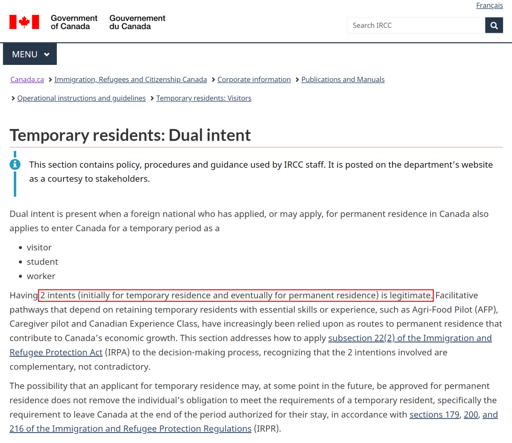
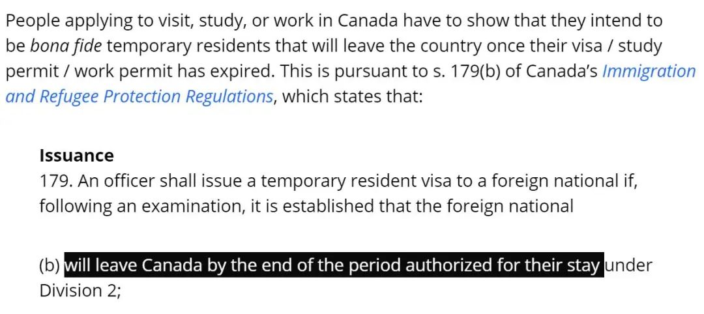
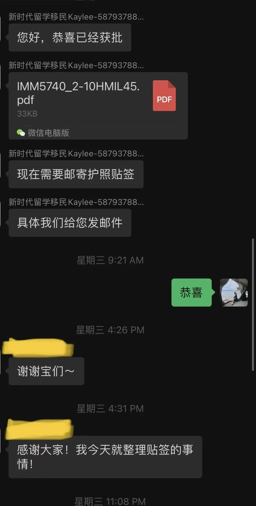

# 无标题

**链接地址:** http://mp.weixin.qq.com/s?__biz=MzUyNzA2NTAwNg==&mid=2247493748&idx=1&sn=0d67b030c64a2c40d7c4753284f299c0&chksm=fa07e2b5cd706ba38da9aa987a6a1dccbc9f7aa2c951d19ac146e620b2b195ab32c7b2003749&mpshare=1&scene=2&srcid=0416Loeybb4xcUSmPFMNXj2C&sharer_sharetime=1681587287822&sharer_shareid=77848a6b3852ae4dcb6c74ffee84743c#rd
**作者:** 你身边的签证专家
**获取时间:** 2025/8/28 19:12:04
**图片数量:** 22

---

## 原始HTML内容

<section style="box-sizing: border-box;font-size: 16px;"><section style="text-align: center;margin-top: 10px;margin-bottom: 10px;line-height: 0;box-sizing: border-box;" powered-by="xiumi.us"><section style="max-width: 100%;vertical-align: middle;display: inline-block;line-height: 0;box-sizing: border-box;"></section></section><section style="text-align: center;margin-top: 10px;margin-bottom: 10px;line-height: 0;box-sizing: border-box;" powered-by="xiumi.us"><section style="max-width: 100%;vertical-align: middle;display: inline-block;line-height: 0;box-sizing: border-box;"></section></section>
 
<section style="font-size: 19px;text-align: center;margin-top: 10px;margin-bottom: 3px;box-sizing: border-box;" powered-by="xiumi.us"><section style="display: inline-block;border-width: 1px;border-style: solid;border-color: rgb(188, 65, 65);background-color: rgb(188, 65, 65);width: 1.8em;height: 1.8em;line-height: 1.8em;border-radius: 100%;margin-left: auto;margin-right: auto;font-size: 16px;color: rgb(255, 255, 255);box-sizing: border-box;">
<strong style="box-sizing: border-box;">1</strong>
</section></section><section style="text-align: center;box-sizing: border-box;" powered-by="xiumi.us"><section style="display: inline-block;width: 0px;height: 0px;vertical-align: top;overflow: hidden;border-style: solid;border-width: 9px 6px 0px;border-color: rgb(188, 65, 65) rgba(255, 255, 255, 0) rgba(255, 255, 255, 0);box-sizing: border-box;"><svg viewBox="0 0 1 1" style="float:left;line-height:0;width:0;vertical-align:top;"></svg></section></section><section style="margin-bottom: 10px;text-align: center;justify-content: center;display: flex;flex-flow: row nowrap;box-sizing: border-box;" powered-by="xiumi.us"><section style="display: inline-block;width: auto;vertical-align: middle;background-color: rgba(109, 155, 209, 0.1);min-width: 10%;max-width: 100%;flex: 0 0 auto;height: auto;align-self: center;padding: 12px;box-sizing: border-box;"><section style="color: rgb(109, 155, 209);text-align: justify;box-sizing: border-box;" powered-by="xiumi.us">
<strong style="box-sizing: border-box;">因移民倾向被拒签或将成为历史！</strong>
</section></section></section><section style="font-size: 14px;padding-right: 15px;padding-left: 15px;letter-spacing: 1px;box-sizing: border-box;" powered-by="xiumi.us">
 

2023年4月5日，加拿大移民部官宣：强调入境有<strong style="box-sizing: border-box;">“双重意向”</strong>的临时签证合法。也就是说，有<strong style="box-sizing: border-box;">移民倾向申请临时签证不会被拒签</strong>了！

 

在以往我们申请加拿大临时签证的时候，<strong style="box-sizing: border-box;">“双重意向”是常见的拒签理由</strong>。移民官有很强的主观判断自由裁量权，所以没法解决。

 
</section><section style="text-align: center;margin-top: 10px;margin-bottom: 10px;line-height: 0;box-sizing: border-box;" powered-by="xiumi.us"><section style="max-width: 100%;vertical-align: middle;display: inline-block;line-height: 0;width: 90%;height: auto;box-sizing: border-box;"></section></section><section style="font-size: 14px;padding-right: 15px;padding-left: 15px;letter-spacing: 1px;box-sizing: border-box;" powered-by="xiumi.us">
 

4月5号加拿大移民部发表公告明确表示：<strong style="box-sizing: border-box;">签证申请人有双重意向（从最初的临时居民，到最终成为永久居民）是合法的</strong>。甚至想要来加拿大旅游的人，也可以有想要移民加拿大的打算。

 

加拿大移民部指出，未来申请加拿大旅游签证遭拒的唯一理由是<strong style="box-sizing: border-box;">“申请人不能证明自己将按时回国”</strong>，而有双重意向不是被拒签的理由。 

 
</section><section style="text-align: center;margin-top: 10px;margin-bottom: 10px;line-height: 0;box-sizing: border-box;" powered-by="xiumi.us"><section style="max-width: 100%;vertical-align: middle;display: inline-block;line-height: 0;width: 90%;height: auto;box-sizing: border-box;"></section></section><section style="font-size: 14px;padding-right: 15px;padding-left: 15px;letter-spacing: 1px;box-sizing: border-box;" powered-by="xiumi.us">
 

<strong style="box-sizing: border-box;">此次移民局主要扩充说明：</strong>

 
<ol class="list-paddingleft-1" style="padding-left: 40px;list-style-position: outside;"><li style="box-sizing: border-box;">
根据移民法条款A22(2)，两种不同意向的存在是合法的，应视作补充，而不是矛盾。 

 
</li><li style="box-sizing: border-box;">
从临时居民转变为永久居民是加拿大常见的移民路线。移民部特此提醒签证官以重视这类项目，加拿大工作经验是加拿大移民的有力加分项。 
</li></ol>
 

加拿大移民部还表示，将加强对移民官员的培训，以确保移民官员<strong style="box-sizing: border-box;">不因申请人有移民倾向而拒签</strong>。

 

 
</section><section style="font-size: 19px;text-align: center;margin-top: 10px;margin-bottom: 3px;box-sizing: border-box;" powered-by="xiumi.us"><section style="display: inline-block;border-width: 1px;border-style: solid;border-color: rgb(188, 65, 65);background-color: rgb(188, 65, 65);width: 1.8em;height: 1.8em;line-height: 1.8em;border-radius: 100%;margin-left: auto;margin-right: auto;font-size: 16px;color: rgb(255, 255, 255);box-sizing: border-box;">
<strong style="box-sizing: border-box;">2</strong>
</section></section><section style="text-align: center;box-sizing: border-box;" powered-by="xiumi.us"><section style="display: inline-block;width: 0px;height: 0px;vertical-align: top;overflow: hidden;border-style: solid;border-width: 9px 6px 0px;border-color: rgb(188, 65, 65) rgba(255, 255, 255, 0) rgba(255, 255, 255, 0);box-sizing: border-box;"><svg viewBox="0 0 1 1" style="float:left;line-height:0;width:0;vertical-align:top;"></svg></section></section><section style="margin-bottom: 10px;text-align: center;justify-content: center;display: flex;flex-flow: row nowrap;box-sizing: border-box;" powered-by="xiumi.us"><section style="display: inline-block;width: auto;vertical-align: middle;background-color: rgba(109, 155, 209, 0.1);min-width: 10%;max-width: 100%;flex: 0 0 auto;height: auto;align-self: center;padding: 12px;box-sizing: border-box;"><section style="color: rgb(109, 155, 209);text-align: justify;box-sizing: border-box;" powered-by="xiumi.us">
<strong style="box-sizing: border-box;">什么是“双重意向”？</strong>
</section></section></section><section style="font-size: 14px;padding-right: 15px;padding-left: 15px;letter-spacing: 1px;box-sizing: border-box;" powered-by="xiumi.us">
 

根据加拿大联邦政府官网的规定，符合“双向意图”判断标准的签证申请包括：

 
<ul class="list-paddingleft-1" style="padding-left: 40px;list-style-position: outside;"><li style="box-sizing: border-box;">
<strong style="box-sizing: border-box;">访问签证（旅游签证）申请人</strong>
</li><li style="box-sizing: border-box;">
<strong style="box-sizing: border-box;">工签申请人 </strong>
</li><li style="box-sizing: border-box;">
<strong style="box-sizing: border-box;">学签申请人</strong> 
</li></ul>
 

签证官审批签证考察因素：

 
<ul class="list-paddingleft-1" style="padding-left: 40px;list-style-position: outside;"><li style="box-sizing: border-box;">
<strong style="box-sizing: border-box;">申请人计划在加拿大停留时间</strong>
</li><li style="box-sizing: border-box;">
<strong style="box-sizing: border-box;">加拿大停留的资金支持 </strong>
</li><li style="box-sizing: border-box;">
<strong style="box-sizing: border-box;">申请人和本国关联性 </strong>
</li><li style="box-sizing: border-box;">
<strong style="box-sizing: border-box;">出行目的 </strong>
</li><li style="box-sizing: border-box;">
<strong style="box-sizing: border-box;">递交文件和信息的可信度 </strong>
</li><li style="box-sizing: border-box;">
<strong style="box-sizing: border-box;">过往签证申请史，有效的生物识别信息</strong> 
</li></ul>
 

如果申请人可能有双重意向，也不影响<strong style="box-sizing: border-box;">签证审批标准</strong>。每个申请人都受个人评估的程序公平公正准则所保护，应获得无偏见的审批决定。

 
</section><section style="text-align: center;margin-top: 10px;margin-bottom: 10px;line-height: 0;box-sizing: border-box;" powered-by="xiumi.us"><section style="max-width: 100%;vertical-align: middle;display: inline-block;line-height: 0;box-sizing: border-box;"></section></section><section style="font-size: 14px;padding-right: 15px;padding-left: 15px;letter-spacing: 1px;box-sizing: border-box;" powered-by="xiumi.us">
 

如果申请人已有居住在加拿大境内的配偶/同居伴侣或子女，签证官需考虑申请人过往或现有的移民申请，同样参考移民法条款A22(2)，<strong style="box-sizing: border-box;">移民意向不会直接导致签证被拒</strong>，如果签证官判断签证申请人可以按时离境加拿大，就可以批准签证。

 

这是加拿大移民部第一次在官网明确IRPA法案22-2条的重要意义，以及对临时签证的审核将会产生怎样重要的影响。期待未来更多的申请人<strong style="box-sizing: border-box;">不再因为”有移民倾向“而莫名其妙被拒签</strong>。 

 

 
</section><section style="font-size: 19px;text-align: center;margin-top: 10px;margin-bottom: 3px;box-sizing: border-box;" powered-by="xiumi.us"><section style="display: inline-block;border-width: 1px;border-style: solid;border-color: rgb(188, 65, 65);background-color: rgb(188, 65, 65);width: 1.8em;height: 1.8em;line-height: 1.8em;border-radius: 100%;margin-left: auto;margin-right: auto;font-size: 16px;color: rgb(255, 255, 255);box-sizing: border-box;">
<strong style="box-sizing: border-box;">3</strong>
</section></section><section style="text-align: center;box-sizing: border-box;" powered-by="xiumi.us"><section style="display: inline-block;width: 0px;height: 0px;vertical-align: top;overflow: hidden;border-style: solid;border-width: 9px 6px 0px;border-color: rgb(188, 65, 65) rgba(255, 255, 255, 0) rgba(255, 255, 255, 0);box-sizing: border-box;"><svg viewBox="0 0 1 1" style="float:left;line-height:0;width:0;vertical-align:top;"></svg></section></section><section style="margin-bottom: 10px;text-align: center;justify-content: center;display: flex;flex-flow: row nowrap;box-sizing: border-box;" powered-by="xiumi.us"><section style="display: inline-block;width: auto;vertical-align: middle;background-color: rgba(109, 155, 209, 0.1);min-width: 10%;max-width: 100%;flex: 0 0 auto;height: auto;align-self: center;padding: 12px;box-sizing: border-box;"><section style="color: rgb(109, 155, 209);text-align: justify;box-sizing: border-box;" powered-by="xiumi.us">
<strong style="box-sizing: border-box;">“移民倾向”为何会导致拒签</strong>
</section></section></section><section style="font-size: 14px;padding-right: 15px;padding-left: 15px;letter-spacing: 1px;box-sizing: border-box;" powered-by="xiumi.us">
 
</section><section style="font-size: 14px;padding-right: 15px;padding-left: 15px;letter-spacing: 1px;box-sizing: border-box;" powered-by="xiumi.us">
加拿大长久以来一直以<strong style="box-sizing: border-box;">居高不下拒签率著称</strong>。加拿大的签证要求也一直被认为是世界上最复杂和最不透明的，因此经常有人会<strong style="box-sizing: border-box;">莫名其妙地被拒签</strong>。 

 

不过，你知道加拿大每年会拒绝多少人的签证申请吗？

 

<strong style="box-sizing: border-box;">答案是60万人！</strong>

 
</section><section style="text-align: center;margin-top: 10px;margin-bottom: 10px;line-height: 0;box-sizing: border-box;" powered-by="xiumi.us"><section style="max-width: 100%;vertical-align: middle;display: inline-block;line-height: 0;width: 50%;height: auto;box-sizing: border-box;"></section></section><section style="font-size: 14px;padding-right: 15px;padding-left: 15px;letter-spacing: 1px;box-sizing: border-box;" powered-by="xiumi.us">
 

<strong style="box-sizing: border-box;">什么移民友好大国？就这！</strong>

 

2017年，加拿大拒绝了<strong style="box-sizing: border-box;">60万</strong>因为旅游、读书、商务、学术会议、探亲而申请短暂停留的个案，被拒签<strong style="box-sizing: border-box;">个案比例高达26%</strong>，学生签证的拒签率更在2020年飙升至33%！也就是说<strong style="box-sizing: border-box;">三个人里面就会有一个被拒签</strong>！

 

2018年5月，加拿大温哥华举行的第九届世粤联会曾经就因一侧新闻<strong style="box-sizing: border-box;">“出圈”</strong>——200人规模的广东代表团仅来了1个人，而<strong style="box-sizing: border-box;">其他所有申请人统统被加拿大拒签</strong>！

 

多大仇，多大怨？而说到拒签的理由，排行第一的居然是坊间流传的<strong style="box-sizing: border-box;">迷之“移民倾向”</strong>！

 
</section><section style="text-align: center;margin-top: 10px;margin-bottom: 10px;line-height: 0;box-sizing: border-box;" powered-by="xiumi.us"><section style="max-width: 100%;vertical-align: middle;display: inline-block;line-height: 0;width: 90%;height: auto;box-sizing: border-box;"></section></section><section style="font-size: 14px;padding-right: 15px;padding-left: 15px;letter-spacing: 1px;box-sizing: border-box;" powered-by="xiumi.us">
 

等等，加拿大不是世界上最欢迎新移民的国家之一吗？一边欢迎一边拒签到底是怎么想的？难道<strong style="box-sizing: border-box;">拒签率也有KPI</strong>？

 

 
</section><section style="font-size: 19px;text-align: center;margin-top: 10px;margin-bottom: 3px;box-sizing: border-box;" powered-by="xiumi.us"><section style="display: inline-block;border-width: 1px;border-style: solid;border-color: rgb(188, 65, 65);background-color: rgb(188, 65, 65);width: 1.8em;height: 1.8em;line-height: 1.8em;border-radius: 100%;margin-left: auto;margin-right: auto;font-size: 16px;color: rgb(255, 255, 255);box-sizing: border-box;">
<strong style="box-sizing: border-box;">4</strong>
</section></section><section style="text-align: center;box-sizing: border-box;" powered-by="xiumi.us"><section style="display: inline-block;width: 0px;height: 0px;vertical-align: top;overflow: hidden;border-style: solid;border-width: 9px 6px 0px;border-color: rgb(188, 65, 65) rgba(255, 255, 255, 0) rgba(255, 255, 255, 0);box-sizing: border-box;"><svg viewBox="0 0 1 1" style="float:left;line-height:0;width:0;vertical-align:top;"></svg></section></section><section style="margin-bottom: 10px;text-align: center;justify-content: center;display: flex;flex-flow: row nowrap;box-sizing: border-box;" powered-by="xiumi.us"><section style="display: inline-block;width: auto;vertical-align: middle;background-color: rgba(109, 155, 209, 0.1);min-width: 10%;max-width: 100%;flex: 0 0 auto;height: auto;align-self: center;padding: 12px;box-sizing: border-box;"><section style="color: rgb(109, 155, 209);text-align: justify;box-sizing: border-box;" powered-by="xiumi.us">
<strong style="box-sizing: border-box;">到底什么是“移民倾向”？</strong>
</section></section></section><section style="font-size: 14px;padding-right: 15px;padding-left: 15px;letter-spacing: 1px;box-sizing: border-box;" powered-by="xiumi.us">
 

首先，“移民倾向”这个说法应该来自隔壁的美签。 

 

具体来说就是申请美国B1/B2这样旅游签的时候，根据美国移民法的214(b)条款，美国首先默认这类非移民签证的<strong style="box-sizing: border-box;">申请人有“移民倾向”</strong>（shall be presumed to be an immigrant），所以只有当申请者能成功解释清楚，让签证官满意他们并没有“移民倾向”，才会获批签证。

 
</section><section style="text-align: center;margin-top: 10px;margin-bottom: 10px;line-height: 0;box-sizing: border-box;" powered-by="xiumi.us"><section style="max-width: 100%;vertical-align: middle;display: inline-block;line-height: 0;width: 90%;height: auto;box-sizing: border-box;"></section></section><section style="font-size: 14px;padding-right: 15px;padding-left: 15px;letter-spacing: 1px;box-sizing: border-box;" powered-by="xiumi.us">
 

但在加拿大却没有类似的条款，唯一接近的算是临时签证（TRV, Temporary Resident Visa），也就是包括旅游访问签，学签以及工签的申请中，依据加拿大的移民法179.(b) 规定，要求<strong style="box-sizing: border-box;">签证持有者需按时离境</strong> (will leave Canada by the end of the period authorized for their stay.)。

 

因此加拿大的签证申请者只要在申请时提供自己的<strong style="box-sizing: border-box;">回程的机票</strong>以表明自己可以在签证截止日期前有离境计划即可。<strong style="box-sizing: border-box;">但是为什么每年还是有那么多人会被拒签呢？</strong>

<strong style="box-sizing: border-box;"> </strong>
</section><section style="text-align: center;margin-top: 10px;margin-bottom: 10px;line-height: 0;box-sizing: border-box;" powered-by="xiumi.us"><section style="max-width: 100%;vertical-align: middle;display: inline-block;line-height: 0;width: 90%;height: auto;box-sizing: border-box;"></section></section><section style="font-size: 14px;padding-right: 15px;padding-left: 15px;letter-spacing: 1px;box-sizing: border-box;" powered-by="xiumi.us">
 

加拿大移民局发放的拒签信中较长被提及的理由其实是<strong style="box-sizing: border-box;">“Dual Intent”</strong>，根据字面意思其实就是<strong style="box-sizing: border-box;">“双重意向”</strong>。

 

也就是说，移民官在审核你的申请文件时，<strong style="box-sizing: border-box;">不相信你前来加拿大的真是目的和你申请的签证类别相符</strong>。比如，你申请了一份旅游签证，但种种迹象表明，你有概率会留下来<strong style="box-sizing: border-box;">“打黑工”</strong>，那么加拿大移民局就会给你的申请盖上以<strong style="box-sizing: border-box;">“双重意向”</strong>为由的拒签戳。
</section><section style="font-size: 14px;padding-right: 15px;padding-left: 15px;letter-spacing: 1px;box-sizing: border-box;" powered-by="xiumi.us">
 

归根结底，移民局最怕的是你<strong style="box-sizing: border-box;">非法滞留</strong>，逾期不归国。非法滞留的临时居民会给社会带来诸多负面影响，当然是要禁止的。

 

加拿大是一个移民国家，肯定是欢迎移民的，但前提是要<strong style="box-sizing: border-box;">合法移民</strong>。所以与其说移民局怕你有“移民倾向”，还不如说是怕你有<strong style="box-sizing: border-box;">“非法移民倾向”</strong>。

 
</section><section style="text-align: center;margin-top: 10px;margin-bottom: 10px;line-height: 0;box-sizing: border-box;" powered-by="xiumi.us"><section style="max-width: 100%;vertical-align: middle;display: inline-block;line-height: 0;width: 90%;height: auto;box-sizing: border-box;"></section></section>
 

 
<section style="font-size: 19px;text-align: center;margin-top: 10px;margin-bottom: 3px;box-sizing: border-box;" powered-by="xiumi.us"><section style="display: inline-block;border-width: 1px;border-style: solid;border-color: rgb(188, 65, 65);background-color: rgb(188, 65, 65);width: 1.8em;height: 1.8em;line-height: 1.8em;border-radius: 100%;margin-left: auto;margin-right: auto;font-size: 16px;color: rgb(255, 255, 255);box-sizing: border-box;">
<strong style="box-sizing: border-box;">5</strong>
</section></section><section style="text-align: center;box-sizing: border-box;" powered-by="xiumi.us"><section style="display: inline-block;width: 0px;height: 0px;vertical-align: top;overflow: hidden;border-style: solid;border-width: 9px 6px 0px;border-color: rgb(188, 65, 65) rgba(255, 255, 255, 0) rgba(255, 255, 255, 0);box-sizing: border-box;"><svg viewBox="0 0 1 1" style="float:left;line-height:0;width:0;vertical-align:top;"></svg></section></section><section style="margin-bottom: 10px;text-align: center;justify-content: center;display: flex;flex-flow: row nowrap;box-sizing: border-box;" powered-by="xiumi.us"><section style="display: inline-block;width: auto;vertical-align: middle;background-color: rgba(109, 155, 209, 0.1);min-width: 10%;max-width: 100%;flex: 0 0 auto;height: auto;align-self: center;padding: 12px;box-sizing: border-box;"><section style="color: rgb(109, 155, 209);text-align: justify;box-sizing: border-box;" powered-by="xiumi.us">
<strong style="box-sizing: border-box;">“大龄留学”为何容易被拒签？</strong>
</section></section></section>
 
<section style="font-size: 14px;padding-right: 15px;padding-left: 15px;letter-spacing: 1px;box-sizing: border-box;" powered-by="xiumi.us">
加拿大联邦移民局近年来对留学生群体毕业后留在加拿大工作并办理永居申请开除了许多优惠措施，因为这个拥有加拿大学历、英语语言能力和生活适应能力的群体是<strong style="box-sizing: border-box;">加国劳动力市场最优质的人才来源</strong>，尤其是拥有加拿大紧缺蓝领技能的专科毕业生，移民部哭爹喊娘地求着外国劳工大量输入都弥补不了巨大的劳动力缺口，断是没有再任性拒签的理由。

 

但是，“大龄留学”和“学历倒读”的加拿大学签获批率一直不高也是一个<strong style="box-sizing: border-box;">不争的事实</strong>。难道加拿大移民部已经把<strong style="box-sizing: border-box;">“年龄歧视”</strong>摆在台面上来讨论了吗？首先，我们来了解一下加拿大学签的申请基本要求：

 
<ol class="list-paddingleft-1" style="padding-left: 40px;list-style-position: outside;"><li style="box-sizing: border-box;">
<em style="box-sizing: border-box;">获得加拿大相关学习机构的offer；</em>
</li><li style="box-sizing: border-box;">
<em style="box-sizing: border-box;">提供足够资金证明能支付留学期间的学费、生活费，并且要证明资金的来源；</em>
</li><li style="box-sizing: border-box;">
<em style="box-sizing: border-box;">提供证明在签证结束时会按时离开加拿大；</em>
</li><li style="box-sizing: border-box;">
<em style="box-sizing: border-box;">申请人要提供详细的学习计划，并证明留学目的是真实的。</em>
</li></ol>
 

大龄申请学签、倒读很容易被拒签，原因的关键点就在于<strong style="box-sizing: border-box;">第三点和第四点</strong>。因为签证官很容易怀疑这类人的访问目的是否真的是留学，也不容易相信申请人在学习结束后会按期离境加拿大。所以会狠心地在他们的申请上打上<strong style="box-sizing: border-box;">“拒签”的标记</strong>。

 
</section><section style="text-align: center;margin-top: 10px;margin-bottom: 10px;line-height: 0;box-sizing: border-box;" powered-by="xiumi.us"><section style="max-width: 100%;vertical-align: middle;display: inline-block;line-height: 0;width: 90%;height: auto;box-sizing: border-box;"></section></section><section style="font-size: 14px;padding-right: 15px;padding-left: 15px;letter-spacing: 1px;box-sizing: border-box;" powered-by="xiumi.us">
 

那么，大龄留学就完全没有办法申请到学签吗？当然不！要知道每年在<strong style="box-sizing: border-box;">新时代留学移民法律事务所</strong>帮助下办理成功的的大龄留学签证都<strong style="box-sizing: border-box;">不在少数</strong>呢！

 
</section>
 
<section style="font-size: 19px;text-align: center;margin-top: 10px;margin-bottom: 3px;box-sizing: border-box;" powered-by="xiumi.us"><section style="display: inline-block;border-width: 1px;border-style: solid;border-color: rgb(188, 65, 65);background-color: rgb(188, 65, 65);width: 1.8em;height: 1.8em;line-height: 1.8em;border-radius: 100%;margin-left: auto;margin-right: auto;font-size: 16px;color: rgb(255, 255, 255);box-sizing: border-box;">
<strong style="box-sizing: border-box;">6</strong>
</section></section><section style="text-align: center;box-sizing: border-box;" powered-by="xiumi.us"><section style="display: inline-block;width: 0px;height: 0px;vertical-align: top;overflow: hidden;border-style: solid;border-width: 9px 6px 0px;border-color: rgb(188, 65, 65) rgba(255, 255, 255, 0) rgba(255, 255, 255, 0);box-sizing: border-box;"><svg viewBox="0 0 1 1" style="float:left;line-height:0;width:0;vertical-align:top;"></svg></section></section><section style="margin-bottom: 10px;text-align: center;justify-content: center;display: flex;flex-flow: row nowrap;box-sizing: border-box;" powered-by="xiumi.us"><section style="display: inline-block;width: auto;vertical-align: middle;background-color: rgba(109, 155, 209, 0.1);min-width: 10%;max-width: 100%;flex: 0 0 auto;height: auto;align-self: center;padding: 12px;box-sizing: border-box;"><section style="color: rgb(109, 155, 209);text-align: justify;box-sizing: border-box;" powered-by="xiumi.us">
<strong style="box-sizing: border-box;">如何降低拒签率？</strong>
</section></section></section><section style="font-size: 14px;padding-right: 15px;padding-left: 15px;letter-spacing: 1px;box-sizing: border-box;" powered-by="xiumi.us">
 
</section><section style="font-size: 14px;padding-right: 15px;padding-left: 15px;letter-spacing: 1px;box-sizing: border-box;" powered-by="xiumi.us">
想要提高大龄留学学签申请的成功率其实有很多办法。新时代在这里抛砖引玉，为大家提供几条<strong style="box-sizing: border-box;">操作性MAX</strong>的思路，请各位大龄留学生好好用起来！

 
</section><section style="text-align: left;justify-content: flex-start;display: flex;flex-flow: row nowrap;margin-top: 10px;margin-bottom: 10px;transform: translate3d(15px, 0px, 0px);box-sizing: border-box;" powered-by="xiumi.us"><section style="display: inline-block;vertical-align: middle;width: auto;background-color: rgb(188, 65, 65);min-width: 5%;max-width: 100%;flex: 0 0 auto;height: auto;align-self: center;padding: 4px;box-sizing: border-box;"><section style="font-size: 19px;margin-right: 0%;margin-left: 0%;text-align: center;box-sizing: border-box;" powered-by="xiumi.us"><section style="display: inline-block;border-width: 1px;border-style: solid;border-color: rgb(255, 255, 255);background-color: rgb(255, 255, 255);width: 1.8em;height: 1.8em;line-height: 1.8em;border-radius: 100%;margin-left: auto;margin-right: auto;font-size: 15px;color: rgb(188, 65, 65);box-sizing: border-box;">
<strong style="box-sizing: border-box;">1</strong>
</section></section></section><section style="display: inline-block;vertical-align: middle;width: auto;align-self: center;flex: 0 0 auto;min-width: 5%;max-width: 100%;height: auto;margin-left: 11px;box-sizing: border-box;"><section style="text-align: justify;box-sizing: border-box;" powered-by="xiumi.us">
<strong style="box-sizing: border-box;">提高英语成绩</strong>
</section></section></section><section style="font-size: 14px;padding-right: 15px;padding-left: 15px;letter-spacing: 1px;box-sizing: border-box;" powered-by="xiumi.us">
 

巧妇难为无米之炊，在英语语言国家生活当然还是要看英语水平，更不用说是来读书。在准备留学之前，申请者们请<strong style="box-sizing: border-box;">尽可能地提高自己的英语水平</strong>，在所申请学校认可的英语考试中<strong style="box-sizing: border-box;">取得可以直接入学的成绩</strong>。不要寄希望于语言班或者桥梁课程这种容易增加拒签率的语言学习项目。英语不好不仅给学业表现拖后腿，也会增加你在加国的日常生存难度哦！

 
</section><section style="text-align: left;justify-content: flex-start;display: flex;flex-flow: row nowrap;margin-top: 10px;margin-bottom: 10px;transform: translate3d(15px, 0px, 0px);box-sizing: border-box;" powered-by="xiumi.us"><section style="display: inline-block;vertical-align: middle;width: auto;background-color: rgb(188, 65, 65);min-width: 5%;max-width: 100%;flex: 0 0 auto;height: auto;align-self: center;padding: 4px;box-sizing: border-box;"><section style="font-size: 19px;margin-right: 0%;margin-left: 0%;text-align: center;box-sizing: border-box;" powered-by="xiumi.us"><section style="display: inline-block;border-width: 1px;border-style: solid;border-color: rgb(255, 255, 255);background-color: rgb(255, 255, 255);width: 1.8em;height: 1.8em;line-height: 1.8em;border-radius: 100%;margin-left: auto;margin-right: auto;font-size: 15px;color: rgb(188, 65, 65);box-sizing: border-box;">
<strong style="box-sizing: border-box;">2</strong>
</section></section></section><section style="display: inline-block;vertical-align: middle;width: auto;align-self: center;flex: 0 0 auto;min-width: 5%;max-width: 100%;height: auto;margin-left: 11px;box-sizing: border-box;"><section style="text-align: justify;box-sizing: border-box;" powered-by="xiumi.us">
<strong style="box-sizing: border-box;">与祖国的联系（tie to home country）</strong>
</section></section></section><section style="font-size: 14px;padding-right: 15px;padding-left: 15px;letter-spacing: 1px;box-sizing: border-box;" powered-by="xiumi.us">
 

大龄学签很关键的一点就在于你必须要表明你有强烈<strong style="box-sizing: border-box;">“学成归国”</strong>的打算，而不会赖在加拿大占用加国社会资源。说白了，你得告诉移民官：“阿sir，我国内有房有孩儿有对象，上有父母下有工作，人民群众离不开我啊！我此次出国学习提升是为了更好地报效祖国照顾家人。”至于为什么？别问，问就是<strong style="box-sizing: border-box;">羁绊</strong>。

 
</section><section style="text-align: left;justify-content: flex-start;display: flex;flex-flow: row nowrap;margin-top: 10px;margin-bottom: 10px;transform: translate3d(15px, 0px, 0px);box-sizing: border-box;" powered-by="xiumi.us"><section style="display: inline-block;vertical-align: middle;width: auto;background-color: rgb(188, 65, 65);min-width: 5%;max-width: 100%;flex: 0 0 auto;height: auto;align-self: center;padding: 4px;box-sizing: border-box;"><section style="font-size: 19px;margin-right: 0%;margin-left: 0%;text-align: center;box-sizing: border-box;" powered-by="xiumi.us"><section style="display: inline-block;border-width: 1px;border-style: solid;border-color: rgb(255, 255, 255);background-color: rgb(255, 255, 255);width: 1.8em;height: 1.8em;line-height: 1.8em;border-radius: 100%;margin-left: auto;margin-right: auto;font-size: 15px;color: rgb(188, 65, 65);box-sizing: border-box;">
<strong style="box-sizing: border-box;">3</strong>
</section></section></section><section style="display: inline-block;vertical-align: middle;width: auto;align-self: center;flex: 0 0 auto;min-width: 5%;max-width: 100%;height: auto;margin-left: 11px;box-sizing: border-box;"><section style="text-align: justify;box-sizing: border-box;" powered-by="xiumi.us">
<strong style="box-sizing: border-box;">合理的学习计划</strong>
</section></section></section><section style="font-size: 14px;padding-right: 15px;padding-left: 15px;letter-spacing: 1px;box-sizing: border-box;" powered-by="xiumi.us">
 

首先要在申请的支持材料中明确自己学习目的的单纯性。当然，仅仅这么宣称肯定是不够的，学习计划的合理性是要综合你<strong style="box-sizing: border-box;">整体的个人情况</strong>来进行考量的。张三本科学历，在银行中层干了小10年，突然计划要在加拿大某社区学院学习糕点烘焙力求报效祖国，这科学吗？这不科学啊！所以说，要让移民官<strong style="box-sizing: border-box;">信服你学习的理由和计划</strong>才是王道。

 
</section><section style="text-align: left;justify-content: flex-start;display: flex;flex-flow: row nowrap;margin-top: 10px;margin-bottom: 10px;transform: translate3d(15px, 0px, 0px);box-sizing: border-box;" powered-by="xiumi.us"><section style="display: inline-block;vertical-align: middle;width: auto;background-color: rgb(188, 65, 65);min-width: 5%;max-width: 100%;flex: 0 0 auto;height: auto;align-self: center;padding: 4px;box-sizing: border-box;"><section style="font-size: 19px;margin-right: 0%;margin-left: 0%;text-align: center;box-sizing: border-box;" powered-by="xiumi.us"><section style="display: inline-block;border-width: 1px;border-style: solid;border-color: rgb(255, 255, 255);background-color: rgb(255, 255, 255);width: 1.8em;height: 1.8em;line-height: 1.8em;border-radius: 100%;margin-left: auto;margin-right: auto;font-size: 15px;color: rgb(188, 65, 65);box-sizing: border-box;">
<strong style="box-sizing: border-box;">4</strong>
</section></section></section><section style="display: inline-block;vertical-align: middle;width: auto;align-self: center;flex: 0 0 auto;min-width: 5%;max-width: 100%;height: auto;margin-left: 11px;box-sizing: border-box;"><section style="text-align: justify;box-sizing: border-box;" powered-by="xiumi.us">
<strong style="box-sizing: border-box;">丰富的个人背景</strong>
</section></section></section><section style="font-size: 14px;padding-right: 15px;padding-left: 15px;letter-spacing: 1px;box-sizing: border-box;" powered-by="xiumi.us">
 

学签的审理说到底是对申请人的全面评估，你要想办法证明你是个<strong style="box-sizing: border-box;">优秀的人</strong>，不会给加拿大的社会带来危害。如果你可以从工作经验，资金，学术背景，个人履历都说服移民官，“我行”，甚至表现出一种，“我这水平在中国过得指定比加拿大好”的感觉，过签率也会有极大的提升。

 
</section><section style="text-align: left;justify-content: flex-start;display: flex;flex-flow: row nowrap;margin-top: 10px;margin-bottom: 10px;transform: translate3d(15px, 0px, 0px);box-sizing: border-box;" powered-by="xiumi.us"><section style="display: inline-block;vertical-align: middle;width: auto;background-color: rgb(188, 65, 65);min-width: 5%;max-width: 100%;flex: 0 0 auto;height: auto;align-self: center;padding: 4px;box-sizing: border-box;"><section style="font-size: 19px;margin-right: 0%;margin-left: 0%;text-align: center;box-sizing: border-box;" powered-by="xiumi.us"><section style="display: inline-block;border-width: 1px;border-style: solid;border-color: rgb(255, 255, 255);background-color: rgb(255, 255, 255);width: 1.8em;height: 1.8em;line-height: 1.8em;border-radius: 100%;margin-left: auto;margin-right: auto;font-size: 15px;color: rgb(188, 65, 65);box-sizing: border-box;">
<strong style="box-sizing: border-box;">5</strong>
</section></section></section><section style="display: inline-block;vertical-align: middle;width: auto;align-self: center;flex: 0 0 auto;min-width: 5%;max-width: 100%;height: auto;margin-left: 11px;box-sizing: border-box;"><section style="text-align: justify;box-sizing: border-box;" powered-by="xiumi.us">
<strong style="box-sizing: border-box;">用“旅转学”完成学签申请</strong>
</section></section></section><section style="font-size: 14px;padding-right: 15px;padding-left: 15px;letter-spacing: 1px;box-sizing: border-box;" powered-by="xiumi.us">
 

大龄留学如果通过<strong style="box-sizing: border-box;">“旅游签证转学习签证”</strong>的项目也可以相对有效地降低拒签的风险。首先，申请人本人已经在加拿大，如果是为了黑下来或者留学目的是假的，完全没必要提交任何申请。走旅转学项目的申请者已经在加拿大感受到加国社会制度的优越性，因此为了学习加拿大渊博的知识和先进的技能于是选择留在这片传奇的土地，是不是听起来就合理多了呢？
</section><section style="font-size: 14px;padding-right: 15px;padding-left: 15px;letter-spacing: 1px;box-sizing: border-box;" powered-by="xiumi.us">
 
</section><section style="margin: 10px 0%;text-align: left;justify-content: flex-start;display: flex;flex-flow: row nowrap;box-sizing: border-box;" powered-by="xiumi.us"><section style="display: inline-block;width: 100%;vertical-align: top;background-color: rgb(216, 202, 160);line-height: 0;align-self: flex-start;flex: 0 0 auto;box-sizing: border-box;"><section style="text-align: justify;justify-content: flex-start;display: flex;flex-flow: row nowrap;box-sizing: border-box;" powered-by="xiumi.us"><section style="display: inline-block;width: 100%;vertical-align: top;background-position: 0% 0%;background-repeat: repeat;background-size: 1.56658%;background-attachment: scroll;align-self: flex-start;flex: 0 0 auto;background-image: url(&quot;https://mmbiz.qpic.cn/mmbiz_png/904kUibXm7Y7yMSibQFAK8IJdvvvY5drPA0J5JCQr4lBGTAJibVOhN1ib4l3G5aIUBO4OrHKNSJvZFAf68BHTiboFtw/640?wx_fmt=png&quot;);box-sizing: border-box;"><section style="text-align: center;box-sizing: border-box;" powered-by="xiumi.us"><section style="display: inline-block;width: 100%;height: 11px;vertical-align: top;overflow: hidden;background-color: rgba(255, 255, 255, 0);box-sizing: border-box;"><svg viewBox="0 0 1 1" style="float:left;line-height:0;width:0;vertical-align:top;"></svg></section></section></section></section></section></section>
 
<section style="font-size: 19px;text-align: center;margin-top: 10px;margin-bottom: 3px;box-sizing: border-box;" powered-by="xiumi.us"><section style="display: inline-block;border-width: 1px;border-style: solid;border-color: rgb(188, 65, 65);background-color: rgb(188, 65, 65);width: 1.8em;height: 1.8em;line-height: 1.8em;border-radius: 100%;margin-left: auto;margin-right: auto;font-size: 16px;color: rgb(255, 255, 255);box-sizing: border-box;">
<strong style="box-sizing: border-box;">7</strong>
</section></section><section style="text-align: center;box-sizing: border-box;" powered-by="xiumi.us"><section style="display: inline-block;width: 0px;height: 0px;vertical-align: top;overflow: hidden;border-style: solid;border-width: 9px 6px 0px;border-color: rgb(188, 65, 65) rgba(255, 255, 255, 0) rgba(255, 255, 255, 0);box-sizing: border-box;"><svg viewBox="0 0 1 1" style="float:left;line-height:0;width:0;vertical-align:top;"></svg></section></section><section style="margin-bottom: 10px;text-align: center;justify-content: center;display: flex;flex-flow: row nowrap;box-sizing: border-box;" powered-by="xiumi.us"><section style="display: inline-block;width: auto;vertical-align: middle;background-color: rgba(109, 155, 209, 0.1);min-width: 10%;max-width: 100%;flex: 0 0 auto;height: auto;align-self: center;padding: 12px;box-sizing: border-box;"><section style="color: rgb(109, 155, 209);text-align: justify;box-sizing: border-box;" powered-by="xiumi.us">
<strong style="box-sizing: border-box;">拒签重申&amp;大龄留学成功案例分享</strong>
</section></section></section>
 
<section style="margin: 38px 0% 10px;display: flex;flex-flow: row nowrap;justify-content: flex-start;box-sizing: border-box;" powered-by="xiumi.us"><section style="display: inline-block;width: auto;vertical-align: top;background-color: rgb(255, 248, 244);flex: 100 100 0%;align-self: flex-start;height: auto;margin-right: 8px;box-sizing: border-box;"><section style="text-align: center;justify-content: center;transform: translate3d(7px, 0px, 0px);margin: -7px 0% 11px;display: flex;flex-flow: row nowrap;box-sizing: border-box;" powered-by="xiumi.us"><section style="display: inline-block;width: 100%;vertical-align: top;border-style: solid;border-width: 1px;border-color: rgb(0, 0, 0);align-self: flex-start;flex: 0 0 auto;box-sizing: border-box;"><section style="text-align: left;justify-content: flex-start;transform: translate3d(16px, 0px, 0px);margin-top: -1px;margin-right: 0%;margin-left: 0%;display: flex;flex-flow: row nowrap;box-sizing: border-box;" powered-by="xiumi.us"><section style="display: inline-block;width: auto;vertical-align: top;min-width: 10%;max-width: 100%;flex: 0 0 auto;height: auto;background-color: rgba(255, 255, 255, 0);border-top: 1px solid rgb(255, 255, 255);border-top-left-radius: 0px;align-self: flex-start;box-sizing: border-box;"><section style="display: flex;flex-flow: row nowrap;margin-top: -24px;margin-right: 0%;margin-left: 0%;justify-content: flex-start;box-sizing: border-box;" powered-by="xiumi.us"><section style="display: inline-block;vertical-align: middle;width: auto;flex: 0 0 0%;height: auto;align-self: center;box-sizing: border-box;"><section style="text-align: center;margin-right: 0%;margin-left: 0%;box-sizing: border-box;" powered-by="xiumi.us"><section style="display: inline-block;width: 44px;height: 44px;vertical-align: top;overflow: hidden;border-width: 0px;border-radius: 52px;border-style: none;border-color: rgb(0, 0, 0);background-color: rgb(255, 224, 139);box-sizing: border-box;"><svg viewBox="0 0 1 1" style="float:left;line-height:0;width:0;vertical-align:top;"></svg></section></section><section style="transform: rotateZ(315deg);box-sizing: border-box;" powered-by="xiumi.us"><section style="text-align: center;justify-content: center;display: flex;flex-flow: row nowrap;transform: translate3d(24px, 0px, 0px);margin-right: 0%;margin-left: 0%;box-sizing: border-box;"><section style="display: inline-block;width: auto;vertical-align: top;flex: 0 0 0%;height: auto;border-top: 1px none rgba(255, 255, 255, 0);border-top-left-radius: 0px;align-self: flex-start;line-height: 0;box-sizing: border-box;"><section style="box-sizing: border-box;" powered-by="xiumi.us"><section style="display: inline-block;width: 0px;height: 0px;vertical-align: top;overflow: hidden;border-style: solid;border-width: 27px 27px 0px;border-color: rgb(255, 248, 244) rgba(255, 255, 255, 0) rgba(255, 255, 255, 0);box-sizing: border-box;"><svg viewBox="0 0 1 1" style="float:left;line-height:0;width:0;vertical-align:top;"></svg></section></section></section></section></section></section><section style="display: inline-block;vertical-align: middle;width: auto;min-width: 10%;max-width: 100%;flex: 0 0 auto;height: auto;align-self: center;box-sizing: border-box;"><section style="transform: translate3d(-24px, 0px, 0px);margin-right: 0%;margin-left: 0%;box-sizing: border-box;" powered-by="xiumi.us"><section style="font-size: 12px;font-family: Optima-Regular, PingFangTC-light;letter-spacing: 0px;line-height: 1;color: rgb(0, 0, 0);box-sizing: border-box;">
<strong style="box-sizing: border-box;">案例.1</strong>
</section></section><section style="transform: translate3d(-24px, 0px, 0px);margin-right: 0%;margin-bottom: 16px;margin-left: 0%;box-sizing: border-box;" powered-by="xiumi.us"><section style="font-size: 18px;font-family: Optima-Regular, PingFangTC-light;letter-spacing: 1px;color: rgb(0, 0, 0);box-sizing: border-box;">
<strong style="box-sizing: border-box;">大龄留学拒签后二递获批！</strong>
</section></section></section></section></section></section><section style="margin-top: 10px;margin-bottom: 10px;line-height: 0;box-sizing: border-box;" powered-by="xiumi.us"><section style="max-width: 100%;vertical-align: middle;display: inline-block;line-height: 0;width: 90%;height: auto;box-sizing: border-box;"></section></section><section style="margin: 10px 0%;transform: translate3d(1px, 0px, 0px);-webkit-transform: translate3d(1px, 0px, 0px);-moz-transform: translate3d(1px, 0px, 0px);-o-transform: translate3d(1px, 0px, 0px);box-sizing: border-box;" powered-by="xiumi.us"><section style="line-height: 1.6;letter-spacing: 1px;padding-right: 24px;padding-left: 24px;font-family: Optima-Regular, PingFangTC-light;font-size: 15px;text-align: justify;box-sizing: border-box;">
 

这位客户<strong style="box-sizing: border-box;">第一次递交学签拒签</strong>，因为当时回国困难，<strong style="box-sizing: border-box;">必须在第三国递签</strong>。我们分析拒签原因后，让客人回到国内，对材料进行调整二次递交。<strong style="box-sizing: border-box;">终于顺利获批</strong>。

 

我记得第一次拒签的时候，客人跟我说：“我们再递交一次，你也不要有压力，天涯何处无芳草，如果加拿大不欢迎我去学习，我就去别的地方。我知道你们很尽力了，你们给的建议我认为都是最合理的。所以，即使再拒签，我也没什么遗憾。”

 

我当时和公司同事说，这么好的客人，希望下个officer可以带着脑子好好看我们准备的材料。她的二递获批，我也是真的很开心。希望她之后的生活都顺顺利利！
</section></section><section style="text-align: justify;box-sizing: border-box;" powered-by="xiumi.us">
 
</section></section></section></section></section>
 
<section style="text-align: center;margin-top: 10px;margin-bottom: 10px;line-height: 0;box-sizing: border-box;" powered-by="xiumi.us"><section style="max-width: 100%;vertical-align: middle;display: inline-block;line-height: 0;box-sizing: border-box;"></section></section>
 
<section style="margin: 38px 0% 10px;display: flex;flex-flow: row nowrap;justify-content: flex-start;box-sizing: border-box;" powered-by="xiumi.us"><section style="display: inline-block;width: auto;vertical-align: top;background-color: rgb(255, 248, 244);flex: 100 100 0%;align-self: flex-start;height: auto;margin-right: 8px;box-sizing: border-box;"><section style="text-align: center;justify-content: center;transform: translate3d(7px, 0px, 0px);margin: -7px 0% 11px;display: flex;flex-flow: row nowrap;box-sizing: border-box;" powered-by="xiumi.us"><section style="display: inline-block;width: 100%;vertical-align: top;border-style: solid;border-width: 1px;border-color: rgb(0, 0, 0);align-self: flex-start;flex: 0 0 auto;box-sizing: border-box;"><section style="text-align: left;justify-content: flex-start;transform: translate3d(16px, 0px, 0px);margin-top: -1px;margin-right: 0%;margin-left: 0%;display: flex;flex-flow: row nowrap;box-sizing: border-box;" powered-by="xiumi.us"><section style="display: inline-block;width: auto;vertical-align: top;min-width: 10%;max-width: 100%;flex: 0 0 auto;height: auto;background-color: rgba(255, 255, 255, 0);border-top: 1px solid rgb(255, 255, 255);border-top-left-radius: 0px;align-self: flex-start;box-sizing: border-box;"><section style="display: flex;flex-flow: row nowrap;margin-top: -24px;margin-right: 0%;margin-left: 0%;justify-content: flex-start;box-sizing: border-box;" powered-by="xiumi.us"><section style="display: inline-block;vertical-align: middle;width: auto;flex: 0 0 0%;height: auto;align-self: center;box-sizing: border-box;"><section style="text-align: center;margin-right: 0%;margin-left: 0%;box-sizing: border-box;" powered-by="xiumi.us"><section style="display: inline-block;width: 44px;height: 44px;vertical-align: top;overflow: hidden;border-width: 0px;border-radius: 52px;border-style: none;border-color: rgb(0, 0, 0);background-color: rgb(255, 224, 139);box-sizing: border-box;"><svg viewBox="0 0 1 1" style="float:left;line-height:0;width:0;vertical-align:top;"></svg></section></section><section style="transform: rotateZ(315deg);box-sizing: border-box;" powered-by="xiumi.us"><section style="text-align: center;justify-content: center;display: flex;flex-flow: row nowrap;transform: translate3d(24px, 0px, 0px);margin-right: 0%;margin-left: 0%;box-sizing: border-box;"><section style="display: inline-block;width: auto;vertical-align: top;flex: 0 0 0%;height: auto;border-top: 1px none rgba(255, 255, 255, 0);border-top-left-radius: 0px;align-self: flex-start;line-height: 0;box-sizing: border-box;"><section style="box-sizing: border-box;" powered-by="xiumi.us"><section style="display: inline-block;width: 0px;height: 0px;vertical-align: top;overflow: hidden;border-style: solid;border-width: 27px 27px 0px;border-color: rgb(255, 248, 244) rgba(255, 255, 255, 0) rgba(255, 255, 255, 0);box-sizing: border-box;"><svg viewBox="0 0 1 1" style="float:left;line-height:0;width:0;vertical-align:top;"></svg></section></section></section></section></section></section><section style="display: inline-block;vertical-align: middle;width: auto;min-width: 10%;max-width: 100%;flex: 0 0 auto;height: auto;align-self: center;box-sizing: border-box;"><section style="transform: translate3d(-24px, 0px, 0px);margin-right: 0%;margin-left: 0%;box-sizing: border-box;" powered-by="xiumi.us"><section style="font-size: 12px;font-family: Optima-Regular, PingFangTC-light;letter-spacing: 0px;line-height: 1;color: rgb(0, 0, 0);box-sizing: border-box;">
<strong style="box-sizing: border-box;">案例.2</strong>
</section></section><section style="transform: translate3d(-24px, 0px, 0px);margin-right: 0%;margin-bottom: 16px;margin-left: 0%;box-sizing: border-box;" powered-by="xiumi.us"><section style="font-size: 18px;font-family: Optima-Regular, PingFangTC-light;letter-spacing: 1px;color: rgb(0, 0, 0);box-sizing: border-box;">
<strong style="background-color: rgba(254, 255, 255, 0);box-sizing: border-box;">相伴四年的信任</strong> 
</section></section></section></section></section></section><section style="margin-top: 10px;margin-bottom: 10px;line-height: 0;box-sizing: border-box;" powered-by="xiumi.us"><section style="max-width: 100%;vertical-align: middle;display: inline-block;line-height: 0;width: 90%;height: auto;box-sizing: border-box;"></section></section><section style="margin: 10px 0%;transform: translate3d(1px, 0px, 0px);-webkit-transform: translate3d(1px, 0px, 0px);-moz-transform: translate3d(1px, 0px, 0px);-o-transform: translate3d(1px, 0px, 0px);box-sizing: border-box;" powered-by="xiumi.us"><section style="line-height: 1.6;letter-spacing: 1px;padding-right: 24px;padding-left: 24px;font-family: Optima-Regular, PingFangTC-light;font-size: 15px;text-align: justify;box-sizing: border-box;">
 

这个客人2018年第一次来找我们，她见到我，<strong style="box-sizing: border-box;">刚坐下来就哭了</strong>，因为学签出现了她觉得无法解决的问题。我们用了点巧办法，很快帮她恢复了学生身份，让她可以重新读一个学位。

 

转眼5年多过去了，我们陪伴她<strong style="box-sizing: border-box;">从学生，到毕业工作，到移民，见证了她的成长</strong>。今天移民批下来，我们可以画个圆满句号了。衷心希望她以后越来越好！

 

我们做移民留学这么多年，很多客人都是这么一路都<strong style="box-sizing: border-box;">给予了我们最大的信任</strong>，他们把他们的未来交在我们手里，沉甸甸。压力有多大，成就感就有多大。年末了，借此机会，再一并谢谢大家，我们继续努力！
</section></section><section style="text-align: justify;box-sizing: border-box;" powered-by="xiumi.us">
 
</section></section></section></section></section>
 
<section style="margin: 38px 0% 10px;display: flex;flex-flow: row nowrap;justify-content: flex-start;box-sizing: border-box;" powered-by="xiumi.us"><section style="display: inline-block;width: auto;vertical-align: top;background-color: rgb(255, 248, 244);flex: 100 100 0%;align-self: flex-start;height: auto;margin-right: 8px;box-sizing: border-box;"><section style="text-align: center;justify-content: center;transform: translate3d(7px, 0px, 0px);margin: -7px 0% 11px;display: flex;flex-flow: row nowrap;box-sizing: border-box;" powered-by="xiumi.us"><section style="display: inline-block;width: 100%;vertical-align: top;border-style: solid;border-width: 1px;border-color: rgb(0, 0, 0);align-self: flex-start;flex: 0 0 auto;box-sizing: border-box;"><section style="text-align: left;justify-content: flex-start;transform: translate3d(16px, 0px, 0px);margin-top: -1px;margin-right: 0%;margin-left: 0%;display: flex;flex-flow: row nowrap;box-sizing: border-box;" powered-by="xiumi.us"><section style="display: inline-block;width: auto;vertical-align: top;min-width: 10%;max-width: 100%;flex: 0 0 auto;height: auto;background-color: rgba(255, 255, 255, 0);border-top: 1px solid rgb(255, 255, 255);border-top-left-radius: 0px;align-self: flex-start;box-sizing: border-box;"><section style="display: flex;flex-flow: row nowrap;margin-top: -24px;margin-right: 0%;margin-left: 0%;justify-content: flex-start;box-sizing: border-box;" powered-by="xiumi.us"><section style="display: inline-block;vertical-align: middle;width: auto;flex: 0 0 0%;height: auto;align-self: center;box-sizing: border-box;"><section style="text-align: center;margin-right: 0%;margin-left: 0%;box-sizing: border-box;" powered-by="xiumi.us"><section style="display: inline-block;width: 44px;height: 44px;vertical-align: top;overflow: hidden;border-width: 0px;border-radius: 52px;border-style: none;border-color: rgb(0, 0, 0);background-color: rgb(255, 224, 139);box-sizing: border-box;"><svg viewBox="0 0 1 1" style="float:left;line-height:0;width:0;vertical-align:top;"></svg></section></section><section style="transform: rotateZ(315deg);box-sizing: border-box;" powered-by="xiumi.us"><section style="text-align: center;justify-content: center;display: flex;flex-flow: row nowrap;transform: translate3d(24px, 0px, 0px);margin-right: 0%;margin-left: 0%;box-sizing: border-box;"><section style="display: inline-block;width: auto;vertical-align: top;flex: 0 0 0%;height: auto;border-top: 1px none rgba(255, 255, 255, 0);border-top-left-radius: 0px;align-self: flex-start;line-height: 0;box-sizing: border-box;"><section style="box-sizing: border-box;" powered-by="xiumi.us"><section style="display: inline-block;width: 0px;height: 0px;vertical-align: top;overflow: hidden;border-style: solid;border-width: 27px 27px 0px;border-color: rgb(255, 248, 244) rgba(255, 255, 255, 0) rgba(255, 255, 255, 0);box-sizing: border-box;"><svg viewBox="0 0 1 1" style="float:left;line-height:0;width:0;vertical-align:top;"></svg></section></section></section></section></section></section><section style="display: inline-block;vertical-align: middle;width: auto;min-width: 10%;max-width: 100%;flex: 0 0 auto;height: auto;align-self: center;box-sizing: border-box;"><section style="transform: translate3d(-24px, 0px, 0px);margin-right: 0%;margin-left: 0%;box-sizing: border-box;" powered-by="xiumi.us"><section style="font-size: 12px;font-family: Optima-Regular, PingFangTC-light;letter-spacing: 0px;line-height: 1;color: rgb(0, 0, 0);box-sizing: border-box;">
<strong style="box-sizing: border-box;">案例.3</strong>
</section></section><section style="transform: translate3d(-24px, 0px, 0px);margin-right: 0%;margin-bottom: 16px;margin-left: 0%;box-sizing: border-box;" powered-by="xiumi.us"><section style="font-size: 18px;font-family: Optima-Regular, PingFangTC-light;letter-spacing: 1px;color: rgb(0, 0, 0);box-sizing: border-box;">
<strong style="box-sizing: border-box;"> </strong>

<strong style="box-sizing: border-box;">大龄留学的“玄学”</strong>
</section></section></section></section></section></section><section style="margin-top: 10px;margin-bottom: 10px;line-height: 0;box-sizing: border-box;" powered-by="xiumi.us"><section style="max-width: 100%;vertical-align: middle;display: inline-block;line-height: 0;width: 90%;height: auto;box-sizing: border-box;"></section></section><section style="margin: 10px 0%;transform: translate3d(1px, 0px, 0px);-webkit-transform: translate3d(1px, 0px, 0px);-moz-transform: translate3d(1px, 0px, 0px);-o-transform: translate3d(1px, 0px, 0px);box-sizing: border-box;" powered-by="xiumi.us"><section style="line-height: 1.6;letter-spacing: 1px;padding-right: 24px;padding-left: 24px;font-family: Optima-Regular, PingFangTC-light;font-size: 15px;text-align: justify;box-sizing: border-box;">
 

这位客户先是找其他公司递交了学签，但是遭到了拒签。她的朋友推荐来我这里咨询。我首先解释了大龄留学本来就是玄学，新时代也不是万能灵药。

 

但我简单看了材料，我认为她请的顾问也是用心做过的。但和客人聊的很投缘，我同意做一个正式的付费咨询，给他们找了新的角度来写学习计划。几个月后他们突然出现，告诉<strong style="box-sizing: border-box;">我二递成功了</strong>，希望我代理他们接下来了配偶工签及其他业务。

 

首先I feel flattered, 我觉得二递成功功劳并不都是我的，他们已这种方式来感谢我，我很暖心。第二，<strong style="box-sizing: border-box;">大龄留学就是玄学</strong>，我给他们改的时候也是很用心思考了，奏效后就好像打游戏又通一关的喜悦。

 

希望加拿大移民局可以优化系统，不要再把真心学习的大龄申请人拒之门外了。希望大家都沾沾喜气。别忘了吸引力法则，good luck!
</section></section><section style="text-align: justify;box-sizing: border-box;" powered-by="xiumi.us">
 
</section></section></section></section></section>
 
<section style="margin: 38px 0% 10px;display: flex;flex-flow: row nowrap;justify-content: flex-start;box-sizing: border-box;" powered-by="xiumi.us"><section style="display: inline-block;width: auto;vertical-align: top;background-color: rgb(255, 248, 244);flex: 100 100 0%;align-self: flex-start;height: auto;margin-right: 8px;box-sizing: border-box;"><section style="text-align: center;justify-content: center;transform: translate3d(7px, 0px, 0px);margin: -7px 0% 11px;display: flex;flex-flow: row nowrap;box-sizing: border-box;" powered-by="xiumi.us"><section style="display: inline-block;width: 100%;vertical-align: top;border-style: solid;border-width: 1px;border-color: rgb(0, 0, 0);align-self: flex-start;flex: 0 0 auto;box-sizing: border-box;"><section style="text-align: left;justify-content: flex-start;transform: translate3d(16px, 0px, 0px);margin-top: -1px;margin-right: 0%;margin-left: 0%;display: flex;flex-flow: row nowrap;box-sizing: border-box;" powered-by="xiumi.us"><section style="display: inline-block;width: auto;vertical-align: top;min-width: 10%;max-width: 100%;flex: 0 0 auto;height: auto;background-color: rgba(255, 255, 255, 0);border-top: 1px solid rgb(255, 255, 255);border-top-left-radius: 0px;align-self: flex-start;box-sizing: border-box;"><section style="display: flex;flex-flow: row nowrap;margin-top: -24px;margin-right: 0%;margin-left: 0%;justify-content: flex-start;box-sizing: border-box;" powered-by="xiumi.us"><section style="display: inline-block;vertical-align: middle;width: auto;flex: 0 0 0%;height: auto;align-self: center;box-sizing: border-box;"><section style="text-align: center;margin-right: 0%;margin-left: 0%;box-sizing: border-box;" powered-by="xiumi.us"><section style="display: inline-block;width: 44px;height: 44px;vertical-align: top;overflow: hidden;border-width: 0px;border-radius: 52px;border-style: none;border-color: rgb(0, 0, 0);background-color: rgb(255, 224, 139);box-sizing: border-box;"><svg viewBox="0 0 1 1" style="float:left;line-height:0;width:0;vertical-align:top;"></svg></section></section><section style="transform: rotateZ(315deg);box-sizing: border-box;" powered-by="xiumi.us"><section style="text-align: center;justify-content: center;display: flex;flex-flow: row nowrap;transform: translate3d(24px, 0px, 0px);margin-right: 0%;margin-left: 0%;box-sizing: border-box;"><section style="display: inline-block;width: auto;vertical-align: top;flex: 0 0 0%;height: auto;border-top: 1px none rgba(255, 255, 255, 0);border-top-left-radius: 0px;align-self: flex-start;line-height: 0;box-sizing: border-box;"><section style="box-sizing: border-box;" powered-by="xiumi.us"><section style="display: inline-block;width: 0px;height: 0px;vertical-align: top;overflow: hidden;border-style: solid;border-width: 27px 27px 0px;border-color: rgb(255, 248, 244) rgba(255, 255, 255, 0) rgba(255, 255, 255, 0);box-sizing: border-box;"><svg viewBox="0 0 1 1" style="float:left;line-height:0;width:0;vertical-align:top;"></svg></section></section></section></section></section></section><section style="display: inline-block;vertical-align: middle;width: auto;min-width: 10%;max-width: 100%;flex: 0 0 auto;height: auto;align-self: center;box-sizing: border-box;"><section style="transform: translate3d(-24px, 0px, 0px);margin-right: 0%;margin-left: 0%;box-sizing: border-box;" powered-by="xiumi.us"><section style="font-size: 12px;font-family: Optima-Regular, PingFangTC-light;letter-spacing: 0px;line-height: 1;color: rgb(0, 0, 0);box-sizing: border-box;">
<strong style="box-sizing: border-box;">案例.4</strong>
</section></section><section style="transform: translate3d(-24px, 0px, 0px);margin-right: 0%;margin-bottom: 16px;margin-left: 0%;box-sizing: border-box;" powered-by="xiumi.us"><section style="font-size: 18px;font-family: Optima-Regular, PingFangTC-light;letter-spacing: 1px;color: rgb(0, 0, 0);box-sizing: border-box;">
<strong style="background-color: rgba(254, 255, 255, 0);box-sizing: border-box;">“复杂”背景下的大龄留学</strong> 
</section></section></section></section></section></section><section style="margin-top: 10px;margin-bottom: 10px;line-height: 0;box-sizing: border-box;" powered-by="xiumi.us"><section style="max-width: 100%;vertical-align: middle;display: inline-block;line-height: 0;width: 90%;height: auto;box-sizing: border-box;"></section></section><section style="margin: 10px 0%;transform: translate3d(1px, 0px, 0px);-webkit-transform: translate3d(1px, 0px, 0px);-moz-transform: translate3d(1px, 0px, 0px);-o-transform: translate3d(1px, 0px, 0px);box-sizing: border-box;" powered-by="xiumi.us"><section style="line-height: 1.6;letter-spacing: 1px;padding-right: 24px;padding-left: 24px;font-family: Optima-Regular, PingFangTC-light;font-size: 15px;text-align: justify;box-sizing: border-box;">
 

N同学并没有一份良好的教育背景，不仅<strong style="box-sizing: border-box;">没有高中毕业</strong>并且在同级的孩子中也<strong style="box-sizing: border-box;">算年龄偏大</strong>，父母经济能力并不足以支撑他来加拿大留学，他的留学之旅费用全额由他在加拿大的叔叔（加拿大国籍）支付。<strong style="box-sizing: border-box;">复杂的财力支持</strong>与他自身的信息使他的申请大大增加了移民倾向，<strong style="box-sizing: border-box;">短期内接连被拒签两次</strong>的他已经对自己的加拿大留学计划丧失信心。

 

就在N同学与家人心灰意冷之际，带着最后一丝的不甘心敲响了我们新时代留学移民法律事务所的大门。在接到他的案子的那一刻起，新时代便紧锣密鼓的开始了严谨的分析讨论。不忍看到客人的梦想落空，秉承着新时代一贯的责任心与专业度，我们要尽全力助他一臂之力。

 

我们的持牌顾问与团队一次又一次开会讨论，一遍又一遍地修改了解释信，从他的自身条件到家庭背景等等，将他的信息展开来，逐条攻破，仔细排查，层层分析，不放过每一条可能增加他被拒风险的信息。最终移民部对他的申请彻底打消了顾虑，<strong style="box-sizing: border-box;">成功获批学签！</strong>
</section></section><section style="text-align: justify;box-sizing: border-box;" powered-by="xiumi.us">
 
</section></section></section></section></section><section style="font-size: 14px;padding-right: 15px;padding-left: 15px;letter-spacing: 1px;box-sizing: border-box;" powered-by="xiumi.us">
 

大龄留学确实不易。不过，看完上面这些涉及<strong style="box-sizing: border-box;">复杂背景和多次拒签经历</strong>的案例，你还会认为自己的情况“更加难办”吗？

 

这些看似<strong style="box-sizing: border-box;">“疑难加杂症，专治老顾问”</strong>的项目，到了新时代留学移民法律事务所的手里，通过我们抽丝剥茧，锲而不舍的“诊治”，最终还是<strong style="box-sizing: border-box;">药到病除</strong>，治好了顾客的那块心病。

 
</section><section style="text-align: center;margin-top: 10px;margin-bottom: 10px;line-height: 0;box-sizing: border-box;" powered-by="xiumi.us"><section style="max-width: 100%;vertical-align: middle;display: inline-block;line-height: 0;width: 59%;height: auto;box-sizing: border-box;"></section></section><section style="font-size: 14px;padding-right: 15px;padding-left: 15px;letter-spacing: 1px;box-sizing: border-box;" powered-by="xiumi.us">
 

要明白，过得顺风顺水堪称完美的申请者只是极少数的；而我们存在的意义就是帮助客户们<strong style="box-sizing: border-box;">去一次次完成看似艰难的申请任务，去一次次挑战或许已经失败过的经历</strong>。

 

我们希望凭借多年的经验、知识的积累、不懈的坚持、加上一颗真诚替客人着想的心，<strong style="box-sizing: border-box;">在“挑战不可能任务“的这条路上，许给我们的客户一次次感动的奇迹！</strong>

 
</section>
 
<section style="text-align: left;justify-content: flex-start;display: flex;flex-flow: row nowrap;margin-top: 10px;box-sizing: border-box;" powered-by="xiumi.us"><section style="display: inline-block;vertical-align: top;width: auto;align-self: stretch;flex: 0 0 auto;background-color: rgb(188, 65, 65);min-width: 5%;max-width: 100%;height: auto;padding-top: 9px;padding-right: 9px;padding-left: 20px;box-sizing: border-box;"><section style="text-align: justify;font-size: 18px;color: rgb(252, 252, 252);box-sizing: border-box;" powered-by="xiumi.us">
<strong style="box-sizing: border-box;">阅读更多</strong>
</section></section><section style="display: inline-block;vertical-align: top;width: auto;min-width: 5%;max-width: 100%;flex: 0 0 auto;height: auto;align-self: stretch;box-sizing: border-box;"><section style="box-sizing: border-box;" powered-by="xiumi.us"><section style="display: inline-block;width: 0px;height: 0px;vertical-align: top;overflow: hidden;border-style: solid;border-width: 45px 0px 0px 19px;border-color: rgba(255, 255, 255, 0) rgba(255, 255, 255, 0) rgba(255, 255, 255, 0) rgb(188, 65, 65);box-sizing: border-box;"><svg viewBox="0 0 1 1" style="float:left;line-height:0;width:0;vertical-align:top;"></svg></section></section></section></section><section style="margin-bottom: 10px;box-sizing: border-box;" powered-by="xiumi.us"><section style="background-color: rgb(188, 65, 65);height: 3px;box-sizing: border-box;"><svg viewBox="0 0 1 1" style="float:left;line-height:0;width:0;vertical-align:top;"></svg></section></section><section style="margin: 10px 0%;text-align: left;justify-content: flex-start;display: flex;flex-flow: row nowrap;box-sizing: border-box;" powered-by="xiumi.us"><section style="display: inline-block;width: 100%;vertical-align: top;background-position: 65.7357% 10.3608%;background-repeat: repeat;background-size: 104.114%;background-attachment: scroll;padding: 30px;align-self: flex-start;flex: 0 0 auto;background-image: url(&quot;https://mmbiz.qpic.cn/mmbiz_png/904kUibXm7Y7yMSibQFAK8IJdvvvY5drPA9gqJEXCBVZU74A3AiaII0OAgdW2SASZ0Ozcl5hepHEliaUtJVb28KDrQ/640?wx_fmt=png&quot;);box-sizing: border-box;"><section style="text-align: justify;justify-content: flex-start;display: flex;flex-flow: row nowrap;box-sizing: border-box;" powered-by="xiumi.us"><section style="display: inline-block;width: 100%;vertical-align: top;background-color: rgba(188, 65, 65, 0.22);padding: 10px;border-width: 0px;border-style: none;border-color: rgb(62, 62, 62);align-self: flex-start;flex: 0 0 auto;box-sizing: border-box;"><section style="text-align: center;color: rgb(255, 255, 255);font-size: 14px;box-sizing: border-box;" powered-by="xiumi.us">
<a target="_blank" href="http://mp.weixin.qq.com/s?__biz=MzUyNzA2NTAwNg==&amp;mid=2247493715&amp;idx=1&amp;sn=52cdb7b597faf91731cba3acbc6c821d&amp;chksm=fa07e292cd706b847f1eaa8f890e7a4d9bec8ea7a1ed34d5857cb6f9a3a69283049570acdeef&amp;scene=21#wechat_redirect" textvalue="突发 | 世上最大规模！加拿大移民部将可能大面积罢工，这些服务将受影响！" linktype="text" imgurl="" imgdata="null" data-itemshowtype="0" tab="innerlink" style="color: rgb(255, 255, 255);" data-linktype="2"><strong style="box-sizing: border-box;">突发 | 世上最大规模！加拿大移民部将可能大面积罢工，这些服务将受影响！</strong></a>
</section></section></section></section></section><section style="margin: 10px 0%;text-align: left;justify-content: flex-start;display: flex;flex-flow: row nowrap;box-sizing: border-box;" powered-by="xiumi.us"><section style="display: inline-block;width: 100%;vertical-align: top;background-position: 41.4412% 63.3022%;background-repeat: repeat;background-size: 103.375%;background-attachment: scroll;padding: 30px;align-self: flex-start;flex: 0 0 auto;background-image: url(&quot;https://mmbiz.qpic.cn/mmbiz_png/904kUibXm7Y7yMSibQFAK8IJdvvvY5drPAon9dUMWjbPOSrYdibibV0Cvy8icVnG1qfFjs5WhQalrpWH6Bf8430z96A/640?wx_fmt=png&quot;);box-sizing: border-box;"><section style="text-align: justify;justify-content: flex-start;display: flex;flex-flow: row nowrap;box-sizing: border-box;" powered-by="xiumi.us"><section style="display: inline-block;width: 100%;vertical-align: top;background-color: rgba(188, 65, 65, 0.22);padding: 10px;border-width: 0px;border-style: none;border-color: rgb(62, 62, 62);align-self: flex-start;flex: 0 0 auto;box-sizing: border-box;"><section style="text-align: center;color: rgb(255, 255, 255);font-size: 14px;box-sizing: border-box;" powered-by="xiumi.us">
<a target="_blank" href="http://mp.weixin.qq.com/s?__biz=MzUyNzA2NTAwNg==&amp;mid=2247493691&amp;idx=1&amp;sn=6daaffba80b3542c1965801414479309&amp;chksm=fa07e2facd706beceee9573a2c838aa8fafb698dd60643f73b9dfe96a2b105b261c1fb532aa7&amp;scene=21#wechat_redirect" textvalue="好消息！加拿大阿尔伯塔省公布最新5项省提名移民措施，几类申请人群受益！" linktype="text" imgurl="" imgdata="null" data-itemshowtype="0" tab="innerlink" style="color: rgb(255, 255, 255);" data-linktype="2"><strong style="box-sizing: border-box;">好消息！加拿大阿尔伯塔省公布最新5项省提名移民措施，几类申请人群受益！</strong></a>
</section></section></section></section></section><section style="margin: 10px 0%;text-align: left;justify-content: flex-start;display: flex;flex-flow: row nowrap;box-sizing: border-box;" powered-by="xiumi.us"><section style="display: inline-block;width: 100%;vertical-align: top;background-position: 53.5251% 58.2494%;background-repeat: repeat;background-size: 104.564%;background-attachment: scroll;padding: 30px;align-self: flex-start;flex: 0 0 auto;background-image: url(&quot;https://mmbiz.qpic.cn/mmbiz_png/904kUibXm7Y7yMSibQFAK8IJdvvvY5drPA6UicxfPOpQRsIh1cW4ImBkiaicRNTg4nXXO3jmTaMGhu7Aqrz2UAPNzWQ/640?wx_fmt=png&quot;);box-sizing: border-box;"><section style="text-align: justify;justify-content: flex-start;display: flex;flex-flow: row nowrap;box-sizing: border-box;" powered-by="xiumi.us"><section style="display: inline-block;width: 100%;vertical-align: top;background-color: rgba(188, 65, 65, 0.22);padding: 10px;border-width: 0px;border-style: none;border-color: rgb(62, 62, 62);align-self: flex-start;flex: 0 0 auto;box-sizing: border-box;"><section style="text-align: center;color: rgb(255, 255, 255);font-size: 14px;box-sizing: border-box;" powered-by="xiumi.us">
<a target="_blank" href="http://mp.weixin.qq.com/s?__biz=MzUyNzA2NTAwNg==&amp;mid=2247493614&amp;idx=1&amp;sn=fc3c13270047ff0ed99f6814c76ef334&amp;chksm=fa07ed2fcd7064398c1722481f213166d5b928b0ad4cde4836d3b8c97107ad1b0bee1e24f8c3&amp;scene=21#wechat_redirect" textvalue="揭秘网红移民项目：加拿大联邦自雇移民全球仅不到30%成功率，中国申请人高达八成！" linktype="text" imgurl="" imgdata="null" data-itemshowtype="0" tab="innerlink" style="color: rgb(255, 255, 255);" data-linktype="2"><strong style="box-sizing: border-box;">揭秘网红移民项目：加拿大联邦自雇移民全球仅不到30%成功率，中国申请人高达八成！</strong></a>
</section></section></section></section></section><section style="margin: 10px 0%;text-align: left;justify-content: flex-start;display: flex;flex-flow: row nowrap;box-sizing: border-box;" powered-by="xiumi.us"><section style="display: inline-block;width: 100%;vertical-align: top;background-position: 55.6015% 43.7658%;background-repeat: repeat;background-size: 100.637%;background-attachment: scroll;padding: 30px;align-self: flex-start;flex: 0 0 auto;background-image: url(&quot;https://mmbiz.qpic.cn/mmbiz_png/904kUibXm7Y7yMSibQFAK8IJdvvvY5drPAmMJvWjZ9ib9q3ico899u3WD23qicKrYUaJJOvnKey8ysPMTsvian5NksJQ/640?wx_fmt=png&quot;);box-sizing: border-box;"><section style="text-align: justify;justify-content: flex-start;display: flex;flex-flow: row nowrap;box-sizing: border-box;" powered-by="xiumi.us"><section style="display: inline-block;width: 100%;vertical-align: top;background-color: rgba(188, 65, 65, 0.22);padding: 10px;border-width: 0px;border-style: none;border-color: rgb(62, 62, 62);align-self: flex-start;flex: 0 0 auto;box-sizing: border-box;"><section style="text-align: center;color: rgb(255, 255, 255);font-size: 14px;box-sizing: border-box;" powered-by="xiumi.us">
<a target="_blank" href="http://mp.weixin.qq.com/s?__biz=MzUyNzA2NTAwNg==&amp;mid=2247493576&amp;idx=1&amp;sn=ae22982ea24e1cf89ae12fc0b870867e&amp;chksm=fa07ed09cd70641fa75543a5f0ba2846ed6a9085733c5a07f0c50555d782eef6999419385d2d&amp;scene=21#wechat_redirect" textvalue="魁省投资移民宣布再度暂停一年，加拿大唯一纯投资移民项目即将暂停四年！" linktype="text" imgurl="" imgdata="null" data-itemshowtype="0" tab="innerlink" style="color: rgb(255, 255, 255);" data-linktype="2"><strong style="box-sizing: border-box;">魁省投资移民宣布再度暂停一年，加拿大唯一纯投资移民项目即将暂停四年！</strong></a>
</section></section></section></section></section><section style="text-align: center;font-size: 12px;color: rgb(180, 180, 180);box-sizing: border-box;" powered-by="xiumi.us">
（点击文字阅读）
</section><section style="margin: 10px 0%;text-align: left;justify-content: flex-start;display: flex;flex-flow: row nowrap;box-sizing: border-box;" powered-by="xiumi.us"><section style="display: inline-block;width: 100%;vertical-align: top;background-color: rgb(216, 202, 160);line-height: 0;align-self: flex-start;flex: 0 0 auto;box-sizing: border-box;"><section style="text-align: justify;justify-content: flex-start;display: flex;flex-flow: row nowrap;box-sizing: border-box;" powered-by="xiumi.us"><section style="display: inline-block;width: 100%;vertical-align: top;background-position: 0% 0%;background-repeat: repeat;background-size: 1.56658%;background-attachment: scroll;align-self: flex-start;flex: 0 0 auto;background-image: url(&quot;https://mmbiz.qpic.cn/mmbiz_png/904kUibXm7Y7yMSibQFAK8IJdvvvY5drPA0J5JCQr4lBGTAJibVOhN1ib4l3G5aIUBO4OrHKNSJvZFAf68BHTiboFtw/640?wx_fmt=png&quot;);box-sizing: border-box;"><section style="text-align: center;box-sizing: border-box;" powered-by="xiumi.us"><section style="display: inline-block;width: 100%;height: 11px;vertical-align: top;overflow: hidden;background-color: rgba(255, 255, 255, 0);box-sizing: border-box;"><svg viewBox="0 0 1 1" style="float:left;line-height:0;width:0;vertical-align:top;"></svg></section></section></section></section></section></section><section style="text-align: center;margin-top: 10px;margin-bottom: 10px;line-height: 0;box-sizing: border-box;" powered-by="xiumi.us"><section style="max-width: 100%;vertical-align: middle;display: inline-block;line-height: 0;box-sizing: border-box;"></section></section><section style="text-align: center;margin-top: 10px;margin-bottom: 10px;line-height: 0;box-sizing: border-box;" powered-by="xiumi.us"><section style="max-width: 100%;vertical-align: middle;display: inline-block;line-height: 0;box-sizing: border-box;"></section></section><section style="text-align: center;margin-top: 10px;margin-bottom: 10px;line-height: 0;box-sizing: border-box;" powered-by="xiumi.us"><section style="max-width: 100%;vertical-align: middle;display: inline-block;line-height: 0;box-sizing: border-box;"></section></section><section style="padding-right: 15px;padding-left: 15px;font-size: 12px;color: rgb(121, 121, 121);box-sizing: border-box;" powered-by="xiumi.us">
<strong style="box-sizing: border-box;">参考信息：</strong>

<strong style="box-sizing: border-box;">https://www.canada.ca/en/immigration-refugees-citizenship/corporate/publications-manuals/operational-bulletins-manuals/temporary-residents/visitors/dual-intent-applicants.html</strong>
</section><section style="text-align: center;margin-top: 10px;margin-bottom: 10px;line-height: 0;box-sizing: border-box;" powered-by="xiumi.us"><section style="max-width: 100%;vertical-align: middle;display: inline-block;line-height: 0;box-sizing: border-box;"></section></section><section style="text-align: center;margin-top: 10px;margin-bottom: 10px;line-height: 0;box-sizing: border-box;" powered-by="xiumi.us"><section style="max-width: 100%;vertical-align: middle;display: inline-block;line-height: 0;box-sizing: border-box;"></section></section></section>
 

<mp-style-type data-value="3"></mp-style-type>

---

## 纯文本内容

1因移民倾向被拒签或将成为历史！2023年4月5日，加拿大移民部官宣：强调入境有“双重意向”的临时签证合法。也就是说，有移民倾向申请临时签证不会被拒签了！在以往我们申请加拿大临时签证的时候，“双重意向”是常见的拒签理由。移民官有很强的主观判断自由裁量权，所以没法解决。4月5号加拿大移民部发表公告明确表示：签证申请人有双重意向（从最初的临时居民，到最终成为永久居民）是合法的。甚至想要来加拿大旅游的人，也可以有想要移民加拿大的打算。加拿大移民部指出，未来申请加拿大旅游签证遭拒的唯一理由是“申请人不能证明自己将按时回国”，而有双重意向不是被拒签的理由。此次移民局主要扩充说明：根据移民法条款A22(2)，两种不同意向的存在是合法的，应视作补充，而不是矛盾。从临时居民转变为永久居民是加拿大常见的移民路线。移民部特此提醒签证官以重视这类项目，加拿大工作经验是加拿大移民的有力加分项。加拿大移民部还表示，将加强对移民官员的培训，以确保移民官员不因申请人有移民倾向而拒签。2什么是“双重意向”？根据加拿大联邦政府官网的规定，符合“双向意图”判断标准的签证申请包括：访问签证（旅游签证）申请人工签申请人学签申请人签证官审批签证考察因素：申请人计划在加拿大停留时间加拿大停留的资金支持申请人和本国关联性出行目的递交文件和信息的可信度过往签证申请史，有效的生物识别信息如果申请人可能有双重意向，也不影响签证审批标准。每个申请人都受个人评估的程序公平公正准则所保护，应获得无偏见的审批决定。如果申请人已有居住在加拿大境内的配偶/同居伴侣或子女，签证官需考虑申请人过往或现有的移民申请，同样参考移民法条款A22(2)，移民意向不会直接导致签证被拒，如果签证官判断签证申请人可以按时离境加拿大，就可以批准签证。这是加拿大移民部第一次在官网明确IRPA法案22-2条的重要意义，以及对临时签证的审核将会产生怎样重要的影响。期待未来更多的申请人不再因为”有移民倾向“而莫名其妙被拒签。3“移民倾向”为何会导致拒签加拿大长久以来一直以居高不下拒签率著称。加拿大的签证要求也一直被认为是世界上最复杂和最不透明的，因此经常有人会莫名其妙地被拒签。不过，你知道加拿大每年会拒绝多少人的签证申请吗？答案是60万人！什么移民友好大国？就这！2017年，加拿大拒绝了60万因为旅游、读书、商务、学术会议、探亲而申请短暂停留的个案，被拒签个案比例高达26%，学生签证的拒签率更在2020年飙升至33%！也就是说三个人里面就会有一个被拒签！2018年5月，加拿大温哥华举行的第九届世粤联会曾经就因一侧新闻“出圈”——200人规模的广东代表团仅来了1个人，而其他所有申请人统统被加拿大拒签！多大仇，多大怨？而说到拒签的理由，排行第一的居然是坊间流传的迷之“移民倾向”！等等，加拿大不是世界上最欢迎新移民的国家之一吗？一边欢迎一边拒签到底是怎么想的？难道拒签率也有KPI？4到底什么是“移民倾向”？首先，“移民倾向”这个说法应该来自隔壁的美签。具体来说就是申请美国B1/B2这样旅游签的时候，根据美国移民法的214(b)条款，美国首先默认这类非移民签证的申请人有“移民倾向”（shall be presumed to be an immigrant），所以只有当申请者能成功解释清楚，让签证官满意他们并没有“移民倾向”，才会获批签证。但在加拿大却没有类似的条款，唯一接近的算是临时签证（TRV, Temporary Resident Visa），也就是包括旅游访问签，学签以及工签的申请中，依据加拿大的移民法179.(b) 规定，要求签证持有者需按时离境 (will leave Canada by the end of the period authorized for their stay.)。因此加拿大的签证申请者只要在申请时提供自己的回程的机票以表明自己可以在签证截止日期前有离境计划即可。但是为什么每年还是有那么多人会被拒签呢？加拿大移民局发放的拒签信中较长被提及的理由其实是“Dual Intent”，根据字面意思其实就是“双重意向”。也就是说，移民官在审核你的申请文件时，不相信你前来加拿大的真是目的和你申请的签证类别相符。比如，你申请了一份旅游签证，但种种迹象表明，你有概率会留下来“打黑工”，那么加拿大移民局就会给你的申请盖上以“双重意向”为由的拒签戳。归根结底，移民局最怕的是你非法滞留，逾期不归国。非法滞留的临时居民会给社会带来诸多负面影响，当然是要禁止的。加拿大是一个移民国家，肯定是欢迎移民的，但前提是要合法移民。所以与其说移民局怕你有“移民倾向”，还不如说是怕你有“非法移民倾向”。5“大龄留学”为何容易被拒签？加拿大联邦移民局近年来对留学生群体毕业后留在加拿大工作并办理永居申请开除了许多优惠措施，因为这个拥有加拿大学历、英语语言能力和生活适应能力的群体是加国劳动力市场最优质的人才来源，尤其是拥有加拿大紧缺蓝领技能的专科毕业生，移民部哭爹喊娘地求着外国劳工大量输入都弥补不了巨大的劳动力缺口，断是没有再任性拒签的理由。但是，“大龄留学”和“学历倒读”的加拿大学签获批率一直不高也是一个不争的事实。难道加拿大移民部已经把“年龄歧视”摆在台面上来讨论了吗？首先，我们来了解一下加拿大学签的申请基本要求：获得加拿大相关学习机构的offer；提供足够资金证明能支付留学期间的学费、生活费，并且要证明资金的来源；提供证明在签证结束时会按时离开加拿大；申请人要提供详细的学习计划，并证明留学目的是真实的。大龄申请学签、倒读很容易被拒签，原因的关键点就在于第三点和第四点。因为签证官很容易怀疑这类人的访问目的是否真的是留学，也不容易相信申请人在学习结束后会按期离境加拿大。所以会狠心地在他们的申请上打上“拒签”的标记。那么，大龄留学就完全没有办法申请到学签吗？当然不！要知道每年在新时代留学移民法律事务所帮助下办理成功的的大龄留学签证都不在少数呢！6如何降低拒签率？想要提高大龄留学学签申请的成功率其实有很多办法。新时代在这里抛砖引玉，为大家提供几条操作性MAX的思路，请各位大龄留学生好好用起来！1提高英语成绩巧妇难为无米之炊，在英语语言国家生活当然还是要看英语水平，更不用说是来读书。在准备留学之前，申请者们请尽可能地提高自己的英语水平，在所申请学校认可的英语考试中取得可以直接入学的成绩。不要寄希望于语言班或者桥梁课程这种容易增加拒签率的语言学习项目。英语不好不仅给学业表现拖后腿，也会增加你在加国的日常生存难度哦！2与祖国的联系（tie to home country）大龄学签很关键的一点就在于你必须要表明你有强烈“学成归国”的打算，而不会赖在加拿大占用加国社会资源。说白了，你得告诉移民官：“阿sir，我国内有房有孩儿有对象，上有父母下有工作，人民群众离不开我啊！我此次出国学习提升是为了更好地报效祖国照顾家人。”至于为什么？别问，问就是羁绊。3合理的学习计划首先要在申请的支持材料中明确自己学习目的的单纯性。当然，仅仅这么宣称肯定是不够的，学习计划的合理性是要综合你整体的个人情况来进行考量的。张三本科学历，在银行中层干了小10年，突然计划要在加拿大某社区学院学习糕点烘焙力求报效祖国，这科学吗？这不科学啊！所以说，要让移民官信服你学习的理由和计划才是王道。4丰富的个人背景学签的审理说到底是对申请人的全面评估，你要想办法证明你是个优秀的人，不会给加拿大的社会带来危害。如果你可以从工作经验，资金，学术背景，个人履历都说服移民官，“我行”，甚至表现出一种，“我这水平在中国过得指定比加拿大好”的感觉，过签率也会有极大的提升。5用“旅转学”完成学签申请大龄留学如果通过“旅游签证转学习签证”的项目也可以相对有效地降低拒签的风险。首先，申请人本人已经在加拿大，如果是为了黑下来或者留学目的是假的，完全没必要提交任何申请。走旅转学项目的申请者已经在加拿大感受到加国社会制度的优越性，因此为了学习加拿大渊博的知识和先进的技能于是选择留在这片传奇的土地，是不是听起来就合理多了呢？7拒签重申&大龄留学成功案例分享案例.1大龄留学拒签后二递获批！这位客户第一次递交学签拒签，因为当时回国困难，必须在第三国递签。我们分析拒签原因后，让客人回到国内，对材料进行调整二次递交。终于顺利获批。我记得第一次拒签的时候，客人跟我说：“我们再递交一次，你也不要有压力，天涯何处无芳草，如果加拿大不欢迎我去学习，我就去别的地方。我知道你们很尽力了，你们给的建议我认为都是最合理的。所以，即使再拒签，我也没什么遗憾。”我当时和公司同事说，这么好的客人，希望下个officer可以带着脑子好好看我们准备的材料。她的二递获批，我也是真的很开心。希望她之后的生活都顺顺利利！案例.2相伴四年的信任这个客人2018年第一次来找我们，她见到我，刚坐下来就哭了，因为学签出现了她觉得无法解决的问题。我们用了点巧办法，很快帮她恢复了学生身份，让她可以重新读一个学位。转眼5年多过去了，我们陪伴她从学生，到毕业工作，到移民，见证了她的成长。今天移民批下来，我们可以画个圆满句号了。衷心希望她以后越来越好！我们做移民留学这么多年，很多客人都是这么一路都给予了我们最大的信任，他们把他们的未来交在我们手里，沉甸甸。压力有多大，成就感就有多大。年末了，借此机会，再一并谢谢大家，我们继续努力！案例.3大龄留学的“玄学”这位客户先是找其他公司递交了学签，但是遭到了拒签。她的朋友推荐来我这里咨询。我首先解释了大龄留学本来就是玄学，新时代也不是万能灵药。但我简单看了材料，我认为她请的顾问也是用心做过的。但和客人聊的很投缘，我同意做一个正式的付费咨询，给他们找了新的角度来写学习计划。几个月后他们突然出现，告诉我二递成功了，希望我代理他们接下来了配偶工签及其他业务。首先I feel flattered, 我觉得二递成功功劳并不都是我的，他们已这种方式来感谢我，我很暖心。第二，大龄留学就是玄学，我给他们改的时候也是很用心思考了，奏效后就好像打游戏又通一关的喜悦。希望加拿大移民局可以优化系统，不要再把真心学习的大龄申请人拒之门外了。希望大家都沾沾喜气。别忘了吸引力法则，good luck!案例.4“复杂”背景下的大龄留学N同学并没有一份良好的教育背景，不仅没有高中毕业并且在同级的孩子中也算年龄偏大，父母经济能力并不足以支撑他来加拿大留学，他的留学之旅费用全额由他在加拿大的叔叔（加拿大国籍）支付。复杂的财力支持与他自身的信息使他的申请大大增加了移民倾向，短期内接连被拒签两次的他已经对自己的加拿大留学计划丧失信心。就在N同学与家人心灰意冷之际，带着最后一丝的不甘心敲响了我们新时代留学移民法律事务所的大门。在接到他的案子的那一刻起，新时代便紧锣密鼓的开始了严谨的分析讨论。不忍看到客人的梦想落空，秉承着新时代一贯的责任心与专业度，我们要尽全力助他一臂之力。我们的持牌顾问与团队一次又一次开会讨论，一遍又一遍地修改了解释信，从他的自身条件到家庭背景等等，将他的信息展开来，逐条攻破，仔细排查，层层分析，不放过每一条可能增加他被拒风险的信息。最终移民部对他的申请彻底打消了顾虑，成功获批学签！大龄留学确实不易。不过，看完上面这些涉及复杂背景和多次拒签经历的案例，你还会认为自己的情况“更加难办”吗？这些看似“疑难加杂症，专治老顾问”的项目，到了新时代留学移民法律事务所的手里，通过我们抽丝剥茧，锲而不舍的“诊治”，最终还是药到病除，治好了顾客的那块心病。要明白，过得顺风顺水堪称完美的申请者只是极少数的；而我们存在的意义就是帮助客户们去一次次完成看似艰难的申请任务，去一次次挑战或许已经失败过的经历。我们希望凭借多年的经验、知识的积累、不懈的坚持、加上一颗真诚替客人着想的心，在“挑战不可能任务“的这条路上，许给我们的客户一次次感动的奇迹！阅读更多突发 | 世上最大规模！加拿大移民部将可能大面积罢工，这些服务将受影响！好消息！加拿大阿尔伯塔省公布最新5项省提名移民措施，几类申请人群受益！揭秘网红移民项目：加拿大联邦自雇移民全球仅不到30%成功率，中国申请人高达八成！魁省投资移民宣布再度暂停一年，加拿大唯一纯投资移民项目即将暂停四年！（点击文字阅读）参考信息：https://www.canada.ca/en/immigration-refugees-citizenship/corporate/publications-manuals/operational-bulletins-manuals/temporary-residents/visitors/dual-intent-applicants.html

---

## 图片列表

-  (原始链接: https://mmbiz.qpic.cn/mmbiz_jpg/904kUibXm7Y7yMSibQFAK8IJdvvvY5drPAEYVWN3efapgBucia8iaflTfToJQCWsgU4c0mURVyP7dpYjQuiaicyCIm8Q/640?wx_fmt=jpeg)
-  (原始链接: https://mmbiz.qpic.cn/mmbiz_jpg/904kUibXm7Y7yMSibQFAK8IJdvvvY5drPAM9tXLqKheiczpDe5Niccd5L4AqYMLUSliaicMYDwr1MWrNa6devjickQrYA/640?wx_fmt=jpeg)
-  (原始链接: https://mmbiz.qpic.cn/mmbiz_png/904kUibXm7Y7yMSibQFAK8IJdvvvY5drPAGU5w5uTqwZ5kGhYH98EvENicj3HUb9ib876RI79OJl14qs0JXkAW2SJA/640?wx_fmt=png)
-  (原始链接: https://mmbiz.qpic.cn/mmbiz_jpg/904kUibXm7Y7yMSibQFAK8IJdvvvY5drPAAXzLIy7EdIlc22sts428xwVvHLoQwGDlnBiaPEjZSCC1LywOa6Bp4bw/640?wx_fmt=jpeg)
-  (原始链接: https://mmbiz.qpic.cn/mmbiz_png/904kUibXm7Y7yMSibQFAK8IJdvvvY5drPAGrtIAGr1vwdwPW7w2Zu9uibkMTicUiaW6RELufoRpW5hKnON4Ao5TqCpQ/640?wx_fmt=png)
-  (原始链接: https://mmbiz.qpic.cn/mmbiz_jpg/904kUibXm7Y7yMSibQFAK8IJdvvvY5drPAPdXiadTIWP0Nv15wiaQYQA4ykQ2oWmOGJNWfmL70TGhJyMgBW6nHWDUQ/640?wx_fmt=jpeg)
-  (原始链接: https://mmbiz.qpic.cn/mmbiz_jpg/904kUibXm7Y7yMSibQFAK8IJdvvvY5drPAjjqJpHbqiaLfbicMLibC4JkIftNfq9xaicI0hMLEkfU0V0cicVU5WbqPaTg/640?wx_fmt=jpeg)
-  (原始链接: https://mmbiz.qpic.cn/mmbiz_jpg/904kUibXm7Y7yMSibQFAK8IJdvvvY5drPAlXuXjlicD2rROdr4e4UicJJgHe0NMNe8XibwCtK9ZQyzibJvXObKUpuNvQ/640?wx_fmt=jpeg)
-  (原始链接: https://mmbiz.qpic.cn/mmbiz_jpg/904kUibXm7Y7yMSibQFAK8IJdvvvY5drPArzO67Y35024OKYu3Dk5NibTPKdPfHqb1xpTWzl8ibRV5XaUaVDfxzAVA/640?wx_fmt=jpeg)
-  (原始链接: https://mmbiz.qpic.cn/mmbiz_jpg/904kUibXm7Y7yMSibQFAK8IJdvvvY5drPArH1iaBhJnb5uEIdshhe828YO5gzcyiccHa4nAgIYrbfZJEY9mFYKiaHxw/640?wx_fmt=jpeg)
-  (原始链接: https://mmbiz.qpic.cn/mmbiz_png/904kUibXm7Y7yMSibQFAK8IJdvvvY5drPAgibUvWHnIicBOcr7DU1ic2YY8XpRgRN9MvRpSn75q0OyJTCj08zOj2BMQ/640?wx_fmt=png)
-  (原始链接: https://mmbiz.qpic.cn/mmbiz_jpg/904kUibXm7Y7yMSibQFAK8IJdvvvY5drPAIUMEMItnOe0ZE0I58LxgEg3C2Jmjr1jpqc4EuceYAiaZZCPWcWAyMiaw/640?wx_fmt=jpeg)
-  (原始链接: https://mmbiz.qpic.cn/mmbiz_png/904kUibXm7Y7yMSibQFAK8IJdvvvY5drPAFrR32mvloFURxuVVjf1Vlo1KqRicnrGbaJptECxicpLiag8ZibSoeeuqPA/640?wx_fmt=png)
-  (原始链接: https://mmbiz.qpic.cn/mmbiz_jpg/904kUibXm7Y7yMSibQFAK8IJdvvvY5drPAmmaFruXccAGdu6gvCs6WibJlYicLJgWofMalet8EmweSFAToyKouHb1A/640?wx_fmt=jpeg)
-  (原始链接: https://mmbiz.qpic.cn/mmbiz_jpg/904kUibXm7Y7yMSibQFAK8IJdvvvY5drPAt3phygqdvOvxwj6bhPicnHLfz0uvIR1mpJAficsWic5fAAoNCrjvSZc2A/640?wx_fmt=jpeg)
-  (原始链接: https://mmbiz.qpic.cn/mmbiz_jpg/904kUibXm7Y7yMSibQFAK8IJdvvvY5drPAIoXAzicljL0uG9WBzRIB2sflYF8eueoGL6c6BsRGicGmg7I0ibVmTNQCQ/640?wx_fmt=jpeg)
-  (原始链接: https://mmbiz.qpic.cn/mmbiz_png/904kUibXm7Y7yMSibQFAK8IJdvvvY5drPASaAk8RemIiaR97eZ90608VbVb0gpCsPT12StBahs5QksU8yYAn9yqcg/640?wx_fmt=png)
-  (原始链接: https://mmbiz.qpic.cn/mmbiz_jpg/904kUibXm7Y7yMSibQFAK8IJdvvvY5drPAPKibQBskGAFFWAHtadaF6j3AqSG24woT8ibkics9hnKOMsU7BW6rSmSeA/640?wx_fmt=jpeg)
-  (原始链接: https://mmbiz.qpic.cn/mmbiz_png/904kUibXm7Y7yMSibQFAK8IJdvvvY5drPA0KXNxoQicjQLlDcCicedI2E4P9zkuhuLeGHjC8XSicmZHGbUaiaT6PCraQ/640?wx_fmt=png)
-  (原始链接: https://mmbiz.qpic.cn/mmbiz_jpg/904kUibXm7Y7yMSibQFAK8IJdvvvY5drPANRqCDWQHIUoeqgm9iclibL96uLtxTOwgKmGgdKVoWhcMicZryjOU2bibMA/640?wx_fmt=jpeg)
-  (原始链接: https://mmbiz.qpic.cn/mmbiz_jpg/904kUibXm7Y7yMSibQFAK8IJdvvvY5drPA5LryDkKic8wicVEmQw8iaEX78hAjicnO2TEcwr7lIwnIbedcN68uZoIn3A/640?wx_fmt=jpeg)
-  (原始链接: https://mmbiz.qpic.cn/mmbiz_jpg/904kUibXm7Y7yMSibQFAK8IJdvvvY5drPAwJRGvzeOn7iaOTaspEmWD6o3XCPXlicdxia6V9zypxeuVQ340FBlZApDA/640?wx_fmt=jpeg)
