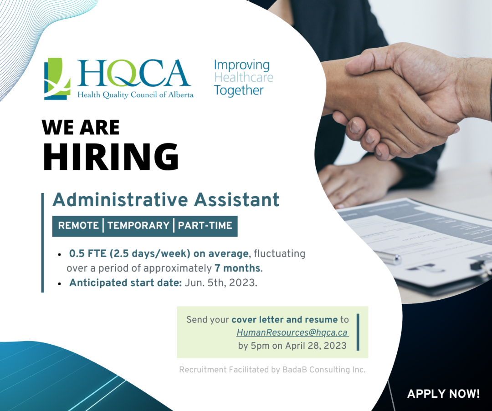
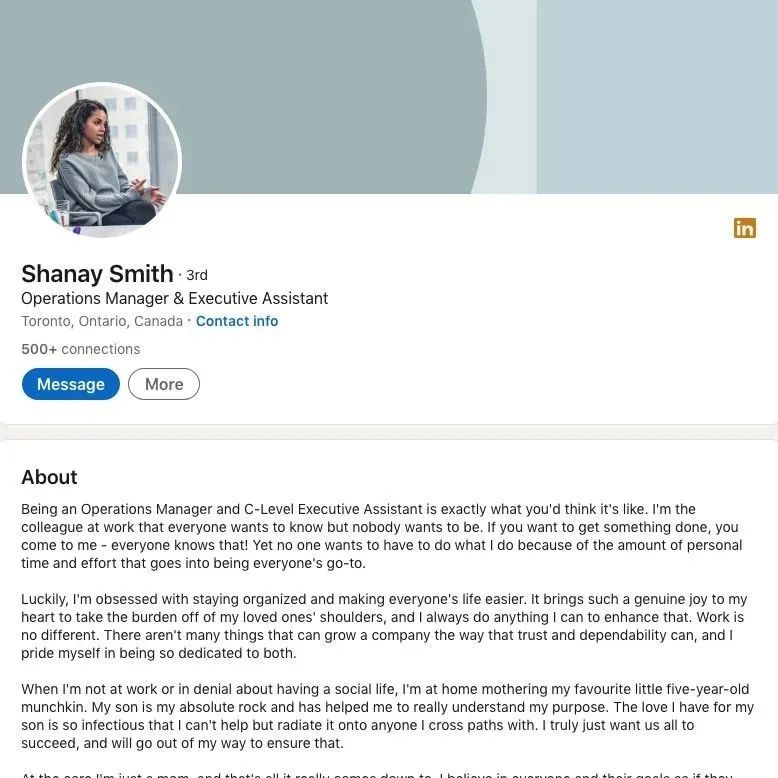

# 无标题

**链接地址:** http://mp.weixin.qq.com/s?__biz=MzI4NDYyNjAwNw==&mid=2247487188&idx=1&sn=2fb7cc885a630b4ad1f84c371df7a7ce&chksm=ebf9d3ecdc8e5afae86ee06eee34afde0ebbb54feccb094b2ecaf024a3b40d0ed9815b95805e&mpshare=1&scene=2&srcid=04240fAg9p1KR5hVifdrwT2p&sharer_sharetime=1682290309402&sharer_shareid=77848a6b3852ae4dcb6c74ffee84743c#rd
**作者:** 欢迎转发
**获取时间:** 2025/8/28 19:11:19
**图片数量:** 14

---

## 原始HTML内容

<section style="font-size: 16px;"><section style="text-align: center;justify-content: center;margin-top: 10px;margin-right: 0%;margin-left: 0%;display: flex;flex-flow: row nowrap;" powered-by="xiumi.us"><section style="display: inline-block;vertical-align: bottom;width: auto;box-shadow: rgb(0, 0, 0) 0px 0px 0px;min-width: 10%;flex: 0 0 auto;height: auto;align-self: flex-end;margin-right: -17px;"><section style="transform: translate3d(1px, 0px, 0px);margin-right: 0%;margin-bottom: 2px;margin-left: 0%;" powered-by="xiumi.us"><section style="font-size: 18px;color: rgb(111, 128, 255);letter-spacing: 2px;line-height: 1;text-shadow: rgb(255, 255, 255) 0px 0px 5px, rgb(255, 255, 255) 0px 0px 5px;text-align: justify;">

</section></section></section></section><section style="margin: 20px 0%;" powered-by="xiumi.us"><section style="letter-spacing: 2px;font-size: 14px;color: rgb(121, 121, 121);padding-right: 20px;padding-left: 20px;line-height: 2;">
BADAB Consulting是一家成立于加拿大的<strong>人力资源咨询公司</strong>。今天，我们将要给大家分享一个阿省的远程办公<strong>兼职工作机会</strong>：
</section></section><section style="display: flex;flex-flow: row nowrap;justify-content: flex-start;" powered-by="xiumi.us"><section style="display: inline-block;vertical-align: middle;width: auto;flex: 100 100 0%;align-self: center;height: auto;"><section style="margin-top: 0.5em;margin-bottom: 0.5em;" powered-by="xiumi.us"><section style="background-color: rgba(34, 82, 237, 0.14);height: 2px;"><svg viewBox="0 0 1 1" style="float:left;line-height:0;width:0;vertical-align:top;"></svg></section></section><section style="margin-top: 0.5em;margin-bottom: 0.5em;" powered-by="xiumi.us"><section style="background-color: rgba(34, 82, 237, 0.14);height: 2px;"><svg viewBox="0 0 1 1" style="float:left;line-height:0;width:0;vertical-align:top;"></svg></section></section><section style="margin-top: 0.5em;margin-bottom: 0.5em;" powered-by="xiumi.us"><section style="background-color: rgba(34, 82, 237, 0.14);height: 2px;"><svg viewBox="0 0 1 1" style="float:left;line-height:0;width:0;vertical-align:top;"></svg></section></section></section></section><section style="margin-top: 8px;margin-right: 0%;margin-left: 0%;" powered-by="xiumi.us"><section style="background-image: linear-gradient(to right, rgb(85, 167, 255), rgb(122, 104, 255));height: 2px;"><svg viewBox="0 0 1 1" style="float:left;line-height:0;width:0;vertical-align:top;"></svg></section></section><section style="margin-right: 0%;margin-bottom: 10px;margin-left: 0%;justify-content: flex-start;display: flex;flex-flow: row nowrap;" powered-by="xiumi.us"><section style="display: inline-block;width: 100%;vertical-align: top;background-color: rgba(34, 82, 237, 0.07);padding: 15px;align-self: flex-start;flex: 0 0 auto;"><section style="text-align: center;margin-right: 0%;margin-left: 0%;line-height: 0;" powered-by="xiumi.us"><section style="vertical-align: middle;display: inline-block;line-height: 0;"></section></section>
 

 
<section style="display: flex;flex-flow: row nowrap;margin-right: 0%;margin-left: 0%;justify-content: flex-start;" powered-by="xiumi.us"><section style="display: inline-block;vertical-align: top;width: auto;flex: 0 0 auto;align-self: stretch;min-width: 10%;height: auto;background-image: linear-gradient(to right, rgb(135, 69, 255) 0%, rgb(74, 179, 255) 100%);"><section style="margin: 6px 0%;" powered-by="xiumi.us"><section style="font-size: 12px;color: rgb(244, 244, 244);text-align: center;padding-right: 10px;padding-left: 10px;line-height: 1.3;letter-spacing: 0px;">
公司

介绍
</section></section></section><section style="display: inline-block;vertical-align: top;width: auto;flex: 100 100 0%;align-self: stretch;height: auto;background-image: linear-gradient(to right, rgb(244, 238, 255) 0%, rgb(245, 251, 255) 100%);"><section style="margin-top: 6px;margin-right: 0%;margin-left: 0%;" powered-by="xiumi.us"><section style="color: rgb(34, 82, 237);padding-right: 12px;padding-left: 12px;letter-spacing: 0.6px;line-height: 2;">
<strong>ABOUT US</strong>
</section></section></section></section><section style="justify-content: flex-start;display: flex;flex-flow: row nowrap;" powered-by="xiumi.us"><section style="display: inline-block;width: 100%;vertical-align: top;padding-left: 20px;align-self: flex-start;flex: 0 0 auto;"><section style="justify-content: flex-start;display: flex;flex-flow: row nowrap;" powered-by="xiumi.us"><section style="display: inline-block;width: 100%;vertical-align: top;border-left: 1px solid rgb(111, 128, 255);border-bottom-left-radius: 0px;padding-right: 10px;padding-bottom: 10px;padding-left: 15px;align-self: flex-start;flex: 0 0 auto;">
 
<section style="text-align: left;" powered-by="xiumi.us">
Are you keenly interested in Alberta’s healthcare system? Do you enjoy working on complex, meaningful projects?

&nbsp;

The Health Quality Council of Alberta is a provincial agency that brings together patients, families, and our partners from across healthcare and academia to inspire improvement in patient safety, person‐centred care, and health service quality. Our values are the driving force behind everything we do: People, Evidence, Engagement, Inclusivity, Integrity, and Independence propel our teams to excellence.&nbsp;

 
</section></section></section></section></section>
 
<section style="display: flex;flex-flow: row nowrap;margin-right: 0%;margin-left: 0%;justify-content: flex-start;" powered-by="xiumi.us"><section style="display: inline-block;vertical-align: top;width: auto;flex: 0 0 auto;align-self: stretch;min-width: 10%;height: auto;background-image: linear-gradient(to right, rgb(135, 69, 255) 0%, rgb(74, 179, 255) 100%);"><section style="margin: 6px 0%;" powered-by="xiumi.us"><section style="font-size: 12px;color: rgb(244, 244, 244);text-align: center;padding-right: 10px;padding-left: 10px;line-height: 1.3;letter-spacing: 0px;">
职位

介绍
</section></section></section><section style="display: inline-block;vertical-align: top;width: auto;flex: 100 100 0%;align-self: stretch;height: auto;background-image: linear-gradient(to right, rgb(244, 238, 255) 0%, rgb(245, 251, 255) 100%);"><section style="margin-top: 6px;margin-right: 0%;margin-left: 0%;" powered-by="xiumi.us"><section style="color: rgb(34, 82, 237);padding-right: 12px;padding-left: 12px;letter-spacing: 0.6px;line-height: 2;">
<strong>JOB DESCRIPTION</strong>
</section></section></section></section><section style="justify-content: flex-start;display: flex;flex-flow: row nowrap;" powered-by="xiumi.us"><section style="display: inline-block;width: 100%;vertical-align: top;padding-left: 20px;align-self: flex-start;flex: 0 0 auto;"><section style="justify-content: flex-start;display: flex;flex-flow: row nowrap;" powered-by="xiumi.us"><section style="display: inline-block;width: 100%;vertical-align: top;border-left: 1px solid rgb(111, 128, 255);border-bottom-left-radius: 0px;padding-right: 10px;padding-bottom: 10px;padding-left: 15px;align-self: flex-start;flex: 0 0 auto;">
 
<section style="text-align: left;" powered-by="xiumi.us">
In this role, you will provide a wide variety of administrative support to a one-time HQCA project. You will support the Project Manager in project support, calendar management, meeting arrangement and note taking, documentation preparation and formatting, various correspondence and communications, expense claims, etc.&nbsp;

 
<ul class="list-paddingleft-1" style="padding-left: 40px;list-style-position: outside;"><li>
This is a temporary position estimated to be <strong>0.5 FTE (2.5 days/week) on average</strong>; fluctuating over a period of approximately <strong>7 months</strong> but could require more time at different phases of the project.
</li><li>
This position will be mostly remote, with minimal office time.
</li><li>
<strong>Anticipated start date:</strong> Jun. 5th, 2023.&nbsp;
</li></ul>
 
</section></section></section></section></section><section style="display: flex;flex-flow: row nowrap;margin-right: 0%;margin-left: 0%;justify-content: flex-start;" powered-by="xiumi.us"><section style="display: inline-block;vertical-align: top;width: auto;flex: 0 0 auto;align-self: stretch;min-width: 10%;height: auto;background-image: linear-gradient(to right, rgb(135, 69, 255) 0%, rgb(74, 179, 255) 100%);"><section style="margin: 6px 0%;" powered-by="xiumi.us"><section style="font-size: 12px;color: rgb(244, 244, 244);text-align: center;padding-right: 10px;padding-left: 10px;line-height: 1.3;letter-spacing: 0px;">
职位

要求
</section></section></section><section style="display: inline-block;vertical-align: top;width: auto;flex: 100 100 0%;align-self: stretch;height: auto;background-image: linear-gradient(to right, rgb(244, 238, 255) 0%, rgb(245, 251, 255) 100%);"><section style="margin-top: 6px;margin-right: 0%;margin-left: 0%;" powered-by="xiumi.us"><section style="color: rgb(34, 82, 237);padding-right: 12px;padding-left: 12px;letter-spacing: 0.6px;line-height: 2;">
<strong>REQUIREMENTS</strong>
</section></section></section></section><section style="justify-content: flex-start;display: flex;flex-flow: row nowrap;" powered-by="xiumi.us"><section style="display: inline-block;width: 100%;vertical-align: top;padding-left: 20px;align-self: flex-start;flex: 0 0 auto;"><section style="justify-content: flex-start;display: flex;flex-flow: row nowrap;" powered-by="xiumi.us"><section style="display: inline-block;width: 100%;vertical-align: top;border-left: 1px solid rgb(111, 128, 255);border-bottom-left-radius: 0px;padding-right: 10px;padding-bottom: 10px;padding-left: 15px;align-self: flex-start;flex: 0 0 auto;"><section style="margin: 10px 0% 6px;" powered-by="xiumi.us"><section style="font-size: 14px;letter-spacing: 0px;line-height: 1.6;text-align: left;"><ul class="list-paddingleft-1" style="padding-left: 40px;list-style-position: outside;"><li>
<strong>Flexibility </strong>in your schedule to accommodate meetings (dates/times may vary). 
</li><li>
You are a <strong>people-oriented, detailed, resourceful, and proactive</strong> professional.
</li><li>
&nbsp;You will work with confidential information, which requires you to maintain confidentiality and professionalism at all times.
</li><li>
Collaboration and teamwork are essential to the success of the project.
</li><li>
High School Diploma is the minimum; post-secondary Certificate or Diploma in Office Administration is preferred.
</li><li>
<strong>5+ years’</strong>office administration experience in a broad range of administrative functions.
</li><li>
Advanced expertise in Word, Excel, PowerPoint, Outlook, Adobe Acrobat, Microsoft Project, SharePoint, MS Teams, and Zoom.&nbsp;
</li></ul></section></section>
<strong>注：仅接受符合5年及以上相关工作经验的简历</strong>

 
</section></section></section></section><section style="display: flex;flex-flow: row nowrap;margin-right: 0%;margin-left: 0%;justify-content: flex-start;" powered-by="xiumi.us"><section style="display: inline-block;vertical-align: top;width: auto;flex: 0 0 auto;align-self: stretch;min-width: 10%;height: auto;background-image: linear-gradient(to right, rgb(135, 69, 255) 0%, rgb(74, 179, 255) 100%);"><section style="margin: 6px 0%;" powered-by="xiumi.us"><section style="font-size: 12px;color: rgb(244, 244, 244);text-align: center;padding-right: 10px;padding-left: 10px;line-height: 1.3;letter-spacing: 0px;">
职员

责任 
</section></section></section><section style="display: inline-block;vertical-align: top;width: auto;flex: 100 100 0%;align-self: stretch;height: auto;background-image: linear-gradient(to right, rgb(244, 238, 255) 0%, rgb(245, 251, 255) 100%);"><section style="margin-top: 6px;margin-right: 0%;margin-left: 0%;" powered-by="xiumi.us"><section style="color: rgb(34, 82, 237);padding-right: 12px;padding-left: 12px;letter-spacing: 0.6px;line-height: 2;">
<strong>JOB DUTIES</strong>
</section></section></section></section><section style="justify-content: flex-start;display: flex;flex-flow: row nowrap;" powered-by="xiumi.us"><section style="display: inline-block;width: 100%;vertical-align: top;padding-left: 20px;align-self: flex-start;flex: 0 0 auto;"><section style="justify-content: flex-start;display: flex;flex-flow: row nowrap;" powered-by="xiumi.us"><section style="display: inline-block;width: 100%;vertical-align: top;border-left: 1px solid rgb(111, 128, 255);border-bottom-left-radius: 0px;padding-right: 10px;padding-bottom: 10px;padding-left: 15px;align-self: flex-start;flex: 0 0 auto;"><section style="margin: 10px 0% 6px;" powered-by="xiumi.us"><section style="font-size: 14px;letter-spacing: 0px;line-height: 1.6;text-align: left;">
<strong>Document production and management</strong> 
<ul class="list-paddingleft-1" style="padding-left: 40px;list-style-position: outside;"><li>
Format documents, reports, and presentations using the Microsoft Office suite of tools and following HQCA publication standards.
</li><li>
Maintain electronic and hardcopy documentation including collection, filing, storage, recording, and maintenance.
</li><li>
Develop, collect, maintain, and distribute information through the use of SharePoint, databases, spreadsheets, tables, emails, etc., ensuring information integrity and accuracy.
</li><li>
Track action items and issue logs.
</li><li>
Create and submit expense claims as per HQCA policy.
</li></ul>
 

<strong>Meeting management</strong>
<ul class="list-paddingleft-1" style="padding-left: 40px;list-style-position: outside;"><li>
Provide calendar management by coordinating with internal and external stakeholders to schedule meetings virtually and in-person.
</li><li>
Provide all meeting management functions including the arrangement of tele- and video conferences, production of agendas, minute taking, and ensure required documents are provided to meeting attendees.
</li><li>
Support video and teleconferences and manage technical issues.
</li></ul></section></section>
 
</section></section></section></section><section style="justify-content: flex-start;display: flex;flex-flow: row nowrap;" powered-by="xiumi.us"><section style="display: inline-block;width: 100%;vertical-align: top;padding-left: 20px;align-self: flex-start;flex: 0 0 auto;"><section style="text-align: center;margin-top: 10px;margin-bottom: 10px;line-height: 0;" powered-by="xiumi.us"><section style="vertical-align: middle;display: inline-block;line-height: 0;"></section></section></section></section>
 
<section style="text-align: right;justify-content: flex-end;margin: -20px 0% 10px;display: flex;flex-flow: row nowrap;" powered-by="xiumi.us"><section style="display: inline-block;width: 100%;vertical-align: top;background-color: rgb(239, 243, 254);flex: 0 0 auto;height: auto;padding-right: 20px;padding-bottom: 10px;padding-left: 20px;align-self: flex-start;"><section style="font-size: 0px;justify-content: flex-end;display: flex;flex-flow: row nowrap;margin-top: -10px;margin-bottom: 10px;" powered-by="xiumi.us"><section style="display: inline-block;width: 50%;vertical-align: top;flex: 0 0 auto;height: auto;align-self: flex-start;"><section style="margin-right: 0%;margin-bottom: 4px;margin-left: 0%;opacity: 0.62;" powered-by="xiumi.us"><section style="background-image: linear-gradient(to right, rgb(135, 69, 255) 0%, rgb(74, 179, 255) 100%);height: 1px;"><svg viewBox="0 0 1 1" style="float:left;line-height:0;width:0;vertical-align:top;"></svg></section></section></section></section><section style="text-align: left;justify-content: flex-start;display: flex;flex-flow: row nowrap;margin-bottom: 10px;" powered-by="xiumi.us"><section style="display: inline-block;width: auto;vertical-align: top;min-width: 10%;flex: 0 0 auto;height: auto;background-color: rgb(111, 128, 255);align-self: flex-start;"><section style="font-size: 12px;text-align: center;padding-right: 4px;padding-left: 4px;color: rgb(239, 243, 254);letter-spacing: 0px;line-height: 2;" powered-by="xiumi.us">
<strong>联系方式</strong>
</section></section></section><section style="font-size: 14px;text-align: justify;line-height: 1.8;" powered-by="xiumi.us">
 

Send your cover letter and resume to: <strong>HumanResources@hqca.ca&nbsp;</strong>

by 5pm on April 28, 2023.&nbsp;

 
</section><section style="text-align: justify;" powered-by="xiumi.us">
<strong>注：仅接受符合5年及以上相关工作经验的简历</strong>
</section><section style="text-align: center;margin-top: 10px;margin-bottom: 10px;line-height: 0;" powered-by="xiumi.us"><section style="vertical-align: middle;display: inline-block;line-height: 0;"></section></section><section style="font-size: 14px;text-align: justify;line-height: 1.8;" powered-by="xiumi.us">
HQCA is dedicated to developing a supportive and inclusive workplace and we are committed to building an environment that represents a variety of backgrounds, cultures, perspectives, and skills, which reflect the people we serve. We thank all applicants for their interest, however only those selected for an interview will be contacted.&nbsp; The successful candidate will be required to provide professional references and to undergo a satisfactory criminal record check prior to the commencement of employment.&nbsp;
</section></section></section></section></section><section style="margin-top: 8px;margin-right: 0%;margin-left: 0%;" powered-by="xiumi.us"><section style="background-image: linear-gradient(to right, rgb(85, 167, 255), rgb(122, 104, 255));height: 2px;"><svg viewBox="0 0 1 1" style="float:left;line-height:0;width:0;vertical-align:top;"></svg></section></section><section style="margin: 10px 0%;" powered-by="xiumi.us"><section style="font-size: 15px;letter-spacing: 0px;line-height: 2;padding-right: 15px;padding-left: 15px;text-align: center;">
<strong>本职位信息由BADAB Consulting Inc.整理发布</strong>
</section></section>
 
<section style="margin: 20px 0%;" powered-by="xiumi.us"><section style="font-size: 14px;text-align: center;color: rgba(51, 51, 51, 0.61);letter-spacing: 2px;padding-right: 20px;padding-left: 20px;line-height: 2;">
<strong>好的工作机会不等人！</strong>

在你犹豫的片刻之间，

或许你心仪的Offer已经被<strong>发到了别人的手里</strong>！

 

如果你在<strong>求职就业</strong>方面需要帮助，

请尽快<strong>联系我们</strong>吧！
</section></section>
 
<section style="margin: 10px 0%;text-align: left;justify-content: flex-start;display: flex;flex-flow: row nowrap;" powered-by="xiumi.us"><section style="display: inline-block;width: 100%;vertical-align: top;background-color: rgb(249, 245, 239);padding: 8px;box-shadow: rgb(207, 207, 207) 0.707107px 0.707107px 2px;align-self: flex-start;flex: 0 0 auto;"><section style="text-align: justify;" powered-by="xiumi.us">
 
</section><section style="text-align: center;margin-right: 0%;margin-bottom: 20px;margin-left: 0%;justify-content: center;display: flex;flex-flow: row nowrap;" powered-by="xiumi.us"><section style="display: inline-block;vertical-align: middle;width: 41%;align-self: center;flex: 0 0 auto;"><section style="justify-content: center;display: flex;flex-flow: row nowrap;" powered-by="xiumi.us"><section style="display: inline-block;vertical-align: top;width: 50%;box-shadow: rgb(0, 0, 0) 0px 0px 0px;align-self: flex-start;flex: 0 0 auto;"><section style="margin-right: 0%;margin-left: 0%;" powered-by="xiumi.us"><section style="padding: 4px;display: inline-block;background-color: rgb(237, 128, 15);"><section style="border-color: rgb(255, 255, 255);width: 1.6em;height: 1.6em;border-style: solid;border-width: 1px;font-size: 28px;line-height: 1.5em;color: rgb(255, 255, 255);">
號
</section></section></section></section><section style="display: inline-block;vertical-align: top;width: 50%;align-self: flex-start;flex: 0 0 auto;"><section style="margin-right: 0%;margin-left: 0%;" powered-by="xiumi.us"><section style="padding: 4px;display: inline-block;background-color: rgb(237, 128, 15);"><section style="border-color: white;width: 1.6em;height: 1.6em;border-style: solid;border-width: 1px;font-size: 28px;line-height: 1.5em;color: rgb(255, 255, 255);">
外
</section></section></section></section></section></section><section style="display: inline-block;vertical-align: middle;width: 59%;align-self: center;flex: 0 0 auto;"><section style="line-height: 1.4;" powered-by="xiumi.us">
<strong>小红书，</strong><strong style="font-size: 18px;color: rgb(180, 38, 30);">我们来啦！</strong>
</section></section></section><section style="text-align: justify;" powered-by="xiumi.us">
 
</section><section style="text-align: justify;padding-right: 15px;padding-left: 15px;" powered-by="xiumi.us">
久等了，加拿大的朋友们！BadaB Consulting Inc. 终于入驻小红书啦！<strong>（小红书ID：5288561530）</strong>
</section><section style="text-align: center;margin-top: 10px;margin-bottom: 10px;line-height: 0;" powered-by="xiumi.us"><section style="vertical-align: middle;display: inline-block;line-height: 0;box-shadow: rgb(0, 0, 0) 0px 0px 0px;"></section></section><section style="text-align: center;font-size: 12px;color: rgb(180, 180, 180);" powered-by="xiumi.us">
扫描二维码即刻关注我们吧！
</section><section style="color: rgb(62, 62, 62);text-align: center;" powered-by="xiumi.us">
<strong> </strong>

<strong>如果你需要一对一</strong>

<strong>职业规划和系统的建议，</strong>

<strong>请找我们！</strong>

<strong> </strong>

<strong>如果你需要修改简历和cover letter，</strong>

<strong>培训面试，建立LinkedIn主页</strong>

<strong>请找我们！</strong>

<strong> </strong>

<strong>如果你需要来自</strong>

<strong>人力资源顾问的</strong><strong>模拟面试，</strong>

<strong>请找我们！</strong>

<strong> </strong>
</section><section style="justify-content: flex-start;display: flex;flex-flow: row nowrap;margin-top: 10px;margin-bottom: 10px;" powered-by="xiumi.us"><section style="display: inline-block;vertical-align: middle;width: auto;align-self: center;flex: 100 100 0%;padding-left: 10px;height: auto;"><section style="transform: rotateZ(357deg);" powered-by="xiumi.us"><section style="justify-content: flex-start;display: flex;flex-flow: row nowrap;"><section style="display: inline-block;width: 100%;vertical-align: top;align-self: flex-start;flex: 0 0 auto;"><section style="text-align: center;margin-top: 10px;margin-bottom: -10px;isolation: isolate;line-height: 0;" powered-by="xiumi.us"><section style="vertical-align: middle;display: inline-block;line-height: 0;width: 23px;height: auto;"></section></section><section style="text-align: center;justify-content: center;display: flex;flex-flow: row nowrap;margin-bottom: 10px;" powered-by="xiumi.us"><section style="display: inline-block;width: 100%;vertical-align: top;align-self: flex-start;flex: 0 0 auto;background-color: rgb(255, 255, 255);padding: 15px 15px 20px;height: auto;box-shadow: rgb(147, 147, 147) 0px 0px 5px;"><section style="margin-bottom: 20px;line-height: 0;" powered-by="xiumi.us"><section style="vertical-align: middle;display: inline-block;line-height: 0;"></section></section></section></section></section></section></section></section><section style="display: inline-block;vertical-align: middle;width: 45%;align-self: center;flex: 0 0 auto;height: auto;margin-right: -15px;margin-left: -15px;z-index: 3;"><section style="transform: rotateZ(5deg);" powered-by="xiumi.us"><section style="justify-content: flex-start;display: flex;flex-flow: row nowrap;"><section style="display: inline-block;width: 100%;vertical-align: top;align-self: flex-start;flex: 0 0 auto;"><section style="text-align: center;margin-top: 10px;margin-bottom: -10px;isolation: isolate;line-height: 0;" powered-by="xiumi.us"><section style="vertical-align: middle;display: inline-block;line-height: 0;width: 23px;height: auto;"></section></section><section style="text-align: center;justify-content: center;display: flex;flex-flow: row nowrap;margin-bottom: 10px;" powered-by="xiumi.us"><section style="display: inline-block;width: 100%;vertical-align: top;align-self: flex-start;flex: 0 0 auto;background-color: rgb(255, 255, 255);padding: 17px 17px 20px;height: auto;box-shadow: rgb(147, 147, 147) 0px 0px 5px;"><section style="margin-bottom: 20px;line-height: 0;" powered-by="xiumi.us"><section style="vertical-align: middle;display: inline-block;line-height: 0;"></section></section></section></section></section></section></section></section><section style="display: inline-block;vertical-align: middle;width: auto;align-self: center;flex: 100 100 0%;height: auto;padding-right: 10px;"><section style="transform: rotateZ(357deg);" powered-by="xiumi.us"><section style="justify-content: flex-start;display: flex;flex-flow: row nowrap;"><section style="display: inline-block;width: 100%;vertical-align: top;align-self: flex-start;flex: 0 0 auto;"><section style="text-align: center;margin-top: 10px;margin-bottom: -10px;isolation: isolate;line-height: 0;" powered-by="xiumi.us"><section style="vertical-align: middle;display: inline-block;line-height: 0;width: 23px;height: auto;"></section></section><section style="text-align: center;justify-content: center;display: flex;flex-flow: row nowrap;margin-bottom: 10px;" powered-by="xiumi.us"><section style="display: inline-block;width: 100%;vertical-align: top;align-self: flex-start;flex: 0 0 auto;background-color: rgb(255, 255, 255);padding: 15px 15px 20px;height: auto;box-shadow: rgb(147, 147, 147) 0px 0px 5px;"><section style="margin-bottom: 20px;line-height: 0;" powered-by="xiumi.us"><section style="vertical-align: middle;display: inline-block;line-height: 0;"></section></section></section></section></section></section></section></section></section><section style="color: rgb(62, 62, 62);text-align: center;" powered-by="xiumi.us">
 
</section><section style="text-align: justify;padding-right: 15px;padding-left: 15px;" powered-by="xiumi.us">
BadaB会不定期地在小红书主页上更新大家最想了解的<strong>北美职场经验和建议</strong>，还有一些<strong>内部的岗位招聘信</strong>息哦~希望找工作和就业中的打工人们关注我学起来！<strong>让我们一起在职场中乘风破浪，披荆斩棘吧！</strong>
</section><section style="text-align: justify;" powered-by="xiumi.us">
 
</section></section></section>
 
<section style="margin: 10px 0%;text-align: center;justify-content: center;display: flex;flex-flow: row nowrap;" powered-by="xiumi.us"><section style="display: inline-block;width: 100%;vertical-align: top;background-color: rgba(255, 174, 174, 0.13);padding-right: 10px;padding-left: 10px;align-self: flex-start;flex: 0 0 auto;"><section style="display: flex;flex-flow: row nowrap;margin: -5px 0%;justify-content: center;" powered-by="xiumi.us"><section style="display: inline-block;width: auto;vertical-align: middle;min-width: 10%;flex: 0 0 auto;height: auto;border-style: solid;border-width: 1px;border-color: rgb(237, 128, 15);padding: 4px;background-color: rgb(255, 255, 255);box-shadow: rgb(255, 255, 255) 0px 0px 0px inset;align-self: center;"><section style="justify-content: center;display: flex;flex-flow: row nowrap;" powered-by="xiumi.us"><section style="display: inline-block;width: 100%;vertical-align: top;border-width: 0px;background-color: rgba(255, 174, 174, 0.13);padding-right: 10px;padding-left: 10px;align-self: flex-start;flex: 0 0 auto;"><section style="color: rgb(106, 106, 106);letter-spacing: 1px;text-align: justify;" powered-by="xiumi.us">
<strong>关于我们</strong>
</section></section></section></section></section></section></section>
 
<section style="text-align: center;margin: 10px 0%;justify-content: center;display: flex;flex-flow: row nowrap;" powered-by="xiumi.us"><section style="display: inline-block;width: 90%;vertical-align: top;border-style: solid;border-width: 2px;border-color: rgb(237, 128, 15);letter-spacing: 0px;padding: 10px;align-self: flex-start;flex: 0 0 auto;"><section style="justify-content: center;display: flex;flex-flow: row nowrap;" powered-by="xiumi.us"><section style="display: inline-block;vertical-align: middle;width: 40%;align-self: center;flex: 0 0 auto;"><section style="margin-right: 0%;margin-left: 0%;line-height: 0;" powered-by="xiumi.us"><section style="vertical-align: middle;display: inline-block;line-height: 0;border-width: 0px;width: 100%;"></section></section></section><section style="display: inline-block;vertical-align: middle;width: 60%;padding-left: 10px;align-self: center;flex: 0 0 auto;"><section style="margin-right: 0%;margin-bottom: 5px;margin-left: 0%;" powered-by="xiumi.us"><section style="display: inline-block;border-width: 2px;border-style: solid;border-color: rgb(237, 128, 15);padding: 0.1em 0.3em;background-color: rgb(237, 128, 15);color: rgb(255, 255, 255);font-size: 12px;">
<strong>Ada&nbsp; Tai</strong>
</section></section><section style="margin-right: 0%;margin-left: 0%;" powered-by="xiumi.us"><section style="font-size: 13px;">
<strong>MBA, CPHR, SHRM-SCP</strong>
</section></section><section style="justify-content: center;display: flex;flex-flow: row nowrap;" powered-by="xiumi.us"><section style="display: inline-block;vertical-align: middle;width: 10%;border-width: 0px;align-self: center;flex: 0 0 auto;"><section style="margin: 5px 0%;text-align: left;font-size: 0px;" powered-by="xiumi.us"><section style="padding: 4px;display: inline-block;background-color: rgb(237, 128, 15);"><section style="border-color: rgba(255, 255, 255, 0);width: 1.6em;height: 1.6em;border-style: solid;border-width: 1px;text-align: center;line-height: 1.5em;color: rgb(255, 255, 255);">
 
</section></section></section></section><section style="display: inline-block;vertical-align: middle;width: 90%;align-self: center;flex: 0 0 auto;"><section style="font-size: 12px;text-align: justify;" powered-by="xiumi.us">
修改简历与求职信
</section></section></section><section style="justify-content: center;display: flex;flex-flow: row nowrap;" powered-by="xiumi.us"><section style="display: inline-block;vertical-align: middle;width: 10%;align-self: center;flex: 0 0 auto;"><section style="margin: 5px 0%;text-align: left;font-size: 0px;" powered-by="xiumi.us"><section style="padding: 4px;display: inline-block;background-color: rgb(237, 128, 15);"><section style="border-color: rgba(255, 255, 255, 0);width: 1.6em;height: 1.6em;border-style: solid;border-width: 1px;text-align: center;line-height: 1.5em;color: rgb(255, 255, 255);">
 
</section></section></section></section><section style="display: inline-block;vertical-align: middle;width: 90%;align-self: center;flex: 0 0 auto;"><section style="font-size: 12px;text-align: justify;" powered-by="xiumi.us">
培训面试
</section></section></section><section style="justify-content: center;display: flex;flex-flow: row nowrap;" powered-by="xiumi.us"><section style="display: inline-block;vertical-align: middle;width: 10%;border-width: 0px;align-self: center;flex: 0 0 auto;"><section style="margin: 5px 0%;text-align: left;font-size: 0px;" powered-by="xiumi.us"><section style="padding: 4px;display: inline-block;background-color: rgb(237, 128, 15);"><section style="border-color: rgba(255, 255, 255, 0);width: 1.6em;height: 1.6em;border-style: solid;border-width: 1px;text-align: center;line-height: 1.5em;color: rgb(255, 255, 255);">
 
</section></section></section></section><section style="display: inline-block;vertical-align: middle;width: 90%;align-self: center;flex: 0 0 auto;"><section style="font-size: 12px;text-align: justify;" powered-by="xiumi.us">
建立LinkedIn Profile
</section></section></section><section style="justify-content: center;display: flex;flex-flow: row nowrap;" powered-by="xiumi.us"><section style="display: inline-block;vertical-align: middle;width: 10%;align-self: center;flex: 0 0 auto;"><section style="margin: 5px 0%;text-align: left;font-size: 0px;" powered-by="xiumi.us"><section style="padding: 4px;display: inline-block;background-color: rgb(237, 128, 15);"><section style="border-color: rgba(255, 255, 255, 0);width: 1.6em;height: 1.6em;border-style: solid;border-width: 1px;text-align: center;line-height: 1.5em;color: rgb(255, 255, 255);">
 
</section></section></section></section><section style="display: inline-block;vertical-align: middle;width: 90%;align-self: center;flex: 0 0 auto;"><section style="font-size: 12px;text-align: justify;" powered-by="xiumi.us">
职业评估与规划、社交培训
</section></section></section><section style="justify-content: center;display: flex;flex-flow: row nowrap;" powered-by="xiumi.us"><section style="display: inline-block;vertical-align: middle;width: 10%;align-self: center;flex: 0 0 auto;"><section style="margin: 5px 0%;text-align: left;font-size: 0px;" powered-by="xiumi.us"><section style="padding: 4px;display: inline-block;background-color: rgb(237, 128, 15);"><section style="border-color: rgba(255, 255, 255, 0);width: 1.6em;height: 1.6em;border-style: solid;border-width: 1px;text-align: center;line-height: 1.5em;color: rgb(255, 255, 255);">
 
</section></section></section></section><section style="display: inline-block;vertical-align: middle;width: 90%;align-self: center;flex: 0 0 auto;"><section style="font-size: 12px;text-align: justify;" powered-by="xiumi.us">
求职、职场文化等多种讲座
</section></section></section></section></section></section></section><section style="margin: 20px 0%;" powered-by="xiumi.us"><section style="letter-spacing: 2px;font-size: 14px;color: rgba(51, 51, 51, 0.61);padding-right: 20px;padding-left: 20px;line-height: 2;">
 

Ada Tai 毕业于埃尔伯塔大学工商管理硕士学位,并拥有加拿大和美国“注册人力资源管理师”资格证。十几年来 Ada 一直在不同的领域从事人力资源的管理工作。在最近的几年时间里，Ada与她的团队BadaB Consulting Inc. 已成功帮助超过500名不同年龄和职业背景的求职者找到心仪的工作，并帮助他们克服职场困难，向理想的职业成长方向稳步前进。
</section></section>
 
<section style="display: flex;flex-flow: row nowrap;margin: 10px 0%;text-align: center;justify-content: center;" powered-by="xiumi.us"><section style="display: inline-block;vertical-align: middle;width: auto;flex: 0 0 0%;align-self: center;height: auto;"><section style="" powered-by="xiumi.us"><section style="display: inline-block;width: 90px;height: 150px;vertical-align: top;overflow: hidden;border-style: solid;border-width: 4px;border-color: rgb(255, 226, 196);"><svg viewBox="0 0 1 1" style="float:left;line-height:0;width:0;vertical-align:top;"></svg></section></section></section><section style="display: inline-block;vertical-align: middle;width: auto;flex: 89.2857 89.2857 0%;align-self: center;height: auto;background-color: rgb(255, 255, 255);margin-left: -65px;"><section style="display: flex;flex-flow: row nowrap;justify-content: center;" powered-by="xiumi.us"><section style="display: inline-block;vertical-align: middle;width: auto;padding-right: 5px;flex: 0 0 0%;height: auto;align-self: center;"><section style="display: flex;flex-flow: row nowrap;justify-content: center;" powered-by="xiumi.us"><section style="display: inline-block;width: 120px;vertical-align: top;flex: 0 0 auto;height: auto;align-self: flex-start;"><section style="margin-right: 0%;margin-left: 0%;line-height: 0;" powered-by="xiumi.us"><section style="vertical-align: middle;display: inline-block;line-height: 0;width: 100%;border-color: rgba(118, 178, 124, 0);border-width: 5px;border-style: solid;box-shadow: rgb(0, 0, 0) 0px 0px 0px;"></section></section></section></section></section><section style="display: inline-block;vertical-align: middle;width: auto;padding-left: 5px;flex: 100 100 0%;height: auto;align-self: center;"><section style="margin-right: 0%;margin-left: 0%;" powered-by="xiumi.us"><section style="color: rgb(121, 121, 121);font-size: 12px;text-align: justify;">
微信号 : badab101

新浪微博：BadaB_Consulting

小红书：5288561530

LinkedIn：BadaB Consulting Inc.

Facebook：BadaB Consulting Inc.

YouTube:&nbsp;BadaB Consulting Inc.

Website：www.badab101.com
</section></section></section></section></section></section>
 
</section>
 

<mp-style-type data-value="3"></mp-style-type>

---

## 纯文本内容

BADAB Consulting是一家成立于加拿大的人力资源咨询公司。今天，我们将要给大家分享一个阿省的远程办公兼职工作机会：公司介绍ABOUT USAre you keenly interested in Alberta’s healthcare system? Do you enjoy working on complex, meaningful projects? The Health Quality Council of Alberta is a provincial agency that brings together patients, families, and our partners from across healthcare and academia to inspire improvement in patient safety, person‐centred care, and health service quality. Our values are the driving force behind everything we do: People, Evidence, Engagement, Inclusivity, Integrity, and Independence propel our teams to excellence. 职位介绍JOB DESCRIPTIONIn this role, you will provide a wide variety of administrative support to a one-time HQCA project. You will support the Project Manager in project support, calendar management, meeting arrangement and note taking, documentation preparation and formatting, various correspondence and communications, expense claims, etc. This is a temporary position estimated to be 0.5 FTE (2.5 days/week) on average; fluctuating over a period of approximately 7 months but could require more time at different phases of the project.This position will be mostly remote, with minimal office time.Anticipated start date: Jun. 5th, 2023. 职位要求REQUIREMENTSFlexibility in your schedule to accommodate meetings (dates/times may vary).You are a people-oriented, detailed, resourceful, and proactive professional. You will work with confidential information, which requires you to maintain confidentiality and professionalism at all times.Collaboration and teamwork are essential to the success of the project.High School Diploma is the minimum; post-secondary Certificate or Diploma in Office Administration is preferred.5+ years’office administration experience in a broad range of administrative functions.Advanced expertise in Word, Excel, PowerPoint, Outlook, Adobe Acrobat, Microsoft Project, SharePoint, MS Teams, and Zoom. 注：仅接受符合5年及以上相关工作经验的简历职员责任JOB DUTIESDocument production and managementFormat documents, reports, and presentations using the Microsoft Office suite of tools and following HQCA publication standards.Maintain electronic and hardcopy documentation including collection, filing, storage, recording, and maintenance.Develop, collect, maintain, and distribute information through the use of SharePoint, databases, spreadsheets, tables, emails, etc., ensuring information integrity and accuracy.Track action items and issue logs.Create and submit expense claims as per HQCA policy.Meeting managementProvide calendar management by coordinating with internal and external stakeholders to schedule meetings virtually and in-person.Provide all meeting management functions including the arrangement of tele- and video conferences, production of agendas, minute taking, and ensure required documents are provided to meeting attendees.Support video and teleconferences and manage technical issues.联系方式Send your cover letter and resume to: HumanResources@hqca.ca by 5pm on April 28, 2023. 注：仅接受符合5年及以上相关工作经验的简历HQCA is dedicated to developing a supportive and inclusive workplace and we are committed to building an environment that represents a variety of backgrounds, cultures, perspectives, and skills, which reflect the people we serve. We thank all applicants for their interest, however only those selected for an interview will be contacted.  The successful candidate will be required to provide professional references and to undergo a satisfactory criminal record check prior to the commencement of employment. 本职位信息由BADAB Consulting Inc.整理发布好的工作机会不等人！在你犹豫的片刻之间，或许你心仪的Offer已经被发到了别人的手里！如果你在求职就业方面需要帮助，请尽快联系我们吧！號外小红书，我们来啦！久等了，加拿大的朋友们！BadaB Consulting Inc. 终于入驻小红书啦！（小红书ID：5288561530）扫描二维码即刻关注我们吧！如果你需要一对一职业规划和系统的建议，请找我们！如果你需要修改简历和cover letter，培训面试，建立LinkedIn主页请找我们！如果你需要来自人力资源顾问的模拟面试，请找我们！BadaB会不定期地在小红书主页上更新大家最想了解的北美职场经验和建议，还有一些内部的岗位招聘信息哦~希望找工作和就业中的打工人们关注我学起来！让我们一起在职场中乘风破浪，披荆斩棘吧！关于我们Ada  TaiMBA, CPHR, SHRM-SCP修改简历与求职信培训面试建立LinkedIn Profile职业评估与规划、社交培训求职、职场文化等多种讲座Ada Tai 毕业于埃尔伯塔大学工商管理硕士学位,并拥有加拿大和美国“注册人力资源管理师”资格证。十几年来 Ada 一直在不同的领域从事人力资源的管理工作。在最近的几年时间里，Ada与她的团队BadaB Consulting Inc. 已成功帮助超过500名不同年龄和职业背景的求职者找到心仪的工作，并帮助他们克服职场困难，向理想的职业成长方向稳步前进。微信号 : badab101新浪微博：BadaB_Consulting小红书：5288561530LinkedIn：BadaB Consulting Inc.Facebook：BadaB Consulting Inc.YouTube: BadaB Consulting Inc.Website：www.badab101.com

---

## 图片列表

-  (原始链接: https://mmbiz.qpic.cn/mmbiz_jpg/cY0qSDjdkFejxu5PxfgSAhR74mpddhUuK6qjnYRSyuibibiaEy35CRqVB5gyVmJFaPGtoQhghWibMdrgcgk8g4Oib4g/640?wx_fmt=jpeg)
-  (原始链接: https://mmbiz.qpic.cn/mmbiz_png/cY0qSDjdkFejxu5PxfgSAhR74mpddhUuorHicoRaCIDjDnXrG6qbThpaBHCvepJEooW9hMBibfPrv78sx7tiajLZQ/640?wx_fmt=png)
-  (原始链接: https://mmbiz.qpic.cn/mmbiz_png/cY0qSDjdkFejxu5PxfgSAhR74mpddhUud7CGaPUO6BOFVCV9I8kibccd4K3uNKUUSoGQacF6JVYkRQP8n1JibkLA/640?wx_fmt=png)
-  (原始链接: https://mmbiz.qpic.cn/mmbiz_png/cY0qSDjdkFejxu5PxfgSAhR74mpddhUuGa3D8NvfZ0Emg7Hx0pJiaXdmmGibeNKnATpjvZ6RtPCHD0VibCkibKzglA/640?wx_fmt=png)
-  (原始链接: https://mmbiz.qpic.cn/mmbiz_png/cY0qSDjdkFejxu5PxfgSAhR74mpddhUud7CGaPUO6BOFVCV9I8kibccd4K3uNKUUSoGQacF6JVYkRQP8n1JibkLA/640?wx_fmt=png)
-  (原始链接: https://mmbiz.qpic.cn/mmbiz_png/cY0qSDjdkFejxu5PxfgSAhR74mpddhUuQoUBrWxiafy5Ds16Co6nakD4zSwR8TfO0E0Tiav6SEdg8YCLMfyicycdA/640?wx_fmt=png)
-  (原始链接: https://mmbiz.qpic.cn/mmbiz_png/cY0qSDjdkFejxu5PxfgSAhR74mpddhUuHbQImibjH3GEYtia3ECr9HjH1GQcriamqJTUU6ucIQMvTz21nbpUphwiaQ/640?wx_fmt=png)
-  (原始链接: https://mmbiz.qpic.cn/mmbiz_jpg/cY0qSDjdkFejxu5PxfgSAhR74mpddhUuzQHSe3PFPicfL3bYdvxoxzON1umceECA8k1ZMoico3icIyrWzRqjtXbgw/640?wx_fmt=jpeg)
-  (原始链接: https://mmbiz.qpic.cn/mmbiz_png/cY0qSDjdkFejxu5PxfgSAhR74mpddhUuHbQImibjH3GEYtia3ECr9HjH1GQcriamqJTUU6ucIQMvTz21nbpUphwiaQ/640?wx_fmt=png)
-  (原始链接: https://mmbiz.qpic.cn/mmbiz_jpg/cY0qSDjdkFejxu5PxfgSAhR74mpddhUuMiagYVuKAgwRHaFjAUskOt5j2dgBSKrVFX9NQpxDQ7P5612ZFasMO8A/640?wx_fmt=jpeg)
-  (原始链接: https://mmbiz.qpic.cn/mmbiz_png/cY0qSDjdkFejxu5PxfgSAhR74mpddhUuHbQImibjH3GEYtia3ECr9HjH1GQcriamqJTUU6ucIQMvTz21nbpUphwiaQ/640?wx_fmt=png)
-  (原始链接: https://mmbiz.qpic.cn/mmbiz_jpg/cY0qSDjdkFejxu5PxfgSAhR74mpddhUuRTePcJ3x8L1uzLxQKb87MicQo8oicoSobjULrRjZ3Tbib7NEcSsBu17yQ/640?wx_fmt=jpeg)
-  (原始链接: https://mmbiz.qpic.cn/mmbiz_jpg/cY0qSDjdkFejxu5PxfgSAhR74mpddhUuIU2iaTJAZugZpzAkeGk6UgS0ypwib5ibmo8WhGUepx6ap1LsrueZoNsDA/640?wx_fmt=jpeg)
-  (原始链接: https://mmbiz.qpic.cn/mmbiz_jpg/cY0qSDjdkFejxu5PxfgSAhR74mpddhUu47Go2kzrRuhY0VkYYrNrKccheyEoE7okN6wtfwC7ZH0ylSsuyibHEaQ/640?wx_fmt=jpeg)
