# 无标题

**链接地址:** http://mp.weixin.qq.com/s?__biz=MzUyNzA2NTAwNg==&mid=2247494691&idx=1&sn=2a74c4a6d4b0f86f82a78eee1c07f834&chksm=fa07e6e2cd706ff4086e14abca134813284c09688c814c48ffb3138eb3176fb6c7d606aa6998&mpshare=1&scene=2&srcid=0629HrQgwYR0ECOic5ceDRGS&sharer_sharetime=1687980691215&sharer_shareid=77848a6b3852ae4dcb6c74ffee84743c#rd
**作者:** 你身边的签证专家
**获取时间:** 2025/8/28 19:08:47
**图片数量:** 24

---

## 原始HTML内容

<section style="font-size: 16px;"><section style="text-align: center;margin-top: 10px;margin-bottom: 10px;line-height: 0;" powered-by="xiumi.us"><section style="vertical-align: middle;display: inline-block;line-height: 0;"></section></section><section style="text-align: center;margin-top: 10px;margin-bottom: 10px;line-height: 0;" powered-by="xiumi.us"><section style="vertical-align: middle;display: inline-block;line-height: 0;"></section></section><section style="text-align: center;margin-top: 10px;margin-bottom: 10px;line-height: 0;" powered-by="xiumi.us"><section style="vertical-align: middle;display: inline-block;line-height: 0;"></section></section>
 
<section style="font-size: 19px;text-align: center;margin-top: 10px;margin-bottom: 3px;" powered-by="xiumi.us"><section style="display: inline-block;border-width: 1px;border-style: solid;border-color: rgb(188, 65, 65);background-color: rgb(188, 65, 65);width: 1.8em;height: 1.8em;line-height: 1.8em;border-radius: 100%;margin-left: auto;margin-right: auto;font-size: 16px;color: rgb(255, 255, 255);">
<strong>1</strong>
</section></section><section style="text-align: center;" powered-by="xiumi.us"><section style="display: inline-block;width: 0px;height: 0px;vertical-align: top;overflow: hidden;border-style: solid;border-width: 9px 6px 0px;border-color: rgb(188, 65, 65) rgba(255, 255, 255, 0) rgba(255, 255, 255, 0);"><svg viewBox="0 0 1 1" style="float:left;line-height:0;width:0;vertical-align:top;"></svg></section></section><section style="margin-bottom: 10px;text-align: center;justify-content: center;display: flex;flex-flow: row nowrap;" powered-by="xiumi.us"><section style="display: inline-block;width: auto;vertical-align: middle;background-color: rgba(109, 155, 209, 0.1);min-width: 10%;flex: 0 0 auto;height: auto;align-self: center;padding: 12px;"><section style="color: rgb(109, 155, 209);text-align: justify;" powered-by="xiumi.us">
<strong>史上第一次快速通道定向职位邀请</strong> 
</section></section></section>
 
<section style="font-size: 14px;padding-right: 15px;padding-left: 15px;letter-spacing: 1px;" powered-by="xiumi.us">
突发重磅！加拿大移民部于6月28日进行了<strong>首轮职位</strong>定向邀请的抽签(#252)，针对医护产业从业人员（2023-1）。邀请分数<strong>476分</strong>，<strong>500位</strong>医护行业从业人员惊喜上岸。

 
</section><section style="text-align: center;margin-top: 10px;margin-bottom: 10px;line-height: 0;" powered-by="xiumi.us"><section style="vertical-align: middle;display: inline-block;line-height: 0;width: 90%;height: auto;"></section></section><section style="font-size: 14px;padding-right: 15px;padding-left: 15px;letter-spacing: 1px;" powered-by="xiumi.us">
 

476分虽然并不是一个很低的分数，但好在移民部邀请的频次也在增加。第二轮的抽签将于7月5日进行，针对的目标人群为<strong>STEM领域（科学，技术，工程，数学）从业者</strong>，主要包括数据科学家，软件发展人员，程序员，数学家，统计学家，精算师，电气和电子工程师。<strong>目标邀请人数为1500人</strong>。

 

让我们期待下一轮分数线，新时代留学移民法律事务所在此祝所有客户朋友们：锦鲤傍身，旗开得胜！等你们的好消息！

 
</section><section style="margin: 10px 0%;text-align: left;justify-content: flex-start;display: flex;flex-flow: row nowrap;" powered-by="xiumi.us"><section style="display: inline-block;width: 100%;vertical-align: top;background-color: rgb(216, 202, 160);line-height: 0;align-self: flex-start;flex: 0 0 auto;"><section style="text-align: justify;justify-content: flex-start;display: flex;flex-flow: row nowrap;" powered-by="xiumi.us"><section style="display: inline-block;width: 100%;vertical-align: top;background-position: 0% 0%;background-repeat: repeat;background-size: 1.56658%;background-attachment: scroll;align-self: flex-start;flex: 0 0 auto;background-image: url(&quot;https://mmbiz.qpic.cn/mmbiz_png/904kUibXm7Y5uPYibp8MujZFEdRVB9jnk82gzxCB1m6oeINibX1dYdUaMTIMNibyGQITHCcyKibYasmUgYsl9T41jmA/640?wx_fmt=png&quot;);"><section style="text-align: center;" powered-by="xiumi.us"><section style="display: inline-block;width: 100%;height: 11px;vertical-align: top;overflow: hidden;background-color: rgba(255, 255, 255, 0);"><svg viewBox="0 0 1 1" style="float:left;line-height:0;width:0;vertical-align:top;"></svg></section></section></section></section></section></section><section style="font-size: 14px;padding-right: 15px;padding-left: 15px;letter-spacing: 1px;" powered-by="xiumi.us">
 

目前，移民部公布的目标邀请职位有<strong>82个</strong>。如果您的职位属于该优先邀请列表，请尽快入池，职位列表如下：

 

<strong><em>第一轮邀请特定职位（医疗行业相关）</em></strong>

 
<ul class="list-paddingleft-1" style="padding-left: 40px;list-style-position: outside;"><li>
听力学家和言语病理学家
</li><li>
脊椎按摩师
</li><li>
牙医
</li><li>
营养师和营养师
</li><li>
教育辅导员
</li><li>
全科医生和家庭医生
</li><li>
残疾人辅导员
</li><li>
运动学家和其他治疗和评估专业职业
</li><li>
执业护士
</li><li>
按摩治疗师
</li><li>
医学实验室助理及相关技术职业
</li><li>
医学实验室技术人员
</li><li>
医疗放射技术人员
</li><li>
医学超声技师
</li><li>
护士助理、勤务员和患者服务人员
</li><li>
执业护士
</li><li>
护理协调员和主管
</li><li>
职业理疗师
</li><li>
验光师
</li><li>
支持卫生服务的其他辅助职业
</li><li>
其他自然疗法实践者
</li><li>
其他健康诊断和治疗专业职业
</li><li>
治疗和评估中的其他技术职业
</li><li>
辅助医疗职业
</li><li>
药房技术助理和药房助理
</li><li>
医师助理、助产士和专职医疗专业人员
</li><li>
物理治疗师
</li><li>
心理学家
</li><li>
注册护士和注册精神科护士
</li><li>
呼吸治疗师、临床灌注师和心肺技术专家
</li><li>
临床和实验室医学专家
</li><li>
外科专家
</li><li>
咨询和相关专业治疗的治疗师
</li><li>
中医和针灸师
</li><li>
兽医
</li></ul>
 

其他类别包括：

 

科学、技术、工程和数学 (STEM) 专业

行业，如木匠、水管工和承包商

运输

农业和农产品

较强的法语语言能力

 
</section><section style="text-align: center;margin-top: 10px;margin-bottom: 10px;line-height: 0;" powered-by="xiumi.us"><section style="vertical-align: middle;display: inline-block;line-height: 0;"></section></section><section style="text-align: center;margin-top: 10px;margin-bottom: 10px;line-height: 0;" powered-by="xiumi.us"><section style="vertical-align: middle;display: inline-block;line-height: 0;"></section></section><section style="text-align: center;margin-top: 10px;margin-bottom: 10px;line-height: 0;" powered-by="xiumi.us"><section style="vertical-align: middle;display: inline-block;line-height: 0;"></section></section><section style="text-align: center;margin-top: 10px;margin-bottom: 10px;line-height: 0;" powered-by="xiumi.us"><section style="vertical-align: middle;display: inline-block;line-height: 0;"></section></section><section style="text-align: center;margin-top: 10px;margin-bottom: 10px;line-height: 0;" powered-by="xiumi.us"><section style="vertical-align: middle;display: inline-block;line-height: 0;"></section></section><section style="font-size: 14px;padding-right: 15px;padding-left: 15px;letter-spacing: 1px;" powered-by="xiumi.us">
 

详细职位列表请参考：

 

<strong>Express Entry rounds of invitations: Category-based selection - Canada.ca</strong>

 

https://www.canada.ca/en/immigration-refugees-citizenship/services/immigrate-canada/express-entry/submit-profile/rounds-invitations/category-based-selection.html

 
</section><section style="font-size: 19px;text-align: center;margin-top: 10px;margin-bottom: 3px;" powered-by="xiumi.us"><section style="display: inline-block;border-width: 1px;border-style: solid;border-color: rgb(188, 65, 65);background-color: rgb(188, 65, 65);width: 1.8em;height: 1.8em;line-height: 1.8em;border-radius: 100%;margin-left: auto;margin-right: auto;font-size: 16px;color: rgb(255, 255, 255);">
<strong>2</strong>
</section></section><section style="text-align: center;" powered-by="xiumi.us"><section style="display: inline-block;width: 0px;height: 0px;vertical-align: top;overflow: hidden;border-style: solid;border-width: 9px 6px 0px;border-color: rgb(188, 65, 65) rgba(255, 255, 255, 0) rgba(255, 255, 255, 0);"><svg viewBox="0 0 1 1" style="float:left;line-height:0;width:0;vertical-align:top;"></svg></section></section><section style="margin-bottom: 10px;text-align: center;justify-content: center;display: flex;flex-flow: row nowrap;" powered-by="xiumi.us"><section style="display: inline-block;width: auto;vertical-align: middle;background-color: rgba(109, 155, 209, 0.1);min-width: 10%;flex: 0 0 auto;height: auto;align-self: center;padding: 12px;"><section style="color: rgb(109, 155, 209);text-align: justify;" powered-by="xiumi.us">
<strong>快速通道重大改革</strong>
</section></section></section><section style="font-size: 14px;padding-right: 15px;padding-left: 15px;letter-spacing: 1px;" powered-by="xiumi.us">
 

加拿大移民部于今年六月初官宣了针对快速通道（Express Entry）的<strong>重大改革</strong>！移民部将对候选人进行定向邀请，也就是<strong>基于特定职业类别发出邀请</strong>，而不是根据分数高低进行邀请。

 
</section><section style="text-align: center;margin-top: 10px;margin-bottom: 10px;line-height: 0;" powered-by="xiumi.us"><section style="vertical-align: middle;display: inline-block;line-height: 0;width: 90%;height: auto;"></section></section><section style="font-size: 14px;padding-right: 15px;padding-left: 15px;letter-spacing: 1px;" powered-by="xiumi.us">
 

而且第一批邀请，已在今天（6月28日）发出。今年夏天的定向邀请，将重点关注以下类别的候选人：
</section><section style="font-size: 14px;padding-right: 15px;padding-left: 15px;letter-spacing: 1px;" powered-by="xiumi.us">
 

具有一定<strong>法语能力</strong>的人，

 

或者<strong>以下领域的专业人才</strong>： 
<ul class="list-paddingleft-1" style="padding-left: 40px;list-style-position: outside;"><li>
<strong>医疗保健 </strong>
</li><li>
<strong>科学，技术，工程和数学专业，也就是我们常说的STEM </strong>
</li><li>
<strong>技工行业，如木工，管道工和承包商 </strong>
</li><li>
<strong>运输行业，如卡车司机 </strong>
</li><li>
<strong>农业和农副产品</strong> 
</li></ul>
 

由于人口老龄化和低出生率，加拿大目前正面临<strong>劳动力短缺</strong>，无法填补这些行业的职位空缺，所以加拿大依靠移民来维持其劳动力并保持经济强劲。 

 
</section><section style="text-align: center;margin-top: 10px;margin-bottom: 10px;line-height: 0;" powered-by="xiumi.us"><section style="vertical-align: middle;display: inline-block;line-height: 0;width: 90%;height: auto;"></section></section><section style="font-size: 14px;padding-right: 15px;padding-left: 15px;letter-spacing: 1px;" powered-by="xiumi.us">
 

所以，如果目前是从事医护、建筑、运输以及IT相关行业的话，<strong>加拿大的移民政策绝对是有利于你</strong>的！

 
</section><section style="text-align: center;margin-top: 10px;margin-bottom: 10px;line-height: 0;" powered-by="xiumi.us"><section style="vertical-align: middle;display: inline-block;line-height: 0;"></section></section><section style="font-size: 14px;padding-right: 15px;padding-left: 15px;letter-spacing: 1px;" powered-by="xiumi.us">
 
</section><section style="font-size: 19px;text-align: center;margin-top: 10px;margin-bottom: 3px;" powered-by="xiumi.us"><section style="display: inline-block;border-width: 1px;border-style: solid;border-color: rgb(188, 65, 65);background-color: rgb(188, 65, 65);width: 1.8em;height: 1.8em;line-height: 1.8em;border-radius: 100%;margin-left: auto;margin-right: auto;font-size: 16px;color: rgb(255, 255, 255);">
<strong>3</strong>
</section></section><section style="text-align: center;" powered-by="xiumi.us"><section style="display: inline-block;width: 0px;height: 0px;vertical-align: top;overflow: hidden;border-style: solid;border-width: 9px 6px 0px;border-color: rgb(188, 65, 65) rgba(255, 255, 255, 0) rgba(255, 255, 255, 0);"><svg viewBox="0 0 1 1" style="float:left;line-height:0;width:0;vertical-align:top;"></svg></section></section><section style="margin-bottom: 10px;text-align: center;justify-content: center;display: flex;flex-flow: row nowrap;" powered-by="xiumi.us"><section style="display: inline-block;width: auto;vertical-align: middle;background-color: rgba(109, 155, 209, 0.1);min-width: 10%;flex: 0 0 auto;height: auto;align-self: center;padding: 12px;"><section style="color: rgb(109, 155, 209);text-align: justify;" powered-by="xiumi.us">
<strong>早有预兆！速通道改革始末</strong>
</section></section></section><section style="font-size: 14px;padding-right: 15px;padding-left: 15px;letter-spacing: 1px;" powered-by="xiumi.us">
 

2022年7月19日，CICNews爆料加拿大移民部的一位发言人在电子邮件中提到，移民部计划在2023年第一季度<strong>根据劳动市场目标</strong>开始为候选人举行快速通道抽签。

 
</section><section style="text-align: center;margin-top: 10px;margin-bottom: 10px;line-height: 0;" powered-by="xiumi.us"><section style="vertical-align: middle;display: inline-block;line-height: 0;width: 90%;height: auto;"></section></section><section style="font-size: 14px;padding-right: 15px;padding-left: 15px;letter-spacing: 1px;" powered-by="xiumi.us">
 

在这份电子邮件中，该位发言人表示：目前项目的改革已经进入计划阶段，移民部的官员将在C-19法案的基础上最大化移民部甄选候选人的效率，他们将走访一些区域级的移民办公室，根据当地劳动力市场的需求去进行邀请的调整，并准备在<strong>2023年第一季度就开始实施第一轮的定向邀请</strong>。

 
</section>
 
<section style="font-size: 19px;text-align: center;margin-top: 10px;margin-bottom: 3px;" powered-by="xiumi.us"><section style="display: inline-block;border-width: 1px;border-style: solid;border-color: rgb(188, 65, 65);background-color: rgb(188, 65, 65);width: 1.8em;height: 1.8em;line-height: 1.8em;border-radius: 100%;margin-left: auto;margin-right: auto;font-size: 16px;color: rgb(255, 255, 255);">
<strong>4</strong>
</section></section><section style="text-align: center;" powered-by="xiumi.us"><section style="display: inline-block;width: 0px;height: 0px;vertical-align: top;overflow: hidden;border-style: solid;border-width: 9px 6px 0px;border-color: rgb(188, 65, 65) rgba(255, 255, 255, 0) rgba(255, 255, 255, 0);"><svg viewBox="0 0 1 1" style="float:left;line-height:0;width:0;vertical-align:top;"></svg></section></section><section style="" powered-by="xiumi.us"><section style="text-align: center;">
<strong>什么是C-19法案？</strong>
</section></section><section style="text-align: center;justify-content: center;margin-bottom: 10px;display: flex;flex-flow: row nowrap;" powered-by="xiumi.us"><section style="display: inline-block;width: 14%;vertical-align: top;flex: 0 0 auto;height: auto;align-self: flex-start;"><section style="margin-top: 0.5em;margin-bottom: 0.5em;" powered-by="xiumi.us"><section style="background-color: rgb(188, 65, 65);height: 4px;"><svg viewBox="0 0 1 1" style="float:left;line-height:0;width:0;vertical-align:top;"></svg></section></section></section></section><section style="font-size: 14px;padding-right: 15px;padding-left: 15px;letter-spacing: 1px;" powered-by="xiumi.us">
 

加拿大参议院去年<strong>6月23日以56票支持、16反对的结果通过了C-19法案</strong>。该法案中对快速通道改革的内容，也在加拿大引发了<strong>广泛的争议</strong>。在新规影响下，未来快速通道可能<strong>不再以综合排名系统（CRS）分数为衡量申请者的唯一标准</strong>，也要看申请者的能力是否是加拿大的当下之需。

 
</section><section style="text-align: center;margin-top: 10px;margin-bottom: 10px;line-height: 0;" powered-by="xiumi.us"><section style="vertical-align: middle;display: inline-block;line-height: 0;width: 90%;height: auto;"></section></section><section style="font-size: 14px;padding-right: 15px;padding-left: 15px;letter-spacing: 1px;" powered-by="xiumi.us">
 

该法案允许移民部长根据支持区域经济需求的标准邀请快速入境候选人。例如它允许移民部根据候选人的<strong>职业、语言或教育程度</strong>对特定群体发起邀请。

 

C-19法案提出，可以授权移民部长继续细化排名依据，在现有的移民大类别（Class）下建立小类别（Categories），为这些小类别的移民项目制定<strong>独特的审查规则</strong>。通过这种方式来加强政府对快速通道系统的审核能力，以便从永久居民申请中选出更多符合加拿大经济和劳动力需求的人才。

 

新立法还规定，部长必须参与公众咨询过程，并每年向议会报告抽签细节，包括各项工作的目标等。

 
</section>
 
<section style="font-size: 19px;text-align: center;margin-top: 10px;margin-bottom: 3px;" powered-by="xiumi.us"><section style="display: inline-block;border-width: 1px;border-style: solid;border-color: rgb(188, 65, 65);background-color: rgb(188, 65, 65);width: 1.8em;height: 1.8em;line-height: 1.8em;border-radius: 100%;margin-left: auto;margin-right: auto;font-size: 16px;color: rgb(255, 255, 255);">
<strong>5</strong>
</section></section><section style="text-align: center;" powered-by="xiumi.us"><section style="display: inline-block;width: 0px;height: 0px;vertical-align: top;overflow: hidden;border-style: solid;border-width: 9px 6px 0px;border-color: rgb(188, 65, 65) rgba(255, 255, 255, 0) rgba(255, 255, 255, 0);"><svg viewBox="0 0 1 1" style="float:left;line-height:0;width:0;vertical-align:top;"></svg></section></section><section style="" powered-by="xiumi.us"><section style="text-align: center;">
<strong>为什么要更改快速通道？</strong> 
</section></section><section style="text-align: center;justify-content: center;margin-bottom: 10px;display: flex;flex-flow: row nowrap;" powered-by="xiumi.us"><section style="display: inline-block;width: 14%;vertical-align: top;flex: 0 0 auto;height: auto;align-self: flex-start;"><section style="margin-top: 0.5em;margin-bottom: 0.5em;" powered-by="xiumi.us"><section style="background-color: rgb(188, 65, 65);height: 4px;"><svg viewBox="0 0 1 1" style="float:left;line-height:0;width:0;vertical-align:top;"></svg></section></section></section></section><section style="font-size: 14px;padding-right: 15px;padding-left: 15px;letter-spacing: 1px;" powered-by="xiumi.us">
 

移民部长肖恩·弗雷泽（Sean Fraser）在最近的采访中解释到，如果不对当前的邀请规则和评分系统进行修改，快速入境项目<strong>不允许</strong>移民部根据加拿大劳动力市场的表现去定制申请邀请(ITA) 以更高效的吸纳人才。

 

弗雷泽表示：目前加拿大快速通道申请出现一个状况，即<strong>大量申请者都集中在特定领域</strong>，而该领域在加拿大并没有很高的就业缺口。因此当前的快速通道系统并不能为加拿大的劳动力市场带来他们所需要的人才。

 

另外，弗雷泽在此前的采访中也提到了，目前对于部分移民项目的改革是为了让新移民朋友们能够更好地从<strong>职业、语言和家庭背景</strong>等方面去融入他们居住的社区并取得成功，而不是为了更高的移民分数把自己塞在不合适的岗位和城镇中。

 
</section><section style="text-align: center;margin-top: 10px;margin-bottom: 10px;line-height: 0;" powered-by="xiumi.us"><section style="vertical-align: middle;display: inline-block;line-height: 0;width: 90%;height: auto;"></section></section><section style="font-size: 14px;padding-right: 15px;padding-left: 15px;letter-spacing: 1px;" powered-by="xiumi.us">
 

前段时间，媒体爆料出加拿大因为高居不下的生活成本难以留住年轻移民群体，<strong>超30%的新移民计划在获取身份后搬家的新闻</strong>。

 

弗雷泽希望通过这样的改革去提高新移民获取身份后的<strong>保留率（retention rates）</strong>，而不是一拿到移民就立马更换城市和工作，甚至把加拿大身份当成移民他国的跳板。是“希望”把大家带来了加拿大，他希望这里永远都是带给大家希望的地方。

 
</section><section style="text-align: center;margin-top: 10px;margin-bottom: 10px;line-height: 0;" powered-by="xiumi.us"><section style="vertical-align: middle;display: inline-block;line-height: 0;width: 90%;height: auto;"></section></section><section style="font-size: 14px;padding-right: 15px;padding-left: 15px;letter-spacing: 1px;" powered-by="xiumi.us">
 

弗雷泽还表示新的改革会更<strong>加透明化筛选过程</strong>。对C-19法案的早期批评之一是法案可能允许特殊利益集团游说政府邀请某种类型的快速通道候选人。这就是为什么目前又引入了一项<strong>修正案</strong>，要求部长与利益相关者进行公众协商，以获取有关如何举行抽奖以支持经济目标的信息。

 

“如果我坐在渥太华的办公室里就开始鲁莽地决定哪些地区和哪些部门应该从这项新政策中受益，我将走上一条<strong>非常危险的道路</strong>，”弗雷泽说。它认为移民部对快速通道项目的改革需要建立在和当地社区的劳动参与者充分沟通的基础上。移民部需要与省级和地区级的移民办公室进行接触，仔细审查到底不同区域需要的是哪些人才。

 
</section>
 
<section style="font-size: 19px;text-align: center;margin-top: 10px;margin-bottom: 3px;" powered-by="xiumi.us"><section style="display: inline-block;border-width: 1px;border-style: solid;border-color: rgb(188, 65, 65);background-color: rgb(188, 65, 65);width: 1.8em;height: 1.8em;line-height: 1.8em;border-radius: 100%;margin-left: auto;margin-right: auto;font-size: 16px;color: rgb(255, 255, 255);">
<strong>6</strong>
</section></section><section style="text-align: center;" powered-by="xiumi.us"><section style="display: inline-block;width: 0px;height: 0px;vertical-align: top;overflow: hidden;border-style: solid;border-width: 9px 6px 0px;border-color: rgb(188, 65, 65) rgba(255, 255, 255, 0) rgba(255, 255, 255, 0);"><svg viewBox="0 0 1 1" style="float:left;line-height:0;width:0;vertical-align:top;"></svg></section></section><section style="" powered-by="xiumi.us"><section style="text-align: center;">
<strong>对快速通道申请人意味着什么？</strong>
</section></section><section style="text-align: center;justify-content: center;margin-bottom: 10px;display: flex;flex-flow: row nowrap;" powered-by="xiumi.us"><section style="display: inline-block;width: 14%;vertical-align: top;flex: 0 0 auto;height: auto;align-self: flex-start;"><section style="margin-top: 0.5em;margin-bottom: 0.5em;" powered-by="xiumi.us"><section style="background-color: rgb(188, 65, 65);height: 4px;"><svg viewBox="0 0 1 1" style="float:left;line-height:0;width:0;vertical-align:top;"></svg></section></section></section></section><section style="font-size: 14px;padding-right: 15px;padding-left: 15px;letter-spacing: 1px;" powered-by="xiumi.us">
 

对于快速通道改革的传闻从新移民部长肖恩·弗雷泽上任时就已传出。而C-19法案的落地更是<strong>极大推动了改革的实施</strong>。

 

过去快速通道采用的<strong>综合评分系统标准</strong>，Comprehensive Ranking System（简称“CRS”），在对紧缺职业需求上无法做出有效的筛选，而评分标准下赤果果的<strong>“学历歧视”和“语言歧视”</strong>更是让奋斗在一线的蓝领和从事紧缺职业的人士倍感不公。

 
</section><section style="text-align: center;margin-top: 10px;margin-bottom: 10px;line-height: 0;" powered-by="xiumi.us"><section style="vertical-align: middle;display: inline-block;line-height: 0;width: 90%;height: auto;"></section></section><section style="text-align: center;margin-top: 10px;margin-bottom: 10px;line-height: 0;" powered-by="xiumi.us"><section style="vertical-align: middle;display: inline-block;line-height: 0;width: 90%;height: auto;"></section></section><section style="font-size: 14px;padding-right: 15px;padding-left: 15px;letter-spacing: 1px;" powered-by="xiumi.us">
 

按照计划，今年下半年<strong>NOC 2021 新版职业划分列表</strong>将正式投入运用。随着NOC职业列表重塑，移民部的目的很可能就是<strong>给不同职业划分权重</strong>，由此进入“按职业抽签”的时代。

 

从大趋势看，EE重开后的逆天高分邀请<strong>只是一个开始</strong>。在改革实施后，如果你的职业不在邀请名单上，很可能仅凭冲高分都没有办法收到邀请！

 

类比同样的移民国家，如澳洲，在2000年左右的时候移民方式和加拿大类似；然而现在则要求<strong>只有特定职业</strong>才可能获得移民邀请。随着海外英语主导移民国家如澳洲、美国、英国、新西兰的逐渐饱和，想要移民的申请人们都半主动半被迫地将目光投向加拿大；再加上具有语言优势的印度新移民的强烈竞(内)争(卷)，一切都昭示了<strong>移民加拿大的难度会越来越高</strong>。

 
</section>
 
<section style="font-size: 19px;text-align: center;margin-top: 10px;margin-bottom: 3px;" powered-by="xiumi.us"><section style="display: inline-block;border-width: 1px;border-style: solid;border-color: rgb(188, 65, 65);background-color: rgb(188, 65, 65);width: 1.8em;height: 1.8em;line-height: 1.8em;border-radius: 100%;margin-left: auto;margin-right: auto;font-size: 16px;color: rgb(255, 255, 255);">
<strong>7</strong>
</section></section><section style="text-align: center;" powered-by="xiumi.us"><section style="display: inline-block;width: 0px;height: 0px;vertical-align: top;overflow: hidden;border-style: solid;border-width: 9px 6px 0px;border-color: rgb(188, 65, 65) rgba(255, 255, 255, 0) rgba(255, 255, 255, 0);"><svg viewBox="0 0 1 1" style="float:left;line-height:0;width:0;vertical-align:top;"></svg></section></section><section style="" powered-by="xiumi.us"><section style="text-align: center;">
<strong>我没有从事紧缺职业，怎么办？</strong>
</section></section><section style="text-align: center;justify-content: center;margin-bottom: 10px;display: flex;flex-flow: row nowrap;" powered-by="xiumi.us"><section style="display: inline-block;width: 14%;vertical-align: top;flex: 0 0 auto;height: auto;align-self: flex-start;"><section style="margin-top: 0.5em;margin-bottom: 0.5em;" powered-by="xiumi.us"><section style="background-color: rgb(188, 65, 65);height: 4px;"><svg viewBox="0 0 1 1" style="float:left;line-height:0;width:0;vertical-align:top;"></svg></section></section></section></section><section style="font-size: 14px;padding-right: 15px;padding-left: 15px;letter-spacing: 1px;" powered-by="xiumi.us">
 

IT类职业、医护类职业、具备法语语言能力的申请人短期内应该不必感到担忧，但是从事一些非紧缺职业的申请人就要注意了：如果你的职业不在被定向邀请范围，进入常规邀请的候选池将面临<strong>更长的邀请周期，更少的邀请名额和更高的邀请分数</strong>，这意味着你可能<strong>很难通过快速通道成功上岸</strong>。

 

定向邀请最令人担忧的是邀请条件可能会根据加拿大劳动力市场的需求<strong>不定期轮换</strong>，这对于想通过留学后拿到毕业工签，积累一定工作经验再走CEC的申请人来说不是一个好消息，因为很难判断从留学到入池这么长的时间内，目标职业是否还在被邀请之列。

 
</section><section style="text-align: center;margin-top: 10px;margin-bottom: 10px;line-height: 0;" powered-by="xiumi.us"><section style="vertical-align: middle;display: inline-block;line-height: 0;"></section></section><section style="font-size: 14px;padding-right: 15px;padding-left: 15px;letter-spacing: 1px;" powered-by="xiumi.us">
 

所以目前能入池的客户朋友们请尽快入池，抓紧改革实施前的窗口期。还在上学的客户朋友们也请把眼光放长远，<strong>提前做好自己的职业规划</strong>。<strong>不同职业在加拿大的拿卡体验可谓天差地别！</strong>

 

如果你认为自己的目前分数和职业不太有被打捞上岸的希望，也欢迎联系我们帮你进行<strong>系统又专业的移民方案规划</strong>。留在加拿大的方式比你想象的多，只要你不放弃，<strong>一定有一条路适合你</strong>！

 
</section>
 
<section style="text-align: left;justify-content: flex-start;display: flex;flex-flow: row nowrap;margin-top: 10px;" powered-by="xiumi.us"><section style="display: inline-block;vertical-align: top;width: auto;align-self: stretch;flex: 0 0 auto;background-color: rgb(188, 65, 65);min-width: 5%;height: auto;padding-top: 9px;padding-right: 9px;padding-left: 20px;"><section style="text-align: justify;font-size: 18px;color: rgb(252, 252, 252);" powered-by="xiumi.us">
<strong>阅读更多</strong>
</section></section><section style="display: inline-block;vertical-align: top;width: auto;min-width: 5%;flex: 0 0 auto;height: auto;align-self: stretch;"><section style="" powered-by="xiumi.us"><section style="display: inline-block;width: 0px;height: 0px;vertical-align: top;overflow: hidden;border-style: solid;border-width: 45px 0px 0px 19px;border-color: rgba(255, 255, 255, 0) rgba(255, 255, 255, 0) rgba(255, 255, 255, 0) rgb(188, 65, 65);"><svg viewBox="0 0 1 1" style="float:left;line-height:0;width:0;vertical-align:top;"></svg></section></section></section></section><section style="margin-bottom: 10px;" powered-by="xiumi.us"><section style="background-color: rgb(188, 65, 65);height: 3px;"><svg viewBox="0 0 1 1" style="float:left;line-height:0;width:0;vertical-align:top;"></svg></section></section><section style="margin: 10px 0%;text-align: left;justify-content: flex-start;display: flex;flex-flow: row nowrap;" powered-by="xiumi.us"><section style="display: inline-block;width: 100%;vertical-align: top;background-position: 47.3011% 31.6637%;background-repeat: repeat;background-size: 107.269%;background-attachment: scroll;padding: 30px;align-self: flex-start;flex: 0 0 auto;background-image: url(&quot;https://mmbiz.qpic.cn/mmbiz_png/904kUibXm7Y5uPYibp8MujZFEdRVB9jnk8ibdZ9lfzCTTTY5rOtGWCiaKR372E9dzibBCk9EibIQup3ic1y8KjoF0ee2A/640?wx_fmt=png&quot;);"><section style="text-align: justify;justify-content: flex-start;display: flex;flex-flow: row nowrap;" powered-by="xiumi.us"><section style="display: inline-block;width: 100%;vertical-align: top;background-color: rgba(188, 65, 65, 0.22);padding: 10px;border-width: 0px;border-style: none;border-color: rgb(62, 62, 62);align-self: flex-start;flex: 0 0 auto;"><section style="text-align: center;color: rgb(255, 255, 255);font-size: 14px;" powered-by="xiumi.us">
<a target="_blank" href="http://mp.weixin.qq.com/s?__biz=MzUyNzA2NTAwNg==&amp;mid=2247494651&amp;idx=1&amp;sn=7230e0d0faadc3df29e009d56a156063&amp;chksm=fa07e13acd70682ccef3b973b91df39a412f05925a2e40f7dcdc6c93a8059eb5ed7e0e46e644&amp;scene=21#wechat_redirect" textvalue="【成功案例分享】加拿大移民部积压个案高达220万份？！别怕，新时代依然有好消息！" linktype="text" imgurl="" imgdata="null" data-itemshowtype="0" tab="innerlink" style="color: rgb(255, 255, 255);" data-linktype="2"><strong>【成功案例分享】加拿大移民部积压个案高达220万份？！别怕，新时代依然有好消息！</strong></a>
</section></section></section></section></section><section style="margin: 10px 0%;text-align: left;justify-content: flex-start;display: flex;flex-flow: row nowrap;" powered-by="xiumi.us"><section style="display: inline-block;width: 100%;vertical-align: top;background-position: 53.5251% 58.2494%;background-repeat: repeat;background-size: 104.564%;background-attachment: scroll;padding: 30px;align-self: flex-start;flex: 0 0 auto;background-image: url(&quot;https://mmbiz.qpic.cn/mmbiz_png/904kUibXm7Y5uPYibp8MujZFEdRVB9jnk8LBVblpEhhy2uhY5kslFHG3XuZaTbEPYRbah0ibZ9zoicoKNPGAzaRVSQ/640?wx_fmt=png&quot;);"><section style="text-align: justify;justify-content: flex-start;display: flex;flex-flow: row nowrap;" powered-by="xiumi.us"><section style="display: inline-block;width: 100%;vertical-align: top;background-color: rgba(188, 65, 65, 0.22);padding: 10px;border-width: 0px;border-style: none;border-color: rgb(62, 62, 62);align-self: flex-start;flex: 0 0 auto;"><section style="text-align: center;color: rgb(255, 255, 255);font-size: 14px;" powered-by="xiumi.us">
<a target="_blank" href="http://mp.weixin.qq.com/s?__biz=MzUyNzA2NTAwNg==&amp;mid=2247494553&amp;idx=1&amp;sn=e9ba67f5ea640cbc9009a5fd117c8eb5&amp;chksm=fa07e158cd70684ec5b5ad6e4c83d550ffb65331134410d037338830071070b60417163c89ff&amp;scene=21#wechat_redirect" textvalue="暖心政策：联邦政府免费更换因山火损坏或丢失的证件，惠及临时外劳和国际留学生！" linktype="text" imgurl="" imgdata="null" data-itemshowtype="0" tab="innerlink" style="color: rgb(255, 255, 255);" data-linktype="2"><strong>暖心政策：联邦政府免费更换因山火损坏或丢失的证件，惠及临时外劳和国际留学生！</strong></a>
</section></section></section></section></section><section style="margin: 10px 0%;text-align: left;justify-content: flex-start;display: flex;flex-flow: row nowrap;" powered-by="xiumi.us"><section style="display: inline-block;width: 100%;vertical-align: top;background-position: 96.59% 49.0477%;background-repeat: repeat;background-size: 100.637%;background-attachment: scroll;padding: 30px;align-self: flex-start;flex: 0 0 auto;background-image: url(&quot;https://mmbiz.qpic.cn/mmbiz_jpg/904kUibXm7Y5uPYibp8MujZFEdRVB9jnk89PjymdC5RiaA1dlfv04UwPaTs7NOVsCe3ABTtcCqVtegEFhJnQJTYxw/640?wx_fmt=jpeg&quot;);"><section style="text-align: justify;justify-content: flex-start;display: flex;flex-flow: row nowrap;" powered-by="xiumi.us"><section style="display: inline-block;width: 100%;vertical-align: top;background-color: rgba(188, 65, 65, 0.22);padding: 10px;border-width: 0px;border-style: none;border-color: rgb(62, 62, 62);align-self: flex-start;flex: 0 0 auto;"><section style="text-align: center;color: rgb(255, 255, 255);font-size: 14px;" powered-by="xiumi.us">
<a target="_blank" href="http://mp.weixin.qq.com/s?__biz=MzUyNzA2NTAwNg==&amp;mid=2247494527&amp;idx=1&amp;sn=bf498fa727a6aabab069643aeadd8167&amp;chksm=fa07e1becd7068a87f353c3ba798661b11e0408c011407a74a8cd7221f1b9b76a13b0a118c90&amp;scene=21#wechat_redirect" textvalue="留学生出行请注意：加航开始严查行李规格，超1厘米都要收费！" linktype="text" imgurl="" imgdata="null" data-itemshowtype="0" tab="innerlink" style="color: rgb(255, 255, 255);" data-linktype="2"><strong>留学生出行请注意：加航开始严查行李规格，超1厘米都要收费！</strong></a>
</section></section></section></section></section><section style="margin: 10px 0%;text-align: left;justify-content: flex-start;display: flex;flex-flow: row nowrap;" powered-by="xiumi.us"><section style="display: inline-block;width: 100%;vertical-align: top;background-position: 72.0822% 3.68931%;background-repeat: repeat;background-size: 104.114%;background-attachment: scroll;padding: 30px;align-self: flex-start;flex: 0 0 auto;background-image: url(&quot;https://mmbiz.qpic.cn/mmbiz_jpg/904kUibXm7Y5uPYibp8MujZFEdRVB9jnk8jtmiaZ1jDbBzMsZLhAlibL7dEatrCQ0TUveYYOCHLmBic8dd24m60q3Kg/640?wx_fmt=jpeg&quot;);"><section style="text-align: justify;justify-content: flex-start;display: flex;flex-flow: row nowrap;" powered-by="xiumi.us"><section style="display: inline-block;width: 100%;vertical-align: top;background-color: rgba(188, 65, 65, 0.22);padding: 10px;border-width: 0px;border-style: none;border-color: rgb(62, 62, 62);align-self: flex-start;flex: 0 0 auto;"><section style="text-align: center;color: rgb(255, 255, 255);font-size: 14px;" powered-by="xiumi.us">
<a target="_blank" href="http://mp.weixin.qq.com/s?__biz=MzUyNzA2NTAwNg==&amp;mid=2247494495&amp;idx=1&amp;sn=7f500bed5c93f8024a20bba4333615a5&amp;chksm=fa07e19ecd706888327483e91ded193da049f3a5a8ba80bd0cd35c0a4ab98cdf04cf58bf14ab&amp;scene=21#wechat_redirect" textvalue="加拿大eTA电子旅行证系统崩了！移民部又搞砸，免签护照却无法入境！" linktype="text" imgurl="" imgdata="null" data-itemshowtype="0" tab="innerlink" style="color: rgb(255, 255, 255);" data-linktype="2"><strong>加拿大eTA电子旅行证系统崩了！移民部又搞砸，免签护照却无法入境！</strong></a>
</section></section></section></section></section><section style="text-align: center;font-size: 12px;color: rgb(180, 180, 180);" powered-by="xiumi.us">
（点击文字阅读）
</section><section style="margin: 10px 0%;text-align: left;justify-content: flex-start;display: flex;flex-flow: row nowrap;" powered-by="xiumi.us"><section style="display: inline-block;width: 100%;vertical-align: top;background-color: rgb(216, 202, 160);line-height: 0;align-self: flex-start;flex: 0 0 auto;"><section style="text-align: justify;justify-content: flex-start;display: flex;flex-flow: row nowrap;" powered-by="xiumi.us"><section style="display: inline-block;width: 100%;vertical-align: top;background-position: 0% 0%;background-repeat: repeat;background-size: 1.56658%;background-attachment: scroll;align-self: flex-start;flex: 0 0 auto;background-image: url(&quot;https://mmbiz.qpic.cn/mmbiz_png/904kUibXm7Y5uPYibp8MujZFEdRVB9jnk82gzxCB1m6oeINibX1dYdUaMTIMNibyGQITHCcyKibYasmUgYsl9T41jmA/640?wx_fmt=png&quot;);"><section style="text-align: center;" powered-by="xiumi.us"><section style="display: inline-block;width: 100%;height: 11px;vertical-align: top;overflow: hidden;background-color: rgba(255, 255, 255, 0);"><svg viewBox="0 0 1 1" style="float:left;line-height:0;width:0;vertical-align:top;"></svg></section></section></section></section></section></section><section style="text-align: center;margin-top: 10px;margin-bottom: 10px;line-height: 0;" powered-by="xiumi.us"><section style="vertical-align: middle;display: inline-block;line-height: 0;"></section></section><section style="text-align: center;margin-top: 10px;margin-bottom: 10px;line-height: 0;" powered-by="xiumi.us"><section style="vertical-align: middle;display: inline-block;line-height: 0;"></section></section><section style="text-align: center;margin-top: 10px;margin-bottom: 10px;line-height: 0;" powered-by="xiumi.us"><section style="vertical-align: middle;display: inline-block;line-height: 0;"></section></section><section style="padding-right: 15px;padding-left: 15px;font-size: 12px;color: rgb(121, 121, 121);" powered-by="xiumi.us">
<strong>参考信息：</strong>

<strong>https://www.cicnews.com/2023/06/express-entry-ircc-to-make-healthcare-announcement-today-0635795.html#gs.1xf5mn</strong>
</section><section style="text-align: center;margin-top: 10px;margin-bottom: 10px;line-height: 0;" powered-by="xiumi.us"><section style="vertical-align: middle;display: inline-block;line-height: 0;"></section></section><section style="text-align: center;margin-top: 10px;margin-bottom: 10px;line-height: 0;" powered-by="xiumi.us"><section style="vertical-align: middle;display: inline-block;line-height: 0;"></section></section></section>
 

<mp-style-type data-value="3"></mp-style-type>

---

## 纯文本内容

1史上第一次快速通道定向职位邀请突发重磅！加拿大移民部于6月28日进行了首轮职位定向邀请的抽签(#252)，针对医护产业从业人员（2023-1）。邀请分数476分，500位医护行业从业人员惊喜上岸。476分虽然并不是一个很低的分数，但好在移民部邀请的频次也在增加。第二轮的抽签将于7月5日进行，针对的目标人群为STEM领域（科学，技术，工程，数学）从业者，主要包括数据科学家，软件发展人员，程序员，数学家，统计学家，精算师，电气和电子工程师。目标邀请人数为1500人。让我们期待下一轮分数线，新时代留学移民法律事务所在此祝所有客户朋友们：锦鲤傍身，旗开得胜！等你们的好消息！目前，移民部公布的目标邀请职位有82个。如果您的职位属于该优先邀请列表，请尽快入池，职位列表如下：第一轮邀请特定职位（医疗行业相关）听力学家和言语病理学家脊椎按摩师牙医营养师和营养师教育辅导员全科医生和家庭医生残疾人辅导员运动学家和其他治疗和评估专业职业执业护士按摩治疗师医学实验室助理及相关技术职业医学实验室技术人员医疗放射技术人员医学超声技师护士助理、勤务员和患者服务人员执业护士护理协调员和主管职业理疗师验光师支持卫生服务的其他辅助职业其他自然疗法实践者其他健康诊断和治疗专业职业治疗和评估中的其他技术职业辅助医疗职业药房技术助理和药房助理医师助理、助产士和专职医疗专业人员物理治疗师心理学家注册护士和注册精神科护士呼吸治疗师、临床灌注师和心肺技术专家临床和实验室医学专家外科专家咨询和相关专业治疗的治疗师中医和针灸师兽医其他类别包括：科学、技术、工程和数学 (STEM) 专业行业，如木匠、水管工和承包商运输农业和农产品较强的法语语言能力详细职位列表请参考：Express Entry rounds of invitations: Category-based selection - Canada.cahttps://www.canada.ca/en/immigration-refugees-citizenship/services/immigrate-canada/express-entry/submit-profile/rounds-invitations/category-based-selection.html2快速通道重大改革加拿大移民部于今年六月初官宣了针对快速通道（Express Entry）的重大改革！移民部将对候选人进行定向邀请，也就是基于特定职业类别发出邀请，而不是根据分数高低进行邀请。而且第一批邀请，已在今天（6月28日）发出。今年夏天的定向邀请，将重点关注以下类别的候选人：具有一定法语能力的人，或者以下领域的专业人才：医疗保健科学，技术，工程和数学专业，也就是我们常说的STEM技工行业，如木工，管道工和承包商运输行业，如卡车司机农业和农副产品由于人口老龄化和低出生率，加拿大目前正面临劳动力短缺，无法填补这些行业的职位空缺，所以加拿大依靠移民来维持其劳动力并保持经济强劲。所以，如果目前是从事医护、建筑、运输以及IT相关行业的话，加拿大的移民政策绝对是有利于你的！3早有预兆！速通道改革始末2022年7月19日，CICNews爆料加拿大移民部的一位发言人在电子邮件中提到，移民部计划在2023年第一季度根据劳动市场目标开始为候选人举行快速通道抽签。在这份电子邮件中，该位发言人表示：目前项目的改革已经进入计划阶段，移民部的官员将在C-19法案的基础上最大化移民部甄选候选人的效率，他们将走访一些区域级的移民办公室，根据当地劳动力市场的需求去进行邀请的调整，并准备在2023年第一季度就开始实施第一轮的定向邀请。4什么是C-19法案？加拿大参议院去年6月23日以56票支持、16反对的结果通过了C-19法案。该法案中对快速通道改革的内容，也在加拿大引发了广泛的争议。在新规影响下，未来快速通道可能不再以综合排名系统（CRS）分数为衡量申请者的唯一标准，也要看申请者的能力是否是加拿大的当下之需。该法案允许移民部长根据支持区域经济需求的标准邀请快速入境候选人。例如它允许移民部根据候选人的职业、语言或教育程度对特定群体发起邀请。C-19法案提出，可以授权移民部长继续细化排名依据，在现有的移民大类别（Class）下建立小类别（Categories），为这些小类别的移民项目制定独特的审查规则。通过这种方式来加强政府对快速通道系统的审核能力，以便从永久居民申请中选出更多符合加拿大经济和劳动力需求的人才。新立法还规定，部长必须参与公众咨询过程，并每年向议会报告抽签细节，包括各项工作的目标等。5为什么要更改快速通道？移民部长肖恩·弗雷泽（Sean Fraser）在最近的采访中解释到，如果不对当前的邀请规则和评分系统进行修改，快速入境项目不允许移民部根据加拿大劳动力市场的表现去定制申请邀请(ITA) 以更高效的吸纳人才。弗雷泽表示：目前加拿大快速通道申请出现一个状况，即大量申请者都集中在特定领域，而该领域在加拿大并没有很高的就业缺口。因此当前的快速通道系统并不能为加拿大的劳动力市场带来他们所需要的人才。另外，弗雷泽在此前的采访中也提到了，目前对于部分移民项目的改革是为了让新移民朋友们能够更好地从职业、语言和家庭背景等方面去融入他们居住的社区并取得成功，而不是为了更高的移民分数把自己塞在不合适的岗位和城镇中。前段时间，媒体爆料出加拿大因为高居不下的生活成本难以留住年轻移民群体，超30%的新移民计划在获取身份后搬家的新闻。弗雷泽希望通过这样的改革去提高新移民获取身份后的保留率（retention rates），而不是一拿到移民就立马更换城市和工作，甚至把加拿大身份当成移民他国的跳板。是“希望”把大家带来了加拿大，他希望这里永远都是带给大家希望的地方。弗雷泽还表示新的改革会更加透明化筛选过程。对C-19法案的早期批评之一是法案可能允许特殊利益集团游说政府邀请某种类型的快速通道候选人。这就是为什么目前又引入了一项修正案，要求部长与利益相关者进行公众协商，以获取有关如何举行抽奖以支持经济目标的信息。“如果我坐在渥太华的办公室里就开始鲁莽地决定哪些地区和哪些部门应该从这项新政策中受益，我将走上一条非常危险的道路，”弗雷泽说。它认为移民部对快速通道项目的改革需要建立在和当地社区的劳动参与者充分沟通的基础上。移民部需要与省级和地区级的移民办公室进行接触，仔细审查到底不同区域需要的是哪些人才。6对快速通道申请人意味着什么？对于快速通道改革的传闻从新移民部长肖恩·弗雷泽上任时就已传出。而C-19法案的落地更是极大推动了改革的实施。过去快速通道采用的综合评分系统标准，Comprehensive Ranking System（简称“CRS”），在对紧缺职业需求上无法做出有效的筛选，而评分标准下赤果果的“学历歧视”和“语言歧视”更是让奋斗在一线的蓝领和从事紧缺职业的人士倍感不公。按照计划，今年下半年NOC 2021 新版职业划分列表将正式投入运用。随着NOC职业列表重塑，移民部的目的很可能就是给不同职业划分权重，由此进入“按职业抽签”的时代。从大趋势看，EE重开后的逆天高分邀请只是一个开始。在改革实施后，如果你的职业不在邀请名单上，很可能仅凭冲高分都没有办法收到邀请！类比同样的移民国家，如澳洲，在2000年左右的时候移民方式和加拿大类似；然而现在则要求只有特定职业才可能获得移民邀请。随着海外英语主导移民国家如澳洲、美国、英国、新西兰的逐渐饱和，想要移民的申请人们都半主动半被迫地将目光投向加拿大；再加上具有语言优势的印度新移民的强烈竞(内)争(卷)，一切都昭示了移民加拿大的难度会越来越高。7我没有从事紧缺职业，怎么办？IT类职业、医护类职业、具备法语语言能力的申请人短期内应该不必感到担忧，但是从事一些非紧缺职业的申请人就要注意了：如果你的职业不在被定向邀请范围，进入常规邀请的候选池将面临更长的邀请周期，更少的邀请名额和更高的邀请分数，这意味着你可能很难通过快速通道成功上岸。定向邀请最令人担忧的是邀请条件可能会根据加拿大劳动力市场的需求不定期轮换，这对于想通过留学后拿到毕业工签，积累一定工作经验再走CEC的申请人来说不是一个好消息，因为很难判断从留学到入池这么长的时间内，目标职业是否还在被邀请之列。所以目前能入池的客户朋友们请尽快入池，抓紧改革实施前的窗口期。还在上学的客户朋友们也请把眼光放长远，提前做好自己的职业规划。不同职业在加拿大的拿卡体验可谓天差地别！如果你认为自己的目前分数和职业不太有被打捞上岸的希望，也欢迎联系我们帮你进行系统又专业的移民方案规划。留在加拿大的方式比你想象的多，只要你不放弃，一定有一条路适合你！阅读更多【成功案例分享】加拿大移民部积压个案高达220万份？！别怕，新时代依然有好消息！暖心政策：联邦政府免费更换因山火损坏或丢失的证件，惠及临时外劳和国际留学生！留学生出行请注意：加航开始严查行李规格，超1厘米都要收费！加拿大eTA电子旅行证系统崩了！移民部又搞砸，免签护照却无法入境！（点击文字阅读）参考信息：https://www.cicnews.com/2023/06/express-entry-ircc-to-make-healthcare-announcement-today-0635795.html#gs.1xf5mn

---

## 图片列表

-  (原始链接: https://mmbiz.qpic.cn/mmbiz_jpg/904kUibXm7Y5uPYibp8MujZFEdRVB9jnk8kJyYIZjoibUN6Qd21eN7UEBzBmhUuic7YcmCBJLbRnRibunlBEzFbQ7Jg/640?wx_fmt=jpeg)
-  (原始链接: https://mmbiz.qpic.cn/mmbiz_jpg/904kUibXm7Y5uPYibp8MujZFEdRVB9jnk8EoGDr06VekZn5yl8UwnYiaA7icaPLgeE6LY4jf861wd7k2fI8icetaQYA/640?wx_fmt=jpeg)
-  (原始链接: https://mmbiz.qpic.cn/mmbiz_png/904kUibXm7Y5uPYibp8MujZFEdRVB9jnk8Yj3BmAThic9UkPkqd42iaLORH4MMk9I7lkftlOgx9TPcUZ4UdDF2qknw/640?wx_fmt=png)
- 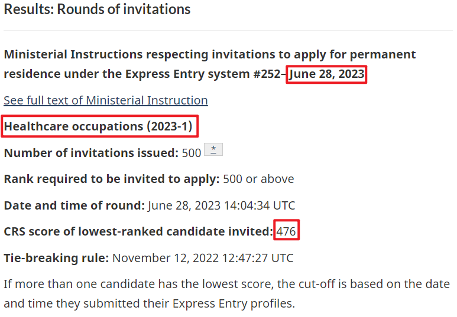 (原始链接: https://mmbiz.qpic.cn/mmbiz_png/904kUibXm7Y5uPYibp8MujZFEdRVB9jnk818eMzW1vhTZ7oqws06NwHN3T6aGdD61fjoqX7sB62UQKg78FrnVzDw/640?wx_fmt=png)
- 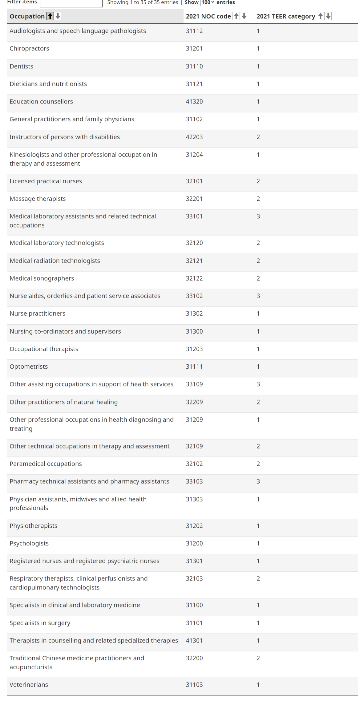 (原始链接: https://mmbiz.qpic.cn/mmbiz_png/904kUibXm7Y5uPYibp8MujZFEdRVB9jnk8JU9OhM5WcnJGvRNw0xXVPS4lpEGiaKZNw9iarsWTOszz0icmiaCiaD6syqg/640?wx_fmt=png)
- 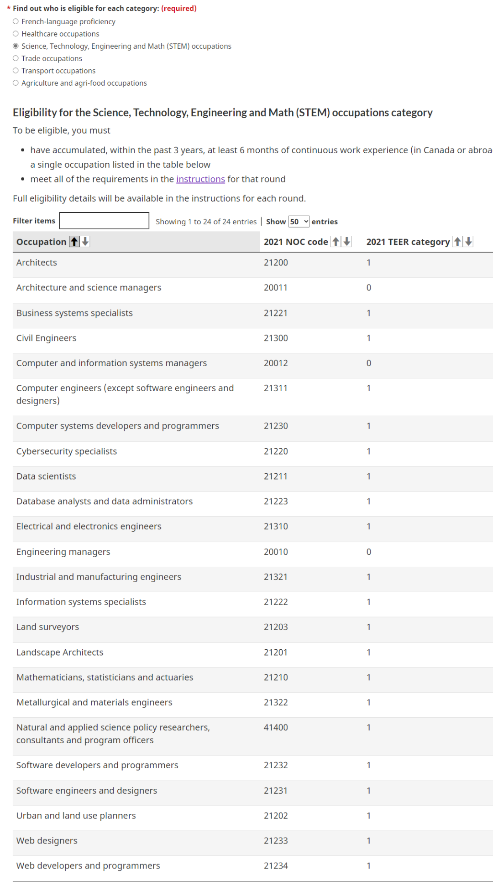 (原始链接: https://mmbiz.qpic.cn/mmbiz_png/904kUibXm7Y5uPYibp8MujZFEdRVB9jnk8piaNB2eVX0rHnEUetngLniaHbYPPA9UuRWdL2j2UnDZRZbPn0WPAicdiaA/640?wx_fmt=png)
- 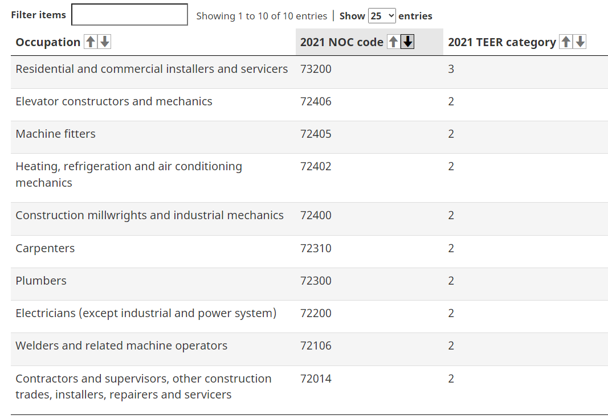 (原始链接: https://mmbiz.qpic.cn/mmbiz_png/904kUibXm7Y5uPYibp8MujZFEdRVB9jnk8DpfrvAdY15bpianW8DbwSo9bY7p66S4LZup2JzARPicSlnJIAoic7jPhw/640?wx_fmt=png)
- 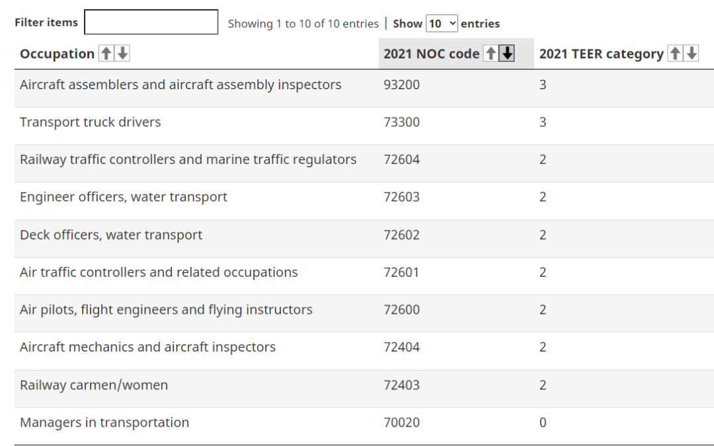 (原始链接: https://mmbiz.qpic.cn/mmbiz_png/904kUibXm7Y5uPYibp8MujZFEdRVB9jnk8uLfRZA1lgGM2WU9CRjoX2JO3bMWd8SAHKzITn4oAhRoGick2ibzibPk7Q/640?wx_fmt=png)
-  (原始链接: https://mmbiz.qpic.cn/mmbiz_png/904kUibXm7Y5uPYibp8MujZFEdRVB9jnk87icYkYAQJlbjpnMNYCia3KVA1Mia7QSQzIXfot1L3hwia3oALvNormpAYw/640?wx_fmt=png)
- 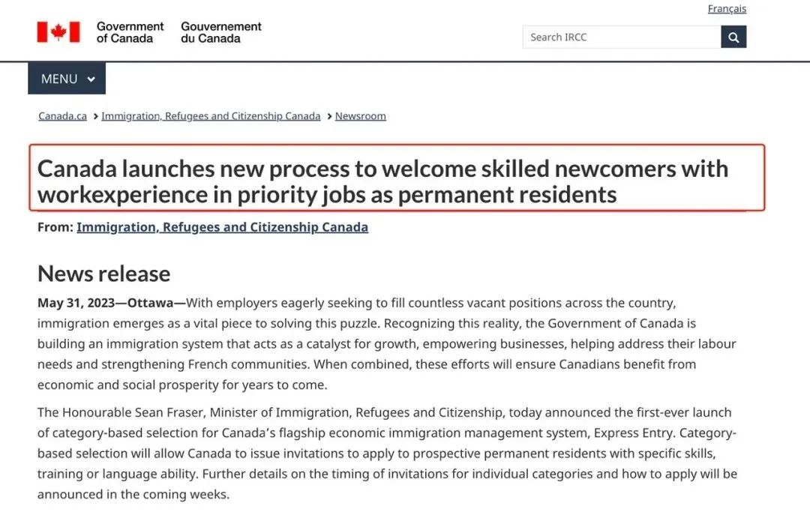 (原始链接: https://mmbiz.qpic.cn/mmbiz_jpg/904kUibXm7Y5uPYibp8MujZFEdRVB9jnk8A0yfw5IBuyWDHWnhYk2TqjgNYQRDrUbchp7ticvwQP6Iqfx4CkjjNgQ/640?wx_fmt=jpeg)
- 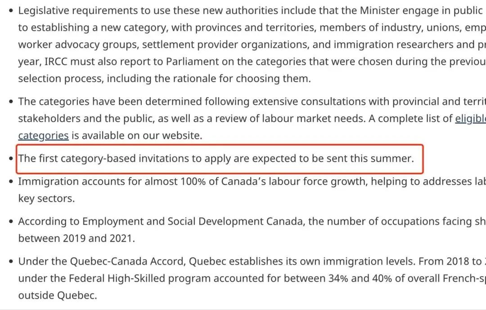 (原始链接: https://mmbiz.qpic.cn/mmbiz_jpg/904kUibXm7Y5uPYibp8MujZFEdRVB9jnk8IziaSuOPwuiaQ4V9bUS8gsIdCEWWRfZ9B8apicoaJtOPc5CDlzfKZaQTA/640?wx_fmt=jpeg)
-  (原始链接: https://mmbiz.qpic.cn/mmbiz_png/904kUibXm7Y5uPYibp8MujZFEdRVB9jnk87icYkYAQJlbjpnMNYCia3KVA1Mia7QSQzIXfot1L3hwia3oALvNormpAYw/640?wx_fmt=png)
- 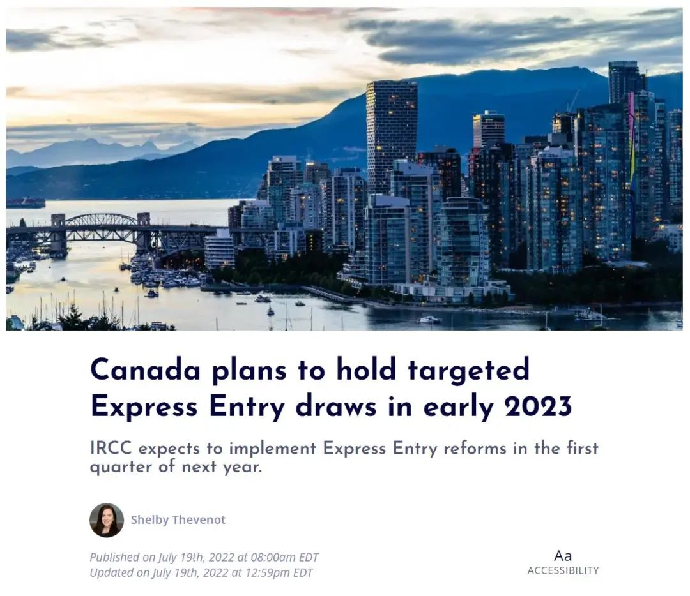 (原始链接: https://mmbiz.qpic.cn/mmbiz_jpg/904kUibXm7Y5uPYibp8MujZFEdRVB9jnk8HdX7pujuvGSAfqtCCvr20w2MLpomFOIGkvia6OGdws0zsYZcvOib3Qsg/640?wx_fmt=jpeg)
- 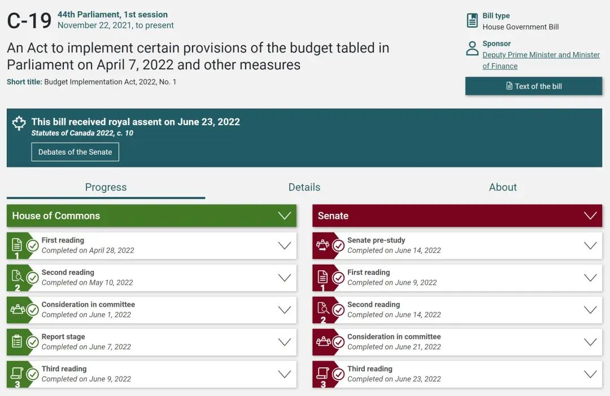 (原始链接: https://mmbiz.qpic.cn/mmbiz_jpg/904kUibXm7Y5uPYibp8MujZFEdRVB9jnk8ib4xDLYdeYxIAtChT6e9l8oPfHsqNam7xXm0stp9JOiaZC81gxpMTndg/640?wx_fmt=jpeg)
-  (原始链接: https://mmbiz.qpic.cn/mmbiz_jpg/904kUibXm7Y5uPYibp8MujZFEdRVB9jnk86HFia3HExoT9kUibBdwPBmCqEeibkUVdcicGNzibREMUyV0neZhtLCajE9A/640?wx_fmt=jpeg)
-  (原始链接: https://mmbiz.qpic.cn/mmbiz_jpg/904kUibXm7Y5uPYibp8MujZFEdRVB9jnk8GeG2OPGSicGFN8vKXVIaficvOq9astxpM7R8I7ib7OwiagcsuYLSVSS3Xw/640?wx_fmt=jpeg)
- 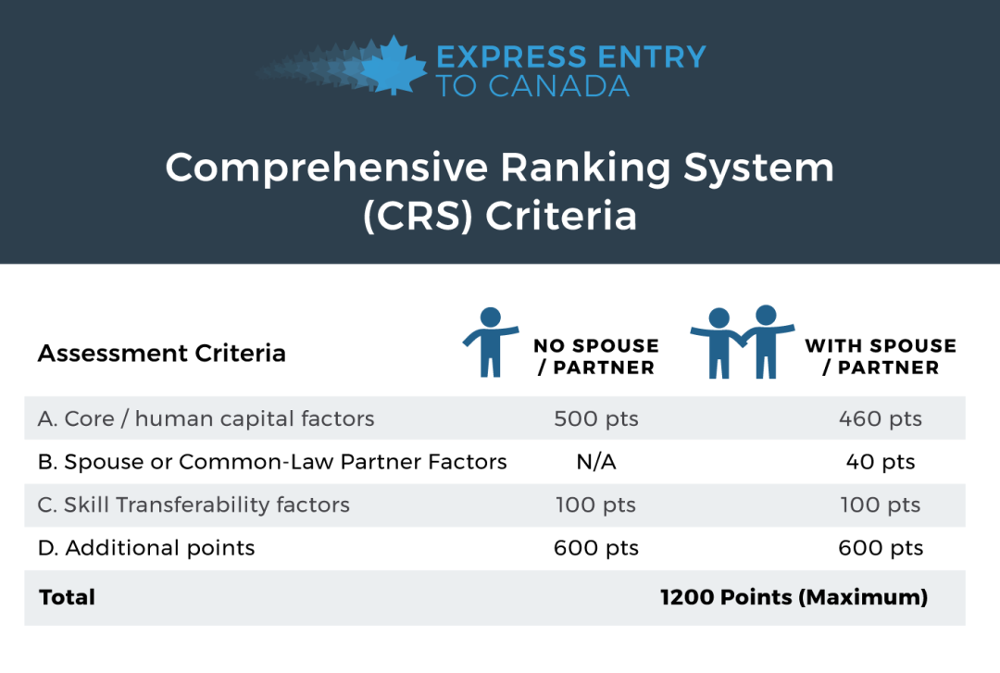 (原始链接: https://mmbiz.qpic.cn/mmbiz_png/904kUibXm7Y5uPYibp8MujZFEdRVB9jnk85L1icgdCV6fQf0dSLhNoia2K24QtxRupfOaCribHFWaWibWKSlmoNkhKOw/640?wx_fmt=png)
- 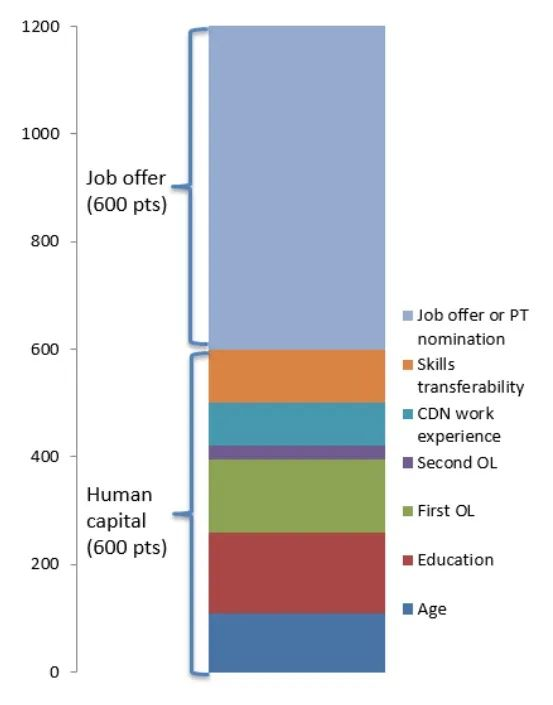 (原始链接: https://mmbiz.qpic.cn/mmbiz_jpg/904kUibXm7Y5uPYibp8MujZFEdRVB9jnk8ekHd5uTEGUgxicTxbJegiaMCz7zWE8tXl0wFKRbCTunAhDudXRKfvp8g/640?wx_fmt=jpeg)
-  (原始链接: https://mmbiz.qpic.cn/mmbiz_png/904kUibXm7Y5uPYibp8MujZFEdRVB9jnk8zOia8zAOg1e8g4sQZvGibcOu1FSicDWCtGrpf2HFqvMgF3ZyLsXueIj1Q/640?wx_fmt=png)
-  (原始链接: https://mmbiz.qpic.cn/mmbiz_jpg/904kUibXm7Y5uPYibp8MujZFEdRVB9jnk8m8QZmiany6ZLQCIfnTVxYSEvkpMzw87egfJlNc5paQVaDVc7hGZbvDQ/640?wx_fmt=jpeg)
-  (原始链接: https://mmbiz.qpic.cn/mmbiz_png/904kUibXm7Y5uPYibp8MujZFEdRVB9jnk8PvevmdcusS1opM9pUibWcWonLnqONMGr07dRiaqX2jEibPaI50flzPBqw/640?wx_fmt=png)
-  (原始链接: https://mmbiz.qpic.cn/mmbiz_jpg/904kUibXm7Y5uPYibp8MujZFEdRVB9jnk8s6FT97zBnT0EVIicxppKTYQD5zltgiawiajKJUc59yKm921icP5LL2G8RA/640?wx_fmt=jpeg)
-  (原始链接: https://mmbiz.qpic.cn/mmbiz_jpg/904kUibXm7Y5uPYibp8MujZFEdRVB9jnk88dwrP1lPOtBD0NviayibpRfuD45gQocoWsJiaYPzbgeYz6bYpW7wz0TZA/640?wx_fmt=jpeg)
-  (原始链接: https://mmbiz.qpic.cn/mmbiz_jpg/904kUibXm7Y5uPYibp8MujZFEdRVB9jnk819wxJ5lRtjulSmXfOBpBUia8ndkf29bjjqLpBvPib2ue3eu6kArwyyXQ/640?wx_fmt=jpeg)
