# 无标题

**链接地址:** http://mp.weixin.qq.com/s?__biz=MzUyNzA2NTAwNg==&mid=2247495576&idx=1&sn=8d778135e18b7ede4837bdb4c736680d&chksm=fa07e559cd706c4f68f9a18f5ce859bf9d1916c4a57aed503c7ba7dda09bbf5d2da033197def&mpshare=1&scene=2&srcid=09035I5JeHYMENdNWHIfJCYH&sharer_shareinfo=cfb64cbb6b63d17a60ad6fc16ba5e25e&sharer_shareinfo_first=cfb64cbb6b63d17a60ad6fc16ba5e25e#rd
**作者:** 你身边的签证专家
**获取时间:** 2025/8/28 19:07:18
**图片数量:** 26

---

## 原始HTML内容

<section style="font-size: 16px;"><section style="text-align: center;margin-top: 10px;margin-bottom: 10px;line-height: 0;" powered-by="xiumi.us"><section style="vertical-align: middle;display: inline-block;line-height: 0;"></section></section><section style="text-align: center;margin-top: 10px;margin-bottom: 10px;line-height: 0;" powered-by="xiumi.us"><section style="vertical-align: middle;display: inline-block;line-height: 0;"></section></section><section style="text-align: center;margin-top: 10px;margin-bottom: 10px;line-height: 0;" powered-by="xiumi.us"><section style="vertical-align: middle;display: inline-block;line-height: 0;"></section></section>
 
<section style="font-size: 19px;text-align: center;margin-top: 10px;margin-bottom: 3px;" powered-by="xiumi.us"><section style="display: inline-block;border-width: 1px;border-style: solid;border-color: rgb(188, 65, 65);background-color: rgb(188, 65, 65);width: 1.8em;height: 1.8em;line-height: 1.8em;border-radius: 100%;margin-left: auto;margin-right: auto;font-size: 16px;color: rgb(255, 255, 255);">
<strong>1</strong>
</section></section><section style="text-align: center;" powered-by="xiumi.us"><section style="display: inline-block;width: 0px;height: 0px;vertical-align: top;overflow: hidden;border-style: solid;border-width: 9px 6px 0px;border-color: rgb(188, 65, 65) rgba(255, 255, 255, 0) rgba(255, 255, 255, 0);"><svg viewBox="0 0 1 1" style="float:left;line-height:0;width:0;vertical-align:top;"></svg></section></section><section style="margin-bottom: 10px;text-align: center;justify-content: center;display: flex;flex-flow: row;" powered-by="xiumi.us"><section style="display: inline-block;width: auto;vertical-align: middle;background-color: rgba(109, 155, 209, 0.1);min-width: 10%;flex: 0 0 auto;height: auto;align-self: center;padding: 12px;"><section style="color: rgb(109, 155, 209);text-align: justify;" powered-by="xiumi.us">
<strong>移民政策公开“搞歧视”？</strong> 
</section></section></section><section style="font-size: 14px;padding-right: 15px;padding-left: 15px;letter-spacing: 1px;" powered-by="xiumi.us">
 

萨省移民开新项目，中国人却无缘！这个省省提名只抽八个国家，却<strong>排除中国</strong>！难道加拿大已经把“移民歧视”搬上了台面？

 
</section><section style="text-align: center;margin-top: 10px;margin-bottom: 10px;line-height: 0;" powered-by="xiumi.us"><section style="vertical-align: middle;display: inline-block;line-height: 0;width: 90%;height: auto;"></section></section><section style="font-size: 14px;padding-right: 15px;padding-left: 15px;letter-spacing: 1px;" powered-by="xiumi.us">
 

根据多伦多星报报道：加拿大萨斯喀彻温省首创一个试点项目，将根据移民的<strong>居住国挑选技术移民</strong>，这一计划瞬间引起了各界的注意。

 

一直以来，加拿大政府的移民政策都是不论种族和国籍，对所有人开放的，怎么突然间有些项目开始<strong>按国籍挑选移民</strong>了？

 

今年8月，萨省移民提名计划设立了<strong>6个抽签项目</strong>，目标是邀请542名技术移民在该省定居成为永久居民。 

 
</section><section style="text-align: center;margin-top: 10px;margin-bottom: 10px;line-height: 0;" powered-by="xiumi.us"><section style="vertical-align: middle;display: inline-block;line-height: 0;width: 90%;height: auto;"></section></section><section style="font-size: 14px;padding-right: 15px;padding-left: 15px;letter-spacing: 1px;" powered-by="xiumi.us">
 

然而，只有生活在<strong>八个国家</strong>之一的人才有资格被邀请，分别是<strong>捷克、德国、印度、爱尔兰、立陶宛、波兰、斯洛伐克和乌克兰</strong>。 

 

 
</section><section style="font-size: 19px;text-align: center;margin-top: 10px;margin-bottom: 3px;" powered-by="xiumi.us"><section style="display: inline-block;border-width: 1px;border-style: solid;border-color: rgb(188, 65, 65);background-color: rgb(188, 65, 65);width: 1.8em;height: 1.8em;line-height: 1.8em;border-radius: 100%;margin-left: auto;margin-right: auto;font-size: 16px;color: rgb(255, 255, 255);">
<strong>2</strong>
</section></section><section style="text-align: center;" powered-by="xiumi.us"><section style="display: inline-block;width: 0px;height: 0px;vertical-align: top;overflow: hidden;border-style: solid;border-width: 9px 6px 0px;border-color: rgb(188, 65, 65) rgba(255, 255, 255, 0) rgba(255, 255, 255, 0);"><svg viewBox="0 0 1 1" style="float:left;line-height:0;width:0;vertical-align:top;"></svg></section></section><section style="margin-bottom: 10px;text-align: center;justify-content: center;display: flex;flex-flow: row;" powered-by="xiumi.us"><section style="display: inline-block;width: auto;vertical-align: middle;background-color: rgba(109, 155, 209, 0.1);min-width: 10%;flex: 0 0 auto;height: auto;align-self: center;padding: 12px;"><section style="color: rgb(109, 155, 209);text-align: justify;" powered-by="xiumi.us">
<strong>加拿大回归历基于种族的移民选择方式？</strong>
</section></section></section><section style="font-size: 14px;padding-right: 15px;padding-left: 15px;letter-spacing: 1px;" powered-by="xiumi.us">
 

萨省官员表示，抽签是根据移民成功和留在该省的可能性来设计的，但是专家担心，这可能标志着加拿大开始回归历史上<strong>基于种族的移民选择方式</strong>。 

 
</section><section style="text-align: center;margin-top: 10px;margin-bottom: 10px;line-height: 0;" powered-by="xiumi.us"><section style="vertical-align: middle;display: inline-block;line-height: 0;width: 90%;height: auto;"></section></section><section style="font-size: 14px;padding-right: 15px;padding-left: 15px;letter-spacing: 1px;" powered-by="xiumi.us">
 

对此，加拿大西安大略大学研究社会公正和公平的政治社会学家Howard Ramos说：“这是一种<strong>倒退</strong>，让我们在引入<strong>公平的积分系统</strong>方面取得的进展功亏一篑。”

 

加拿大的移民制度在1967年引入了<strong>积分系统</strong>，根据教育成就、工作经验、语言熟练程度和就业技能等客观和可衡量的属性，给移民申请人打分。 

 
</section><section style="text-align: center;margin-top: 10px;margin-bottom: 10px;line-height: 0;" powered-by="xiumi.us"><section style="vertical-align: middle;display: inline-block;line-height: 0;"></section></section><section style="font-size: 14px;padding-right: 15px;padding-left: 15px;letter-spacing: 1px;" powered-by="xiumi.us">
 

据报道，加拿大人口最多的省份：安省、魁省、BC省和阿尔伯塔省的移民<strong>保留率都高于80%</strong>。然而，其他省份很难留住新移民。 

 

萨省官员说，这个针对具体国家的试点项目是该省的一种尝试，以便将有限的资源用于最有可能留下来的新移民。

 
</section><section style="font-size: 19px;text-align: center;margin-top: 10px;margin-bottom: 3px;" powered-by="xiumi.us"><section style="display: inline-block;border-width: 1px;border-style: solid;border-color: rgb(188, 65, 65);background-color: rgb(188, 65, 65);width: 1.8em;height: 1.8em;line-height: 1.8em;border-radius: 100%;margin-left: auto;margin-right: auto;font-size: 16px;color: rgb(255, 255, 255);">
<strong>3</strong>
</section></section><section style="text-align: center;" powered-by="xiumi.us"><section style="display: inline-block;width: 0px;height: 0px;vertical-align: top;overflow: hidden;border-style: solid;border-width: 9px 6px 0px;border-color: rgb(188, 65, 65) rgba(255, 255, 255, 0) rgba(255, 255, 255, 0);"><svg viewBox="0 0 1 1" style="float:left;line-height:0;width:0;vertical-align:top;"></svg></section></section><section style="margin-bottom: 10px;text-align: center;justify-content: center;display: flex;flex-flow: row;" powered-by="xiumi.us"><section style="display: inline-block;width: auto;vertical-align: middle;background-color: rgba(109, 155, 209, 0.1);min-width: 10%;flex: 0 0 auto;height: auto;align-self: center;padding: 12px;"><section style="color: rgb(109, 155, 209);text-align: justify;" powered-by="xiumi.us">
<strong>让人头痛的新移民留存率</strong>
</section></section></section><section style="font-size: 14px;padding-right: 15px;padding-left: 15px;letter-spacing: 1px;" powered-by="xiumi.us">
 

加拿大统计局的数据显示，2016年至2020年间在萨省定居的新移民中，<strong>只有64%最终留下来</strong>。在2019年属于技术工人和熟练技工类别的新移民中，<strong>只有43%的人留下来</strong>。 

 
</section><section style="text-align: center;margin-top: 10px;margin-bottom: 10px;line-height: 0;" powered-by="xiumi.us"><section style="vertical-align: middle;display: inline-block;line-height: 0;width: 90%;height: auto;"></section></section><section style="font-size: 14px;padding-right: 15px;padding-left: 15px;letter-spacing: 1px;" powered-by="xiumi.us">
 

过去一年有五批乌克兰难民抵达该省成功安置，受此启发，省政府与雇主、专业监管机构、行业协会和社区合作伙伴一起推出这个试点项目。

 

在挑选这些国家时，他们考察了<strong>劳动力储备特点</strong>、语言能力、过去成功招聘和留住的来自不同国家的新移民，以及该省现有的工作机会。 

 
</section><section style="text-align: center;margin-top: 10px;margin-bottom: 10px;line-height: 0;" powered-by="xiumi.us"><section style="vertical-align: middle;display: inline-block;line-height: 0;width: 90%;height: auto;"></section></section><section style="font-size: 14px;padding-right: 15px;padding-left: 15px;letter-spacing: 1px;" powered-by="xiumi.us">
 

另一个关键因素是来自这些国家的移民的<strong>证书适用性</strong>。例如，波兰、乌克兰和德国的长途卡车司机很快就得到了萨省的工作认可。 

 

萨省移民厅副厅长Richelle Bourgoin说：“我们希望确保省提名计划中<strong>非常宝贵的名额分配</strong>，给那些想在萨省生活和工作的人。”

 

萨斯卡通移民律师Chris Veeman表示，虽然这种方法可能有助于新移民<strong>与当地社区建立更牢固的联系</strong>，并满足留住移民的需要，但这偏离了积分系统的目标。他说：“这似乎偏向某些国家，似乎<strong>偏向欧洲国家</strong>。” 

 
</section><section style="text-align: center;margin-top: 10px;margin-bottom: 10px;line-height: 0;" powered-by="xiumi.us"><section style="vertical-align: middle;display: inline-block;line-height: 0;width: 90%;height: auto;"></section></section><section style="font-size: 14px;padding-right: 15px;padding-left: 15px;letter-spacing: 1px;" powered-by="xiumi.us">
 

联邦移民部表示，各省和地区负责设计、管理和评估各自的省提名计划，但渥太华会<strong>审查新的提名计划</strong>，确保符合国家政策和法律。

 

Bourgoin说，针对特定国家的抽签绝不是<strong>排他性</strong>的，因为还有其他对所有候选人开放的抽签。

 

就光看今年一年，萨省就提名了来自<strong>116个国家的申请人</strong>。

 

大家对这样的“选人”标准怎么看呢？ 
</section>
 

 
<section style="font-size: 19px;text-align: center;margin-top: 10px;margin-bottom: 3px;" powered-by="xiumi.us"><section style="display: inline-block;border-width: 1px;border-style: solid;border-color: rgb(188, 65, 65);background-color: rgb(188, 65, 65);width: 1.8em;height: 1.8em;line-height: 1.8em;border-radius: 100%;margin-left: auto;margin-right: auto;font-size: 16px;color: rgb(255, 255, 255);">
<strong>4</strong>
</section></section><section style="text-align: center;" powered-by="xiumi.us"><section style="display: inline-block;width: 0px;height: 0px;vertical-align: top;overflow: hidden;border-style: solid;border-width: 9px 6px 0px;border-color: rgb(188, 65, 65) rgba(255, 255, 255, 0) rgba(255, 255, 255, 0);"><svg viewBox="0 0 1 1" style="float:left;line-height:0;width:0;vertical-align:top;"></svg></section></section><section style="margin-bottom: 10px;text-align: center;justify-content: center;display: flex;flex-flow: row;" powered-by="xiumi.us"><section style="display: inline-block;width: auto;vertical-align: middle;background-color: rgba(109, 155, 209, 0.1);min-width: 10%;flex: 0 0 auto;height: auto;align-self: center;padding: 12px;"><section style="color: rgb(109, 155, 209);text-align: justify;" powered-by="xiumi.us">
<strong>萨省依然是中国新移民热门目的地</strong>
</section></section></section><section style="font-size: 14px;padding-right: 15px;padding-left: 15px;letter-spacing: 1px;" powered-by="xiumi.us">
 

诚然，近期加拿大移民部的政策调整，给海外的申请者们造成的<strong>诸多障碍</strong>。而且大部分移民方式对于加国本地工作经验、学历和生活经验有着较多要求，也让海外直申的朋友们<strong>不占优势</strong>。

 

尽管如此，加拿大的<strong>萨省一直是中国新移民的热门目标省份之一</strong>。尤其是对于在加拿大没有教育和就业经验的客户，萨斯喀彻温省的<strong>企业家移民项目</strong>显得尤为引人注目。这一项目不仅提供了一个通往加拿大市场的快速通道，而且在<strong>税收、人才获取和商业环境</strong>等方面都具有<strong>高度的竞争力</strong>。

 

 
</section><section style="text-align: center;margin-top: 10px;margin-bottom: 10px;line-height: 0;" powered-by="xiumi.us"><section style="vertical-align: middle;display: inline-block;line-height: 0;width: 90%;height: auto;"></section></section><section style="font-size: 14px;padding-right: 15px;padding-left: 15px;letter-spacing: 1px;" powered-by="xiumi.us">
 

今天我们要介绍的萨省企业家移民项目，是出了名的<strong>对海外申请者友好</strong>。你见过像这样还没批下来移民就先送你两年工作签证，让你提前来到加拿大安居乐业，享受福利的移民项目吗？

 

而且，<strong>超低语言、年龄和学历的要求</strong>，更让许多在年轻时没有机会移民加拿大，或是语言和学历达不到普通移民标准的朋友们<strong>重燃了希望</strong>！

 
</section>
 
<section style="text-align: center;justify-content: center;margin: 10px 0%;display: flex;flex-flow: row;" powered-by="xiumi.us"><section style="display: inline-block;vertical-align: middle;width: auto;flex: 100 100 0%;align-self: center;height: auto;"><section style="margin-right: 0%;margin-left: 0%;" powered-by="xiumi.us"><section style="background-color: rgb(180, 197, 161);height: 2px;"><svg viewBox="0 0 1 1" style="float:left;line-height:0;width:0;vertical-align:top;"></svg></section></section></section><section style="display: inline-block;vertical-align: middle;width: auto;background-color: rgb(180, 197, 161);padding: 9px;min-width: 10%;flex: 0 0 auto;height: auto;align-self: center;margin-right: 10px;margin-left: 10px;"><section style="color: rgb(255, 238, 224);text-align: justify;line-height: 1;" powered-by="xiumi.us">
<strong>萨省企业家移民</strong>
</section></section><section style="display: inline-block;vertical-align: middle;width: auto;flex: 100 100 0%;align-self: center;height: auto;"><section style="margin-right: 0%;margin-left: 0%;" powered-by="xiumi.us"><section style="background-color: rgb(180, 197, 161);height: 2px;"><svg viewBox="0 0 1 1" style="float:left;line-height:0;width:0;vertical-align:top;"></svg></section></section></section></section><section style="font-size: 14px;padding-right: 15px;padding-left: 15px;letter-spacing: 1px;" powered-by="xiumi.us">
 
</section><section style="font-size: 14px;padding-right: 15px;padding-left: 15px;letter-spacing: 1px;" powered-by="xiumi.us">
 

<strong>萨省企业家移民（SINP Entrepreneur Category）</strong>是萨省政府为了吸引全球的创业人才而设立的移民项目，该项目提名的申请人是符合申请标准、有意愿在萨省居住、积极参与经营管理的企业家人选。

 
</section><section style="text-align: center;margin-top: 10px;margin-bottom: 10px;line-height: 0;" powered-by="xiumi.us"><section style="vertical-align: middle;display: inline-block;line-height: 0;width: 90%;height: auto;"></section></section><section style="font-size: 14px;padding-right: 15px;padding-left: 15px;letter-spacing: 1px;" powered-by="xiumi.us">
 

 
</section><section style="text-align: center;justify-content: center;margin: 10px 0%;display: flex;flex-flow: row;" powered-by="xiumi.us"><section style="display: inline-block;vertical-align: middle;width: auto;flex: 100 100 0%;align-self: center;height: auto;"><section style="margin-right: 0%;margin-left: 0%;" powered-by="xiumi.us"><section style="background-color: rgb(180, 197, 161);height: 2px;"><svg viewBox="0 0 1 1" style="float:left;line-height:0;width:0;vertical-align:top;"></svg></section></section></section><section style="display: inline-block;vertical-align: middle;width: auto;background-color: rgb(180, 197, 161);padding: 9px;min-width: 10%;flex: 0 0 auto;height: auto;align-self: center;margin-right: 10px;margin-left: 10px;"><section style="color: rgb(255, 238, 224);text-align: justify;line-height: 1;" powered-by="xiumi.us">
<strong>项目特点</strong>
</section></section><section style="display: inline-block;vertical-align: middle;width: auto;flex: 100 100 0%;align-self: center;height: auto;"><section style="margin-right: 0%;margin-left: 0%;" powered-by="xiumi.us"><section style="background-color: rgb(180, 197, 161);height: 2px;"><svg viewBox="0 0 1 1" style="float:left;line-height:0;width:0;vertical-align:top;"></svg></section></section></section></section><section style="font-size: 14px;padding-right: 15px;padding-left: 15px;letter-spacing: 1px;" powered-by="xiumi.us">
 
<ul class="list-paddingleft-1" style="padding-left: 40px;list-style-position: outside;"><li>
申请门槛低：<strong>语言、年龄和学历的限制宽泛</strong>
</li><li>
EOI评分标准对<strong>中国企业家有很大的优势</strong>
</li><li>
先批给<strong>2年临时居民身份</strong>，方便申请人全家在加拿大 境内等待永久居民身份的审批，可以<strong>提前享受加国福利，适应本地生活</strong>
</li><li>
满足移民条件的经营期为全加拿大最短，<strong>仅需6个月即可获得省移民提名</strong>
</li><li>
最为适合中国中<strong>小企业家及个体经商户</strong>申请
</li></ul>
 

 
</section><section style="text-align: center;justify-content: center;margin: 10px 0%;display: flex;flex-flow: row;" powered-by="xiumi.us"><section style="display: inline-block;vertical-align: middle;width: auto;flex: 100 100 0%;align-self: center;height: auto;"><section style="margin-right: 0%;margin-left: 0%;" powered-by="xiumi.us"><section style="background-color: rgb(180, 197, 161);height: 2px;"><svg viewBox="0 0 1 1" style="float:left;line-height:0;width:0;vertical-align:top;"></svg></section></section></section><section style="display: inline-block;vertical-align: middle;width: auto;background-color: rgb(180, 197, 161);padding: 9px;min-width: 10%;flex: 0 0 auto;height: auto;align-self: center;margin-right: 10px;margin-left: 10px;"><section style="color: rgb(255, 238, 224);text-align: justify;line-height: 1;" powered-by="xiumi.us">
<strong>申请要求</strong>
</section></section><section style="display: inline-block;vertical-align: middle;width: auto;flex: 100 100 0%;align-self: center;height: auto;"><section style="margin-right: 0%;margin-left: 0%;" powered-by="xiumi.us"><section style="background-color: rgb(180, 197, 161);height: 2px;"><svg viewBox="0 0 1 1" style="float:left;line-height:0;width:0;vertical-align:top;"></svg></section></section></section></section><section style="font-size: 14px;padding-right: 15px;padding-left: 15px;letter-spacing: 1px;" powered-by="xiumi.us">
 
<ul class="list-paddingleft-1" style="padding-left: 40px;list-style-position: outside;"><li>
具有<strong>50万加币以上的家庭净资产</strong>；
</li><li>
<strong>最近10年内有至少4年的企业主经验</strong>，或者高级管理经验；
</li><li>
<strong>投资额不少于20万加币</strong>，里贾纳和萨斯卡通两大城市不少于30万加币；
</li><li>
投资在两大城市的企业至少须提供<strong>2个全职工作岗位</strong>，但其他地区没有要求。
</li></ul>
 
</section><section style="font-size: 14px;padding-right: 15px;padding-left: 15px;letter-spacing: 1px;" powered-by="xiumi.us">
 
</section><section style="text-align: center;justify-content: center;margin: 10px 0%;display: flex;flex-flow: row;" powered-by="xiumi.us"><section style="display: inline-block;vertical-align: middle;width: auto;flex: 100 100 0%;align-self: center;height: auto;"><section style="margin-right: 0%;margin-left: 0%;" powered-by="xiumi.us"><section style="background-color: rgb(180, 197, 161);height: 2px;"><svg viewBox="0 0 1 1" style="float:left;line-height:0;width:0;vertical-align:top;"></svg></section></section></section><section style="display: inline-block;vertical-align: middle;width: auto;background-color: rgb(180, 197, 161);padding: 9px;min-width: 10%;flex: 0 0 auto;height: auto;align-self: center;margin-right: 10px;margin-left: 10px;"><section style="color: rgb(255, 238, 224);text-align: justify;line-height: 1;" powered-by="xiumi.us">
<strong>办理流程</strong>
</section></section><section style="display: inline-block;vertical-align: middle;width: auto;flex: 100 100 0%;align-self: center;height: auto;"><section style="margin-right: 0%;margin-left: 0%;" powered-by="xiumi.us"><section style="background-color: rgb(180, 197, 161);height: 2px;"><svg viewBox="0 0 1 1" style="float:left;line-height:0;width:0;vertical-align:top;"></svg></section></section></section></section><section style="font-size: 14px;padding-right: 15px;padding-left: 15px;letter-spacing: 1px;" powered-by="xiumi.us">
 
<ol class="list-paddingleft-1" style="padding-left: 40px;list-style-position: outside;"><li>
赴萨省完成不少于5天的商务考察；
</li><li>
在线递交EOI申请，等候SINP发出邀请；
</li><li>
获得SINP邀请，在规定的时间内完成资产材料的审核；
</li><li>
资产审核通过，完成萨省移民局远程电话面试；
</li><li>
面试通过，与萨省政府签署创业同意书，获得SINP工签支持信；
</li><li>
申请并获批全家工作签证；
</li><li>
抵达萨省开始履行商务投资计划；
</li><li>
经营6个月后申请萨省提名移民；
</li><li>
获得萨省提名信，递交联邦申请全家永居居民；
</li><li>
通过加拿大联邦移民部审批，正式移民登陆取得枫叶卡。
</li></ol>
 

 
</section><section style="text-align: center;justify-content: center;margin: 10px 0%;display: flex;flex-flow: row;" powered-by="xiumi.us"><section style="display: inline-block;vertical-align: middle;width: auto;flex: 100 100 0%;align-self: center;height: auto;"><section style="margin-right: 0%;margin-left: 0%;" powered-by="xiumi.us"><section style="background-color: rgb(180, 197, 161);height: 2px;"><svg viewBox="0 0 1 1" style="float:left;line-height:0;width:0;vertical-align:top;"></svg></section></section></section><section style="display: inline-block;vertical-align: middle;width: auto;background-color: rgb(180, 197, 161);padding: 9px;min-width: 10%;flex: 0 0 auto;height: auto;align-self: center;margin-right: 10px;margin-left: 10px;"><section style="color: rgb(255, 238, 224);text-align: justify;line-height: 1;" powered-by="xiumi.us">
<strong>不被认可的商业投资</strong>
</section></section><section style="display: inline-block;vertical-align: middle;width: auto;flex: 100 100 0%;align-self: center;height: auto;"><section style="margin-right: 0%;margin-left: 0%;" powered-by="xiumi.us"><section style="background-color: rgb(180, 197, 161);height: 2px;"><svg viewBox="0 0 1 1" style="float:left;line-height:0;width:0;vertical-align:top;"></svg></section></section></section></section>
 
<section style="text-align: center;margin-top: 10px;margin-bottom: 10px;line-height: 0;" powered-by="xiumi.us"><section style="vertical-align: middle;display: inline-block;line-height: 0;width: 90%;height: auto;"></section></section><section style="font-size: 14px;padding-right: 15px;padding-left: 15px;letter-spacing: 1px;" powered-by="xiumi.us">
 
<ul class="list-paddingleft-1" style="padding-left: 40px;list-style-position: outside;"><li>
物业租赁、投资、出租活动； 
</li><li>
房地产建设/开发/经纪，保险经纪或商业经纪；
</li><li>
需要许可或认证的专业服务或自雇经营者；
</li><li>
私人金融借贷服务（例如日贷款业务、支票兑现、兑换现金等），以及自动柜员机业务；
</li><li>
信用合作社；
</li><li>
以驻家为基础的企业，包括家庭旅馆和度假屋短租；
</li><li>
合作社；
</li><li>
对投资商业的经营主要是为了获得被动投资收益。在同一个单位（公寓/地点/项目）或企业孵化基地中的多个零售业务，该业务尚未完成或经营；并且/或者，是以SINP企业家的投资作为开发、完成或运营的商业项目。

 

 
</li></ul></section><section style="text-align: center;margin-top: 10px;margin-bottom: 10px;line-height: 0;" powered-by="xiumi.us"><section style="vertical-align: middle;display: inline-block;line-height: 0;"></section></section><section style="font-size: 14px;padding-right: 15px;padding-left: 15px;letter-spacing: 1px;" powered-by="xiumi.us">
 
</section><section style="text-align: center;justify-content: center;margin: 10px 0%;display: flex;flex-flow: row;" powered-by="xiumi.us"><section style="display: inline-block;vertical-align: middle;width: auto;flex: 100 100 0%;align-self: center;height: auto;"><section style="margin-right: 0%;margin-left: 0%;" powered-by="xiumi.us"><section style="background-color: rgb(180, 197, 161);height: 2px;"><svg viewBox="0 0 1 1" style="float:left;line-height:0;width:0;vertical-align:top;"></svg></section></section></section><section style="display: inline-block;vertical-align: middle;width: auto;background-color: rgb(180, 197, 161);padding: 9px;min-width: 10%;flex: 0 0 auto;height: auto;align-self: center;margin-right: 10px;margin-left: 10px;"><section style="color: rgb(255, 238, 224);text-align: justify;line-height: 1;" powered-by="xiumi.us">
<strong>什么是EOI</strong>
</section></section><section style="display: inline-block;vertical-align: middle;width: auto;flex: 100 100 0%;align-self: center;height: auto;"><section style="margin-right: 0%;margin-left: 0%;" powered-by="xiumi.us"><section style="background-color: rgb(180, 197, 161);height: 2px;"><svg viewBox="0 0 1 1" style="float:left;line-height:0;width:0;vertical-align:top;"></svg></section></section></section></section><section style="font-size: 14px;padding-right: 15px;padding-left: 15px;letter-spacing: 1px;" powered-by="xiumi.us">
 

<strong>萨省EOI（Expression of Interest）</strong>类似于EE快速通道，是萨省独立的一套移民筛选系统。EOI的递交是移民意向的表达，<strong>不是正式的申请</strong>。

 

<strong>EOI的提交是免费的</strong>，有效期为12个月。提交EOI后，符合条件的申请人会进入候选池。如果提交EOI后，信息有更新，可以随时更新EO。

 
</section><section style="text-align: center;margin-top: 10px;margin-bottom: 10px;line-height: 0;" powered-by="xiumi.us"><section style="vertical-align: middle;display: inline-block;line-height: 0;width: 90%;height: auto;"></section></section><section style="font-size: 14px;padding-right: 15px;padding-left: 15px;letter-spacing: 1px;" powered-by="xiumi.us">
 

EOI系统会根据你提交的信息，自动算分，分数高的排名靠前，会被优先选拔。被选中的EOI，会被从池子中移除，无法再更改信息。

 

 
</section><section style="text-align: center;justify-content: center;margin: 10px 0%;display: flex;flex-flow: row;" powered-by="xiumi.us"><section style="display: inline-block;vertical-align: middle;width: auto;flex: 100 100 0%;align-self: center;height: auto;"><section style="margin-right: 0%;margin-left: 0%;" powered-by="xiumi.us"><section style="background-color: rgb(180, 197, 161);height: 2px;"><svg viewBox="0 0 1 1" style="float:left;line-height:0;width:0;vertical-align:top;"></svg></section></section></section><section style="display: inline-block;vertical-align: middle;width: auto;background-color: rgb(180, 197, 161);padding: 9px;min-width: 10%;flex: 0 0 auto;height: auto;align-self: center;margin-right: 10px;margin-left: 10px;"><section style="color: rgb(255, 238, 224);text-align: justify;line-height: 1;" powered-by="xiumi.us">
<strong>EOI评分系统</strong>
</section></section><section style="display: inline-block;vertical-align: middle;width: auto;flex: 100 100 0%;align-self: center;height: auto;"><section style="margin-right: 0%;margin-left: 0%;" powered-by="xiumi.us"><section style="background-color: rgb(180, 197, 161);height: 2px;"><svg viewBox="0 0 1 1" style="float:left;line-height:0;width:0;vertical-align:top;"></svg></section></section></section></section><section style="text-align: center;margin-top: 10px;margin-bottom: 10px;line-height: 0;" powered-by="xiumi.us"><section style="vertical-align: middle;display: inline-block;line-height: 0;width: 90%;height: auto;"></section></section><section style="text-align: center;margin-top: 10px;margin-bottom: 10px;line-height: 0;" powered-by="xiumi.us"><section style="vertical-align: middle;display: inline-block;line-height: 0;width: 90%;height: auto;"></section></section><section style="text-align: center;margin-top: 10px;margin-bottom: 10px;line-height: 0;" powered-by="xiumi.us"><section style="vertical-align: middle;display: inline-block;line-height: 0;width: 90%;height: auto;"></section></section><section style="font-size: 14px;padding-right: 15px;padding-left: 15px;letter-spacing: 1px;" powered-by="xiumi.us">
 

萨省企业家移民评分要素主要包括以下三方面：<strong>基本条件（Human Capital）</strong>，<strong>企业经验（Business Experience ）</strong>，<strong>商业计划书（Business Establishment Plan）</strong>。申请人需要提供相应的材料支持得分项，<strong>满分为160分</strong>。

 
</section><section style="margin: 10px 0%;justify-content: flex-start;display: flex;flex-flow: row;" powered-by="xiumi.us"><section style="display: inline-block;width: 100%;vertical-align: top;background-color: rgba(219, 225, 173, 0.17);padding: 30px;align-self: flex-start;flex: 0 0 auto;"><section style="margin-right: 0%;margin-bottom: 10px;margin-left: 0%;text-align: center;justify-content: center;display: flex;flex-flow: row;" powered-by="xiumi.us"><section style="display: inline-block;width: 100%;vertical-align: top;border-left: 3px solid rgb(180, 197, 161);border-bottom-left-radius: 0px;padding-left: 11px;align-self: flex-start;flex: 0 0 auto;"><section style="font-size: 20px;text-align: justify;" powered-by="xiumi.us">
<strong>基本条件</strong>
</section><section style="font-size: 14px;color: rgb(180, 197, 161);text-align: justify;" powered-by="xiumi.us">
Human Capital
</section></section></section><section style="text-align: center;margin-top: 10px;margin-bottom: 10px;line-height: 0;" powered-by="xiumi.us"><section style="vertical-align: middle;display: inline-block;line-height: 0;width: 100%;height: auto;"></section></section>
 
<section powered-by="xiumi.us">
· <strong>年龄</strong>（最高分15分）：年龄须在21-54周岁之间才可以得分； 

 

· <strong>考察访问</strong>（最高分15分）：至少在萨省进行为期5个工作日的考察访问。 

 

·<strong> 语言能力</strong>（最高分15分）：最低CLB4可以得分。

 

· <strong>教育</strong>（最高15分）：技工或职业证书；或者学士以上学位。

 

·<strong> 净资产</strong>（最高分15分）：满足条件需要至少提供55万加币净资产，但是提供55万以上才能得分。

 

 
</section><section style="margin-right: 0%;margin-bottom: 10px;margin-left: 0%;text-align: center;justify-content: center;display: flex;flex-flow: row;" powered-by="xiumi.us"><section style="display: inline-block;width: 100%;vertical-align: top;border-left: 3px solid rgb(180, 197, 161);border-bottom-left-radius: 0px;padding-left: 11px;align-self: flex-start;flex: 0 0 auto;"><section style="font-size: 20px;text-align: justify;" powered-by="xiumi.us">
<strong>企业经验</strong>
</section><section style="font-size: 14px;color: rgb(180, 197, 161);text-align: justify;" powered-by="xiumi.us">
Business Experience
</section></section></section><section style="text-align: center;margin-top: 10px;margin-bottom: 10px;line-height: 0;" powered-by="xiumi.us"><section style="vertical-align: middle;display: inline-block;line-height: 0;width: 100%;height: auto;"></section></section>
 
<section powered-by="xiumi.us">
<strong>· 创业/农场经验</strong>（最高分20分）：满足条件需要3年的经验，但是最少4年的经验才能得分。 

 

<strong>· 营业收入</strong>（最高分20分）：最低5万加币才能得分。

 

<strong>· 创新/专利</strong>（最高分10分）：

 

 
</section><section style="margin-right: 0%;margin-bottom: 10px;margin-left: 0%;text-align: center;justify-content: center;display: flex;flex-flow: row;" powered-by="xiumi.us"><section style="display: inline-block;width: 100%;vertical-align: top;border-left: 3px solid rgb(180, 197, 161);border-bottom-left-radius: 0px;padding-left: 11px;align-self: flex-start;flex: 0 0 auto;"><section style="font-size: 20px;text-align: justify;" powered-by="xiumi.us">
<strong>商业计划书</strong>
</section><section style="font-size: 14px;color: rgb(180, 197, 161);text-align: justify;" powered-by="xiumi.us">
Business Establishment Plan
</section></section></section><section style="text-align: center;margin-top: 10px;margin-bottom: 10px;line-height: 0;" powered-by="xiumi.us"><section style="vertical-align: middle;display: inline-block;line-height: 0;width: 100%;height: auto;"></section></section>
 
<section powered-by="xiumi.us">
<strong>· </strong><strong>投资金额</strong>（最高分20分）：至少投资35万加币才能得分。

 

<strong>· 在关键经济领域投资 </strong>（最高分15分）：包括

· 科技

· 制造

· 进出口

· 乡镇经济传承

· 乡镇经济创新
</section>
 
</section></section><section style="font-size: 14px;padding-right: 15px;padding-left: 15px;letter-spacing: 1px;" powered-by="xiumi.us">
 

如果你对萨省企业家移民项目的申请感兴趣，想要获取更多信息或者<strong>专业顾问的评估和建议</strong>，欢迎联系<strong>新时代留学移民法律事务所</strong>！

 

萨省企业家移民是一个长久的项目，别被看似繁琐的步骤吓倒，我们愿意陪伴着你<strong>一步一个脚印</strong>地在加拿大萨省开创一片崭新天地！

 

 
</section><section style="text-align: left;justify-content: flex-start;display: flex;flex-flow: row;margin-top: 10px;" powered-by="xiumi.us"><section style="display: inline-block;vertical-align: top;width: auto;align-self: stretch;flex: 0 0 auto;background-color: rgb(188, 65, 65);min-width: 5%;height: auto;padding-top: 9px;padding-right: 9px;padding-left: 20px;"><section style="text-align: justify;font-size: 18px;color: rgb(252, 252, 252);" powered-by="xiumi.us">
<strong>阅读更多</strong>
</section></section><section style="display: inline-block;vertical-align: top;width: auto;min-width: 5%;flex: 0 0 auto;height: auto;align-self: stretch;"><section style="" powered-by="xiumi.us"><section style="display: inline-block;width: 0px;height: 0px;vertical-align: top;overflow: hidden;border-style: solid;border-width: 45px 0px 0px 19px;border-color: rgba(255, 255, 255, 0) rgba(255, 255, 255, 0) rgba(255, 255, 255, 0) rgb(188, 65, 65);"><svg viewBox="0 0 1 1" style="float:left;line-height:0;width:0;vertical-align:top;"></svg></section></section></section></section><section style="margin-bottom: 10px;" powered-by="xiumi.us"><section style="background-color: rgb(188, 65, 65);height: 3px;"><svg viewBox="0 0 1 1" style="float:left;line-height:0;width:0;vertical-align:top;"></svg></section></section><section style="margin: 10px 0%;text-align: left;justify-content: flex-start;display: flex;flex-flow: row;" powered-by="xiumi.us"><section style="display: inline-block;width: 100%;vertical-align: top;background-position: 119.157% 13.6487%;background-repeat: repeat;background-size: 101.212%;background-attachment: scroll;padding: 30px;align-self: flex-start;flex: 0 0 auto;background-image: url(&quot;https://mmbiz.qpic.cn/mmbiz_jpg/904kUibXm7Y6XoU9kWewMbliap4w3ibicRfsacpgnrPTA7SWQxYVezW2y6AePzjyxalVz0GxZN0XYoCQJibgDDqhPNQ/640?wx_fmt=jpeg&quot;);"><section style="text-align: justify;justify-content: flex-start;display: flex;flex-flow: row;" powered-by="xiumi.us"><section style="display: inline-block;width: 100%;vertical-align: top;background-color: rgba(188, 65, 65, 0.22);padding: 10px;border-width: 0px;border-style: none;border-color: rgb(62, 62, 62);align-self: flex-start;flex: 0 0 auto;"><section style="text-align: center;color: rgb(255, 255, 255);font-size: 14px;" powered-by="xiumi.us">
<a target="_blank" href="http://mp.weixin.qq.com/s?__biz=MzUyNzA2NTAwNg==&amp;mid=2247495540&amp;idx=1&amp;sn=51965396152c52108f23604ca851f6ff&amp;chksm=fa07e5b5cd706ca3204ebc5d6f16637aa41458f5c16a6af9fd7c1a3d474cd81f6f9bc00e70f3&amp;scene=21#wechat_redirect" textvalue="加拿大政府严查留学生申请！中国留学生被名校录取却无法入学！怎么办？！" linktype="text" imgurl="" imgdata="null" data-itemshowtype="0" tab="innerlink" style="color: rgb(255, 255, 255);" data-linktype="2"><strong>加拿大政府严查留学生申请！中国留学生被名校录取却无法入学！怎么办？！</strong></a>
</section></section></section></section></section><section style="margin: 10px 0%;text-align: left;justify-content: flex-start;display: flex;flex-flow: row;" powered-by="xiumi.us"><section style="display: inline-block;width: 100%;vertical-align: top;background-position: 14.6137% 32.4473%;background-repeat: repeat;background-size: 100.637%;background-attachment: scroll;padding: 30px;align-self: flex-start;flex: 0 0 auto;background-image: url(&quot;https://mmbiz.qpic.cn/mmbiz_jpg/904kUibXm7Y6XoU9kWewMbliap4w3ibicRfsJ9KnlXuW81kwRC8ggThcrOpQ7bMic5wOWs9THPAWUicajKQwZIOiarJyg/640?wx_fmt=jpeg&quot;);"><section style="text-align: justify;justify-content: flex-start;display: flex;flex-flow: row;" powered-by="xiumi.us"><section style="display: inline-block;width: 100%;vertical-align: top;background-color: rgba(188, 65, 65, 0.22);padding: 10px;border-width: 0px;border-style: none;border-color: rgb(62, 62, 62);align-self: flex-start;flex: 0 0 auto;"><section style="text-align: center;color: rgb(255, 255, 255);font-size: 14px;" powered-by="xiumi.us">
<a target="_blank" href="http://mp.weixin.qq.com/s?__biz=MzUyNzA2NTAwNg==&amp;mid=2247495477&amp;idx=1&amp;sn=d103ea47f2a562f2efb9668a87dd4f0a&amp;chksm=fa07e5f4cd706ce2221bbd532d9c93d969548c804c0bb3369c1ab6e51b65a0102a63573fa0cf&amp;scene=21#wechat_redirect" textvalue="加拿大大学急了！“想砍我留学生数量？没门！”金主爸爸千万要保住！" linktype="text" imgurl="" imgdata="null" data-itemshowtype="0" tab="innerlink" style="color: rgb(255, 255, 255);" data-linktype="2"><strong>加拿大大学急了！“想砍我留学生数量？没门！”金主爸爸千万要保住！</strong></a>
</section></section></section></section></section><section style="margin: 10px 0%;text-align: left;justify-content: flex-start;display: flex;flex-flow: row;" powered-by="xiumi.us"><section style="display: inline-block;width: 100%;vertical-align: top;background-position: 65.7357% 4.86675%;background-repeat: repeat;background-size: 104.114%;background-attachment: scroll;padding: 30px;align-self: flex-start;flex: 0 0 auto;background-image: url(&quot;https://mmbiz.qpic.cn/mmbiz_jpg/904kUibXm7Y6XoU9kWewMbliap4w3ibicRfssBEXHPPpJ6MccSAceEicDSHcJX6ibHe5X4s6HnFxMziccn1ma0VVhvdVg/640?wx_fmt=jpeg&quot;);"><section style="text-align: justify;justify-content: flex-start;display: flex;flex-flow: row;" powered-by="xiumi.us"><section style="display: inline-block;width: 100%;vertical-align: top;background-color: rgba(188, 65, 65, 0.22);padding: 10px;border-width: 0px;border-style: none;border-color: rgb(62, 62, 62);align-self: flex-start;flex: 0 0 auto;"><section style="text-align: center;color: rgb(255, 255, 255);font-size: 14px;" powered-by="xiumi.us">
<a target="_blank" href="http://mp.weixin.qq.com/s?__biz=MzUyNzA2NTAwNg==&amp;mid=2247495437&amp;idx=1&amp;sn=50c6e6d07d7c4c60c69619d87a23ca9a&amp;chksm=fa07e5cccd706cdad7bf6268ded68c6d56b65a57057cb3d3d9e4b91ae22bc02395485e7f322b&amp;scene=21#wechat_redirect" textvalue="加拿大总理替留学生发声：将留学生单独列为住房危机是错误的！" linktype="text" imgurl="" imgdata="null" data-itemshowtype="0" tab="innerlink" data-linktype="2"><strong>加拿大总理替留学生发声：将留学生单独列为住房危机是错误的！</strong></a>
</section></section></section></section></section><section style="margin: 10px 0%;text-align: left;justify-content: flex-start;display: flex;flex-flow: row;" powered-by="xiumi.us"><section style="display: inline-block;width: 100%;vertical-align: top;background-position: -6.57787% 18.5277%;background-repeat: repeat;background-size: 107.269%;background-attachment: scroll;padding: 30px;align-self: flex-start;flex: 0 0 auto;background-image: url(&quot;https://mmbiz.qpic.cn/mmbiz_jpg/904kUibXm7Y6XoU9kWewMbliap4w3ibicRfsrNBD0sia3mMBdic9RRXMFbCJFC8eOJ4N4YmVwuZFppe2xOamZg2Berbw/640?wx_fmt=jpeg&quot;);"><section style="text-align: justify;justify-content: flex-start;display: flex;flex-flow: row;" powered-by="xiumi.us"><section style="display: inline-block;width: 100%;vertical-align: top;background-color: rgba(188, 65, 65, 0.22);padding: 10px;border-width: 0px;border-style: none;border-color: rgb(62, 62, 62);align-self: flex-start;flex: 0 0 auto;"><section style="text-align: left;color: rgb(255, 255, 255);font-size: 14px;" powered-by="xiumi.us">
<a target="_blank" href="http://mp.weixin.qq.com/s?__biz=MzUyNzA2NTAwNg==&amp;mid=2247495396&amp;idx=1&amp;sn=9c2b75f78fb75d131c306930045af69a&amp;chksm=fa07e425cd706d3338c7b8653d50a7ffc09ee5e31c8d3e6d50e89893219911527277630fb940&amp;scene=21#wechat_redirect" textvalue="2023年加拿大被评为对移民企业家最具吸引力的国家！企业家要如何移民加拿大？" linktype="text" imgurl="" imgdata="null" data-itemshowtype="0" tab="innerlink" style="color: rgb(255, 255, 255);" data-linktype="2"><strong>2023年加拿大被评为对移民企业家最具吸引力的国家！企业家要如何移民加拿大？</strong></a>
</section></section></section></section></section><section style="text-align: center;font-size: 12px;color: rgb(180, 180, 180);" powered-by="xiumi.us">
（点击文字阅读）
</section><section style="margin: 10px 0%;text-align: left;justify-content: flex-start;display: flex;flex-flow: row;" powered-by="xiumi.us"><section style="display: inline-block;width: 100%;vertical-align: top;background-color: rgb(216, 202, 160);line-height: 0;align-self: flex-start;flex: 0 0 auto;"><section style="text-align: justify;justify-content: flex-start;display: flex;flex-flow: row;" powered-by="xiumi.us"><section style="display: inline-block;width: 100%;vertical-align: top;background-position: 0% 0%;background-repeat: repeat;background-size: 1.56658%;background-attachment: scroll;align-self: flex-start;flex: 0 0 auto;background-image: url(&quot;https://mmbiz.qpic.cn/mmbiz_png/904kUibXm7Y6XoU9kWewMbliap4w3ibicRfsdqCLw4LXMibEJS7FFrPFx32sUFKVEq61gRryygy0hHa0jjJOEeeDzNQ/640?wx_fmt=png&quot;);"><section style="text-align: center;" powered-by="xiumi.us"><section style="display: inline-block;width: 100%;height: 11px;vertical-align: top;overflow: hidden;background-color: rgba(255, 255, 255, 0);"><svg viewBox="0 0 1 1" style="float:left;line-height:0;width:0;vertical-align:top;"></svg></section></section></section></section></section></section><section style="text-align: center;margin-top: 10px;margin-bottom: 10px;line-height: 0;" powered-by="xiumi.us"><section style="vertical-align: middle;display: inline-block;line-height: 0;"></section></section><section style="text-align: center;margin-top: 10px;margin-bottom: 10px;line-height: 0;" powered-by="xiumi.us"><section style="vertical-align: middle;display: inline-block;line-height: 0;"></section></section><section style="text-align: center;margin-top: 10px;margin-bottom: 10px;line-height: 0;" powered-by="xiumi.us"><section style="vertical-align: middle;display: inline-block;line-height: 0;"></section></section><section style="padding-right: 15px;padding-left: 15px;font-size: 12px;color: rgb(121, 121, 121);" powered-by="xiumi.us">
<strong>参考信息：</strong>

<strong>https://www.immigration.ca/saskatchewans-draws-for-immigration-from-eight-specific-countries-criticised/</strong>
</section><section style="text-align: center;margin-top: 10px;margin-bottom: 10px;line-height: 0;" powered-by="xiumi.us"><section style="vertical-align: middle;display: inline-block;line-height: 0;"></section></section><section style="text-align: center;margin-top: 10px;margin-bottom: 10px;line-height: 0;" powered-by="xiumi.us"><section style="vertical-align: middle;display: inline-block;line-height: 0;"></section></section></section>
 

<mp-style-type data-value="3"></mp-style-type>

---

## 纯文本内容

1移民政策公开“搞歧视”？萨省移民开新项目，中国人却无缘！这个省省提名只抽八个国家，却排除中国！难道加拿大已经把“移民歧视”搬上了台面？根据多伦多星报报道：加拿大萨斯喀彻温省首创一个试点项目，将根据移民的居住国挑选技术移民，这一计划瞬间引起了各界的注意。一直以来，加拿大政府的移民政策都是不论种族和国籍，对所有人开放的，怎么突然间有些项目开始按国籍挑选移民了？今年8月，萨省移民提名计划设立了6个抽签项目，目标是邀请542名技术移民在该省定居成为永久居民。然而，只有生活在八个国家之一的人才有资格被邀请，分别是捷克、德国、印度、爱尔兰、立陶宛、波兰、斯洛伐克和乌克兰。2加拿大回归历基于种族的移民选择方式？萨省官员表示，抽签是根据移民成功和留在该省的可能性来设计的，但是专家担心，这可能标志着加拿大开始回归历史上基于种族的移民选择方式。对此，加拿大西安大略大学研究社会公正和公平的政治社会学家Howard Ramos说：“这是一种倒退，让我们在引入公平的积分系统方面取得的进展功亏一篑。”加拿大的移民制度在1967年引入了积分系统，根据教育成就、工作经验、语言熟练程度和就业技能等客观和可衡量的属性，给移民申请人打分。据报道，加拿大人口最多的省份：安省、魁省、BC省和阿尔伯塔省的移民保留率都高于80%。然而，其他省份很难留住新移民。萨省官员说，这个针对具体国家的试点项目是该省的一种尝试，以便将有限的资源用于最有可能留下来的新移民。3让人头痛的新移民留存率加拿大统计局的数据显示，2016年至2020年间在萨省定居的新移民中，只有64%最终留下来。在2019年属于技术工人和熟练技工类别的新移民中，只有43%的人留下来。过去一年有五批乌克兰难民抵达该省成功安置，受此启发，省政府与雇主、专业监管机构、行业协会和社区合作伙伴一起推出这个试点项目。在挑选这些国家时，他们考察了劳动力储备特点、语言能力、过去成功招聘和留住的来自不同国家的新移民，以及该省现有的工作机会。另一个关键因素是来自这些国家的移民的证书适用性。例如，波兰、乌克兰和德国的长途卡车司机很快就得到了萨省的工作认可。萨省移民厅副厅长Richelle Bourgoin说：“我们希望确保省提名计划中非常宝贵的名额分配，给那些想在萨省生活和工作的人。”萨斯卡通移民律师Chris Veeman表示，虽然这种方法可能有助于新移民与当地社区建立更牢固的联系，并满足留住移民的需要，但这偏离了积分系统的目标。他说：“这似乎偏向某些国家，似乎偏向欧洲国家。”联邦移民部表示，各省和地区负责设计、管理和评估各自的省提名计划，但渥太华会审查新的提名计划，确保符合国家政策和法律。Bourgoin说，针对特定国家的抽签绝不是排他性的，因为还有其他对所有候选人开放的抽签。就光看今年一年，萨省就提名了来自116个国家的申请人。大家对这样的“选人”标准怎么看呢？4萨省依然是中国新移民热门目的地诚然，近期加拿大移民部的政策调整，给海外的申请者们造成的诸多障碍。而且大部分移民方式对于加国本地工作经验、学历和生活经验有着较多要求，也让海外直申的朋友们不占优势。尽管如此，加拿大的萨省一直是中国新移民的热门目标省份之一。尤其是对于在加拿大没有教育和就业经验的客户，萨斯喀彻温省的企业家移民项目显得尤为引人注目。这一项目不仅提供了一个通往加拿大市场的快速通道，而且在税收、人才获取和商业环境等方面都具有高度的竞争力。今天我们要介绍的萨省企业家移民项目，是出了名的对海外申请者友好。你见过像这样还没批下来移民就先送你两年工作签证，让你提前来到加拿大安居乐业，享受福利的移民项目吗？而且，超低语言、年龄和学历的要求，更让许多在年轻时没有机会移民加拿大，或是语言和学历达不到普通移民标准的朋友们重燃了希望！萨省企业家移民萨省企业家移民（SINP Entrepreneur Category）是萨省政府为了吸引全球的创业人才而设立的移民项目，该项目提名的申请人是符合申请标准、有意愿在萨省居住、积极参与经营管理的企业家人选。项目特点申请门槛低：语言、年龄和学历的限制宽泛EOI评分标准对中国企业家有很大的优势先批给2年临时居民身份，方便申请人全家在加拿大 境内等待永久居民身份的审批，可以提前享受加国福利，适应本地生活满足移民条件的经营期为全加拿大最短，仅需6个月即可获得省移民提名最为适合中国中小企业家及个体经商户申请申请要求具有50万加币以上的家庭净资产；最近10年内有至少4年的企业主经验，或者高级管理经验；投资额不少于20万加币，里贾纳和萨斯卡通两大城市不少于30万加币；投资在两大城市的企业至少须提供2个全职工作岗位，但其他地区没有要求。办理流程赴萨省完成不少于5天的商务考察；在线递交EOI申请，等候SINP发出邀请；获得SINP邀请，在规定的时间内完成资产材料的审核；资产审核通过，完成萨省移民局远程电话面试；面试通过，与萨省政府签署创业同意书，获得SINP工签支持信；申请并获批全家工作签证；抵达萨省开始履行商务投资计划；经营6个月后申请萨省提名移民；获得萨省提名信，递交联邦申请全家永居居民；通过加拿大联邦移民部审批，正式移民登陆取得枫叶卡。不被认可的商业投资物业租赁、投资、出租活动；房地产建设/开发/经纪，保险经纪或商业经纪；需要许可或认证的专业服务或自雇经营者；私人金融借贷服务（例如日贷款业务、支票兑现、兑换现金等），以及自动柜员机业务；信用合作社；以驻家为基础的企业，包括家庭旅馆和度假屋短租；合作社；对投资商业的经营主要是为了获得被动投资收益。在同一个单位（公寓/地点/项目）或企业孵化基地中的多个零售业务，该业务尚未完成或经营；并且/或者，是以SINP企业家的投资作为开发、完成或运营的商业项目。什么是EOI萨省EOI（Expression of Interest）类似于EE快速通道，是萨省独立的一套移民筛选系统。EOI的递交是移民意向的表达，不是正式的申请。EOI的提交是免费的，有效期为12个月。提交EOI后，符合条件的申请人会进入候选池。如果提交EOI后，信息有更新，可以随时更新EO。EOI系统会根据你提交的信息，自动算分，分数高的排名靠前，会被优先选拔。被选中的EOI，会被从池子中移除，无法再更改信息。EOI评分系统萨省企业家移民评分要素主要包括以下三方面：基本条件（Human Capital），企业经验（Business Experience ），商业计划书（Business Establishment Plan）。申请人需要提供相应的材料支持得分项，满分为160分。基本条件Human Capital· 年龄（最高分15分）：年龄须在21-54周岁之间才可以得分；· 考察访问（最高分15分）：至少在萨省进行为期5个工作日的考察访问。· 语言能力（最高分15分）：最低CLB4可以得分。· 教育（最高15分）：技工或职业证书；或者学士以上学位。· 净资产（最高分15分）：满足条件需要至少提供55万加币净资产，但是提供55万以上才能得分。企业经验Business Experience· 创业/农场经验（最高分20分）：满足条件需要3年的经验，但是最少4年的经验才能得分。· 营业收入（最高分20分）：最低5万加币才能得分。· 创新/专利（最高分10分）：商业计划书Business Establishment Plan· 投资金额（最高分20分）：至少投资35万加币才能得分。· 在关键经济领域投资 （最高分15分）：包括· 科技· 制造· 进出口· 乡镇经济传承· 乡镇经济创新如果你对萨省企业家移民项目的申请感兴趣，想要获取更多信息或者专业顾问的评估和建议，欢迎联系新时代留学移民法律事务所！萨省企业家移民是一个长久的项目，别被看似繁琐的步骤吓倒，我们愿意陪伴着你一步一个脚印地在加拿大萨省开创一片崭新天地！阅读更多加拿大政府严查留学生申请！中国留学生被名校录取却无法入学！怎么办？！加拿大大学急了！“想砍我留学生数量？没门！”金主爸爸千万要保住！加拿大总理替留学生发声：将留学生单独列为住房危机是错误的！2023年加拿大被评为对移民企业家最具吸引力的国家！企业家要如何移民加拿大？（点击文字阅读）参考信息：https://www.immigration.ca/saskatchewans-draws-for-immigration-from-eight-specific-countries-criticised/

---

## 图片列表

-  (原始链接: https://mmbiz.qpic.cn/mmbiz_jpg/904kUibXm7Y6XoU9kWewMbliap4w3ibicRfsBI32XmuEcnaz36HRDmbricdQ7J1JYM7hoOiaFY6Xh6hicSfBPgJkian9aQ/640?wx_fmt=jpeg)
-  (原始链接: https://mmbiz.qpic.cn/mmbiz_jpg/904kUibXm7Y6XoU9kWewMbliap4w3ibicRfs9c2Nau7tnBv0gax8qEjdNe58RGuNUVoCaHwJLW4gLib4rAM3elNUHzg/640?wx_fmt=jpeg)
-  (原始链接: https://mmbiz.qpic.cn/mmbiz_png/904kUibXm7Y6XoU9kWewMbliap4w3ibicRfsdm63vFmDxUICKibN24urcRf2OibdMMoZblXvtsnqRl1tZC2UICpm0iaQA/640?wx_fmt=png)
- 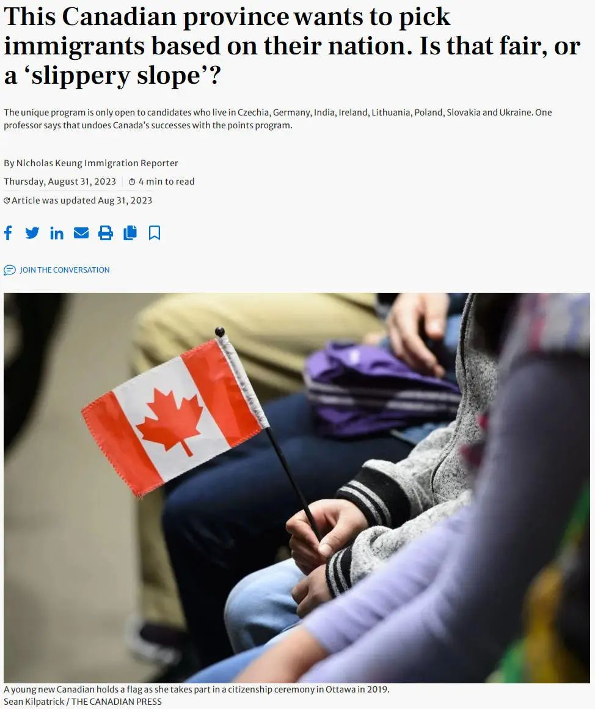 (原始链接: https://mmbiz.qpic.cn/mmbiz_jpg/904kUibXm7Y6XoU9kWewMbliap4w3ibicRfsWfKrrUWKXictXK61AHkTiaLNpnybkhrzFzeM0iba0V6ic1mMRnh90ApsVA/640?wx_fmt=jpeg)
- 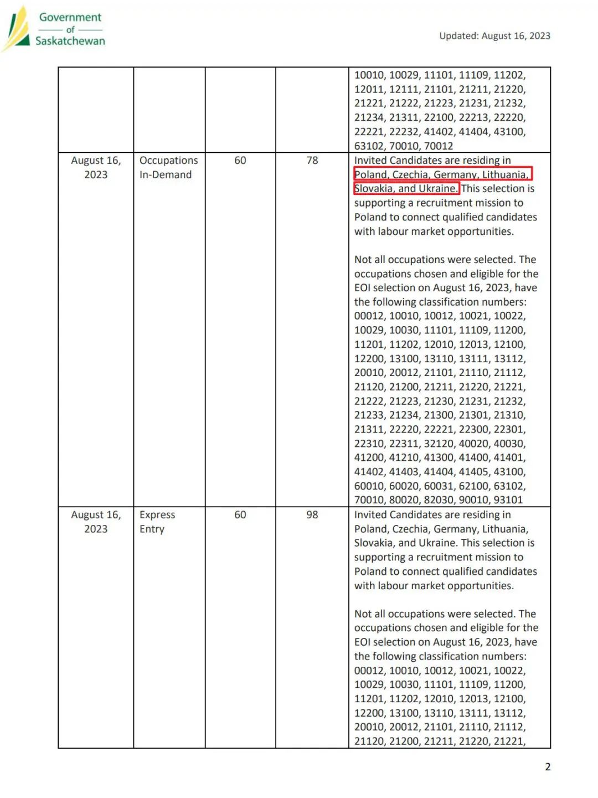 (原始链接: https://mmbiz.qpic.cn/mmbiz_jpg/904kUibXm7Y6XoU9kWewMbliap4w3ibicRfswOJIibLckiavTDUJh4vevuj6sk5Muib0LFgQn6kibOTCxFu3ecswrC6c7w/640?wx_fmt=jpeg)
- 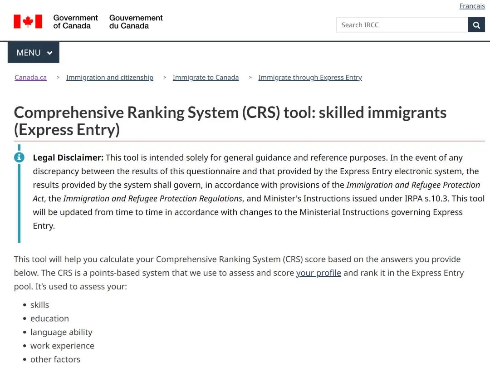 (原始链接: https://mmbiz.qpic.cn/mmbiz_jpg/904kUibXm7Y6XoU9kWewMbliap4w3ibicRfsCoj1eIKia2mKFXI15jUpiaAj99ckic9WkY0lW1VLxCFrbqv83CkKcMYNA/640?wx_fmt=jpeg)
-  (原始链接: https://mmbiz.qpic.cn/mmbiz_png/904kUibXm7Y6XoU9kWewMbliap4w3ibicRfswIvaYA8pTrkkLwOEFsPZFibz6HEq040GLYfamjwNs70IEosTutjUA8g/640?wx_fmt=png)
-  (原始链接: https://mmbiz.qpic.cn/mmbiz_jpg/904kUibXm7Y6XoU9kWewMbliap4w3ibicRfs6ria9BXkXzC0icDlhjuTFIvTAjv3lpmhicactK074ylnbZtX1HnH0fUxg/640?wx_fmt=jpeg)
-  (原始链接: https://mmbiz.qpic.cn/mmbiz_jpg/904kUibXm7Y6XoU9kWewMbliap4w3ibicRfsTu3WoicelTP6gqy5ecfncLSOtzxqrrTFBricTCq9gAHS7ic1tKK4R73Pg/640?wx_fmt=jpeg)
-  (原始链接: https://mmbiz.qpic.cn/mmbiz_jpg/904kUibXm7Y6XoU9kWewMbliap4w3ibicRfs2CBy5hCgicpuB1363bpXeTT2zBPVBM46y0xvKmzia4nSced6JhjO0ibxg/640?wx_fmt=jpeg)
-  (原始链接: https://mmbiz.qpic.cn/mmbiz_jpg/904kUibXm7Y6XoU9kWewMbliap4w3ibicRfs23neZ4keribfXCa1jXEzUhYJ4AM4sq96yZQDRMhUpl2iaVbfTZzib4PxQ/640?wx_fmt=jpeg)
- 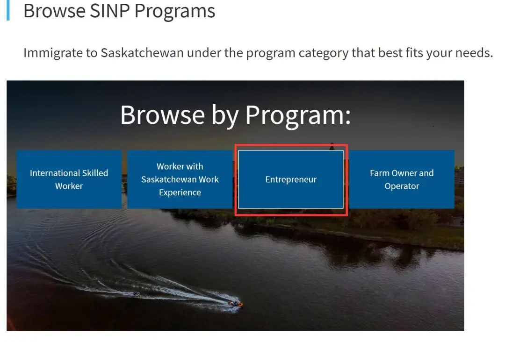 (原始链接: https://mmbiz.qpic.cn/mmbiz_jpg/904kUibXm7Y6XoU9kWewMbliap4w3ibicRfs9jWFktrekMpBHEkIGmwqJTpfCrGIEibYrmxeP55rU0LibM2elZDJickMA/640?wx_fmt=jpeg)
- 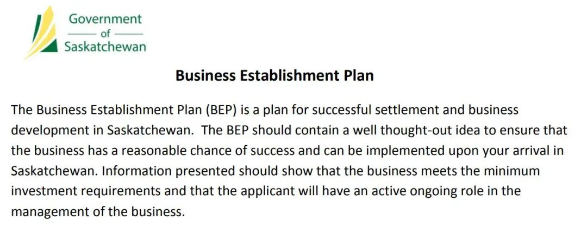 (原始链接: https://mmbiz.qpic.cn/mmbiz_jpg/904kUibXm7Y6XoU9kWewMbliap4w3ibicRfs9IofoNedFk9kN4AiasB55UZFgVYIZa7n5dHx03ibOnKIZaaQFrPWeK2Q/640?wx_fmt=jpeg)
-  (原始链接: https://mmbiz.qpic.cn/mmbiz_png/904kUibXm7Y6XoU9kWewMbliap4w3ibicRfsu4wSLRp8AqgpRicddLNlHl3u3SQ4GicEeCuwrOGZTQnddPLb0z6sspqw/640?wx_fmt=png)
- 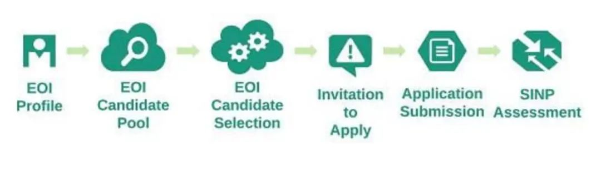 (原始链接: https://mmbiz.qpic.cn/mmbiz_jpg/904kUibXm7Y6XoU9kWewMbliap4w3ibicRfsTIjcUCRNGLRGTA55OQrYBIt4YeNxfXTlR1DzicYpJhUiajrXWZb2gcyQ/640?wx_fmt=jpeg)
- 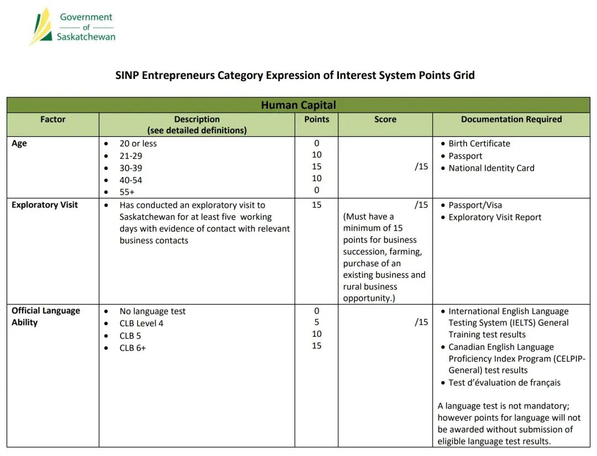 (原始链接: https://mmbiz.qpic.cn/mmbiz_jpg/904kUibXm7Y6XoU9kWewMbliap4w3ibicRfs3n2YqlzY6tFoKuXpcXMYFKLnxEmLawTfSFdOLVEKiadcJKNbN9js9dw/640?wx_fmt=jpeg)
- 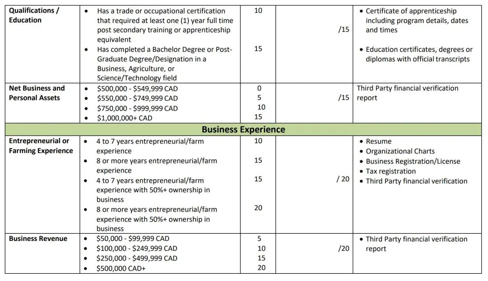 (原始链接: https://mmbiz.qpic.cn/mmbiz_jpg/904kUibXm7Y6XoU9kWewMbliap4w3ibicRfsIhBa0nOhosDpLKyUPlBrcbiclf3jB1uSicc7Z5bDrUEicQEsabCPOllVg/640?wx_fmt=jpeg)
- 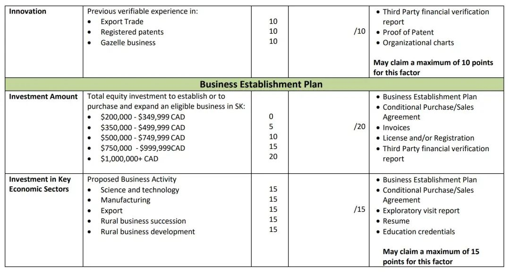 (原始链接: https://mmbiz.qpic.cn/mmbiz_jpg/904kUibXm7Y6XoU9kWewMbliap4w3ibicRfsYfGicl18s9PvGXyJF4VpHD3wqCrcWPm26qyWxnzW6SlLKlCkYia3fGsA/640?wx_fmt=jpeg)
-  (原始链接: https://mmbiz.qpic.cn/mmbiz_jpg/904kUibXm7Y6XoU9kWewMbliap4w3ibicRfsvqNOqJ7U1WaBTUp8mpO9tRfuEqXgoaV9Lygc46fEs7DibWDFF29qVHg/640?wx_fmt=jpeg)
-  (原始链接: https://mmbiz.qpic.cn/mmbiz_jpg/904kUibXm7Y6XoU9kWewMbliap4w3ibicRfsicTd2GGwUmIwteA33OjsVtzWKWibHqbJ6sYezyhduA703RX3SHkIsu5g/640?wx_fmt=jpeg)
- 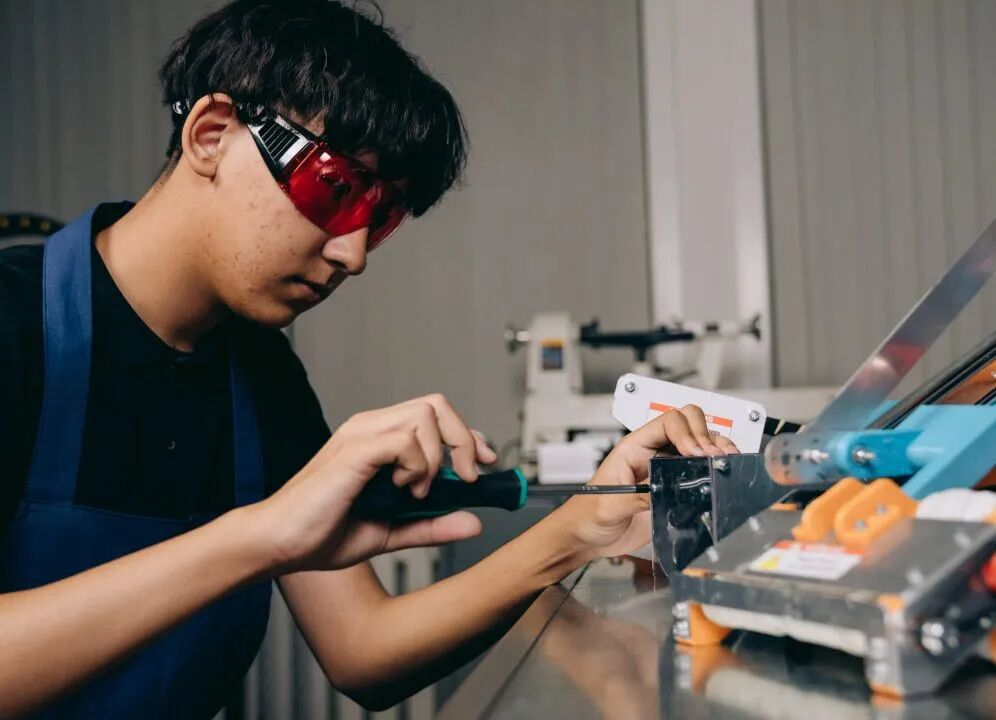 (原始链接: https://mmbiz.qpic.cn/mmbiz_jpg/904kUibXm7Y6XoU9kWewMbliap4w3ibicRfsUQaGDWpsGQ87TIvb8JeLtg2bp5oAozcDU2gJG7j3wmqDx5bjAxCICw/640?wx_fmt=jpeg)
-  (原始链接: https://mmbiz.qpic.cn/mmbiz_jpg/904kUibXm7Y6XoU9kWewMbliap4w3ibicRfsYm29fRic5SMGicovAIXyngvYIo4UqpPMS4bcKHqX0abcbwSYEIict1JMQ/640?wx_fmt=jpeg)
- 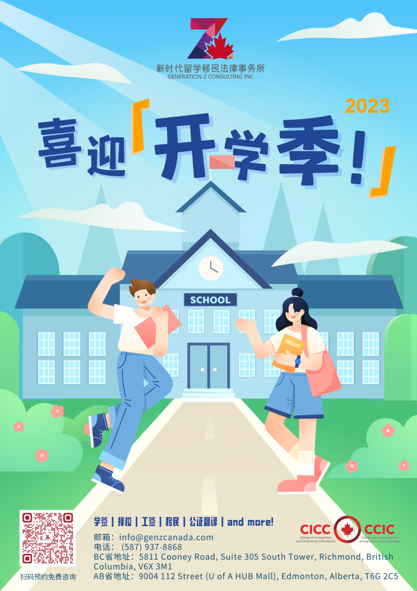 (原始链接: https://mmbiz.qpic.cn/mmbiz_png/904kUibXm7Y6XoU9kWewMbliap4w3ibicRfsYJ4XpcUibT35ttEdibqOgrJD3n3jCTzEKnQCka0ItRSCnIjTev0JYNvQ/640?wx_fmt=png)
- 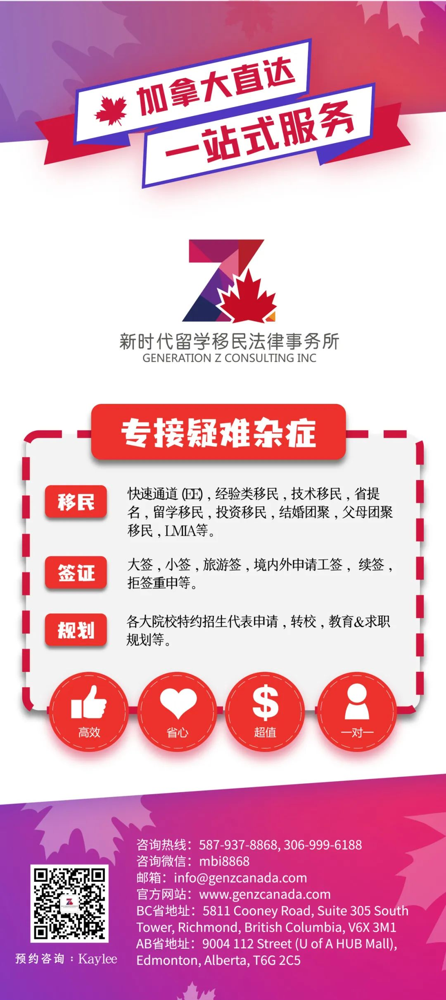 (原始链接: https://mmbiz.qpic.cn/mmbiz_jpg/904kUibXm7Y6XoU9kWewMbliap4w3ibicRfsE24w2H9slKia8jZYF4AsVpPnbxKd6ZSOhePhZQ9x66r3NfXMceNbhxg/640?wx_fmt=jpeg)
-  (原始链接: https://mmbiz.qpic.cn/mmbiz_jpg/904kUibXm7Y6XoU9kWewMbliap4w3ibicRfsFQLJkicRq0zy8M1QASxqFibibicztdYSxeWzArhMSPNdO0gXtBnOicxZcQA/640?wx_fmt=jpeg)
-  (原始链接: https://mmbiz.qpic.cn/mmbiz_jpg/904kUibXm7Y6XoU9kWewMbliap4w3ibicRfsNq6JhQka6YJicJXWnfnwA9icrzTCGaO2hEsYPG0aqg5OsbB5wticUiby2g/640?wx_fmt=jpeg)
