# 无标题

**链接地址:** http://mp.weixin.qq.com/s?__biz=MzUyNzA2NTAwNg==&mid=2247495696&idx=1&sn=1fe1ee058f912fb0d2d110bb86f05e05&chksm=fa07fad1cd7073c743c1e2b3d625d5fa4c1758fa075cb3fd0d645768e230eef84d361910a24d&mpshare=1&scene=2&srcid=0913d9TiqaNfuGKd2Z9SolMl&sharer_shareinfo=75244f6ccf71ed1daca8704d710acd06&sharer_shareinfo_first=75244f6ccf71ed1daca8704d710acd06#rd
**作者:** 你身边的签证专家
**获取时间:** 2025/8/28 19:05:46
**图片数量:** 30

---

## 原始HTML内容

<section style="font-size: 16px;"><section style="text-align: center;margin-top: 10px;margin-bottom: 10px;line-height: 0;" powered-by="xiumi.us"><section style="vertical-align: middle;display: inline-block;line-height: 0;"></section></section><section style="text-align: center;margin-top: 10px;margin-bottom: 10px;line-height: 0;" powered-by="xiumi.us"><section style="vertical-align: middle;display: inline-block;line-height: 0;"></section></section><section style="text-align: center;margin-top: 10px;margin-bottom: 10px;line-height: 0;" powered-by="xiumi.us"><section style="vertical-align: middle;display: inline-block;line-height: 0;"></section></section>
 
<section style="font-size: 19px;text-align: center;margin-top: 10px;margin-bottom: 3px;" powered-by="xiumi.us"><section style="display: inline-block;border-width: 1px;border-style: solid;border-color: rgb(188, 65, 65);background-color: rgb(188, 65, 65);width: 1.8em;height: 1.8em;line-height: 1.8em;border-radius: 100%;margin-left: auto;margin-right: auto;font-size: 16px;color: rgb(255, 255, 255);">
<strong>1</strong>
</section></section><section style="text-align: center;" powered-by="xiumi.us"><section style="display: inline-block;width: 0px;height: 0px;vertical-align: top;overflow: hidden;border-style: solid;border-width: 9px 6px 0px;border-color: rgb(188, 65, 65) rgba(255, 255, 255, 0) rgba(255, 255, 255, 0);"><svg viewBox="0 0 1 1" style="float:left;line-height:0;width:0;vertical-align:top;"></svg></section></section><section style="margin-bottom: 10px;text-align: center;justify-content: center;display: flex;flex-flow: row;" powered-by="xiumi.us"><section style="display: inline-block;width: auto;vertical-align: middle;background-color: rgba(109, 155, 209, 0.1);min-width: 10%;flex: 0 0 auto;height: auto;align-self: center;padding: 12px;"><section style="color: rgb(109, 155, 209);text-align: justify;" powered-by="xiumi.us">
<strong>EE-FSW联邦技术移民一个月获批</strong>
</section></section></section><section style="font-size: 14px;padding-right: 15px;padding-left: 15px;letter-spacing: 1px;" powered-by="xiumi.us">
 

新时代留学移民法律事务所时常收到客户们的一个疑问就是<strong>“XX项目要多久才能获批？”</strong>不得不说，这是一个让老顾问都很难精准回答的问题。

 

虽然大部分的移民项目办理的时间线可以参照加拿大移民官方网站给出的<strong>查询器</strong>进行更新追踪，但具体个案的进展也和申请人个人的申请条件以及被分配到的移民官有着极大的关系。

 
</section><section style="text-align: center;margin-top: 10px;margin-bottom: 10px;line-height: 0;" powered-by="xiumi.us"><section style="vertical-align: middle;display: inline-block;line-height: 0;width: 90%;height: auto;"></section></section><section style="font-size: 14px;padding-right: 15px;padding-left: 15px;letter-spacing: 1px;" powered-by="xiumi.us">
 

新时代在过去从业的十年时间内，也听到过很多<strong>极其“锦鲤”的个案</strong>，但今天要分享给大家这宗案例，确实也刷新了新时代为客户申请办理<strong>快速通道的审批记录</strong>。尽管移民部给出的参考办理时间为五个月，但我们的客人却在<strong>短短一个月内就幸运地获得了EE-FSW联邦技术移民的审批</strong>！

 

客人全程都在<strong>国内</strong>，我们提交移民申请前两天也递交了工签申请。然而，工签还没有获批，就直接被加拿大移民部授予了全家永居的身份。这<strong>丝滑的移民体验</strong>，让屏幕前还在苦等申请消息的小伙伴们是不是都羡慕哭了？

 
</section><section style="transform: scale(0.9);transform-origin: center center;margin-top: -9px;margin-bottom: -9px;" powered-by="xiumi.us"><section style="margin-top: 10px;margin-bottom: 10px;text-align: center;"><section style="padding-left: 1em;padding-right: 1em;display: inline-block;">
<strong>个案时间线参考</strong>
 </section><section style="border-width: 1px;border-style: solid;border-color: rgb(192, 200, 209);margin-top: -1em;padding: 20px 10px 10px;background-color: rgb(239, 239, 239);"><section style="text-align: justify;font-size: 14px;padding-right: 15px;padding-left: 15px;" powered-by="xiumi.us">
 
</section><section style="margin-top: 10px;margin-bottom: 10px;line-height: 0;" powered-by="xiumi.us"><section style="vertical-align: middle;display: inline-block;line-height: 0;"></section></section><section style="text-align: justify;" powered-by="xiumi.us">
 
</section><section style="text-align: justify;font-size: 14px;padding-right: 15px;padding-left: 15px;" powered-by="xiumi.us">
<strong>2023年6月9日，LMIA获批+50分，岗位Admin Assistant</strong>

<strong>2023年7月4日，收到EE邀请ITA</strong>

<strong>2023年8月5日，递交EE申请</strong>

<strong>2023年9月11日，全家移民获批！</strong>

 
</section></section></section></section><section style="font-size: 14px;padding-right: 15px;padding-left: 15px;letter-spacing: 1px;" powered-by="xiumi.us">
你或许会好奇，这位客户难道是从事了什么令加拿大政府求贤若渴的<strong>超紧缺型职业</strong>？会让移民部如此快马加鞭迫不及待的为他发放移民身份？其实这位客户获得的是并没有那么“神秘”的行政助理&nbsp;(NOC12200, TEER 2) 职位，而且人在国内也没有本地申请者的一些独特优势。 

 

不得不说，运气是实力的一部分啊！但新时代也必须提示，能让这位客户拥有如此丝滑移民体验的必杀技，其实还是获取了能够为CRS评分系统<strong>+50分的LMIA </strong>(Labour Market Impact Assessment) 。

 

在目前快速通道（Express Entry, EE）邀请分数长期居于500分超高分区间的<strong>激烈竞争</strong>下，一张LMIA可以说是让海外申请者脱颖而出顺利上岸的<strong>必要条件</strong>。那么LMIA到底是什么，要如何办理，好办理吗？带着这些疑问，让新时代带着大家来仔细捋一捋：LMIA到底是个啥？

 

 
</section><section style="font-size: 19px;text-align: center;margin-top: 10px;margin-bottom: 3px;" powered-by="xiumi.us"><section style="display: inline-block;border-width: 1px;border-style: solid;border-color: rgb(188, 65, 65);background-color: rgb(188, 65, 65);width: 1.8em;height: 1.8em;line-height: 1.8em;border-radius: 100%;margin-left: auto;margin-right: auto;font-size: 16px;color: rgb(255, 255, 255);">
<strong>2</strong>
</section></section><section style="text-align: center;" powered-by="xiumi.us"><section style="display: inline-block;width: 0px;height: 0px;vertical-align: top;overflow: hidden;border-style: solid;border-width: 9px 6px 0px;border-color: rgb(188, 65, 65) rgba(255, 255, 255, 0) rgba(255, 255, 255, 0);"><svg viewBox="0 0 1 1" style="float:left;line-height:0;width:0;vertical-align:top;"></svg></section></section><section style="margin-bottom: 10px;text-align: center;justify-content: center;display: flex;flex-flow: row;" powered-by="xiumi.us"><section style="display: inline-block;width: auto;vertical-align: middle;background-color: rgba(109, 155, 209, 0.1);min-width: 10%;flex: 0 0 auto;height: auto;align-self: center;padding: 12px;"><section style="color: rgb(109, 155, 209);text-align: justify;" powered-by="xiumi.us">
<strong>为什么LMIA对海外工签申请者如此重要？</strong>
</section></section></section><section style="font-size: 14px;padding-right: 15px;padding-left: 15px;letter-spacing: 1px;" powered-by="xiumi.us">
 

相信了解过加拿大工作签证申请和移民办理的朋友们多多少少都听说过<strong>“LMIA”这一串缩写</strong>。大家可能知道拥有了这项批文，可以为自己的<strong>移民项目申请加分不少</strong>，甚至让许多申请人经历一入池立刻被捞起的畅快移民体验。

 

既然这个传说中的<strong>签证和移民“万能加分神器”</strong>那么好用，但为什么周围似乎真正拿到这个批文的<strong>雇主却不是很多？难道LMIA的办理隐藏着什么玄学？</strong>

 
</section><section style="display: flex;width: 100%;flex-flow: column;" powered-by="xiumi.us"><section style="z-index: auto;" powered-by="xiumi.us"><section style="text-align: left;justify-content: flex-start;display: flex;flex-flow: row;margin-top: 20px;margin-bottom: 20px;transform: translate3d(15px, 0px, 0px);"><section style="display: inline-block;vertical-align: middle;width: auto;background-color: rgb(188, 65, 65);min-width: 5%;flex: 0 0 auto;height: auto;align-self: center;"><section style="text-align: center;transform: translate3d(10px, 0px, 0px);margin-top: -4px;margin-bottom: -4px;" powered-by="xiumi.us"><section style="display: inline-block;width: 42px;height: 42px;vertical-align: top;overflow: hidden;border-radius: 235px;background-color: rgb(233, 224, 245);border-style: solid;border-width: 7px;border-color: rgb(255, 255, 255);"><section style="margin-top: 1px;" powered-by="xiumi.us"><section style="color: rgb(0, 0, 0);">
<strong>01</strong>
</section></section></section></section></section><section style="display: inline-block;vertical-align: middle;width: auto;align-self: center;flex: 0 0 auto;min-width: 5%;height: auto;padding-left: 10px;"><section style="text-align: justify;color: rgb(0, 0, 0);" powered-by="xiumi.us">
<strong>什么是LMIA？</strong>
</section></section></section></section></section><section style="font-size: 14px;padding-right: 15px;padding-left: 15px;letter-spacing: 1px;" powered-by="xiumi.us">
 

首先，我们需要向大家解释什么是“LMIA”。

 
</section><section style="text-align: center;margin-top: 10px;margin-bottom: 10px;line-height: 0;" powered-by="xiumi.us"><section style="vertical-align: middle;display: inline-block;line-height: 0;width: 90%;height: auto;"></section></section><section style="font-size: 14px;padding-right: 15px;padding-left: 15px;letter-spacing: 1px;" powered-by="xiumi.us">
 

<strong>LMIA-Labour Market Impact Assessment</strong>，劳动力市场影响评估，也叫劳工批文，是由加拿大就业与社会发展部门作出的评估报告，以评断用人企业<strong>是否具有雇佣外国人的需要以及能力</strong>。

 

LMIA是由雇主方面提出的申请，加拿大的雇主如果需要招聘外国劳工，便必须先向 <strong>Service Canada 就业及发展部（ESDC）</strong>递交LMIA的申请。

 

 
</section><section style="display: flex;width: 100%;flex-flow: column;" powered-by="xiumi.us"><section style="z-index: auto;" powered-by="xiumi.us"><section style="text-align: left;justify-content: flex-start;display: flex;flex-flow: row;margin-top: 20px;margin-bottom: 20px;transform: translate3d(15px, 0px, 0px);"><section style="display: inline-block;vertical-align: middle;width: auto;background-color: rgb(188, 65, 65);min-width: 5%;flex: 0 0 auto;height: auto;align-self: center;"><section style="text-align: center;transform: translate3d(10px, 0px, 0px);margin-top: -4px;margin-bottom: -4px;" powered-by="xiumi.us"><section style="display: inline-block;width: 42px;height: 42px;vertical-align: top;overflow: hidden;border-radius: 235px;background-color: rgb(233, 224, 245);border-style: solid;border-width: 7px;border-color: rgb(255, 255, 255);"><section style="margin-top: 1px;" powered-by="xiumi.us"><section style="color: rgb(0, 0, 0);">
<strong>02</strong>
</section></section></section></section></section><section style="display: inline-block;vertical-align: middle;width: auto;align-self: center;flex: 0 0 auto;min-width: 5%;height: auto;padding-left: 10px;"><section style="text-align: justify;color: rgb(0, 0, 0);" powered-by="xiumi.us">
<strong>&nbsp;我需要LMIA吗？LMIA的适用范围</strong>
</section></section></section></section></section><section style="font-size: 14px;padding-right: 15px;padding-left: 15px;letter-spacing: 1px;" powered-by="xiumi.us">
 
</section><section style="font-size: 14px;padding-right: 15px;padding-left: 15px;letter-spacing: 1px;" powered-by="xiumi.us">
一些朋友们可能会问：<strong><em>“为什么别人申请移民和签证都不需要LMIA？” </em></strong>确实，虽然LMIA被称为“加分神器”，但也有<strong>适用的范围</strong>。 

 

<strong>●&nbsp;可以帮助外籍人士获得新工签（封闭式工签closed work permit）； ● 可以帮助外籍人士续现有的工签（比如申请人目前持有开放式的工签 open work permit 但是马上要过期了需要续签）； ● 可以帮助“技术类移民”申请人获得EE加分50或者200分。</strong>

<strong> </strong>
</section><section style="font-size: 14px;padding-right: 15px;padding-left: 15px;letter-spacing: 1px;" powered-by="xiumi.us">
 
</section><section style="display: flex;width: 100%;flex-flow: column;" powered-by="xiumi.us"><section style="z-index: auto;" powered-by="xiumi.us"><section style="text-align: left;justify-content: flex-start;display: flex;flex-flow: row;margin-top: 20px;margin-bottom: 20px;transform: translate3d(15px, 0px, 0px);"><section style="display: inline-block;vertical-align: middle;width: auto;background-color: rgb(188, 65, 65);min-width: 5%;flex: 0 0 auto;height: auto;align-self: center;"><section style="text-align: center;transform: translate3d(10px, 0px, 0px);margin-top: -4px;margin-bottom: -4px;" powered-by="xiumi.us"><section style="display: inline-block;width: 42px;height: 42px;vertical-align: top;overflow: hidden;border-radius: 235px;background-color: rgb(233, 224, 245);border-style: solid;border-width: 7px;border-color: rgb(255, 255, 255);"><section style="margin-top: 1px;" powered-by="xiumi.us"><section style="color: rgb(0, 0, 0);">
<strong>03</strong>
</section></section></section></section></section><section style="display: inline-block;vertical-align: middle;width: auto;align-self: center;flex: 0 0 auto;min-width: 5%;height: auto;padding-left: 10px;"><section style="text-align: justify;color: rgb(0, 0, 0);" powered-by="xiumi.us">
<strong>&nbsp;为什么LMIA不好申请？</strong>
</section></section></section></section></section><section style="font-size: 14px;padding-right: 15px;padding-left: 15px;letter-spacing: 1px;" powered-by="xiumi.us">
 

很多人都说，LMIA不好申请。因为这份批文需要<strong>雇主极其积极的配合</strong>。为了不能影响加国本地就业市场的平衡，雇主需要面对ESDC的层层审核，包括资料的审核以及<strong>至少30分钟的面试</strong>。

 

想要获得LMIA，雇主必须向加拿大的人力资源部证明以下几点：

 

● 雇佣这个海外人员不会对加拿大的劳动市场造成负面影响（比如造成本地人失业）；

● 经过努力招聘4周，没有一个加拿大本地人能够符合这份工作，即无人应聘或投递简历的加拿大人都不符合工作的要求；

● 雇主承诺按照规定支付海外人员工资并且给予相应福利。 

 
</section><section style="text-align: center;margin-top: 10px;margin-bottom: 10px;line-height: 0;" powered-by="xiumi.us"><section style="vertical-align: middle;display: inline-block;line-height: 0;width: 90%;height: auto;"></section></section>
 
<section style="font-size: 19px;text-align: center;margin-top: 10px;margin-bottom: 3px;" powered-by="xiumi.us"><section style="display: inline-block;border-width: 1px;border-style: solid;border-color: rgb(188, 65, 65);background-color: rgb(188, 65, 65);width: 1.8em;height: 1.8em;line-height: 1.8em;border-radius: 100%;margin-left: auto;margin-right: auto;font-size: 16px;color: rgb(255, 255, 255);">
<strong>3</strong>
</section></section><section style="text-align: center;" powered-by="xiumi.us"><section style="display: inline-block;width: 0px;height: 0px;vertical-align: top;overflow: hidden;border-style: solid;border-width: 9px 6px 0px;border-color: rgb(188, 65, 65) rgba(255, 255, 255, 0) rgba(255, 255, 255, 0);"><svg viewBox="0 0 1 1" style="float:left;line-height:0;width:0;vertical-align:top;"></svg></section></section><section style="margin-bottom: 10px;text-align: center;justify-content: center;display: flex;flex-flow: row;" powered-by="xiumi.us"><section style="display: inline-block;width: auto;vertical-align: middle;background-color: rgba(109, 155, 209, 0.1);min-width: 10%;flex: 0 0 auto;height: auto;align-self: center;padding: 12px;"><section style="color: rgb(109, 155, 209);text-align: justify;" powered-by="xiumi.us">
<strong>LMIA劳工批文全面改为网上递交</strong>
</section></section></section>
 
<section style="text-align: center;margin-top: 10px;margin-bottom: 10px;line-height: 0;" powered-by="xiumi.us"><section style="vertical-align: middle;display: inline-block;line-height: 0;width: 90%;height: auto;"></section></section><section style="font-size: 14px;padding-right: 15px;padding-left: 15px;letter-spacing: 1px;" powered-by="xiumi.us">
 

多年以来，加拿大商界一直呼吁政府<strong>减少申请LMIA批文的长时间等待和复杂的手续</strong>，以便<strong>高效</strong>地雇用临时外籍劳工。毕竟他们是填补加拿大劳动力短缺和疫后经济复苏的关键。

 

然而长年以来，LMIA复杂的申请手续和较长的等待时间无疑拖累了雇主招聘的过程。这一问题在加拿大政府开设了一系列试点移民项目后表现得更为突出。由于在试点项目中，加拿大雇主需要去招募更多海外员工。<strong>低透明度的申请步骤和积压导致的审批延期</strong>让雇主对于海外劳工的招聘<strong>望而却步</strong>。

 
</section><section style="text-align: center;margin-top: 10px;margin-bottom: 10px;line-height: 0;" powered-by="xiumi.us"><section style="vertical-align: middle;display: inline-block;line-height: 0;width: 90%;height: auto;"></section></section><section style="font-size: 14px;padding-right: 15px;padding-left: 15px;letter-spacing: 1px;" powered-by="xiumi.us">
 

好消息是，<strong>从2023年4月1日开始</strong>，加国联邦政府将为申请LMIA的雇主开通一个在线递交申请的系统，让更多有需求的雇主可以快速获得LMIA批文。

 
</section><section style="text-align: center;" powered-by="xiumi.us"><section style="vertical-align: middle;display: inline-block;line-height: 0;width: 90%;height: auto;"></section></section><section style="font-size: 14px;padding-right: 15px;padding-left: 15px;letter-spacing: 1px;" powered-by="xiumi.us">
 

当雇主需要聘用外籍临时劳工时，可以通过<strong>在线申请系统</strong>完成一系列操作，比如注册账户、管理账号、提交申请、付费、管理申请、并随时与加拿大服务中心（Service Canada）保持联系。

 
</section><section style="text-align: center;" powered-by="xiumi.us"><section style="vertical-align: middle;display: inline-block;line-height: 0;width: 90%;height: auto;"></section></section><section style="font-size: 14px;padding-right: 15px;padding-left: 15px;letter-spacing: 1px;" powered-by="xiumi.us">
 

雇主可使用访问Job Bank的账号来登陆这个在线申请系统，然后通过一系列的问卷指导来完成申请程序，并随时跟踪进展。雇主可以在这个系统中上传更新的文件并<strong>查看加拿大服务中心的最终评估结果</strong>。

 

从纸质递交申请到在线递交申请的转变看似只是申请程序上小小改动，但无论是对于担保方的雇主还是受聘方的雇员都是一个<strong>好消息</strong>！

 
</section><section style="text-align: center;margin-top: 10px;margin-bottom: 10px;line-height: 0;" powered-by="xiumi.us"><section style="vertical-align: middle;display: inline-block;line-height: 0;"></section></section><section style="font-size: 14px;padding-right: 15px;padding-left: 15px;letter-spacing: 1px;" powered-by="xiumi.us">
 

首先，在线申请减少了不必要的复杂手续和过长的等待时间。原本<strong>3至12个月的审理时间有望缩短</strong>；而且，雇主还可以通过这个账号随时<strong>了解申请进度</strong>，为自己的招聘计划及时做出调整。

 最重要的是，如果申请被拒绝，雇主可以和加拿大服务中心<strong>沟通并了解申请失败的原因</strong>，同时评估是否值得重新申请。这将会大大提升LMIA的<strong>申请效率和透明度</strong>。

 
</section><section style="font-size: 19px;text-align: center;margin-top: 10px;margin-bottom: 3px;" powered-by="xiumi.us"><section style="display: inline-block;border-width: 1px;border-style: solid;border-color: rgb(188, 65, 65);background-color: rgb(188, 65, 65);width: 1.8em;height: 1.8em;line-height: 1.8em;border-radius: 100%;margin-left: auto;margin-right: auto;font-size: 16px;color: rgb(255, 255, 255);">
<strong>3</strong>
</section></section><section style="text-align: center;" powered-by="xiumi.us"><section style="display: inline-block;width: 0px;height: 0px;vertical-align: top;overflow: hidden;border-style: solid;border-width: 9px 6px 0px;border-color: rgb(188, 65, 65) rgba(255, 255, 255, 0) rgba(255, 255, 255, 0);"><svg viewBox="0 0 1 1" style="float:left;line-height:0;width:0;vertical-align:top;"></svg></section></section><section style="margin-bottom: 10px;text-align: center;justify-content: center;display: flex;flex-flow: row;" powered-by="xiumi.us"><section style="display: inline-block;width: auto;vertical-align: middle;background-color: rgba(109, 155, 209, 0.1);min-width: 10%;flex: 0 0 auto;height: auto;align-self: center;padding: 12px;"><section style="color: rgb(109, 155, 209);text-align: justify;" powered-by="xiumi.us">
<strong>什么是LMIA豁免？</strong>
</section></section></section><section style="font-size: 14px;padding-right: 15px;padding-left: 15px;letter-spacing: 1px;" powered-by="xiumi.us">
 

一般来说，<strong>加拿大的雇主在雇佣外籍工人之前必须获得LMIA</strong>。免除LMIA要求对雇主和外籍工人都很重要，因为这有助于<strong>简化企业招聘流程并减轻行政负担</strong>。
</section><section style="transform: scale(0.9);transform-origin: center center;margin-top: -30px;margin-bottom: -30px;" powered-by="xiumi.us"><section style="margin-top: 10px;margin-bottom: 10px;text-align: center;"><section style="padding-left: 1em;padding-right: 1em;display: inline-block;">
<strong>&nbsp;新闻背景回顾</strong>
 </section><section style="border-width: 1px;border-style: solid;border-color: rgb(192, 200, 209);margin-top: -1em;padding: 20px 10px 10px;background-color: rgb(239, 239, 239);"><section style="text-align: justify;" powered-by="xiumi.us">
 
</section><section style="margin-top: 10px;margin-bottom: 10px;line-height: 0;" powered-by="xiumi.us"><section style="vertical-align: middle;display: inline-block;line-height: 0;width: 90%;height: auto;"></section></section><section style="font-size: 14px;padding-right: 15px;padding-left: 15px;letter-spacing: 1px;text-align: justify;" powered-by="xiumi.us">
 

2023年2月，加拿大BC省政府出台了一个“放水”政策，他们允许加拿大明星企业<strong>Lululemon可以免申请LMIA，直接雇佣外国员工</strong>！

 

根据《加拿大-不列颠哥伦比亚省（BC）移民协议》，Lululemon已被公认为一个<strong>重要项目</strong>，这意味着它可以更容易地雇用外国人从事高技能工作。

 

加拿大移民部在其网站上指出：“对于各种<strong>高技能职业</strong>，Lululemon可以雇用外国工人，而<strong>无需申请劳动力市场影响评估</strong>。”

 
</section><section style="text-align: justify;" powered-by="xiumi.us">
 
</section><section style="margin-top: 10px;margin-bottom: 10px;line-height: 0;" powered-by="xiumi.us"><section style="vertical-align: middle;display: inline-block;line-height: 0;width: 90%;height: auto;"></section></section><section style="text-align: justify;" powered-by="xiumi.us">
 
</section></section></section></section><section style="font-size: 14px;padding-right: 15px;padding-left: 15px;letter-spacing: 1px;" powered-by="xiumi.us">
对于雇主来说，LMIA豁免可以简化和加快招聘流程，因为它们消除了在雇佣外籍工人之前获得LMIA的必要性。这对<strong>需要快速填补职位的雇主尤其有利</strong>，否则可能难以为某些职位找到合格的加拿大工人。此外，LMIA豁免可以减少与招聘过程相关的行政负担和成本。 
</section><section style="text-align: center;margin-top: 10px;margin-bottom: 10px;line-height: 0;" powered-by="xiumi.us"><section style="vertical-align: middle;display: inline-block;line-height: 0;width: 65%;height: auto;"></section></section><section style="font-size: 14px;padding-right: 15px;padding-left: 15px;letter-spacing: 1px;" powered-by="xiumi.us">
 

对于外籍工人，LMIA豁免可以使其<strong>更容易获得工作签证并在加拿大工作</strong>。如果没有LMIA豁免，外国工人在获得工作签证方面可能面临重大障碍，因为他们必须证明他们的就业不会对加拿大劳动力市场产生负面影响。通过取消LMIA要求，外国工人可能有更多的机会获得工作签证并在加拿大就业。

 

需要注意的是，即使适用LMIA豁免，<strong>外籍工人仍必须满足其他资格标准，并获得有效的工作签证，才能在加拿大工作。</strong>

<strong> </strong>
</section><section style="margin: 20px 0% 10px;text-align: center;" powered-by="xiumi.us"><section style="padding: 3px;display: inline-block;border-bottom: 5px solid rgb(188, 65, 65);color: rgb(147, 122, 122);">
<strong>加拿大其他免LMIA获得工签的政策</strong>
</section></section><section style="font-size: 14px;padding-right: 15px;padding-left: 15px;letter-spacing: 1px;" powered-by="xiumi.us">
 
<ul class="list-paddingleft-1" style="padding-left: 40px;list-style-position: outside;"><li>
国际贸易协定，如北美自由贸易协定（NAFTA）或跨太平洋伙伴关系全面与进步协定（CPTPP），涵盖的工人可免于LMIA要求；
</li><li>
根据与其他国家的互惠就业安排在加拿大就业的工人也可免于LMIA要求；
</li><li>
加拿大特定职业类别，如住家护理员或农业或食品加工部门的工人，可免于LMIA要求；
</li><li>
加拿大参加特定移民项目的工人，如加拿大国际体验（IEC）项目或全球人才流（GTS），可免于LMIA要求。
</li></ul></section>
 
<section style="margin: 10px 0%;text-align: left;justify-content: flex-start;display: flex;flex-flow: row;" powered-by="xiumi.us"><section style="display: inline-block;width: 100%;vertical-align: top;background-color: rgb(216, 202, 160);line-height: 0;align-self: flex-start;flex: 0 0 auto;"><section style="text-align: justify;justify-content: flex-start;display: flex;flex-flow: row;" powered-by="xiumi.us"><section style="display: inline-block;width: 100%;vertical-align: top;background-position: 0% 0%;background-repeat: repeat;background-size: 1.56658%;background-attachment: scroll;align-self: flex-start;flex: 0 0 auto;background-image: url(&quot;https://mmbiz.qpic.cn/mmbiz_png/904kUibXm7Y71XpPOxRgFicZ0u1LfkQg00fc5Ze7OyJPh5E86SFZqLn5zmnPg7rsR3JYcaudvsT9TsVTcGCVZz3w/640?wx_fmt=png&quot;);"><section style="text-align: center;" powered-by="xiumi.us"><section style="display: inline-block;width: 100%;height: 11px;vertical-align: top;overflow: hidden;background-color: rgba(255, 255, 255, 0);"><svg viewBox="0 0 1 1" style="float:left;line-height:0;width:0;vertical-align:top;"></svg></section></section></section></section></section></section><section style="font-size: 14px;padding-right: 15px;padding-left: 15px;letter-spacing: 1px;" powered-by="xiumi.us">
 

综上所述，<strong>LMIA豁免的要求是十分苛刻</strong>。想要找到能够符合LMIA豁免的雇主和职位<strong>对于99%+目标加拿大的工作和移民群体来说还是很具有挑战性的</strong>。虽然LMIA和LMIA工签的办理程序相对繁琐，但新时代还是拥有非常多<strong>成功的经验和案例</strong>来分享给大家！

 
</section>
 
<section style="margin: 20px 0% 5px;text-align: center;transform: translate3d(1px, 0px, 0px);" powered-by="xiumi.us"><section style="font-size: 26px;font-family: Optima-Regular, PingFangTC-light;color: rgb(0, 0, 0);letter-spacing: 2px;line-height: 1;">
<strong># LMIA工签境外递交&nbsp;#</strong>
</section></section><section style="text-align: center;justify-content: center;margin-top: 1px;margin-right: 0%;margin-left: 0%;display: flex;flex-flow: row;" powered-by="xiumi.us"><section style="display: inline-block;width: 100px;vertical-align: top;flex: 0 0 auto;height: auto;border-top: 0px solid rgb(43, 65, 110);border-top-left-radius: 0px;align-self: flex-start;line-height: 0;"><section style="margin-right: 0%;margin-bottom: 8px;margin-left: 0%;transform: translate3d(1px, 0px, 0px);" powered-by="xiumi.us"><section style="background-color: rgb(43, 65, 110);height: 1px;"><svg viewBox="0 0 1 1" style="float:left;line-height:0;width:0;vertical-align:top;"></svg></section></section></section></section><section style="text-align: center;margin: -24px 0% 10px;" powered-by="xiumi.us"><section style="display: inline-block;width: 46px;height: 33px;vertical-align: top;overflow: hidden;background-color: rgba(255, 174, 174, 0.13);border-width: 0px;border-radius: 206% 134% 167% 138%;border-style: none;border-color: rgb(62, 62, 62);"><svg viewBox="0 0 1 1" style="float:left;line-height:0;width:0;vertical-align:top;"></svg></section></section><section style="margin-top: 10px;margin-right: 0%;margin-left: 0%;text-align: left;justify-content: flex-start;display: flex;flex-flow: row;" powered-by="xiumi.us"><section style="display: inline-block;width: 100%;vertical-align: top;background-color: rgb(255, 244, 229);padding: 20px 20px 25px;box-shadow: rgb(0, 0, 0) 0px 0px 0px;align-self: flex-start;flex: 0 0 auto;"><section style="text-align: center;margin-top: 10px;margin-right: 0%;margin-left: 0%;justify-content: center;display: flex;flex-flow: row;" powered-by="xiumi.us"><section style="display: inline-block;width: 100%;vertical-align: top;border-width: 0px;border-radius: 8px;border-style: none;border-color: rgb(62, 62, 62);overflow: hidden;box-shadow: rgb(235, 198, 159) 0px 0px 6px;background-color: rgb(255, 255, 255);padding-bottom: 10px;flex: 0 0 auto;height: auto;align-self: flex-start;"><section style="justify-content: center;display: flex;flex-flow: row;" powered-by="xiumi.us"><section style="display: inline-block;width: 100%;vertical-align: top;box-shadow: rgb(0, 0, 0) 0px 0px 0px;padding: 5px 10px 10px;align-self: flex-start;flex: 0 0 auto;"><section style="margin-top: 10px;margin-bottom: 10px;line-height: 0;" powered-by="xiumi.us"><section style="vertical-align: middle;display: inline-block;line-height: 0;"></section></section><section style="margin-top: 10px;margin-bottom: 10px;line-height: 0;" powered-by="xiumi.us"><section style="vertical-align: middle;display: inline-block;line-height: 0;"></section></section><section style="margin-top: 10px;margin-bottom: 10px;line-height: 0;" powered-by="xiumi.us"><section style="vertical-align: middle;display: inline-block;line-height: 0;"></section></section></section></section></section></section></section></section><section style="" powered-by="xiumi.us"><section style="text-align: center;margin: -50px 0% 10px;line-height: 0;"><section style="vertical-align: middle;display: inline-block;line-height: 0;box-shadow: rgb(0, 0, 0) 0px 0px 0px;"></section></section></section><section style="font-size: 14px;padding-right: 15px;padding-left: 15px;letter-spacing: 1px;" powered-by="xiumi.us">
 
</section><section style="margin: 20px 0% 5px;text-align: center;transform: translate3d(1px, 0px, 0px);" powered-by="xiumi.us"><section style="font-size: 26px;font-family: Optima-Regular, PingFangTC-light;color: rgb(0, 0, 0);letter-spacing: 2px;line-height: 1;">
<strong># LMIA境外工签 #</strong>
</section></section><section style="text-align: center;justify-content: center;margin-top: 1px;margin-right: 0%;margin-left: 0%;display: flex;flex-flow: row;" powered-by="xiumi.us"><section style="display: inline-block;width: 100px;vertical-align: top;flex: 0 0 auto;height: auto;border-top: 0px solid rgb(43, 65, 110);border-top-left-radius: 0px;align-self: flex-start;line-height: 0;"><section style="margin-right: 0%;margin-bottom: 8px;margin-left: 0%;transform: translate3d(1px, 0px, 0px);" powered-by="xiumi.us"><section style="background-color: rgb(43, 65, 110);height: 1px;"><svg viewBox="0 0 1 1" style="float:left;line-height:0;width:0;vertical-align:top;"></svg></section></section></section></section><section style="text-align: center;margin: -24px 0% 10px;" powered-by="xiumi.us"><section style="display: inline-block;width: 46px;height: 33px;vertical-align: top;overflow: hidden;background-color: rgba(255, 174, 174, 0.13);border-width: 0px;border-radius: 206% 134% 167% 138%;border-style: none;border-color: rgb(62, 62, 62);"><svg viewBox="0 0 1 1" style="float:left;line-height:0;width:0;vertical-align:top;"></svg></section></section><section style="margin-top: 10px;margin-right: 0%;margin-left: 0%;text-align: left;justify-content: flex-start;display: flex;flex-flow: row;" powered-by="xiumi.us"><section style="display: inline-block;width: 100%;vertical-align: top;background-color: rgb(255, 244, 229);padding: 20px 20px 25px;box-shadow: rgb(0, 0, 0) 0px 0px 0px;align-self: flex-start;flex: 0 0 auto;"><section style="text-align: center;margin-top: 10px;margin-right: 0%;margin-left: 0%;justify-content: center;display: flex;flex-flow: row;" powered-by="xiumi.us"><section style="display: inline-block;width: 100%;vertical-align: top;border-width: 0px;border-radius: 8px;border-style: none;border-color: rgb(62, 62, 62);overflow: hidden;box-shadow: rgb(235, 198, 159) 0px 0px 6px;background-color: rgb(255, 255, 255);padding-bottom: 10px;flex: 0 0 auto;height: auto;align-self: flex-start;"><section style="justify-content: center;display: flex;flex-flow: row;" powered-by="xiumi.us"><section style="display: inline-block;width: 100%;vertical-align: top;box-shadow: rgb(0, 0, 0) 0px 0px 0px;padding: 5px 10px 10px;align-self: flex-start;flex: 0 0 auto;"><section style="margin-top: 10px;margin-bottom: 10px;line-height: 0;" powered-by="xiumi.us"><section style="vertical-align: middle;display: inline-block;line-height: 0;"></section></section><section style="margin-top: 10px;margin-bottom: 10px;line-height: 0;" powered-by="xiumi.us"><section style="vertical-align: middle;display: inline-block;line-height: 0;"></section></section><section style="text-align: justify;" powered-by="xiumi.us">
 
</section><section style="text-align: justify;" powered-by="xiumi.us">
 
</section><section style="color: rgb(106, 106, 106);font-size: 15px;padding-right: 15px;padding-left: 15px;" powered-by="xiumi.us">
<strong>LMIA based 工签境外申请，官方显示20周的审批时间，我们拿到获批信却只花了25个工作日，主申请和配偶一起获批！EE马上也快上岸了，恭喜客人新生活开启～</strong>

<strong> </strong>
</section></section></section></section></section></section></section><section style="" powered-by="xiumi.us"><section style="text-align: center;margin: -50px 0% 10px;line-height: 0;"><section style="vertical-align: middle;display: inline-block;line-height: 0;box-shadow: rgb(0, 0, 0) 0px 0px 0px;"></section></section></section>
 
<section style="margin: 20px 0% 5px;text-align: center;transform: translate3d(1px, 0px, 0px);" powered-by="xiumi.us"><section style="font-size: 26px;font-family: Optima-Regular, PingFangTC-light;color: rgb(0, 0, 0);letter-spacing: 2px;line-height: 1;">
<strong># LMIA #</strong>
</section></section><section style="text-align: center;justify-content: center;margin-top: 1px;margin-right: 0%;margin-left: 0%;display: flex;flex-flow: row;" powered-by="xiumi.us"><section style="display: inline-block;width: 100px;vertical-align: top;flex: 0 0 auto;height: auto;border-top: 0px solid rgb(43, 65, 110);border-top-left-radius: 0px;align-self: flex-start;line-height: 0;"><section style="margin-right: 0%;margin-bottom: 8px;margin-left: 0%;transform: translate3d(1px, 0px, 0px);" powered-by="xiumi.us"><section style="background-color: rgb(43, 65, 110);height: 1px;"><svg viewBox="0 0 1 1" style="float:left;line-height:0;width:0;vertical-align:top;"></svg></section></section></section></section><section style="text-align: center;margin: -24px 0% 10px;" powered-by="xiumi.us"><section style="display: inline-block;width: 46px;height: 33px;vertical-align: top;overflow: hidden;background-color: rgba(255, 174, 174, 0.13);border-width: 0px;border-radius: 206% 134% 167% 138%;border-style: none;border-color: rgb(62, 62, 62);"><svg viewBox="0 0 1 1" style="float:left;line-height:0;width:0;vertical-align:top;"></svg></section></section><section style="margin-top: 10px;margin-right: 0%;margin-left: 0%;text-align: left;justify-content: flex-start;display: flex;flex-flow: row;" powered-by="xiumi.us"><section style="display: inline-block;width: 100%;vertical-align: top;background-color: rgb(255, 244, 229);padding: 20px 20px 25px;box-shadow: rgb(0, 0, 0) 0px 0px 0px;align-self: flex-start;flex: 0 0 auto;"><section style="text-align: center;margin-top: 10px;margin-right: 0%;margin-left: 0%;justify-content: center;display: flex;flex-flow: row;" powered-by="xiumi.us"><section style="display: inline-block;width: 100%;vertical-align: top;border-width: 0px;border-radius: 8px;border-style: none;border-color: rgb(62, 62, 62);overflow: hidden;box-shadow: rgb(235, 198, 159) 0px 0px 6px;background-color: rgb(255, 255, 255);padding-bottom: 10px;flex: 0 0 auto;height: auto;align-self: flex-start;"><section style="justify-content: center;display: flex;flex-flow: row;" powered-by="xiumi.us"><section style="display: inline-block;width: 100%;vertical-align: top;box-shadow: rgb(0, 0, 0) 0px 0px 0px;padding: 5px 10px 10px;align-self: flex-start;flex: 0 0 auto;"><section style="margin-top: 10px;margin-bottom: 10px;line-height: 0;" powered-by="xiumi.us"><section style="vertical-align: middle;display: inline-block;line-height: 0;"></section></section><section style="text-align: justify;" powered-by="xiumi.us">
 
</section><section style="text-align: justify;" powered-by="xiumi.us">
 
</section><section style="color: rgb(106, 106, 106);font-size: 15px;" powered-by="xiumi.us">
<strong>TEER 4 岗位免面试直接给2年工签</strong>

<strong>配偶也可以赶上新政申请配偶工签了</strong>

<strong>一切都是最好的安排！</strong>

<strong> </strong>
</section></section></section></section></section></section></section><section style="" powered-by="xiumi.us"><section style="text-align: center;margin: -50px 0% 10px;line-height: 0;"><section style="vertical-align: middle;display: inline-block;line-height: 0;box-shadow: rgb(0, 0, 0) 0px 0px 0px;"></section></section></section><section style="font-size: 14px;padding-right: 15px;padding-left: 15px;letter-spacing: 1px;" powered-by="xiumi.us">
 

如果你对来加拿大工作感兴趣，或是已经有加拿大的公司意向Offer你一个工作职位，我们很愿意协助您和您的雇主搞定接下来的一系列手续。

 

办理LMIA和境外申请工签其实并没有大家想得那么难！欢迎联系经验丰富的<strong>新时代留学移民法律事务所</strong>，让我们帮你排忧解难，扫平加国就业和永居道路上的所有障碍！

 
</section>
 
<section style="text-align: left;justify-content: flex-start;display: flex;flex-flow: row;margin-top: 10px;" powered-by="xiumi.us"><section style="display: inline-block;vertical-align: top;width: auto;align-self: stretch;flex: 0 0 auto;background-color: rgb(188, 65, 65);min-width: 5%;height: auto;padding-top: 9px;padding-right: 9px;padding-left: 20px;"><section style="text-align: justify;font-size: 18px;color: rgb(252, 252, 252);" powered-by="xiumi.us">
<strong>阅读更多</strong>
</section></section><section style="display: inline-block;vertical-align: top;width: auto;min-width: 5%;flex: 0 0 auto;height: auto;align-self: stretch;"><section style="" powered-by="xiumi.us"><section style="display: inline-block;width: 0px;height: 0px;vertical-align: top;overflow: hidden;border-style: solid;border-width: 45px 0px 0px 19px;border-color: rgba(255, 255, 255, 0) rgba(255, 255, 255, 0) rgba(255, 255, 255, 0) rgb(188, 65, 65);"><svg viewBox="0 0 1 1" style="float:left;line-height:0;width:0;vertical-align:top;"></svg></section></section></section></section><section style="margin-bottom: 10px;" powered-by="xiumi.us"><section style="background-color: rgb(188, 65, 65);height: 3px;"><svg viewBox="0 0 1 1" style="float:left;line-height:0;width:0;vertical-align:top;"></svg></section></section><section style="margin: 10px 0%;text-align: left;justify-content: flex-start;display: flex;flex-flow: row;" powered-by="xiumi.us"><section style="display: inline-block;width: 100%;vertical-align: top;background-position: 14.6137% 32.4473%;background-repeat: repeat;background-size: 100.637%;background-attachment: scroll;padding: 30px;align-self: flex-start;flex: 0 0 auto;background-image: url(&quot;https://mmbiz.qpic.cn/mmbiz_jpg/904kUibXm7Y71XpPOxRgFicZ0u1LfkQg0085Kw6soqqRrRPcJ0ZTR5batwV69Mo5SXNy3MSZHTaibTLibZLycjACbw/640?wx_fmt=jpeg&quot;);"><section style="text-align: justify;justify-content: flex-start;display: flex;flex-flow: row;" powered-by="xiumi.us"><section style="display: inline-block;width: 100%;vertical-align: top;background-color: rgba(188, 65, 65, 0.22);padding: 10px;border-width: 0px;border-style: none;border-color: rgb(62, 62, 62);align-self: flex-start;flex: 0 0 auto;"><section style="text-align: center;color: rgb(255, 255, 255);font-size: 14px;" powered-by="xiumi.us">
<a target="_blank" href="http://mp.weixin.qq.com/s?__biz=MzUyNzA2NTAwNg==&amp;mid=2247495653&amp;idx=1&amp;sn=5d6ec9050a3130d8da37233ae4e24f3c&amp;chksm=fa07e524cd706c32e6811c9df5c2d3ecbac1949071d3a17df79b63ba9c4d250ed486b188d369&amp;scene=21#wechat_redirect" textvalue="不接受新申请：加拿大宣布2023PGP父母团聚移民抽签时间！但24200份邀请只给这些人！" linktype="text" imgurl="" imgdata="null" data-itemshowtype="0" tab="innerlink" style="color: rgb(255, 255, 255);" data-linktype="2"><strong>不接受新申请：加拿大宣布2023PGP父母团聚移民抽签时间！但24200份邀请只给这些人！</strong></a>
</section></section></section></section></section><section style="margin: 10px 0%;text-align: left;justify-content: flex-start;display: flex;flex-flow: row;" powered-by="xiumi.us"><section style="display: inline-block;width: 100%;vertical-align: top;background-position: 65.7357% 4.86675%;background-repeat: repeat;background-size: 104.114%;background-attachment: scroll;padding: 30px;align-self: flex-start;flex: 0 0 auto;background-image: url(&quot;https://mmbiz.qpic.cn/mmbiz_jpg/904kUibXm7Y71XpPOxRgFicZ0u1LfkQg00Gn0OTibZ3y6MYg0deQgeMficXRfEDggKZqgB3OMVn7k0zjKUyiagm3xcw/640?wx_fmt=jpeg&quot;);"><section style="text-align: justify;justify-content: flex-start;display: flex;flex-flow: row;" powered-by="xiumi.us"><section style="display: inline-block;width: 100%;vertical-align: top;background-color: rgba(188, 65, 65, 0.22);padding: 10px;border-width: 0px;border-style: none;border-color: rgb(62, 62, 62);align-self: flex-start;flex: 0 0 auto;"><section style="text-align: center;color: rgb(255, 255, 255);font-size: 14px;" powered-by="xiumi.us">
<a target="_blank" href="http://mp.weixin.qq.com/s?__biz=MzUyNzA2NTAwNg==&amp;mid=2247495620&amp;idx=1&amp;sn=7a84aa340fe6296dea2c54b7c6405726&amp;chksm=fa07e505cd706c13d26a37ad847533b86b8b14d76606e55a70e1457d4a7bd9f1c0bb0c07c4c1&amp;scene=21#wechat_redirect" textvalue="23岁留学生刚来就差点睡大街！移民部长：今年90w留学生涌入，10年涨3倍！" linktype="text" imgurl="" imgdata="null" data-itemshowtype="0" tab="innerlink" style="color: rgb(255, 255, 255);" data-linktype="2"><strong>23岁留学生刚来就差点睡大街！移民部长：今年90w留学生涌入，10年涨3倍！</strong></a>
</section></section></section></section></section><section style="margin: 10px 0%;text-align: left;justify-content: flex-start;display: flex;flex-flow: row;" powered-by="xiumi.us"><section style="display: inline-block;width: 100%;vertical-align: top;background-position: -6.57787% 18.5277%;background-repeat: repeat;background-size: 107.269%;background-attachment: scroll;padding: 30px;align-self: flex-start;flex: 0 0 auto;background-image: url(&quot;https://mmbiz.qpic.cn/mmbiz_jpg/904kUibXm7Y71XpPOxRgFicZ0u1LfkQg008Dho7RLA8CIGjic5sBr0DckPib7R2O58fa5ibTlgyuosWRLzr4xDpBRHA/640?wx_fmt=jpeg&quot;);"><section style="text-align: justify;justify-content: flex-start;display: flex;flex-flow: row;" powered-by="xiumi.us"><section style="display: inline-block;width: 100%;vertical-align: top;background-color: rgba(188, 65, 65, 0.22);padding: 10px;border-width: 0px;border-style: none;border-color: rgb(62, 62, 62);align-self: flex-start;flex: 0 0 auto;"><section style="text-align: left;color: rgb(255, 255, 255);font-size: 14px;" powered-by="xiumi.us">
<a target="_blank" href="http://mp.weixin.qq.com/s?__biz=MzUyNzA2NTAwNg==&amp;mid=2247495576&amp;idx=1&amp;sn=8d778135e18b7ede4837bdb4c736680d&amp;chksm=fa07e559cd706c4f68f9a18f5ce859bf9d1916c4a57aed503c7ba7dda09bbf5d2da033197def&amp;scene=21#wechat_redirect" textvalue="正大光明歧视中国人？加国这个省省提名只抽八个国家排除中国！背后原因竟然是..." linktype="text" imgurl="" imgdata="null" data-itemshowtype="0" tab="innerlink" style="color: rgb(255, 255, 255);" data-linktype="2"><strong>正大光明歧视中国人？加国这个省省提名只抽八个国家排除中国！背后原因竟然是...</strong></a>
</section></section></section></section></section><section style="margin: 10px 0%;text-align: left;justify-content: flex-start;display: flex;flex-flow: row;" powered-by="xiumi.us"><section style="display: inline-block;width: 100%;vertical-align: top;background-position: 119.157% 13.6487%;background-repeat: repeat;background-size: 101.212%;background-attachment: scroll;padding: 30px;align-self: flex-start;flex: 0 0 auto;background-image: url(&quot;https://mmbiz.qpic.cn/mmbiz_jpg/904kUibXm7Y71XpPOxRgFicZ0u1LfkQg00W0BTpRL9icbFqZKEVNfA4JmuzMKc1h3XSaImVLic4PTVxKann7ibocaNw/640?wx_fmt=jpeg&quot;);"><section style="text-align: justify;justify-content: flex-start;display: flex;flex-flow: row;" powered-by="xiumi.us"><section style="display: inline-block;width: 100%;vertical-align: top;background-color: rgba(188, 65, 65, 0.22);padding: 10px;border-width: 0px;border-style: none;border-color: rgb(62, 62, 62);align-self: flex-start;flex: 0 0 auto;"><section style="text-align: center;color: rgb(255, 255, 255);font-size: 14px;" powered-by="xiumi.us">
<a target="_blank" href="http://mp.weixin.qq.com/s?__biz=MzUyNzA2NTAwNg==&amp;mid=2247495540&amp;idx=1&amp;sn=51965396152c52108f23604ca851f6ff&amp;chksm=fa07e5b5cd706ca3204ebc5d6f16637aa41458f5c16a6af9fd7c1a3d474cd81f6f9bc00e70f3&amp;scene=21#wechat_redirect" textvalue="加拿大政府严查留学生申请！中国留学生被名校录取却无法入学！怎么办？！" linktype="text" imgurl="" imgdata="null" data-itemshowtype="0" tab="innerlink" style="color: rgb(255, 255, 255);" data-linktype="2"><strong>加拿大政府严查留学生申请！中国留学生被名校录取却无法入学！怎么办？！</strong></a>
</section></section></section></section></section><section style="text-align: center;font-size: 12px;color: rgb(180, 180, 180);" powered-by="xiumi.us">
（点击文字阅读）
</section><section style="margin: 10px 0%;text-align: left;justify-content: flex-start;display: flex;flex-flow: row;" powered-by="xiumi.us"><section style="display: inline-block;width: 100%;vertical-align: top;background-color: rgb(216, 202, 160);line-height: 0;align-self: flex-start;flex: 0 0 auto;"><section style="text-align: justify;justify-content: flex-start;display: flex;flex-flow: row;" powered-by="xiumi.us"><section style="display: inline-block;width: 100%;vertical-align: top;background-position: 0% 0%;background-repeat: repeat;background-size: 1.56658%;background-attachment: scroll;align-self: flex-start;flex: 0 0 auto;background-image: url(&quot;https://mmbiz.qpic.cn/mmbiz_png/904kUibXm7Y71XpPOxRgFicZ0u1LfkQg00fc5Ze7OyJPh5E86SFZqLn5zmnPg7rsR3JYcaudvsT9TsVTcGCVZz3w/640?wx_fmt=png&quot;);"><section style="text-align: center;" powered-by="xiumi.us"><section style="display: inline-block;width: 100%;height: 11px;vertical-align: top;overflow: hidden;background-color: rgba(255, 255, 255, 0);"><svg viewBox="0 0 1 1" style="float:left;line-height:0;width:0;vertical-align:top;"></svg></section></section></section></section></section></section><section style="text-align: center;margin-top: 10px;margin-bottom: 10px;line-height: 0;" powered-by="xiumi.us"><section style="vertical-align: middle;display: inline-block;line-height: 0;"></section></section><section style="text-align: center;margin-top: 10px;margin-bottom: 10px;line-height: 0;" powered-by="xiumi.us"> </section><section style="text-align: center;margin-top: 10px;margin-bottom: 10px;line-height: 0;" powered-by="xiumi.us"><section style="vertical-align: middle;display: inline-block;line-height: 0;"></section></section><section style="text-align: center;margin-top: 10px;margin-bottom: 10px;line-height: 0;" powered-by="xiumi.us"><section style="vertical-align: middle;display: inline-block;line-height: 0;"></section></section><section style="text-align: center;margin-top: 10px;margin-bottom: 10px;line-height: 0;" powered-by="xiumi.us"><section style="vertical-align: middle;display: inline-block;line-height: 0;"></section></section><section style="text-align: center;margin-top: 10px;margin-bottom: 10px;line-height: 0;" powered-by="xiumi.us"><section style="vertical-align: middle;display: inline-block;line-height: 0;"></section></section><section style="text-align: center;margin-top: 10px;margin-bottom: 10px;line-height: 0;" powered-by="xiumi.us"><section style="vertical-align: middle;display: inline-block;line-height: 0;"></section></section></section>
 

<mp-style-type data-value="3"></mp-style-type>

---

## 纯文本内容

1EE-FSW联邦技术移民一个月获批新时代留学移民法律事务所时常收到客户们的一个疑问就是“XX项目要多久才能获批？”不得不说，这是一个让老顾问都很难精准回答的问题。虽然大部分的移民项目办理的时间线可以参照加拿大移民官方网站给出的查询器进行更新追踪，但具体个案的进展也和申请人个人的申请条件以及被分配到的移民官有着极大的关系。新时代在过去从业的十年时间内，也听到过很多极其“锦鲤”的个案，但今天要分享给大家这宗案例，确实也刷新了新时代为客户申请办理快速通道的审批记录。尽管移民部给出的参考办理时间为五个月，但我们的客人却在短短一个月内就幸运地获得了EE-FSW联邦技术移民的审批！客人全程都在国内，我们提交移民申请前两天也递交了工签申请。然而，工签还没有获批，就直接被加拿大移民部授予了全家永居的身份。这丝滑的移民体验，让屏幕前还在苦等申请消息的小伙伴们是不是都羡慕哭了？个案时间线参考 2023年6月9日，LMIA获批+50分，岗位Admin Assistant2023年7月4日，收到EE邀请ITA2023年8月5日，递交EE申请2023年9月11日，全家移民获批！你或许会好奇，这位客户难道是从事了什么令加拿大政府求贤若渴的超紧缺型职业？会让移民部如此快马加鞭迫不及待的为他发放移民身份？其实这位客户获得的是并没有那么“神秘”的行政助理 (NOC12200, TEER 2) 职位，而且人在国内也没有本地申请者的一些独特优势。不得不说，运气是实力的一部分啊！但新时代也必须提示，能让这位客户拥有如此丝滑移民体验的必杀技，其实还是获取了能够为CRS评分系统+50分的LMIA (Labour Market Impact Assessment) 。在目前快速通道（Express Entry, EE）邀请分数长期居于500分超高分区间的激烈竞争下，一张LMIA可以说是让海外申请者脱颖而出顺利上岸的必要条件。那么LMIA到底是什么，要如何办理，好办理吗？带着这些疑问，让新时代带着大家来仔细捋一捋：LMIA到底是个啥？2为什么LMIA对海外工签申请者如此重要？相信了解过加拿大工作签证申请和移民办理的朋友们多多少少都听说过“LMIA”这一串缩写。大家可能知道拥有了这项批文，可以为自己的移民项目申请加分不少，甚至让许多申请人经历一入池立刻被捞起的畅快移民体验。既然这个传说中的签证和移民“万能加分神器”那么好用，但为什么周围似乎真正拿到这个批文的雇主却不是很多？难道LMIA的办理隐藏着什么玄学？01什么是LMIA？首先，我们需要向大家解释什么是“LMIA”。LMIA-Labour Market Impact Assessment，劳动力市场影响评估，也叫劳工批文，是由加拿大就业与社会发展部门作出的评估报告，以评断用人企业是否具有雇佣外国人的需要以及能力。LMIA是由雇主方面提出的申请，加拿大的雇主如果需要招聘外国劳工，便必须先向 Service Canada 就业及发展部（ESDC）递交LMIA的申请。02 我需要LMIA吗？LMIA的适用范围一些朋友们可能会问：“为什么别人申请移民和签证都不需要LMIA？” 确实，虽然LMIA被称为“加分神器”，但也有适用的范围。● 可以帮助外籍人士获得新工签（封闭式工签closed work permit）；● 可以帮助外籍人士续现有的工签（比如申请人目前持有开放式的工签 open work permit 但是马上要过期了需要续签）；● 可以帮助“技术类移民”申请人获得EE加分50或者200分。03 为什么LMIA不好申请？很多人都说，LMIA不好申请。因为这份批文需要雇主极其积极的配合。为了不能影响加国本地就业市场的平衡，雇主需要面对ESDC的层层审核，包括资料的审核以及至少30分钟的面试。想要获得LMIA，雇主必须向加拿大的人力资源部证明以下几点：● 雇佣这个海外人员不会对加拿大的劳动市场造成负面影响（比如造成本地人失业）；● 经过努力招聘4周，没有一个加拿大本地人能够符合这份工作，即无人应聘或投递简历的加拿大人都不符合工作的要求；● 雇主承诺按照规定支付海外人员工资并且给予相应福利。3LMIA劳工批文全面改为网上递交多年以来，加拿大商界一直呼吁政府减少申请LMIA批文的长时间等待和复杂的手续，以便高效地雇用临时外籍劳工。毕竟他们是填补加拿大劳动力短缺和疫后经济复苏的关键。然而长年以来，LMIA复杂的申请手续和较长的等待时间无疑拖累了雇主招聘的过程。这一问题在加拿大政府开设了一系列试点移民项目后表现得更为突出。由于在试点项目中，加拿大雇主需要去招募更多海外员工。低透明度的申请步骤和积压导致的审批延期让雇主对于海外劳工的招聘望而却步。好消息是，从2023年4月1日开始，加国联邦政府将为申请LMIA的雇主开通一个在线递交申请的系统，让更多有需求的雇主可以快速获得LMIA批文。当雇主需要聘用外籍临时劳工时，可以通过在线申请系统完成一系列操作，比如注册账户、管理账号、提交申请、付费、管理申请、并随时与加拿大服务中心（Service Canada）保持联系。雇主可使用访问Job Bank的账号来登陆这个在线申请系统，然后通过一系列的问卷指导来完成申请程序，并随时跟踪进展。雇主可以在这个系统中上传更新的文件并查看加拿大服务中心的最终评估结果。从纸质递交申请到在线递交申请的转变看似只是申请程序上小小改动，但无论是对于担保方的雇主还是受聘方的雇员都是一个好消息！首先，在线申请减少了不必要的复杂手续和过长的等待时间。原本3至12个月的审理时间有望缩短；而且，雇主还可以通过这个账号随时了解申请进度，为自己的招聘计划及时做出调整。最重要的是，如果申请被拒绝，雇主可以和加拿大服务中心沟通并了解申请失败的原因，同时评估是否值得重新申请。这将会大大提升LMIA的申请效率和透明度。3什么是LMIA豁免？一般来说，加拿大的雇主在雇佣外籍工人之前必须获得LMIA。免除LMIA要求对雇主和外籍工人都很重要，因为这有助于简化企业招聘流程并减轻行政负担。 新闻背景回顾 2023年2月，加拿大BC省政府出台了一个“放水”政策，他们允许加拿大明星企业Lululemon可以免申请LMIA，直接雇佣外国员工！根据《加拿大-不列颠哥伦比亚省（BC）移民协议》，Lululemon已被公认为一个重要项目，这意味着它可以更容易地雇用外国人从事高技能工作。加拿大移民部在其网站上指出：“对于各种高技能职业，Lululemon可以雇用外国工人，而无需申请劳动力市场影响评估。”对于雇主来说，LMIA豁免可以简化和加快招聘流程，因为它们消除了在雇佣外籍工人之前获得LMIA的必要性。这对需要快速填补职位的雇主尤其有利，否则可能难以为某些职位找到合格的加拿大工人。此外，LMIA豁免可以减少与招聘过程相关的行政负担和成本。对于外籍工人，LMIA豁免可以使其更容易获得工作签证并在加拿大工作。如果没有LMIA豁免，外国工人在获得工作签证方面可能面临重大障碍，因为他们必须证明他们的就业不会对加拿大劳动力市场产生负面影响。通过取消LMIA要求，外国工人可能有更多的机会获得工作签证并在加拿大就业。需要注意的是，即使适用LMIA豁免，外籍工人仍必须满足其他资格标准，并获得有效的工作签证，才能在加拿大工作。加拿大其他免LMIA获得工签的政策国际贸易协定，如北美自由贸易协定（NAFTA）或跨太平洋伙伴关系全面与进步协定（CPTPP），涵盖的工人可免于LMIA要求；根据与其他国家的互惠就业安排在加拿大就业的工人也可免于LMIA要求；加拿大特定职业类别，如住家护理员或农业或食品加工部门的工人，可免于LMIA要求；加拿大参加特定移民项目的工人，如加拿大国际体验（IEC）项目或全球人才流（GTS），可免于LMIA要求。综上所述，LMIA豁免的要求是十分苛刻。想要找到能够符合LMIA豁免的雇主和职位对于99%+目标加拿大的工作和移民群体来说还是很具有挑战性的。虽然LMIA和LMIA工签的办理程序相对繁琐，但新时代还是拥有非常多成功的经验和案例来分享给大家！# LMIA工签境外递交 ## LMIA境外工签 #LMIA based 工签境外申请，官方显示20周的审批时间，我们拿到获批信却只花了25个工作日，主申请和配偶一起获批！EE马上也快上岸了，恭喜客人新生活开启～# LMIA #TEER 4 岗位免面试直接给2年工签配偶也可以赶上新政申请配偶工签了一切都是最好的安排！如果你对来加拿大工作感兴趣，或是已经有加拿大的公司意向Offer你一个工作职位，我们很愿意协助您和您的雇主搞定接下来的一系列手续。办理LMIA和境外申请工签其实并没有大家想得那么难！欢迎联系经验丰富的新时代留学移民法律事务所，让我们帮你排忧解难，扫平加国就业和永居道路上的所有障碍！阅读更多不接受新申请：加拿大宣布2023PGP父母团聚移民抽签时间！但24200份邀请只给这些人！23岁留学生刚来就差点睡大街！移民部长：今年90w留学生涌入，10年涨3倍！正大光明歧视中国人？加国这个省省提名只抽八个国家排除中国！背后原因竟然是...加拿大政府严查留学生申请！中国留学生被名校录取却无法入学！怎么办？！（点击文字阅读）

---

## 图片列表

-  (原始链接: https://mmbiz.qpic.cn/mmbiz_jpg/904kUibXm7Y71XpPOxRgFicZ0u1LfkQg008OicG3JiaezibMR8KRxFO6BkjDXoYagPYoNiaydN5ng72QlHM9nznc3XdQ/640?wx_fmt=jpeg)
-  (原始链接: https://mmbiz.qpic.cn/mmbiz_jpg/904kUibXm7Y71XpPOxRgFicZ0u1LfkQg000znEAX4pA3k7ibxrmaCKkXnDj2xTRfdraKR8H3ZItKxPVsTOqUckiaYg/640?wx_fmt=jpeg)
-  (原始链接: https://mmbiz.qpic.cn/mmbiz_png/904kUibXm7Y71XpPOxRgFicZ0u1LfkQg0026raUUCCo2f0w4N9fic2DgNekgpHqnIxP1FiaEaIpfE7YOMiaiaaLh448w/640?wx_fmt=png)
- 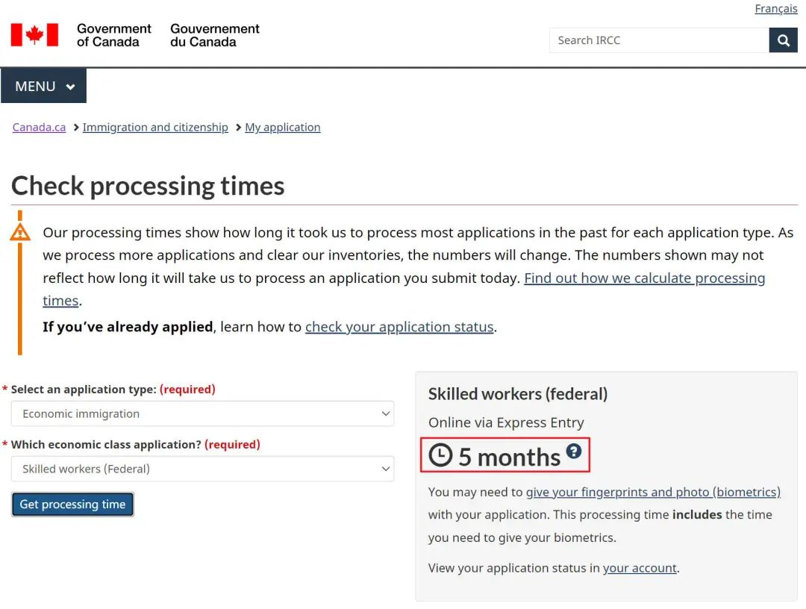 (原始链接: https://mmbiz.qpic.cn/mmbiz_jpg/904kUibXm7Y71XpPOxRgFicZ0u1LfkQg00eebpyKWhueHWhdwqTV1IiaZiaPZApD0k2Fp2sSibeiaLfSZPsrY76vHVEQ/640?wx_fmt=jpeg)
- 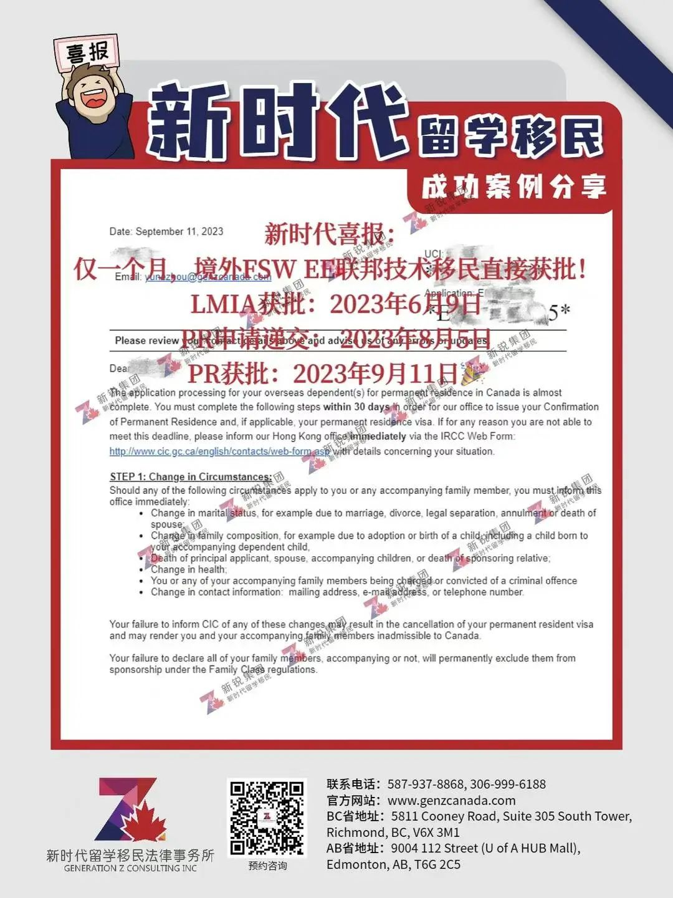 (原始链接: https://mmbiz.qpic.cn/mmbiz_jpg/904kUibXm7Y71XpPOxRgFicZ0u1LfkQg00bic6WhSt12iac8BbwZPCkM0O5LRG9vCTXgdN1YzYUbZ0pjtC1b6kEE0A/640?wx_fmt=jpeg)
- 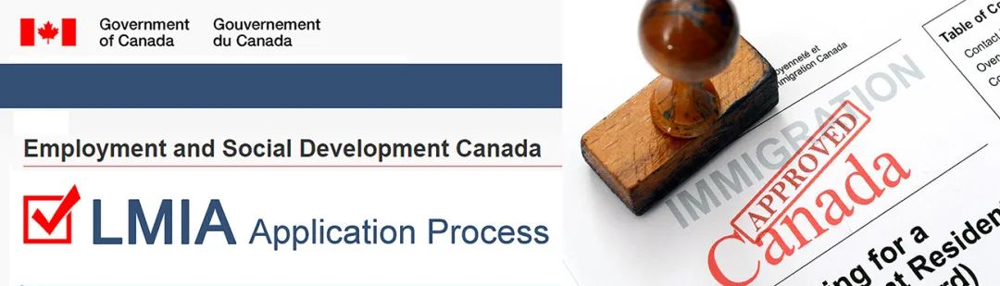 (原始链接: https://mmbiz.qpic.cn/mmbiz_jpg/904kUibXm7Y71XpPOxRgFicZ0u1LfkQg00sR524qS6GGqGscttZrCPLx4khynRl1BuUIibFGicehGbGANvQkYD38Xg/640?wx_fmt=jpeg)
-  (原始链接: https://mmbiz.qpic.cn/mmbiz_jpg/904kUibXm7Y71XpPOxRgFicZ0u1LfkQg00QtaVodMXLaKkY0Ky6ibPAGbFpBY21ePaUa5iaOxiaQo3tibib7wBaqPNhNQ/640?wx_fmt=jpeg)
-  (原始链接: https://mmbiz.qpic.cn/mmbiz_jpg/904kUibXm7Y71XpPOxRgFicZ0u1LfkQg00O9IwJ1JvNZKSxNqkUNA80Iw58ibXHeFRg61ZHSSG1jOxEemGVJTOBsg/640?wx_fmt=jpeg)
- 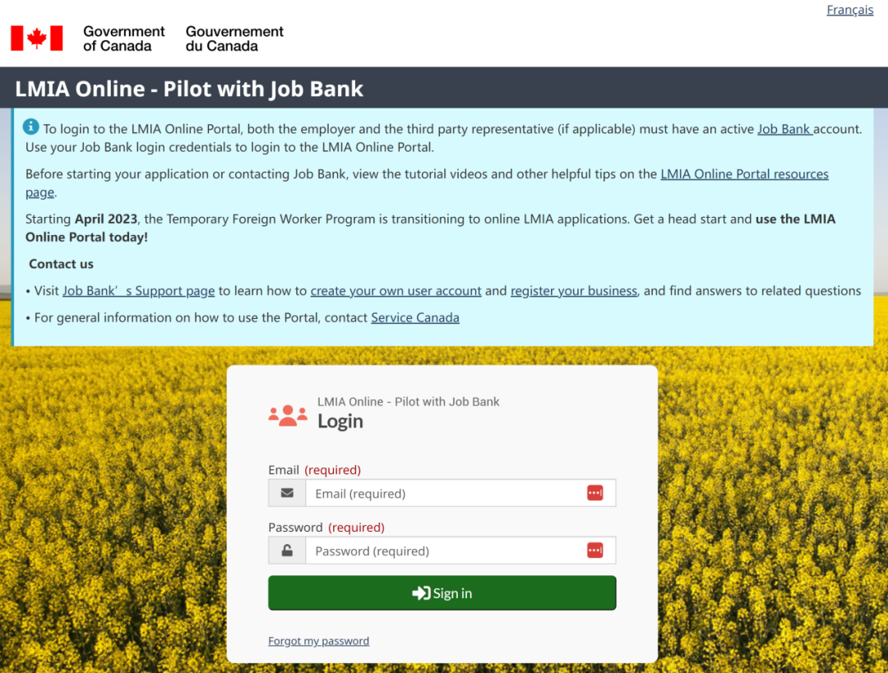 (原始链接: https://mmbiz.qpic.cn/mmbiz_png/904kUibXm7Y71XpPOxRgFicZ0u1LfkQg00uKJDfa8lyibsdHfDDguqfUCf64YPhsVZNIpRWs8ASE32GicQLpRqMbtg/640?wx_fmt=png)
- 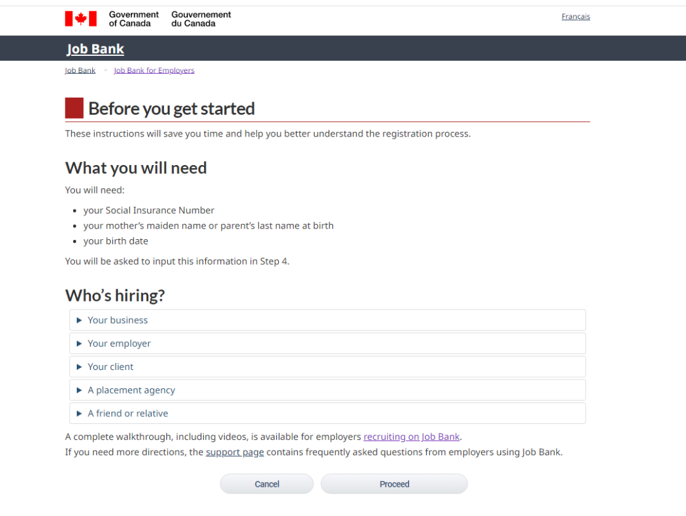 (原始链接: https://mmbiz.qpic.cn/mmbiz_png/904kUibXm7Y71XpPOxRgFicZ0u1LfkQg00iaprthaoF3ch1vkeCx9QnBAgcUKkicjB4Oc7yOTStQBoGoS9OE2o4Hjg/640?wx_fmt=png)
- 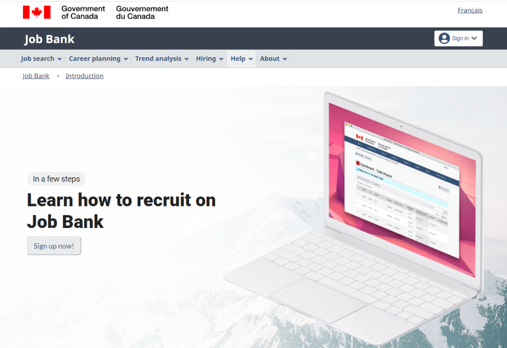 (原始链接: https://mmbiz.qpic.cn/mmbiz_png/904kUibXm7Y71XpPOxRgFicZ0u1LfkQg00ibibibrmXUPayyMy9pe0uCB9hM6pAWfAkicqaHBFcddXPkoJZtp7qDtdWQ/640?wx_fmt=png)
-  (原始链接: https://mmbiz.qpic.cn/mmbiz_png/904kUibXm7Y71XpPOxRgFicZ0u1LfkQg00b4AsicxkcuNAibv3PdCY01Kicvicdp8dM6ITbd1HfR7eTDJr5dK4scdyag/640?wx_fmt=png)
-  (原始链接: https://mmbiz.qpic.cn/mmbiz_png/904kUibXm7Y71XpPOxRgFicZ0u1LfkQg00AfkW6S6dRhfGpNmNt4fOdXbt4YjxBLkaBTerk6AYFVKkWqm2DUsia3w/640?wx_fmt=png)
- 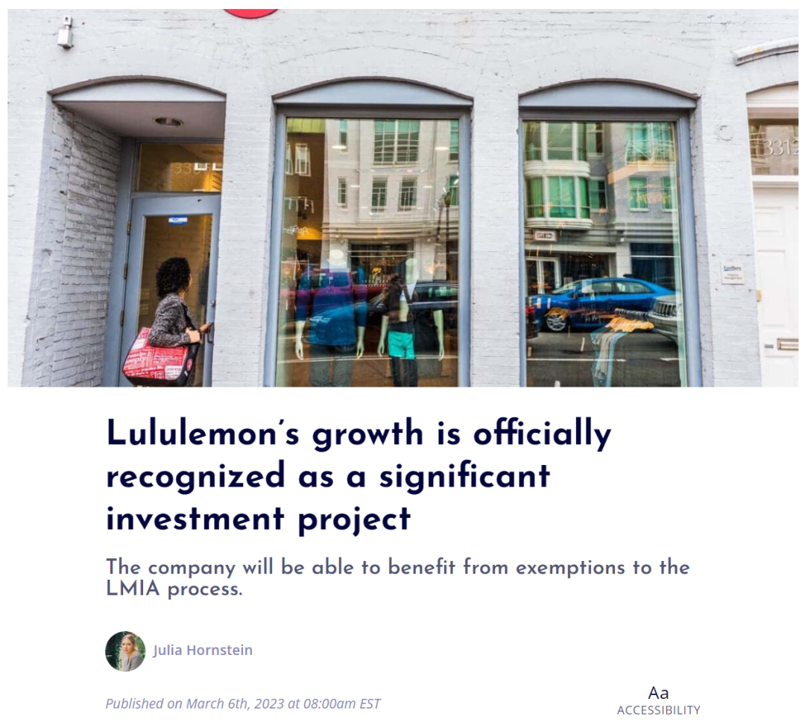 (原始链接: https://mmbiz.qpic.cn/mmbiz_png/904kUibXm7Y71XpPOxRgFicZ0u1LfkQg00EwOppjTLJJzEKnGVicJCqEHBe7UDmbUkxRokepwHnMthFlrdCo7xQdg/640?wx_fmt=png)
-  (原始链接: https://mmbiz.qpic.cn/mmbiz_png/904kUibXm7Y71XpPOxRgFicZ0u1LfkQg00pj311h722xiase57Yz67I8NcYkYvDUfgnXZvoC5ubG5kx8P1j6RrJaw/640?wx_fmt=png)
- 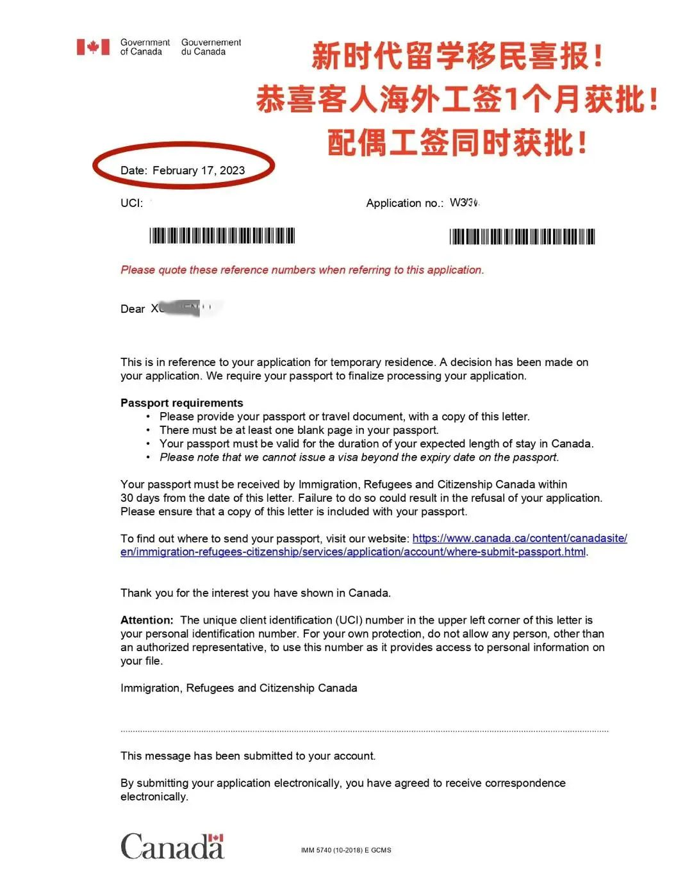 (原始链接: https://mmbiz.qpic.cn/mmbiz_jpg/904kUibXm7Y71XpPOxRgFicZ0u1LfkQg00pKMwyMztfAl8d5dicF7KRMR0nLCM8Wic45PT4cJkVYHAiazZrTialEDibBQ/640?wx_fmt=jpeg)
- 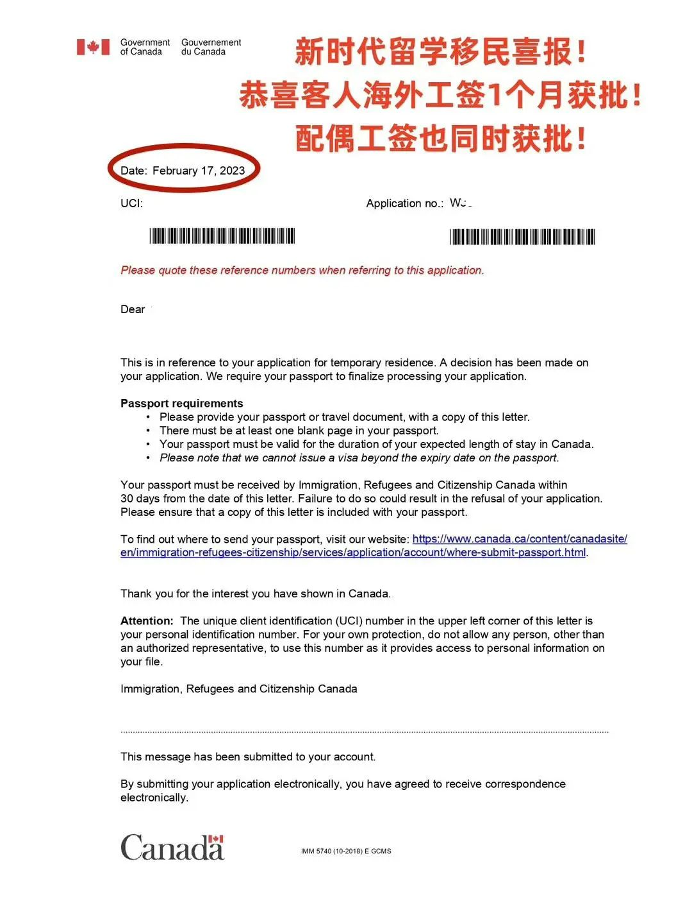 (原始链接: https://mmbiz.qpic.cn/mmbiz_jpg/904kUibXm7Y71XpPOxRgFicZ0u1LfkQg003N00PP5D9VtQL2tBub8x1Ajv5SibPFBDqiam23Ciazpm51WofswQrH6Jw/640?wx_fmt=jpeg)
- 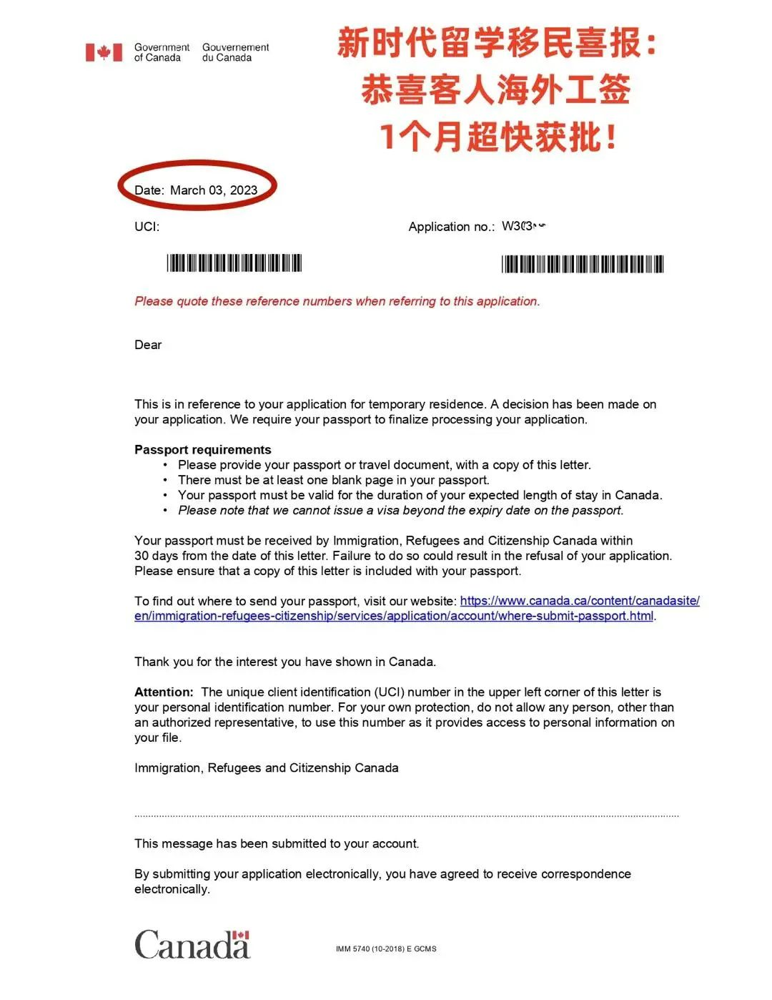 (原始链接: https://mmbiz.qpic.cn/mmbiz_jpg/904kUibXm7Y71XpPOxRgFicZ0u1LfkQg0079iaXsiayRw9FSFSeynpPJwNKMjgerxBQAGoPwyJfrcQwqOKyicPnZPCQ/640?wx_fmt=jpeg)
-  (原始链接: https://mmbiz.qpic.cn/mmbiz_png/904kUibXm7Y71XpPOxRgFicZ0u1LfkQg000Fls5ibtXBDp0NSOjnAAP5XMF3nvwJzmqCLvhmQCgAl5GopuL0aYibZg/640?wx_fmt=png)
- 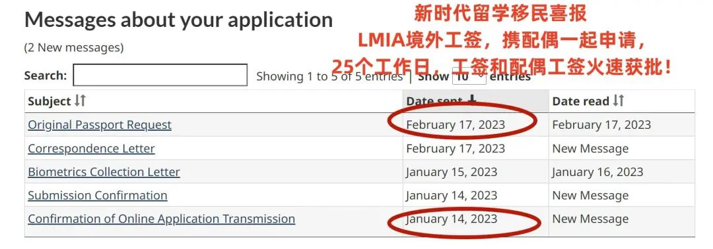 (原始链接: https://mmbiz.qpic.cn/mmbiz_jpg/904kUibXm7Y71XpPOxRgFicZ0u1LfkQg00NevdLrFbXLuTiaiakVAUhUmncZ8OpibzN0bBx75Dptg7OgKgicYfVoZ56w/640?wx_fmt=jpeg)
- 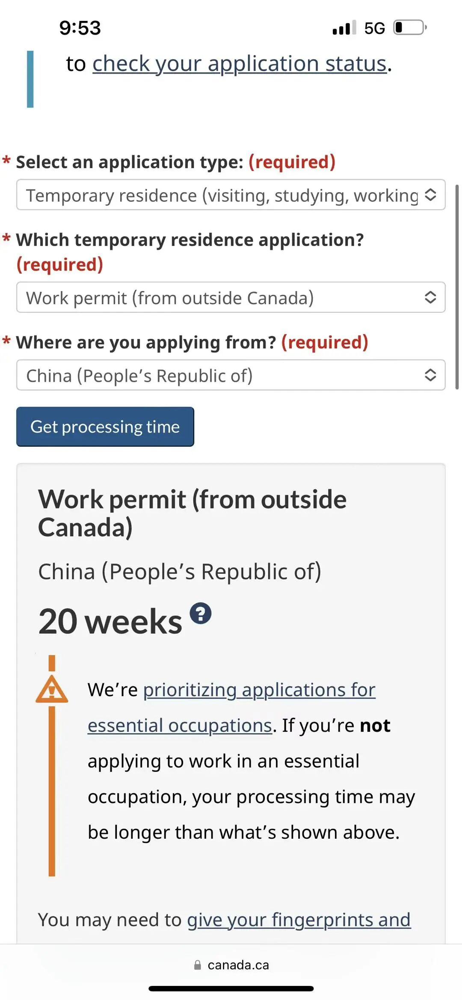 (原始链接: https://mmbiz.qpic.cn/mmbiz_jpg/904kUibXm7Y71XpPOxRgFicZ0u1LfkQg00R4P8DO310xsSdOMg7WumgBcx8kKDjqZy9kvt2jjtHib0lWmGNqSIKRw/640?wx_fmt=jpeg)
-  (原始链接: https://mmbiz.qpic.cn/mmbiz_png/904kUibXm7Y71XpPOxRgFicZ0u1LfkQg000Fls5ibtXBDp0NSOjnAAP5XMF3nvwJzmqCLvhmQCgAl5GopuL0aYibZg/640?wx_fmt=png)
-  (原始链接: https://mmbiz.qpic.cn/mmbiz_jpg/904kUibXm7Y71XpPOxRgFicZ0u1LfkQg00n6aNz8FwqXcF2lqMV0T7avnvjib1qOx2Bh6YwTtr05p7VbC9F1dKYOw/640?wx_fmt=jpeg)
-  (原始链接: https://mmbiz.qpic.cn/mmbiz_png/904kUibXm7Y71XpPOxRgFicZ0u1LfkQg000Fls5ibtXBDp0NSOjnAAP5XMF3nvwJzmqCLvhmQCgAl5GopuL0aYibZg/640?wx_fmt=png)
-  (原始链接: https://mmbiz.qpic.cn/mmbiz_png/904kUibXm7Y71XpPOxRgFicZ0u1LfkQg005aa5q2vBhKBgPZMIbjbJs7NbxeGer3awibdKP3ACicWYiaPswUB1czC5g/640?wx_fmt=png)
- 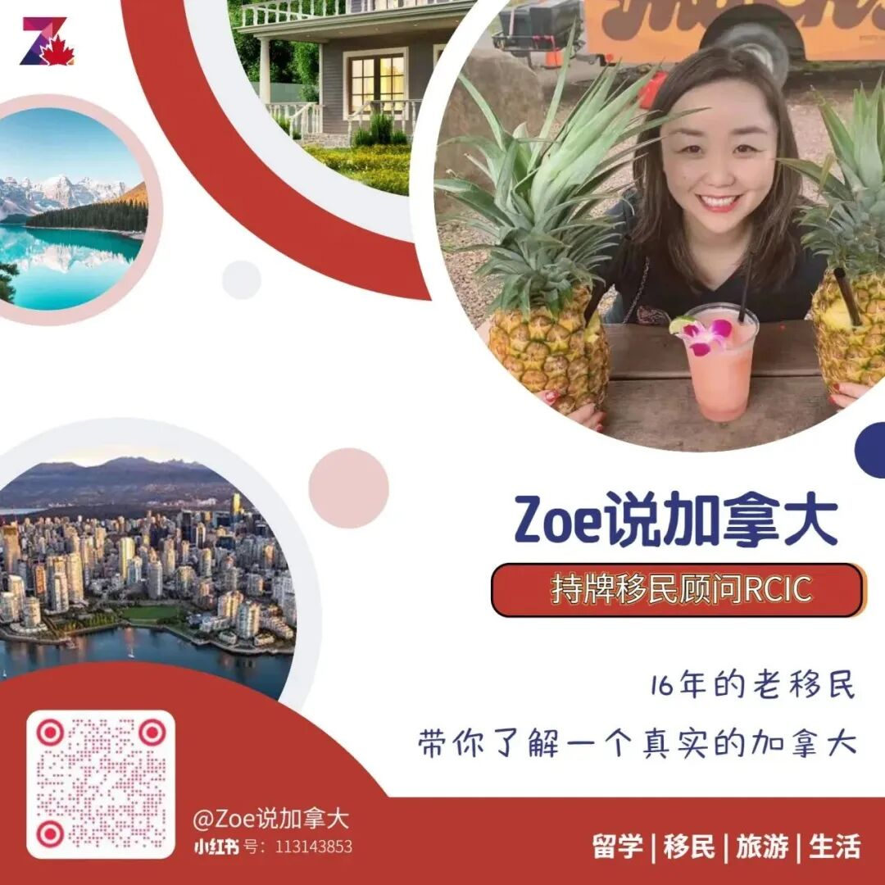 (原始链接: https://mmbiz.qpic.cn/mmbiz_jpg/904kUibXm7Y71XpPOxRgFicZ0u1LfkQg00mPgdo6uHKEWGYW7qcSd48Dhhdl8Gqap0lFcK7KCiaAqzNa4oUnDgGdQ/640?wx_fmt=jpeg)
- 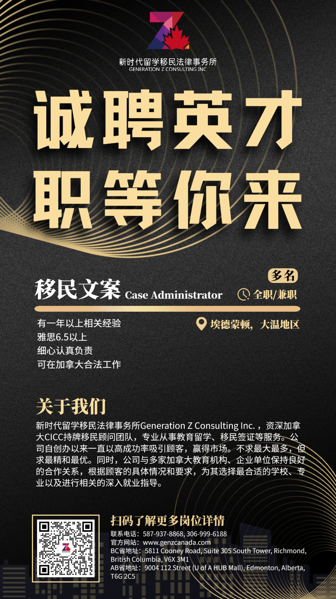 (原始链接: https://mmbiz.qpic.cn/mmbiz_png/904kUibXm7Y71XpPOxRgFicZ0u1LfkQg005WSFibib8weyw44Ca8zz13xR1vbv7icV86sI7cBIUnf6D8gW0XFKI5EUw/640?wx_fmt=png)
- 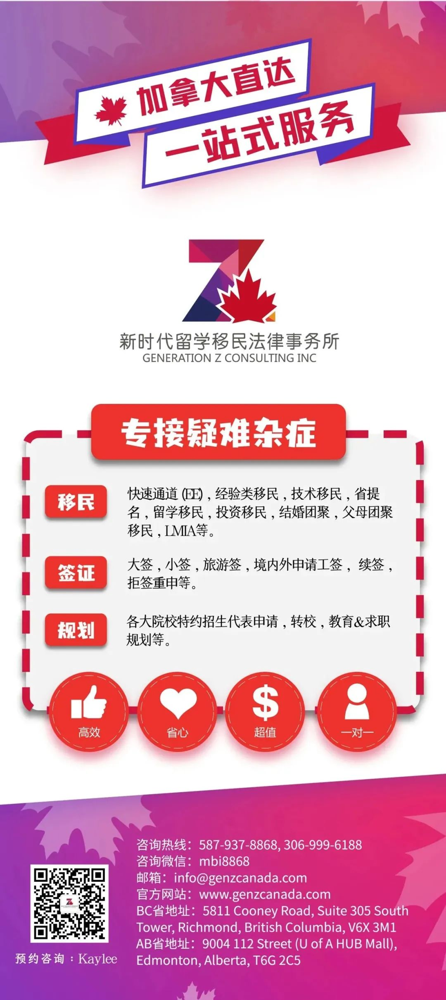 (原始链接: https://mmbiz.qpic.cn/mmbiz_jpg/904kUibXm7Y71XpPOxRgFicZ0u1LfkQg00XspmPktqOKdjAyWBxDMRQlAib1mDZEUeRww5q7sMKVm7JHk69D1Osfw/640?wx_fmt=jpeg)
-  (原始链接: https://mmbiz.qpic.cn/mmbiz_jpg/904kUibXm7Y71XpPOxRgFicZ0u1LfkQg00f1TNByK3hLx2iaabFXWrKDxcH18eib0m08ln5J8uUy4VkPatV8WT6R7w/640?wx_fmt=jpeg)
-  (原始链接: https://mmbiz.qpic.cn/mmbiz_jpg/904kUibXm7Y71XpPOxRgFicZ0u1LfkQg00QcyWb5zLd2SKGJ5ZKxVadLR63AhUbY0MMmibclrmgQLleyuZpIgAlgA/640?wx_fmt=jpeg)
