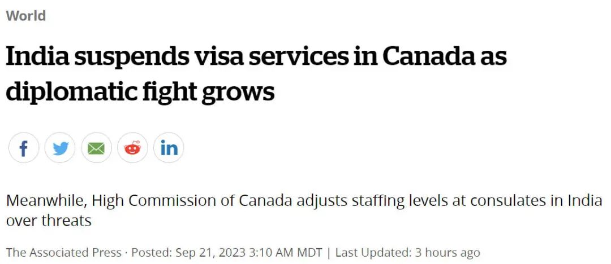
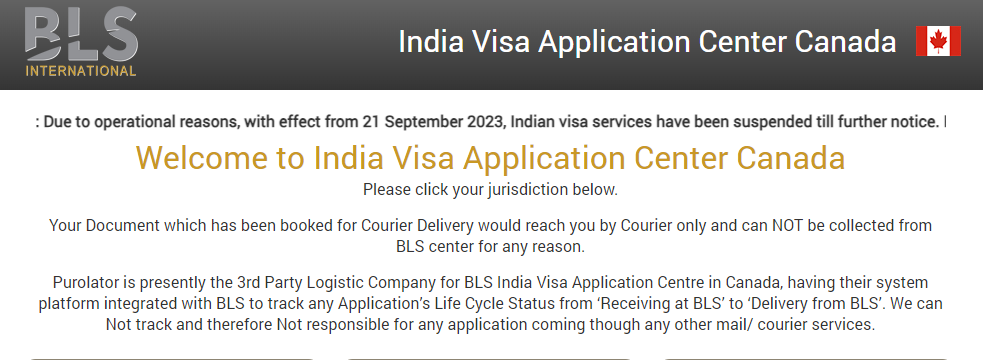
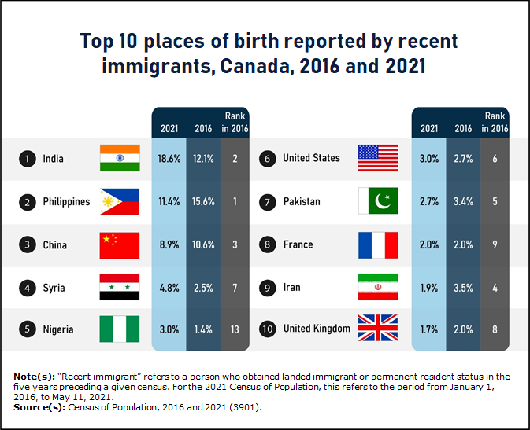
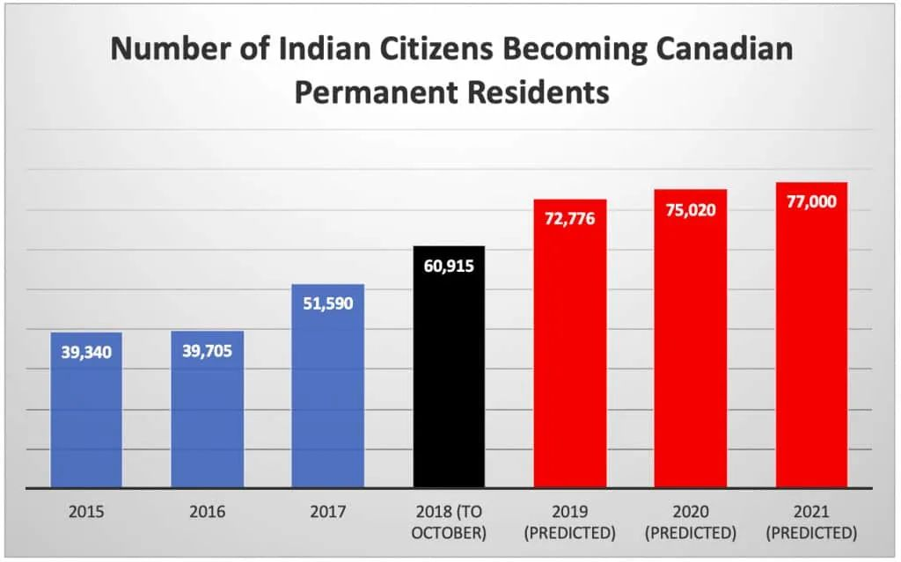
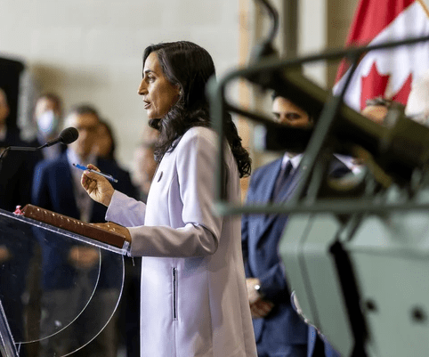
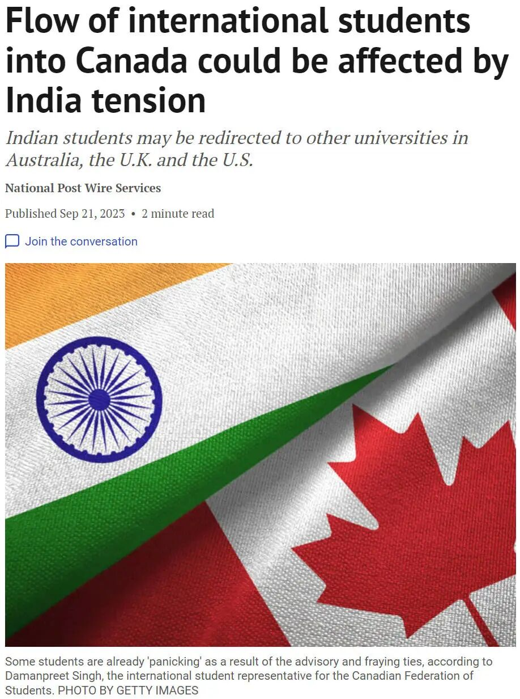

# 无标题

**链接地址:** http://mp.weixin.qq.com/s?__biz=MzUyNzA2NTAwNg==&mid=2247495905&idx=1&sn=f609cbea499d78b6fa68911ab079a6a8&chksm=fa07fa20cd70733660592e2d64821fd1d3c6c840c96fd9519959ca94f455379caa0b1e09671b&mpshare=1&scene=2&srcid=09223NVsspUemQHUF2UPSdfp&sharer_shareinfo=d38c0d9a7da612ec21abd36a1aabaf8d&sharer_shareinfo_first=d38c0d9a7da612ec21abd36a1aabaf8d#rd
**作者:** 你身边的签证专家
**获取时间:** 2025/8/28 19:04:46
**图片数量:** 20

---

## 原始HTML内容

<section style="font-size: 16px;"><section style="text-align: center;margin-top: 10px;margin-bottom: 10px;line-height: 0;" powered-by="xiumi.us"><section style="vertical-align: middle;display: inline-block;line-height: 0;"></section></section><section style="text-align: center;margin-top: 10px;margin-bottom: 10px;line-height: 0;" powered-by="xiumi.us"><section style="vertical-align: middle;display: inline-block;line-height: 0;"></section></section><section style="text-align: center;margin-top: 10px;margin-bottom: 10px;line-height: 0;" powered-by="xiumi.us"><section style="vertical-align: middle;display: inline-block;line-height: 0;"></section></section>
 
<section style="font-size: 19px;text-align: center;margin-top: 10px;margin-bottom: 3px;" powered-by="xiumi.us"><section style="display: inline-block;border-width: 1px;border-style: solid;border-color: rgb(188, 65, 65);background-color: rgb(188, 65, 65);width: 1.8em;height: 1.8em;line-height: 1.8em;border-radius: 100%;margin-left: auto;margin-right: auto;font-size: 16px;color: rgb(255, 255, 255);">
<strong>1</strong>
</section></section><section style="text-align: center;" powered-by="xiumi.us"><section style="display: inline-block;width: 0px;height: 0px;vertical-align: top;overflow: hidden;border-style: solid;border-width: 9px 6px 0px;border-color: rgb(188, 65, 65) rgba(255, 255, 255, 0) rgba(255, 255, 255, 0);"><svg viewBox="0 0 1 1" style="float:left;line-height:0;width:0;vertical-align:top;"></svg></section></section><section style="margin-bottom: 10px;text-align: center;justify-content: center;display: flex;flex-flow: row;" powered-by="xiumi.us"><section style="display: inline-block;width: auto;vertical-align: middle;background-color: rgba(109, 155, 209, 0.1);min-width: 10%;flex: 0 0 auto;height: auto;align-self: center;padding: 12px;"><section style="color: rgb(109, 155, 209);text-align: justify;" powered-by="xiumi.us">
<strong>印度宣布暂停加拿大签证服务</strong>
</section></section></section>
 
<section style="font-size: 14px;padding-right: 15px;padding-left: 15px;letter-spacing: 1px;" powered-by="xiumi.us">
随着加拿大表示印度政府可能参与了杀害一名加拿大公民及驱逐一名外交官导致两国关系紧张之后，<strong>印度驻加拿大的签证处理中心宣布于今天（周四）起暂停签证服务</strong>。事态紧急升级！

 

那么，<strong>加拿大会不会也暂停印度人的签证服务</strong>？

 
</section><section style="text-align: center;margin-top: 10px;margin-bottom: 10px;line-height: 0;" powered-by="xiumi.us"><section style="vertical-align: middle;display: inline-block;line-height: 0;width: 90%;height: auto;"></section></section><section style="text-align: center;margin-top: 10px;margin-bottom: 10px;line-height: 0;" powered-by="xiumi.us"><section style="vertical-align: middle;display: inline-block;line-height: 0;width: 90%;height: auto;"></section></section><section style="font-size: 14px;padding-right: 15px;padding-left: 15px;letter-spacing: 1px;" powered-by="xiumi.us">
 

加拿大<strong>BLS印度签证申请中心</strong>表示：“印度使团重要通知：由于运营原因，<strong>自9月21日起暂停印度签证服务</strong>，直至另行通知。”签证中心没有提供更多细节。BLS是处理印度签证申请的机构。 

 

暂停签证服务意味着<strong>没有签证的加拿大人将暂时无法前往印度</strong>。

 

那么，加拿大方面会跟进以对等的条件制约吗？

 
</section><section style="text-align: center;margin-top: 10px;margin-bottom: 10px;line-height: 0;" powered-by="xiumi.us"><section style="vertical-align: middle;display: inline-block;line-height: 0;width: 90%;height: auto;"></section></section><section style="font-size: 14px;padding-right: 15px;padding-left: 15px;letter-spacing: 1px;" powered-by="xiumi.us">
 

近日，加国总理特鲁多也被印度媒体狂轰猛炸，指责特鲁多加深<strong>“海外印度侨民内部的分歧”</strong>。

 

 
</section><section style="font-size: 19px;text-align: center;margin-top: 10px;margin-bottom: 3px;" powered-by="xiumi.us"><section style="display: inline-block;border-width: 1px;border-style: solid;border-color: rgb(188, 65, 65);background-color: rgb(188, 65, 65);width: 1.8em;height: 1.8em;line-height: 1.8em;border-radius: 100%;margin-left: auto;margin-right: auto;font-size: 16px;color: rgb(255, 255, 255);">
<strong>2</strong>
</section></section><section style="text-align: center;" powered-by="xiumi.us"><section style="display: inline-block;width: 0px;height: 0px;vertical-align: top;overflow: hidden;border-style: solid;border-width: 9px 6px 0px;border-color: rgb(188, 65, 65) rgba(255, 255, 255, 0) rgba(255, 255, 255, 0);"><svg viewBox="0 0 1 1" style="float:left;line-height:0;width:0;vertical-align:top;"></svg></section></section><section style="margin-bottom: 10px;text-align: center;justify-content: center;display: flex;flex-flow: row;" powered-by="xiumi.us"><section style="display: inline-block;width: auto;vertical-align: middle;background-color: rgba(109, 155, 209, 0.1);min-width: 10%;flex: 0 0 auto;height: auto;align-self: center;padding: 12px;"><section style="color: rgb(109, 155, 209);text-align: justify;" powered-by="xiumi.us">
<strong>谁将受影响？</strong>
</section></section></section><section style="font-size: 14px;padding-right: 15px;padding-left: 15px;letter-spacing: 1px;" powered-by="xiumi.us">
 

此次暂停意味着尚未获得签证的加拿大人在服务恢复之前将无法前往印度。印度移民局的数据显示，2021 年，有<strong>8万名加拿大游客访问印度</strong>，成为<strong>第四大游客群体</strong>。

 

加拿大驻新德里高级专员公署表示，加拿大驻印度的所有领事馆<strong>均开放并继续提供服务</strong>，但正在评估工作人员的安全。

 

“鉴于当前紧张局势加剧的环境，我们正在采取行动确保外交官的安全。由于一些外交官在各种社交媒体平台上收到威胁，加拿大全球事务部<strong>正在评估其在印度的人员编制</strong>。”

 
</section><section style="text-align: center;margin-top: 10px;margin-bottom: 10px;line-height: 0;" powered-by="xiumi.us"><section style="vertical-align: middle;display: inline-block;line-height: 0;"></section></section><section style="font-size: 14px;padding-right: 15px;padding-left: 15px;letter-spacing: 1px;" powered-by="xiumi.us">
 

声明称，加拿大希望印度根据<strong>《维也纳公约》</strong>为其外交官和领事官员提供安全保障。

 
</section><section style="font-size: 19px;text-align: center;margin-top: 10px;margin-bottom: 3px;" powered-by="xiumi.us"><section style="display: inline-block;border-width: 1px;border-style: solid;border-color: rgb(188, 65, 65);background-color: rgb(188, 65, 65);width: 1.8em;height: 1.8em;line-height: 1.8em;border-radius: 100%;margin-left: auto;margin-right: auto;font-size: 16px;color: rgb(255, 255, 255);">
<strong>3</strong>
</section></section><section style="text-align: center;" powered-by="xiumi.us"><section style="display: inline-block;width: 0px;height: 0px;vertical-align: top;overflow: hidden;border-style: solid;border-width: 9px 6px 0px;border-color: rgb(188, 65, 65) rgba(255, 255, 255, 0) rgba(255, 255, 255, 0);"><svg viewBox="0 0 1 1" style="float:left;line-height:0;width:0;vertical-align:top;"></svg></section></section><section style="margin-bottom: 10px;text-align: center;justify-content: center;display: flex;flex-flow: row;" powered-by="xiumi.us"><section style="display: inline-block;width: auto;vertical-align: middle;background-color: rgba(109, 155, 209, 0.1);min-width: 10%;flex: 0 0 auto;height: auto;align-self: center;padding: 12px;"><section style="color: rgb(109, 155, 209);text-align: justify;" powered-by="xiumi.us">
<strong>事件回顾：印度颁签证禁令的原因？</strong>
</section></section></section><section style="font-size: 14px;padding-right: 15px;padding-left: 15px;letter-spacing: 1px;" powered-by="xiumi.us">
 

两国之间紧张关系始于刺杀锡克教独立活动人士哈迪普·辛格·尼贾尔(Hardeep Singh Nijjar)在素里被枪杀。他正在努力在锡克教侨民中组织一场关于从印度独立的<strong>非正式公投</strong>。他否认了印度对他是恐怖分子的指控。

 

BC省第二阶段关于是否应在印度旁遮普省建立锡克教家园的投票定于 10 月 29 日举行。

 
</section><section style="text-align: center;margin-top: 10px;margin-bottom: 10px;line-height: 0;" powered-by="xiumi.us"><section style="vertical-align: middle;display: inline-block;line-height: 0;width: 90%;height: auto;"></section></section><section style="font-size: 14px;padding-right: 15px;padding-left: 15px;letter-spacing: 1px;" powered-by="xiumi.us">
 

总理贾斯汀·特鲁多周一向议会表示，有<strong>“可信指控”</strong>称印度参与了刺杀锡克教独立活动人士尼贾尔。尼贾尔多年来一直受到印度通缉，并于今年 6 月在他领导的素里寺庙外<strong>被枪杀</strong>。

 

随着周一加拿大驱逐了一名印度外交官后，印度周二也驱逐了一名加拿大外交官。印度政府称加拿大正在调查的<strong>指控是荒谬</strong>的，并试图转移人们对加拿大境内存在的尼贾尔和其他通缉嫌疑人的注意力。

 

周三，<strong>印度外交部发布了最新的旅行警告</strong>，敦促在加拿大旅行的公民，尤其是在北美国家学习的公民保持谨慎，因为“反印度活动不断增加，政治上纵容仇恨犯罪”。

 
</section><section style="text-align: center;margin-top: 10px;margin-bottom: 10px;line-height: 0;" powered-by="xiumi.us"><section style="vertical-align: middle;display: inline-block;line-height: 0;width: 90%;height: auto;"></section></section><section style="font-size: 14px;padding-right: 15px;padding-left: 15px;letter-spacing: 1px;" powered-by="xiumi.us">
 

印度外交部还建议印度人还应<strong>避免前往加拿大的场所</strong>，那里“威胁特别针对印度外交官和反对反印度议程的印度社区部分”。

 

在特鲁多本周宣布这一消息后，<strong>温哥华警察局加强了对印度领事馆外的安保</strong>。

 

温哥华警方媒体关系官员塔尼亚·维辛廷(Tania Visintin)周三在一份声明中表示，警方正在<strong>“密切监视事态发展”</strong>，其中包括持续的风险评估，目的是维护公共安全和防止暴力。”

 
</section><section style="text-align: center;margin-top: 10px;margin-bottom: 10px;line-height: 0;" powered-by="xiumi.us"><section style="vertical-align: middle;display: inline-block;line-height: 0;width: 90%;height: auto;"></section></section><section style="font-size: 14px;padding-right: 15px;padding-left: 15px;letter-spacing: 1px;" powered-by="xiumi.us">
 

发言人表示温哥华警方不知道印度领事官员受到任何具体威胁，但已增加了在<strong>温哥华市中心领事馆的警力</strong>。

 

要求设立锡克教独立家园（即Khalistan）始于 20 世纪 70 年代印度旁遮普邦的一场叛乱，但在印度政府的镇压中被镇压，造成数千人死亡。此后，该运动失去了大部分政治权力，但在锡克教徒占多数的旁遮普邦以及大量海外锡克教徒侨民中仍有很多支持者。

 

 
</section><section style="font-size: 19px;text-align: center;margin-top: 10px;margin-bottom: 3px;" powered-by="xiumi.us"><section style="display: inline-block;border-width: 1px;border-style: solid;border-color: rgb(188, 65, 65);background-color: rgb(188, 65, 65);width: 1.8em;height: 1.8em;line-height: 1.8em;border-radius: 100%;margin-left: auto;margin-right: auto;font-size: 16px;color: rgb(255, 255, 255);">
<strong>4</strong>
</section></section><section style="text-align: center;" powered-by="xiumi.us"><section style="display: inline-block;width: 0px;height: 0px;vertical-align: top;overflow: hidden;border-style: solid;border-width: 9px 6px 0px;border-color: rgb(188, 65, 65) rgba(255, 255, 255, 0) rgba(255, 255, 255, 0);"><svg viewBox="0 0 1 1" style="float:left;line-height:0;width:0;vertical-align:top;"></svg></section></section><section style="margin-bottom: 10px;text-align: center;justify-content: center;display: flex;flex-flow: row;" powered-by="xiumi.us"><section style="display: inline-block;width: auto;vertical-align: middle;background-color: rgba(109, 155, 209, 0.1);min-width: 10%;flex: 0 0 auto;height: auto;align-self: center;padding: 12px;"><section style="color: rgb(109, 155, 209);text-align: justify;" powered-by="xiumi.us">
<strong>印度是加拿大外来人口第一大国</strong>
</section></section></section><section style="font-size: 14px;padding-right: 15px;padding-left: 15px;letter-spacing: 1px;" powered-by="xiumi.us">
 

根据加拿大统计2023年6月20日公布的关于本国非永久居民状况的报告，<strong>超过四分之一</strong>（28.5%）的非永久居民来自印度，10.5%来自中国。这份报告的数据来自最近一次（2021年）加拿大人口普查。

 
</section><section style="text-align: center;margin-top: 10px;margin-bottom: 10px;line-height: 0;" powered-by="xiumi.us"><section style="vertical-align: middle;display: inline-block;line-height: 0;width: 90%;height: auto;"></section></section><section style="font-size: 14px;padding-right: 15px;padding-left: 15px;letter-spacing: 1px;" powered-by="xiumi.us">
 

而来自加拿大移民、难民和公民部 (IRCC) 的新数据显示，印度、中国和菲律宾是加拿大国际学生的三大最重要来源。去年，印度作为国际学生来源国的重要性<strong>再次增长 33.6%</strong>，有 226,450 名印度学生获得了前往加拿大高校学习的学习许可，高于前一年的 169,460 人。
</section><section style="font-size: 14px;padding-right: 15px;padding-left: 15px;letter-spacing: 1px;" powered-by="xiumi.us">
 

随着在加拿大的印度学生人数激增，他们现在占该国 551,405 名<strong>国际学生总数的 41% 以上</strong>。&nbsp; 

 
</section><section style="text-align: center;margin-top: 10px;margin-bottom: 10px;line-height: 0;" powered-by="xiumi.us"><section style="vertical-align: middle;display: inline-block;line-height: 0;width: 90%;height: auto;"></section></section><section style="font-size: 14px;padding-right: 15px;padding-left: 15px;letter-spacing: 1px;" powered-by="xiumi.us">
 

在加拿大，<strong>印度是迄今为止的第一大移民来源国</strong>，自2016年以来占所有新移民的30%。

 

<strong>印度裔正在美国和加拿大各领域崛起</strong>——尤其是教育、高科技和政治方面。在北美最强大的高科技公司中，有五家公司的首席执行官都来自印度。他们领导着微软、谷歌、IBM、Twitter和Match集团（Tinder母公司）。
</section><section style="text-align: center;margin-top: 10px;margin-bottom: 10px;line-height: 0;" powered-by="xiumi.us"><section style="vertical-align: middle;display: inline-block;line-height: 0;width: 90%;height: auto;"></section></section><section style="font-size: 14px;padding-right: 15px;padding-left: 15px;letter-spacing: 1px;" powered-by="xiumi.us">
加拿大前任国防部长阿南德是印度移民后代，印裔占当今加拿大省级高官中的12% 

 

尽管许多人已经在美国的高科技领域飞黄腾达，但印度背景的人对加拿大商业的影响，特别是对加拿大商业的影响，正在<strong>急剧增长</strong>。

 

在美国和加拿大，有印度血统的人在政界大展身手。《经济学人》杂志说："在出现美国印第安人总统之前，很可能会出现一位印度裔美国人总统"。

 

印度裔人的教育成就高于北美的标准。而且他们是美国和加拿大<strong>任何族裔群体中最强大</strong>的。更不用说有一项研究显示，印度裔人拥有住房的可能性比普通加拿大人高四倍。

 
</section><section style="text-align: center;margin-top: 10px;margin-bottom: 10px;line-height: 0;" powered-by="xiumi.us"><section style="vertical-align: middle;display: inline-block;line-height: 0;width: 90%;height: auto;"></section></section><section style="font-size: 14px;padding-right: 15px;padding-left: 15px;letter-spacing: 1px;" powered-by="xiumi.us">
相比华裔，印度裔的平均年龄也更加年轻 

 

加拿大去年接受了12.8万来自印度的新移民，其中许多是程序员。2022年也将达到类似的数字。相比之下，2015年只有3.9万名来自印度的移民。不到十年时间，<strong>暴涨了三倍</strong>！

 

这样的商业成功之所以成为可能，很大程度上是因为印度裔的<strong>教育水平飙升</strong>。根据皮尤研究(Pew Research)的数据， 在北美，每四个有印度背景的成年人中，就有三个拥有学士学位或更高学历。这是<strong>所有亚洲移民群体中最高的</strong>，其次是美籍华人为57%。美国的总体学士学位平均为38%。

 
</section><section style="margin: 10px 0%;text-align: left;justify-content: flex-start;display: flex;flex-flow: row;" powered-by="xiumi.us"><section style="display: inline-block;width: 100%;vertical-align: top;background-color: rgb(216, 202, 160);line-height: 0;align-self: flex-start;flex: 0 0 auto;"><section style="text-align: justify;justify-content: flex-start;display: flex;flex-flow: row;" powered-by="xiumi.us"><section style="display: inline-block;width: 100%;vertical-align: top;background-position: 0% 0%;background-repeat: repeat;background-size: 1.56658%;background-attachment: scroll;align-self: flex-start;flex: 0 0 auto;background-image: url(&quot;https://mmbiz.qpic.cn/mmbiz_png/904kUibXm7Y7lLCke5zqt3aURbq1Tib8u5eVs81CZEiafERoBX1r0Mx0gg6PE5owNkYuFzhY7czLPT2VPkjRaNxYg/640?wx_fmt=png&quot;);"><section style="text-align: center;" powered-by="xiumi.us"><section style="display: inline-block;width: 100%;height: 11px;vertical-align: top;overflow: hidden;background-color: rgba(255, 255, 255, 0);"><svg viewBox="0 0 1 1" style="float:left;line-height:0;width:0;vertical-align:top;"></svg></section></section></section></section></section></section>
 
<section style="text-align: center;margin-top: 10px;margin-bottom: 10px;line-height: 0;" powered-by="xiumi.us"><section style="vertical-align: middle;display: inline-block;line-height: 0;width: 90%;height: auto;"></section></section><section style="font-size: 14px;padding-right: 15px;padding-left: 15px;letter-spacing: 1px;" powered-by="xiumi.us">
 
</section><section style="font-size: 14px;padding-right: 15px;padding-left: 15px;letter-spacing: 1px;" powered-by="xiumi.us">
如今加印关系交恶，可能会影响到加拿大对于印度的<strong>非永久居民和新移民的吸纳政策</strong>，这在中短期来看或许是值得中国申请者关注的<strong>热点</strong>。印度申请者今年凭借语言优势，给加拿大的永居项目带来了极大的竞争。也卷得以快速通道为首的热门项目筛选分数水涨船高。

 
</section><section style="text-align: center;margin-top: 10px;margin-bottom: 10px;line-height: 0;" powered-by="xiumi.us"><section style="vertical-align: middle;display: inline-block;line-height: 0;"></section></section><section style="font-size: 14px;padding-right: 15px;padding-left: 15px;letter-spacing: 1px;" powered-by="xiumi.us">
 

新时代留学移民法律事务所会紧跟时事，为客户朋友们做出<strong>最及时，最精准的政策解读</strong>。欢迎有留学、签证和永居需求的朋友们，扫描新时代<strong>资深持牌留学移民顾问</strong>的微信二维码，预约一对一咨询，为你打造最合适你的加拿大登陆计划！

 
</section><section style="font-size: 14px;padding-right: 15px;padding-left: 15px;letter-spacing: 1px;" powered-by="xiumi.us">
 
</section><section style="text-align: left;justify-content: flex-start;display: flex;flex-flow: row;margin-top: 10px;" powered-by="xiumi.us"><section style="display: inline-block;vertical-align: top;width: auto;align-self: stretch;flex: 0 0 auto;background-color: rgb(188, 65, 65);min-width: 5%;height: auto;padding-top: 9px;padding-right: 9px;padding-left: 20px;"><section style="text-align: justify;font-size: 18px;color: rgb(252, 252, 252);" powered-by="xiumi.us">
<strong>阅读更多</strong>
</section></section><section style="display: inline-block;vertical-align: top;width: auto;min-width: 5%;flex: 0 0 auto;height: auto;align-self: stretch;"><section style="" powered-by="xiumi.us"><section style="display: inline-block;width: 0px;height: 0px;vertical-align: top;overflow: hidden;border-style: solid;border-width: 45px 0px 0px 19px;border-color: rgba(255, 255, 255, 0) rgba(255, 255, 255, 0) rgba(255, 255, 255, 0) rgb(188, 65, 65);"><svg viewBox="0 0 1 1" style="float:left;line-height:0;width:0;vertical-align:top;"></svg></section></section></section></section><section style="margin-bottom: 10px;" powered-by="xiumi.us"><section style="background-color: rgb(188, 65, 65);height: 3px;"><svg viewBox="0 0 1 1" style="float:left;line-height:0;width:0;vertical-align:top;"></svg></section></section><section style="margin: 10px 0%;text-align: left;justify-content: flex-start;display: flex;flex-flow: row;" powered-by="xiumi.us"><section style="display: inline-block;width: 100%;vertical-align: top;background-position: 14.6137% 32.4473%;background-repeat: repeat;background-size: 100.637%;background-attachment: scroll;padding: 30px;align-self: flex-start;flex: 0 0 auto;background-image: url(&quot;https://mmbiz.qpic.cn/mmbiz_jpg/904kUibXm7Y7lLCke5zqt3aURbq1Tib8u538NSlgbRiaLdKvUqeH9X0PvzJO7smmciboXUqLuaku1EtWOwXdOCZInA/640?wx_fmt=jpeg&quot;);"><section style="text-align: justify;justify-content: flex-start;display: flex;flex-flow: row;" powered-by="xiumi.us"><section style="display: inline-block;width: 100%;vertical-align: top;background-color: rgba(188, 65, 65, 0.22);padding: 10px;border-width: 0px;border-style: none;border-color: rgb(62, 62, 62);align-self: flex-start;flex: 0 0 auto;"><section style="text-align: center;color: rgb(255, 255, 255);font-size: 14px;" powered-by="xiumi.us">
<a target="_blank" href="http://mp.weixin.qq.com/s?__biz=MzUyNzA2NTAwNg==&amp;mid=2247495874&amp;idx=1&amp;sn=f2a65b9f1f87e71499253a8e3f56bd7f&amp;chksm=fa07fa03cd7073151b595a16c451c435f1e13b51d0add9377506c9fe78b0c64aef30fc69442f&amp;scene=21#wechat_redirect" textvalue="重大改变：加拿大对移民体检要求做出更新，医疗费用门槛提升！" linktype="text" imgurl="" imgdata="null" data-itemshowtype="0" tab="innerlink" style="color: rgb(255, 255, 255);" data-linktype="2"><strong>重大改变：加拿大对移民体检要求做出更新，医疗费用门槛提升！</strong></a>
</section></section></section></section></section><section style="margin: 10px 0%;text-align: left;justify-content: flex-start;display: flex;flex-flow: row;" powered-by="xiumi.us"><section style="display: inline-block;width: 100%;vertical-align: top;background-position: 65.7357% 4.86675%;background-repeat: repeat;background-size: 104.114%;background-attachment: scroll;padding: 30px;align-self: flex-start;flex: 0 0 auto;background-image: url(&quot;https://mmbiz.qpic.cn/mmbiz_jpg/904kUibXm7Y7lLCke5zqt3aURbq1Tib8u5ZRNL8OTnlYn6mAsWso6HNJUc6vYI38miaeg1okhqKcmh4Wj9qwbvsicA/640?wx_fmt=jpeg&quot;);"><section style="text-align: justify;justify-content: flex-start;display: flex;flex-flow: row;" powered-by="xiumi.us"><section style="display: inline-block;width: 100%;vertical-align: top;background-color: rgba(188, 65, 65, 0.22);padding: 10px;border-width: 0px;border-style: none;border-color: rgb(62, 62, 62);align-self: flex-start;flex: 0 0 auto;"><section style="text-align: center;color: rgb(255, 255, 255);font-size: 14px;" powered-by="xiumi.us">
<a target="_blank" href="http://mp.weixin.qq.com/s?__biz=MzUyNzA2NTAwNg==&amp;mid=2247495830&amp;idx=1&amp;sn=5e63770dccb9fd5690f36a7c30a52578&amp;chksm=fa07fa57cd707341c50a4fa0a22dc223b514d9ceb96d4b9d9b52d2a689b6619b7a376b5b8787&amp;scene=21#wechat_redirect" textvalue="留学生注意：加拿大移民部研究快速审批学签，拟推“值得信赖”高校名单！" linktype="text" imgurl="" imgdata="null" data-itemshowtype="0" tab="innerlink" style="color: rgb(255, 255, 255);" data-linktype="2"><strong>留学生注意：加拿大移民部研究快速审批学签，拟推“值得信赖”高校名单！</strong></a>
</section></section></section></section></section><section style="margin: 10px 0%;text-align: left;justify-content: flex-start;display: flex;flex-flow: row;" powered-by="xiumi.us"><section style="display: inline-block;width: 100%;vertical-align: top;background-position: -6.57787% 18.5277%;background-repeat: repeat;background-size: 107.269%;background-attachment: scroll;padding: 30px;align-self: flex-start;flex: 0 0 auto;background-image: url(&quot;https://mmbiz.qpic.cn/mmbiz_jpg/904kUibXm7Y7lLCke5zqt3aURbq1Tib8u5IPSaPI0aARiaqMicBAr9nOD32OuAxlNm6k6Rwew8lhPL1ydLxUuGb1Ew/640?wx_fmt=jpeg&quot;);"><section style="text-align: justify;justify-content: flex-start;display: flex;flex-flow: row;" powered-by="xiumi.us"><section style="display: inline-block;width: 100%;vertical-align: top;background-color: rgba(188, 65, 65, 0.22);padding: 10px;border-width: 0px;border-style: none;border-color: rgb(62, 62, 62);align-self: flex-start;flex: 0 0 auto;"><section style="text-align: left;color: rgb(255, 255, 255);font-size: 14px;" powered-by="xiumi.us">
<a target="_blank" href="http://mp.weixin.qq.com/s?__biz=MzUyNzA2NTAwNg==&amp;mid=2247495795&amp;idx=1&amp;sn=cd403216b39be52fba822456fca26c76&amp;chksm=fa07fab2cd7073a4402e40819774d571108063247ff785d7e5a82c6a58786008e3955639bbc7&amp;scene=21#wechat_redirect" textvalue="加拿大留学政策发生转向？“限制”留学生3大提案出炉：减学签+禁工作！还要限制学校….." linktype="text" imgurl="" imgdata="null" data-itemshowtype="0" tab="innerlink" style="color: rgb(255, 255, 255);" data-linktype="2"><strong>加拿大留学政策发生转向？“限制”留学生3大提案出炉：减学签+禁工作！还要限制学校…..</strong></a>
</section></section></section></section></section><section style="margin: 10px 0%;text-align: left;justify-content: flex-start;display: flex;flex-flow: row;" powered-by="xiumi.us"><section style="display: inline-block;width: 100%;vertical-align: top;background-position: 183.785% 60.7935%;background-repeat: repeat;background-size: 101.212%;background-attachment: scroll;padding: 30px;align-self: flex-start;flex: 0 0 auto;background-image: url(&quot;https://mmbiz.qpic.cn/mmbiz_jpg/904kUibXm7Y7lLCke5zqt3aURbq1Tib8u5F7liaL0bvUKIaBV9Nlae7zmqQpvJPA5CPPJyicPFr9tnXZ4zjpabIyyg/640?wx_fmt=jpeg&quot;);"><section style="text-align: justify;justify-content: flex-start;display: flex;flex-flow: row;" powered-by="xiumi.us"><section style="display: inline-block;width: 100%;vertical-align: top;background-color: rgba(188, 65, 65, 0.22);padding: 10px;border-width: 0px;border-style: none;border-color: rgb(62, 62, 62);align-self: flex-start;flex: 0 0 auto;"><section style="text-align: center;color: rgb(255, 255, 255);font-size: 14px;" powered-by="xiumi.us">
<a target="_blank" href="http://mp.weixin.qq.com/s?__biz=MzUyNzA2NTAwNg==&amp;mid=2247495761&amp;idx=1&amp;sn=f1ba1a7773573bb2ed1d1e9d5a28c5d8&amp;chksm=fa07fa90cd7073869c547a78b21b0517bea67c464018d6792b9c03ed95279910aaedb9b83330&amp;scene=21#wechat_redirect" textvalue="开卷！最后一个不需要语言的企业家项目落幕，萨省最近一次邀请要求英语CLB6！" linktype="text" imgurl="" imgdata="null" data-itemshowtype="0" tab="innerlink" style="color: rgb(255, 255, 255);" data-linktype="2"><strong>开卷！最后一个不需要语言的企业家项目落幕，萨省最近一次邀请要求英语CLB6！</strong></a>
</section></section></section></section></section><section style="text-align: center;font-size: 12px;color: rgb(180, 180, 180);" powered-by="xiumi.us">
（点击文字阅读）
</section><section style="margin: 10px 0%;text-align: left;justify-content: flex-start;display: flex;flex-flow: row;" powered-by="xiumi.us"><section style="display: inline-block;width: 100%;vertical-align: top;background-color: rgb(216, 202, 160);line-height: 0;align-self: flex-start;flex: 0 0 auto;"><section style="text-align: justify;justify-content: flex-start;display: flex;flex-flow: row;" powered-by="xiumi.us"><section style="display: inline-block;width: 100%;vertical-align: top;background-position: 0% 0%;background-repeat: repeat;background-size: 1.56658%;background-attachment: scroll;align-self: flex-start;flex: 0 0 auto;background-image: url(&quot;https://mmbiz.qpic.cn/mmbiz_png/904kUibXm7Y7lLCke5zqt3aURbq1Tib8u5eVs81CZEiafERoBX1r0Mx0gg6PE5owNkYuFzhY7czLPT2VPkjRaNxYg/640?wx_fmt=png&quot;);"><section style="text-align: center;" powered-by="xiumi.us"><section style="display: inline-block;width: 100%;height: 11px;vertical-align: top;overflow: hidden;background-color: rgba(255, 255, 255, 0);"><svg viewBox="0 0 1 1" style="float:left;line-height:0;width:0;vertical-align:top;"></svg></section></section></section></section></section></section><section style="text-align: center;margin-top: 10px;margin-bottom: 10px;line-height: 0;" powered-by="xiumi.us"><section style="vertical-align: middle;display: inline-block;line-height: 0;"></section></section><section style="text-align: center;margin-top: 10px;margin-bottom: 10px;line-height: 0;" powered-by="xiumi.us"><section style="vertical-align: middle;display: inline-block;line-height: 0;"></section></section><section style="padding-right: 15px;padding-left: 15px;font-size: 12px;color: rgb(121, 121, 121);" powered-by="xiumi.us">
<strong>参考信息：</strong>

<strong>https://globalnews.ca/news/9976681/india-visa-services-shutdown-canada/</strong>
</section><section style="text-align: center;margin-top: 10px;margin-bottom: 10px;line-height: 0;" powered-by="xiumi.us"><section style="vertical-align: middle;display: inline-block;line-height: 0;"></section></section><section style="text-align: center;margin-top: 10px;margin-bottom: 10px;line-height: 0;" powered-by="xiumi.us"><section style="vertical-align: middle;display: inline-block;line-height: 0;"></section></section></section>
 

<mp-style-type data-value="3"></mp-style-type>

---

## 纯文本内容

1印度宣布暂停加拿大签证服务随着加拿大表示印度政府可能参与了杀害一名加拿大公民及驱逐一名外交官导致两国关系紧张之后，印度驻加拿大的签证处理中心宣布于今天（周四）起暂停签证服务。事态紧急升级！那么，加拿大会不会也暂停印度人的签证服务？加拿大BLS印度签证申请中心表示：“印度使团重要通知：由于运营原因，自9月21日起暂停印度签证服务，直至另行通知。”签证中心没有提供更多细节。BLS是处理印度签证申请的机构。暂停签证服务意味着没有签证的加拿大人将暂时无法前往印度。那么，加拿大方面会跟进以对等的条件制约吗？近日，加国总理特鲁多也被印度媒体狂轰猛炸，指责特鲁多加深“海外印度侨民内部的分歧”。2谁将受影响？此次暂停意味着尚未获得签证的加拿大人在服务恢复之前将无法前往印度。印度移民局的数据显示，2021 年，有8万名加拿大游客访问印度，成为第四大游客群体。加拿大驻新德里高级专员公署表示，加拿大驻印度的所有领事馆均开放并继续提供服务，但正在评估工作人员的安全。“鉴于当前紧张局势加剧的环境，我们正在采取行动确保外交官的安全。由于一些外交官在各种社交媒体平台上收到威胁，加拿大全球事务部正在评估其在印度的人员编制。”声明称，加拿大希望印度根据《维也纳公约》为其外交官和领事官员提供安全保障。3事件回顾：印度颁签证禁令的原因？两国之间紧张关系始于刺杀锡克教独立活动人士哈迪普·辛格·尼贾尔(Hardeep Singh Nijjar)在素里被枪杀。他正在努力在锡克教侨民中组织一场关于从印度独立的非正式公投。他否认了印度对他是恐怖分子的指控。BC省第二阶段关于是否应在印度旁遮普省建立锡克教家园的投票定于 10 月 29 日举行。总理贾斯汀·特鲁多周一向议会表示，有“可信指控”称印度参与了刺杀锡克教独立活动人士尼贾尔。尼贾尔多年来一直受到印度通缉，并于今年 6 月在他领导的素里寺庙外被枪杀。随着周一加拿大驱逐了一名印度外交官后，印度周二也驱逐了一名加拿大外交官。印度政府称加拿大正在调查的指控是荒谬的，并试图转移人们对加拿大境内存在的尼贾尔和其他通缉嫌疑人的注意力。周三，印度外交部发布了最新的旅行警告，敦促在加拿大旅行的公民，尤其是在北美国家学习的公民保持谨慎，因为“反印度活动不断增加，政治上纵容仇恨犯罪”。印度外交部还建议印度人还应避免前往加拿大的场所，那里“威胁特别针对印度外交官和反对反印度议程的印度社区部分”。在特鲁多本周宣布这一消息后，温哥华警察局加强了对印度领事馆外的安保。温哥华警方媒体关系官员塔尼亚·维辛廷(Tania Visintin)周三在一份声明中表示，警方正在“密切监视事态发展”，其中包括持续的风险评估，目的是维护公共安全和防止暴力。”发言人表示温哥华警方不知道印度领事官员受到任何具体威胁，但已增加了在温哥华市中心领事馆的警力。要求设立锡克教独立家园（即Khalistan）始于 20 世纪 70 年代印度旁遮普邦的一场叛乱，但在印度政府的镇压中被镇压，造成数千人死亡。此后，该运动失去了大部分政治权力，但在锡克教徒占多数的旁遮普邦以及大量海外锡克教徒侨民中仍有很多支持者。4印度是加拿大外来人口第一大国根据加拿大统计2023年6月20日公布的关于本国非永久居民状况的报告，超过四分之一（28.5%）的非永久居民来自印度，10.5%来自中国。这份报告的数据来自最近一次（2021年）加拿大人口普查。而来自加拿大移民、难民和公民部 (IRCC) 的新数据显示，印度、中国和菲律宾是加拿大国际学生的三大最重要来源。去年，印度作为国际学生来源国的重要性再次增长 33.6%，有 226,450 名印度学生获得了前往加拿大高校学习的学习许可，高于前一年的 169,460 人。随着在加拿大的印度学生人数激增，他们现在占该国 551,405 名国际学生总数的 41% 以上。 在加拿大，印度是迄今为止的第一大移民来源国，自2016年以来占所有新移民的30%。印度裔正在美国和加拿大各领域崛起——尤其是教育、高科技和政治方面。在北美最强大的高科技公司中，有五家公司的首席执行官都来自印度。他们领导着微软、谷歌、IBM、Twitter和Match集团（Tinder母公司）。加拿大前任国防部长阿南德是印度移民后代，印裔占当今加拿大省级高官中的12%尽管许多人已经在美国的高科技领域飞黄腾达，但印度背景的人对加拿大商业的影响，特别是对加拿大商业的影响，正在急剧增长。在美国和加拿大，有印度血统的人在政界大展身手。《经济学人》杂志说："在出现美国印第安人总统之前，很可能会出现一位印度裔美国人总统"。印度裔人的教育成就高于北美的标准。而且他们是美国和加拿大任何族裔群体中最强大的。更不用说有一项研究显示，印度裔人拥有住房的可能性比普通加拿大人高四倍。相比华裔，印度裔的平均年龄也更加年轻加拿大去年接受了12.8万来自印度的新移民，其中许多是程序员。2022年也将达到类似的数字。相比之下，2015年只有3.9万名来自印度的移民。不到十年时间，暴涨了三倍！这样的商业成功之所以成为可能，很大程度上是因为印度裔的教育水平飙升。根据皮尤研究(Pew Research)的数据， 在北美，每四个有印度背景的成年人中，就有三个拥有学士学位或更高学历。这是所有亚洲移民群体中最高的，其次是美籍华人为57%。美国的总体学士学位平均为38%。如今加印关系交恶，可能会影响到加拿大对于印度的非永久居民和新移民的吸纳政策，这在中短期来看或许是值得中国申请者关注的热点。印度申请者今年凭借语言优势，给加拿大的永居项目带来了极大的竞争。也卷得以快速通道为首的热门项目筛选分数水涨船高。新时代留学移民法律事务所会紧跟时事，为客户朋友们做出最及时，最精准的政策解读。欢迎有留学、签证和永居需求的朋友们，扫描新时代资深持牌留学移民顾问的微信二维码，预约一对一咨询，为你打造最合适你的加拿大登陆计划！阅读更多重大改变：加拿大对移民体检要求做出更新，医疗费用门槛提升！留学生注意：加拿大移民部研究快速审批学签，拟推“值得信赖”高校名单！加拿大留学政策发生转向？“限制”留学生3大提案出炉：减学签+禁工作！还要限制学校…..开卷！最后一个不需要语言的企业家项目落幕，萨省最近一次邀请要求英语CLB6！（点击文字阅读）参考信息：https://globalnews.ca/news/9976681/india-visa-services-shutdown-canada/

---

## 图片列表

-  (原始链接: https://mmbiz.qpic.cn/mmbiz_jpg/904kUibXm7Y7lLCke5zqt3aURbq1Tib8u5MJQkaYmf78aNibY93qPn0fROW7Xy7CJWGGKcAOhgeicbQmTrKicR8yaxQ/640?wx_fmt=jpeg)
-  (原始链接: https://mmbiz.qpic.cn/mmbiz_jpg/904kUibXm7Y7lLCke5zqt3aURbq1Tib8u58xeW82xLTcOuZolMbT7zmUzDPJibADx5icMZmaynf8m2RJAjWzMCGNKg/640?wx_fmt=jpeg)
-  (原始链接: https://mmbiz.qpic.cn/mmbiz_png/904kUibXm7Y7lLCke5zqt3aURbq1Tib8u5noOgcZ6tpT7mRiaW8L9kBUZlgWZ4vWxTtSib8bPRRiccPGTWGy9vE5yxQ/640?wx_fmt=png)
-  (原始链接: https://mmbiz.qpic.cn/mmbiz_jpg/904kUibXm7Y7lLCke5zqt3aURbq1Tib8u5Zcyicu1ibwDH6mNHQmIjtT8QrdsjKCZbNdc8pVtGPvUsGHEMBYrzCdLw/640?wx_fmt=jpeg)
-  (原始链接: https://mmbiz.qpic.cn/mmbiz_png/904kUibXm7Y7lLCke5zqt3aURbq1Tib8u5Y1ehHAKEVBoLkQHwwJQ7EevaqLEsq86CMrKX5fEEToNvjJyDQgHRlw/640?wx_fmt=png)
-  (原始链接: https://mmbiz.qpic.cn/mmbiz_jpg/904kUibXm7Y7lLCke5zqt3aURbq1Tib8u5jOibESLCkeZZcqfGJ1C1LIdqZ93ddhOqcEGTWP9YkfLOibBAbjw4NzTA/640?wx_fmt=jpeg)
-  (原始链接: https://mmbiz.qpic.cn/mmbiz_png/904kUibXm7Y7lLCke5zqt3aURbq1Tib8u5AUKUvHLywLSZz363mgicPPNTrdJ8BTKXdvEP2LA0Eo0uzCexJnHmbgQ/640?wx_fmt=png)
-  (原始链接: https://mmbiz.qpic.cn/mmbiz_jpg/904kUibXm7Y7lLCke5zqt3aURbq1Tib8u5KlY66wYwDa8YoQp34SpUTRlEcdhibQ2ztkqM1cZub8UZdo32eq2eiccQ/640?wx_fmt=jpeg)
-  (原始链接: https://mmbiz.qpic.cn/mmbiz_jpg/904kUibXm7Y7lLCke5zqt3aURbq1Tib8u5Jic8O9TW14Z2l2fcB4pHrwW74tmWopzNS5ic7xHMJDJdE4Yr0YADSqiaQ/640?wx_fmt=jpeg)
-  (原始链接: https://mmbiz.qpic.cn/mmbiz_jpg/904kUibXm7Y7lLCke5zqt3aURbq1Tib8u5j87pGkIjoOaL4zhEVYaoLRibcCYlxsLB25wNRs0Cia5rDD8hYicpuFtwA/640?wx_fmt=jpeg)
-  (原始链接: https://mmbiz.qpic.cn/mmbiz_png/904kUibXm7Y7lLCke5zqt3aURbq1Tib8u5e2GYMj0Kflg7nbnU12GQbHYklm4ghPOEB0NAlJv3XlTOvyF8ZPibbBw/640?wx_fmt=png)
-  (原始链接: https://mmbiz.qpic.cn/mmbiz_jpg/904kUibXm7Y7lLCke5zqt3aURbq1Tib8u5CQ9PbDHicBesGict6OUKCAluSC1b9UGCqzXdHjiaZotwajhyLJNBTHdibg/640?wx_fmt=jpeg)
-  (原始链接: https://mmbiz.qpic.cn/mmbiz_png/904kUibXm7Y7lLCke5zqt3aURbq1Tib8u50dA84iaicMCBz6zvyiajZYOWWvNbKTAeXxx6NoOwEjWYUdGmelGSV9YzA/640?wx_fmt=png)
-  (原始链接: https://mmbiz.qpic.cn/mmbiz_png/904kUibXm7Y7lLCke5zqt3aURbq1Tib8u5Fgnaqibbic50phEY2xW69tp3pJG9EphbrkOCDl1HdWQoHdOzelwV2WPg/640?wx_fmt=png)
-  (原始链接: https://mmbiz.qpic.cn/mmbiz_jpg/904kUibXm7Y7lLCke5zqt3aURbq1Tib8u5AC8j1SYG9DzoLWkibicuWAeWBWuWxOhmEKZ6ECF8U4jTjblSrZ2hpaow/640?wx_fmt=jpeg)
-  (原始链接: https://mmbiz.qpic.cn/mmbiz_png/904kUibXm7Y7lLCke5zqt3aURbq1Tib8u5ZG4kpcia8rbicUKT6k4WAIeDoF0WehctGrB7hLQ0EVSUu3tGy7enicNcg/640?wx_fmt=png)
-  (原始链接: https://mmbiz.qpic.cn/mmbiz_jpg/904kUibXm7Y7lLCke5zqt3aURbq1Tib8u5OP4mCSAuL2JnrjYSJDv1oRGtjCmhMOuWIM5yAvUDcorjp6ETPJPbgA/640?wx_fmt=jpeg)
-  (原始链接: https://mmbiz.qpic.cn/mmbiz_png/904kUibXm7Y7lLCke5zqt3aURbq1Tib8u5lPbf701B7plurvb0UWaW6Uk8ibN4o9ltRNdxwO2Wqiaq8ngGIeBf8xUA/640?wx_fmt=png)
-  (原始链接: https://mmbiz.qpic.cn/mmbiz_jpg/904kUibXm7Y7lLCke5zqt3aURbq1Tib8u5b5PrbicvD1oD9ckg1q44lnJuBG9kGrwkgQBYnQHxzicfcrqqq2hibpvsg/640?wx_fmt=jpeg)
-  (原始链接: https://mmbiz.qpic.cn/mmbiz_jpg/904kUibXm7Y7lLCke5zqt3aURbq1Tib8u5wW1oH5bGbhe4p9qwY9vTyXeR4BrfRhV0MhKE8eibhyKRsK4qW9ibaNDg/640?wx_fmt=jpeg)
