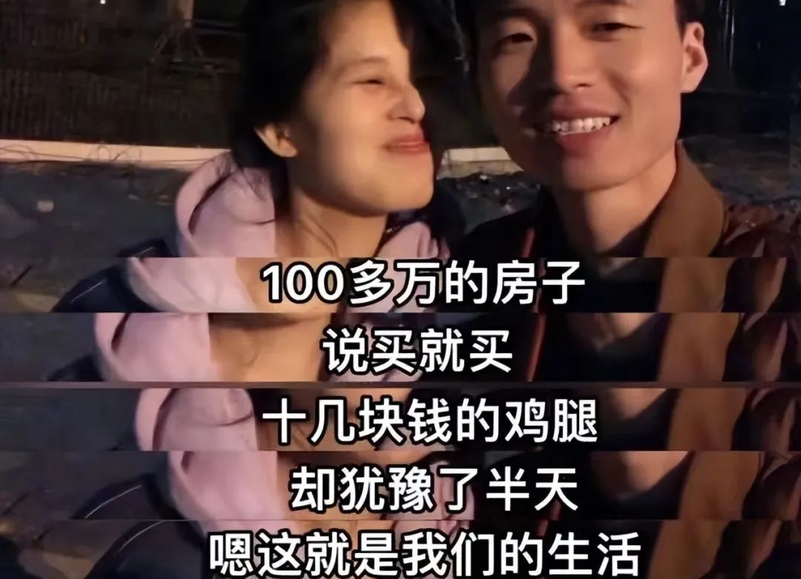
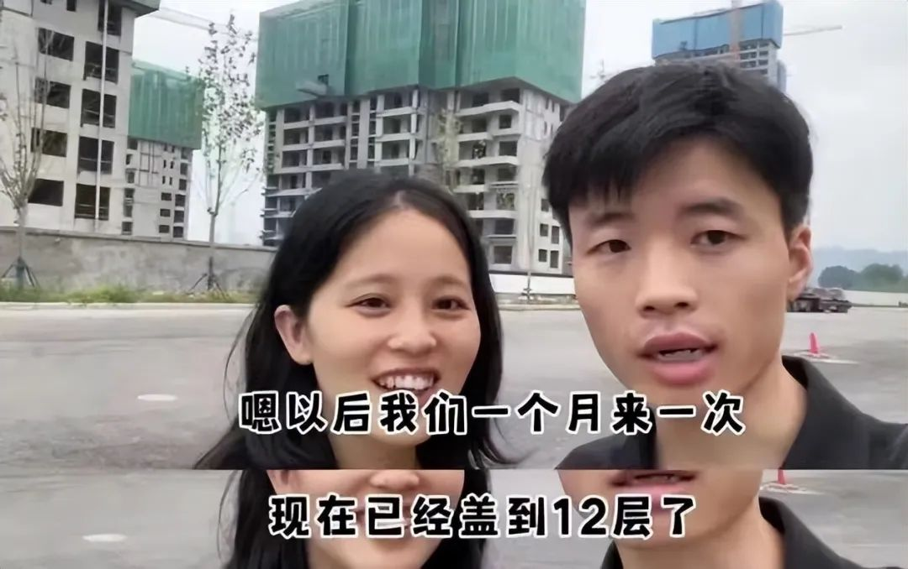
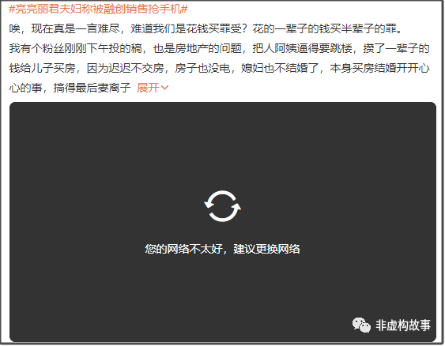

# 无标题

**链接地址:** http://mp.weixin.qq.com/s?__biz=MzA4NDU5OTA1MQ==&mid=2649813524&idx=1&sn=c5600938996989758a677d462afbdf9d&chksm=87e09a70b0971366042f1ea4af5731d53c19cf36e8246fc3190e95e3b847f50020b04cc2bffb&mpshare=1&scene=2&srcid=1117UpcNCKHhgsQiC8Z6LImb&sharer_shareinfo=c60c56eae5e69a2807e83dc49a699bd4&sharer_shareinfo_first=c60c56eae5e69a2807e83dc49a699bd4#rd
**作者:** 我是葱哥
**获取时间:** 2025/8/28 19:03:44
**图片数量:** 10

---

## 原始HTML内容

<section class="mp_profile_iframe_wrp"><mp-common-profile class="js_uneditable custom_select_card mp_profile_iframe" data-pluginname="mpprofile" data-id="MzA4NDU5OTA1MQ==" data-headimg="http://mmbiz.qpic.cn/mmbiz_png/nLQ0g8zkaw504q35pYj2vNZL8Qzcia1v532TDxwQSmicJms6NhgHoqfbiaz9FoszlTTNoPGicNkxNzY7tDtIQV3B6w/0?wx_fmt=png" data-nickname="非虚构故事" data-alias="LZX-CG" data-signature="有时候讲故事，有时候发牢骚。" data-from="0" data-is_biz_ban="0"></mp-common-profile></section><section style="margin-left: 16px;margin-right: 16px;">你们还记得买到烂尾楼的亮亮丽君这对小夫妻吗？</section><section style="margin-left: 16px;margin-right: 16px;">用下面这张图跟大家回顾一下：</section><section style="text-align: center;margin-left: 16px;margin-right: 16px;"></section><section style="margin-left: 16px;margin-right: 16px;"></section><section style="margin-left: 16px;margin-right: 16px;"></section><section style="margin-left: 16px;margin-right: 16px;">买房之初亮亮丽君是一对平凡且乐观的小年轻。虽然两人月薪才9000多，月供就占了6300，但他们依然对未来充满希望——他们不逛街、不看电影、不下馆子，省吃俭用，眼里还有光。</section><section style="margin-left: 16px;margin-right: 16px;"></section><section style="margin-left: 16px;margin-right: 16px;"></section>
 
<section style="margin-left: 16px;margin-right: 16px;">自从发现自家房子烂尾后，小两口<strong style="color: rgb(34, 34, 34);font-family: system-ui, -apple-system, BlinkMacSystemFont, &quot;Helvetica Neue&quot;, &quot;PingFang SC&quot;, &quot;Hiragino Sans GB&quot;, &quot;Microsoft YaHei UI&quot;, &quot;Microsoft YaHei&quot;, Arial, sans-serif;font-size: 16px;letter-spacing: 0.544px;text-wrap: wrap;background-color: rgb(255, 255, 255);">脸上的笑容越来越少。网友跟随其抖音更新，眼睁睁看着他们眼中的光一天天暗淡下去。</strong></section><section style="margin-left: 16px;margin-right: 16px;"><strong style="color: rgb(34, 34, 34);font-family: system-ui, -apple-system, BlinkMacSystemFont, &quot;Helvetica Neue&quot;, &quot;PingFang SC&quot;, &quot;Hiragino Sans GB&quot;, &quot;Microsoft YaHei UI&quot;, &quot;Microsoft YaHei&quot;, Arial, sans-serif;font-size: 16px;letter-spacing: 0.544px;text-wrap: wrap;background-color: rgb(255, 255, 255);"></strong></section>
<strong style="color: rgb(34, 34, 34);font-family: system-ui, -apple-system, BlinkMacSystemFont, &quot;Helvetica Neue&quot;, &quot;PingFang SC&quot;, &quot;Hiragino Sans GB&quot;, &quot;Microsoft YaHei UI&quot;, &quot;Microsoft YaHei&quot;, Arial, sans-serif;font-size: 16px;letter-spacing: 0.544px;text-wrap: wrap;background-color: rgb(255, 255, 255);"></strong>
<section style="margin-left: 16px;margin-right: 16px;margin-bottom: 0px;"> </section>
他们的后续视频变成了与开发商漫长的撕扯。后来在有关部门协调下，楼盘总算复工了，但他们眼睛里的光再也没有回来。
<section style="margin-left: 16px;margin-right: 16px;">今天，丽君亮亮传出被售楼部的工作人员打了，这是我万万没想到的事情，因为他俩当时受被很多媒体报道之后，获得社会广泛同情，俨然成了网红。</section><section style="margin-left: 16px;margin-right: 16px;">《三联生活周刊》当时刊登了他们口述的文章《那对眼里有光又消失了的郑州小夫妻》，在朋友圈刷屏，文章底下有近8000人打赏（该文记者称打赏金额全部转给丽君亮亮）。</section><section style="margin-left: 16px;margin-right: 16px;">关于他俩的故事，去年我也写了文，但不知触及到某些人哪根敏感神经，文章莫名被删。</section><section style="margin-left: 16px;margin-right: 16px;"></section><section style="margin-left: 16px;margin-right: 16px;"><strong style="font-size: var(--articleFontsize);letter-spacing: 0.034em;">可就是这样一对被社会广发关注的新闻人物，他们的房子还是得不到解决，<strong style="font-size: var(--articleFontsize);letter-spacing: 0.034em;white-space: normal;">760多天没有拿到房，最后也逃不掉维权被打的命运。</strong></strong></section><section style="margin-left: 16px;margin-right: 16px;"><strong style="font-size: var(--articleFontsize);letter-spacing: 0.034em;"></strong></section><section style="margin-left: 16px;margin-right: 16px;">从一开始买房时两眼放光、对未来新家的憧憬，到看到房子停工后的失落，再到如今维权被打，<strong>这对小夫妻的经历简直就是这个时代绝佳的注脚。</strong></section><section style="margin-left: 16px;margin-right: 16px;"><strong style="font-size: var(--articleFontsize);letter-spacing: 0.034em;"></strong></section><section style="margin-left: 16px;margin-right: 16px;"></section><section style="margin-right: 16px;margin-left: 16px;letter-spacing: 0.578px;text-wrap: wrap;">他们为什么被打？</section><section style="margin-right: 16px;margin-left: 16px;letter-spacing: 0.578px;text-wrap: wrap;">听说最近他们去售楼部讨要返现的钱（买房时开发商承诺3天交齐首付，返现21800元），对方不肯兑现。</section><section style="margin-right: 16px;margin-left: 16px;letter-spacing: 0.578px;text-wrap: wrap;">两人打开手机，打算直播维权过程。</section>
视频显示，售楼部工作人员表情冷漠，随后果断关闭了电闸和监控，为接下来的行动做准备。
<section style="margin-right: 16px;margin-left: 16px;letter-spacing: 0.578px;"></section>
丽君很害怕，提出要离开。亮亮表示不怕，开着直播，直播间有2千多人，大家都在看着，谁敢怎么样？

没想到过了一会，就冲出五六个彪形大汉，将两人团团围住，先骂后打，一阵拳打脚踢。

打人理由是：<strong>他们在炒作。</strong>
<section style="text-align: center;margin-left: 16px;margin-right: 16px;">疑似打人者之一</section>
亮亮头部被打、胸部被踢，车钥匙被夺走；丽君则是被推倒在地，手机被抢走，车胎被扎破。

之后，热心群众接力录制视频，但工作人员张某等人肆无忌惮：<strong>&nbsp;“开打不兄弟？”“打不打？”“那打呗。”</strong>

嚣张至极！！！

在亮亮开着直播的情况下融创敢公然打人，说明他们根本不怕这件事被曝光。

<section style="margin-right: 16px;margin-left: 16px;letter-spacing: 0.578px;margin-bottom: 0px;"> </section><section style="margin-right: 16px;margin-left: 16px;letter-spacing: 0.578px;margin-bottom: 0px;">现在，亮亮丽君被打的视频也被下架了。</section><section style="margin-right: 16px;margin-left: 16px;letter-spacing: 0.578px;margin-bottom: 0px;"> </section><section style="margin-right: 16px;margin-left: 16px;letter-spacing: 0.578px;margin-bottom: 0px;">一贯的套路：先捂嘴，然后解决提出问题的人，可是这样就真的能让问题不存在吗？</section><section style="margin-right: 16px;margin-left: 16px;letter-spacing: 0.578px;margin-bottom: 0px;"> </section><section style="text-align: center;margin-left: 16px;margin-right: 16px;"></section><section style="margin-right: 16px;margin-left: 16px;letter-spacing: 0.578px;margin-bottom: 0px;"> </section>
看到亮亮躺在医院，鼻子插着氧气管，嘴里说着丽君也受伤了，像老太太一样呼天抢地，让大家帮帮他们……

说实话，看着挺心酸的。

<strong>丽君眼睛了积攒了20多年的光，不到一年的时间，就被一点点消磨殆尽。</strong>

这对努力生活的小夫妻做错了什么？他们为了生活拼尽全力，生活却给了他们致命一击——一个烂尾的房子，让他们此前所有的精打细算、省吃俭用，以及一切为生活所做的努力与奋斗，都成了徒劳。

一纸房产证，抵押了一对青年的人生。
<section style="letter-spacing: 0.578px;margin-left: 16px;margin-right: 16px;"><strong style="color: rgb(34, 34, 34);font-family: system-ui, -apple-system, BlinkMacSystemFont, &quot;Helvetica Neue&quot;, &quot;PingFang SC&quot;, &quot;Hiragino Sans GB&quot;, &quot;Microsoft YaHei UI&quot;, &quot;Microsoft YaHei&quot;, Arial, sans-serif;letter-spacing: 0.544px;white-space: normal;outline: 0px;">小夫妻俩的故事一路看下来，网友们满是唏嘘，仿佛看到了自己。</strong></section><section style="letter-spacing: 0.578px;margin-left: 16px;margin-right: 16px;"><strong style="color: rgb(34, 34, 34);font-family: system-ui, -apple-system, BlinkMacSystemFont, &quot;Helvetica Neue&quot;, &quot;PingFang SC&quot;, &quot;Hiragino Sans GB&quot;, &quot;Microsoft YaHei UI&quot;, &quot;Microsoft YaHei&quot;, Arial, sans-serif;letter-spacing: 0.544px;white-space: normal;outline: 0px;"><strong style="color: rgb(34, 34, 34);font-family: system-ui, -apple-system, BlinkMacSystemFont, &quot;Helvetica Neue&quot;, &quot;PingFang SC&quot;, &quot;Hiragino Sans GB&quot;, &quot;Microsoft YaHei UI&quot;, &quot;Microsoft YaHei&quot;, Arial, sans-serif;letter-spacing: 0.544px;white-space: normal;outline: 0px;">“<strong style="font-size: 16px;white-space: normal;color: rgb(34, 34, 34);font-family: system-ui, -apple-system, BlinkMacSystemFont, &quot;Helvetica Neue&quot;, &quot;PingFang SC&quot;, &quot;Hiragino Sans GB&quot;, &quot;Microsoft YaHei UI&quot;, &quot;Microsoft YaHei&quot;, Arial, sans-serif;letter-spacing: 0.544px;outline: 0px;">祥子以为努力拉车就能拥有一辆属于自己的车。</strong>”</strong></strong>这是亮亮丽君抖音下一条高赞评论。</section><section style="letter-spacing: 0.578px;margin-left: 16px;margin-right: 16px;">后来，他们索性将抖音账号改名为“现代骆驼祥子”，并写下：<strong style="color: rgb(34, 34, 34);font-family: system-ui, -apple-system, BlinkMacSystemFont, &quot;Helvetica Neue&quot;, &quot;PingFang SC&quot;, &quot;Hiragino Sans GB&quot;, &quot;Microsoft YaHei UI&quot;, &quot;Microsoft YaHei&quot;, Arial, sans-serif;letter-spacing: 0.544px;white-space: normal;outline: 0px;">万般皆苦，唯有自渡。</strong></section><section style="letter-spacing: 0.578px;margin-left: 16px;margin-right: 16px;"><strong>其实生活的苦不算什么，最害怕的是看不到希望。</strong></section>
这对可怜的小夫妻背后，是千千万万个普通的你、我、他。

<strong style="outline: 0px;color: rgb(34, 34, 34);font-family: system-ui, -apple-system, system-ui, &quot;Helvetica Neue&quot;, &quot;PingFang SC&quot;, &quot;Hiragino Sans GB&quot;, &quot;Microsoft YaHei UI&quot;, &quot;Microsoft YaHei&quot;, Arial, sans-serif;font-size: 18px;letter-spacing: 0.578px;text-align: center;">· END ·</strong>
<section powered-by="xiumi.us" style="margin-bottom: 0px;outline: 0px;font-family: system-ui, -apple-system, BlinkMacSystemFont, &quot;Helvetica Neue&quot;, &quot;PingFang SC&quot;, &quot;Hiragino Sans GB&quot;, &quot;Microsoft YaHei UI&quot;, &quot;Microsoft YaHei&quot;, Arial, sans-serif;white-space: normal;background-color: rgb(255, 255, 255);font-size: 16px;letter-spacing: 1.75px;"><section style="outline: 0px;letter-spacing: 0.544px;font-family: system-ui, -apple-system, system-ui, &quot;Helvetica Neue&quot;, &quot;PingFang SC&quot;, &quot;Hiragino Sans GB&quot;, &quot;Microsoft YaHei UI&quot;, &quot;Microsoft YaHei&quot;, Arial, sans-serif;color: rgb(34, 34, 34);visibility: visible;"><section style="outline: 0px;visibility: visible;"><section style="margin-right: 16px;margin-left: 16px;outline: 0px;letter-spacing: 0.544px;text-align: center;"></section><section style="margin-right: 16px;margin-left: 16px;outline: 0px;letter-spacing: 0.544px;text-align: center;line-height: normal;visibility: visible;"><strong style="outline: 0px;visibility: visible;">加我，防失联</strong></section><section style="margin-right: 16px;margin-left: 16px;outline: 0px;letter-spacing: 0.544px;text-align: center;line-height: normal;visibility: visible;"><strong style="outline: 0px;visibility: visible;"> </strong></section><section class="mp_profile_iframe_wrp"><mp-common-profile class="js_uneditable custom_select_card mp_profile_iframe" data-pluginname="mpprofile" data-id="MzA4NDU5OTA1MQ==" data-headimg="http://mmbiz.qpic.cn/mmbiz_png/nLQ0g8zkaw504q35pYj2vNZL8Qzcia1v532TDxwQSmicJms6NhgHoqfbiaz9FoszlTTNoPGicNkxNzY7tDtIQV3B6w/0?wx_fmt=png" data-nickname="非虚构故事" data-alias="LZX-CG" data-signature="有时候讲故事，有时候发牢骚。" data-from="0" data-is_biz_ban="0"></mp-common-profile></section><section style="margin-right: 16px;margin-left: 16px;outline: 0px;letter-spacing: 0.544px;text-align: center;line-height: normal;visibility: visible;"><strong style="outline: 0px;visibility: visible;"></strong></section></section></section></section>
<mp-style-type data-value="3"></mp-style-type>

---

## 纯文本内容

你们还记得买到烂尾楼的亮亮丽君这对小夫妻吗？用下面这张图跟大家回顾一下：买房之初亮亮丽君是一对平凡且乐观的小年轻。虽然两人月薪才9000多，月供就占了6300，但他们依然对未来充满希望——他们不逛街、不看电影、不下馆子，省吃俭用，眼里还有光。自从发现自家房子烂尾后，小两口脸上的笑容越来越少。网友跟随其抖音更新，眼睁睁看着他们眼中的光一天天暗淡下去。他们的后续视频变成了与开发商漫长的撕扯。后来在有关部门协调下，楼盘总算复工了，但他们眼睛里的光再也没有回来。今天，丽君亮亮传出被售楼部的工作人员打了，这是我万万没想到的事情，因为他俩当时受被很多媒体报道之后，获得社会广泛同情，俨然成了网红。《三联生活周刊》当时刊登了他们口述的文章《那对眼里有光又消失了的郑州小夫妻》，在朋友圈刷屏，文章底下有近8000人打赏（该文记者称打赏金额全部转给丽君亮亮）。关于他俩的故事，去年我也写了文，但不知触及到某些人哪根敏感神经，文章莫名被删。可就是这样一对被社会广发关注的新闻人物，他们的房子还是得不到解决，760多天没有拿到房，最后也逃不掉维权被打的命运。从一开始买房时两眼放光、对未来新家的憧憬，到看到房子停工后的失落，再到如今维权被打，这对小夫妻的经历简直就是这个时代绝佳的注脚。他们为什么被打？听说最近他们去售楼部讨要返现的钱（买房时开发商承诺3天交齐首付，返现21800元），对方不肯兑现。两人打开手机，打算直播维权过程。视频显示，售楼部工作人员表情冷漠，随后果断关闭了电闸和监控，为接下来的行动做准备。丽君很害怕，提出要离开。亮亮表示不怕，开着直播，直播间有2千多人，大家都在看着，谁敢怎么样？没想到过了一会，就冲出五六个彪形大汉，将两人团团围住，先骂后打，一阵拳打脚踢。打人理由是：他们在炒作。疑似打人者之一亮亮头部被打、胸部被踢，车钥匙被夺走；丽君则是被推倒在地，手机被抢走，车胎被扎破。之后，热心群众接力录制视频，但工作人员张某等人肆无忌惮： “开打不兄弟？”“打不打？”“那打呗。”嚣张至极！！！在亮亮开着直播的情况下融创敢公然打人，说明他们根本不怕这件事被曝光。现在，亮亮丽君被打的视频也被下架了。一贯的套路：先捂嘴，然后解决提出问题的人，可是这样就真的能让问题不存在吗？看到亮亮躺在医院，鼻子插着氧气管，嘴里说着丽君也受伤了，像老太太一样呼天抢地，让大家帮帮他们……说实话，看着挺心酸的。丽君眼睛了积攒了20多年的光，不到一年的时间，就被一点点消磨殆尽。这对努力生活的小夫妻做错了什么？他们为了生活拼尽全力，生活却给了他们致命一击——一个烂尾的房子，让他们此前所有的精打细算、省吃俭用，以及一切为生活所做的努力与奋斗，都成了徒劳。一纸房产证，抵押了一对青年的人生。小夫妻俩的故事一路看下来，网友们满是唏嘘，仿佛看到了自己。“祥子以为努力拉车就能拥有一辆属于自己的车。”这是亮亮丽君抖音下一条高赞评论。后来，他们索性将抖音账号改名为“现代骆驼祥子”，并写下：万般皆苦，唯有自渡。其实生活的苦不算什么，最害怕的是看不到希望。这对可怜的小夫妻背后，是千千万万个普通的你、我、他。· END ·加我，防失联

---

## 图片列表

-  (原始链接: https://mmbiz.qpic.cn/mmbiz_png/nLQ0g8zkaw6HwzmWEcYCBTEmdQnV7Vv2jibZ286JwCtgfWEgNJHdJX9Ml7SWAZdfD72vDhmBBia829P4YziaGib9Ow/640?wx_fmt=png&from=appmsg)
-  (原始链接: https://mmbiz.qpic.cn/sz_mmbiz_jpg/88WpdSl3R8ac1WktmOpicUicAicn3SIYZrEubISGrWvvMJOibKFyic1LcPZnPiaF3c8NKUHsCZCAZyeqAyvbTEj6NhpA/640?wx_fmt=jpeg&from=appmsg&wxfrom=5&wx_lazy=1&wx_co=1)
-  (原始链接: https://mmbiz.qpic.cn/sz_mmbiz_jpg/88WpdSl3R8ac1WktmOpicUicAicn3SIYZrEhHvQy2XasRTrLyxsxzAjqXw5DjpKWckp5dqniayC4Gx37vk7Gnogb6g/640?wx_fmt=jpeg&from=appmsg&wxfrom=5&wx_lazy=1&wx_co=1)
-  (原始链接: https://mmbiz.qpic.cn/mmbiz_jpg/nLQ0g8zkaw6HwzmWEcYCBTEmdQnV7Vv2yPZFibhEyoxCG07iaU0MIp42YQt6Aa8BzLDgV7X66Jyq8PFnvOtjRDhQ/640?wx_fmt=jpeg)
-  (原始链接: https://mmbiz.qpic.cn/mmbiz_png/icdHpHMYRdfqDJRQE1CG4r5A19X1Hx92C3bOg1hC0sAPCHjnB5BEDc1cLm5alrgqqfxtQIrGLAHledOXpnH4C9A/640?wx_fmt=png&wxfrom=5&wx_lazy=1&wx_co=1)
-  (原始链接: https://mmbiz.qpic.cn/sz_mmbiz_png/88WpdSl3R8ac1WktmOpicUicAicn3SIYZrEwzYBtd5Qiam4Dvva8hWLgtL1Tw0x4p6YSe9sYoxtnBIvXOGcmt5fwXw/640?wx_fmt=png&from=appmsg&wxfrom=5&wx_lazy=1&wx_co=1)
-  (原始链接: https://mmbiz.qpic.cn/mmbiz_png/nLQ0g8zkaw6HwzmWEcYCBTEmdQnV7Vv2Rdadmd72kx0eNrqTJyRlsjPk0LBiaFE2deM4F1pTia7QmZVH2gk2QQDg/640?wx_fmt=png&from=appmsg)
-  (原始链接: https://mmbiz.qpic.cn/mmbiz_png/Isl7TP1AI8EBmNia54iaFicU4U5eKHk8mL1hTo20VNoCQMRic93CVwQ8z0w5N8TftLxuvkW6qkp5KpFiaPpFZN065YQ/640?wx_fmt=png&from=appmsg&wxfrom=5&wx_lazy=1&wx_co=1)
-  (原始链接: https://mmbiz.qpic.cn/mmbiz_png/nLQ0g8zkaw6HwzmWEcYCBTEmdQnV7Vv2bXxn7wP4xV3Sbia5qPqSY0NSGXxPNkYGu21Ea9W9vx2DHt9kTl8Xelw/640?wx_fmt=png&from=appmsg)
-  (原始链接: https://mmbiz.qpic.cn/mmbiz_png/nLQ0g8zkaw6DgTKKPgR1PWhUpbFZc12TGU9oJJXMqv4kW3ica5PwKzN4ezcELEtDU1N7NLQP98oyiabIaWgicJdhA/640?wx_fmt=png&wxfrom=5&wx_lazy=1&wx_co=1)
