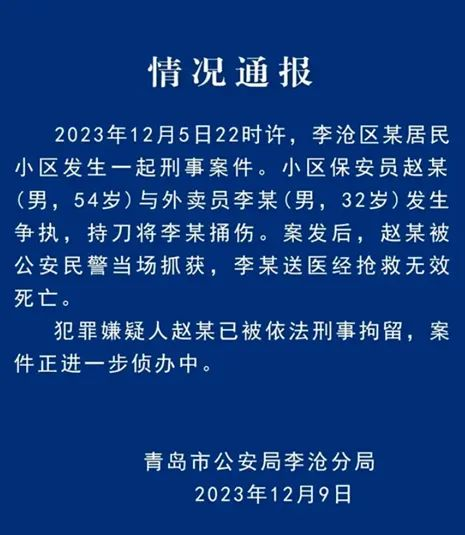
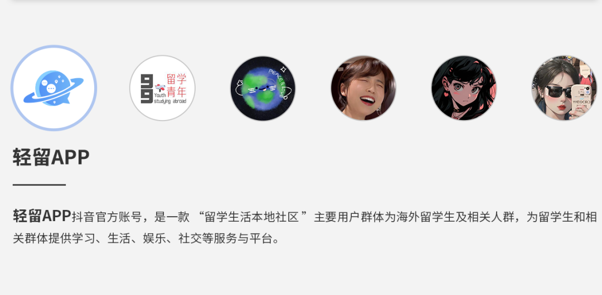

# 无标题

**链接地址:** http://mp.weixin.qq.com/s?__biz=MzIzODE4ODg5Ng==&mid=2247492437&idx=2&sn=6ed8ae2b0b2d5b88edcc8c39c0a4be31&chksm=e93f835ade480a4c8a8b8a37dcc856841098811bd05b26a89b6e896750c45133dfe84f67972f&mpshare=1&scene=2&srcid=0109lrMrILtGpRLiP70uNh2j&sharer_shareinfo=302d4b0d04e7c5cd2cd514db07fb1654&sharer_shareinfo_first=302d4b0d04e7c5cd2cd514db07fb1654#rd
**作者:** 赢福利下载
**获取时间:** 2025/8/28 19:02:07
**图片数量:** 8

---

## 原始HTML内容

<section style="font-size: 16px;margin-bottom: 0px;"><section style="text-align: left;justify-content: flex-start;display: flex;flex-flow: row;margin-top: 10px;margin-bottom: 10px;" powered-by="xiumi.us"><section style="display: inline-block;width: auto;vertical-align: bottom;align-self: flex-end;flex: 0 0 auto;border-style: solid;border-width: 0px 0px 3px;border-color: rgb(244, 127, 123) rgb(244, 127, 123) rgb(245, 186, 68);min-width: 5%;height: auto;"><section style="justify-content: flex-start;display: flex;flex-flow: row;" powered-by="xiumi.us"><section style="display: inline-block;vertical-align: bottom;width: auto;align-self: flex-end;flex: 0 0 auto;min-width: 5%;height: auto;"><section style="text-align: justify;font-size: 12px;color: rgb(245, 186, 68);" powered-by="xiumi.us">
QINGLIU APP 
</section><section style="margin-bottom: 6px;" powered-by="xiumi.us"><section style="text-align: justify;">
<strong>点击蓝字 关注我们</strong>
</section></section></section><section style="display: inline-block;vertical-align: bottom;width: auto;align-self: flex-end;flex: 0 0 auto;min-width: 5%;height: auto;"><section style="text-align: right;line-height: 0;transform: translate3d(6px, 0px, 0px);" powered-by="xiumi.us"><section style="vertical-align: middle;display: inline-block;line-height: 0;width: 59px;height: auto;"></section></section></section></section></section></section></section>

 

这不是标题党，而是去年底发生在青岛的一个悲剧。——李越凯，澳洲留学归来后，成为一名外卖员。

 

2023年12月5日，现场监控视频显示，当李越凯来到小区门口，小保安赵力迎上前来。两人对话后发生口角，突然保安赵力拨刀，抓住李越凯，举刀刺下。李越凯连连后退，他的胸前、腰部、背部、脸部，多处中刀；但李越凯没有任何反抗。当他血淋淋的倒在地上时保安赵力摁住他，继续用刀捅刺。

 

李凯越是家里长子，有个在读大学的弟弟。父母年近60岁。父亲饭店打工，母亲做保姆。父母收入加起来，一个月7000块钱。收入不多，但父母对大儿子李越凯，寄予很高期望。李越凯高中一毕业，父母就送他到澳洲留学。 

学心理学，花费100多万。

 

<strong>父母一个月挣7000块，留学花费100万……相当于父母不吃不喝12年的总收入。</strong>

 

所以李家并没有这么一笔留学费用。只能借钱。

 

<strong>到李越凯被保安赵力杀害，这笔钱还没还完。</strong>而且因为借不到钱，李越凯还曾休学一年。李越凯回国后，“一直没有出去找工作”。

<strong>所以他到青岛送外卖。他送了5天外卖。 </strong>

<strong>第6天，被保安赵力刺死。</strong>

 

在整个事件里除了八卦吃瓜以外，轻留君也想对事件引发的几点留学相关的思考详细和大家聊聊。 

 

<strong>1、留学专业选择有误</strong>

李越凯赴澳洲留学，选择的是心理学专业本科。现实中心理学作为一门严格的学问，不但学习内容枯燥，而且课程很难，毕业都不容易。除非名校，你又很努力很卷。否则不要说本科，就是硕士毕业在本地或回国都不好找工作，留学后毕业即失业大概率成为现实。很不幸，这发生在李越凯身上。毕业后在澳洲找不到工作，回国也是一直找不到合适的岗位。所以各位在留学选择专业时一定要注意规划。<a target="_blank" href="http://mp.weixin.qq.com/s?__biz=MzIzODE4ODg5Ng==&amp;mid=2247489913&amp;idx=3&amp;sn=2e84a7e8d7fe94b7893e51c8ad1a88ca&amp;chksm=e93c7976de4bf06054d3b0f0b5576d1d13c425a9141dbff57133e234dee2caa7aad0171da0e9&amp;scene=21#wechat_redirect" textvalue="20个学费低&amp;就业率高&amp;薪资高的加拿大College专业！" linktype="text" imgurl="" imgdata="null" data-itemshowtype="0" tab="innerlink" data-linktype="2">20个学费低&amp;就业率高&amp;薪资高的加拿大College专业！</a>

 

<strong>2、家境一般的孩子还可以留学吗？</strong>

其实留学就是一项大额教育投资，动辄几十万上百万元人民币，而大凡投资就应该有基本的投资与回报的考虑，除非家里条件很好。<a target="_blank" href="http://mp.weixin.qq.com/s?__biz=MzIzODE4ODg5Ng==&amp;mid=2247489460&amp;idx=2&amp;sn=02b7a9fda0be71e3ea6fb899704dec48&amp;chksm=e93c77bbde4bfead5928e8db06839e15214f99bfb87ba4cbc9c7d592220dde94c1dc61f2b04c&amp;scene=21#wechat_redirect" textvalue="揭秘：加拿大留学生一年真实开销！" linktype="text" imgurl="" imgdata="null" data-itemshowtype="0" tab="innerlink" data-linktype="2">揭秘：加拿大留学生一年真实开销！</a>

对于本文这种普通工薪家庭，其父母每月收入只有7000元人民币，却不惜借款也要去澳洲留学，花费过百万，无论从家庭经济或投资未来的角度看，都不是一个理性的选择。如果要留学，可以考虑大专college层次的留学，学一门终生受用的专业技能，花费少，家庭和自己的经济负担不会太重，而且毕业后能更好在澳洲找工作，或者对他回国的创业计划也有帮助。 

 

<strong>3、留学的根本目的是什么？</strong>

虽然每个人留学目标都不一样，但现在留学的底层逻辑已经改变；千万不要想当然的认为留学后找工作总不会差到哪里去。否则等留学毕业回国后，发现数年都找不到合适的工作，创业未成功，也耽误了考公考编等其他可能选项。所以一定要想好自己去留学的目的。<a target="_blank" href="http://mp.weixin.qq.com/s?__biz=MzIzODE4ODg5Ng==&amp;mid=2247489228&amp;idx=1&amp;sn=3c2ff9bc23151b262eb7f32d4326e4d9&amp;chksm=e93c76c3de4bffd57cec11f4c18329b47d637acb602fa0131cee62af6eed5af8e96bc74e9fc8&amp;scene=21#wechat_redirect" textvalue="加拿大留学回国就业前景，就业方向？" linktype="text" imgurl="" imgdata="null" data-itemshowtype="0" tab="innerlink" data-linktype="2">加拿大留学回国就业前景，就业方向？</a>

 

<strong> </strong>

<strong>最后开学季在即，轻留君想对大家说的是，虽然留学一词让人听起来会心生向往；感觉好像代表着更开阔的眼界和更自由的氛围；但你要说留学，就不能只说留学。</strong>

<strong> </strong>要写一个人坐一趟十几个小时的飞机，拖着疲倦的身体落地时已是凌晨一点。迎接你的是寂静的黑暗，你无助地面对着陌生的城市，一切的一切都让你感到无比孤寂。

 

要写一个人面对昂贵的租金，你苦恼不堪。每月支付大部分的收入给房东，只换来一个不起眼的房间，这无疑是你生活中的一大困扰。还要到处找兼职补贴家用，你感到无辜地被拖入一个贫穷的泥潭，很难想象这样的生活会是你曾经憧憬过的样子。

 
<section style="margin: 0px 0px 2px;font-size: 18px;color: rgb(34, 34, 34);font-family: arial;letter-spacing: normal;text-wrap: wrap;outline: 0px;line-height: 1.6em;text-align: justify;text-indent: 0em;">要写日复一日的重复循环，令人痛苦不堪。清晨你匆忙起床，还未来得及享受早晨的阳光，就已经身陷于枯燥乏味的学习中。饭菜是如此难以下咽，让人对这个异国他乡的味道产生了深深的抵触感。朋友圈子有限，彼此都是相互的过客，在这个陌生的城市里，你常常感到孤单而无助。</section><section style="margin: 0px 0px 2px;font-size: 18px;color: rgb(34, 34, 34);font-family: arial;letter-spacing: normal;text-wrap: wrap;outline: 0px;line-height: 1.6em;text-align: justify;text-indent: 0em;"> </section><section style="margin: 0px 0px 2px;font-size: 18px;color: rgb(34, 34, 34);font-family: arial;letter-spacing: normal;text-wrap: wrap;outline: 0px;line-height: 1.6em;text-align: justify;text-indent: 0em;">要写一个人坐在教室里，听着一堂又一堂与自己母语不通的课程，你很难理解。教授要求严格，final考试的压力让你焦虑不已。不仅要面对学业的困境，还要接受文化和语言的冲击，这让你感到无比的无力和疲惫。</section><section style="margin: 0px 0px 2px;font-size: 18px;color: rgb(34, 34, 34);font-family: arial;letter-spacing: normal;text-wrap: wrap;outline: 0px;line-height: 1.6em;text-align: justify;text-indent: 0em;"> </section><section style="margin: 0px 0px 2px;font-size: 18px;color: rgb(34, 34, 34);font-family: arial;letter-spacing: normal;text-wrap: wrap;outline: 0px;line-height: 1.6em;text-align: justify;text-indent: 0em;">要写临近毕业时，每天被毕业论文烦得焦头烂额，找不到工作的焦虑缠绕着你。害怕抽不到签证，害怕回国后找工作不顺利，找不到满意的工作，这些担忧令你日夜难安。</section><section style="margin: 0px 0px 2px;color: rgb(34, 34, 34);font-family: arial;letter-spacing: normal;text-wrap: wrap;outline: 0px;line-height: 1.6em;text-align: justify;text-indent: 0em;"> 当然，轻留君知道，这一切的辛酸也让你逐渐成长。你学会了坚韧与勇敢，无论面对怎样的困难和挑战，你都能够坚持并不断前行。留学的旅程让你收获了自信和坚毅的品质，这些将成为你未来人生道路中不可或缺的宝贵财富。</section><section style="margin: 0px 0px 2px;font-size: 18px;color: rgb(34, 34, 34);font-family: arial;letter-spacing: normal;text-wrap: wrap;outline: 0px;line-height: 1.6em;text-align: justify;text-indent: 0em;"> </section>
<strong data-original-title="" title="" data-num="3" style="font-family: mp-quote, -apple-system-font, BlinkMacSystemFont, &quot;Helvetica Neue&quot;, &quot;PingFang SC&quot;, &quot;Hiragino Sans GB&quot;, &quot;Microsoft YaHei UI&quot;, &quot;Microsoft YaHei&quot;, Arial, sans-serif;font-size: 24px;letter-spacing: 0px;color: rgb(0, 0, 0);text-align: start;caret-color: rgb(0, 0, 0);">Tips</strong> 
<section style="margin-bottom: 0px;letter-spacing: 0.578px;text-wrap: wrap;text-align: start;caret-color: rgb(0, 0, 0);color: rgb(0, 0, 0);display: flex;justify-content: flex-start;align-items: flex-start;"><section style="display: inline-block;flex-shrink: 0;"><section data-width="100%" style="margin-top: -3px;width: 44.9531px;height: 3px;background-color: rgb(255, 121, 7);overflow: hidden;"> </section></section><section data-autoskip="1" style="margin-top: 7px;margin-left: 10px;flex: 1 1 0%;text-align: justify;line-height: 1.7em;letter-spacing: 1.5px;font-size: 14px;color: rgb(254, 120, 6);">
 
</section></section><section data-autoskip="1" style="margin-top: 10px;margin-bottom: 0px;letter-spacing: 0.578px;text-wrap: wrap;line-height: 1.7em;"><section data-tools="135编辑器" data-id="107447" draggable="true"><section style="margin: 10px auto;text-align: center;"><section style="padding: 30px 25px;background-color: rgb(246, 246, 246);"><section style="color: rgb(0, 0, 0);font-size: 14px;letter-spacing: 1.5px;display: flex;justify-content: flex-start;align-items: flex-end;"><section style="font-size: 20px;color: rgb(254, 122, 9);"><strong data-brushtype="text">#轻留App</strong></section></section><section data-width="100%" style="margin-top: 4px;margin-bottom: 20px;color: rgb(0, 0, 0);font-size: 14px;letter-spacing: 1.5px;width: 734px;height: 1px;background-color: rgb(51, 51, 51);overflow: hidden;"> </section><section style="margin-top: 15px;padding: 20px;color: rgb(0, 0, 0);font-size: 14px;letter-spacing: 1.5px;background-color: rgb(255, 255, 255);"><section style="display: flex;justify-content: flex-start;align-items: flex-end;"><section style="font-size: 20px;color: rgb(254, 122, 9);line-height: 20px;"><strong>欢迎加入～</strong></section></section><section data-autoskip="1" style="margin-top: 10px;text-align: justify;line-height: 1.75em;">
第一次留学没经验？留学生活困难重重？

 

“来轻留，你可以找到最全面的留学指南”

 

<section style="font-size: 16px;">

<section><section powered-by="xiumi.us" style="display: flex;width: 488px;flex-flow: column;"><section powered-by="xiumi.us" style="height: auto;z-index: 1;"><section style="margin-top: 10px;margin-bottom: -3px;text-align: center;justify-content: center;display: flex;flex-flow: row;"><section style="display: inline-block;vertical-align: top;width: auto;min-width: 5%;flex: 0 0 auto;height: auto;"><section powered-by="xiumi.us" style="transform: perspective(0px);transform-style: flat;"><section style="text-align: left;transform: rotateY(180deg);"><section style="display: inline-block;width: 0px;height: 0px;vertical-align: top;overflow: hidden;border-style: solid;border-width: 0px 12px 29px 0px;border-color: rgba(255, 255, 255, 0) rgba(255, 255, 255, 0) rgb(48, 97, 207);"><section powered-by="xiumi.us" style="text-align: justify;">
 
</section></section></section></section></section><section style="padding-right: 11px;padding-left: 11px;display: inline-block;vertical-align: top;width: auto;align-self: stretch;flex: 0 0 auto;background-image: linear-gradient(-90deg, rgb(19, 152, 239) 0%, rgb(48, 90, 203) 100%);min-width: 5%;height: auto;"><section powered-by="xiumi.us" style="margin-top: 2px;margin-bottom: -2px;"><section style="color: rgb(255, 255, 255);">
扫码下载APP
</section></section></section><section style="display: inline-block;vertical-align: top;width: auto;align-self: stretch;flex: 0 0 auto;min-width: 5%;height: auto;line-height: 0.1;"><section powered-by="xiumi.us" style="text-align: left;"><section style="display: inline-block;width: 0px;height: 0px;vertical-align: top;overflow: hidden;border-style: solid;border-width: 0px 12px 29px 0px;border-color: rgba(255, 255, 255, 0) rgba(255, 255, 255, 0) rgb(21, 151, 239);"><section powered-by="xiumi.us" style="text-align: justify;">
 
</section></section></section></section></section></section></section><section powered-by="xiumi.us" style="margin-bottom: 10px;text-align: left;justify-content: flex-start;display: flex;flex-flow: row;"><section style="padding: 23px;display: inline-block;width: 488px;vertical-align: top;align-self: flex-start;flex: 0 0 auto;background-color: rgb(234, 241, 255);border-style: solid;border-width: 3px 0px;border-color: rgb(21, 151, 239);"><section powered-by="xiumi.us" style="text-align: center;line-height: 0;"><section style="vertical-align: middle;display: inline-block;line-height: 0;"></section></section></section></section></section></section></section></section></section></section></section></section>
<strong>往期精彩：</strong>
<section class="mp_profile_iframe_wrp" style="letter-spacing: 0.578px;text-wrap: wrap;"><mp-common-profile class="js_uneditable custom_select_card mp_profile_iframe" data-pluginname="mpprofile" data-id="MzIzODE4ODg5Ng==" data-headimg="http://mmbiz.qpic.cn/mmbiz_png/VldVRmMFMyqKwBry9mNs4icW7e6ExmLmHVHkIG5SjlXe4ibMrLFhQYGUvn2HmwonuC23RLDORpAYyvQXDRSywVCQ/0?wx_fmt=png" data-nickname="轻留APP" data-alias="" data-signature="服务全球海外留学生 让留学生活更便利 有保障 让远方的留学生不再孤单❤️" data-from="2" data-is_biz_ban="0"></mp-common-profile></section>
<a target="_blank" href="http://mp.weixin.qq.com/s?__biz=MzIzODE4ODg5Ng==&amp;mid=2247491982&amp;idx=2&amp;sn=77bdc60a55b93becf2339e07351575ca&amp;chksm=e93f8181de480897be81db2a8509121a8739be7d5ce24994be4e53ab5de2c4f4a7e8e8762c4d&amp;scene=21#wechat_redirect" textvalue="【吃瓜】曝光温哥华BT男sr未成年，多个马甲wx曝光！" linktype="text" imgurl="" imgdata="null" data-itemshowtype="0" tab="innerlink" data-linktype="2" style="font-size: 14px;">【吃瓜】曝光温哥华BT男sr未成年，多个马甲wx曝光！</a> 

<a target="_blank" href="http://mp.weixin.qq.com/s?__biz=MzIzODE4ODg5Ng==&amp;mid=2247491883&amp;idx=1&amp;sn=40d5d042411382120063d0e197328b2a&amp;chksm=e93f8124de480832aa744dfe8cd53777ca99601073c9c1abb1d9ee42740fc9f3c4fab8ca6efc&amp;scene=21#wechat_redirect" textvalue="多大BA2185考场逮捕记之我装b、性q、网暴、作弊但“我爱学习。”" linktype="text" imgurl="" imgdata="null" data-itemshowtype="0" tab="innerlink" data-linktype="2" style="font-size: 14px;">多大BA2185考场逮捕记之我装b、性q、网暴、作弊但“我爱学习。”</a> 

<a target="_blank" href="http://mp.weixin.qq.com/s?__biz=MzIzODE4ODg5Ng==&amp;mid=2247491511&amp;idx=2&amp;sn=a3e90c17cd64ac5c5c683868a8c3e8b1&amp;chksm=e93c7fb8de4bf6ae7c7772efc358c2f51f36d8c2d0c46c95c883708f405ddd002b9193a6abdc&amp;scene=21#wechat_redirect" textvalue="温哥华软饭男：穿着你买的裤子和别人睡觉让你更有参与感…" linktype="text" imgurl="" imgdata="null" data-itemshowtype="0" tab="innerlink" data-linktype="2" style="font-size: 14px;">温哥华软饭男：穿着你买的裤子和别人睡觉让你更有参与感…</a> 

<a target="_blank" href="http://mp.weixin.qq.com/s?__biz=MzIzODE4ODg5Ng==&amp;mid=2247491883&amp;idx=2&amp;sn=6a71e0a14306e624c1c7887cbbe76ea0&amp;chksm=e93f8124de4808326a992e910f581d69978ca81af984643eb537f4069ffb1177b950ac40cb81&amp;scene=21#wechat_redirect" textvalue="滑铁卢大学Final印错试卷临时取消！新学单词：rescheduled 重新安排的。" linktype="text" imgurl="" imgdata="null" data-itemshowtype="0" tab="innerlink" data-linktype="2" style="font-size: 14px;">滑铁卢大学Final印错试卷临时取消！新学单词：rescheduled 重新安排的。</a>

<mp-style-type data-value="10000"></mp-style-type>

---

## 纯文本内容

QINGLIU APP点击蓝字 关注我们这不是标题党，而是去年底发生在青岛的一个悲剧。——李越凯，澳洲留学归来后，成为一名外卖员。2023年12月5日，现场监控视频显示，当李越凯来到小区门口，小保安赵力迎上前来。两人对话后发生口角，突然保安赵力拨刀，抓住李越凯，举刀刺下。李越凯连连后退，他的胸前、腰部、背部、脸部，多处中刀；但李越凯没有任何反抗。当他血淋淋的倒在地上时保安赵力摁住他，继续用刀捅刺。李凯越是家里长子，有个在读大学的弟弟。父母年近60岁。父亲饭店打工，母亲做保姆。父母收入加起来，一个月7000块钱。收入不多，但父母对大儿子李越凯，寄予很高期望。李越凯高中一毕业，父母就送他到澳洲留学。学心理学，花费100多万。父母一个月挣7000块，留学花费100万……相当于父母不吃不喝12年的总收入。所以李家并没有这么一笔留学费用。只能借钱。到李越凯被保安赵力杀害，这笔钱还没还完。而且因为借不到钱，李越凯还曾休学一年。李越凯回国后，“一直没有出去找工作”。所以他到青岛送外卖。他送了5天外卖。第6天，被保安赵力刺死。在整个事件里除了八卦吃瓜以外，轻留君也想对事件引发的几点留学相关的思考详细和大家聊聊。1、留学专业选择有误李越凯赴澳洲留学，选择的是心理学专业本科。现实中心理学作为一门严格的学问，不但学习内容枯燥，而且课程很难，毕业都不容易。除非名校，你又很努力很卷。否则不要说本科，就是硕士毕业在本地或回国都不好找工作，留学后毕业即失业大概率成为现实。很不幸，这发生在李越凯身上。毕业后在澳洲找不到工作，回国也是一直找不到合适的岗位。所以各位在留学选择专业时一定要注意规划。20个学费低&就业率高&薪资高的加拿大College专业！2、家境一般的孩子还可以留学吗？其实留学就是一项大额教育投资，动辄几十万上百万元人民币，而大凡投资就应该有基本的投资与回报的考虑，除非家里条件很好。揭秘：加拿大留学生一年真实开销！对于本文这种普通工薪家庭，其父母每月收入只有7000元人民币，却不惜借款也要去澳洲留学，花费过百万，无论从家庭经济或投资未来的角度看，都不是一个理性的选择。如果要留学，可以考虑大专college层次的留学，学一门终生受用的专业技能，花费少，家庭和自己的经济负担不会太重，而且毕业后能更好在澳洲找工作，或者对他回国的创业计划也有帮助。3、留学的根本目的是什么？虽然每个人留学目标都不一样，但现在留学的底层逻辑已经改变；千万不要想当然的认为留学后找工作总不会差到哪里去。否则等留学毕业回国后，发现数年都找不到合适的工作，创业未成功，也耽误了考公考编等其他可能选项。所以一定要想好自己去留学的目的。加拿大留学回国就业前景，就业方向？最后开学季在即，轻留君想对大家说的是，虽然留学一词让人听起来会心生向往；感觉好像代表着更开阔的眼界和更自由的氛围；但你要说留学，就不能只说留学。要写一个人坐一趟十几个小时的飞机，拖着疲倦的身体落地时已是凌晨一点。迎接你的是寂静的黑暗，你无助地面对着陌生的城市，一切的一切都让你感到无比孤寂。要写一个人面对昂贵的租金，你苦恼不堪。每月支付大部分的收入给房东，只换来一个不起眼的房间，这无疑是你生活中的一大困扰。还要到处找兼职补贴家用，你感到无辜地被拖入一个贫穷的泥潭，很难想象这样的生活会是你曾经憧憬过的样子。要写日复一日的重复循环，令人痛苦不堪。清晨你匆忙起床，还未来得及享受早晨的阳光，就已经身陷于枯燥乏味的学习中。饭菜是如此难以下咽，让人对这个异国他乡的味道产生了深深的抵触感。朋友圈子有限，彼此都是相互的过客，在这个陌生的城市里，你常常感到孤单而无助。要写一个人坐在教室里，听着一堂又一堂与自己母语不通的课程，你很难理解。教授要求严格，final考试的压力让你焦虑不已。不仅要面对学业的困境，还要接受文化和语言的冲击，这让你感到无比的无力和疲惫。要写临近毕业时，每天被毕业论文烦得焦头烂额，找不到工作的焦虑缠绕着你。害怕抽不到签证，害怕回国后找工作不顺利，找不到满意的工作，这些担忧令你日夜难安。当然，轻留君知道，这一切的辛酸也让你逐渐成长。你学会了坚韧与勇敢，无论面对怎样的困难和挑战，你都能够坚持并不断前行。留学的旅程让你收获了自信和坚毅的品质，这些将成为你未来人生道路中不可或缺的宝贵财富。Tips#轻留App欢迎加入～第一次留学没经验？留学生活困难重重？“来轻留，你可以找到最全面的留学指南”扫码下载APP往期精彩：【吃瓜】曝光温哥华BT男sr未成年，多个马甲wx曝光！多大BA2185考场逮捕记之我装b、性q、网暴、作弊但“我爱学习。”温哥华软饭男：穿着你买的裤子和别人睡觉让你更有参与感…滑铁卢大学Final印错试卷临时取消！新学单词：rescheduled 重新安排的。

---

## 图片列表

-  (原始链接: https://mmbiz.qpic.cn/mmbiz_png/VldVRmMFMyr9WicsicSX89Sk52H5lHoUJnUvHcmCUoicVcXZmfS5JqFKO26zSqC6fJgMwqmozicCV4ggKibX5xzpm9A/640?wx_fmt=png&from=appmsg)
-  (原始链接: https://mmbiz.qpic.cn/mmbiz_gif/VldVRmMFMyr9WicsicSX89Sk52H5lHoUJnZOfNyCBibUaXibZtuTa1M7MPZRvVTibzSJs7s3dx3oAuCYlbzEpDmJCjw/640?wx_fmt=gif&from=appmsg)
-  (原始链接: https://mmbiz.qpic.cn/mmbiz_jpg/VldVRmMFMyodQIVyAoaFz2W13aOic8A01qfEo5oLhOGxnYdYzTxt8cugJZZTLpS4TtwZY2huWicHEm9VMloZoJ1g/640?wx_fmt=jpeg&from=appmsg)
-  (原始链接: https://mmbiz.qpic.cn/mmbiz_png/VldVRmMFMyr9WicsicSX89Sk52H5lHoUJnPiaGxkJRicPfrL9aT15WIMPu3LGp2TtlaA2peSVBicXuJNPzL4jmL9MkQ/640?wx_fmt=png&from=appmsg)
-  (原始链接: https://mmbiz.qpic.cn/mmbiz_png/VldVRmMFMyr9WicsicSX89Sk52H5lHoUJn7ibPWKXy8xMa79Z4F6wXb1lgF1xlYZxra66oibQf01gLib7MjmLuRjHHg/640?wx_fmt=png&from=appmsg)
-  (原始链接: https://mmbiz.qpic.cn/mmbiz_png/VldVRmMFMyr9WicsicSX89Sk52H5lHoUJntaDtt15tYWX7qiaWweR2HxjpWQbJAxpTMppD6aFwmgfJvqibCWxn1t3Q/640?wx_fmt=png&from=appmsg)
-  (原始链接: https://mmbiz.qpic.cn/mmbiz_gif/VldVRmMFMyr9WicsicSX89Sk52H5lHoUJnZOfNyCBibUaXibZtuTa1M7MPZRvVTibzSJs7s3dx3oAuCYlbzEpDmJCjw/640?wx_fmt=gif&from=appmsg)
-  (原始链接: https://mmbiz.qpic.cn/mmbiz_png/VldVRmMFMyr9WicsicSX89Sk52H5lHoUJnm9edQGUN71jFUq5Sq5NmcqpNV8zjJibpePKLHbV6YERNw9rPxSDUGsw/640?wx_fmt=png&from=appmsg)
