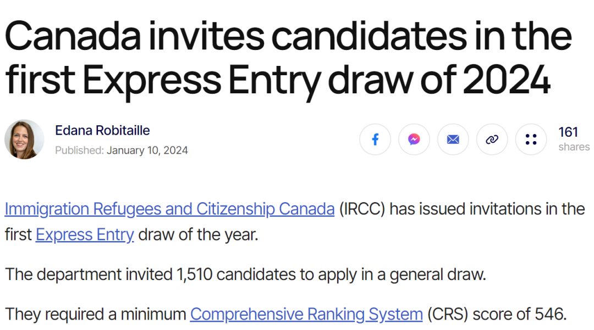
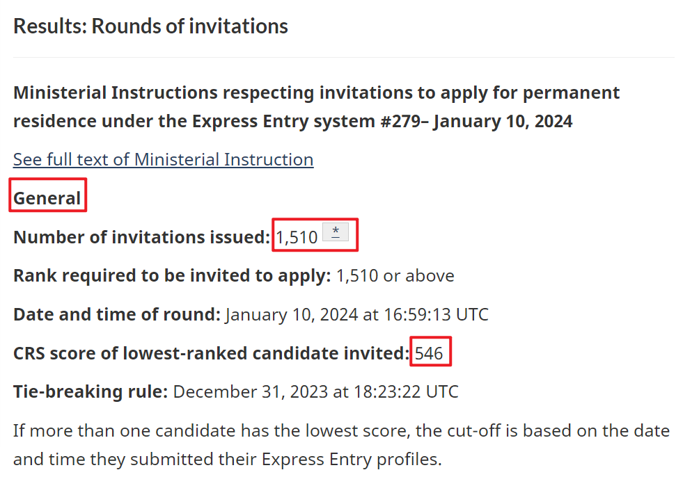
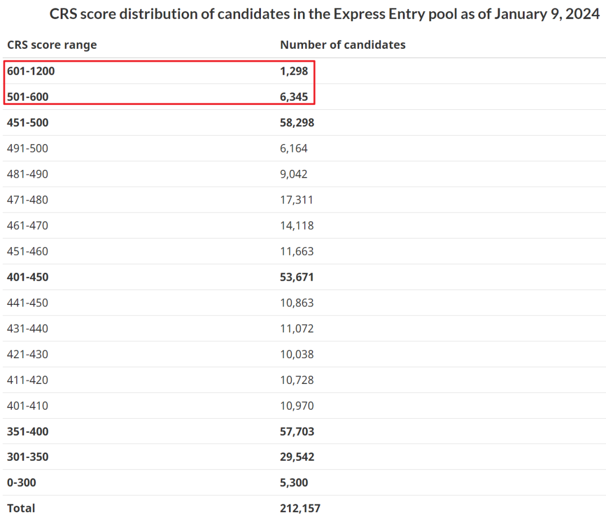

# 无标题

**链接地址:** http://mp.weixin.qq.com/s?__biz=MzUyNzA2NTAwNg==&mid=2247497066&idx=1&sn=2587130df7967c1578731736c40e1972&chksm=fa07ffabcd7076bd0212725d3db0a0c360a21a7e446fd48d831f87ed0d92ed2a2b46e713b36b&mpshare=1&scene=2&srcid=0114PVOhkffs4IcMF6o2QioV&sharer_shareinfo=6e71b465ef9e4339655f9b3a1eed13bb&sharer_shareinfo_first=6e71b465ef9e4339655f9b3a1eed13bb#rd
**作者:** 你身边的签证专家
**获取时间:** 2025/8/28 19:01:25
**图片数量:** 17

---

## 原始HTML内容

<section style="font-size: 16px;"><section style="text-align: center;margin-top: 10px;margin-bottom: 10px;line-height: 0;" powered-by="xiumi.us"><section style="vertical-align: middle;display: inline-block;line-height: 0;"></section></section><section style="text-align: center;margin-top: 10px;margin-bottom: 10px;line-height: 0;" powered-by="xiumi.us"><section style="vertical-align: middle;display: inline-block;line-height: 0;"></section></section><section style="text-align: center;margin-top: 10px;margin-bottom: 10px;line-height: 0;" powered-by="xiumi.us"><section style="vertical-align: middle;display: inline-block;line-height: 0;"></section></section>
 
<section style="font-size: 19px;text-align: center;margin-top: 10px;margin-bottom: 3px;" powered-by="xiumi.us"><section style="display: inline-block;border-width: 1px;border-style: solid;border-color: rgb(188, 65, 65);background-color: rgb(188, 65, 65);width: 1.8em;height: 1.8em;line-height: 1.8em;border-radius: 100%;margin-left: auto;margin-right: auto;font-size: 16px;color: rgb(255, 255, 255);">
<strong>1</strong>
</section></section><section style="text-align: center;" powered-by="xiumi.us"><section style="display: inline-block;width: 0px;height: 0px;vertical-align: top;overflow: hidden;border-style: solid;border-width: 9px 6px 0px;border-color: rgb(188, 65, 65) rgba(255, 255, 255, 0) rgba(255, 255, 255, 0);"><svg viewBox="0 0 1 1" style="float:left;line-height:0;width:0;vertical-align:top;"></svg></section></section><section style="margin-bottom: 10px;text-align: center;justify-content: center;display: flex;flex-flow: row;" powered-by="xiumi.us"><section style="display: inline-block;width: auto;vertical-align: middle;background-color: rgba(109, 155, 209, 0.1);min-width: 10%;flex: 0 0 auto;height: auto;align-self: center;padding: 12px;"><section style="color: rgb(109, 155, 209);text-align: justify;" powered-by="xiumi.us">
<strong>加拿大EE通道新年首抽546分</strong>
</section></section></section><section style="font-size: 14px;padding-right: 15px;padding-left: 15px;letter-spacing: 1px;" powered-by="xiumi.us">
 

2024年1月10日，加拿大联邦技术移民快速通道（EE）进行了<strong>2024年新年第一次抽选</strong>，本次抽选为不分类别的常规类抽选，一共邀请了<strong>1,510人</strong>，<strong>最低获邀分为546分</strong>，高分似乎已成常态。

 
</section><section style="text-align: center;margin-top: 10px;margin-bottom: 10px;line-height: 0;" powered-by="xiumi.us"><section style="vertical-align: middle;display: inline-block;line-height: 0;width: 90%;height: auto;"></section></section><section style="text-align: center;margin-top: 10px;margin-bottom: 10px;line-height: 0;" powered-by="xiumi.us"><section style="vertical-align: middle;display: inline-block;line-height: 0;width: 90%;height: auto;"></section></section><section style="font-size: 14px;padding-right: 15px;padding-left: 15px;letter-spacing: 1px;" powered-by="xiumi.us">
 

新一年EE的高分首抽，也一定程度上为今年EE分数走向定了一个基调，本次邀请相比年末的分数（542）<strong>又涨了4分</strong>，预计<strong>分数会在这个区间徘徊一段时间</strong>。

 

同时新年第一抽往往是<strong>EE配额最丰沛</strong>的时候，但移民部此次依旧只邀请了1,510人，可见今年移民部对EE常规类抽选邀请人数，应该会<strong>维持在单次1,500人左右</strong>。

 
</section><section style="text-align: center;margin-top: 10px;margin-bottom: 10px;line-height: 0;" powered-by="xiumi.us"><section style="vertical-align: middle;display: inline-block;line-height: 0;width: 90%;height: auto;"></section></section><section style="font-size: 14px;padding-right: 15px;padding-left: 15px;letter-spacing: 1px;" powered-by="xiumi.us">
 

坦白说，这样的分数确实会<strong>将大部分普通申请人拒之门外</strong>。根据发邀前的申请池情况，我们可以清楚地看到，本次获邀的大部分申请人是省提名申请人，其中CRS分数在600分以上的有1,298人。相比之下，获邀的普通申请人数量却不足300人。 

 
</section><section style="text-align: center;margin-top: 10px;margin-bottom: 10px;line-height: 0;" powered-by="xiumi.us"><section style="vertical-align: middle;display: inline-block;line-height: 0;width: 90%;height: auto;"></section></section><section style="font-size: 14px;padding-right: 15px;padding-left: 15px;letter-spacing: 1px;" powered-by="xiumi.us">
 
</section><section style="font-size: 14px;padding-right: 15px;padding-left: 15px;letter-spacing: 1px;" powered-by="xiumi.us">
 

截至1月9日，申请池中分数在501～600分的申请人已达到<strong>6,345人</strong>，而在491～500分的申请人也有6,164人。因此，如果EE短期内没有进行高频率、大数量的邀请，<strong>最低分数线很难低于500分</strong>。

 

对于普通申请人来说，如果想走EE，在雅思达到8777（CLB9）的基础上，各项数值都是满分（包括工作经验，年龄30以下，单身或者配偶同样优秀，学历最起码研究生）的情况下，也不过才能得到460分左右的分数。<strong>不靠任何加分手段几乎无法上岸！</strong>

 

 
</section><section style="font-size: 19px;text-align: center;margin-top: 10px;margin-bottom: 3px;" powered-by="xiumi.us"><section style="display: inline-block;border-width: 1px;border-style: solid;border-color: rgb(188, 65, 65);background-color: rgb(188, 65, 65);width: 1.8em;height: 1.8em;line-height: 1.8em;border-radius: 100%;margin-left: auto;margin-right: auto;font-size: 16px;color: rgb(255, 255, 255);">
<strong>2</strong>
</section></section><section style="text-align: center;" powered-by="xiumi.us"><section style="display: inline-block;width: 0px;height: 0px;vertical-align: top;overflow: hidden;border-style: solid;border-width: 9px 6px 0px;border-color: rgb(188, 65, 65) rgba(255, 255, 255, 0) rgba(255, 255, 255, 0);"><svg viewBox="0 0 1 1" style="float:left;line-height:0;width:0;vertical-align:top;"></svg></section></section><section style="margin-bottom: 10px;text-align: center;justify-content: center;display: flex;flex-flow: row;" powered-by="xiumi.us"><section style="display: inline-block;width: auto;vertical-align: middle;background-color: rgba(109, 155, 209, 0.1);min-width: 10%;flex: 0 0 auto;height: auto;align-self: center;padding: 12px;"><section style="color: rgb(109, 155, 209);text-align: justify;" powered-by="xiumi.us">
<strong>EE常见加分方法</strong>
</section></section></section><section style="font-size: 14px;padding-right: 15px;padding-left: 15px;letter-spacing: 1px;" powered-by="xiumi.us">
 
</section><section style="display: flex;width: 100%;flex-flow: column;" powered-by="xiumi.us"><section style="z-index: auto;" powered-by="xiumi.us"><section style="text-align: left;justify-content: flex-start;display: flex;flex-flow: row;margin-top: 20px;margin-bottom: 20px;transform: translate3d(15px, 0px, 0px);"><section style="display: inline-block;vertical-align: middle;width: auto;background-color: rgb(188, 65, 65);min-width: 5%;flex: 0 0 auto;height: auto;align-self: center;"><section style="text-align: center;transform: translate3d(10px, 0px, 0px);margin-top: -4px;margin-bottom: -4px;" powered-by="xiumi.us"><section style="display: inline-block;width: 42px;height: 42px;vertical-align: top;overflow: hidden;border-radius: 235px;background-color: rgb(233, 224, 245);border-style: solid;border-width: 7px;border-color: rgb(255, 255, 255);"><section style="margin-top: 1px;" powered-by="xiumi.us"><section style="color: rgb(0, 0, 0);">
<strong>01</strong>
</section></section></section></section></section><section style="display: inline-block;vertical-align: middle;width: auto;align-self: center;flex: 0 0 auto;min-width: 5%;height: auto;padding-left: 10px;"><section style="text-align: justify;color: rgb(0, 0, 0);" powered-by="xiumi.us">
<strong>LMIA+EE</strong>
</section></section></section></section></section><section style="font-size: 14px;padding-right: 15px;padding-left: 15px;letter-spacing: 1px;" powered-by="xiumi.us">
对于国内雅思过6分，总监职位级别以上职位申请人，<strong>选择LMIA加分200分通过EE移民</strong>，是速度最快、风险最小的选择。但需要注意：只有TEER0下面的00类职位的申请人在拿到LMIA后能够在快速通道里加200分。 

 
</section><section style="text-align: center;margin-top: 10px;margin-bottom: 10px;line-height: 0;" powered-by="xiumi.us"><section style="vertical-align: middle;display: inline-block;line-height: 0;width: 90%;height: auto;"></section></section><section style="font-size: 14px;padding-right: 15px;padding-left: 15px;letter-spacing: 1px;" powered-by="xiumi.us">
 

<strong>加拿大国家职业分类：</strong>

 

TEER 0：管理类，例如广告、市场营销主管。

 

TEER 1：大学学位毕业的职位，例如财务顾问，软件工程师。

 

TEER 2：大专毕业或2年及以上的学徒培训，或主管职位，例如计算机网络技术人员，医学实验室技术人员。

 

TEER 3：大专毕业或少于2年的学徒培训或超过6个月的在职培训，例如烘焙师，牙医助理。

 

TEER 4：高中毕业，或数周的在职培训，例如家庭托儿服务提供者，零售销售人员和视觉陈列师。

 

TEER 5：短期培训即可，无须正式教育，例如园林绿化和地面维护工人，送货服务司机和送货上门经销商。

 
</section><section style="display: flex;width: 100%;flex-flow: column;" powered-by="xiumi.us"><section style="z-index: auto;" powered-by="xiumi.us"><section style="text-align: left;justify-content: flex-start;display: flex;flex-flow: row;margin-top: 20px;margin-bottom: 20px;transform: translate3d(15px, 0px, 0px);"><section style="display: inline-block;vertical-align: middle;width: auto;background-color: rgb(188, 65, 65);min-width: 5%;flex: 0 0 auto;height: auto;align-self: center;"><section style="text-align: center;transform: translate3d(10px, 0px, 0px);margin-top: -4px;margin-bottom: -4px;" powered-by="xiumi.us"><section style="display: inline-block;width: 42px;height: 42px;vertical-align: top;overflow: hidden;border-radius: 235px;background-color: rgb(233, 224, 245);border-style: solid;border-width: 7px;border-color: rgb(255, 255, 255);"><section style="margin-top: 1px;" powered-by="xiumi.us"><section style="color: rgb(0, 0, 0);">
<strong>02</strong>
</section></section></section></section></section><section style="display: inline-block;vertical-align: middle;width: auto;align-self: center;flex: 0 0 auto;min-width: 5%;height: auto;padding-left: 10px;"><section style="text-align: justify;color: rgb(0, 0, 0);" powered-by="xiumi.us">
<strong>省提名+EE</strong>
</section></section></section></section></section><section style="font-size: 14px;padding-right: 15px;padding-left: 15px;letter-spacing: 1px;" powered-by="xiumi.us">
省提名项目为成功获得提名的申请者，提供了<strong>600分的加分机会</strong>，这在EE排名中起到了举足轻重的作用。相较于其他申请者，省提名获得者的高额加分，在如今内卷严重的EE池中尤为重要，更容易被EE通道选中并获得邀请函。 

 
</section><section style="text-align: center;margin-top: 10px;margin-bottom: 10px;line-height: 0;" powered-by="xiumi.us"><section style="vertical-align: middle;display: inline-block;line-height: 0;width: 90%;height: auto;"></section></section><section style="font-size: 14px;padding-right: 15px;padding-left: 15px;letter-spacing: 1px;" powered-by="xiumi.us">
 

但实际上，<strong>只有部分雇主担保是可以走EE的</strong>，这完全取决于申请人所申请的省份以及选择的类别。

 

 

<strong>BC省：</strong>

EEBC-Skilled Worker技术工人 

EEBC-International Graduate国际毕业生

EEBC-Healthcare Professional医护专业人员

EEBC-International Post-Graduate国际硕博留学生

 

<strong>阿省：</strong>

Alberta Express Entry Stream 阿尔伯塔快速通道 

 

<strong>萨省：</strong>

International Skilled Workers-Express Entry 国际技术工人快速通道类别 

 

<strong>曼省：</strong>

SWO-Skilled Worker Overseas Stream海外技术工人类别下属的快速通道省提名Manitoba-Express Entry 

 

<strong>安省：</strong>

Human Capital Priorities Stream 人力资源优先类别 

Skilled Trades Stream 安省技工移民类别 

French-Speaking Skilled Worker Stream 法语技术工人类别 

 

<strong>新省：</strong> 

Labour Market Priorities stream 劳动力市场优先类别 

Nova Scotia Experience: Express Entry stream 新省经验类移民：快速通道类别 

 
</section>
 
<section style="font-size: 19px;text-align: center;margin-top: 10px;margin-bottom: 3px;" powered-by="xiumi.us"><section style="display: inline-block;border-width: 1px;border-style: solid;border-color: rgb(188, 65, 65);background-color: rgb(188, 65, 65);width: 1.8em;height: 1.8em;line-height: 1.8em;border-radius: 100%;margin-left: auto;margin-right: auto;font-size: 16px;color: rgb(255, 255, 255);">
<strong>3</strong>
</section></section><section style="text-align: center;" powered-by="xiumi.us"><section style="display: inline-block;width: 0px;height: 0px;vertical-align: top;overflow: hidden;border-style: solid;border-width: 9px 6px 0px;border-color: rgb(188, 65, 65) rgba(255, 255, 255, 0) rgba(255, 255, 255, 0);"><svg viewBox="0 0 1 1" style="float:left;line-height:0;width:0;vertical-align:top;"></svg></section></section><section style="margin-bottom: 10px;text-align: center;justify-content: center;display: flex;flex-flow: row;" powered-by="xiumi.us"><section style="display: inline-block;width: auto;vertical-align: middle;background-color: rgba(109, 155, 209, 0.1);min-width: 10%;flex: 0 0 auto;height: auto;align-self: center;padding: 12px;"><section style="color: rgb(109, 155, 209);text-align: justify;" powered-by="xiumi.us">
<strong>2024年EE将持续改革</strong>
</section></section></section><section style="font-size: 14px;padding-right: 15px;padding-left: 15px;letter-spacing: 1px;" powered-by="xiumi.us">
 

2023年，加拿大移民部开始进行<strong>基于类别的快速通道抽签</strong>。实施这些抽签是为了帮助加拿大找到最适合解决该国最紧迫的劳动力缺口和人口需求的外国人。

 

2023年是基于类别的抽签的第一年，移民部选择优先考虑以下类别的移民候选人：

 
<ul class="list-paddingleft-1" style="padding-left: 40px;list-style-position: outside;"><li>
具有<strong>法语</strong>水平的人；
</li><li>
最近在以下<strong>五个行业</strong>中具有工作经验的人：医疗保健；科学、工程、技术和数学（STEM）；贸易、运输和农产品/农业。

 
</li></ul></section><section style="text-align: center;margin-top: 10px;margin-bottom: 10px;line-height: 0;" powered-by="xiumi.us"><section style="vertical-align: middle;display: inline-block;line-height: 0;width: 90%;height: auto;"></section></section><section style="font-size: 14px;padding-right: 15px;padding-left: 15px;letter-spacing: 1px;" powered-by="xiumi.us">
 

2024年，移民部预计将继续进行基于类别的抽签。然而，该部门此前已明确表示，他们将重新评估2023年选择的重点类别，并可能根据加拿大劳动力市场不断变化的需求进行调整。这意味着移民部可能会选择新的行业和熟练程度作为重点领域，从而有可能使新的移民群体有资格参加基于类别的快速入境抽签。
</section>
 

 
<section style="font-size: 19px;text-align: center;margin-top: 10px;margin-bottom: 3px;" powered-by="xiumi.us"><section style="display: inline-block;border-width: 1px;border-style: solid;border-color: rgb(188, 65, 65);background-color: rgb(188, 65, 65);width: 1.8em;height: 1.8em;line-height: 1.8em;border-radius: 100%;margin-left: auto;margin-right: auto;font-size: 16px;color: rgb(255, 255, 255);">
<strong>4</strong>
</section></section><section style="text-align: center;" powered-by="xiumi.us"><section style="display: inline-block;width: 0px;height: 0px;vertical-align: top;overflow: hidden;border-style: solid;border-width: 9px 6px 0px;border-color: rgb(188, 65, 65) rgba(255, 255, 255, 0) rgba(255, 255, 255, 0);"><svg viewBox="0 0 1 1" style="float:left;line-height:0;width:0;vertical-align:top;"></svg></section></section><section style="margin-bottom: 10px;text-align: center;justify-content: center;display: flex;flex-flow: row;" powered-by="xiumi.us"><section style="display: inline-block;width: auto;vertical-align: middle;background-color: rgba(109, 155, 209, 0.1);min-width: 10%;flex: 0 0 auto;height: auto;align-self: center;padding: 12px;"><section style="color: rgb(109, 155, 209);text-align: justify;" powered-by="xiumi.us">
<strong>其他移民方面的变化</strong>
</section></section></section><section style="font-size: 14px;padding-right: 15px;padding-left: 15px;letter-spacing: 1px;" powered-by="xiumi.us">
 

移民部还致力于进行其他几项变革，旨在改善加拿大新移民在移民过程中的体验和生活。  
</section><section style="display: flex;width: 100%;flex-flow: column;" powered-by="xiumi.us"><section style="z-index: auto;" powered-by="xiumi.us"><section style="text-align: left;justify-content: flex-start;display: flex;flex-flow: row;margin-top: 20px;margin-bottom: 20px;transform: translate3d(15px, 0px, 0px);"><section style="display: inline-block;vertical-align: middle;width: auto;background-color: rgb(188, 65, 65);min-width: 5%;flex: 0 0 auto;height: auto;align-self: center;"><section style="text-align: center;transform: translate3d(10px, 0px, 0px);margin-top: -4px;margin-bottom: -4px;" powered-by="xiumi.us"><section style="display: inline-block;width: 42px;height: 42px;vertical-align: top;overflow: hidden;border-radius: 235px;background-color: rgb(233, 224, 245);border-style: solid;border-width: 7px;border-color: rgb(255, 255, 255);"><section style="margin-top: 1px;" powered-by="xiumi.us"><section style="color: rgb(0, 0, 0);">
<strong>01</strong>
</section></section></section></section></section><section style="display: inline-block;vertical-align: middle;width: auto;align-self: center;flex: 0 0 auto;min-width: 5%;height: auto;padding-left: 10px;"><section style="text-align: justify;color: rgb(0, 0, 0);" powered-by="xiumi.us">
<strong>增加人工智能和技术的使用</strong>
</section></section></section></section></section><section style="font-size: 14px;padding-right: 15px;padding-left: 15px;letter-spacing: 1px;" powered-by="xiumi.us">
为了“在人才竞争中击败其他国家”，移民部承诺到2024年在移民领域进一步使用<strong>技术和人工智能</strong>。该举措旨在<strong>减少处理时间</strong>，改进移民部官员的工具，帮助加拿大满足国家的移民和多样性优先事项。

 
</section><section style="display: flex;width: 100%;flex-flow: column;" powered-by="xiumi.us"><section style="z-index: auto;" powered-by="xiumi.us"><section style="text-align: left;justify-content: flex-start;display: flex;flex-flow: row;margin-top: 20px;margin-bottom: 20px;transform: translate3d(15px, 0px, 0px);"><section style="display: inline-block;vertical-align: middle;width: auto;background-color: rgb(188, 65, 65);min-width: 5%;flex: 0 0 auto;height: auto;align-self: center;"><section style="text-align: center;transform: translate3d(10px, 0px, 0px);margin-top: -4px;margin-bottom: -4px;" powered-by="xiumi.us"><section style="display: inline-block;width: 42px;height: 42px;vertical-align: top;overflow: hidden;border-radius: 235px;background-color: rgb(233, 224, 245);border-style: solid;border-width: 7px;border-color: rgb(255, 255, 255);"><section style="margin-top: 1px;" powered-by="xiumi.us"><section style="color: rgb(0, 0, 0);">
<strong>02</strong>
</section></section></section></section></section><section style="display: inline-block;vertical-align: middle;width: auto;align-self: center;flex: 0 0 auto;min-width: 5%;height: auto;padding-left: 10px;"><section style="text-align: justify;color: rgb(0, 0, 0);" powered-by="xiumi.us">
<strong>提高服务标准</strong>
</section></section></section></section></section><section style="font-size: 14px;padding-right: 15px;padding-left: 15px;letter-spacing: 1px;" powered-by="xiumi.us">
加强与依赖移民的雇主和机构的伙伴关系，同时解决欺诈问题并加强对学生和工人的保护，使用数字和虚拟技术使应用程序更加友好。  
</section><section style="display: flex;width: 100%;flex-flow: column;" powered-by="xiumi.us"><section style="z-index: auto;" powered-by="xiumi.us"><section style="text-align: left;justify-content: flex-start;display: flex;flex-flow: row;margin-top: 20px;margin-bottom: 20px;transform: translate3d(15px, 0px, 0px);"><section style="display: inline-block;vertical-align: middle;width: auto;background-color: rgb(188, 65, 65);min-width: 5%;flex: 0 0 auto;height: auto;align-self: center;"><section style="text-align: center;transform: translate3d(10px, 0px, 0px);margin-top: -4px;margin-bottom: -4px;" powered-by="xiumi.us"><section style="display: inline-block;width: 42px;height: 42px;vertical-align: top;overflow: hidden;border-radius: 235px;background-color: rgb(233, 224, 245);border-style: solid;border-width: 7px;border-color: rgb(255, 255, 255);"><section style="margin-top: 1px;" powered-by="xiumi.us"><section style="color: rgb(0, 0, 0);">
<strong>03</strong>
</section></section></section></section></section><section style="display: inline-block;vertical-align: middle;width: auto;align-self: center;flex: 0 0 auto;min-width: 5%;height: auto;padding-left: 10px;"><section style="text-align: justify;color: rgb(0, 0, 0);" powered-by="xiumi.us">
<strong>新的移民部顾问委员会</strong>
</section></section></section></section></section><section style="font-size: 14px;padding-right: 15px;padding-left: 15px;letter-spacing: 1px;" powered-by="xiumi.us">
移民部将成立一个<strong>新的咨询机构</strong>，重点关注与移民政策和服务提供相关的事务。独特的是，该委员会将包括<strong>“具有移民生活经验”的人士</strong>，让加拿大的新移民在影响他们的计划和流程中拥有更多发言权。这个新的咨询委员会希望“加强政策和计划的制定，同时确保加拿大的移民体系保持稳定、以人为本的方法。”

 
</section><section style="display: flex;width: 100%;flex-flow: column;" powered-by="xiumi.us"><section style="z-index: auto;" powered-by="xiumi.us"><section style="text-align: left;justify-content: flex-start;display: flex;flex-flow: row;margin-top: 20px;margin-bottom: 20px;transform: translate3d(15px, 0px, 0px);"><section style="display: inline-block;vertical-align: middle;width: auto;background-color: rgb(188, 65, 65);min-width: 5%;flex: 0 0 auto;height: auto;align-self: center;"><section style="text-align: center;transform: translate3d(10px, 0px, 0px);margin-top: -4px;margin-bottom: -4px;" powered-by="xiumi.us"><section style="display: inline-block;width: 42px;height: 42px;vertical-align: top;overflow: hidden;border-radius: 235px;background-color: rgb(233, 224, 245);border-style: solid;border-width: 7px;border-color: rgb(255, 255, 255);"><section style="margin-top: 1px;" powered-by="xiumi.us"><section style="color: rgb(0, 0, 0);">
<strong>04</strong>
</section></section></section></section></section><section style="display: inline-block;vertical-align: middle;width: auto;align-self: center;flex: 0 0 auto;min-width: 5%;height: auto;padding-left: 10px;"><section style="text-align: justify;color: rgb(0, 0, 0);" powered-by="xiumi.us">
<strong>首席国际人才官</strong>
</section></section></section></section></section><section style="font-size: 14px;padding-right: 15px;padding-left: 15px;letter-spacing: 1px;" powered-by="xiumi.us">
加拿大移民部门将引入一个全新的职位，称为<strong>首席国际人才官(CITO)</strong>。他们的主要职责是改善该国移民制度与其国家劳动力市场和部门战略之间的一致性。  据该部门称，“此人的责任意味着有能力影响加拿大年度移民的巨大变化。” 一旦有人被任命，2024年及以后想要移民到这个国家的人就应该关注事态的发展。

 很显然，加拿大未来所需要的是能够满足加拿大劳动力市场需求，以及为经济发展提供支持的新移民。

 
</section><section style="text-align: center;margin-top: 10px;margin-bottom: 10px;line-height: 0;" powered-by="xiumi.us"><section style="vertical-align: middle;display: inline-block;line-height: 0;width: 90%;height: auto;"></section></section><section style="font-size: 14px;padding-right: 15px;padding-left: 15px;letter-spacing: 1px;" powered-by="xiumi.us">
 

在加拿大移民部公布的<strong>《2024-2026年移民水平计划》</strong>中，未来三年的移民配额分别是：

 

2024年：预计接收485,000名新移民；

2025年：预计接收500,000名新移民；

2026年：预计接收500,000名新移民。

 

值得注意是，未来，<strong>经济类移民和家庭团聚将成为加拿大吸纳人才的主要目标</strong>。同时，EE快速通道系统和省提名都将在2024年迎来更新。

 
</section><section style="margin: 10px 0%;text-align: left;justify-content: flex-start;display: flex;flex-flow: row;" powered-by="xiumi.us"><section style="display: inline-block;width: 100%;vertical-align: top;background-color: rgb(216, 202, 160);line-height: 0;align-self: flex-start;flex: 0 0 auto;"><section style="text-align: justify;justify-content: flex-start;display: flex;flex-flow: row;" powered-by="xiumi.us"><section style="display: inline-block;width: 100%;vertical-align: top;background-position: 0% 0%;background-repeat: repeat;background-size: 1.56658%;background-attachment: scroll;align-self: flex-start;flex: 0 0 auto;background-image: url(&quot;https://mmbiz.qpic.cn/mmbiz_png/904kUibXm7Y694lRBdDjgm5Ux592Emu6jht5qD46fOy8Hcnhwbj19NicGV1dCs8n3Hnuiacqdsx8yVRf9FUkgblww/640?wx_fmt=png&amp;from=appmsg&quot;);"><section style="text-align: center;" powered-by="xiumi.us"><section style="display: inline-block;width: 100%;height: 11px;vertical-align: top;overflow: hidden;background-color: rgba(255, 255, 255, 0);"><svg viewBox="0 0 1 1" style="float:left;line-height:0;width:0;vertical-align:top;"></svg></section></section></section></section></section></section><section style="font-size: 14px;padding-right: 15px;padding-left: 15px;letter-spacing: 1px;" powered-by="xiumi.us">
 
</section><section style="font-size: 14px;padding-right: 15px;padding-left: 15px;letter-spacing: 1px;" powered-by="xiumi.us">
总的来说，目前的加拿大 ，正处于急需发展需要人口，人口多了社会资源又跟不上的一系列的发展阵痛期。而要解决这些问题，就需要政府、企业和个人共同努力，虽然未来三年一直被说是加拿大移民的黄金期，但之后的<strong>移民门槛却只会越来越高</strong>，只有紧贴加拿大政策，了解政府到底需要什么，才能对自己的移民路径有更清晰的规划。 

 

所以目前能入池的客户朋友们请尽快入池，抓紧改革实施的过渡时期。还在上学的客户朋友们也请把眼光放长远，<strong>提前做好自己的职业规划</strong>。<strong>不同职业在加拿大的拿卡体验可谓天差地别！</strong>

 

如果你认为自己的目前分数和职业不太有被打捞上岸的希望，也欢迎联系我们帮你进行<strong>系统又专业的移民方案规划</strong>。留在加拿大的方式比你想象的多，只要你不放弃，<strong>一定有一条路适合你</strong>！
</section><section style="font-size: 14px;padding-right: 15px;padding-left: 15px;letter-spacing: 1px;" powered-by="xiumi.us">
 

 
</section><section style="text-align: center;margin-top: 10px;margin-bottom: 10px;line-height: 0;" powered-by="xiumi.us"><section style="vertical-align: middle;display: inline-block;line-height: 0;width: 90%;height: auto;"></section></section><section style="font-size: 14px;padding-right: 15px;padding-left: 15px;letter-spacing: 1px;" powered-by="xiumi.us">
 

新时代建议你<strong>在专业的指导和帮助下进行申请</strong>，以便更高效、更准确地完成每一个申请步骤。作为经验丰富的移民顾问团队，深知如何在复杂多变的政策环境中找到最佳的申请路径和解决方案。

 

如果你对加拿大的签证和移民申请还有任何需要咨询的问题，或者需要新时代进行专业的帮助。欢迎<strong>扫描二维码联系我们持牌留学移民顾问，预约一对一的咨询服务</strong>，我们将为你量身定制最适合你，最高效也是最稳妥的留学移民方法。 
</section><section style="font-size: 14px;padding-right: 15px;padding-left: 15px;letter-spacing: 1px;" powered-by="xiumi.us">
 
</section>
 
<section style="text-align: left;justify-content: flex-start;display: flex;flex-flow: row;margin-top: 10px;" powered-by="xiumi.us"><section style="display: inline-block;vertical-align: top;width: auto;align-self: stretch;flex: 0 0 auto;background-color: rgb(188, 65, 65);min-width: 5%;height: auto;padding-top: 9px;padding-right: 9px;padding-left: 20px;"><section style="text-align: justify;font-size: 18px;color: rgb(252, 252, 252);" powered-by="xiumi.us">
<strong>阅读更多</strong>
</section></section><section style="display: inline-block;vertical-align: top;width: auto;min-width: 5%;flex: 0 0 auto;height: auto;align-self: stretch;"><section style="" powered-by="xiumi.us"><section style="display: inline-block;width: 0px;height: 0px;vertical-align: top;overflow: hidden;border-style: solid;border-width: 45px 0px 0px 19px;border-color: rgba(255, 255, 255, 0) rgba(255, 255, 255, 0) rgba(255, 255, 255, 0) rgb(188, 65, 65);"><svg viewBox="0 0 1 1" style="float:left;line-height:0;width:0;vertical-align:top;"></svg></section></section></section></section><section style="margin-bottom: 10px;" powered-by="xiumi.us"><section style="background-color: rgb(188, 65, 65);height: 3px;"><svg viewBox="0 0 1 1" style="float:left;line-height:0;width:0;vertical-align:top;"></svg></section></section><section style="margin: 10px 0%;text-align: left;justify-content: flex-start;display: flex;flex-flow: row;" powered-by="xiumi.us"><section style="display: inline-block;width: 100%;background-position: 40.3495% 24.4615%;background-repeat: repeat;background-size: 104.114%;background-attachment: scroll;padding: 30px;vertical-align: top;align-self: flex-start;flex: 0 0 auto;background-image: url(&quot;https://mmbiz.qpic.cn/mmbiz_jpg/904kUibXm7Y694lRBdDjgm5Ux592Emu6jZmkCIyZrFMgmoIjFWJkvJ99YqAuFiaTWFjoblTlDicGAWDK7FS1AH77Q/640?wx_fmt=jpeg&amp;from=appmsg&quot;);"><section style="text-align: justify;justify-content: flex-start;display: flex;flex-flow: row;" powered-by="xiumi.us"><section style="display: inline-block;width: 100%;vertical-align: top;background-color: rgba(188, 65, 65, 0.22);padding: 10px;border-width: 0px;border-style: none;border-color: rgb(62, 62, 62);align-self: flex-start;flex: 0 0 auto;"><section style="text-align: center;color: rgb(255, 255, 255);font-size: 14px;" powered-by="xiumi.us">
<a target="_blank" href="http://mp.weixin.qq.com/s?__biz=MzUyNzA2NTAwNg==&amp;mid=2247497038&amp;idx=1&amp;sn=e32b8b130ae8d217100129a2ac2a723b&amp;chksm=fa07ff8fcd707699afd9487cb947f300bda8efbe3d7807ca4f148b82b7e51d09ab53c7fe7f14&amp;scene=21#wechat_redirect" textvalue="又加码？加拿大魁省投资移民终于公布详细要求，这样的魁省你还爱吗？…" linktype="text" imgurl="" imgdata="null" data-itemshowtype="0" tab="innerlink" style="color: rgb(255, 255, 255);" data-linktype="2"><strong>又加码？加拿大魁省投资移民终于公布详细要求，这样的魁省你还爱吗？…</strong></a>
</section></section></section></section></section><section style="margin: 10px 0%;text-align: left;justify-content: flex-start;display: flex;flex-flow: row;" powered-by="xiumi.us"><section style="display: inline-block;width: 100%;vertical-align: top;background-position: 22.1575% 63.122%;background-repeat: repeat;background-size: 107.269%;background-attachment: scroll;padding: 30px;align-self: flex-start;flex: 0 0 auto;background-image: url(&quot;https://mmbiz.qpic.cn/mmbiz_png/904kUibXm7Y694lRBdDjgm5Ux592Emu6j0noLFFJUq9o47cheavS7ZUpE12J6IRmjWs6Gtn1ILlODBXUJKuibeEQ/640?wx_fmt=png&amp;from=appmsg&quot;);"><section style="text-align: justify;justify-content: flex-start;display: flex;flex-flow: row;" powered-by="xiumi.us"><section style="display: inline-block;width: 100%;vertical-align: top;background-color: rgba(188, 65, 65, 0.22);padding: 10px;border-width: 0px;border-style: none;border-color: rgb(62, 62, 62);align-self: flex-start;flex: 0 0 auto;"><section style="text-align: left;color: rgb(255, 255, 255);font-size: 14px;" powered-by="xiumi.us">
<a target="_blank" href="http://mp.weixin.qq.com/s?__biz=MzUyNzA2NTAwNg==&amp;mid=2247497011&amp;idx=1&amp;sn=3bc2c9def2a099b8a246d3671f5ca542&amp;chksm=fa07fff2cd7076e4858fe5dfa510aa86a1fdf704364479ae5e742a329ed6699f3993f7d092a7&amp;scene=21#wechat_redirect" textvalue="24小时抢光！这个加拿大移民类别2024年第一天申请已爆满！但还有机会！….." linktype="text" imgurl="" imgdata="null" data-itemshowtype="0" tab="innerlink" style="color: rgb(255, 255, 255);" data-linktype="2"><strong>24小时抢光！这个加拿大移民类别2024年第一天申请已爆满！但还有机会！…..</strong></a>
</section></section></section></section></section><section style="margin: 10px 0%;text-align: left;justify-content: flex-start;display: flex;flex-flow: row;" powered-by="xiumi.us"><section style="display: inline-block;width: 100%;vertical-align: top;background-position: 291.498% 21.1686%;background-repeat: repeat;background-size: 101.212%;background-attachment: scroll;padding: 30px;align-self: flex-start;flex: 0 0 auto;background-image: url(&quot;https://mmbiz.qpic.cn/mmbiz_jpg/904kUibXm7Y694lRBdDjgm5Ux592Emu6joxF1nYPpHPWOREchO0v8CKa9xqq9picibCCqVk6spibGm30Fgwx0dz3Sw/640?wx_fmt=jpeg&amp;from=appmsg&quot;);"><section style="text-align: justify;justify-content: flex-start;display: flex;flex-flow: row;" powered-by="xiumi.us"><section style="display: inline-block;width: 100%;vertical-align: top;background-color: rgba(188, 65, 65, 0.22);padding: 10px;border-width: 0px;border-style: none;border-color: rgb(62, 62, 62);align-self: flex-start;flex: 0 0 auto;"><section style="text-align: center;color: rgb(255, 255, 255);font-size: 14px;" powered-by="xiumi.us">
<a target="_blank" href="http://mp.weixin.qq.com/s?__biz=MzUyNzA2NTAwNg==&amp;mid=2247496982&amp;idx=1&amp;sn=1441657e1a976041e4adbbafafde713c&amp;chksm=fa07ffd7cd7076c1a75d26b07f59f6d6a1a81245e9aa4abdbd5d57f6b7c7d16c861bfff65bec&amp;scene=21#wechat_redirect" textvalue="加拿大移民部2024第一项新措施：留学生录取通知书全部需验证！" linktype="text" imgurl="" imgdata="null" data-itemshowtype="0" tab="innerlink" style="color: rgb(255, 255, 255);" data-linktype="2"><strong>加拿大移民部2024第一项新措施：留学生录取通知书全部需验证！</strong></a>
</section></section></section></section></section><section style="margin: 10px 0%;text-align: left;justify-content: flex-start;display: flex;flex-flow: row;" powered-by="xiumi.us"><section style="display: inline-block;width: 100%;vertical-align: top;background-position: 14.6137% 32.4473%;background-repeat: repeat;background-size: 100.637%;background-attachment: scroll;padding: 30px;align-self: flex-start;flex: 0 0 auto;background-image: url(&quot;https://mmbiz.qpic.cn/mmbiz_jpg/904kUibXm7Y694lRBdDjgm5Ux592Emu6jicRFECEOtqEIhYznHSolsJRl7mczRGSYYM0eAk4ZxXYL1nicClSDyxkg/640?wx_fmt=jpeg&amp;from=appmsg&quot;);"><section style="text-align: justify;justify-content: flex-start;display: flex;flex-flow: row;" powered-by="xiumi.us"><section style="display: inline-block;width: 100%;vertical-align: top;background-color: rgba(188, 65, 65, 0.22);padding: 10px;border-width: 0px;border-style: none;border-color: rgb(62, 62, 62);align-self: flex-start;flex: 0 0 auto;"><section style="text-align: center;color: rgb(255, 255, 255);font-size: 14px;" powered-by="xiumi.us">
<a target="_blank" href="http://mp.weixin.qq.com/s?__biz=MzUyNzA2NTAwNg==&amp;mid=2247496953&amp;idx=1&amp;sn=46ff7c0f06a531138708687f1327803e&amp;chksm=fa07fe38cd70772ec67c9b4107919f2c6e145e81aaad5e420bc423ef3d11ba2377e48c8ccc05&amp;scene=21#wechat_redirect" textvalue="2024年1月1日起，加拿大护理移民即将开放！无需LMIA，缩短工作要求！" linktype="text" imgurl="" imgdata="null" data-itemshowtype="0" tab="innerlink" style="color: rgb(255, 255, 255);" data-linktype="2"><strong>2024年1月1日起，加拿大护理移民即将开放！无需LMIA，缩短工作要求！</strong></a>
</section></section></section></section></section><section style="text-align: center;font-size: 12px;color: rgb(180, 180, 180);" powered-by="xiumi.us">
（点击文字阅读）
</section><section style="margin: 10px 0%;text-align: left;justify-content: flex-start;display: flex;flex-flow: row;" powered-by="xiumi.us"><section style="display: inline-block;width: 100%;vertical-align: top;background-color: rgb(216, 202, 160);line-height: 0;align-self: flex-start;flex: 0 0 auto;"><section style="text-align: justify;justify-content: flex-start;display: flex;flex-flow: row;" powered-by="xiumi.us"><section style="display: inline-block;width: 100%;vertical-align: top;background-position: 0% 0%;background-repeat: repeat;background-size: 1.56658%;background-attachment: scroll;align-self: flex-start;flex: 0 0 auto;background-image: url(&quot;https://mmbiz.qpic.cn/mmbiz_png/904kUibXm7Y694lRBdDjgm5Ux592Emu6jht5qD46fOy8Hcnhwbj19NicGV1dCs8n3Hnuiacqdsx8yVRf9FUkgblww/640?wx_fmt=png&amp;from=appmsg&quot;);"><section style="text-align: center;" powered-by="xiumi.us"><section style="display: inline-block;width: 100%;height: 11px;vertical-align: top;overflow: hidden;background-color: rgba(255, 255, 255, 0);"><svg viewBox="0 0 1 1" style="float:left;line-height:0;width:0;vertical-align:top;"></svg></section></section></section></section></section></section><section style="text-align: center;margin-top: 10px;margin-bottom: 10px;line-height: 0;" powered-by="xiumi.us"><section style="vertical-align: middle;display: inline-block;line-height: 0;"></section></section><section style="text-align: center;margin-top: 10px;margin-bottom: 10px;line-height: 0;" powered-by="xiumi.us"><section style="vertical-align: middle;display: inline-block;line-height: 0;"></section></section><section style="text-align: center;margin-top: 10px;margin-bottom: 10px;line-height: 0;" powered-by="xiumi.us"><section style="vertical-align: middle;display: inline-block;line-height: 0;"></section></section><section style="padding-right: 15px;padding-left: 15px;font-size: 12px;color: rgb(121, 121, 121);" powered-by="xiumi.us">
<strong>参考信息：</strong>

<strong>https://www.cicnews.com/2024/01/canada-invites-candidates-in-the-first-express-entry-draw-of-2024-0142024.html#gs.2ww0sa</strong>
</section><section style="text-align: center;margin-top: 10px;margin-bottom: 10px;line-height: 0;" powered-by="xiumi.us"><section style="vertical-align: middle;display: inline-block;line-height: 0;"></section></section><section style="text-align: center;margin-top: 10px;margin-bottom: 10px;line-height: 0;" powered-by="xiumi.us"><section style="vertical-align: middle;display: inline-block;line-height: 0;"></section></section></section>
 

<mp-style-type data-value="3"></mp-style-type>

---

## 纯文本内容

1加拿大EE通道新年首抽546分2024年1月10日，加拿大联邦技术移民快速通道（EE）进行了2024年新年第一次抽选，本次抽选为不分类别的常规类抽选，一共邀请了1,510人，最低获邀分为546分，高分似乎已成常态。新一年EE的高分首抽，也一定程度上为今年EE分数走向定了一个基调，本次邀请相比年末的分数（542）又涨了4分，预计分数会在这个区间徘徊一段时间。同时新年第一抽往往是EE配额最丰沛的时候，但移民部此次依旧只邀请了1,510人，可见今年移民部对EE常规类抽选邀请人数，应该会维持在单次1,500人左右。坦白说，这样的分数确实会将大部分普通申请人拒之门外。根据发邀前的申请池情况，我们可以清楚地看到，本次获邀的大部分申请人是省提名申请人，其中CRS分数在600分以上的有1,298人。相比之下，获邀的普通申请人数量却不足300人。截至1月9日，申请池中分数在501～600分的申请人已达到6,345人，而在491～500分的申请人也有6,164人。因此，如果EE短期内没有进行高频率、大数量的邀请，最低分数线很难低于500分。对于普通申请人来说，如果想走EE，在雅思达到8777（CLB9）的基础上，各项数值都是满分（包括工作经验，年龄30以下，单身或者配偶同样优秀，学历最起码研究生）的情况下，也不过才能得到460分左右的分数。不靠任何加分手段几乎无法上岸！2EE常见加分方法01LMIA+EE对于国内雅思过6分，总监职位级别以上职位申请人，选择LMIA加分200分通过EE移民，是速度最快、风险最小的选择。但需要注意：只有TEER0下面的00类职位的申请人在拿到LMIA后能够在快速通道里加200分。加拿大国家职业分类：TEER 0：管理类，例如广告、市场营销主管。TEER 1：大学学位毕业的职位，例如财务顾问，软件工程师。TEER 2：大专毕业或2年及以上的学徒培训，或主管职位，例如计算机网络技术人员，医学实验室技术人员。TEER 3：大专毕业或少于2年的学徒培训或超过6个月的在职培训，例如烘焙师，牙医助理。TEER 4：高中毕业，或数周的在职培训，例如家庭托儿服务提供者，零售销售人员和视觉陈列师。TEER 5：短期培训即可，无须正式教育，例如园林绿化和地面维护工人，送货服务司机和送货上门经销商。02省提名+EE省提名项目为成功获得提名的申请者，提供了600分的加分机会，这在EE排名中起到了举足轻重的作用。相较于其他申请者，省提名获得者的高额加分，在如今内卷严重的EE池中尤为重要，更容易被EE通道选中并获得邀请函。但实际上，只有部分雇主担保是可以走EE的，这完全取决于申请人所申请的省份以及选择的类别。BC省：EEBC-Skilled Worker技术工人EEBC-International Graduate国际毕业生EEBC-Healthcare Professional医护专业人员EEBC-International Post-Graduate国际硕博留学生阿省：Alberta Express Entry Stream 阿尔伯塔快速通道萨省：International Skilled Workers-Express Entry 国际技术工人快速通道类别曼省：SWO-Skilled Worker Overseas Stream海外技术工人类别下属的快速通道省提名Manitoba-Express Entry安省：Human Capital Priorities Stream 人力资源优先类别Skilled Trades Stream 安省技工移民类别French-Speaking Skilled Worker Stream 法语技术工人类别新省：Labour Market Priorities stream 劳动力市场优先类别Nova Scotia Experience: Express Entry stream 新省经验类移民：快速通道类别32024年EE将持续改革2023年，加拿大移民部开始进行基于类别的快速通道抽签。实施这些抽签是为了帮助加拿大找到最适合解决该国最紧迫的劳动力缺口和人口需求的外国人。2023年是基于类别的抽签的第一年，移民部选择优先考虑以下类别的移民候选人：具有法语水平的人；最近在以下五个行业中具有工作经验的人：医疗保健；科学、工程、技术和数学（STEM）；贸易、运输和农产品/农业。2024年，移民部预计将继续进行基于类别的抽签。然而，该部门此前已明确表示，他们将重新评估2023年选择的重点类别，并可能根据加拿大劳动力市场不断变化的需求进行调整。这意味着移民部可能会选择新的行业和熟练程度作为重点领域，从而有可能使新的移民群体有资格参加基于类别的快速入境抽签。4其他移民方面的变化移民部还致力于进行其他几项变革，旨在改善加拿大新移民在移民过程中的体验和生活。01增加人工智能和技术的使用为了“在人才竞争中击败其他国家”，移民部承诺到2024年在移民领域进一步使用技术和人工智能。该举措旨在减少处理时间，改进移民部官员的工具，帮助加拿大满足国家的移民和多样性优先事项。02提高服务标准加强与依赖移民的雇主和机构的伙伴关系，同时解决欺诈问题并加强对学生和工人的保护，使用数字和虚拟技术使应用程序更加友好。03新的移民部顾问委员会移民部将成立一个新的咨询机构，重点关注与移民政策和服务提供相关的事务。独特的是，该委员会将包括“具有移民生活经验”的人士，让加拿大的新移民在影响他们的计划和流程中拥有更多发言权。这个新的咨询委员会希望“加强政策和计划的制定，同时确保加拿大的移民体系保持稳定、以人为本的方法。”04首席国际人才官加拿大移民部门将引入一个全新的职位，称为首席国际人才官(CITO)。他们的主要职责是改善该国移民制度与其国家劳动力市场和部门战略之间的一致性。据该部门称，“此人的责任意味着有能力影响加拿大年度移民的巨大变化。” 一旦有人被任命，2024年及以后想要移民到这个国家的人就应该关注事态的发展。很显然，加拿大未来所需要的是能够满足加拿大劳动力市场需求，以及为经济发展提供支持的新移民。在加拿大移民部公布的《2024-2026年移民水平计划》中，未来三年的移民配额分别是：2024年：预计接收485,000名新移民；2025年：预计接收500,000名新移民；2026年：预计接收500,000名新移民。值得注意是，未来，经济类移民和家庭团聚将成为加拿大吸纳人才的主要目标。同时，EE快速通道系统和省提名都将在2024年迎来更新。总的来说，目前的加拿大 ，正处于急需发展需要人口，人口多了社会资源又跟不上的一系列的发展阵痛期。而要解决这些问题，就需要政府、企业和个人共同努力，虽然未来三年一直被说是加拿大移民的黄金期，但之后的移民门槛却只会越来越高，只有紧贴加拿大政策，了解政府到底需要什么，才能对自己的移民路径有更清晰的规划。所以目前能入池的客户朋友们请尽快入池，抓紧改革实施的过渡时期。还在上学的客户朋友们也请把眼光放长远，提前做好自己的职业规划。不同职业在加拿大的拿卡体验可谓天差地别！如果你认为自己的目前分数和职业不太有被打捞上岸的希望，也欢迎联系我们帮你进行系统又专业的移民方案规划。留在加拿大的方式比你想象的多，只要你不放弃，一定有一条路适合你！新时代建议你在专业的指导和帮助下进行申请，以便更高效、更准确地完成每一个申请步骤。作为经验丰富的移民顾问团队，深知如何在复杂多变的政策环境中找到最佳的申请路径和解决方案。如果你对加拿大的签证和移民申请还有任何需要咨询的问题，或者需要新时代进行专业的帮助。欢迎扫描二维码联系我们持牌留学移民顾问，预约一对一的咨询服务，我们将为你量身定制最适合你，最高效也是最稳妥的留学移民方法。阅读更多又加码？加拿大魁省投资移民终于公布详细要求，这样的魁省你还爱吗？…24小时抢光！这个加拿大移民类别2024年第一天申请已爆满！但还有机会！…..加拿大移民部2024第一项新措施：留学生录取通知书全部需验证！2024年1月1日起，加拿大护理移民即将开放！无需LMIA，缩短工作要求！（点击文字阅读）参考信息：https://www.cicnews.com/2024/01/canada-invites-candidates-in-the-first-express-entry-draw-of-2024-0142024.html#gs.2ww0sa

---

## 图片列表

-  (原始链接: https://mmbiz.qpic.cn/mmbiz_jpg/904kUibXm7Y694lRBdDjgm5Ux592Emu6jJgrjG8EepOZpicKxKWkibrk3KziakWI4Rz6wcW2DUyVSjn8wOY0XDJ2Og/640?wx_fmt=jpeg&from=appmsg)
-  (原始链接: https://mmbiz.qpic.cn/mmbiz_jpg/904kUibXm7Y694lRBdDjgm5Ux592Emu6jnTflJdITVrkPW3RwGtjtXfZm9G6TPgh3S3obtMd3yfgJycUbtib0j0A/640?wx_fmt=jpeg&from=appmsg)
-  (原始链接: https://mmbiz.qpic.cn/mmbiz_png/904kUibXm7Y694lRBdDjgm5Ux592Emu6jPdM5ia80CNeerCkMpBQWu7Lic5I6WssDjiciayIXze8uKicwroCP3soMenA/640?wx_fmt=png&from=appmsg)
-  (原始链接: https://mmbiz.qpic.cn/mmbiz_png/904kUibXm7Y694lRBdDjgm5Ux592Emu6jQwbf34Ub00c4PlzIK6yrQX3eceo5O6rp7YgLHXIEpC4PdurrTw7fibQ/640?wx_fmt=png&from=appmsg)
-  (原始链接: https://mmbiz.qpic.cn/mmbiz_png/904kUibXm7Y694lRBdDjgm5Ux592Emu6j9HNwAKpibfH56wnX2nJwpQeg91iaEKGR48FibZuib3msWmGNCu2peu339w/640?wx_fmt=png&from=appmsg)
-  (原始链接: https://mmbiz.qpic.cn/mmbiz_png/904kUibXm7Y694lRBdDjgm5Ux592Emu6jwhlbwGCaxsGgic0vm8oU95InRseoOab893vpiaObfCiayt6cpP4Xh0r2g/640?wx_fmt=png&from=appmsg)
-  (原始链接: https://mmbiz.qpic.cn/mmbiz_png/904kUibXm7Y694lRBdDjgm5Ux592Emu6j2SibsKXibpKUajziadqqrRPhQl1HgX76Gmm2KI2ImQky7fqcKrLWbcDkQ/640?wx_fmt=png&from=appmsg)
-  (原始链接: https://mmbiz.qpic.cn/mmbiz_png/904kUibXm7Y694lRBdDjgm5Ux592Emu6jEJufeyLeialychibfsic5eQul2GDhwecooDKsm5Uqo3WosDLDsyrt1C5Q/640?wx_fmt=png&from=appmsg)
-  (原始链接: https://mmbiz.qpic.cn/mmbiz_jpg/904kUibXm7Y694lRBdDjgm5Ux592Emu6js4YlbduT9Rrc2IuIec9UsLkcQ1q4HfzGWKrhsPBLLxEYSWBEAsDDxw/640?wx_fmt=jpeg&from=appmsg)
-  (原始链接: https://mmbiz.qpic.cn/mmbiz_png/904kUibXm7Y694lRBdDjgm5Ux592Emu6j43KYFCoJKH8FpLhfFGehLPAP3FFg5NAOB4tXp7ySwH8aH8sDZdPLNg/640?wx_fmt=png&from=appmsg)
-  (原始链接: https://mmbiz.qpic.cn/mmbiz_png/904kUibXm7Y694lRBdDjgm5Ux592Emu6jJE8lkbUMAQAajdnWDN1ACVhIYm0Dz4HyqLIKldyTsbHR7GzP1j9qzw/640?wx_fmt=png&from=appmsg)
-  (原始链接: https://mmbiz.qpic.cn/mmbiz_png/904kUibXm7Y694lRBdDjgm5Ux592Emu6jJE8lkbUMAQAajdnWDN1ACVhIYm0Dz4HyqLIKldyTsbHR7GzP1j9qzw/640?wx_fmt=png&from=appmsg)
-  (原始链接: https://mmbiz.qpic.cn/mmbiz_jpg/904kUibXm7Y694lRBdDjgm5Ux592Emu6jpkibTQl7MiaXsmraic1OpPPkHicwPDJIdmUIRq2wmHG0VJDPUEN0SmKLVw/640?wx_fmt=jpeg&from=appmsg)
-  (原始链接: https://mmbiz.qpic.cn/mmbiz_png/904kUibXm7Y694lRBdDjgm5Ux592Emu6jxGVdVoH73gf5jJ5hGraT8pYPV4picASbnyBp8iaxA1hrZUTIE0SiaXTug/640?wx_fmt=png&from=appmsg)
-  (原始链接: https://mmbiz.qpic.cn/mmbiz_jpg/904kUibXm7Y694lRBdDjgm5Ux592Emu6jQtykGpQtdxZZUjqrM8sJFEibicn8V30Z3VcI2lWj6gCp8UEWibaXz0hFg/640?wx_fmt=jpeg&from=appmsg)
-  (原始链接: https://mmbiz.qpic.cn/mmbiz_jpg/904kUibXm7Y694lRBdDjgm5Ux592Emu6jmcOmxelKPAJLib0sAcRRt5RrYiaO66BJpuAyOFexwdr3MXM6ibelqFHiag/640?wx_fmt=jpeg&from=appmsg)
-  (原始链接: https://mmbiz.qpic.cn/mmbiz_jpg/904kUibXm7Y694lRBdDjgm5Ux592Emu6jicn7Pf7GtQL4pfThz3nJhM0j17Dkb0LmphUic0Lmvbnmeh6WHFzqe5PA/640?wx_fmt=jpeg&from=appmsg)
