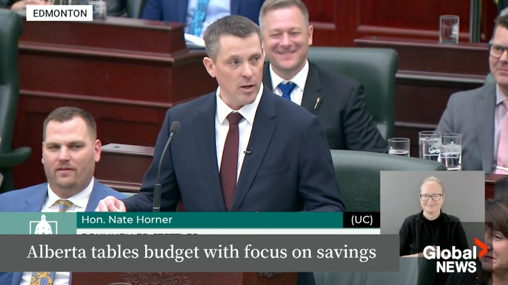
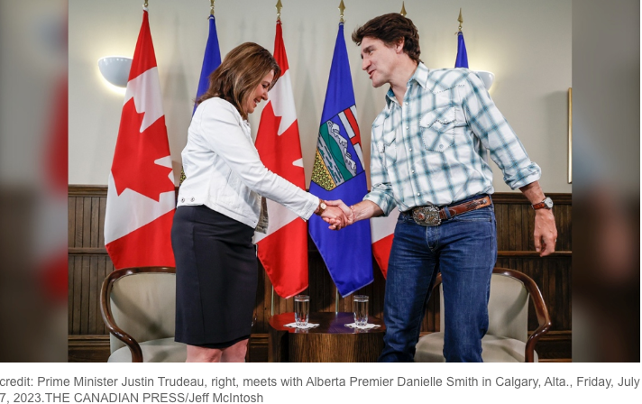
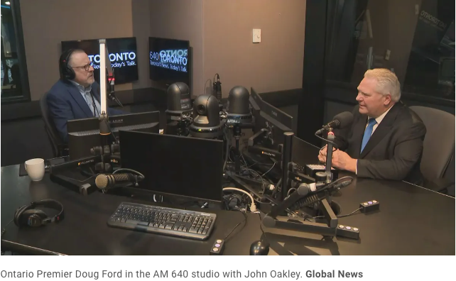
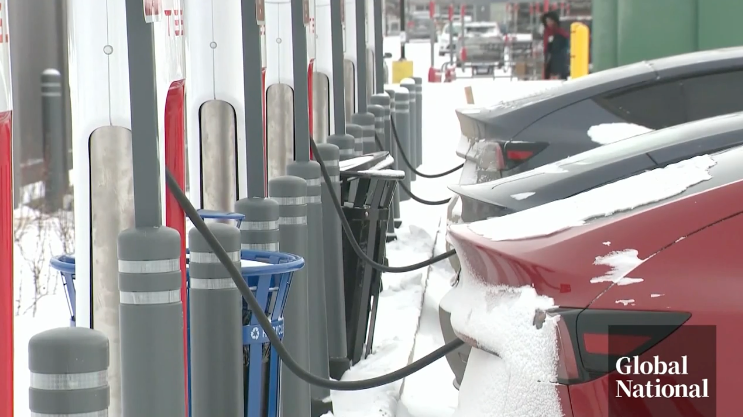

# 无标题

**链接地址:** http://mp.weixin.qq.com/s?__biz=MjM5MDEzNzY2NQ==&mid=2652876704&idx=1&sn=b0b0f52f7b7cd201de004b31fb356669&chksm=bda2638e8ad5ea9864a588f13189c038771d2c7592fcad478a433b3db4de609a3894bb3b2347&mpshare=1&scene=2&srcid=03025WfPEg1L4f37HtY7Tevx&sharer_shareinfo=309e6f8b7f794e3cb51897a86bb8b636&sharer_shareinfo_first=309e6f8b7f794e3cb51897a86bb8b636#rd
**作者:** 丁其
**获取时间:** 2025/8/28 18:59:51
**图片数量:** 6

---

## 原始HTML内容

当全世界都出台措施鼓励人们购买电车的时候，加拿大阿尔伯塔省却出台新规，现有或潜在电动汽车车主在注册车辆时将需要缴纳新税，每年200加元，原因是电车太重，会压烂马路。

本周四2月29日，阿尔伯塔省财政厅长内特·霍纳（Nate Horner）发布2024年预算案后，阿省人将不得不多存一点钱来购买新房或拥有电动汽车（EV）。

现有或潜在的电动汽车车主在注册车辆时将需要缴纳新税。

最快从明年2025 年 1 月开始，电动汽车车主每年将需要缴纳 200 元的新税。

阿省表示，电动汽车往往比类似的内燃机（ICE）车辆更重，并且“对省道造成更多磨损”。

阿省财长霍纳说：“由于电车司机显然不缴纳燃油税（包含碳税），因此这笔税款将是他们对保持省级道路维护和支持其他公共服务的贡献。”

阿省的财政计划称：“这一税率与阿省典型的内燃机汽车驾驶员每年缴纳的燃油税估计一致。”

“该税不适用于混合动力汽车（hybrid）。”

阿省承认，并非所有燃油税都用于道路维护，但“仍然存在公平问题”以及燃油税收入下降带来的长期挑战。

阿省政府预计，新的电动汽车税将在 2024-25 财年带来 100 万加元的收入，2025-26 财年带来 500 万元的收入，随后一年带来 800 万元的收入。

该省表示，更多细节将在秋季立法出台时公布。

卡尔加里大学经济学教授布莱克·谢弗（ Blake Shaffer）则质疑阿省政府“公平”的说法是否“合理”。

谢弗写道，电动汽车通常比内燃机汽车重，但汽油动力卡车则比电动汽车重。

根据他的计算，一辆重量约为1,600 公斤的日产 Leaf 电车，一年行驶 10,000 公里，每年交200加元，这相当于缴纳油车每升 25 分的汽油税。

但是，如果没有补贴，该省的汽油税通常为每升 13 分。

他表示，一辆整备质量在 2,700 至 3,100 公斤之间、一年行驶 20,000 公里的福特 Lightning EV 皮卡车将面临每升 12 分的新税。

阿省反对党领袖雷切尔·诺特利（Rachel Notley ）表示，她不会反对在电动汽车和内燃机汽车司机之间建立“平等”，并赞赏为道路维护提供资金的必要性，但她指出，新税收传播了几个主题。

诺特利说：“阿省政府总是热衷于让减少排放而采取行动的人支付更多费用，或者告知他们根本无法做到这一点。”

阿尔伯塔省是加拿大少数几个没有提供电动汽车购买激励措施的省份之一。

特鲁多联邦政府为购买电动汽车在内的轻型零排放车辆提供高达 5,000 元的补贴。

特鲁多在去年 12 月发布的新电动汽车可用性标准成为政府计划的一部分，该计划旨在让 2035 年销售的所有新车均为零排放汽车。

但批评者表示，加拿大全国范围内的电动汽车充电网络需要扩展才能满足联邦计划。

而且，加拿大地大人少，大部分地区处于寒冷气候，包括阿尔伯塔省。
<section style="padding-right: 0.5em;padding-left: 0.5em;outline: 0px;font-family: system-ui, -apple-system, &quot;system-ui&quot;, &quot;Helvetica Neue&quot;, &quot;PingFang SC&quot;, &quot;Hiragino Sans GB&quot;, &quot;Microsoft YaHei UI&quot;, &quot;Microsoft YaHei&quot;, Arial, sans-serif;letter-spacing: 0.544px;text-wrap: wrap;background-color: rgb(255, 255, 255);text-align: center;"></section><section style="outline: 0px;font-family: system-ui, -apple-system, &quot;system-ui&quot;, &quot;Helvetica Neue&quot;, &quot;PingFang SC&quot;, &quot;Hiragino Sans GB&quot;, &quot;Microsoft YaHei UI&quot;, &quot;Microsoft YaHei&quot;, Arial, sans-serif;letter-spacing: 0.544px;text-wrap: wrap;background-color: rgb(255, 255, 255);">安省省长福特上周在采访中，也批评了特鲁多政府到 2035 年逐步淘汰汽油动力汽车的计划。</section><section style="outline: 0px;font-family: system-ui, -apple-system, &quot;system-ui&quot;, &quot;Helvetica Neue&quot;, &quot;PingFang SC&quot;, &quot;Hiragino Sans GB&quot;, &quot;Microsoft YaHei UI&quot;, &quot;Microsoft YaHei&quot;, Arial, sans-serif;letter-spacing: 0.544px;text-wrap: wrap;background-color: rgb(255, 255, 255);">福特表示，政府不应强迫行业改变，而应该让其调整。</section><section style="outline: 0px;font-family: system-ui, -apple-system, &quot;system-ui&quot;, &quot;Helvetica Neue&quot;, &quot;PingFang SC&quot;, &quot;Hiragino Sans GB&quot;, &quot;Microsoft YaHei UI&quot;, &quot;Microsoft YaHei&quot;, Arial, sans-serif;letter-spacing: 0.544px;text-wrap: wrap;background-color: rgb(255, 255, 255);">福特表示：“你必须让市场来决定，我们正在快速行动，因为市场在决定。”</section><section style="outline: 0px;font-family: system-ui, -apple-system, &quot;system-ui&quot;, &quot;Helvetica Neue&quot;, &quot;PingFang SC&quot;, &quot;Hiragino Sans GB&quot;, &quot;Microsoft YaHei UI&quot;, &quot;Microsoft YaHei&quot;, Arial, sans-serif;letter-spacing: 0.544px;text-wrap: wrap;background-color: rgb(255, 255, 255);">“这将取决于汽车行业，我与大型汽车制造商的所有首席执行官进行了交谈，他们说 2035 年还没有做好准备。”</section>

<section style="outline: 0px;font-family: system-ui, -apple-system, &quot;system-ui&quot;, &quot;Helvetica Neue&quot;, &quot;PingFang SC&quot;, &quot;Hiragino Sans GB&quot;, &quot;Microsoft YaHei UI&quot;, &quot;Microsoft YaHei&quot;, Arial, sans-serif;letter-spacing: 0.544px;text-wrap: wrap;background-color: rgb(255, 255, 255);"></section><section style="outline: 0px;font-family: system-ui, -apple-system, &quot;system-ui&quot;, &quot;Helvetica Neue&quot;, &quot;PingFang SC&quot;, &quot;Hiragino Sans GB&quot;, &quot;Microsoft YaHei UI&quot;, &quot;Microsoft YaHei&quot;, Arial, sans-serif;letter-spacing: 0.544px;text-wrap: wrap;background-color: rgb(255, 255, 255);">至于阿省的电动车主，就纷纷表示对自己的车辆必须缴纳省税感到震惊，而且电动车辆的零售价格通常已经高于普通燃油车辆。</section>
“这太疯了，”电动车主杰克逊·库尔马（Jackson Khurma）。“现在什么都这么贵了。”

另一名叫拉胡尔·托马尔（Rahul Tomar）的电动车主更加无法接受，他从安大略省搬到阿尔伯塔省居住。 

托马尔不解地问道：“政府不是应该通过给予更多补贴而不是开征新税来推广电动汽车吗？”&nbsp;

“买电车的原因是为了省钱，而不是多付钱。”

对于阿尔伯塔省这个向电动汽车开征新税的提议，大家怎么看？

文章来源：

https://globalnews.ca/news/10328084/alberta-new-ev-tax-land-titles-levy-2024-budget/

 

+++全加拿大华人都在关注超级生活，就差你了+++

喜欢就狠点下👍

<mp-style-type data-value="3"></mp-style-type>

---

## 纯文本内容

当全世界都出台措施鼓励人们购买电车的时候，加拿大阿尔伯塔省却出台新规，现有或潜在电动汽车车主在注册车辆时将需要缴纳新税，每年200加元，原因是电车太重，会压烂马路。本周四2月29日，阿尔伯塔省财政厅长内特·霍纳（Nate Horner）发布2024年预算案后，阿省人将不得不多存一点钱来购买新房或拥有电动汽车（EV）。现有或潜在的电动汽车车主在注册车辆时将需要缴纳新税。最快从明年2025 年 1 月开始，电动汽车车主每年将需要缴纳 200 元的新税。阿省表示，电动汽车往往比类似的内燃机（ICE）车辆更重，并且“对省道造成更多磨损”。阿省财长霍纳说：“由于电车司机显然不缴纳燃油税（包含碳税），因此这笔税款将是他们对保持省级道路维护和支持其他公共服务的贡献。”阿省的财政计划称：“这一税率与阿省典型的内燃机汽车驾驶员每年缴纳的燃油税估计一致。”“该税不适用于混合动力汽车（hybrid）。”阿省承认，并非所有燃油税都用于道路维护，但“仍然存在公平问题”以及燃油税收入下降带来的长期挑战。阿省政府预计，新的电动汽车税将在 2024-25 财年带来 100 万加元的收入，2025-26 财年带来 500 万元的收入，随后一年带来 800 万元的收入。该省表示，更多细节将在秋季立法出台时公布。卡尔加里大学经济学教授布莱克·谢弗（ Blake Shaffer）则质疑阿省政府“公平”的说法是否“合理”。谢弗写道，电动汽车通常比内燃机汽车重，但汽油动力卡车则比电动汽车重。根据他的计算，一辆重量约为1,600 公斤的日产 Leaf 电车，一年行驶 10,000 公里，每年交200加元，这相当于缴纳油车每升 25 分的汽油税。但是，如果没有补贴，该省的汽油税通常为每升 13 分。他表示，一辆整备质量在 2,700 至 3,100 公斤之间、一年行驶 20,000 公里的福特 Lightning EV 皮卡车将面临每升 12 分的新税。阿省反对党领袖雷切尔·诺特利（Rachel Notley ）表示，她不会反对在电动汽车和内燃机汽车司机之间建立“平等”，并赞赏为道路维护提供资金的必要性，但她指出，新税收传播了几个主题。诺特利说：“阿省政府总是热衷于让减少排放而采取行动的人支付更多费用，或者告知他们根本无法做到这一点。”阿尔伯塔省是加拿大少数几个没有提供电动汽车购买激励措施的省份之一。特鲁多联邦政府为购买电动汽车在内的轻型零排放车辆提供高达 5,000 元的补贴。特鲁多在去年 12 月发布的新电动汽车可用性标准成为政府计划的一部分，该计划旨在让 2035 年销售的所有新车均为零排放汽车。但批评者表示，加拿大全国范围内的电动汽车充电网络需要扩展才能满足联邦计划。而且，加拿大地大人少，大部分地区处于寒冷气候，包括阿尔伯塔省。安省省长福特上周在采访中，也批评了特鲁多政府到 2035 年逐步淘汰汽油动力汽车的计划。福特表示，政府不应强迫行业改变，而应该让其调整。福特表示：“你必须让市场来决定，我们正在快速行动，因为市场在决定。”“这将取决于汽车行业，我与大型汽车制造商的所有首席执行官进行了交谈，他们说 2035 年还没有做好准备。”至于阿省的电动车主，就纷纷表示对自己的车辆必须缴纳省税感到震惊，而且电动车辆的零售价格通常已经高于普通燃油车辆。“这太疯了，”电动车主杰克逊·库尔马（Jackson Khurma）。“现在什么都这么贵了。”另一名叫拉胡尔·托马尔（Rahul Tomar）的电动车主更加无法接受，他从安大略省搬到阿尔伯塔省居住。托马尔不解地问道：“政府不是应该通过给予更多补贴而不是开征新税来推广电动汽车吗？” “买电车的原因是为了省钱，而不是多付钱。”对于阿尔伯塔省这个向电动汽车开征新税的提议，大家怎么看？文章来源：https://globalnews.ca/news/10328084/alberta-new-ev-tax-land-titles-levy-2024-budget/+++全加拿大华人都在关注超级生活，就差你了+++喜欢就狠点下👍

---

## 图片列表

-  (原始链接: https://mmbiz.qpic.cn/mmbiz_png/icDcCacWsN1VrvHRJGMUv0f0Ric8kteOtquhVC497OJNnxZQo6GBc95YkFDYzseJ0mPYibVeTBy3jQXFwP05zr9nA/640?wx_fmt=png&from=appmsg)
-  (原始链接: https://mmbiz.qpic.cn/mmbiz_png/icDcCacWsN1VrvHRJGMUv0f0Ric8kteOtqzxmLmpg1grsicnb3IjSaHLVhulDuxp9ofRrCSiaUsSk5BCyb9sNRLx2A/640?wx_fmt=png&from=appmsg)
-  (原始链接: https://mmbiz.qpic.cn/mmbiz_png/szJas1pFaJfSlyKlJQoUNszMGMoiaRvUh8OG9waF0THXXlicvLXVNhcHsuvoJRkA0OehbakWvp0ttUgIndC0EPsA/640?wx_fmt=png&from=appmsg)
-  (原始链接: https://mmbiz.qpic.cn/mmbiz_png/icDcCacWsN1VLkPaucCmqWWeoS3eKlQEtd29p68QHGG5h5N5VVT3gKHr4NYTsr1v7pLXcxibzzdaIve0SpHZOXBQ/640?wx_fmt=png&from=appmsg&wxfrom=5&wx_lazy=1&wx_co=1)
-  (原始链接: https://mmbiz.qpic.cn/mmbiz_png/icDcCacWsN1VrvHRJGMUv0f0Ric8kteOtqFMTBE9dfq0OC0ocJbicn0iakvmZCC2KHMn2V4BvPn8JWu0WKMicHczF0Q/640?wx_fmt=png&from=appmsg)
-  (原始链接: https://mmbiz.qpic.cn/mmbiz_gif/szJas1pFaJfb92gAwdAx21srm8k6mM4dQchfL4Aj6O53N5O8YI16zTocMLRN42icKDicwYOzMPOaa7b2Rmqy3DgQ/640?wx_fmt=gif&wxfrom=5&wx_lazy=1)
