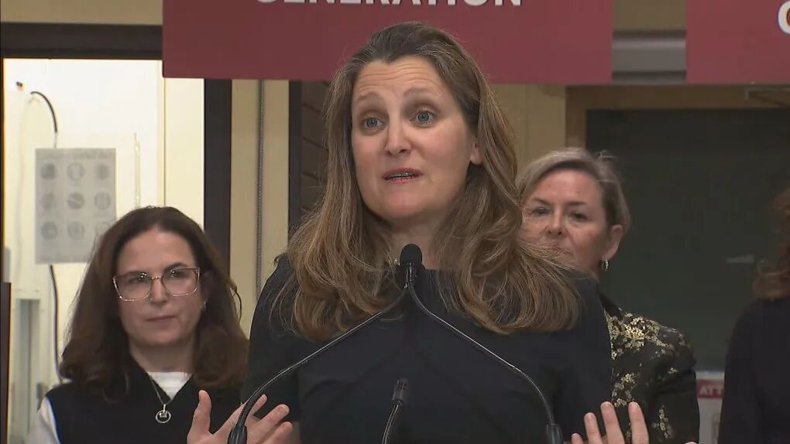
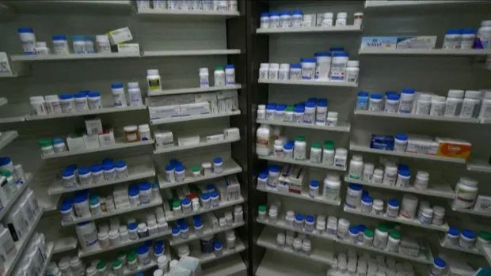

# 无标题

**链接地址:** http://mp.weixin.qq.com/s?__biz=MzAwMDE1NDk2MQ==&mid=2649916952&idx=2&sn=2e65603755cef792a255ebd77e9edff6&chksm=82eb6a26b59ce330d92fc912d85adcf42013abcd65f15eb22dd15a9e9e8a1e0d6d0670db1082&mpshare=1&scene=2&srcid=0402U6JA2I3fXzLUq3tS6SRm&sharer_shareinfo=71447e0baa753dc7a781a21285e8ab3d&sharer_shareinfo_first=71447e0baa753dc7a781a21285e8ab3d#rd
**作者:** 
**获取时间:** 2025/8/28 18:59:12
**图片数量:** 3

---

## 原始HTML内容

<section style="font-size: 16px;"><section style="line-height: 2;" powered-by="xiumi.us">
加拿大政府今天发表重大医疗改革的第一部分，宣布政府将全额负担女性避孕费用。
</section><section style=" text-align: center;margin-top: 0.5em;margin-bottom: 0.5em;padding-left: 0.5em;padding-right: 0.5em;  " powered-by="xiumi.us"><section style="width: 100%;border-width: 0.3em;border-style: solid;border-color: white;box-shadow: rgb(102, 102, 102) 0.2em 0.2em 0.5em;display: inline-block;line-height: 0;height: auto !important;"></section></section>
 
<section style="line-height: 2;" powered-by="xiumi.us">
加拿大副总理方慧兰（Chrystia Freeland）在多伦多一间药局举行记者会表示，政府将为900万生育年龄妇女支付最广泛使用的避孕方法，例如子宫内避孕器、避孕药、植入式避孕器以及事后避孕药。

 

加拿大总理杜鲁道（Justin Trudeau）在社群媒体X上表示：“女性应能自由选择她们需要的避孕工具，毋须受到成本的阻碍，因此，我们正在免费提供避孕工具。”

 

这项声明补强2月公布的法案的第一部分，该法案一旦完成，将标志着加拿大公共资助的医疗保健系统几十年来最大规模的扩张。

 

当第一阶段实施时，像避孕药片、荷尔蒙子宫内节育器（IUD）、避孕注射和植入器等处方避孕药将由联邦政府承担费用。 

 

目前，这些处方在加拿大每年的费用在150至300加元之间，或每单位约30至500加元。现在有超过900万加拿大人处于生育年龄，这是避孕药最常被使用的时期。

 

根据财政部发布的新闻稿，现有的医疗支出将在各省和地区得到加强，以支付全部费用。

 

“女性应该有权自主决定自己的健康和身体，” Freeland在来到她的University-Rosedale选区一家药房时表示。“我们的计划是让常见避孕药物免费，如避孕药片和IUD，甚至紧急避孕药。这意味着，对于900万加拿大女性来说，对自由的选择将真正‘免费’。这意味着更多加拿大女子将拥有对自己身体和生活的选择自由。”
</section><section style=" text-align: center;margin-top: 0.5em;margin-bottom: 0.5em;padding-left: 0.5em;padding-right: 0.5em;  " powered-by="xiumi.us"><section style="width: 100%;border-width: 0.3em;border-style: solid;border-color: white;box-shadow: rgb(102, 102, 102) 0.2em 0.2em 0.5em;display: inline-block;line-height: 0;height: auto !important;"></section></section><section style="line-height: 2;" powered-by="xiumi.us">
 

这项新制度还将支付约370万加拿大人的糖尿病药物费用。 

 

这项计划将在未来几年推出，届时将有更多药物被纳入其中。经济合作暨发展组织（OECD）最近使用2021年资料编纂的报告发现，加拿大人均药物支出高于除日本、德国和美国这3个成员国之外的所有成员国。

 

将被覆盖的糖尿病药物包括胰岛素、二甲双胍、磺脲类药物和SGLT-2抑制剂，这些药物每年的费用可能高达1700加元。不过糖尿病患者使用的医疗设备将不在覆盖范围内。

 

对于这个计划何时开始，Freeland并未提供具体日期，但表示她希望联邦政府能与各省合作实现这一目标。

 

“因此，我们致力于完成这项工作。我们将与我们的合作伙伴一同努力，我们相信这是加拿大人想要和需要的。”Freeland说道。“因此，我们的希望和信念是合作伙伴会加入我们。”

 

在被问及联邦政府将如何让所有省份和领土（负责卫生保健）支持并加入该计划时，Freeland指出联邦政府的儿童保育计划也存在类似担忧，并表示她相信所有政府都会希望达成共识。

 

“我们希望加拿大人过上美好的生活，能够负担得起美好的生活。我们希望加拿大人拥有并享受他们的全部人权，对于女性来说，这些避孕药物能够让生活更加负担得起。这是让女性掌控自己的身体和生活的关键。”

 

“这是非常基本和简单的。我相信基于这一基本事实，我们将能够找到一条与省份和领土合作的道路。”

 

在被问及该计划可能需要多少费用时，Freeland没有提供估算。她表示随着计划的推出，将逐步披露更多细节。
<section class="mp_profile_iframe_wrp"><mp-common-profile class="js_uneditable custom_select_card mp_profile_iframe" data-pluginname="mpprofile" data-id="MzAwMDE1NDk2MQ==" data-headimg="http://mmbiz.qpic.cn/mmbiz_png/n8gRzdiboyibNMhzzb6WlicwxmxzLMru3ibTmu5O2nyJ0tFQe1Jg8yAbmic2jibISwDo6UUOe4YyD081XaggicczP6ldg/0?wx_fmt=png" data-nickname="多伦多微生活" data-alias="wetoronto" data-signature="随性的小编，随性的多伦多微生活，等待随性的你到来......" data-from="0" data-is_biz_ban="0"></mp-common-profile></section>
 
</section></section>
 

<mp-style-type data-value="3"></mp-style-type>

---

## 纯文本内容

加拿大政府今天发表重大医疗改革的第一部分，宣布政府将全额负担女性避孕费用。加拿大副总理方慧兰（Chrystia Freeland）在多伦多一间药局举行记者会表示，政府将为900万生育年龄妇女支付最广泛使用的避孕方法，例如子宫内避孕器、避孕药、植入式避孕器以及事后避孕药。加拿大总理杜鲁道（Justin Trudeau）在社群媒体X上表示：“女性应能自由选择她们需要的避孕工具，毋须受到成本的阻碍，因此，我们正在免费提供避孕工具。”这项声明补强2月公布的法案的第一部分，该法案一旦完成，将标志着加拿大公共资助的医疗保健系统几十年来最大规模的扩张。当第一阶段实施时，像避孕药片、荷尔蒙子宫内节育器（IUD）、避孕注射和植入器等处方避孕药将由联邦政府承担费用。目前，这些处方在加拿大每年的费用在150至300加元之间，或每单位约30至500加元。现在有超过900万加拿大人处于生育年龄，这是避孕药最常被使用的时期。根据财政部发布的新闻稿，现有的医疗支出将在各省和地区得到加强，以支付全部费用。“女性应该有权自主决定自己的健康和身体，” Freeland在来到她的University-Rosedale选区一家药房时表示。“我们的计划是让常见避孕药物免费，如避孕药片和IUD，甚至紧急避孕药。这意味着，对于900万加拿大女性来说，对自由的选择将真正‘免费’。这意味着更多加拿大女子将拥有对自己身体和生活的选择自由。”这项新制度还将支付约370万加拿大人的糖尿病药物费用。这项计划将在未来几年推出，届时将有更多药物被纳入其中。经济合作暨发展组织（OECD）最近使用2021年资料编纂的报告发现，加拿大人均药物支出高于除日本、德国和美国这3个成员国之外的所有成员国。将被覆盖的糖尿病药物包括胰岛素、二甲双胍、磺脲类药物和SGLT-2抑制剂，这些药物每年的费用可能高达1700加元。不过糖尿病患者使用的医疗设备将不在覆盖范围内。对于这个计划何时开始，Freeland并未提供具体日期，但表示她希望联邦政府能与各省合作实现这一目标。“因此，我们致力于完成这项工作。我们将与我们的合作伙伴一同努力，我们相信这是加拿大人想要和需要的。”Freeland说道。“因此，我们的希望和信念是合作伙伴会加入我们。”在被问及联邦政府将如何让所有省份和领土（负责卫生保健）支持并加入该计划时，Freeland指出联邦政府的儿童保育计划也存在类似担忧，并表示她相信所有政府都会希望达成共识。“我们希望加拿大人过上美好的生活，能够负担得起美好的生活。我们希望加拿大人拥有并享受他们的全部人权，对于女性来说，这些避孕药物能够让生活更加负担得起。这是让女性掌控自己的身体和生活的关键。”“这是非常基本和简单的。我相信基于这一基本事实，我们将能够找到一条与省份和领土合作的道路。”在被问及该计划可能需要多少费用时，Freeland没有提供估算。她表示随着计划的推出，将逐步披露更多细节。

---

## 图片列表

-  (原始链接: https://mmbiz.qpic.cn/mmbiz_gif/n8gRzdiboyibPzt9ODKOFmL22Rvg9viaCH6w54xU1GOGxeek2KLBpBpicGCHtEh6u2xEficxBzHprwwmoPbaGkfG0sQ/640?wx_fmt=gif&wxfrom=5&wx_lazy=1&tp=webp)
-  (原始链接: https://mmbiz.qpic.cn/sz_mmbiz_jpg/n8gRzdiboyibNCZvtaSTe8nCLH8rNfI0QWvyXYT5Yia1VxWLWzOcqd7XpLCDiczZ91jh2rtgg6OY6RKX0Ov5yQosdg/640?wx_fmt=jpeg&from=appmsg)
-  (原始链接: https://mmbiz.qpic.cn/sz_mmbiz_jpg/n8gRzdiboyibNCZvtaSTe8nCLH8rNfI0QWyxrOGicSXPU4PeIVluibNLHOBhWbIpKBefPSenQeIiajghPKrfH9iaOJqA/640?wx_fmt=jpeg&from=appmsg)
