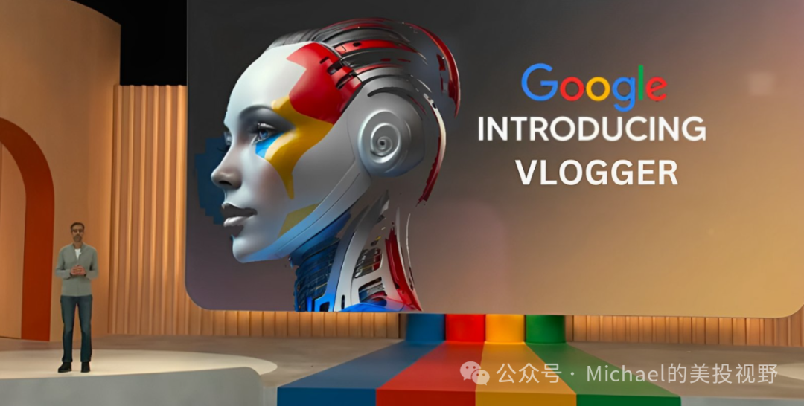

# 无标题

**链接地址:** http://mp.weixin.qq.com/s?__biz=MzkzMjY2MjY5OA==&mid=2247483919&idx=1&sn=c3007cdbb70e1591c3cd92642037e8fc&chksm=c2591ecaf52e97dcb02bd7917e5c7fa23cb6ba0a74aef00150441d50c9828922948550008b15&mpshare=1&scene=2&srcid=04034PghioMuoFM6jlZI6FjY&sharer_shareinfo=0b20b483453cf311525ac6c5e254f390&sharer_shareinfo_first=0b20b483453cf311525ac6c5e254f390#rd
**作者:** Michael
**获取时间:** 2025/8/28 18:59:05
**图片数量:** 1

---

## 原始HTML内容

<section style="max-width: 100%;box-sizing: border-box;" powered-by="xiumi.us"><section style="text-align: center;max-width: 100%;box-sizing: border-box;line-height: 1.75em;"><section style="max-width: 100%;vertical-align: middle;display: inline-block;line-height: 0;box-sizing: border-box;"></section></section></section><section style="max-width: 100%;box-sizing: border-box;" powered-by="xiumi.us"><section style="margin: 0px 0px 24px;text-indent: 0em;max-width: 100%;box-sizing: border-box;line-height: 1.75em;">近日，<strong>谷歌正式介绍了 VLOGGER ，一款基于人工智能技术的视频创作应用程序，旨在为创作者提供全新的视频制作和分享体验。</strong>VLOGGER 能够将静态照片转化为生动的动画视频，并支持视频翻译和智能剪辑等功能，为创作者带来了无限可能。</section></section><section style="margin: 0.5em 0px;box-sizing: border-box;" powered-by="xiumi.us"><section style="border-top: 2px solid rgb(6, 65, 107);padding-top: 3px;border-right-color: rgb(6, 65, 107);border-bottom-color: rgb(6, 65, 107);border-left-color: rgb(6, 65, 107);box-sizing: border-box;line-height: 1.75em;"><section style="display: inline-block;vertical-align: top;height: 2em;line-height: 2em;padding: 0px 0.5em;background-color: rgb(6, 65, 107);color: rgb(255, 255, 255);font-size: 17px;box-sizing: border-box;">
<strong style="box-sizing: border-box;">一、VLOGGER 的核心技术</strong>
</section><section style="width: 0px;display: inline-block;vertical-align: top;border-left: 0.8em solid rgb(6, 65, 107);border-top: 1em solid rgb(6, 65, 107);border-right: 0.8em solid transparent !important;border-bottom: 1em solid transparent !important;box-sizing: border-box;"><svg viewBox="0 0 1 1" style="float:left;line-height:0;width:0;vertical-align:top;"></svg></section></section></section><section style="max-width: 100%;box-sizing: border-box;" powered-by="xiumi.us"><section style="line-height: 1.6em;margin: 0px 0px 24px;text-indent: 0em;max-width: 100%;box-sizing: border-box;"><section style="white-space: normal;margin: 0px;padding: 0px;box-sizing: border-box;line-height: 1.75em;"><strong style="text-indent: 0em;font-size: var(--articleFontsize);letter-spacing: 0.034em;">1. AI 读唇术：</strong>根据音频预测说话者的唇部动作，生成自然逼真的动画效果; </section><section style="white-space: normal;margin: 0px;padding: 0px;box-sizing: border-box;line-height: 1.75em;"></section><section style="white-space: normal;margin: 0px;padding: 0px;box-sizing: border-box;line-height: 1.75em;"><strong>2. 自然头部倾斜和姿势：</strong>结合 AI 技术，模拟真实人物的头部倾斜和身体姿态，让动画更加生动；</section><section style="white-space: normal;margin: 0px;padding: 0px;box-sizing: border-box;line-height: 1.75em;"><strong>3. 动画制作器：</strong>根据照片和动作细节，预测推理未来动作，并自动生成高质量的视频帧。</section></section></section><section style="margin: 0.5em 0px;box-sizing: border-box;" powered-by="xiumi.us"><section style="border-top: 2px solid rgb(6, 65, 107);padding-top: 3px;border-right-color: rgb(6, 65, 107);border-bottom-color: rgb(6, 65, 107);border-left-color: rgb(6, 65, 107);box-sizing: border-box;line-height: 1.75em;"><section style="display: inline-block;vertical-align: top;height: 2em;line-height: 2em;padding: 0px 0.5em;background-color: rgb(6, 65, 107);color: rgb(255, 255, 255);font-size: 17px;box-sizing: border-box;">
<strong style="box-sizing: border-box;">二、VLOGGER 的主要功能</strong>
</section><section style="width: 0px;display: inline-block;vertical-align: top;border-left: 0.8em solid rgb(6, 65, 107);border-top: 1em solid rgb(6, 65, 107);border-right: 0.8em solid transparent !important;border-bottom: 1em solid transparent !important;box-sizing: border-box;"><svg viewBox="0 0 1 1" style="float:left;line-height:0;width:0;vertical-align:top;"></svg></section></section></section><section style="max-width: 100%;box-sizing: border-box;" powered-by="xiumi.us"><section style="line-height: 1.6em;margin: 0px 0px 24px;text-indent: 0em;max-width: 100%;box-sizing: border-box;"><section style="white-space: normal;margin: 0px;padding: 0px;box-sizing: border-box;line-height: 1.75em;"><strong style="text-indent: 0em;font-size: var(--articleFontsize);letter-spacing: 0.034em;">1. 图像转视频：</strong>将单张或多张照片导入 VLOGGER，即可生成逼真的动画视频，并可自定义角色的表情、动作和场景。 </section><section style="white-space: normal;margin: 0px;padding: 0px;box-sizing: border-box;line-height: 1.75em;"></section></section></section><section style="line-height: 1.75em;"><iframe class="video_iframe rich_pages" data-vidtype="2" data-mpvid="wxv_3396797967574089731" data-cover="http%3A%2F%2Fmmbiz.qpic.cn%2Fsz_mmbiz_jpg%2FZ0gFKu2Y5XnqXzKVYyQia0H2JFuIUpzQJQ0CWKpz4NLpf7vj5h7g7pSWXeWXJfVt29HQ4kgathuWtny4F1UZN2w%2F0%3Fwx_fmt%3Djpeg" allowfullscreen="" frameborder="" data-ratio="1.87109375" data-w="1916" style="border-radius: 4px;" data-src="https://mp.weixin.qq.com/mp/readtemplate?t=pages/video_player_tmpl&amp;action=mpvideo&amp;auto=0&amp;vid=wxv_3396797967574089731"></iframe><section style="display: contents;box-sizing: border-box;" powered-by="xiumi.us"><section style="display: contents;box-sizing: border-box;"><section style="display: contents;box-sizing: border-box;"><section style="line-height: 1.6em;margin: 0px 0px 24px;text-indent: 0em;max-width: 100%;box-sizing: border-box;"></section></section></section></section></section><section style="max-width: 100%;box-sizing: border-box;" powered-by="xiumi.us"><section style="margin: 0px 0px 24px;text-indent: 0em;max-width: 100%;box-sizing: border-box;line-height: 1.75em;"><strong>2. 视频翻译：</strong>支持多种语言的实时翻译，并自动调整说话者的嘴部动作，让您无障碍观看来自世界各地的视频内容。<strong>PS：以后追美剧或者韩剧不用再看字幕了。</strong></section></section><section style="line-height: 1.75em;"><iframe class="video_iframe rich_pages" data-vidtype="2" data-mpvid="wxv_3396801488725852169" data-cover="http%3A%2F%2Fmmbiz.qpic.cn%2Fsz_mmbiz_jpg%2FZ0gFKu2Y5XnqXzKVYyQia0H2JFuIUpzQJNLLZ1vLIRbibfVmxGMbCPJicbwptlRKlMepiaFq7NjrFtS3z6oPYNHDNQ%2F0%3Fwx_fmt%3Djpeg" allowfullscreen="" frameborder="" data-ratio="1.8423076923076922" data-w="1916" style="border-radius: 4px;" data-src="https://mp.weixin.qq.com/mp/readtemplate?t=pages/video_player_tmpl&amp;action=mpvideo&amp;auto=0&amp;vid=wxv_3396801488725852169"></iframe><section style="display: contents;box-sizing: border-box;" powered-by="xiumi.us"><section style="display: contents;box-sizing: border-box;"><section style="display: contents;box-sizing: border-box;"><section style="line-height: 1.6em;margin: 0px 0px 24px;text-indent: 0em;max-width: 100%;box-sizing: border-box;"></section></section></section></section></section><section style="max-width: 100%;box-sizing: border-box;" powered-by="xiumi.us"><section style="margin: 0px 0px 24px;text-indent: 0em;max-width: 100%;box-sizing: border-box;line-height: 1.75em;"><strong>3. 视频剪辑：</strong>提供丰富的剪辑工具，支持画面裁剪、拼接、转场、添加字幕等功能，让您轻松打造创意视频。</section></section><section style="line-height: 1.75em;"><iframe class="video_iframe rich_pages" data-vidtype="2" data-mpvid="wxv_3396802676049428489" data-cover="http%3A%2F%2Fmmbiz.qpic.cn%2Fsz_mmbiz_jpg%2FZ0gFKu2Y5XnqXzKVYyQia0H2JFuIUpzQJEz8Y0k6AWeXy65F5gH3nBrOBDXcK6lrjMlZMmcZqQ9TiaFCXiceLTvww%2F0%3Fwx_fmt%3Djpeg" allowfullscreen="" frameborder="" data-ratio="1.8381502890173411" data-w="1908" style="border-radius: 4px;" data-src="https://mp.weixin.qq.com/mp/readtemplate?t=pages/video_player_tmpl&amp;action=mpvideo&amp;auto=0&amp;vid=wxv_3396802676049428489"></iframe></section><section style="margin: 0.5em 0px;box-sizing: border-box;" powered-by="xiumi.us"><section style="border-top: 2px solid rgb(6, 65, 107);padding-top: 3px;border-right-color: rgb(6, 65, 107);border-bottom-color: rgb(6, 65, 107);border-left-color: rgb(6, 65, 107);box-sizing: border-box;line-height: 1.75em;"><section style="display: inline-block;vertical-align: top;height: 2em;line-height: 2em;padding: 0px 0.5em;background-color: rgb(6, 65, 107);color: rgb(255, 255, 255);font-size: 17px;box-sizing: border-box;">
<strong style="box-sizing: border-box;">三、VLOGGER 的潜在应用</strong>
</section><section style="width: 0px;display: inline-block;vertical-align: top;border-left: 0.8em solid rgb(6, 65, 107);border-top: 1em solid rgb(6, 65, 107);border-right: 0.8em solid transparent !important;border-bottom: 1em solid transparent !important;box-sizing: border-box;"><svg viewBox="0 0 1 1" style="float:left;line-height:0;width:0;vertical-align:top;"></svg></section></section></section><section style="max-width: 100%;box-sizing: border-box;" powered-by="xiumi.us"><section style="line-height: 1.6em;margin: 0px 0px 24px;text-indent: 0em;max-width: 100%;box-sizing: border-box;"><section style="white-space: normal;margin: 0px;padding: 0px;box-sizing: border-box;line-height: 1.75em;"><strong style="text-indent: 0em;font-size: var(--articleFontsize);letter-spacing: 0.034em;">1. 漫画创作</strong>：VLOGGER 可以替代传统的动画制作流程，大幅提高漫画创作者的效率。作为动漫迷，通过该工具将原作者的漫画录入后，是否可以自制些小动画了，这里可以期待下！ </section><section style="white-space: normal;margin: 0px;padding: 0px;box-sizing: border-box;line-height: 1.75em;"></section><section style="white-space: normal;margin: 0px;padding: 0px;box-sizing: border-box;line-height: 1.75em;"><strong>2. 教育培训</strong>：将教学内容转化为生动的动画视频，可以提升学生的学习兴趣和效率。</section><section style="white-space: normal;margin: 0px;padding: 0px;box-sizing: border-box;line-height: 1.75em;"><strong>3. 虚拟偶像：</strong>虚拟偶像制作个性化的视频，打造更加丰富的互动体验。甚至，脑洞一下是否还可以安抚一下人们对不在身边的人的思念。</section><section style="white-space: normal;margin: 0px;padding: 0px;box-sizing: border-box;line-height: 1.75em;"><strong>4. 跨语言交流：</strong>打破语言障碍，让您与世界各地的人轻松沟通。</section></section></section><section style="margin: 0.5em 0px;box-sizing: border-box;" powered-by="xiumi.us"><section style="border-top: 2px solid rgb(6, 65, 107);padding-top: 3px;border-right-color: rgb(6, 65, 107);border-bottom-color: rgb(6, 65, 107);border-left-color: rgb(6, 65, 107);box-sizing: border-box;line-height: 1.75em;"><section style="display: inline-block;vertical-align: top;height: 2em;line-height: 2em;padding: 0px 0.5em;background-color: rgb(6, 65, 107);color: rgb(255, 255, 255);font-size: 17px;box-sizing: border-box;">
<strong style="box-sizing: border-box;">四、未来展望</strong>
</section><section style="width: 0px;display: inline-block;vertical-align: top;border-left: 0.8em solid rgb(6, 65, 107);border-top: 1em solid rgb(6, 65, 107);border-right: 0.8em solid transparent !important;border-bottom: 1em solid transparent !important;box-sizing: border-box;"><svg viewBox="0 0 1 1" style="float:left;line-height:0;width:0;vertical-align:top;"></svg></section></section></section><section style="max-width: 100%;box-sizing: border-box;" powered-by="xiumi.us"><section style="line-height: 1.6em;margin: 0px 0px 24px;text-indent: 0em;max-width: 100%;box-sizing: border-box;"><section powered-by="xiumi.us" style="margin-bottom: 0px;letter-spacing: 0.578px;text-wrap: wrap;"><section style="margin-bottom: 24px;line-height: 1.6em;text-indent: 0em;"><section style="line-height: 1.75em;"><strong>目前，VLOGGER 仍处于研究阶段，尚未正式发布。</strong>不过，它的出现无疑为视频创作带来了革命性的变革，将开启全新的创作时代。</section></section></section><section style="margin-bottom: 0px;letter-spacing: 0.578px;text-wrap: wrap;line-height: 1.75em;"><section powered-by="xiumi.us" style="display: contents;"><section style="display: contents;"><section style="display: contents;"><section style="margin-bottom: 24px;line-height: 1.6em;text-indent: 0em;"></section></section></section></section></section><section style="margin: 0px;white-space: normal;padding: 0px;box-sizing: border-box;line-height: 1.75em;">随着人工智能技术的不断发展，VLOGGER 的发布，标志着视频创作迈入了新的时代。它将为创作者提供更加便捷、高效的创作工具，帮助他们打破想象力的边界，创作更加精彩纷呈的视频作品。</section><section style="margin: 0px;white-space: normal;padding: 0px;box-sizing: border-box;line-height: 1.75em;"> </section><section style="margin: 0px;white-space: normal;padding: 0px;box-sizing: border-box;line-height: 1.75em;"><em>备注：以上视频来源：原作者 @hey_madni</em></section></section></section><section style="max-width: 100%;box-sizing: border-box;" powered-by="xiumi.us"><section style="line-height: 1.6em;margin: 0px 0px 24px;text-indent: 0em;max-width: 100%;box-sizing: border-box;"><section powered-by="xiumi.us" style="margin-bottom: 0px;outline: 0px;font-family: system-ui, -apple-system, BlinkMacSystemFont, &quot;Helvetica Neue&quot;, &quot;PingFang SC&quot;, &quot;Hiragino Sans GB&quot;, &quot;Microsoft YaHei UI&quot;, &quot;Microsoft YaHei&quot;, Arial, sans-serif;letter-spacing: 0.544px;text-wrap: wrap;background-color: rgb(255, 255, 255);"><section style="outline: 0px;text-align: unset;">
<section style="outline: 0px;line-height: 1.75em;"><strong style="outline: 0px;font-size: 16px;text-indent: 0em;letter-spacing: 0.034em;"></strong></section><section style="outline: 0px;line-height: 1.75em;text-align: left;"><strong style="outline: 0px;font-size: 16px;text-indent: 0em;letter-spacing: 0.034em;"><strong style="outline: 0px;color: rgb(6, 65, 107);font-size: 16px;letter-spacing: 0.578px;">声明：本篇分享仅个人观点，不构成为任何投资建议，市场有风险，投资须谨慎！<strong style="outline: 0px;">关注我，专注美股，分享有价值讯息、交易及见闻！</strong></strong></strong></section></section></section><section powered-by="xiumi.us" style="margin-bottom: 0px;outline: 0px;font-family: system-ui, -apple-system, BlinkMacSystemFont, &quot;Helvetica Neue&quot;, &quot;PingFang SC&quot;, &quot;Hiragino Sans GB&quot;, &quot;Microsoft YaHei UI&quot;, &quot;Microsoft YaHei&quot;, Arial, sans-serif;letter-spacing: 0.544px;text-wrap: wrap;background-color: rgb(255, 255, 255);font-size: 16px;"><section style="margin-bottom: 24px;outline: 0px;line-height: 1.6em;text-indent: 0em;"><section class="mp_profile_iframe_wrp"><mp-common-profile class="js_uneditable custom_select_card mp_profile_iframe" data-pluginname="mpprofile" data-id="MzkzMjY2MjY5OA==" data-headimg="http://mmbiz.qpic.cn/sz_mmbiz_png/Z0gFKu2Y5Xmbt0gBsWbib3eAoqY8su0uHJiciaDsDk7KZMXJ1icudeP3rhqrK6gZibFyvV0j2fkC7jRUomj5KtjjtmA/0?wx_fmt=png" data-nickname="Michael的美投视野" data-alias="SPY-Invest2024" data-signature="专注美股，分享有价值讯息、交易及见闻。" data-from="1" data-is_biz_ban="0"></mp-common-profile></section></section></section></section></section>
<mp-style-type data-value="10000"></mp-style-type>

---

## 纯文本内容

近日，谷歌正式介绍了 VLOGGER ，一款基于人工智能技术的视频创作应用程序，旨在为创作者提供全新的视频制作和分享体验。VLOGGER 能够将静态照片转化为生动的动画视频，并支持视频翻译和智能剪辑等功能，为创作者带来了无限可能。一、VLOGGER 的核心技术1. AI 读唇术：根据音频预测说话者的唇部动作，生成自然逼真的动画效果;2. 自然头部倾斜和姿势：结合 AI 技术，模拟真实人物的头部倾斜和身体姿态，让动画更加生动；3. 动画制作器：根据照片和动作细节，预测推理未来动作，并自动生成高质量的视频帧。二、VLOGGER 的主要功能1. 图像转视频：将单张或多张照片导入 VLOGGER，即可生成逼真的动画视频，并可自定义角色的表情、动作和场景。2. 视频翻译：支持多种语言的实时翻译，并自动调整说话者的嘴部动作，让您无障碍观看来自世界各地的视频内容。PS：以后追美剧或者韩剧不用再看字幕了。3. 视频剪辑：提供丰富的剪辑工具，支持画面裁剪、拼接、转场、添加字幕等功能，让您轻松打造创意视频。三、VLOGGER 的潜在应用1. 漫画创作：VLOGGER 可以替代传统的动画制作流程，大幅提高漫画创作者的效率。作为动漫迷，通过该工具将原作者的漫画录入后，是否可以自制些小动画了，这里可以期待下！2. 教育培训：将教学内容转化为生动的动画视频，可以提升学生的学习兴趣和效率。3. 虚拟偶像：虚拟偶像制作个性化的视频，打造更加丰富的互动体验。甚至，脑洞一下是否还可以安抚一下人们对不在身边的人的思念。4. 跨语言交流：打破语言障碍，让您与世界各地的人轻松沟通。四、未来展望目前，VLOGGER 仍处于研究阶段，尚未正式发布。不过，它的出现无疑为视频创作带来了革命性的变革，将开启全新的创作时代。随着人工智能技术的不断发展，VLOGGER 的发布，标志着视频创作迈入了新的时代。它将为创作者提供更加便捷、高效的创作工具，帮助他们打破想象力的边界，创作更加精彩纷呈的视频作品。备注：以上视频来源：原作者 @hey_madni声明：本篇分享仅个人观点，不构成为任何投资建议，市场有风险，投资须谨慎！关注我，专注美股，分享有价值讯息、交易及见闻！

---

## 图片列表

-  (原始链接: https://mmbiz.qpic.cn/sz_mmbiz_png/Z0gFKu2Y5XnqXzKVYyQia0H2JFuIUpzQJB3dDhKy4soCpK5Pv8IlUbARu2446jE7Ds599FPSnWcpguibKicqw1fZg/640?wx_fmt=png)
