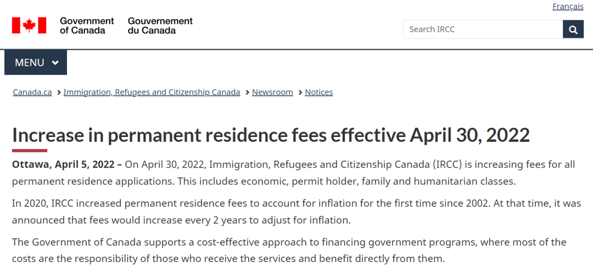
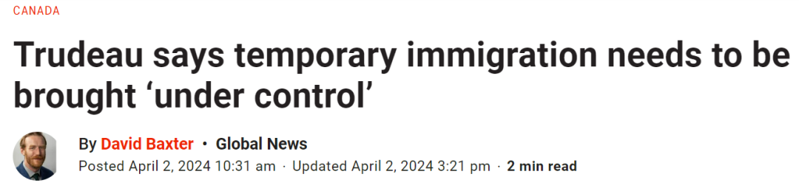
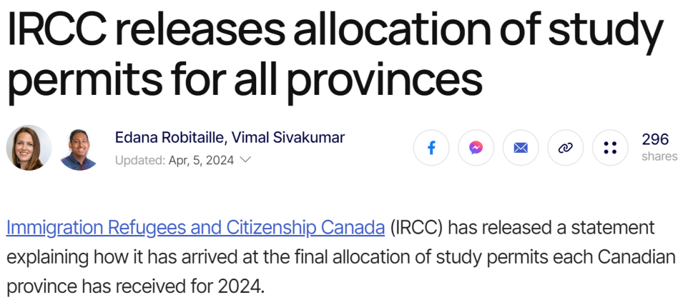
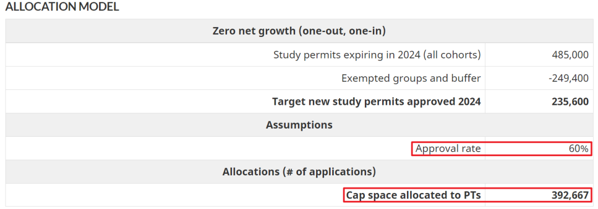
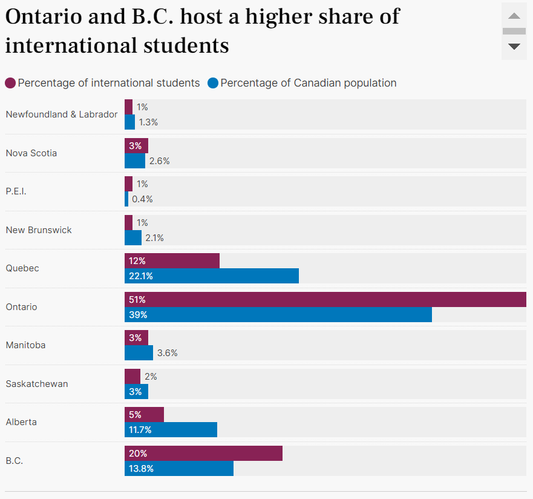
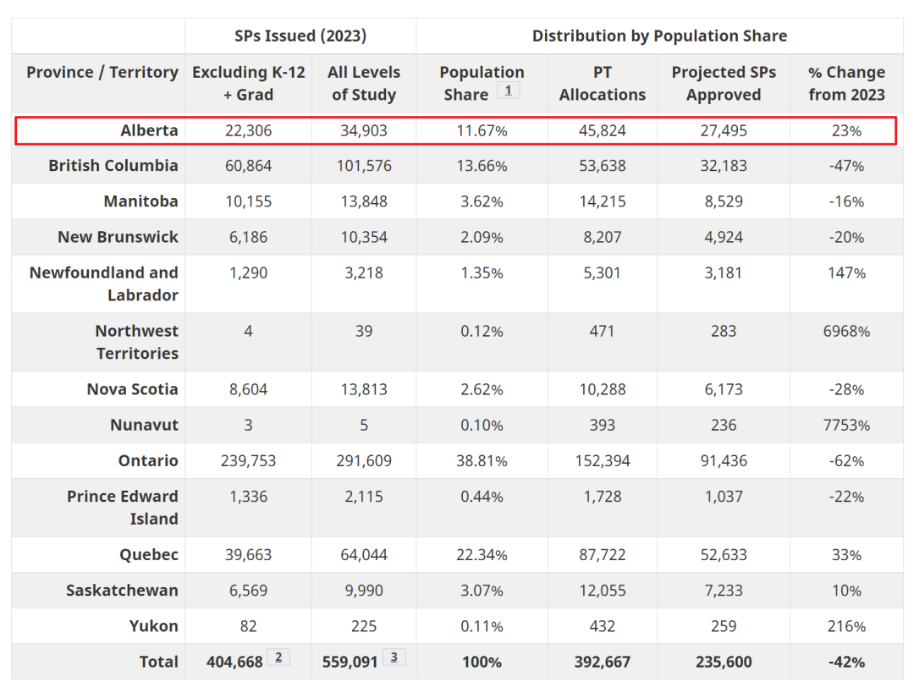
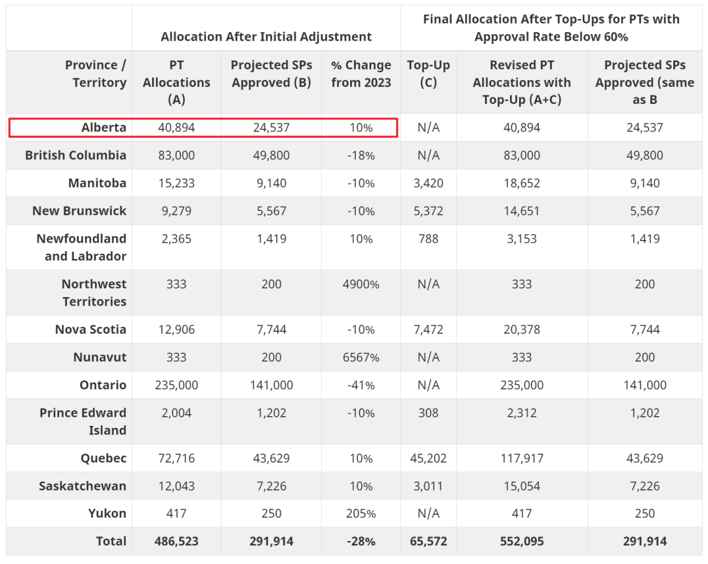
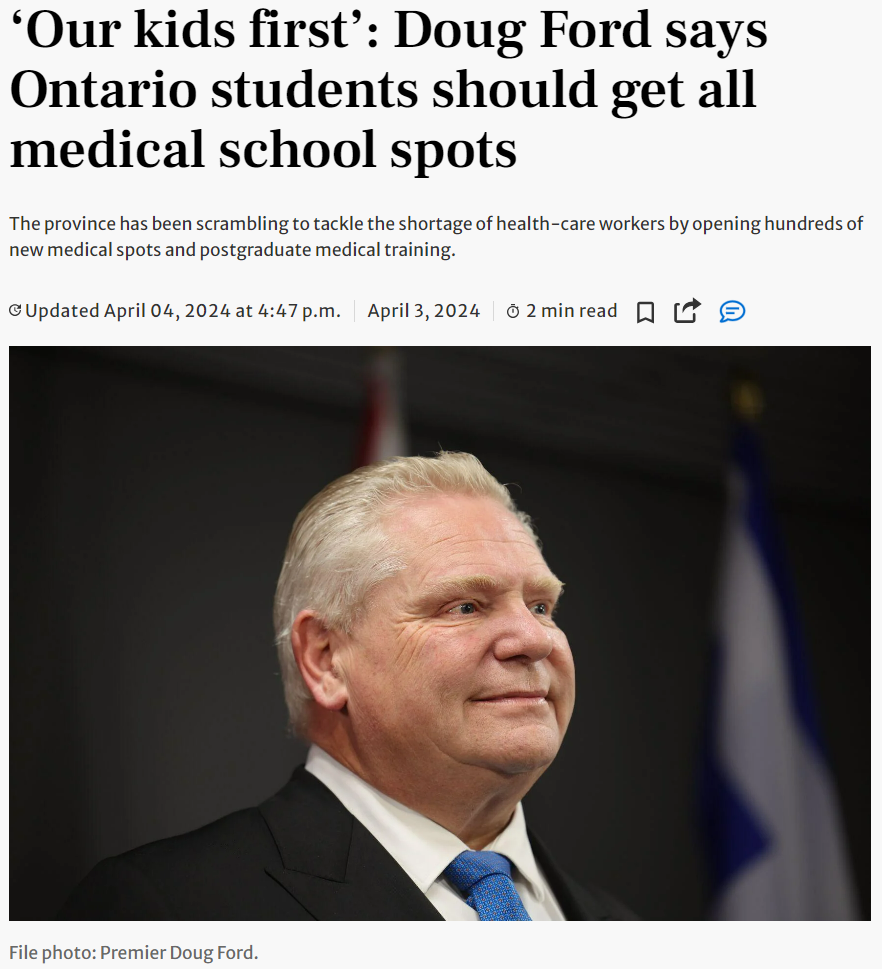

# 无标题

**链接地址:** http://mp.weixin.qq.com/s?__biz=MzUyNzA2NTAwNg==&mid=2247498208&idx=1&sn=7ab1c2759048b4fc09d46dc3c0d8f53a&chksm=fa07f321cd707a377b12f0f6b972195b9f5f5cd431cedff4bd1b6e22a09ce7030cf58b10502c&mpshare=1&scene=2&srcid=0407tnGujVxZWQIFHqulC3Dl&sharer_shareinfo=de569f418887d86ea3b9f381fb1fb68b&sharer_shareinfo_first=de569f418887d86ea3b9f381fb1fb68b#rd
**作者:** 你身边的签证专家
**获取时间:** 2025/8/28 18:58:47
**图片数量:** 22

---

## 原始HTML内容

<section style="font-size: 16px;"><section style="text-align: center;margin-top: 10px;margin-bottom: 10px;line-height: 0;" powered-by="xiumi.us"><section style="vertical-align: middle;display: inline-block;line-height: 0;"></section></section><section style="text-align: center;margin-top: 10px;margin-bottom: 10px;line-height: 0;" powered-by="xiumi.us"><section style="vertical-align: middle;display: inline-block;line-height: 0;"></section></section><section style="text-align: center;margin-top: 10px;margin-bottom: 10px;line-height: 0;" powered-by="xiumi.us"><section style="vertical-align: middle;display: inline-block;line-height: 0;"></section></section>
 
<section style="font-size: 19px;text-align: center;margin-top: 10px;margin-bottom: 3px;" powered-by="xiumi.us"><section style="display: inline-block;border-width: 1px;border-style: solid;border-color: rgb(188, 65, 65);background-color: rgb(188, 65, 65);width: 1.8em;height: 1.8em;line-height: 1.8em;border-radius: 100%;margin-left: auto;margin-right: auto;font-size: 16px;color: rgb(255, 255, 255);">
<strong>1</strong>
</section></section><section style="text-align: center;" powered-by="xiumi.us"><section style="display: inline-block;width: 0px;height: 0px;vertical-align: top;overflow: hidden;border-style: solid;border-width: 9px 6px 0px;border-color: rgb(188, 65, 65) rgba(255, 255, 255, 0) rgba(255, 255, 255, 0);"><svg viewBox="0 0 1 1" style="float:left;line-height:0;width:0;vertical-align:top;"></svg></section></section><section style="margin-bottom: 10px;text-align: center;justify-content: center;display: flex;flex-flow: row;" powered-by="xiumi.us"><section style="display: inline-block;width: auto;vertical-align: middle;background-color: rgba(109, 155, 209, 0.1);min-width: 10%;flex: 0 0 auto;height: auto;align-self: center;padding: 12px;"><section style="color: rgb(109, 155, 209);text-align: justify;" powered-by="xiumi.us">
<strong>加拿大所有签证移民项目大提价</strong> 
</section></section></section><section style="font-size: 14px;padding-right: 15px;padding-left: 15px;letter-spacing: 1px;" powered-by="xiumi.us">
 

加拿大联邦政府自2024年开年以来，对于临时居民和新移民群体的限制肉眼可见地开始进一步收缩。据报道：从下个月开始，申请获得加拿大永久居留权的费用会<strong>变得更加昂贵</strong>。<strong>普遍加价幅度超过10%</strong>！

 
</section><section style="text-align: center;margin-top: 10px;margin-bottom: 10px;line-height: 0;" powered-by="xiumi.us"><section style="vertical-align: middle;display: inline-block;line-height: 0;width: 90%;height: auto;"></section></section><section style="font-size: 14px;padding-right: 15px;padding-left: 15px;letter-spacing: 1px;" powered-by="xiumi.us">
 

加拿大移民、难民和公民部（IRCC）近日宣布<strong>全面提高永久居留（PR）和各类签证的申请费用</strong>，自东部时间<strong>2024年4月30日上午9点起生效</strong>。

 

以下是2024年4月至2026年3月期间适用的费用变更详情： 

 

<strong>永久居留权费用</strong>

主申请人和随行配偶或同居伴侣：$575加元（之前为$515加元） 

 

<strong>联邦技术工人、省提名计划、魁北克技术工人、大西洋移民和大多数经济试点（农村、农业食品）</strong>

主申请人：$950加元（之前为$850加元） 

随行配偶或同居伴侣：$950加元（之前为$850加元） 

随行受抚养子女：$260加元（之前为$230加元） 

 

<strong>住家看护计划和看护者试点（家庭儿童看护者试点）</strong>

主申请人：$635加元（之前为$570加元） 

随行配偶或同居伴侣：$635加元（之前为$570加元） 

随行受抚养子女：$175加元（之前为$155加元） 

 

<strong>商业移民计划（联邦和魁省）</strong> 

主申请人：$1810加元（之前为$1625加元） 

随行配偶或同居伴侣：$950加元（之前为$850加元） 

随行受抚养子女：$260加元（之前为$230加元） 

 

<strong>家庭团聚移民（配偶、伴侣和子女；父母和祖父母；以及其他亲属）</strong>

赞助费：$85加元（之前为$75加元） 

赞助主申请人：$545加元（之前为$490加元） 

受资助子女（22岁以下的主申请人且非配偶/伴侣）：$85加元（之前为$75加元）

随行配偶或同居伴侣：$635加元（之前为$570加元）

随行受抚养子女：$175加元（之前为$155加元） 

 

<strong>受保护人士</strong> 

主申请人：$635加元（之前为$570加元） 

随行配偶或同居伴侣：$635加元（之前为$570加元） 

随行受抚养子女：$175加元（之前为$155加元） 

 

<strong>人道主义移民</strong> 

主申请人：$635加元（之前为$570加元） 

随行配偶或同居伴侣：$635加元（之前为$570加元） 

随行受抚养子女：$175加元（之前为$155加元） 

 

<strong>签证持有者</strong> 

主申请人：$375加元（之前为$335加元） 

IRCC表示，新的费用是根据加拿大统计局公布的前两年（2022年和2023年）加拿大消费者物价指数累计上涨的百分比确定的。 
</section>
 
<section style="margin: 10px 0%;text-align: left;justify-content: flex-start;display: flex;flex-flow: row;" powered-by="xiumi.us"><section style="display: inline-block;width: 100%;vertical-align: top;background-color: rgb(216, 202, 160);line-height: 0;align-self: flex-start;flex: 0 0 auto;"><section style="text-align: justify;justify-content: flex-start;display: flex;flex-flow: row;" powered-by="xiumi.us"><section style="display: inline-block;width: 100%;vertical-align: top;background-position: 0% 0%;background-repeat: repeat;background-size: 1.56658%;background-attachment: scroll;align-self: flex-start;flex: 0 0 auto;background-image: url(&quot;https://mmbiz.qpic.cn/mmbiz_png/904kUibXm7Y6GBuaVYZsFkQxE8y4ZKSIQKQwq62clNHj4yKpaibvoOKLOicMQ24QyWJv3bKI3sOI63vkib2PztEJPA/640?wx_fmt=png&amp;from=appmsg&quot;);"><section style="text-align: center;" powered-by="xiumi.us"><section style="display: inline-block;width: 100%;height: 11px;vertical-align: top;overflow: hidden;background-color: rgba(255, 255, 255, 0);"><svg viewBox="0 0 1 1" style="float:left;line-height:0;width:0;vertical-align:top;"></svg></section></section></section></section></section></section><section style="font-size: 14px;padding-right: 15px;padding-left: 15px;letter-spacing: 1px;" powered-by="xiumi.us">
 

2023年年底开始，加拿大政府开始意识到人口增长对加国本地经济和社会带来的<strong>一系列挑战</strong>，希望控制进入加国的临时移民人数。“无论是临时外国工人，还是国际学生，他们的人数增长速度都远远超过了加拿大的吸收能力。” 
</section>
 

 
<section style="font-size: 19px;text-align: center;margin-top: 10px;margin-bottom: 3px;" powered-by="xiumi.us"><section style="display: inline-block;border-width: 1px;border-style: solid;border-color: rgb(188, 65, 65);background-color: rgb(188, 65, 65);width: 1.8em;height: 1.8em;line-height: 1.8em;border-radius: 100%;margin-left: auto;margin-right: auto;font-size: 16px;color: rgb(255, 255, 255);">
<strong>2</strong>
</section></section><section style="text-align: center;" powered-by="xiumi.us"><section style="display: inline-block;width: 0px;height: 0px;vertical-align: top;overflow: hidden;border-style: solid;border-width: 9px 6px 0px;border-color: rgb(188, 65, 65) rgba(255, 255, 255, 0) rgba(255, 255, 255, 0);"><svg viewBox="0 0 1 1" style="float:left;line-height:0;width:0;vertical-align:top;"></svg></section></section><section style="margin-bottom: 10px;text-align: center;justify-content: center;display: flex;flex-flow: row;" powered-by="xiumi.us"><section style="display: inline-block;width: auto;vertical-align: middle;background-color: rgba(109, 155, 209, 0.1);min-width: 10%;flex: 0 0 auto;height: auto;align-self: center;padding: 12px;"><section style="color: rgb(109, 155, 209);text-align: justify;" powered-by="xiumi.us">
<strong>特鲁多表示必须控制临时居民数量</strong> 
</section></section></section><section style="font-size: 14px;padding-right: 15px;padding-left: 15px;letter-spacing: 1px;" powered-by="xiumi.us">
 

特鲁多表示：“举例而言，2017年，加拿大2%的人口是临时移民。现在我们有7.5%的人口是临时移民。<strong>这是我们需要控制的。</strong>”

 

他补充说：这也是为他们好，因为我们看到国际学生更易受到心理健康的挑战，越来越多的企业<strong>过分依赖临时外国工人</strong>，导致一些行业的工资下降。 

 
</section><section style="text-align: center;margin-top: 10px;margin-bottom: 10px;line-height: 0;" powered-by="xiumi.us"><section style="vertical-align: middle;display: inline-block;line-height: 0;width: 90%;height: auto;"></section></section><section style="text-align: center;margin-top: 10px;margin-bottom: 10px;line-height: 0;" powered-by="xiumi.us"><section style="vertical-align: middle;display: inline-block;line-height: 0;width: 90%;height: auto;"></section></section><section style="font-size: 14px;padding-right: 15px;padding-left: 15px;letter-spacing: 1px;" powered-by="xiumi.us">
 

他表示：“我们想把这些数字降下来。这是一种<strong>负责任的移民方式</strong>，继续接收永久居民，就像我们所做的那样，但对临时移民有更多的控制，因为临时移民给我们的社区带来了太大的压力。”

 

加拿大移民部长马克·米勒3月21日表示，渥太华将为获准进入加拿大的临时居民设定指标，<strong>确保入境的临时居民人数“可持续”增长</strong>。部长说，未来三年将临时居民人数<strong>减少到加拿大人口的5%</strong>。

 

对于永久居民，加拿大的新移民指标是今年48.5万，2025年和2026年将增加到每年50万。

 

在最近一次移民计划更新中，政府表示有计划“重新调整”加拿大临时入境人数，以确保移民系统的可持续性。今年1月，米勒已宣布加拿大的学生签证配额上限为36万，<strong>比2023年减少35%</strong>。 

 

 
</section><section style="font-size: 19px;text-align: center;margin-top: 10px;margin-bottom: 3px;" powered-by="xiumi.us"><section style="display: inline-block;border-width: 1px;border-style: solid;border-color: rgb(188, 65, 65);background-color: rgb(188, 65, 65);width: 1.8em;height: 1.8em;line-height: 1.8em;border-radius: 100%;margin-left: auto;margin-right: auto;font-size: 16px;color: rgb(255, 255, 255);">
<strong>3</strong>
</section></section><section style="text-align: center;" powered-by="xiumi.us"><section style="display: inline-block;width: 0px;height: 0px;vertical-align: top;overflow: hidden;border-style: solid;border-width: 9px 6px 0px;border-color: rgb(188, 65, 65) rgba(255, 255, 255, 0) rgba(255, 255, 255, 0);"><svg viewBox="0 0 1 1" style="float:left;line-height:0;width:0;vertical-align:top;"></svg></section></section><section style="margin-bottom: 10px;text-align: center;justify-content: center;display: flex;flex-flow: row;" powered-by="xiumi.us"><section style="display: inline-block;width: auto;vertical-align: middle;background-color: rgba(109, 155, 209, 0.1);min-width: 10%;flex: 0 0 auto;height: auto;align-self: center;padding: 12px;"><section style="color: rgb(109, 155, 209);text-align: justify;" powered-by="xiumi.us">
<strong>移民部公布2024学签分配方案</strong> 
</section></section></section><section style="font-size: 14px;padding-right: 15px;padding-left: 15px;letter-spacing: 1px;" powered-by="xiumi.us">
 

加拿大联邦移民部4月5日公布关于各省/地区的留学生配额分配方案，安省2024年预计只有9.1万个名额，<strong>比去年24万减少62%</strong>。

 

加拿大移民部长马克·米勒（Marc Miller）周五宣布，2024 年各省/地区的留学生配额现已最终确定，加拿大将<strong>第一年实现净零增长的模型</strong>。

 
</section><section style="text-align: center;margin-top: 10px;margin-bottom: 10px;line-height: 0;" powered-by="xiumi.us"><section style="vertical-align: middle;display: inline-block;line-height: 0;width: 90%;height: auto;"></section></section><section style="text-align: center;margin-top: 10px;margin-bottom: 10px;line-height: 0;" powered-by="xiumi.us"><section style="vertical-align: middle;display: inline-block;line-height: 0;width: 90%;height: auto;"></section></section><section style="font-size: 14px;padding-right: 15px;padding-left: 15px;letter-spacing: 1px;" powered-by="xiumi.us">
 

米勒部长说：“加拿大全国留学生上限是<strong>根据今年到期的学生签证数量而定的</strong>。这意味着2024年新来加拿大留学生人数应该与今年学签到期的学生人数相同。移民部2024年原本的目标是批准485,000个学生签证。”

 

但是，由于“每年约有20%的留学生申请延期并留在加拿大。因此，移民部从485,000份目标中减去了这一数额（97,000 份），并留出<strong>一小部分缓冲以允许其他变化</strong>，最终将2024年批准的学生签证目标<strong>修订为364,000份</strong>。”

 
</section><section style="text-align: center;margin-top: 10px;margin-bottom: 10px;line-height: 0;" powered-by="xiumi.us"><section style="vertical-align: middle;display: inline-block;line-height: 0;width: 90%;height: auto;"></section></section><section style="font-size: 14px;padding-right: 15px;padding-left: 15px;letter-spacing: 1px;" powered-by="xiumi.us">
 

“由于<strong>加拿大学签申请的批准率为60%</strong>，所以批准364,000份学习签证的目标意味着，2024年<strong>收到学签申请上限为606,000份</strong>。”

 

另外，“一些留学生可以不受此限制，例如中小学生、硕士或博士生。移民部将从2024年批准的学签目标数量中扣除了这些群体的估计数量（根据2023年数据为140,000 人）。”

 

最后，“ 这导致了2024年加拿大移民部将批准236,000个学签的目标，这意味着要分配大约393,000个学习签证申请。”

 
</section><section style="text-align: center;margin-top: 10px;margin-bottom: 10px;line-height: 0;" powered-by="xiumi.us"><section style="vertical-align: middle;display: inline-block;line-height: 0;width: 90%;height: auto;"></section></section><section style="font-size: 14px;padding-right: 15px;padding-left: 15px;letter-spacing: 1px;" powered-by="xiumi.us">
 

换言之，2024年只有236000名本科和大专的留学生前来加拿大留学。

 

而根据移民部的数据，2023年，仅仅安省就来了239,753名大学院校留学生，全加拿大来了404,668名，这意味着<strong>2024年新生将大幅减少42%</strong>。

 

 
</section><section style="font-size: 19px;text-align: center;margin-top: 10px;margin-bottom: 3px;" powered-by="xiumi.us"><section style="display: inline-block;border-width: 1px;border-style: solid;border-color: rgb(188, 65, 65);background-color: rgb(188, 65, 65);width: 1.8em;height: 1.8em;line-height: 1.8em;border-radius: 100%;margin-left: auto;margin-right: auto;font-size: 16px;color: rgb(255, 255, 255);">
<strong>4</strong>
</section></section><section style="text-align: center;" powered-by="xiumi.us"><section style="display: inline-block;width: 0px;height: 0px;vertical-align: top;overflow: hidden;border-style: solid;border-width: 9px 6px 0px;border-color: rgb(188, 65, 65) rgba(255, 255, 255, 0) rgba(255, 255, 255, 0);"><svg viewBox="0 0 1 1" style="float:left;line-height:0;width:0;vertical-align:top;"></svg></section></section><section style="margin-bottom: 10px;text-align: center;justify-content: center;display: flex;flex-flow: row;" powered-by="xiumi.us"><section style="display: inline-block;width: auto;vertical-align: middle;background-color: rgba(109, 155, 209, 0.1);min-width: 10%;flex: 0 0 auto;height: auto;align-self: center;padding: 12px;"><section style="color: rgb(109, 155, 209);text-align: justify;" powered-by="xiumi.us">
<strong>阿省学签配额逆市猛增</strong> 
</section></section></section><section style="font-size: 14px;padding-right: 15px;padding-left: 15px;letter-spacing: 1px;" powered-by="xiumi.us">
 

另外，这23.6万的新留学生怎么分配给各省呢？

 

移民部今天公布的分配方案，具体看看以下这个表格：
</section><section style="text-align: center;margin-top: 10px;margin-bottom: 10px;line-height: 0;" powered-by="xiumi.us"><section style="vertical-align: middle;display: inline-block;line-height: 0;width: 90%;height: auto;"></section></section><section style="font-size: 14px;padding-right: 15px;padding-left: 15px;letter-spacing: 1px;" powered-by="xiumi.us">
 

安省今年只有91,436个学生签证获批，比去年（239,753）大幅减少42%，<strong>远远超过1月份透露的减少一半的预测</strong>。

 

卑诗省被砍的幅度也接近<strong>腰砍</strong>，从去年的6万减到今年3.2万。

 

魁省则获得增加，从去年3.9万增加至5.2万，增幅33%。

 

<strong>阿尔伯塔省则从2.2万增加至2.7万，增幅23%。</strong>
</section><section style="text-align: center;margin-top: 10px;margin-bottom: 10px;line-height: 0;" powered-by="xiumi.us"><section style="vertical-align: middle;display: inline-block;line-height: 0;"></section></section><section style="font-size: 14px;padding-right: 15px;padding-left: 15px;letter-spacing: 1px;" powered-by="xiumi.us">
 

惊不惊喜意不意外？真是会哭的孩子有奶吃。在全加拿大都面临留学生配额降低的大前提下，阿省的学签配额<strong>不降反升</strong>。（居然还不满意）

 
</section><section style="text-align: center;margin-top: 10px;margin-bottom: 10px;line-height: 0;" powered-by="xiumi.us"><section style="vertical-align: middle;display: inline-block;line-height: 0;width: 90%;height: auto;"></section></section><section style="font-size: 14px;padding-right: 15px;padding-left: 15px;letter-spacing: 1px;" powered-by="xiumi.us">
 

之前新时代刚接到学签今后会通过<strong>省人口分布进行配额分配</strong>时就断言过，这个消息对于阿省这种人口增长迅猛且留学移民尚未饱和的省份来说可能是一个<strong>好消息</strong>。果不其然，增加23%的配额意味着在加拿大传统留学省份竞争卷生卷死的情况下，申请阿省的学校可能反而会<strong>面临更低的准入门槛</strong>。

 

不过，移民部在通告中表示：“对于2024年接收国际留学生人数少于2023年的省份，我们<strong>调整了其分配</strong>，以减轻第一年的负面影响，并支持更广泛的区域移民目标。”

 
</section><section style="text-align: center;margin-top: 10px;margin-bottom: 10px;line-height: 0;" powered-by="xiumi.us"><section style="vertical-align: middle;display: inline-block;line-height: 0;width: 90%;height: auto;"></section></section><section style="font-size: 14px;padding-right: 15px;padding-left: 15px;letter-spacing: 1px;" powered-by="xiumi.us">
 

移民部还表示，许多因素可能会影响2024年抵达加拿大的国际新生数量，例如：

 
<ul class="list-paddingleft-1" style="padding-left: 40px;list-style-position: outside;"><li>
<strong>有增长空间的省份/地区最终可能不会用完其全部配额</strong>
</li><li>
<strong>批准率可能会改变</strong>
</li><li>
<strong>可能需要年内调整</strong>

 
</li></ul>
所以，最终可能还会<strong>对各省进行调整</strong>。

 

 
</section><section style="font-size: 19px;text-align: center;margin-top: 10px;margin-bottom: 3px;" powered-by="xiumi.us"><section style="display: inline-block;border-width: 1px;border-style: solid;border-color: rgb(188, 65, 65);background-color: rgb(188, 65, 65);width: 1.8em;height: 1.8em;line-height: 1.8em;border-radius: 100%;margin-left: auto;margin-right: auto;font-size: 16px;color: rgb(255, 255, 255);">
<strong>5</strong>
</section></section><section style="text-align: center;" powered-by="xiumi.us"><section style="display: inline-block;width: 0px;height: 0px;vertical-align: top;overflow: hidden;border-style: solid;border-width: 9px 6px 0px;border-color: rgb(188, 65, 65) rgba(255, 255, 255, 0) rgba(255, 255, 255, 0);"><svg viewBox="0 0 1 1" style="float:left;line-height:0;width:0;vertical-align:top;"></svg></section></section><section style="margin-bottom: 10px;text-align: center;justify-content: center;display: flex;flex-flow: row;" powered-by="xiumi.us"><section style="display: inline-block;width: auto;vertical-align: middle;background-color: rgba(109, 155, 209, 0.1);min-width: 10%;flex: 0 0 auto;height: auto;align-self: center;padding: 12px;"><section style="color: rgb(109, 155, 209);text-align: justify;" powered-by="xiumi.us">
<strong>安省对待留学生态度180度大转弯</strong> 
</section></section></section><section style="font-size: 14px;padding-right: 15px;padding-left: 15px;letter-spacing: 1px;" powered-by="xiumi.us">
 

由于住房危机问题，加拿大各级政府突然将矛头指向留学生和临时居民。

 

本周三，安省福特更加<strong>直言不想要留学生，称“我们的孩子优先”，希望大学100%招本地生。</strong>

 

福特表示，安省高校机构的学院和大学约有18%的学生来自外国。

 
</section><section style="text-align: center;margin-top: 10px;margin-bottom: 10px;line-height: 0;" powered-by="xiumi.us"><section style="vertical-align: middle;display: inline-block;line-height: 0;width: 90%;height: auto;"></section></section><section style="font-size: 14px;padding-right: 15px;padding-left: 15px;letter-spacing: 1px;" powered-by="xiumi.us">
 

福特表示：“我认为，我们将继续与教育部门合作，<strong>取消这18%</strong>。”

 

“我并不是刻薄，但我<strong>首先照顾我们的学生</strong>，我们的孩子。”

 

福特随后感叹，一些孩子和家长表示，一些安省学生出国留学，遇到某人后就不再回家了。

 

福特说，他希望看到安省高等院校的学生100%来自安大略省。“我希望100%的安大略省学生都能进入这些大学，”他说。

 
</section><section style="margin: 10px 0%;text-align: left;justify-content: flex-start;display: flex;flex-flow: row;" powered-by="xiumi.us"><section style="display: inline-block;width: 100%;vertical-align: top;background-color: rgb(216, 202, 160);line-height: 0;align-self: flex-start;flex: 0 0 auto;"><section style="text-align: justify;justify-content: flex-start;display: flex;flex-flow: row;" powered-by="xiumi.us"><section style="display: inline-block;width: 100%;vertical-align: top;background-position: 0% 0%;background-repeat: repeat;background-size: 1.56658%;background-attachment: scroll;align-self: flex-start;flex: 0 0 auto;background-image: url(&quot;https://mmbiz.qpic.cn/mmbiz_png/904kUibXm7Y6GBuaVYZsFkQxE8y4ZKSIQKQwq62clNHj4yKpaibvoOKLOicMQ24QyWJv3bKI3sOI63vkib2PztEJPA/640?wx_fmt=png&amp;from=appmsg&quot;);"><section style="text-align: center;" powered-by="xiumi.us"><section style="display: inline-block;width: 100%;height: 11px;vertical-align: top;overflow: hidden;background-color: rgba(255, 255, 255, 0);"><svg viewBox="0 0 1 1" style="float:left;line-height:0;width:0;vertical-align:top;"></svg></section></section></section></section></section></section><section style="font-size: 14px;padding-right: 15px;padding-left: 15px;letter-spacing: 1px;" powered-by="xiumi.us">
 

在当前加拿大留学签证政策日益收紧的背景下，申请过程对于许多潜在的留学生来说变得更加复杂和困难。特别是对于<strong>大龄申请者、倒读生、跨专业申请者以及私立学校的学生，和有过“逃学”经历的“学生”</strong>，他们在递交DIY学签申请时面临的挑战更加严峻。新政策中对大学录取信的真实性增加了校方验证环节，学签的拒签比例也有所提高，这意味着<strong>任何不规范的申请都极易导致拒签</strong>。

 
</section><section style="text-align: center;margin-top: 10px;margin-bottom: 10px;line-height: 0;" powered-by="xiumi.us"><section style="vertical-align: middle;display: inline-block;line-height: 0;width: 90%;height: auto;"></section></section><section style="font-size: 14px;padding-right: 15px;padding-left: 15px;letter-spacing: 1px;" powered-by="xiumi.us">
 

面对如此复杂的局面，我们强烈建议所有意向留学加拿大的申请者寻求专业、经验丰富的帮助。新时代留学移民法律事务所能够为你的留学申请提供全面的指导和支持。我们贴心且细心的工作态度，以及对最新政策的深入了解，将帮助你顺利跨过留学签证的门槛，<strong>降低拒签风险</strong>。

 

选择最合适的留学队友，让你的枫叶国之路在启程时就能成功一半！无论你面临什么样的个人情况，我们都将竭尽所能，为你<strong>量身打造最合适的申请方案</strong>。让我们共同努力，确保你能够顺利获得心仪的学签，为您在加拿大的未来打下坚实的基础。新时代留学移民法律事务所等你哦！

 
</section>
 
<section style="text-align: left;justify-content: flex-start;display: flex;flex-flow: row;margin-top: 10px;" powered-by="xiumi.us"><section style="display: inline-block;vertical-align: top;width: auto;align-self: stretch;flex: 0 0 auto;background-color: rgb(188, 65, 65);min-width: 5%;height: auto;padding-top: 9px;padding-right: 9px;padding-left: 20px;"><section style="text-align: justify;font-size: 18px;color: rgb(252, 252, 252);" powered-by="xiumi.us">
<strong>阅读更多</strong>
</section></section><section style="display: inline-block;vertical-align: top;width: auto;min-width: 5%;flex: 0 0 auto;height: auto;align-self: stretch;"><section style="" powered-by="xiumi.us"><section style="display: inline-block;width: 0px;height: 0px;vertical-align: top;overflow: hidden;border-style: solid;border-width: 45px 0px 0px 19px;border-color: rgba(255, 255, 255, 0) rgba(255, 255, 255, 0) rgba(255, 255, 255, 0) rgb(188, 65, 65);"><svg viewBox="0 0 1 1" style="float:left;line-height:0;width:0;vertical-align:top;"></svg></section></section></section></section><section style="margin-bottom: 10px;" powered-by="xiumi.us"><section style="background-color: rgb(188, 65, 65);height: 3px;"><svg viewBox="0 0 1 1" style="float:left;line-height:0;width:0;vertical-align:top;"></svg></section></section><section style="margin: 10px 0%;text-align: left;justify-content: flex-start;display: flex;flex-flow: row;" powered-by="xiumi.us"><section style="display: inline-block;width: 100%;vertical-align: top;background-position: 72.0822% 41.015%;background-repeat: repeat;background-size: 104.114%;background-attachment: scroll;padding: 30px;align-self: flex-start;flex: 0 0 auto;background-image: url(&quot;https://mmbiz.qpic.cn/mmbiz_png/904kUibXm7Y6GBuaVYZsFkQxE8y4ZKSIQXd95zpESeg1xnwxa2Gboe9OicicvO02LIojA7yf9XWxt7RlVpU17ibkJg/640?wx_fmt=png&amp;from=appmsg&quot;);"><section style="text-align: justify;justify-content: flex-start;display: flex;flex-flow: row;" powered-by="xiumi.us"><section style="display: inline-block;width: 100%;vertical-align: top;background-color: rgba(62, 62, 62, 0.61);padding: 10px;border-width: 0px;border-style: none;border-color: rgb(62, 62, 62);align-self: flex-start;flex: 0 0 auto;"><section style="text-align: left;color: rgb(255, 255, 255);font-size: 14px;" powered-by="xiumi.us">
<a target="_blank" href="http://mp.weixin.qq.com/s?__biz=MzUyNzA2NTAwNg==&amp;mid=2247498174&amp;idx=1&amp;sn=f20466914dd38130ce3931a95cbc3de2&amp;chksm=fa07f37fcd707a69871c99b8c6020c29923cbc3d932f03f79ecc9471643a057d7a8867efc885&amp;scene=21#wechat_redirect" textvalue="留学生请注意：新学签申请LOA验证系统已全面启动，仅给10天验证时间！" linktype="text" imgurl="" imgdata="null" data-itemshowtype="0" tab="innerlink" style="color: rgb(255, 255, 255);" data-linktype="2"><strong>留学生请注意：新学签申请LOA验证系统已全面启动，仅给10天验证时间！</strong></a>
</section></section></section></section></section><section style="margin: 10px 0%;text-align: left;justify-content: flex-start;display: flex;flex-flow: row;" powered-by="xiumi.us"><section style="display: inline-block;width: 100%;vertical-align: top;background-position: 29.3414% 35.2906%;background-repeat: repeat;background-size: 107.269%;background-attachment: scroll;padding: 30px;align-self: flex-start;flex: 0 0 auto;background-image: url(&quot;https://mmbiz.qpic.cn/mmbiz_jpg/904kUibXm7Y6GBuaVYZsFkQxE8y4ZKSIQFQI58BMcpPxEFyayLJeeazuSR90COtenibp4ykYiacZbkHbedb0VFBBA/640?wx_fmt=jpeg&amp;from=appmsg&quot;);"><section style="text-align: justify;justify-content: flex-start;display: flex;flex-flow: row;" powered-by="xiumi.us"><section style="display: inline-block;width: 100%;vertical-align: top;background-color: rgba(62, 62, 62, 0.61);padding: 10px;border-width: 0px;border-style: none;border-color: rgb(62, 62, 62);align-self: flex-start;flex: 0 0 auto;"><section style="text-align: left;color: rgb(255, 255, 255);font-size: 14px;" powered-by="xiumi.us">
<a target="_blank" href="http://mp.weixin.qq.com/s?__biz=MzUyNzA2NTAwNg==&amp;mid=2247498137&amp;idx=1&amp;sn=db513268c772ceb1af406f40a9d0f922&amp;chksm=fa07f358cd707a4e17ebb72360c2c862d844b325d5ed7b4dce806caf4e75e92560afbba29318&amp;scene=21#wechat_redirect" textvalue="安省开始分配留学生PAL认证，96%名额给了公立学校！私校傻眼了！" linktype="text" imgurl="" imgdata="null" data-itemshowtype="0" tab="innerlink" style="color: rgb(255, 255, 255);" data-linktype="2"><strong>安省开始分配留学生PAL认证，96%名额给了公立学校！私校傻眼了！</strong></a>
</section></section></section></section></section><section style="margin: 10px 0%;text-align: left;justify-content: flex-start;display: flex;flex-flow: row;" powered-by="xiumi.us"><section style="display: inline-block;width: 100%;vertical-align: top;background-position: 54.5295% 69.8082%;background-repeat: repeat;background-size: 101.212%;background-attachment: scroll;padding: 30px;align-self: flex-start;flex: 0 0 auto;background-image: url(&quot;https://mmbiz.qpic.cn/mmbiz_jpg/904kUibXm7Y6GBuaVYZsFkQxE8y4ZKSIQ8xNW6Et52b5LGc6MjLfVnCR5YrHKKDWPFPvfkzRwDITJqSqbbNo2sQ/640?wx_fmt=jpeg&amp;from=appmsg&quot;);"><section style="text-align: justify;justify-content: flex-start;display: flex;flex-flow: row;" powered-by="xiumi.us"><section style="display: inline-block;width: 100%;vertical-align: top;background-color: rgba(62, 62, 62, 0.61);padding: 10px;border-width: 0px;border-style: none;border-color: rgb(62, 62, 62);align-self: flex-start;flex: 0 0 auto;"><section style="text-align: center;color: rgb(255, 255, 255);font-size: 14px;" powered-by="xiumi.us">
<a target="_blank" href="http://mp.weixin.qq.com/s?__biz=MzUyNzA2NTAwNg==&amp;mid=2247498104&amp;idx=1&amp;sn=068a491f742962422aca3b3837f89478&amp;chksm=fa07f3b9cd707aaf4eb2fd3bc6eb43ebbb3de539d48c4497ac661224658609eaabe90cd8673a&amp;scene=21#wechat_redirect" textvalue="阿省要求增加一倍省提名配额，解决劳动力短缺！人口猛增创纪录还不知足！" linktype="text" imgurl="" imgdata="null" data-itemshowtype="0" tab="innerlink" style="color: rgb(255, 255, 255);" data-linktype="2"><strong>阿省要求增加一倍省提名配额，解决劳动力短缺！人口猛增创纪录还不知足！</strong></a>
</section></section></section></section></section><section style="margin: 10px 0%;text-align: left;justify-content: flex-start;display: flex;flex-flow: row;" powered-by="xiumi.us"><section style="display: inline-block;width: 100%;vertical-align: top;background-position: 44.1517% 57.3684%;background-repeat: repeat;background-size: 104.35%;background-attachment: scroll;padding: 30px;align-self: flex-start;flex: 0 0 auto;background-image: url(&quot;https://mmbiz.qpic.cn/mmbiz_png/904kUibXm7Y6GBuaVYZsFkQxE8y4ZKSIQUNqkDRZ9EnfzmZqPW2dRR01PjpKd4aK1iaxh4twNwMK2Qm5ojrB1UZA/640?wx_fmt=png&amp;from=appmsg&quot;);"><section style="text-align: justify;justify-content: flex-start;display: flex;flex-flow: row;" powered-by="xiumi.us"><section style="display: inline-block;width: 100%;vertical-align: top;background-color: rgba(62, 62, 62, 0.61);padding: 10px;border-width: 0px;border-style: none;border-color: rgb(62, 62, 62);align-self: flex-start;flex: 0 0 auto;"><section style="text-align: center;color: rgb(255, 255, 255);font-size: 14px;" powered-by="xiumi.us">
<a target="_blank" href="http://mp.weixin.qq.com/s?__biz=MzUyNzA2NTAwNg==&amp;mid=2247498058&amp;idx=1&amp;sn=07a2e64bb4bbc088105c038151b78464&amp;chksm=fa07f38bcd707a9d20aed1e2298cfe6ccf9981d91e11be9477c805409b0cdd2d3515450e46c1&amp;scene=21#wechat_redirect" textvalue="“夫妻双打”还有戏！2024学签配偶工签政策正式发布：部分专业本科生仍可申请！" linktype="text" imgurl="" imgdata="null" data-itemshowtype="0" tab="innerlink" style="color: rgb(255, 255, 255);" data-linktype="2"><strong>“夫妻双打”还有戏！2024学签配偶工签政策正式发布：部分专业本科生仍可申请！</strong></a>
</section></section></section></section></section><section style="text-align: center;font-size: 12px;color: rgb(180, 180, 180);" powered-by="xiumi.us">
（点击文字阅读）
</section><section style="margin: 10px 0%;text-align: left;justify-content: flex-start;display: flex;flex-flow: row;" powered-by="xiumi.us"><section style="display: inline-block;width: 100%;vertical-align: top;background-color: rgb(216, 202, 160);line-height: 0;align-self: flex-start;flex: 0 0 auto;"><section style="text-align: justify;justify-content: flex-start;display: flex;flex-flow: row;" powered-by="xiumi.us"><section style="display: inline-block;width: 100%;vertical-align: top;background-position: 0% 0%;background-repeat: repeat;background-size: 1.56658%;background-attachment: scroll;align-self: flex-start;flex: 0 0 auto;background-image: url(&quot;https://mmbiz.qpic.cn/mmbiz_png/904kUibXm7Y6GBuaVYZsFkQxE8y4ZKSIQKQwq62clNHj4yKpaibvoOKLOicMQ24QyWJv3bKI3sOI63vkib2PztEJPA/640?wx_fmt=png&amp;from=appmsg&quot;);"><section style="text-align: center;" powered-by="xiumi.us"><section style="display: inline-block;width: 100%;height: 11px;vertical-align: top;overflow: hidden;background-color: rgba(255, 255, 255, 0);"><svg viewBox="0 0 1 1" style="float:left;line-height:0;width:0;vertical-align:top;"></svg></section></section></section></section></section></section><section style="text-align: center;margin-top: 10px;margin-bottom: 10px;line-height: 0;" powered-by="xiumi.us"><section style="vertical-align: middle;display: inline-block;line-height: 0;"></section></section><section style="text-align: center;margin-top: 10px;margin-bottom: 10px;line-height: 0;" powered-by="xiumi.us"><section style="vertical-align: middle;display: inline-block;line-height: 0;"></section></section><section style="text-align: center;margin-top: 10px;margin-bottom: 10px;line-height: 0;" powered-by="xiumi.us"><section style="vertical-align: middle;display: inline-block;line-height: 0;"></section></section><section style="text-align: center;margin-top: 10px;margin-bottom: 10px;line-height: 0;" powered-by="xiumi.us"><section style="vertical-align: middle;display: inline-block;line-height: 0;"></section></section><section style="padding-right: 15px;padding-left: 15px;font-size: 12px;color: rgb(121, 121, 121);" powered-by="xiumi.us">
<strong>参考信息：</strong>

<strong>https://www.canada.ca/en/immigration-refugees-citizenship/news/2024/04/minister-miller-issues-statement-on-international-student-allocations-for-provinces-and-territories.html</strong>
</section><section style="text-align: center;margin-top: 10px;margin-bottom: 10px;line-height: 0;" powered-by="xiumi.us"><section style="vertical-align: middle;display: inline-block;line-height: 0;"></section></section><section style="text-align: center;margin-top: 10px;margin-bottom: 10px;line-height: 0;" powered-by="xiumi.us"><section style="vertical-align: middle;display: inline-block;line-height: 0;"></section></section></section>
 

<mp-style-type data-value="3"></mp-style-type>

---

## 纯文本内容

1加拿大所有签证移民项目大提价加拿大联邦政府自2024年开年以来，对于临时居民和新移民群体的限制肉眼可见地开始进一步收缩。据报道：从下个月开始，申请获得加拿大永久居留权的费用会变得更加昂贵。普遍加价幅度超过10%！加拿大移民、难民和公民部（IRCC）近日宣布全面提高永久居留（PR）和各类签证的申请费用，自东部时间2024年4月30日上午9点起生效。以下是2024年4月至2026年3月期间适用的费用变更详情：永久居留权费用主申请人和随行配偶或同居伴侣：$575加元（之前为$515加元）联邦技术工人、省提名计划、魁北克技术工人、大西洋移民和大多数经济试点（农村、农业食品）主申请人：$950加元（之前为$850加元）随行配偶或同居伴侣：$950加元（之前为$850加元）随行受抚养子女：$260加元（之前为$230加元）住家看护计划和看护者试点（家庭儿童看护者试点）主申请人：$635加元（之前为$570加元）随行配偶或同居伴侣：$635加元（之前为$570加元）随行受抚养子女：$175加元（之前为$155加元）商业移民计划（联邦和魁省）主申请人：$1810加元（之前为$1625加元）随行配偶或同居伴侣：$950加元（之前为$850加元）随行受抚养子女：$260加元（之前为$230加元）家庭团聚移民（配偶、伴侣和子女；父母和祖父母；以及其他亲属）赞助费：$85加元（之前为$75加元）赞助主申请人：$545加元（之前为$490加元）受资助子女（22岁以下的主申请人且非配偶/伴侣）：$85加元（之前为$75加元）随行配偶或同居伴侣：$635加元（之前为$570加元）随行受抚养子女：$175加元（之前为$155加元）受保护人士主申请人：$635加元（之前为$570加元）随行配偶或同居伴侣：$635加元（之前为$570加元）随行受抚养子女：$175加元（之前为$155加元）人道主义移民主申请人：$635加元（之前为$570加元）随行配偶或同居伴侣：$635加元（之前为$570加元）随行受抚养子女：$175加元（之前为$155加元）签证持有者主申请人：$375加元（之前为$335加元）IRCC表示，新的费用是根据加拿大统计局公布的前两年（2022年和2023年）加拿大消费者物价指数累计上涨的百分比确定的。2023年年底开始，加拿大政府开始意识到人口增长对加国本地经济和社会带来的一系列挑战，希望控制进入加国的临时移民人数。“无论是临时外国工人，还是国际学生，他们的人数增长速度都远远超过了加拿大的吸收能力。”2特鲁多表示必须控制临时居民数量特鲁多表示：“举例而言，2017年，加拿大2%的人口是临时移民。现在我们有7.5%的人口是临时移民。这是我们需要控制的。”他补充说：这也是为他们好，因为我们看到国际学生更易受到心理健康的挑战，越来越多的企业过分依赖临时外国工人，导致一些行业的工资下降。他表示：“我们想把这些数字降下来。这是一种负责任的移民方式，继续接收永久居民，就像我们所做的那样，但对临时移民有更多的控制，因为临时移民给我们的社区带来了太大的压力。”加拿大移民部长马克·米勒3月21日表示，渥太华将为获准进入加拿大的临时居民设定指标，确保入境的临时居民人数“可持续”增长。部长说，未来三年将临时居民人数减少到加拿大人口的5%。对于永久居民，加拿大的新移民指标是今年48.5万，2025年和2026年将增加到每年50万。在最近一次移民计划更新中，政府表示有计划“重新调整”加拿大临时入境人数，以确保移民系统的可持续性。今年1月，米勒已宣布加拿大的学生签证配额上限为36万，比2023年减少35%。3移民部公布2024学签分配方案加拿大联邦移民部4月5日公布关于各省/地区的留学生配额分配方案，安省2024年预计只有9.1万个名额，比去年24万减少62%。加拿大移民部长马克·米勒（Marc Miller）周五宣布，2024 年各省/地区的留学生配额现已最终确定，加拿大将第一年实现净零增长的模型。米勒部长说：“加拿大全国留学生上限是根据今年到期的学生签证数量而定的。这意味着2024年新来加拿大留学生人数应该与今年学签到期的学生人数相同。移民部2024年原本的目标是批准485,000个学生签证。”但是，由于“每年约有20%的留学生申请延期并留在加拿大。因此，移民部从485,000份目标中减去了这一数额（97,000 份），并留出一小部分缓冲以允许其他变化，最终将2024年批准的学生签证目标修订为364,000份。”“由于加拿大学签申请的批准率为60%，所以批准364,000份学习签证的目标意味着，2024年收到学签申请上限为606,000份。”另外，“一些留学生可以不受此限制，例如中小学生、硕士或博士生。移民部将从2024年批准的学签目标数量中扣除了这些群体的估计数量（根据2023年数据为140,000 人）。”最后，“ 这导致了2024年加拿大移民部将批准236,000个学签的目标，这意味着要分配大约393,000个学习签证申请。”换言之，2024年只有236000名本科和大专的留学生前来加拿大留学。而根据移民部的数据，2023年，仅仅安省就来了239,753名大学院校留学生，全加拿大来了404,668名，这意味着2024年新生将大幅减少42%。4阿省学签配额逆市猛增另外，这23.6万的新留学生怎么分配给各省呢？移民部今天公布的分配方案，具体看看以下这个表格：安省今年只有91,436个学生签证获批，比去年（239,753）大幅减少42%，远远超过1月份透露的减少一半的预测。卑诗省被砍的幅度也接近腰砍，从去年的6万减到今年3.2万。魁省则获得增加，从去年3.9万增加至5.2万，增幅33%。阿尔伯塔省则从2.2万增加至2.7万，增幅23%。惊不惊喜意不意外？真是会哭的孩子有奶吃。在全加拿大都面临留学生配额降低的大前提下，阿省的学签配额不降反升。（居然还不满意）之前新时代刚接到学签今后会通过省人口分布进行配额分配时就断言过，这个消息对于阿省这种人口增长迅猛且留学移民尚未饱和的省份来说可能是一个好消息。果不其然，增加23%的配额意味着在加拿大传统留学省份竞争卷生卷死的情况下，申请阿省的学校可能反而会面临更低的准入门槛。不过，移民部在通告中表示：“对于2024年接收国际留学生人数少于2023年的省份，我们调整了其分配，以减轻第一年的负面影响，并支持更广泛的区域移民目标。”移民部还表示，许多因素可能会影响2024年抵达加拿大的国际新生数量，例如：有增长空间的省份/地区最终可能不会用完其全部配额批准率可能会改变可能需要年内调整所以，最终可能还会对各省进行调整。5安省对待留学生态度180度大转弯由于住房危机问题，加拿大各级政府突然将矛头指向留学生和临时居民。本周三，安省福特更加直言不想要留学生，称“我们的孩子优先”，希望大学100%招本地生。福特表示，安省高校机构的学院和大学约有18%的学生来自外国。福特表示：“我认为，我们将继续与教育部门合作，取消这18%。”“我并不是刻薄，但我首先照顾我们的学生，我们的孩子。”福特随后感叹，一些孩子和家长表示，一些安省学生出国留学，遇到某人后就不再回家了。福特说，他希望看到安省高等院校的学生100%来自安大略省。“我希望100%的安大略省学生都能进入这些大学，”他说。在当前加拿大留学签证政策日益收紧的背景下，申请过程对于许多潜在的留学生来说变得更加复杂和困难。特别是对于大龄申请者、倒读生、跨专业申请者以及私立学校的学生，和有过“逃学”经历的“学生”，他们在递交DIY学签申请时面临的挑战更加严峻。新政策中对大学录取信的真实性增加了校方验证环节，学签的拒签比例也有所提高，这意味着任何不规范的申请都极易导致拒签。面对如此复杂的局面，我们强烈建议所有意向留学加拿大的申请者寻求专业、经验丰富的帮助。新时代留学移民法律事务所能够为你的留学申请提供全面的指导和支持。我们贴心且细心的工作态度，以及对最新政策的深入了解，将帮助你顺利跨过留学签证的门槛，降低拒签风险。选择最合适的留学队友，让你的枫叶国之路在启程时就能成功一半！无论你面临什么样的个人情况，我们都将竭尽所能，为你量身打造最合适的申请方案。让我们共同努力，确保你能够顺利获得心仪的学签，为您在加拿大的未来打下坚实的基础。新时代留学移民法律事务所等你哦！阅读更多留学生请注意：新学签申请LOA验证系统已全面启动，仅给10天验证时间！安省开始分配留学生PAL认证，96%名额给了公立学校！私校傻眼了！阿省要求增加一倍省提名配额，解决劳动力短缺！人口猛增创纪录还不知足！“夫妻双打”还有戏！2024学签配偶工签政策正式发布：部分专业本科生仍可申请！（点击文字阅读）参考信息：https://www.canada.ca/en/immigration-refugees-citizenship/news/2024/04/minister-miller-issues-statement-on-international-student-allocations-for-provinces-and-territories.html

---

## 图片列表

-  (原始链接: https://mmbiz.qpic.cn/mmbiz_jpg/904kUibXm7Y6GBuaVYZsFkQxE8y4ZKSIQkz0fxtkLdbEBoHWhukwPCyIkFXEn8nL6apWMr8PuFSzic38GIuJJnBQ/640?wx_fmt=jpeg&from=appmsg)
-  (原始链接: https://mmbiz.qpic.cn/mmbiz_jpg/904kUibXm7Y6GBuaVYZsFkQxE8y4ZKSIQhciaiaqAv2fNCWdSNPFfXvceDYZlFgfjTiaticnyDZUaLMrVh6y3NO3N3A/640?wx_fmt=jpeg&from=appmsg)
-  (原始链接: https://mmbiz.qpic.cn/mmbiz_png/904kUibXm7Y6GBuaVYZsFkQxE8y4ZKSIQiajppDNSAfibt7VDnCSlfYRu4CGmfTdraouh6U0uFmRib2MZr6N5FBURg/640?wx_fmt=png&from=appmsg)
-  (原始链接: https://mmbiz.qpic.cn/mmbiz_png/904kUibXm7Y6GBuaVYZsFkQxE8y4ZKSIQxdHKX4VdV7dbhjQ7lxQ5zKr2WTic6NRzvl0C1vAO8gGS79o52CmGiaNw/640?wx_fmt=png&from=appmsg)
-  (原始链接: https://mmbiz.qpic.cn/mmbiz_png/904kUibXm7Y6GBuaVYZsFkQxE8y4ZKSIQbiaMTib4PkMNv1OEBJk4xJvsy1LCn8oWx2HTiaDHQCW59fVSm7YUwliagA/640?wx_fmt=png&from=appmsg)
-  (原始链接: https://mmbiz.qpic.cn/mmbiz_png/904kUibXm7Y6GBuaVYZsFkQxE8y4ZKSIQnLBuy140T62oFsPZzfCCsAKicUAhSCaibeAibYXwG8WKWD2ib8GPkicd3Mw/640?wx_fmt=png&from=appmsg)
-  (原始链接: https://mmbiz.qpic.cn/mmbiz_png/904kUibXm7Y6GBuaVYZsFkQxE8y4ZKSIQKslnWNKQibyVBLua6lvN9DYgY691ZrlIuR0icd0ZCuRofNayiaAxA0Lvg/640?wx_fmt=png&from=appmsg)
-  (原始链接: https://mmbiz.qpic.cn/mmbiz_png/904kUibXm7Y6GBuaVYZsFkQxE8y4ZKSIQGDJ5EpZ1To22vrvriczygbyyf09JTu1JrVmHF5cQSmqdZ49vmSYDicbA/640?wx_fmt=png&from=appmsg)
-  (原始链接: https://mmbiz.qpic.cn/mmbiz_png/904kUibXm7Y6GBuaVYZsFkQxE8y4ZKSIQ7ibcgW5RQC4bnVEI3icyjWXfuGJhHY5HEoMpUicVhI564q71MBVVW6TSw/640?wx_fmt=png&from=appmsg)
-  (原始链接: https://mmbiz.qpic.cn/mmbiz_png/904kUibXm7Y6GBuaVYZsFkQxE8y4ZKSIQcfwc7kmiakMfJHw9icLFvKjiaAjpHvwMakzkn1s2MxPvG8hAzk6gOQYow/640?wx_fmt=png&from=appmsg)
-  (原始链接: https://mmbiz.qpic.cn/mmbiz_png/904kUibXm7Y6GBuaVYZsFkQxE8y4ZKSIQoY1mcTth4PGJ9dEjbE89mm47GvIwEmvs85F9sSGHF9c1kIicAvWjmgg/640?wx_fmt=png&from=appmsg)
-  (原始链接: https://mmbiz.qpic.cn/mmbiz_jpg/904kUibXm7Y6GBuaVYZsFkQxE8y4ZKSIQAAeUYCZJ0iaAnVficfpwicNHQCZDlQLkMxEPqaQI7tK7r2xiaMyuwEe1qw/640?wx_fmt=jpeg&from=appmsg)
-  (原始链接: https://mmbiz.qpic.cn/mmbiz_jpg/904kUibXm7Y6GBuaVYZsFkQxE8y4ZKSIQWYTG28DDrobBlNP50JGEZU7VFzLJC4S27cvswB5NrwNaLm4RXJamAQ/640?wx_fmt=jpeg&from=appmsg)
-  (原始链接: https://mmbiz.qpic.cn/mmbiz_png/904kUibXm7Y6GBuaVYZsFkQxE8y4ZKSIQecflO7rDxvibO6U6xciaz06jelUkYwSPRsBianWH6XYCFR1749OSVREBw/640?wx_fmt=png&from=appmsg)
-  (原始链接: https://mmbiz.qpic.cn/mmbiz_png/904kUibXm7Y6GBuaVYZsFkQxE8y4ZKSIQAuFv0L7tjsmb5uUa60BZ81x7B75icscicFDv5J62JtyNUzwYsKJymr7A/640?wx_fmt=png&from=appmsg)
-  (原始链接: https://mmbiz.qpic.cn/mmbiz_png/904kUibXm7Y6GBuaVYZsFkQxE8y4ZKSIQ3yZkbu097Aib3iaDt3OibdZZauF57iaddYXr0xstqNHW1cJhwCIljK6O8w/640?wx_fmt=png&from=appmsg)
-  (原始链接: https://mmbiz.qpic.cn/mmbiz_png/904kUibXm7Y6GBuaVYZsFkQxE8y4ZKSIQsYHD3yY0wBToYUAI3A3mRjCiaUZt83qtb5JWJkLpqCKKOJnR8VLQwMg/640?wx_fmt=png&from=appmsg)
-  (原始链接: https://mmbiz.qpic.cn/mmbiz_jpg/904kUibXm7Y6GBuaVYZsFkQxE8y4ZKSIQybibbl1u6eibtOsLwCngwe5SQNUhiaGMCkpuQ0mBPkIYZniaYhbibZLaEPw/640?wx_fmt=jpeg&from=appmsg)
-  (原始链接: https://mmbiz.qpic.cn/mmbiz_png/904kUibXm7Y6GBuaVYZsFkQxE8y4ZKSIQQmgoI5xGiajnvricRcgaBrOxq0aXpvlefwibArrfO1f3cNzR3UQgdUyJg/640?wx_fmt=png&from=appmsg)
-  (原始链接: https://mmbiz.qpic.cn/mmbiz_jpg/904kUibXm7Y6GBuaVYZsFkQxE8y4ZKSIQnMPXCImxX5fsJ0ScuPFJZ1v6mGe9VwdolCqBodiaDbqHF28Ms6SXiaQA/640?wx_fmt=jpeg&from=appmsg)
-  (原始链接: https://mmbiz.qpic.cn/mmbiz_jpg/904kUibXm7Y6GBuaVYZsFkQxE8y4ZKSIQzYav5VXnictBGYfIqgibIVGCZqZCgsOY3DF3ht3Y7YcrY4J8XSpwIgCQ/640?wx_fmt=jpeg&from=appmsg)
-  (原始链接: https://mmbiz.qpic.cn/mmbiz_jpg/904kUibXm7Y6GBuaVYZsFkQxE8y4ZKSIQWF4mWgib8o91Gvicic2ZnaJhNH6QzB77tjBz3tcFZFhEsXjHnG6s9ScmA/640?wx_fmt=jpeg&from=appmsg)
