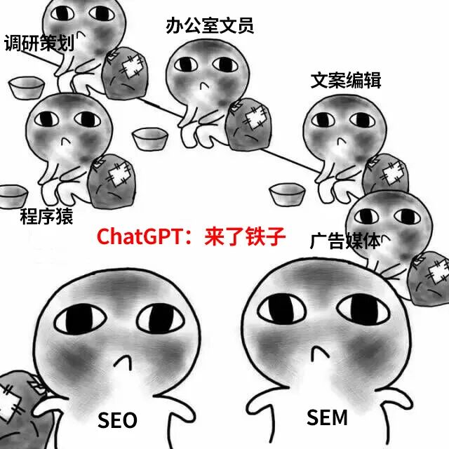
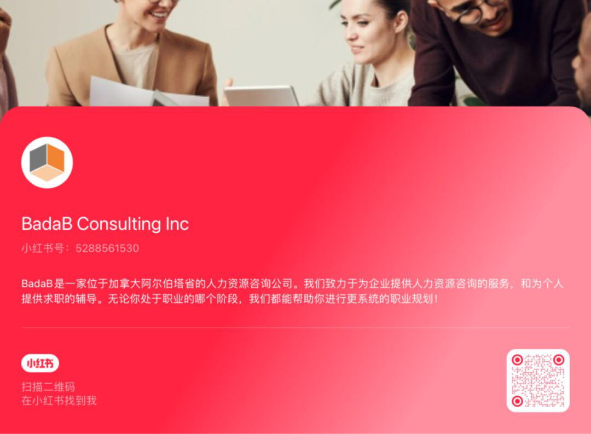

# 无标题

**链接地址:** http://mp.weixin.qq.com/s?__biz=MzI4NDYyNjAwNw==&mid=2247488326&idx=1&sn=4d03ce39ed8630c76f1a013fee73c314&chksm=ebf9ce7edc8e47682559e7f332632e8777f27245ab5559e9d211d6a7a00b7cb2584be7d4318d&mpshare=1&scene=2&srcid=04172A0OKvBTJHprOSMXtzBM&sharer_shareinfo=22d4920a7982d520554357986b6bb771&sharer_shareinfo_first=98be494502d822149876c642e3a727a6#rd
**作者:** 欢迎转发
**获取时间:** 2025/8/28 18:57:59
**图片数量:** 21

---

## 原始HTML内容

<section style="font-size: 16px;"><section style="text-align: left;justify-content: flex-start;display: flex;flex-flow: row;margin-top: 20px;margin-bottom: 10px;"><section style="display: inline-block;width: auto;vertical-align: top;align-self: flex-start;flex: 0 0 auto;border-style: solid;border-width: 2px 0px 0px;border-top-color: rgb(62, 62, 62);min-width: 5%;height: auto;"><section style="justify-content: flex-start;display: flex;flex-flow: row;margin-top: -13px;"><section style="display: inline-block;vertical-align: top;width: auto;flex: 0 0 0%;height: auto;"><section style="text-align: right;margin-top: 7px;transform: translate3d(6px, 0px, 0px);"><section style="display: inline-block;width: 11px;height: 11px;vertical-align: top;overflow: hidden;border-style: solid;border-width: 3px;border-color: rgb(255, 255, 255);border-radius: 42px;background-color: rgb(237, 128, 15);"><section style="text-align: justify;">
 
</section></section></section></section><section style="display: inline-block;vertical-align: top;width: auto;align-self: flex-start;flex: 100 100 0%;border-style: solid;border-width: 0px 0px 0px 2px;border-left-color: rgb(62, 62, 62);height: auto;padding-top: 18px;padding-right: 11px;padding-left: 11px;"><section style="justify-content: flex-start;display: flex;flex-flow: row;"><section style="display: inline-block;vertical-align: middle;width: auto;align-self: center;flex: 0 0 auto;min-width: 5%;height: auto;background-color: rgb(237, 146, 15);padding-right: 5px;padding-left: 5px;margin-right: 6px;"><section style="text-align: justify;color: rgb(48, 48, 48);font-size: 15px;">
<strong>点击蓝字</strong>
</section></section><section style="display: inline-block;vertical-align: middle;width: auto;min-width: 5%;flex: 0 0 auto;height: auto;align-self: center;"><section style="text-align: justify;">
<strong style="text-align: center;">关注我们</strong>
</section></section></section></section></section></section></section><section style="text-align: left;justify-content: flex-start;display: flex;flex-flow: row;margin-top: 10px;margin-bottom: 20px;"><section style="display: inline-block;width: 100%;vertical-align: top;align-self: flex-start;flex: 0 0 auto;border-style: solid;border-width: 0px 0px 2px;border-bottom-color: rgb(62, 62, 62);"><section style="justify-content: flex-start;display: flex;flex-flow: row;margin-bottom: -13px;"><section style="display: inline-block;vertical-align: bottom;width: auto;align-self: flex-end;flex: 100 100 0%;border-style: solid;border-width: 0px 2px 0px 0px;border-right-color: rgb(62, 62, 62);height: auto;padding-right: 20px;padding-bottom: 28px;padding-left: 20px;"><section style="text-align: justify;">
 
</section><section style="text-align: center;margin-top: 10px;margin-bottom: 10px;line-height: 0;"><section style="vertical-align: middle;display: inline-block;line-height: 0;width: 100%;height: auto;"></section></section><section style="text-align: right;font-size: 18px;">
<strong> </strong>

<strong>敌人？盟友！</strong>

<strong>如何通过学习和应用AI，</strong>

<strong>提升北美打工人们的职场竞争力？</strong>

<strong> </strong>
</section></section><section style="display: inline-block;vertical-align: bottom;width: auto;flex: 0 0 0%;height: auto;align-self: flex-end;line-height: 0;"><section style=""><section style="display: inline-block;width: 11px;height: 11px;vertical-align: top;overflow: hidden;border-style: solid;border-width: 3px;border-color: rgb(255, 255, 255);border-radius: 42px;background-color: rgb(237, 128, 15);"><section style="text-align: justify;">
 
</section></section></section></section></section></section></section><section style="margin-top: -20px;"><section style="text-align: right;font-size: 12px;color: rgb(121, 121, 121);">
【专题出品】BadaB Consulting Inc.&nbsp; &nbsp; &nbsp;
</section></section>
 

 
<section style="display: flex;width: 100%;flex-flow: column;"><section style="z-index: auto;"><section style="text-align: left;justify-content: flex-start;display: flex;flex-flow: row;margin-top: 10px;margin-bottom: -10px;transform: translate3d(-3px, 0px, 0px);"><section style="display: inline-block;width: auto;vertical-align: top;align-self: flex-start;flex: 0 0 auto;min-width: 5%;height: auto;"><section style="transform: rotateX(340deg) rotateY(36deg);"><section style="text-align: center;justify-content: center;display: flex;flex-flow: row;"><section style="display: inline-block;width: auto;vertical-align: top;align-self: flex-start;flex: 0 0 auto;background-color: rgb(237, 146, 15);min-width: 5%;height: auto;padding-right: 6px;padding-left: 6px;border-style: solid;border-width: 2px;border-color: rgb(62, 62, 62);">
<strong>00</strong>
</section></section></section></section></section></section></section><section style="text-align: left;justify-content: flex-start;display: flex;flex-flow: row;margin-bottom: 10px;"><section style="display: inline-block;width: auto;vertical-align: top;align-self: flex-start;flex: 0 0 auto;border-style: solid;border-width: 2px;border-color: rgb(62, 62, 62);box-shadow: rgb(237, 146, 15) 5px 5px 0px 0px;min-width: 5%;height: auto;margin-right: 5px;padding: 7px 15px;"><section style="text-align: justify;">
<strong>AI浪潮突袭，打工人你们还好吗？</strong>
</section></section></section><section style="font-size: 14px;padding-right: 20px;padding-left: 20px;letter-spacing: 2px;color: rgb(121, 121, 121);line-height: 2;">
 

2022年11月，OpenAI研发的聊天机器人ChatGPT一经问世便引爆了全球<strong>对人工智能（AI）研发及应用的热潮</strong>，随即也引发了AI取代文字工作者的担忧。在经过了不到一年半突飞猛进的发展后，市面上各类AI应用日趋成熟，已完整地颠覆了许多职场人士的工作流程和职业前景——显然，<strong>担忧自己饭碗不保的打工人们也呈指数级增长</strong>。

 
</section><section style="text-align: center;margin-top: 10px;margin-bottom: 10px;line-height: 0;"><section style="vertical-align: middle;display: inline-block;line-height: 0;width: 90%;height: auto;"></section></section><section style="font-size: 14px;padding-right: 20px;padding-left: 20px;letter-spacing: 2px;color: rgb(121, 121, 121);line-height: 2;">
 

在感叹一句<strong>“哇塞”</strong>之余，AI已开始对工作岗位造成喜忧参半影响是不争的事实。尤其是对于入门级职位的淘汰，让本就激烈的应届毕业生求职市场进入<strong>“大逃杀”模式</strong>！于是<strong>“抵制AI”</strong>的声浪四起，社会对于AI的讨论开始变得极端。然而，AI真的是我们的敌人吗？通过拒绝让AI进入办公场景真的可以替打工人保住饭碗吗？

 
</section><section style="text-align: center;margin-top: 10px;margin-bottom: 10px;line-height: 0;"><section style="vertical-align: middle;display: inline-block;line-height: 0;width: 75%;height: auto;"></section></section><section style="font-size: 14px;padding-right: 20px;padding-left: 20px;letter-spacing: 2px;color: rgb(121, 121, 121);line-height: 2;">
 

当然不行！AI被发明的本意就在于提升我们人类的生产力。先别着急着悲观，今天BadaB将要带领各位去了解<strong>如何在工作环境中快速学习和应用AI</strong>，让自己的工作效率得到突飞猛进的提升。借力“盟友”的帮助，成为让企业<strong>无法替代的核心</strong><strong>螺丝钉</strong><strong>员工！</strong>文章结尾有惊喜哦！
</section><section style="font-size: 14px;padding-right: 20px;padding-left: 20px;letter-spacing: 2px;color: rgb(121, 121, 121);line-height: 2;">
 

 
</section><section style="display: flex;width: 100%;flex-flow: column;"><section style="z-index: auto;"><section style="text-align: left;justify-content: flex-start;display: flex;flex-flow: row;margin-top: 10px;margin-bottom: -10px;transform: translate3d(-3px, 0px, 0px);"><section style="display: inline-block;width: auto;vertical-align: top;align-self: flex-start;flex: 0 0 auto;min-width: 5%;height: auto;"><section style="transform: rotateX(340deg) rotateY(36deg);"><section style="text-align: center;justify-content: center;display: flex;flex-flow: row;"><section style="display: inline-block;width: auto;vertical-align: top;align-self: flex-start;flex: 0 0 auto;background-color: rgb(237, 146, 15);min-width: 5%;height: auto;padding-right: 6px;padding-left: 6px;border-style: solid;border-width: 2px;border-color: rgb(62, 62, 62);">
<strong>01</strong>
</section></section></section></section></section></section></section><section style="text-align: left;justify-content: flex-start;display: flex;flex-flow: row;margin-bottom: 10px;"><section style="display: inline-block;width: auto;vertical-align: top;align-self: flex-start;flex: 0 0 auto;border-style: solid;border-width: 2px;border-color: rgb(62, 62, 62);box-shadow: rgb(237, 146, 15) 5px 5px 0px 0px;min-width: 5%;height: auto;margin-right: 5px;padding: 7px 15px;"><section style="text-align: justify;">
<strong>积极了解AI行业趋势和技术发展方向</strong>
</section></section></section><section style="font-size: 14px;padding-right: 20px;padding-left: 20px;letter-spacing: 2px;color: rgb(121, 121, 121);line-height: 2;">
 

据高盛2023年估算，生成式AI将在未来十年内使美国的年劳动生产力增长接近1.5个百分点，并最终可能使全球GDP年增长率提高7%。在这样巨大的增长前景面前，这项产业对于政策、资金、技术和人才的虹吸将是难以预估的。想要避免和AI打交道，几乎是不可能的。<strong>学会AI资源的利用，是打工人的“职场刚需”！</strong>

<strong> </strong>
</section><section style="text-align: center;margin-top: 10px;margin-bottom: 10px;line-height: 0;"><section style="vertical-align: middle;display: inline-block;line-height: 0;width: 90%;height: auto;"></section></section><section style="font-size: 14px;padding-right: 20px;padding-left: 20px;letter-spacing: 2px;color: rgb(121, 121, 121);line-height: 2;">
 

AI技术的发展和应用，已经行驶在<strong>超车道</strong>上。几乎每个月，我们的新闻头条热搜都要被一两个横空出世的强大AI应用所占据。作为打工人们除了被震惊到目瞪口呆之余，第一个要思考的应该是：<strong>我可以怎样将这个功能应用在我的工作场景里？</strong>

<strong> </strong>
</section><section style="text-align: center;margin-top: 10px;margin-bottom: 10px;line-height: 0;"><section style="vertical-align: middle;display: inline-block;line-height: 0;width: 90%;height: auto;"></section></section><section style="font-size: 14px;padding-right: 20px;padding-left: 20px;letter-spacing: 2px;color: rgb(121, 121, 121);line-height: 2;">
 

在职场上，对行业趋势和技术发展保持机敏是至关重要的，而对于日新月异的AI产业更应该时刻警觉。无论是<strong>技术创新、应用案例还是政策环境</strong>，都有可能对你从事的行业带来颠覆性的革新。认真思考这些改变会对自己的职业前景造成怎样的影响，或带来以往难以预料的机遇。
</section>
 

 
<section style="display: flex;width: 100%;flex-flow: column;"><section style="z-index: auto;"><section style="text-align: left;justify-content: flex-start;display: flex;flex-flow: row;margin-top: 10px;margin-bottom: -10px;transform: translate3d(-3px, 0px, 0px);"><section style="display: inline-block;width: auto;vertical-align: top;align-self: flex-start;flex: 0 0 auto;min-width: 5%;height: auto;"><section style="transform: rotateX(340deg) rotateY(36deg);"><section style="text-align: center;justify-content: center;display: flex;flex-flow: row;"><section style="display: inline-block;width: auto;vertical-align: top;align-self: flex-start;flex: 0 0 auto;background-color: rgb(237, 146, 15);min-width: 5%;height: auto;padding-right: 6px;padding-left: 6px;border-style: solid;border-width: 2px;border-color: rgb(62, 62, 62);">
<strong>02</strong>
</section></section></section></section></section></section></section><section style="text-align: left;justify-content: flex-start;display: flex;flex-flow: row;margin-bottom: 10px;"><section style="display: inline-block;width: auto;vertical-align: top;align-self: flex-start;flex: 0 0 auto;border-style: solid;border-width: 2px;border-color: rgb(62, 62, 62);box-shadow: rgb(237, 146, 15) 5px 5px 0px 0px;min-width: 5%;height: auto;margin-right: 5px;padding: 7px 15px;"><section style="text-align: justify;">
<strong>积极学习和利用AI工具提升工作效率</strong>
</section></section></section><section style="font-size: 14px;padding-right: 20px;padding-left: 20px;letter-spacing: 2px;color: rgb(121, 121, 121);line-height: 2;">
 

首先，<strong>了解并识别出可以在你的工作领域中应用的AI工具</strong>。这些工具可能包括内容生成、数据分析、自动化办公、客户关系管理（CRM）系统等等。甚至在以往自己完全不擅长的领域，有了AI的助攻也可以让你达成<strong>事半功倍</strong>的效果。

 
</section><section style="text-align: center;margin-top: 10px;margin-bottom: 10px;line-height: 0;"><section style="vertical-align: middle;display: inline-block;line-height: 0;width: 90%;height: auto;"></section></section><section style="font-size: 14px;padding-right: 20px;padding-left: 20px;letter-spacing: 2px;color: rgb(121, 121, 121);line-height: 2;">
 

一旦确定了需要学习的AI工具，你完全可以在互联网这片信息的海洋中搜索到大量的<strong>在线课程或研讨会</strong>进行学习。这些资源可能来自专业培训机构、在线课程如Coursera、Udemy，甚至YouTube等平台免费提供学习资料。重点学习这些工具的基础使用方法，以及如何在实际工作中应用这些工具。

 
</section><section style="text-align: center;margin-top: 10px;margin-bottom: 10px;line-height: 0;"><section style="vertical-align: middle;display: inline-block;line-height: 0;width: 90%;height: auto;"></section></section><section style="font-size: 14px;padding-right: 20px;padding-left: 20px;letter-spacing: 2px;color: rgb(121, 121, 121);line-height: 2;">
 

不过AI的学习肯定<strong>不是一劳永逸</strong>的。以开放的态度持续关注最新的AI发展动态，更新和升级你所使用的工具和方法。在摸索中实践，在实践中和AI同步升级你的战斗力！ 

 

 
</section><section style="display: flex;width: 100%;flex-flow: column;"><section style="z-index: auto;"><section style="text-align: left;justify-content: flex-start;display: flex;flex-flow: row;margin-top: 10px;margin-bottom: -10px;transform: translate3d(-3px, 0px, 0px);"><section style="display: inline-block;width: auto;vertical-align: top;align-self: flex-start;flex: 0 0 auto;min-width: 5%;height: auto;"><section style="transform: rotateX(340deg) rotateY(36deg);"><section style="text-align: center;justify-content: center;display: flex;flex-flow: row;"><section style="display: inline-block;width: auto;vertical-align: top;align-self: flex-start;flex: 0 0 auto;background-color: rgb(237, 146, 15);min-width: 5%;height: auto;padding-right: 6px;padding-left: 6px;border-style: solid;border-width: 2px;border-color: rgb(62, 62, 62);">
<strong>03</strong>
</section></section></section></section></section></section></section><section style="text-align: left;justify-content: flex-start;display: flex;flex-flow: row;margin-bottom: 10px;"><section style="display: inline-block;width: auto;vertical-align: top;align-self: flex-start;flex: 0 0 auto;border-style: solid;border-width: 2px;border-color: rgb(62, 62, 62);box-shadow: rgb(237, 146, 15) 5px 5px 0px 0px;min-width: 5%;height: auto;margin-right: 5px;padding: 7px 15px;"><section style="text-align: justify;">
<strong>提升自己的跨界合作能力，一专多强</strong> 
</section></section></section><section style="font-size: 14px;padding-right: 20px;padding-left: 20px;letter-spacing: 2px;color: rgb(121, 121, 121);line-height: 2;">
 

在可预见的未来内，许多职场人士的专业技能完全可能会被AI替代，但我们可以培养<strong>“一专多强”的技能组合，</strong>让自己成为<strong>“变形金刚”型的职场核心角色</strong>。这不仅能够增加个人的职场竞争力，还能让你在团队项目中发挥更大的作用，所谓的公司离了你都不转，让自己成为<strong>“性价比”最高</strong>的第一选项。

 
</section><section style="text-align: center;margin-top: 10px;margin-bottom: 10px;line-height: 0;"><section style="vertical-align: middle;display: inline-block;line-height: 0;width: 90%;height: auto;"></section></section><section style="font-size: 14px;padding-right: 20px;padding-left: 20px;letter-spacing: 2px;color: rgb(121, 121, 121);line-height: 2;">
 

除了确保在自己的核心领域具备深厚的专业知识。扩展相关领域的知识，选择与你的主要职业相关联的技能进行学习也可以大大增加你的<strong>职场生存能力</strong>。例如，作为一名程序员，可以学习用户体验设计或数据科学，以增加与设计师或数据分析师的合作效率；或者一个市场营销专家，学习利用AI进行消费者行为分析，将更能洞察市场需求，参与设计出更符合市场预期的产品。

 

就算自己从事的行业或岗位因不可抗因素变得难以为继，也可以通过<strong>灵活多变的技能组合</strong>，尽快适应职场新需求为自己谋求更多的职业发展前景。

 
</section><section style="display: flex;width: 100%;flex-flow: column;"><section style="z-index: auto;"><section style="text-align: left;justify-content: flex-start;display: flex;flex-flow: row;margin-top: 10px;margin-bottom: -10px;transform: translate3d(-3px, 0px, 0px);"><section style="display: inline-block;width: auto;vertical-align: top;align-self: flex-start;flex: 0 0 auto;min-width: 5%;height: auto;"><section style="transform: rotateX(340deg) rotateY(36deg);"><section style="text-align: center;justify-content: center;display: flex;flex-flow: row;"><section style="display: inline-block;width: auto;vertical-align: top;align-self: flex-start;flex: 0 0 auto;background-color: rgb(237, 146, 15);min-width: 5%;height: auto;padding-right: 6px;padding-left: 6px;border-style: solid;border-width: 2px;border-color: rgb(62, 62, 62);">
<strong>04</strong>
</section></section></section></section></section></section></section><section style="text-align: left;justify-content: flex-start;display: flex;flex-flow: row;margin-bottom: 10px;"><section style="display: inline-block;width: auto;vertical-align: top;align-self: flex-start;flex: 0 0 auto;border-style: solid;border-width: 2px;border-color: rgb(62, 62, 62);box-shadow: rgb(237, 146, 15) 5px 5px 0px 0px;min-width: 5%;height: auto;margin-right: 5px;padding: 7px 15px;"><section style="text-align: justify;">
<strong>坚守自己作为“打工人”的情绪价值</strong>
</section></section></section><section style="font-size: 14px;padding-right: 20px;padding-left: 20px;letter-spacing: 2px;color: rgb(121, 121, 121);line-height: 2;">
 
</section><section style="font-size: 14px;padding-right: 20px;padding-left: 20px;letter-spacing: 2px;color: rgb(121, 121, 121);line-height: 2;">
一些求职者在AI取代自己工作岗位的观点上持非常沮丧的态度，但事实上职位更新换代的速度并没有大家想象得这么迅速，时间还来得及我们去应对调整。同时，我们也需要考虑到社会中<strong>不同群体对于AI的接纳程度和难易度</strong>，尽可能更人性化地去根据他们的需求去设计产品，提供服务。

 
</section><section style="text-align: center;margin-top: 10px;margin-bottom: 10px;line-height: 0;"><section style="vertical-align: middle;display: inline-block;line-height: 0;width: 90%;height: auto;"></section></section><section style="font-size: 14px;padding-right: 20px;padding-left: 20px;letter-spacing: 2px;color: rgb(121, 121, 121);line-height: 2;">
 

说到底，AI作为我们的强力助攻，并不能完全代替我们的职场功能，尤其是在“人性”方面的职责。因为AI<strong>既灭不了客户撒的“火”，也吃不下老板画的“饼”，还顶不起同事甩的“锅”，更别说在关键时刻替企业扛个“雷”了</strong>。因此在AI解放生产力的同时，我们可以挪出更多的时间精力在职场人际关系的维护上。<strong>生而为人，你很重要！</strong>

 

 
</section><section style="display: flex;width: 100%;flex-flow: column;"><section style="z-index: auto;"><section style="text-align: left;justify-content: flex-start;display: flex;flex-flow: row;margin-top: 10px;margin-bottom: -10px;transform: translate3d(-3px, 0px, 0px);"><section style="display: inline-block;width: auto;vertical-align: top;align-self: flex-start;flex: 0 0 auto;min-width: 5%;height: auto;"><section style="transform: rotateX(340deg) rotateY(36deg);"><section style="text-align: center;justify-content: center;display: flex;flex-flow: row;"><section style="display: inline-block;width: auto;vertical-align: top;align-self: flex-start;flex: 0 0 auto;background-color: rgb(237, 146, 15);min-width: 5%;height: auto;padding-right: 6px;padding-left: 6px;border-style: solid;border-width: 2px;border-color: rgb(62, 62, 62);">
<strong>05</strong>
</section></section></section></section></section></section></section><section style="text-align: left;justify-content: flex-start;display: flex;flex-flow: row;margin-bottom: 10px;"><section style="display: inline-block;width: auto;vertical-align: top;align-self: flex-start;flex: 0 0 auto;border-style: solid;border-width: 2px;border-color: rgb(62, 62, 62);box-shadow: rgb(237, 146, 15) 5px 5px 0px 0px;min-width: 5%;height: auto;margin-right: 5px;padding: 7px 15px;"><section style="text-align: justify;">
<strong>定期反思和调整自己的工作方向和目标</strong>
</section></section></section><section style="font-size: 14px;padding-right: 20px;padding-left: 20px;letter-spacing: 2px;color: rgb(121, 121, 121);line-height: 2;">
 

积极一点去想，AI不仅带来了工作方式的变化，也提供了新的职业机会和成长路径。但这就要求我们打工人更清醒地去确定长期和短期职业目标，你的职业目标也应该具备<strong>更高的灵活度和适应性</strong>。因此应该定期评估行业趋势和技术进步，调整你的职业规划。

 
</section><section style="text-align: center;margin-top: 10px;margin-bottom: 10px;line-height: 0;"><section style="vertical-align: middle;display: inline-block;line-height: 0;width: 90%;height: auto;"></section></section><section style="font-size: 14px;padding-right: 20px;padding-left: 20px;letter-spacing: 2px;color: rgb(121, 121, 121);line-height: 2;">
 

每隔一段时间，如每季度或每年，进行一次<strong>职业生涯的深入反思</strong>。评估你的职业进展与原先设定的目标是否一致，以及需要做出哪些调整。并主动寻求来自同事、上司和同行的反馈，这可以帮助你了解自己的职场表现，对自己的市场竞争力进行诚实的评估。

 

耳听六路，眼观八方。尤其是对于AI开辟的许多<strong>新的职业赛道和热门领域</strong>，欢迎抱着开放的态度去予以<strong>探索</strong>。考虑可能的职业转变，例如从传统行业转向技术驱动的职位，或在现有职业路径中探索新的增长点。去勇敢做<strong>第一个吃“赛博螃蟹”的人</strong>！

 
</section><section style="text-align: center;justify-content: center;display: flex;flex-flow: row;margin-top: 10px;margin-bottom: 10px;"><section style="display: inline-block;vertical-align: middle;width: auto;min-width: 5%;flex: 0 0 auto;height: auto;align-self: center;"><section style=""><section style="display: inline-block;width: 22px;height: 35px;vertical-align: top;overflow: hidden;border-style: solid;border-width: 2px 0px 2px 2px;border-color: rgb(237, 128, 15) rgb(97, 163, 246) rgb(237, 128, 15) rgb(237, 128, 15);"><section style="text-align: justify;">
 
</section></section></section></section><section style="display: inline-block;vertical-align: middle;width: auto;align-self: center;flex: 0 0 auto;min-width: 5%;height: auto;margin-right: -10px;margin-left: -10px;"><section style=""><section style="text-align: justify;">
<strong style="text-align: center;">彩蛋时间</strong>
</section></section></section><section style="display: inline-block;vertical-align: middle;width: auto;min-width: 5%;flex: 0 0 auto;height: auto;align-self: center;"><section style=""><section style="display: inline-block;width: 22px;height: 35px;vertical-align: top;overflow: hidden;border-style: solid;border-width: 2px 2px 2px 0px;border-color: rgb(237, 128, 15) rgb(237, 128, 15) rgb(237, 128, 15) rgb(97, 163, 246);"><section style="text-align: justify;">
 
</section></section></section></section></section>
 
<section style="text-align: left;justify-content: flex-start;display: flex;flex-flow: row;margin-bottom: 10px;"><section style="display: inline-block;width: auto;vertical-align: top;align-self: flex-start;flex: 100 100 0%;border-style: solid;border-width: 2px;border-color: rgb(62, 62, 62);box-shadow: rgb(237, 128, 15) 5px 5px 0px 0px;height: auto;margin-right: 5px;padding: 21px;"><section style="text-align: justify;">
<strong><em>2024年细分领域AI工具推荐</em></strong>

 

<strong>文本对话</strong>

ChatGPT,&nbsp;Claude 2,&nbsp;Bing AI

 

<strong>文本生成</strong>

Jasper,&nbsp;Copy.ai,&nbsp;Anyword

 

<strong>语法拼写纠错</strong>

Grammarly,&nbsp;Wordtune,&nbsp;ProWritingAid

 

<strong>视频制作</strong>

Descript,&nbsp;Wondershare Filmora,&nbsp;Runway

 

<strong>图像生成</strong>

DALL·E 3,&nbsp;Midjourney,&nbsp;Stable Diffusion

 

<strong>音乐生成</strong>

Suno AI, Murf,&nbsp;Splash Pro,&nbsp;AIVA

 

<strong>信息管理</strong>

Mem,&nbsp;Notion AI Q&amp;A,&nbsp;Personal AI

 

<strong>项目管理</strong>

Asana,&nbsp;Any.do,&nbsp;BeeDone

 

<strong>项目助手</strong>

Fireflies,&nbsp;Airgram,&nbsp;Krisp

 

<strong>日程规划</strong>

Reclaim,&nbsp;Clockwise,&nbsp;Motion

 

<strong>邮箱管理</strong>

SaneBox,&nbsp;Mailbutler,&nbsp;EmailTree

 

<strong>PPT纺织</strong>

Decktopus,&nbsp;Beautiful.ai,&nbsp;Slidesgo

 
</section></section></section>
 

 
<section style="display: flex;width: 100%;flex-flow: column;"><section style="z-index: auto;"><section style="text-align: left;justify-content: flex-start;display: flex;flex-flow: row;margin-top: 10px;margin-bottom: -10px;transform: translate3d(-3px, 0px, 0px);"><section style="display: inline-block;width: auto;vertical-align: top;align-self: flex-start;flex: 0 0 auto;min-width: 5%;height: auto;"><section style="transform: rotateX(340deg) rotateY(36deg);"><section style="text-align: center;justify-content: center;display: flex;flex-flow: row;"><section style="display: inline-block;width: auto;vertical-align: top;align-self: flex-start;flex: 0 0 auto;background-color: rgb(237, 146, 15);min-width: 5%;height: auto;padding-right: 6px;padding-left: 6px;border-style: solid;border-width: 2px;border-color: rgb(62, 62, 62);">
<strong>END</strong>
</section></section></section></section></section></section></section><section style="text-align: left;justify-content: flex-start;display: flex;flex-flow: row;margin-bottom: 10px;"><section style="display: inline-block;width: auto;vertical-align: top;align-self: flex-start;flex: 0 0 auto;border-style: solid;border-width: 2px;border-color: rgb(62, 62, 62);box-shadow: rgb(237, 146, 15) 5px 5px 0px 0px;min-width: 5%;height: auto;margin-right: 5px;padding: 7px 15px;"><section style="text-align: justify;">
<strong>机遇，属于那个能抓住的人！</strong>
</section></section></section><section style="font-size: 14px;padding-right: 20px;padding-left: 20px;letter-spacing: 2px;color: rgb(121, 121, 121);line-height: 2;">
 

对于AI迅猛的发展，打工人们被每天层出不穷的新闻大力冲击已成为麻木的日常：还没有熟悉上一套AI工具的使用流程，更先进更强大的AI工具已经涌入了市场。偶尔也会产生一些低落的情绪：<strong>是不是我的职能也很快就会被替代了呢？</strong>

 

AI的出现确实让<strong>从事基础行政、文艺和科技的初级工作遭遇大面积淘汰</strong>，让职场萌新难以进入人才市场。但试想在花样AI工具的加持下，本来需要积累数年工作经验的你也得以用<strong>突飞猛进的工作效率和性价比</strong>超越许多领域的专业人士，成为拥有三头六臂和更高成长曲线的技术大拿。

 
</section><section style="text-align: center;margin-top: 10px;margin-bottom: 10px;line-height: 0;"><section style="vertical-align: middle;display: inline-block;line-height: 0;width: 50%;height: auto;"></section></section><section style="font-size: 14px;padding-right: 20px;padding-left: 20px;letter-spacing: 2px;color: rgb(121, 121, 121);line-height: 2;">
 

<strong>AI的学习成本是极其低廉的，但对于你个人的职业技能面板扩充却是无可限量。</strong>所以BadaB希望各位能够调整好自己的心态，保持乐观积极的情绪，和AI产业一同飞速成长。在这个<strong>工业革命4.0引领的职场革命</strong>中，开创属于你没有参照模板的<strong>全新闪亮职业生涯</strong>！

 
</section>
 
<section style="margin-top: 10px;margin-bottom: 10px;"><section style="width: 100%;text-align: left;"><section style="display: inline-block;vertical-align: top;border-radius: 3px 3px 0px 0px;margin-right: 3px;background-color: rgb(237, 128, 15);color: rgb(255, 255, 255);font-size: 18px;padding-left: 6px;padding-right: 6px;">
<strong>往期精选</strong>
</section> </section><section style="width: 100%;font-size: 0px;margin-top: -2px;"><section style="display: inline-block;vertical-align: top;width: 100%;margin-right: -6px;border-bottom: 2px solid rgb(237, 128, 15);"><svg viewBox="0 0 1 1" style="float:left;line-height:0;width:0;vertical-align:top;"></svg></section><section style="display: inline-block;vertical-align: top;margin-top: -2px;width: 6px;height: 6px;border-radius: 50%;background-color: rgb(237, 128, 15);"><svg viewBox="0 0 1 1" style="float:left;line-height:0;width:0;vertical-align:top;"></svg></section></section></section><section style="margin: 10px 0%;text-align: left;justify-content: flex-start;display: flex;flex-flow: row;"><section style="display: inline-block;width: 100%;vertical-align: top;background-position: 68.1101% 25.0365%;background-repeat: repeat;background-attachment: scroll;padding: 30px;align-self: flex-start;flex: 0 0 auto;background-image: url(&quot;https://mmbiz.qpic.cn/mmbiz_jpg/cY0qSDjdkFefayZYWwW4I3JaMb575Bh5UqibhHnugyPLF1s2K2pR8FZ4oibj5zm7kZCoIT4xNS60GofGfx1L6D1g/640?wx_fmt=jpeg&amp;from=appmsg&quot;);background-size: 104.162% !important;"><section style="text-align: justify;justify-content: flex-start;display: flex;flex-flow: row;"><section style="display: inline-block;width: 100%;vertical-align: top;background-color: rgba(188, 65, 65, 0.22);padding: 10px;border-width: 0px;border-style: none;border-color: rgb(62, 62, 62);align-self: flex-start;flex: 0 0 auto;"><section style="text-align: center;color: rgb(255, 255, 255);font-size: 14px;">
<a target="_blank" href="http://mp.weixin.qq.com/s?__biz=MzI4NDYyNjAwNw==&amp;mid=2247488235&amp;idx=1&amp;sn=0c9085b85d25fa9a5ae5f5b3ad58946c&amp;chksm=ebf9cfd3dc8e46c5f6ae4e0b7351c2c1d05d5b81cea0e92edef2e9697fc7e7722a72cf26ead5&amp;scene=21#wechat_redirect" textvalue="年纪轻轻想躺平？加拿大养老系统这么“坑”！算算你的工资有多少钱付给了CPP！" linktype="text" imgurl="" imgdata="null" data-itemshowtype="0" tab="innerlink" style="color: rgb(255, 255, 255);" data-linktype="2"><strong>年纪轻轻想躺平？加拿大养老系统这么“坑”！算算你的工资有多少钱付给了CPP！</strong></a><strong></strong>
</section></section></section></section></section><section style="margin: 10px 0%;text-align: left;justify-content: flex-start;display: flex;flex-flow: row;"><section style="display: inline-block;width: 100%;vertical-align: top;background-position: 96.59% 43.6859%;background-repeat: repeat;background-attachment: scroll;padding: 30px;align-self: flex-start;flex: 0 0 auto;background-image: url(&quot;https://mmbiz.qpic.cn/mmbiz_png/cY0qSDjdkFefayZYWwW4I3JaMb575Bh5E7DC6eSMGVpqPANdR3ezhhJ6Vh5LFCuRcmG6thmehXia3HVeGMX8tyw/640?wx_fmt=png&amp;from=appmsg&quot;);background-size: 100.637% !important;"><section style="text-align: justify;justify-content: flex-start;display: flex;flex-flow: row;"><section style="display: inline-block;width: 100%;vertical-align: top;background-color: rgba(188, 65, 65, 0.22);padding: 10px;border-width: 0px;border-style: none;border-color: rgb(62, 62, 62);align-self: flex-start;flex: 0 0 auto;"><section style="text-align: center;color: rgb(255, 255, 255);font-size: 14px;">
<a target="_blank" href="http://mp.weixin.qq.com/s?__biz=MzI4NDYyNjAwNw==&amp;mid=2247488139&amp;idx=1&amp;sn=7de34043707da96c0084dcef483976aa&amp;chksm=ebf9cfb3dc8e46a50e5538e32792e93d4a3bec970e10390989e90dcdc98f0827202d446aaa8d&amp;scene=21#wechat_redirect" textvalue="门槛低福利好的加拿大的“公务员”为什么不香？中国人为什么不卷加拿大公务员？" linktype="text" imgurl="" imgdata="null" data-itemshowtype="0" tab="innerlink" style="color: rgb(255, 255, 255);" data-linktype="2"><strong>门槛低福利好的加拿大的“公务员”为什么不香？中国人为什么不卷加拿大公务员？</strong></a><strong></strong>
</section></section></section></section></section><section style="margin: 10px 0%;text-align: left;justify-content: flex-start;display: flex;flex-flow: row;"><section style="display: inline-block;width: 100%;vertical-align: top;background-position: 14.613% 70.9339%;background-repeat: repeat;background-attachment: scroll;padding: 30px;align-self: flex-start;flex: 0 0 auto;background-image: url(&quot;https://mmbiz.qpic.cn/mmbiz_jpg/cY0qSDjdkFefayZYWwW4I3JaMb575Bh5l9vOhrmOBEMy2mpyz3t1HdOic3dFAv5tmJpticIXU7VP72ak7OLTlEYw/640?wx_fmt=jpeg&amp;from=appmsg&quot;);background-size: 100.637% !important;"><section style="text-align: justify;justify-content: flex-start;display: flex;flex-flow: row;"><section style="display: inline-block;width: 100%;vertical-align: top;background-color: rgba(188, 65, 65, 0.22);padding: 10px;border-width: 0px;border-style: none;border-color: rgb(62, 62, 62);align-self: flex-start;flex: 0 0 auto;"><section style="text-align: center;color: rgb(255, 255, 255);font-size: 14px;text-shadow: rgb(76, 2, 24) 2px 0px 2px;">
<a target="_blank" href="http://mp.weixin.qq.com/s?__biz=MzI4NDYyNjAwNw==&amp;mid=2247488037&amp;idx=1&amp;sn=cea5a461771bc0c3e5be8cbeccb116d7&amp;chksm=ebf9cf1ddc8e460b4f47455ad2d3cdcb4f6d8e9584112a5e8ef368b708d5c97cadd1acf3e539&amp;scene=21#wechat_redirect" textvalue="应对节后综合症：学会重返工作岗位的心态调整，让你轻松开启新年工作新气象！" linktype="text" imgurl="" imgdata="null" data-itemshowtype="0" tab="innerlink" style="color: rgb(255, 255, 255);" data-linktype="2"><strong>应对节后综合症：学会重返工作岗位的心态调整，让你轻松开启新年工作新气象！</strong></a>
</section></section></section></section></section><section style="margin: 10px 0%;text-align: left;justify-content: flex-start;display: flex;flex-flow: row;"><section style="display: inline-block;width: 100%;vertical-align: top;background-color: rgb(249, 245, 239);padding: 8px;box-shadow: rgb(207, 207, 207) 0.707107px 0.707107px 2px;align-self: flex-start;flex: 0 0 auto;"><section style="text-align: justify;">
 
</section><section style="text-align: center;margin-right: 0%;margin-bottom: 20px;margin-left: 0%;justify-content: center;display: flex;flex-flow: row;"><section style="display: inline-block;vertical-align: middle;width: 41%;align-self: center;flex: 0 0 auto;"><section style="justify-content: center;display: flex;flex-flow: row;"><section style="display: inline-block;vertical-align: top;width: 50%;box-shadow: rgb(0, 0, 0) 0px 0px 0px;align-self: flex-start;flex: 0 0 auto;"><section style="margin-right: 0%;margin-left: 0%;"><section style="padding: 4px;display: inline-block;background-color: rgb(237, 128, 15);"><section style="border-color: rgb(255, 255, 255);width: 1.6em;height: 1.6em;border-style: solid;border-width: 1px;font-size: 28px;line-height: 1.5em;color: rgb(255, 255, 255);">
號
</section></section></section></section><section style="display: inline-block;vertical-align: top;width: 50%;align-self: flex-start;flex: 0 0 auto;"><section style="margin-right: 0%;margin-left: 0%;"><section style="padding: 4px;display: inline-block;background-color: rgb(237, 128, 15);"><section style="border-color: white;width: 1.6em;height: 1.6em;border-style: solid;border-width: 1px;font-size: 28px;line-height: 1.5em;color: rgb(255, 255, 255);">
外
</section></section></section></section></section></section><section style="display: inline-block;vertical-align: middle;width: 59%;align-self: center;flex: 0 0 auto;"><section style="line-height: 1.4;">
<strong>小红书，</strong><strong style="font-size: 18px;color: rgb(180, 38, 30);">我们来啦！</strong>
</section></section></section><section style="text-align: justify;">
 
</section><section style="text-align: justify;padding-right: 15px;padding-left: 15px;">
久等了，加拿大的朋友们！BadaB Consulting Inc. 终于入驻小红书啦！<strong>（小红书ID：5288561530）</strong>
</section><section style="text-align: center;margin-top: 10px;margin-bottom: 10px;line-height: 0;"><section style="vertical-align: middle;display: inline-block;line-height: 0;box-shadow: rgb(0, 0, 0) 0px 0px 0px;"></section></section><section style="text-align: center;font-size: 12px;color: rgb(180, 180, 180);">
扫描二维码即刻关注我们吧！
</section><section style="color: rgb(62, 62, 62);text-align: center;">
<strong> </strong>

<strong>如果你需要一对一</strong>

<strong>职业规划和系统的建议，</strong>

<strong>请找我们！</strong>

<strong> </strong>

<strong>如果你需要修改简历和cover letter，</strong>

<strong>培训面试，建立LinkedIn主页</strong>

<strong>请找我们！</strong>

<strong> </strong>

<strong>如果你需要来自</strong>

<strong>人力资源顾问的</strong><strong>模拟面试，</strong>

<strong>请找我们！</strong>

<strong> </strong>
</section><section style="justify-content: flex-start;display: flex;flex-flow: row;margin-top: 10px;margin-bottom: 10px;"><section style="display: inline-block;vertical-align: middle;width: auto;align-self: center;flex: 100 100 0%;padding-left: 10px;height: auto;"><section style="transform: rotateZ(357deg);"><section style="justify-content: flex-start;display: flex;flex-flow: row;"><section style="display: inline-block;width: 100%;vertical-align: top;align-self: flex-start;flex: 0 0 auto;"><section style="text-align: center;margin-top: 10px;margin-bottom: -10px;isolation: isolate;line-height: 0;"><section style="vertical-align: middle;display: inline-block;line-height: 0;width: 23px;height: auto;"></section></section><section style="text-align: center;justify-content: center;display: flex;flex-flow: row;margin-bottom: 10px;"><section style="display: inline-block;width: 100%;vertical-align: top;align-self: flex-start;flex: 0 0 auto;background-color: rgb(255, 255, 255);padding: 15px 15px 20px;height: auto;box-shadow: rgb(147, 147, 147) 0px 0px 5px;"><section style="margin-bottom: 20px;line-height: 0;"><section style="vertical-align: middle;display: inline-block;line-height: 0;"></section></section></section></section></section></section></section></section><section style="display: inline-block;vertical-align: middle;width: 45%;align-self: center;flex: 0 0 auto;height: auto;margin-right: -15px;margin-left: -15px;z-index: 3;"><section style="transform: rotateZ(5deg);"><section style="justify-content: flex-start;display: flex;flex-flow: row;"><section style="display: inline-block;width: 100%;vertical-align: top;align-self: flex-start;flex: 0 0 auto;"><section style="text-align: center;margin-top: 10px;margin-bottom: -10px;isolation: isolate;line-height: 0;"><section style="vertical-align: middle;display: inline-block;line-height: 0;width: 23px;height: auto;"></section></section><section style="text-align: center;justify-content: center;display: flex;flex-flow: row;margin-bottom: 10px;"><section style="display: inline-block;width: 100%;vertical-align: top;align-self: flex-start;flex: 0 0 auto;background-color: rgb(255, 255, 255);padding: 17px 17px 20px;height: auto;box-shadow: rgb(147, 147, 147) 0px 0px 5px;"><section style="margin-bottom: 20px;line-height: 0;"><section style="vertical-align: middle;display: inline-block;line-height: 0;"></section></section></section></section></section></section></section></section><section style="display: inline-block;vertical-align: middle;width: auto;align-self: center;flex: 100 100 0%;height: auto;padding-right: 10px;"><section style="transform: rotateZ(357deg);"><section style="justify-content: flex-start;display: flex;flex-flow: row;"><section style="display: inline-block;width: 100%;vertical-align: top;align-self: flex-start;flex: 0 0 auto;"><section style="text-align: center;margin-top: 10px;margin-bottom: -10px;isolation: isolate;line-height: 0;"><section style="vertical-align: middle;display: inline-block;line-height: 0;width: 23px;height: auto;"></section></section><section style="text-align: center;justify-content: center;display: flex;flex-flow: row;margin-bottom: 10px;"><section style="display: inline-block;width: 100%;vertical-align: top;align-self: flex-start;flex: 0 0 auto;background-color: rgb(255, 255, 255);padding: 15px 15px 20px;height: auto;box-shadow: rgb(147, 147, 147) 0px 0px 5px;"><section style="margin-bottom: 20px;line-height: 0;"><section style="vertical-align: middle;display: inline-block;line-height: 0;"></section></section></section></section></section></section></section></section></section><section style="color: rgb(62, 62, 62);text-align: center;">
 
</section><section style="text-align: justify;padding-right: 15px;padding-left: 15px;">
BadaB会不定期地在小红书主页上更新大家最想了解的<strong>北美职场经验和建议</strong>，还有一些<strong>内部的岗位招聘信</strong>息哦~希望找工作和就业中的打工人们关注我学起来！<strong>让我们一起在职场中乘风破浪，披荆斩棘吧！</strong>
</section><section style="text-align: justify;">
 
</section></section></section>
 
<section style="margin: 10px 0%;text-align: center;justify-content: center;display: flex;flex-flow: row;"><section style="display: inline-block;width: 100%;vertical-align: top;background-color: rgba(255, 174, 174, 0.13);padding-right: 10px;padding-left: 10px;align-self: flex-start;flex: 0 0 auto;"><section style="display: flex;flex-flow: row;margin: -5px 0%;justify-content: center;"><section style="display: inline-block;width: auto;vertical-align: middle;min-width: 10%;flex: 0 0 auto;height: auto;border-style: solid;border-width: 1px;border-color: rgb(237, 128, 15);padding: 4px;background-color: rgb(255, 255, 255);box-shadow: rgb(255, 255, 255) 0px 0px 0px inset;align-self: center;"><section style="justify-content: center;display: flex;flex-flow: row;"><section style="display: inline-block;width: 100%;vertical-align: top;border-width: 0px;background-color: rgba(255, 174, 174, 0.13);padding-right: 10px;padding-left: 10px;align-self: flex-start;flex: 0 0 auto;"><section style="color: rgb(106, 106, 106);letter-spacing: 1px;text-align: justify;">
<strong>关于我们</strong>
</section></section></section></section></section></section></section>
 
<section style="text-align: center;margin: 10px 0%;justify-content: center;display: flex;flex-flow: row;"><section style="display: inline-block;width: 90%;vertical-align: top;border-style: solid;border-width: 2px;border-color: rgb(237, 128, 15);letter-spacing: 0px;padding: 10px;align-self: flex-start;flex: 0 0 auto;"><section style="justify-content: center;display: flex;flex-flow: row;"><section style="display: inline-block;vertical-align: middle;width: 40%;align-self: center;flex: 0 0 auto;"><section style="margin-right: 0%;margin-left: 0%;line-height: 0;"><section style="vertical-align: middle;display: inline-block;line-height: 0;border-width: 0px;width: 100%;"></section></section></section><section style="display: inline-block;vertical-align: middle;width: 60%;padding-left: 10px;align-self: center;flex: 0 0 auto;"><section style="margin-right: 0%;margin-bottom: 5px;margin-left: 0%;"><section style="display: inline-block;border-width: 2px;border-style: solid;border-color: rgb(237, 128, 15);padding: 0.1em 0.3em;background-color: rgb(237, 128, 15);color: rgb(255, 255, 255);font-size: 12px;">
<strong>Ada&nbsp; Tai</strong>
</section></section><section style="margin-right: 0%;margin-left: 0%;"><section style="font-size: 13px;">
<strong>MBA, CPHR, SHRM-SCP</strong>
</section></section><section style="justify-content: center;display: flex;flex-flow: row;"><section style="display: inline-block;vertical-align: middle;width: 10%;border-width: 0px;align-self: center;flex: 0 0 auto;"><section style="margin: 5px 0%;text-align: left;font-size: 0px;"><section style="padding: 4px;display: inline-block;background-color: rgb(237, 128, 15);"><section style="border-color: rgba(255, 255, 255, 0);width: 1.6em;height: 1.6em;border-style: solid;border-width: 1px;text-align: center;line-height: 1.5em;color: rgb(255, 255, 255);">
 
</section></section></section></section><section style="display: inline-block;vertical-align: middle;width: 90%;align-self: center;flex: 0 0 auto;"><section style="font-size: 12px;text-align: justify;">
修改简历与求职信
</section></section></section><section style="justify-content: center;display: flex;flex-flow: row;"><section style="display: inline-block;vertical-align: middle;width: 10%;align-self: center;flex: 0 0 auto;"><section style="margin: 5px 0%;text-align: left;font-size: 0px;"><section style="padding: 4px;display: inline-block;background-color: rgb(237, 128, 15);"><section style="border-color: rgba(255, 255, 255, 0);width: 1.6em;height: 1.6em;border-style: solid;border-width: 1px;text-align: center;line-height: 1.5em;color: rgb(255, 255, 255);">
 
</section></section></section></section><section style="display: inline-block;vertical-align: middle;width: 90%;align-self: center;flex: 0 0 auto;"><section style="font-size: 12px;text-align: justify;">
培训面试
</section></section></section><section style="justify-content: center;display: flex;flex-flow: row;"><section style="display: inline-block;vertical-align: middle;width: 10%;border-width: 0px;align-self: center;flex: 0 0 auto;"><section style="margin: 5px 0%;text-align: left;font-size: 0px;"><section style="padding: 4px;display: inline-block;background-color: rgb(237, 128, 15);"><section style="border-color: rgba(255, 255, 255, 0);width: 1.6em;height: 1.6em;border-style: solid;border-width: 1px;text-align: center;line-height: 1.5em;color: rgb(255, 255, 255);">
 
</section></section></section></section><section style="display: inline-block;vertical-align: middle;width: 90%;align-self: center;flex: 0 0 auto;"><section style="font-size: 12px;text-align: justify;">
建立LinkedIn Profile
</section></section></section><section style="justify-content: center;display: flex;flex-flow: row;"><section style="display: inline-block;vertical-align: middle;width: 10%;align-self: center;flex: 0 0 auto;"><section style="margin: 5px 0%;text-align: left;font-size: 0px;"><section style="padding: 4px;display: inline-block;background-color: rgb(237, 128, 15);"><section style="border-color: rgba(255, 255, 255, 0);width: 1.6em;height: 1.6em;border-style: solid;border-width: 1px;text-align: center;line-height: 1.5em;color: rgb(255, 255, 255);">
 
</section></section></section></section><section style="display: inline-block;vertical-align: middle;width: 90%;align-self: center;flex: 0 0 auto;"><section style="font-size: 12px;text-align: justify;">
职业评估与规划、社交培训
</section></section></section><section style="justify-content: center;display: flex;flex-flow: row;"><section style="display: inline-block;vertical-align: middle;width: 10%;align-self: center;flex: 0 0 auto;"><section style="margin: 5px 0%;text-align: left;font-size: 0px;"><section style="padding: 4px;display: inline-block;background-color: rgb(237, 128, 15);"><section style="border-color: rgba(255, 255, 255, 0);width: 1.6em;height: 1.6em;border-style: solid;border-width: 1px;text-align: center;line-height: 1.5em;color: rgb(255, 255, 255);">
 
</section></section></section></section><section style="display: inline-block;vertical-align: middle;width: 90%;align-self: center;flex: 0 0 auto;"><section style="font-size: 12px;text-align: justify;">
求职、职场文化等多种讲座
</section></section></section></section></section></section></section><section style="margin: 20px 0%;"><section style="letter-spacing: 2px;font-size: 14px;color: rgba(51, 51, 51, 0.61);padding-right: 20px;padding-left: 20px;line-height: 2;">
 

Ada Tai 毕业于埃尔伯塔大学工商管理硕士学位,并拥有加拿大和美国“注册人力资源管理师”资格证。十几年来 Ada 一直在不同的领域从事人力资源的管理工作。在最近的几年时间里，Ada与她的团队BadaB Consulting Inc. 已成功帮助超过500名不同年龄和职业背景的求职者找到心仪的工作，并帮助他们克服职场困难，向理想的职业成长方向稳步前进。
</section></section>
 
<section style="display: flex;flex-flow: row;margin: 10px 0%;text-align: center;justify-content: center;"><section style="display: inline-block;vertical-align: middle;width: auto;flex: 0 0 0%;align-self: center;height: auto;"><section style=""><section style="display: inline-block;width: 90px;height: 150px;vertical-align: top;overflow: hidden;border-style: solid;border-width: 4px;border-color: rgb(255, 226, 196);"><svg viewBox="0 0 1 1" style="float:left;line-height:0;width:0;vertical-align:top;"></svg></section></section></section><section style="display: inline-block;vertical-align: middle;width: auto;flex: 89.2857 89.2857 0%;align-self: center;height: auto;background-color: rgb(255, 255, 255);margin-left: -65px;"><section style="display: flex;flex-flow: row;justify-content: center;"><section style="display: inline-block;vertical-align: middle;width: auto;padding-right: 5px;flex: 0 0 0%;height: auto;align-self: center;"><section style="display: flex;flex-flow: row;justify-content: center;"><section style="display: inline-block;width: 120px;vertical-align: top;flex: 0 0 auto;height: auto;align-self: flex-start;"><section style="margin-right: 0%;margin-left: 0%;line-height: 0;"><section style="vertical-align: middle;display: inline-block;line-height: 0;width: 100%;border-color: rgba(118, 178, 124, 0);border-width: 5px;border-style: solid;box-shadow: rgb(0, 0, 0) 0px 0px 0px;"></section></section></section></section></section><section style="display: inline-block;vertical-align: middle;width: auto;padding-left: 5px;flex: 100 100 0%;height: auto;align-self: center;"><section style="margin-right: 0%;margin-left: 0%;"><section style="color: rgb(121, 121, 121);font-size: 12px;text-align: justify;">
微信号 : badab101

新浪微博：BadaB_Consulting

小红书：5288561530

LinkedIn：BadaB Consulting Inc.

Facebook：BadaB Consulting Inc.

YouTube:&nbsp;BadaB Consulting Inc.

Website：www.badab101.com
</section></section></section></section></section></section></section>
 

<mp-style-type data-value="3"></mp-style-type>

---

## 纯文本内容

点击蓝字关注我们敌人？盟友！如何通过学习和应用AI，提升北美打工人们的职场竞争力？【专题出品】BadaB Consulting Inc.     00AI浪潮突袭，打工人你们还好吗？2022年11月，OpenAI研发的聊天机器人ChatGPT一经问世便引爆了全球对人工智能（AI）研发及应用的热潮，随即也引发了AI取代文字工作者的担忧。在经过了不到一年半突飞猛进的发展后，市面上各类AI应用日趋成熟，已完整地颠覆了许多职场人士的工作流程和职业前景——显然，担忧自己饭碗不保的打工人们也呈指数级增长。在感叹一句“哇塞”之余，AI已开始对工作岗位造成喜忧参半影响是不争的事实。尤其是对于入门级职位的淘汰，让本就激烈的应届毕业生求职市场进入“大逃杀”模式！于是“抵制AI”的声浪四起，社会对于AI的讨论开始变得极端。然而，AI真的是我们的敌人吗？通过拒绝让AI进入办公场景真的可以替打工人保住饭碗吗？当然不行！AI被发明的本意就在于提升我们人类的生产力。先别着急着悲观，今天BadaB将要带领各位去了解如何在工作环境中快速学习和应用AI，让自己的工作效率得到突飞猛进的提升。借力“盟友”的帮助，成为让企业无法替代的核心螺丝钉员工！文章结尾有惊喜哦！01积极了解AI行业趋势和技术发展方向据高盛2023年估算，生成式AI将在未来十年内使美国的年劳动生产力增长接近1.5个百分点，并最终可能使全球GDP年增长率提高7%。在这样巨大的增长前景面前，这项产业对于政策、资金、技术和人才的虹吸将是难以预估的。想要避免和AI打交道，几乎是不可能的。学会AI资源的利用，是打工人的“职场刚需”！AI技术的发展和应用，已经行驶在超车道上。几乎每个月，我们的新闻头条热搜都要被一两个横空出世的强大AI应用所占据。作为打工人们除了被震惊到目瞪口呆之余，第一个要思考的应该是：我可以怎样将这个功能应用在我的工作场景里？在职场上，对行业趋势和技术发展保持机敏是至关重要的，而对于日新月异的AI产业更应该时刻警觉。无论是技术创新、应用案例还是政策环境，都有可能对你从事的行业带来颠覆性的革新。认真思考这些改变会对自己的职业前景造成怎样的影响，或带来以往难以预料的机遇。02积极学习和利用AI工具提升工作效率首先，了解并识别出可以在你的工作领域中应用的AI工具。这些工具可能包括内容生成、数据分析、自动化办公、客户关系管理（CRM）系统等等。甚至在以往自己完全不擅长的领域，有了AI的助攻也可以让你达成事半功倍的效果。一旦确定了需要学习的AI工具，你完全可以在互联网这片信息的海洋中搜索到大量的在线课程或研讨会进行学习。这些资源可能来自专业培训机构、在线课程如Coursera、Udemy，甚至YouTube等平台免费提供学习资料。重点学习这些工具的基础使用方法，以及如何在实际工作中应用这些工具。不过AI的学习肯定不是一劳永逸的。以开放的态度持续关注最新的AI发展动态，更新和升级你所使用的工具和方法。在摸索中实践，在实践中和AI同步升级你的战斗力！03提升自己的跨界合作能力，一专多强在可预见的未来内，许多职场人士的专业技能完全可能会被AI替代，但我们可以培养“一专多强”的技能组合，让自己成为“变形金刚”型的职场核心角色。这不仅能够增加个人的职场竞争力，还能让你在团队项目中发挥更大的作用，所谓的公司离了你都不转，让自己成为“性价比”最高的第一选项。除了确保在自己的核心领域具备深厚的专业知识。扩展相关领域的知识，选择与你的主要职业相关联的技能进行学习也可以大大增加你的职场生存能力。例如，作为一名程序员，可以学习用户体验设计或数据科学，以增加与设计师或数据分析师的合作效率；或者一个市场营销专家，学习利用AI进行消费者行为分析，将更能洞察市场需求，参与设计出更符合市场预期的产品。就算自己从事的行业或岗位因不可抗因素变得难以为继，也可以通过灵活多变的技能组合，尽快适应职场新需求为自己谋求更多的职业发展前景。04坚守自己作为“打工人”的情绪价值一些求职者在AI取代自己工作岗位的观点上持非常沮丧的态度，但事实上职位更新换代的速度并没有大家想象得这么迅速，时间还来得及我们去应对调整。同时，我们也需要考虑到社会中不同群体对于AI的接纳程度和难易度，尽可能更人性化地去根据他们的需求去设计产品，提供服务。说到底，AI作为我们的强力助攻，并不能完全代替我们的职场功能，尤其是在“人性”方面的职责。因为AI既灭不了客户撒的“火”，也吃不下老板画的“饼”，还顶不起同事甩的“锅”，更别说在关键时刻替企业扛个“雷”了。因此在AI解放生产力的同时，我们可以挪出更多的时间精力在职场人际关系的维护上。生而为人，你很重要！05定期反思和调整自己的工作方向和目标积极一点去想，AI不仅带来了工作方式的变化，也提供了新的职业机会和成长路径。但这就要求我们打工人更清醒地去确定长期和短期职业目标，你的职业目标也应该具备更高的灵活度和适应性。因此应该定期评估行业趋势和技术进步，调整你的职业规划。每隔一段时间，如每季度或每年，进行一次职业生涯的深入反思。评估你的职业进展与原先设定的目标是否一致，以及需要做出哪些调整。并主动寻求来自同事、上司和同行的反馈，这可以帮助你了解自己的职场表现，对自己的市场竞争力进行诚实的评估。耳听六路，眼观八方。尤其是对于AI开辟的许多新的职业赛道和热门领域，欢迎抱着开放的态度去予以探索。考虑可能的职业转变，例如从传统行业转向技术驱动的职位，或在现有职业路径中探索新的增长点。去勇敢做第一个吃“赛博螃蟹”的人！彩蛋时间2024年细分领域AI工具推荐文本对话ChatGPT, Claude 2, Bing AI文本生成Jasper, Copy.ai, Anyword语法拼写纠错Grammarly, Wordtune, ProWritingAid视频制作Descript, Wondershare Filmora, Runway图像生成DALL·E 3, Midjourney, Stable Diffusion音乐生成Suno AI, Murf, Splash Pro, AIVA信息管理Mem, Notion AI Q&A, Personal AI项目管理Asana, Any.do, BeeDone项目助手Fireflies, Airgram, Krisp日程规划Reclaim, Clockwise, Motion邮箱管理SaneBox, Mailbutler, EmailTreePPT纺织Decktopus, Beautiful.ai, SlidesgoEND机遇，属于那个能抓住的人！对于AI迅猛的发展，打工人们被每天层出不穷的新闻大力冲击已成为麻木的日常：还没有熟悉上一套AI工具的使用流程，更先进更强大的AI工具已经涌入了市场。偶尔也会产生一些低落的情绪：是不是我的职能也很快就会被替代了呢？AI的出现确实让从事基础行政、文艺和科技的初级工作遭遇大面积淘汰，让职场萌新难以进入人才市场。但试想在花样AI工具的加持下，本来需要积累数年工作经验的你也得以用突飞猛进的工作效率和性价比超越许多领域的专业人士，成为拥有三头六臂和更高成长曲线的技术大拿。AI的学习成本是极其低廉的，但对于你个人的职业技能面板扩充却是无可限量。所以BadaB希望各位能够调整好自己的心态，保持乐观积极的情绪，和AI产业一同飞速成长。在这个工业革命4.0引领的职场革命中，开创属于你没有参照模板的全新闪亮职业生涯！往期精选 年纪轻轻想躺平？加拿大养老系统这么“坑”！算算你的工资有多少钱付给了CPP！门槛低福利好的加拿大的“公务员”为什么不香？中国人为什么不卷加拿大公务员？应对节后综合症：学会重返工作岗位的心态调整，让你轻松开启新年工作新气象！號外小红书，我们来啦！久等了，加拿大的朋友们！BadaB Consulting Inc. 终于入驻小红书啦！（小红书ID：5288561530）扫描二维码即刻关注我们吧！如果你需要一对一职业规划和系统的建议，请找我们！如果你需要修改简历和cover letter，培训面试，建立LinkedIn主页请找我们！如果你需要来自人力资源顾问的模拟面试，请找我们！BadaB会不定期地在小红书主页上更新大家最想了解的北美职场经验和建议，还有一些内部的岗位招聘信息哦~希望找工作和就业中的打工人们关注我学起来！让我们一起在职场中乘风破浪，披荆斩棘吧！关于我们Ada  TaiMBA, CPHR, SHRM-SCP修改简历与求职信培训面试建立LinkedIn Profile职业评估与规划、社交培训求职、职场文化等多种讲座Ada Tai 毕业于埃尔伯塔大学工商管理硕士学位,并拥有加拿大和美国“注册人力资源管理师”资格证。十几年来 Ada 一直在不同的领域从事人力资源的管理工作。在最近的几年时间里，Ada与她的团队BadaB Consulting Inc. 已成功帮助超过500名不同年龄和职业背景的求职者找到心仪的工作，并帮助他们克服职场困难，向理想的职业成长方向稳步前进。微信号 : badab101新浪微博：BadaB_Consulting小红书：5288561530LinkedIn：BadaB Consulting Inc.Facebook：BadaB Consulting Inc.YouTube: BadaB Consulting Inc.Website：www.badab101.com

---

## 图片列表

-  (原始链接: https://mmbiz.qpic.cn/mmbiz_png/cY0qSDjdkFefayZYWwW4I3JaMb575Bh5TvKib0LOeuCicuhibfib86ckouG856A26Jia5wuBDdLhNnTujriccEfJMdyQ/640?wx_fmt=png&from=appmsg)
-  (原始链接: https://mmbiz.qpic.cn/mmbiz_jpg/cY0qSDjdkFefayZYWwW4I3JaMb575Bh53fZurmJAYhxqLuPUjWUYGYzDgJFnn5fSVsL29zTicvKp2CSBr0DyZJg/640?wx_fmt=jpeg&from=appmsg)
-  (原始链接: https://mmbiz.qpic.cn/mmbiz_jpg/cY0qSDjdkFefayZYWwW4I3JaMb575Bh5qDicOumTvddIAHDSH9FMKFprUlIUSG2TbLCv6S0mic1ib1ZJyYxu9Jib6w/640?wx_fmt=jpeg&from=appmsg)
-  (原始链接: https://mmbiz.qpic.cn/mmbiz_png/cY0qSDjdkFefayZYWwW4I3JaMb575Bh5xJVOK3C3ziauHFlcrUE2EceU83RK1DBzpyHgCfLQX5WZOoeaPOicgbHA/640?wx_fmt=png&from=appmsg)
-  (原始链接: https://mmbiz.qpic.cn/mmbiz_png/cY0qSDjdkFefayZYWwW4I3JaMb575Bh5AIQFxanJGEPric2Aoia1YXLicFrdlKxBGWL14wGcJ1RT3MXdof1H6pgxw/640?wx_fmt=png&from=appmsg)
-  (原始链接: https://mmbiz.qpic.cn/mmbiz_png/cY0qSDjdkFefayZYWwW4I3JaMb575Bh5eJ9frl12j5MnhVpgQCDAz3tVxae3KRsA0Fgp9eQyrAYAIg3YVfl6rQ/640?wx_fmt=png&from=appmsg)
-  (原始链接: https://mmbiz.qpic.cn/mmbiz_png/cY0qSDjdkFefayZYWwW4I3JaMb575Bh5vw6c8Ss1uCYqA23NYC3hp24ia6GicbBdWcGuLhmicyEuARZKeLp8icjMrg/640?wx_fmt=png&from=appmsg)
-  (原始链接: https://mmbiz.qpic.cn/mmbiz_png/cY0qSDjdkFefayZYWwW4I3JaMb575Bh5mMEFAbLQKCRDLyGCRpJnhrGfT6HqynDgCuxPUrl8RibNJMyWpXia7kaw/640?wx_fmt=png&from=appmsg)
-  (原始链接: https://mmbiz.qpic.cn/mmbiz_png/cY0qSDjdkFefayZYWwW4I3JaMb575Bh568FccbWzicOSmyeqFZB0O0ApMFPiatZugAiadNKACLfCsnn0FnH5w7N9Q/640?wx_fmt=png&from=appmsg)
-  (原始链接: https://mmbiz.qpic.cn/mmbiz_png/cY0qSDjdkFefayZYWwW4I3JaMb575Bh5pj8zGLrrvInfpAQsRrZOFDSj0Cr2ibaemk5CEMPCiavF7dfWVDR8UI3g/640?wx_fmt=png&from=appmsg)
-  (原始链接: https://mmbiz.qpic.cn/mmbiz_jpg/cY0qSDjdkFefayZYWwW4I3JaMb575Bh5HTR7W7raL3ql1O7zMKOTNCIYMOsVniaVJWAbibzOgO9tTBND3bpj0mTw/640?wx_fmt=jpeg&from=appmsg)
-  (原始链接: https://mmbiz.qpic.cn/mmbiz_png/cY0qSDjdkFefayZYWwW4I3JaMb575Bh5YlcWI1RbQXuGibibhLHEeaibglk4rXicVrGUicXp46Vhcq62qd5hflnibqKg/640?wx_fmt=png&from=appmsg)
-  (原始链接: https://mmbiz.qpic.cn/mmbiz_png/cY0qSDjdkFefayZYWwW4I3JaMb575Bh5ny9vBunXGRRWlMgTFQNfYBKEsdpIX2ibpiciahSYFJn1BYeGnLoHvaIdA/640?wx_fmt=png&from=appmsg)
-  (原始链接: https://mmbiz.qpic.cn/mmbiz_png/cY0qSDjdkFefayZYWwW4I3JaMb575Bh5JO79HTsURJfmHu7u03Y7Y4f3tUic1wiczd8ibjcoh6SeL6Te6fJJUDdIA/640?wx_fmt=png&from=appmsg)
-  (原始链接: https://mmbiz.qpic.cn/mmbiz_jpg/cY0qSDjdkFefayZYWwW4I3JaMb575Bh5ykRboKHkC98G24UKzYUGqYHZa2YsEQsW2tF5ULar3Q0QHWc2H5rlSA/640?wx_fmt=jpeg&from=appmsg)
-  (原始链接: https://mmbiz.qpic.cn/mmbiz_png/cY0qSDjdkFefayZYWwW4I3JaMb575Bh5JO79HTsURJfmHu7u03Y7Y4f3tUic1wiczd8ibjcoh6SeL6Te6fJJUDdIA/640?wx_fmt=png&from=appmsg)
-  (原始链接: https://mmbiz.qpic.cn/mmbiz_jpg/cY0qSDjdkFefayZYWwW4I3JaMb575Bh54Ribe2ZHX9ibfXzPFWxVvHL4fLBEoQicibobKgUgYoYqXUVnBA5ParUW0A/640?wx_fmt=jpeg&from=appmsg)
-  (原始链接: https://mmbiz.qpic.cn/mmbiz_png/cY0qSDjdkFefayZYWwW4I3JaMb575Bh5JO79HTsURJfmHu7u03Y7Y4f3tUic1wiczd8ibjcoh6SeL6Te6fJJUDdIA/640?wx_fmt=png&from=appmsg)
-  (原始链接: https://mmbiz.qpic.cn/mmbiz_jpg/cY0qSDjdkFefayZYWwW4I3JaMb575Bh5VriabmogA4K8bwAWvlwtwL1VUdu8rRThQOxXeXRQ7g4MS6zU30clTuQ/640?wx_fmt=jpeg&from=appmsg)
-  (原始链接: https://mmbiz.qpic.cn/mmbiz_jpg/cY0qSDjdkFefayZYWwW4I3JaMb575Bh52YtJxqOByYJbmRu4ia3FkQniaAdumh4lke9RbxCqZ87DpDXfwUCMI04g/640?wx_fmt=jpeg&from=appmsg)
-  (原始链接: https://mmbiz.qpic.cn/mmbiz_jpg/cY0qSDjdkFefayZYWwW4I3JaMb575Bh5gtNKFZVUmdcPvIS5bUznEn2Us1orfqVTI5m36xEWMrjsLYqZqOf98A/640?wx_fmt=jpeg&from=appmsg)
