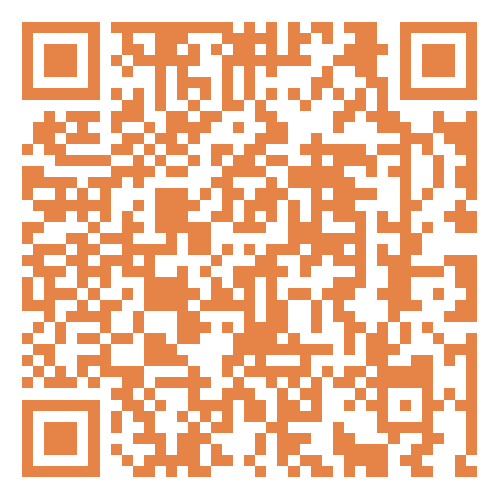
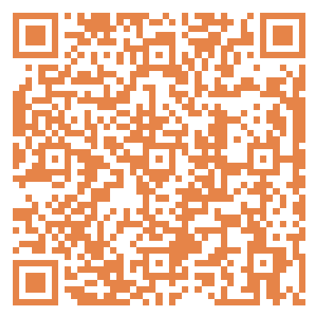
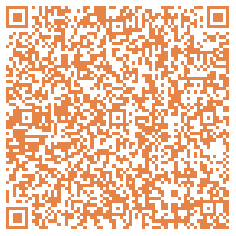
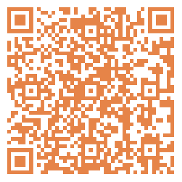
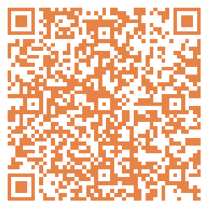
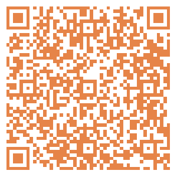
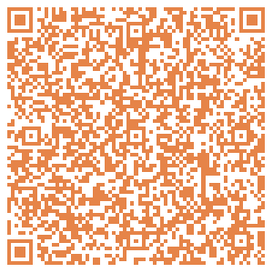
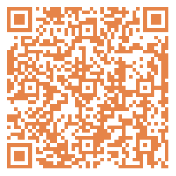
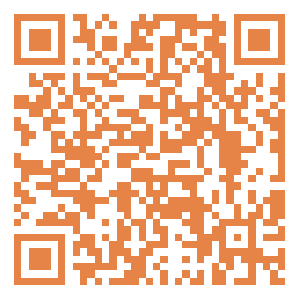

# 无标题

**链接地址:** http://mp.weixin.qq.com/s?__biz=MzI4NDYyNjAwNw==&mid=2247488344&idx=1&sn=cc56d7ace88d857d65f7e3d9248b7694&chksm=ebf9ce60dc8e47765b7e5acd7ecd5970d73e7b6396dc1e2e2a6c8f54ebcd7b84470a91b7c4b4&mpshare=1&scene=2&srcid=0427rRFadX8TPz45orQxUyPe&sharer_shareinfo=cb7ce3a6709e4aeaccc6e5d0c7e6d2b7&sharer_shareinfo_first=cb7ce3a6709e4aeaccc6e5d0c7e6d2b7#rd
**作者:** 欢迎转发
**获取时间:** 2025/8/28 18:57:34
**图片数量:** 13

---

## 原始HTML内容

<section style="font-size: 16px;"><section style="text-align: left;justify-content: flex-start;display: flex;flex-flow: row;margin-top: 20px;margin-bottom: 10px;"><section style="display: inline-block;width: auto;vertical-align: top;align-self: flex-start;flex: 0 0 auto;border-style: solid;border-width: 2px 0px 0px;border-top-color: rgb(180, 180, 180);min-width: 5%;height: auto;"><section style="justify-content: flex-start;display: flex;flex-flow: row;margin-top: -13px;"><section style="display: inline-block;vertical-align: top;width: auto;flex: 0 0 0%;height: auto;"><section style="text-align: right;margin-top: 7px;transform: translate3d(6px, 0px, 0px);"><section style="display: inline-block;width: 11px;height: 11px;vertical-align: top;overflow: hidden;border-style: solid;border-width: 3px;border-color: rgb(255, 255, 255);border-radius: 42px;background-color: rgb(237, 102, 15);"><section style="text-align: justify;">
 
</section></section></section></section><section style="display: inline-block;vertical-align: top;width: auto;align-self: flex-start;flex: 100 100 0%;border-style: solid;border-width: 0px 0px 0px 2px;border-left-color: rgb(180, 180, 180);height: auto;padding-top: 18px;padding-right: 11px;padding-left: 11px;"><section style="justify-content: flex-start;display: flex;flex-flow: row;"><section style="display: inline-block;vertical-align: middle;width: auto;align-self: center;flex: 0 0 auto;min-width: 5%;height: auto;background-color: rgb(237, 146, 15);padding-right: 5px;padding-left: 5px;margin-right: 6px;"><section style="text-align: justify;color: rgb(255, 255, 255);font-size: 15px;">
<strong>点击蓝字</strong>
</section></section><section style="display: inline-block;vertical-align: middle;width: auto;min-width: 5%;flex: 0 0 auto;height: auto;align-self: center;"><section style="text-align: justify;">
<strong style="text-align: center;">关注我们</strong>
</section></section></section></section></section></section></section>
 
<section style="margin: 20px 0%;"><section style="letter-spacing: 2px;font-size: 14px;color: rgb(121, 121, 121);padding-right: 20px;padding-left: 20px;line-height: 2;">
BadaB Consulting是一家成立于加拿大的<strong>人力资源咨询公司</strong>。今天，我们将要给大家分享几个正在招聘的阿省职位，找工作的小伙伴们祝你们好运！如果你需要简历修改和面试培训，也欢迎联系BadaB寻求帮助。
</section></section>
 
<section style="text-align: center;justify-content: center;display: flex;flex-flow: row;margin-top: 10px;margin-bottom: 10px;"><section style="display: inline-block;vertical-align: top;width: auto;flex: 0 0 0%;height: auto;"><section style="transform: perspective(0px);transform-style: flat;"><section style="transform: rotateY(180deg);"><section style="display: inline-block;width: 0px;height: 0px;vertical-align: top;overflow: hidden;border-style: solid;border-width: 0px 10px 44px 0px;border-color: rgba(255, 255, 255, 0) rgba(255, 255, 255, 0) rgb(237, 146, 15);"><section style="text-align: justify;">
 
</section></section></section></section></section><section style="display: inline-block;vertical-align: top;width: auto;align-self: stretch;flex: 0 0 auto;min-width: 5%;height: auto;padding: 8px 11px;background-color: rgb(237, 146, 15);"><section style="text-align: left;transform: translate3d(-4px, 0px, 0px);"><section style="text-align: justify;color: rgb(255, 255, 255);">
<strong>阿省五月职位招聘</strong>
</section></section></section><section style="display: inline-block;vertical-align: top;width: auto;align-self: stretch;flex: 0 0 auto;min-width: 5%;height: auto;line-height: 0.1;margin-left: -10px;"><section style="display: flex;width: 100%;flex-flow: column;"><section style="z-index: 1;"><section style="text-align: left;"><section style="display: inline-block;width: 0px;height: 0px;vertical-align: top;overflow: hidden;border-style: solid;border-width: 0px 10px 44px;border-color: rgba(255, 255, 255, 0) rgba(255, 255, 255, 0) rgb(237, 102, 15);"><section style="text-align: justify;">
 
</section></section></section></section></section></section></section><section style="text-align: center;margin-top: 10px;margin-bottom: 10px;line-height: 0;"><section style="vertical-align: middle;display: inline-block;line-height: 0;"></section></section>
 
<section style="text-align: left;justify-content: flex-start;display: flex;flex-flow: row;margin-top: 10px;margin-bottom: -10px;transform: translate3d(-4px, 0px, 0px);"><section style="display: inline-block;width: auto;vertical-align: top;align-self: flex-start;flex: 0 0 auto;min-width: 5%;height: auto;"><section style="transform: rotateX(340deg) rotateY(36deg);"><section style="text-align: center;justify-content: center;display: flex;flex-flow: row;"><section style="display: inline-block;width: auto;vertical-align: top;align-self: flex-start;flex: 0 0 auto;background-color: rgb(237, 146, 15);min-width: 5%;height: auto;padding-right: 9px;padding-left: 9px;border-style: solid;border-width: 2px;"><section style="font-size: 15px;">
<strong>01</strong>
</section></section></section></section></section></section><section style="text-align: left;justify-content: flex-start;display: flex;flex-flow: row;margin-bottom: 10px;"><section style="display: inline-block;width: auto;vertical-align: top;align-self: flex-start;flex: 0 0 auto;min-width: 5%;height: auto;padding: 8px 12px;border-style: solid;border-width: 2px 0px;border-top-color: rgb(180, 180, 180);border-bottom-color: rgb(180, 180, 180);"><section style="text-align: center;"><section style="text-align: justify;color: rgb(48, 48, 48);font-size: 24px;">
<strong>Non-ferrous Laborer</strong>
</section></section></section></section><section style="margin-right: 0%;margin-left: 0%;"><section style="display: inline-block;width: 100%;border-width: 1px;border-style: solid;border-color: rgba(0, 0, 0, 0);padding: 20px;box-shadow: rgba(0, 0, 0, 0) 0px 0px 0px;"><section style="text-align: left;justify-content: flex-start;display: flex;flex-flow: row;"><section style="display: inline-block;vertical-align: top;width: 50%;align-self: flex-start;flex: 0 0 auto;"><section style="text-align: justify;">
<strong>企业名称</strong>
</section><section style="margin-bottom: 10px;"><section style="text-align: justify;">
CAC Metal Recycling
</section></section><section style="text-align: justify;">
<strong>工作类型</strong>
</section><section style="margin-bottom: 10px;"><section style="text-align: justify;">
FULL-TIME, PERMANENT
</section></section></section><section style="display: inline-block;vertical-align: top;width: 50%;align-self: flex-start;flex: 0 0 auto;"><section style="text-align: center;margin-top: 10px;line-height: 0;"><section style="vertical-align: middle;display: inline-block;line-height: 0;width: 75%;height: auto;"></section></section><section style="text-align: center;font-size: 12px;color: rgb(180, 180, 180);">
职位详情及应聘方式
</section></section></section>
<strong>应聘要求</strong>
<section style="margin-bottom: 10px;"><section style="text-align: left;font-size: 13px;">
To perform this job successfully, an individual must be able to perform each essential duty satisfactorily. The requirements listed below are representative of the knowledge, skill, and/or ability required. Reasonable accommodations may be made to enable individuals with disabilities to perform the essential functions.
<ul class="list-paddingleft-2" style="padding-left: 40px;list-style-position: outside;"><li>
1+ year of hands-on non-ferrous metal experience
</li><li>
Understand and be able to grade all non-ferrous material properly
</li><li>
Metal recycling industry experience
</li><li>
Experience stripping equipment and/or with manual material sorting
</li><li>
Knowledge of non-ferrous processing
</li><li>
High school diploma (Or GED)
</li><li>
Well-articulated and assertive
</li><li>
Ability to effectively communicate and present information in one-on-one and small group situations to supervisors, maintenance personnel and other employees of the organization
</li><li>
Ability to read and comprehend simple instructions, short correspondence, and memos
</li><li>
Ability to write simple correspondence
</li><li>
Mechanically inclined an asset
</li><li>
Computer literate
</li></ul></section></section></section></section><section style="text-align: left;justify-content: flex-start;display: flex;flex-flow: row;margin-top: 10px;margin-bottom: -10px;transform: translate3d(-4px, 0px, 0px);"><section style="display: inline-block;width: auto;vertical-align: top;align-self: flex-start;flex: 0 0 auto;min-width: 5%;height: auto;"><section style="transform: rotateX(340deg) rotateY(36deg);"><section style="text-align: center;justify-content: center;display: flex;flex-flow: row;"><section style="display: inline-block;width: auto;vertical-align: top;align-self: flex-start;flex: 0 0 auto;background-color: rgb(237, 146, 15);min-width: 5%;height: auto;padding-right: 9px;padding-left: 9px;border-style: solid;border-width: 2px;"><section style="font-size: 15px;">
<strong>02</strong>
</section></section></section></section></section></section><section style="text-align: left;justify-content: flex-start;display: flex;flex-flow: row;margin-bottom: 10px;"><section style="display: inline-block;width: auto;vertical-align: top;align-self: flex-start;flex: 0 0 auto;min-width: 5%;height: auto;padding: 8px 12px;border-style: solid;border-width: 2px 0px;border-top-color: rgb(180, 180, 180);border-bottom-color: rgb(180, 180, 180);"><section style="text-align: center;"><section style="text-align: left;color: rgb(48, 48, 48);font-size: 24px;">
<strong>Children Program Site Liaison</strong>
</section></section></section></section><section style="margin-right: 0%;margin-left: 0%;"><section style="display: inline-block;width: 100%;border-width: 1px;border-style: solid;border-color: rgba(0, 0, 0, 0);padding: 20px;box-shadow: rgba(0, 0, 0, 0) 0px 0px 0px;"><section style="text-align: left;justify-content: flex-start;display: flex;flex-flow: row;"><section style="display: inline-block;vertical-align: top;width: 50%;align-self: flex-start;flex: 0 0 auto;"><section style="text-align: justify;">
<strong>企业名称</strong>
</section><section style="margin-bottom: 10px;">
Action for Healthy Communities
</section><section style="text-align: justify;">
<strong>工作类型</strong>
</section><section style="margin-bottom: 10px;"><section style="text-align: justify;">
FULL-TIME
</section></section></section><section style="display: inline-block;vertical-align: top;width: 50%;align-self: flex-start;flex: 0 0 auto;"><section style="text-align: center;margin-top: 10px;line-height: 0;"><section style="vertical-align: middle;display: inline-block;line-height: 0;width: 75%;height: auto;"></section></section><section style="text-align: center;font-size: 12px;color: rgb(180, 180, 180);">
职位详情及应聘方式
</section></section></section>
<strong>应聘要求</strong>
<section style="margin-bottom: 10px;"><section style="text-align: left;font-size: 13px;"><ul class="list-paddingleft-2" style="padding-left: 40px;list-style-position: outside;"><li>
Bachelor's degree in education, recreation management, child development, or a related field (or equivalent experience). 
</li><li>
At least 1 year of prior experience in after-school program administration, summer camp coordination, program coordination, or similar roles. 
</li><li>
Experience and knowledge working with diverse children and youth. 
</li><li>
Knowledge of child development and age-appropriate activities. 
</li><li>
Reliable means of transportation to travel program sites. 
</li><li>
Experience and skills in managing children's behavior effectively. 
</li><li>
Strong leadership and interpersonal skills, with the ability to motivate and inspire staff. 
</li><li>
Excellent organizational and time management abilities. 
</li><li>
First aid and CPR certification (or willingness to obtain). 
</li><li>
Ability to multitask and problem-solve in a fast-paced environment. 
</li><li>
Effective communication skills, both written and verbal. 
</li><li>
Passion for working with children and creating positive experiences. 
</li></ul></section></section></section></section><section style="text-align: left;justify-content: flex-start;display: flex;flex-flow: row;margin-top: 10px;margin-bottom: -10px;transform: translate3d(-4px, 0px, 0px);"><section style="display: inline-block;width: auto;vertical-align: top;align-self: flex-start;flex: 0 0 auto;min-width: 5%;height: auto;"><section style="transform: rotateX(340deg) rotateY(36deg);"><section style="text-align: center;justify-content: center;display: flex;flex-flow: row;"><section style="display: inline-block;width: auto;vertical-align: top;align-self: flex-start;flex: 0 0 auto;background-color: rgb(237, 146, 15);min-width: 5%;height: auto;padding-right: 9px;padding-left: 9px;border-style: solid;border-width: 2px;"><section style="font-size: 15px;">
<strong>03</strong>
</section></section></section></section></section></section><section style="text-align: left;justify-content: flex-start;display: flex;flex-flow: row;margin-bottom: 10px;"><section style="display: inline-block;width: auto;vertical-align: top;align-self: flex-start;flex: 0 0 auto;min-width: 5%;height: auto;padding: 8px 12px;border-style: solid;border-width: 2px 0px;border-top-color: rgb(180, 180, 180);border-bottom-color: rgb(180, 180, 180);"><section style="text-align: center;"><section style="text-align: left;color: rgb(48, 48, 48);font-size: 24px;">
<strong>Director of Maintenance and Project Management</strong>
</section></section></section></section><section style="margin-right: 0%;margin-left: 0%;"><section style="display: inline-block;width: 100%;border-width: 1px;border-style: solid;border-color: rgba(0, 0, 0, 0);padding: 20px;box-shadow: rgba(0, 0, 0, 0) 0px 0px 0px;"><section style="text-align: left;justify-content: flex-start;display: flex;flex-flow: row;"><section style="display: inline-block;vertical-align: top;width: 50%;align-self: flex-start;flex: 0 0 auto;"><section style="text-align: justify;">
<strong>企业名称</strong>
</section><section style="margin-bottom: 10px;">
Grande Spirit Foundation
</section><section style="text-align: justify;">
<strong>工作类型</strong>
</section><section style="margin-bottom: 10px;"><section style="text-align: justify;">
Full Time
</section></section></section><section style="display: inline-block;vertical-align: top;width: 50%;align-self: flex-start;flex: 0 0 auto;"><section style="text-align: center;margin-top: 10px;line-height: 0;"><section style="vertical-align: middle;display: inline-block;line-height: 0;width: 75%;height: auto;"></section></section><section style="text-align: center;font-size: 12px;color: rgb(180, 180, 180);">
职位详情及应聘方式
</section></section></section>
<strong>应聘要求</strong>
<section style="margin-bottom: 10px;"><section style="text-align: left;font-size: 13px;"><ul class="list-paddingleft-2" style="padding-left: 40px;list-style-position: outside;"><li>
Post-secondary university degree or diploma in building project management, construction, architecture,engineering, interior design, or a related field with professional industry credentials such as PMP, P.Eng., ASET,or other similar professional designation is a requirement
</li><li>
5+ years of working experience in project management with a clear understanding of design and constructionpractices and methodology, sizeable complex project delivery and partnerships.
</li><li>
Must be a technically strong person who knows various construction methodologies and project managementmodels, as well as relevant codes, contract law, and legislation.
</li><li>
Demonstrate strong leadership qualities with a successful track record of engaging internal and externalstakeholders.
</li><li>
Experience leading the preparation of bids, RFP/Q’s/I’s, tenders and tender awards, and cost estimation
</li><li>
Previous exposure to capital and project budget planning for public works projects is an asset
</li><li>
Strong working knowledge of industry regulations and legislative guidelines, especially regulations related tosenior housing
</li><li>
Ability to make decisions and manage multiple priorities and deadlines
</li><li>
Excellent computer skills with a working knowledge of Microsoft Office and SharePoint
</li><li>
Detail-oriented, accurate, precise, and proactive
</li><li>
Flexible and effectively manage multiple competing priorities and deadlines.
</li><li>
Superior leadership qualities in a unionized environment with excellent verbal and written communicationskills
</li><li>
Must have a valid Driver's License and a reliable mode of transportation travel to project sites around theGrande Prairie region
</li></ul></section></section></section></section><section style="text-align: left;justify-content: flex-start;display: flex;flex-flow: row;margin-top: 10px;margin-bottom: -10px;transform: translate3d(-4px, 0px, 0px);"><section style="display: inline-block;width: auto;vertical-align: top;align-self: flex-start;flex: 0 0 auto;min-width: 5%;height: auto;"><section style="transform: rotateX(340deg) rotateY(36deg);"><section style="text-align: center;justify-content: center;display: flex;flex-flow: row;"><section style="display: inline-block;width: auto;vertical-align: top;align-self: flex-start;flex: 0 0 auto;background-color: rgb(237, 146, 15);min-width: 5%;height: auto;padding-right: 9px;padding-left: 9px;border-style: solid;border-width: 2px;"><section style="font-size: 15px;">
<strong>04</strong>
</section></section></section></section></section></section><section style="text-align: left;justify-content: flex-start;display: flex;flex-flow: row;margin-bottom: 10px;"><section style="display: inline-block;width: auto;vertical-align: top;align-self: flex-start;flex: 0 0 auto;min-width: 5%;height: auto;padding: 8px 12px;border-style: solid;border-width: 2px 0px;border-top-color: rgb(180, 180, 180);border-bottom-color: rgb(180, 180, 180);"><section style="text-align: center;"><section style="text-align: left;color: rgb(48, 48, 48);font-size: 24px;">
<strong>Career Advisor</strong>
</section></section></section></section><section style="margin-right: 0%;margin-left: 0%;"><section style="display: inline-block;width: 100%;border-width: 1px;border-style: solid;border-color: rgba(0, 0, 0, 0);padding: 20px;box-shadow: rgba(0, 0, 0, 0) 0px 0px 0px;"><section style="text-align: left;justify-content: flex-start;display: flex;flex-flow: row;"><section style="display: inline-block;vertical-align: top;width: 50%;align-self: flex-start;flex: 0 0 auto;"><section style="text-align: justify;">
<strong>企业名称</strong>
</section><section style="margin-bottom: 10px;">
Prospect
</section><section style="text-align: justify;">
<strong>工作类型</strong>
</section><section style="margin-bottom: 10px;"><section style="text-align: justify;">
FULL-TIME
</section></section></section><section style="display: inline-block;vertical-align: top;width: 50%;align-self: flex-start;flex: 0 0 auto;"><section style="text-align: center;margin-top: 10px;line-height: 0;"><section style="vertical-align: middle;display: inline-block;line-height: 0;width: 75%;height: auto;"></section></section><section style="text-align: center;font-size: 12px;color: rgb(180, 180, 180);">
职位详情及应聘方式
</section></section></section>
<strong>应聘要求</strong>
<section style="margin-bottom: 10px;"><section style="text-align: left;font-size: 13px;"><ul class="list-paddingleft-1" style="padding-left: 40px;list-style-position: outside;"><li>
Post-secondary education in a relevant program. A Career Development professional designation is an asset 
</li><li>
2+ years working with youth and experience utilizing a strength based, trauma informed approach 
</li><li>
Experience in pre-employment and essential skill development knowledge, such as: job search techniques to tap into the hidden job market; resume and cover letter development; and interviewing skills and techniques to prepare clients 
</li><li>
Experience developing and delivering career related workshops 
</li><li>
Innovative with the ability to take initiative 
</li><li>
Problem solving and critical thinking skills 
</li><li>
Intermediate skill level in Microsoft Office (Word, Outlook, PowerPoint, Excel) 
</li><li>
Experience with Sales Force is an asset 
</li><li>
Professional, driven, charismatic, reliable, and confident individual who thrives under pressure 
</li></ul></section></section></section></section><section style="text-align: left;justify-content: flex-start;display: flex;flex-flow: row;margin-top: 10px;margin-bottom: -10px;transform: translate3d(-4px, 0px, 0px);"><section style="display: inline-block;width: auto;vertical-align: top;align-self: flex-start;flex: 0 0 auto;min-width: 5%;height: auto;"><section style="transform: rotateX(340deg) rotateY(36deg);"><section style="text-align: center;justify-content: center;display: flex;flex-flow: row;"><section style="display: inline-block;width: auto;vertical-align: top;align-self: flex-start;flex: 0 0 auto;background-color: rgb(237, 146, 15);min-width: 5%;height: auto;padding-right: 9px;padding-left: 9px;border-style: solid;border-width: 2px;"><section style="font-size: 15px;">
<strong>05</strong>
</section></section></section></section></section></section><section style="text-align: left;justify-content: flex-start;display: flex;flex-flow: row;margin-bottom: 10px;"><section style="display: inline-block;width: auto;vertical-align: top;align-self: flex-start;flex: 0 0 auto;min-width: 5%;height: auto;padding: 8px 12px;border-style: solid;border-width: 2px 0px;border-top-color: rgb(180, 180, 180);border-bottom-color: rgb(180, 180, 180);"><section style="text-align: center;"><section style="text-align: left;color: rgb(48, 48, 48);font-size: 24px;">
<strong>Youth Clinical Oversight Lead</strong>
</section></section></section></section><section style="margin-right: 0%;margin-left: 0%;"><section style="display: inline-block;width: 100%;border-width: 1px;border-style: solid;border-color: rgba(0, 0, 0, 0);padding: 20px;box-shadow: rgba(0, 0, 0, 0) 0px 0px 0px;"><section style="text-align: left;justify-content: flex-start;display: flex;flex-flow: row;"><section style="display: inline-block;vertical-align: top;width: 50%;align-self: flex-start;flex: 0 0 auto;"><section style="text-align: justify;">
<strong>企业名称</strong>
</section><section style="margin-bottom: 10px;">
e4c
</section><section style="text-align: justify;">
<strong>工作类型</strong>
</section><section style="margin-bottom: 10px;"><section style="text-align: justify;">
FULL-TIME
</section></section></section><section style="display: inline-block;vertical-align: top;width: 50%;align-self: flex-start;flex: 0 0 auto;"><section style="text-align: center;margin-top: 10px;line-height: 0;"><section style="vertical-align: middle;display: inline-block;line-height: 0;width: 75%;height: auto;"></section></section><section style="text-align: center;font-size: 12px;color: rgb(180, 180, 180);">
职位详情及应聘方式
</section></section></section>
<strong>应聘要求</strong>
<section style="margin-bottom: 10px;"><section style="text-align: left;font-size: 13px;">
Education and Certifications
<ul class="list-paddingleft-2" style="padding-left: 40px;list-style-position: outside;"><li>
Graduate degree in psychology, social work (with psycho-social intervention designation) or occupational therapy.
</li><li>
Licensed in accordance with the Health Professions Act and provides services in accordance with professional standards, guidelines, and ethics. 
</li><li>
Police Check with Vulnerable Sector
</li><li>
Intervention Record Check
</li><li>
Standard First Aid
</li><li>
Indigenous Awareness
</li><li>
Medication Administration
</li><li>
Suicide Intervention
</li><li>
De-Escalation
</li><li>
Trauma Informed Care
</li><li>
Harm Reduction
</li></ul>
Experience
<ul class="list-paddingleft-1" style="padding-left: 40px;list-style-position: outside;"><li>
3+ years of clinical practice in child and family mental health and/or youth addictions.
</li><li>
Must be a member in good standing with their respective professional association/college.
</li><li>
Knowledge and experience in supporting the healing of youth who have experience trauma.
</li><li>
Knowledge and experience in the following therapeutic modalities: cognitive, behavioral therapy, solution-focused therapy, crisis intervention, narrative therapy and emotionally focused therapy.
</li><li>
Strong crisis intervention/de-escalation training/skills.
</li><li>
Demonstrated experience de-escalating crisis and potentially violent situations with individuals under the influence of drugs or alcohol, under extreme stress &amp;/or struggling with acute/chronic mental health crises.
</li><li>
Extensive background and experience working with youth struggling with substance use/addictions, poverty, mental health, traumatic histories, LGBTQ2S+, and Newcomers to Canada and/or refugees. Understanding and ability to respond to multiple, complex barriers faced by youth.
</li><li>
Proficient in MS Outlook, Word, Excel, database applications and computer operation.
</li></ul></section></section></section></section><section style="text-align: left;justify-content: flex-start;display: flex;flex-flow: row;margin-top: 10px;margin-bottom: -10px;transform: translate3d(-4px, 0px, 0px);"><section style="display: inline-block;width: auto;vertical-align: top;align-self: flex-start;flex: 0 0 auto;min-width: 5%;height: auto;"><section style="transform: rotateX(340deg) rotateY(36deg);"><section style="text-align: center;justify-content: center;display: flex;flex-flow: row;"><section style="display: inline-block;width: auto;vertical-align: top;align-self: flex-start;flex: 0 0 auto;background-color: rgb(237, 146, 15);min-width: 5%;height: auto;padding-right: 9px;padding-left: 9px;border-style: solid;border-width: 2px;"><section style="font-size: 15px;">
<strong>06</strong>
</section></section></section></section></section></section><section style="text-align: left;justify-content: flex-start;display: flex;flex-flow: row;margin-bottom: 10px;"><section style="display: inline-block;width: auto;vertical-align: top;align-self: flex-start;flex: 0 0 auto;min-width: 5%;height: auto;padding: 8px 12px;border-style: solid;border-width: 2px 0px;border-top-color: rgb(180, 180, 180);border-bottom-color: rgb(180, 180, 180);"><section style="text-align: center;"><section style="text-align: left;color: rgb(48, 48, 48);font-size: 24px;">
<strong>Accountant</strong>
</section></section></section></section><section style="margin-right: 0%;margin-left: 0%;"><section style="display: inline-block;width: 100%;border-width: 1px;border-style: solid;border-color: rgba(0, 0, 0, 0);padding: 20px;box-shadow: rgba(0, 0, 0, 0) 0px 0px 0px;"><section style="text-align: left;justify-content: flex-start;display: flex;flex-flow: row;"><section style="display: inline-block;vertical-align: top;width: 50%;align-self: flex-start;flex: 0 0 auto;"><section style="text-align: justify;">
<strong>企业名称</strong>
</section><section style="margin-bottom: 10px;">
Town of Stony Plain
</section><section style="text-align: justify;">
<strong>工作类型</strong>
</section><section style="margin-bottom: 10px;"><section style="text-align: justify;">
FULL-TIME,

TEMPORARY
</section></section></section><section style="display: inline-block;vertical-align: top;width: 50%;align-self: flex-start;flex: 0 0 auto;"><section style="text-align: center;margin-top: 10px;line-height: 0;"><section style="vertical-align: middle;display: inline-block;line-height: 0;width: 75%;height: auto;"></section></section><section style="text-align: center;font-size: 12px;color: rgb(180, 180, 180);">
职位详情及应聘方式
</section></section></section>
<strong>应聘要求</strong>
<section style="margin-bottom: 10px;"><section style="text-align: left;font-size: 13px;">
Level of education and experience required:&nbsp;
<ul class="list-paddingleft-1" style="padding-left: 40px;list-style-position: outside;"><li>
Related Diploma or Bachelor Degree
</li><li>
Three to five years’ experience in Accounting processes in a municipal setting or equivalent&nbsp;
</li></ul>
Required designations, licenses, Certificates required:&nbsp;
<ul class="list-paddingleft-1" style="padding-left: 40px;list-style-position: outside;"><li>
Accounting designation (considered an asset)&nbsp;
</li></ul>
Required Knowledge, Skills and Abilities:&nbsp;
<ul class="list-paddingleft-1" style="padding-left: 40px;list-style-position: outside;"><li>
Better than average Interpersonal communication skills
</li><li>
Excellent organizational skills&nbsp;
</li><li>
Strong Customer Service Orientation&nbsp;
</li><li>
Ability to adapt to varying workloads and time line
</li></ul>
Software/Technology
<ul class="list-paddingleft-1" style="padding-left: 40px;list-style-position: outside;"><li>
Training in Microsoft Office applications (Word and Excel)
</li></ul></section></section></section></section><section style="text-align: left;justify-content: flex-start;display: flex;flex-flow: row;margin-top: 10px;margin-bottom: -10px;transform: translate3d(-4px, 0px, 0px);"><section style="display: inline-block;width: auto;vertical-align: top;align-self: flex-start;flex: 0 0 auto;min-width: 5%;height: auto;"><section style="transform: rotateX(340deg) rotateY(36deg);"><section style="text-align: center;justify-content: center;display: flex;flex-flow: row;"><section style="display: inline-block;width: auto;vertical-align: top;align-self: flex-start;flex: 0 0 auto;background-color: rgb(237, 146, 15);min-width: 5%;height: auto;padding-right: 9px;padding-left: 9px;border-style: solid;border-width: 2px;"><section style="font-size: 15px;">
<strong>07</strong>
</section></section></section></section></section></section><section style="text-align: left;justify-content: flex-start;display: flex;flex-flow: row;margin-bottom: 10px;"><section style="display: inline-block;width: auto;vertical-align: top;align-self: flex-start;flex: 0 0 auto;min-width: 5%;height: auto;padding: 8px 12px;border-style: solid;border-width: 2px 0px;border-top-color: rgb(180, 180, 180);border-bottom-color: rgb(180, 180, 180);"><section style="text-align: center;"><section style="text-align: left;color: rgb(48, 48, 48);font-size: 24px;">
<strong>Student Recruitment Coordinator</strong>
</section></section></section></section><section style="margin-right: 0%;margin-left: 0%;"><section style="display: inline-block;width: 100%;border-width: 1px;border-style: solid;border-color: rgba(0, 0, 0, 0);padding: 20px;box-shadow: rgba(0, 0, 0, 0) 0px 0px 0px;"><section style="text-align: left;justify-content: flex-start;display: flex;flex-flow: row;"><section style="display: inline-block;vertical-align: top;width: 50%;align-self: flex-start;flex: 0 0 auto;"><section style="text-align: justify;">
<strong>企业名称</strong>
</section><section style="margin-bottom: 10px;">
NorQuest College
</section><section style="text-align: justify;">
<strong>工作类型</strong>
</section><section style="margin-bottom: 10px;"><section style="text-align: justify;">
FULL-TIME,&nbsp;

PERMANENT
</section></section></section><section style="display: inline-block;vertical-align: top;width: 50%;align-self: flex-start;flex: 0 0 auto;"><section style="text-align: center;margin-top: 10px;line-height: 0;"><section style="vertical-align: middle;display: inline-block;line-height: 0;width: 75%;height: auto;"></section></section><section style="text-align: center;font-size: 12px;color: rgb(180, 180, 180);">
职位详情及应聘方式
</section></section></section>
<strong>应聘要求</strong>
<section style="margin-bottom: 10px;"><section style="text-align: left;font-size: 13px;"><ul class="list-paddingleft-2" style="padding-left: 40px;list-style-position: outside;"><li>
Completion of a University Degree preferred, but a combination of education and experience will be considered.
</li><li>
2+ years’ experience in a student services/recruitment administrative capacity, preferably in a post-secondary environment.
</li><li>
Previous sales experience and event planning is considered an asset.
</li><li>
Ability to set priorities, multi-task, and work with minimal supervision and remain focused on objectives. 
</li><li>
Demonstrated event management skills. 
</li><li>
Excellent organizational and time management skills. 
</li><li>
Superior interpersonal skills including relationship building, tact, diplomacy, and discretion. 
</li><li>
Demonstrated skill in public speaking and public relations. 
</li><li>
Excellent oral and written communication skills. 
</li><li>
Ability to respond quickly to changing client/environmental needs. 
</li><li>
Proficiency with Microsoft Office including Excel and PowerPoint at an intermediate-to-expert level. 
</li><li>
Analytical and problem-solving skills. 
</li><li>
An understanding of entrance requirements and/or career opportunities and knowledge of the post-secondary system. 
</li><li>
Experience using CRM systems and social media platforms. 
</li><li>
Availability must include evenings and weekends.
</li></ul>
 
</section></section></section></section><section style="text-align: left;justify-content: flex-start;display: flex;flex-flow: row;margin-top: 10px;margin-bottom: -10px;transform: translate3d(-4px, 0px, 0px);"><section style="display: inline-block;width: auto;vertical-align: top;align-self: flex-start;flex: 0 0 auto;min-width: 5%;height: auto;"><section style="transform: rotateX(340deg) rotateY(36deg);"><section style="text-align: center;justify-content: center;display: flex;flex-flow: row;"><section style="display: inline-block;width: auto;vertical-align: top;align-self: flex-start;flex: 0 0 auto;background-color: rgb(237, 146, 15);min-width: 5%;height: auto;padding-right: 9px;padding-left: 9px;border-style: solid;border-width: 2px;"><section style="font-size: 15px;">
<strong>08</strong>
</section></section></section></section></section></section><section style="text-align: left;justify-content: flex-start;display: flex;flex-flow: row;margin-bottom: 10px;"><section style="display: inline-block;width: auto;vertical-align: top;align-self: flex-start;flex: 0 0 auto;min-width: 5%;height: auto;padding: 8px 12px;border-style: solid;border-width: 2px 0px;border-top-color: rgb(180, 180, 180);border-bottom-color: rgb(180, 180, 180);"><section style="text-align: center;"><section style="text-align: left;color: rgb(48, 48, 48);font-size: 24px;">
<strong>Lead Processing Team Member</strong> 
</section></section></section></section><section style="margin-right: 0%;margin-left: 0%;"><section style="display: inline-block;width: 100%;border-width: 1px;border-style: solid;border-color: rgba(0, 0, 0, 0);padding: 20px;box-shadow: rgba(0, 0, 0, 0) 0px 0px 0px;"><section style="text-align: left;justify-content: flex-start;display: flex;flex-flow: row;"><section style="display: inline-block;vertical-align: top;width: 50%;align-self: flex-start;flex: 0 0 auto;"><section style="text-align: justify;">
<strong>企业名称</strong>
</section><section style="margin-bottom: 10px;">
Goodwill
</section><section style="text-align: justify;">
<strong>工作类型</strong>
</section><section style="margin-bottom: 10px;"><section style="text-align: justify;">
FULL-TIME
</section></section></section><section style="display: inline-block;vertical-align: top;width: 50%;align-self: flex-start;flex: 0 0 auto;"><section style="text-align: center;margin-top: 10px;line-height: 0;"><section style="vertical-align: middle;display: inline-block;line-height: 0;width: 75%;height: auto;"></section></section><section style="text-align: center;font-size: 12px;color: rgb(180, 180, 180);">
职位详情及应聘方式
</section></section></section>
<strong>应聘要求</strong>
<section style="margin-bottom: 10px;"><section style="text-align: left;font-size: 13px;"><ul class="list-paddingleft-2" style="padding-left: 40px;list-style-position: outside;"><li>
A High School Diploma or equivalent work experience. 
</li><li>
Minimum age of 15 or older. 
</li><li>
Must be eligible to work in Canada. 
</li><li>
The ability to work well in a team-oriented environment. 
</li><li>
The ability to work a flexible work schedule, including evenings and weekends. 
</li><li>
The ability to perform physical work on a continual basis. 
</li><li>
Knowledge of designer labels, collectibles and antiques. (A strong asset but not a deal-breaker) 
</li><li>
You deliver amazing customer service by going above and beyond for all Goodwill customers. 
</li><li>
You demonstrate teamwork and engage fellow Team Members in contributing to Goodwill’s mission &amp; core purpose. 
</li><li>
You have an open and honest attitude while making moral decisions. 
</li><li>
You recognize the great efforts of fellow Team Members through genuine recognition activities. 
</li><li>
You contribute to a welcoming &amp; accepting work environment by showing respect at all times. 
</li><li>
You hold yourself and fellow Team Members accountable in their roles and for their contributions to Goodwill’s mission &amp; core purpose.&nbsp; 
</li><li>
You continuously look to improve yourself and the organization in any aspect including but not limited to processes, communications, tasks and customer experience. 
</li><li>
You prioritize safety in all tasks, ensuring safety of self as well as fellow Team Members. 
</li></ul></section></section></section></section><section style="text-align: left;justify-content: flex-start;display: flex;flex-flow: row;margin-top: 10px;margin-bottom: -10px;transform: translate3d(-4px, 0px, 0px);"><section style="display: inline-block;width: auto;vertical-align: top;align-self: flex-start;flex: 0 0 auto;min-width: 5%;height: auto;"><section style="transform: rotateX(340deg) rotateY(36deg);"><section style="text-align: center;justify-content: center;display: flex;flex-flow: row;"><section style="display: inline-block;width: auto;vertical-align: top;align-self: flex-start;flex: 0 0 auto;background-color: rgb(237, 146, 15);min-width: 5%;height: auto;padding-right: 9px;padding-left: 9px;border-style: solid;border-width: 2px;"><section style="font-size: 15px;">
<strong>09</strong>
</section></section></section></section></section></section><section style="text-align: left;justify-content: flex-start;display: flex;flex-flow: row;margin-bottom: 10px;"><section style="display: inline-block;width: auto;vertical-align: top;align-self: flex-start;flex: 0 0 auto;min-width: 5%;height: auto;padding: 8px 12px;border-style: solid;border-width: 2px 0px;border-top-color: rgb(180, 180, 180);border-bottom-color: rgb(180, 180, 180);"><section style="text-align: center;"><section style="text-align: left;color: rgb(48, 48, 48);font-size: 24px;">
<strong>Camp Counsellor</strong> 
</section></section></section></section><section style="margin-right: 0%;margin-left: 0%;"><section style="display: inline-block;width: 100%;border-width: 1px;border-style: solid;border-color: rgba(0, 0, 0, 0);padding: 20px;box-shadow: rgba(0, 0, 0, 0) 0px 0px 0px;"><section style="text-align: left;justify-content: flex-start;display: flex;flex-flow: row;"><section style="display: inline-block;vertical-align: top;width: 50%;align-self: flex-start;flex: 0 0 auto;"><section style="text-align: justify;">
<strong>企业名称</strong>
</section><section style="margin-bottom: 10px;">
Action for Healthy Communities
</section><section style="text-align: justify;">
<strong>工作类型</strong>
</section><section style="margin-bottom: 10px;"><section style="text-align: justify;">
FULL-TIME, TEMPORARY
</section></section></section><section style="display: inline-block;vertical-align: top;width: 50%;align-self: flex-start;flex: 0 0 auto;"><section style="text-align: center;margin-top: 10px;line-height: 0;"><section style="vertical-align: middle;display: inline-block;line-height: 0;width: 75%;height: auto;"></section></section><section style="text-align: center;font-size: 12px;color: rgb(180, 180, 180);">
职位详情及应聘方式
</section></section></section>
<strong>应聘要求</strong>
<section style="margin-bottom: 10px;"><section style="text-align: left;font-size: 13px;"><ul class="list-paddingleft-1" style="padding-left: 40px;list-style-position: outside;"><li>
Experience working with children and youth, especially working with new immigrants 
</li><li>
Strong leadership skills and possess cultural sensitivity 
</li><li>
Proficient Public speaking skills and confident facilitation skills 
</li><li>
Good communication skills 
</li><li>
Proficient Computer skills in spreadsheet, word, PowerPoint, online meetings, social media skills, other online tools such as Kahoot, Mural, Online Games, Canva, Prezi presentation 
</li><li>
Candidates currently enrolled in or who have completed related field of study is an asset 
</li><li>
Speak other languages than English is an asset 
</li><li>
Clear criminal record check with vulnerable sector check is required
</li></ul></section></section></section></section><section style="text-align: left;justify-content: flex-start;display: flex;flex-flow: row;margin-top: 10px;margin-bottom: -10px;transform: translate3d(-4px, 0px, 0px);"><section style="display: inline-block;width: auto;vertical-align: top;align-self: flex-start;flex: 0 0 auto;min-width: 5%;height: auto;"><section style="transform: rotateX(340deg) rotateY(36deg);"><section style="text-align: center;justify-content: center;display: flex;flex-flow: row;"><section style="display: inline-block;width: auto;vertical-align: top;align-self: flex-start;flex: 0 0 auto;background-color: rgb(237, 146, 15);min-width: 5%;height: auto;padding-right: 9px;padding-left: 9px;border-style: solid;border-width: 2px;"><section style="font-size: 15px;">
<strong>10</strong>
</section></section></section></section></section></section><section style="text-align: left;justify-content: flex-start;display: flex;flex-flow: row;margin-bottom: 10px;"><section style="display: inline-block;width: auto;vertical-align: top;align-self: flex-start;flex: 0 0 auto;min-width: 5%;height: auto;padding: 8px 12px;border-style: solid;border-width: 2px 0px;border-top-color: rgb(180, 180, 180);border-bottom-color: rgb(180, 180, 180);"><section style="text-align: center;"><section style="text-align: left;color: rgb(48, 48, 48);font-size: 20px;">
<strong>Volunteer </strong>
</section></section></section></section><section style="margin-right: 0%;margin-left: 0%;"><section style="display: inline-block;width: 100%;border-width: 1px;border-style: solid;border-color: rgba(0, 0, 0, 0);padding: 20px;box-shadow: rgba(0, 0, 0, 0) 0px 0px 0px;"><section style="text-align: left;justify-content: flex-start;display: flex;flex-flow: row;"><section style="display: inline-block;vertical-align: top;width: 50%;align-self: flex-start;flex: 0 0 auto;"><section style="text-align: justify;">
<strong>企业名称</strong>
</section><section style="margin-bottom: 10px;">
Barrhead &amp; District FCSS
</section><section style="text-align: justify;">
<strong>工作类型</strong>
</section><section style="margin-bottom: 10px;"><section style="text-align: justify;">
Volunteer
</section></section></section><section style="display: inline-block;vertical-align: top;width: 50%;align-self: flex-start;flex: 0 0 auto;"><section style="text-align: center;margin-top: 10px;line-height: 0;"><section style="vertical-align: middle;display: inline-block;line-height: 0;width: 75%;height: auto;"></section></section><section style="text-align: center;font-size: 12px;color: rgb(180, 180, 180);">
职位详情及应聘方式
</section></section></section>
<strong>志愿者机会</strong> 
<section style="margin-bottom: 10px;"><section style="text-align: left;font-size: 13px;"><ul class="list-paddingleft-2" style="padding-left: 40px;list-style-position: outside;"><li>
Food Bank 
</li><li>
Family Connections
</li><li>
Seniors Programs
</li><li>
Meals on Wheels (Driver)
</li><li>
Compass Facilitator
</li><li>
School Hot Lunch Program
</li><li>
In School Mentor
</li><li>
Newcomer Welcome Basket
</li><li>
Community Event Committees
</li><li>
Community Volunteer Inc Tax
</li><li>
Coats For Kids
</li><li>
Christmas Programs
</li><li>
Snow Angels
</li><li>
Collective Kitchen
</li></ul></section></section></section></section>
 
<section style="margin: 10px 0%;text-align: center;justify-content: center;display: flex;flex-flow: row;"><section style="display: inline-block;width: 100%;vertical-align: top;background-color: rgba(255, 174, 174, 0.13);padding-right: 10px;padding-left: 10px;align-self: flex-start;flex: 0 0 auto;"><section style="display: flex;flex-flow: row;margin: -5px 0%;justify-content: center;"><section style="display: inline-block;width: auto;vertical-align: middle;min-width: 10%;flex: 0 0 auto;height: auto;border-style: solid;border-width: 1px;border-color: rgb(237, 128, 15);padding: 4px;background-color: rgb(255, 255, 255);box-shadow: rgb(255, 255, 255) 0px 0px 0px inset;align-self: center;"><section style="justify-content: center;display: flex;flex-flow: row;"><section style="display: inline-block;width: 100%;vertical-align: top;border-width: 0px;background-color: rgba(255, 174, 174, 0.13);padding-right: 10px;padding-left: 10px;align-self: flex-start;flex: 0 0 auto;"><section style="color: rgb(106, 106, 106);letter-spacing: 1px;text-align: justify;">
<strong>关于我们</strong>
</section></section></section></section></section></section></section>
 
<section style="text-align: center;margin: 10px 0%;justify-content: center;display: flex;flex-flow: row;"><section style="display: inline-block;width: 90%;vertical-align: top;border-style: solid;border-width: 2px;border-color: rgb(237, 128, 15);letter-spacing: 0px;padding: 10px;align-self: flex-start;flex: 0 0 auto;"><section style="justify-content: center;display: flex;flex-flow: row;"><section style="display: inline-block;vertical-align: middle;width: 40%;align-self: center;flex: 0 0 auto;"><section style="margin-right: 0%;margin-left: 0%;line-height: 0;"><section style="vertical-align: middle;display: inline-block;line-height: 0;border-width: 0px;width: 100%;"></section></section></section><section style="display: inline-block;vertical-align: middle;width: 60%;padding-left: 10px;align-self: center;flex: 0 0 auto;"><section style="margin-right: 0%;margin-bottom: 5px;margin-left: 0%;"><section style="display: inline-block;border-width: 2px;border-style: solid;border-color: rgb(237, 128, 15);padding: 0.1em 0.3em;background-color: rgb(237, 128, 15);color: rgb(255, 255, 255);font-size: 12px;">
<strong>Ada&nbsp; Tai</strong>
</section></section><section style="margin-right: 0%;margin-left: 0%;"><section style="font-size: 13px;">
<strong>MBA, CPHR, SHRM-SCP</strong>
</section></section><section style="justify-content: center;display: flex;flex-flow: row;"><section style="display: inline-block;vertical-align: middle;width: 10%;border-width: 0px;align-self: center;flex: 0 0 auto;"><section style="margin: 5px 0%;text-align: left;font-size: 0px;"><section style="padding: 4px;display: inline-block;background-color: rgb(237, 128, 15);"><section style="border-color: rgba(255, 255, 255, 0);width: 1.6em;height: 1.6em;border-style: solid;border-width: 1px;text-align: center;line-height: 1.5em;color: rgb(255, 255, 255);">
 
</section></section></section></section><section style="display: inline-block;vertical-align: middle;width: 90%;align-self: center;flex: 0 0 auto;"><section style="font-size: 12px;text-align: justify;">
修改简历与求职信
</section></section></section><section style="justify-content: center;display: flex;flex-flow: row;"><section style="display: inline-block;vertical-align: middle;width: 10%;align-self: center;flex: 0 0 auto;"><section style="margin: 5px 0%;text-align: left;font-size: 0px;"><section style="padding: 4px;display: inline-block;background-color: rgb(237, 128, 15);"><section style="border-color: rgba(255, 255, 255, 0);width: 1.6em;height: 1.6em;border-style: solid;border-width: 1px;text-align: center;line-height: 1.5em;color: rgb(255, 255, 255);">
 
</section></section></section></section><section style="display: inline-block;vertical-align: middle;width: 90%;align-self: center;flex: 0 0 auto;"><section style="font-size: 12px;text-align: justify;">
培训面试
</section></section></section><section style="justify-content: center;display: flex;flex-flow: row;"><section style="display: inline-block;vertical-align: middle;width: 10%;border-width: 0px;align-self: center;flex: 0 0 auto;"><section style="margin: 5px 0%;text-align: left;font-size: 0px;"><section style="padding: 4px;display: inline-block;background-color: rgb(237, 128, 15);"><section style="border-color: rgba(255, 255, 255, 0);width: 1.6em;height: 1.6em;border-style: solid;border-width: 1px;text-align: center;line-height: 1.5em;color: rgb(255, 255, 255);">
 
</section></section></section></section><section style="display: inline-block;vertical-align: middle;width: 90%;align-self: center;flex: 0 0 auto;"><section style="font-size: 12px;text-align: justify;">
建立LinkedIn Profile
</section></section></section><section style="justify-content: center;display: flex;flex-flow: row;"><section style="display: inline-block;vertical-align: middle;width: 10%;align-self: center;flex: 0 0 auto;"><section style="margin: 5px 0%;text-align: left;font-size: 0px;"><section style="padding: 4px;display: inline-block;background-color: rgb(237, 128, 15);"><section style="border-color: rgba(255, 255, 255, 0);width: 1.6em;height: 1.6em;border-style: solid;border-width: 1px;text-align: center;line-height: 1.5em;color: rgb(255, 255, 255);">
 
</section></section></section></section><section style="display: inline-block;vertical-align: middle;width: 90%;align-self: center;flex: 0 0 auto;"><section style="font-size: 12px;text-align: justify;">
职业评估与规划、社交培训
</section></section></section><section style="justify-content: center;display: flex;flex-flow: row;"><section style="display: inline-block;vertical-align: middle;width: 10%;align-self: center;flex: 0 0 auto;"><section style="margin: 5px 0%;text-align: left;font-size: 0px;"><section style="padding: 4px;display: inline-block;background-color: rgb(237, 128, 15);"><section style="border-color: rgba(255, 255, 255, 0);width: 1.6em;height: 1.6em;border-style: solid;border-width: 1px;text-align: center;line-height: 1.5em;color: rgb(255, 255, 255);">
 
</section></section></section></section><section style="display: inline-block;vertical-align: middle;width: 90%;align-self: center;flex: 0 0 auto;"><section style="font-size: 12px;text-align: justify;">
求职、职场文化等多种讲座
</section></section></section></section></section></section></section><section style="margin: 20px 0%;"><section style="letter-spacing: 2px;font-size: 14px;color: rgba(51, 51, 51, 0.61);padding-right: 20px;padding-left: 20px;line-height: 2;">
 

Ada Tai 毕业于埃尔伯塔大学工商管理硕士学位,并拥有加拿大和美国“注册人力资源管理师”资格证。十几年来 Ada 一直在不同的领域从事人力资源的管理工作。在最近的几年时间里，Ada与她的团队BadaB Consulting Inc. 已成功帮助超过500名不同年龄和职业背景的求职者找到心仪的工作，并帮助他们克服职场困难，向理想的职业成长方向稳步前进。
</section></section>
 
<section style="display: flex;flex-flow: row;margin: 10px 0%;text-align: center;justify-content: center;"><section style="display: inline-block;vertical-align: middle;width: auto;flex: 0 0 0%;align-self: center;height: auto;"><section style=""><section style="display: inline-block;width: 90px;height: 150px;vertical-align: top;overflow: hidden;border-style: solid;border-width: 4px;border-color: rgb(255, 226, 196);"><svg viewBox="0 0 1 1" style="float:left;line-height:0;width:0;vertical-align:top;"></svg></section></section></section><section style="display: inline-block;vertical-align: middle;width: auto;flex: 89.2857 89.2857 0%;align-self: center;height: auto;background-color: rgb(255, 255, 255);margin-left: -65px;"><section style="display: flex;flex-flow: row;justify-content: center;"><section style="display: inline-block;vertical-align: middle;width: auto;padding-right: 5px;flex: 0 0 0%;height: auto;align-self: center;"><section style="display: flex;flex-flow: row;justify-content: center;"><section style="display: inline-block;width: 120px;vertical-align: top;flex: 0 0 auto;height: auto;align-self: flex-start;"><section style="margin-right: 0%;margin-left: 0%;line-height: 0;"><section style="vertical-align: middle;display: inline-block;line-height: 0;width: 100%;border-color: rgba(118, 178, 124, 0);border-width: 5px;border-style: solid;box-shadow: rgb(0, 0, 0) 0px 0px 0px;"></section></section></section></section></section><section style="display: inline-block;vertical-align: middle;width: auto;padding-left: 5px;flex: 100 100 0%;height: auto;align-self: center;"><section style="margin-right: 0%;margin-left: 0%;"><section style="color: rgb(121, 121, 121);font-size: 12px;text-align: justify;">
微信号 : badab101

新浪微博：BadaB_Consulting

小红书：5288561530

LinkedIn：BadaB Consulting Inc.

Facebook：BadaB Consulting Inc.

YouTube:&nbsp;BadaB Consulting Inc.

Website：www.badab101.com
</section></section></section></section></section></section></section>
 

<mp-style-type data-value="3"></mp-style-type>

---

## 纯文本内容

点击蓝字关注我们BadaB Consulting是一家成立于加拿大的人力资源咨询公司。今天，我们将要给大家分享几个正在招聘的阿省职位，找工作的小伙伴们祝你们好运！如果你需要简历修改和面试培训，也欢迎联系BadaB寻求帮助。阿省五月职位招聘01Non-ferrous Laborer企业名称CAC Metal Recycling工作类型FULL-TIME, PERMANENT职位详情及应聘方式应聘要求To perform this job successfully, an individual must be able to perform each essential duty satisfactorily. The requirements listed below are representative of the knowledge, skill, and/or ability required. Reasonable accommodations may be made to enable individuals with disabilities to perform the essential functions.1+ year of hands-on non-ferrous metal experienceUnderstand and be able to grade all non-ferrous material properlyMetal recycling industry experienceExperience stripping equipment and/or with manual material sortingKnowledge of non-ferrous processingHigh school diploma (Or GED)Well-articulated and assertiveAbility to effectively communicate and present information in one-on-one and small group situations to supervisors, maintenance personnel and other employees of the organizationAbility to read and comprehend simple instructions, short correspondence, and memosAbility to write simple correspondenceMechanically inclined an assetComputer literate02Children Program Site Liaison企业名称Action for Healthy Communities工作类型FULL-TIME职位详情及应聘方式应聘要求Bachelor's degree in education, recreation management, child development, or a related field (or equivalent experience).At least 1 year of prior experience in after-school program administration, summer camp coordination, program coordination, or similar roles.Experience and knowledge working with diverse children and youth.Knowledge of child development and age-appropriate activities.Reliable means of transportation to travel program sites.Experience and skills in managing children's behavior effectively.Strong leadership and interpersonal skills, with the ability to motivate and inspire staff.Excellent organizational and time management abilities.First aid and CPR certification (or willingness to obtain).Ability to multitask and problem-solve in a fast-paced environment.Effective communication skills, both written and verbal.Passion for working with children and creating positive experiences.03Director of Maintenance and Project Management企业名称Grande Spirit Foundation工作类型Full Time职位详情及应聘方式应聘要求Post-secondary university degree or diploma in building project management, construction, architecture,engineering, interior design, or a related field with professional industry credentials such as PMP, P.Eng., ASET,or other similar professional designation is a requirement5+ years of working experience in project management with a clear understanding of design and constructionpractices and methodology, sizeable complex project delivery and partnerships.Must be a technically strong person who knows various construction methodologies and project managementmodels, as well as relevant codes, contract law, and legislation.Demonstrate strong leadership qualities with a successful track record of engaging internal and externalstakeholders.Experience leading the preparation of bids, RFP/Q’s/I’s, tenders and tender awards, and cost estimationPrevious exposure to capital and project budget planning for public works projects is an assetStrong working knowledge of industry regulations and legislative guidelines, especially regulations related tosenior housingAbility to make decisions and manage multiple priorities and deadlinesExcellent computer skills with a working knowledge of Microsoft Office and SharePointDetail-oriented, accurate, precise, and proactiveFlexible and effectively manage multiple competing priorities and deadlines.Superior leadership qualities in a unionized environment with excellent verbal and written communicationskillsMust have a valid Driver's License and a reliable mode of transportation travel to project sites around theGrande Prairie region04Career Advisor企业名称Prospect工作类型FULL-TIME职位详情及应聘方式应聘要求Post-secondary education in a relevant program. A Career Development professional designation is an asset2+ years working with youth and experience utilizing a strength based, trauma informed approachExperience in pre-employment and essential skill development knowledge, such as: job search techniques to tap into the hidden job market; resume and cover letter development; and interviewing skills and techniques to prepare clientsExperience developing and delivering career related workshopsInnovative with the ability to take initiativeProblem solving and critical thinking skillsIntermediate skill level in Microsoft Office (Word, Outlook, PowerPoint, Excel)Experience with Sales Force is an assetProfessional, driven, charismatic, reliable, and confident individual who thrives under pressure05Youth Clinical Oversight Lead企业名称e4c工作类型FULL-TIME职位详情及应聘方式应聘要求Education and CertificationsGraduate degree in psychology, social work (with psycho-social intervention designation) or occupational therapy.Licensed in accordance with the Health Professions Act and provides services in accordance with professional standards, guidelines, and ethics.Police Check with Vulnerable SectorIntervention Record CheckStandard First AidIndigenous AwarenessMedication AdministrationSuicide InterventionDe-EscalationTrauma Informed CareHarm ReductionExperience3+ years of clinical practice in child and family mental health and/or youth addictions.Must be a member in good standing with their respective professional association/college.Knowledge and experience in supporting the healing of youth who have experience trauma.Knowledge and experience in the following therapeutic modalities: cognitive, behavioral therapy, solution-focused therapy, crisis intervention, narrative therapy and emotionally focused therapy.Strong crisis intervention/de-escalation training/skills.Demonstrated experience de-escalating crisis and potentially violent situations with individuals under the influence of drugs or alcohol, under extreme stress &/or struggling with acute/chronic mental health crises.Extensive background and experience working with youth struggling with substance use/addictions, poverty, mental health, traumatic histories, LGBTQ2S+, and Newcomers to Canada and/or refugees. Understanding and ability to respond to multiple, complex barriers faced by youth.Proficient in MS Outlook, Word, Excel, database applications and computer operation.06Accountant企业名称Town of Stony Plain工作类型FULL-TIME,TEMPORARY职位详情及应聘方式应聘要求Level of education and experience required: Related Diploma or Bachelor DegreeThree to five years’ experience in Accounting processes in a municipal setting or equivalent Required designations, licenses, Certificates required: Accounting designation (considered an asset) Required Knowledge, Skills and Abilities: Better than average Interpersonal communication skillsExcellent organizational skills Strong Customer Service Orientation Ability to adapt to varying workloads and time lineSoftware/TechnologyTraining in Microsoft Office applications (Word and Excel)07Student Recruitment Coordinator企业名称NorQuest College工作类型FULL-TIME, PERMANENT职位详情及应聘方式应聘要求Completion of a University Degree preferred, but a combination of education and experience will be considered.2+ years’ experience in a student services/recruitment administrative capacity, preferably in a post-secondary environment.Previous sales experience and event planning is considered an asset.Ability to set priorities, multi-task, and work with minimal supervision and remain focused on objectives.Demonstrated event management skills.Excellent organizational and time management skills.Superior interpersonal skills including relationship building, tact, diplomacy, and discretion.Demonstrated skill in public speaking and public relations.Excellent oral and written communication skills.Ability to respond quickly to changing client/environmental needs.Proficiency with Microsoft Office including Excel and PowerPoint at an intermediate-to-expert level.Analytical and problem-solving skills.An understanding of entrance requirements and/or career opportunities and knowledge of the post-secondary system.Experience using CRM systems and social media platforms.Availability must include evenings and weekends.08Lead Processing Team Member企业名称Goodwill工作类型FULL-TIME职位详情及应聘方式应聘要求A High School Diploma or equivalent work experience.Minimum age of 15 or older.Must be eligible to work in Canada.The ability to work well in a team-oriented environment.The ability to work a flexible work schedule, including evenings and weekends.The ability to perform physical work on a continual basis.Knowledge of designer labels, collectibles and antiques. (A strong asset but not a deal-breaker)You deliver amazing customer service by going above and beyond for all Goodwill customers.You demonstrate teamwork and engage fellow Team Members in contributing to Goodwill’s mission & core purpose.You have an open and honest attitude while making moral decisions.You recognize the great efforts of fellow Team Members through genuine recognition activities.You contribute to a welcoming & accepting work environment by showing respect at all times.You hold yourself and fellow Team Members accountable in their roles and for their contributions to Goodwill’s mission & core purpose. You continuously look to improve yourself and the organization in any aspect including but not limited to processes, communications, tasks and customer experience.You prioritize safety in all tasks, ensuring safety of self as well as fellow Team Members.09Camp Counsellor企业名称Action for Healthy Communities工作类型FULL-TIME, TEMPORARY职位详情及应聘方式应聘要求Experience working with children and youth, especially working with new immigrantsStrong leadership skills and possess cultural sensitivityProficient Public speaking skills and confident facilitation skillsGood communication skillsProficient Computer skills in spreadsheet, word, PowerPoint, online meetings, social media skills, other online tools such as Kahoot, Mural, Online Games, Canva, Prezi presentationCandid...

---

## 图片列表

-  (原始链接: https://mmbiz.qpic.cn/mmbiz_png/cY0qSDjdkFfMc1cAZkzIbmprmFFT5GUfG1hRN7nKlpM0wxNsjUYwZx9FdhbcTpFeKuH6MaCq9ian971nYmZrbbA/640?wx_fmt=png&from=appmsg)
-  (原始链接: https://mmbiz.qpic.cn/mmbiz_png/cY0qSDjdkFfMc1cAZkzIbmprmFFT5GUfbiaReQVr78UxEOG3rldnYOOg1ThUWWnE88bic53BCfDbv8ibpaCwdCPyA/640?wx_fmt=png&from=appmsg)
-  (原始链接: https://mmbiz.qpic.cn/mmbiz_png/cY0qSDjdkFfMc1cAZkzIbmprmFFT5GUfQibYLny6qCBZN3fPStaJo7I6QXtueCCHBODsRia4Y1x9nAGrFS3kzt5g/640?wx_fmt=png&from=appmsg)
-  (原始链接: https://mmbiz.qpic.cn/mmbiz_png/cY0qSDjdkFfMc1cAZkzIbmprmFFT5GUfUWyGylcyibMYfo4W4KJWHM3SqDUgwX2YYN9SmI3RzvOmja2mwtHvjZw/640?wx_fmt=png&from=appmsg)
-  (原始链接: https://mmbiz.qpic.cn/mmbiz_png/cY0qSDjdkFfMc1cAZkzIbmprmFFT5GUfJkM3rZCxWhEIrjU5KtEHfNPdqweZdhhVk1Z3ia04O68b1L9ye7ocCkg/640?wx_fmt=png&from=appmsg)
-  (原始链接: https://mmbiz.qpic.cn/mmbiz_png/cY0qSDjdkFfMc1cAZkzIbmprmFFT5GUfO0WwEPOgMPBYyz2F2aqjYuJS8dO4J6If31AgO45fmQZU9D88dM3DQw/640?wx_fmt=png&from=appmsg)
-  (原始链接: https://mmbiz.qpic.cn/mmbiz_png/cY0qSDjdkFfMc1cAZkzIbmprmFFT5GUficpPsO7cMcKZoqly1tiaFBOEOFcmfXhibYj3AmFqU5cic5lw9NtYaWoqibQ/640?wx_fmt=png&from=appmsg)
-  (原始链接: https://mmbiz.qpic.cn/mmbiz_png/cY0qSDjdkFfMc1cAZkzIbmprmFFT5GUfqmsl3M1HMKRJHzy0saEMyur2icBbta3nD2oNN2tDzKLLeuUxlLLXTVA/640?wx_fmt=png&from=appmsg)
-  (原始链接: https://mmbiz.qpic.cn/mmbiz_png/cY0qSDjdkFfMc1cAZkzIbmprmFFT5GUficriczjdqibwc6hRpR0p9jDNFw1XficfMDQiamppB8yQGWthQw9rYtBF3Ow/640?wx_fmt=png&from=appmsg)
-  (原始链接: https://mmbiz.qpic.cn/mmbiz_png/cY0qSDjdkFfMc1cAZkzIbmprmFFT5GUfqicFZPfbmiaruyyjqjvmpvmW6swbTkQFAhwQ9GpgtJ4ibo87uYVkFOHMA/640?wx_fmt=png&from=appmsg)
-  (原始链接: https://mmbiz.qpic.cn/mmbiz_png/cY0qSDjdkFfMc1cAZkzIbmprmFFT5GUfQAkGUM6vYbBnjrl9QbeemAnRUCWuxhENVgSibialLicIuCqibb0EFAl3TA/640?wx_fmt=png&from=appmsg)
-  (原始链接: https://mmbiz.qpic.cn/mmbiz_jpg/cY0qSDjdkFfMc1cAZkzIbmprmFFT5GUf5pvGsgUU1zxb29h3Awf0MqwCLDwmkic8DdwdJI4r68Sv2e9hLHdjupg/640?wx_fmt=jpeg&from=appmsg)
-  (原始链接: https://mmbiz.qpic.cn/mmbiz_jpg/cY0qSDjdkFfMc1cAZkzIbmprmFFT5GUfSD5vdEQC9Dof19pPvugll51WFoqUb0bSoDSJDp538E4JHpXMUcAoKA/640?wx_fmt=jpeg&from=appmsg)
