# 无标题

**链接地址:** http://mp.weixin.qq.com/s?__biz=MzA3MzI4MjgzMw==&mid=2650917888&idx=1&sn=7d7cf9a41642541b5df64d0c8fb5b76a&chksm=84e4087eb3938168382fadd785ad8eb00602cda1863fbe811697c037508985dafb8558331058&mpshare=1&scene=2&srcid=0514K8mIoChXsJQo4WZm0NPP&sharer_shareinfo=733aa0c55c3dc47d71b4a25e49f2e398&sharer_shareinfo_first=733aa0c55c3dc47d71b4a25e49f2e398#rd
**作者:** 关注大模型的
**获取时间:** 2025/8/28 18:56:48
**图片数量:** 37

---

## 原始HTML内容

<section data-mpa-powered-by="yiban.io" data-style="white-space: normal; max-width: 100%; letter-spacing: 0.544px; text-size-adjust: auto; background-color: rgb(255, 255, 255); font-family: &quot;Helvetica Neue&quot;, Helvetica, &quot;Hiragino Sans GB&quot;, &quot;Microsoft YaHei&quot;, Arial, sans-serif; box-sizing: border-box !important; overflow-wrap: break-word !important;" mp-original-font-size="17" mp-original-line-height="27.200000762939453" style="margin-bottom: 0px;outline: 0px;text-wrap: wrap;letter-spacing: 0.544px;text-size-adjust: inherit;color: rgb(34, 34, 34);caret-color: rgb(34, 34, 34);background-color: rgb(255, 255, 255);font-family: &quot;Helvetica Neue&quot;, Helvetica, &quot;Hiragino Sans GB&quot;, &quot;Microsoft YaHei&quot;, Arial, sans-serif;visibility: visible;line-height: 27.2px;text-shadow: transparent 0px 0px 0px, rgba(0, 0, 0, 0.4) 0px 0px 0px !important;"><section mp-original-font-size="17" mp-original-line-height="27.200000762939453" style="outline: 0px;visibility: visible;line-height: 27.2px;text-shadow: transparent 0px 0px 0px, rgba(0, 0, 0, 0.4) 0px 0px 0px !important;"><section mp-original-font-size="17" mp-original-line-height="27.200000762939453" style="outline: 0px;visibility: visible;line-height: 27.2px;text-shadow: transparent 0px 0px 0px, rgba(0, 0, 0, 0.4) 0px 0px 0px !important;"><section data-id="85660" data-custom="rgb(117, 117, 118)" data-color="rgb(117, 117, 118)" mp-original-font-size="17" mp-original-line-height="27.200000762939453" style="outline: 0px;border-width: 0px;border-style: initial;border-color: currentcolor;visibility: visible;line-height: 27.2px;text-shadow: transparent 0px 0px 0px, rgba(0, 0, 0, 0.4) 0px 0px 0px !important;"><section data-style="margin-top: 2em; padding-top: 0.5em; padding-bottom: 0.5em; max-width: 100%; border-style: solid none; text-decoration: inherit; border-top-color: rgb(204, 204, 204); border-bottom-color: rgb(204, 204, 204); border-top-width: 1px; border-bottom-width: 1px; box-sizing: border-box !important; overflow-wrap: break-word !important;" mp-original-font-size="17" mp-original-line-height="27.200000762939453" style="margin-top: 2em;padding-top: 0.5em;padding-bottom: 0.5em;outline: 0px;border-bottom: 1px solid rgb(204, 204, 204);border-top: 1px solid rgb(204, 204, 204);border-right-style: none;border-left-style: none;text-decoration: inherit;visibility: visible;line-height: 27.2px;text-shadow: transparent 0px 0px 0px, rgba(0, 0, 0, 0.4) 0px 0px 0px !important;"><section mp-original-font-size="17" mp-original-line-height="29.75" style="margin-top: -1.2em;outline: 0px;text-align: center;font-family: inherit;border-width: initial;border-style: initial;border-color: currentcolor;visibility: visible;line-height: 29.75px;color: rgb(163, 163, 163) !important;text-shadow: transparent 0px 0px 0px, rgba(0, 0, 0, 0.4) 0px 0px 0px !important;">机器之心报道</section><section mp-original-font-size="17" mp-original-line-height="29.75" style="outline: 0px;text-align: center;visibility: visible;line-height: 29.75px;"><strong mp-original-font-size="12" mp-original-line-height="34" style="outline: 0px;visibility: visible;line-height: 34px;">机器之心编辑部</strong></section></section></section></section></section></section><section style="margin-bottom: 0px;outline: 0px;visibility: visible;"><blockquote class="js_blockquote_wrap" data-type="2" data-url="" data-author-name="" data-content-utf8-length="54" data-source-title=""><section class="js_blockquote_digest"><section>ChatGPT 问世才 17 个月，OpenAI 就拿出了科幻电影里的超级 AI，而且完全免费，人人可用。</section></section></blockquote>
 
</section><section style="line-height: 1.75em;margin-bottom: 0px;">太震撼了！</section><section style="line-height: 1.75em;margin-bottom: 0px;"> </section><section style="line-height: 1.75em;margin-bottom: 0px;">当各家科技公司还在追赶大模型多模态能力，把总结文本、P 图等功能放进手机里的时候，遥遥领先的 OpenAI 直接开了大招，发布的产品连自家 CEO 奥特曼都惊叹：就像电影里一样。</section><section style="line-height: 1.75em;margin-bottom: 0px;"> </section><section style="line-height: 1.75em;margin-bottom: 0px;"></section><section style="line-height: 1.75em;margin-bottom: 0px;"> </section><section style="line-height: 1.75em;margin-bottom: 0px;">5 月 14 日凌晨，OpenAI 在首次「春季新品发布会」上搬出了新一代旗舰生成模型 GPT-4o、桌面 App，并展示了一系列新能力。这一次，技术颠覆了产品形态，OpenAI 用行动给全世界的科技公司上了一课。</section><section style="line-height: 1.75em;margin-bottom: 0px;"> </section><section style="line-height: 1.75em;margin-bottom: 0px;">今天的主持人是 OpenAI 的首席技术官 Mira Murati，她表示，今天主要讲三件事：</section><section style="line-height: 1.75em;margin-bottom: 0px;"> </section>

<section style="line-height: 1.75em;margin-bottom: 0px;"> </section><ul class="list-paddingleft-1" style="list-style-type: disc;"><li><section style="line-height: 1.75em;margin-bottom: 0px;text-align: left;">第一，以后 OpenAI 做产品就是要<strong>免费优先</strong>，为的就是让更多的人能使用。</section></li><li><section style="line-height: 1.75em;margin-bottom: 0px;text-align: left;">第二，因此 OpenAI 此次发布了<strong>桌面版本的程序和更新后的 UI</strong>，其使用起来更简单，也更自然。</section></li><li><section style="line-height: 1.75em;margin-bottom: 0px;text-align: left;">第三，GPT-4 之后，新版本的大模型来了，名字叫<strong> GPT-4o</strong>。GPT-4o 的特别之处在于它以极为自然的交互方式为每个人带来了 GPT-4 级别的智能，包括免费用户。</section></li></ul><section style="line-height: 1.75em;margin-bottom: 0px;"> </section><section style="line-height: 1.75em;margin-bottom: 0px;">ChatGPT 的这次更新以后，大模型可以接收文本、音频和图像的任意组合作为输入，并实时生成文本、音频和图像的任意组合输出 —— 这才是属于未来的交互方式。</section><section style="line-height: 1.75em;margin-bottom: 0px;"> </section><section style="line-height: 1.75em;margin-bottom: 0px;">最近，ChatGPT 不用注册也可以使用了，今天又增加了桌面程序，OpenAI 的目标就是让人们可以随时随地的无感使用它，让 ChatGPT 集成在你的工作流中。这 AI 现在就是生产力了。</section><section style="line-height: 1.75em;margin-bottom: 0px;"> </section>

<section style="line-height: 1.75em;margin-bottom: 0px;"> </section><section style="line-height: 1.75em;margin-bottom: 0px;">GPT-4o 是面向未来人机交互范式的全新大模型，具有文本、语音、图像三种模态的理解力，反应极快还带有感情，也很通人性。</section><section style="line-height: 1.75em;margin-bottom: 0px;"> </section><section style="line-height: 1.75em;margin-bottom: 0px;">在现场，OpenAI 的工程师拿出一个 iPhone 演示了新模型的几种主要能力。最重要的是实时语音对话，Mark Chen 说：「我第一次来直播的发布会，有点紧张。」ChatGPT 说，要不你深呼吸一下。</section><section style="line-height: 1.75em;margin-bottom: 0px;"> </section><section style="line-height: 1.75em;margin-bottom: 0px;">好的，我深呼吸。</section><section style="line-height: 1.75em;margin-bottom: 0px;"> </section>

<section style="line-height: 1.75em;margin-bottom: 0px;"> </section><section style="line-height: 1.75em;margin-bottom: 0px;">ChatGPT 立即回答说，你这不行，喘得也太大了。</section><section style="line-height: 1.75em;margin-bottom: 0px;"> </section><section style="line-height: 1.75em;margin-bottom: 0px;">如果你之前用过 Siri 之类的语音助手，这里就可以看出明显的不同了。首先，你可以随时打断 AI 的话，不用等它说完就可以继续下一轮对话。其次，你不用等待，模型反应极快，比人类的回应还快。第三，模型能够充分理解人类的情感，自己也能表现出各种感情。</section><section style="line-height: 1.75em;margin-bottom: 0px;"> </section><section style="line-height: 1.75em;margin-bottom: 0px;">随后是视觉能力。另一个工程师在纸上现写的方程，让 ChatGPT 不是直接给答案，而是让它解释要一步步怎么做。看起来，它在教人做题方面很有潜力。</section><section style="line-height: 1.75em;margin-bottom: 0px;"> </section>

<section style="line-height: 1.75em;margin-bottom: 0px;text-align: left;"><em>ChatGPT 说，每当你为数学焦头烂额的时候，我就在你身边。</em></section><section style="line-height: 1.75em;margin-bottom: 0px;"> </section><section style="line-height: 1.75em;margin-bottom: 0px;">接下来尝试 GPT-4o 的代码能力。这有一些代码，打开电脑里桌面版的 ChatGPT 用语音和它交互，让它解释一下代码是用来做什么的，某个函数是在做什么，ChatGPT 都对答如流。</section><section style="line-height: 1.75em;margin-bottom: 0px;"> </section><section style="line-height: 1.75em;margin-bottom: 0px;">输出代码的结果，是一个温度曲线图，让 ChatGPT 以一句话的方式回应所有有关此图的问题。</section><section style="line-height: 1.75em;margin-bottom: 0px;"> </section>

<section style="line-height: 1.75em;margin-bottom: 0px;"> </section><section style="line-height: 1.75em;margin-bottom: 0px;">最热的月份在几月，Y 轴是摄氏度还是华氏度，它都能回答得上来。</section><section style="line-height: 1.75em;margin-bottom: 0px;"> </section><section style="line-height: 1.75em;margin-bottom: 0px;">OpenAI 还回应了一些 X/Twitter 上网友们实时提出的问题。比如实时语音翻译，手机可以拿来当翻译机来回翻译西班牙语和英语。</section><section style="line-height: 1.75em;margin-bottom: 0px;"> </section><section style="line-height: 1.75em;margin-bottom: 0px;">又有人问道，ChatGPT 能识别你的表情吗？</section><section style="line-height: 1.75em;margin-bottom: 0px;"> </section><section><iframe class="video_iframe rich_pages" data-vidtype="2" data-mpvid="wxv_3456743400324497409" data-cover="http%3A%2F%2Fmmbiz.qpic.cn%2Fsz_mmbiz_jpg%2FKmXPKA19gWicf9u8ddDb0dKib5OsdydyCz29ZEEk0sfPQ8ozVFXdCdHjGqcSCdncxZ5FhuhL9KkORiaaCESwaKc8Q%2F0%3Fwx_fmt%3Djpeg" allowfullscreen="" frameborder="0" data-ratio="0.5625" data-w="1080" style="border-radius: 4px;" data-src="https://mp.weixin.qq.com/mp/readtemplate?t=pages/video_player_tmpl&amp;action=mpvideo&amp;auto=0&amp;vid=wxv_3456743400324497409"></iframe></section><section style="line-height: 1.75em;margin-bottom: 0px;"> </section><section style="line-height: 1.75em;margin-bottom: 0px;">看起来，GPT-4o 已经能够做到实时的视频理解了。</section><section style="line-height: 1.75em;margin-bottom: 0px;"> </section><section style="line-height: 1.75em;margin-bottom: 0px;">接下来，就让我们详细了解下 OpenAI 今天放出的核弹。</section><section style="line-height: 1.75em;margin-bottom: 0px;"> </section><section style="line-height: 1.75em;margin-bottom: 0px;text-align: center;"><strong>全能模型 GPT-4o</strong></section><section style="line-height: 1.75em;margin-bottom: 0px;"> </section><section style="line-height: 1.75em;margin-bottom: 0px;">首先介绍的是 GPT-4o，o 代表 Omnimodel（全能模型）。</section><section style="line-height: 1.75em;margin-bottom: 0px;"> </section><section style="line-height: 1.75em;margin-bottom: 0px;">第一次，OpenAI 在一个模型中集成了所有模态，大幅提升了大模型的实用性。</section><section style="line-height: 1.75em;margin-bottom: 0px;"> </section><section style="line-height: 1.75em;margin-bottom: 0px;">OpenAI CTO Muri Murati 表示，GPT-4o 提供了「GPT-4 水准」的智能，但在 GPT-4 的基础上改进了文本、视觉和音频方面的能力，将在未来几周内「迭代式」地在公司产品中推出。</section><section style="line-height: 1.75em;margin-bottom: 0px;"> </section><section style="line-height: 1.75em;margin-bottom: 0px;">「GPT-4o 的理由横跨语音、文本和视觉，」Muri Murati 说道：「我们知道这些模型越来越复杂，但我们希望交互体验变得更自然、更简单，让你完全不用关注用户界面，而只关注与 GPT 的协作。」</section><section style="line-height: 1.75em;margin-bottom: 0px;"> </section><section style="line-height: 1.75em;margin-bottom: 0px;">GPT-4o 在英语文本和代码上的性能与 GPT-4 Turbo 的性能相匹配，但在非英语文本上的性能显著提高，同时 API 的速度也更快，成本降低了 50%。与现有模型相比，GPT-4o 在视觉和音频理解方面尤其出色。</section><section style="line-height: 1.75em;margin-bottom: 0px;"> </section><section style="line-height: 1.75em;margin-bottom: 0px;">它最快可以在 232 毫秒的时间内响应音频输入，平均响应时长 320 毫秒，与人类相似。在 GPT-4o 发布之前，体验过 ChatGPT 语音对话能力的用户能够感知到 ChatGPT 的平均延迟为 2.8 秒 (GPT-3.5) 和 5.4 秒 (GPT-4)。</section><section style="line-height: 1.75em;margin-bottom: 0px;"> </section><section style="line-height: 1.75em;margin-bottom: 0px;">这种语音响应模式是由三个独立模型组成的 pipeline：一个简单模型将音频转录为文本，GPT-3.5 或 GPT-4 接收文本并输出文本，第三个简单模型将该文本转换回音频。但 OpenAI 发现这种方法意味着 GPT-4 会丢失大量信息，例如模型无法直接观察音调、多个说话者或背景噪音，也无法输出笑声、歌唱或表达情感。</section><section style="line-height: 1.75em;margin-bottom: 0px;"> </section><section style="line-height: 1.75em;margin-bottom: 0px;">而在 GPT-4o 上，OpenAI 跨文本、视觉和音频端到端地训练了一个新模型，这意味着所有输入和输出都由同一神经网络处理。</section><section style="line-height: 1.75em;margin-bottom: 0px;"> </section><section style="line-height: 1.75em;margin-bottom: 0px;">「从技术角度来看，OpenAI 已经找到了一种方法，可以将音频直接映射到音频作为一级模态，并将视频实时传输到 transformer。这些需要对 token 化和架构进行一些新的研究，但总体来说是一个数据和系统优化问题（大多数事情都是如此）。」英伟达科学家 Jim Fan 如此评论道。</section><section style="line-height: 1.75em;margin-bottom: 0px;"> </section><section style="line-height: 1.75em;margin-bottom: 0px;text-align: center;"></section><section style="line-height: 1.75em;margin-bottom: 0px;"> </section><section style="line-height: 1.75em;margin-bottom: 0px;">GPT-4o 可以跨文本、音频和视频进行实时推理，这是向更自然的人机交互（甚至是人 - 机器 - 机器交互）迈出的重要一步。</section><section style="line-height: 1.75em;margin-bottom: 0px;"> </section><section><iframe class="video_iframe rich_pages" data-vidtype="2" data-mpvid="wxv_3456655596898779138" data-cover="http%3A%2F%2Fmmbiz.qpic.cn%2Fsz_mmbiz_jpg%2FKmXPKA19gWicf9u8ddDb0dKib5OsdydyCzrApoOicqz3cRDAbMChxJwB5UqbbVq2NhyGH8607ZIBJvd7QczWzz5pg%2F0%3Fwx_fmt%3Djpeg" allowfullscreen="" frameborder="0" data-ratio="1.7777777777777777" data-w="1920" style="border-radius: 4px;" data-src="https://mp.weixin.qq.com/mp/readtemplate?t=pages/video_player_tmpl&amp;action=mpvideo&amp;auto=0&amp;vid=wxv_3456655596898779138"></iframe></section><section style="line-height: 1.75em;margin-bottom: 0px;"> </section><section style="line-height: 1.75em;margin-bottom: 0px;">OpenAI 总裁 Greg Brockman 也在线「整活」，不仅让两个 GPT-4o 实时对话，还让它们即兴创作了一首歌曲，虽然旋律有点「感人」，但歌词涵盖房间的装饰风格、人物穿着特点以及期间发生的小插曲等。</section><section style="line-height: 1.75em;margin-bottom: 0px;"> </section><section><iframe class="video_iframe rich_pages" data-vidtype="2" data-mpvid="wxv_3456670553182863361" data-cover="http%3A%2F%2Fmmbiz.qpic.cn%2Fsz_mmbiz_jpg%2FKmXPKA19gWicf9u8ddDb0dKib5OsdydyCzZNibG1XzW6icEobduC4EEURQVBnaVP0ukdS5iakeDp64iaO2HqWiaDpcOgg%2F0%3Fwx_fmt%3Djpeg" allowfullscreen="" frameborder="0" data-ratio="1.7777777777777777" data-w="1280" style="border-radius: 4px;" data-src="https://mp.weixin.qq.com/mp/readtemplate?t=pages/video_player_tmpl&amp;action=mpvideo&amp;auto=0&amp;vid=wxv_3456670553182863361"></iframe></section><section style="line-height: 1.75em;margin-bottom: 0px;"> </section><section style="line-height: 1.75em;margin-bottom: 0px;">此外，GPT-4o 在理解和生成图像方面的能力比任何现有模型都要好得多，此前很多不可能的任务都变得「易如反掌」。</section><section style="line-height: 1.75em;margin-bottom: 0px;"> </section><section style="line-height: 1.75em;margin-bottom: 0px;">比如，你可以让它帮忙把 OpenAI 的 logo 印到杯垫上：</section><section style="line-height: 1.75em;margin-bottom: 0px;"> </section><section style="line-height: 1.75em;margin-bottom: 0px;"></section><section style="line-height: 1.75em;margin-bottom: 0px;"> </section><section style="line-height: 1.75em;margin-bottom: 0px;">经过这段时间的技术攻关，OpenAI 应该已经完美解决了 ChatGPT 生成字体的问题。</section><section style="line-height: 1.75em;margin-bottom: 0px;"> </section><section style="line-height: 1.75em;margin-bottom: 0px;">同时，GPT-4o 还拥有 3D 视觉内容生成的能力，能够从 6 个生成的图像进行 3D 重建：</section><section style="line-height: 1.75em;margin-bottom: 0px;"> </section>

<section style="line-height: 1.75em;margin-bottom: 0px;"> </section>

<section style="line-height: 1.75em;margin-bottom: 0px;"> </section><section style="line-height: 1.75em;margin-bottom: 0px;">这是一首诗，GPT-4o 可以将其排版为手写样式：</section><section style="line-height: 1.75em;margin-bottom: 0px;"> </section><section style="line-height: 1.75em;margin-bottom: 0px;"></section><section style="line-height: 1.75em;margin-bottom: 0px;"></section><section style="line-height: 1.75em;margin-bottom: 0px;"> </section><section style="line-height: 1.75em;margin-bottom: 0px;">更复杂的排版样式也能搞定：</section><section style="line-height: 1.75em;margin-bottom: 0px;"> </section><section style="line-height: 1.75em;margin-bottom: 0px;"></section><section style="line-height: 1.75em;margin-bottom: 0px;"> </section><section style="line-height: 1.75em;margin-bottom: 0px;"></section><section style="line-height: 1.75em;margin-bottom: 0px;"> </section><section style="line-height: 1.75em;margin-bottom: 0px;"></section><section style="line-height: 1.75em;margin-bottom: 0px;"> </section><section style="line-height: 1.75em;margin-bottom: 0px;">与 GPT-4o 合作，你只需要输入几段文字，就能得到一组连续的漫画分镜：</section><section style="line-height: 1.75em;margin-bottom: 0px;"> </section>

<section style="line-height: 1.75em;margin-bottom: 0px;"> </section><section style="line-height: 1.75em;margin-bottom: 0px;">而下面这些玩法，应该会让很多设计师有点惊讶：</section><section style="line-height: 1.75em;margin-bottom: 0px;"> </section><section style="line-height: 1.75em;margin-bottom: 0px;"></section><section style="line-height: 1.75em;margin-bottom: 0px;"> </section><section style="line-height: 1.75em;margin-bottom: 0px;">这是一张由两张生活照演变而来的风格化海报：</section><section style="line-height: 1.75em;margin-bottom: 0px;"> </section><section style="line-height: 1.75em;margin-bottom: 0px;"></section><section style="line-height: 1.75em;margin-bottom: 0px;"> </section><section style="line-height: 1.75em;margin-bottom: 0px;"></section><section style="line-height: 1.75em;margin-bottom: 0px;">还有一些小众的功能，比如「文本转艺术字」：</section><section style="line-height: 1.75em;margin-bottom: 0px;"> </section><section style="line-height: 1.75em;margin-bottom: 0px;"></section><section style="line-height: 1.75em;margin-bottom: 0px;"> </section><section style="line-height: 1.75em;margin-bottom: 0px;text-align: center;"><strong>GPT-4o 性能评估结果</strong></section><section style="line-height: 1.75em;margin-bottom: 0px;"> </section><section style="line-height: 1.75em;margin-bottom: 0px;">OpenAI 技术团队成员在 X 上表示，之前在 LMSYS Chatbot Arena 上引起广泛热议的神秘模型「im-also-a-good-gpt2-chatbot」就是 GPT-4o 的一个版本。</section><section style="line-height: 1.75em;margin-bottom: 0px;"> </section><section style="line-height: 1.75em;margin-bottom: 0px;"></section><section style="line-height: 1.75em;margin-bottom: 0px;"> </section><section style="line-height: 1.75em;margin-bottom: 0px;">在比较困难的 prompt 集上 —— 特别是编码方面：GPT-4o 相比于 OpenAI 之前的最佳模型，性能提升幅度尤其显著。</section><section style="line-height: 1.75em;margin-bottom: 0px;"> </section><section style="line-height: 1.75em;margin-bottom: 0px;"></section><section style="line-height: 1.75em;margin-bottom: 0px;"> </section><section style="line-height: 1.75em;margin-bottom: 0px;">具体来说，在多项基准测试中，GPT-4o 在文本、推理和编码智能方面实现了 GPT-4 Turbo 级别的性能，同时在多语言、音频和视觉功能上实现了新高。</section><section style="line-height: 1.75em;margin-bottom: 0px;"> </section><section style="line-height: 1.75em;margin-bottom: 0px;"></section><section style="line-height: 1.75em;margin-bottom: 0px;text-align: left;"><em>推理提升：GPT-4o 在 5-shot &nbsp;MMLU（常识问题）上创下了 87.2% 的新高分。（注：Llama3 400b 还在训练中）</em></section><section style="line-height: 1.75em;margin-bottom: 0px;"> </section><section style="line-height: 1.75em;margin-bottom: 0px;"></section><section style="line-height: 1.75em;margin-bottom: 0px;text-align: left;"><em>音频 ASR 性能：GPT-4o 相比 Whisper-v3 显著提高了所有语言的语音识别性能，特别是对于资源匮乏的语言。</em></section><section style="line-height: 1.75em;margin-bottom: 0px;"> </section><section style="line-height: 1.75em;margin-bottom: 0px;"></section><section style="line-height: 1.75em;margin-bottom: 0px;text-align: left;"><em>GPT-4o 在语音翻译方面取得了新的 SOTA 水平，并且在 MLS 基准测试中优于 Whisper-v3。</em></section><section style="line-height: 1.75em;margin-bottom: 0px;"> </section><section style="line-height: 1.75em;margin-bottom: 0px;"></section><section style="line-height: 1.75em;margin-bottom: 0px;text-align: left;"><em>M3Exam 基准测试既是多语言评估基准也是视觉评估基准，由来自多个国家 / 地区的标准化测试多项选择题组成，并包括图形、图表。在所有语言基准测试中，GPT-4o 都比 GPT-4 更强。</em> </section><section style="line-height: 1.75em;margin-bottom: 0px;"> </section><section style="line-height: 1.75em;margin-bottom: 0px;">未来，模型能力的提升将实现更自然、实时的语音对话，并能够通过实时视频与 ChatGPT 进行对话。例如，用户可以向 ChatGPT 展示一场现场体育比赛，并要求它解释规则。</section><section style="line-height: 1.75em;margin-bottom: 0px;"> </section><section style="line-height: 1.75em;margin-bottom: 0px;text-align: center;"><strong>ChatGPT 用户将免费获得更多高级功能</strong></section><section style="line-height: 1.75em;margin-bottom: 0px;"> </section><section style="line-height: 1.75em;margin-bottom: 0px;">每周都有超过一亿人使用 ChatGPT，OpenAI 表示 GPT-4o 的文本和图像功能今天开始免费在 ChatGPT 中推出，并向 Plus 用户提供高达 5 倍的消息上限。</section><section style="line-height: 1.75em;margin-bottom: 0px;"> </section><section style="line-height: 1.75em;margin-bottom: 0px;"></section><section style="line-height: 1.75em;margin-bottom: 0px;"> </section><section style="line-height: 1.75em;margin-bottom: 0px;">现在打开 ChatGPT，我们发现 GPT-4o 已经可以使用了。</section><section style="line-height: 1.75em;margin-bottom: 0px;"> </section><section style="line-height: 1.75em;margin-bottom: 0px;"></section><section style="line-height: 1.75em;margin-bottom: 0px;"> </section><section style="line-height: 1.75em;margin-bottom: 0px;">使用 GPT-4o 时，ChatGPT 免费用户现在可以访问以下功能：体验 GPT-4 级别智能；用户可以从模型和网络获取响应。</section><section style="line-height: 1.75em;margin-bottom: 0px;"> </section><section style="line-height: 1.75em;margin-bottom: 0px;">此外，免费用户还可以有以下选择 ——</section><section style="line-height: 1.75em;margin-bottom: 0px;"> </section><section style="line-height: 1.75em;margin-bottom: 0px;">分析数据并创建图表：</section><section style="line-height: 1.75em;margin-bottom: 0px;"> </section>

<section style="line-height: 1.75em;margin-bottom: 0px;"> </section><section style="line-height: 1.75em;margin-bottom: 0px;">和拍摄的照片对话：</section><section style="line-height: 1.75em;margin-bottom: 0px;"> </section>

<section style="line-height: 1.75em;margin-bottom: 0px;"> </section><section style="line-height: 1.75em;margin-bottom: 0px;">上传文件以获取总结、写作或分析方面的帮助：</section><section style="line-height: 1.75em;margin-bottom: 0px;"> </section>

<section style="line-height: 1.75em;margin-bottom: 0px;"> </section><section style="line-height: 1.75em;margin-bottom: 0px;">发现并使用 GPTs 和 GPT 应用商店：</section><section style="line-height: 1.75em;margin-bottom: 0px;"> </section>

<section style="line-height: 1.75em;margin-bottom: 0px;"> </section><section style="line-height: 1.75em;margin-bottom: 0px;">以及使用记忆功能打造更有帮助的体验。</section><section style="line-height: 1.75em;margin-bottom: 0px;"> </section><section style="line-height: 1.75em;margin-bottom: 0px;">不过，根据使用情况和需求，免费用户可以使用 GPT-4o 发送的消息数量会受到限制。当达到限制时，ChatGPT 将自动切换到 GPT-3.5，以便用户可以继续对话。</section><section style="line-height: 1.75em;margin-bottom: 0px;"> </section><section style="line-height: 1.75em;margin-bottom: 0px;">此外，OpenAI 还将在未来几周内在 ChatGPT Plus 中推出新版本的语音模式 GPT-4o alpha，并通过 API 向一小部分值得信赖的合作伙伴推出对 GPT-4o 更多新的音频和视频功能。</section><section style="line-height: 1.75em;margin-bottom: 0px;"> </section><section style="line-height: 1.75em;margin-bottom: 0px;">当然了，通过多次的模型测试和迭代，GPT-4o 在所有模态下都存在一些局限性。在这些不完美的地方，OpenAI 表示正努力改进 GPT-4o。</section><section style="line-height: 1.75em;margin-bottom: 0px;"> </section><section style="line-height: 1.75em;margin-bottom: 0px;">可以想到的是， GPT-4o 音频模式的开放肯定会带来各种新的风险。在安全性问题上，GPT-4o 通过过滤训练数据和通过训练后细化模型行为等技术，在跨模态设计中内置了安全性。OpenAI 还创建了新的安全系统，为语音输出提供防护。</section><section style="line-height: 1.75em;margin-bottom: 0px;"> </section><section style="line-height: 1.75em;margin-bottom: 0px;text-align: center;"><strong>新的桌面 app 简化用户工作流程</strong></section><section style="line-height: 1.75em;margin-bottom: 0px;"> </section><section style="line-height: 1.75em;margin-bottom: 0px;">对于免费和付费用户，OpenAI 还推出了适用于 macOS 的新 ChatGPT 桌面应用程序。通过简单的键盘快捷键（Option + Space），用户可以立即向 ChatGPT 提问，此外，用户还可以直接在应用程序中截取屏幕截图并进行讨论。</section><section style="line-height: 1.75em;margin-bottom: 0px;"> </section>

<section style="line-height: 1.75em;margin-bottom: 0px;"> </section><section style="line-height: 1.75em;margin-bottom: 0px;">现在，用户还可以直接从计算机与 ChatGPT 进行语音对话，GPT-4o 的音频和视频功能将在未来推出，通过点击桌面应用程序右下角的耳机图标来开始语音对话。</section><section style="line-height: 1.75em;margin-bottom: 0px;"> </section>

<section style="line-height: 1.75em;margin-bottom: 0px;"> </section><section style="line-height: 1.75em;margin-bottom: 0px;">从今天开始，OpenAI 将向 Plus 用户推出 macOS 应用程序，并将在未来几周内更广泛地提供该应用程序。此外今年晚些时候 OpenAI 会推出 Windows 版本。</section><section style="line-height: 1.75em;margin-bottom: 0px;"> </section><section style="line-height: 1.75em;margin-bottom: 0px;text-align: center;"><strong>奥特曼：你们开源，我们免费</strong></section><section style="line-height: 1.75em;margin-bottom: 0px;"> </section><section style="line-height: 1.75em;margin-bottom: 0px;">在发布结束后，OpenAI CEO 山姆・奥特曼久违地发表了一篇博客文章，介绍了推动 GPT-4o 工作时的心路历程：</section><section style="line-height: 1.75em;margin-bottom: 0px;"> </section><section style="line-height: 1.75em;margin-bottom: 0px;">在我们今天的发布中，我想强调两件事。</section><section style="line-height: 1.75em;margin-bottom: 0px;"> </section><section style="line-height: 1.75em;margin-bottom: 0px;">首先，我们使命的一个关键部分是将强大的人工智能工具免费（或以优惠的价格）提供给人们。我非常自豪地宣布，我们在 ChatGPT 中免费提供世界上最好的模型，没有广告或类似的东西。</section><section style="line-height: 1.75em;margin-bottom: 0px;"> </section><section style="line-height: 1.75em;margin-bottom: 0px;">当我们创立 OpenAI 时，我们的最初构想是：我们要创造人工智能并利用它为世界创造各种利益。现在情况有所变化，看起来我们将创造人工智能，然后其他人将使用它来创造各种令人惊奇的事物，我们所有人都会从中受益。</section><section style="line-height: 1.75em;margin-bottom: 0px;"> </section><section style="line-height: 1.75em;margin-bottom: 0px;">当然，我们是一家企业，会发明很多收费的东西，这将帮助我们向数十亿人提供免费、出色的人工智能服务（希望如此）。</section><section style="line-height: 1.75em;margin-bottom: 0px;"> </section><section style="line-height: 1.75em;margin-bottom: 0px;">其次，新的语音和视频模式是我用过的最好的计算交互界面。感觉就像电影里的人工智能一样，我仍然有点惊讶于它竟然是真的。事实证明，达到人类水平的响应时间和表达能力是一个巨大的飞跃。</section><section style="line-height: 1.75em;margin-bottom: 0px;"> </section><section style="line-height: 1.75em;margin-bottom: 0px;">最初的 ChatGPT 暗示了语言界面的可能性，而这个新事物（GPT-4o 版本）给人的感觉有本质上的不同 —— 它快速、智能、有趣、自然且能给人带来帮助。</section><section style="line-height: 1.75em;margin-bottom: 0px;"> </section><section style="line-height: 1.75em;margin-bottom: 0px;">对我来说，与电脑交互从来都不是很自然的事情，事实如此。而当我们添加（可选）个性化、访问个人信息、让 AI 代替人采取行动等等能力时，我确实可以看到一个令人兴奋的未来，我们能够使用计算机做比以往更多的事情。</section><section style="line-height: 1.75em;margin-bottom: 0px;"> </section><section style="line-height: 1.75em;margin-bottom: 0px;">最后，非常感谢团队为实现这一目标付出了巨大的努力！</section><section style="line-height: 1.75em;margin-bottom: 0px;"> </section><section style="line-height: 1.75em;margin-bottom: 0px;"></section><section style="line-height: 1.75em;margin-bottom: 0px;"> </section><section style="line-height: 1.75em;margin-bottom: 0px;">值得一提的是，上个星期奥特曼在一次采访中表示，虽然全民免费收入（universal basic income）难以实现，但我们可以实现「全民免费计算 universal basic compute」。在未来，所有人都可以免费获得 GPT 的算力，可以使用、转售或捐赠。</section><section style="line-height: 1.75em;margin-bottom: 0px;"> </section><section style="line-height: 1.75em;margin-bottom: 0px;">「这个想法是，随着 AI 变得更加先进，并嵌入到我们生活的方方面面，拥有像 GPT-7 这样的大语言模型单元可能比金钱更有价值，你拥有了部分生产力，」奥特曼解释道。</section><section style="line-height: 1.75em;margin-bottom: 0px;"> </section><section style="line-height: 1.75em;margin-bottom: 0px;">GPT-4o 的发布，或许就是 OpenAI 朝着这方面努力的一个开始。</section><section style="line-height: 1.75em;margin-bottom: 0px;"> </section><section style="line-height: 1.75em;margin-bottom: 0px;">是的，这还只是个开始。</section><section style="line-height: 1.75em;margin-bottom: 0px;"> </section><section style="line-height: 1.75em;margin-bottom: 0px;">最后提一句，今天 OpenAI 博客中展示的「Guessing May 13th’s announcement.」的视频，几乎完全撞车谷歌明天 I/O 大会的一个预热视频，这无疑是对谷歌的贴脸开大。不知道看完今天 OpenAI 的发布，谷歌有没感到巨大压力？</section><section style="line-height: 1.75em;margin-bottom: 0px;"> </section><section style="line-height: 1.75em;margin-bottom: 0px;"></section><section style="line-height: 1.75em;margin-bottom: 0px;"> </section><section style="line-height: 1.75em;margin-bottom: 0px;"> </section><section style="line-height: 1.75em;margin-bottom: 0px;text-align: left;"><em>参考内容：</em></section><section style="line-height: 1.75em;margin-bottom: 0px;text-align: left;"><em>https://openai.com/index/hello-gpt-4o/</em></section><section style="line-height: 1.75em;margin-bottom: 0px;text-align: left;"><em>https://openai.com/index/gpt-4o-and-more-tools-to-chatgpt-free/</em></section><section style="line-height: 1.75em;margin-bottom: 0px;text-align: left;"><em>https://blog.samaltman.com/gpt-4o</em></section><section style="line-height: 1.75em;margin-bottom: 0px;text-align: left;"><em>https://www.businessinsider.com/openai-sam-altman-universal-basic-income-idea-compute-gpt-7-2024-5</em></section><section style="line-height: 1.75em;margin-bottom: 0px;"> </section><section mpa-from-tpl="t" style="margin-bottom: 0px;letter-spacing: 0.578px;text-wrap: wrap;"><section mpa-from-tpl="t" style="padding: 10px;"><section mpa-from-tpl="t" style="padding: 15px;box-shadow: rgb(204, 204, 204) 0px 0px 5px;"><section mpa-from-tpl="t" style="padding-top: 0.8em;padding-right: 0.5em;padding-left: 0.5em;"><section data-autoskip="1" mpa-from-tpl="t" style="line-height: 1.5em;text-align: left;"><section style="margin-bottom: 24px;margin-top: 16px;line-height: 1.75em;">机器之心将于2024年6月1日举办「CVPR 2024 线上论文分享会」，将设置 Keynote、 论文分享、企业招聘等环节，就业内关注的 CV 热门主题邀请顶级专家、论文作者与观众做学术交流。</section>

</section></section></section></section></section>
©&nbsp;THE END&nbsp;

转载请联系本公众号获得授权

投稿或寻求报道：content@jiqizhixin.com

<mp-style-type data-value="10000"></mp-style-type>

---

## 纯文本内容

机器之心报道机器之心编辑部ChatGPT 问世才 17 个月，OpenAI 就拿出了科幻电影里的超级 AI，而且完全免费，人人可用。太震撼了！当各家科技公司还在追赶大模型多模态能力，把总结文本、P 图等功能放进手机里的时候，遥遥领先的 OpenAI 直接开了大招，发布的产品连自家 CEO 奥特曼都惊叹：就像电影里一样。5 月 14 日凌晨，OpenAI 在首次「春季新品发布会」上搬出了新一代旗舰生成模型 GPT-4o、桌面 App，并展示了一系列新能力。这一次，技术颠覆了产品形态，OpenAI 用行动给全世界的科技公司上了一课。今天的主持人是 OpenAI 的首席技术官 Mira Murati，她表示，今天主要讲三件事：第一，以后 OpenAI 做产品就是要免费优先，为的就是让更多的人能使用。第二，因此 OpenAI 此次发布了桌面版本的程序和更新后的 UI，其使用起来更简单，也更自然。第三，GPT-4 之后，新版本的大模型来了，名字叫 GPT-4o。GPT-4o 的特别之处在于它以极为自然的交互方式为每个人带来了 GPT-4 级别的智能，包括免费用户。ChatGPT 的这次更新以后，大模型可以接收文本、音频和图像的任意组合作为输入，并实时生成文本、音频和图像的任意组合输出 —— 这才是属于未来的交互方式。最近，ChatGPT 不用注册也可以使用了，今天又增加了桌面程序，OpenAI 的目标就是让人们可以随时随地的无感使用它，让 ChatGPT 集成在你的工作流中。这 AI 现在就是生产力了。GPT-4o 是面向未来人机交互范式的全新大模型，具有文本、语音、图像三种模态的理解力，反应极快还带有感情，也很通人性。在现场，OpenAI 的工程师拿出一个 iPhone 演示了新模型的几种主要能力。最重要的是实时语音对话，Mark Chen 说：「我第一次来直播的发布会，有点紧张。」ChatGPT 说，要不你深呼吸一下。好的，我深呼吸。ChatGPT 立即回答说，你这不行，喘得也太大了。如果你之前用过 Siri 之类的语音助手，这里就可以看出明显的不同了。首先，你可以随时打断 AI 的话，不用等它说完就可以继续下一轮对话。其次，你不用等待，模型反应极快，比人类的回应还快。第三，模型能够充分理解人类的情感，自己也能表现出各种感情。随后是视觉能力。另一个工程师在纸上现写的方程，让 ChatGPT 不是直接给答案，而是让它解释要一步步怎么做。看起来，它在教人做题方面很有潜力。ChatGPT 说，每当你为数学焦头烂额的时候，我就在你身边。接下来尝试 GPT-4o 的代码能力。这有一些代码，打开电脑里桌面版的 ChatGPT 用语音和它交互，让它解释一下代码是用来做什么的，某个函数是在做什么，ChatGPT 都对答如流。输出代码的结果，是一个温度曲线图，让 ChatGPT 以一句话的方式回应所有有关此图的问题。最热的月份在几月，Y 轴是摄氏度还是华氏度，它都能回答得上来。OpenAI 还回应了一些 X/Twitter 上网友们实时提出的问题。比如实时语音翻译，手机可以拿来当翻译机来回翻译西班牙语和英语。又有人问道，ChatGPT 能识别你的表情吗？看起来，GPT-4o 已经能够做到实时的视频理解了。接下来，就让我们详细了解下 OpenAI 今天放出的核弹。全能模型 GPT-4o首先介绍的是 GPT-4o，o 代表 Omnimodel（全能模型）。第一次，OpenAI 在一个模型中集成了所有模态，大幅提升了大模型的实用性。OpenAI CTO Muri Murati 表示，GPT-4o 提供了「GPT-4 水准」的智能，但在 GPT-4 的基础上改进了文本、视觉和音频方面的能力，将在未来几周内「迭代式」地在公司产品中推出。「GPT-4o 的理由横跨语音、文本和视觉，」Muri Murati 说道：「我们知道这些模型越来越复杂，但我们希望交互体验变得更自然、更简单，让你完全不用关注用户界面，而只关注与 GPT 的协作。」GPT-4o 在英语文本和代码上的性能与 GPT-4 Turbo 的性能相匹配，但在非英语文本上的性能显著提高，同时 API 的速度也更快，成本降低了 50%。与现有模型相比，GPT-4o 在视觉和音频理解方面尤其出色。它最快可以在 232 毫秒的时间内响应音频输入，平均响应时长 320 毫秒，与人类相似。在 GPT-4o 发布之前，体验过 ChatGPT 语音对话能力的用户能够感知到 ChatGPT 的平均延迟为 2.8 秒 (GPT-3.5) 和 5.4 秒 (GPT-4)。这种语音响应模式是由三个独立模型组成的 pipeline：一个简单模型将音频转录为文本，GPT-3.5 或 GPT-4 接收文本并输出文本，第三个简单模型将该文本转换回音频。但 OpenAI 发现这种方法意味着 GPT-4 会丢失大量信息，例如模型无法直接观察音调、多个说话者或背景噪音，也无法输出笑声、歌唱或表达情感。而在 GPT-4o 上，OpenAI 跨文本、视觉和音频端到端地训练了一个新模型，这意味着所有输入和输出都由同一神经网络处理。「从技术角度来看，OpenAI 已经找到了一种方法，可以将音频直接映射到音频作为一级模态，并将视频实时传输到 transformer。这些需要对 token 化和架构进行一些新的研究，但总体来说是一个数据和系统优化问题（大多数事情都是如此）。」英伟达科学家 Jim Fan 如此评论道。GPT-4o 可以跨文本、音频和视频进行实时推理，这是向更自然的人机交互（甚至是人 - 机器 - 机器交互）迈出的重要一步。OpenAI 总裁 Greg Brockman 也在线「整活」，不仅让两个 GPT-4o 实时对话，还让它们即兴创作了一首歌曲，虽然旋律有点「感人」，但歌词涵盖房间的装饰风格、人物穿着特点以及期间发生的小插曲等。此外，GPT-4o 在理解和生成图像方面的能力比任何现有模型都要好得多，此前很多不可能的任务都变得「易如反掌」。比如，你可以让它帮忙把 OpenAI 的 logo 印到杯垫上：经过这段时间的技术攻关，OpenAI 应该已经完美解决了 ChatGPT 生成字体的问题。同时，GPT-4o 还拥有 3D 视觉内容生成的能力，能够从 6 个生成的图像进行 3D 重建：这是一首诗，GPT-4o 可以将其排版为手写样式：更复杂的排版样式也能搞定：与 GPT-4o 合作，你只需要输入几段文字，就能得到一组连续的漫画分镜：而下面这些玩法，应该会让很多设计师有点惊讶：这是一张由两张生活照演变而来的风格化海报：还有一些小众的功能，比如「文本转艺术字」：GPT-4o 性能评估结果OpenAI 技术团队成员在 X 上表示，之前在 LMSYS Chatbot Arena 上引起广泛热议的神秘模型「im-also-a-good-gpt2-chatbot」就是 GPT-4o 的一个版本。在比较困难的 prompt 集上 —— 特别是编码方面：GPT-4o 相比于 OpenAI 之前的最佳模型，性能提升幅度尤其显著。具体来说，在多项基准测试中，GPT-4o 在文本、推理和编码智能方面实现了 GPT-4 Turbo 级别的性能，同时在多语言、音频和视觉功能上实现了新高。推理提升：GPT-4o 在 5-shot  MMLU（常识问题）上创下了 87.2% 的新高分。（注：Llama3 400b 还在训练中）音频 ASR 性能：GPT-4o 相比 Whisper-v3 显著提高了所有语言的语音识别性能，特别是对于资源匮乏的语言。GPT-4o 在语音翻译方面取得了新的 SOTA 水平，并且在 MLS 基准测试中优于 Whisper-v3。M3Exam 基准测试既是多语言评估基准也是视觉评估基准，由来自多个国家 / 地区的标准化测试多项选择题组成，并包括图形、图表。在所有语言基准测试中，GPT-4o 都比 GPT-4 更强。未来，模型能力的提升将实现更自然、实时的语音对话，并能够通过实时视频与 ChatGPT 进行对话。例如，用户可以向 ChatGPT 展示一场现场体育比赛，并要求它解释规则。ChatGPT 用户将免费获得更多高级功能每周都有超过一亿人使用 ChatGPT，OpenAI 表示 GPT-4o 的文本和图像功能今天开始免费在 ChatGPT 中推出，并向 Plus 用户提供高达 5 倍的消息上限。现在打开 ChatGPT，我们发现 GPT-4o 已经可以使用了。使用 GPT-4o 时，ChatGPT 免费用户现在可以访问以下功能：体验 GPT-4 级别智能；用户可以从模型和网络获取响应。此外，免费用户还可以有以下选择 ——分析数据并创建图表：和拍摄的照片对话：上传文件以获取总结、写作或分析方面的帮助：发现并使用 GPTs 和 GPT 应用商店：以及使用记忆功能打造更有帮助的体验。不过，根据使用情况和需求，免费用户可以使用 GPT-4o 发送的消息数量会受到限制。当达到限制时，ChatGPT 将自动切换到 GPT-3.5，以便用户可以继续对话。此外，OpenAI 还将在未来几周内在 ChatGPT Plus 中推出新版本的语音模式 GPT-4o alpha，并通过 API 向一小部分值得信赖的合作伙伴推出对 GPT-4o 更多新的音频和视频功能。当然了，通过多次的模型测试和迭代，GPT-4o 在所有模态下都存在一些局限性。在这些不完美的地方，OpenAI 表示正努力改进 GPT-4o。可以想到的是， GPT-4o 音频模式的开放肯定会带来各种新的风险。在安全性问题上，GPT-4o 通过过滤训练数据和通过训练后细化模型行为等技术，在跨模态设计中内置了安全性。OpenAI 还创建了新的安全系统，为语音输出提供防护。新的桌面 app 简化用户工作流程对于免费和付费用户，OpenAI 还推出了适用于 macOS 的新 ChatGPT 桌面应用程序。通过简单的键盘快捷键（Option + Space），用户可以立即向 ChatGPT 提问，此外，用户还可以直接在应用程序中截取屏幕截图并进行讨论。现在，用户还可以直接从计算机与 ChatGPT 进行语音对话，GPT-4o 的音频和视频功能将在未来推出，通过点击桌面应用程序右下角的耳机图标来开始语音对话。从今天开始，OpenAI 将向 Plus 用户推出 macOS 应用程序，并将在未来几周内更广泛地提供该应用程序。此外今年晚些时候 OpenAI 会推出 Windows 版本。奥特曼：你们开源，我们免费在发布结束后，OpenAI CEO 山姆・奥特曼久违地发表了一篇博客文章，介绍了推动 GPT-4o 工作时的心路历程：在我们今天的发布中，我想强调两件事。首先，我们使命的一个关键部分是将强大的人工智能工具免费（或以优惠的价格）提供给人们。我非常自豪地宣布，我们在 ChatGPT 中免费提供世界上最好的模型，没有广告或类似的东西。当我们创立 OpenAI 时，我们的最初构想是：我们要创造人工智能并利用它为世界创造各种利益。现在情况有所变化，看起来我们将创造人工智能，然后其他人将使用它来创造各种令人惊奇的事物，我们所有人都会从中受益。当然，我们是一家企业，会发明很多收费的东西，这将帮助我们向数十亿人提供免费、出色的人工智能服务（希望如此）。其次，新的语音和视频模式是我用过的最好的计算交互界面。感觉就像电影里的人工智能一样，我仍然有点惊讶于它竟然是真的。事实证明，达到人类水平的响应时间和表达能力是一个巨大的飞跃。最初的 ChatGPT 暗示了语言界面的可能性，而这个新事物（GPT-4o 版本）给人的感觉有本质上的不同 —— 它快速、智能、有趣、自然且能给人带来帮助。对我来说，与电脑交互从来都不是很自然的事情，事实如此。而当我们添加（可选）个性化、访问个人信息、让 AI 代替人采取行动等等能力时，我确实可以看到一个令人兴奋的未来，我们能够使用计算机做比以往更多的事情。最后，非常感谢团队为实现这一目标付出了巨大的努力！值得一提的是，上个星期奥特曼在一次采访中表示，虽然全民免费收入（universal basic income）难以实现，但我们可以实现「全民免费计算 universal basic compute」。在未来，所有人都可以免费获得 GPT 的算力，可以使用、转售或捐赠。「这个想法是，随着 AI 变得更加先进，并嵌入到我们生活的方方面面，拥有像 GPT-7 这样的大语言模型单元可能比金钱更有价值，你拥有了部分生产力，」奥特曼解释道。GPT-4o 的发布，或许就是 OpenAI 朝着这方面努力的一个开始。是的，这还只是个开始。最后提一句，今天 OpenAI 博客中展示的「Guessing May 13th’s announcement.」的视频，几乎完全撞车谷歌明天 I/O 大会的一个预热视频，这无疑是对谷歌的贴脸开大。不知道看完今天 OpenAI 的发布，谷歌有没感到巨大压力？参考内容：https://openai.com/index/hello-gpt-4o/https://openai.com/index/gpt-4o-and-more-tools-to-chatgpt-free/https://blog.samaltman.com/gpt-4ohttps://www.businessinsider.com/openai-sam-altman-universal-basic-income-idea-compute-gpt-7-2024-5机器之心将于2024年6月1日举办「CVPR 2024 线上论文分享会」，将设置 Keynote、 论文分享、企业招聘等环节，就业内关注的 CV 热门主题邀请顶级专家、论文作者与观众做学术交流。© THE END 转载请联系本公众号获得授权投稿或寻求报道：content@jiqizhixin.com

---

## 图片列表

-  (原始链接: https://mmbiz.qpic.cn/sz_mmbiz_png/KmXPKA19gWicf9u8ddDb0dKib5OsdydyCzrkjHCb4ZX6mKclLK2jH4uiavia4MvQmSeaTt3qAHer9HAgwOiaQmO4gpQ/640?wx_fmt=png&from=appmsg)
-  (原始链接: https://mmbiz.qpic.cn/sz_mmbiz_gif/KmXPKA19gWicf9u8ddDb0dKib5OsdydyCzrSpeGnmiaWD2kzMuicYaCpEX9bByYjHdicAVsV1pTSmz7lfgVLRqK7Huw/640?wx_fmt=gif&from=appmsg)
- 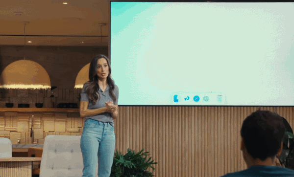 (原始链接: https://mmbiz.qpic.cn/sz_mmbiz_gif/KmXPKA19gWicf9u8ddDb0dKib5OsdydyCz9Ukc0SMRsm2RGashXWCY0qx1X6tZ898oU2sUFbicu4uwP1Nib5eQWF8Q/640?wx_fmt=gif&from=appmsg)
- 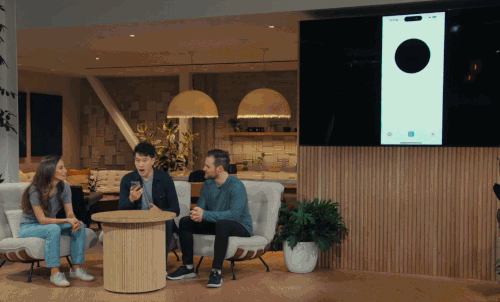 (原始链接: https://mmbiz.qpic.cn/sz_mmbiz_gif/KmXPKA19gWicf9u8ddDb0dKib5OsdydyCzGHFaoHevDppDZlfuuiajBfAHIZSwLL2G5ecAbu0Amibial7F07kkgZj3A/640?wx_fmt=gif&from=appmsg)
-  (原始链接: https://mmbiz.qpic.cn/sz_mmbiz_gif/KmXPKA19gWicf9u8ddDb0dKib5OsdydyCzBxk7zaBJnBibIJV1mS2FkQKRFpIrGgZAKt9lLaKF0mo6twGHVlA9QVw/640?wx_fmt=gif&from=appmsg)
- 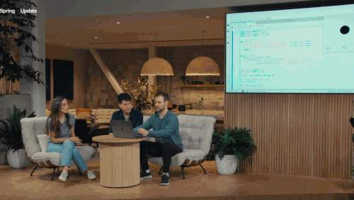 (原始链接: https://mmbiz.qpic.cn/sz_mmbiz_gif/KmXPKA19gWicf9u8ddDb0dKib5OsdydyCzFfocGM7W4Uq7xyqCXiajBbGZ7n63EjY6eLZVbpSVXEE4brdwLDedVXg/640?wx_fmt=gif&from=appmsg)
- 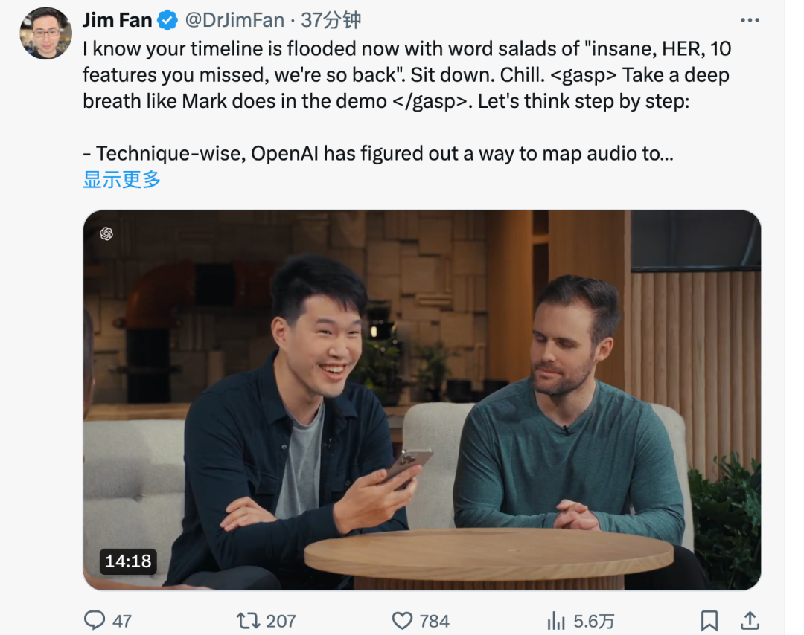 (原始链接: https://mmbiz.qpic.cn/sz_mmbiz_png/KmXPKA19gWicf9u8ddDb0dKib5OsdydyCzy52ILQQaXIvViaDTiakO99xhETo8hGFX1Z91iaWfrs3UyybV2S2XjKKPQ/640?wx_fmt=png&from=appmsg)
- 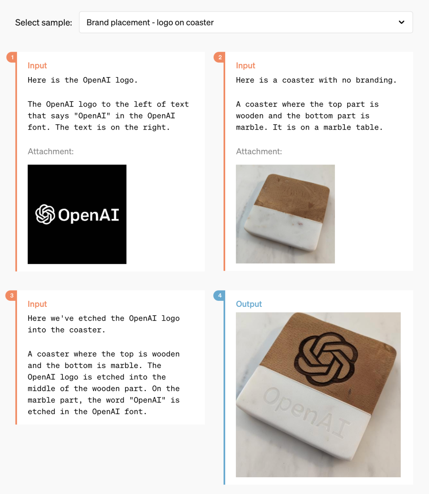 (原始链接: https://mmbiz.qpic.cn/sz_mmbiz_png/KmXPKA19gWicf9u8ddDb0dKib5OsdydyCzNvIytdibbFTibvG61o9tRCVSiarqWhFeHZKuIknS9b9uyy6YibKYLOgDwA/640?wx_fmt=png&from=appmsg)
-  (原始链接: https://mmbiz.qpic.cn/sz_mmbiz_gif/KmXPKA19gWicf9u8ddDb0dKib5OsdydyCzoGdUzj9SV9icRtTwtTNEnIC1AH8LVt33PTGiafMnKLpsbZlvabgVKQfA/640?wx_fmt=gif&from=appmsg)
-  (原始链接: https://mmbiz.qpic.cn/sz_mmbiz_gif/KmXPKA19gWicf9u8ddDb0dKib5OsdydyCzOx8TeBjmJr2aeia9MkaPqzzv5COK1jnrCMEsdzdicj9NA8ZVm4icftO4Q/640?wx_fmt=gif&from=appmsg)
- 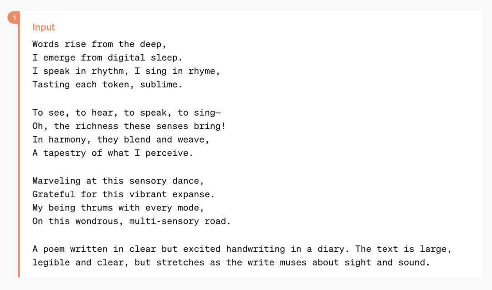 (原始链接: https://mmbiz.qpic.cn/sz_mmbiz_png/KmXPKA19gWicf9u8ddDb0dKib5OsdydyCzkXib3a2JpgSU8OLJgXPjkfIicvMulcswd5Qajfnibxv78RXry4CficFQ5g/640?wx_fmt=png&from=appmsg)
- 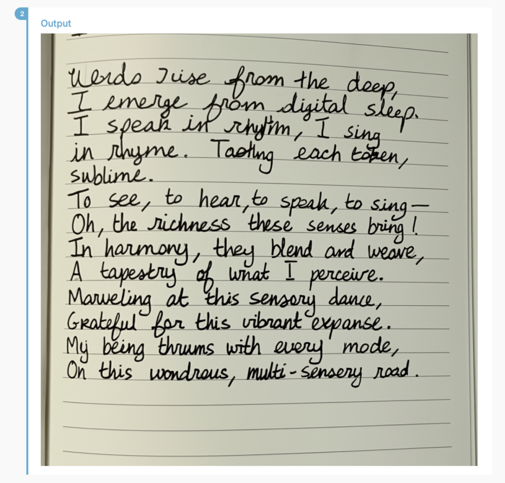 (原始链接: https://mmbiz.qpic.cn/sz_mmbiz_png/KmXPKA19gWicf9u8ddDb0dKib5OsdydyCzPZP2toTE0RBoBmVvq9VdpkVEfPibjN3tFN4p1Nltn4kggHQ7KpQWOCQ/640?wx_fmt=png&from=appmsg)
- 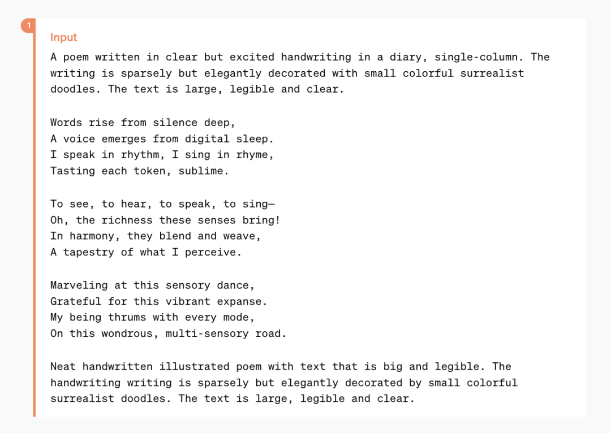 (原始链接: https://mmbiz.qpic.cn/sz_mmbiz_png/KmXPKA19gWicf9u8ddDb0dKib5OsdydyCzVPYgbL8jzr1DoWNA99IFKH9y74QMpssClYFjGrGjIiaHZw5rAibmKzIw/640?wx_fmt=png&from=appmsg)
- 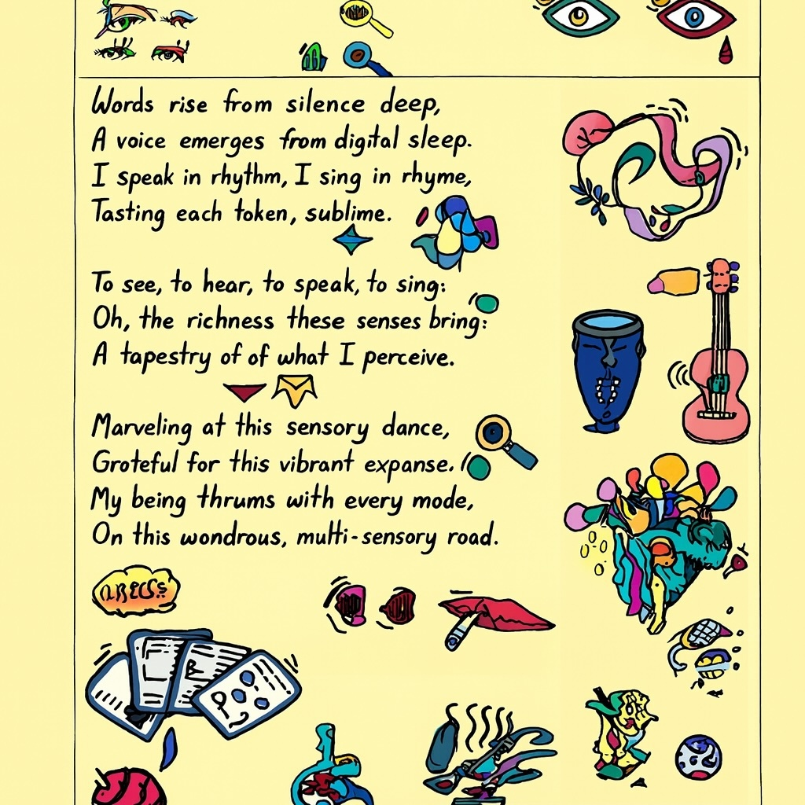 (原始链接: https://mmbiz.qpic.cn/sz_mmbiz_png/KmXPKA19gWicf9u8ddDb0dKib5OsdydyCzgyhSoJb4HuPmLdjhiaiaGHY5nnuKZtbicMBXXf13sfsRic3ZMOmQN9yHwA/640?wx_fmt=png&from=appmsg)
- 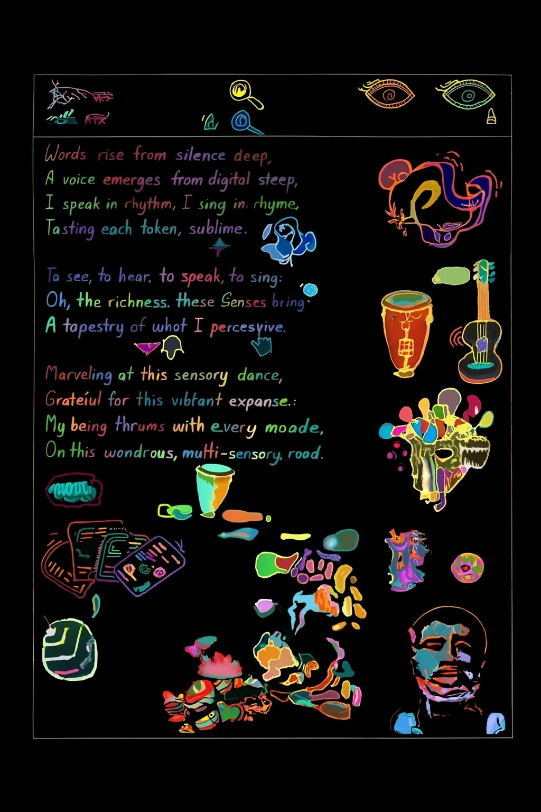 (原始链接: https://mmbiz.qpic.cn/sz_mmbiz_png/KmXPKA19gWicf9u8ddDb0dKib5OsdydyCzrMicmibG2Abk4uiaXYuDBjjHXVl8icnbYVc79NiaxJhZw8J5Ne46u8fXBicA/640?wx_fmt=png&from=appmsg)
- 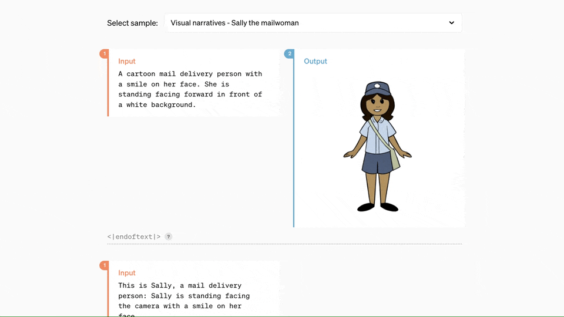 (原始链接: https://mmbiz.qpic.cn/sz_mmbiz_gif/KmXPKA19gWicf9u8ddDb0dKib5OsdydyCzMFIvwTXbFb3jWvxBtR5tHlK8DiaLMQplLqNP30ic10j5BibgSoTk3MXUA/640?wx_fmt=gif&from=appmsg)
- 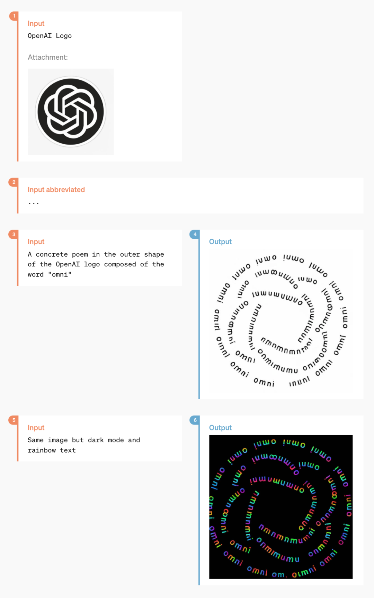 (原始链接: https://mmbiz.qpic.cn/sz_mmbiz_png/KmXPKA19gWicf9u8ddDb0dKib5OsdydyCzWD7mrgAym0dusvcRaKCCnNYxnDK6Hn4BoZkJnyS6Xt1cx0H5tIz3dQ/640?wx_fmt=png&from=appmsg)
- 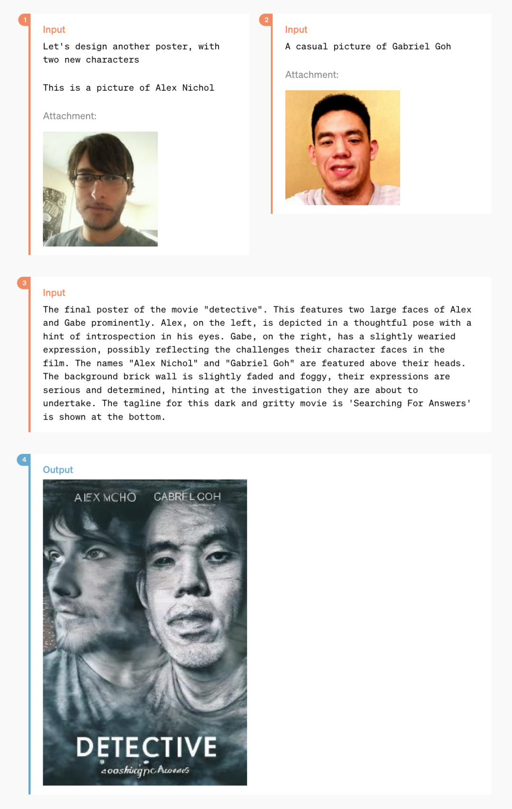 (原始链接: https://mmbiz.qpic.cn/sz_mmbiz_png/KmXPKA19gWicf9u8ddDb0dKib5OsdydyCzRLKechhMQhUkOscvZbkn8SYgSErWwibWSiar8rHgQm5zSseVasJuGv3g/640?wx_fmt=png&from=appmsg)
- 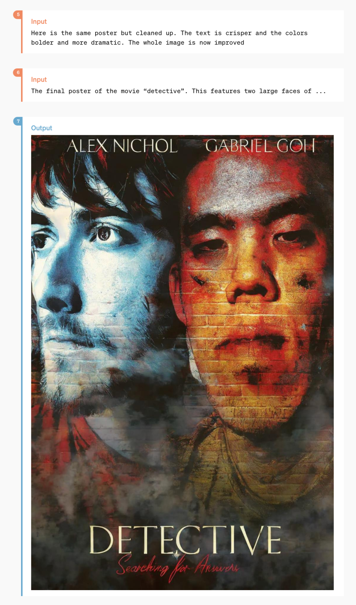 (原始链接: https://mmbiz.qpic.cn/sz_mmbiz_png/KmXPKA19gWicf9u8ddDb0dKib5OsdydyCzdvRvicHUbdWObek9OQUeZDRnWia8fRPjazGeUzs0NwoK7N7sWuKL6moQ/640?wx_fmt=png&from=appmsg)
- 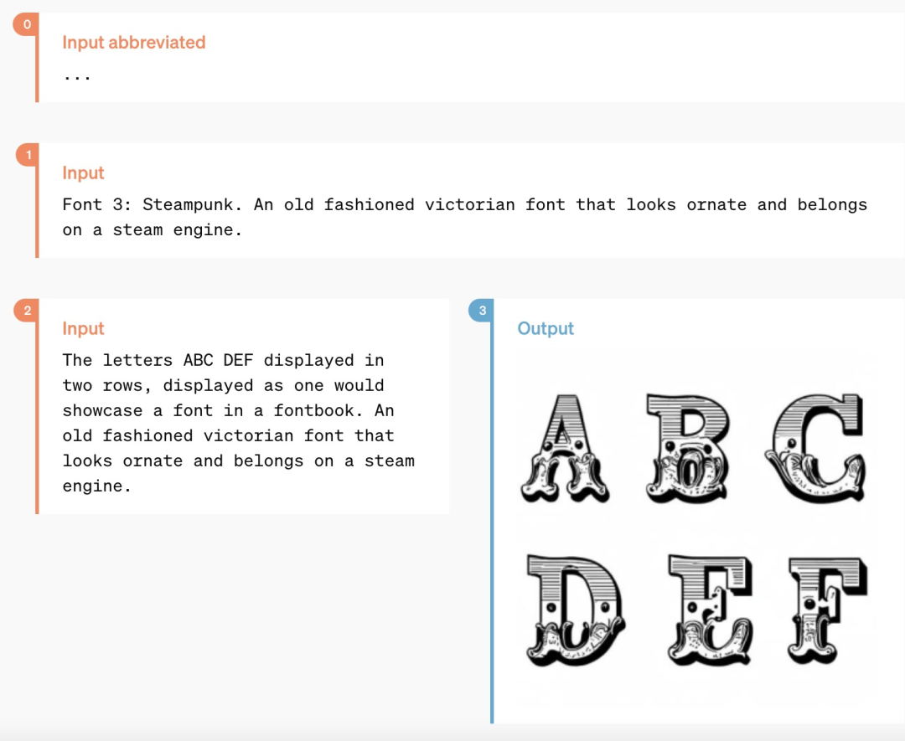 (原始链接: https://mmbiz.qpic.cn/sz_mmbiz_png/KmXPKA19gWicf9u8ddDb0dKib5OsdydyCz7cpedByN1xAeicKt6Pial4viakdVp7SvYVvRdgzrBKNcPruuUTBJT5IGw/640?wx_fmt=png&from=appmsg)
- 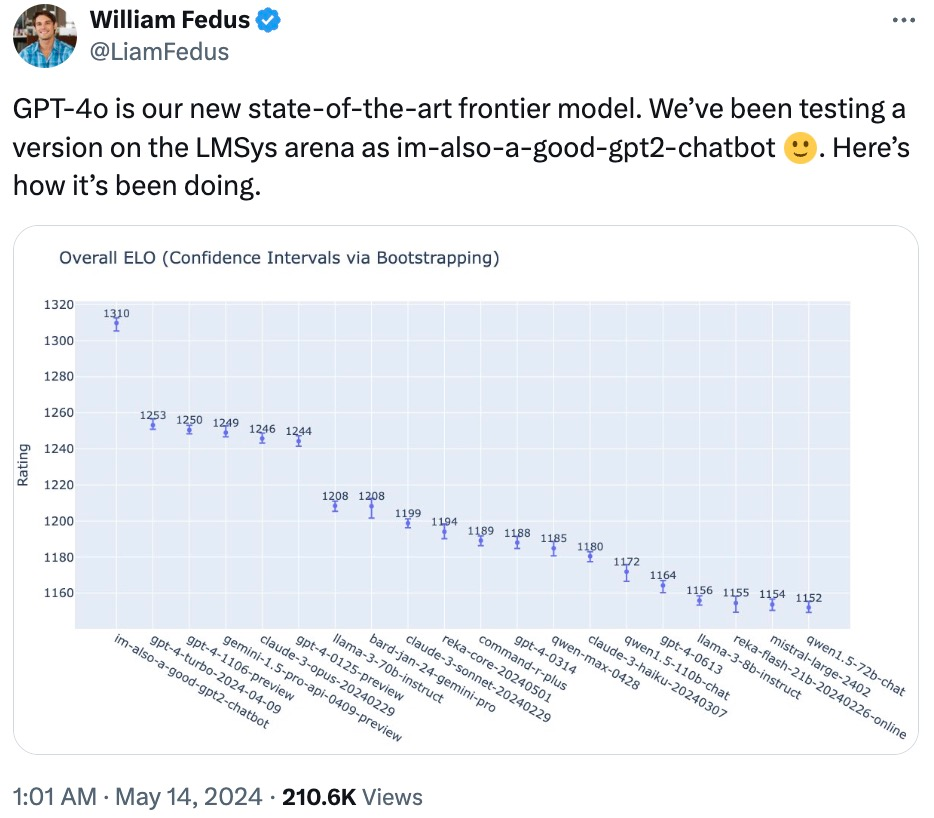 (原始链接: https://mmbiz.qpic.cn/sz_mmbiz_png/KmXPKA19gWicf9u8ddDb0dKib5OsdydyCzic0QzsgmZh2vGdqnDuUklA5yOhT8vCXhMhNEBrKnAhJsk7ibQPnQTUuw/640?wx_fmt=png&from=appmsg)
- 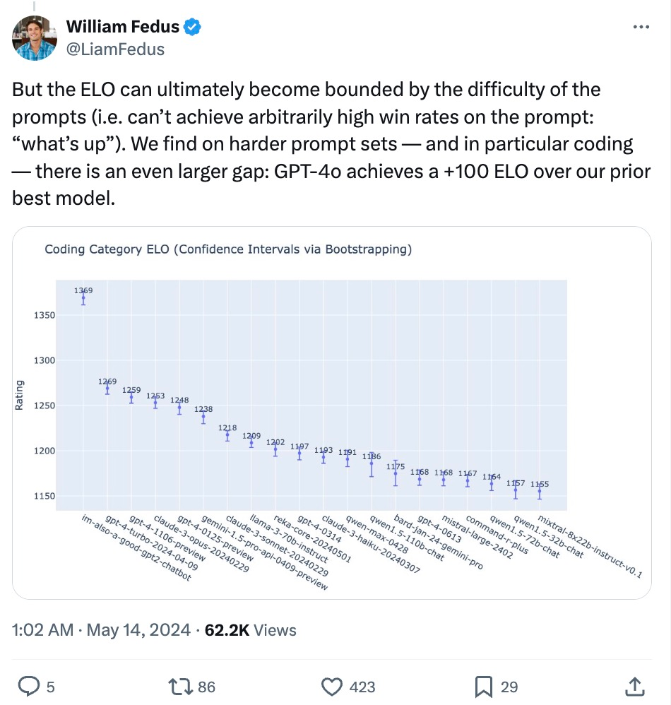 (原始链接: https://mmbiz.qpic.cn/sz_mmbiz_png/KmXPKA19gWicf9u8ddDb0dKib5OsdydyCzDtWBUH8ppAicX03vo8xYfdxdFJFdd1beL1zsos5GnI1suAkSib5tn8KQ/640?wx_fmt=png&from=appmsg)
- 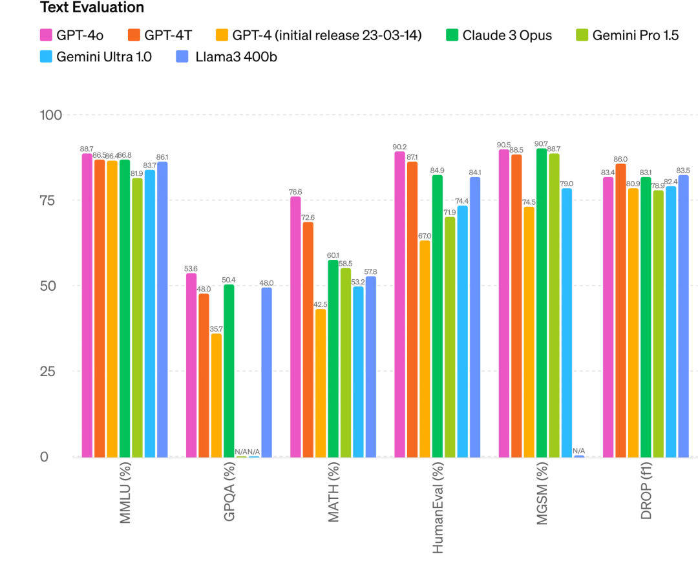 (原始链接: https://mmbiz.qpic.cn/sz_mmbiz_png/KmXPKA19gWicf9u8ddDb0dKib5OsdydyCznnhWpI8WyFgfvQdjIe6sgbQLsHrHmscTm8FO4XX0HE5FuyN8N9dKoQ/640?wx_fmt=png&from=appmsg)
- 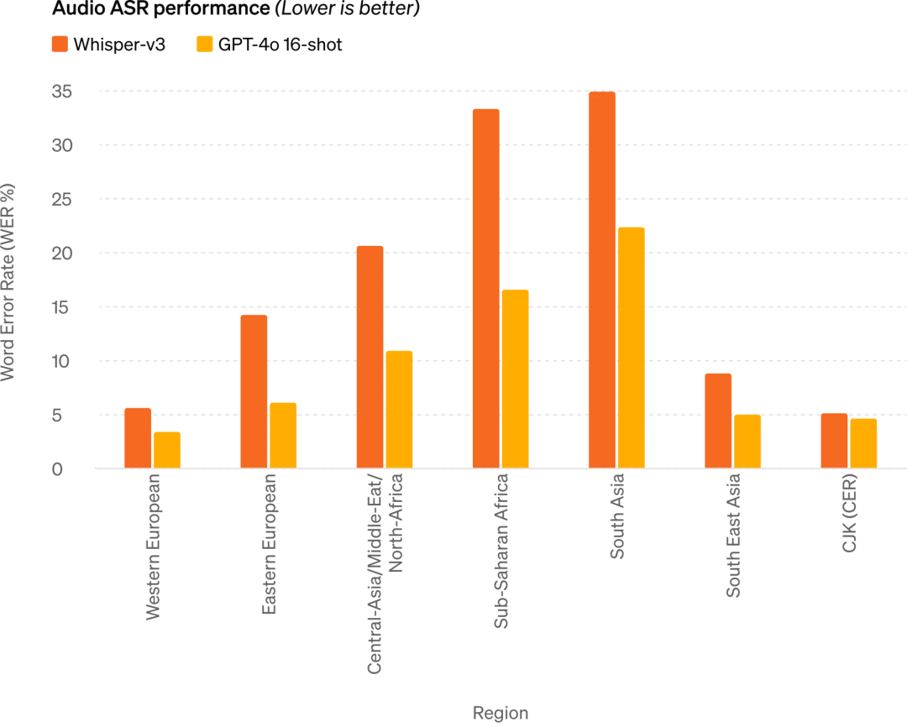 (原始链接: https://mmbiz.qpic.cn/sz_mmbiz_png/KmXPKA19gWicf9u8ddDb0dKib5OsdydyCze17sq2Uib0icXcXwVlxHrsZRnfXMVYm21YYaSsichp13EmUpIUXVyqFyA/640?wx_fmt=png&from=appmsg)
- 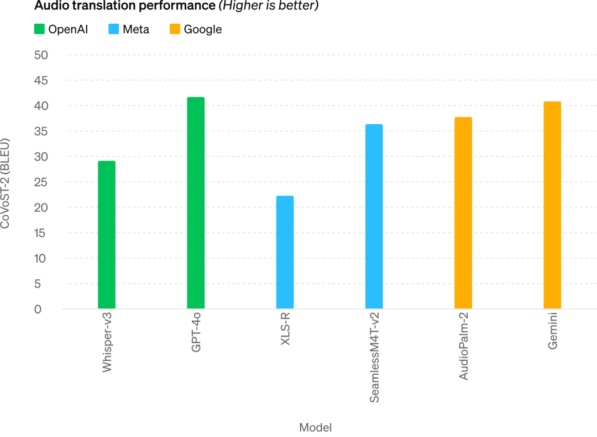 (原始链接: https://mmbiz.qpic.cn/sz_mmbiz_png/KmXPKA19gWicf9u8ddDb0dKib5OsdydyCzVJ4kc4TEg5gPv2sxiaBavBMU4CPWic3rnmZ1oz3E2puK1Tc0y0TH56Bw/640?wx_fmt=png&from=appmsg)
- 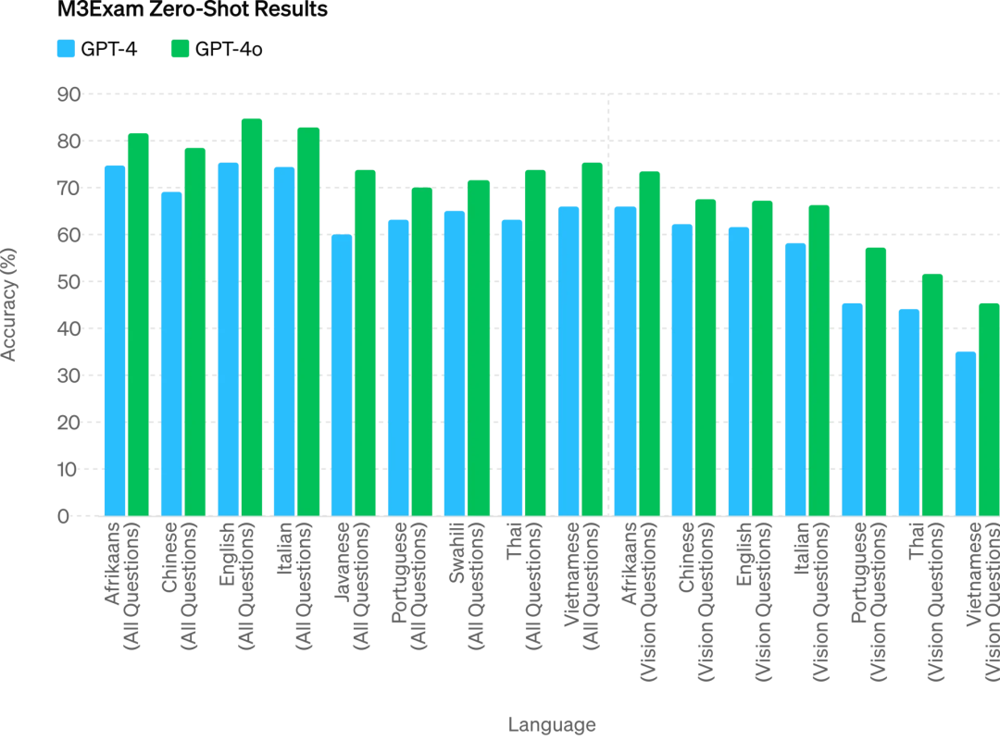 (原始链接: https://mmbiz.qpic.cn/sz_mmbiz_png/KmXPKA19gWicf9u8ddDb0dKib5OsdydyCz6eSdK1bAWHtmkQPiaCicVYxCWRjEvNntSHIFicvdibXibm41WGkpDsFp8Ug/640?wx_fmt=png&from=appmsg)
- 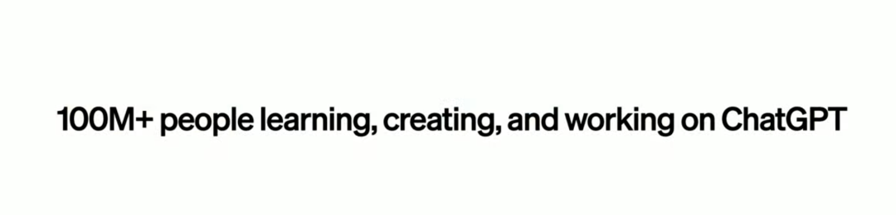 (原始链接: https://mmbiz.qpic.cn/sz_mmbiz_png/KmXPKA19gWicf9u8ddDb0dKib5OsdydyCzvaQckTcicYXlVWKXPjNaIvuibyCTn7hibS7ruNRWFn8tPmv92Vv2Ngv5Q/640?wx_fmt=png&from=appmsg)
- 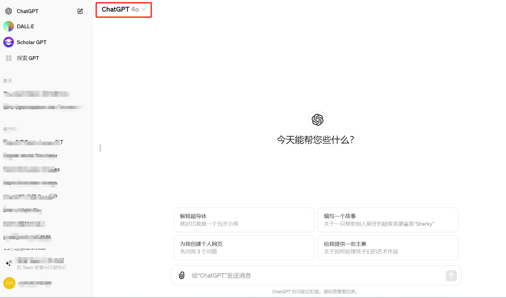 (原始链接: https://mmbiz.qpic.cn/sz_mmbiz_png/KmXPKA19gWicf9u8ddDb0dKib5OsdydyCzFZSCMcEjnNXhl9qicFAXP8TyQQN4ibKBo2a7JRWqKaibOdIqKDEnwhm5A/640?wx_fmt=png&from=appmsg)
- 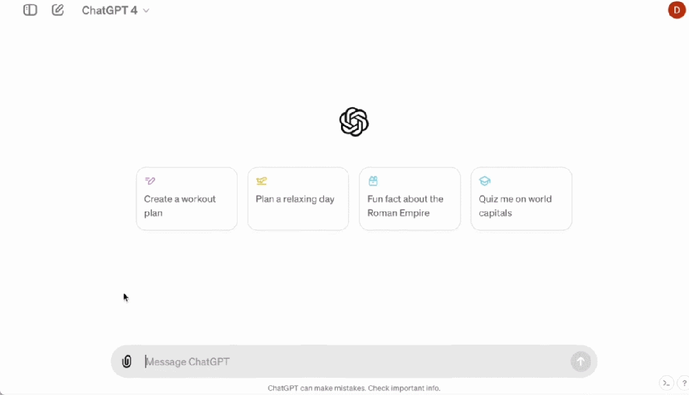 (原始链接: https://mmbiz.qpic.cn/sz_mmbiz_gif/KmXPKA19gWicf9u8ddDb0dKib5OsdydyCzktyWRnUOAEc9u1ocPkb5rZmh8CfK2GnKWyvenVj9Lzt0oY3F6dTLNw/640?wx_fmt=gif&from=appmsg)
- 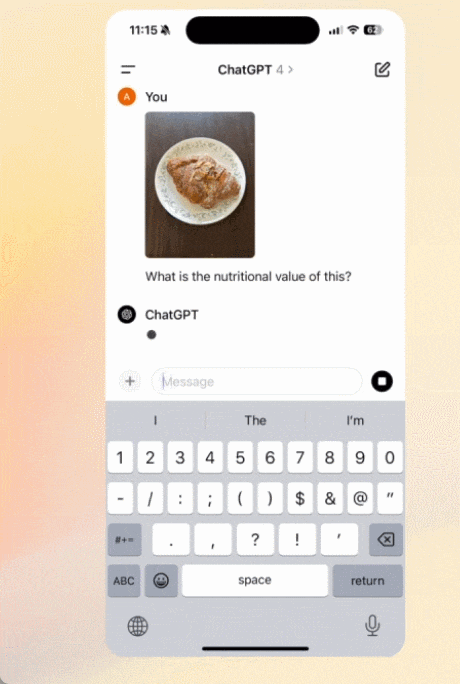 (原始链接: https://mmbiz.qpic.cn/sz_mmbiz_gif/KmXPKA19gWicf9u8ddDb0dKib5OsdydyCzGDSbyia2Or0gDAVicKChticJov87rbRtVeQXBoX0LQyjScoNY5JDZtqrQ/640?wx_fmt=gif&from=appmsg)
- 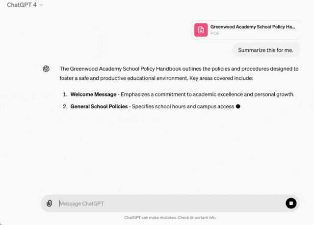 (原始链接: https://mmbiz.qpic.cn/sz_mmbiz_gif/KmXPKA19gWicf9u8ddDb0dKib5OsdydyCzTBZWpH6Gmpe8XGtRXOVJiaHFhQlz0fDsakicrGBLGzEzJwZ3DuZE101A/640?wx_fmt=gif&from=appmsg)
- 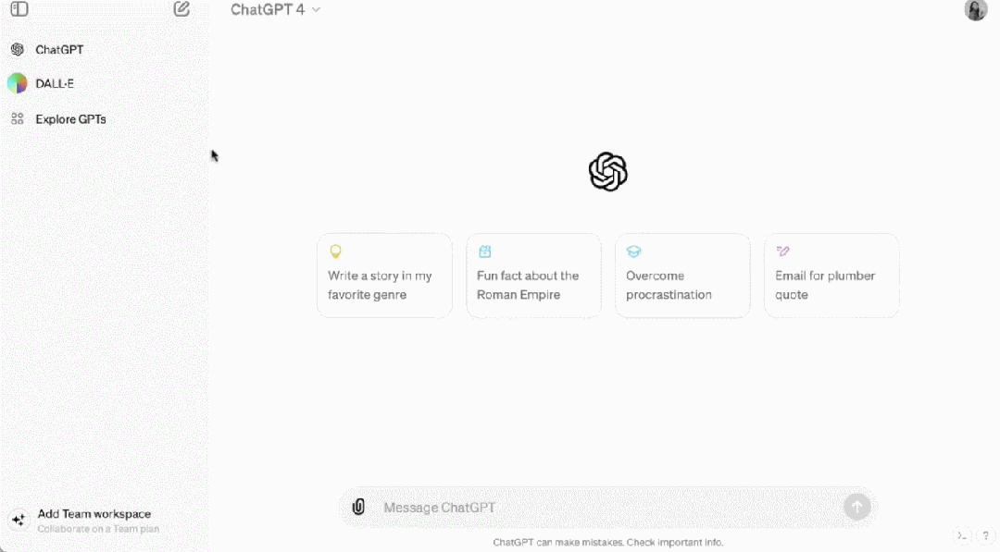 (原始链接: https://mmbiz.qpic.cn/sz_mmbiz_gif/KmXPKA19gWicf9u8ddDb0dKib5OsdydyCzj8f8koMsOM67XFcMoyOsSO4wp63Flo1mAicMvmXwOIWGyT1tAoXmWGw/640?wx_fmt=gif&from=appmsg)
- 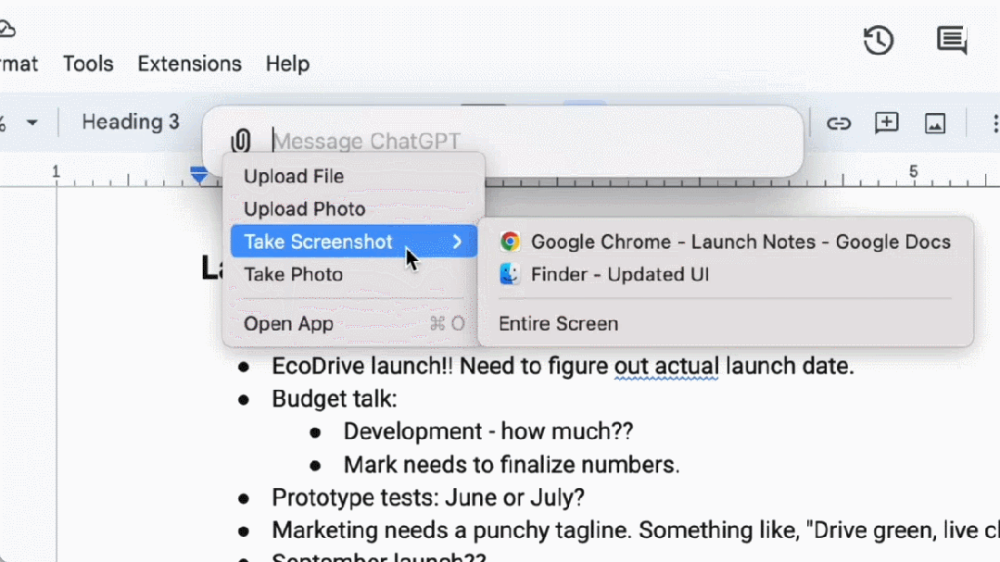 (原始链接: https://mmbiz.qpic.cn/sz_mmbiz_gif/KmXPKA19gWicf9u8ddDb0dKib5OsdydyCz3KwZtkEtA20y6WUURibLpreo1SsGrJKumZrbfoVXN7N5xrdVqLvGmVg/640?wx_fmt=gif&from=appmsg)
-  (原始链接: https://mmbiz.qpic.cn/sz_mmbiz_png/KmXPKA19gWicf9u8ddDb0dKib5OsdydyCzjA5icLC18a2pu7pic7Hh7Cz9ORGriaXR9z03gTZaDdVsC05VxMRsghZnA/640?wx_fmt=png&from=appmsg)
- 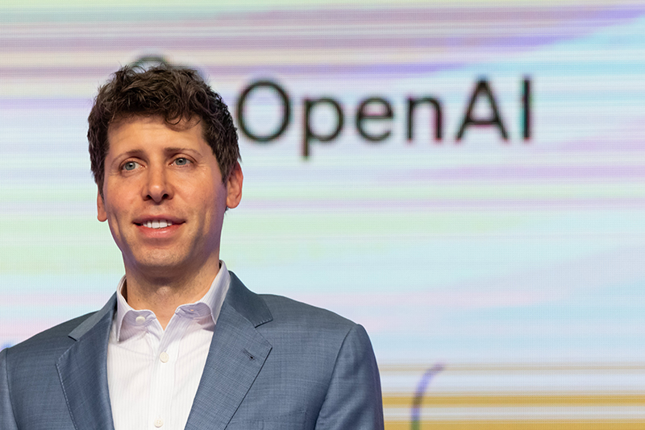 (原始链接: https://mmbiz.qpic.cn/sz_mmbiz_png/KmXPKA19gWicf9u8ddDb0dKib5OsdydyCzdesbWTvflITo8Loiac9gh9ZmWQdOzw1O9VelGKGA3tBEgiaCUnQPod8Q/640?wx_fmt=png&from=appmsg)
- 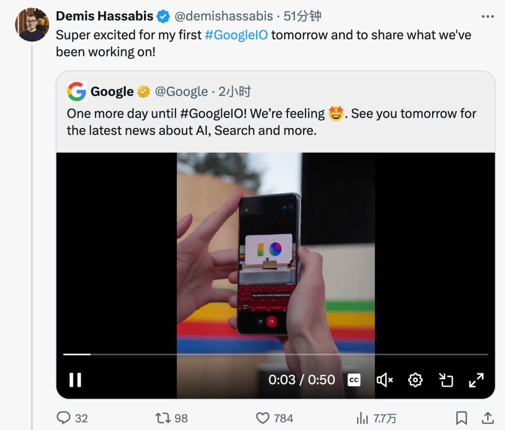 (原始链接: https://mmbiz.qpic.cn/sz_mmbiz_png/KmXPKA19gWicf9u8ddDb0dKib5OsdydyCzNLZ6ZkRqvAGOiarcaWj2brFr8eh3SvHW8ZMbEhfl1r9wP4FFQZYhmEw/640?wx_fmt=png&from=appmsg)
-  (原始链接: https://mmbiz.qpic.cn/sz_mmbiz_jpg/KmXPKA19gW8L1x3LuDMEiblqGaj9icb8ZSwMGwll9bHFamQKPplAcA0EeLETupgXa9B2W3r9xHibAIhEibfMhJ0caA/640?wx_fmt=jpeg&from=appmsg)
