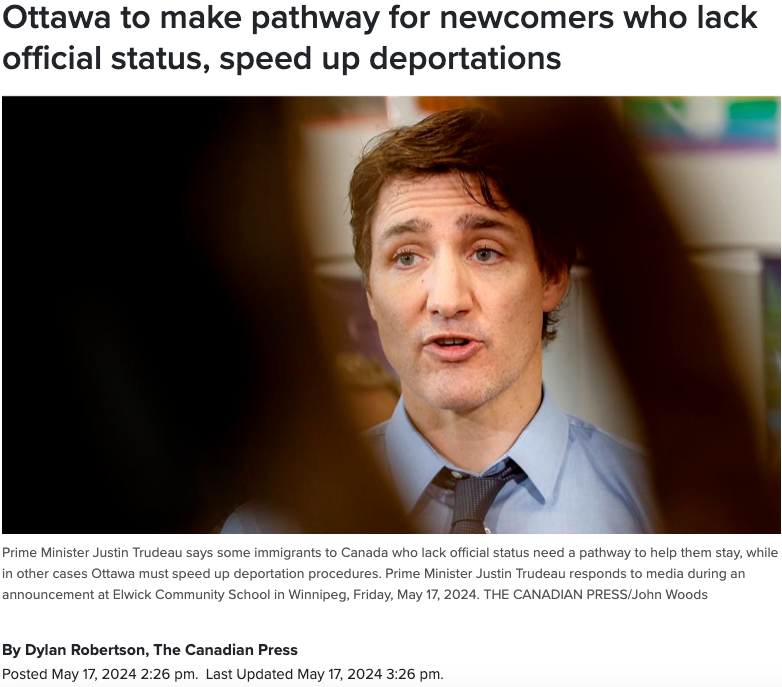
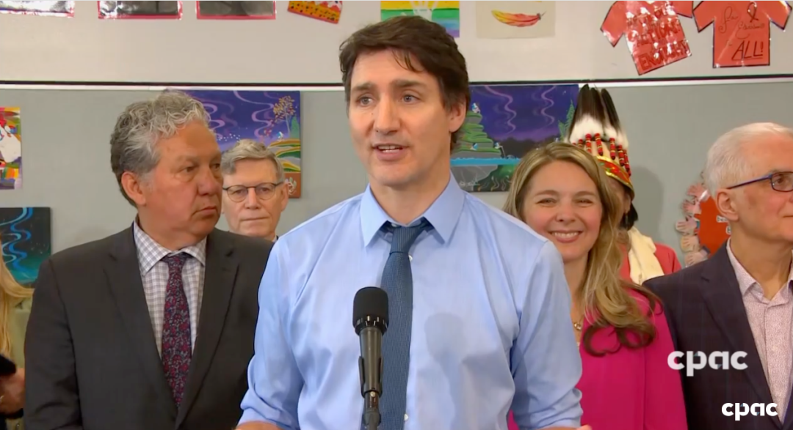

# 无标题

**链接地址:** http://mp.weixin.qq.com/s?__biz=MjM5MDEzNzY2NQ==&mid=2652882810&idx=1&sn=17504737469a536510869f342a751ec5&chksm=bda20b548ad5824227724264faff2a6946d9d70f7581312cfcbb74adcc633a1392458308edcf&mpshare=1&scene=2&srcid=0519YhsJe36f5LkbJlbaxl1R&sharer_shareinfo=b2f7b55101061d30326a526ddd98eb36&sharer_shareinfo_first=b2f7b55101061d30326a526ddd98eb36#rd
**作者:** 丁其
**获取时间:** 2025/8/28 18:56:06
**图片数量:** 9

---

## 原始HTML内容

***

 

加拿大总理特鲁多5月17日表示，需要开辟一条移民途径，帮助一些缺乏官方身份的居民留在加拿大，同时也必须加快驱逐程序。移民部长计划在下个月向内阁部长提交一份提案。

特鲁多周五（5月17日）在温尼伯对记者说：“不通过正常途径来加拿大这里的人需要得到支持和照顾。”

特鲁多说：“需要有一条通往正规化和公民身份的途径，我知道移民部长正在努力。在某些情况下，我们需要加快驱逐程序。”

早在 2021 年底，自由党承诺“探索为加拿大社区做出贡献的无证工人正规化身份的方法”。

但特鲁多表示，他没有具体实施这一计划的时间表。
<section style="text-align: center;padding: 0px 0.5em;margin-left: 16px;margin-right: 16px;"></section><section style="margin-bottom: 24px;margin-left: 16px;margin-right: 16px;">加拿大移民部将无证居民定义为三类：临时签证逾期居留、难民庇护申请被拒后仍留在加拿大，或抵达加拿大未联系当局的入境者。</section><section style="margin-bottom: 24px;margin-left: 16px;margin-right: 16px;">“确保我们的移民制度保持完整性需要保持平衡，”特鲁多说。 </section><section style="margin-bottom: 24px;margin-left: 16px;margin-right: 16px;">“这就是为什么加拿大与世界上许多其他国家不同，我们继续对移民持积极态度，因为我们的移民制度非常严格。”</section><section style="letter-spacing: 0.578px;text-wrap: wrap;margin-bottom: 24px;margin-left: 16px;margin-right: 16px;">移民部长马克·米勒（Marc Miller）办公室周五表示，他计划在下个月议会休会前向内阁部长提交一份提案。</section><section style="margin-bottom: 24px;margin-left: 16px;margin-right: 16px;">加拿大移民部表示，目前尚不清楚有多少无证移民居住在加拿大，但学术界估计有多达 50 万。</section><section style="margin-bottom: 24px;margin-left: 16px;margin-right: 16px;">移民部 2022 年 11 月向议会提交的证词准备的简报材料中写道：“无证移民生活在被发现和驱逐的恐惧之中，许多人极其脆弱，很难获得医疗保健和社会服务的机会。”</section><section style="margin-bottom: 24px;margin-left: 16px;margin-right: 16px;">加拿大移民局已经开展了短期试点的特赦计划，例如在 COVID-19 疫情期间开展的“守护天使”（&nbsp;Guardian Angels&nbsp;）计划，该计划允许 8,500 名直接从事病人护理工作的待决和失败的难民申请人或其家人获得永久居留权。</section><section style="margin-bottom: 24px;margin-left: 16px;margin-right: 16px;">大多伦多地区也有另一项特赦计划，即“逾期建筑工人公共政策”，截至去年 8 月，已允许 441 名工人和 588 名家属获得永久居留权。</section><section style="margin-bottom: 24px;margin-left: 16px;margin-right: 16px;">对于特鲁多准备开新途径给滞留无证居民，网友议论纷纷。</section>

<section style="margin-bottom: 24px;margin-left: 16px;margin-right: 16px;"></section><section style="margin-bottom: 24px;margin-left: 16px;margin-right: 16px;">“我支持加快驱逐出境速度，但不支持为无证居民提供移民途径。” </section>

<section style="margin-bottom: 24px;margin-left: 16px;margin-right: 16px;"></section><section style="margin-bottom: 24px;margin-left: 16px;margin-right: 16px;">“几百万都必须回去，哪怕已经在加拿大。”</section>

<section style="margin-bottom: 24px;margin-left: 16px;margin-right: 16px;"> </section><section style="margin-bottom: 24px;margin-left: 16px;margin-right: 16px;">“他们是非法入境者，进入加拿大已经犯罪，需要立即驱逐出境。” </section>

<section style="margin-bottom: 24px;margin-left: 16px;margin-right: 16px;"> </section><section style="margin-bottom: 24px;margin-left: 16px;margin-right: 16px;">“哈哈，把那些在加拿大投资的人赶回去，然后接纳那些只想要免费福利的人？”</section><section style="margin-bottom: 24px;margin-left: 16px;margin-right: 16px;"> </section><section style="margin-bottom: 24px;margin-left: 16px;margin-right: 16px;">本文来源： </section><section style="margin-bottom: 24px;margin-left: 16px;margin-right: 16px;">https://toronto.citynews.ca/2024/05/17/ottawa-to-make-pathway-for-newcomers-who-lack-official-status-speed-up-deportations/&nbsp;</section><section style="margin-bottom: 24px;margin-left: 16px;margin-right: 16px;">https://www.cp24.com/news/ottawa-to-make-pathway-for-newcomers-who-lack-official-status-speed-up-deportations-1.6891727</section><section style="margin-bottom: 0px;outline: 0px;font-family: system-ui, -apple-system, BlinkMacSystemFont, &quot;Helvetica Neue&quot;, &quot;PingFang SC&quot;, &quot;Hiragino Sans GB&quot;, &quot;Microsoft YaHei UI&quot;, &quot;Microsoft YaHei&quot;, Arial, sans-serif;letter-spacing: 0.544px;text-wrap: wrap;background-color: rgb(255, 255, 255);border-width: 0px;border-style: solid;border-color: rgb(227, 227, 227);text-align: center;margin-left: 16px;margin-right: 16px;">+++</section><section style="margin-bottom: 0px;outline: 0px;font-family: system-ui, -apple-system, BlinkMacSystemFont, &quot;Helvetica Neue&quot;, &quot;PingFang SC&quot;, &quot;Hiragino Sans GB&quot;, &quot;Microsoft YaHei UI&quot;, &quot;Microsoft YaHei&quot;, Arial, sans-serif;letter-spacing: 0.544px;text-wrap: wrap;background-color: rgb(255, 255, 255);border-width: 0px;border-style: solid;border-color: rgb(227, 227, 227);text-align: center;margin-left: 16px;margin-right: 16px;"></section><section style="margin-bottom: 0px;outline: 0px;font-family: system-ui, -apple-system, BlinkMacSystemFont, &quot;Helvetica Neue&quot;, &quot;PingFang SC&quot;, &quot;Hiragino Sans GB&quot;, &quot;Microsoft YaHei UI&quot;, &quot;Microsoft YaHei&quot;, Arial, sans-serif;letter-spacing: 0.544px;text-wrap: wrap;background-color: rgb(255, 255, 255);border-width: 0px;border-style: solid;border-color: rgb(227, 227, 227);text-align: center;margin-left: 16px;margin-right: 16px;"> </section><section style="margin-bottom: 0px;outline: 0px;font-family: system-ui, -apple-system, BlinkMacSystemFont, &quot;Helvetica Neue&quot;, &quot;PingFang SC&quot;, &quot;Hiragino Sans GB&quot;, &quot;Microsoft YaHei UI&quot;, &quot;Microsoft YaHei&quot;, Arial, sans-serif;letter-spacing: 0.544px;text-wrap: wrap;background-color: rgb(255, 255, 255);border-width: 0px;border-style: solid;border-color: rgb(227, 227, 227);text-align: center;margin-left: 16px;margin-right: 16px;">+++全加拿大华人都在关注超级生活，就差你了+++</section><section style="margin-bottom: 0px;outline: 0px;letter-spacing: 0.544px;text-indent: 0em;text-wrap: wrap;background-color: rgb(255, 255, 255);font-family: system-ui, -apple-system, system-ui, &quot;Helvetica Neue&quot;, &quot;PingFang SC&quot;, &quot;Hiragino Sans GB&quot;, &quot;Microsoft YaHei UI&quot;, &quot;Microsoft YaHei&quot;, Arial, sans-serif;font-size: 15px;text-align: right;line-height: 1.6em;margin-left: 16px;margin-right: 16px;">喜欢就狠点下👍</section><section style="margin-bottom: 24px;margin-left: 16px;margin-right: 16px;"> </section>
<mp-style-type data-value="10000"></mp-style-type>

---

## 纯文本内容

***加拿大总理特鲁多5月17日表示，需要开辟一条移民途径，帮助一些缺乏官方身份的居民留在加拿大，同时也必须加快驱逐程序。移民部长计划在下个月向内阁部长提交一份提案。特鲁多周五（5月17日）在温尼伯对记者说：“不通过正常途径来加拿大这里的人需要得到支持和照顾。”特鲁多说：“需要有一条通往正规化和公民身份的途径，我知道移民部长正在努力。在某些情况下，我们需要加快驱逐程序。”早在 2021 年底，自由党承诺“探索为加拿大社区做出贡献的无证工人正规化身份的方法”。但特鲁多表示，他没有具体实施这一计划的时间表。加拿大移民部将无证居民定义为三类：临时签证逾期居留、难民庇护申请被拒后仍留在加拿大，或抵达加拿大未联系当局的入境者。“确保我们的移民制度保持完整性需要保持平衡，”特鲁多说。“这就是为什么加拿大与世界上许多其他国家不同，我们继续对移民持积极态度，因为我们的移民制度非常严格。”移民部长马克·米勒（Marc Miller）办公室周五表示，他计划在下个月议会休会前向内阁部长提交一份提案。加拿大移民部表示，目前尚不清楚有多少无证移民居住在加拿大，但学术界估计有多达 50 万。移民部 2022 年 11 月向议会提交的证词准备的简报材料中写道：“无证移民生活在被发现和驱逐的恐惧之中，许多人极其脆弱，很难获得医疗保健和社会服务的机会。”加拿大移民局已经开展了短期试点的特赦计划，例如在 COVID-19 疫情期间开展的“守护天使”（ Guardian Angels ）计划，该计划允许 8,500 名直接从事病人护理工作的待决和失败的难民申请人或其家人获得永久居留权。大多伦多地区也有另一项特赦计划，即“逾期建筑工人公共政策”，截至去年 8 月，已允许 441 名工人和 588 名家属获得永久居留权。对于特鲁多准备开新途径给滞留无证居民，网友议论纷纷。“我支持加快驱逐出境速度，但不支持为无证居民提供移民途径。”“几百万都必须回去，哪怕已经在加拿大。”“他们是非法入境者，进入加拿大已经犯罪，需要立即驱逐出境。”“哈哈，把那些在加拿大投资的人赶回去，然后接纳那些只想要免费福利的人？”本文来源：https://toronto.citynews.ca/2024/05/17/ottawa-to-make-pathway-for-newcomers-who-lack-official-status-speed-up-deportations/ https://www.cp24.com/news/ottawa-to-make-pathway-for-newcomers-who-lack-official-status-speed-up-deportations-1.6891727++++++全加拿大华人都在关注超级生活，就差你了+++喜欢就狠点下👍

---

## 图片列表

-  (原始链接: https://mmbiz.qpic.cn/mmbiz_jpg/szJas1pFaJcm214vOFSP3ZR102nVPy6gqu2Lm1wMj3TE6GTy8WCGX7HM80IBZQQMeqowAg7mzNd1qR1rbrJHOQ/640?wx_fmt=jpeg&from=appmsg)
-  (原始链接: https://mmbiz.qpic.cn/mmbiz_png/icDcCacWsN1WJr3v2ibmu2hClicqqCpZUSQcf4Rem0F9BXMAbzY12pPBky4IaRVISkRsoD3tDtapxkZ667QsaOKhg/640?wx_fmt=png&from=appmsg)
-  (原始链接: https://mmbiz.qpic.cn/mmbiz_png/szJas1pFaJcm214vOFSP3ZR102nVPy6gjrl5X6oCr1WI4IHVS2Av5kdcwYia2QicaicdeNftyLhxZicaGQGtKYhQ6Q/640?wx_fmt=png&from=appmsg)
-  (原始链接: https://mmbiz.qpic.cn/mmbiz_png/szJas1pFaJcm214vOFSP3ZR102nVPy6g4Nau5z2JSibqxxDvX4GWJJiaKbClXmjE7MTo3RgUicy50xMIzKpWG6mXg/640?wx_fmt=png&from=appmsg)
-  (原始链接: https://mmbiz.qpic.cn/mmbiz_png/szJas1pFaJcm214vOFSP3ZR102nVPy6gictaLTrF1sicDdlqCIG37fR2vPhcV1bfgX0wAdA8uY5p2UHRPyrKEUNw/640?wx_fmt=png&from=appmsg)
-  (原始链接: https://mmbiz.qpic.cn/mmbiz_png/szJas1pFaJcm214vOFSP3ZR102nVPy6gG86iaxz9zZV6E1F9xbzjibr55oOgLhVLH1sLHKeKX3oZc3gQ2foRBrqQ/640?wx_fmt=png&from=appmsg)
-  (原始链接: https://mmbiz.qpic.cn/mmbiz_png/szJas1pFaJcm214vOFSP3ZR102nVPy6g0ic2nSEWa5QgRkDRoI4EyTxczXxicGdJOQDuGiciamyfJA5j0NXzPpIzQA/640?wx_fmt=png&from=appmsg)
-  (原始链接: https://mmbiz.qpic.cn/mmbiz_jpg/szJas1pFaJdTkW8fEWZVAKq0A1WVYlIPGianGFxtzgz0ib4zq6VkHe1dveMRpdkvgxEvMI5DpjDEcDOed0FQjqTg/640?wx_fmt=other&from=appmsg&wxfrom=5&wx_lazy=1&wx_co=1&tp=webp)
-  (原始链接: https://mmbiz.qpic.cn/mmbiz_gif/szJas1pFaJfb92gAwdAx21srm8k6mM4dQchfL4Aj6O53N5O8YI16zTocMLRN42icKDicwYOzMPOaa7b2Rmqy3DgQ/640?wx_fmt=gif&wxfrom=5&wx_lazy=1&tp=webp)
