# 无标题

**链接地址:** http://mp.weixin.qq.com/s?__biz=MzU2OTk2MzMzNA==&mid=2247631738&idx=1&sn=4404839f1398cfbaf4caea99aafb6e60&chksm=fcfa2553cb8dac4534171ca7b3958306bf92f5872faa5e5c2d9d260fcd52dae28684a03bb3c6&mpshare=1&scene=2&srcid=0708UEFHm419x36PevOeKqxN&sharer_shareinfo=8609217187135029ef1d4656996de4d7&sharer_shareinfo_first=8609217187135029ef1d4656996de4d7#rd
**作者:** 无相君
**获取时间:** 2025/8/28 18:54:30
**图片数量:** 21

---

## 原始HTML内容

<section style="text-align: center;padding: 0px;margin: 0px 16px;line-height: 1.75em;" data-mpa-powered-by="yiban.io"></section><section data-role="outer" label="edit by 135editor"><section style="text-align: center;margin-left: 16px;margin-right: 16px;"> </section><section style="line-height: 1.75em;margin-left: 16px;margin-right: 16px;"></section><section style="line-height: 1.75em;margin-left: 16px;margin-right: 16px;"></section><section style="line-height: 1.75em;margin-left: 16px;margin-right: 16px;">时代颠覆一个行业的速度，越来越快了。</section><section style="margin-left: 16px;margin-right: 16px;"> </section><section style="line-height: 1.75em;margin-left: 16px;margin-right: 16px;">据湖北发布消息，近期，萝卜快跑在武汉市全无人订单量迎来了爆发式增长，单日单车峰值超20单。</section><section style="margin-left: 16px;margin-right: 16px;"> </section><section style="line-height: 1.75em;margin-left: 16px;margin-right: 16px;">作为对比，出租车司机平均一天的单量，大概也在20单左右。</section><section style="margin-left: 16px;margin-right: 16px;"> </section><section style="line-height: 1.75em;margin-left: 16px;margin-right: 16px;"><strong>也就是说，在武汉，无人驾驶出租的势头已经追上了传统出租车。</strong></section><section style="margin-left: 16px;margin-right: 16px;"> </section><section style="line-height: 1.75em;margin-left: 16px;margin-right: 16px;">而且数据显示，武汉市民对乘坐全无人驾驶车出行服务满意度，普遍较高，萝卜快跑APP用户满意度评价达4.9分，其中5分满分好评占比高达94.19%。</section><section style="margin-left: 16px;margin-right: 16px;"> </section><section style="line-height: 1.75em;margin-left: 16px;margin-right: 16px;">相关新闻的下面，也是好评如潮。</section><section style="line-height: 1.75em;margin-left: 16px;margin-right: 16px;"> </section><section style="line-height: 1.75em;margin-left: 16px;margin-right: 16px;"></section><section style="line-height: 1.75em;margin-left: 16px;margin-right: 16px;"> </section><section style="line-height: 1.75em;margin-left: 16px;margin-right: 16px;">无人出租车，会在未来成为主流吗？</section><section style="margin-left: 16px;margin-right: 16px;"> </section><section style="line-height: 1.75em;margin-left: 16px;margin-right: 16px;">随着当前AI技术和智能驾驶的飞速发展，这个趋势已经越发明晰。</section><section style="margin-left: 16px;margin-right: 16px;"> </section><section style="text-align: center;margin-left: 16px;margin-right: 16px;"></section><section style="margin-left: 16px;margin-right: 16px;"> </section><section style="line-height: 1.75em;margin-left: 16px;margin-right: 16px;">前不久，创新工场董事长李开复就表示，机器学习在很多领域将超越人类，并预言“全自动驾驶”将在10年内普及。</section><section style="margin-left: 16px;margin-right: 16px;"> </section><section style="line-height: 1.75em;margin-left: 16px;margin-right: 16px;">机器开车，安全性能不能高过人类？ </section><section style="line-height: 1.75em;margin-left: 16px;margin-right: 16px;"> </section><section style="line-height: 1.75em;margin-left: 16px;margin-right: 16px;">技术上讲，是肯定的。</section><section style="margin-left: 16px;margin-right: 16px;"> </section><section style="line-height: 1.75em;margin-left: 16px;margin-right: 16px;">早在2016年，围棋机器人「Alpha Go」就击败了围棋世界冠军、职业九段棋手李世石。</section><section style="margin-left: 16px;margin-right: 16px;"> </section><section style="line-height: 1.75em;margin-left: 16px;margin-right: 16px;">这几年，AI机器的学习，已经在很多领域超越人类。</section><section style="margin-left: 16px;margin-right: 16px;"> </section><section style="line-height: 1.75em;margin-left: 16px;margin-right: 16px;"><strong>就萝卜快跑而言，数据上的安全性，已经高于人类驾驶员10倍以上。</strong></section><section style="margin-left: 16px;margin-right: 16px;"> </section><section style="line-height: 1.75em;margin-left: 16px;margin-right: 16px;">数据显示，全国每年发生道路交通事故超20万起，其中，九成以上的交通事故是由人为因素造成的。</section><section style="margin-left: 16px;margin-right: 16px;"> </section><section style="line-height: 1.75em;margin-left: 16px;margin-right: 16px;">最常见的三个原因是：疲劳驾驶、酒驾和超速占道闯红灯。</section><section style="margin-left: 16px;margin-right: 16px;"> </section><section style="line-height: 1.75em;margin-left: 16px;margin-right: 16px;">而这些违法违规行为，无人车，都没有。</section><section style="margin-left: 16px;margin-right: 16px;"> </section><section style="line-height: 1.75em;margin-left: 16px;margin-right: 16px;">而且相比于人类容易疲劳、路怒、情绪、紧急失措的自然反应，“无情”的机器，天然就没有这些负担。</section><section style="margin-left: 16px;margin-right: 16px;"> </section><section style="line-height: 1.75em;margin-left: 16px;margin-right: 16px;"></section><section style="margin-left: 16px;margin-right: 16px;"> </section><section style="line-height: 1.75em;margin-left: 16px;margin-right: 16px;">尤其是萝卜快跑的第六代无人车，全面应用了新的百度Apollo ADFM方案，从百度的介绍看，该方案的安全水平，已经接近国产大飞机C919。</section><section style="margin-left: 16px;margin-right: 16px;"> </section><section style="line-height: 1.75em;margin-left: 16px;margin-right: 16px;">当然了，萝卜快跑的无人车并不是家用车，相比于家用车，无人车的车顶上一般都会携带个“包袱”，里面就是各种密密麻麻的传感器。</section><section style="margin-left: 16px;margin-right: 16px;"> </section><section style="line-height: 1.75em;margin-left: 16px;margin-right: 16px;"></section><section style="margin-left: 16px;margin-right: 16px;"> </section><section style="line-height: 1.75em;margin-left: 16px;margin-right: 16px;">这样也就解释了为什么同样是无人驾驶，但是家用车的无人驾驶偶有事故发生，但出租网约车鲜有事故。</section><section style="margin-left: 16px;margin-right: 16px;"> </section><section style="line-height: 1.75em;margin-left: 16px;margin-right: 16px;">从保险公司的数据看，萝卜快跑的无人车出险率，仅为人类驾驶的1/14。</section><section style="margin-left: 16px;margin-right: 16px;"> </section><section style="line-height: 1.75em;margin-left: 16px;margin-right: 16px;">一个事实是：萝卜快跑已安全行驶超过1亿公里，没有出现一例重大伤亡事故。</section><section style="margin-left: 16px;margin-right: 16px;"> </section><section style="line-height: 1.75em;margin-left: 16px;margin-right: 16px;">而且从出租车的乘坐体验看，无人驾驶的优势也十分明显。</section><section style="margin-left: 16px;margin-right: 16px;"> </section><section style="line-height: 1.75em;margin-left: 16px;margin-right: 16px;">后排就是KTV，顾客无论是纵情放歌，还是观看电影，都不用担心司机的侧目，也不会有什么隐私的尴尬。</section><section style="margin-left: 16px;margin-right: 16px;"> </section><section style="line-height: 1.75em;margin-left: 16px;margin-right: 16px;"><strong>由于车型统一，体验和舒适度都是拉满的。</strong></section><section style="margin-left: 16px;margin-right: 16px;"> </section><section style="line-height: 1.75em;margin-left: 16px;margin-right: 16px;">这也是为什么武汉市民会掀起乘坐全无人驾驶车的热潮，舒适+便宜，是出行的硬道理。</section><section style="margin-left: 16px;margin-right: 16px;"> </section><section style="line-height: 1.75em;margin-left: 16px;margin-right: 16px;"></section><section style="margin-left: 16px;margin-right: 16px;"> </section><section style="margin-left: 16px;margin-right: 16px;"><mpcpc js_editor_cpcad="" class="js_cpc_area res_iframe cpc_iframe" src="/cgi-bin/readtemplate?t=tmpl/cpc_tmpl#1720360861143" data-category_id_list="1|16|17|2|21|24|28|29|31|35|36|37|39|41|42|43|46|47|48|5|50|51|55|56|57|58|59|6|60|61|62|63|64|65|66|67|68|7|8" data-id="1720360861143"></mpcpc></section><section style="text-align: center;margin-left: 16px;margin-right: 16px;"></section><section style="margin-left: 16px;margin-right: 16px;"> </section><section style="line-height: 1.75em;margin-left: 16px;margin-right: 16px;">有专家指出，未来10年，人工智能将取代目前9成工作，包括司机、翻译、记者等，尤其是自动驾驶，或许是推动经济成长的最强大引擎。</section><section style="margin-left: 16px;margin-right: 16px;"> </section><section style="line-height: 1.75em;margin-left: 16px;margin-right: 16px;">其实这个趋势已经在国外得到印证。</section><section style="margin-left: 16px;margin-right: 16px;"> </section><section style="line-height: 1.75em;margin-left: 16px;margin-right: 16px;">早在2016年4月，国际律师协会就预测，由人工智能及机械人主导的“工业革命4.0”将会席卷全球，未来全球至少有三分之一的初级职位将由人工智能取代……为了跟上日益增加的自动化程度，我们急需新的劳动及雇佣法。</section><section style="line-height: 1.75em;margin-left: 16px;margin-right: 16px;"> </section><section style="line-height: 1.75em;margin-left: 16px;margin-right: 16px;"></section><section style="margin-left: 16px;margin-right: 16px;"> </section><section style="line-height: 1.75em;margin-left: 16px;margin-right: 16px;">到了8月底，美国网约车平台Uber就在美国匹兹堡（Pittsburgh）首度试运营自动驾驶汽车服务，并规划以自动驾驶代替人类驾驶的计划。</section><section style="margin-left: 16px;margin-right: 16px;"> </section><section style="line-height: 1.75em;margin-left: 16px;margin-right: 16px;">2018年，为了验证自动驾驶的网络安全问题，来自中国的360、浙江大学和美国南卡罗莱纳大学（USC）的三位研究人员通过入侵自动驾驶系统和“欺骗”车载雷达，可以使特斯拉无法探测到前方障碍物，并在拉斯维加斯闭幕的DefCon黑客大会上公布了成绩：</section><section style="margin-left: 16px;margin-right: 16px;"> </section><section style="line-height: 1.75em;margin-left: 16px;margin-right: 16px;">特斯拉自动驾驶行驶超过1.3亿英里（合2.08亿公里），发生了第一起致死车祸。</section><section style="margin-left: 16px;margin-right: 16px;"> </section><section style="line-height: 1.75em;margin-left: 16px;margin-right: 16px;">作为对比，在美国，机动车平均每行驶9400万英里（合1.5亿公里）发生一起致死车祸。</section><section style="margin-left: 16px;margin-right: 16px;"> </section><section style="line-height: 1.75em;margin-left: 16px;margin-right: 16px;">而在全球范围，机动车平均每行驶6000万英里（合9600万公里）发生一起致死车祸。</section><section style="margin-left: 16px;margin-right: 16px;"> </section><section style="line-height: 1.75em;margin-left: 16px;margin-right: 16px;"><strong>也就是说，在6年前，自动驾驶的安全性就在数据验证上超越了人类。</strong></section><section style="margin-left: 16px;margin-right: 16px;"> </section><section style="line-height: 1.75em;margin-left: 16px;margin-right: 16px;"></section><section style="margin-left: 16px;margin-right: 16px;"> </section><section style="line-height: 1.75em;margin-left: 16px;margin-right: 16px;">到了2021年，特斯拉还推出了FSD，也就是智能驾驶辅助系统的进化版，紧接着就加紧布局“Robotaxi”（无人驾驶出租车）。</section><section style="margin-left: 16px;margin-right: 16px;"> </section><section style="line-height: 1.75em;margin-left: 16px;margin-right: 16px;">记得之前有个专家说：没工作，可以用私家车拉活。</section><section style="margin-left: 16px;margin-right: 16px;"> </section><section style="line-height: 1.75em;margin-left: 16px;margin-right: 16px;">按照马斯克的畅想，Robotaxi就是特斯拉经济型汽车的终极版，因为用户可以在不使用时，通过出租它们来盈利——都不用自己去拉活，车子自己就能出去挣钱了。</section><section style="margin-left: 16px;margin-right: 16px;"> </section><section style="line-height: 1.75em;margin-left: 16px;margin-right: 16px;">2023年8月，美国旧金山批准了无人驾驶Robotaxi在全区域全天候商业化运营。</section><section style="margin-left: 16px;margin-right: 16px;"> </section><section style="line-height: 1.75em;margin-left: 16px;margin-right: 16px;"><strong>如今，为了抢占无人驾驶赛道的制高点，不少国内的自动驾驶企业，也是压强式研发投入，其中百度Apollo就以专利族超5000件的数量，位居全球第一。</strong></section><section style="margin-left: 16px;margin-right: 16px;"> </section><section style="line-height: 1.75em;margin-left: 16px;margin-right: 16px;">据李开复的介绍，中国导入无人车与自动驾驶的进程会较美国快，这是因为相比于美国，中国的法律完善和产业迭代的速度更快，而商业应用将是无人车最优先打入市场。</section><section style="margin-left: 16px;margin-right: 16px;"> </section><section style="line-height: 1.75em;margin-left: 16px;margin-right: 16px;">而在无相君看来，如今的技术和法规问题已经不是无人驾驶的普及难点。</section><section style="margin-left: 16px;margin-right: 16px;"> </section><section style="line-height: 1.75em;margin-left: 16px;margin-right: 16px;">难点在于高精度地图。</section><section style="margin-left: 16px;margin-right: 16px;"> </section><section style="margin-left: 16px;margin-right: 16px;"><mpcpc js_editor_cpcad="" class="js_cpc_area res_iframe cpc_iframe" src="/cgi-bin/readtemplate?t=tmpl/cpc_tmpl#1720360881122" data-category_id_list="1|16|17|2|21|24|28|29|31|35|36|37|39|41|42|43|46|47|48|5|50|51|55|56|57|58|59|6|60|61|62|63|64|65|66|67|68|7|8" data-id="1720360881122"></mpcpc></section><section style="text-align: center;margin-left: 16px;margin-right: 16px;"></section><section style="margin-left: 16px;margin-right: 16px;"> </section><section style="line-height: 1.75em;margin-left: 16px;margin-right: 16px;">在Uber推出无人驾驶出租车前，他们就从卡耐基美隆大学挖来数十位工程师和机器人专家，之后又收购了地图定位软件公司deCarta，以及微软的部分地图业务。</section><section style="margin-left: 16px;margin-right: 16px;"> </section><section style="line-height: 1.75em;margin-left: 16px;margin-right: 16px;">与此同时，Uber还与Digital Globe签署协议以利用其高解析度地图。</section><section style="line-height: 1.75em;margin-left: 16px;margin-right: 16px;"> </section><section style="line-height: 1.75em;margin-left: 16px;margin-right: 16px;"></section><section style="margin-left: 16px;margin-right: 16px;"> </section><section style="line-height: 1.75em;margin-left: 16px;margin-right: 16px;">纵观整个行业，但凡是在无人驾驶汽车领域发力的公司，均会在街景测绘的工作上下功夫。</section><section style="margin-left: 16px;margin-right: 16px;"> </section><section style="line-height: 1.75em;margin-left: 16px;margin-right: 16px;">比如德国汽车制造商组成的收购集团（包括宝马、奥迪以及奔驰等）就收购了Here地图。</section><section style="margin-left: 16px;margin-right: 16px;"> </section><section style="line-height: 1.75em;margin-left: 16px;margin-right: 16px;">为什么是地图？</section><section style="line-height: 1.75em;margin-left: 16px;margin-right: 16px;"> </section><section style="line-height: 1.75em;margin-left: 16px;margin-right: 16px;">因为传感器和算法各家的差距并不大，搭载无人驾驶的车型也可以随时更换。</section><section style="margin-left: 16px;margin-right: 16px;"> </section><section style="line-height: 1.75em;margin-left: 16px;margin-right: 16px;"><strong>但最终的落地体验，却非常依赖于地图的精度。</strong></section><section style="margin-left: 16px;margin-right: 16px;"> </section><section style="line-height: 1.75em;margin-left: 16px;margin-right: 16px;">这是因为，当驾驶行动从人类转移到机器时，数字地图的作用就会超越了导航。</section><section style="margin-left: 16px;margin-right: 16px;"> </section><section style="line-height: 1.75em;margin-left: 16px;margin-right: 16px;">传统的GPS导航解决方案，难以跟上无人驾驶汽车的步伐，无法为无人驾驶汽车提供足够动态和准确的数据。</section><section style="margin-left: 16px;margin-right: 16px;"> </section><section style="line-height: 1.75em;margin-left: 16px;margin-right: 16px;">想要实现高质量的无人驾驶体验，就需要有厘米级精度的超高分辨率地图，让无人驾驶汽车可以实时绘制其与周围环境的精确位置图，精确再现还原道路状态。</section><section style="margin-left: 16px;margin-right: 16px;"> </section><section style="line-height: 1.75em;margin-left: 16px;margin-right: 16px;"></section><section style="margin-left: 16px;margin-right: 16px;"> </section><section style="line-height: 1.75em;margin-left: 16px;margin-right: 16px;">目前，国内的各个智能汽车制造商和导航技术公司都在以专有格式发布自己的地图。</section><section style="margin-left: 16px;margin-right: 16px;"> </section><section style="line-height: 1.75em;margin-left: 16px;margin-right: 16px;"><strong>而想做高精度地图，也必然需要投入海量的研发人员和数据汇集。</strong></section><section style="margin-left: 16px;margin-right: 16px;"> </section><section style="line-height: 1.75em;margin-left: 16px;margin-right: 16px;">所以在这个阶段，谁能拿出高精地图优质产品，谁就能占领无人驾驶的高地。</section><section style="margin-left: 16px;margin-right: 16px;"> </section><section style="line-height: 1.75em;margin-left: 16px;margin-right: 16px;">比如小鹏、小米等，每过一段时间都会更新地图的ota升级包。</section><section style="line-height: 1.75em;margin-left: 16px;margin-right: 16px;"> </section><section style="line-height: 1.75em;margin-left: 16px;margin-right: 16px;">目前，行业内比较领先的，就是百度智图，由于百度已在30城实现了Robotaxi的无人化运营，而且本身就有地图产品，无论是多源的数据生态 ，还是投入专注度，都较为领先。</section><section style="line-height: 1.75em;margin-left: 16px;margin-right: 16px;"> </section><section style="text-align: center;margin-left: 16px;margin-right: 16px;"></section><section style="margin-left: 16px;margin-right: 16px;"> </section><section style="line-height: 1.75em;margin-left: 16px;margin-right: 16px;">就目前来看，萝卜快跑已经在武汉、杭州、北京、合肥、阳泉等超过10个城市落地运营。</section><section style="margin-left: 16px;margin-right: 16px;"> </section><section style="line-height: 1.75em;margin-left: 16px;margin-right: 16px;"><strong>尽管路线和运营都受到严格的管控规定，但从长远看，无人驾驶终将普及到所有城市。</strong></section><section style="margin-left: 16px;margin-right: 16px;"> </section><section style="line-height: 1.75em;margin-left: 16px;margin-right: 16px;">总的来说，无人驾驶的时代奇点已经轰然到来，很多人或许尚未察觉，但它们正在接管你我所有生活的科技。</section><section style="margin-left: 16px;margin-right: 16px;"> </section><section style="line-height: 1.75em;margin-left: 16px;margin-right: 16px;">而到那时候，人类可能真的需要加倍努力，才可能免于被取代。</section><section style="line-height: 1.75em;margin-left: 16px;margin-right: 16px;"></section><section style="line-height: 1.75em;margin-left: 16px;margin-right: 16px;"><section data-id="88212" data-tools="135编辑器" data-style="white-space: normal; outline: 0px; letter-spacing: 0.544px; font-size: 16px; font-family: -apple-system-font, BlinkMacSystemFont, &quot;Helvetica Neue&quot;, &quot;PingFang SC&quot;, &quot;Hiragino Sans GB&quot;, &quot;Microsoft YaHei UI&quot;, &quot;Microsoft YaHei&quot;, Arial, sans-serif; caret-color: rgb(0, 0, 0); background-color: rgb(255, 255, 255);" class="js_darkmode__2" style="outline: 0px;letter-spacing: 0.544px;visibility: visible;"><section style="outline: 0px;visibility: visible;"><section data-style="color: #888888; font-size: 14px;" style="outline: 0px;visibility: visible;"><section data-id="88212" data-tools="135编辑器" data-style="white-space: normal; outline: 0px; letter-spacing: 0.544px; font-size: 16px; font-family: -apple-system-font, BlinkMacSystemFont, &quot;Helvetica Neue&quot;, &quot;PingFang SC&quot;, &quot;Hiragino Sans GB&quot;, &quot;Microsoft YaHei UI&quot;, &quot;Microsoft YaHei&quot;, Arial, sans-serif; caret-color: rgb(0, 0, 0); background-color: rgb(255, 255, 255);" class="js_darkmode__2" style="outline: 0px;background-color: rgb(255, 255, 255);letter-spacing: 0.544px;visibility: visible;"><section data-style="color: #888888; font-size: 14px;" style="outline: 0px;visibility: visible;">
 

<strong style="outline: 0px;visibility: visible;">德国领先的经济区位，欧洲中心的投资热土</strong>

<strong style="outline: 0px;visibility: visible;">——欢迎您来北威州</strong>

点击图片，了解详情

▼▼▼

<a target="_blank" href="https://mp.weixin.qq.com/s?__biz=MzIzNzQ5NzE2MA==&amp;mid=2247495584&amp;idx=1&amp;sn=9bcacb53c8095d18a11d1d1add8af4a1&amp;scene=21#wechat_redirect" textvalue="你已选中了添加链接的内容" linktype="text" imgurl="" imgdata="null" tab="innerlink" data-linktype="1"></a>
<section style="margin-bottom: 0px;outline: 0px;color: rgb(34, 34, 34);letter-spacing: 0.544px;text-wrap: wrap;font-family: -apple-system-font, BlinkMacSystemFont, &quot;Helvetica Neue&quot;, &quot;PingFang SC&quot;, &quot;Hiragino Sans GB&quot;, &quot;Microsoft YaHei UI&quot;, &quot;Microsoft YaHei&quot;, Arial, sans-serif;background-color: rgb(255, 255, 255);text-align: center;visibility: visible;margin-left: 16px;margin-right: 16px;"> </section></section></section></section></section></section></section></section><section><section data-role="outer" label="edit by 135editor"><section data-role="outer" label="edit by 135editor"><section data-role="outer" label="edit by 135editor"><section data-role="outer" label="edit by 135editor"><section style="text-align: center;margin: 0px 16px;line-height: 1.75em;"><strong>-END-</strong></section><section style="text-align: center;margin: 0px 16px;line-height: 1.75em;"><strong> </strong></section><section style="text-align: center;margin: 0px 16px;line-height: 1.75em;"><strong style="outline: 0px;color: rgb(183, 142, 67);font-family: &quot;Helvetica Neue&quot;, Helvetica, &quot;Hiragino Sans GB&quot;, &quot;Microsoft YaHei&quot;, Arial, sans-serif;font-size: 16px;letter-spacing: 0.544px;text-align: center;text-wrap: wrap;background-color: rgb(255, 255, 255);">欢迎点击下方名片关注无相商业趋势</strong></section><section class="mp_profile_iframe_wrp"><mp-common-profile class="custom_select_card mp_profile_iframe mp_common_widget" data-pluginname="mpprofile" data-id="MzU2OTk2MzMzNA==" data-headimg="http://mmbiz.qpic.cn/sz_mmbiz_png/9OR0HISiajJf3EBcsBFrcwQY0JhtShmkgQLrznVNNrbA8ZBkKqJicdClUico2IaicZPFABVNsf8SsSNxVFuzOT0B4A/0?wx_fmt=png" data-nickname="无相商业趋势" data-alias="wuxiangcj" data-signature="聚焦新经济，解构新消费，洞察新趋势" data-from="0"></mp-common-profile></section><section style="text-align: center;margin: 0px 16px;line-height: 1.75em;"><strong style="color: rgb(183, 142, 67);font-family: &quot;Helvetica Neue&quot;, Helvetica, &quot;Hiragino Sans GB&quot;, &quot;Microsoft YaHei&quot;, Arial, sans-serif;font-size: 16px;letter-spacing: 0.034em;"><strong style="outline: 0px;font-family: system-ui, -apple-system, BlinkMacSystemFont, &quot;Helvetica Neue&quot;, &quot;PingFang SC&quot;, &quot;Hiragino Sans GB&quot;, &quot;Microsoft YaHei UI&quot;, &quot;Microsoft YaHei&quot;, Arial, sans-serif;letter-spacing: 0.544px;"> </strong></strong><strong style="color: rgb(183, 142, 67);font-family: &quot;Helvetica Neue&quot;, Helvetica, &quot;Hiragino Sans GB&quot;, &quot;Microsoft YaHei&quot;, Arial, sans-serif;font-size: 16px;letter-spacing: 0.034em;"></strong></section><section style="text-align: center;margin-left: 16px;margin-right: 16px;"></section><section style="text-align: center;margin: 0px 16px;line-height: 1.75em;"><a target="_blank" href="http://mp.weixin.qq.com/s?__biz=MzU2OTk2MzMzNA==&amp;mid=2247631715&amp;idx=1&amp;sn=495ac0eea9023220612a336ec18d264f&amp;chksm=fcfa254acb8dac5ca2fdf962ee897889ac1753a420e0f7c8089d00bbf017b865d84f1ebc1c78&amp;scene=21#wechat_redirect" textvalue="‍‍" linktype="text" imgurl="" imgdata="null" data-itemshowtype="0" tab="innerlink" data-linktype="1"></a><a target="_blank" href="http://mp.weixin.qq.com/s?__biz=MzU2OTk2MzMzNA==&amp;mid=2247631668&amp;idx=1&amp;sn=0ef62c2fd632956e87be158526f07cc2&amp;chksm=fcfa251dcb8dac0ba2dd108081621816fb140752c5c77683e5e2a58f4d284065a0f171e3f1f9&amp;scene=21#wechat_redirect" textvalue="‍‍" linktype="text" imgurl="" imgdata="null" data-itemshowtype="0" tab="innerlink" data-linktype="1"></a></section><section style="text-align: center;margin: 0px 16px;line-height: 1.75em;"><a target="_blank" href="http://mp.weixin.qq.com/s?__biz=MzU2OTk2MzMzNA==&amp;mid=2247631699&amp;idx=1&amp;sn=88ac573c1973f71e2733f68cc60fede5&amp;chksm=fcfa257acb8dac6cc35ab22a9c561a9a38820e9dfb43c003233d6e097037ed52dbdd40449ce4&amp;scene=21#wechat_redirect" textvalue="‍‍" linktype="text" imgurl="" imgdata="null" data-itemshowtype="0" tab="innerlink" data-linktype="1"></a></section><section style="text-align: center;margin: 0px 16px;line-height: 1.75em;">‍</section><section style="text-align: center;margin-left: 16px;margin-right: 16px;"></section><section style="text-align: center;margin: 0px 16px;line-height: 1.75em;"></section><section style="text-align: center;margin: 0px 16px;line-height: 1.75em;"></section></section></section></section></section></section><section style="margin: 0px 16px;line-height: 1.75em;"><section style="display: none;margin-left: 16px;margin-right: 16px;"> </section></section><section style="margin-left: 16px;margin-right: 16px;"><section style="display: none;margin-left: 16px;margin-right: 16px;"> </section></section><section style="margin-left: 16px;margin-right: 16px;"><section style="display: none;margin-left: 16px;margin-right: 16px;"> </section></section><section style="margin-left: 16px;margin-right: 16px;"><section style="display: none;margin-left: 16px;margin-right: 16px;"> </section></section>
<mp-style-type data-value="3"></mp-style-type>

---

## 纯文本内容

时代颠覆一个行业的速度，越来越快了。据湖北发布消息，近期，萝卜快跑在武汉市全无人订单量迎来了爆发式增长，单日单车峰值超20单。作为对比，出租车司机平均一天的单量，大概也在20单左右。也就是说，在武汉，无人驾驶出租的势头已经追上了传统出租车。而且数据显示，武汉市民对乘坐全无人驾驶车出行服务满意度，普遍较高，萝卜快跑APP用户满意度评价达4.9分，其中5分满分好评占比高达94.19%。相关新闻的下面，也是好评如潮。无人出租车，会在未来成为主流吗？随着当前AI技术和智能驾驶的飞速发展，这个趋势已经越发明晰。前不久，创新工场董事长李开复就表示，机器学习在很多领域将超越人类，并预言“全自动驾驶”将在10年内普及。机器开车，安全性能不能高过人类？技术上讲，是肯定的。早在2016年，围棋机器人「Alpha Go」就击败了围棋世界冠军、职业九段棋手李世石。这几年，AI机器的学习，已经在很多领域超越人类。就萝卜快跑而言，数据上的安全性，已经高于人类驾驶员10倍以上。数据显示，全国每年发生道路交通事故超20万起，其中，九成以上的交通事故是由人为因素造成的。最常见的三个原因是：疲劳驾驶、酒驾和超速占道闯红灯。而这些违法违规行为，无人车，都没有。而且相比于人类容易疲劳、路怒、情绪、紧急失措的自然反应，“无情”的机器，天然就没有这些负担。尤其是萝卜快跑的第六代无人车，全面应用了新的百度Apollo ADFM方案，从百度的介绍看，该方案的安全水平，已经接近国产大飞机C919。当然了，萝卜快跑的无人车并不是家用车，相比于家用车，无人车的车顶上一般都会携带个“包袱”，里面就是各种密密麻麻的传感器。这样也就解释了为什么同样是无人驾驶，但是家用车的无人驾驶偶有事故发生，但出租网约车鲜有事故。从保险公司的数据看，萝卜快跑的无人车出险率，仅为人类驾驶的1/14。一个事实是：萝卜快跑已安全行驶超过1亿公里，没有出现一例重大伤亡事故。而且从出租车的乘坐体验看，无人驾驶的优势也十分明显。后排就是KTV，顾客无论是纵情放歌，还是观看电影，都不用担心司机的侧目，也不会有什么隐私的尴尬。由于车型统一，体验和舒适度都是拉满的。这也是为什么武汉市民会掀起乘坐全无人驾驶车的热潮，舒适+便宜，是出行的硬道理。有专家指出，未来10年，人工智能将取代目前9成工作，包括司机、翻译、记者等，尤其是自动驾驶，或许是推动经济成长的最强大引擎。其实这个趋势已经在国外得到印证。早在2016年4月，国际律师协会就预测，由人工智能及机械人主导的“工业革命4.0”将会席卷全球，未来全球至少有三分之一的初级职位将由人工智能取代……为了跟上日益增加的自动化程度，我们急需新的劳动及雇佣法。到了8月底，美国网约车平台Uber就在美国匹兹堡（Pittsburgh）首度试运营自动驾驶汽车服务，并规划以自动驾驶代替人类驾驶的计划。2018年，为了验证自动驾驶的网络安全问题，来自中国的360、浙江大学和美国南卡罗莱纳大学（USC）的三位研究人员通过入侵自动驾驶系统和“欺骗”车载雷达，可以使特斯拉无法探测到前方障碍物，并在拉斯维加斯闭幕的DefCon黑客大会上公布了成绩：特斯拉自动驾驶行驶超过1.3亿英里（合2.08亿公里），发生了第一起致死车祸。作为对比，在美国，机动车平均每行驶9400万英里（合1.5亿公里）发生一起致死车祸。而在全球范围，机动车平均每行驶6000万英里（合9600万公里）发生一起致死车祸。也就是说，在6年前，自动驾驶的安全性就在数据验证上超越了人类。到了2021年，特斯拉还推出了FSD，也就是智能驾驶辅助系统的进化版，紧接着就加紧布局“Robotaxi”（无人驾驶出租车）。记得之前有个专家说：没工作，可以用私家车拉活。按照马斯克的畅想，Robotaxi就是特斯拉经济型汽车的终极版，因为用户可以在不使用时，通过出租它们来盈利——都不用自己去拉活，车子自己就能出去挣钱了。2023年8月，美国旧金山批准了无人驾驶Robotaxi在全区域全天候商业化运营。如今，为了抢占无人驾驶赛道的制高点，不少国内的自动驾驶企业，也是压强式研发投入，其中百度Apollo就以专利族超5000件的数量，位居全球第一。据李开复的介绍，中国导入无人车与自动驾驶的进程会较美国快，这是因为相比于美国，中国的法律完善和产业迭代的速度更快，而商业应用将是无人车最优先打入市场。而在无相君看来，如今的技术和法规问题已经不是无人驾驶的普及难点。难点在于高精度地图。在Uber推出无人驾驶出租车前，他们就从卡耐基美隆大学挖来数十位工程师和机器人专家，之后又收购了地图定位软件公司deCarta，以及微软的部分地图业务。与此同时，Uber还与Digital Globe签署协议以利用其高解析度地图。纵观整个行业，但凡是在无人驾驶汽车领域发力的公司，均会在街景测绘的工作上下功夫。比如德国汽车制造商组成的收购集团（包括宝马、奥迪以及奔驰等）就收购了Here地图。为什么是地图？因为传感器和算法各家的差距并不大，搭载无人驾驶的车型也可以随时更换。但最终的落地体验，却非常依赖于地图的精度。这是因为，当驾驶行动从人类转移到机器时，数字地图的作用就会超越了导航。传统的GPS导航解决方案，难以跟上无人驾驶汽车的步伐，无法为无人驾驶汽车提供足够动态和准确的数据。想要实现高质量的无人驾驶体验，就需要有厘米级精度的超高分辨率地图，让无人驾驶汽车可以实时绘制其与周围环境的精确位置图，精确再现还原道路状态。目前，国内的各个智能汽车制造商和导航技术公司都在以专有格式发布自己的地图。而想做高精度地图，也必然需要投入海量的研发人员和数据汇集。所以在这个阶段，谁能拿出高精地图优质产品，谁就能占领无人驾驶的高地。比如小鹏、小米等，每过一段时间都会更新地图的ota升级包。目前，行业内比较领先的，就是百度智图，由于百度已在30城实现了Robotaxi的无人化运营，而且本身就有地图产品，无论是多源的数据生态 ，还是投入专注度，都较为领先。就目前来看，萝卜快跑已经在武汉、杭州、北京、合肥、阳泉等超过10个城市落地运营。尽管路线和运营都受到严格的管控规定，但从长远看，无人驾驶终将普及到所有城市。总的来说，无人驾驶的时代奇点已经轰然到来，很多人或许尚未察觉，但它们正在接管你我所有生活的科技。而到那时候，人类可能真的需要加倍努力，才可能免于被取代。德国领先的经济区位，欧洲中心的投资热土——欢迎您来北威州点击图片，了解详情▼▼▼-END-欢迎点击下方名片关注无相商业趋势‍

---

## 图片列表

- 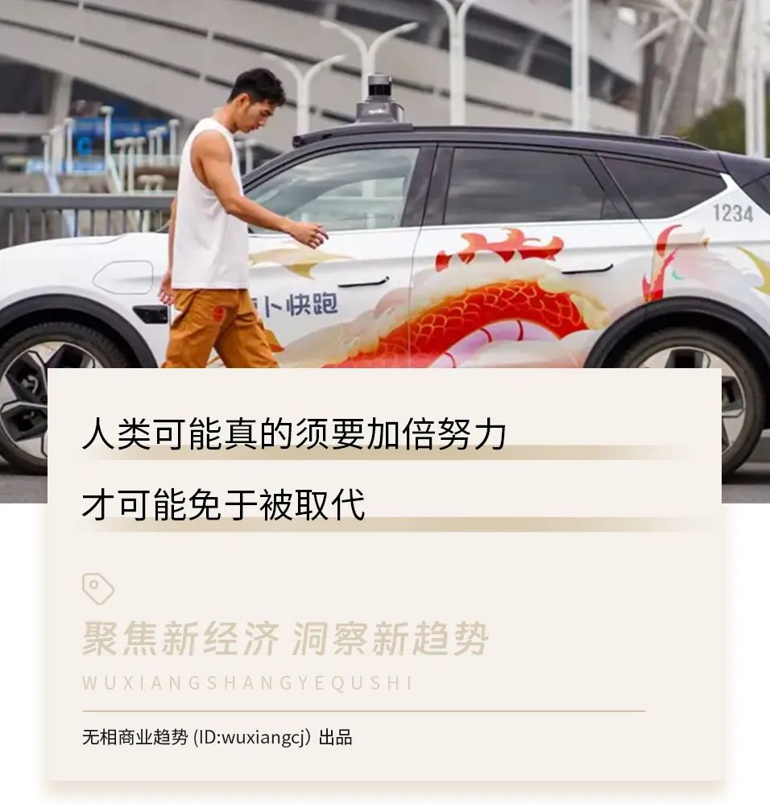 (原始链接: https://mmbiz.qpic.cn/sz_mmbiz_jpg/9OR0HISiajJfwpl24ENRVMVVNEUCWyYJiaNUxemLTSEQ6kRS2hlMBUGtggdsebtpMVH0gX5bOBaX5NBnrjia8iahJQ/640?wx_fmt=jpeg&from=appmsg)
- 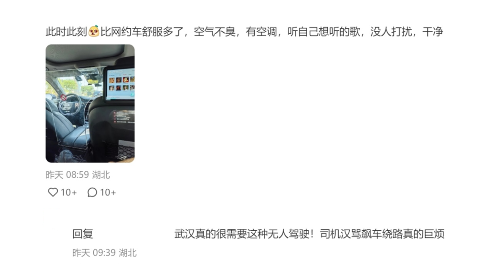 (原始链接: https://mmbiz.qpic.cn/sz_mmbiz_png/9OR0HISiajJfm7GAODkSAqd411p8Hg3wibVWP0iaEmbza25E7wPXTP3Q9x8uGiaJUpibhrS0aZ3YTf12hhOQztQibtxw/640?wx_fmt=png&from=appmsg)
-  (原始链接: https://mmbiz.qpic.cn/sz_mmbiz_jpg/9OR0HISiajJchYwiab3QXgpibpLzsFoPZic2pftde2efgvJgK5WtzHR5icTuEic64cD8685qyWIqNNFkTMLzuvzQO6eA/640?wx_fmt=jpeg&from=appmsg)
- 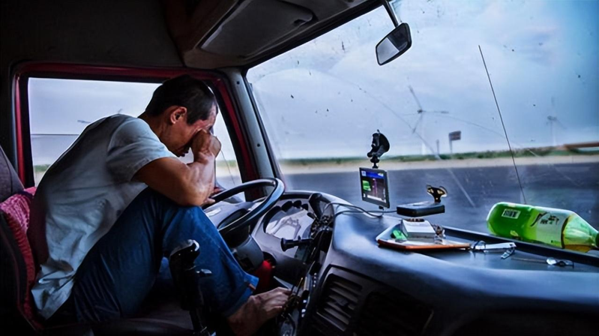 (原始链接: https://mmbiz.qpic.cn/sz_mmbiz_png/mVPRddmic6vYp890NdNx7NibLF2BF02o2K9v3VYEen1gmAe4q1VIhtxicicibyfp1lmPhXxmAOsiclDdEjMrjtdxXgYQ/640?wx_fmt=png&from=appmsg)
- 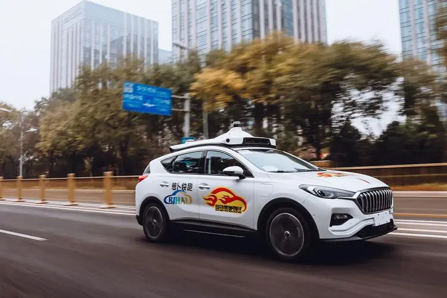 (原始链接: https://mmbiz.qpic.cn/sz_mmbiz_png/mVPRddmic6vYp890NdNx7NibLF2BF02o2K9mibuO5ibR10NkH3EfotT3hzMqZzgOuwHWsK7GNK6Dm3jUb2IibcOVVag/640?wx_fmt=png&from=appmsg)
- 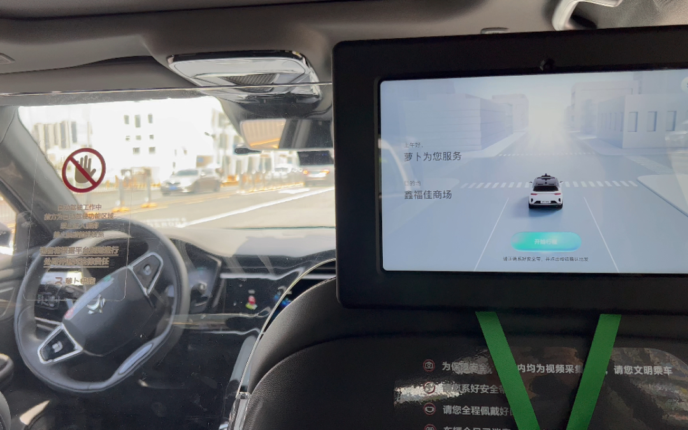 (原始链接: https://mmbiz.qpic.cn/sz_mmbiz_png/mVPRddmic6vYp890NdNx7NibLF2BF02o2KxHEFwh80J5icp4YLVoNOF7ShazZHXLGamgL2x287T2wVz6WRTMoC63A/640?wx_fmt=png&from=appmsg)
-  (原始链接: https://mmbiz.qpic.cn/sz_mmbiz_jpg/9OR0HISiajJchYwiab3QXgpibpLzsFoPZic21xWmra87gCkfTcYQp8asj0ibfb0TE4VRgkMeM0xcLNmMuVx6XJxwEQg/640?wx_fmt=jpeg&from=appmsg)
- 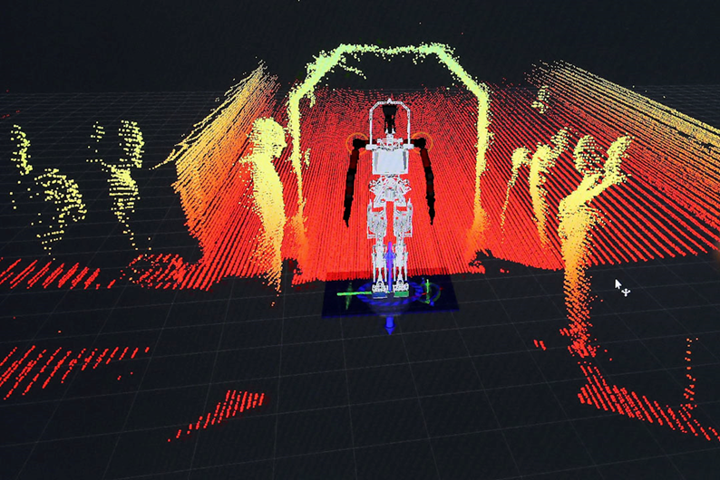 (原始链接: https://mmbiz.qpic.cn/sz_mmbiz_png/mVPRddmic6vYp890NdNx7NibLF2BF02o2KI6XmNdnsPnYFlXxyC59aMITIsCUb4uqQdauCSuWa8Y6ULLFO26ZPMA/640?wx_fmt=png&from=appmsg)
- 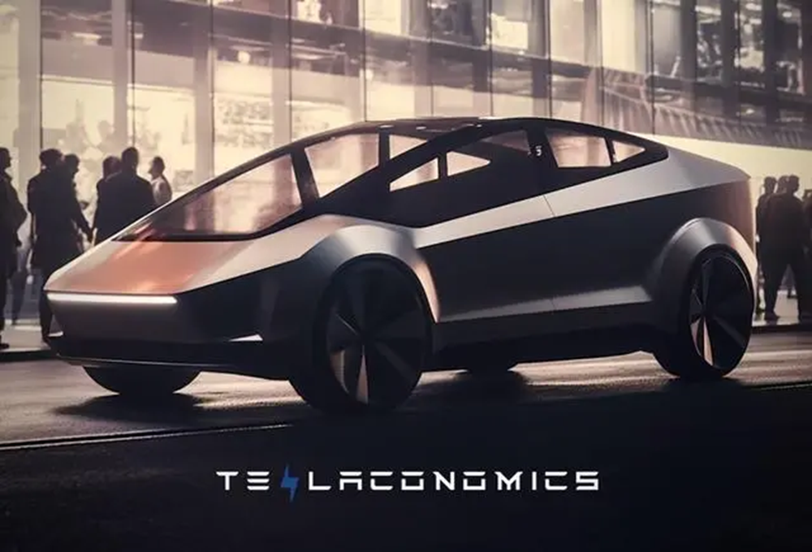 (原始链接: https://mmbiz.qpic.cn/sz_mmbiz_png/mVPRddmic6vYp890NdNx7NibLF2BF02o2Kypu2vcFIUHu5lgjVFGoRoB9e34DK4mCs7wVLlnHKnCZk5ocgngncGg/640?wx_fmt=png&from=appmsg)
-  (原始链接: https://mmbiz.qpic.cn/sz_mmbiz_jpg/9OR0HISiajJchYwiab3QXgpibpLzsFoPZic2BfXsuErTias06xBCs0mbzKeU91KTIY1Wicy5RPCzA85oQDbS1mapPG2A/640?wx_fmt=jpeg&from=appmsg)
- 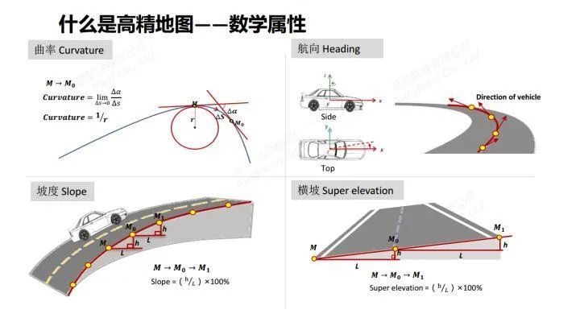 (原始链接: https://mmbiz.qpic.cn/sz_mmbiz_jpg/9OR0HISiajJfwpl24ENRVMVVNEUCWyYJiaKsBicwtgwM2vJJNoItSia1fhHFSQCKwiaWpzRf4Ce9vGrEbib0bTrbOkCQ/640?wx_fmt=jpeg&from=appmsg)
- 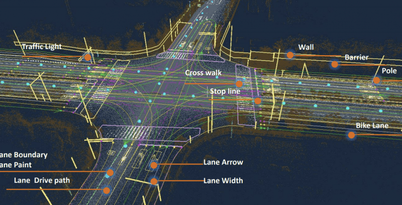 (原始链接: https://mmbiz.qpic.cn/sz_mmbiz_png/mVPRddmic6vYp890NdNx7NibLF2BF02o2Kx0gjiaSwVm4mvszb37qx3V9pCoBPoovoBhIkeibd1yKXIIUM4OMB9HgQ/640?wx_fmt=png&from=appmsg)
- 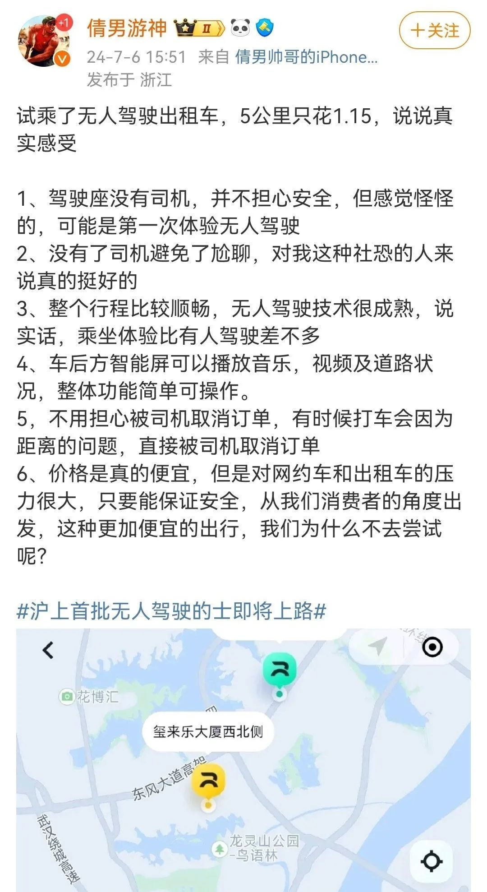 (原始链接: https://mmbiz.qpic.cn/sz_mmbiz_jpg/9OR0HISiajJfm7GAODkSAqd411p8Hg3wibAibVmRBoIO1Ufe1erXxmQ1b97XadZ99LbLGlq2sYkqBD7T22gPDDJMQ/640?wx_fmt=jpeg&from=appmsg)
-  (原始链接: https://mmbiz.qpic.cn/sz_mmbiz_jpg/9OR0HISiajJfttF30Yn71PSHaNn3ac0Gnfjss3kKooOiacAvEUXr6nlf9UctA7vfmdKtePJ7Pm8KcbNG5GjlFMibA/640?wx_fmt=other&from=appmsg&tp=webp&wxfrom=5&wx_lazy=1&wx_co=1)
-  (原始链接: https://mmbiz.qpic.cn/sz_mmbiz_jpg/9OR0HISiajJcFMJKZBca1CkTH6uxKZSQDsGkougWZttDgiao0JtRrcZwNAic7RXbJnK3FkaTPnOWaavwK1p19bpwQ/640?wx_fmt=jpeg&from=appmsg)
-  (原始链接: https://mmbiz.qpic.cn/sz_mmbiz_jpg/9OR0HISiajJdWvLp0OBiaMgibOe2mOttPGA1BQibx2TiaaHmb7kehIyqz8zn2KIIkYUgGjPpRjjmaZicHhJaVjAeDJoA/640?wx_fmt=jpeg&from=appmsg)
- 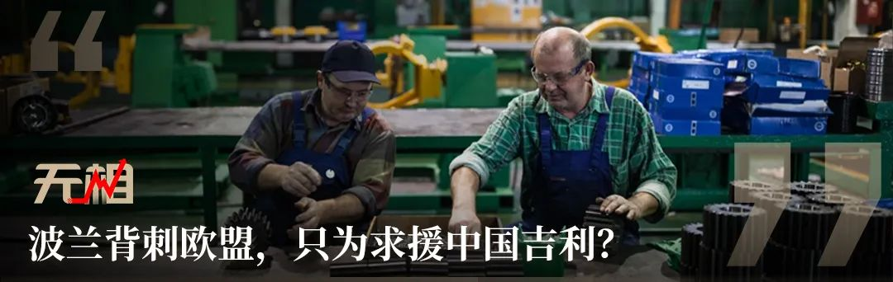 (原始链接: https://mmbiz.qpic.cn/sz_mmbiz_jpg/9OR0HISiajJdWvLp0OBiaMgibOe2mOttPGA5NYYqBZSbXLv4jQmOHicN4NY2Oq5CnWUnCgFO70rvvdVWdNCgBpCq1A/640?wx_fmt=jpeg&from=appmsg)
-  (原始链接: https://mmbiz.qpic.cn/sz_mmbiz_jpg/9OR0HISiajJdWvLp0OBiaMgibOe2mOttPGAGibGJNxvhKdk37byQrJ6aJoddwJN3VVdtJrcWAvrTuUTPzVkQ6hE5eA/640?wx_fmt=jpeg&from=appmsg)
- 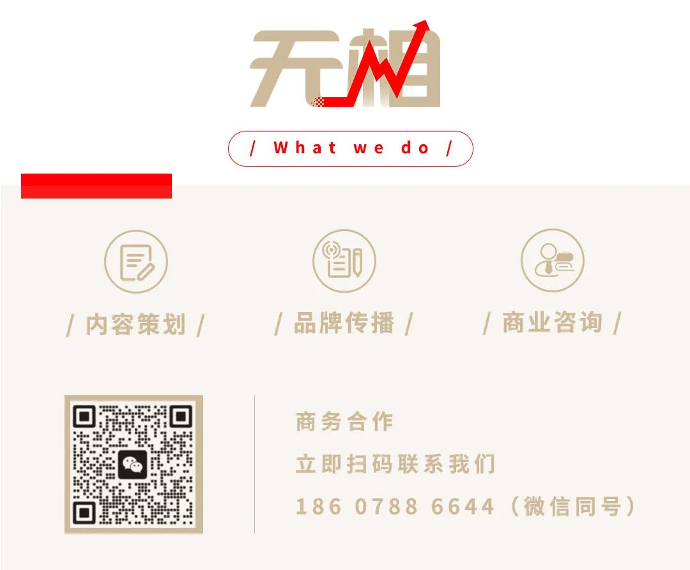 (原始链接: https://mmbiz.qpic.cn/sz_mmbiz_jpg/9OR0HISiajJcFMJKZBca1CkTH6uxKZSQDgewl6j33JWg3DbfkzhgX4RktJORJLXPV57uN6bYpZ97SToqESribgXg/640?wx_fmt=jpeg&from=appmsg)
-  (原始链接: https://mmbiz.qpic.cn/sz_mmbiz_gif/9OR0HISiajJcFMJKZBca1CkTH6uxKZSQDIWfibhmFPPdNrprvJGOWibsgib4xkmBNrrLrXW0tSqPbDictJUZfpGxQBA/640?wx_fmt=gif&from=appmsg)
-  (原始链接: https://mmbiz.qpic.cn/sz_mmbiz_jpg/9OR0HISiajJcFMJKZBca1CkTH6uxKZSQDdcKBvRtQLbRfrYhWIQPC7mduXu3N3kliaib0eR9Q4X72auvQRW0w1pkQ/640?wx_fmt=jpeg&from=appmsg)
