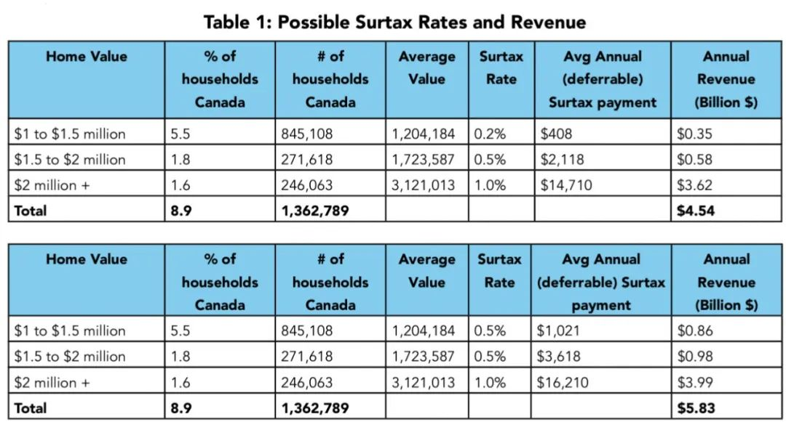

# 无标题

**链接地址:** http://mp.weixin.qq.com/s?__biz=MjM5MDEzNzY2NQ==&mid=2652886905&idx=1&sn=8805dfe6dd2f5ff28a2925b02aed2306&chksm=bda21b578ad59241c7fdd25c8d986c58308252d196962cbf623687883c1bd7fec6f22c86534c&mpshare=1&scene=2&srcid=0710CZX1LHm1INkp0w3vyYaw&sharer_shareinfo=cf1c90aab8458c45a8e57b0ada80d8ce&sharer_shareinfo_first=cf1c90aab8458c45a8e57b0ada80d8ce#rd
**作者:** 在溪
**获取时间:** 2025/8/28 18:54:09
**图片数量:** 6

---

## 原始HTML内容

<section data-mpa-powered-by="yiban.io" style="margin-bottom: 0px;outline: 0px;font-family: system-ui, -apple-system, &quot;system-ui&quot;, &quot;Helvetica Neue&quot;, &quot;PingFang SC&quot;, &quot;Hiragino Sans GB&quot;, &quot;Microsoft YaHei UI&quot;, &quot;Microsoft YaHei&quot;, Arial, sans-serif;letter-spacing: 0.544px;text-wrap: wrap;background-color: rgb(255, 255, 255);text-align: center;visibility: visible;"></section><section style="margin-bottom: 0px;outline: 0px;font-family: system-ui, -apple-system, &quot;system-ui&quot;, &quot;Helvetica Neue&quot;, &quot;PingFang SC&quot;, &quot;Hiragino Sans GB&quot;, &quot;Microsoft YaHei UI&quot;, &quot;Microsoft YaHei&quot;, Arial, sans-serif;letter-spacing: 0.544px;text-wrap: wrap;background-color: rgb(255, 255, 255);text-align: center;visibility: visible;">***</section>
 

据《国家邮报》报道，加拿大总理特鲁多在最近的一次采访中讨论了可负担危机和代际公平问题，似乎有意利用住房危机来挑起加拿大年轻人与老年人的矛盾。 

 

特鲁多在接受倡导组织“Generation Squeeze”的播客采访时表示，那些“省吃俭用”买房的老年人无法理解年轻一代无法踏上住房阶梯的艰辛。而该组织呼吁对所有超过 100 万加的房屋征收年度附加税。

 

 

特鲁多拒绝对当前的可负担性危机承担任何责任，但表示“挑战”在于让老年人和年长的加拿大人“理解”住房市场的根本转变。

 

<strong>这对拥有房产的年长的加拿大人意味着什么？</strong>

 

特鲁多在播客中并没有详细说明任何新的政策，但他出现在 Generation Squeeze 的播客中，这个组织支持对自住房征税，这很能说明问题。

 

该组织的一份报告主张对所有价值超过 100 万加元的房屋征收年度附加税。价值 100 万至 150 万加元的房屋将面临 0.2% 的附加税（可能随着时间的推移上升到 0.5%），价值 200 万加元的房屋将面临 1% 的税。

 
<section style="text-align: center;margin-left: 16px;margin-right: 16px;"></section>
 

该组织还建议，联邦和省级政府如果担心实施“房屋净值税”，可以将其作为一项税收政策的“技术”变更。

 

该组织对老年人的“意外之财”有些不屑一顾，甚至是有些嫉妒。报告称：“在他们睡觉和看电视时，房价上涨，给他们带来了财富。”

 

在播客中，主持人、Generation Squeeze 的创始人和 UBC 大学人口与公共卫生学院教授 Paul Kershaw 表示，“代际公平”是关于年轻人和老年人的公平。但整个采访都围绕着老一代可以为年轻人做些什么。

 

Kershaw 表示，X 世代和婴儿潮（即 60 后 70 后）一代受益于年轻一代的“牺牲”，年轻人“容忍”高租金并推迟购房梦想，都是为了保护那些“前人”的房屋净值。

 

特鲁多总理似乎同意这一点。年长的加拿大人已经理解了气候变化等问题，但仍需要在变化的住房市场上接受教育。

 

特鲁多说：“我认为住房问题仍有工作要做，直觉上感觉没有解决方案。你与老一代的人交谈，他们会说，‘哦，不，我记得我不得不省吃俭用多年才能支付首付款。那真的很难。住房一直都很难。’”

 

如果你遇年轻人交谈，他们又会说：“哦，进入住房市场很难”，但老年人说，“我们经历过这些。”

 

特鲁多说：“不是的，这一代人有着根本性的不同，年轻人有很好的工作，有稳定的副业，期望也发生了变化，但他们仍然找不到真正开始实现房屋净值或房屋所有权的地方。这种转变是不同的。”

 

然而，尽管特鲁多在让老年人感到内疚或与年轻人制造分歧时，自己却不承担任何责任。

 

他说：“部分原因是几十年来对住房建设的投资不足，但还有其他问题，而让老年人理解这一点是我们仍在努力解决的挑战。”

 

回顾 2015 年投票给他的年轻人，特鲁多说：“讽刺的是，现在 10 年过去了，我看到那些第一次支持我的年轻人，他们现在已经 30 多岁了，却说‘我买不起房子。我以为你们应该解决这个问题，但事实是世界已经走向了错误的方向’。”

 
<section style="text-align: center;margin-left: 16px;margin-right: 16px;"></section>
<strong> </strong>

<strong>对于这些长期遭背叛的人，总理给他们什么安慰？</strong>

 

他说：“如果我们没有做出那些投资，情况会糟糕得多。”

 

从 2015 年以来一直担任总理的特鲁多补充说：“我们的经济发生了一些根本性的变化，年轻人不再拥有以前那样的机会。”

 

评论文章指出，对于自由党来说，似乎任何积累了一些钱或财富的人现在都成了为他们错误买单的目标对象。

 
<section style="text-align: center;margin-left: 16px;margin-right: 16px;"></section>
 

有人会忘记上个月，副总理方慧兰预测愤怒的无产阶级将对富人的城堡发动起义吗？

 

她问道：“我们是否想生活在这样一个国家：最顶层的人过着奢侈的生活，但却必须在越来越高的围栏后面的封闭式社区里，使用私人医疗保健和飞机？公共领域如此退化，大多数没有特权的同胞无比愤怒。”

 

在播客中，特鲁多感谢 Kershaw 的思考“非常有帮助”。当 Kershaw 询问是否会任命一位代际公平部长时，特鲁多回答说：“我认为这是一个非常有趣的想法，我认为这是你我可能共同努力的事情。”

 

最后，文章提醒，这不会是房屋净值税，只是税收制度的技术性变更。

 

新闻来源：

https://nationalpost.com/opinion/does-trudeau-plan-to-put-the-squeeze-on-older-homeowners

 

+++全加拿大华人都在关注超级生活，就差你了+++

<section style="margin-right: 16px;margin-bottom: 0px;margin-left: 16px;outline: 0px;letter-spacing: 0.544px;text-indent: 0em;text-wrap: wrap;background-color: rgb(255, 255, 255);caret-color: rgba(0, 0, 0, 0);font-family: system-ui, -apple-system, system-ui, &quot;Helvetica Neue&quot;, &quot;PingFang SC&quot;, &quot;Hiragino Sans GB&quot;, &quot;Microsoft YaHei UI&quot;, &quot;Microsoft YaHei&quot;, Arial, sans-serif;font-size: 15px;text-align: right;line-height: 1.75em;">喜欢就狠点下👍</section>
 

 

<mp-style-type data-value="10000"></mp-style-type>

---

## 纯文本内容

***据《国家邮报》报道，加拿大总理特鲁多在最近的一次采访中讨论了可负担危机和代际公平问题，似乎有意利用住房危机来挑起加拿大年轻人与老年人的矛盾。特鲁多在接受倡导组织“Generation Squeeze”的播客采访时表示，那些“省吃俭用”买房的老年人无法理解年轻一代无法踏上住房阶梯的艰辛。而该组织呼吁对所有超过 100 万加的房屋征收年度附加税。特鲁多拒绝对当前的可负担性危机承担任何责任，但表示“挑战”在于让老年人和年长的加拿大人“理解”住房市场的根本转变。这对拥有房产的年长的加拿大人意味着什么？特鲁多在播客中并没有详细说明任何新的政策，但他出现在 Generation Squeeze 的播客中，这个组织支持对自住房征税，这很能说明问题。该组织的一份报告主张对所有价值超过 100 万加元的房屋征收年度附加税。价值 100 万至 150 万加元的房屋将面临 0.2% 的附加税（可能随着时间的推移上升到 0.5%），价值 200 万加元的房屋将面临 1% 的税。该组织还建议，联邦和省级政府如果担心实施“房屋净值税”，可以将其作为一项税收政策的“技术”变更。该组织对老年人的“意外之财”有些不屑一顾，甚至是有些嫉妒。报告称：“在他们睡觉和看电视时，房价上涨，给他们带来了财富。”在播客中，主持人、Generation Squeeze 的创始人和 UBC 大学人口与公共卫生学院教授 Paul Kershaw 表示，“代际公平”是关于年轻人和老年人的公平。但整个采访都围绕着老一代可以为年轻人做些什么。Kershaw 表示，X 世代和婴儿潮（即 60 后 70 后）一代受益于年轻一代的“牺牲”，年轻人“容忍”高租金并推迟购房梦想，都是为了保护那些“前人”的房屋净值。特鲁多总理似乎同意这一点。年长的加拿大人已经理解了气候变化等问题，但仍需要在变化的住房市场上接受教育。特鲁多说：“我认为住房问题仍有工作要做，直觉上感觉没有解决方案。你与老一代的人交谈，他们会说，‘哦，不，我记得我不得不省吃俭用多年才能支付首付款。那真的很难。住房一直都很难。’”如果你遇年轻人交谈，他们又会说：“哦，进入住房市场很难”，但老年人说，“我们经历过这些。”特鲁多说：“不是的，这一代人有着根本性的不同，年轻人有很好的工作，有稳定的副业，期望也发生了变化，但他们仍然找不到真正开始实现房屋净值或房屋所有权的地方。这种转变是不同的。”然而，尽管特鲁多在让老年人感到内疚或与年轻人制造分歧时，自己却不承担任何责任。他说：“部分原因是几十年来对住房建设的投资不足，但还有其他问题，而让老年人理解这一点是我们仍在努力解决的挑战。”回顾 2015 年投票给他的年轻人，特鲁多说：“讽刺的是，现在 10 年过去了，我看到那些第一次支持我的年轻人，他们现在已经 30 多岁了，却说‘我买不起房子。我以为你们应该解决这个问题，但事实是世界已经走向了错误的方向’。”对于这些长期遭背叛的人，总理给他们什么安慰？他说：“如果我们没有做出那些投资，情况会糟糕得多。”从 2015 年以来一直担任总理的特鲁多补充说：“我们的经济发生了一些根本性的变化，年轻人不再拥有以前那样的机会。”评论文章指出，对于自由党来说，似乎任何积累了一些钱或财富的人现在都成了为他们错误买单的目标对象。有人会忘记上个月，副总理方慧兰预测愤怒的无产阶级将对富人的城堡发动起义吗？她问道：“我们是否想生活在这样一个国家：最顶层的人过着奢侈的生活，但却必须在越来越高的围栏后面的封闭式社区里，使用私人医疗保健和飞机？公共领域如此退化，大多数没有特权的同胞无比愤怒。”在播客中，特鲁多感谢 Kershaw 的思考“非常有帮助”。当 Kershaw 询问是否会任命一位代际公平部长时，特鲁多回答说：“我认为这是一个非常有趣的想法，我认为这是你我可能共同努力的事情。”最后，文章提醒，这不会是房屋净值税，只是税收制度的技术性变更。新闻来源：https://nationalpost.com/opinion/does-trudeau-plan-to-put-the-squeeze-on-older-homeowners+++全加拿大华人都在关注超级生活，就差你了+++喜欢就狠点下👍

---

## 图片列表

-  (原始链接: https://mmbiz.qpic.cn/mmbiz_gif/szJas1pFaJftq03eG05p1xs2XfGBCEL1t9FdIh4AeZM5O4mPDq83cEWPEfXJ8Igso0qfdmiaHoaScE3PbZicdZRA/640?wx_fmt=gif&from=appmsg&wxfrom=5&wx_lazy=1&tp=webp)
-  (原始链接: https://mmbiz.qpic.cn/mmbiz_png/4kibCXA1QiblShmzlx4iaPaQvThjMdyWtLPTwdBbO35BnrNtl7W8To1hTYJfU54P2ALed9cAOOt5dVo473vClwtmA/640?wx_fmt=png&from=appmsg)
-  (原始链接: https://mmbiz.qpic.cn/mmbiz_jpg/4kibCXA1QiblShmzlx4iaPaQvThjMdyWtLPibG5oWVLxn8FFbFYGxX64W0Qs4pY0hFPlIQUnsTDEC1sO4yoNONickqw/640?wx_fmt=jpeg)
-  (原始链接: https://mmbiz.qpic.cn/mmbiz_jpg/4kibCXA1QiblShmzlx4iaPaQvThjMdyWtLPEaZC2B3YgtQSt8eQRQ7TBbjtlibdvA0JV3tdkkQA1MXfKAp0RjVV6tw/640?wx_fmt=webp&from=appmsg)
-  (原始链接: https://mmbiz.qpic.cn/mmbiz_jpg/4kibCXA1QiblShmzlx4iaPaQvThjMdyWtLPtZlx596jTNKE1EzCthSdpPqoSqXNAxyPicXDtuDrVnsVQzvfoTpoHjw/640?wx_fmt=webp&from=appmsg)
-  (原始链接: https://mmbiz.qpic.cn/mmbiz_gif/szJas1pFaJfb92gAwdAx21srm8k6mM4dQchfL4Aj6O53N5O8YI16zTocMLRN42icKDicwYOzMPOaa7b2Rmqy3DgQ/640?wx_fmt=gif&wxfrom=5&wx_lazy=1&tp=wxpic)
