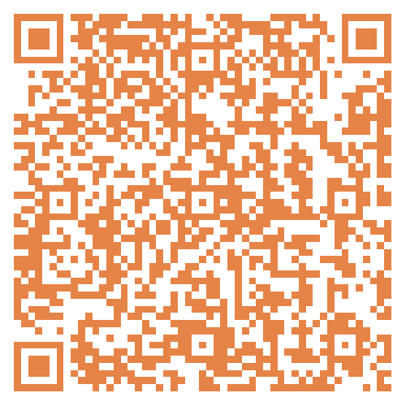
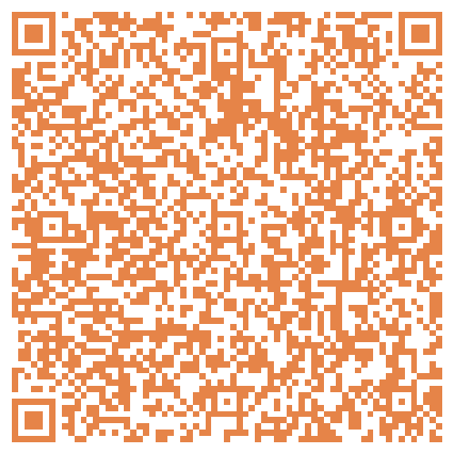
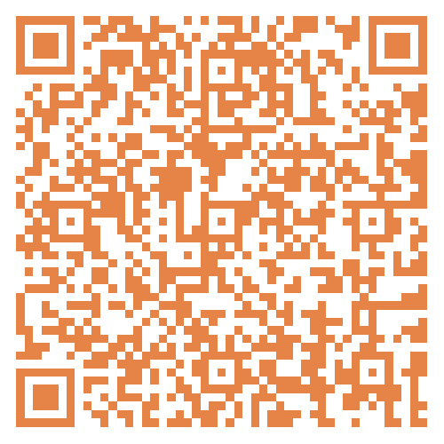
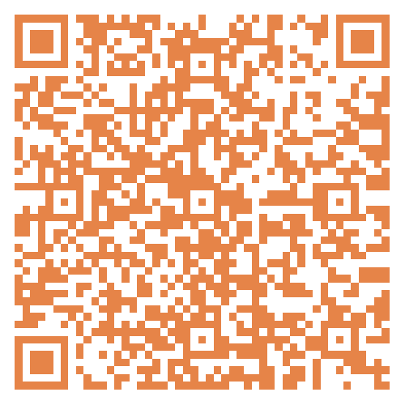
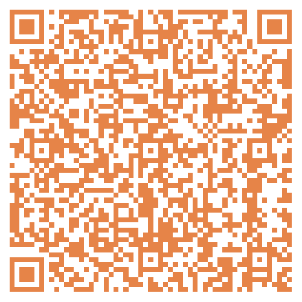
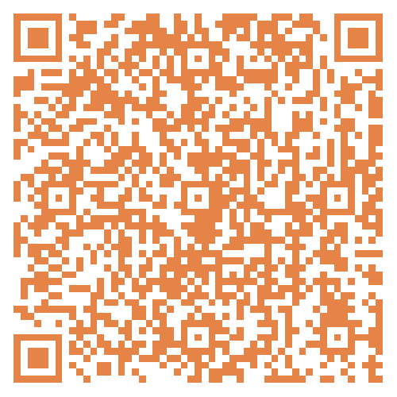

# 无标题

**链接地址:** http://mp.weixin.qq.com/s?__biz=MzI4NDYyNjAwNw==&mid=2247488955&idx=1&sn=2304b80a792e092a7b0966a7b0b9ff86&chksm=ebf9c883dc8e4195e9999b24afe358436ac084373ddd1e2feeede36c0f4f2d2d3e6b9cd93352&mpshare=1&scene=2&srcid=0727uNZI4y2Pxaqc7YKBXeP6&sharer_shareinfo=507328842d0eb7ecbb11c736209ac551&sharer_shareinfo_first=507328842d0eb7ecbb11c736209ac551#rd
**作者:** 欢迎转发
**获取时间:** 2025/8/28 18:54:00
**图片数量:** 13

---

## 原始HTML内容

<section style="font-size: 16px;"><section style="text-align: left;justify-content: flex-start;display: flex;flex-flow: row;margin-top: 20px;margin-bottom: 10px;"><section style="display: inline-block;width: auto;vertical-align: top;align-self: flex-start;flex: 0 0 auto;border-style: solid;border-width: 2px 0px 0px;border-top-color: rgb(180, 180, 180);min-width: 5%;height: auto;"><section style="justify-content: flex-start;display: flex;flex-flow: row;margin-top: -13px;"><section style="display: inline-block;vertical-align: top;width: auto;flex: 0 0 0%;height: auto;"><section style="text-align: right;margin-top: 7px;transform: translate3d(6px, 0px, 0px);"><section style="display: inline-block;width: 11px;height: 11px;vertical-align: top;overflow: hidden;border-style: solid;border-width: 3px;border-color: rgb(255, 255, 255);border-radius: 42px;background-color: rgb(237, 102, 15);"><section style="text-align: justify;">
 
</section></section></section></section><section style="display: inline-block;vertical-align: top;width: auto;align-self: flex-start;flex: 100 100 0%;border-style: solid;border-width: 0px 0px 0px 2px;border-left-color: rgb(180, 180, 180);height: auto;padding-top: 18px;padding-right: 11px;padding-left: 11px;"><section style="justify-content: flex-start;display: flex;flex-flow: row;"><section style="display: inline-block;vertical-align: middle;width: auto;align-self: center;flex: 0 0 auto;min-width: 5%;height: auto;background-color: rgb(237, 146, 15);padding-right: 5px;padding-left: 5px;margin-right: 6px;"><section style="text-align: justify;color: rgb(255, 255, 255);font-size: 15px;">
<strong>点击蓝字</strong>
</section></section><section style="display: inline-block;vertical-align: middle;width: auto;min-width: 5%;flex: 0 0 auto;height: auto;align-self: center;"><section style="text-align: justify;">
<strong style="text-align: center;">关注我们</strong>
</section></section></section></section></section></section></section>
 
<section style="margin: 20px 0%;"><section style="letter-spacing: 2px;font-size: 14px;color: rgb(121, 121, 121);padding-right: 20px;padding-left: 20px;line-height: 2;">
BadaB Consulting是一家成立于加拿大的<strong>人力资源咨询公司</strong>。今天，我们将要给大家分享几个正在招聘的阿省职位，找工作的小伙伴们祝你们好运！如果你需要简历修改和面试培训，也欢迎联系BadaB寻求帮助。
</section></section>
 
<section style="text-align: center;justify-content: center;display: flex;flex-flow: row;margin-top: 10px;margin-bottom: 10px;"><section style="display: inline-block;vertical-align: top;width: auto;flex: 0 0 0%;height: auto;"><section style="transform: perspective(0px);transform-style: flat;"><section style="transform: rotateY(180deg);"><section style="display: inline-block;width: 0px;height: 0px;vertical-align: top;overflow: hidden;border-style: solid;border-width: 0px 10px 44px 0px;border-color: rgba(255, 255, 255, 0) rgba(255, 255, 255, 0) rgb(237, 146, 15);"><section style="text-align: justify;">
 
</section></section></section></section></section><section style="display: inline-block;vertical-align: top;width: auto;align-self: stretch;flex: 0 0 auto;min-width: 5%;height: auto;padding: 8px 11px;background-color: rgb(237, 146, 15);"><section style="text-align: left;transform: translate3d(-4px, 0px, 0px);"><section style="text-align: justify;color: rgb(255, 255, 255);">
<strong>阿省八月职位招聘</strong>
</section></section></section><section style="display: inline-block;vertical-align: top;width: auto;align-self: stretch;flex: 0 0 auto;min-width: 5%;height: auto;line-height: 0.1;margin-left: -10px;"><section style="display: flex;width: 100%;flex-flow: column;"><section style="z-index: 1;"><section style="text-align: left;"><section style="display: inline-block;width: 0px;height: 0px;vertical-align: top;overflow: hidden;border-style: solid;border-width: 0px 10px 44px;border-color: rgba(255, 255, 255, 0) rgba(255, 255, 255, 0) rgb(237, 102, 15);"><section style="text-align: justify;">
 
</section></section></section></section></section></section></section><section style="text-align: center;margin-top: 10px;margin-bottom: 10px;line-height: 0;"><section style="vertical-align: middle;display: inline-block;line-height: 0;"></section></section>
 
<section style="text-align: left;justify-content: flex-start;display: flex;flex-flow: row;margin-top: 10px;margin-bottom: -10px;transform: translate3d(-4px, 0px, 0px);"><section style="transform: rotateX(340deg) rotateY(36deg);"><section style="text-align: center;justify-content: center;display: flex;flex-flow: row;"><section style="display: inline-block;width: auto;vertical-align: top;align-self: flex-start;flex: 0 0 auto;background-color: rgb(237, 146, 15);min-width: 5%;height: auto;padding-right: 9px;padding-left: 9px;border-style: solid;border-width: 2px;"><section style="font-size: 15px;">
<strong>01</strong>
</section></section></section></section></section><section style="text-align: left;justify-content: flex-start;display: flex;flex-flow: row;margin-bottom: 10px;"><section style="display: inline-block;width: auto;vertical-align: top;align-self: flex-start;flex: 0 0 auto;min-width: 5%;height: auto;padding: 8px 12px;border-style: solid;border-width: 2px 0px;border-top-color: rgb(180, 180, 180);border-bottom-color: rgb(180, 180, 180);"><section style="text-align: center;"><section style="text-align: justify;color: rgb(48, 48, 48);font-size: 24px;">
<strong>Non-ferrous Laborer</strong>
</section></section></section></section><section style="margin-right: 0%;margin-left: 0%;"><section style="display: inline-block;width: 100%;border-width: 1px;border-style: solid;border-color: rgba(0, 0, 0, 0);padding: 20px;box-shadow: rgba(0, 0, 0, 0) 0px 0px 0px;"><section style="text-align: left;justify-content: flex-start;display: flex;flex-flow: row;"><section style="display: inline-block;vertical-align: top;width: 50%;align-self: flex-start;flex: 0 0 auto;"><section style="text-align: justify;">
<strong>企业名称</strong>
</section><section style="margin-bottom: 10px;"><section style="text-align: justify;">
CAC Metal Recycling
</section></section><section style="text-align: justify;">
<strong>工作类型</strong>
</section><section style="margin-bottom: 10px;"><section style="text-align: justify;">
FULL-TIME, PERMANENT
</section></section></section><section style="display: inline-block;vertical-align: top;width: 50%;align-self: flex-start;flex: 0 0 auto;"><section style="text-align: center;margin-top: 10px;line-height: 0;"><section style="vertical-align: middle;display: inline-block;line-height: 0;width: 75%;height: auto;"></section></section><section style="text-align: center;font-size: 12px;color: rgb(180, 180, 180);">
职位详情及应聘方式
</section></section></section>
<strong>应聘要求</strong>
<section style="margin-bottom: 10px;"><section style="text-align: left;font-size: 13px;">
To perform this job successfully, an individual must be able to perform each essential duty satisfactorily. The requirements listed below are representative of the knowledge, skill, and/or ability required. Reasonable accommodations may be made to enable individuals with disabilities to perform the essential functions.
<ul class="list-paddingleft-2" style="padding-left: 40px;list-style-position: outside;"><li>
1+ year of hands-on non-ferrous metal experience
</li><li>
Understand and be able to grade all non-ferrous material properly
</li><li>
Metal recycling industry experience
</li><li>
Experience stripping equipment and/or with manual material sorting
</li><li>
Knowledge of non-ferrous processing
</li><li>
High school diploma (Or GED)
</li><li>
Well-articulated and assertive
</li><li>
Ability to effectively communicate and present information in one-on-one and small group situations to supervisors, maintenance personnel and other employees of the organization
</li><li>
Ability to read and comprehend simple instructions, short correspondence, and memos
</li><li>
Ability to write simple correspondence
</li><li>
Mechanically inclined an asset
</li><li>
Computer literate
</li></ul></section></section></section></section>
 
<section style="text-align: left;justify-content: flex-start;display: flex;flex-flow: row;margin-top: 10px;margin-bottom: -10px;transform: translate3d(-4px, 0px, 0px);"><section style="transform: rotateX(340deg) rotateY(36deg);"><section style="text-align: center;justify-content: center;display: flex;flex-flow: row;"><section style="display: inline-block;width: auto;vertical-align: top;align-self: flex-start;flex: 0 0 auto;background-color: rgb(237, 146, 15);min-width: 5%;height: auto;padding-right: 9px;padding-left: 9px;border-style: solid;border-width: 2px;"><section style="font-size: 15px;">
<strong>02</strong>
</section></section></section></section></section><section style="text-align: left;justify-content: flex-start;display: flex;flex-flow: row;margin-bottom: 10px;"><section style="display: inline-block;width: auto;vertical-align: top;align-self: flex-start;flex: 0 0 auto;min-width: 5%;height: auto;padding: 8px 12px;border-style: solid;border-width: 2px 0px;border-top-color: rgb(180, 180, 180);border-bottom-color: rgb(180, 180, 180);"><section style="text-align: center;"><section style="text-align: left;color: rgb(48, 48, 48);font-size: 24px;">
<strong>AP/AR Accounting Technician&nbsp;</strong> 
</section></section></section></section><section style="margin-right: 0%;margin-left: 0%;"><section style="display: inline-block;width: 100%;border-width: 1px;border-style: solid;border-color: rgba(0, 0, 0, 0);padding: 20px;box-shadow: rgba(0, 0, 0, 0) 0px 0px 0px;"><section style="text-align: left;justify-content: flex-start;display: flex;flex-flow: row;"><section style="display: inline-block;vertical-align: top;width: 50%;align-self: flex-start;flex: 0 0 auto;"><section style="text-align: justify;">
<strong>企业名称</strong>
</section><section style="margin-bottom: 10px;">
Grande Spirit Foundation
</section><section style="text-align: justify;">
<strong>工作类型</strong>
</section><section style="margin-bottom: 10px;"><section style="text-align: justify;">
3-Month Contract 
</section></section></section><section style="display: inline-block;vertical-align: top;width: 50%;align-self: flex-start;flex: 0 0 auto;"><section style="text-align: center;margin-top: 10px;line-height: 0;"><section style="vertical-align: middle;display: inline-block;line-height: 0;width: 75%;height: auto;"></section></section><section style="text-align: center;font-size: 12px;color: rgb(180, 180, 180);">
职位详情及应聘方式
</section></section></section>
<strong>应聘要求</strong>
<section style="margin-bottom: 10px;"><section style="text-align: left;font-size: 13px;"><ul class="list-paddingleft-1" style="padding-left: 40px;list-style-position: outside;"><li>
A minimum of three years' experience in accounting and experience in a non-profit or property management financial background is considered a strong asset. 
</li><li>
Post-secondary in Business Administration, specializing in Accounting/Payroll 
</li><li>
A combination of training with experience will be considered in place of formal educational 
</li><li>
Must have skilled experience in AP/AR 
</li><li>
Skilled with computer software, Microsoft Office365, and SharePoint 
</li><li>
Excellent understanding of computerized accounting systems and payroll software 
</li><li>
Strong interpersonal and communication skills 
</li><li>
Thrive in a fast-paced environment with an ability to multi-task, set priorities, and meet deadlines
</li></ul>
 
</section></section></section></section><section style="text-align: left;justify-content: flex-start;display: flex;flex-flow: row;margin-top: 10px;margin-bottom: -10px;transform: translate3d(-4px, 0px, 0px);"><section style="transform: rotateX(340deg) rotateY(36deg);"><section style="text-align: center;justify-content: center;display: flex;flex-flow: row;"><section style="display: inline-block;width: auto;vertical-align: top;align-self: flex-start;flex: 0 0 auto;background-color: rgb(237, 146, 15);min-width: 5%;height: auto;padding-right: 9px;padding-left: 9px;border-style: solid;border-width: 2px;"><section style="font-size: 15px;">
<strong>03</strong>
</section></section></section></section></section><section style="text-align: left;justify-content: flex-start;display: flex;flex-flow: row;margin-bottom: 10px;"><section style="display: inline-block;width: auto;vertical-align: top;align-self: flex-start;flex: 0 0 auto;min-width: 5%;height: auto;padding: 8px 12px;border-style: solid;border-width: 2px 0px;border-top-color: rgb(180, 180, 180);border-bottom-color: rgb(180, 180, 180);"><section style="text-align: center;"><section style="text-align: left;color: rgb(48, 48, 48);font-size: 24px;">
<strong>Employment Specialist</strong> 
</section></section></section></section><section style="margin-right: 0%;margin-left: 0%;"><section style="display: inline-block;width: 100%;border-width: 1px;border-style: solid;border-color: rgba(0, 0, 0, 0);padding: 20px;box-shadow: rgba(0, 0, 0, 0) 0px 0px 0px;"><section style="text-align: left;justify-content: flex-start;display: flex;flex-flow: row;"><section style="display: inline-block;vertical-align: top;width: 50%;align-self: flex-start;flex: 0 0 auto;"><section style="text-align: justify;">
<strong>企业名称</strong>
</section><section style="margin-bottom: 10px;">
Prospect
</section><section style="text-align: justify;">
<strong>工作类型</strong>
</section><section style="margin-bottom: 10px;"><section style="text-align: justify;">
Full Time, Hybrid
</section></section></section><section style="display: inline-block;vertical-align: top;width: 50%;align-self: flex-start;flex: 0 0 auto;"><section style="text-align: center;margin-top: 10px;line-height: 0;"><section style="vertical-align: middle;display: inline-block;line-height: 0;width: 75%;height: auto;"></section></section><section style="text-align: center;font-size: 12px;color: rgb(180, 180, 180);">
职位详情及应聘方式
</section></section></section>
<strong>应聘要求</strong>
<section style="margin-bottom: 10px;"><section style="text-align: left;font-size: 13px;"><ul class="list-paddingleft-2" style="padding-left: 40px;list-style-position: outside;"><li>
Post-secondary education is required 
</li><li>
2+ years related business development and business to business sales experience is required 
</li><li>
2+ years experience in job placement is preferred (an equivalent combination of education and professional experience will be considered) 
</li><li>
Intermediate skill level in Microsoft Office (Word, Outlook, PowerPoint, Excel); previous experience in other sales applications (CRM, record keeping) are considered assets 
</li><li>
Exemplary verbal communication with strong business writing skills 
</li><li>
A genuine desire to build differing levels of relationships with Employers, internal/ external stakeholders, and varying client population groups 
</li><li>
Exceptional client service with the ability to present ideas and/or services to individuals and groups 
</li><li>
Knowledge of working with underrepresented groups, including people with disabilities, mental health barriers, newcomers, and youth 
</li><li>
Able to take initiative and be resourceful in seeking out workplace exposure and/or job placement opportunities, including the ability to reach out and make connections 
</li><li>
Highly professional, driven, charismatic, reliable, and confident individual who thrives under pressure 
</li><li>
Knowledge or past experience with Military, Veterans, First Responders or Public Safety Personnel is considered an asset 
</li><li>
Past experience with pre-employment strategies and knowledge of the local labour market are considered assets 
</li><li>
A reliable vehicle and valid driver’s license are required 
</li><li>
Must have access to a reliable cellphone for off-site communications (Prospect will provide a standard monthly technology stipend) 
</li><li>
Provincial travel; travel to outlying areas is required 
</li><li>
All employees must pass a background check 
</li></ul></section></section></section></section><section style="text-align: left;justify-content: flex-start;display: flex;flex-flow: row;margin-top: 10px;margin-bottom: -10px;transform: translate3d(-4px, 0px, 0px);"><section style="transform: rotateX(340deg) rotateY(36deg);"><section style="text-align: center;justify-content: center;display: flex;flex-flow: row;"><section style="display: inline-block;width: auto;vertical-align: top;align-self: flex-start;flex: 0 0 auto;background-color: rgb(237, 146, 15);min-width: 5%;height: auto;padding-right: 9px;padding-left: 9px;border-style: solid;border-width: 2px;"><section style="font-size: 15px;">
<strong>04</strong>
</section></section></section></section></section><section style="text-align: left;justify-content: flex-start;display: flex;flex-flow: row;margin-bottom: 10px;"><section style="display: inline-block;width: auto;vertical-align: top;align-self: flex-start;flex: 0 0 auto;min-width: 5%;height: auto;padding: 8px 12px;border-style: solid;border-width: 2px 0px;border-top-color: rgb(180, 180, 180);border-bottom-color: rgb(180, 180, 180);"><section style="text-align: center;"><section style="text-align: left;color: rgb(48, 48, 48);font-size: 24px;">
<strong>Processing Team Member</strong> 
</section></section></section></section><section style="margin-right: 0%;margin-left: 0%;"><section style="display: inline-block;width: 100%;border-width: 1px;border-style: solid;border-color: rgba(0, 0, 0, 0);padding: 20px;box-shadow: rgba(0, 0, 0, 0) 0px 0px 0px;"><section style="text-align: left;justify-content: flex-start;display: flex;flex-flow: row;"><section style="display: inline-block;vertical-align: top;width: 50%;align-self: flex-start;flex: 0 0 auto;"><section style="text-align: justify;">
<strong>企业名称</strong>
</section><section style="margin-bottom: 10px;">
Goodwill
</section><section style="text-align: justify;">
<strong>工作类型</strong>
</section><section style="margin-bottom: 10px;"><section style="text-align: justify;">
Full-time, Temporary
</section></section></section><section style="display: inline-block;vertical-align: top;width: 50%;align-self: flex-start;flex: 0 0 auto;"><section style="text-align: center;margin-top: 10px;line-height: 0;"><section style="vertical-align: middle;display: inline-block;line-height: 0;width: 75%;height: auto;"></section></section><section style="text-align: center;font-size: 12px;color: rgb(180, 180, 180);">
职位详情及应聘方式
</section></section></section>
<strong>应聘要求</strong>
<section style="margin-bottom: 10px;"><section style="text-align: left;font-size: 13px;"><ul class="list-paddingleft-2" style="padding-left: 40px;list-style-position: outside;"><li>
A High School Diploma or equivalent work experience.
</li><li>
Minimum age of 15 or older.
</li><li>
Must be eligible to work in Canada.
</li><li>
The ability to work well in a team-oriented environment.
</li><li>
The ability to work a flexible work schedule, including evenings and weekends.
</li><li>
The ability to perform physical work on a continual basis.
</li><li>
Knowledge of designer labels, collectibles and antiques. (A strong asset but not a deal-breaker)
</li><li>
You deliver amazing customer service by going above and beyond for all Goodwill customers.
</li><li>
You demonstrate teamwork and engage fellow Team Members in contributing to Goodwill’s mission &amp; core purpose.
</li><li>
You have an open and honest attitude while making moral decisions.
</li><li>
You recognize the great efforts of fellow Team Members through genuine recognition activities.
</li><li>
You contribute to a welcoming &amp; accepting work environment by showing respect at all times.
</li><li>
You hold yourself and fellow Team Members accountable in their roles and for their contributions to Goodwill’s mission &amp; core purpose.&nbsp;
</li><li>
You continuously look to improve yourself and the organization in any aspect including but not limited to processes, communications, tasks and customer experience.
</li><li>
You prioritize safety in all tasks, ensuring safety of self as well as fellow Team Members.
</li></ul></section></section></section></section>
 
<section style="text-align: left;justify-content: flex-start;display: flex;flex-flow: row;margin-top: 10px;margin-bottom: -10px;transform: translate3d(-4px, 0px, 0px);"><section style="transform: rotateX(340deg) rotateY(36deg);"><section style="text-align: center;justify-content: center;display: flex;flex-flow: row;"><section style="display: inline-block;width: auto;vertical-align: top;align-self: flex-start;flex: 0 0 auto;background-color: rgb(237, 146, 15);min-width: 5%;height: auto;padding-right: 9px;padding-left: 9px;border-style: solid;border-width: 2px;"><section style="font-size: 15px;">
<strong>05</strong>
</section></section></section></section></section><section style="text-align: left;justify-content: flex-start;display: flex;flex-flow: row;margin-bottom: 10px;"><section style="display: inline-block;width: auto;vertical-align: top;align-self: flex-start;flex: 0 0 auto;min-width: 5%;height: auto;padding: 8px 12px;border-style: solid;border-width: 2px 0px;border-top-color: rgb(180, 180, 180);border-bottom-color: rgb(180, 180, 180);"><section style="text-align: center;"><section style="text-align: left;color: rgb(48, 48, 48);font-size: 24px;">
<strong>Program Manager</strong>
</section></section></section></section><section style="margin-right: 0%;margin-left: 0%;"><section style="display: inline-block;width: 100%;border-width: 1px;border-style: solid;border-color: rgba(0, 0, 0, 0);padding: 20px;box-shadow: rgba(0, 0, 0, 0) 0px 0px 0px;"><section style="text-align: left;justify-content: flex-start;display: flex;flex-flow: row;"><section style="display: inline-block;vertical-align: top;width: 50%;align-self: flex-start;flex: 0 0 auto;"><section style="text-align: justify;">
<strong>企业名称</strong>
</section><section style="margin-bottom: 10px;">
e4c
</section><section style="text-align: justify;">
<strong>工作类型</strong>
</section><section style="margin-bottom: 10px;"><section style="text-align: justify;">
Full-time
</section></section></section><section style="display: inline-block;vertical-align: top;width: 50%;align-self: flex-start;flex: 0 0 auto;"><section style="text-align: center;margin-top: 10px;line-height: 0;"><section style="vertical-align: middle;display: inline-block;line-height: 0;width: 75%;height: auto;"></section></section><section style="text-align: center;font-size: 12px;color: rgb(180, 180, 180);">
职位详情及应聘方式
</section></section></section>
<strong>应聘要求</strong>
<section style="margin-bottom: 10px;"><section style="text-align: left;font-size: 13px;"><ul class="list-paddingleft-1" style="padding-left: 40px;list-style-position: outside;"><li>
<strong>Education:&nbsp;</strong>Bachelor's degree in Human Services, Social Sciences, Finance, Business Administration, Public Policy, or a related field. Financial Management education or certification (e.g., CMA, CPA, CFP, QAFP, BA in Finance, MBA). Standard First Aid and CPR. Ability to pass Police Information Check with Vulnerable Sector and Intervention Record Check. 
</li><li>
<strong>Experience:&nbsp;</strong>5+ years of leadership in human services working with high-risk, marginalized populations. 3+ years in financial management/administration for low-income populations. Specialized knowledge in front-line services delivery, social housing, and AISH. Proven ability in strengths-based, trauma-informed, harm-reduction, and solution-focused practices. Experience in crisis de-escalation and managing complex scenarios. Relationship-based leadership approach and experience developing and managing program budgets. 
</li><li>
<strong>Skills:&nbsp;</strong>Strong acumen for data collection and evaluation. Intermediate or advanced skills in Word, Excel, Outlook, SharePoint, QuickBooks, database management, and general computer operations. 
</li><li>
<strong>Training:</strong>&nbsp;De-escalation and Indigenous Awareness training (recommended). 
</li></ul></section></section></section></section><section style="text-align: left;justify-content: flex-start;display: flex;flex-flow: row;margin-top: 10px;margin-bottom: -10px;transform: translate3d(-4px, 0px, 0px);"><section style="transform: rotateX(340deg) rotateY(36deg);"><section style="text-align: center;justify-content: center;display: flex;flex-flow: row;"><section style="display: inline-block;width: auto;vertical-align: top;align-self: flex-start;flex: 0 0 auto;background-color: rgb(237, 146, 15);min-width: 5%;height: auto;padding-right: 9px;padding-left: 9px;border-style: solid;border-width: 2px;"><section style="font-size: 15px;">
<strong>06</strong>
</section></section></section></section></section><section style="text-align: left;justify-content: flex-start;display: flex;flex-flow: row;margin-bottom: 10px;"><section style="display: inline-block;width: auto;vertical-align: top;align-self: flex-start;flex: 0 0 auto;min-width: 5%;height: auto;padding: 8px 12px;border-style: solid;border-width: 2px 0px;border-top-color: rgb(180, 180, 180);border-bottom-color: rgb(180, 180, 180);"><section style="text-align: center;"><section style="text-align: left;color: rgb(48, 48, 48);font-size: 24px;">
<strong>Supervisor</strong> 
</section></section></section></section><section style="margin-right: 0%;margin-left: 0%;"><section style="display: inline-block;width: 100%;border-width: 1px;border-style: solid;border-color: rgba(0, 0, 0, 0);padding: 20px;box-shadow: rgba(0, 0, 0, 0) 0px 0px 0px;"><section style="text-align: left;justify-content: flex-start;display: flex;flex-flow: row;"><section style="display: inline-block;vertical-align: top;width: 50%;align-self: flex-start;flex: 0 0 auto;"><section style="text-align: justify;">
<strong>企业名称</strong>
</section><section style="margin-bottom: 10px;">
The Town of Stony Plain
</section><section style="text-align: justify;">
<strong>工作类型</strong>
</section><section style="margin-bottom: 10px;"><section style="text-align: justify;">
Permanent Full-Time
</section></section></section><section style="display: inline-block;vertical-align: top;width: 50%;align-self: flex-start;flex: 0 0 auto;"><section style="text-align: center;margin-top: 10px;line-height: 0;"><section style="vertical-align: middle;display: inline-block;line-height: 0;width: 75%;height: auto;"></section></section><section style="text-align: center;font-size: 12px;color: rgb(180, 180, 180);">
职位详情及应聘方式
</section></section></section>
<strong>应聘要求</strong>
<section style="margin-bottom: 10px;"><section style="text-align: left;font-size: 13px;">
<strong> </strong>

<strong>Education:</strong>
<ul class="list-paddingleft-2" style="padding-left: 40px;list-style-position: outside;"><li>
Completion of a degree or diploma from a recognized post-secondary institution in Engineering, Environmental Science, Business or related discipline.
</li><li>
An equivalent combination of education and directly related experience in the field of road or facility maintenance/planning may be considered.
</li><li>
The following certifications or training are considered assets to the position:
</li><li>
Designation as a Public Works Supervisor with APWA
</li><li>
Designation with International Facilities Management Association (IFMA) as a Facilities Management Professional (FMP) or Certified Facilities Manager (CFM)
</li><li>
Knowledge of Pavement Management Systems (Road Matrix or HPMA)
</li><li>
PMP designation
</li><li>
Training with GIS Systems
</li><li>
OHS Training
</li><li>
Microsoft Office Suites

 
</li></ul>
<strong>Experience:</strong>
<ul class="list-paddingleft-1" style="padding-left: 40px;list-style-position: outside;"><li>
3-5 years’ of directly related experience in Roads or Facilities
</li><li>
Minimum 3 years’ of progressive supervisory experience, preferably in a municipal or unionized environment
</li></ul></section></section></section></section><section style="text-align: left;justify-content: flex-start;display: flex;flex-flow: row;margin-top: 10px;margin-bottom: -10px;transform: translate3d(-4px, 0px, 0px);"><section style="transform: rotateX(340deg) rotateY(36deg);"><section style="text-align: center;justify-content: center;display: flex;flex-flow: row;"><section style="display: inline-block;width: auto;vertical-align: top;align-self: flex-start;flex: 0 0 auto;background-color: rgb(237, 146, 15);min-width: 5%;height: auto;padding-right: 9px;padding-left: 9px;border-style: solid;border-width: 2px;"><section style="font-size: 15px;">
<strong>07</strong>
</section></section></section></section></section><section style="text-align: left;justify-content: flex-start;display: flex;flex-flow: row;margin-bottom: 10px;"><section style="display: inline-block;width: auto;vertical-align: top;align-self: flex-start;flex: 0 0 auto;min-width: 5%;height: auto;padding: 8px 12px;border-style: solid;border-width: 2px 0px;border-top-color: rgb(180, 180, 180);border-bottom-color: rgb(180, 180, 180);"><section style="text-align: center;"><section style="text-align: left;color: rgb(48, 48, 48);font-size: 24px;">
<strong>Software Developer</strong>
</section></section></section></section><section style="margin-right: 0%;margin-left: 0%;"><section style="display: inline-block;width: 100%;border-width: 1px;border-style: solid;border-color: rgba(0, 0, 0, 0);padding: 20px;box-shadow: rgba(0, 0, 0, 0) 0px 0px 0px;"><section style="text-align: left;justify-content: flex-start;display: flex;flex-flow: row;"><section style="display: inline-block;vertical-align: top;width: 50%;align-self: flex-start;flex: 0 0 auto;"><section style="text-align: justify;">
<strong>企业名称</strong>
</section><section style="margin-bottom: 10px;">
NorQuest College
</section><section style="text-align: justify;">
<strong>工作类型</strong>
</section><section style="margin-bottom: 10px;"><section style="text-align: justify;">
Full-Time
</section></section></section><section style="display: inline-block;vertical-align: top;width: 50%;align-self: flex-start;flex: 0 0 auto;"><section style="text-align: center;margin-top: 10px;line-height: 0;"><section style="vertical-align: middle;display: inline-block;line-height: 0;width: 75%;height: auto;"></section></section><section style="text-align: center;font-size: 12px;color: rgb(180, 180, 180);">
职位详情及应聘方式
</section></section></section>
<strong>应聘要求</strong>
<section style="margin-bottom: 10px;"><section style="text-align: left;font-size: 13px;">
<strong>Industry experience:</strong>
<ul class="list-paddingleft-1" style="padding-left: 40px;list-style-position: outside;"><li>
5+ years of workforce relevant experience successfully operationalizing machine learning models, including end-to-end development experience.
</li><li>
MSc in Computing Science or Machine Learning related field or a related Master’s Degree is preferred.
</li></ul>
<strong>Education experience:</strong>
<ul class="list-paddingleft-1" style="padding-left: 40px;list-style-position: outside;"><li>
Experience in developing curriculum, including learning outcomes and assessments in an asset.
</li><li>
Previous teaching or facilitation experience is preferred; experience with multi-modal delivery is a strong asset.
</li></ul>
<strong>General requirements:</strong>
<ul class="list-paddingleft-1" style="padding-left: 40px;list-style-position: outside;"><li>
Experience with common project management resources and workflows, such as Agile or SCRUM.&nbsp;
</li><li>
Expertise with ML project tools, software, and other relevant resources for completing ML projects that reflect those experienced by various Alberta businesses or industries.
</li><li>
Network of local and Alberta companies with ML or data analytics teams. &nbsp;
</li><li>
Demonstrated understanding of and respect for diverse academic and cultural backgrounds of learners. 
</li><li>
Demonstrated professional conduct, human relations skills, and excellent communication skills. 
</li><li>
Committed to active student learning, integrating technology into curriculum, and developing engaging learner experiences.
</li><li>
Understanding and knowledge of adult learning principles in post-secondary contexts is preferred. &nbsp;
</li></ul>
 
<svg viewBox="0 0 1 1" style="float:left;line-height:0;width:0;vertical-align:top;"></svg></section></section></section></section><section style="text-align: left;justify-content: flex-start;display: flex;flex-flow: row;margin-top: 10px;margin-bottom: -10px;transform: translate3d(-4px, 0px, 0px);"><section style="transform: rotateX(340deg) rotateY(36deg);"><section style="text-align: center;justify-content: center;display: flex;flex-flow: row;"><section style="display: inline-block;width: auto;vertical-align: top;align-self: flex-start;flex: 0 0 auto;background-color: rgb(237, 146, 15);min-width: 5%;height: auto;padding-right: 9px;padding-left: 9px;border-style: solid;border-width: 2px;"><section style="font-size: 15px;">
<strong>08</strong>
</section></section></section></section></section><section style="text-align: left;justify-content: flex-start;display: flex;flex-flow: row;margin-bottom: 10px;"><section style="display: inline-block;width: auto;vertical-align: top;align-self: flex-start;flex: 0 0 auto;min-width: 5%;height: auto;padding: 8px 12px;border-style: solid;border-width: 2px 0px;border-top-color: rgb(180, 180, 180);border-bottom-color: rgb(180, 180, 180);"><section style="text-align: center;"><section style="text-align: left;color: rgb(48, 48, 48);font-size: 24px;">
<strong>Donor Relations Coordinator</strong>
</section></section></section></section><section style="margin-right: 0%;margin-left: 0%;"><section style="display: inline-block;width: 100%;border-width: 1px;border-style: solid;border-color: rgba(0, 0, 0, 0);padding: 20px;box-shadow: rgba(0, 0, 0, 0) 0px 0px 0px;"><section style="text-align: left;justify-content: flex-start;display: flex;flex-flow: row;"><section style="display: inline-block;vertical-align: top;width: 50%;align-self: flex-start;flex: 0 0 auto;"><section style="text-align: justify;">
<strong>企业名称</strong>
</section><section style="margin-bottom: 10px;">
NorQuest College
</section><section style="text-align: justify;">
<strong>工作类型</strong>
</section><section style="margin-bottom: 10px;"><section style="text-align: justify;">
Full-Time

 
</section></section></section><section style="display: inline-block;vertical-align: top;width: 50%;align-self: flex-start;flex: 0 0 auto;"><section style="text-align: center;margin-top: 10px;line-height: 0;"><section style="vertical-align: middle;display: inline-block;line-height: 0;width: 75%;height: auto;"></section></section><section style="text-align: center;font-size: 12px;color: rgb(180, 180, 180);">
职位详情及应聘方式
</section></section></section>
<strong>应聘要求</strong>
<section style="margin-bottom: 10px;"><section style="text-align: left;font-size: 13px;"><ul class="list-paddingleft-1" style="padding-left: 40px;list-style-position: outside;"><li>
Diploma in a related field like Marketing and Communication, Fund Development, or Event Management.
</li><li>
2+ years' experience in marketing and communications, fund development, or relationship building.
</li><li>
Valid driver's licence and ability to travel to event sites - some travel and availability outside normal business hours is needed to help support events.
</li><li>
Professional experience with creating strong written and digital communications including letters, impact reports, and briefing notes.
</li><li>
Ablility to problem solve and use judgment in situations requiring initiative.
</li><li>
Strong attention to detail and experience inputting data into CRM and databases.
</li><li>
Time management skills with the ability to translate plans into action.
</li><li>
Excellent judgment in handling confidential information and maintaining ethical standards.
</li> </ul></section></section></section></section><section style="text-align: left;justify-content: flex-start;display: flex;flex-flow: row;margin-top: 10px;margin-bottom: -10px;transform: translate3d(-4px, 0px, 0px);"><section style="transform: rotateX(340deg) rotateY(36deg);"><section style="text-align: center;justify-content: center;display: flex;flex-flow: row;"><section style="display: inline-block;width: auto;vertical-align: top;align-self: flex-start;flex: 0 0 auto;background-color: rgb(237, 146, 15);min-width: 5%;height: auto;padding-right: 9px;padding-left: 9px;border-style: solid;border-width: 2px;"><section style="font-size: 15px;">
<strong>09</strong>
</section></section></section></section></section><section style="text-align: left;justify-content: flex-start;display: flex;flex-flow: row;margin-bottom: 10px;"><section style="display: inline-block;width: auto;vertical-align: top;align-self: flex-start;flex: 0 0 auto;min-width: 5%;height: auto;padding: 8px 12px;border-style: solid;border-width: 2px 0px;border-top-color: rgb(180, 180, 180);border-bottom-color: rgb(180, 180, 180);"><section style="text-align: center;"><section style="text-align: left;color: rgb(48, 48, 48);font-size: 24px;">
<strong>Kitchen Aide</strong>
</section></section></section></section><section style="margin-right: 0%;margin-left: 0%;"><section style="display: inline-block;width: 100%;border-width: 1px;border-style: solid;border-color: rgba(0, 0, 0, 0);padding: 20px;box-shadow: rgba(0, 0, 0, 0) 0px 0px 0px;"><section style="text-align: left;justify-content: flex-start;display: flex;flex-flow: row;"><section style="display: inline-block;vertical-align: top;width: 50%;align-self: flex-start;flex: 0 0 auto;"><section style="text-align: justify;">
<strong>企业名称</strong>
</section><section style="margin-bottom: 10px;">
Meridian Housing Foundation&nbsp;
</section><section style="text-align: justify;">
<strong>工作类型</strong>
</section><section style="margin-bottom: 10px;"><section style="text-align: justify;">
Full-time / Part-time
</section></section></section><section style="display: inline-block;vertical-align: top;width: 50%;align-self: flex-start;flex: 0 0 auto;"><section style="text-align: center;margin-top: 10px;line-height: 0;"><section style="vertical-align: middle;display: inline-block;line-height: 0;width: 75%;height: auto;"></section></section><section style="text-align: center;font-size: 12px;color: rgb(180, 180, 180);">
职位详情及应聘方式
</section></section></section>
<strong>应聘要求</strong>
<section style="margin-bottom: 10px;"><section style="text-align: left;font-size: 13px;"><ul class="list-paddingleft-2" style="padding-left: 40px;list-style-position: outside;"><li>
Ability to endure frequent periods of walking, standing, kneeling, crouching andreaching with hands and arms
</li><li>
Ability to lift and/or move up to 25 pounds
</li><li>
Strong organization skills
</li><li>
Strong ability to understand written and spoken instruction
</li><li>
Strong people skills
</li><li>
Effective listener
</li><li>
Skilled at problem solving
</li><li>
Superior customer service skills
</li><li>
Observant, able to detect changes in resident behavior, health or appearance
</li><li>
Ability to constantly improve and learn
</li><li>
Ability to work independently or on a team
</li><li>
Flexibility, enthusiasm and a positive attitude
</li><li>
Approachable and friendly demeanor
</li><li>
High standard of hygiene and personal appearance
</li><li>
Desire to work with seniorsMINIMUM
</li><li>
High school education, or
</li><li>
Three to six months related experience and/or training
</li><li>
Food handler certificate is an asset
</li></ul></section></section></section></section>
 
<section style="text-align: left;justify-content: flex-start;display: flex;flex-flow: row;margin-top: 10px;margin-bottom: -10px;transform: translate3d(-4px, 0px, 0px);"><section style="transform: rotateX(340deg) rotateY(36deg);"><section style="text-align: center;justify-content: center;display: flex;flex-flow: row;"><section style="display: inline-block;width: auto;vertical-align: top;align-self: flex-start;flex: 0 0 auto;background-color: rgb(237, 146, 15);min-width: 5%;height: auto;padding-right: 9px;padding-left: 9px;border-style: solid;border-width: 2px;"><section style="font-size: 15px;">
<strong>10</strong>
</section></section></section></section></section><section style="text-align: left;justify-content: flex-start;display: flex;flex-flow: row;margin-bottom: 10px;"><section style="display: inline-block;width: auto;vertical-align: top;align-self: flex-start;flex: 0 0 auto;min-width: 5%;height: auto;padding: 8px 12px;border-style: solid;border-width: 2px 0px;border-top-color: rgb(180, 180, 180);border-bottom-color: rgb(180, 180, 180);"><section style="text-align: center;"><section style="text-align: left;color: rgb(48, 48, 48);font-size: 20px;">
<strong>Volunteer </strong>
</section></section></section></section><section style="margin-right: 0%;margin-left: 0%;"><section style="display: inline-block;width: 100%;border-width: 1px;border-style: solid;border-color: rgba(0, 0, 0, 0);padding: 20px;box-shadow: rgba(0, 0, 0, 0) 0px 0px 0px;"><section style="text-align: left;justify-content: flex-start;display: flex;flex-flow: row;"><section style="display: inline-block;vertical-align: top;width: 50%;align-self: flex-start;flex: 0 0 auto;"><section style="text-align: justify;">
<strong>企业名称</strong>
</section><section style="margin-bottom: 10px;">
Barrhead &amp; District FCSS
</section><section style="text-align: justify;">
<strong>工作类型</strong>
</section><section style="margin-bottom: 10px;"><section style="text-align: justify;">
Volunteer
</section></section></section><section style="display: inline-block;vertical-align: top;width: 50%;align-self: flex-start;flex: 0 0 auto;"><section style="text-align: center;margin-top: 10px;line-height: 0;"><section style="vertical-align: middle;display: inline-block;line-height: 0;width: 75%;height: auto;"></section></section><section style="text-align: center;font-size: 12px;color: rgb(180, 180, 180);">
职位详情及应聘方式
</section></section></section>
<strong>志愿者机会</strong> 
<section style="margin-bottom: 10px;"><section style="text-align: left;font-size: 13px;"><ul class="list-paddingleft-2" style="padding-left: 40px;list-style-position: outside;"><li>
Food Bank 
</li><li>
Family Connections
</li><li>
Seniors Programs
</li><li>
Meals on Wheels (Driver)
</li><li>
Compass Facilitator
</li><li>
School Hot Lunch Program
</li><li>
In School Mentor
</li><li>
Newcomer Welcome Basket
</li><li>
Community Event Committees
</li><li>
Community Volunteer Inc Tax
</li><li>
Coats For Kids
</li><li>
Christmas Programs
</li><li>
Snow Angels
</li><li>
Collective Kitchen
</li></ul></section></section></section></section>
 
<section style="margin: 10px 0%;text-align: center;justify-content: center;display: flex;flex-flow: row;"><section style="display: flex;flex-flow: row;margin: -5px 0%;justify-content: center;"><section style="display: inline-block;width: auto;vertical-align: middle;min-width: 10%;flex: 0 0 auto;height: auto;border-style: solid;border-width: 1px;border-color: rgb(237, 128, 15);padding: 4px;background-color: rgb(255, 255, 255);box-shadow: rgb(255, 255, 255) 0px 0px 0px inset;align-self: center;"><section style="justify-content: center;display: flex;flex-flow: row;"><section style="display: inline-block;width: 100%;vertical-align: top;border-width: 0px;background-color: rgba(255, 174, 174, 0.13);padding-right: 10px;padding-left: 10px;align-self: flex-start;flex: 0 0 auto;"><section style="color: rgb(106, 106, 106);letter-spacing: 1px;text-align: justify;">
<strong>关于我们</strong>
</section></section></section></section></section></section>
 
<section style="text-align: center;margin: 10px 0%;justify-content: center;display: flex;flex-flow: row;"><section style="display: inline-block;width: 90%;vertical-align: top;border-style: solid;border-width: 2px;border-color: rgb(237, 128, 15);letter-spacing: 0px;padding: 10px;align-self: flex-start;flex: 0 0 auto;"><section style="justify-content: center;display: flex;flex-flow: row;"><section style="display: inline-block;vertical-align: middle;width: 40%;align-self: center;flex: 0 0 auto;"><section style="margin-right: 0%;margin-left: 0%;line-height: 0;"><section style="vertical-align: middle;display: inline-block;line-height: 0;border-width: 0px;width: 100%;"></section></section></section><section style="display: inline-block;vertical-align: middle;width: 60%;padding-left: 10px;align-self: center;flex: 0 0 auto;"><section style="margin-right: 0%;margin-bottom: 5px;margin-left: 0%;"><section style="display: inline-block;border-width: 2px;border-style: solid;border-color: rgb(237, 128, 15);padding: 0.1em 0.3em;background-color: rgb(237, 128, 15);color: rgb(255, 255, 255);font-size: 12px;">
<strong>Ada&nbsp; Tai</strong>
</section></section><section style="margin-right: 0%;margin-left: 0%;"><section style="font-size: 13px;">
<strong>MBA, CPHR, SHRM-SCP</strong>
</section></section><section style="justify-content: center;display: flex;flex-flow: row;"><section style="display: inline-block;vertical-align: middle;width: 10%;border-width: 0px;align-self: center;flex: 0 0 auto;"><section style="margin: 5px 0%;text-align: left;font-size: 0px;"><section style="padding: 4px;display: inline-block;background-color: rgb(237, 128, 15);"><section style="border-color: rgba(255, 255, 255, 0);width: 1.6em;height: 1.6em;border-style: solid;border-width: 1px;text-align: center;line-height: 1.5em;color: rgb(255, 255, 255);">
 
</section></section></section></section><section style="display: inline-block;vertical-align: middle;width: 90%;align-self: center;flex: 0 0 auto;"><section style="font-size: 12px;text-align: justify;">
修改简历与求职信
</section></section></section><section style="justify-content: center;display: flex;flex-flow: row;"><section style="display: inline-block;vertical-align: middle;width: 10%;align-self: center;flex: 0 0 auto;"><section style="margin: 5px 0%;text-align: left;font-size: 0px;"><section style="padding: 4px;display: inline-block;background-color: rgb(237, 128, 15);"><section style="border-color: rgba(255, 255, 255, 0);width: 1.6em;height: 1.6em;border-style: solid;border-width: 1px;text-align: center;line-height: 1.5em;color: rgb(255, 255, 255);">
 
</section></section></section></section><section style="display: inline-block;vertical-align: middle;width: 90%;align-self: center;flex: 0 0 auto;"><section style="font-size: 12px;text-align: justify;">
培训面试
</section></section></section><section style="justify-content: center;display: flex;flex-flow: row;"><section style="display: inline-block;vertical-align: middle;width: 10%;border-width: 0px;align-self: center;flex: 0 0 auto;"><section style="margin: 5px 0%;text-align: left;font-size: 0px;"><section style="padding: 4px;display: inline-block;background-color: rgb(237, 128, 15);"><section style="border-color: rgba(255, 255, 255, 0);width: 1.6em;height: 1.6em;border-style: solid;border-width: 1px;text-align: center;line-height: 1.5em;color: rgb(255, 255, 255);">
 
</section></section></section></section><section style="display: inline-block;vertical-align: middle;width: 90%;align-self: center;flex: 0 0 auto;"><section style="font-size: 12px;text-align: justify;">
建立LinkedIn Profile
</section></section></section><section style="justify-content: center;display: flex;flex-flow: row;"><section style="display: inline-block;vertical-align: middle;width: 10%;align-self: center;flex: 0 0 auto;"><section style="margin: 5px 0%;text-align: left;font-size: 0px;"><section style="padding: 4px;display: inline-block;background-color: rgb(237, 128, 15);"><section style="border-color: rgba(255, 255, 255, 0);width: 1.6em;height: 1.6em;border-style: solid;border-width: 1px;text-align: center;line-height: 1.5em;color: rgb(255, 255, 255);">
 
</section></section></section></section><section style="display: inline-block;vertical-align: middle;width: 90%;align-self: center;flex: 0 0 auto;"><section style="font-size: 12px;text-align: justify;">
职业评估与规划、社交培训
</section></section></section><section style="justify-content: center;display: flex;flex-flow: row;"><section style="display: inline-block;vertical-align: middle;width: 10%;align-self: center;flex: 0 0 auto;"><section style="margin: 5px 0%;text-align: left;font-size: 0px;"><section style="padding: 4px;display: inline-block;background-color: rgb(237, 128, 15);"><section style="border-color: rgba(255, 255, 255, 0);width: 1.6em;height: 1.6em;border-style: solid;border-width: 1px;text-align: center;line-height: 1.5em;color: rgb(255, 255, 255);">
 
</section></section></section></section><section style="display: inline-block;vertical-align: middle;width: 90%;align-self: center;flex: 0 0 auto;"><section style="font-size: 12px;text-align: justify;">
求职、职场文化等多种讲座
</section></section></section></section></section></section></section><section style="margin: 20px 0%;"><section style="letter-spacing: 2px;font-size: 14px;color: rgba(51, 51, 51, 0.61);padding-right: 20px;padding-left: 20px;line-height: 2;">
 

Ada Tai 毕业于埃尔伯塔大学工商管理硕士学位,并拥有加拿大和美国“注册人力资源管理师”资格证。十几年来 Ada 一直在不同的领域从事人力资源的管理工作。在最近的几年时间里，Ada与她的团队BadaB Consulting Inc. 已成功帮助超过500名不同年龄和职业背景的求职者找到心仪的工作，并帮助他们克服职场困难，向理想的职业成长方向稳步前进。
</section></section>
 
<section style="display: flex;flex-flow: row;margin: 10px 0%;text-align: center;justify-content: center;"><section style="display: inline-block;vertical-align: middle;width: auto;flex: 0 0 0%;align-self: center;height: auto;"><section style=""><section style="display: inline-block;width: 90px;height: 150px;vertical-align: top;overflow: hidden;border-style: solid;border-width: 4px;border-color: rgb(255, 226, 196);"><svg viewBox="0 0 1 1" style="float:left;line-height:0;width:0;vertical-align:top;"></svg></section></section></section><section style="display: inline-block;vertical-align: middle;width: auto;flex: 89.2857 89.2857 0%;align-self: center;height: auto;background-color: rgb(255, 255, 255);margin-left: -65px;"><section style="display: flex;flex-flow: row;justify-content: center;"><section style="display: inline-block;vertical-align: middle;width: auto;padding-right: 5px;flex: 0 0 0%;height: auto;align-self: center;"><section style="display: flex;flex-flow: row;justify-content: center;"><section style="display: inline-block;width: 120px;vertical-align: top;flex: 0 0 auto;height: auto;align-self: flex-start;"><section style="margin-right: 0%;margin-left: 0%;line-height: 0;"><section style="vertical-align: middle;display: inline-block;line-height: 0;width: 100%;border-color: rgba(118, 178, 124, 0);border-width: 5px;border-style: solid;box-shadow: rgb(0, 0, 0) 0px 0px 0px;"></section></section></section></section></section><section style="display: inline-block;vertical-align: middle;width: auto;padding-left: 5px;flex: 100 100 0%;height: auto;align-self: center;"><section style="margin-right: 0%;margin-left: 0%;"><section style="color: rgb(121, 121, 121);font-size: 12px;text-align: justify;">
微信号 : badab101

新浪微博：BadaB_Consulting

小红书：5288561530

LinkedIn：BadaB Consulting Inc.

Facebook：BadaB Consulting Inc.

YouTube:&nbsp;BadaB Consulting Inc.

Website：www.badab101.com
</section></section></section></section></section></section></section>
 

<mp-style-type data-value="3"></mp-style-type>

---

## 纯文本内容

点击蓝字关注我们BadaB Consulting是一家成立于加拿大的人力资源咨询公司。今天，我们将要给大家分享几个正在招聘的阿省职位，找工作的小伙伴们祝你们好运！如果你需要简历修改和面试培训，也欢迎联系BadaB寻求帮助。阿省八月职位招聘01Non-ferrous Laborer企业名称CAC Metal Recycling工作类型FULL-TIME, PERMANENT职位详情及应聘方式应聘要求To perform this job successfully, an individual must be able to perform each essential duty satisfactorily. The requirements listed below are representative of the knowledge, skill, and/or ability required. Reasonable accommodations may be made to enable individuals with disabilities to perform the essential functions.1+ year of hands-on non-ferrous metal experienceUnderstand and be able to grade all non-ferrous material properlyMetal recycling industry experienceExperience stripping equipment and/or with manual material sortingKnowledge of non-ferrous processingHigh school diploma (Or GED)Well-articulated and assertiveAbility to effectively communicate and present information in one-on-one and small group situations to supervisors, maintenance personnel and other employees of the organizationAbility to read and comprehend simple instructions, short correspondence, and memosAbility to write simple correspondenceMechanically inclined an assetComputer literate02AP/AR Accounting Technician 企业名称Grande Spirit Foundation工作类型3-Month Contract职位详情及应聘方式应聘要求A minimum of three years' experience in accounting and experience in a non-profit or property management financial background is considered a strong asset.Post-secondary in Business Administration, specializing in Accounting/PayrollA combination of training with experience will be considered in place of formal educationalMust have skilled experience in AP/ARSkilled with computer software, Microsoft Office365, and SharePointExcellent understanding of computerized accounting systems and payroll softwareStrong interpersonal and communication skillsThrive in a fast-paced environment with an ability to multi-task, set priorities, and meet deadlines03Employment Specialist企业名称Prospect工作类型Full Time, Hybrid职位详情及应聘方式应聘要求Post-secondary education is required2+ years related business development and business to business sales experience is required2+ years experience in job placement is preferred (an equivalent combination of education and professional experience will be considered)Intermediate skill level in Microsoft Office (Word, Outlook, PowerPoint, Excel); previous experience in other sales applications (CRM, record keeping) are considered assetsExemplary verbal communication with strong business writing skillsA genuine desire to build differing levels of relationships with Employers, internal/ external stakeholders, and varying client population groupsExceptional client service with the ability to present ideas and/or services to individuals and groupsKnowledge of working with underrepresented groups, including people with disabilities, mental health barriers, newcomers, and youthAble to take initiative and be resourceful in seeking out workplace exposure and/or job placement opportunities, including the ability to reach out and make connectionsHighly professional, driven, charismatic, reliable, and confident individual who thrives under pressureKnowledge or past experience with Military, Veterans, First Responders or Public Safety Personnel is considered an assetPast experience with pre-employment strategies and knowledge of the local labour market are considered assetsA reliable vehicle and valid driver’s license are requiredMust have access to a reliable cellphone for off-site communications (Prospect will provide a standard monthly technology stipend)Provincial travel; travel to outlying areas is requiredAll employees must pass a background check04Processing Team Member企业名称Goodwill工作类型Full-time, Temporary职位详情及应聘方式应聘要求A High School Diploma or equivalent work experience.Minimum age of 15 or older.Must be eligible to work in Canada.The ability to work well in a team-oriented environment.The ability to work a flexible work schedule, including evenings and weekends.The ability to perform physical work on a continual basis.Knowledge of designer labels, collectibles and antiques. (A strong asset but not a deal-breaker)You deliver amazing customer service by going above and beyond for all Goodwill customers.You demonstrate teamwork and engage fellow Team Members in contributing to Goodwill’s mission & core purpose.You have an open and honest attitude while making moral decisions.You recognize the great efforts of fellow Team Members through genuine recognition activities.You contribute to a welcoming & accepting work environment by showing respect at all times.You hold yourself and fellow Team Members accountable in their roles and for their contributions to Goodwill’s mission & core purpose. You continuously look to improve yourself and the organization in any aspect including but not limited to processes, communications, tasks and customer experience.You prioritize safety in all tasks, ensuring safety of self as well as fellow Team Members.05Program Manager企业名称e4c工作类型Full-time职位详情及应聘方式应聘要求Education: Bachelor's degree in Human Services, Social Sciences, Finance, Business Administration, Public Policy, or a related field. Financial Management education or certification (e.g., CMA, CPA, CFP, QAFP, BA in Finance, MBA). Standard First Aid and CPR. Ability to pass Police Information Check with Vulnerable Sector and Intervention Record Check.Experience: 5+ years of leadership in human services working with high-risk, marginalized populations. 3+ years in financial management/administration for low-income populations. Specialized knowledge in front-line services delivery, social housing, and AISH. Proven ability in strengths-based, trauma-informed, harm-reduction, and solution-focused practices. Experience in crisis de-escalation and managing complex scenarios. Relationship-based leadership approach and experience developing and managing program budgets.Skills: Strong acumen for data collection and evaluation. Intermediate or advanced skills in Word, Excel, Outlook, SharePoint, QuickBooks, database management, and general computer operations.Training: De-escalation and Indigenous Awareness training (recommended).06Supervisor企业名称The Town of Stony Plain工作类型Permanent Full-Time职位详情及应聘方式应聘要求Education:Completion of a degree or diploma from a recognized post-secondary institution in Engineering, Environmental Science, Business or related discipline.An equivalent combination of education and directly related experience in the field of road or facility maintenance/planning may be considered.The following certifications or training are considered assets to the position:Designation as a Public Works Supervisor with APWADesignation with International Facilities Management Association (IFMA) as a Facilities Management Professional (FMP) or Certified Facilities Manager (CFM)Knowledge of Pavement Management Systems (Road Matrix or HPMA)PMP designationTraining with GIS SystemsOHS TrainingMicrosoft Office SuitesExperience:3-5 years’ of directly related experience in Roads or FacilitiesMinimum 3 years’ of progressive supervisory experience, preferably in a municipal or unionized environment07Software Developer企业名称NorQuest College工作类型Full-Time职位详情及应聘方式应聘要求Industry experience:5+ years of workforce relevant experience successfully operationalizing machine learning models, including end-to-end development experience.MSc in Computing Science or Machine Learning related field or a related Master’s Degree is preferred.Education experience:Experience in developing curriculum, including learning outcomes and assessments in an asset.Previous teaching or facilitation experience is preferred; experience with multi-modal delivery is a strong asset.General requirements:Experience with common project management resources and workflows, such as Agile or SCRUM. Expertise with ML project tools, software, and other relevant resources for completing ML projects that reflect those experienced by various Alberta businesses or industries.Network of local and Alberta companies with ML or data analytics teams.  Demonstrated understanding of and respect for diverse academic and cultural backgrounds of learners. Demonstrated professional conduct, human relations skills, and excellent communication skills. Committed to active student learning, integrating technology into curriculum, and developing engaging learner experiences.Understanding and knowledge of adult learning principles in post-secondary contexts is preferred.  08Donor Relations Coordinator企业名称NorQuest College工作类型Full-Time职位详情及应聘方式应聘要求Diploma in a related field like Marketing and Communication, Fund Development, or Event Management.2+ years' experience in marketing and communications, fund development, or relationship building.Valid driver's licence and ability to travel to event sites - some travel and availability outside normal business hours is needed to help support events.Professional experience with creating strong written and digital communications including letters, impact reports, and briefing notes.Ablility to problem solve and use judgment in situations requiring initiative.Strong attention to detail and experience inputting data into CRM and databases.Time management skills with the ability to translate plans into action.Excellent judgment in handling confidential information and maintaining ethical standards.09Kitchen Aide企业名称Meridian Housing Foundation 工作类型Full-time / Part-time职位详情及应聘方式应聘要求Ability to endure frequent periods of walking, standing, kneeling, crouching andreaching with hands and armsAbility to lift and/or move up to 25 poundsStrong organization skillsStrong ability to understand written and spoken instructionStrong people skillsEffective listenerSkilled at problem solvingSuperior customer service skillsObservant, able to detect changes in resident behavior, health or appearanceAbility to constantly improve and learnAbility to work independently or on a teamFlexibility, enthusiasm and a positive attitudeApproachable and friendly demeanorHigh st...

---

## 图片列表

-  (原始链接: https://mmbiz.qpic.cn/mmbiz_png/cY0qSDjdkFfeORzF2m6gUByoEYgRTibsYzofyj7y00GjDVjFg338ibceDkdYLG4V709o5kI7ol3kWwptKmDHR0dw/640?wx_fmt=png&from=appmsg)
-  (原始链接: https://mmbiz.qpic.cn/mmbiz_png/cY0qSDjdkFfeORzF2m6gUByoEYgRTibsY27n8tz9m39CsicEur9Enj1ZRsC9zWropnZmpq2OkaF5eB4Y7sWgickwQ/640?wx_fmt=png&from=appmsg)
-  (原始链接: https://mmbiz.qpic.cn/mmbiz_png/cY0qSDjdkFfeORzF2m6gUByoEYgRTibsYMibkJic3icnIkQ8jxnpD0VOBIicb3TtS90alF0VkX9Zyk5FwKibkGfkicu2Q/640?wx_fmt=png&from=appmsg)
-  (原始链接: https://mmbiz.qpic.cn/mmbiz_png/cY0qSDjdkFfeORzF2m6gUByoEYgRTibsYiaPiaJX3gwMShNbDP6nyjvXz8bUKyZDXCopYT6NRWS6qK8qg83sjfaGw/640?wx_fmt=png&from=appmsg)
-  (原始链接: https://mmbiz.qpic.cn/mmbiz_png/cY0qSDjdkFfeORzF2m6gUByoEYgRTibsYA9IjcUHziaXYHZdFUS7EtcBC342sgkcE5cN8opicE6EgyuWDk5vKSwdA/640?wx_fmt=png&from=appmsg)
-  (原始链接: https://mmbiz.qpic.cn/mmbiz_png/cY0qSDjdkFfeORzF2m6gUByoEYgRTibsYvibicatIrKIElCP3CkGk3XhkFyDXJb68zrPicqr39x7V3jiclUwmPqpazw/640?wx_fmt=png&from=appmsg)
-  (原始链接: https://mmbiz.qpic.cn/mmbiz_png/cY0qSDjdkFfeORzF2m6gUByoEYgRTibsYwcsicpO81bsQoYNCeEZBibRx6XnlICHl7VOLuRE1H7m581WwMfS6Q6Qg/640?wx_fmt=png&from=appmsg)
-  (原始链接: https://mmbiz.qpic.cn/mmbiz_png/cY0qSDjdkFfeORzF2m6gUByoEYgRTibsYaj1BTGZnuiaXRic6KDkmKSRTlyia5y9sDx25XaoxTj4y9iayG0CXzWjVxQ/640?wx_fmt=png&from=appmsg)
-  (原始链接: https://mmbiz.qpic.cn/mmbiz_png/cY0qSDjdkFfeORzF2m6gUByoEYgRTibsY7dqsQYgyQa5kibwO9402zpFsm61AjKKXTAGawxHnIvFKTSKBZEPiaFfA/640?wx_fmt=png&from=appmsg)
-  (原始链接: https://mmbiz.qpic.cn/mmbiz_png/cY0qSDjdkFfeORzF2m6gUByoEYgRTibsYLy5To42xN7azJ2xQ12bWwhiaCo7SuFMJ6bnpueDBFpF0MAUto8ZtMIQ/640?wx_fmt=png&from=appmsg)
-  (原始链接: https://mmbiz.qpic.cn/mmbiz_png/cY0qSDjdkFfeORzF2m6gUByoEYgRTibsYzGdmGeoH6oxBe2y162TDGiawfd0NNKGv73ib4wY71ey1p3DibfRVx3aPQ/640?wx_fmt=png&from=appmsg)
-  (原始链接: https://mmbiz.qpic.cn/mmbiz_jpg/cY0qSDjdkFfeORzF2m6gUByoEYgRTibsYKWiaTlcpYvEFWqLSwX0YxF3nmZ2qcLas1mCwwFeqWDGJclibiaQUA2DjQ/640?wx_fmt=jpeg&from=appmsg)
-  (原始链接: https://mmbiz.qpic.cn/mmbiz_jpg/cY0qSDjdkFfeORzF2m6gUByoEYgRTibsYKziczjP9Qz5EqWSJvCtJKe20R2SF6ok4otrxL90JzjibIfiabgMibkZH4Q/640?wx_fmt=jpeg&from=appmsg)
