# 无标题

**链接地址:** http://mp.weixin.qq.com/s?__biz=MzI4NDYyNjAwNw==&mid=2247489125&idx=1&sn=c9a664d3669bf3a6b0a06cbdd8ce5f92&chksm=eae3223f2da482267c9ca6fc9f2e952eb656a55f9124e4156b14885c7428f565e094fb3ed04c&mpshare=1&scene=2&srcid=0901derCay1sQIiD7GeyAtI5&sharer_shareinfo=c9b09e7b54da767b58d0b0aeffc4c10d&sharer_shareinfo_first=c9b09e7b54da767b58d0b0aeffc4c10d#rd
**作者:** 欢迎转发
**获取时间:** 2025/8/28 18:52:27
**图片数量:** 32

---

## 原始HTML内容

<section style="font-size: 16px;"><section style="display: flex;flex-flow: row;margin-top: 10px;margin-right: 0%;margin-left: 0%;text-align: center;justify-content: center;"><section style="display: inline-block;vertical-align: top;width: auto;flex: 90 90 0%;align-self: flex-start;height: auto;"><section style="margin-top: 10px;margin-bottom: 10px;line-height: 0;"><section style="vertical-align: middle;display: inline-block;line-height: 0;"></section></section></section><section style="display: inline-block;vertical-align: middle;width: auto;flex: 100 100 0%;align-self: center;height: auto;border-width: 0px;margin-left: -120px;padding-right: 40px;"><section style="justify-content: center;display: flex;flex-flow: row;"><section style="display: inline-block;width: 100%;vertical-align: top;border-width: 4px;border-style: solid;border-color: rgb(218, 87, 12);padding: 15px;flex: 0 0 auto;height: auto;background-color: rgba(249, 110, 87, 0);align-self: flex-start;"><section style="display: flex;flex-flow: row;justify-content: center;"><section style="display: inline-block;vertical-align: top;width: auto;margin-top: -15px;margin-left: -18px;flex: 35 35 0%;align-self: flex-start;height: auto;"><section style="text-align: left;justify-content: flex-start;display: flex;flex-flow: row;"><section style="display: inline-block;width: auto;vertical-align: top;min-width: 10%;flex: 0 0 auto;height: auto;background-color: rgb(218, 87, 12);padding-right: 10px;padding-bottom: 3px;padding-left: 10px;align-self: flex-start;"><section style="font-size: 12px;color: rgb(255, 255, 255);text-align: justify;">
<strong>BadaB&nbsp;</strong>
</section></section></section></section><section style="display: inline-block;vertical-align: top;width: auto;flex: 65 65 0%;align-self: flex-start;border-width: 0px;margin-right: -55px;height: auto;"><section style="text-align: justify;">
 
</section><section style="margin-right: 0%;margin-left: 0%;"><section style="font-size: 32px;color: rgb(218, 87, 12);letter-spacing: 0px;line-height: 1;">
<strong>2024年09月</strong>
</section></section><section style="margin-right: 0%;margin-left: 0%;"><section style="color: rgb(218, 87, 12);letter-spacing: 0px;line-height: 1.5;">
<strong>求职招聘活动汇总</strong>
</section></section><section style="text-align: justify;">
 
</section><section style="margin-right: 0%;margin-left: 0%;"><section style="font-size: 12px;color: rgb(15, 76, 129);letter-spacing: 0px;line-height: 1.5;">
 
</section></section><section style="text-align: justify;">
 
</section></section></section></section></section></section></section>
 
<section style="font-size: 14px;padding-right: 20px;padding-left: 20px;letter-spacing: 2px;color: rgb(121, 121, 121);line-height: 2;">
 

金秋九月，加拿大的各大高校迎来了繁忙的<strong>开学季</strong>。莘莘学子们抱着课本充满期待地回到了校园中开始新学期的课程，而积极追寻更优质工作机会的打工人们也迎来了<strong>新一轮的求职旺季</strong>！

 
</section><section style="transform: scale(0.9);transform-origin: center center;margin-top: -6px;margin-bottom: -6px;"><section style="margin: 10px 0%;text-align: left;justify-content: flex-start;display: flex;flex-flow: row;"><section style="display: inline-block;vertical-align: middle;width: 50%;padding-right: 5px;align-self: center;flex: 0 0 auto;"><section style="text-align: center;margin-right: 0%;margin-left: 0%;line-height: 0;"><section style="vertical-align: middle;display: inline-block;line-height: 0;"></section></section></section><section style="display: inline-block;vertical-align: middle;width: 50%;padding-left: 5px;align-self: center;flex: 0 0 auto;"><section style="text-align: center;margin-right: 0%;margin-left: 0%;line-height: 0;"><section style="vertical-align: middle;display: inline-block;line-height: 0;"></section></section></section></section></section><section style="transform: scale(0.9);transform-origin: center center;margin-top: -6px;margin-bottom: -6px;"><section style="margin: 10px 0%;text-align: left;justify-content: flex-start;display: flex;flex-flow: row;"><section style="display: inline-block;vertical-align: middle;width: 50%;padding-right: 5px;align-self: center;flex: 0 0 auto;"><section style="text-align: center;margin-right: 0%;margin-left: 0%;line-height: 0;"><section style="vertical-align: middle;display: inline-block;line-height: 0;"></section></section></section><section style="display: inline-block;vertical-align: middle;width: 50%;padding-left: 5px;align-self: center;flex: 0 0 auto;"><section style="text-align: center;margin-right: 0%;margin-left: 0%;line-height: 0;"><section style="vertical-align: middle;display: inline-block;line-height: 0;"></section></section></section></section></section><section style="font-size: 14px;padding-right: 20px;padding-left: 20px;letter-spacing: 2px;color: rgb(121, 121, 121);line-height: 2;">
 

这个月不仅是各大企业和组织积极招聘新员工的时期，也是<strong>职场活动和社交网络建设</strong>的高峰。参与这类活动不仅是寻找新工作机会的有效途径，更是<strong>拓展人脉、提升专业技能和了解行业动态</strong>的宝贵机会。

 
</section><section style="text-align: center;margin-top: 10px;margin-bottom: 10px;line-height: 0;"><section style="vertical-align: middle;display: inline-block;line-height: 0;"></section></section><section style="text-align: left;justify-content: flex-start;display: flex;flex-flow: row;margin-top: 10px;"><section style="display: inline-block;vertical-align: middle;width: auto;min-width: 5%;flex: 0 0 auto;height: auto;align-self: center;margin-left: 10px;"><section style="text-align: center;line-height: 0;"><section style="vertical-align: middle;display: inline-block;line-height: 0;width: 21px;height: auto;"></section></section></section><section style="display: inline-block;vertical-align: middle;width: auto;min-width: 5%;flex: 0 0 auto;height: auto;align-self: center;margin-left: 10px;"><section style="text-align: justify;">
点赞
</section></section><section style="display: inline-block;vertical-align: middle;width: auto;min-width: 5%;flex: 0 0 auto;height: auto;align-self: center;margin-left: 10px;"><section style="transform: perspective(0px);transform-style: flat;"><section style="text-align: center;transform: rotateX(180deg);margin-top: -5px;"><section style="display: inline-block;width: 21px;height: 14px;vertical-align: top;overflow: hidden;background-color: rgba(105, 114, 149, 0.12);"><svg viewBox="0 0 1 1" style="float:left;line-height:0;width:0;vertical-align:top;"></svg></section></section></section><section style="transform: perspective(0px) scale(0.44);transform-origin: center center;margin-top: -4px;margin-bottom: -4px;transform-style: flat;"><section style="line-height: 0.8;transform: rotateX(180deg);"><section style="width: 0px;display: inline-block;border-bottom: 0.8em solid rgba(105, 114, 149, 0.12);border-left: 0.7em solid transparent !important;border-right: 0.7em solid transparent !important;"><svg viewBox="0 0 1 1" style="float:left;line-height:0;width:0;vertical-align:top;"></svg></section></section></section></section><section style="display: inline-block;vertical-align: middle;width: auto;min-width: 5%;flex: 0 0 auto;height: auto;align-self: center;margin-left: 10px;"><section style="text-align: justify;">
评论
</section></section></section><section style="margin-top: 10px;text-align: left;line-height: 0.8;transform: translate3d(40px, 0px, 0px);"><section style="width: 0px;display: inline-block;border-bottom: 0.8em solid rgba(105, 114, 149, 0.12);border-left: 0.7em solid transparent !important;border-right: 0.7em solid transparent !important;"><svg viewBox="0 0 1 1" style="float:left;line-height:0;width:0;vertical-align:top;"></svg></section></section><section style="text-align: center;justify-content: center;display: flex;flex-flow: row;margin-bottom: 10px;"><section style="display: inline-block;width: 100%;vertical-align: top;align-self: flex-start;flex: 0 0 auto;background-color: rgba(105, 114, 149, 0.12);height: auto;padding: 21px;"><section style="display: flex;flex-flow: row;text-align: left;justify-content: flex-start;margin-bottom: 15px;"><section style="display: inline-block;vertical-align: middle;width: auto;min-width: 5%;flex: 0 0 auto;height: auto;align-self: center;"><section style="text-align: center;line-height: 0;"><section style="vertical-align: middle;display: inline-block;line-height: 0;width: 20px;height: auto;"></section></section></section><section style="display: inline-block;vertical-align: middle;width: auto;align-self: center;min-width: 5%;flex: 0 0 auto;height: auto;margin-left: 10px;"><section style="text-align: justify;">
9人觉得很赞
</section></section></section><section style="margin-top: 6px;"><section style="text-align: justify;color: rgb(133, 158, 203);">
李雷：新的环境，新的开始 ～
</section></section><section style="margin-top: 6px;"><section style="text-align: justify;color: rgb(133, 158, 203);">
韩梅梅：新的机遇，让我们一起加油！
</section></section><section style="margin-top: 6px;"><section style="text-align: justify;color: rgb(133, 158, 203);">
BadaB：祝愿读者朋友们在这个开学季和求职季收获满满，一同加油！
</section></section></section></section><section style="font-size: 14px;padding-right: 20px;padding-left: 20px;letter-spacing: 2px;color: rgb(121, 121, 121);line-height: 2;">
 

不过求职者们请擦亮双眼：在众多招聘启事和就业机会中，一小撮别有用心的诈骗分子正利用求职者急迫的失业心态制造<strong>求职诈骗（Job Scams）</strong>，甚至UA的学生都有上当受骗的经历！在9月中旬我们即将推出的<strong>专题文章</strong>中，BadaB将为广大求职者们提供<strong>避免求职诈骗的几个有效方法</strong>，欢迎找工作中的朋友们多多关注！

 
</section><section style="text-align: center;margin-top: 10px;margin-bottom: 10px;line-height: 0;"><section style="vertical-align: middle;display: inline-block;line-height: 0;width: 90%;height: auto;"></section></section><section style="font-size: 14px;padding-right: 20px;padding-left: 20px;letter-spacing: 2px;color: rgb(121, 121, 121);line-height: 2;">
 

那么现在就请跟着&nbsp;<strong>BadaB </strong>一起来看看，在这个<strong>求职就业机会井喷的金秋九月</strong>，加拿大的你可以参加哪些<strong>超给力</strong>的求职招聘活动吧！本月的求职招聘活动相当丰富哦！ 

 
</section>
 

 
<section style="display: flex;flex-flow: row;text-align: center;justify-content: center;"><section style="display: inline-block;vertical-align: top;width: 50%;background-color: rgb(237, 128, 15);padding-top: 10px;padding-bottom: 10px;padding-left: 10px;flex: 0 0 auto;align-self: stretch;border-width: 0px;"><svg viewBox="0 0 1 1" style="float:left;line-height:0;width:0;vertical-align:top;"></svg></section><section style="display: inline-block;vertical-align: top;width: auto;padding-top: 10px;padding-right: 10px;padding-bottom: 10px;border-width: 0px;border-style: none;border-color: rgb(62, 62, 62);flex: 100 100 0%;align-self: stretch;height: auto;letter-spacing: 0px;background-position: 0% 0%;background-repeat: repeat;background-attachment: scroll;background-image: url(&quot;https://mmbiz.qpic.cn/mmbiz_jpg/cY0qSDjdkFdicQ3VBwLAhYiccluqMibk8XpLD2tsstXNl62fvJZiaQQDpFHl0uxPRo75aS7URuxdCgZrEMBmuYdvBQ/640?wx_fmt=jpeg&amp;from=appmsg&quot;);background-size: 12% !important;"><svg viewBox="0 0 1 1" style="float:left;line-height:0;width:0;vertical-align:top;"></svg></section></section><section style="display: flex;flex-flow: row;text-align: center;justify-content: center;"><section style="display: inline-block;vertical-align: top;width: 50%;background-color: rgb(237, 128, 15);padding: 10px;flex: 0 0 auto;align-self: stretch;border-width: 0px;"><section style="text-align: right;justify-content: flex-end;display: flex;flex-flow: row;"><section style="display: inline-block;width: auto;vertical-align: top;min-width: 10%;flex: 0 0 auto;height: auto;border-bottom: 4px solid rgb(255, 255, 255);border-bottom-right-radius: 0px;padding-right: 10px;align-self: flex-start;"><section style="font-size: 24px;color: rgb(255, 255, 255);text-align: center;">
<em><strong>01</strong></em>
</section></section></section><section style="color: rgb(255, 255, 255);text-align: right;">
 

<strong>Edmonton&nbsp;</strong>

<strong>Startup Fair</strong>
</section></section><section style="display: inline-block;vertical-align: top;width: auto;padding-top: 10px;padding-right: 10px;padding-bottom: 10px;background-position: 0% 0%;background-repeat: repeat;background-attachment: scroll;border-width: 0px;border-style: none;border-color: rgb(62, 62, 62);flex: 100 100 0%;align-self: stretch;height: auto;letter-spacing: 0px;background-image: url(&quot;https://mmbiz.qpic.cn/mmbiz_jpg/cY0qSDjdkFdicQ3VBwLAhYiccluqMibk8XpLD2tsstXNl62fvJZiaQQDpFHl0uxPRo75aS7URuxdCgZrEMBmuYdvBQ/640?wx_fmt=jpeg&amp;from=appmsg&quot;);background-size: 12% !important;"><section style="text-align: justify;">
 
</section><section style="margin-right: 0%;margin-bottom: 10px;margin-left: 0%;line-height: 0;"><section style="vertical-align: middle;display: inline-block;line-height: 0;border-style: solid;border-width: 0px 0px 0px 10px;border-color: rgb(62, 62, 62) rgb(62, 62, 62) rgb(62, 62, 62) rgb(237, 128, 15);"></section></section><section style="text-align: justify;">
 
</section></section></section><section style="display: flex;flex-flow: row;text-align: center;justify-content: center;"><section style="display: inline-block;vertical-align: top;width: 50%;background-color: rgb(237, 128, 15);padding: 10px;flex: 0 0 auto;align-self: stretch;border-width: 0px;"><section style="color: rgb(255, 255, 255);padding-right: 10px;padding-left: 10px;text-align: justify;">
<strong>Location</strong>
</section><section style="color: rgb(255, 255, 255);font-size: 12px;text-align: right;padding-right: 10px;padding-left: 10px;">
Edmonton Unlimited

10107 Jasper Avenue Edmonton, AB T5J 1W8
</section></section><section style="display: inline-block;vertical-align: top;width: auto;padding-top: 10px;padding-right: 10px;padding-bottom: 10px;background-position: 0% 0%;background-repeat: repeat;background-attachment: scroll;border-width: 0px;border-style: none;border-color: rgb(62, 62, 62);flex: 100 100 0%;align-self: stretch;height: auto;letter-spacing: 0px;background-image: url(&quot;https://mmbiz.qpic.cn/mmbiz_jpg/cY0qSDjdkFdicQ3VBwLAhYiccluqMibk8XpLD2tsstXNl62fvJZiaQQDpFHl0uxPRo75aS7URuxdCgZrEMBmuYdvBQ/640?wx_fmt=jpeg&amp;from=appmsg&quot;);background-size: 12% !important;"><section style="color: rgb(15, 76, 129);padding-right: 10px;padding-left: 10px;text-align: justify;font-size: 12px;">
<strong>Date and Time</strong>

Wednesday, September 4

5:15 - 7:15pm MDT
</section><section style="text-align: justify;">
 
</section></section></section><section style="display: flex;flex-flow: row;text-align: center;justify-content: center;"><section style="display: inline-block;vertical-align: top;width: 50%;background-color: rgb(237, 128, 15);padding-top: 10px;padding-bottom: 10px;padding-left: 10px;flex: 0 0 auto;align-self: stretch;border-width: 0px;"><section style="text-align: justify;">
 
</section><section style="margin-right: 0%;margin-bottom: 10px;margin-left: 0%;line-height: 0;"><section style="vertical-align: middle;display: inline-block;line-height: 0;border-style: solid solid solid none;border-width: 0px 10px;border-color: rgb(62, 62, 62) rgb(237, 128, 15) rgb(62, 62, 62) rgb(15, 76, 129);width: 50%;height: auto;"></section></section></section><section style="display: inline-block;vertical-align: top;width: auto;padding: 10px;border-width: 0px;border-style: none;border-color: rgb(62, 62, 62);flex: 100 100 0%;align-self: stretch;height: auto;letter-spacing: 0px;background-attachment: scroll;background-position: 0% 0%;background-repeat: repeat;background-image: url(&quot;https://mmbiz.qpic.cn/mmbiz_jpg/cY0qSDjdkFdicQ3VBwLAhYiccluqMibk8XpLD2tsstXNl62fvJZiaQQDpFHl0uxPRo75aS7URuxdCgZrEMBmuYdvBQ/640?wx_fmt=jpeg&amp;from=appmsg&quot;);background-size: 12% !important;"><section style="text-align: justify;">
 
</section><section style="color: rgb(15, 76, 129);padding-right: 10px;padding-left: 10px;text-align: justify;">
<strong>Register</strong>
</section><section style="color: rgb(15, 76, 129);font-size: 12px;padding-right: 10px;padding-left: 10px;text-align: left;">
活动<strong style="letter-spacing: 0px;">票价：免费</strong> 

点击<strong>左侧二维码</strong>了解更多信息
</section></section></section><section style="margin-right: 0%;margin-left: 0%;"><section style="border-width: 3px;border-style: solid;border-color: rgb(237, 128, 15);padding: 3px;"><section style="border-color: rgba(187, 222, 251, 0);border-width: 1px;border-style: dashed;padding: 10px;"><section style="margin-right: 0%;margin-left: 0%;"><section style="font-size: 12px;padding-right: 20px;padding-left: 20px;letter-spacing: 0px;color: rgb(15, 76, 129);line-height: 2;text-align: left;">
 

Are you looking to network with other professionals, founders, investors, tech talent, and Edmonton-based start-ups? This is your networking event.

 

This is an opportunity to see a unique side of the Edmonton tech startup community, make valuable connections, and find business and work opportunities.

 

This networking event is hosted by Jam The Social App—digital business card for networking in-person.&nbsp;To support the local businesses we host at—we give free drink tickets to all attendees using the ticket cost of the event. Looking forward to welcoming you at the next Jam Social.

 
</section></section></section></section></section><section style="display: flex;flex-flow: row;text-align: center;justify-content: center;"><section style="display: inline-block;vertical-align: top;width: 50%;background-color: rgb(237, 128, 15);padding-top: 10px;padding-bottom: 10px;padding-left: 10px;flex: 0 0 auto;align-self: stretch;border-width: 0px;"><svg viewBox="0 0 1 1" style="float:left;line-height:0;width:0;vertical-align:top;"></svg></section><section style="display: inline-block;vertical-align: top;width: auto;padding-top: 10px;padding-right: 10px;padding-bottom: 10px;border-width: 0px;border-style: none;border-color: rgb(62, 62, 62);flex: 100 100 0%;align-self: stretch;height: auto;letter-spacing: 0px;background-position: 0% 0%;background-repeat: repeat;background-attachment: scroll;background-image: url(&quot;https://mmbiz.qpic.cn/mmbiz_jpg/cY0qSDjdkFdicQ3VBwLAhYiccluqMibk8XpLD2tsstXNl62fvJZiaQQDpFHl0uxPRo75aS7URuxdCgZrEMBmuYdvBQ/640?wx_fmt=jpeg&amp;from=appmsg&quot;);background-size: 12% !important;"><svg viewBox="0 0 1 1" style="float:left;line-height:0;width:0;vertical-align:top;"></svg></section></section><section style="display: flex;flex-flow: row;text-align: center;justify-content: center;"><section style="display: inline-block;vertical-align: top;width: 50%;background-color: rgb(237, 128, 15);padding: 10px;flex: 0 0 auto;align-self: stretch;border-width: 0px;"><section style="text-align: right;justify-content: flex-end;display: flex;flex-flow: row;"><section style="display: inline-block;width: auto;vertical-align: top;min-width: 10%;flex: 0 0 auto;height: auto;border-bottom: 4px solid rgb(255, 255, 255);border-bottom-right-radius: 0px;padding-right: 10px;align-self: flex-start;"><section style="font-size: 24px;color: rgb(255, 255, 255);text-align: center;">
<em><strong>02</strong></em>
</section></section></section><section style="color: rgb(255, 255, 255);text-align: right;">
<strong> </strong>

<strong>VolunteerFest 2024</strong>
</section></section><section style="display: inline-block;vertical-align: top;width: auto;padding-top: 10px;padding-right: 10px;padding-bottom: 10px;background-position: 0% 0%;background-repeat: repeat;background-attachment: scroll;border-width: 0px;border-style: none;border-color: rgb(62, 62, 62);flex: 100 100 0%;align-self: stretch;height: auto;letter-spacing: 0px;background-image: url(&quot;https://mmbiz.qpic.cn/mmbiz_jpg/cY0qSDjdkFdicQ3VBwLAhYiccluqMibk8XpLD2tsstXNl62fvJZiaQQDpFHl0uxPRo75aS7URuxdCgZrEMBmuYdvBQ/640?wx_fmt=jpeg&amp;from=appmsg&quot;);background-size: 12% !important;"><section style="text-align: justify;">
 
</section><section style="margin-right: 0%;margin-bottom: 10px;margin-left: 0%;line-height: 0;"><section style="vertical-align: middle;display: inline-block;line-height: 0;border-style: solid;border-width: 0px 0px 0px 10px;border-color: rgb(62, 62, 62) rgb(62, 62, 62) rgb(62, 62, 62) rgb(237, 128, 15);box-shadow: rgb(0, 0, 0) 0px 0px 0px;"></section></section><section style="text-align: justify;">
 
</section></section></section><section style="display: flex;flex-flow: row;text-align: center;justify-content: center;"><section style="display: inline-block;vertical-align: top;width: 50%;background-color: rgb(237, 128, 15);padding: 10px;flex: 0 0 auto;align-self: stretch;border-width: 0px;"><section style="color: rgb(255, 255, 255);padding-right: 10px;padding-left: 10px;text-align: justify;">
<strong>Location</strong>
</section><section style="color: rgb(255, 255, 255);font-size: 12px;text-align: right;padding-right: 10px;padding-left: 10px;">
Stone Barn Garden

4613 44 Street Leduc, AB T9E 4C4

 
</section></section><section style="display: inline-block;vertical-align: top;width: auto;padding-top: 10px;padding-right: 10px;padding-bottom: 10px;background-position: 0% 0%;background-repeat: repeat;background-attachment: scroll;border-width: 0px;border-style: none;border-color: rgb(62, 62, 62);flex: 100 100 0%;align-self: stretch;height: auto;letter-spacing: 0px;background-image: url(&quot;https://mmbiz.qpic.cn/mmbiz_jpg/cY0qSDjdkFdicQ3VBwLAhYiccluqMibk8XpLD2tsstXNl62fvJZiaQQDpFHl0uxPRo75aS7URuxdCgZrEMBmuYdvBQ/640?wx_fmt=jpeg&amp;from=appmsg&quot;);background-size: 12% !important;"><section style="color: rgb(15, 76, 129);padding-right: 10px;padding-left: 10px;text-align: justify;font-size: 12px;">
<strong>Date and Time</strong>

Sun, Sep 8, 2024&nbsp;

1:00 PM - 4:00 PM MDT
</section><section style="text-align: justify;">
 
</section></section></section><section style="display: flex;flex-flow: row;text-align: center;justify-content: center;"><section style="display: inline-block;vertical-align: top;width: 50%;background-color: rgb(237, 128, 15);padding-top: 10px;padding-bottom: 10px;padding-left: 10px;flex: 0 0 auto;align-self: stretch;border-width: 0px;"><section style="text-align: justify;">
 
</section><section style="margin-right: 0%;margin-bottom: 10px;margin-left: 0%;line-height: 0;"><section style="vertical-align: middle;display: inline-block;line-height: 0;border-style: solid solid solid none;border-width: 0px 10px;border-color: rgb(62, 62, 62) rgb(237, 128, 15) rgb(62, 62, 62) rgb(15, 76, 129);width: 50%;height: auto;"></section></section></section><section style="display: inline-block;vertical-align: top;width: auto;padding: 10px;border-width: 0px;border-style: none;border-color: rgb(62, 62, 62);flex: 100 100 0%;align-self: stretch;height: auto;letter-spacing: 0px;background-attachment: scroll;background-position: 0% 0%;background-repeat: repeat;background-image: url(&quot;https://mmbiz.qpic.cn/mmbiz_jpg/cY0qSDjdkFdicQ3VBwLAhYiccluqMibk8XpLD2tsstXNl62fvJZiaQQDpFHl0uxPRo75aS7URuxdCgZrEMBmuYdvBQ/640?wx_fmt=jpeg&amp;from=appmsg&quot;);background-size: 12% !important;"><section style="text-align: justify;">
 
</section><section style="color: rgb(15, 76, 129);padding-right: 10px;padding-left: 10px;text-align: justify;">
<strong>Register</strong>
</section><section style="color: rgb(15, 76, 129);font-size: 12px;padding-right: 10px;padding-left: 10px;text-align: left;">
活动<strong style="letter-spacing: 0px;">票价：免费</strong>

点击<strong>左侧二维码</strong>了解更多信息
</section></section></section><section style="margin-right: 0%;margin-left: 0%;"><section style="border-width: 3px;border-style: solid;border-color: rgb(237, 128, 15);padding: 3px;"><section style="border-color: rgba(187, 222, 251, 0);border-width: 1px;border-style: dashed;padding: 10px;"><section style="margin-right: 0%;margin-left: 0%;"><section style="font-size: 12px;padding-right: 20px;padding-left: 20px;letter-spacing: 0px;color: rgb(15, 76, 129);line-height: 2;">
 

The City of Leduc is proud to present VolunteerFest. This free event will feature food, entertainment, <strong>volunteer opportunities </strong>and recognition of the outstanding citizens, volunteers, groups and businesses that have made a tremendous contribution to our community.

 

This event is designed to allow for the introduction and reconnection to volunteerism in Leduc and to bring the community together to not only celebrate, support and promote local Not-for-profits, but also acknowledge the amazing volunteers and outstanding citizens in our area!

The City of Leduc values and appreciates the volunteers in our community, and we recognize the power that they bring when united to move our community forward.

 

VolunteerFest models the City of Leduc’s initiative to support and celebrate the volunteers and outstanding citizens in our community. Our hope is that this celebration will act as a catalyst for future volunteerism amongst our youth.

 
<ul class="list-paddingleft-1" style="padding-left: 40px;list-style-position: outside;"><li>
<strong>Organization’s showcase&nbsp;–</strong> like our Volunteer Fair its your chance to showcase your organization, say thank you to your volunteers , and recruit and connect with new volunteers in a tradeshow style space.
</li><li>
<strong>Live entertainment</strong>&nbsp;– entertainment will be featured on our site between each presentation of the Citizens of Distinction &amp; #Influencers award ceremony
</li><li>
<strong>Award Ceremony for Citizens of Distinction &amp; Influencers</strong>&nbsp;– recognition of the outstanding citizens, volunteers, groups and businesses that have made a tremendous contribution to our community on our stage
</li></ul>
 

<strong>Food and Refreshments:&nbsp;</strong>

hosted by Kosmos for attendees (free for registered volunteers, influencers, and citizens of distinction). Please let us know how many volunteers your organization will be inviting when you register your booth. This will ensure they will have access to the food tent for free as a thank you for all they do. General public will be able to purchase wristbands on site and there will be food trucks as well with some sweet treats for purchase.

 

<strong>Timeline for the event:</strong>

• 1:00 – 4:00 pm – entertainment, food (trucks &amp; VIP catering), organization’s showcase, Awards handed out for Citizens of Distinction and Influencers by Mayor and Council

 
</section></section></section></section></section><section style="display: flex;flex-flow: row;text-align: center;justify-content: center;"><section style="display: inline-block;vertical-align: top;width: 50%;background-color: rgb(237, 128, 15);padding-top: 10px;padding-bottom: 10px;padding-left: 10px;flex: 0 0 auto;align-self: stretch;border-width: 0px;"><svg viewBox="0 0 1 1" style="float:left;line-height:0;width:0;vertical-align:top;"></svg></section><section style="display: inline-block;vertical-align: top;width: auto;padding-top: 10px;padding-right: 10px;padding-bottom: 10px;border-width: 0px;border-style: none;border-color: rgb(62, 62, 62);flex: 100 100 0%;align-self: stretch;height: auto;letter-spacing: 0px;background-position: 0% 0%;background-repeat: repeat;background-attachment: scroll;background-image: url(&quot;https://mmbiz.qpic.cn/mmbiz_jpg/cY0qSDjdkFdicQ3VBwLAhYiccluqMibk8XpLD2tsstXNl62fvJZiaQQDpFHl0uxPRo75aS7URuxdCgZrEMBmuYdvBQ/640?wx_fmt=jpeg&amp;from=appmsg&quot;);background-size: 12% !important;"><svg viewBox="0 0 1 1" style="float:left;line-height:0;width:0;vertical-align:top;"></svg></section></section><section style="display: flex;flex-flow: row;text-align: center;justify-content: center;"><section style="display: inline-block;vertical-align: top;width: 50%;background-color: rgb(237, 128, 15);padding: 10px;flex: 0 0 auto;align-self: stretch;border-width: 0px;"><section style="text-align: right;justify-content: flex-end;display: flex;flex-flow: row;"><section style="display: inline-block;width: auto;vertical-align: top;min-width: 10%;flex: 0 0 auto;height: auto;border-bottom: 4px solid rgb(255, 255, 255);border-bottom-right-radius: 0px;padding-right: 10px;align-self: flex-start;"><section style="font-size: 24px;color: rgb(255, 255, 255);text-align: center;">
<em><strong>03</strong></em>
</section></section></section><section style="text-align: right;">
<strong>Sherwood Park&nbsp;</strong>

<strong>Hiring Event</strong>

 
</section></section><section style="display: inline-block;vertical-align: top;width: auto;padding-top: 10px;padding-right: 10px;padding-bottom: 10px;background-position: 0% 0%;background-repeat: repeat;background-attachment: scroll;border-width: 0px;border-style: none;border-color: rgb(62, 62, 62);flex: 100 100 0%;align-self: stretch;height: auto;letter-spacing: 0px;background-image: url(&quot;https://mmbiz.qpic.cn/mmbiz_jpg/cY0qSDjdkFdicQ3VBwLAhYiccluqMibk8XpLD2tsstXNl62fvJZiaQQDpFHl0uxPRo75aS7URuxdCgZrEMBmuYdvBQ/640?wx_fmt=jpeg&amp;from=appmsg&quot;);background-size: 12% !important;"><section style="text-align: justify;">
 
</section><section style="margin-right: 0%;margin-bottom: 10px;margin-left: 0%;line-height: 0;"><section style="vertical-align: middle;display: inline-block;line-height: 0;border-style: solid;border-width: 0px 0px 0px 10px;border-color: rgb(62, 62, 62) rgb(62, 62, 62) rgb(62, 62, 62) rgb(237, 128, 15);box-shadow: rgb(0, 0, 0) 0px 0px 0px;"></section></section><section style="text-align: justify;">
 
</section></section></section><section style="display: flex;flex-flow: row;text-align: center;justify-content: center;"><section style="display: inline-block;vertical-align: top;width: 50%;background-color: rgb(237, 128, 15);padding: 10px;flex: 0 0 auto;align-self: stretch;border-width: 0px;"><section style="color: rgb(255, 255, 255);padding-right: 10px;padding-left: 10px;text-align: justify;">
<strong>Location</strong>
</section><section style="color: rgb(255, 255, 255);font-size: 12px;text-align: right;padding-right: 10px;padding-left: 10px;">
Four Points by Sheraton Sherwood Park

1005 Provincial Avenue Sherwood Park, AB T8H 0Y7

 
</section></section><section style="display: inline-block;vertical-align: top;width: auto;padding-top: 10px;padding-right: 10px;padding-bottom: 10px;background-position: 0% 0%;background-repeat: repeat;background-attachment: scroll;border-width: 0px;border-style: none;border-color: rgb(62, 62, 62);flex: 100 100 0%;align-self: stretch;height: auto;letter-spacing: 0px;background-image: url(&quot;https://mmbiz.qpic.cn/mmbiz_jpg/cY0qSDjdkFdicQ3VBwLAhYiccluqMibk8XpLD2tsstXNl62fvJZiaQQDpFHl0uxPRo75aS7URuxdCgZrEMBmuYdvBQ/640?wx_fmt=jpeg&amp;from=appmsg&quot;);background-size: 12% !important;"><section style="color: rgb(15, 76, 129);padding-right: 10px;padding-left: 10px;text-align: justify;font-size: 12px;">
<strong>Date and Time</strong>

Thursday, September 12

9am - 1pm MDT
</section></section></section><section style="display: flex;flex-flow: row;text-align: center;justify-content: center;"><section style="display: inline-block;vertical-align: top;width: 50%;background-color: rgb(237, 128, 15);padding-top: 10px;padding-bottom: 10px;padding-left: 10px;flex: 0 0 auto;align-self: stretch;border-width: 0px;"><section style="text-align: justify;">
 
</section><section style="margin-right: 0%;margin-bottom: 10px;margin-left: 0%;line-height: 0;"><section style="vertical-align: middle;display: inline-block;line-height: 0;border-style: solid solid solid none;border-width: 0px 10px;border-color: rgb(62, 62, 62) rgb(237, 128, 15) rgb(62, 62, 62) rgb(15, 76, 129);width: 50%;height: auto;"></section></section></section><section style="display: inline-block;vertical-align: top;width: auto;padding: 10px;border-width: 0px;border-style: none;border-color: rgb(62, 62, 62);flex: 100 100 0%;align-self: stretch;height: auto;letter-spacing: 0px;background-attachment: scroll;background-position: 0% 0%;background-repeat: repeat;background-image: url(&quot;https://mmbiz.qpic.cn/mmbiz_jpg/cY0qSDjdkFdicQ3VBwLAhYiccluqMibk8XpLD2tsstXNl62fvJZiaQQDpFHl0uxPRo75aS7URuxdCgZrEMBmuYdvBQ/640?wx_fmt=jpeg&amp;from=appmsg&quot;);background-size: 12% !important;"><section style="text-align: justify;">
 
</section><section style="color: rgb(15, 76, 129);padding-right: 10px;padding-left: 10px;text-align: justify;">
<strong>Register</strong>
</section><section style="color: rgb(15, 76, 129);font-size: 12px;padding-right: 10px;padding-left: 10px;text-align: left;">
活动<strong style="letter-spacing: 0px;">票价：免费</strong>

点击<strong>左侧二维码</strong>了解更多信息
</section></section></section><section style="margin-right: 0%;margin-left: 0%;"><section style="border-width: 3px;border-style: solid;border-color: rgb(237, 128, 15);padding: 3px;"><section style="border-color: rgba(187, 222, 251, 0);border-width: 1px;border-style: dashed;padding: 10px;"><section style="margin-right: 0%;margin-left: 0%;"><section style="font-size: 12px;padding-right: 20px;padding-left: 20px;letter-spacing: 0px;color: rgb(15, 76, 129);line-height: 2;">
 

Join Herzog recruiters and hiring managers at Four Points by Sheraton Sherwood Park on Thursday, September 12th. Meet with Herzog team members and find the opportunity that is right for you.

 

Open positions include <strong>Drivers (Class 1, Airbrake &amp; entry level) and Heavy Equipment Operators</strong>.

 

Registration is not required but is appreciated. Event reminders will be sent when the day approaches, so you don’t miss this great opportunity!

 

These positions will require travel (paid) - a road-warrior mindset – that will give you the chance to travel the nation with Herzog.

 

Current positions &amp; job descriptions are listed on our website www.herzog.com/careers

 

Getting to the next level takes one step at a time. Take that first step with Herzog!

 

<strong>ABOUT HERZOG</strong> 

 

Herzog is an employee-owned company founded in 1969 and headquartered in St. Joseph, Missouri. Over the course of its 50-year history, Herzog has become a national leader in the construction and delivery of federally regulated urban commuter rail, light rail transit, streetcar, and freight rail projects. In the 2023 rankings, Engineering News Record (ENR) ranked Herzog 17th of the Top 20 Contractors in the transportation sector.

 

Comprised of five divisions offering innovative technology-based, turnkey services and solutions to the rail transit industry, Herzog is the only company in the U.S. and Canada that builds, operates, and maintains passenger rail systems for its clients. With more than 2,600 staff, Herzog operates in 36 states and maintains construction offices, transit offices, and equipment fleets in California, Texas, Florida, and Missouri.

 

Success is the outcome of our relentless pursuit of excellence, our passion for our customers, safety without compromise, and a deep-rooted belief in the power of the team.

 

We invite you to join us on our journey to excellence as we work to be better today than yesterday and better tomorrow than today.

 

Come chat with us at our Hiring Event to learn more and to take your first step towards continued success!

 
</section></section></section></section></section><section style="display: flex;flex-flow: row;text-align: center;justify-content: center;"><section style="display: inline-block;vertical-align: top;width: 50%;background-color: rgb(237, 128, 15);padding-top: 10px;padding-bottom: 10px;padding-left: 10px;flex: 0 0 auto;align-self: stretch;border-width: 0px;"><svg viewBox="0 0 1 1" style="float:left;line-height:0;width:0;vertical-align:top;"></svg></section><section style="display: inline-block;vertical-align: top;width: auto;padding-top: 10px;padding-right: 10px;padding-bottom: 10px;border-width: 0px;border-style: none;border-color: rgb(62, 62, 62);flex: 100 100 0%;align-self: stretch;height: auto;letter-spacing: 0px;background-position: 0% 0%;background-repeat: repeat;background-attachment: scroll;background-image: url(&quot;https://mmbiz.qpic.cn/mmbiz_jpg/cY0qSDjdkFdicQ3VBwLAhYiccluqMibk8XpLD2tsstXNl62fvJZiaQQDpFHl0uxPRo75aS7URuxdCgZrEMBmuYdvBQ/640?wx_fmt=jpeg&amp;from=appmsg&quot;);background-size: 12% !important;"><svg viewBox="0 0 1 1" style="float:left;line-height:0;width:0;vertical-align:top;"></svg></section></section><section style="display: flex;flex-flow: row;text-align: center;justify-content: center;"><section style="display: inline-block;vertical-align: top;width: 50%;background-color: rgb(237, 128, 15);padding: 10px;flex: 0 0 auto;align-self: stretch;border-width: 0px;"><section style="text-align: right;justify-content: flex-end;display: flex;flex-flow: row;"><section style="display: inline-block;width: auto;vertical-align: top;min-width: 10%;flex: 0 0 auto;height: auto;border-bottom: 4px solid rgb(255, 255, 255);border-bottom-right-radius: 0px;padding-right: 10px;align-self: flex-start;"><section style="font-size: 24px;color: rgb(255, 255, 255);text-align: center;">
<em><strong>04</strong></em>
</section></section></section><section style="text-align: right;">
<strong>Edmonton Career Fair and Training Expo Canada</strong>
</section></section><section style="display: inline-block;vertical-align: top;width: auto;padding-top: 10px;padding-right: 10px;padding-bottom: 10px;background-position: 0% 0%;background-repeat: repeat;background-attachment: scroll;border-width: 0px;border-style: none;border-color: rgb(62, 62, 62);flex: 100 100 0%;align-self: stretch;height: auto;letter-spacing: 0px;background-image: url(&quot;https://mmbiz.qpic.cn/mmbiz_jpg/cY0qSDjdkFdicQ3VBwLAhYiccluqMibk8XpLD2tsstXNl62fvJZiaQQDpFHl0uxPRo75aS7URuxdCgZrEMBmuYdvBQ/640?wx_fmt=jpeg&amp;from=appmsg&quot;);background-size: 12% !important;"><section style="text-align: justify;">
 
</section><section style="margin-right: 0%;margin-bottom: 10px;margin-left: 0%;line-height: 0;"><section style="vertical-align: middle;display: inline-block;line-height: 0;border-style: solid;border-width: 0px 0px 0px 10px;border-color: rgb(62, 62, 62) rgb(62, 62, 62) rgb(62, 62, 62) rgb(237, 128, 15);box-shadow: rgb(0, 0, 0) 0px 0px 0px;"></section></section><section style="text-align: justify;">
 
</section></section></section><section style="display: flex;flex-flow: row;text-align: center;justify-content: center;"><section style="display: inline-block;vertical-align: top;width: 50%;background-color: rgb(237, 128, 15);padding: 10px;flex: 0 0 auto;align-self: stretch;border-width: 0px;"><section style="color: rgb(255, 255, 255);padding-right: 10px;padding-left: 10px;text-align: justify;">
<strong>Location</strong>
</section><section style="color: rgb(255, 255, 255);font-size: 12px;text-align: right;padding-right: 10px;padding-left: 10px;">
Edmonton Convention Centre

9797 Jasper Avenue Salon 8, 9 &amp; 10 Edmonton, AB T5J 1N9 

 
</section></section><section style="display: inline-block;vertical-align: top;width: auto;padding-top: 10px;padding-right: 10px;padding-bottom: 10px;background-position: 0% 0%;background-repeat: repeat;background-attachment: scroll;border-width: 0px;border-style: none;border-color: rgb(62, 62, 62);flex: 100 100 0%;align-self: stretch;height: auto;letter-spacing: 0px;background-image: url(&quot;https://mmbiz.qpic.cn/mmbiz_jpg/cY0qSDjdkFdicQ3VBwLAhYiccluqMibk8XpLD2tsstXNl62fvJZiaQQDpFHl0uxPRo75aS7URuxdCgZrEMBmuYdvBQ/640?wx_fmt=jpeg&amp;from=appmsg&quot;);background-size: 12% !important;"><section style="color: rgb(15, 76, 129);padding-right: 10px;padding-left: 10px;text-align: justify;">
<strong>Date and Time</strong>

Wed, Sep 18, 2024&nbsp;

10:00 AM - 2:00 PM MDT
</section></section></section><section style="display: flex;flex-flow: row;text-align: center;justify-content: center;"><section style="display: inline-block;vertical-align: top;width: 50%;background-color: rgb(237, 128, 15);padding-top: 10px;padding-bottom: 10px;padding-left: 10px;flex: 0 0 auto;align-self: stretch;border-width: 0px;"><section style="text-align: justify;">
 
</section><section style="margin-right: 0%;margin-bottom: 10px;margin-left: 0%;line-height: 0;"><section style="vertical-align: middle;display: inline-block;line-height: 0;border-style: solid solid solid none;border-width: 0px 10px;border-color: rgb(62, 62, 62) rgb(237, 128, 15) rgb(62, 62, 62) rgb(15, 76, 129);width: 50%;height: auto;"></section></section></section><section style="display: inline-block;vertical-align: top;width: auto;padding: 10px;border-width: 0px;border-style: none;border-color: rgb(62, 62, 62);flex: 100 100 0%;align-self: stretch;height: auto;letter-spacing: 0px;background-attachment: scroll;background-position: 0% 0%;background-repeat: repeat;background-image: url(&quot;https://mmbiz.qpic.cn/mmbiz_jpg/cY0qSDjdkFdicQ3VBwLAhYiccluqMibk8XpLD2tsstXNl62fvJZiaQQDpFHl0uxPRo75aS7URuxdCgZrEMBmuYdvBQ/640?wx_fmt=jpeg&amp;from=appmsg&quot;);background-size: 12% !important;"><section style="text-align: justify;">
 
</section><section style="color: rgb(15, 76, 129);padding-right: 10px;padding-left: 10px;text-align: justify;">
<strong>Register</strong>
</section><section style="color: rgb(15, 76, 129);font-size: 12px;padding-right: 10px;padding-left: 10px;text-align: left;">
活动<strong>票价：免费</strong>

点击<strong>左侧二维码</strong>了解更多信息
</section></section></section><section style="margin-right: 0%;margin-left: 0%;"><section style="border-width: 3px;border-style: solid;border-color: rgb(237, 128, 15);padding: 3px;"><section style="border-color: rgba(187, 222, 251, 0);border-width: 1px;border-style: dashed;padding: 10px;"><section style="margin-right: 0%;margin-left: 0%;"><section style="font-size: 12px;padding-right: 20px;padding-left: 20px;letter-spacing: 0px;color: rgb(15, 76, 129);line-height: 2;">
 

Get in front of hiring managers! Network and apply with Employer Exhibitors. Build meaningful rapports you need to advance your career in the direction that you want.

 

Learn about exciting new career options and obtain valuable information about how to earn the credentials and diplomas you need to get the job you want with our Training Exhibitors.

 

<strong>Exhibitor List</strong> (stay tuned for updates as this list is not complete)

 
<ul class="list-paddingleft-2" style="padding-left: 40px;list-style-position: outside;"><li>
41 Canadian Brigade Group
</li><li>
Academy of Learning Career College 
</li><li>
Accès Emploi 
</li><li>
Aecon Group Inc. 
</li><li>
Alberta Educational Centre 
</li><li>
Alberta Motor Association 
</li><li>
Alberta Paramount College 
</li><li>
Bayshore HealthCare 
</li><li>
Canadian North Airlines Ltd. 
</li><li>
City of Edmonton - Edmonton Transit Service 
</li><li>
Combined Insurance 
</li><li>
Interior Heavy Equipment Operator School Ltd. 
</li><li>
NorQuest College 
</li><li>
Royal Canadian Mounted Police 
</li><li>
Tire Chalet 
</li><li>
Vector Construction 
</li><li>
Yukon Hospital Corporation 
</li></ul>
 
</section></section></section></section></section><section style="display: flex;flex-flow: row;text-align: center;justify-content: center;"><section style="display: inline-block;vertical-align: top;width: 50%;background-color: rgb(237, 128, 15);padding-top: 10px;padding-bottom: 10px;padding-left: 10px;flex: 0 0 auto;align-self: stretch;border-width: 0px;"><svg viewBox="0 0 1 1" style="float:left;line-height:0;width:0;vertical-align:top;"></svg></section><section style="display: inline-block;vertical-align: top;width: auto;padding-top: 10px;padding-right: 10px;padding-bottom: 10px;border-width: 0px;border-style: none;border-color: rgb(62, 62, 62);flex: 100 100 0%;align-self: stretch;height: auto;letter-spacing: 0px;background-position: 0% 0%;background-repeat: repeat;background-attachment: scroll;background-image: url(&quot;https://mmbiz.qpic.cn/mmbiz_jpg/cY0qSDjdkFdicQ3VBwLAhYiccluqMibk8XpLD2tsstXNl62fvJZiaQQDpFHl0uxPRo75aS7URuxdCgZrEMBmuYdvBQ/640?wx_fmt=jpeg&amp;from=appmsg&quot;);background-size: 12% !important;"><svg viewBox="0 0 1 1" style="float:left;line-height:0;width:0;vertical-align:top;"></svg></section></section><section style="display: flex;flex-flow: row;text-align: center;justify-content: center;"><section style="display: inline-block;vertical-align: top;width: 50%;background-color: rgb(237, 128, 15);padding: 10px;flex: 0 0 auto;align-self: stretch;border-width: 0px;"><section style="text-align: right;justify-content: flex-end;display: flex;flex-flow: row;"><section style="display: inline-block;width: auto;vertical-align: top;min-width: 10%;flex: 0 0 auto;height: auto;border-bottom: 4px solid rgb(255, 255, 255);border-bottom-right-radius: 0px;padding-right: 10px;align-self: flex-start;"><section style="font-size: 24px;color: rgb(255, 255, 255);text-align: center;">
<em><strong>05</strong></em>
</section></section></section><section style="text-align: right;">
 

<strong>CME Graduate Student Mixer 2024</strong>
</section></section><section style="display: inline-block;vertical-align: top;width: auto;padding-top: 10px;padding-right: 10px;padding-bottom: 10px;background-position: 0% 0%;background-repeat: repeat;background-attachment: scroll;border-width: 0px;border-style: none;border-color: rgb(62, 62, 62);flex: 100 100 0%;align-self: stretch;height: auto;letter-spacing: 0px;background-image: url(&quot;https://mmbiz.qpic.cn/mmbiz_jpg/cY0qSDjdkFdicQ3VBwLAhYiccluqMibk8XpLD2tsstXNl62fvJZiaQQDpFHl0uxPRo75aS7URuxdCgZrEMBmuYdvBQ/640?wx_fmt=jpeg&amp;from=appmsg&quot;);background-size: 12% !important;"><section style="text-align: justify;">
 
</section><section style="margin-right: 0%;margin-bottom: 10px;margin-left: 0%;line-height: 0;"><section style="vertical-align: middle;display: inline-block;line-height: 0;border-style: solid;border-width: 0px 0px 0px 10px;border-color: rgb(62, 62, 62) rgb(62, 62, 62) rgb(62, 62, 62) rgb(237, 128, 15);box-shadow: rgb(0, 0, 0) 0px 0px 0px;"></section></section><section style="text-align: justify;">
 
</section></section></section><section style="display: flex;flex-flow: row;text-align: center;justify-content: center;"><section style="display: inline-block;vertical-align: top;width: 50%;background-color: rgb(237, 128, 15);padding: 10px;flex: 0 0 auto;align-self: stretch;border-width: 0px;"><section style="color: rgb(255, 255, 255);padding-right: 10px;padding-left: 10px;text-align: justify;">
<strong>Location</strong>
</section><section style="color: rgb(255, 255, 255);font-size: 12px;text-align: right;padding-right: 10px;padding-left: 10px;">
Myer Horowitz Theatre

8900 114 Street Northwest Edmonton, AB T6G 2J7

 
</section></section><section style="display: inline-block;vertical-align: top;width: auto;padding-top: 10px;padding-right: 10px;padding-bottom: 10px;background-position: 0% 0%;background-repeat: repeat;background-attachment: scroll;border-width: 0px;border-style: none;border-color: rgb(62, 62, 62);flex: 100 100 0%;align-self: stretch;height: auto;letter-spacing: 0px;background-image: url(&quot;https://mmbiz.qpic.cn/mmbiz_jpg/cY0qSDjdkFdicQ3VBwLAhYiccluqMibk8XpLD2tsstXNl62fvJZiaQQDpFHl0uxPRo75aS7URuxdCgZrEMBmuYdvBQ/640?wx_fmt=jpeg&amp;from=appmsg&quot;);background-size: 12% !important;"><section style="color: rgb(15, 76, 129);padding-right: 10px;padding-left: 10px;text-align: justify;">
<strong>Date and Time</strong>

Wednesday, September 25

6 - 9pm MDT
</section></section></section><section style="display: flex;flex-flow: row;text-align: center;justify-content: center;"><section style="display: inline-block;vertical-align: top;width: 50%;background-color: rgb(237, 128, 15);padding-top: 10px;padding-bottom: 10px;padding-left: 10px;flex: 0 0 auto;align-self: stretch;border-width: 0px;"><section style="text-align: justify;">
 
</section><section style="margin-right: 0%;margin-bottom: 10px;margin-left: 0%;line-height: 0;"><section style="vertical-align: middle;display: inline-block;line-height: 0;border-style: solid solid solid none;border-width: 0px 10px;border-color: rgb(62, 62, 62) rgb(237, 128, 15) rgb(62, 62, 62) rgb(15, 76, 129);width: 50%;height: auto;"></section></section></section><section style="display: inline-block;vertical-align: top;width: auto;padding: 10px;border-width: 0px;border-style: none;border-color: rgb(62, 62, 62);flex: 100 100 0%;align-self: stretch;height: auto;letter-spacing: 0px;background-attachment: scroll;background-position: 0% 0%;background-repeat: repeat;background-image: url(&quot;https://mmbiz.qpic.cn/mmbiz_jpg/cY0qSDjdkFdicQ3VBwLAhYiccluqMibk8XpLD2tsstXNl62fvJZiaQQDpFHl0uxPRo75aS7URuxdCgZrEMBmuYdvBQ/640?wx_fmt=jpeg&amp;from=appmsg&quot;);background-size: 12% !important;"><section style="text-align: justify;">
 
</section><section style="color: rgb(15, 76, 129);padding-right: 10px;padding-left: 10px;text-align: justify;">
<strong>Register</strong>
</section><section style="color: rgb(15, 76, 129);font-size: 12px;padding-right: 10px;padding-left: 10px;text-align: left;">
活动<strong>票价：免费</strong>

点击<strong>左侧二维码</strong>了解更多信息
</section></section></section><section style="margin-right: 0%;margin-left: 0%;"><section style="border-width: 3px;border-style: solid;border-color: rgb(237, 128, 15);padding: 3px;"><section style="border-color: rgba(187, 222, 251, 0);border-width: 1px;border-style: dashed;padding: 10px;"><section style="margin-right: 0%;margin-left: 0%;"><section style="font-size: 12px;padding-right: 20px;padding-left: 20px;letter-spacing: 0px;color: rgb(15, 76, 129);line-height: 2;">
 

The Chemical and Materials Engineering Department is pleased to host its second CME Graduate Student Mixer 2024 on September 25th from 6:00 p.m. to 9:00 p.m.

 

This event aims to bring our graduate students a networking platform to create career connections with industry representatives and alumni from the department in a cocktail dinner setting.

 

Registration and ONEcard are required for this event. Please register by September 18th, 2024.

 

The attire is business casual. An agenda and participants' bios will be provided closer to the event.

 

Should you have any questions, please email Angelica Aguilar, Experiential Learning and Student Engagement Coordinator (aguilarv@ualberta.ca).

 

We look forward to your participation in the event!

 
</section></section></section></section></section><section style="display: flex;flex-flow: row;text-align: center;justify-content: center;"><section style="display: inline-block;vertical-align: top;width: 50%;background-color: rgb(237, 128, 15);padding-top: 10px;padding-bottom: 10px;padding-left: 10px;flex: 0 0 auto;align-self: stretch;border-width: 0px;"><svg viewBox="0 0 1 1" style="float:left;line-height:0;width:0;vertical-align:top;"></svg></section><section style="display: inline-block;vertical-align: top;width: auto;padding-top: 10px;padding-right: 10px;padding-bottom: 10px;border-width: 0px;border-style: none;border-color: rgb(62, 62, 62);flex: 100 100 0%;align-self: stretch;height: auto;letter-spacing: 0px;background-position: 0% 0%;background-repeat: repeat;background-attachment: scroll;background-image: url(&quot;https://mmbiz.qpic.cn/mmbiz_jpg/cY0qSDjdkFdicQ3VBwLAhYiccluqMibk8XpLD2tsstXNl62fvJZiaQQDpFHl0uxPRo75aS7URuxdCgZrEMBmuYdvBQ/640?wx_fmt=jpeg&amp;from=appmsg&quot;);background-size: 12% !important;"><svg viewBox="0 0 1 1" style="float:left;line-height:0;width:0;vertical-align:top;"></svg></section></section><section style="display: flex;flex-flow: row;text-align: center;justify-content: center;"><section style="display: inline-block;vertical-align: top;width: 50%;background-color: rgb(237, 128, 15);padding: 10px;flex: 0 0 auto;align-self: stretch;border-width: 0px;"><section style="text-align: right;justify-content: flex-end;display: flex;flex-flow: row;"><section style="display: inline-block;width: auto;vertical-align: top;min-width: 10%;flex: 0 0 auto;height: auto;border-bottom: 4px solid rgb(255, 255, 255);border-bottom-right-radius: 0px;padding-right: 10px;align-self: flex-start;"><section style="font-size: 24px;color: rgb(255, 255, 255);text-align: center;">
<em><strong>06</strong></em>
</section></section></section><section style="text-align: right;">
<strong> </strong>

<strong>Regional Job Fair</strong> 
</section></section><section style="display: inline-block;vertical-align: top;width: auto;padding-top: 10px;padding-right: 10px;padding-bottom: 10px;background-position: 0% 0%;background-repeat: repeat;background-attachment: scroll;border-width: 0px;border-style: none;border-color: rgb(62, 62, 62);flex: 100 100 0%;align-self: stretch;height: auto;letter-spacing: 0px;background-image: url(&quot;https://mmbiz.qpic.cn/mmbiz_jpg/cY0qSDjdkFdicQ3VBwLAhYiccluqMibk8XpLD2tsstXNl62fvJZiaQQDpFHl0uxPRo75aS7URuxdCgZrEMBmuYdvBQ/640?wx_fmt=jpeg&amp;from=appmsg&quot;);background-size: 12% !important;"><section style="text-align: justify;">
 
</section><section style="margin-right: 0%;margin-bottom: 10px;margin-left: 0%;line-height: 0;"><section style="vertical-align: middle;display: inline-block;line-height: 0;border-style: solid;border-width: 0px 0px 0px 10px;border-color: rgb(62, 62, 62) rgb(62, 62, 62) rgb(62, 62, 62) rgb(237, 128, 15);box-shadow: rgb(0, 0, 0) 0px 0px 0px;"></section></section><section style="text-align: justify;">
 
</section></section></section><section style="display: flex;flex-flow: row;text-align: center;justify-content: center;"><section style="display: inline-block;vertical-align: top;width: 50%;background-color: rgb(237, 128, 15);padding: 10px;flex: 0 0 auto;align-self: stretch;border-width: 0px;"><section style="color: rgb(255, 255, 255);padding-right: 10px;padding-left: 10px;text-align: justify;">
<strong>Location</strong>
</section><section style="color: rgb(255, 255, 255);font-size: 12px;text-align: right;padding-right: 10px;padding-left: 10px;">
Morinville Community Cultural Centre

9502 100 Avenue Morinville, AB T8R 1P6

 
</section></section><section style="display: inline-block;vertical-align: top;width: auto;padding-top: 10px;padding-right: 10px;padding-bottom: 10px;background-position: 0% 0%;background-repeat: repeat;background-attachment: scroll;border-width: 0px;border-style: none;border-color: rgb(62, 62, 62);flex: 100 100 0%;align-self: stretch;height: auto;letter-spacing: 0px;background-image: url(&quot;https://mmbiz.qpic.cn/mmbiz_jpg/cY0qSDjdkFdicQ3VBwLAhYiccluqMibk8XpLD2tsstXNl62fvJZiaQQDpFHl0uxPRo75aS7URuxdCgZrEMBmuYdvBQ/640?wx_fmt=jpeg&amp;from=appmsg&quot;);background-size: 12% !important;"><section style="color: rgb(15, 76, 129);padding-right: 10px;padding-left: 10px;text-align: justify;">
<strong>Date and Time</strong>

Wed, Sep 25, 2024&nbsp;

8:00 AM - 4:00 PM MDT
</section></section></section><section style="display: flex;flex-flow: row;text-align: center;justify-content: center;"><section style="display: inline-block;vertical-align: top;width: 50%;background-color: rgb(237, 128, 15);padding-top: 10px;padding-bottom: 10px;padding-left: 10px;flex: 0 0 auto;align-self: stretch;border-width: 0px;"><section style="text-align: justify;">
 
</section><section style="margin-right: 0%;margin-bottom: 10px;margin-left: 0%;line-height: 0;"><section style="vertical-align: middle;display: inline-block;line-height: 0;border-style: solid solid solid none;border-width: 0px 10px;border-color: rgb(62, 62, 62) rgb(237, 128, 15) rgb(62, 62, 62) rgb(15, 76, 129);width: 50%;height: auto;"></section></section></section><section style="display: inline-block;vertical-align: top;width: auto;padding: 10px;border-width: 0px;border-style: none;border-color: rgb(62, 62, 62);flex: 100 100 0%;align-self: stretch;height: auto;letter-spacing: 0px;background-attachment: scroll;background-position: 0% 0%;background-repeat: repeat;background-image: url(&quot;https://mmbiz.qpic.cn/mmbiz_jpg/cY0qSDjdkFdicQ3VBwLAhYiccluqMibk8XpLD2tsstXNl62fvJZiaQQDpFHl0uxPRo75aS7URuxdCgZrEMBmuYdvBQ/640?wx_fmt=jpeg&amp;from=appmsg&quot;);background-size: 12% !important;"><section style="text-align: justify;">
 
</section><section style="color: rgb(15, 76, 129);padding-right: 10px;padding-left: 10px;text-align: justify;">
<strong>Register</strong>
</section><section style="color: rgb(15, 76, 129);font-size: 12px;padding-right: 10px;padding-left: 10px;text-align: left;">
活动<strong>票价：免费</strong>

点击<strong>左侧二维码</strong>了解更多信息
</section></section></section><section style="margin-right: 0%;margin-left: 0%;"><section style="border-width: 3px;border-style: solid;border-color: rgb(237, 128, 15);padding: 3px;"><section style="border-color: rgba(187, 222, 251, 0);border-width: 1px;border-style: dashed;padding: 10px;"><section style="margin-right: 0%;margin-left: 0%;"><section style="font-size: 12px;padding-right: 20px;padding-left: 20px;letter-spacing: 0px;color: rgb(15, 76, 129);line-height: 2;">
 

Welcome to the Regional Job Fair for First Nations, Metis, Inuit, and <strong>Immigrant Communities</strong> presented by St. Alberta &amp; District Chamber of Commerce, Indigenous Project Events, and Morinville Chamber &amp; District Chamber of Commerce and other amazing partners!

 

This in-person event is a great opportunity to connect job seekers with organizations who value diversity and inclusivity in the workplace.

 

The primary aim is to enhance job access and create equitable employment opportunities for underrepresented groups such as indigenous communities and <strong>newcomers</strong>. The planning committee this initiative is lead by St. Albert Chamber of Commerce however, Indigenous representation is guiding the overall event’s direction so that we can address the specific community needs and employment gaps within Indigenous communities.

 
</section></section></section></section></section><section style="display: flex;flex-flow: row;text-align: center;justify-content: center;"><section style="display: inline-block;vertical-align: top;width: 50%;background-color: rgb(237, 128, 15);padding-top: 10px;padding-bottom: 10px;padding-left: 10px;flex: 0 0 auto;align-self: stretch;border-width: 0px;"><svg viewBox="0 0 1 1" style="float:left;line-height:0;width:0;vertical-align:top;"></svg></section><section style="display: inline-block;vertical-align: top;width: auto;padding-top: 10px;padding-right: 10px;padding-bottom: 10px;border-width: 0px;border-style: none;border-color: rgb(62, 62, 62);flex: 100 100 0%;align-self: stretch;height: auto;letter-spacing: 0px;background-position: 0% 0%;background-repeat: repeat;background-attachment: scroll;background-image: url(&quot;https://mmbiz.qpic.cn/mmbiz_jpg/cY0qSDjdkFdicQ3VBwLAhYiccluqMibk8XpLD2tsstXNl62fvJZiaQQDpFHl0uxPRo75aS7URuxdCgZrEMBmuYdvBQ/640?wx_fmt=jpeg&amp;from=appmsg&quot;);background-size: 12% !important;"><svg viewBox="0 0 1 1" style="float:left;line-height:0;width:0;vertical-align:top;"></svg></section></section><section style="display: flex;flex-flow: row;text-align: center;justify-content: center;"><section style="display: inline-block;vertical-align: top;width: 50%;background-color: rgb(237, 128, 15);padding: 10px;flex: 0 0 auto;align-self: stretch;border-width: 0px;"><section style="text-align: right;justify-content: flex-end;display: flex;flex-flow: row;"><section style="display: inline-block;width: auto;vertical-align: top;min-width: 10%;flex: 0 0 auto;height: auto;border-bottom: 4px solid rgb(255, 255, 255);border-bottom-right-radius: 0px;padding-right: 10px;align-self: flex-start;"><section style="font-size: 24px;color: rgb(255, 255, 255);text-align: center;">
<em><strong>07</strong></em>
</section></section></section><section style="text-align: right;">
 

<strong>Careers Day 2024</strong>
</section></section><section style="display: inline-block;vertical-align: top;width: auto;padding-top: 10px;padding-right: 10px;padding-bottom: 10px;background-position: 0% 0%;background-repeat: repeat;background-attachment: scroll;border-width: 0px;border-style: none;border-color: rgb(62, 62, 62);flex: 100 100 0%;align-self: stretch;height: auto;letter-spacing: 0px;background-image: url(&quot;https://mmbiz.qpic.cn/mmbiz_jpg/cY0qSDjdkFdicQ3VBwLAhYiccluqMibk8XpLD2tsstXNl62fvJZiaQQDpFHl0uxPRo75aS7URuxdCgZrEMBmuYdvBQ/640?wx_fmt=jpeg&amp;from=appmsg&quot;);background-size: 12% !important;"><section style="text-align: justify;">
 
</section><section style="margin-right: 0%;margin-bottom: 10px;margin-left: 0%;line-height: 0;"><section style="vertical-align: middle;display: inline-block;line-height: 0;border-style: solid;border-width: 0px 0px 0px 10px;border-color: rgb(62, 62, 62) rgb(62, 62, 62) rgb(62, 62, 62) rgb(237, 128, 15);box-shadow: rgb(0, 0, 0) 0px 0px 0px;"></section></section><section style="text-align: justify;">
 
</section></section></section><section style="display: flex;flex-flow: row;text-align: center;justify-content: center;"><section style="display: inline-block;vertical-align: top;width: 50%;background-color: rgb(237, 128, 15);padding: 10px;flex: 0 0 auto;align-self: stretch;border-width: 0px;"><section style="color: rgb(255, 255, 255);padding-right: 10px;padding-left: 10px;text-align: justify;">
<strong>Location</strong>
</section><section style="color: rgb(255, 255, 255);font-size: 12px;text-align: right;padding-right: 10px;padding-left: 10px;">
&nbsp;Butterdome,&nbsp;11440 87 Ave NW, Edmonton, AB

 
</section></section><section style="display: inline-block;vertical-align: top;width: auto;padding-top: 10px;padding-right: 10px;padding-bottom: 10px;background-position: 0% 0%;background-repeat: repeat;background-attachment: scroll;border-width: 0px;border-style: none;border-color: rgb(62, 62, 62);flex: 100 100 0%;align-self: stretch;height: auto;letter-spacing: 0px;background-image: url(&quot;https://mmbiz.qpic.cn/mmbiz_jpg/cY0qSDjdkFdicQ3VBwLAhYiccluqMibk8XpLD2tsstXNl62fvJZiaQQDpFHl0uxPRo75aS7URuxdCgZrEMBmuYdvBQ/640?wx_fmt=jpeg&amp;from=appmsg&quot;);background-size: 12% !important;"><section style="color: rgb(15, 76, 129);padding-right: 10px;padding-left: 10px;text-align: justify;">
<strong>Date and Time</strong>

Wednesday, September 25, 12 - 4:30 p.m
</section></section></section><section style="display: flex;flex-flow: row;text-align: center;justify-content: center;"><section style="display: inline-block;vertical-align: top;width: 50%;background-color: rgb(237, 128, 15);padding-top: 10px;padding-bottom: 10px;padding-left: 10px;flex: 0 0 auto;align-self: stretch;border-width: 0px;"><section style="text-align: justify;">
 
</section><section style="margin-right: 0%;margin-bottom: 10px;margin-left: 0%;line-height: 0;"><section style="vertical-align: middle;display: inline-block;line-height: 0;border-style: solid solid solid none;border-width: 0px 10px;border-color: rgb(62, 62, 62) rgb(237, 128, 15) rgb(62, 62, 62) rgb(15, 76, 129);width: 50%;height: auto;"></section></section></section><section style="display: inline-block;vertical-align: top;width: auto;padding: 10px;border-width: 0px;border-style: none;border-color: rgb(62, 62, 62);flex: 100 100 0%;align-self: stretch;height: auto;letter-spacing: 0px;background-attachment: scroll;background-position: 0% 0%;background-repeat: repeat;background-image: url(&quot;https://mmbiz.qpic.cn/mmbiz_jpg/cY0qSDjdkFdicQ3VBwLAhYiccluqMibk8XpLD2tsstXNl62fvJZiaQQDpFHl0uxPRo75aS7URuxdCgZrEMBmuYdvBQ/640?wx_fmt=jpeg&amp;from=appmsg&quot;);background-size: 12% !important;"><section style="text-align: justify;">
 
</section><section style="color: rgb(15, 76, 129);padding-right: 10px;padding-left: 10px;text-align: justify;">
<strong>Register</strong>
</section><section style="color: rgb(15, 76, 129);font-size: 12px;padding-right: 10px;padding-left: 10px;text-align: left;">
活动<strong>票价：免费</strong>

点击<strong>左侧二维码</strong>了解更多信息
</section></section></section><section style="margin-right: 0%;margin-left: 0%;"><section style="border-width: 3px;border-style: solid;border-color: rgb(237, 128, 15);padding: 3px;"><section style="border-color: rgba(187, 222, 251, 0);border-width: 1px;border-style: dashed;padding: 10px;"><section style="margin-right: 0%;margin-left: 0%;"><section style="font-size: 12px;padding-right: 20px;padding-left: 20px;letter-spacing: 0px;color: rgb(15, 76, 129);line-height: 2;">
 

<strong>What you can expect from Careers Day</strong>

Careers Day provides students, postdoctoral fellows, and alumni from all disciplines with a variety of opportunities, such as:

 
<ul class="list-paddingleft-1" style="padding-left: 40px;list-style-position: outside;"><li>
Explore career paths and options, as well as job opportunities across various industries and organizations
</li><li>
Engage directly with employers to gain insights and information about a number of different fields
</li><li>
Practice your job search skills by meeting with employers, and learning about their hiring needs
</li><li>
Make meaningful connections and build your networks with industry professionals
</li></ul>
<strong>Rapid Resume Review</strong>

Bring your resume to the Career Centre table at the fair and get a free 10-minute review from a career advisor. We will give you some quick tips and let you know if you would benefit from an advising appointment, career coaching, or another program or service. Reviews will be done on a first-come, first-served basis.

 
</section></section></section></section></section><section style="display: flex;flex-flow: row;text-align: center;justify-content: center;"><section style="display: inline-block;vertical-align: top;width: 50%;background-color: rgb(237, 128, 15);padding-top: 10px;padding-bottom: 10px;padding-left: 10px;flex: 0 0 auto;align-self: stretch;border-width: 0px;"><svg viewBox="0 0 1 1" style="float:left;line-height:0;width:0;vertical-align:top;"></svg></section><section style="display: inline-block;vertical-align: top;width: auto;padding-top: 10px;padding-right: 10px;padding-bottom: 10px;border-width: 0px;border-style: none;border-color: rgb(62, 62, 62);flex: 100 100 0%;align-self: stretch;height: auto;letter-spacing: 0px;background-position: 0% 0%;background-repeat: repeat;background-attachment: scroll;background-image: url(&quot;https://mmbiz.qpic.cn/mmbiz_jpg/cY0qSDjdkFdicQ3VBwLAhYiccluqMibk8XpLD2tsstXNl62fvJZiaQQDpFHl0uxPRo75aS7URuxdCgZrEMBmuYdvBQ/640?wx_fmt=jpeg&amp;from=appmsg&quot;);background-size: 12% !important;"><svg viewBox="0 0 1 1" style="float:left;line-height:0;width:0;vertical-align:top;"></svg></section></section><section style="margin: 10px 0%;text-align: left;justify-content: flex-start;display: flex;flex-flow: row;"><section style="display: inline-block;width: 100%;vertical-align: top;background-color: rgb(249, 245, 239);padding: 8px;box-shadow: rgb(207, 207, 207) 0.707107px 0.707107px 2px;align-self: flex-start;flex: 0 0 auto;"><section style="text-align: justify;">
 
</section><section style="text-align: center;margin-right: 0%;margin-bottom: 20px;margin-left: 0%;justify-content: center;display: flex;flex-flow: row;"><section style="display: inline-block;vertical-align: middle;width: 41%;align-self: center;flex: 0 0 auto;"><section style="justify-content: center;display: flex;flex-flow: row;"><section style="display: inline-block;vertical-align: top;width: 50%;box-shadow: rgb(0, 0, 0) 0px 0px 0px;align-self: flex-start;flex: 0 0 auto;"><section style="margin-right: 0%;margin-left: 0%;"><section style="padding: 4px;display: inline-block;background-color: rgb(237, 128, 15);"><section style="border-color: rgb(255, 255, 255);width: 1.6em;height: 1.6em;border-style: solid;border-width: 1px;font-size: 28px;line-height: 1.5em;color: rgb(255, 255, 255);">
號
</section></section></section></section><section style="display: inline-block;vertical-align: top;width: 50%;align-self: flex-start;flex: 0 0 auto;"><section style="margin-right: 0%;margin-left: 0%;"><section style="padding: 4px;display: inline-block;background-color: rgb(237, 128, 15);"><section style="border-color: white;width: 1.6em;height: 1.6em;border-style: solid;border-width: 1px;font-size: 28px;line-height: 1.5em;color: rgb(255, 255, 255);">
外
</section></section></section></section></section></section><section style="display: inline-block;vertical-align: middle;width: 59%;align-self: center;flex: 0 0 auto;"><section style="line-height: 1.4;">
<strong>小红书，</strong><strong style="font-size: 18px;color: rgb(180, 38, 30);">我们来啦！</strong>
</section></section></section><section style="text-align: justify;">
 
</section><section style="text-align: justify;padding-right: 15px;padding-left: 15px;">
久等了，加拿大的朋友们！BadaB Consulting Inc. 终于入驻小红书啦！<strong>（小红书ID：5288561530）</strong>
</section><section style="text-align: center;margin-top: 10px;margin-bottom: 10px;line-height: 0;"><section style="vertical-align: middle;display: inline-block;line-height: 0;box-shadow: rgb(0, 0, 0) 0px 0px 0px;"></section></section><section style="text-align: center;font-size: 12px;color: rgb(180, 180, 180);">
扫描二维码即刻关注我们吧！
</section><section style="color: rgb(62, 62, 62);text-align: center;">
<strong> </strong>

<strong>如果你需要一对一</strong>

<strong>职业规划和系统的建议，</strong>

<strong>请找我们！</strong>

<strong> </strong>

<strong>如果你需要修改简历和cover letter，</strong>

<strong>培训面试，建立LinkedIn主页</strong>

<strong>请找我们！</strong>

<strong> </strong>

<strong>如果你需要来自</strong>

<strong>人力资源顾问的</strong><strong>模拟面试，</strong>

<strong>请找我们！</strong>

<strong> </strong>
</section><section style="justify-content: flex-start;display: flex;flex-flow: row;margin-top: 10px;margin-bottom: 10px;"><section style="display: inline-block;vertical-align: middle;width: auto;align-self: center;flex: 100 100 0%;padding-left: 10px;height: auto;"><section style="transform: rotateZ(357deg);"><section style="justify-content: flex-start;display: flex;flex-flow: row;"><section style="display: inline-block;width: 100%;vertical-align: top;align-self: flex-start;flex: 0 0 auto;"><section style="text-align: center;margin-top: 10px;margin-bottom: -10px;isolation: isolate;line-height: 0;"><section style="vertical-align: middle;display: inline-block;line-height: 0;width: 23px;height: auto;"></section></section><section style="text-align: center;justify-content: center;display: flex;flex-flow: row;margin-bottom: 10px;"><section style="display: inline-block;width: 100%;vertical-align: top;align-self: flex-start;flex: 0 0 auto;background-color: rgb(255, 255, 255);padding: 15px 15px 20px;height: auto;box-shadow: rgb(147, 147, 147) 0px 0px 5px;"><section style="margin-bottom: 20px;line-height: 0;"><section style="vertical-align: middle;display: inline-block;line-height: 0;"></section></section></section></section></section></section></section></section><section style="display: inline-block;vertical-align: middle;width: 45%;align-self: center;flex: 0 0 auto;height: auto;margin-right: -15px;margin-left: -15px;z-index: 3;"><section style="transform: rotateZ(5deg);"><section style="justify-content: flex-start;display: flex;flex-flow: row;"><section style="display: inline-block;width: 100%;vertical-align: top;align-self: flex-start;flex: 0 0 auto;"><section style="text-align: center;margin-top: 10px;margin-bottom: -10px;isolation: isolate;line-height: 0;"><section style="vertical-align: middle;display: inline-block;line-height: 0;width: 23px;height: auto;"></section></section><section style="text-align: center;justify-content: center;display: flex;flex-flow: row;margin-bottom: 10px;"><section style="display: inline-block;width: 100%;vertical-align: top;align-self: flex-start;flex: 0 0 auto;background-color: rgb(255, 255, 255);padding: 17px 17px 20px;height: auto;box-shadow: rgb(147, 147, 147) 0px 0px 5px;"><section style="margin-bottom: 20px;line-height: 0;"><section style="vertical-align: middle;display: inline-block;line-height: 0;"></section></section></section></section></section></section></section></section><section style="display: inline-block;vertical-align: middle;width: auto;align-self: center;flex: 100 100 0%;height: auto;padding-right: 10px;"><section style="transform: rotateZ(357deg);"><section style="justify-content: flex-start;display: flex;flex-flow: row;"><section style="display: inline-block;width: 100%;vertical-align: top;align-self: flex-start;flex: 0 0 auto;"><section style="text-align: center;margin-top: 10px;margin-bottom: -10px;isolation: isolate;line-height: 0;"><section style="vertical-align: middle;display: inline-block;line-height: 0;width: 23px;height: auto;"></section></section><section style="text-align: center;justify-content: center;display: flex;flex-flow: row;margin-bottom: 10px;"><section style="display: inline-block;width: 100%;vertical-align: top;align-self: flex-start;flex: 0 0 auto;background-color: rgb(255, 255, 255);padding: 15px 15px 20px;height: auto;box-shadow: rgb(147, 147, 147) 0px 0px 5px;"><section style="margin-bottom: 20px;line-height: 0;"><section style="vertical-align: middle;display: inline-block;line-height: 0;"></section></section></section></section></section></section></section></section></section><section style="color: rgb(62, 62, 62);text-align: center;">
 
</section><section style="text-align: justify;padding-right: 15px;padding-left: 15px;">
BadaB会不定期地在小红书主页上更新大家最想了解的<strong>北美职场经验和建议</strong>，还有一些<strong>内部的岗位招聘信</strong>息哦~希望找工作和就业中的打工人们关注我学起来！<strong>让我们一起在职场中乘风破浪，披荆斩棘吧！</strong>
</section><section style="text-align: justify;">
 
</section></section></section>
 
<section style="margin: 10px 0%;text-align: center;justify-content: center;display: flex;flex-flow: row;"><section style="display: flex;flex-flow: row;margin: -5px 0%;justify-content: center;"><section style="display: inline-block;width: auto;vertical-align: middle;min-width: 10%;flex: 0 0 auto;height: auto;border-style: solid;border-width: 1px;border-color: rgb(237, 128, 15);padding: 4px;background-color: rgb(255, 255, 255);box-shadow: rgb(255, 255, 255) 0px 0px 0px inset;align-self: center;"><section style="justify-content: center;display: flex;flex-flow: row;"><section style="display: inline-block;width: 100%;vertical-align: top;border-width: 0px;background-color: rgba(255, 174, 174, 0.13);padding-right: 10px;padding-left: 10px;align-self: flex-start;flex: 0 0 auto;"><section style="color: rgb(106, 106, 106);letter-spacing: 1px;text-align: justify;">
<strong>关于我们</strong>
</section></section></section></section></section></section>
 
<section style="text-align: center;margin: 10px 0%;justify-content: center;display: flex;flex-flow: row;"><section style="display: inline-block;width: 90%;vertical-align: top;border-style: solid;border-width: 2px;border-color: rgb(237, 128, 15);letter-spacing: 0px;padding: 10px;align-self: flex-start;flex: 0 0 auto;"><section style="justify-content: center;display: flex;flex-flow: row;"><section style="display: inline-block;vertical-align: middle;width: 40%;align-self: center;flex: 0 0 auto;"><section style="margin-right: 0%;margin-left: 0%;line-height: 0;"><section style="vertical-align: middle;display: inline-block;line-height: 0;border-width: 0px;width: 100%;"></section></section></section><section style="display: inline-block;vertical-align: middle;width: 60%;padding-left: 10px;align-self: center;flex: 0 0 auto;"><section style="margin-right: 0%;margin-bottom: 5px;margin-left: 0%;"><section style="display: inline-block;border-width: 2px;border-style: solid;border-color: rgb(237, 128, 15);padding: 0.1em 0.3em;background-color: rgb(237, 128, 15);color: rgb(255, 255, 255);font-size: 12px;">
<strong>Ada&nbsp; Tai</strong>
</section></section><section style="margin-right: 0%;margin-left: 0%;"><section style="font-size: 13px;">
<strong>MBA, CPHR, SHRM-SCP</strong>
</section></section><section style="justify-content: center;display: flex;flex-flow: row;"><section style="display: inline-block;vertical-align: middle;width: 10%;border-width: 0px;align-self: center;flex: 0 0 auto;"><section style="margin: 5px 0%;text-align: left;font-size: 0px;"><section style="padding: 4px;display: inline-block;background-color: rgb(237, 128, 15);"><section style="border-color: rgba(255, 255, 255, 0);width: 1.6em;height: 1.6em;border-style: solid;border-width: 1px;text-align: center;line-height: 1.5em;color: rgb(255, 255, 255);">
 
</section></section></section></section><section style="display: inline-block;vertical-align: middle;width: 90%;align-self: center;flex: 0 0 auto;"><section style="font-size: 12px;text-align: justify;">
修改简历与求职信
</section></section></section><section style="justify-content: center;display: flex;flex-flow: row;"><section style="display: inline-block;vertical-align: middle;width: 10%;align-self: center;flex: 0 0 auto;"><section style="margin: 5px 0%;text-align: left;font-size: 0px;"><section style="padding: 4px;display: inline-block;background-color: rgb(237, 128, 15);"><section style="border-color: rgba(255, 255, 255, 0);width: 1.6em;height: 1.6em;border-style: solid;border-width: 1px;text-align: center;line-height: 1.5em;color: rgb(255, 255, 255);">
 
</section></section></section></section><section style="display: inline-block;vertical-align: middle;width: 90%;align-self: center;flex: 0 0 auto;"><section style="font-size: 12px;text-align: justify;">
培训面试
</section></section></section><section style="justify-content: center;display: flex;flex-flow: row;"><section style="display: inline-block;vertical-align: middle;width: 10%;border-width: 0px;align-self: center;flex: 0 0 auto;"><section style="margin: 5px 0%;text-align: left;font-size: 0px;"><section style="padding: 4px;display: inline-block;background-color: rgb(237, 128, 15);"><section style="border-color: rgba(255, 255, 255, 0);width: 1.6em;height: 1.6em;border-style: solid;border-width: 1px;text-align: center;line-height: 1.5em;color: rgb(255, 255, 255);">
 
</section></section></section></section><section style="display: inline-block;vertical-align: middle;width: 90%;align-self: center;flex: 0 0 auto;"><section style="font-size: 12px;text-align: justify;">
建立LinkedIn Profile
</section></section></section><section style="justify-content: center;display: flex;flex-flow: row;"><section style="display: inline-block;vertical-align: middle;width: 10%;align-self: center;flex: 0 0 auto;"><section style="margin: 5px 0%;text-align: left;font-size: 0px;"><section style="padding: 4px;display: inline-block;background-color: rgb(237, 128, 15);"><section style="border-color: rgba(255, 255, 255, 0);width: 1.6em;height: 1.6em;border-style: solid;border-width: 1px;text-align: center;line-height: 1.5em;color: rgb(255, 255, 255);">
 
</section></section></section></section><section style="display: inline-block;vertical-align: middle;width: 90%;align-self: center;flex: 0 0 auto;"><section style="font-size: 12px;text-align: justify;">
职业评估与规划、社交培训
</section></section></section><section style="justify-content: center;display: flex;flex-flow: row;"><section style="display: inline-block;vertical-align: middle;width: 10%;align-self: center;flex: 0 0 auto;"><section style="margin: 5px 0%;text-align: left;font-size: 0px;"><section style="padding: 4px;display: inline-block;background-color: rgb(237, 128, 15);"><section style="border-color: rgba(255, 255, 255, 0);width: 1.6em;height: 1.6em;border-style: solid;border-width: 1px;text-align: center;line-height: 1.5em;color: rgb(255, 255, 255);">
 
</section></section></section></section><section style="display: inline-block;vertical-align: middle;width: 90%;align-self: center;flex: 0 0 auto;"><section style="font-size: 12px;text-align: justify;">
求职、职场文化等多种讲座
</section></section></section></section></section></section></section><section style="margin: 20px 0%;"><section style="letter-spacing: 2px;font-size: 14px;color: rgba(51, 51, 51, 0.61);padding-right: 20px;padding-left: 20px;line-height: 2;">
 

Ada Tai 毕业于埃尔伯塔大学工商管理硕士学位,并拥有加拿大和美国“注册人力资源管理师”资格证。十几年来 Ada 一直在不同的领域从事人力资源的管理工作。在最近的几年时间里，Ada与她的团队BadaB Consulting Inc. 已成功帮助超过500名不同年龄和职业背景的求职者找到心仪的工作，并帮助他们克服职场困难，向理想的职业成长方向稳步前进。
</section></section>
 
<section style="display: flex;flex-flow: row;margin: 10px 0%;text-align: center;justify-content: center;"><section style="display: inline-block;vertical-align: middle;width: auto;flex: 0 0 0%;align-self: center;height: auto;"><section style=""><section style="display: inline-block;width: 90px;height: 150px;vertical-align: top;overflow: hidden;border-style: solid;border-width: 4px;border-color: rgb(255, 226, 196);"><svg viewBox="0 0 1 1" style="float:left;line-height:0;width:0;vertical-align:top;"></svg></section></section></section><section style="display: inline-block;vertical-align: middle;width: auto;flex: 89.2857 89.2857 0%;align-self: center;height: auto;background-color: rgb(255, 255, 255);margin-left: -65px;"><section style="display: flex;flex-flow: row;justify-content: center;"><section style="display: inline-block;vertical-align: middle;width: auto;padding-right: 5px;flex: 0 0 0%;height: auto;align-self: center;"><section style="display: flex;flex-flow: row;justify-content: center;"><section style="display: inline-block;width: 120px;vertical-align: top;flex: 0 0 auto;height: auto;align-self: flex-start;"><section style="margin-right: 0%;margin-left: 0%;line-height: 0;"><section style="vertical-align: middle;display: inline-block;line-height: 0;width: 100%;border-color: rgba(118, 178, 124, 0);border-width: 5px;border-style: solid;box-shadow: rgb(0, 0, 0) 0px 0px 0px;"></section></section></section></section></section><section style="display: inline-block;vertical-align: middle;width: auto;padding-left: 5px;flex: 100 100 0%;height: auto;align-self: center;"><section style="margin-right: 0%;margin-left: 0%;"><section style="color: rgb(121, 121, 121);font-size: 12px;text-align: justify;">
微信号 : badab101

新浪微博：BadaB_Consulting

小红书：5288561530

LinkedIn：BadaB Consulting Inc.

Facebook：BadaB Consulting Inc.

YouTube:&nbsp;BadaB Consulting Inc.

Website：www.badab101.com
</section></section></section></section></section></section>
 
</section>
 

<mp-style-type data-value="3"></mp-style-type>

---

## 纯文本内容

BadaB 2024年09月求职招聘活动汇总金秋九月，加拿大的各大高校迎来了繁忙的开学季。莘莘学子们抱着课本充满期待地回到了校园中开始新学期的课程，而积极追寻更优质工作机会的打工人们也迎来了新一轮的求职旺季！这个月不仅是各大企业和组织积极招聘新员工的时期，也是职场活动和社交网络建设的高峰。参与这类活动不仅是寻找新工作机会的有效途径，更是拓展人脉、提升专业技能和了解行业动态的宝贵机会。点赞评论9人觉得很赞李雷：新的环境，新的开始 ～韩梅梅：新的机遇，让我们一起加油！BadaB：祝愿读者朋友们在这个开学季和求职季收获满满，一同加油！不过求职者们请擦亮双眼：在众多招聘启事和就业机会中，一小撮别有用心的诈骗分子正利用求职者急迫的失业心态制造求职诈骗（Job Scams），甚至UA的学生都有上当受骗的经历！在9月中旬我们即将推出的专题文章中，BadaB将为广大求职者们提供避免求职诈骗的几个有效方法，欢迎找工作中的朋友们多多关注！那么现在就请跟着 BadaB 一起来看看，在这个求职就业机会井喷的金秋九月，加拿大的你可以参加哪些超给力的求职招聘活动吧！本月的求职招聘活动相当丰富哦！01Edmonton Startup FairLocationEdmonton Unlimited10107 Jasper Avenue Edmonton, AB T5J 1W8Date and TimeWednesday, September 45:15 - 7:15pm MDTRegister活动票价：免费点击左侧二维码了解更多信息Are you looking to network with other professionals, founders, investors, tech talent, and Edmonton-based start-ups? This is your networking event.This is an opportunity to see a unique side of the Edmonton tech startup community, make valuable connections, and find business and work opportunities.This networking event is hosted by Jam The Social App—digital business card for networking in-person. To support the local businesses we host at—we give free drink tickets to all attendees using the ticket cost of the event. Looking forward to welcoming you at the next Jam Social.02VolunteerFest 2024LocationStone Barn Garden4613 44 Street Leduc, AB T9E 4C4Date and TimeSun, Sep 8, 2024 1:00 PM - 4:00 PM MDTRegister活动票价：免费点击左侧二维码了解更多信息The City of Leduc is proud to present VolunteerFest. This free event will feature food, entertainment, volunteer opportunities and recognition of the outstanding citizens, volunteers, groups and businesses that have made a tremendous contribution to our community.This event is designed to allow for the introduction and reconnection to volunteerism in Leduc and to bring the community together to not only celebrate, support and promote local Not-for-profits, but also acknowledge the amazing volunteers and outstanding citizens in our area!The City of Leduc values and appreciates the volunteers in our community, and we recognize the power that they bring when united to move our community forward.VolunteerFest models the City of Leduc’s initiative to support and celebrate the volunteers and outstanding citizens in our community. Our hope is that this celebration will act as a catalyst for future volunteerism amongst our youth.Organization’s showcase – like our Volunteer Fair its your chance to showcase your organization, say thank you to your volunteers , and recruit and connect with new volunteers in a tradeshow style space.Live entertainment – entertainment will be featured on our site between each presentation of the Citizens of Distinction & #Influencers award ceremonyAward Ceremony for Citizens of Distinction & Influencers – recognition of the outstanding citizens, volunteers, groups and businesses that have made a tremendous contribution to our community on our stageFood and Refreshments: hosted by Kosmos for attendees (free for registered volunteers, influencers, and citizens of distinction). Please let us know how many volunteers your organization will be inviting when you register your booth. This will ensure they will have access to the food tent for free as a thank you for all they do. General public will be able to purchase wristbands on site and there will be food trucks as well with some sweet treats for purchase.Timeline for the event:• 1:00 – 4:00 pm – entertainment, food (trucks & VIP catering), organization’s showcase, Awards handed out for Citizens of Distinction and Influencers by Mayor and Council03Sherwood Park Hiring EventLocationFour Points by Sheraton Sherwood Park1005 Provincial Avenue Sherwood Park, AB T8H 0Y7Date and TimeThursday, September 129am - 1pm MDTRegister活动票价：免费点击左侧二维码了解更多信息Join Herzog recruiters and hiring managers at Four Points by Sheraton Sherwood Park on Thursday, September 12th. Meet with Herzog team members and find the opportunity that is right for you.Open positions include Drivers (Class 1, Airbrake & entry level) and Heavy Equipment Operators.Registration is not required but is appreciated. Event reminders will be sent when the day approaches, so you don’t miss this great opportunity!These positions will require travel (paid) - a road-warrior mindset – that will give you the chance to travel the nation with Herzog.Current positions & job descriptions are listed on our website www.herzog.com/careersGetting to the next level takes one step at a time. Take that first step with Herzog!ABOUT HERZOGHerzog is an employee-owned company founded in 1969 and headquartered in St. Joseph, Missouri. Over the course of its 50-year history, Herzog has become a national leader in the construction and delivery of federally regulated urban commuter rail, light rail transit, streetcar, and freight rail projects. In the 2023 rankings, Engineering News Record (ENR) ranked Herzog 17th of the Top 20 Contractors in the transportation sector.Comprised of five divisions offering innovative technology-based, turnkey services and solutions to the rail transit industry, Herzog is the only company in the U.S. and Canada that builds, operates, and maintains passenger rail systems for its clients. With more than 2,600 staff, Herzog operates in 36 states and maintains construction offices, transit offices, and equipment fleets in California, Texas, Florida, and Missouri.Success is the outcome of our relentless pursuit of excellence, our passion for our customers, safety without compromise, and a deep-rooted belief in the power of the team.We invite you to join us on our journey to excellence as we work to be better today than yesterday and better tomorrow than today.Come chat with us at our Hiring Event to learn more and to take your first step towards continued success!04Edmonton Career Fair and Training Expo CanadaLocationEdmonton Convention Centre9797 Jasper Avenue Salon 8, 9 & 10 Edmonton, AB T5J 1N9Date and TimeWed, Sep 18, 2024 10:00 AM - 2:00 PM MDTRegister活动票价：免费点击左侧二维码了解更多信息Get in front of hiring managers! Network and apply with Employer Exhibitors. Build meaningful rapports you need to advance your career in the direction that you want.Learn about exciting new career options and obtain valuable information about how to earn the credentials and diplomas you need to get the job you want with our Training Exhibitors.Exhibitor List (stay tuned for updates as this list is not complete)41 Canadian Brigade GroupAcademy of Learning Career CollegeAccès EmploiAecon Group Inc.Alberta Educational CentreAlberta Motor AssociationAlberta Paramount CollegeBayshore HealthCareCanadian North Airlines Ltd.City of Edmonton - Edmonton Transit ServiceCombined InsuranceInterior Heavy Equipment Operator School Ltd.NorQuest CollegeRoyal Canadian Mounted PoliceTire ChaletVector ConstructionYukon Hospital Corporation05CME Graduate Student Mixer 2024LocationMyer Horowitz Theatre8900 114 Street Northwest Edmonton, AB T6G 2J7Date and TimeWednesday, September 256 - 9pm MDTRegister活动票价：免费点击左侧二维码了解更多信息The Chemical and Materials Engineering Department is pleased to host its second CME Graduate Student Mixer 2024 on September 25th from 6:00 p.m. to 9:00 p.m.This event aims to bring our graduate students a networking platform to create career connections with industry representatives and alumni from the department in a cocktail dinner setting.Registration and ONEcard are required for this event. Please register by September 18th, 2024.The attire is business casual. An agenda and participants' bios will be provided closer to the event.Should you have any questions, please email Angelica Aguilar, Experiential Learning and Student Engagement Coordinator (aguilarv@ualberta.ca).We look forward to your participation in the event!06Regional Job FairLocationMorinville Community Cultural Centre9502 100 Avenue Morinville, AB T8R 1P6Date and TimeWed, Sep 25, 2024 8:00 AM - 4:00 PM MDTRegister活动票价：免费点击左侧二维码了解更多信息Welcome to the Regional Job Fair for First Nations, Metis, Inuit, and Immigrant Communities presented by St. Alberta & District Chamber of Commerce, Indigenous Project Events, and Morinville Chamber & District Chamber of Commerce and other amazing partners!This in-person event is a great opportunity to connect job seekers with organizations who value diversity and inclusivity in the workplace.The primary aim is to enhance job access and create equitable employment opportunities for underrepresented groups such as indigenous communities and newcomers. The planning committee this initiative is lead by St. Albert Chamber of Commerce however, Indigenous representation is guiding the overall event’s direction so that we can address the specific community needs and employment gaps within Indigenous communities.07Careers Day 2024Location Butterdome, 11440 87 Ave NW, Edmonton, ABDate and TimeWednesday, September 25, 12 - 4:30 p.mRegister活动票价：免费点击左侧二维码了解更多信息What you can expect from Careers DayCareers Day provides students, postdoctoral fellows, and alumni from all disciplines with a variety of opportunities, such as:Explore career paths and options, as well as job opportunities across various industries and organizationsEngage directly with employers to gain insights and information about a number of different fieldsPractice your job search skills by meeting with employers, and learning about their hiring needsMake meaningful connections and build your networks with industry professionalsRapid Resume ReviewBring your resume to the Career Centre table at the fair and get a free 10-minute review from a career advisor. We will give you some quick tips and let you know if you would benefit from an advising appointment, career coaching, or another program or service. Reviews will be done on a first-come, first-served basis.號外小红书，我们来啦！久等了，加拿大的朋友们！BadaB Consulting Inc. 终于入驻小红书啦！（小红书ID：5288561530）扫描二维码即刻关注我们吧！如果你需要一对一职业规划和系统的建议，请找我们！如果你需要修改简历和cover letter，培训面试，建立LinkedIn主页请找我们！如果你需要来自人力资源顾问的模拟面试，请找我们！BadaB会不定期地在小红书主页上更新大家最想了解的北美职场经验和建议，还有一些内部的岗位招聘信息哦~希望找工作和就业中的打工人们关注我学起来！让我们一起在职...

---

## 图片列表

-  (原始链接: https://mmbiz.qpic.cn/mmbiz_png/cY0qSDjdkFdicQ3VBwLAhYiccluqMibk8XpwCWYZ50hC8vhE6DmwANlAs6bDmftfZOuY2Iyq0iaRvcfiaX5YqlVXoicg/640?wx_fmt=png&from=appmsg)
- 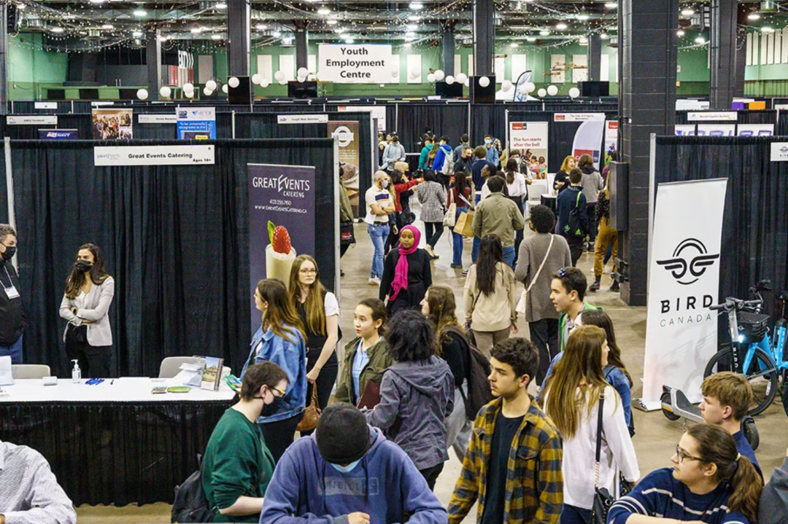 (原始链接: https://mmbiz.qpic.cn/mmbiz_png/cY0qSDjdkFdicQ3VBwLAhYiccluqMibk8Xp4xjmy32Xibibjx8nYCqicCVJsjsD28LsIgNSAOpXBBNqiaRzuHnZrUNeng/640?wx_fmt=png&from=appmsg)
- 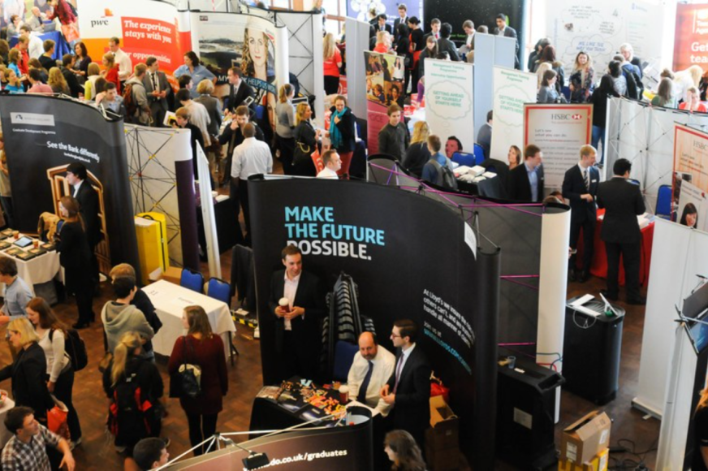 (原始链接: https://mmbiz.qpic.cn/mmbiz_png/cY0qSDjdkFdicQ3VBwLAhYiccluqMibk8XpEHJ0NxI4vr6ickGpMibcdSWicZLr7DVic3yR4gGKy7lX3Whe3E1gLS5uBA/640?wx_fmt=png&from=appmsg)
-  (原始链接: https://mmbiz.qpic.cn/mmbiz_jpg/cY0qSDjdkFdicQ3VBwLAhYiccluqMibk8Xpewz59KKg3COxPr2vOIZrmc5XBwLpa0Q7RP0CVMks8RYIiauvxKL3h8g/640?wx_fmt=jpeg&from=appmsg)
-  (原始链接: https://mmbiz.qpic.cn/mmbiz_jpg/cY0qSDjdkFdicQ3VBwLAhYiccluqMibk8XpVS3a2WBCAJPVqWh8gwicSMTDXToOCA4dic4cwgbD8auWmBPmRkICNqWQ/640?wx_fmt=jpeg&from=appmsg)
-  (原始链接: https://mmbiz.qpic.cn/mmbiz_jpg/cY0qSDjdkFdicQ3VBwLAhYiccluqMibk8XpOyxAHgPj63E80uomu4HPXVx4BqPAAvQLRFOickckNIBn0CsPAoKBEzQ/640?wx_fmt=jpeg&from=appmsg)
-  (原始链接: https://mmbiz.qpic.cn/mmbiz_png/cY0qSDjdkFdicQ3VBwLAhYiccluqMibk8XpuaXJnTPFHutkhbBDZ9GredO6MWyia90FefoDria8hdHdLpRSk42Oxy3Q/640?wx_fmt=png&from=appmsg)
-  (原始链接: https://mmbiz.qpic.cn/mmbiz_png/cY0qSDjdkFdicQ3VBwLAhYiccluqMibk8XpMqHFdu1NleDc4FeOWKZ07jXDNc8OKBfRfabfKeE4uzlLgI4Jic4CJZg/640?wx_fmt=png&from=appmsg)
- 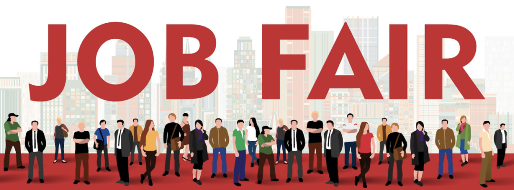 (原始链接: https://mmbiz.qpic.cn/mmbiz_png/cY0qSDjdkFdicQ3VBwLAhYiccluqMibk8XpVwNk4HcnwFG3g4RPK45F9NibZxEKBiaYIdCD1vRqKPaRSPE26xnCtI4Q/640?wx_fmt=png&from=appmsg)
-  (原始链接: https://mmbiz.qpic.cn/mmbiz_jpg/cY0qSDjdkFdicQ3VBwLAhYiccluqMibk8Xp7uxf7O1SsOrjRG6RTzeUVpfxJG6iblCGicch2KNf8vjlbbb0eIDHS5WA/640?wx_fmt=jpeg&from=appmsg)
- 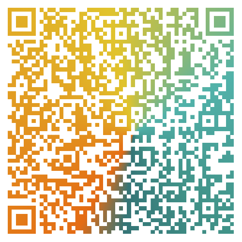 (原始链接: https://mmbiz.qpic.cn/mmbiz_png/cY0qSDjdkFdicQ3VBwLAhYiccluqMibk8XpPRibNbAbjvyb7lUoxSOw7RibLcYAQsZb6T7VcsH4GicypibwnakYx3cylA/640?wx_fmt=png&from=appmsg)
- 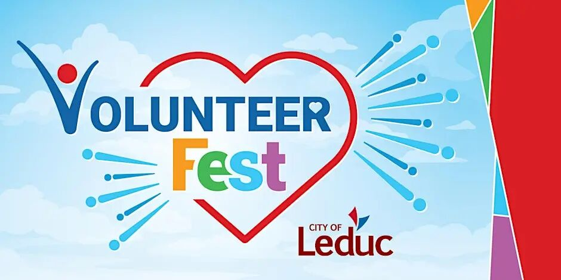 (原始链接: https://mmbiz.qpic.cn/mmbiz_jpg/cY0qSDjdkFdicQ3VBwLAhYiccluqMibk8Xpam3mIEzQ03tTD5dB3eHbI0qlXzFLZCODn9Ztv1qvBODO3ohGFJa4mg/640?wx_fmt=jpeg&from=appmsg)
- 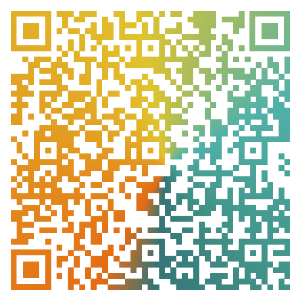 (原始链接: https://mmbiz.qpic.cn/mmbiz_png/cY0qSDjdkFdicQ3VBwLAhYiccluqMibk8XpZ2T83zHdVNvpXbOI8hjgMoTRvPSDT5ocCdgmx1DY5J1eus945iarNBQ/640?wx_fmt=png&from=appmsg)
-  (原始链接: https://mmbiz.qpic.cn/mmbiz_jpg/cY0qSDjdkFdicQ3VBwLAhYiccluqMibk8XpYjPfwOl08QmiaJUUZy3v9JpMqKQYL1eWJcwroeotetxoVtxOxzthtEA/640?wx_fmt=jpeg&from=appmsg)
- 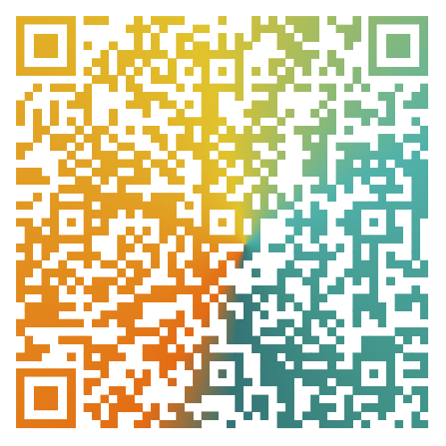 (原始链接: https://mmbiz.qpic.cn/mmbiz_png/cY0qSDjdkFdicQ3VBwLAhYiccluqMibk8XprjLtq1IhFhF0n60TZTytaMtUbticnkkiakpBlFEUCx5cR8vGppPQx9Ng/640?wx_fmt=png&from=appmsg)
- 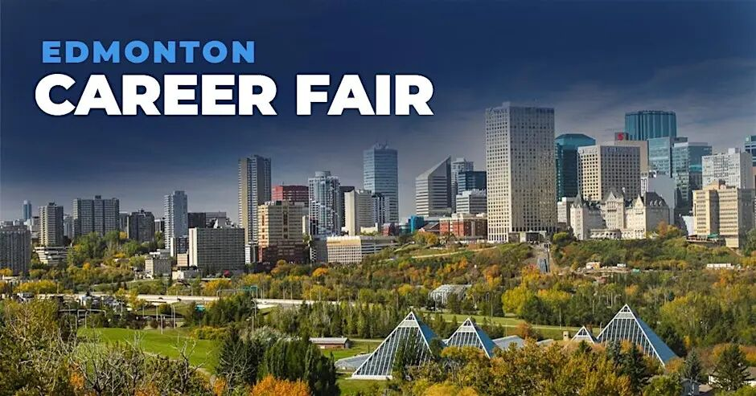 (原始链接: https://mmbiz.qpic.cn/mmbiz_jpg/cY0qSDjdkFdicQ3VBwLAhYiccluqMibk8XpENcsCZic9v8H8pOGbfovZbvmpLIZ2YgPHlYqOecymHDbxZu3IOiaqntw/640?wx_fmt=jpeg&from=appmsg)
- 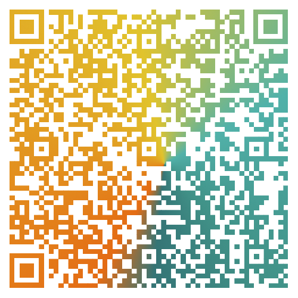 (原始链接: https://mmbiz.qpic.cn/mmbiz_png/cY0qSDjdkFdicQ3VBwLAhYiccluqMibk8XpnNuhu7ricSMrOCzeelibm9jFlshCKl27NjfQVUaKRIicWA9P76Uuibq2lg/640?wx_fmt=png&from=appmsg)
- 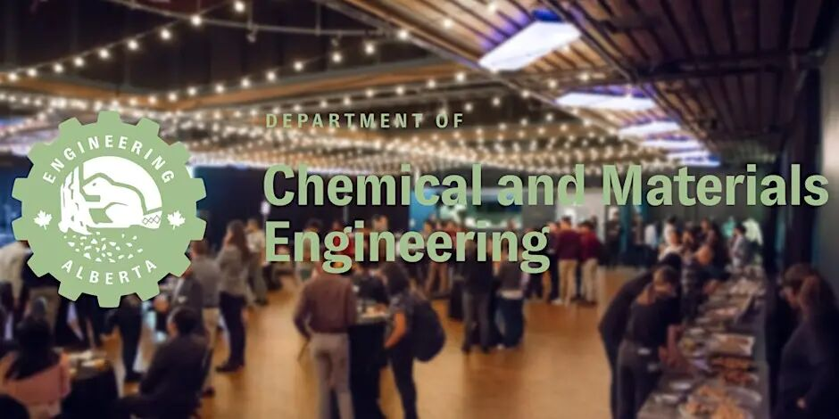 (原始链接: https://mmbiz.qpic.cn/mmbiz_jpg/cY0qSDjdkFdicQ3VBwLAhYiccluqMibk8XpZDpGwUVCicLRll9tzjaic9lPulOKudvibgHpcGQ1Xy1ycUic2XO3EIfwFA/640?wx_fmt=jpeg&from=appmsg)
- 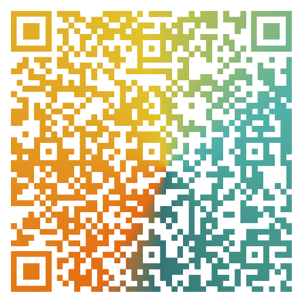 (原始链接: https://mmbiz.qpic.cn/mmbiz_png/cY0qSDjdkFdicQ3VBwLAhYiccluqMibk8XpDu4nhZbSzJv9gGmJnkNicK98pj8rYer1QUAe2nCH5sumVBcmnrKfkqQ/640?wx_fmt=png&from=appmsg)
-  (原始链接: https://mmbiz.qpic.cn/mmbiz_jpg/cY0qSDjdkFdicQ3VBwLAhYiccluqMibk8XpQp0cjfgjn8n2Ciaz161cD6jGNSz3gKJ6LibiaWbhKtmhS1zIbExnNyrNA/640?wx_fmt=jpeg&from=appmsg)
- 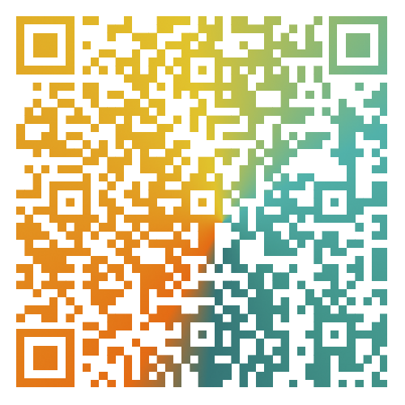 (原始链接: https://mmbiz.qpic.cn/mmbiz_png/cY0qSDjdkFdicQ3VBwLAhYiccluqMibk8XpPxVVmsXIr1ynMaLLcWMTlIHzQwficTZnriaSE4ibd4MY56TT78ukEVPtw/640?wx_fmt=png&from=appmsg)
- 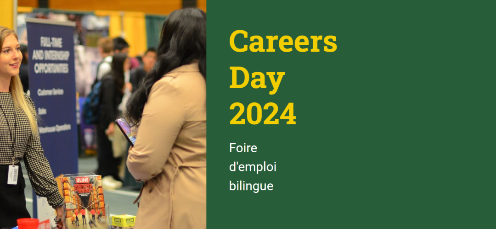 (原始链接: https://mmbiz.qpic.cn/mmbiz_png/cY0qSDjdkFdicQ3VBwLAhYiccluqMibk8XpAicPqnEJHhB2nVtvtA2o8nfj7B8w5eVYAl70ZicXWNcNRtOcuDlNnBnQ/640?wx_fmt=png&from=appmsg)
- 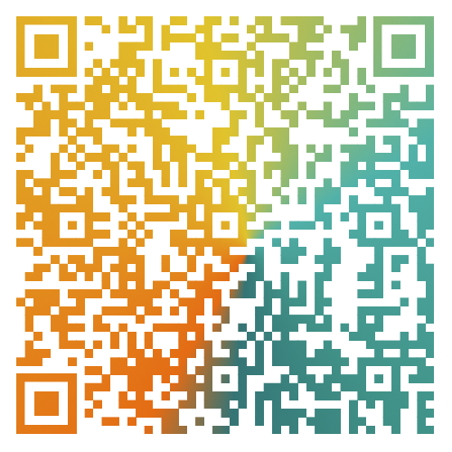 (原始链接: https://mmbiz.qpic.cn/mmbiz_png/cY0qSDjdkFdicQ3VBwLAhYiccluqMibk8Xp7UzDUypJficMTnrds0JUoj6gQWgria2WgW5DdvRYdqnteQgrWXs6pk0w/640?wx_fmt=png&from=appmsg)
-  (原始链接: https://mmbiz.qpic.cn/mmbiz_png/cY0qSDjdkFdicQ3VBwLAhYiccluqMibk8XpLVicmA3bpsBRoXcDWyp82CmfJHthNKx1jKyCiblG2icvIkacJJJG9LcYA/640?wx_fmt=png&from=appmsg)
-  (原始链接: https://mmbiz.qpic.cn/mmbiz_png/cY0qSDjdkFdicQ3VBwLAhYiccluqMibk8Xpm7iaeLBLytBwuiabPWdqicQutTGcvRcfThzGuQwKqibgtKOWEkppF44RnA/640?wx_fmt=png&from=appmsg)
-  (原始链接: https://mmbiz.qpic.cn/mmbiz_jpg/cY0qSDjdkFdicQ3VBwLAhYiccluqMibk8XpugZJ19hN0qlwkp5hvgJgwmC3icYGictm888icb6H2BO25VgniaWicZsVVXg/640?wx_fmt=jpeg&from=appmsg)
-  (原始链接: https://mmbiz.qpic.cn/mmbiz_png/cY0qSDjdkFdicQ3VBwLAhYiccluqMibk8Xpm7iaeLBLytBwuiabPWdqicQutTGcvRcfThzGuQwKqibgtKOWEkppF44RnA/640?wx_fmt=png&from=appmsg)
-  (原始链接: https://mmbiz.qpic.cn/mmbiz_jpg/cY0qSDjdkFdicQ3VBwLAhYiccluqMibk8XpxAicJbJ2E7ChsAeerWjgNxg4sFdkSwC4A9CfxbqhdVflXkHTLLTu0tg/640?wx_fmt=jpeg&from=appmsg)
-  (原始链接: https://mmbiz.qpic.cn/mmbiz_png/cY0qSDjdkFdicQ3VBwLAhYiccluqMibk8Xpm7iaeLBLytBwuiabPWdqicQutTGcvRcfThzGuQwKqibgtKOWEkppF44RnA/640?wx_fmt=png&from=appmsg)
- 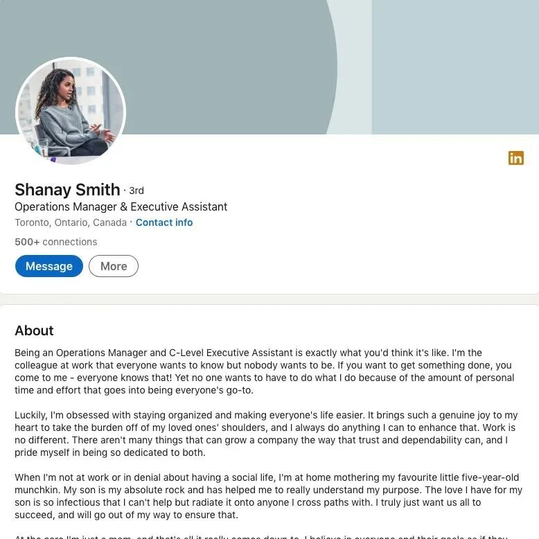 (原始链接: https://mmbiz.qpic.cn/mmbiz_jpg/cY0qSDjdkFdicQ3VBwLAhYiccluqMibk8XpxJh5z5OwOL2K40jtSNYqbh6GZ75U6bCnVaho9VuibxzRQJkuCgw7BiaQ/640?wx_fmt=jpeg&from=appmsg)
-  (原始链接: https://mmbiz.qpic.cn/mmbiz_jpg/cY0qSDjdkFdicQ3VBwLAhYiccluqMibk8XpoicmQhHdofCYReKkVuuq90YFaFcxqicK04eZt3GQfHxLO8jtCmjvdZfg/640?wx_fmt=jpeg&from=appmsg)
-  (原始链接: https://mmbiz.qpic.cn/mmbiz_jpg/cY0qSDjdkFdicQ3VBwLAhYiccluqMibk8XpoFQFWSB9E5YuIWcgyCNxvWs13UXDfIibMXU341pibRhg9KfJKTibVmQpQ/640?wx_fmt=jpeg&from=appmsg)
