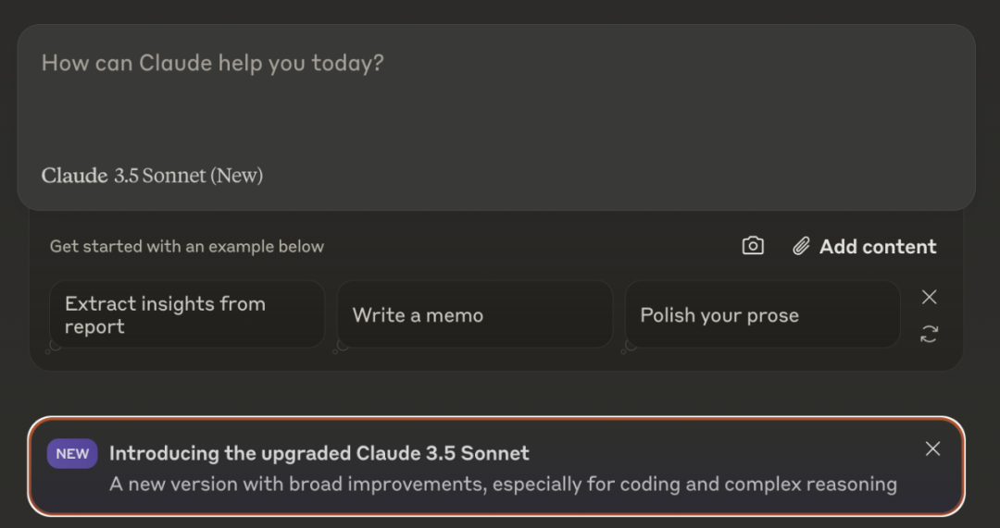
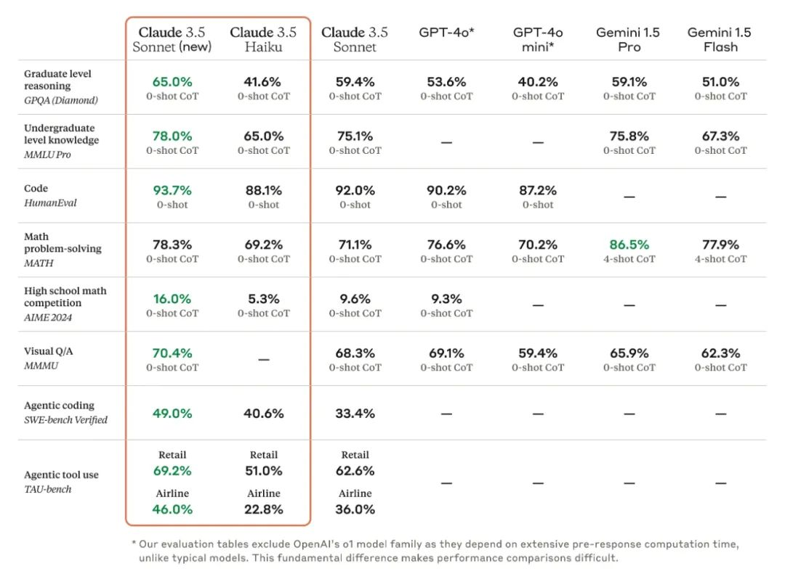

# 无标题

**链接地址:** http://mp.weixin.qq.com/s?__biz=Mzg3MTkxMjYzOA==&mid=2247498223&idx=1&sn=e09cc09ed1da8485d8a84bd873ed7aa8&chksm=cf7cc06aa54b726b7ec0714385132129411000653d82dba3e6ab3460e311d80818925d8563e3&mpshare=1&scene=2&srcid=10230v14XZAtm6e92QLd6lqH&sharer_shareinfo=9986f4f305fa9542a26a3312a4282189&sharer_shareinfo_first=9986f4f305fa9542a26a3312a4282189#rd
**作者:** 
**获取时间:** 2025/8/28 18:51:46
**图片数量:** 4

---

## 原始HTML内容

<section class="mp_profile_iframe_wrp" style="letter-spacing: 0.578px;white-space: normal;margin-bottom: 0px;">

<section class="mp_profile_iframe_wrp" style="margin-bottom: 24px;letter-spacing: 0.578px;"><mp-common-profile class="custom_select_card mp_profile_iframe mp_common_widget" data-pluginname="mpprofile" data-id="Mzg3MTkxMjYzOA==" data-headimg="http://mmbiz.qpic.cn/sz_mmbiz_png/ICgnAptln0Xg6w3lVHUFXrtY5Tia7rfUDkTmCwe5Gz5RRAtVR2CX6UgcZiaFWnxksH1fkSSmjxichSCic8CTGqcElA/0?wx_fmt=png" data-nickname="AI寒武纪" data-signature="一起见证人工智能的寒武纪大爆发，传播一切有关AI的技术" data-from="2"></mp-common-profile></section>
 
<blockquote style="border-top-width: 0px;border-right-width: 0px;border-bottom-width: 0px;border-left: none;border-top-style: solid;border-right-style: solid;border-bottom-style: solid;margin: 2em 8px;font-size: 14px;letter-spacing: normal;text-align: left;line-height: 1.75;font-family: -apple-system-font, BlinkMacSystemFont, &quot;Helvetica Neue&quot;, &quot;PingFang SC&quot;, &quot;Hiragino Sans GB&quot;, &quot;Microsoft YaHei UI&quot;, &quot;Microsoft YaHei&quot;, Arial, sans-serif;padding: 1em;border-radius: 8px;color: rgba(0, 0, 0, 0.5);background: rgb(247, 247, 247);">
Claude&nbsp;最新版本的 Claude 3.5 Sonnet 现在可以操控计算机(computer use)了。Anthropic认为这项技能——目前处于公开测试阶段——代表了 AI 进步的重大突破
</blockquote>
Anthropic 的 Claude 模型又升级了！Claude 3.5 Haiku 和升级款的 Claude 3.5 Sonnet 都来了。Claude 3.5 Sonnet 不仅编程能力更强，还带来全新功能computer use（计算机使用）， Claude 现在支持像人类一样操作计算机,可以遵循用户的命令在计算机屏幕上移动光标，点击相关位置，并通过虚拟键盘输入信息，模拟人们与自己计算机的交互方式

升级版 Claude 3.5 Sonnet 现在就可以使用了。computer use测试版也开放使用
<section style="text-align: center;margin-left: 8px;margin-right: 8px;"></section><h3 style="border-width: 0px 0px 0px 3px;border-style: solid;border-left-color: rgb(15, 76, 129);font-size: 15.4px;font-weight: bold;margin-top: 2em;margin-right: 8px;margin-bottom: 0.75em;letter-spacing: normal;background-color: rgb(255, 255, 255);text-align: left;line-height: 1.2;font-family: -apple-system-font, BlinkMacSystemFont, &quot;Helvetica Neue&quot;, &quot;PingFang SC&quot;, &quot;Hiragino Sans GB&quot;, &quot;Microsoft YaHei UI&quot;, &quot;Microsoft YaHei&quot;, Arial, sans-serif;padding-left: 8px;color: rgb(63, 63, 63);">Claude 3.5 的更新内容：</h3>
<strong style="border-width: 0px;border-style: solid;border-color: hsl(var(--border));text-align: left;line-height: 1.75;font-family: -apple-system-font, BlinkMacSystemFont, &quot;Helvetica Neue&quot;, &quot;PingFang SC&quot;, &quot;Hiragino Sans GB&quot;, &quot;Microsoft YaHei UI&quot;, &quot;Microsoft YaHei&quot;, Arial, sans-serif;font-size: inherit;color: rgb(15, 76, 129);">Claude 3.5 Sonnet 升级版：</strong>&nbsp;全面提升，尤其在编程方面，吊打所有公开模型，包括 OpenAI o1 和专门为 agent 编程设计的系统！<strong style="font-family: -apple-system-font, BlinkMacSystemFont, &quot;Helvetica Neue&quot;, &quot;PingFang SC&quot;, &quot;Hiragino Sans GB&quot;, &quot;Microsoft YaHei UI&quot;, &quot;Microsoft YaHei&quot;, Arial, sans-serif;font-size: inherit;letter-spacing: 1.4px;border-width: 0px;border-style: solid;border-color: hsl(var(--border));text-align: left;line-height: 1.75;color: rgb(15, 76, 129);">SWE-bench Verified 基准测试得分从 33.4% 提升到 49.0%,<strong style="font-family: -apple-system-font, BlinkMacSystemFont, &quot;Helvetica Neue&quot;, &quot;PingFang SC&quot;, &quot;Hiragino Sans GB&quot;, &quot;Microsoft YaHei UI&quot;, &quot;Microsoft YaHei&quot;, Arial, sans-serif;font-size: inherit;letter-spacing: 1.4px;border-width: 0px;border-style: solid;border-color: hsl(var(--border));text-align: left;line-height: 1.75;color: rgb(15, 76, 129);">速度和价格保持不变！</strong>&nbsp;这才是真正的加量不加价！</strong>
<section style="text-align: center;margin-left: 8px;margin-right: 8px;"></section>
<strong style="border-width: 0px;border-style: solid;border-color: hsl(var(--border));text-align: left;line-height: 1.75;font-family: -apple-system-font, BlinkMacSystemFont, &quot;Helvetica Neue&quot;, &quot;PingFang SC&quot;, &quot;Hiragino Sans GB&quot;, &quot;Microsoft YaHei UI&quot;, &quot;Microsoft YaHei&quot;, Arial, sans-serif;font-size: inherit;color: rgb(15, 76, 129);">Claude 3.5 Haiku 全新模型：</strong>&nbsp;与 Claude 3 Haiku 相比，Claude 3.5 Haiku 在所有技能上都有提升，甚至在许多智能基准测试中超过了 Claude 3 Opus，它在 SWE-bench Verified 上的得分高达 40.6%，超过了许多使用 SOTA 模型的 agent，包括原始的 Claude 3.5 Sonnet 和 GPT-4o，低延迟、改进的指令遵循和更准确的工具使用，使其非常适合面向用户的产品，主打一个性价比

<strong style="border-width: 0px;border-style: solid;border-color: hsl(var(--border));text-align: left;line-height: 1.75;font-family: -apple-system-font, BlinkMacSystemFont, &quot;Helvetica Neue&quot;, &quot;PingFang SC&quot;, &quot;Hiragino Sans GB&quot;, &quot;Microsoft YaHei UI&quot;, &quot;Microsoft YaHei&quot;, Arial, sans-serif;font-size: inherit;color: rgb(15, 76, 129);">“计算机使用（computer use）”功能公测：</strong>&nbsp;开发者可以通过 API 让 Claude 像人一样使用电脑——查看屏幕、移动光标、点击按钮、输入文字！🤯 Claude 3.5 Sonnet 是第一个在公测阶段提供“计算机使用” 功能的 AI 前沿模型！（虽然目前还处于实验阶段，有时会出错，但 Anthropic 会根据开发者反馈快速改进）
<h3 style="border-width: 0px 0px 0px 3px;border-style: solid;border-left-color: rgb(15, 76, 129);font-size: 15.4px;font-weight: bold;margin-top: 2em;margin-right: 8px;margin-bottom: 0.75em;letter-spacing: normal;background-color: rgb(255, 255, 255);text-align: left;line-height: 1.2;font-family: -apple-system-font, BlinkMacSystemFont, &quot;Helvetica Neue&quot;, &quot;PingFang SC&quot;, &quot;Hiragino Sans GB&quot;, &quot;Microsoft YaHei UI&quot;, &quot;Microsoft YaHei&quot;, Arial, sans-serif;padding-left: 8px;color: rgb(63, 63, 63);">为什么 Claude 需要使用电脑（computer use）？</h3>
<iframe class="video_iframe rich_pages" data-vidtype="2" data-mpvid="wxv_3691332683872436229" data-cover="http%3A%2F%2Fmmbiz.qpic.cn%2Fsz_mmbiz_jpg%2FICgnAptln0UJc1Smfia6ZYJvWp7GsXLezK1InNZPicSibyLgqqfXb66Bk71xHl6Z1foziatP8m3NQf5OQGfCCW1LTg%2F0%3Fwx_fmt%3Djpeg" allowfullscreen="" frameborder="0" data-ratio="1.7777777777777777" data-w="1280" style="border-radius: 4px;" data-src="https://mp.weixin.qq.com/mp/readtemplate?t=pages/video_player_tmpl&amp;action=mpvideo&amp;auto=0&amp;vid=wxv_3691332683872436229"></iframe>

为什么需要计算机使用能力？
<blockquote style="border-top-width: 0px;border-right-width: 0px;border-bottom-width: 0px;border-left: none;border-top-style: solid;border-right-style: solid;border-bottom-style: solid;margin: 2em 8px;font-size: 14px;letter-spacing: normal;text-align: left;line-height: 1.75;font-family: -apple-system-font, BlinkMacSystemFont, &quot;Helvetica Neue&quot;, &quot;PingFang SC&quot;, &quot;Hiragino Sans GB&quot;, &quot;Microsoft YaHei UI&quot;, &quot;Microsoft YaHei&quot;, Arial, sans-serif;padding: 1em;border-radius: 8px;color: rgba(0, 0, 0, 0.5);background: rgb(247, 247, 247);">
大量的现代工作是通过计算机完成的。使 AI 能够以与人类相同的方式直接与计算机软件交互，将开启大量目前 AI 助手根本无法实现的应用程序。
</blockquote>
<strong style="font-family: -apple-system-font, BlinkMacSystemFont, &quot;Helvetica Neue&quot;, &quot;PingFang SC&quot;, &quot;Hiragino Sans GB&quot;, &quot;Microsoft YaHei UI&quot;, &quot;Microsoft YaHei&quot;, Arial, sans-serif;font-size: inherit;letter-spacing: 0.1em;border-width: 0px;border-style: solid;border-color: hsl(var(--border));text-align: left;line-height: 1.75;color: rgb(15, 76, 129);">不是教 Claude 使用特定工具，而是教它通用的计算机技能，</strong>&nbsp;让它能够像人一样使用各种软件程序 

<strong style="border-width: 0px;border-style: solid;border-color: hsl(var(--border));text-align: left;line-height: 1.75;font-family: -apple-system-font, BlinkMacSystemFont, &quot;Helvetica Neue&quot;, &quot;PingFang SC&quot;, &quot;Hiragino Sans GB&quot;, &quot;Microsoft YaHei UI&quot;, &quot;Microsoft YaHei&quot;, Arial, sans-serif;font-size: inherit;color: rgb(15, 76, 129);">Anthropic 认为，这种通用技能的学习是 AI 发展中重要的里程碑。</strong>&nbsp;在过去的几年里，AI 在逻辑推理和图像理解方面取得了重大进展，而计算机使用能力是下一个 frontier：AI 模型不再需要通过定制工具进行交互，而是可以像人类一样使用任何软件

<strong style="border-width: 0px;border-style: solid;border-color: hsl(var(--border));text-align: left;line-height: 1.75;font-family: -apple-system-font, BlinkMacSystemFont, &quot;Helvetica Neue&quot;, &quot;PingFang SC&quot;, &quot;Hiragino Sans GB&quot;, &quot;Microsoft YaHei UI&quot;, &quot;Microsoft YaHei&quot;, Arial, sans-serif;font-size: inherit;color: rgb(15, 76, 129);">开发者可以通过 API 让 Claude 将指令转换成计算机命令，</strong>&nbsp;例如，将 “使用我的计算机和在线数据填写此表格” 这样的指令转换成一系列具体的计算机操作

<strong style="border-width: 0px;border-style: solid;border-color: hsl(var(--border));text-align: left;line-height: 1.75;font-family: -apple-system-font, BlinkMacSystemFont, &quot;Helvetica Neue&quot;, &quot;PingFang SC&quot;, &quot;Hiragino Sans GB&quot;, &quot;Microsoft YaHei UI&quot;, &quot;Microsoft YaHei&quot;, Arial, sans-serif;font-size: inherit;color: rgb(15, 76, 129);">训练过程：</strong>&nbsp;先在简单的软件上进行训练，例如计算器和文本编辑器，然后泛化到其他软件。训练 Claude 准确地计算像素至关重要
<blockquote style="border-top-width: 0px;border-right-width: 0px;border-bottom-width: 0px;border-left: none;border-top-style: solid;border-right-style: solid;border-bottom-style: solid;margin: 2em 8px;font-size: 14px;letter-spacing: normal;text-align: left;line-height: 1.75;font-family: -apple-system-font, BlinkMacSystemFont, &quot;Helvetica Neue&quot;, &quot;PingFang SC&quot;, &quot;Hiragino Sans GB&quot;, &quot;Microsoft YaHei UI&quot;, &quot;Microsoft YaHei&quot;, Arial, sans-serif;padding: 1em;border-radius: 8px;color: rgba(0, 0, 0, 0.5);background: rgb(247, 247, 247);">
<strong style="border-width: 0px;border-style: solid;border-color: hsl(var(--border));line-height: 1.75;font-family: -apple-system-font, BlinkMacSystemFont, &quot;Helvetica Neue&quot;, &quot;PingFang SC&quot;, &quot;Hiragino Sans GB&quot;, &quot;Microsoft YaHei UI&quot;, &quot;Microsoft YaHei&quot;, Arial, sans-serif;font-size: inherit;color: rgb(15, 76, 129);">研究人员惊讶地发现，Claude 只需要在少量简单软件上进行训练，就可以快速泛化到其他软件。</strong>
</blockquote><h3 style="border-width: 0px 0px 0px 3px;border-style: solid;border-left-color: rgb(15, 76, 129);font-size: 15.4px;font-weight: bold;margin-top: 2em;margin-right: 8px;margin-bottom: 0.75em;letter-spacing: normal;background-color: rgb(255, 255, 255);text-align: left;line-height: 1.2;font-family: -apple-system-font, BlinkMacSystemFont, &quot;Helvetica Neue&quot;, &quot;PingFang SC&quot;, &quot;Hiragino Sans GB&quot;, &quot;Microsoft YaHei UI&quot;, &quot;Microsoft YaHei&quot;, Arial, sans-serif;padding-left: 8px;color: rgb(63, 63, 63);">computer use开发过程：</h3>
之前在工具使用和多模态方面的工作为这些新的计算机使用技能奠定了基础。操作计算机需要能够查看和解释图像。它还需要推理如何以及何时根据屏幕上的内容执行特定操作。结合这些能力，训练 Claude 解释屏幕上发生的事情，然后使用可用的软件工具来执行任务。当开发人员让 Claude 使用一个计算机软件并赋予它必要的访问权限时，Claude 会查看用户可见内容的屏幕截图，然后计算它需要垂直或水平移动光标多少像素才能点击正确的位置。
<blockquote style="border-top-width: 0px;border-right-width: 0px;border-bottom-width: 0px;border-left: none;border-top-style: solid;border-right-style: solid;border-bottom-style: solid;margin: 2em 8px;font-size: 14px;letter-spacing: normal;text-align: left;line-height: 1.75;font-family: -apple-system-font, BlinkMacSystemFont, &quot;Helvetica Neue&quot;, &quot;PingFang SC&quot;, &quot;Hiragino Sans GB&quot;, &quot;Microsoft YaHei UI&quot;, &quot;Microsoft YaHei&quot;, Arial, sans-serif;padding: 1em;border-radius: 8px;color: rgba(0, 0, 0, 0.5);background: rgb(247, 247, 247);">
训练 Claude 准确计算像素至关重要。如果没有这项技能，模型将难以发出鼠标命令——类似于模型经常难以回答看似简单的问题，例如“单词‘banana’中有多少个 a？”
</blockquote>
研究人员惊讶地发现，Claude 能够快速地从少数简单软件（例如计算器和文本编辑器）的计算机使用训练中进行泛化（出于安全原因，不允许模型在训练期间访问互联网）。结合 Claude 的其他技能，这项训练赋予了它将用户的书面提示转换为一系列逻辑步骤，然后在计算机上采取行动的非凡能力。研究人员观察到，当模型遇到障碍时，它甚至会自我纠正并重试任务。尽管在取得初步突破后，后续的进展很快就出现了，但这需要大量的试验和错误才能达到目标。一些研究人员指出，开发计算机使用非常接近他们刚开始进入该领域时所设想的“理想化”的 AI 研究过程：
<blockquote style="border-top-width: 0px;border-right-width: 0px;border-bottom-width: 0px;border-left: none;border-top-style: solid;border-right-style: solid;border-bottom-style: solid;margin: 2em 8px;font-size: 14px;letter-spacing: normal;text-align: left;line-height: 1.75;font-family: -apple-system-font, BlinkMacSystemFont, &quot;Helvetica Neue&quot;, &quot;PingFang SC&quot;, &quot;Hiragino Sans GB&quot;, &quot;Microsoft YaHei UI&quot;, &quot;Microsoft YaHei&quot;, Arial, sans-serif;padding: 1em;border-radius: 8px;color: rgba(0, 0, 0, 0.5);background: rgb(247, 247, 247);">
不断迭代，反复回到绘图板，直到取得进展，这项研究得到了回报
</blockquote>
目前，Claude 在以与人相同的方式使用计算机的模型中处于最先进水平——也就是说，通过查看屏幕并根据屏幕内容采取行动。在一个旨在测试开发人员让模型使用计算机的评估（OSWorld）中，Claude 目前获得了 14.9% 的分数。这远未达到人类水平的技能（通常为 70-75%），但远高于同一类别中排名第二的 AI 模型获得的 7.7%。
<h3 style="border-width: 0px 0px 0px 3px;border-style: solid;border-left-color: rgb(15, 76, 129);font-size: 15.4px;font-weight: bold;margin-top: 2em;margin-right: 8px;margin-bottom: 0.75em;letter-spacing: normal;background-color: rgb(255, 255, 255);text-align: left;line-height: 1.2;font-family: -apple-system-font, BlinkMacSystemFont, &quot;Helvetica Neue&quot;, &quot;PingFang SC&quot;, &quot;Hiragino Sans GB&quot;, &quot;Microsoft YaHei UI&quot;, &quot;Microsoft YaHei&quot;, Arial, sans-serif;padding-left: 8px;color: rgb(63, 63, 63);">computer use(计算机使用)的未来：</h3>
 
<section style="margin-left: 8px;margin-right: 8px;">目前，即使是最先进的 Claude，它的计算机使用仍然很慢，而且经常出错。许多人们经常用电脑进行的操作（拖动、缩放等），Claude 还无法尝试。“翻页式”的屏幕视图方式（拍摄屏幕截图并将它们拼凑在一起，而不是观察更精细的视频流）意味着它可能会错过短暂的操作或通知</section><section style="margin-left: 8px;margin-right: 8px;"> </section><section style="margin-left: 8px;margin-right: 8px;"><strong>但是</strong> </section>
<strong style="border-width: 0px;border-style: solid;border-color: hsl(var(--border));text-align: left;line-height: 1.75;font-family: -apple-system-font, BlinkMacSystemFont, &quot;Helvetica Neue&quot;, &quot;PingFang SC&quot;, &quot;Hiragino Sans GB&quot;, &quot;Microsoft YaHei UI&quot;, &quot;Microsoft YaHei&quot;, Arial, sans-serif;font-size: inherit;color: rgb(15, 76, 129);">计算机使用是一种全新的 AI 开发方法。</strong>&nbsp;以前，LLM 开发者是让工具适应模型，而现在，我们可以让模型适应工具——Claude 可以直接使用我们每天都在使用的计算机环境。&nbsp;<code style="border-width: 0px;border-style: solid;border-color: hsl(var(--border));font-family: -apple-system-font, BlinkMacSystemFont, &quot;Helvetica Neue&quot;, &quot;PingFang SC&quot;, &quot;Hiragino Sans GB&quot;, &quot;Microsoft YaHei UI&quot;, &quot;Microsoft YaHei&quot;, Arial, sans-serif;font-feature-settings: normal;font-variation-settings: normal;font-size: 12.6px;text-align: left;line-height: 1.75;color: rgb(221, 17, 68);background: rgba(27, 31, 35, 0.05);padding: 3px 5px;border-radius: 4px;">Anthropic 的目标是让 Claude 像人一样使用现有的计算机软件</code>

<strong style="border-width: 0px;border-style: solid;border-color: hsl(var(--border));text-align: left;line-height: 1.75;font-family: -apple-system-font, BlinkMacSystemFont, &quot;Helvetica Neue&quot;, &quot;PingFang SC&quot;, &quot;Hiragino Sans GB&quot;, &quot;Microsoft YaHei UI&quot;, &quot;Microsoft YaHei&quot;, Arial, sans-serif;font-size: inherit;color: rgb(15, 76, 129);">虽然 Claude 的计算机使用能力还处于早期阶段，但它代表了 AI 发展的一个重大突破！</strong>&nbsp;未来，随着技术的不断发展，计算机使用功能将变得更快、更可靠、更容易使用，并解锁更多新的应用场景

 
<section powered-by="xiumi.us" style="caret-color: rgb(0, 0, 0);color: rgb(0, 0, 0);letter-spacing: normal;text-align: start;"><section style="text-align: center;justify-content: center;display: flex;flex-flow: row;"><section data-style="display: inline-block; width: auto; vertical-align: top; align-self: flex-start; flex: 0 0 auto; min-width: 10%; border-bottom-width: 2px; border-bottom-style: solid; border-bottom-color: rgb(62, 62, 62); border-bottom-right-radius: 0px; line-height: 0;" class="js_darkmode__51" style="display: inline-block;width: auto;vertical-align: top;align-self: flex-start;flex: 0 0 auto;min-width: 10%;border-bottom-width: 2px;border-bottom-style: solid;border-bottom-color: rgb(62, 62, 62);border-bottom-right-radius: 0px;line-height: 0;"><section powered-by="xiumi.us"><section style="transform: translate3d(5px, 0px, 0px);"><section powered-by="xiumi.us"><section style="padding-right: 5px;padding-left: 5px;text-align: unset;font-size: 15px;line-height: 1.5;letter-spacing: 2px;font-family: PingFangSC-light;">
<strong class="js_darkmode__text__53">⭐星标AI寒武纪，好内容不错过<strong data-style="outline: 0px; letter-spacing: 0.544px; font-family: -apple-system, system-ui, &quot;Helvetica Neue&quot;, &quot;PingFang SC&quot;, &quot;Hiragino Sans GB&quot;, &quot;Microsoft YaHei UI&quot;, &quot;Microsoft YaHei&quot;, Arial, sans-serif; color: rgb(34, 34, 34);" class="js_darkmode__26" style="text-align: start;outline: 0px;letter-spacing: 0.544px;font-family: -apple-system, system-ui, &quot;Helvetica Neue&quot;, &quot;PingFang SC&quot;, &quot;Hiragino Sans GB&quot;, &quot;Microsoft YaHei UI&quot;, &quot;Microsoft YaHei&quot;, Arial, sans-serif;color: rgb(34, 34, 34);">⭐</strong></strong>

<strong class="js_darkmode__text__54" style="font-size: 14px;">用你的</strong><strong class="js_darkmode__text__54" style="font-size: 14px;">赞</strong><strong class="js_darkmode__text__54" style="font-size: 14px;">和</strong><strong class="js_darkmode__text__54" style="font-size: 14px;">在看</strong><strong class="js_darkmode__text__54" style="font-size: 14px;">告诉我～</strong>
</section></section></section></section><section powered-by="xiumi.us"><section style="margin-bottom: -6px;justify-content: center;display: flex;flex-flow: row;"><section style="display: inline-block;vertical-align: top;width: 105px;align-self: flex-start;flex: 0 0 auto;"><section powered-by="xiumi.us" style="width: 105px;"><section style="justify-content: center;display: flex;flex-flow: row;width: 105px;"><section style="display: inline-block;width: 105px;vertical-align: top;align-self: flex-start;flex: 0 1 auto;"><section style="text-align: left;"><section style="justify-content: flex-start;display: flex;flex-flow: row;"><section data-style="display: inline-block; width: 10px; vertical-align: top; align-self: flex-start; flex: 0 1 auto; height: 10px; overflow: hidden; border-width: 2px; border-radius: 10px; border-style: solid; border-color: rgb(62, 62, 62); line-height: 0; background-color: rgb(0, 113, 197);" class="js_darkmode__54" style="display: inline-block;width: 10px;vertical-align: top;align-self: flex-start;flex: 0 1 auto;height: 10px;overflow: hidden;border-width: 2px;border-style: solid;border-color: rgb(62, 62, 62);border-radius: 10px;line-height: 0;background-color: rgb(0, 113, 197);"><section style="text-align: justify;"><section style="text-align: unset;">
 
</section></section></section></section></section></section></section></section></section><section style="display: inline-block;vertical-align: top;width: 105px;align-self: flex-start;flex: 0 0 auto;border-width: 0px;"><section powered-by="xiumi.us" style="width: 105px;"><section style="justify-content: center;display: flex;flex-flow: row;width: 105px;"><section style="display: inline-block;width: 105px;vertical-align: top;align-self: flex-start;flex: 0 1 auto;"><section style="justify-content: center;display: flex;flex-flow: row;"><section data-style="display: inline-block; width: 5px; vertical-align: top; align-self: flex-start; flex: 0 1 auto; height: 10px; overflow: hidden; box-shadow: rgb(0, 0, 0) 0px 0px 0px; border-width: 0px; background-color: rgb(255, 255, 255);" class="js_darkmode__55" style="display: inline-block;width: 5px;vertical-align: top;align-self: flex-start;flex: 0 1 auto;height: 10px;overflow: hidden;box-shadow: rgb(0, 0, 0) 0px 0px 0px;border-width: 0px;background-color: rgb(255, 255, 255);"><section style="text-align: justify;"><section style="text-align: left;"><section style="text-align: unset;">
 
</section></section></section></section></section></section></section></section></section></section></section></section></section></section>
 

<section style="letter-spacing: 0.578px;text-align: right;">👇👇</section></section>
<mp-style-type data-value="3"></mp-style-type>

---

## 纯文本内容

Claude 最新版本的 Claude 3.5 Sonnet 现在可以操控计算机(computer use)了。Anthropic认为这项技能——目前处于公开测试阶段——代表了 AI 进步的重大突破Anthropic 的 Claude 模型又升级了！Claude 3.5 Haiku 和升级款的 Claude 3.5 Sonnet 都来了。Claude 3.5 Sonnet 不仅编程能力更强，还带来全新功能computer use（计算机使用）， Claude 现在支持像人类一样操作计算机,可以遵循用户的命令在计算机屏幕上移动光标，点击相关位置，并通过虚拟键盘输入信息，模拟人们与自己计算机的交互方式升级版 Claude 3.5 Sonnet 现在就可以使用了。computer use测试版也开放使用Claude 3.5 的更新内容：Claude 3.5 Sonnet 升级版： 全面提升，尤其在编程方面，吊打所有公开模型，包括 OpenAI o1 和专门为 agent 编程设计的系统！SWE-bench Verified 基准测试得分从 33.4% 提升到 49.0%,速度和价格保持不变！ 这才是真正的加量不加价！Claude 3.5 Haiku 全新模型： 与 Claude 3 Haiku 相比，Claude 3.5 Haiku 在所有技能上都有提升，甚至在许多智能基准测试中超过了 Claude 3 Opus，它在 SWE-bench Verified 上的得分高达 40.6%，超过了许多使用 SOTA 模型的 agent，包括原始的 Claude 3.5 Sonnet 和 GPT-4o，低延迟、改进的指令遵循和更准确的工具使用，使其非常适合面向用户的产品，主打一个性价比“计算机使用（computer use）”功能公测： 开发者可以通过 API 让 Claude 像人一样使用电脑——查看屏幕、移动光标、点击按钮、输入文字！🤯 Claude 3.5 Sonnet 是第一个在公测阶段提供“计算机使用” 功能的 AI 前沿模型！（虽然目前还处于实验阶段，有时会出错，但 Anthropic 会根据开发者反馈快速改进）为什么 Claude 需要使用电脑（computer use）？为什么需要计算机使用能力？大量的现代工作是通过计算机完成的。使 AI 能够以与人类相同的方式直接与计算机软件交互，将开启大量目前 AI 助手根本无法实现的应用程序。不是教 Claude 使用特定工具，而是教它通用的计算机技能， 让它能够像人一样使用各种软件程序Anthropic 认为，这种通用技能的学习是 AI 发展中重要的里程碑。 在过去的几年里，AI 在逻辑推理和图像理解方面取得了重大进展，而计算机使用能力是下一个 frontier：AI 模型不再需要通过定制工具进行交互，而是可以像人类一样使用任何软件开发者可以通过 API 让 Claude 将指令转换成计算机命令， 例如，将 “使用我的计算机和在线数据填写此表格” 这样的指令转换成一系列具体的计算机操作训练过程： 先在简单的软件上进行训练，例如计算器和文本编辑器，然后泛化到其他软件。训练 Claude 准确地计算像素至关重要研究人员惊讶地发现，Claude 只需要在少量简单软件上进行训练，就可以快速泛化到其他软件。computer use开发过程：之前在工具使用和多模态方面的工作为这些新的计算机使用技能奠定了基础。操作计算机需要能够查看和解释图像。它还需要推理如何以及何时根据屏幕上的内容执行特定操作。结合这些能力，训练 Claude 解释屏幕上发生的事情，然后使用可用的软件工具来执行任务。当开发人员让 Claude 使用一个计算机软件并赋予它必要的访问权限时，Claude 会查看用户可见内容的屏幕截图，然后计算它需要垂直或水平移动光标多少像素才能点击正确的位置。训练 Claude 准确计算像素至关重要。如果没有这项技能，模型将难以发出鼠标命令——类似于模型经常难以回答看似简单的问题，例如“单词‘banana’中有多少个 a？”研究人员惊讶地发现，Claude 能够快速地从少数简单软件（例如计算器和文本编辑器）的计算机使用训练中进行泛化（出于安全原因，不允许模型在训练期间访问互联网）。结合 Claude 的其他技能，这项训练赋予了它将用户的书面提示转换为一系列逻辑步骤，然后在计算机上采取行动的非凡能力。研究人员观察到，当模型遇到障碍时，它甚至会自我纠正并重试任务。尽管在取得初步突破后，后续的进展很快就出现了，但这需要大量的试验和错误才能达到目标。一些研究人员指出，开发计算机使用非常接近他们刚开始进入该领域时所设想的“理想化”的 AI 研究过程：不断迭代，反复回到绘图板，直到取得进展，这项研究得到了回报目前，Claude 在以与人相同的方式使用计算机的模型中处于最先进水平——也就是说，通过查看屏幕并根据屏幕内容采取行动。在一个旨在测试开发人员让模型使用计算机的评估（OSWorld）中，Claude 目前获得了 14.9% 的分数。这远未达到人类水平的技能（通常为 70-75%），但远高于同一类别中排名第二的 AI 模型获得的 7.7%。computer use(计算机使用)的未来：目前，即使是最先进的 Claude，它的计算机使用仍然很慢，而且经常出错。许多人们经常用电脑进行的操作（拖动、缩放等），Claude 还无法尝试。“翻页式”的屏幕视图方式（拍摄屏幕截图并将它们拼凑在一起，而不是观察更精细的视频流）意味着它可能会错过短暂的操作或通知但是计算机使用是一种全新的 AI 开发方法。 以前，LLM 开发者是让工具适应模型，而现在，我们可以让模型适应工具——Claude 可以直接使用我们每天都在使用的计算机环境。 Anthropic 的目标是让 Claude 像人一样使用现有的计算机软件虽然 Claude 的计算机使用能力还处于早期阶段，但它代表了 AI 发展的一个重大突破！ 未来，随着技术的不断发展，计算机使用功能将变得更快、更可靠、更容易使用，并解锁更多新的应用场景⭐星标AI寒武纪，好内容不错过⭐用你的赞和在看告诉我～👇👇

---

## 图片列表

-  (原始链接: https://mmbiz.qpic.cn/sz_mmbiz_jpg/ICgnAptln0UJc1Smfia6ZYJvWp7GsXLez9wlEQJ9Gye0ibzYNqlQoWu8loltCkzQIWBLt3YLs9cLTd0prTNfs24Q/640?wx_fmt=webp&from=appmsg)
-  (原始链接: https://mmbiz.qpic.cn/sz_mmbiz_png/ICgnAptln0UJc1Smfia6ZYJvWp7GsXLezPrlZCAYOia3BewgNEHSfWgwIY7oWp3icFHB1wdMGuOoUPMem1dJPEn3A/640?wx_fmt=png&from=appmsg)
-  (原始链接: https://mmbiz.qpic.cn/sz_mmbiz_jpg/ICgnAptln0UJc1Smfia6ZYJvWp7GsXLezZ4J5DzpWRwEdHvDNGfn7cbPOPonNcXvw7zgxmru7H3budpT2NeAaow/640?wx_fmt=webp&from=appmsg)
-  (原始链接: https://mmbiz.qpic.cn/sz_mmbiz_png/ICgnAptln0X53k92kQa8BeRQk0S3ZibtTFrf0vHLrLXqJpB3miaFf0HDXX1YjWgfQ3GdhgYuKAQTg746xfnBxxcg/640?wx_fmt=png)
