# 无标题

**链接地址:** http://mp.weixin.qq.com/s?__biz=MzI4NDYyNjAwNw==&mid=2247489348&idx=1&sn=dd7036385d5052e917c5d15ba979c3dc&chksm=ea7dda110661778af9dbdc1d6a8766b9ffd58c3bc98483b713f9fbdc7fddf8817d8e6bd897d6&mpshare=1&scene=2&srcid=1101Je3UKWgXQkxxDWlkuVMA&sharer_shareinfo=cf39355de0523b79533dad8e8fef5ea3&sharer_shareinfo_first=cf39355de0523b79533dad8e8fef5ea3#rd
**作者:** 欢迎转发
**获取时间:** 2025/8/28 18:51:19
**图片数量:** 28

---

## 原始HTML内容

<section style="font-size: 16px;color: rgb(62, 62, 62);"><section style="display: flex;flex-flow: row;margin-top: 10px;margin-right: 0%;margin-left: 0%;text-align: center;justify-content: center;"><section style="display: inline-block;vertical-align: top;width: auto;flex: 90 90 0%;align-self: flex-start;height: auto;"><section style="margin-top: 10px;margin-bottom: 10px;line-height: 0;"><section style="vertical-align: middle;display: inline-block;line-height: 0;"></section></section></section><section style="display: inline-block;vertical-align: middle;width: auto;flex: 100 100 0%;align-self: center;height: auto;border-width: 0px;margin-left: -120px;padding-right: 40px;"><section style="justify-content: center;display: flex;flex-flow: row;"><section style="display: inline-block;width: 100%;vertical-align: top;border-width: 4px;border-style: solid;border-color: rgb(218, 87, 12);padding: 15px;flex: 0 0 auto;height: auto;background-color: rgba(249, 110, 87, 0);align-self: flex-start;"><section style="display: flex;flex-flow: row;justify-content: center;"><section style="display: inline-block;vertical-align: top;width: auto;margin-top: -15px;margin-left: -18px;flex: 35 35 0%;align-self: flex-start;height: auto;"><section style="text-align: left;justify-content: flex-start;display: flex;flex-flow: row;"><section style="display: inline-block;width: auto;vertical-align: top;min-width: 10%;flex: 0 0 auto;height: auto;background-color: rgb(218, 87, 12);padding-right: 10px;padding-bottom: 3px;padding-left: 10px;align-self: flex-start;"><section style="font-size: 12px;color: rgb(255, 255, 255);text-align: justify;">
<strong>BadaB&nbsp;</strong>
</section></section></section></section><section style="display: inline-block;vertical-align: top;width: auto;flex: 65 65 0%;align-self: flex-start;border-width: 0px;margin-right: -55px;height: auto;"><section style="text-align: justify;">
 
</section><section style="margin-right: 0%;margin-left: 0%;"><section style="font-size: 32px;color: rgb(218, 87, 12);letter-spacing: 0px;line-height: 1;">
<strong>2024年11月</strong>
</section></section><section style="margin-right: 0%;margin-left: 0%;"><section style="color: rgb(218, 87, 12);letter-spacing: 0px;line-height: 1.5;">
<strong>求职招聘活动汇总</strong>
</section></section><section style="text-align: justify;">
 
</section><section style="margin-right: 0%;margin-left: 0%;"><section style="font-size: 12px;color: rgb(15, 76, 129);letter-spacing: 0px;line-height: 1.5;">
 
</section></section><section style="text-align: justify;">
 
</section></section></section></section></section></section></section>
 
<section style="font-size: 14px;padding-right: 20px;padding-left: 20px;letter-spacing: 2px;color: rgb(121, 121, 121);line-height: 2;">
 

天气转凉，埃德蒙顿的冬季悄然来临，但加国的就业市场在大批劳动力提前退休的背景下依然<strong>热火朝天。</strong>尽管许多行业传出大裁员的噩耗，但不少<strong>新兴产业和职位</strong>的出现也为打工人没提供了许多前所未有的就业机会！

 

年末不仅是总结与规划的时刻，更是企业的<strong>职场社交旺季</strong>。对于打工人来说，这是为来年的职场晋升铺平道路的绝佳机会。因此，<strong>“向上社交”</strong>成为了近期大家咨询最多的话题之一。<strong>“抱大腿”</strong>的成功率究竟有多高呢？现实有点残酷，因为打工人们往往搞错了“向上社交”的正确姿势！

 
</section><section style="transform: scale(0.9);transform-origin: center center;margin-top: -6px;margin-bottom: -6px;"><section style="margin: 10px 0%;text-align: left;justify-content: flex-start;display: flex;flex-flow: row;"><section style="display: inline-block;vertical-align: middle;width: 50%;padding-right: 5px;align-self: center;flex: 0 0 auto;"><section style="text-align: center;margin-right: 0%;margin-left: 0%;line-height: 0;"><section style="vertical-align: middle;display: inline-block;line-height: 0;"></section></section></section><section style="display: inline-block;vertical-align: middle;width: 50%;padding-left: 5px;align-self: center;flex: 0 0 auto;"><section style="text-align: center;margin-right: 0%;margin-left: 0%;line-height: 0;"><section style="vertical-align: middle;display: inline-block;line-height: 0;"></section></section></section></section></section><section style="transform: scale(0.9);transform-origin: center center;margin-top: -6px;margin-bottom: -6px;"><section style="margin: 10px 0%;text-align: left;justify-content: flex-start;display: flex;flex-flow: row;"><section style="display: inline-block;vertical-align: middle;width: 50%;padding-right: 5px;align-self: center;flex: 0 0 auto;"><section style="text-align: center;margin-right: 0%;margin-left: 0%;line-height: 0;"><section style="vertical-align: middle;display: inline-block;line-height: 0;"></section></section></section><section style="display: inline-block;vertical-align: middle;width: 50%;padding-left: 5px;align-self: center;flex: 0 0 auto;"><section style="text-align: center;margin-right: 0%;margin-left: 0%;line-height: 0;"><section style="vertical-align: middle;display: inline-block;line-height: 0;"></section></section></section></section></section><section style="font-size: 14px;padding-right: 20px;padding-left: 20px;letter-spacing: 2px;color: rgb(121, 121, 121);line-height: 2;">
 

其实，向上社交的精髓并不在于做到与大佬们“势均力敌”，而是<strong>精准地提供他们所需要的“价值”</strong>。在我们十一月中旬即将推出的专题文章中，BadaB将手把手教你<strong>如何通过向上社交来打破职业瓶颈</strong>，找到属于你的伯乐。欢迎关注我们的文章哦！

 

那么现在先请跟着&nbsp;<strong>BadaB </strong>一起来看看，在这个<strong>职场社交活动井喷的十一月</strong>，加拿大的你可以参加哪些<strong>超给力</strong>的求职招聘和职场社交活动吧！ 

 
</section>
 
<section style="display: flex;flex-flow: row;text-align: center;justify-content: center;"><section style="display: inline-block;vertical-align: top;width: 50%;background-color: rgb(237, 128, 15);padding-top: 10px;padding-bottom: 10px;padding-left: 10px;flex: 0 0 auto;align-self: stretch;border-width: 0px;"><svg viewBox="0 0 1 1" style="float:left;line-height:0;width:0;vertical-align:top;"></svg></section><section style="display: inline-block;vertical-align: top;width: auto;padding-top: 10px;padding-right: 10px;padding-bottom: 10px;border-width: 0px;border-style: none;border-color: rgb(62, 62, 62);flex: 100 100 0%;align-self: stretch;height: auto;letter-spacing: 0px;background-position: 0% 0%;background-repeat: repeat;background-attachment: scroll;background-image: url(&quot;https://mmbiz.qpic.cn/mmbiz_jpg/cY0qSDjdkFeYdfrdDOGbiaicp8aZAdVdru5RhxGEbFFQCQ15WW0VGVDKGhKkfTy3Egiae9JbAF47xDI6jWxibuDzBQ/640?wx_fmt=jpeg&amp;from=appmsg&quot;);background-size: 12% !important;"><svg viewBox="0 0 1 1" style="float:left;line-height:0;width:0;vertical-align:top;"></svg></section></section><section style="display: flex;flex-flow: row;text-align: center;justify-content: center;"><section style="display: inline-block;vertical-align: top;width: 50%;background-color: rgb(237, 128, 15);padding: 10px;flex: 0 0 auto;align-self: stretch;border-width: 0px;"><section style="text-align: right;justify-content: flex-end;display: flex;flex-flow: row;"><section style="display: inline-block;width: auto;vertical-align: top;min-width: 10%;flex: 0 0 auto;height: auto;border-bottom: 4px solid rgb(255, 255, 255);border-bottom-right-radius: 0px;padding-right: 10px;align-self: flex-start;"><section style="font-size: 24px;color: rgb(255, 255, 255);text-align: center;">
<em><strong>01</strong></em>
</section></section></section><section style="color: rgb(255, 255, 255);text-align: right;">
<strong> </strong>

<strong>Career Development Workshop</strong>

 
</section></section><section style="display: inline-block;vertical-align: top;width: auto;padding-top: 10px;padding-right: 10px;padding-bottom: 10px;background-position: 0% 0%;background-repeat: repeat;background-attachment: scroll;border-width: 0px;border-style: none;border-color: rgb(62, 62, 62);flex: 100 100 0%;align-self: stretch;height: auto;letter-spacing: 0px;background-image: url(&quot;https://mmbiz.qpic.cn/mmbiz_jpg/cY0qSDjdkFeYdfrdDOGbiaicp8aZAdVdru5RhxGEbFFQCQ15WW0VGVDKGhKkfTy3Egiae9JbAF47xDI6jWxibuDzBQ/640?wx_fmt=jpeg&amp;from=appmsg&quot;);background-size: 12% !important;"><section style="text-align: justify;">
 
</section><section style="margin-right: 0%;margin-bottom: 10px;margin-left: 0%;line-height: 0;"><section style="vertical-align: middle;display: inline-block;line-height: 0;border-style: solid;border-width: 0px 0px 0px 10px;border-color: rgb(62, 62, 62) rgb(62, 62, 62) rgb(62, 62, 62) rgb(237, 128, 15);"></section></section><section style="text-align: justify;">
 
</section></section></section><section style="display: flex;flex-flow: row;text-align: center;justify-content: center;"><section style="display: inline-block;vertical-align: top;width: 50%;background-color: rgb(237, 128, 15);padding: 10px;flex: 0 0 auto;align-self: stretch;border-width: 0px;"><section style="color: rgb(255, 255, 255);padding-right: 10px;padding-left: 10px;text-align: justify;">
<strong>Location</strong>
</section><section style="color: rgb(255, 255, 255);font-size: 12px;text-align: right;padding-right: 10px;padding-left: 10px;">
625 89 Street Northwest Edmonton, AB T6C 3J9
</section></section><section style="display: inline-block;vertical-align: top;width: auto;padding-top: 10px;padding-right: 10px;padding-bottom: 10px;background-position: 0% 0%;background-repeat: repeat;background-attachment: scroll;border-width: 0px;border-style: none;border-color: rgb(62, 62, 62);flex: 100 100 0%;align-self: stretch;height: auto;letter-spacing: 0px;background-image: url(&quot;https://mmbiz.qpic.cn/mmbiz_jpg/cY0qSDjdkFeYdfrdDOGbiaicp8aZAdVdru5RhxGEbFFQCQ15WW0VGVDKGhKkfTy3Egiae9JbAF47xDI6jWxibuDzBQ/640?wx_fmt=jpeg&amp;from=appmsg&quot;);background-size: 12% !important;"><section style="color: rgb(15, 76, 129);padding-right: 10px;padding-left: 10px;text-align: justify;font-size: 12px;">
<strong>Date and Time</strong>

Saturday, November 2

1 - 4pm MDT
</section><section style="text-align: justify;">
 
</section></section></section><section style="display: flex;flex-flow: row;text-align: center;justify-content: center;"><section style="display: inline-block;vertical-align: top;width: 50%;background-color: rgb(237, 128, 15);padding-top: 10px;padding-bottom: 10px;padding-left: 10px;flex: 0 0 auto;align-self: stretch;border-width: 0px;"><section style="text-align: justify;">
 
</section><section style="margin-right: 0%;margin-bottom: 10px;margin-left: 0%;line-height: 0;"><section style="vertical-align: middle;display: inline-block;line-height: 0;border-style: solid solid solid none;border-width: 0px 10px;border-color: rgb(62, 62, 62) rgb(237, 128, 15) rgb(62, 62, 62) rgb(15, 76, 129);width: 50%;height: auto;"></section></section></section><section style="display: inline-block;vertical-align: top;width: auto;padding: 10px;border-width: 0px;border-style: none;border-color: rgb(62, 62, 62);flex: 100 100 0%;align-self: stretch;height: auto;letter-spacing: 0px;background-attachment: scroll;background-position: 0% 0%;background-repeat: repeat;background-image: url(&quot;https://mmbiz.qpic.cn/mmbiz_jpg/cY0qSDjdkFeYdfrdDOGbiaicp8aZAdVdru5RhxGEbFFQCQ15WW0VGVDKGhKkfTy3Egiae9JbAF47xDI6jWxibuDzBQ/640?wx_fmt=jpeg&amp;from=appmsg&quot;);background-size: 12% !important;"><section style="text-align: justify;">
 
</section><section style="color: rgb(15, 76, 129);padding-right: 10px;padding-left: 10px;text-align: justify;">
<strong>Register</strong>
</section><section style="color: rgb(15, 76, 129);font-size: 12px;padding-right: 10px;padding-left: 10px;text-align: left;">
活动<strong style="letter-spacing: 0px;">免费</strong> 

点击<strong>左侧二维码</strong>了解更多信息
</section></section></section><section style="margin-right: 0%;margin-left: 0%;"><section style="border-width: 3px;border-style: solid;border-color: rgb(237, 128, 15);padding: 3px;"><section style="border-color: rgba(187, 222, 251, 0);border-width: 1px;border-style: dashed;padding: 10px;"><section style="margin-right: 0%;margin-left: 0%;"><section style="font-size: 12px;padding-right: 20px;padding-left: 20px;letter-spacing: 0px;color: rgb(15, 76, 129);line-height: 2;">
<strong> </strong>

<strong>Workshop Topic 1: Finding a Job</strong>

This workshop will guide participants through the essential steps of a successful job search. We'll cover strategic job hunting techniques, including how to identify suitable opportunities, tailor your resume, and navigate the interview process with confidence. Participants will also learn effective networking strategies, both online and offline, to unlock hidden job opportunities. The session aims to equip job seekers with the right tools and mindset to approach their job search proactively and effectively.

 

<strong>Workshop Topic 2: Maintaining a Job</strong> In this session, we’ll focus on the key skills needed to not only keep a job but also thrive in it. Participants will explore techniques for building strong workplace relationships, understanding company culture, and continuously delivering high-quality work. The workshop will also emphasize the importance of receiving feedback, managing stress, and staying open to learning opportunities. The goal is to help participants excel in their current roles and lay the foundation for future career growth.

 
</section></section></section></section></section><section style="display: flex;flex-flow: row;text-align: center;justify-content: center;"><section style="display: inline-block;vertical-align: top;width: 50%;background-color: rgb(237, 128, 15);padding-top: 10px;padding-bottom: 10px;padding-left: 10px;flex: 0 0 auto;align-self: stretch;border-width: 0px;"><svg viewBox="0 0 1 1" style="float:left;line-height:0;width:0;vertical-align:top;"></svg></section><section style="display: inline-block;vertical-align: top;width: auto;padding-top: 10px;padding-right: 10px;padding-bottom: 10px;border-width: 0px;border-style: none;border-color: rgb(62, 62, 62);flex: 100 100 0%;align-self: stretch;height: auto;letter-spacing: 0px;background-position: 0% 0%;background-repeat: repeat;background-attachment: scroll;background-image: url(&quot;https://mmbiz.qpic.cn/mmbiz_jpg/cY0qSDjdkFeYdfrdDOGbiaicp8aZAdVdru5RhxGEbFFQCQ15WW0VGVDKGhKkfTy3Egiae9JbAF47xDI6jWxibuDzBQ/640?wx_fmt=jpeg&amp;from=appmsg&quot;);background-size: 12% !important;"><svg viewBox="0 0 1 1" style="float:left;line-height:0;width:0;vertical-align:top;"></svg></section></section><section style="display: flex;flex-flow: row;text-align: center;justify-content: center;"><section style="display: inline-block;vertical-align: top;width: 50%;background-color: rgb(237, 128, 15);padding: 10px;flex: 0 0 auto;align-self: stretch;border-width: 0px;"><section style="text-align: right;justify-content: flex-end;display: flex;flex-flow: row;"><section style="display: inline-block;width: auto;vertical-align: top;min-width: 10%;flex: 0 0 auto;height: auto;border-bottom: 4px solid rgb(255, 255, 255);border-bottom-right-radius: 0px;padding-right: 10px;align-self: flex-start;"><section style="font-size: 24px;color: rgb(255, 255, 255);text-align: center;">
<em><strong>02</strong></em>
</section></section></section><section style="color: rgb(255, 255, 255);text-align: right;">
<strong> </strong>

<strong>Kids Without Limits</strong>

<strong>Job Fair</strong>

 
</section></section><section style="display: inline-block;vertical-align: top;width: auto;padding-top: 10px;padding-right: 10px;padding-bottom: 10px;background-position: 0% 0%;background-repeat: repeat;background-attachment: scroll;border-width: 0px;border-style: none;border-color: rgb(62, 62, 62);flex: 100 100 0%;align-self: stretch;height: auto;letter-spacing: 0px;background-image: url(&quot;https://mmbiz.qpic.cn/mmbiz_jpg/cY0qSDjdkFeYdfrdDOGbiaicp8aZAdVdru5RhxGEbFFQCQ15WW0VGVDKGhKkfTy3Egiae9JbAF47xDI6jWxibuDzBQ/640?wx_fmt=jpeg&amp;from=appmsg&quot;);background-size: 12% !important;"><section style="text-align: justify;">
 
</section><section style="margin-right: 0%;margin-bottom: 10px;margin-left: 0%;line-height: 0;"><section style="vertical-align: middle;display: inline-block;line-height: 0;border-style: solid;border-width: 0px 0px 0px 10px;border-color: rgb(62, 62, 62) rgb(62, 62, 62) rgb(62, 62, 62) rgb(237, 128, 15);"></section></section><section style="text-align: justify;">
 
</section></section></section><section style="display: flex;flex-flow: row;text-align: center;justify-content: center;"><section style="display: inline-block;vertical-align: top;width: 50%;background-color: rgb(237, 128, 15);padding: 10px;flex: 0 0 auto;align-self: stretch;border-width: 0px;"><section style="color: rgb(255, 255, 255);padding-right: 10px;padding-left: 10px;text-align: justify;">
<strong>Location</strong>
</section><section style="color: rgb(255, 255, 255);font-size: 12px;text-align: right;padding-right: 10px;padding-left: 10px;">
8806 51 Avenue Northwest Edmonton, AB T6E 5E8
</section></section><section style="display: inline-block;vertical-align: top;width: auto;padding-top: 10px;padding-right: 10px;padding-bottom: 10px;background-position: 0% 0%;background-repeat: repeat;background-attachment: scroll;border-width: 0px;border-style: none;border-color: rgb(62, 62, 62);flex: 100 100 0%;align-self: stretch;height: auto;letter-spacing: 0px;background-image: url(&quot;https://mmbiz.qpic.cn/mmbiz_jpg/cY0qSDjdkFeYdfrdDOGbiaicp8aZAdVdru5RhxGEbFFQCQ15WW0VGVDKGhKkfTy3Egiae9JbAF47xDI6jWxibuDzBQ/640?wx_fmt=jpeg&amp;from=appmsg&quot;);background-size: 12% !important;"><section style="color: rgb(15, 76, 129);padding-right: 10px;padding-left: 10px;text-align: justify;font-size: 12px;">
<strong>Date and Time</strong>

Wed, Nov 6, 2024&nbsp;

10:00 AM - 3:00 PM MST
</section><section style="text-align: justify;">
 
</section></section></section><section style="display: flex;flex-flow: row;text-align: center;justify-content: center;"><section style="display: inline-block;vertical-align: top;width: 50%;background-color: rgb(237, 128, 15);padding-top: 10px;padding-bottom: 10px;padding-left: 10px;flex: 0 0 auto;align-self: stretch;border-width: 0px;"><section style="text-align: justify;">
 
</section><section style="margin-right: 0%;margin-bottom: 10px;margin-left: 0%;line-height: 0;"><section style="vertical-align: middle;display: inline-block;line-height: 0;border-style: solid solid solid none;border-width: 0px 10px;border-color: rgb(62, 62, 62) rgb(237, 128, 15) rgb(62, 62, 62) rgb(15, 76, 129);width: 50%;height: auto;"></section></section></section><section style="display: inline-block;vertical-align: top;width: auto;padding: 10px;border-width: 0px;border-style: none;border-color: rgb(62, 62, 62);flex: 100 100 0%;align-self: stretch;height: auto;letter-spacing: 0px;background-attachment: scroll;background-position: 0% 0%;background-repeat: repeat;background-image: url(&quot;https://mmbiz.qpic.cn/mmbiz_jpg/cY0qSDjdkFeYdfrdDOGbiaicp8aZAdVdru5RhxGEbFFQCQ15WW0VGVDKGhKkfTy3Egiae9JbAF47xDI6jWxibuDzBQ/640?wx_fmt=jpeg&amp;from=appmsg&quot;);background-size: 12% !important;"><section style="text-align: justify;">
 
</section><section style="color: rgb(15, 76, 129);padding-right: 10px;padding-left: 10px;text-align: justify;">
<strong>Register</strong>
</section><section style="color: rgb(15, 76, 129);font-size: 12px;padding-right: 10px;padding-left: 10px;text-align: left;">
活动<strong>免费</strong> 

点击<strong>左侧二维码</strong>了解更多信息
</section></section></section><section style="margin-right: 0%;margin-left: 0%;"><section style="border-width: 3px;border-style: solid;border-color: rgb(237, 128, 15);padding: 3px;"><section style="border-color: rgba(187, 222, 251, 0);border-width: 1px;border-style: dashed;padding: 10px;"><section style="margin-right: 0%;margin-left: 0%;"><section style="font-size: 12px;padding-right: 20px;padding-left: 20px;letter-spacing: 0px;color: rgb(15, 76, 129);line-height: 2;">
 

Kids Without Limits would like to welcome you to our job fair! We are a fast growing company that services clients throughout Edmonton offering respite support for children with autism and various special needs. Kids Without Limits is looking to expand our awesome team of Respite Support Workers. We are looking for individuals that are passionate about children and would be an asset if you also have experience working with special needs and autism.

 

<strong>POSITION OVERVIEW:</strong>

The Respite Support Worker will provide temporary relief for parent and guardians of children with autism and/or other developmental delays. The support provided will enable children to have meaningful and successful lives in the community. While we provide enriching and engaging experiences, the parents and guardians will have the opportunity to relax and recharge.

 

<strong>RESPONSIBILITIES WILL INCLUDE AND WILL NOT BE LIMITED TO:</strong>

Ensure the child’s safety and general well-being. Use good judgement in gauging the safety of a situation and call appropriate help if needed.

Provide care and supervision according to the Client Info file which meets the individual child’s needs at a private home, and/or in the community.

Assist with daily living activities including personal hygiene, meal preparation, medication administration, and mobility support, as required.

Foster a supportive and inclusive environment that promotes the individual’s independence and well-being.

Create and implement engaging and appropriate activities to promote socialization, cognitive development, and leisure skills.

Assist with transportation arrangements and adhering to safety protocols.

Accompany individuals on outings and recreational activities, ensuring their comfort and enjoyment.

Plan and organize a variety of recreational activities and outings suitable for the individuals’ abilities and interests.

 
</section></section></section></section></section><section style="display: flex;flex-flow: row;text-align: center;justify-content: center;"><section style="display: inline-block;vertical-align: top;width: 50%;background-color: rgb(237, 128, 15);padding-top: 10px;padding-bottom: 10px;padding-left: 10px;flex: 0 0 auto;align-self: stretch;border-width: 0px;"><svg viewBox="0 0 1 1" style="float:left;line-height:0;width:0;vertical-align:top;"></svg></section><section style="display: inline-block;vertical-align: top;width: auto;padding-top: 10px;padding-right: 10px;padding-bottom: 10px;border-width: 0px;border-style: none;border-color: rgb(62, 62, 62);flex: 100 100 0%;align-self: stretch;height: auto;letter-spacing: 0px;background-position: 0% 0%;background-repeat: repeat;background-attachment: scroll;background-image: url(&quot;https://mmbiz.qpic.cn/mmbiz_jpg/cY0qSDjdkFeYdfrdDOGbiaicp8aZAdVdru5RhxGEbFFQCQ15WW0VGVDKGhKkfTy3Egiae9JbAF47xDI6jWxibuDzBQ/640?wx_fmt=jpeg&amp;from=appmsg&quot;);background-size: 12% !important;"><svg viewBox="0 0 1 1" style="float:left;line-height:0;width:0;vertical-align:top;"></svg></section></section><section style="display: flex;flex-flow: row;text-align: center;justify-content: center;"><section style="display: inline-block;vertical-align: top;width: 50%;background-color: rgb(237, 128, 15);padding: 10px;flex: 0 0 auto;align-self: stretch;border-width: 0px;"><section style="text-align: right;justify-content: flex-end;display: flex;flex-flow: row;"><section style="display: inline-block;width: auto;vertical-align: top;min-width: 10%;flex: 0 0 auto;height: auto;border-bottom: 4px solid rgb(255, 255, 255);border-bottom-right-radius: 0px;padding-right: 10px;align-self: flex-start;"><section style="font-size: 24px;color: rgb(255, 255, 255);text-align: center;">
<em><strong>03</strong></em>
</section></section></section><section style="text-align: right;">
<strong> </strong>

<strong>Edmonton Career Fair and Training Expo Canada</strong>
</section></section><section style="display: inline-block;vertical-align: top;width: auto;padding-top: 10px;padding-right: 10px;padding-bottom: 10px;background-position: 0% 0%;background-repeat: repeat;background-attachment: scroll;border-width: 0px;border-style: none;border-color: rgb(62, 62, 62);flex: 100 100 0%;align-self: stretch;height: auto;letter-spacing: 0px;background-image: url(&quot;https://mmbiz.qpic.cn/mmbiz_jpg/cY0qSDjdkFeYdfrdDOGbiaicp8aZAdVdru5RhxGEbFFQCQ15WW0VGVDKGhKkfTy3Egiae9JbAF47xDI6jWxibuDzBQ/640?wx_fmt=jpeg&amp;from=appmsg&quot;);background-size: 12% !important;"><section style="text-align: justify;">
 
</section><section style="margin-right: 0%;margin-bottom: 10px;margin-left: 0%;line-height: 0;"><section style="vertical-align: middle;display: inline-block;line-height: 0;border-style: solid;border-width: 0px 0px 0px 10px;border-color: rgb(62, 62, 62) rgb(62, 62, 62) rgb(62, 62, 62) rgb(237, 128, 15);box-shadow: rgb(0, 0, 0) 0px 0px 0px;"></section></section><section style="text-align: justify;">
 
</section></section></section><section style="display: flex;flex-flow: row;text-align: center;justify-content: center;"><section style="display: inline-block;vertical-align: top;width: 50%;background-color: rgb(237, 128, 15);padding: 10px;flex: 0 0 auto;align-self: stretch;border-width: 0px;"><section style="color: rgb(255, 255, 255);padding-right: 10px;padding-left: 10px;text-align: justify;">
<strong>Location</strong>
</section><section style="color: rgb(255, 255, 255);font-size: 12px;text-align: right;padding-right: 10px;padding-left: 10px;">
9797 Jasper Avenue Hall D Edmonton, AB T5J 1N9
</section></section><section style="display: inline-block;vertical-align: top;width: auto;padding-top: 10px;padding-right: 10px;padding-bottom: 10px;background-position: 0% 0%;background-repeat: repeat;background-attachment: scroll;border-width: 0px;border-style: none;border-color: rgb(62, 62, 62);flex: 100 100 0%;align-self: stretch;height: auto;letter-spacing: 0px;background-image: url(&quot;https://mmbiz.qpic.cn/mmbiz_jpg/cY0qSDjdkFeYdfrdDOGbiaicp8aZAdVdru5RhxGEbFFQCQ15WW0VGVDKGhKkfTy3Egiae9JbAF47xDI6jWxibuDzBQ/640?wx_fmt=jpeg&amp;from=appmsg&quot;);background-size: 12% !important;"><section style="color: rgb(15, 76, 129);padding-right: 10px;padding-left: 10px;text-align: justify;">
<strong>Date and Time</strong>

Thu, Nov 21, 2024&nbsp;

10:00 AM - 2:00 PM MST
</section></section></section><section style="display: flex;flex-flow: row;text-align: center;justify-content: center;"><section style="display: inline-block;vertical-align: top;width: 50%;background-color: rgb(237, 128, 15);padding-top: 10px;padding-bottom: 10px;padding-left: 10px;flex: 0 0 auto;align-self: stretch;border-width: 0px;"><section style="text-align: justify;">
 
</section><section style="margin-right: 0%;margin-bottom: 10px;margin-left: 0%;line-height: 0;"><section style="vertical-align: middle;display: inline-block;line-height: 0;border-style: solid solid solid none;border-width: 0px 10px;border-color: rgb(62, 62, 62) rgb(237, 128, 15) rgb(62, 62, 62) rgb(15, 76, 129);width: 50%;height: auto;"></section></section></section><section style="display: inline-block;vertical-align: top;width: auto;padding: 10px;border-width: 0px;border-style: none;border-color: rgb(62, 62, 62);flex: 100 100 0%;align-self: stretch;height: auto;letter-spacing: 0px;background-attachment: scroll;background-position: 0% 0%;background-repeat: repeat;background-image: url(&quot;https://mmbiz.qpic.cn/mmbiz_jpg/cY0qSDjdkFeYdfrdDOGbiaicp8aZAdVdru5RhxGEbFFQCQ15WW0VGVDKGhKkfTy3Egiae9JbAF47xDI6jWxibuDzBQ/640?wx_fmt=jpeg&amp;from=appmsg&quot;);background-size: 12% !important;"><section style="text-align: justify;">
 
</section><section style="color: rgb(15, 76, 129);padding-right: 10px;padding-left: 10px;text-align: justify;">
<strong>Register</strong>
</section><section style="color: rgb(15, 76, 129);font-size: 12px;padding-right: 10px;padding-left: 10px;text-align: left;">
活动<strong>免费</strong><strong style="letter-spacing: 0px;"></strong> 

点击<strong>左侧二维码</strong>了解更多信息
</section></section></section><section style="margin-right: 0%;margin-left: 0%;"><section style="border-width: 3px;border-style: solid;border-color: rgb(237, 128, 15);padding: 3px;"><section style="border-color: rgba(187, 222, 251, 0);border-width: 1px;border-style: dashed;padding: 10px;"><section style="margin-right: 0%;margin-left: 0%;"><section style="font-size: 12px;padding-right: 20px;padding-left: 20px;letter-spacing: 0px;color: rgb(15, 76, 129);line-height: 2;">
 

Get in front of hiring managers! Network and apply with Employer Exhibitors. Build meaningful rapports you need to advance your career in the direction that you want.

 

Learn about exciting new career options and obtain valuable information about how to earn the credentials and diplomas you need to get the job you want with our Training Exhibitors.

 

<strong style="letter-spacing: 0px;">Exhibitor List (stay tuned for updates as this list is not complete)</strong>

41 Canadian Brigade Group

Academy of Learning Career College

Accès Emploi

Bayshore HealthCare

Combined Insurance

Commissionaires - Northern Alberta

Force Inspection Services

Go Auto

Government of Alberta

H&amp;R Block

Hi-Flyer Food Canada Inc

KonnectToday Consulting

LOF Defence Systems

MCG Career College

NorQuest College

Precision Drilling Corporation

Royal Canadian Air Force - Detachment Edmonton

Royal Canadian Mounted Police

Royal Canadian Navy

Selections Career Support Services

Stock Transportation

Sundance College

 
</section></section></section></section></section><section style="display: flex;flex-flow: row;text-align: center;justify-content: center;"><section style="display: inline-block;vertical-align: top;width: 50%;background-color: rgb(237, 128, 15);padding-top: 10px;padding-bottom: 10px;padding-left: 10px;flex: 0 0 auto;align-self: stretch;border-width: 0px;"><svg viewBox="0 0 1 1" style="float:left;line-height:0;width:0;vertical-align:top;"></svg></section><section style="display: inline-block;vertical-align: top;width: auto;padding-top: 10px;padding-right: 10px;padding-bottom: 10px;border-width: 0px;border-style: none;border-color: rgb(62, 62, 62);flex: 100 100 0%;align-self: stretch;height: auto;letter-spacing: 0px;background-position: 0% 0%;background-repeat: repeat;background-attachment: scroll;background-image: url(&quot;https://mmbiz.qpic.cn/mmbiz_jpg/cY0qSDjdkFeYdfrdDOGbiaicp8aZAdVdru5RhxGEbFFQCQ15WW0VGVDKGhKkfTy3Egiae9JbAF47xDI6jWxibuDzBQ/640?wx_fmt=jpeg&amp;from=appmsg&quot;);background-size: 12% !important;"><svg viewBox="0 0 1 1" style="float:left;line-height:0;width:0;vertical-align:top;"></svg></section></section><section style="display: flex;flex-flow: row;text-align: center;justify-content: center;"><section style="display: inline-block;vertical-align: top;width: 50%;background-color: rgb(237, 128, 15);padding: 10px;flex: 0 0 auto;align-self: stretch;border-width: 0px;"><section style="text-align: right;justify-content: flex-end;display: flex;flex-flow: row;"><section style="display: inline-block;width: auto;vertical-align: top;min-width: 10%;flex: 0 0 auto;height: auto;border-bottom: 4px solid rgb(255, 255, 255);border-bottom-right-radius: 0px;padding-right: 10px;align-self: flex-start;"><section style="font-size: 24px;color: rgb(255, 255, 255);text-align: center;">
<em><strong>04</strong></em>
</section></section></section><section style="text-align: right;">
<strong>WiSER Annual Industry Mixer</strong>

 

<strong style="color: rgb(255, 255, 255);"></strong>
</section></section><section style="display: inline-block;vertical-align: top;width: auto;padding-top: 10px;padding-right: 10px;padding-bottom: 10px;background-position: 0% 0%;background-repeat: repeat;background-attachment: scroll;border-width: 0px;border-style: none;border-color: rgb(62, 62, 62);flex: 100 100 0%;align-self: stretch;height: auto;letter-spacing: 0px;background-image: url(&quot;https://mmbiz.qpic.cn/mmbiz_jpg/cY0qSDjdkFeYdfrdDOGbiaicp8aZAdVdru5RhxGEbFFQCQ15WW0VGVDKGhKkfTy3Egiae9JbAF47xDI6jWxibuDzBQ/640?wx_fmt=jpeg&amp;from=appmsg&quot;);background-size: 12% !important;"><section style="text-align: justify;">
 
</section><section style="margin-right: 0%;margin-bottom: 10px;margin-left: 0%;line-height: 0;"><section style="vertical-align: middle;display: inline-block;line-height: 0;border-style: solid;border-width: 0px 0px 0px 10px;border-color: rgb(62, 62, 62) rgb(62, 62, 62) rgb(62, 62, 62) rgb(237, 128, 15);box-shadow: rgb(0, 0, 0) 0px 0px 0px;"></section></section><section style="text-align: justify;">
 
</section></section></section><section style="display: flex;flex-flow: row;text-align: center;justify-content: center;"><section style="display: inline-block;vertical-align: top;width: 50%;background-color: rgb(237, 128, 15);padding: 10px;flex: 0 0 auto;align-self: stretch;border-width: 0px;"><section style="color: rgb(255, 255, 255);padding-right: 10px;padding-left: 10px;text-align: justify;">
<strong>Location</strong>
</section><section style="color: rgb(255, 255, 255);font-size: 12px;text-align: right;padding-right: 10px;padding-left: 10px;">
ETLC Solarium

9120 116 St NW University of Alberta Edmonton, AB T6G 2V4
</section></section><section style="display: inline-block;vertical-align: top;width: auto;padding-top: 10px;padding-right: 10px;padding-bottom: 10px;background-position: 0% 0%;background-repeat: repeat;background-attachment: scroll;border-width: 0px;border-style: none;border-color: rgb(62, 62, 62);flex: 100 100 0%;align-self: stretch;height: auto;letter-spacing: 0px;background-image: url(&quot;https://mmbiz.qpic.cn/mmbiz_jpg/cY0qSDjdkFeYdfrdDOGbiaicp8aZAdVdru5RhxGEbFFQCQ15WW0VGVDKGhKkfTy3Egiae9JbAF47xDI6jWxibuDzBQ/640?wx_fmt=jpeg&amp;from=appmsg&quot;);background-size: 12% !important;"><section style="color: rgb(15, 76, 129);padding-right: 10px;padding-left: 10px;text-align: justify;">
<strong>Date and Time</strong>

Sat, Nov 23, 2024&nbsp;

5:30 PM - 8:30 PM MST
</section></section></section><section style="display: flex;flex-flow: row;text-align: center;justify-content: center;"><section style="display: inline-block;vertical-align: top;width: 50%;background-color: rgb(237, 128, 15);padding-top: 10px;padding-bottom: 10px;padding-left: 10px;flex: 0 0 auto;align-self: stretch;border-width: 0px;"><section style="text-align: justify;">
 
</section><section style="margin-right: 0%;margin-bottom: 10px;margin-left: 0%;line-height: 0;"><section style="vertical-align: middle;display: inline-block;line-height: 0;border-style: solid solid solid none;border-width: 0px 10px;border-color: rgb(62, 62, 62) rgb(237, 128, 15) rgb(62, 62, 62) rgb(15, 76, 129);width: 50%;height: auto;"></section></section></section><section style="display: inline-block;vertical-align: top;width: auto;padding: 10px;border-width: 0px;border-style: none;border-color: rgb(62, 62, 62);flex: 100 100 0%;align-self: stretch;height: auto;letter-spacing: 0px;background-attachment: scroll;background-position: 0% 0%;background-repeat: repeat;background-image: url(&quot;https://mmbiz.qpic.cn/mmbiz_jpg/cY0qSDjdkFeYdfrdDOGbiaicp8aZAdVdru5RhxGEbFFQCQ15WW0VGVDKGhKkfTy3Egiae9JbAF47xDI6jWxibuDzBQ/640?wx_fmt=jpeg&amp;from=appmsg&quot;);background-size: 12% !important;"><section style="text-align: justify;">
 
</section><section style="color: rgb(15, 76, 129);padding-right: 10px;padding-left: 10px;text-align: justify;">
<strong>Register</strong>
</section><section style="color: rgb(15, 76, 129);font-size: 12px;padding-right: 10px;padding-left: 10px;text-align: left;">
<strong>活动<strong>免费</strong></strong>

点击<strong>左侧二维码</strong>了解更多信息
</section></section></section><section style="margin-right: 0%;margin-left: 0%;"><section style="border-width: 3px;border-style: solid;border-color: rgb(237, 128, 15);padding: 3px;"><section style="border-color: rgba(187, 222, 251, 0);border-width: 1px;border-style: dashed;padding: 10px;"><section style="margin-right: 0%;margin-left: 0%;"><section style="font-size: 12px;padding-right: 20px;padding-left: 20px;letter-spacing: 0px;color: rgb(15, 76, 129);line-height: 2;">
 

<strong>Event Description</strong>

WiSER is excited to host its annual Industry Mixer on Saturday, November 23rd, 2024, from 5:30 pm to 8:00 pm MST. Join us for an evening of networking with STEM professionals from industry and government. This event is open to students and early-career professionals.

 

<strong>Organizations attending</strong>

Associated Engineering

Carson Integrated

Innovotech

Levven

Metabolomics Innovation Centre

Norcada

RJH Biosciences

RUNWITHIT Synthetics

Sunny Boy Foods

Thurber Engineering

WiSEST

ETC.

 

<strong>Event Schedule</strong>

5:30 – 6:00pm: Student Registration and Networking

6:00 - 6:30pm: Welcome and Keynote

6:30 - 8:00pm: Networking

8:00pm: End of the event

Dress code: Smart casual

Light refreshments will be served

 
</section></section></section></section></section><section style="display: flex;flex-flow: row;text-align: center;justify-content: center;"><section style="display: inline-block;vertical-align: top;width: 50%;background-color: rgb(237, 128, 15);padding-top: 10px;padding-bottom: 10px;padding-left: 10px;flex: 0 0 auto;align-self: stretch;border-width: 0px;"><svg viewBox="0 0 1 1" style="float:left;line-height:0;width:0;vertical-align:top;"></svg></section><section style="display: inline-block;vertical-align: top;width: auto;padding-top: 10px;padding-right: 10px;padding-bottom: 10px;border-width: 0px;border-style: none;border-color: rgb(62, 62, 62);flex: 100 100 0%;align-self: stretch;height: auto;letter-spacing: 0px;background-position: 0% 0%;background-repeat: repeat;background-attachment: scroll;background-image: url(&quot;https://mmbiz.qpic.cn/mmbiz_jpg/cY0qSDjdkFeYdfrdDOGbiaicp8aZAdVdru5RhxGEbFFQCQ15WW0VGVDKGhKkfTy3Egiae9JbAF47xDI6jWxibuDzBQ/640?wx_fmt=jpeg&amp;from=appmsg&quot;);background-size: 12% !important;"><svg viewBox="0 0 1 1" style="float:left;line-height:0;width:0;vertical-align:top;"></svg></section></section><section style="display: flex;flex-flow: row;text-align: center;justify-content: center;"><section style="display: inline-block;vertical-align: top;width: 50%;background-color: rgb(237, 128, 15);padding: 10px;flex: 0 0 auto;align-self: stretch;border-width: 0px;"><section style="text-align: right;justify-content: flex-end;display: flex;flex-flow: row;"><section style="display: inline-block;width: auto;vertical-align: top;min-width: 10%;flex: 0 0 auto;height: auto;border-bottom: 4px solid rgb(255, 255, 255);border-bottom-right-radius: 0px;padding-right: 10px;align-self: flex-start;"><section style="font-size: 24px;color: rgb(255, 255, 255);text-align: center;">
<em><strong>05</strong></em>
</section></section></section><section style="text-align: right;">
<strong>Talent Development Symposium 2024</strong>
</section></section><section style="display: inline-block;vertical-align: top;width: auto;padding-top: 10px;padding-right: 10px;padding-bottom: 10px;background-position: 0% 0%;background-repeat: repeat;background-attachment: scroll;border-width: 0px;border-style: none;border-color: rgb(62, 62, 62);flex: 100 100 0%;align-self: stretch;height: auto;letter-spacing: 0px;background-image: url(&quot;https://mmbiz.qpic.cn/mmbiz_jpg/cY0qSDjdkFeYdfrdDOGbiaicp8aZAdVdru5RhxGEbFFQCQ15WW0VGVDKGhKkfTy3Egiae9JbAF47xDI6jWxibuDzBQ/640?wx_fmt=jpeg&amp;from=appmsg&quot;);background-size: 12% !important;"><section style="text-align: justify;">
 
</section><section style="margin-right: 0%;margin-bottom: 10px;margin-left: 0%;line-height: 0;"><section style="vertical-align: middle;display: inline-block;line-height: 0;border-style: solid;border-width: 0px 0px 0px 10px;border-color: rgb(62, 62, 62) rgb(62, 62, 62) rgb(62, 62, 62) rgb(237, 128, 15);box-shadow: rgb(0, 0, 0) 0px 0px 0px;"></section></section><section style="text-align: justify;">
 
</section></section></section><section style="display: flex;flex-flow: row;text-align: center;justify-content: center;"><section style="display: inline-block;vertical-align: top;width: 50%;background-color: rgb(237, 128, 15);padding: 10px;flex: 0 0 auto;align-self: stretch;border-width: 0px;"><section style="color: rgb(255, 255, 255);padding-right: 10px;padding-left: 10px;text-align: justify;">
<strong>Location</strong>
</section><section style="color: rgb(255, 255, 255);font-size: 12px;text-align: right;padding-right: 10px;padding-left: 10px;">
Chateau Lacombe Hotel

10111 Bellamy Hill Road Northwest Edmonton, AB T5J 1N7
</section></section><section style="display: inline-block;vertical-align: top;width: auto;padding-top: 10px;padding-right: 10px;padding-bottom: 10px;background-position: 0% 0%;background-repeat: repeat;background-attachment: scroll;border-width: 0px;border-style: none;border-color: rgb(62, 62, 62);flex: 100 100 0%;align-self: stretch;height: auto;letter-spacing: 0px;background-image: url(&quot;https://mmbiz.qpic.cn/mmbiz_jpg/cY0qSDjdkFeYdfrdDOGbiaicp8aZAdVdru5RhxGEbFFQCQ15WW0VGVDKGhKkfTy3Egiae9JbAF47xDI6jWxibuDzBQ/640?wx_fmt=jpeg&amp;from=appmsg&quot;);background-size: 12% !important;"><section style="color: rgb(15, 76, 129);padding-right: 10px;padding-left: 10px;text-align: justify;font-size: 12px;">
<strong>Date and Time</strong>

Wed, Nov 27, 2024&nbsp;

9:15 AM - 3:45 PM MST
</section></section></section><section style="display: flex;flex-flow: row;text-align: center;justify-content: center;"><section style="display: inline-block;vertical-align: top;width: 50%;background-color: rgb(237, 128, 15);padding-top: 10px;padding-bottom: 10px;padding-left: 10px;flex: 0 0 auto;align-self: stretch;border-width: 0px;"><section style="text-align: justify;">
 
</section><section style="margin-right: 0%;margin-bottom: 10px;margin-left: 0%;line-height: 0;"><section style="vertical-align: middle;display: inline-block;line-height: 0;border-style: solid solid solid none;border-width: 0px 10px;border-color: rgb(62, 62, 62) rgb(237, 128, 15) rgb(62, 62, 62) rgb(15, 76, 129);width: 50%;height: auto;"></section></section></section><section style="display: inline-block;vertical-align: top;width: auto;padding: 10px;border-width: 0px;border-style: none;border-color: rgb(62, 62, 62);flex: 100 100 0%;align-self: stretch;height: auto;letter-spacing: 0px;background-attachment: scroll;background-position: 0% 0%;background-repeat: repeat;background-image: url(&quot;https://mmbiz.qpic.cn/mmbiz_jpg/cY0qSDjdkFeYdfrdDOGbiaicp8aZAdVdru5RhxGEbFFQCQ15WW0VGVDKGhKkfTy3Egiae9JbAF47xDI6jWxibuDzBQ/640?wx_fmt=jpeg&amp;from=appmsg&quot;);background-size: 12% !important;"><section style="text-align: justify;">
 
</section><section style="color: rgb(15, 76, 129);padding-right: 10px;padding-left: 10px;text-align: justify;">
<strong>Register</strong>
</section><section style="color: rgb(15, 76, 129);font-size: 12px;padding-right: 10px;padding-left: 10px;text-align: left;">
活动<strong>票价：$126</strong> 

点击<strong>左侧二维码</strong>了解更多信息
</section></section></section><section style="margin-right: 0%;margin-left: 0%;"><section style="border-width: 3px;border-style: solid;border-color: rgb(237, 128, 15);padding: 3px;"><section style="border-color: rgba(187, 222, 251, 0);border-width: 1px;border-style: dashed;padding: 10px;"><section style="margin-right: 0%;margin-left: 0%;"><section style="font-size: 12px;padding-right: 20px;padding-left: 20px;letter-spacing: 0px;color: rgb(15, 76, 129);line-height: 2;">
 

Join us at the Talent Development Symposium:

A unique event that bridges the gap between the business community and post-secondary institutions, driving economic growth, prosperity, and excellence in Alberta.

 

Visit our website for a detailed agenda as it becomes available.

 

<strong>What to Expect:</strong>

 

<strong>Networking:</strong>

Kick off the day by connecting with leaders from business, post-secondary institutions, and government officials. Share insights and explore collaborations that will drive talent development and innovation in Alberta.

 

<strong>Interactive Stations:</strong>

Dive into hands-on experiences at stations showcasing key tools, strategies, and success stories. Explore topics such as skills development, hiring by referral, and the impact of work-integrated learning.

 

<strong>Panel Discussions:</strong>

Hear from industry experts as they discuss Alberta’s path to prosperity, the role of talent in boosting productivity, and future workforce trends shaping Alberta 2050.

 

<strong>Breakout Sessions:</strong>

Join dynamic discussions on key topics like connecting K-12 education to the workforce, scaling work-integrated learning, enhancing labor market systems, and engaging opportunity populations.

 
</section></section></section></section></section><section style="display: flex;flex-flow: row;text-align: center;justify-content: center;"><section style="display: inline-block;vertical-align: top;width: 50%;background-color: rgb(237, 128, 15);padding-top: 10px;padding-bottom: 10px;padding-left: 10px;flex: 0 0 auto;align-self: stretch;border-width: 0px;"><svg viewBox="0 0 1 1" style="float:left;line-height:0;width:0;vertical-align:top;"></svg></section><section style="display: inline-block;vertical-align: top;width: auto;padding-top: 10px;padding-right: 10px;padding-bottom: 10px;border-width: 0px;border-style: none;border-color: rgb(62, 62, 62);flex: 100 100 0%;align-self: stretch;height: auto;letter-spacing: 0px;background-position: 0% 0%;background-repeat: repeat;background-attachment: scroll;background-image: url(&quot;https://mmbiz.qpic.cn/mmbiz_jpg/cY0qSDjdkFeYdfrdDOGbiaicp8aZAdVdru5RhxGEbFFQCQ15WW0VGVDKGhKkfTy3Egiae9JbAF47xDI6jWxibuDzBQ/640?wx_fmt=jpeg&amp;from=appmsg&quot;);background-size: 12% !important;"><svg viewBox="0 0 1 1" style="float:left;line-height:0;width:0;vertical-align:top;"></svg></section></section><section style="display: flex;flex-flow: row;text-align: center;justify-content: center;"><section style="display: inline-block;vertical-align: top;width: 50%;background-color: rgb(237, 128, 15);padding: 10px;flex: 0 0 auto;align-self: stretch;border-width: 0px;"><section style="text-align: right;justify-content: flex-end;display: flex;flex-flow: row;"><section style="display: inline-block;width: auto;vertical-align: top;min-width: 10%;flex: 0 0 auto;height: auto;border-bottom: 4px solid rgb(255, 255, 255);border-bottom-right-radius: 0px;padding-right: 10px;align-self: flex-start;"><section style="font-size: 24px;color: rgb(255, 255, 255);text-align: center;">
<em><strong>06</strong></em>
</section></section></section><section style="text-align: right;">
<strong style="color: rgb(252, 252, 252);"></strong>

<strong>Edmonton Lifemark Multi-Employer Job Fair</strong>

<strong style="color: rgb(252, 252, 252);"></strong> 
</section></section><section style="display: inline-block;vertical-align: top;width: auto;padding-top: 10px;padding-right: 10px;padding-bottom: 10px;background-position: 0% 0%;background-repeat: repeat;background-attachment: scroll;border-width: 0px;border-style: none;border-color: rgb(62, 62, 62);flex: 100 100 0%;align-self: stretch;height: auto;letter-spacing: 0px;background-image: url(&quot;https://mmbiz.qpic.cn/mmbiz_jpg/cY0qSDjdkFeYdfrdDOGbiaicp8aZAdVdru5RhxGEbFFQCQ15WW0VGVDKGhKkfTy3Egiae9JbAF47xDI6jWxibuDzBQ/640?wx_fmt=jpeg&amp;from=appmsg&quot;);background-size: 12% !important;"><section style="text-align: justify;">
 
</section><section style="margin-right: 0%;margin-bottom: 10px;margin-left: 0%;line-height: 0;"><section style="vertical-align: middle;display: inline-block;line-height: 0;border-style: solid;border-width: 0px 0px 0px 10px;border-color: rgb(62, 62, 62) rgb(62, 62, 62) rgb(62, 62, 62) rgb(237, 128, 15);box-shadow: rgb(0, 0, 0) 0px 0px 0px;"></section></section><section style="text-align: justify;">
 
</section></section></section><section style="display: flex;flex-flow: row;text-align: center;justify-content: center;"><section style="display: inline-block;vertical-align: top;width: 50%;background-color: rgb(237, 128, 15);padding: 10px;flex: 0 0 auto;align-self: stretch;border-width: 0px;"><section style="color: rgb(255, 255, 255);padding-right: 10px;padding-left: 10px;text-align: justify;">
<strong>Location</strong>
</section><section style="color: rgb(255, 255, 255);font-size: 12px;text-align: right;padding-right: 10px;padding-left: 10px;">
Edmonton's Food Bank Annex

11434 120 Street Northwest Edmonton, AB T5G 2Y2

 
</section></section><section style="display: inline-block;vertical-align: top;width: auto;padding-top: 10px;padding-right: 10px;padding-bottom: 10px;background-position: 0% 0%;background-repeat: repeat;background-attachment: scroll;border-width: 0px;border-style: none;border-color: rgb(62, 62, 62);flex: 100 100 0%;align-self: stretch;height: auto;letter-spacing: 0px;background-image: url(&quot;https://mmbiz.qpic.cn/mmbiz_jpg/cY0qSDjdkFeYdfrdDOGbiaicp8aZAdVdru5RhxGEbFFQCQ15WW0VGVDKGhKkfTy3Egiae9JbAF47xDI6jWxibuDzBQ/640?wx_fmt=jpeg&amp;from=appmsg&quot;);background-size: 12% !important;"><section style="color: rgb(15, 76, 129);padding-right: 10px;padding-left: 10px;text-align: justify;font-size: 12px;">
<strong>Date and Time</strong>

Wednesday, November 27&nbsp;

10am - 2pm MST
</section></section></section><section style="display: flex;flex-flow: row;text-align: center;justify-content: center;"><section style="display: inline-block;vertical-align: top;width: 50%;background-color: rgb(237, 128, 15);padding-top: 10px;padding-bottom: 10px;padding-left: 10px;flex: 0 0 auto;align-self: stretch;border-width: 0px;"><section style="text-align: justify;">
 
</section><section style="margin-right: 0%;margin-bottom: 10px;margin-left: 0%;line-height: 0;"><section style="vertical-align: middle;display: inline-block;line-height: 0;border-style: solid solid solid none;border-width: 0px 10px;border-color: rgb(62, 62, 62) rgb(237, 128, 15) rgb(62, 62, 62) rgb(15, 76, 129);width: 50%;height: auto;"></section></section></section><section style="display: inline-block;vertical-align: top;width: auto;padding: 10px;border-width: 0px;border-style: none;border-color: rgb(62, 62, 62);flex: 100 100 0%;align-self: stretch;height: auto;letter-spacing: 0px;background-attachment: scroll;background-position: 0% 0%;background-repeat: repeat;background-image: url(&quot;https://mmbiz.qpic.cn/mmbiz_jpg/cY0qSDjdkFeYdfrdDOGbiaicp8aZAdVdru5RhxGEbFFQCQ15WW0VGVDKGhKkfTy3Egiae9JbAF47xDI6jWxibuDzBQ/640?wx_fmt=jpeg&amp;from=appmsg&quot;);background-size: 12% !important;"><section style="text-align: justify;">
 
</section><section style="color: rgb(15, 76, 129);padding-right: 10px;padding-left: 10px;text-align: justify;">
<strong>Register</strong>
</section><section style="color: rgb(15, 76, 129);font-size: 12px;padding-right: 10px;padding-left: 10px;text-align: left;">
<strong>活动</strong><strong>免费</strong> 

点击<strong>左侧二维码</strong>了解更多信息
</section></section></section><section style="margin-right: 0%;margin-left: 0%;"><section style="border-width: 3px;border-style: solid;border-color: rgb(237, 128, 15);padding: 3px;"><section style="border-color: rgba(187, 222, 251, 0);border-width: 1px;border-style: dashed;padding: 10px;"><section style="margin-right: 0%;margin-left: 0%;"><section style="font-size: 12px;padding-right: 20px;padding-left: 20px;letter-spacing: 0px;color: rgb(15, 76, 129);line-height: 2;">
 

Welcome to the Edmonton Multi-Employer Job Fair!

 

Get ready to meet with a variety of employers looking to hire talented individuals like you. Whether you're a seasoned professional or just starting out, this event is the perfect opportunity to explore different career options and make valuable connections.

 
</section></section></section></section></section><section style="display: flex;flex-flow: row;text-align: center;justify-content: center;"><section style="display: inline-block;vertical-align: top;width: 50%;background-color: rgb(237, 128, 15);padding-top: 10px;padding-bottom: 10px;padding-left: 10px;flex: 0 0 auto;align-self: stretch;border-width: 0px;"><svg viewBox="0 0 1 1" style="float:left;line-height:0;width:0;vertical-align:top;"></svg></section><section style="display: inline-block;vertical-align: top;width: auto;padding-top: 10px;padding-right: 10px;padding-bottom: 10px;border-width: 0px;border-style: none;border-color: rgb(62, 62, 62);flex: 100 100 0%;align-self: stretch;height: auto;letter-spacing: 0px;background-position: 0% 0%;background-repeat: repeat;background-attachment: scroll;background-image: url(&quot;https://mmbiz.qpic.cn/mmbiz_jpg/cY0qSDjdkFeYdfrdDOGbiaicp8aZAdVdru5RhxGEbFFQCQ15WW0VGVDKGhKkfTy3Egiae9JbAF47xDI6jWxibuDzBQ/640?wx_fmt=jpeg&amp;from=appmsg&quot;);background-size: 12% !important;"><svg viewBox="0 0 1 1" style="float:left;line-height:0;width:0;vertical-align:top;"></svg></section></section><section style="display: flex;flex-flow: row;text-align: center;justify-content: center;"><section style="display: inline-block;vertical-align: top;width: 50%;background-color: rgb(237, 128, 15);padding: 10px;flex: 0 0 auto;align-self: stretch;border-width: 0px;"><section style="text-align: right;justify-content: flex-end;display: flex;flex-flow: row;"><section style="display: inline-block;width: auto;vertical-align: top;min-width: 10%;flex: 0 0 auto;height: auto;border-bottom: 4px solid rgb(255, 255, 255);border-bottom-right-radius: 0px;padding-right: 10px;align-self: flex-start;"><section style="font-size: 24px;color: rgb(255, 255, 255);text-align: center;">
<em><strong>06</strong></em>
</section></section></section><section style="text-align: right;">
<strong style="color: rgb(252, 252, 252);"></strong>

<strong>IDPD Community Resource Fair</strong>

<strong style="color: rgb(252, 252, 252);"></strong> 
</section></section><section style="display: inline-block;vertical-align: top;width: auto;padding-top: 10px;padding-right: 10px;padding-bottom: 10px;background-position: 0% 0%;background-repeat: repeat;background-attachment: scroll;border-width: 0px;border-style: none;border-color: rgb(62, 62, 62);flex: 100 100 0%;align-self: stretch;height: auto;letter-spacing: 0px;background-image: url(&quot;https://mmbiz.qpic.cn/mmbiz_jpg/cY0qSDjdkFeYdfrdDOGbiaicp8aZAdVdru5RhxGEbFFQCQ15WW0VGVDKGhKkfTy3Egiae9JbAF47xDI6jWxibuDzBQ/640?wx_fmt=jpeg&amp;from=appmsg&quot;);background-size: 12% !important;"><section style="text-align: justify;">
 
</section><section style="margin-right: 0%;margin-bottom: 10px;margin-left: 0%;line-height: 0;"><section style="vertical-align: middle;display: inline-block;line-height: 0;border-style: solid;border-width: 0px 0px 0px 10px;border-color: rgb(62, 62, 62) rgb(62, 62, 62) rgb(62, 62, 62) rgb(237, 128, 15);box-shadow: rgb(0, 0, 0) 0px 0px 0px;"></section></section><section style="text-align: justify;">
 
</section></section></section><section style="display: flex;flex-flow: row;text-align: center;justify-content: center;"><section style="display: inline-block;vertical-align: top;width: 50%;background-color: rgb(237, 128, 15);padding: 10px;flex: 0 0 auto;align-self: stretch;border-width: 0px;"><section style="color: rgb(255, 255, 255);padding-right: 10px;padding-left: 10px;text-align: justify;">
<strong>Location</strong>
</section><section style="color: rgb(255, 255, 255);font-size: 12px;text-align: right;padding-right: 10px;padding-left: 10px;">
Edmonton Public Library - Stanley A. Milner Library (Downtown)

7 Sir Winston Churchill Sq Edmonton, AB T5J 2V4

 
</section></section><section style="display: inline-block;vertical-align: top;width: auto;padding-top: 10px;padding-right: 10px;padding-bottom: 10px;background-position: 0% 0%;background-repeat: repeat;background-attachment: scroll;border-width: 0px;border-style: none;border-color: rgb(62, 62, 62);flex: 100 100 0%;align-self: stretch;height: auto;letter-spacing: 0px;background-image: url(&quot;https://mmbiz.qpic.cn/mmbiz_jpg/cY0qSDjdkFeYdfrdDOGbiaicp8aZAdVdru5RhxGEbFFQCQ15WW0VGVDKGhKkfTy3Egiae9JbAF47xDI6jWxibuDzBQ/640?wx_fmt=jpeg&amp;from=appmsg&quot;);background-size: 12% !important;"><section style="color: rgb(15, 76, 129);padding-right: 10px;padding-left: 10px;text-align: justify;font-size: 12px;">
<strong>Date and Time</strong>

Saturday, November 30&nbsp;

9am - 4pm MST
</section></section></section><section style="display: flex;flex-flow: row;text-align: center;justify-content: center;"><section style="display: inline-block;vertical-align: top;width: 50%;background-color: rgb(237, 128, 15);padding-top: 10px;padding-bottom: 10px;padding-left: 10px;flex: 0 0 auto;align-self: stretch;border-width: 0px;"><section style="text-align: justify;">
 
</section><section style="margin-right: 0%;margin-bottom: 10px;margin-left: 0%;line-height: 0;"><section style="vertical-align: middle;display: inline-block;line-height: 0;border-style: solid solid solid none;border-width: 0px 10px;border-color: rgb(62, 62, 62) rgb(237, 128, 15) rgb(62, 62, 62) rgb(15, 76, 129);width: 50%;height: auto;"></section></section></section><section style="display: inline-block;vertical-align: top;width: auto;padding: 10px;border-width: 0px;border-style: none;border-color: rgb(62, 62, 62);flex: 100 100 0%;align-self: stretch;height: auto;letter-spacing: 0px;background-attachment: scroll;background-position: 0% 0%;background-repeat: repeat;background-image: url(&quot;https://mmbiz.qpic.cn/mmbiz_jpg/cY0qSDjdkFeYdfrdDOGbiaicp8aZAdVdru5RhxGEbFFQCQ15WW0VGVDKGhKkfTy3Egiae9JbAF47xDI6jWxibuDzBQ/640?wx_fmt=jpeg&amp;from=appmsg&quot;);background-size: 12% !important;"><section style="text-align: justify;">
 
</section><section style="color: rgb(15, 76, 129);padding-right: 10px;padding-left: 10px;text-align: justify;">
<strong>Register</strong>
</section><section style="color: rgb(15, 76, 129);font-size: 12px;padding-right: 10px;padding-left: 10px;text-align: left;">
<strong>活动</strong><strong>票价：CA$50</strong> 

点击<strong>左侧二维码</strong>了解更多信息
</section></section></section><section style="margin-right: 0%;margin-left: 0%;"><section style="border-width: 3px;border-style: solid;border-color: rgb(237, 128, 15);padding: 3px;"><section style="border-color: rgba(187, 222, 251, 0);border-width: 1px;border-style: dashed;padding: 10px;"><section style="margin-right: 0%;margin-left: 0%;"><section style="font-size: 12px;padding-right: 20px;padding-left: 20px;letter-spacing: 0px;color: rgb(15, 76, 129);line-height: 2;">
 

Welcome to the&nbsp;International Day of Persons with Disabilities Community Resource Fair! Join us on&nbsp;Sat Nov 30 2024&nbsp;at&nbsp;11:00 AM&nbsp;at the&nbsp;Edmonton Public Library – Stanley A. Milner Library (Downtown).&nbsp;

 

This event is a great opportunity to connect with various community resources and support services for individuals with disabilities.&nbsp;

 

Come explore different organizations, programs, and initiatives dedicated to promoting inclusion and accessibility. Door prozes will be given away every hour to attendees. Don’t miss out on this valuable event to learn, connect, and empower the disability community!

 
</section></section></section></section></section><section style="display: flex;flex-flow: row;text-align: center;justify-content: center;"><section style="display: inline-block;vertical-align: top;width: 50%;background-color: rgb(237, 128, 15);padding-top: 10px;padding-bottom: 10px;padding-left: 10px;flex: 0 0 auto;align-self: stretch;border-width: 0px;"><svg viewBox="0 0 1 1" style="float:left;line-height:0;width:0;vertical-align:top;"></svg></section><section style="display: inline-block;vertical-align: top;width: auto;padding-top: 10px;padding-right: 10px;padding-bottom: 10px;border-width: 0px;border-style: none;border-color: rgb(62, 62, 62);flex: 100 100 0%;align-self: stretch;height: auto;letter-spacing: 0px;background-position: 0% 0%;background-repeat: repeat;background-attachment: scroll;background-image: url(&quot;https://mmbiz.qpic.cn/mmbiz_jpg/cY0qSDjdkFeYdfrdDOGbiaicp8aZAdVdru5RhxGEbFFQCQ15WW0VGVDKGhKkfTy3Egiae9JbAF47xDI6jWxibuDzBQ/640?wx_fmt=jpeg&amp;from=appmsg&quot;);background-size: 12% !important;"><svg viewBox="0 0 1 1" style="float:left;line-height:0;width:0;vertical-align:top;"></svg></section></section><section style="margin: 10px 0%;text-align: left;justify-content: flex-start;display: flex;flex-flow: row;"><section style="display: inline-block;width: 100%;vertical-align: top;background-color: rgb(249, 245, 239);padding: 8px;box-shadow: rgb(207, 207, 207) 0.707107px 0.707107px 2px;align-self: flex-start;flex: 0 0 auto;"><section style="text-align: justify;">
 
</section><section style="text-align: center;margin-right: 0%;margin-bottom: 20px;margin-left: 0%;justify-content: center;display: flex;flex-flow: row;"><section style="display: inline-block;vertical-align: middle;width: 41%;align-self: center;flex: 0 0 auto;"><section style="justify-content: center;display: flex;flex-flow: row;"><section style="display: inline-block;vertical-align: top;width: 50%;box-shadow: rgb(0, 0, 0) 0px 0px 0px;align-self: flex-start;flex: 0 0 auto;"><section style="margin-right: 0%;margin-left: 0%;"><section style="padding: 4px;display: inline-block;background-color: rgb(237, 128, 15);"><section style="border-color: rgb(255, 255, 255);width: 1.6em;height: 1.6em;border-style: solid;border-width: 1px;font-size: 28px;line-height: 1.5em;color: rgb(255, 255, 255);">
號
</section></section></section></section><section style="display: inline-block;vertical-align: top;width: 50%;align-self: flex-start;flex: 0 0 auto;"><section style="margin-right: 0%;margin-left: 0%;"><section style="padding: 4px;display: inline-block;background-color: rgb(237, 128, 15);"><section style="border-color: white;width: 1.6em;height: 1.6em;border-style: solid;border-width: 1px;font-size: 28px;line-height: 1.5em;color: rgb(255, 255, 255);">
外
</section></section></section></section></section></section><section style="display: inline-block;vertical-align: middle;width: 59%;align-self: center;flex: 0 0 auto;"><section style="line-height: 1.4;">
<strong>小红书，</strong><strong style="font-size: 18px;color: rgb(180, 38, 30);">我们来啦！</strong>
</section></section></section><section style="text-align: justify;">
 
</section><section style="text-align: justify;padding-right: 15px;padding-left: 15px;">
久等了，加拿大的朋友们！BadaB Consulting Inc. 终于入驻小红书啦！<strong>（小红书ID：5288561530）</strong>
</section><section style="text-align: center;margin-top: 10px;margin-bottom: 10px;line-height: 0;"><section style="vertical-align: middle;display: inline-block;line-height: 0;box-shadow: rgb(0, 0, 0) 0px 0px 0px;"></section></section><section style="text-align: center;font-size: 12px;color: rgb(180, 180, 180);">
扫描二维码即刻关注我们吧！
</section><section style="text-align: center;">
<strong> </strong>

<strong>如果你需要一对一</strong>

<strong>职业规划和系统的建议，</strong>

<strong>请找我们！</strong>

<strong> </strong>

<strong>如果你需要修改简历和cover letter，</strong>

<strong>培训面试，建立LinkedIn主页</strong>

<strong>请找我们！</strong>

<strong> </strong>

<strong>如果你需要来自</strong>

<strong>人力资源顾问的</strong><strong>模拟面试，</strong>

<strong>请找我们！</strong>

<strong> </strong>
</section><section style="justify-content: flex-start;display: flex;flex-flow: row;margin-top: 10px;margin-bottom: 10px;"><section style="display: inline-block;vertical-align: middle;width: auto;align-self: center;flex: 100 100 0%;padding-left: 10px;height: auto;"><section style="transform: rotateZ(357deg);"><section style="justify-content: flex-start;display: flex;flex-flow: row;"><section style="display: inline-block;width: 100%;vertical-align: top;align-self: flex-start;flex: 0 0 auto;"><section style="text-align: center;margin-top: 10px;margin-bottom: -10px;isolation: isolate;line-height: 0;"><section style="vertical-align: middle;display: inline-block;line-height: 0;width: 23px;height: auto;"></section></section><section style="text-align: center;justify-content: center;display: flex;flex-flow: row;margin-bottom: 10px;"><section style="display: inline-block;width: 100%;vertical-align: top;align-self: flex-start;flex: 0 0 auto;background-color: rgb(255, 255, 255);padding: 15px 15px 20px;height: auto;box-shadow: rgb(147, 147, 147) 0px 0px 5px;"><section style="margin-bottom: 20px;line-height: 0;"><section style="vertical-align: middle;display: inline-block;line-height: 0;"></section></section></section></section></section></section></section></section><section style="display: inline-block;vertical-align: middle;width: 45%;align-self: center;flex: 0 0 auto;height: auto;margin-right: -15px;margin-left: -15px;z-index: 3;"><section style="transform: rotateZ(5deg);"><section style="justify-content: flex-start;display: flex;flex-flow: row;"><section style="display: inline-block;width: 100%;vertical-align: top;align-self: flex-start;flex: 0 0 auto;"><section style="text-align: center;margin-top: 10px;margin-bottom: -10px;isolation: isolate;line-height: 0;"><section style="vertical-align: middle;display: inline-block;line-height: 0;width: 23px;height: auto;"></section></section><section style="text-align: center;justify-content: center;display: flex;flex-flow: row;margin-bottom: 10px;"><section style="display: inline-block;width: 100%;vertical-align: top;align-self: flex-start;flex: 0 0 auto;background-color: rgb(255, 255, 255);padding: 17px 17px 20px;height: auto;box-shadow: rgb(147, 147, 147) 0px 0px 5px;"><section style="margin-bottom: 20px;line-height: 0;"><section style="vertical-align: middle;display: inline-block;line-height: 0;"></section></section></section></section></section></section></section></section><section style="display: inline-block;vertical-align: middle;width: auto;align-self: center;flex: 100 100 0%;height: auto;padding-right: 10px;"><section style="transform: rotateZ(357deg);"><section style="justify-content: flex-start;display: flex;flex-flow: row;"><section style="display: inline-block;width: 100%;vertical-align: top;align-self: flex-start;flex: 0 0 auto;"><section style="text-align: center;margin-top: 10px;margin-bottom: -10px;isolation: isolate;line-height: 0;"><section style="vertical-align: middle;display: inline-block;line-height: 0;width: 23px;height: auto;"></section></section><section style="text-align: center;justify-content: center;display: flex;flex-flow: row;margin-bottom: 10px;"><section style="display: inline-block;width: 100%;vertical-align: top;align-self: flex-start;flex: 0 0 auto;background-color: rgb(255, 255, 255);padding: 15px 15px 20px;height: auto;box-shadow: rgb(147, 147, 147) 0px 0px 5px;"><section style="margin-bottom: 20px;line-height: 0;"><section style="vertical-align: middle;display: inline-block;line-height: 0;"></section></section></section></section></section></section></section></section></section><section style="text-align: center;">
 
</section><section style="text-align: justify;padding-right: 15px;padding-left: 15px;">
BadaB会不定期地在小红书主页上更新大家最想了解的<strong>北美职场经验和建议</strong>，还有一些<strong>内部的岗位招聘信</strong>息哦~希望找工作和就业中的打工人们关注我学起来！<strong>让我们一起在职场中乘风破浪，披荆斩棘吧！</strong>
</section><section style="text-align: justify;">
 
</section></section></section>
 
<section style="margin: 10px 0%;text-align: center;justify-content: center;display: flex;flex-flow: row;"><section style="display: flex;flex-flow: row;margin: -5px 0%;justify-content: center;"><section style="display: inline-block;width: auto;vertical-align: middle;min-width: 10%;flex: 0 0 auto;height: auto;border-style: solid;border-width: 1px;border-color: rgb(237, 128, 15);padding: 4px;background-color: rgb(255, 255, 255);box-shadow: rgb(255, 255, 255) 0px 0px 0px inset;align-self: center;"><section style="justify-content: center;display: flex;flex-flow: row;"><section style="display: inline-block;width: 100%;vertical-align: top;border-width: 0px;background-color: rgba(255, 174, 174, 0.13);padding-right: 10px;padding-left: 10px;align-self: flex-start;flex: 0 0 auto;"><section style="color: rgb(106, 106, 106);letter-spacing: 1px;text-align: justify;">
<strong>关于我们</strong>
</section></section></section></section></section></section>
 
<section style="text-align: center;margin: 10px 0%;justify-content: center;display: flex;flex-flow: row;"><section style="display: inline-block;width: 90%;vertical-align: top;border-style: solid;border-width: 2px;border-color: rgb(237, 128, 15);letter-spacing: 0px;padding: 10px;align-self: flex-start;flex: 0 0 auto;"><section style="justify-content: center;display: flex;flex-flow: row;"><section style="display: inline-block;vertical-align: middle;width: 40%;align-self: center;flex: 0 0 auto;"><section style="margin-right: 0%;margin-left: 0%;line-height: 0;"><section style="vertical-align: middle;display: inline-block;line-height: 0;border-width: 0px;width: 100%;"></section></section></section><section style="display: inline-block;vertical-align: middle;width: 60%;padding-left: 10px;align-self: center;flex: 0 0 auto;"><section style="margin-right: 0%;margin-bottom: 5px;margin-left: 0%;"><section style="display: inline-block;border-width: 2px;border-style: solid;border-color: rgb(237, 128, 15);padding: 0.1em 0.3em;background-color: rgb(237, 128, 15);color: rgb(255, 255, 255);font-size: 12px;">
<strong>Ada&nbsp; Tai</strong>
</section></section><section style="margin-right: 0%;margin-left: 0%;"><section style="font-size: 13px;">
<strong>MBA, CPHR, SHRM-SCP</strong>
</section></section><section style="justify-content: center;display: flex;flex-flow: row;"><section style="display: inline-block;vertical-align: middle;width: 10%;border-width: 0px;align-self: center;flex: 0 0 auto;"><section style="margin: 5px 0%;text-align: left;font-size: 0px;"><section style="padding: 4px;display: inline-block;background-color: rgb(237, 128, 15);"><section style="border-color: rgba(255, 255, 255, 0);width: 1.6em;height: 1.6em;border-style: solid;border-width: 1px;text-align: center;line-height: 1.5em;color: rgb(255, 255, 255);">
 
</section></section></section></section><section style="display: inline-block;vertical-align: middle;width: 90%;align-self: center;flex: 0 0 auto;"><section style="font-size: 12px;text-align: justify;">
修改简历与求职信
</section></section></section><section style="justify-content: center;display: flex;flex-flow: row;"><section style="display: inline-block;vertical-align: middle;width: 10%;align-self: center;flex: 0 0 auto;"><section style="margin: 5px 0%;text-align: left;font-size: 0px;"><section style="padding: 4px;display: inline-block;background-color: rgb(237, 128, 15);"><section style="border-color: rgba(255, 255, 255, 0);width: 1.6em;height: 1.6em;border-style: solid;border-width: 1px;text-align: center;line-height: 1.5em;color: rgb(255, 255, 255);">
 
</section></section></section></section><section style="display: inline-block;vertical-align: middle;width: 90%;align-self: center;flex: 0 0 auto;"><section style="font-size: 12px;text-align: justify;">
培训面试
</section></section></section><section style="justify-content: center;display: flex;flex-flow: row;"><section style="display: inline-block;vertical-align: middle;width: 10%;border-width: 0px;align-self: center;flex: 0 0 auto;"><section style="margin: 5px 0%;text-align: left;font-size: 0px;"><section style="padding: 4px;display: inline-block;background-color: rgb(237, 128, 15);"><section style="border-color: rgba(255, 255, 255, 0);width: 1.6em;height: 1.6em;border-style: solid;border-width: 1px;text-align: center;line-height: 1.5em;color: rgb(255, 255, 255);">
 
</section></section></section></section><section style="display: inline-block;vertical-align: middle;width: 90%;align-self: center;flex: 0 0 auto;"><section style="font-size: 12px;text-align: justify;">
建立LinkedIn Profile
</section></section></section><section style="justify-content: center;display: flex;flex-flow: row;"><section style="display: inline-block;vertical-align: middle;width: 10%;align-self: center;flex: 0 0 auto;"><section style="margin: 5px 0%;text-align: left;font-size: 0px;"><section style="padding: 4px;display: inline-block;background-color: rgb(237, 128, 15);"><section style="border-color: rgba(255, 255, 255, 0);width: 1.6em;height: 1.6em;border-style: solid;border-width: 1px;text-align: center;line-height: 1.5em;color: rgb(255, 255, 255);">
 
</section></section></section></section><section style="display: inline-block;vertical-align: middle;width: 90%;align-self: center;flex: 0 0 auto;"><section style="font-size: 12px;text-align: justify;">
职业评估与规划、社交培训
</section></section></section><section style="justify-content: center;display: flex;flex-flow: row;"><section style="display: inline-block;vertical-align: middle;width: 10%;align-self: center;flex: 0 0 auto;"><section style="margin: 5px 0%;text-align: left;font-size: 0px;"><section style="padding: 4px;display: inline-block;background-color: rgb(237, 128, 15);"><section style="border-color: rgba(255, 255, 255, 0);width: 1.6em;height: 1.6em;border-style: solid;border-width: 1px;text-align: center;line-height: 1.5em;color: rgb(255, 255, 255);">
 
</section></section></section></section><section style="display: inline-block;vertical-align: middle;width: 90%;align-self: center;flex: 0 0 auto;"><section style="font-size: 12px;text-align: justify;">
求职、职场文化等多种讲座
</section></section></section></section></section></section></section><section style="margin: 20px 0%;"><section style="letter-spacing: 2px;font-size: 14px;color: rgba(51, 51, 51, 0.61);padding-right: 20px;padding-left: 20px;line-height: 2;">
 

Ada Tai 毕业于埃尔伯塔大学工商管理硕士学位,并拥有加拿大和美国“注册人力资源管理师”资格证。十几年来 Ada 一直在不同的领域从事人力资源的管理工作。在最近的几年时间里，Ada与她的团队BadaB Consulting Inc. 已成功帮助超过500名不同年龄和职业背景的求职者找到心仪的工作，并帮助他们克服职场困难，向理想的职业成长方向稳步前进。
</section></section>
 
<section style="display: flex;flex-flow: row;margin: 10px 0%;text-align: center;justify-content: center;"><section style="display: inline-block;vertical-align: middle;width: auto;flex: 0 0 0%;align-self: center;height: auto;"><section style=""><section style="display: inline-block;width: 90px;height: 150px;vertical-align: top;overflow: hidden;border-style: solid;border-width: 4px;border-color: rgb(255, 226, 196);"><svg viewBox="0 0 1 1" style="float:left;line-height:0;width:0;vertical-align:top;"></svg></section></section></section><section style="display: inline-block;vertical-align: middle;width: auto;flex: 89.2857 89.2857 0%;align-self: center;height: auto;background-color: rgb(255, 255, 255);margin-left: -65px;"><section style="display: flex;flex-flow: row;justify-content: center;"><section style="display: inline-block;vertical-align: middle;width: auto;padding-right: 5px;flex: 0 0 0%;height: auto;align-self: center;"><section style="display: flex;flex-flow: row;justify-content: center;"><section style="display: inline-block;width: 120px;vertical-align: top;flex: 0 0 auto;height: auto;align-self: flex-start;"><section style="margin-right: 0%;margin-left: 0%;line-height: 0;"><section style="vertical-align: middle;display: inline-block;line-height: 0;width: 100%;border-color: rgba(118, 178, 124, 0);border-width: 5px;border-style: solid;box-shadow: rgb(0, 0, 0) 0px 0px 0px;"></section></section></section></section></section><section style="display: inline-block;vertical-align: middle;width: auto;padding-left: 5px;flex: 100 100 0%;height: auto;align-self: center;"><section style="margin-right: 0%;margin-left: 0%;"><section style="color: rgb(121, 121, 121);font-size: 12px;text-align: justify;">
微信号 : badab101

新浪微博：BadaB_Consulting

小红书：5288561530

LinkedIn：BadaB Consulting Inc.

Facebook：BadaB Consulting Inc.

YouTube:&nbsp;BadaB Consulting Inc.

Website：www.badab101.com
</section></section></section></section></section></section>
 
</section>
 

<mp-style-type data-value="3"></mp-style-type>

---

## 纯文本内容

BadaB 2024年11月求职招聘活动汇总天气转凉，埃德蒙顿的冬季悄然来临，但加国的就业市场在大批劳动力提前退休的背景下依然热火朝天。尽管许多行业传出大裁员的噩耗，但不少新兴产业和职位的出现也为打工人没提供了许多前所未有的就业机会！年末不仅是总结与规划的时刻，更是企业的职场社交旺季。对于打工人来说，这是为来年的职场晋升铺平道路的绝佳机会。因此，“向上社交”成为了近期大家咨询最多的话题之一。“抱大腿”的成功率究竟有多高呢？现实有点残酷，因为打工人们往往搞错了“向上社交”的正确姿势！其实，向上社交的精髓并不在于做到与大佬们“势均力敌”，而是精准地提供他们所需要的“价值”。在我们十一月中旬即将推出的专题文章中，BadaB将手把手教你如何通过向上社交来打破职业瓶颈，找到属于你的伯乐。欢迎关注我们的文章哦！那么现在先请跟着 BadaB 一起来看看，在这个职场社交活动井喷的十一月，加拿大的你可以参加哪些超给力的求职招聘和职场社交活动吧！01Career Development WorkshopLocation625 89 Street Northwest Edmonton, AB T6C 3J9Date and TimeSaturday, November 21 - 4pm MDTRegister活动免费点击左侧二维码了解更多信息Workshop Topic 1: Finding a JobThis workshop will guide participants through the essential steps of a successful job search. We'll cover strategic job hunting techniques, including how to identify suitable opportunities, tailor your resume, and navigate the interview process with confidence. Participants will also learn effective networking strategies, both online and offline, to unlock hidden job opportunities. The session aims to equip job seekers with the right tools and mindset to approach their job search proactively and effectively.Workshop Topic 2: Maintaining a JobIn this session, we’ll focus on the key skills needed to not only keep a job but also thrive in it. Participants will explore techniques for building strong workplace relationships, understanding company culture, and continuously delivering high-quality work. The workshop will also emphasize the importance of receiving feedback, managing stress, and staying open to learning opportunities. The goal is to help participants excel in their current roles and lay the foundation for future career growth.02Kids Without LimitsJob FairLocation8806 51 Avenue Northwest Edmonton, AB T6E 5E8Date and TimeWed, Nov 6, 2024 10:00 AM - 3:00 PM MSTRegister活动免费点击左侧二维码了解更多信息Kids Without Limits would like to welcome you to our job fair! We are a fast growing company that services clients throughout Edmonton offering respite support for children with autism and various special needs. Kids Without Limits is looking to expand our awesome team of Respite Support Workers. We are looking for individuals that are passionate about children and would be an asset if you also have experience working with special needs and autism.POSITION OVERVIEW:The Respite Support Worker will provide temporary relief for parent and guardians of children with autism and/or other developmental delays. The support provided will enable children to have meaningful and successful lives in the community. While we provide enriching and engaging experiences, the parents and guardians will have the opportunity to relax and recharge.RESPONSIBILITIES WILL INCLUDE AND WILL NOT BE LIMITED TO:Ensure the child’s safety and general well-being. Use good judgement in gauging the safety of a situation and call appropriate help if needed.Provide care and supervision according to the Client Info file which meets the individual child’s needs at a private home, and/or in the community.Assist with daily living activities including personal hygiene, meal preparation, medication administration, and mobility support, as required.Foster a supportive and inclusive environment that promotes the individual’s independence and well-being.Create and implement engaging and appropriate activities to promote socialization, cognitive development, and leisure skills.Assist with transportation arrangements and adhering to safety protocols.Accompany individuals on outings and recreational activities, ensuring their comfort and enjoyment.Plan and organize a variety of recreational activities and outings suitable for the individuals’ abilities and interests.03Edmonton Career Fair and Training Expo CanadaLocation9797 Jasper Avenue Hall D Edmonton, AB T5J 1N9Date and TimeThu, Nov 21, 2024 10:00 AM - 2:00 PM MSTRegister活动免费点击左侧二维码了解更多信息Get in front of hiring managers! Network and apply with Employer Exhibitors. Build meaningful rapports you need to advance your career in the direction that you want.Learn about exciting new career options and obtain valuable information about how to earn the credentials and diplomas you need to get the job you want with our Training Exhibitors.Exhibitor List (stay tuned for updates as this list is not complete)41 Canadian Brigade GroupAcademy of Learning Career CollegeAccès EmploiBayshore HealthCareCombined InsuranceCommissionaires - Northern AlbertaForce Inspection ServicesGo AutoGovernment of AlbertaH&R BlockHi-Flyer Food Canada IncKonnectToday ConsultingLOF Defence SystemsMCG Career CollegeNorQuest CollegePrecision Drilling CorporationRoyal Canadian Air Force - Detachment EdmontonRoyal Canadian Mounted PoliceRoyal Canadian NavySelections Career Support ServicesStock TransportationSundance College04WiSER Annual Industry MixerLocationETLC Solarium9120 116 St NW University of Alberta Edmonton, AB T6G 2V4Date and TimeSat, Nov 23, 2024 5:30 PM - 8:30 PM MSTRegister活动免费点击左侧二维码了解更多信息Event DescriptionWiSER is excited to host its annual Industry Mixer on Saturday, November 23rd, 2024, from 5:30 pm to 8:00 pm MST. Join us for an evening of networking with STEM professionals from industry and government. This event is open to students and early-career professionals.Organizations attendingAssociated EngineeringCarson IntegratedInnovotechLevvenMetabolomics Innovation CentreNorcadaRJH BiosciencesRUNWITHIT SyntheticsSunny Boy FoodsThurber EngineeringWiSESTETC.Event Schedule5:30 – 6:00pm: Student Registration and Networking6:00 - 6:30pm: Welcome and Keynote6:30 - 8:00pm: Networking8:00pm: End of the eventDress code: Smart casualLight refreshments will be served05Talent Development Symposium 2024LocationChateau Lacombe Hotel10111 Bellamy Hill Road Northwest Edmonton, AB T5J 1N7Date and TimeWed, Nov 27, 2024 9:15 AM - 3:45 PM MSTRegister活动票价：$126点击左侧二维码了解更多信息Join us at the Talent Development Symposium:A unique event that bridges the gap between the business community and post-secondary institutions, driving economic growth, prosperity, and excellence in Alberta.Visit our website for a detailed agenda as it becomes available.What to Expect:Networking:Kick off the day by connecting with leaders from business, post-secondary institutions, and government officials. Share insights and explore collaborations that will drive talent development and innovation in Alberta.Interactive Stations:Dive into hands-on experiences at stations showcasing key tools, strategies, and success stories. Explore topics such as skills development, hiring by referral, and the impact of work-integrated learning.Panel Discussions:Hear from industry experts as they discuss Alberta’s path to prosperity, the role of talent in boosting productivity, and future workforce trends shaping Alberta 2050.Breakout Sessions:Join dynamic discussions on key topics like connecting K-12 education to the workforce, scaling work-integrated learning, enhancing labor market systems, and engaging opportunity populations.06Edmonton Lifemark Multi-Employer Job FairLocationEdmonton's Food Bank Annex11434 120 Street Northwest Edmonton, AB T5G 2Y2Date and TimeWednesday, November 27 10am - 2pm MSTRegister活动免费点击左侧二维码了解更多信息Welcome to the Edmonton Multi-Employer Job Fair!Get ready to meet with a variety of employers looking to hire talented individuals like you. Whether you're a seasoned professional or just starting out, this event is the perfect opportunity to explore different career options and make valuable connections.06IDPD Community Resource FairLocationEdmonton Public Library - Stanley A. Milner Library (Downtown)7 Sir Winston Churchill Sq Edmonton, AB T5J 2V4Date and TimeSaturday, November 30 9am - 4pm MSTRegister活动票价：CA$50点击左侧二维码了解更多信息Welcome to the International Day of Persons with Disabilities Community Resource Fair! Join us on Sat Nov 30 2024 at 11:00 AM at the Edmonton Public Library – Stanley A. Milner Library (Downtown). This event is a great opportunity to connect with various community resources and support services for individuals with disabilities. Come explore different organizations, programs, and initiatives dedicated to promoting inclusion and accessibility. Door prozes will be given away every hour to attendees. Don’t miss out on this valuable event to learn, connect, and empower the disability community!號外小红书，我们来啦！久等了，加拿大的朋友们！BadaB Consulting Inc. 终于入驻小红书啦！（小红书ID：5288561530）扫描二维码即刻关注我们吧！如果你需要一对一职业规划和系统的建议，请找我们！如果你需要修改简历和cover letter，培训面试，建立LinkedIn主页请找我们！如果你需要来自人力资源顾问的模拟面试，请找我们！BadaB会不定期地在小红书主页上更新大家最想了解的北美职场经验和建议，还有一些内部的岗位招聘信息哦~希望找工作和就业中的打工人们关注我学起来！让我们一起在职场中乘风破浪，披荆斩棘吧！关于我们Ada  TaiMBA, CPHR, SHRM-SCP修改简历与求职信培训面试建立LinkedIn Profile职业评估与规划、社交培训求职、职场文化等多种讲座Ada Tai 毕业于埃尔伯塔大学工商管理硕士学位,并拥有加拿大和美国“注册人力资源管理师”资格证。十几年来 Ada 一直在不同的领域从事人力资源的管理工作。在最近的几年时间里，Ada与她的团队BadaB Consulting Inc. 已成功帮助超过500名不同年龄和职业背景的求职者找到心仪的工作，并帮助他们克服职场困难，向理想的职业成长方向稳步前进。微信号 : badab101新浪微博：BadaB_Consulting小红书：5288561530LinkedIn：BadaB Consulting Inc.Facebook：BadaB Consulting Inc.YouTube: BadaB Consulting Inc.Website：www.badab101.com

---

## 图片列表

-  (原始链接: https://mmbiz.qpic.cn/mmbiz_jpg/cY0qSDjdkFeYdfrdDOGbiaicp8aZAdVdrux14R2p4wT1dCUicBIib9ic51sEy1E1mIqkd0ibVq8PpvVtfIGGEzSJqEJQ/640?wx_fmt=jpeg&from=appmsg)
- 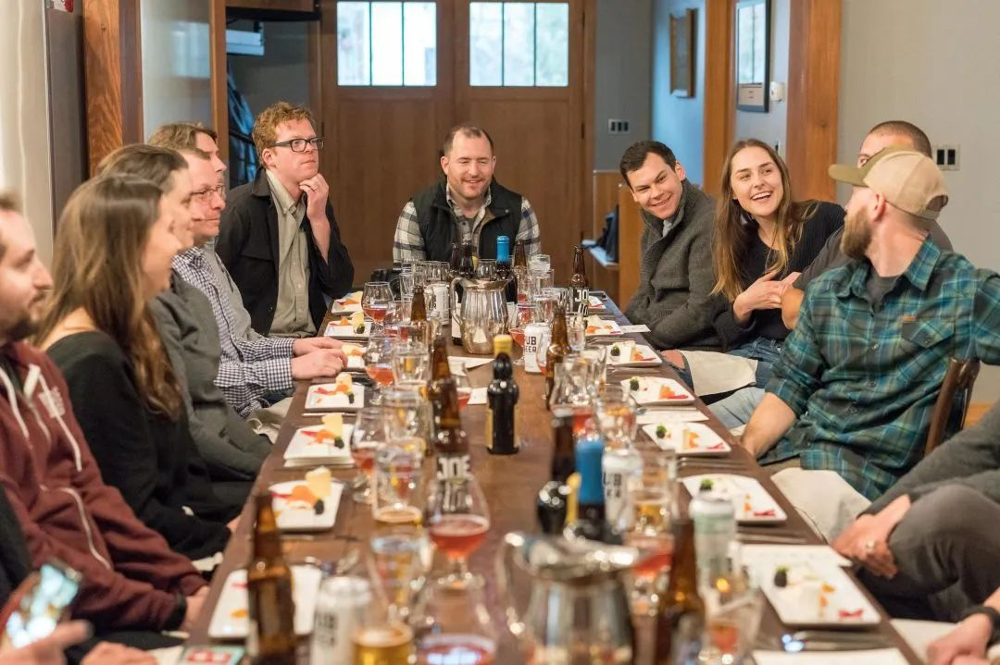 (原始链接: https://mmbiz.qpic.cn/mmbiz_jpg/cY0qSDjdkFeYdfrdDOGbiaicp8aZAdVdrupcUOcpyfT0Oiam9LsnGjVzz1ria26OZ3aVfDWZibQJ0fia1oNNpGc70UibA/640?wx_fmt=jpeg&from=appmsg)
- 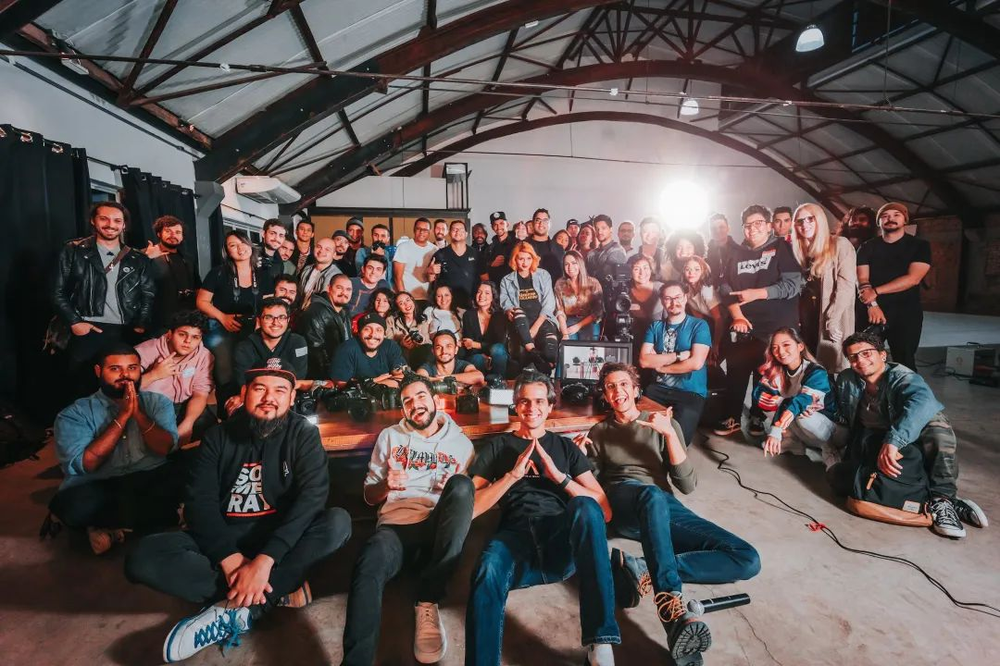 (原始链接: https://mmbiz.qpic.cn/mmbiz_jpg/cY0qSDjdkFeYdfrdDOGbiaicp8aZAdVdruw6MDOQYCATNkBYJT3BnOBhxgEsBVvqEmIM7H82tkL2FZMefTdqAH9w/640?wx_fmt=jpeg&from=appmsg)
-  (原始链接: https://mmbiz.qpic.cn/mmbiz_jpg/cY0qSDjdkFeYdfrdDOGbiaicp8aZAdVdrujrktnwbBPSERltLcqjW83ice1ssODNlicLErjhlg3lGibpXUTEwm8eJYA/640?wx_fmt=jpeg&from=appmsg)
-  (原始链接: https://mmbiz.qpic.cn/mmbiz_jpg/cY0qSDjdkFeYdfrdDOGbiaicp8aZAdVdrulPNib4atuhCLn6DDhlglia03w37gMMxS3JwLQicfx7UKmSWdg0Nfe596Q/640?wx_fmt=jpeg&from=appmsg)
-  (原始链接: https://mmbiz.qpic.cn/mmbiz_jpg/cY0qSDjdkFeYdfrdDOGbiaicp8aZAdVdrulYgeCTftzvmIKsPuyqibuiaDU1aEyDI7LE5XHe9ukfhtyDGAPnibyg40g/640?wx_fmt=jpeg&from=appmsg)
- 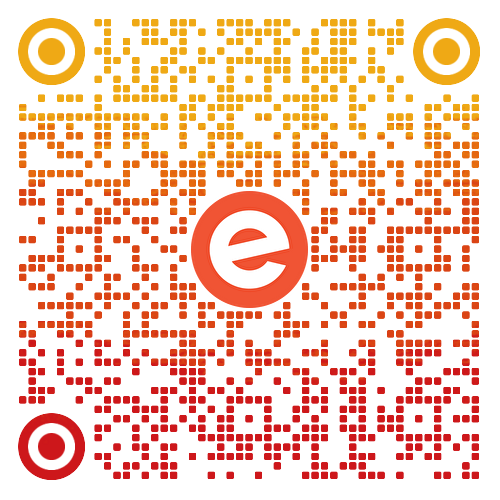 (原始链接: https://mmbiz.qpic.cn/mmbiz_png/cY0qSDjdkFeYdfrdDOGbiaicp8aZAdVdrueMmIo0foObTs56MRibUM6qyCz0u9rhClAtwZo5DJ2hT3rKc623rJyibw/640?wx_fmt=png&from=appmsg)
- 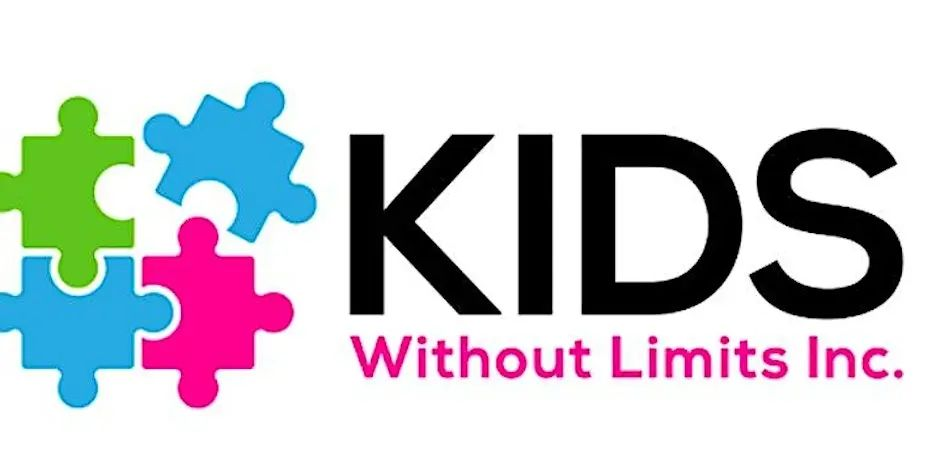 (原始链接: https://mmbiz.qpic.cn/mmbiz_jpg/cY0qSDjdkFeYdfrdDOGbiaicp8aZAdVdruRcibqlw7Hb830yCRA1fbG2b5WYiaE8eLSylP18ftRE7SxmSz8icl1fgHg/640?wx_fmt=jpeg&from=appmsg)
- 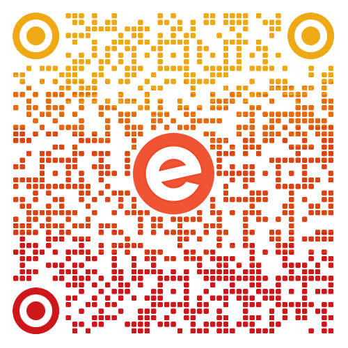 (原始链接: https://mmbiz.qpic.cn/mmbiz_png/cY0qSDjdkFeYdfrdDOGbiaicp8aZAdVdruogmdQicp16G8QgJIVcm3Vnibw1N561KLKty8IBA3SVQUjibic8tKZwaf4A/640?wx_fmt=png&from=appmsg)
-  (原始链接: https://mmbiz.qpic.cn/mmbiz_jpg/cY0qSDjdkFeYdfrdDOGbiaicp8aZAdVdrua7wIqk6XMicPHzicW4LrFgPhXIDVysNAt7IXmU6ia06hwhbnA4C089qlA/640?wx_fmt=jpeg&from=appmsg)
- 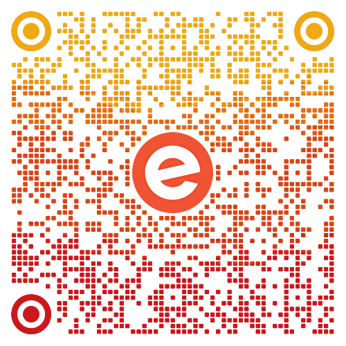 (原始链接: https://mmbiz.qpic.cn/mmbiz_png/cY0qSDjdkFeYdfrdDOGbiaicp8aZAdVdruMxqUnLswTr6icqdzj2uicEVDbTShr1ooga4YZnYL023AIiaQWFHghIGsg/640?wx_fmt=png&from=appmsg)
- 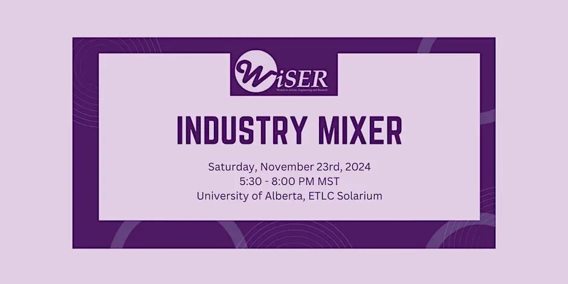 (原始链接: https://mmbiz.qpic.cn/mmbiz_jpg/cY0qSDjdkFeYdfrdDOGbiaicp8aZAdVdruhEKrrMib3zkTt8BrF29enO8aaibznicvq6iaGIG6UMpvrOP0VeXPFW4uHg/640?wx_fmt=jpeg&from=appmsg)
- 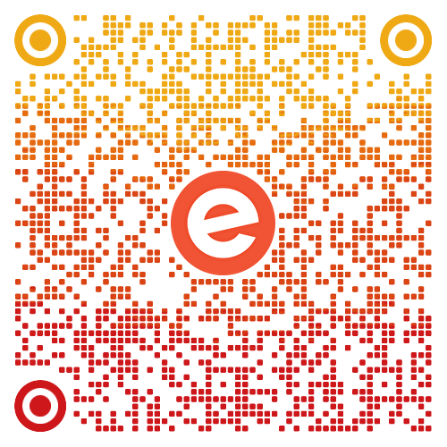 (原始链接: https://mmbiz.qpic.cn/mmbiz_png/cY0qSDjdkFeYdfrdDOGbiaicp8aZAdVdru0ZgdjwibW7rKvzGseUcqpUhcicADMMBicmICLzAHoAtqqP5L76w2TVNNg/640?wx_fmt=png&from=appmsg)
- 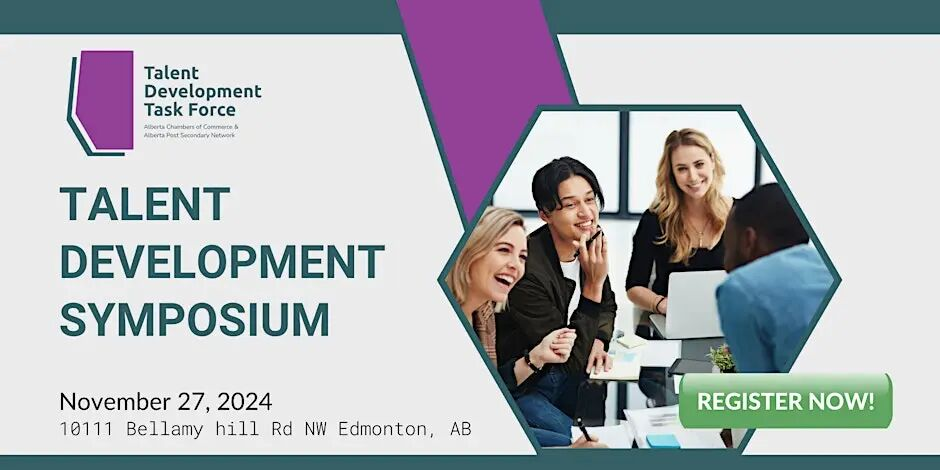 (原始链接: https://mmbiz.qpic.cn/mmbiz_jpg/cY0qSDjdkFeYdfrdDOGbiaicp8aZAdVdrumaBeCyZfp4l4I6LKib64ITaicLf5lsUnjssDtASwylZDC2GNxggFNNpQ/640?wx_fmt=jpeg&from=appmsg)
- 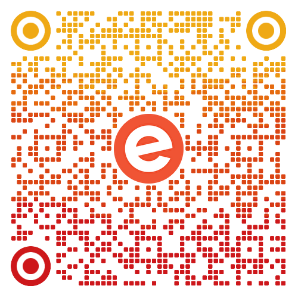 (原始链接: https://mmbiz.qpic.cn/mmbiz_png/cY0qSDjdkFeYdfrdDOGbiaicp8aZAdVdruXsadogCWETDmnsPBw4PX3QW96OmsuDeicY5peicfPUMiaEsz4ficJFH4Lw/640?wx_fmt=png&from=appmsg)
-  (原始链接: https://mmbiz.qpic.cn/mmbiz_jpg/cY0qSDjdkFeYdfrdDOGbiaicp8aZAdVdruq6RjCz3sHiciaVj1ZOaB9bxVdO5ITnlGaeCo7MUic6PzJIwkOoHUiacrYw/640?wx_fmt=jpeg&from=appmsg)
- 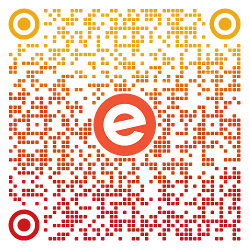 (原始链接: https://mmbiz.qpic.cn/mmbiz_png/cY0qSDjdkFeYdfrdDOGbiaicp8aZAdVdruEPap4RqsCBqPic0RXDJfvzKnndHzEich4nbZXW7GNMQEcicjBib3NUceBg/640?wx_fmt=png&from=appmsg)
- 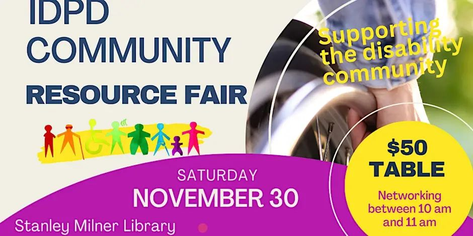 (原始链接: https://mmbiz.qpic.cn/mmbiz_jpg/cY0qSDjdkFeYdfrdDOGbiaicp8aZAdVdrujqLygJ8DHJ069kticELWUwnGujrcqrUpXXDicTfBBiaDufyV1icTbEiahkg/640?wx_fmt=jpeg&from=appmsg)
- 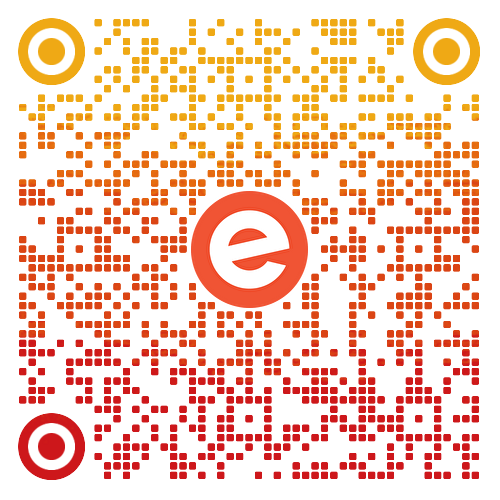 (原始链接: https://mmbiz.qpic.cn/mmbiz_png/cY0qSDjdkFeYdfrdDOGbiaicp8aZAdVdrutaCTHfD0h8VRSgAQsn6lChyYVYQmHnicLujKkD7gIEiauzGiaRHc5SuicQ/640?wx_fmt=png&from=appmsg)
- 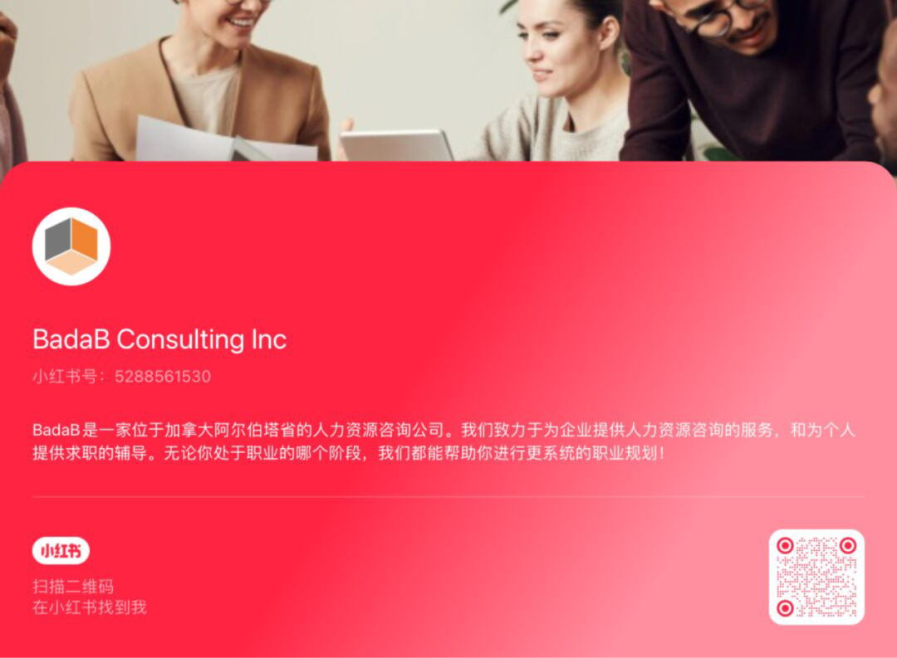 (原始链接: https://mmbiz.qpic.cn/mmbiz_png/cY0qSDjdkFeYdfrdDOGbiaicp8aZAdVdruq9yujXz4mxSZ4n6fV18XmI3EticGSytpmMl0hKVfiat6f53CwXHvbictQ/640?wx_fmt=png&from=appmsg)
-  (原始链接: https://mmbiz.qpic.cn/mmbiz_png/cY0qSDjdkFeYdfrdDOGbiaicp8aZAdVdrurmgd1aawSUB5wo9nNov9uQ8D4lStfON8S90wXtmaHZibmkZXViczuUQg/640?wx_fmt=png&from=appmsg)
-  (原始链接: https://mmbiz.qpic.cn/mmbiz_jpg/cY0qSDjdkFeYdfrdDOGbiaicp8aZAdVdruJcJM9WscpiaQxKoghtgQiaJBAP3PAibD98Pwic5hATNvs6pRMRrIvwOPqQ/640?wx_fmt=jpeg&from=appmsg)
-  (原始链接: https://mmbiz.qpic.cn/mmbiz_png/cY0qSDjdkFeYdfrdDOGbiaicp8aZAdVdrurmgd1aawSUB5wo9nNov9uQ8D4lStfON8S90wXtmaHZibmkZXViczuUQg/640?wx_fmt=png&from=appmsg)
-  (原始链接: https://mmbiz.qpic.cn/mmbiz_jpg/cY0qSDjdkFeYdfrdDOGbiaicp8aZAdVdruNiaMmVE1v2SQCr3IhrXqn0Wwfrp45vE5TJYXsjpicFoIsev0alBX4S2w/640?wx_fmt=jpeg&from=appmsg)
-  (原始链接: https://mmbiz.qpic.cn/mmbiz_png/cY0qSDjdkFeYdfrdDOGbiaicp8aZAdVdrurmgd1aawSUB5wo9nNov9uQ8D4lStfON8S90wXtmaHZibmkZXViczuUQg/640?wx_fmt=png&from=appmsg)
-  (原始链接: https://mmbiz.qpic.cn/mmbiz_jpg/cY0qSDjdkFeYdfrdDOGbiaicp8aZAdVdruI7jmibckhsS0NWdWvUDuBJjZm9ordNqsorooRicicryOjGgJxL0r1sicyA/640?wx_fmt=jpeg&from=appmsg)
-  (原始链接: https://mmbiz.qpic.cn/mmbiz_jpg/cY0qSDjdkFeYdfrdDOGbiaicp8aZAdVdru76IrBbOWbBD9kLfYAbicicEx0KwGEsmKd1EyOKonibdXQVdla2zG5metw/640?wx_fmt=jpeg&from=appmsg)
-  (原始链接: https://mmbiz.qpic.cn/mmbiz_jpg/cY0qSDjdkFeYdfrdDOGbiaicp8aZAdVdruwR7gbOibIKbDicQFCZL5xRMSWGSh36ZjV9UibnYkg2JiaP3UTXQaAhYeAg/640?wx_fmt=jpeg&from=appmsg)
