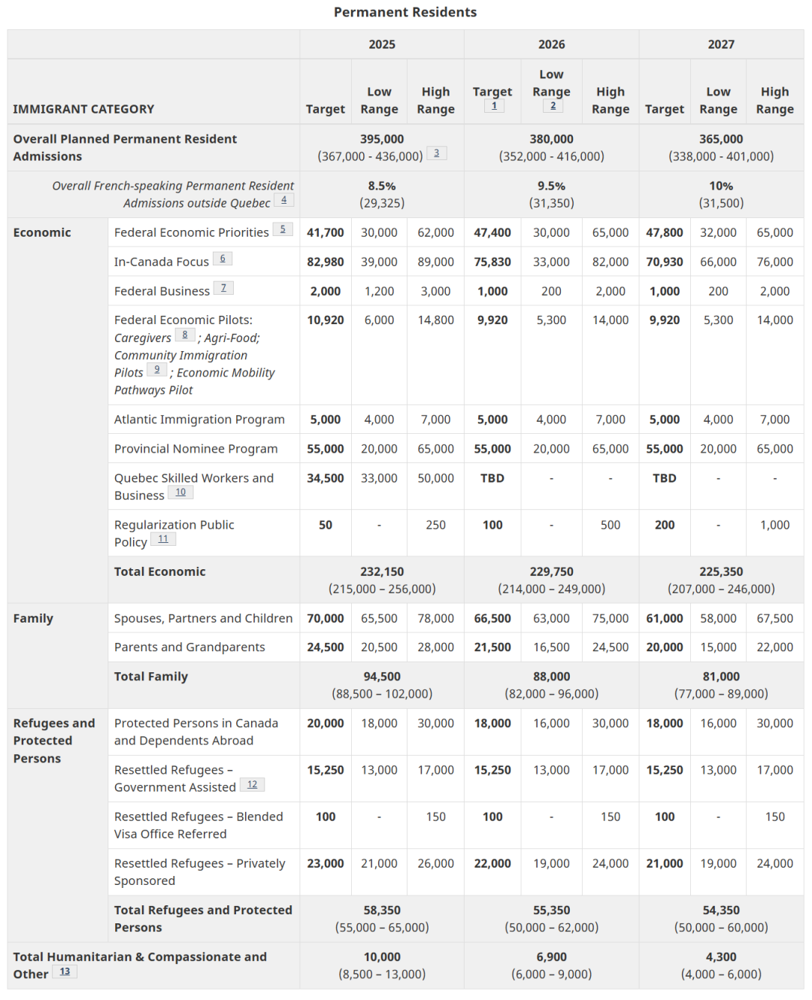
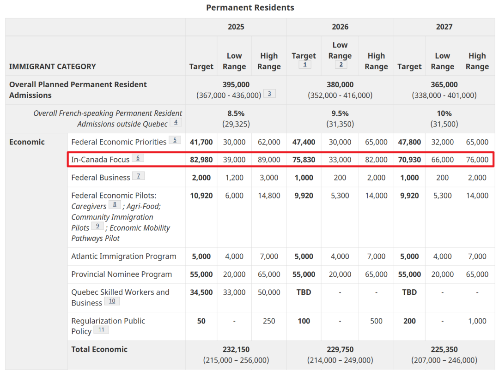

# 无标题

**链接地址:** http://mp.weixin.qq.com/s?__biz=MzUyNzA2NTAwNg==&mid=2247500877&idx=1&sn=bf8fc9d1f5b84c427d08a6e2aeff2eb5&chksm=fb4b695c9e42a7934493b8b347a4c2e269796aa89911c249788ab6c9239137769924dc3b7fab&mpshare=1&scene=2&srcid=1101m9uP1U4AR6TIGvw1okCM&sharer_shareinfo=bfcc20893e77a78233de04f4401683eb&sharer_shareinfo_first=bfcc20893e77a78233de04f4401683eb#rd
**作者:** 你身边的签证专家
**获取时间:** 2025/8/28 18:50:51
**图片数量:** 18

---

## 原始HTML内容

<section style="font-size: 16px;color: rgb(62, 62, 62);"><section style="text-align: center;margin-top: 10px;margin-bottom: 10px;line-height: 0;"><section style="vertical-align: middle;display: inline-block;line-height: 0;"></section></section><section style="text-align: center;margin-top: 10px;margin-bottom: 10px;line-height: 0;"><section style="vertical-align: middle;display: inline-block;line-height: 0;"></section></section>
 
<section style="font-size: 14px;padding-right: 15px;padding-left: 15px;letter-spacing: 1px;">
 

10月24日，加拿大移民局公布了最新的未来三年移民计划，其中一项重大调整为境内申请人带来了绝佳机会——<strong>加拿大经验类移民（CEC）单独设置了配额</strong>，并大幅增加了EE（快速通道）下的境内申请配额。
</section><section style="font-size: 14px;padding-right: 15px;padding-left: 15px;letter-spacing: 1px;">
 

加拿大联邦政府计划在未来三年内逐步减少永久居民和临时居民的目标，<strong>2025年降幅高达20%，此后还要继续减少</strong>。绝大多数移民项目遭遇配额逐步削减，法语移民和经济移民或成最大赢家。

 
</section><section style="text-align: center;margin-top: 10px;margin-bottom: 10px;line-height: 0;"><section style="vertical-align: middle;display: inline-block;line-height: 0;width: 90%;height: auto;"></section></section><section style="text-align: center;margin-top: 10px;margin-bottom: 10px;line-height: 0;"><section style="vertical-align: middle;display: inline-block;line-height: 0;width: 90%;height: auto;"></section></section><section style="font-size: 14px;padding-right: 15px;padding-left: 15px;letter-spacing: 1px;">
 

从年初移民部对留学生数量设立上限，到全年无休地对学签、工签和移民政策进行逐步收紧，最终在年底发布的未来三年移民配额计划中，<strong>利空的靴子也算是正式落地</strong>。

 

加拿大政府此举无疑传递出一个清晰信号：移民大国正逐步<strong>从“宽进”走向“严控”</strong>。这一决定旨在平衡日益增长的移民人数与国内资源压力，反映出加拿大政府在移民政策上的审慎态度。别再抱怨加拿大自由党无限制引进移民啦，下狠手砍配额的时候也是杀伐果断的！

 
</section><section style="font-size: 14px;padding-right: 15px;padding-left: 15px;letter-spacing: 1px;">
 

 
</section><section style="font-size: 19px;text-align: center;margin-top: 10px;margin-bottom: 3px;"><section style="display: inline-block;border-width: 1px;border-style: solid;border-color: rgb(188, 65, 65);background-color: rgb(188, 65, 65);width: 1.8em;height: 1.8em;line-height: 1.8em;border-radius: 100%;margin-left: auto;margin-right: auto;font-size: 16px;color: rgb(255, 255, 255);">
<strong>1</strong>
</section></section><section style="text-align: center;"><section style="display: inline-block;width: 0px;height: 0px;vertical-align: top;overflow: hidden;border-style: solid;border-width: 9px 6px 0px;border-color: rgb(188, 65, 65) rgba(255, 255, 255, 0) rgba(255, 255, 255, 0);"><svg viewBox="0 0 1 1" style="float:left;line-height:0;width:0;vertical-align:top;"></svg></section></section><section style="margin-bottom: 10px;text-align: center;justify-content: center;display: flex;flex-flow: row;"><section style="display: inline-block;width: auto;vertical-align: middle;background-color: rgba(109, 155, 209, 0.1);min-width: 10%;flex: 0 0 auto;height: auto;align-self: center;padding: 12px;"><section style="color: rgb(109, 155, 209);text-align: justify;">
<strong>2025年加拿大移民配额解析</strong> 
</section></section></section><section style="font-size: 14px;padding-right: 15px;padding-left: 15px;letter-spacing: 1px;">
 

在此次发布的移民计划中，加拿大移民局对未来几年的配额进行了更为细致的划分，其中<strong>经济类移民的配额总量为23.2万</strong>。具体的配额分布如下：

 
</section><section style="text-align: center;margin-top: 10px;margin-bottom: 10px;line-height: 0;"><section style="vertical-align: middle;display: inline-block;line-height: 0;width: 90%;height: auto;"></section></section><section style="font-size: 14px;padding-right: 15px;padding-left: 15px;letter-spacing: 1px;">
 

 
<ol class="list-paddingleft-2" style="padding-left: 40px;list-style-position: outside;"><li>
<strong>EE优先邀请类（Federal Economic Priorities）：4.17万人</strong>

这部分EE优先邀请类目前仅包含三个大类：法语人才、建筑技工和医疗护理职业。值得注意的是，<strong>之前的重点类别如STEM人才、农林食品业和运输专业已被移出EE优先邀请列表</strong>，这显示出加拿大移民局对未来劳动力市场的不同侧重。
</li><li>
<strong>常规类EE（In-Canada Focus）：8.29万人</strong> 根据《2025-2027移民水平计划》的注解，我们可以推测，在未来的抽选中，EE依然会以加拿大境内候选人为主，特别是对于加拿大经验类（CEC）的抽选比例将会大幅增加。这一调整极大程度上体现了加拿大政府对境内人才的重视。
</li><li>
<strong>联邦商业项目：2000名申请人</strong> 这部分配额将由联邦自雇移民与联邦创业移民（SUV）共享。加拿大政府依旧在通过这种方式吸引有创业精神或具备特殊才能的申请者。
</li><li>
<strong>联邦试点项目：1.09万名申请者</strong> 这类试点项目包括「联邦护工移民」、「联邦农业移民」和「偏远地区移民」等，为特定领域和社区提供了更多的移民机会。
</li><li>
<strong>大西洋四省雇主担保移民（AIP）：5000名申请者</strong> 这一配额的设定在很大程度上鼓励了大西洋四省继续吸纳和留住人才，确保当地的劳动力需求得到满足。
</li><li>
<strong>各省省提名（PNP）：5.5万名申请者</strong>

这次调整中，<strong>省提名计划的配额有所减少</strong>，但仍然是获得永久居民身份的一个重要通道。
</li><li>
<strong>魁省移民项目：3.45万名申请者</strong> 魁省继续保持其独立的移民计划，这表明魁省在吸纳人才方面有着特定的要求和目标。
</li><li>
特殊公共移民项目：50名申请者
</li><li>
家庭类移民：9.45万

夫妻、配偶、子女团聚移民：7万&nbsp; &nbsp;&nbsp;

父母、祖父母团聚移民：2.45万
</li><li>
难民移民：5.83万
</li><li>
人道主义关怀移民：1万

 
</li></ol></section><section style="transform: scale(0.9);transform-origin: center center;margin-top: -6px;margin-bottom: -6px;"><section style="margin: 10px 0%;text-align: left;justify-content: flex-start;display: flex;flex-flow: row;"><section style="display: inline-block;vertical-align: middle;width: 50%;padding-right: 5px;align-self: center;flex: 0 0 auto;"><section style="text-align: center;margin-right: 0%;margin-left: 0%;line-height: 0;"><section style="vertical-align: middle;display: inline-block;line-height: 0;"></section></section></section><section style="display: inline-block;vertical-align: middle;width: 50%;padding-left: 5px;align-self: center;flex: 0 0 auto;"><section style="text-align: center;margin-right: 0%;margin-left: 0%;line-height: 0;"><section style="vertical-align: middle;display: inline-block;line-height: 0;"></section></section></section></section></section><section style="transform: scale(0.9);transform-origin: center center;margin-top: -6px;margin-bottom: -6px;"><section style="margin: 10px 0%;text-align: left;justify-content: flex-start;display: flex;flex-flow: row;"><section style="display: inline-block;vertical-align: middle;width: 50%;padding-right: 5px;align-self: center;flex: 0 0 auto;"><section style="text-align: center;margin-right: 0%;margin-left: 0%;line-height: 0;"><section style="vertical-align: middle;display: inline-block;line-height: 0;"></section></section></section><section style="display: inline-block;vertical-align: middle;width: 50%;padding-left: 5px;align-self: center;flex: 0 0 auto;"><section style="text-align: center;margin-right: 0%;margin-left: 0%;line-height: 0;"><section style="vertical-align: middle;display: inline-block;line-height: 0;"></section></section></section></section></section><section style="font-size: 14px;padding-right: 15px;padding-left: 15px;letter-spacing: 1px;">
 

对于目前已经在加拿大工作和生活的申请人来说，这次的调整无疑是一大<strong>喜讯</strong>。由于新计划显著增加了境内申请人的配额，拿到枫叶卡的机会得到了大大提升！

 

但需要注意的是，所谓紧缺行业也会随着市场行情调整，一窝蜂地去学某专业会造成劳动力供给过剩，同样无法进入移民优先领域，因此<strong>规划学业和事业要谨慎</strong>！

 
</section><section style="font-size: 19px;text-align: center;margin-top: 10px;margin-bottom: 3px;"><section style="display: inline-block;border-width: 1px;border-style: solid;border-color: rgb(188, 65, 65);background-color: rgb(188, 65, 65);width: 1.8em;height: 1.8em;line-height: 1.8em;border-radius: 100%;margin-left: auto;margin-right: auto;font-size: 16px;color: rgb(255, 255, 255);">
<strong>2</strong>
</section></section><section style="text-align: center;"><section style="display: inline-block;width: 0px;height: 0px;vertical-align: top;overflow: hidden;border-style: solid;border-width: 9px 6px 0px;border-color: rgb(188, 65, 65) rgba(255, 255, 255, 0) rgba(255, 255, 255, 0);"><svg viewBox="0 0 1 1" style="float:left;line-height:0;width:0;vertical-align:top;"></svg></section></section><section style="margin-bottom: 10px;text-align: center;justify-content: center;display: flex;flex-flow: row;"><section style="display: inline-block;width: auto;vertical-align: middle;background-color: rgba(109, 155, 209, 0.1);min-width: 10%;flex: 0 0 auto;height: auto;align-self: center;padding: 12px;"><section style="color: rgb(109, 155, 209);text-align: justify;">
<strong>境内CEC申请人迎来“独享”配额</strong>
</section></section></section><section style="font-size: 14px;padding-right: 15px;padding-left: 15px;letter-spacing: 1px;">
 

在新的配额设置中，以往的“Federal High Skilled”（FHS）类别已不再存在，取而代之的是两项新的类别设置：

 
</section><section style="text-align: left;justify-content: flex-start;display: flex;flex-flow: row;margin-top: 10px;margin-bottom: 10px;transform: translate3d(15px, 0px, 0px);"><section style="display: inline-block;vertical-align: middle;width: auto;background-color: rgb(188, 65, 65);min-width: 5%;flex: 0 0 auto;height: auto;align-self: center;padding: 4px;"><section style="font-size: 19px;margin-right: 0%;margin-left: 0%;text-align: center;"><section style="display: inline-block;border-width: 1px;border-style: solid;border-color: rgb(255, 255, 255);background-color: rgb(255, 255, 255);width: 1.8em;height: 1.8em;line-height: 1.8em;border-radius: 100%;margin-left: auto;margin-right: auto;font-size: 15px;color: rgb(188, 65, 65);">
<strong>1</strong>
</section></section></section><section style="display: inline-block;vertical-align: middle;width: auto;align-self: center;flex: 0 0 auto;min-width: 5%;height: auto;margin-left: 11px;"><section style="text-align: justify;">
<strong>Federal Economic Priorities（FEP）</strong>
</section></section></section><section style="font-size: 14px;padding-right: 15px;padding-left: 15px;letter-spacing: 1px;">
这一类别主要针对<strong>医疗、技工和法语</strong>能力三个关键行业的定向配额，凸显出加拿大政府在这些行业的人才需求。

 
</section><section style="text-align: center;margin-top: 10px;margin-bottom: 10px;line-height: 0;"><section style="vertical-align: middle;display: inline-block;line-height: 0;width: 90%;height: auto;"></section></section>
 
<section style="text-align: left;justify-content: flex-start;display: flex;flex-flow: row;margin-top: 10px;margin-bottom: 10px;transform: translate3d(15px, 0px, 0px);"><section style="display: inline-block;vertical-align: middle;width: auto;background-color: rgb(188, 65, 65);min-width: 5%;flex: 0 0 auto;height: auto;align-self: center;padding: 4px;"><section style="font-size: 19px;margin-right: 0%;margin-left: 0%;text-align: center;"><section style="display: inline-block;border-width: 1px;border-style: solid;border-color: rgb(255, 255, 255);background-color: rgb(255, 255, 255);width: 1.8em;height: 1.8em;line-height: 1.8em;border-radius: 100%;margin-left: auto;margin-right: auto;font-size: 15px;color: rgb(188, 65, 65);">
<strong>2</strong>
</section></section></section><section style="display: inline-block;vertical-align: middle;width: auto;align-self: center;flex: 0 0 auto;min-width: 5%;height: auto;margin-left: 11px;"><section style="text-align: justify;">
<strong>In-Canada Focus</strong>
</section></section></section><section style="font-size: 14px;padding-right: 15px;padding-left: 15px;letter-spacing: 1px;">
这一类别专门为CEC（加拿大经验类）申请人设置，涵盖了所有在加拿大境内的快速通道申请人。这项调整体现了政府更加关注境内申请者的策略，鼓励在加拿大学习和工作的候选人留在本国。

 
</section><section style="text-align: center;margin-top: 10px;margin-bottom: 10px;line-height: 0;"><section style="vertical-align: middle;display: inline-block;line-height: 0;width: 90%;height: auto;"></section></section><section style="font-size: 14px;padding-right: 15px;padding-left: 15px;letter-spacing: 1px;">
 

根据新的移民计划，未来三年内，In-Canada Focus配额逐年减少，分别为：

 
<ul class="list-paddingleft-1" style="padding-left: 40px;list-style-position: outside;"><li>
<strong>2025年：82,980人</strong>
</li><li>
<strong>2026年：75,830人</strong>
</li><li>
<strong>2027年：70,930人</strong>
</li></ul>
 

这意味着，<strong>In-Canada Focus类别的配额占据了EE总配额的约三分之二</strong>，显示出加拿大政府希望吸纳更多境内申请者，以更好地支持国内的劳动力需求和经济发展。特别值得注意的是，2025年的EE优先类别中，仅包含医疗保健、技工职业和法语能力，显示出政府对这些行业和领域的特别关注。<strong>STEM、运输和农业等类别的定向已被取消</strong>。

 

在这种配额调整下，每两周CEC都会发出邀请，以每年邀请8万人的规模推算，<strong>每月的邀请人数将达到约6900人</strong>。对于有加拿大工作或学习背景的候选人来说，这无疑是巨大的机会。

 
</section><section style="font-size: 19px;text-align: center;margin-top: 10px;margin-bottom: 3px;"><section style="display: inline-block;border-width: 1px;border-style: solid;border-color: rgb(188, 65, 65);background-color: rgb(188, 65, 65);width: 1.8em;height: 1.8em;line-height: 1.8em;border-radius: 100%;margin-left: auto;margin-right: auto;font-size: 16px;color: rgb(255, 255, 255);">
<strong>3</strong>
</section></section><section style="text-align: center;"><section style="display: inline-block;width: 0px;height: 0px;vertical-align: top;overflow: hidden;border-style: solid;border-width: 9px 6px 0px;border-color: rgb(188, 65, 65) rgba(255, 255, 255, 0) rgba(255, 255, 255, 0);"><svg viewBox="0 0 1 1" style="float:left;line-height:0;width:0;vertical-align:top;"></svg></section></section><section style="margin-bottom: 10px;text-align: center;justify-content: center;display: flex;flex-flow: row;"><section style="display: inline-block;width: auto;vertical-align: middle;background-color: rgba(109, 155, 209, 0.1);min-width: 10%;flex: 0 0 auto;height: auto;align-self: center;padding: 12px;"><section style="color: rgb(109, 155, 209);text-align: justify;">
<strong>境外拿枫叶卡难上加难</strong>
</section></section></section>
 
<section style="font-size: 14px;padding-right: 15px;padding-left: 15px;letter-spacing: 1px;">
长期以来，省提名计划（PNP）一直是境内外申请人获得移民资格的一个重要途径。然而，在最新的移民计划中，<strong>PNP的配额大幅减少，从去年公布的11-12万人削减至5.5万人，几乎砍掉了一半</strong>。这种调整意味着，PNP正在逐渐缩小对境外申请人的开放度，未来更多的名额将倾向于境内申请人。

 
</section><section style="text-align: center;margin-top: 10px;margin-bottom: 10px;line-height: 0;"><section style="vertical-align: middle;display: inline-block;line-height: 0;width: 90%;height: auto;"></section></section><section style="font-size: 14px;padding-right: 15px;padding-left: 15px;letter-spacing: 1px;">
 

目前来看，<strong>EE已经不再进行General、FSW非定向邀请</strong>，这对境外申请人来说是一个沉重的打击。对于那些条件一般、没有办法通过定向邀请进入移民通道的申请人来说，未来拿到枫叶卡的难度将会进一步增加。

 
</section><section style="font-size: 19px;text-align: center;margin-top: 10px;margin-bottom: 3px;"><section style="display: inline-block;border-width: 1px;border-style: solid;border-color: rgb(188, 65, 65);background-color: rgb(188, 65, 65);width: 1.8em;height: 1.8em;line-height: 1.8em;border-radius: 100%;margin-left: auto;margin-right: auto;font-size: 16px;color: rgb(255, 255, 255);">
<strong>4</strong>
</section></section><section style="text-align: center;"><section style="display: inline-block;width: 0px;height: 0px;vertical-align: top;overflow: hidden;border-style: solid;border-width: 9px 6px 0px;border-color: rgb(188, 65, 65) rgba(255, 255, 255, 0) rgba(255, 255, 255, 0);"><svg viewBox="0 0 1 1" style="float:left;line-height:0;width:0;vertical-align:top;"></svg></section></section><section style="margin-bottom: 10px;text-align: center;justify-content: center;display: flex;flex-flow: row;"><section style="display: inline-block;width: auto;vertical-align: middle;background-color: rgba(109, 155, 209, 0.1);min-width: 10%;flex: 0 0 auto;height: auto;align-self: center;padding: 12px;"><section style="color: rgb(109, 155, 209);text-align: justify;">
<strong>未来三年是境内申请人的黄金时期</strong>
</section></section></section>
 
<section style="font-size: 14px;padding-right: 15px;padding-left: 15px;letter-spacing: 1px;">
整体来看，尽管2025年的移民配额削减了10万，但总量<strong>仍然略高于疫情前每年约30万的平均水平</strong>。因此，广大移民申请人不必过度恐慌。

 

从各项目的配额分配上可以看出，加拿大移民部在2025年将<strong>继续把重点放在境内移民申请人上</strong>，强调通过政策保障那些已经以学生和工人身份在加拿大居留的群体能顺利转为永久居民。这也充分体现了“境内优先”的战略目标。<strong>通过留学移民加拿大依然是最可靠和最主流的加拿大移民方式。</strong>

 

对于EE候选人而言，尽管2025年的配额比2024年有所缩减，但整体形式可能会更加明朗和稳定。2025年移民部明确区分了EE优先邀请类和常规EE的配额，同时将原本较为复杂的六大优先邀请类项目大幅缩减，仅保留了三类重点领域。

 

相对而言，PNP的申请难度预计将在2025年进一步提高。由于PNP的整体配额大幅缩减了一半，各省的配额也会相应减少，势必导致竞争更加激烈。<strong>特别是针对打分制的PNP项目，配额减少将使得获得邀请的难度逐步上升</strong>。申请人需未雨绸缪，提前制定合理的申请策略。

 

这次移民政策的调整显然是向那些有加拿大工作经验和学术背景的申请人释放出一个明确的信号：<strong>加拿大更愿意接纳那些已经在本国生活和工作的申请者。</strong>未来三年内，持有有效工作签证和学签的境内申请人将有机会更快、更稳妥地进入移民流程。 

 

对于留学生或其他临时居民来说，通过申请工签来延长合法居留时间，将是未来移民的一条重要路径。获得工签后，申请者可以继续积累工作经验，并<strong>结合LMIA（劳动力市场影响评估）的加分支持</strong>，极大地提高申请PR的成功几率。

 
</section><section style="text-align: center;margin-top: 10px;margin-bottom: 10px;line-height: 0;"><section style="vertical-align: middle;display: inline-block;line-height: 0;width: 90%;height: auto;"></section></section><section style="font-size: 14px;padding-right: 15px;padding-left: 15px;letter-spacing: 1px;">
 

在今年，加拿大的移民政策变化频繁，几乎每个月都有新的政策出台或调整。对于那些有移民打算的申请者来说，趁着目前的有利政策赶紧行动显得尤为重要。<strong>新时代留学移民法律事务所</strong>作为资深的移民服务机构，将全力为您提供全方位的移民支持和专业服务，帮助您成功拿到心仪的枫叶卡。

 
</section>
 
<section style="text-align: left;justify-content: flex-start;display: flex;flex-flow: row;margin-top: 10px;"><section style="display: inline-block;vertical-align: top;width: auto;align-self: stretch;flex: 0 0 auto;background-color: rgb(188, 65, 65);min-width: 5%;height: auto;padding-top: 9px;padding-right: 9px;padding-left: 20px;"><section style="text-align: justify;font-size: 18px;color: rgb(252, 252, 252);">
<strong>阅读更多</strong>
</section></section><section style="display: inline-block;vertical-align: top;width: auto;min-width: 5%;flex: 0 0 auto;height: auto;align-self: stretch;"><section style=""><section style="display: inline-block;width: 0px;height: 0px;vertical-align: top;overflow: hidden;border-style: solid;border-width: 45px 0px 0px 19px;border-color: rgba(255, 255, 255, 0) rgba(255, 255, 255, 0) rgba(255, 255, 255, 0) rgb(188, 65, 65);"><svg viewBox="0 0 1 1" style="float:left;line-height:0;width:0;vertical-align:top;"></svg></section></section></section></section><section style="margin-bottom: 10px;"><section style="background-color: rgb(188, 65, 65);height: 3px;"><svg viewBox="0 0 1 1" style="float:left;line-height:0;width:0;vertical-align:top;"></svg></section></section><section style="margin: 10px 0%;text-align: left;justify-content: flex-start;display: flex;flex-flow: row;"><section style="display: inline-block;width: 100%;vertical-align: top;background-position: 4.198% 37.535%;background-repeat: repeat;background-attachment: scroll;padding: 30px;align-self: flex-start;flex: 0 0 auto;background-image: url(&quot;https://mmbiz.qpic.cn/mmbiz_png/904kUibXm7Y4yX8nAkG6ZqHT37YWmqmU3ia5icv0wC56UTzGSYpPsBffr1fVGeTiaF2Nia0aQxhvMhy5cCibiciaEq9zag/640?wx_fmt=png&amp;from=appmsg&quot;);background-size: 107.269% !important;"><section style="text-align: justify;justify-content: flex-start;display: flex;flex-flow: row;"><section style="display: inline-block;width: 100%;vertical-align: top;background-color: rgba(62, 62, 62, 0.61);padding: 10px;border-width: 0px;border-style: none;border-color: rgb(62, 62, 62);align-self: flex-start;flex: 0 0 auto;"><section style="text-align: left;color: rgb(255, 255, 255);font-size: 14px;">
<a target="_blank" href="http://mp.weixin.qq.com/s?__biz=MzUyNzA2NTAwNg==&amp;mid=2247500826&amp;idx=1&amp;sn=94e8979f6c2d2a179294e60683fb0f51&amp;chksm=fa07cedbcd7047cd603e64b9620487e545156b5f0dd4c753d47de83d8bf3b565aa8967c25ddc&amp;scene=21#wechat_redirect" textvalue="突发！安省宣布“封杀令”！禁止留学生读医，医学院95%招本地生！" linktype="text" imgurl="" imgdata="null" data-itemshowtype="0" tab="innerlink" style="color: rgb(255, 255, 255);" data-linktype="2"><strong>突发！安省宣布“封杀令”！禁止留学生读医，医学院95%招本地生！</strong></a>
</section></section></section></section></section><section style="margin: 10px 0%;text-align: left;justify-content: flex-start;display: flex;flex-flow: row;"><section style="display: inline-block;width: 100%;vertical-align: top;background-position: 76.0721% 42.2198%;background-repeat: repeat;background-attachment: scroll;padding: 30px;align-self: flex-start;flex: 0 0 auto;background-image: url(&quot;https://mmbiz.qpic.cn/mmbiz_jpg/904kUibXm7Y4yX8nAkG6ZqHT37YWmqmU3g36hP2d15VIPicMsLHyEzWGibXbKUQuytxOfT9EGErx6sV4KvWVfhUYA/640?wx_fmt=jpeg&amp;from=appmsg&quot;);background-size: 101.212% !important;"><section style="text-align: justify;justify-content: flex-start;display: flex;flex-flow: row;"><section style="display: inline-block;width: 100%;vertical-align: top;background-color: rgba(62, 62, 62, 0.61);padding: 10px;border-width: 0px;border-style: none;border-color: rgb(62, 62, 62);align-self: flex-start;flex: 0 0 auto;"><section style="text-align: center;color: rgb(255, 255, 255);font-size: 14px;">
<a target="_blank" href="http://mp.weixin.qq.com/s?__biz=MzUyNzA2NTAwNg==&amp;mid=2247500768&amp;idx=1&amp;sn=5d0484669da5c94301ce46998aff1c4f&amp;chksm=fa07c921cd704037336400ca97a1a21abd34f9d181a47757bb8a7f38a4199123db30f65ef622&amp;scene=21#wechat_redirect" textvalue="加拿大又对临时外劳项目出手了！高薪LMIA工资门槛飙升20%！不达标不审理！" linktype="text" imgurl="" imgdata="null" data-itemshowtype="0" tab="innerlink" style="color: rgb(255, 255, 255);" data-linktype="2"><strong>加拿大又对临时外劳项目出手了！高薪LMIA工资门槛飙升20%！不达标不审理！</strong></a>
</section></section></section></section></section><section style="margin: 10px 0%;text-align: left;justify-content: flex-start;display: flex;flex-flow: row;"><section style="display: inline-block;width: 100%;vertical-align: top;background-position: 62.1584% 63.5868%;background-repeat: repeat;background-attachment: scroll;padding: 30px;align-self: flex-start;flex: 0 0 auto;background-image: url(&quot;https://mmbiz.qpic.cn/mmbiz_jpg/904kUibXm7Y4yX8nAkG6ZqHT37YWmqmU3DQz4ZXD0C7TLrmjv0ldkIoB01q45TEf2dnhsWceRcqj8DibjVINeKvw/640?wx_fmt=jpeg&amp;from=appmsg&quot;);background-size: 104.35% !important;"><section style="text-align: justify;justify-content: flex-start;display: flex;flex-flow: row;"><section style="display: inline-block;width: 100%;vertical-align: top;background-color: rgba(62, 62, 62, 0.61);padding: 10px;border-width: 0px;border-style: none;border-color: rgb(62, 62, 62);align-self: flex-start;flex: 0 0 auto;"><section style="text-align: center;color: rgb(255, 255, 255);font-size: 14px;">
<a target="_blank" href="http://mp.weixin.qq.com/s?__biz=MzUyNzA2NTAwNg==&amp;mid=2247500739&amp;idx=1&amp;sn=86903d9916348bfa0408731bb0ff3bc6&amp;chksm=fa07c902cd704014a8cc451277ae4e6bd8a441958385f947328fee1ca9b8cadc436cefd63dbf&amp;scene=21#wechat_redirect" textvalue="您有一份来自阿尔伯塔省政府的邀请函，请查收！" linktype="text" imgurl="" imgdata="null" data-itemshowtype="0" tab="innerlink" style="color: rgb(255, 255, 255);" data-linktype="2"><strong>您有一份来自阿尔伯塔省政府的邀请函，请查收！</strong></a>
</section></section></section></section></section><section style="margin: 10px 0%;text-align: left;justify-content: flex-start;display: flex;flex-flow: row;"><section style="display: inline-block;width: 100%;vertical-align: top;background-position: 84.7753% 53.643%;background-repeat: repeat;background-attachment: scroll;padding: 30px;align-self: flex-start;flex: 0 0 auto;background-image: url(&quot;https://mmbiz.qpic.cn/mmbiz_jpg/904kUibXm7Y4yX8nAkG6ZqHT37YWmqmU3dibfOeaEjkdicZM97qn7VicYjowj4YCgzNc0t7Fh7icXeZBIbXLsePMNmw/640?wx_fmt=jpeg&amp;from=appmsg&quot;);background-size: 104.114% !important;"><section style="text-align: justify;justify-content: flex-start;display: flex;flex-flow: row;"><section style="display: inline-block;width: 100%;vertical-align: top;background-color: rgba(62, 62, 62, 0.61);padding: 10px;border-width: 0px;border-style: none;border-color: rgb(62, 62, 62);align-self: flex-start;flex: 0 0 auto;"><section style="text-align: left;color: rgb(255, 255, 255);font-size: 14px;">
<a target="_blank" href="http://mp.weixin.qq.com/s?__biz=MzUyNzA2NTAwNg==&amp;mid=2247500684&amp;idx=1&amp;sn=b55c7e41aedf8899aa42d11079cdd583&amp;chksm=fa07c94dcd70405b2a1a3065eeb802a5220928e31bc0f9565c898f1762d2c6df30f6012b5edf&amp;scene=21#wechat_redirect" textvalue="动真格！加拿大CBSA开始突击检查！100w非法居民恐被驱逐，留学生、临时外劳是重点！……" linktype="text" imgurl="" imgdata="null" data-itemshowtype="0" tab="innerlink" style="color: rgb(255, 255, 255);" data-linktype="2"><strong>动真格！加拿大CBSA开始突击检查！100w非法居民恐被驱逐，留学生、临时外劳是重点！……</strong></a>
</section></section></section></section></section><section style="text-align: center;font-size: 12px;color: rgb(180, 180, 180);">
（点击文字阅读）
</section><section style="margin: 10px 0%;text-align: left;justify-content: flex-start;display: flex;flex-flow: row;"><section style="display: inline-block;width: 100%;vertical-align: top;background-color: rgb(216, 202, 160);line-height: 0;align-self: flex-start;flex: 0 0 auto;"><section style="text-align: justify;justify-content: flex-start;display: flex;flex-flow: row;"><section style="display: inline-block;width: 100%;vertical-align: top;background-position: 0% 0%;background-repeat: repeat;background-attachment: scroll;align-self: flex-start;flex: 0 0 auto;background-image: url(&quot;https://mmbiz.qpic.cn/mmbiz_png/904kUibXm7Y4yX8nAkG6ZqHT37YWmqmU3g5PTaMPTODyBcebt3kU8pvAavQXJ6VMIb4M5OHiaHLac36Y8tpm7Jpw/640?wx_fmt=png&amp;from=appmsg&quot;);background-size: 1.56658% !important;"><section style="text-align: center;"><section style="display: inline-block;width: 100%;height: 11px;vertical-align: top;overflow: hidden;background-color: rgba(255, 255, 255, 0);"><svg viewBox="0 0 1 1" style="float:left;line-height:0;width:0;vertical-align:top;"></svg></section></section></section></section></section></section><section style="text-align: center;margin-top: 10px;margin-bottom: 10px;line-height: 0;"><section style="vertical-align: middle;display: inline-block;line-height: 0;"></section></section><section style="text-align: center;margin-top: 10px;margin-bottom: 10px;line-height: 0;"><section style="vertical-align: middle;display: inline-block;line-height: 0;"></section></section><section style="text-align: center;margin-top: 10px;margin-bottom: 10px;line-height: 0;"><section style="vertical-align: middle;display: inline-block;line-height: 0;"></section></section><section style="padding-right: 15px;padding-left: 15px;font-size: 12px;color: rgb(121, 121, 121);">
<strong>参考信息：</strong>

<strong>https://www.canada.ca/en/immigration-refugees-citizenship/news/notices/supplementary-immigration-levels-2025-2027.html</strong>
</section><section style="text-align: center;margin-top: 10px;margin-bottom: 10px;line-height: 0;"><section style="vertical-align: middle;display: inline-block;line-height: 0;"></section></section><section style="text-align: center;margin-top: 10px;margin-bottom: 10px;line-height: 0;"><section style="vertical-align: middle;display: inline-block;line-height: 0;"></section></section></section>
 

<mp-style-type data-value="3"></mp-style-type>

---

## 纯文本内容

10月24日，加拿大移民局公布了最新的未来三年移民计划，其中一项重大调整为境内申请人带来了绝佳机会——加拿大经验类移民（CEC）单独设置了配额，并大幅增加了EE（快速通道）下的境内申请配额。加拿大联邦政府计划在未来三年内逐步减少永久居民和临时居民的目标，2025年降幅高达20%，此后还要继续减少。绝大多数移民项目遭遇配额逐步削减，法语移民和经济移民或成最大赢家。从年初移民部对留学生数量设立上限，到全年无休地对学签、工签和移民政策进行逐步收紧，最终在年底发布的未来三年移民配额计划中，利空的靴子也算是正式落地。加拿大政府此举无疑传递出一个清晰信号：移民大国正逐步从“宽进”走向“严控”。这一决定旨在平衡日益增长的移民人数与国内资源压力，反映出加拿大政府在移民政策上的审慎态度。别再抱怨加拿大自由党无限制引进移民啦，下狠手砍配额的时候也是杀伐果断的！12025年加拿大移民配额解析在此次发布的移民计划中，加拿大移民局对未来几年的配额进行了更为细致的划分，其中经济类移民的配额总量为23.2万。具体的配额分布如下：EE优先邀请类（Federal Economic Priorities）：4.17万人这部分EE优先邀请类目前仅包含三个大类：法语人才、建筑技工和医疗护理职业。值得注意的是，之前的重点类别如STEM人才、农林食品业和运输专业已被移出EE优先邀请列表，这显示出加拿大移民局对未来劳动力市场的不同侧重。常规类EE（In-Canada Focus）：8.29万人根据《2025-2027移民水平计划》的注解，我们可以推测，在未来的抽选中，EE依然会以加拿大境内候选人为主，特别是对于加拿大经验类（CEC）的抽选比例将会大幅增加。这一调整极大程度上体现了加拿大政府对境内人才的重视。联邦商业项目：2000名申请人这部分配额将由联邦自雇移民与联邦创业移民（SUV）共享。加拿大政府依旧在通过这种方式吸引有创业精神或具备特殊才能的申请者。联邦试点项目：1.09万名申请者这类试点项目包括「联邦护工移民」、「联邦农业移民」和「偏远地区移民」等，为特定领域和社区提供了更多的移民机会。大西洋四省雇主担保移民（AIP）：5000名申请者这一配额的设定在很大程度上鼓励了大西洋四省继续吸纳和留住人才，确保当地的劳动力需求得到满足。各省省提名（PNP）：5.5万名申请者这次调整中，省提名计划的配额有所减少，但仍然是获得永久居民身份的一个重要通道。魁省移民项目：3.45万名申请者魁省继续保持其独立的移民计划，这表明魁省在吸纳人才方面有着特定的要求和目标。特殊公共移民项目：50名申请者家庭类移民：9.45万夫妻、配偶、子女团聚移民：7万    父母、祖父母团聚移民：2.45万难民移民：5.83万人道主义关怀移民：1万对于目前已经在加拿大工作和生活的申请人来说，这次的调整无疑是一大喜讯。由于新计划显著增加了境内申请人的配额，拿到枫叶卡的机会得到了大大提升！但需要注意的是，所谓紧缺行业也会随着市场行情调整，一窝蜂地去学某专业会造成劳动力供给过剩，同样无法进入移民优先领域，因此规划学业和事业要谨慎！2境内CEC申请人迎来“独享”配额在新的配额设置中，以往的“Federal High Skilled”（FHS）类别已不再存在，取而代之的是两项新的类别设置：1Federal Economic Priorities（FEP）这一类别主要针对医疗、技工和法语能力三个关键行业的定向配额，凸显出加拿大政府在这些行业的人才需求。2In-Canada Focus这一类别专门为CEC（加拿大经验类）申请人设置，涵盖了所有在加拿大境内的快速通道申请人。这项调整体现了政府更加关注境内申请者的策略，鼓励在加拿大学习和工作的候选人留在本国。根据新的移民计划，未来三年内，In-Canada Focus配额逐年减少，分别为：2025年：82,980人2026年：75,830人2027年：70,930人这意味着，In-Canada Focus类别的配额占据了EE总配额的约三分之二，显示出加拿大政府希望吸纳更多境内申请者，以更好地支持国内的劳动力需求和经济发展。特别值得注意的是，2025年的EE优先类别中，仅包含医疗保健、技工职业和法语能力，显示出政府对这些行业和领域的特别关注。STEM、运输和农业等类别的定向已被取消。在这种配额调整下，每两周CEC都会发出邀请，以每年邀请8万人的规模推算，每月的邀请人数将达到约6900人。对于有加拿大工作或学习背景的候选人来说，这无疑是巨大的机会。3境外拿枫叶卡难上加难长期以来，省提名计划（PNP）一直是境内外申请人获得移民资格的一个重要途径。然而，在最新的移民计划中，PNP的配额大幅减少，从去年公布的11-12万人削减至5.5万人，几乎砍掉了一半。这种调整意味着，PNP正在逐渐缩小对境外申请人的开放度，未来更多的名额将倾向于境内申请人。目前来看，EE已经不再进行General、FSW非定向邀请，这对境外申请人来说是一个沉重的打击。对于那些条件一般、没有办法通过定向邀请进入移民通道的申请人来说，未来拿到枫叶卡的难度将会进一步增加。4未来三年是境内申请人的黄金时期整体来看，尽管2025年的移民配额削减了10万，但总量仍然略高于疫情前每年约30万的平均水平。因此，广大移民申请人不必过度恐慌。从各项目的配额分配上可以看出，加拿大移民部在2025年将继续把重点放在境内移民申请人上，强调通过政策保障那些已经以学生和工人身份在加拿大居留的群体能顺利转为永久居民。这也充分体现了“境内优先”的战略目标。通过留学移民加拿大依然是最可靠和最主流的加拿大移民方式。对于EE候选人而言，尽管2025年的配额比2024年有所缩减，但整体形式可能会更加明朗和稳定。2025年移民部明确区分了EE优先邀请类和常规EE的配额，同时将原本较为复杂的六大优先邀请类项目大幅缩减，仅保留了三类重点领域。相对而言，PNP的申请难度预计将在2025年进一步提高。由于PNP的整体配额大幅缩减了一半，各省的配额也会相应减少，势必导致竞争更加激烈。特别是针对打分制的PNP项目，配额减少将使得获得邀请的难度逐步上升。申请人需未雨绸缪，提前制定合理的申请策略。这次移民政策的调整显然是向那些有加拿大工作经验和学术背景的申请人释放出一个明确的信号：加拿大更愿意接纳那些已经在本国生活和工作的申请者。未来三年内，持有有效工作签证和学签的境内申请人将有机会更快、更稳妥地进入移民流程。对于留学生或其他临时居民来说，通过申请工签来延长合法居留时间，将是未来移民的一条重要路径。获得工签后，申请者可以继续积累工作经验，并结合LMIA（劳动力市场影响评估）的加分支持，极大地提高申请PR的成功几率。在今年，加拿大的移民政策变化频繁，几乎每个月都有新的政策出台或调整。对于那些有移民打算的申请者来说，趁着目前的有利政策赶紧行动显得尤为重要。新时代留学移民法律事务所作为资深的移民服务机构，将全力为您提供全方位的移民支持和专业服务，帮助您成功拿到心仪的枫叶卡。阅读更多突发！安省宣布“封杀令”！禁止留学生读医，医学院95%招本地生！加拿大又对临时外劳项目出手了！高薪LMIA工资门槛飙升20%！不达标不审理！您有一份来自阿尔伯塔省政府的邀请函，请查收！动真格！加拿大CBSA开始突击检查！100w非法居民恐被驱逐，留学生、临时外劳是重点！……（点击文字阅读）参考信息：https://www.canada.ca/en/immigration-refugees-citizenship/news/notices/supplementary-immigration-levels-2025-2027.html

---

## 图片列表

-  (原始链接: https://mmbiz.qpic.cn/mmbiz_jpg/904kUibXm7Y4yX8nAkG6ZqHT37YWmqmU3hKkEic8rBDvnS4XnZjmVjKn48651ic2Bjvb4WcI1gibfoiafejpXpSnGxw/640?wx_fmt=jpeg&from=appmsg)
-  (原始链接: https://mmbiz.qpic.cn/mmbiz_png/904kUibXm7Y4yX8nAkG6ZqHT37YWmqmU3ktkedbxoMtNs1Z63OuHw5vCjZ5PicdPd4q9PFIVhuYYJCHQqeOZ0aBg/640?wx_fmt=png&from=appmsg)
-  (原始链接: https://mmbiz.qpic.cn/mmbiz_png/904kUibXm7Y4yX8nAkG6ZqHT37YWmqmU3KGtr7p70k6Z8LYytET3icq7xZJHcwe9rp3TYZTpgRHFEsjl6RHywF4Q/640?wx_fmt=png&from=appmsg)
-  (原始链接: https://mmbiz.qpic.cn/mmbiz_png/904kUibXm7Y4yX8nAkG6ZqHT37YWmqmU3ibNKoLgaKzr6VcDkGYhI78M3WTsG50LFicWibl9ZXDtBC6Sb2Y9w3gbfw/640?wx_fmt=png&from=appmsg)
-  (原始链接: https://mmbiz.qpic.cn/mmbiz_png/904kUibXm7Y4yX8nAkG6ZqHT37YWmqmU3MdpP8Ybj673o9aQnFfibE7lvMXRCyPRGNic87xmorPgbndxty7oDUMWA/640?wx_fmt=png&from=appmsg)
-  (原始链接: https://mmbiz.qpic.cn/mmbiz_jpg/904kUibXm7Y4yX8nAkG6ZqHT37YWmqmU3AnzllXcPquLibciaiaUzb4LvlotThx8MgE1SOibleWIYauickLJRUKHmC4Q/640?wx_fmt=jpeg&from=appmsg)
-  (原始链接: https://mmbiz.qpic.cn/mmbiz_png/904kUibXm7Y4yX8nAkG6ZqHT37YWmqmU36EIPJ0pxaqwNibu3x26CVDskPMVrqiaeU49tzpHoS5nicASkHqcI2NX8Q/640?wx_fmt=png&from=appmsg)
-  (原始链接: https://mmbiz.qpic.cn/mmbiz_png/904kUibXm7Y4yX8nAkG6ZqHT37YWmqmU3lLiaBbD0jFKC23rqG0vdQ1dNXIvRO742fOz8tzuL8zHXEVTphCCQiagw/640?wx_fmt=png&from=appmsg)
-  (原始链接: https://mmbiz.qpic.cn/mmbiz_png/904kUibXm7Y4yX8nAkG6ZqHT37YWmqmU3lUH6duzNibGiayDIicNHy0QToiaerPI6EiamRDGGOuBM16eCWTmwElZibOJw/640?wx_fmt=png&from=appmsg)
-  (原始链接: https://mmbiz.qpic.cn/mmbiz_png/904kUibXm7Y4yX8nAkG6ZqHT37YWmqmU37tURVf0bxDVJ3LK2nTpnbrezRpmL3sBsFb8AcYta4ohf60kYIjy8Eg/640?wx_fmt=png&from=appmsg)
-  (原始链接: https://mmbiz.qpic.cn/mmbiz_png/904kUibXm7Y4yX8nAkG6ZqHT37YWmqmU3JJmOIFqu4XKEQn4kaurShAarOqpvC4pibGacCJRjVmn4iae56k5WuQlQ/640?wx_fmt=png&from=appmsg)
-  (原始链接: https://mmbiz.qpic.cn/mmbiz_png/904kUibXm7Y4yX8nAkG6ZqHT37YWmqmU3Ynb2zP9FbNWTK1pJ0tG3428owxkKV09uDfnWWe7mrD7MXEVUsPxYgA/640?wx_fmt=png&from=appmsg)
-  (原始链接: https://mmbiz.qpic.cn/mmbiz_png/904kUibXm7Y4yX8nAkG6ZqHT37YWmqmU3Uxos5B01R3dL5IdQNpuFlMWtNFyYnBvia1VEl8CBTaSViakvMg2tAXcg/640?wx_fmt=png&from=appmsg)
-  (原始链接: https://mmbiz.qpic.cn/mmbiz_jpg/904kUibXm7Y4yX8nAkG6ZqHT37YWmqmU3HyLkXd1MQCdZ6SvT31tTP0uDI1vlnWynfxmbRkvHVVSEnqmWdqYHSg/640?wx_fmt=jpeg&from=appmsg)
-  (原始链接: https://mmbiz.qpic.cn/mmbiz_png/904kUibXm7Y4yX8nAkG6ZqHT37YWmqmU3BYz3CsRcUCI9WfGHw9EtSbkDCE47nQrtGZWrLpJz4zEqQnOhQ5ibTGQ/640?wx_fmt=png&from=appmsg)
-  (原始链接: https://mmbiz.qpic.cn/mmbiz_jpg/904kUibXm7Y4yX8nAkG6ZqHT37YWmqmU3qdMThZSHM11ibz5gjOnrucX7e6vQvbvjqCzWfVklISTRJcmh2Uh1CJw/640?wx_fmt=jpeg&from=appmsg)
-  (原始链接: https://mmbiz.qpic.cn/mmbiz_jpg/904kUibXm7Y4yX8nAkG6ZqHT37YWmqmU3vve3UpuoQlweoLCkAoXJwfDf9oEOR4DrRa1ibA6Z3PfrbKU9lkcTKMA/640?wx_fmt=jpeg&from=appmsg)
-  (原始链接: https://mmbiz.qpic.cn/mmbiz_jpg/904kUibXm7Y4yX8nAkG6ZqHT37YWmqmU3LjGKsZEeic6g6FEGPzVgL7mye0PBvIiaCgAOtI3gnoqibI5IBJDxIzfpQ/640?wx_fmt=jpeg&from=appmsg)
