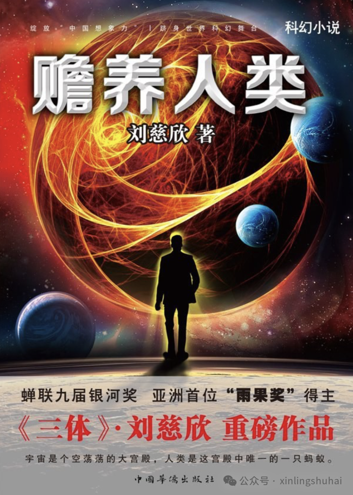
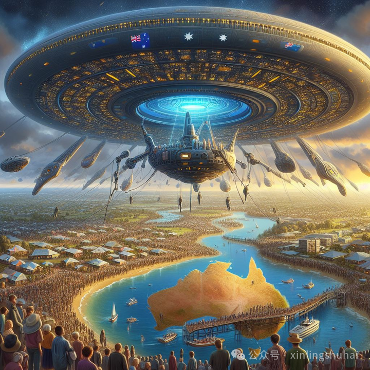

# 无标题

**链接地址:** http://mp.weixin.qq.com/s?__biz=MzA4MTkzMjkzOA==&mid=2454480590&idx=1&sn=efeb7c382de076ce95388b804018d547&chksm=8939f1d16970e36fac3dd06606768076d64a36427fee19823f1176901d3fa9cde52907a83594&mpshare=1&scene=2&srcid=1221PuuiyPAxO6q9Ofx27kz3&sharer_shareinfo=31ac9d2b76cee403b01958ddcf8d58ca&sharer_shareinfo_first=31ac9d2b76cee403b01958ddcf8d58ca#rd
**作者:** 心灵书海
**获取时间:** 2025/8/28 18:50:09
**图片数量:** 2

---

## 原始HTML内容

<blockquote class="js_blockquote_wrap" data-type="2" data-url="" data-author-name="" data-content-utf8-length="188" data-source-title="" data-text="刘慈欣的科幻小说《赡养人类》是一部深刻探讨人类社会结构、经济体系与人性本质的作品。这部小说以一个未来的世界为背景，这个世界中，人类社会的经济体系经历了翻天覆地的变化，贫富差距达到了前所未有的程度。故事的核心围绕着一个名为“社会财富液化委员会”的组织，这个组织拥有着地球上99%的财富，而它的唯一目的就是赡养人类——即维持地球上所有人的基本生活需求，让每个人都能免于饥饿和贫困。" data-editid="ckbbrysv9m3yrt6g3k"><section class="js_blockquote_digest">
刘慈欣的科幻小说《赡养人类》是一部深刻探讨人类社会结构、经济体系与人性本质的作品。这部小说以一个未来的世界为背景，这个世界中，人类社会的经济体系经历了翻天覆地的变化，贫富差距达到了前所未有的程度。故事的核心围绕着一个名为“社会财富液化委员会”的组织，这个组织拥有着地球上99%的财富，而它的唯一目的就是赡养人类——即维持地球上所有人的基本生活需求，让每个人都能免于饥饿和贫困。
</section></blockquote>
 

刘慈欣的科幻小说《赡养人类》描绘了一个未来世界，其中人类正面临着前所未有的挑战，当外星文明的降临改变了地球的命运。故事围绕着一群顶级富豪、一个名为“社会财富液化委员会”的组织、一位职业杀手滑膛，以及他们之间的复杂关系展开，揭示了人性、财富分配与社会正义的深刻议题。 

 

在小说中，哥哥文明的到来如同一记重锤，敲响了人类文明的警钟。这个文明宣称，他们失去了自己的家园，寻求地球作为新的栖息地，而人类则将被迁移至特定的保留地，即澳大利亚，以接受哥哥文明的“赡养”。这意味着人类将不再从事生产活动，生活资料将由哥哥文明提供，并按照最低生活标准平均分配给每一个人，这将导致一个绝对无贫富差距的社会形态。

然而，哥哥文明在实施“赡养”计划前，会进行一次全面的社会普查，以确定人类社会的最低生活标准。这一标准将决定未来每个人的生活配给量。此时，社会财富液化委员会应运而生，这是一个由顶级富豪组成的组织，他们意识到，如果贫富差距过大，那么最低生活标准将会被极度压低，导致人类在保留地的生活质量严重下降。因此，他们启动了“社会财富液化”计划，旨在迅速抹平社会财富的鸿沟，通过将财富散布给最贫穷的人群，提高整体的生活标准，以期在哥哥文明的普查中争取更好的结果。

 

滑膛，一名职业杀手，被卷入了这场财富再分配的漩涡中。他接到了一个不寻常的任务：清除那些拒绝接受财富的穷人。这部分人群，尽管处于极度贫困状态，却拒绝了富豪们提供的援助，他们或是出于对阶级仇恨的坚持，或是对艺术纯粹性的追求，或是单纯享受有钱人求自己的“爽感”，成为了阻碍财富液化计划的障碍。滑膛的任务便是确保这些“异类”不会影响到哥哥文明对人类社会的评估。

 

在执行任务的过程中，滑膛逐渐认识到自己行为的复杂性。他开始思考，如果他是穷人，他是否会拒绝富豪们的援助。小说通过滑膛的视角，展现了人性的多面性和复杂的社会动态。滑膛的内心挣扎反映了作者对社会不公、人性善恶以及人类文明未来走向的深刻思考。

 

小说还涉及了哥哥文明对地球的威慑，他们通过展示强大的武力，如毁灭澳大利亚的行动，迫使人类屈服于他们的安排。这进一步加剧了人类社会的恐慌和不确定性，同时也凸显了哥哥文明对人类命运的掌控力。

 

在小说的结尾，作者并没有给出一个明确的答案，而是留给读者无尽的思考空间。他让我们意识到，无论科技如何进步，人类的精神追求和道德责任永远不会过时。《赡养人类》是一次对未来的深刻展望，也是对当下社会的一次深刻反思，它促使我们思考，在追求物质繁荣的同时，我们是否也应该关注精神层面的成长和人类社会的可持续发展。

 

《赡养人类》不仅是一部科幻作品，更是一次对人类社会、财富分配和人性本质的深度剖析。刘慈欣通过构建一个充满不确定性和挑战的未来世界，激发读者对现实社会问题的反思，探讨了在科技高度发达、外星文明介入的情况下，人类如何应对、如何自处，以及如何在新的社会秩序下寻找自己的位置和价值。这部作品以其独特的视角和深刻的内涵，成为了中国科幻文学中的经典之作。
<blockquote style="padding: 5px 15px;outline: 0px;border-width: 0px;border-style: none;border-color: currentcolor;color: rgb(255, 255, 255);font-size: 12px;letter-spacing: 0.544px;white-space: normal;font-family: Arial, Helvetica, sans-serif;font-weight: bold;border-radius: 5px 5px 0px 0px;background-color: rgb(43, 182, 115);">心灵书海 ：xinlingshuhai</blockquote><blockquote style="padding: 10px 15px 20px;outline: 0px;border-width: 0px;border-style: none;border-color: currentcolor;color: rgb(62, 62, 62);font-size: 12px;letter-spacing: 0.544px;white-space: normal;font-family: Arial, Helvetica, sans-serif;border-radius: 0px 0px 5px 5px;background-color: rgb(239, 239, 239);">
经典书籍、历史、小说……每一天的守候都只为你……

（<em style="outline: 0px;">长按字母</em><em style="outline: 0px;">复制公众</em><em style="outline: 0px;">号添加我们，或点击文章左上方“心灵书海”关注我们</em>）

 
</blockquote>

<mp-style-type data-value="10000"></mp-style-type>

---

## 纯文本内容

刘慈欣的科幻小说《赡养人类》是一部深刻探讨人类社会结构、经济体系与人性本质的作品。这部小说以一个未来的世界为背景，这个世界中，人类社会的经济体系经历了翻天覆地的变化，贫富差距达到了前所未有的程度。故事的核心围绕着一个名为“社会财富液化委员会”的组织，这个组织拥有着地球上99%的财富，而它的唯一目的就是赡养人类——即维持地球上所有人的基本生活需求，让每个人都能免于饥饿和贫困。刘慈欣的科幻小说《赡养人类》描绘了一个未来世界，其中人类正面临着前所未有的挑战，当外星文明的降临改变了地球的命运。故事围绕着一群顶级富豪、一个名为“社会财富液化委员会”的组织、一位职业杀手滑膛，以及他们之间的复杂关系展开，揭示了人性、财富分配与社会正义的深刻议题。在小说中，哥哥文明的到来如同一记重锤，敲响了人类文明的警钟。这个文明宣称，他们失去了自己的家园，寻求地球作为新的栖息地，而人类则将被迁移至特定的保留地，即澳大利亚，以接受哥哥文明的“赡养”。这意味着人类将不再从事生产活动，生活资料将由哥哥文明提供，并按照最低生活标准平均分配给每一个人，这将导致一个绝对无贫富差距的社会形态。然而，哥哥文明在实施“赡养”计划前，会进行一次全面的社会普查，以确定人类社会的最低生活标准。这一标准将决定未来每个人的生活配给量。此时，社会财富液化委员会应运而生，这是一个由顶级富豪组成的组织，他们意识到，如果贫富差距过大，那么最低生活标准将会被极度压低，导致人类在保留地的生活质量严重下降。因此，他们启动了“社会财富液化”计划，旨在迅速抹平社会财富的鸿沟，通过将财富散布给最贫穷的人群，提高整体的生活标准，以期在哥哥文明的普查中争取更好的结果。滑膛，一名职业杀手，被卷入了这场财富再分配的漩涡中。他接到了一个不寻常的任务：清除那些拒绝接受财富的穷人。这部分人群，尽管处于极度贫困状态，却拒绝了富豪们提供的援助，他们或是出于对阶级仇恨的坚持，或是对艺术纯粹性的追求，或是单纯享受有钱人求自己的“爽感”，成为了阻碍财富液化计划的障碍。滑膛的任务便是确保这些“异类”不会影响到哥哥文明对人类社会的评估。在执行任务的过程中，滑膛逐渐认识到自己行为的复杂性。他开始思考，如果他是穷人，他是否会拒绝富豪们的援助。小说通过滑膛的视角，展现了人性的多面性和复杂的社会动态。滑膛的内心挣扎反映了作者对社会不公、人性善恶以及人类文明未来走向的深刻思考。小说还涉及了哥哥文明对地球的威慑，他们通过展示强大的武力，如毁灭澳大利亚的行动，迫使人类屈服于他们的安排。这进一步加剧了人类社会的恐慌和不确定性，同时也凸显了哥哥文明对人类命运的掌控力。在小说的结尾，作者并没有给出一个明确的答案，而是留给读者无尽的思考空间。他让我们意识到，无论科技如何进步，人类的精神追求和道德责任永远不会过时。《赡养人类》是一次对未来的深刻展望，也是对当下社会的一次深刻反思，它促使我们思考，在追求物质繁荣的同时，我们是否也应该关注精神层面的成长和人类社会的可持续发展。《赡养人类》不仅是一部科幻作品，更是一次对人类社会、财富分配和人性本质的深度剖析。刘慈欣通过构建一个充满不确定性和挑战的未来世界，激发读者对现实社会问题的反思，探讨了在科技高度发达、外星文明介入的情况下，人类如何应对、如何自处，以及如何在新的社会秩序下寻找自己的位置和价值。这部作品以其独特的视角和深刻的内涵，成为了中国科幻文学中的经典之作。心灵书海 ：xinlingshuhai经典书籍、历史、小说……每一天的守候都只为你……（长按字母复制公众号添加我们，或点击文章左上方“心灵书海”关注我们）

---

## 图片列表

-  (原始链接: https://mmbiz.qpic.cn/sz_mmbiz_png/C2yhlrvUer8DTSTIFgbSX3YMRJjdhpMrMXnFWAVkwVwJuBUlFHgA9CXtkp4H9P5x05EwIpfPS34HbfiaU6jeZqg/640?wx_fmt=png&from=appmsg)
-  (原始链接: https://mmbiz.qpic.cn/sz_mmbiz_png/C2yhlrvUer8DTSTIFgbSX3YMRJjdhpMrweRialAqGSvKyb1wYQmBhgATz1OABF4g0G7g36emIFFO0mdibDeo2zzg/640?wx_fmt=png&from=appmsg)
