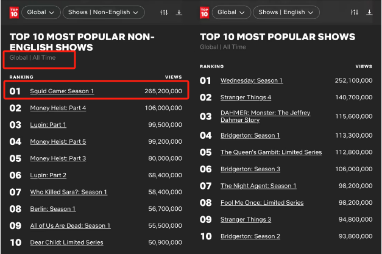
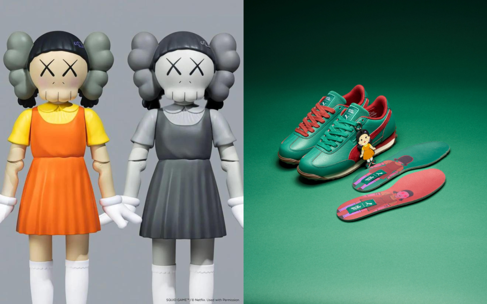
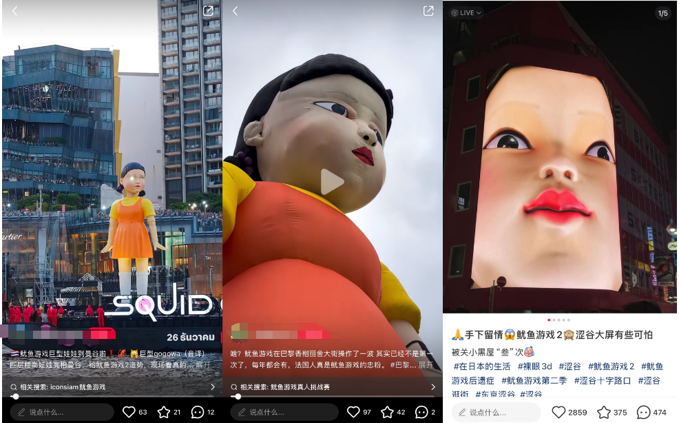
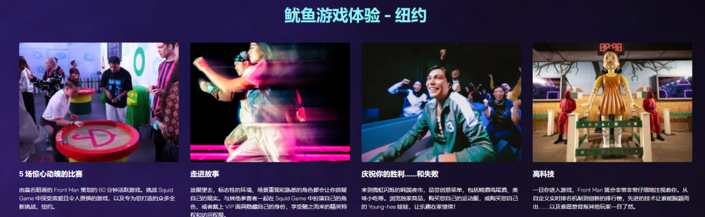
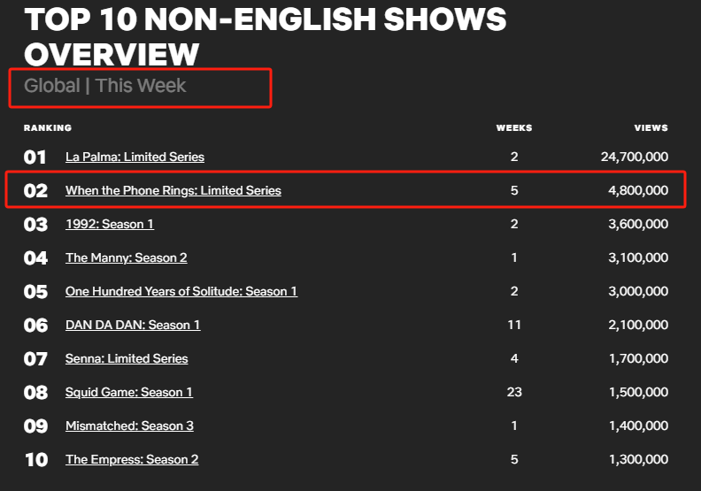

# 无标题

**链接地址:** http://mp.weixin.qq.com/s?__biz=MzU2MDQwOTc2Mw==&mid=2247575920&idx=1&sn=77408228001104754805cbc2d876273a&chksm=fdb2d1468a8d9bf771b6175da427cf5f69738cd8e6420fb6062e113aa26370d8dca1169bbea7&mpshare=1&scene=2&srcid=1231hCEnQna1DNcE58DMXYmw&sharer_shareinfo=d9c940ff93ae6d5e232eaec3290a11b8&sharer_shareinfo_first=d9c940ff93ae6d5e232eaec3290a11b8#rd
**作者:** 蓝鲸
**获取时间:** 2025/8/28 18:49:45
**图片数量:** 7

---

## 原始HTML内容

<section style="font-size: 15px;color: rgb(62, 62, 62);"><section style="text-align: center;margin-top: 10px;margin-bottom: 10px;line-height: 0;"><section style="vertical-align: middle;display: inline-block;line-height: 0;"></section></section>

<section style="letter-spacing: 0.5px;line-height: 1.8;">
<strong>蓝鲸新闻12月27日讯（记者 汤诗韵）</strong>时隔三年，王炸韩剧《鱿鱼游戏》第二季终于上线。该剧集前作一度风靡全球，打破了Netflix史上观看纪录。如今续作回归，绿色运动服、巨型洋娃娃等剧集元素会再次走红全网吗？

 

<strong>新剧开播：豆瓣评分6.7，前作仍是网飞观看量之最</strong>

 

12月26日下午4点，《鱿鱼游戏》第二季（以下简称《鱿鱼游戏2》）正式揭开神秘面纱。剧集一次性放出全部7集，据悉第三季也已拍完，暂定2025年开播。本月月初，<strong>尚未正式播出的《鱿鱼游戏2》入围金球奖剧情类最佳剧集</strong>。

 

新一季故事从前作结尾续写，主人公成奇勋在获得456亿韩元巨额奖金之后再度投身这场生存游戏，决心找出幕后黑手复仇。事实上，《鱿鱼游戏》并不是一个多么新奇的故事，沿用的是《大逃杀》等作品的基础设置，剧中游戏关卡也被质疑抄袭融梗《赌博默示录》《弥留之国的爱丽丝》。但该剧胜在玩法简单、视觉冲击力大，社会经济问题等隐喻也能引起不同国家观众的共鸣。开播不到四周，《鱿鱼游戏》观看量破亿刷新平台纪录。

 

直到现在，<strong>《鱿鱼游戏》仍然连续23周霸榜Netflix非英语剧集周榜前十。截至目前，《鱿鱼游戏》第一季累积观看量超2.65亿，是全平台观看量最高的剧</strong>。

 

 

前述辉煌成绩为第二季带来了充足资金和资源。除第一季主创悉数回归外，还有朴珪瑛、任时完、姜河那、曹柔理等数位年轻的知名演员及流量明星加盟。导演黄东赫曾在受访时表示这是刻意为之的设计，“第一季中可以看到参加游戏的年轻人并不多。因为在我最初撰写剧本时，年轻一代不太会背负巨额债务。然而这些年韩国就业现状低迷，再加上人们对加密货币的狂热，导致许多人年纪轻轻就深陷债务危机。”

 

从上线时间设定上，也能看出Netflix对《鱿鱼游戏2》的重视和偏爱。Netflix直播美国职业橄榄球大联盟（NFL）比赛首秀的次日，《鱿鱼游戏2》上线播出。

 

截至发稿，<strong>《鱿鱼游戏2》的烂番茄新鲜度为86%，代表观众评分的爆米花指数显示为63%。</strong>此外，该剧在豆瓣也已开分6.7，远不及前作开播时的8.7分。剧集刚刚上线，更多观众尚未进场，《鱿鱼游戏2》的市场表现还有待观望。

 

<strong>高调营销：巨型娃娃现身多地，29美元门票体验线下“鱿鱼游戏”</strong>

 

延续第一部的漫天营销策略，《鱿鱼游戏2》的回归颇为高调。

 

2021年9月，《鱿鱼游戏》播出后曾掀起广泛的带货风潮，模仿剧中人物的装扮预计成为当年圣诞节人气最高的造型。受前作影响，新一季播出前各种联名合作已陆续开启。据蓝鲸记者不完全统计，711、麦当劳、PUMA、Crocs、Vandy the Pink、Kaws等均推出了联名产品，品类覆盖饮食、鞋服、潮玩等。

 

 

宣传方面，《鱿鱼游戏2》可谓声势浩大。12月23日凌晨，英超第17轮热刺坐镇主场对阵利物浦的比赛中场休息时，剧中的红衣人出现在热刺主场看台上。此外，曼谷、巴黎、吉隆坡、涩谷等地都出现了巨型英熙娃娃的装置大屏等。

 

 

巨大的商业价值诱惑下，《鱿鱼游戏》已衍生出真人秀、手游、线下体验等项目。在纽约的曼哈顿购物中心，<strong>Netflix推出的《鱿鱼游戏》线下体验目前已开放售票。官网显示，普通门票最低29美元起，其他两类VIP门票分别需要45、69美元起</strong>。包括儿童在内的体验者可以经历5场挑战，感受鱿鱼游戏的场景环境。

 

 

<strong>网飞和它的“鱿鱼游戏们”：9亿美元利润之外，重金投入韩国内容</strong>

 

爆剧效应对平台营收的用户订阅数量的带动颇为明显。以《鱿鱼游戏》为例，该剧热播使得Netflix当年第三季度全球新增付费用户人数同比翻倍，达438万。据财联社援引Netflix文件数据报道，<strong>《鱿鱼游戏》第一季预估为Netflix带来近9亿美元的价值。而与预估价值相比，这部剧的制作成本仅有2140万美元，投资回报巨大</strong>。

 

《鱿鱼游戏》的风靡全球，也让国际市场看到了韩剧的巨大潜力。据1905电影网报道，Netfilx于2023年4月宣布将在未来四年向韩国影视业投资25亿美元（约合人民币173亿人民币），用于制作韩国电视剧、电影和综艺节目，这笔投资已达到网飞进驻韩国市场以来累计投资额的两倍。

 

自2019年的《王国》以后，Netflix逐渐摸索到了爆款韩剧的方法论。随后，《鱿鱼游戏》《黑暗荣耀》《眼泪女王》等游戏接连成为现象级作品。<strong>近日还有一部韩剧《现在拨打的电话》连续5周进入Netflix周榜前十，本周观看量超480万。</strong>

 

 

Netflix重金投入韩国内容，是其全球战略的一部分。Netflix今年三季度的财报显示，公司第三季度营业收入为98.25亿美元，同比增长15%，净利润23.64亿美元，同比提升41%。三季度，Netflix在最大市场美国和加拿大的付费用户增长逊于预期。<strong>但亚太地区的付费用户净增长数量同比增长21%、营收增长19%，亚太依然是Netflix用户和收入增幅最大的市场</strong>。

 

26日，Netflix的股价小幅下跌，收报924.14美元/股。年初至今，Netflix的股价涨幅已超90%。

 
</section><section style="text-align: center;margin-top: 10px;margin-bottom: 10px;line-height: 0;"><section style="vertical-align: middle;display: inline-block;line-height: 0;"></section></section></section>
<mp-style-type data-value="3"></mp-style-type>

---

## 纯文本内容

蓝鲸新闻12月27日讯（记者 汤诗韵）时隔三年，王炸韩剧《鱿鱼游戏》第二季终于上线。该剧集前作一度风靡全球，打破了Netflix史上观看纪录。如今续作回归，绿色运动服、巨型洋娃娃等剧集元素会再次走红全网吗？新剧开播：豆瓣评分6.7，前作仍是网飞观看量之最12月26日下午4点，《鱿鱼游戏》第二季（以下简称《鱿鱼游戏2》）正式揭开神秘面纱。剧集一次性放出全部7集，据悉第三季也已拍完，暂定2025年开播。本月月初，尚未正式播出的《鱿鱼游戏2》入围金球奖剧情类最佳剧集。新一季故事从前作结尾续写，主人公成奇勋在获得456亿韩元巨额奖金之后再度投身这场生存游戏，决心找出幕后黑手复仇。事实上，《鱿鱼游戏》并不是一个多么新奇的故事，沿用的是《大逃杀》等作品的基础设置，剧中游戏关卡也被质疑抄袭融梗《赌博默示录》《弥留之国的爱丽丝》。但该剧胜在玩法简单、视觉冲击力大，社会经济问题等隐喻也能引起不同国家观众的共鸣。开播不到四周，《鱿鱼游戏》观看量破亿刷新平台纪录。直到现在，《鱿鱼游戏》仍然连续23周霸榜Netflix非英语剧集周榜前十。截至目前，《鱿鱼游戏》第一季累积观看量超2.65亿，是全平台观看量最高的剧。前述辉煌成绩为第二季带来了充足资金和资源。除第一季主创悉数回归外，还有朴珪瑛、任时完、姜河那、曹柔理等数位年轻的知名演员及流量明星加盟。导演黄东赫曾在受访时表示这是刻意为之的设计，“第一季中可以看到参加游戏的年轻人并不多。因为在我最初撰写剧本时，年轻一代不太会背负巨额债务。然而这些年韩国就业现状低迷，再加上人们对加密货币的狂热，导致许多人年纪轻轻就深陷债务危机。”从上线时间设定上，也能看出Netflix对《鱿鱼游戏2》的重视和偏爱。Netflix直播美国职业橄榄球大联盟（NFL）比赛首秀的次日，《鱿鱼游戏2》上线播出。截至发稿，《鱿鱼游戏2》的烂番茄新鲜度为86%，代表观众评分的爆米花指数显示为63%。此外，该剧在豆瓣也已开分6.7，远不及前作开播时的8.7分。剧集刚刚上线，更多观众尚未进场，《鱿鱼游戏2》的市场表现还有待观望。高调营销：巨型娃娃现身多地，29美元门票体验线下“鱿鱼游戏”延续第一部的漫天营销策略，《鱿鱼游戏2》的回归颇为高调。2021年9月，《鱿鱼游戏》播出后曾掀起广泛的带货风潮，模仿剧中人物的装扮预计成为当年圣诞节人气最高的造型。受前作影响，新一季播出前各种联名合作已陆续开启。据蓝鲸记者不完全统计，711、麦当劳、PUMA、Crocs、Vandy the Pink、Kaws等均推出了联名产品，品类覆盖饮食、鞋服、潮玩等。宣传方面，《鱿鱼游戏2》可谓声势浩大。12月23日凌晨，英超第17轮热刺坐镇主场对阵利物浦的比赛中场休息时，剧中的红衣人出现在热刺主场看台上。此外，曼谷、巴黎、吉隆坡、涩谷等地都出现了巨型英熙娃娃的装置大屏等。巨大的商业价值诱惑下，《鱿鱼游戏》已衍生出真人秀、手游、线下体验等项目。在纽约的曼哈顿购物中心，Netflix推出的《鱿鱼游戏》线下体验目前已开放售票。官网显示，普通门票最低29美元起，其他两类VIP门票分别需要45、69美元起。包括儿童在内的体验者可以经历5场挑战，感受鱿鱼游戏的场景环境。网飞和它的“鱿鱼游戏们”：9亿美元利润之外，重金投入韩国内容爆剧效应对平台营收的用户订阅数量的带动颇为明显。以《鱿鱼游戏》为例，该剧热播使得Netflix当年第三季度全球新增付费用户人数同比翻倍，达438万。据财联社援引Netflix文件数据报道，《鱿鱼游戏》第一季预估为Netflix带来近9亿美元的价值。而与预估价值相比，这部剧的制作成本仅有2140万美元，投资回报巨大。《鱿鱼游戏》的风靡全球，也让国际市场看到了韩剧的巨大潜力。据1905电影网报道，Netfilx于2023年4月宣布将在未来四年向韩国影视业投资25亿美元（约合人民币173亿人民币），用于制作韩国电视剧、电影和综艺节目，这笔投资已达到网飞进驻韩国市场以来累计投资额的两倍。自2019年的《王国》以后，Netflix逐渐摸索到了爆款韩剧的方法论。随后，《鱿鱼游戏》《黑暗荣耀》《眼泪女王》等游戏接连成为现象级作品。近日还有一部韩剧《现在拨打的电话》连续5周进入Netflix周榜前十，本周观看量超480万。Netflix重金投入韩国内容，是其全球战略的一部分。Netflix今年三季度的财报显示，公司第三季度营业收入为98.25亿美元，同比增长15%，净利润23.64亿美元，同比提升41%。三季度，Netflix在最大市场美国和加拿大的付费用户增长逊于预期。但亚太地区的付费用户净增长数量同比增长21%、营收增长19%，亚太依然是Netflix用户和收入增幅最大的市场。26日，Netflix的股价小幅下跌，收报924.14美元/股。年初至今，Netflix的股价涨幅已超90%。

---

## 图片列表

-  (原始链接: https://mmbiz.qpic.cn/mmbiz_png/iaGzATKMndEeoNrLIiaJDERicPefNWibOpiaBVLJVvGLsC5aOwdGTO620R8xRnKccRVcPcKpYiagTVYLvaHxvcwTSlgg/640?wx_fmt=png&from=appmsg)
-  (原始链接: https://mmbiz.qpic.cn/mmbiz_png/iaGzATKMndEeoNrLIiaJDERicPefNWibOpiaB9icxeCxOJw30EkNYTPMvhiaEABVp4iayMabpIVLVoOsibubBMqJkvsL2Sw/640?wx_fmt=png&from=appmsg)
-  (原始链接: https://mmbiz.qpic.cn/mmbiz_png/iaGzATKMndEeoNrLIiaJDERicPefNWibOpiaBSqm71VOWudCStcJa7JMTOXd2NMEpqLAHa4nchicVVuyGMbazkdUUicqQ/640?wx_fmt=png&from=appmsg)
-  (原始链接: https://mmbiz.qpic.cn/mmbiz_png/iaGzATKMndEeoNrLIiaJDERicPefNWibOpiaBdCflUuJBoVlDRkMmEmNtrZh4qYq43HcZQK9LcfhOE7C76ib9Ss7aaLg/640?wx_fmt=png&from=appmsg)
-  (原始链接: https://mmbiz.qpic.cn/mmbiz_png/iaGzATKMndEeoNrLIiaJDERicPefNWibOpiaBwgPx2q7fmEibiavHk0PHfhficjZntoXLA5WCszmkaphopFXGDudFw0kEA/640?wx_fmt=png&from=appmsg)
-  (原始链接: https://mmbiz.qpic.cn/mmbiz_png/iaGzATKMndEeoNrLIiaJDERicPefNWibOpiaB1NdONPRtl8EhMNkicjg61tZsUuPQvXxPlWCibzNpcRiba8BWwq7VnE8Nw/640?wx_fmt=png&from=appmsg)
-  (原始链接: https://mmbiz.qpic.cn/mmbiz_png/iaGzATKMndEeoNrLIiaJDERicPefNWibOpiaB2Wuh5eWEyus24GtSzzrPReBh9udea94jjrBlqbJXPnZh3yDKDsveLg/640?wx_fmt=png&from=appmsg)
