# 无标题

**链接地址:** http://mp.weixin.qq.com/s?__biz=MzIzNTE2MjQ3NA==&mid=2649311511&idx=1&sn=223104ec17457505676bec7f35c439c7&chksm=f1de0a72473ea993d6f172949f9d156196fb458f64573599c003b3b45b82fb6b22a28cb3a051&mpshare=1&scene=2&srcid=0123NOq12MPa9yxTuE5hvD5n&sharer_shareinfo=f566108c7d813c3dcb92e128ffe861d6&sharer_shareinfo_first=f566108c7d813c3dcb92e128ffe861d6#rd
**作者:** 电影美剧大爆炸
**获取时间:** 2025/8/28 18:48:03
**图片数量:** 15

---

## 原始HTML内容

最近男性观众，是不是挺无聊的。

在于和伟的《我是刑警》和张颂文的《清明上河图密码》播完之后，接档的三部古装偶像剧，都非男性观众首选。

一部是王鹤棣的《大奉打更人》；一部是白鹿的《白月梵星》；还有一部是杨紫的《国色芳华》，说到底，这些几乎都是为女性观众准备的。

不过，男性观众也不要气馁，马上来了两部大剧，有一部一定符合您的胃口，分别为彭昱畅的《异人之下第二季决战！碧游村》和郭京飞、王千源主演的《漂白》。

今天，啡哥就和大家一起谈谈迷雾剧场最新刑侦剧《漂白》。

<strong>一、首播杀疯了。</strong>

话说，接档的几部剧中，《大奉打更人》和《白月梵星》的口碑都崩塌了，豆瓣评分都在6分以下，处于不及格状态，也只有《国色芳华》能扛住播放量和收视率。

《漂白》选择在春节档之前开画，和之前张颂文的《狂飙》档期差不多，就想依靠春节期间把口碑散发出去，从而引爆整个网络。

从首播三集观众反馈来看，虽然达不到现象级，但整体剧情架构还是能够吸引观众的，<strong>首播杀疯了有两层解释意思。</strong>

<strong>第一层是热度杀疯了。</strong>

《漂白》这部剧几乎没有宣发，直接上线了，而且还放在迷雾剧场中和观众见面，相信制片方对这部剧是有底气的。

果不其然，此剧上线之后，热度从6000不到，直线攀升至8000，仅次于《白月梵星》，并同时拿到了电视剧飙升榜冠军。

与此同时，“漂白首播杀疯了”和“王千源不像演的”等相关热搜出炉，很多观众被吸引，加入了观剧之中，热度节节攀升，相信发酵之后，还能吸引更多的潜在观剧人群。

<strong>第二层是剧情杀疯了。</strong>

此剧首播前两集节奏很快，故事发生在2002年雪城，当然了，这是一个虚构的地名。

分支线分成两条，一条是郭京飞饰演的刑警队长彭兆林，另外一条线是王千源饰演的嫌疑人邓立钢。

与传统的悬疑剧有很大区别，这个案件开头就告知了四名凶手，放弃了故弄玄虚那一套，走的是《我是刑警》写实路线，玩的就是“猫鼠游戏”。

邓立钢带领的四人组在雪城犯下了一起命案，其中一名女性在娱乐场所物色了两名坐台女郎，并引诱至他们租住的房屋内。

另外三名凶手通过敲诈勒索的方式，让受害者交出钱财，之后再被灭口，用了极其残忍的“毁尸灭迹”的方式让两名女孩人间蒸发，妄想逃脱追捕。

在处理受害者的时候，由于“碎肉”太多阻塞了下水道，楼下的用户找管道疏通工人，在坐便器内掏出了人体组织，随即案发。

彭兆林到了案发现场，与凶手邓立钢有过一面之缘，猫鼠游戏就此开始。

《漂白》首播第一集，还是不错的，主打猎奇和大尺度，一下就吊足了观众的胃口，尤其男性观众，对于此类刑侦题材毫无免疫力。

<strong>二、原型案件为杨树彬911案。</strong>

不过，现在的观众也不是那么好糊弄的，质量高不高，一眼便能看出端倪。

几乎所有的观众都把焦点聚集在案发现场。比如说，现场该拉的封锁警戒线没有，凶手邓立钢还能进入那栋楼，拿回租住房间内的钱财和物品。

彭兆林上楼的时候碰到邓立钢，仅凭几句话就轻易放走了他，到了楼下扔垃圾，也没有人去盘问，路口拦截车辆排查，单单放跑了这四个人。

很多观众说，AI都写不出来这样的剧本，其实不然，此剧是根据真实事件改编的，原型便是2002年的杨树彬911案。

杨树彬凶残还具有极强的反侦察能力，他在多次犯案之后，还能卷土重来，用第三集中的话来说：“我们就重新开张吧！”

其实杨树彬案是这样的，剧中四名凶手分别对应了真实案件中的杨树彬、戢红杰、张玉良、吴宏业。

1993年1月7日，杨树彬首次犯案，他和两个朋友在哈尔滨市通江街116号台球室内，与他人发生纠纷，因打架斗殴将一人刺死，两人刺伤。

两名同伙被抓，分别被判处无期徒刑和12年的有期徒刑，杨树彬趁机潜逃，但在潜逃的五年中，每年都会想方设法和母亲过年。

在这期间，他遇到了臭味相投的王世波，两人相约去广州捞钱，他们认为打工来钱太慢，遂将目标定在从事特殊行业女性身上，也就是抢劫坐台女郎。

1998年，杨树彬和王世波在广东佛山顺德区，开始实施系列绑架抢劫案，刚开始以谋财为主，没想要她们的命。

可第一起案件就翻车了，警方通过女孩和房东，抓到了同伙王世波，此后他便改变了做法，钱到手之后，必须灭口。

王世波折戟在狱中，杨树彬回到哈尔滨找到了发小张玉良，想要东山再起，这次他们跑到深圳继续作案，在这个过程中结识了坐台女戢红杰。

2000年，他们在深圳作案多起，一人负责钓鱼，一人负责撬开女孩的嘴，拿到钱，一人负责毁尸灭迹。

2002年，他们来到吉林，杨树彬又拉来了曾经的同事吴宏业入伙，准备做大做强，《漂白》第一集的案件便是吉林911案。

和剧中一样，现场遗留的驾驶证，还有租房信息等，让他们的身份信息完全暴露了。

但凶残的杨树彬一行人并没有收手的意思，稍作休整，他们又在浙江台州和嘉兴各作案两起。

从2000年到2003年，他们一共灭口了10个女孩，共抢得200万现金。

最匪夷所思的是他们竟然在别处把身份全部洗白了。

2003年，杨树彬带着他们和家属转移身份到山西后迁到包头，杨树彬变成了富豪，开了两间台球室和一家足疗馆，戢红杰成了他的妻子，两人还生育了孩子。

一个在当地成家，还开保健磁疗店，顺便做话费充值业务，另一个在挖煤。

2011年11月份收网。2016年，两名罪犯被执行死刑，有一个在看守所得癌症死了，女的被判无期徒刑。

以上便是轰动全国的杨树彬案。

《漂白》并不是悬疑剧，而是讲述了四人犯案后的漂白过程！

<strong>三、王千源回到舒适区，不像演的，建议查查。</strong>

有些演员天生就是一副坏人脸，如《狂飙》中的阿如那，《无证之罪》里的李丰田扮演者宁理，大反派计春华等。

说起王千源，大家不约而同的会说，外形方面一看就不是一个好人，可能王千源是想挑战自己吧，近年来，他所饰演的角色大都为正派警察形象。

可让人记住的角色还是当年那部和刘德华主演的《解救吾先生》。

王千源的演技让人感觉非常自然，他的眼神、语调、肢体动作都能够精准地传达角色内心的挣扎和情感。

他不仅仅是一个简单的坏蛋，而是把反派角色的背后故事与心理刻画得非常细腻。这让观众在愤怒和不安之余，甚至对他的经历产生了某种程度上的理解和同情。

特别是“悍匪”张华与刘德华的对峙场景中，王千源展现了他独特的魅力，让观众能感受到那种紧迫感和心理游戏的较量。

整场戏的氛围几乎让人屏息，想知道他们接下来会如何发展。而这种能力，只有真正懂得角色的人才能做到。

《漂白》一开播，我就忍不住要跟大家聊聊王千源的表现。这家伙真的是回到了他的舒适区，仿佛又回到了那个充满阴暗与纷争的犯罪世界。

在《漂白》中，王千源再次挑战大反派的角色，他的表现可以说是游刃有余。第二集一句“我爱你”，让同伴瑟瑟发抖，令人不寒而栗。

他的演技简直炉火纯青，似乎越是坏蛋，越能让他发挥自如，完全让人忘了这是在演戏，感觉他本身就是那个反派角色。

<strong>观众直呼：不像演的，建议查查！</strong>

说到底，能把坏蛋演得这样入木三分的演员并不多，王千源算得上千面影帝了。

 &nbsp;

<strong>四、结语。</strong>

《漂白》在我看来还是不够完美，比如说第三集出现的第三条线，赵今麦饰演的甄珍刻画过多，大篇幅的校园霸凌和对原生家庭的叛逆，与整体故事格格不入。

想要做成精品，剪辑取舍得把控好。

好了，今天就和大家聊到这了，对于这部剧，您认为如何？

 

<mp-style-type data-value="3"></mp-style-type>

---

## 纯文本内容

最近男性观众，是不是挺无聊的。在于和伟的《我是刑警》和张颂文的《清明上河图密码》播完之后，接档的三部古装偶像剧，都非男性观众首选。一部是王鹤棣的《大奉打更人》；一部是白鹿的《白月梵星》；还有一部是杨紫的《国色芳华》，说到底，这些几乎都是为女性观众准备的。不过，男性观众也不要气馁，马上来了两部大剧，有一部一定符合您的胃口，分别为彭昱畅的《异人之下第二季决战！碧游村》和郭京飞、王千源主演的《漂白》。今天，啡哥就和大家一起谈谈迷雾剧场最新刑侦剧《漂白》。一、首播杀疯了。话说，接档的几部剧中，《大奉打更人》和《白月梵星》的口碑都崩塌了，豆瓣评分都在6分以下，处于不及格状态，也只有《国色芳华》能扛住播放量和收视率。《漂白》选择在春节档之前开画，和之前张颂文的《狂飙》档期差不多，就想依靠春节期间把口碑散发出去，从而引爆整个网络。从首播三集观众反馈来看，虽然达不到现象级，但整体剧情架构还是能够吸引观众的，首播杀疯了有两层解释意思。第一层是热度杀疯了。《漂白》这部剧几乎没有宣发，直接上线了，而且还放在迷雾剧场中和观众见面，相信制片方对这部剧是有底气的。果不其然，此剧上线之后，热度从6000不到，直线攀升至8000，仅次于《白月梵星》，并同时拿到了电视剧飙升榜冠军。与此同时，“漂白首播杀疯了”和“王千源不像演的”等相关热搜出炉，很多观众被吸引，加入了观剧之中，热度节节攀升，相信发酵之后，还能吸引更多的潜在观剧人群。第二层是剧情杀疯了。此剧首播前两集节奏很快，故事发生在2002年雪城，当然了，这是一个虚构的地名。分支线分成两条，一条是郭京飞饰演的刑警队长彭兆林，另外一条线是王千源饰演的嫌疑人邓立钢。与传统的悬疑剧有很大区别，这个案件开头就告知了四名凶手，放弃了故弄玄虚那一套，走的是《我是刑警》写实路线，玩的就是“猫鼠游戏”。邓立钢带领的四人组在雪城犯下了一起命案，其中一名女性在娱乐场所物色了两名坐台女郎，并引诱至他们租住的房屋内。另外三名凶手通过敲诈勒索的方式，让受害者交出钱财，之后再被灭口，用了极其残忍的“毁尸灭迹”的方式让两名女孩人间蒸发，妄想逃脱追捕。在处理受害者的时候，由于“碎肉”太多阻塞了下水道，楼下的用户找管道疏通工人，在坐便器内掏出了人体组织，随即案发。彭兆林到了案发现场，与凶手邓立钢有过一面之缘，猫鼠游戏就此开始。《漂白》首播第一集，还是不错的，主打猎奇和大尺度，一下就吊足了观众的胃口，尤其男性观众，对于此类刑侦题材毫无免疫力。二、原型案件为杨树彬911案。不过，现在的观众也不是那么好糊弄的，质量高不高，一眼便能看出端倪。几乎所有的观众都把焦点聚集在案发现场。比如说，现场该拉的封锁警戒线没有，凶手邓立钢还能进入那栋楼，拿回租住房间内的钱财和物品。彭兆林上楼的时候碰到邓立钢，仅凭几句话就轻易放走了他，到了楼下扔垃圾，也没有人去盘问，路口拦截车辆排查，单单放跑了这四个人。很多观众说，AI都写不出来这样的剧本，其实不然，此剧是根据真实事件改编的，原型便是2002年的杨树彬911案。杨树彬凶残还具有极强的反侦察能力，他在多次犯案之后，还能卷土重来，用第三集中的话来说：“我们就重新开张吧！”其实杨树彬案是这样的，剧中四名凶手分别对应了真实案件中的杨树彬、戢红杰、张玉良、吴宏业。1993年1月7日，杨树彬首次犯案，他和两个朋友在哈尔滨市通江街116号台球室内，与他人发生纠纷，因打架斗殴将一人刺死，两人刺伤。两名同伙被抓，分别被判处无期徒刑和12年的有期徒刑，杨树彬趁机潜逃，但在潜逃的五年中，每年都会想方设法和母亲过年。在这期间，他遇到了臭味相投的王世波，两人相约去广州捞钱，他们认为打工来钱太慢，遂将目标定在从事特殊行业女性身上，也就是抢劫坐台女郎。1998年，杨树彬和王世波在广东佛山顺德区，开始实施系列绑架抢劫案，刚开始以谋财为主，没想要她们的命。可第一起案件就翻车了，警方通过女孩和房东，抓到了同伙王世波，此后他便改变了做法，钱到手之后，必须灭口。王世波折戟在狱中，杨树彬回到哈尔滨找到了发小张玉良，想要东山再起，这次他们跑到深圳继续作案，在这个过程中结识了坐台女戢红杰。2000年，他们在深圳作案多起，一人负责钓鱼，一人负责撬开女孩的嘴，拿到钱，一人负责毁尸灭迹。2002年，他们来到吉林，杨树彬又拉来了曾经的同事吴宏业入伙，准备做大做强，《漂白》第一集的案件便是吉林911案。和剧中一样，现场遗留的驾驶证，还有租房信息等，让他们的身份信息完全暴露了。但凶残的杨树彬一行人并没有收手的意思，稍作休整，他们又在浙江台州和嘉兴各作案两起。从2000年到2003年，他们一共灭口了10个女孩，共抢得200万现金。最匪夷所思的是他们竟然在别处把身份全部洗白了。2003年，杨树彬带着他们和家属转移身份到山西后迁到包头，杨树彬变成了富豪，开了两间台球室和一家足疗馆，戢红杰成了他的妻子，两人还生育了孩子。一个在当地成家，还开保健磁疗店，顺便做话费充值业务，另一个在挖煤。2011年11月份收网。2016年，两名罪犯被执行死刑，有一个在看守所得癌症死了，女的被判无期徒刑。以上便是轰动全国的杨树彬案。《漂白》并不是悬疑剧，而是讲述了四人犯案后的漂白过程！三、王千源回到舒适区，不像演的，建议查查。有些演员天生就是一副坏人脸，如《狂飙》中的阿如那，《无证之罪》里的李丰田扮演者宁理，大反派计春华等。说起王千源，大家不约而同的会说，外形方面一看就不是一个好人，可能王千源是想挑战自己吧，近年来，他所饰演的角色大都为正派警察形象。可让人记住的角色还是当年那部和刘德华主演的《解救吾先生》。王千源的演技让人感觉非常自然，他的眼神、语调、肢体动作都能够精准地传达角色内心的挣扎和情感。他不仅仅是一个简单的坏蛋，而是把反派角色的背后故事与心理刻画得非常细腻。这让观众在愤怒和不安之余，甚至对他的经历产生了某种程度上的理解和同情。特别是“悍匪”张华与刘德华的对峙场景中，王千源展现了他独特的魅力，让观众能感受到那种紧迫感和心理游戏的较量。整场戏的氛围几乎让人屏息，想知道他们接下来会如何发展。而这种能力，只有真正懂得角色的人才能做到。《漂白》一开播，我就忍不住要跟大家聊聊王千源的表现。这家伙真的是回到了他的舒适区，仿佛又回到了那个充满阴暗与纷争的犯罪世界。在《漂白》中，王千源再次挑战大反派的角色，他的表现可以说是游刃有余。第二集一句“我爱你”，让同伴瑟瑟发抖，令人不寒而栗。他的演技简直炉火纯青，似乎越是坏蛋，越能让他发挥自如，完全让人忘了这是在演戏，感觉他本身就是那个反派角色。观众直呼：不像演的，建议查查！说到底，能把坏蛋演得这样入木三分的演员并不多，王千源算得上千面影帝了。  四、结语。《漂白》在我看来还是不够完美，比如说第三集出现的第三条线，赵今麦饰演的甄珍刻画过多，大篇幅的校园霸凌和对原生家庭的叛逆，与整体故事格格不入。想要做成精品，剪辑取舍得把控好。好了，今天就和大家聊到这了，对于这部剧，您认为如何？

---

## 图片列表

- 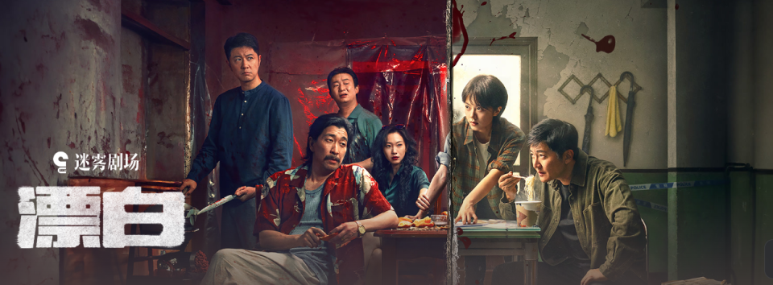 (原始链接: https://mmbiz.qpic.cn/sz_mmbiz_png/S5Y644UatVw4SZQHkv280y6vLT1XR2W6Ugfhx2kFZmaFcfiaAA31ofKMZDAyNhBs6ZE30YUMe3W2cM0O1h5Y3EQ/640?wx_fmt=png&from=appmsg)
- 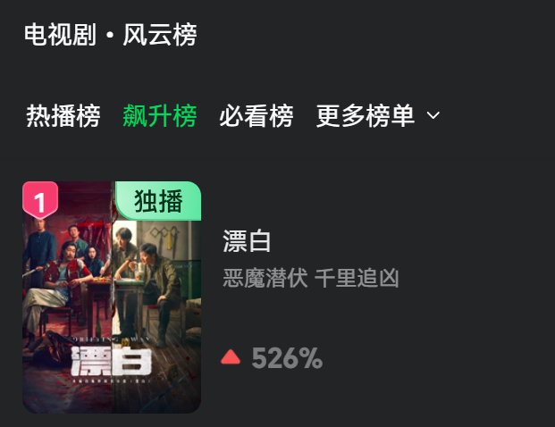 (原始链接: https://mmbiz.qpic.cn/sz_mmbiz_png/S5Y644UatVw4SZQHkv280y6vLT1XR2W6y9Lw3UL16xanQRmoFMco5duRrY0MkkbJ0xy26CJqFicPY0GIiaJOEnlw/640?wx_fmt=png&from=appmsg)
- 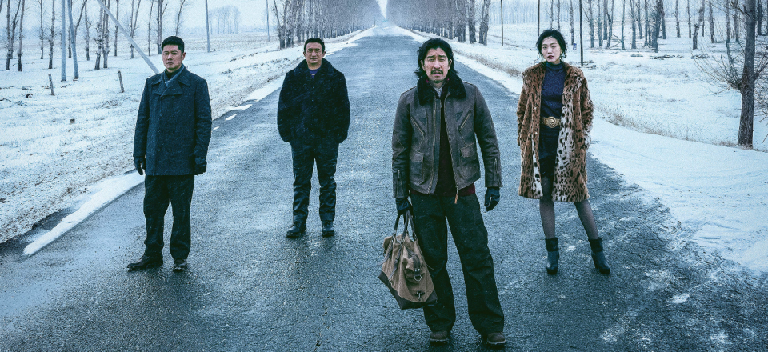 (原始链接: https://mmbiz.qpic.cn/sz_mmbiz_png/S5Y644UatVw4SZQHkv280y6vLT1XR2W6CgQad1WiaDtSmYZ1ZTKRQFoZx6QcMGlszBPGZXibfiae1bVGeaOaxVwag/640?wx_fmt=png&from=appmsg)
- 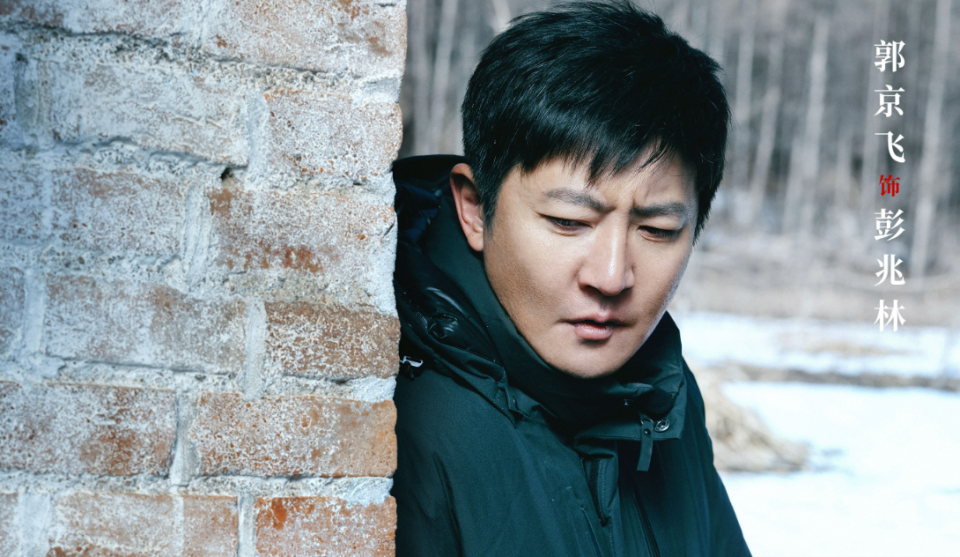 (原始链接: https://mmbiz.qpic.cn/sz_mmbiz_png/S5Y644UatVw4SZQHkv280y6vLT1XR2W6lfic09dGrHFlKYPwVm4L94Bw7QDIYDiatkicHYBS4pg8PL77icqETPGOdg/640?wx_fmt=png&from=appmsg)
-  (原始链接: https://mmbiz.qpic.cn/sz_mmbiz_jpg/S5Y644UatVw4SZQHkv280y6vLT1XR2W6G7Jhe2UvwfVUkNZQo19T30l6F7PKRrbfiaZSfSYGyUzjq1AczsNxAKg/640?wx_fmt=jpeg&from=appmsg)
- 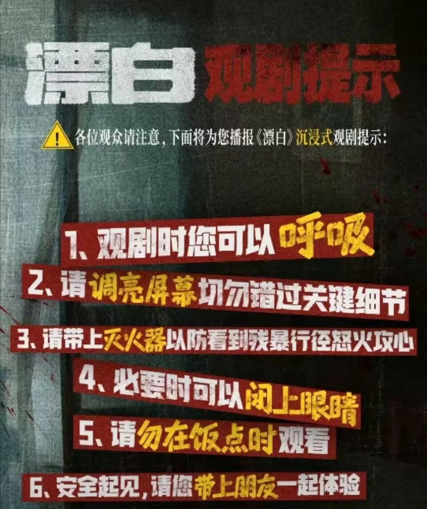 (原始链接: https://mmbiz.qpic.cn/sz_mmbiz_jpg/S5Y644UatVw4SZQHkv280y6vLT1XR2W6wttQfQEM1t1JCXomQ4Gzmdxexel57MfQURp4ibVq0So3Gt44p0BQibTw/640?wx_fmt=jpeg&from=appmsg)
- 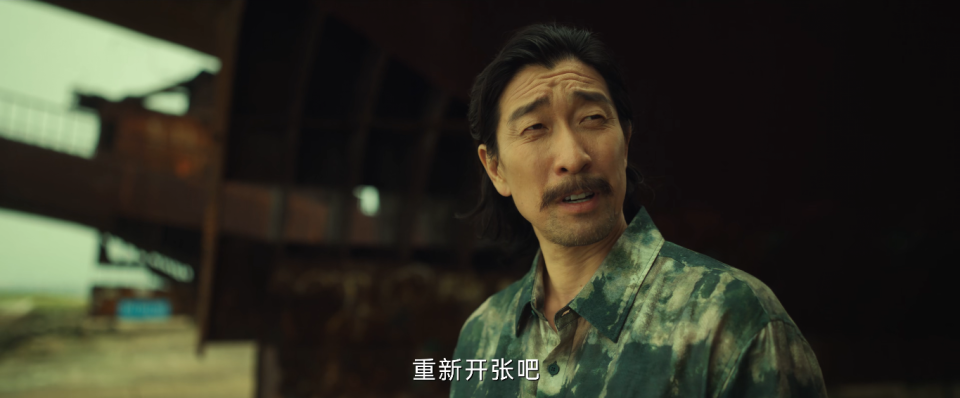 (原始链接: https://mmbiz.qpic.cn/sz_mmbiz_png/S5Y644UatVw4SZQHkv280y6vLT1XR2W6cdxa4rAo3iaaOENgNtm70X3D1nSAM0az3z97OFCJFog9OXiaiafI6ibsrA/640?wx_fmt=png&from=appmsg)
- 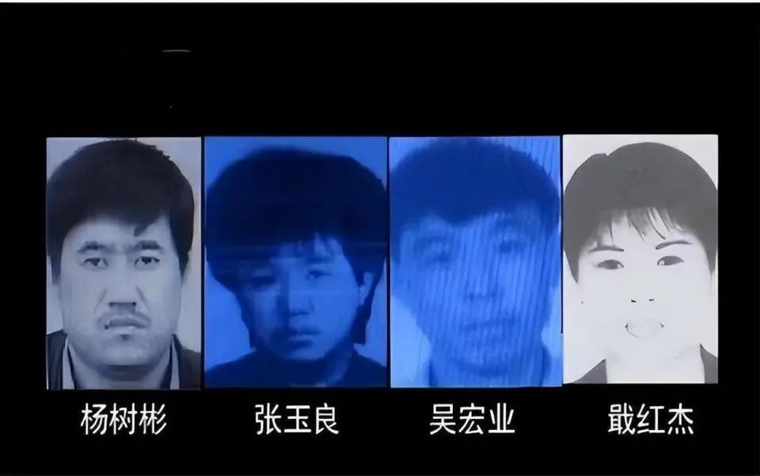 (原始链接: https://mmbiz.qpic.cn/sz_mmbiz_jpg/S5Y644UatVw4SZQHkv280y6vLT1XR2W6jr0LwiaRpRO5YNTQV3ibweLNefs10h7Lcs3e24g1WcHOcS2aian4ktjew/640?wx_fmt=jpeg&from=appmsg)
- 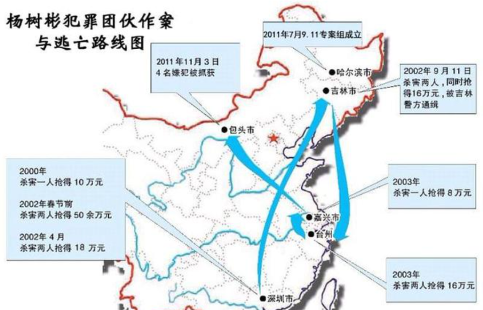 (原始链接: https://mmbiz.qpic.cn/sz_mmbiz_png/S5Y644UatVw4SZQHkv280y6vLT1XR2W6tAHMeU0DPKgSibW1KtboJfhfQxyFuIJTicIXFHhVxN8LIx6iaPL0w8liag/640?wx_fmt=png&from=appmsg)
- 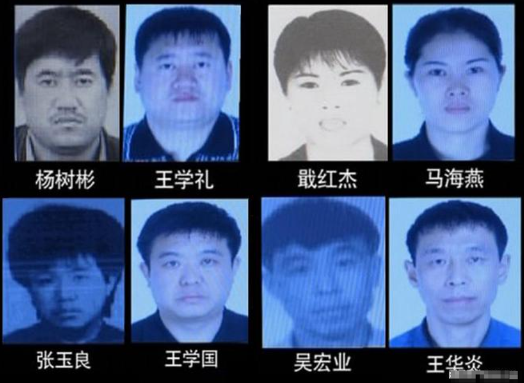 (原始链接: https://mmbiz.qpic.cn/sz_mmbiz_png/S5Y644UatVw4SZQHkv280y6vLT1XR2W65msfksiaNWcFEjxTGKsQ8qYHbTItZzJg9HkUKcYZ76kyQpFjqVeSmJA/640?wx_fmt=png&from=appmsg)
- 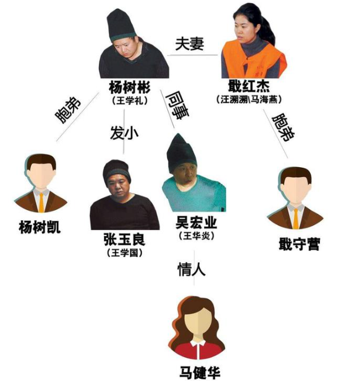 (原始链接: https://mmbiz.qpic.cn/sz_mmbiz_png/S5Y644UatVw4SZQHkv280y6vLT1XR2W6bicx8MaP10sOZcdxicMIuZFpCWPHjePibCenrZpSX4ktEiaLjibmvmzDsJQ/640?wx_fmt=png&from=appmsg)
- 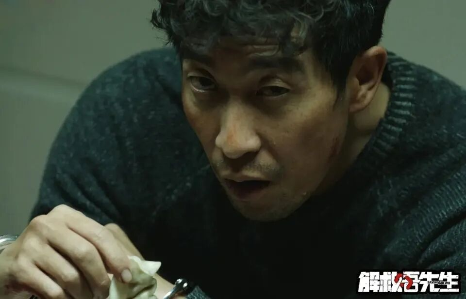 (原始链接: https://mmbiz.qpic.cn/sz_mmbiz_jpg/S5Y644UatVw4SZQHkv280y6vLT1XR2W6X09e7fibkXT5ZYMhndiaNr12P5slMKkUicqAX0ashDNOtB0IEIKAxrQ0w/640?wx_fmt=jpeg&from=appmsg)
- 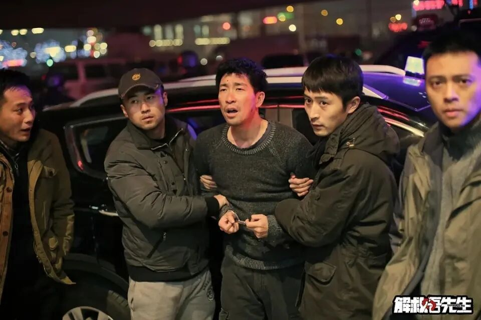 (原始链接: https://mmbiz.qpic.cn/sz_mmbiz_jpg/S5Y644UatVw4SZQHkv280y6vLT1XR2W68IoJS6BEm3eZdWLxKHYCzxicFxUO2Xm3svbPjehvK6v355TmZRSb5ibQ/640?wx_fmt=jpeg&from=appmsg)
-  (原始链接: https://mmbiz.qpic.cn/sz_mmbiz_png/S5Y644UatVw4SZQHkv280y6vLT1XR2W6VadAVEvbiceWjobbHUTozIM73Ep0iawzaKN5X8eXiciaObuekRiaeZ9iaqtw/640?wx_fmt=png&from=appmsg)
-  (原始链接: https://mmbiz.qpic.cn/sz_mmbiz_png/S5Y644UatVw4SZQHkv280y6vLT1XR2W60Nemukb2RDwgmoFQIB0icCm0Cxs3f7Bg7AvKz34RQOxVxSLibdleQ3kw/640?wx_fmt=png&from=appmsg)
