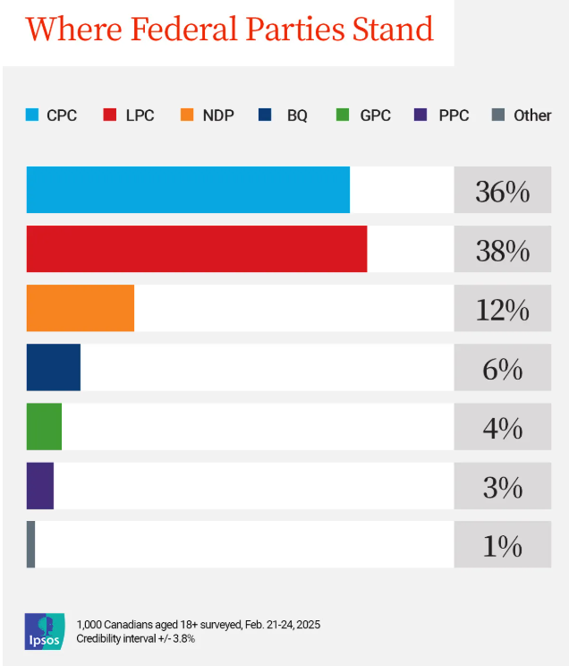

# 无标题

**链接地址:** http://mp.weixin.qq.com/s?__biz=MzAwMDE1NDk2MQ==&mid=2649922292&idx=1&sn=7e56111257d78b36178004d1a20b3557&chksm=83eb62faa398429d4c9937b5d0fc87b1fb27029d1888dbd46947075ed5795b8cd473eb585cc6&mpshare=1&scene=2&srcid=0227n5eoYyjrnZyCuhExZJAd&sharer_shareinfo=a8005eb6a780f2eb5fc7265ec5787408&sharer_shareinfo_first=a8005eb6a780f2eb5fc7265ec5787408#rd
**作者:** 
**获取时间:** 2025/8/28 18:47:25
**图片数量:** 4

---

## 原始HTML内容

<section style="box-sizing: border-box;font-style: normal;font-weight: 400;text-align: justify;font-size: 16px;color: rgb(62, 62, 62);"><section style="line-height: 2;box-sizing: border-box;">

最新的Ipsos民调显示，加拿大联邦自由党的支持率自2021年，也是4年以来首次反超保守党！

 

如果现在举行大选，自由党将获得38%的选票，而保守党仅有36%，彻底逆转六周前保守党领先26个百分点的局势。

 

这份民调由Ipsos公共事务部门进行，调查时间为2月21日至24日，针对1000名加拿大选民，数据误差范围为±3.8个百分点。
</section><section style=" text-align: center;margin-top: 0.5em;margin-bottom: 0.5em;padding-left: 0.5em;padding-right: 0.5em; box-sizing: border-box; "><section style="box-sizing: border-box;width: 100%;border: 0.3em solid white;box-shadow: rgb(102, 102, 102) 0.2em 0.2em 0.5em;height: auto !important;display: inline-block;line-height: 0;" nodeleaf=""></section></section><section style="line-height: 2;box-sizing: border-box;">
 
</section><section style="line-height: 2;box-sizing: border-box;">
<strong style="box-sizing: border-box;">自由党飙升10%！保守党急跌5%！</strong>

 

在本月早些时候发布的上一次Ipsos民调中，保守党支持率为41%，而自由党仅28%。

 

然而短短几周，自由党的支持率猛增10%，保守党则下跌5%，连带新民主党（NDP）和魁人政团（Bloc Québécois）也出现支持率下滑（分别降至12%和6%）。

 

Ipsos CEO达雷尔·布里克（Darrell Bricker）指出，这一变化主要受到两个因素影响：

 
<ul style="list-style-type: disc;box-sizing: border-box;padding-left: 40px;list-style-position: outside;" class="list-paddingleft-2"><li style="box-sizing: border-box;">
自由党更换领导层，特鲁多宣布辞职，自由党正在进行新党魁竞选，这让选民重新关注自由党。

 
</li><li style="box-sizing: border-box;">
特朗普关税威胁，加拿大正面临美国前所未有的关税冲击，民众更关注如何应对经济危机，而不是过去10年自由党的执政问题。
</li></ul>
 

布里克表示，“加拿大人现在更关注的是‘如何应对美国’，而不是‘自由党过去10年做了什么’。”
</section><section style=" text-align: center;margin-top: 0.5em;margin-bottom: 0.5em;padding-left: 0.5em;padding-right: 0.5em; box-sizing: border-box; "><section style="box-sizing: border-box;width: 100%;border: 0.3em solid white;box-shadow: rgb(102, 102, 102) 0.2em 0.2em 0.5em;height: auto !important;display: inline-block;line-height: 0;" nodeleaf=""></section></section><section style="line-height: 2;box-sizing: border-box;">
 
</section><section style="line-height: 2;box-sizing: border-box;">
<strong style="box-sizing: border-box;">民调最大变化：魁省、安省和大西洋省份自由党支持率激增</strong>

 

此次民调发现，自由党在加拿大中部和东部地区的支持率大幅上升，特别是在 魁北克省、安省和大西洋省份。

 

布里克分析称：“自由党支持率上升主要集中在安省以东地区，而保守党在西部地区仍然保持优势。”

 

此前，保守党党魁博励治（Pierre Poilievre）一直将碳税作为竞选重点，但近期，自由党两位党魁热门人选——马克·卡尼（Mark Carney）和方慧兰（Chrystia Freeland），均表态可能调整碳税政策，这让碳税议题的重要性下降。

 

同时，特朗普的关税威胁成为当前最大经济危机，保守党不得不调整竞选策略，开始强调“加拿大优先（Canada First）”的新信息，希望借此扭转局势。

 

<strong style="box-sizing: border-box;">86%加拿大人要求立即大选！</strong>

 

在特朗普坚持于3月4日实施25%关税的背景下，多达86%的加拿大人表示，希望立即举行联邦大选，以确保加拿大能够有一个强有力的总理和政府来应对美国的经济挑战。

 

目前，加拿大出口至美国的商品总额超过$5900亿加元，占总出口额的77%。如果特朗普关税正式实施，加拿大经济或将陷入严重衰退，央行预测GDP将在两年内下降3%，出口下降8.5%，商业投资下滑12%。

 

布里克表示：“如果保守党希望扭转局势，他们必须找到方法打破当前话题的主导权，并向加拿大选民重新传递他们的信息。”

 

目前来看，自由党正在上演一场“起死回生”的逆袭，而保守党则面临如何稳住支持率的挑战。

</section></section><section class="mp_profile_iframe_wrp" nodeleaf=""><mp-common-profile class="js_uneditable custom_select_card mp_profile_iframe" data-pluginname="mpprofile" data-nickname="多伦多微生活" data-alias="wetoronto" data-from="0" data-headimg="http://mmbiz.qpic.cn/mmbiz_png/n8gRzdiboyibNMhzzb6WlicwxmxzLMru3ibTmu5O2nyJ0tFQe1Jg8yAbmic2jibISwDo6UUOe4YyD081XaggicczP6ldg/0?wx_fmt=png" data-signature="随性的小编，随性的多伦多微生活，等待随性的你到来......" data-id="MzAwMDE1NDk2MQ==" data-is_biz_ban="0" data-service_type="1"></mp-common-profile></section><section> </section>
<mp-style-type data-value="3"></mp-style-type>

---

## 纯文本内容

最新的Ipsos民调显示，加拿大联邦自由党的支持率自2021年，也是4年以来首次反超保守党！如果现在举行大选，自由党将获得38%的选票，而保守党仅有36%，彻底逆转六周前保守党领先26个百分点的局势。这份民调由Ipsos公共事务部门进行，调查时间为2月21日至24日，针对1000名加拿大选民，数据误差范围为±3.8个百分点。自由党飙升10%！保守党急跌5%！在本月早些时候发布的上一次Ipsos民调中，保守党支持率为41%，而自由党仅28%。然而短短几周，自由党的支持率猛增10%，保守党则下跌5%，连带新民主党（NDP）和魁人政团（Bloc Québécois）也出现支持率下滑（分别降至12%和6%）。Ipsos CEO达雷尔·布里克（Darrell Bricker）指出，这一变化主要受到两个因素影响：自由党更换领导层，特鲁多宣布辞职，自由党正在进行新党魁竞选，这让选民重新关注自由党。特朗普关税威胁，加拿大正面临美国前所未有的关税冲击，民众更关注如何应对经济危机，而不是过去10年自由党的执政问题。布里克表示，“加拿大人现在更关注的是‘如何应对美国’，而不是‘自由党过去10年做了什么’。”民调最大变化：魁省、安省和大西洋省份自由党支持率激增此次民调发现，自由党在加拿大中部和东部地区的支持率大幅上升，特别是在 魁北克省、安省和大西洋省份。布里克分析称：“自由党支持率上升主要集中在安省以东地区，而保守党在西部地区仍然保持优势。”此前，保守党党魁博励治（Pierre Poilievre）一直将碳税作为竞选重点，但近期，自由党两位党魁热门人选——马克·卡尼（Mark Carney）和方慧兰（Chrystia Freeland），均表态可能调整碳税政策，这让碳税议题的重要性下降。同时，特朗普的关税威胁成为当前最大经济危机，保守党不得不调整竞选策略，开始强调“加拿大优先（Canada First）”的新信息，希望借此扭转局势。86%加拿大人要求立即大选！在特朗普坚持于3月4日实施25%关税的背景下，多达86%的加拿大人表示，希望立即举行联邦大选，以确保加拿大能够有一个强有力的总理和政府来应对美国的经济挑战。目前，加拿大出口至美国的商品总额超过$5900亿加元，占总出口额的77%。如果特朗普关税正式实施，加拿大经济或将陷入严重衰退，央行预测GDP将在两年内下降3%，出口下降8.5%，商业投资下滑12%。布里克表示：“如果保守党希望扭转局势，他们必须找到方法打破当前话题的主导权，并向加拿大选民重新传递他们的信息。”目前来看，自由党正在上演一场“起死回生”的逆袭，而保守党则面临如何稳住支持率的挑战。

---

## 图片列表

-  (原始链接: https://mmbiz.qpic.cn/mmbiz_gif/n8gRzdiboyibPzt9ODKOFmL22Rvg9viaCH6w54xU1GOGxeek2KLBpBpicGCHtEh6u2xEficxBzHprwwmoPbaGkfG0sQ/640?wx_fmt=gif&wxfrom=5&wx_lazy=1&tp=webp)
-  (原始链接: https://mmbiz.qpic.cn/sz_mmbiz_jpg/n8gRzdiboyibM8nFgS2NJzWBw94bibib8icqQH8Pa35OE0DNjKWNX3Dx5PVo2AvVicZcelJFqsSueYibwiaufRWZfoNdOw/640?wx_fmt=jpeg&from=appmsg)
-  (原始链接: https://mmbiz.qpic.cn/sz_mmbiz_png/n8gRzdiboyibM8nFgS2NJzWBw94bibib8icqQYeqfPNFc0Vibqk2HaxaeFzREdBpteYaiboz6b1mhjdSHEJEqbdGJK7iag/640?wx_fmt=png&from=appmsg)
-  (原始链接: https://mmbiz.qpic.cn/mmbiz_jpg/raULAbzicWqWTWhm1ib4ePmib4VicntX3C16m4DDa6W2iaml6tASQLIGovgNq8cpcxKm3kLZgzJeSWtY1ichhoU67Pibg/640?wx_fmt=jpeg&from=appmsg)
