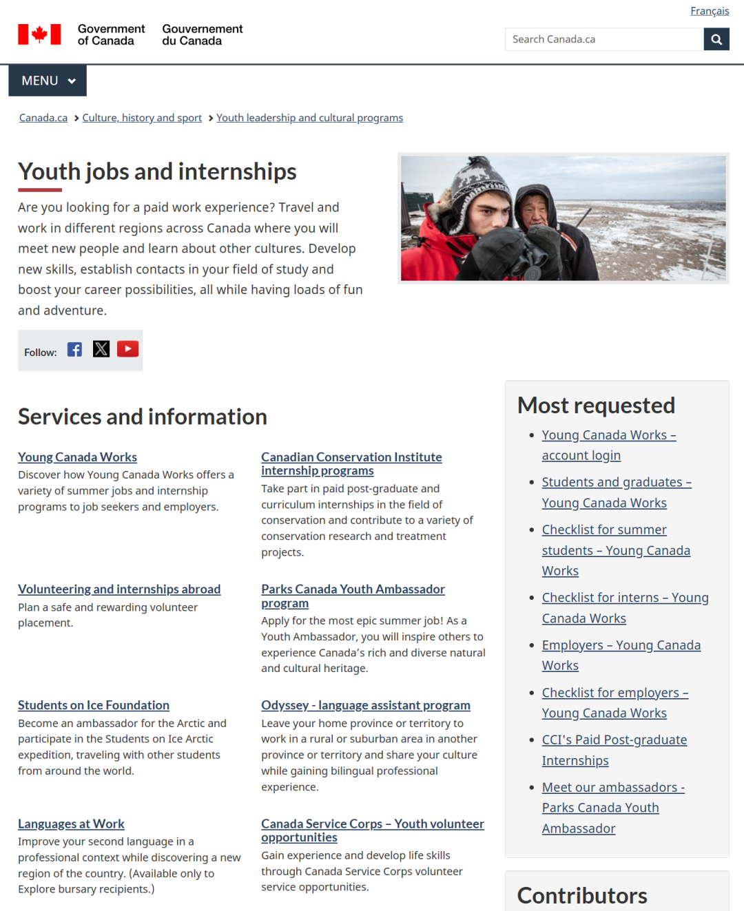

# 无标题

**链接地址:** http://mp.weixin.qq.com/s?__biz=MzI4NDYyNjAwNw==&mid=2247489922&idx=1&sn=7aaf0f4c45844fa264f5af54fb7f8b99&chksm=eade7c3620a466054e2d2b89d95bf8015884e967c9b0b83ce4f9575b9eb0fc389f4cd770f410&mpshare=1&scene=2&srcid=0325a0SLsvaAJoOZIeqVzMkC&sharer_shareinfo=e99d0399f2a7bed910eb43ce8196a366&sharer_shareinfo_first=e99d0399f2a7bed910eb43ce8196a366#rd
**作者:** 欢迎转发
**获取时间:** 2025/8/28 18:47:14
**图片数量:** 25

---

## 原始HTML内容

<section style="box-sizing: border-box;font-style: normal;font-weight: 400;text-align: justify;font-size: 16px;color: rgb(62, 62, 62);"><section style="text-align: left;justify-content: flex-start;display: flex;flex-flow: row;margin: 10px 0px;box-sizing: border-box;"><section style="display: inline-block;vertical-align: middle;width: auto;align-self: center;flex: 0 0 auto;border-style: solid;border-width: 0px 0px 0px 7px;border-left-color: rgb(230, 173, 146);min-width: 5%;max-width: 100%;height: auto;padding: 0px 0px 0px 6px;box-sizing: border-box;"><section style="text-align: justify;line-height: 1;box-sizing: border-box;">
<strong style="box-sizing: border-box;">点击蓝字 关注我们</strong>
</section></section><section style="display: inline-block;vertical-align: middle;width: auto;align-self: center;min-width: 5%;max-width: 100%;flex: 0 0 auto;height: auto;padding: 0px 0px 0px 5px;box-sizing: border-box;"><section style="text-align: center;box-sizing: border-box;"><section style="color: rgba(50, 98, 222, 0.12);font-size: 14px;box-sizing: border-box;">
<b style="box-sizing: border-box;">&nbsp;BadaB</b>
</section></section></section><section style="display: inline-block;vertical-align: middle;width: auto;flex: 100 100 0%;height: auto;align-self: center;padding: 0px 0px 0px 11px;box-sizing: border-box;"><section style="margin: 0.5em 0px;box-sizing: border-box;"><section style="background-color: rgb(50, 98, 222);height: 1px;box-sizing: border-box;"><svg viewBox="0 0 1 1" style="float:left;line-height:0;width:0;vertical-align:top;"></svg></section></section></section></section><section style="text-align: left;justify-content: flex-start;display: flex;flex-flow: row;margin: 10px 0px;box-sizing: border-box;"><section style="display: inline-block;vertical-align: top;width: auto;align-self: flex-start;flex: 100 100 0%;height: auto;margin: 0px 0px 0px 11px;box-sizing: border-box;"><section style="display: flex;width: 100%;flex-flow: column;box-sizing: border-box;"><section style="z-index: 1;box-sizing: border-box;"><section style="line-height: 0;text-align: right;margin: 0px;box-sizing: border-box;"><section style="max-width: 100%;vertical-align: middle;display: inline-block;line-height: 0;width: 100%;height: auto;border-style: solid;border-width: 0px;border-color: rgb(255, 255, 255);box-sizing: border-box;" nodeleaf=""></section></section></section></section><section style="margin: -50px 0px 0px;transform: translate3d(-11px, 0px, 0px);-webkit-transform: translate3d(-11px, 0px, 0px);-moz-transform: translate3d(-11px, 0px, 0px);-o-transform: translate3d(-11px, 0px, 0px);box-sizing: border-box;"><section style="display: inline-block;width: 44%;height: 61px;vertical-align: top;overflow: hidden;border-style: solid;border-width: 0px 0px 1px 1px;border-color: rgb(50, 98, 222);box-sizing: border-box;"><section style="text-align: justify;box-sizing: border-box;">
 
</section></section></section></section><section style="display: inline-block;vertical-align: top;width: auto;align-self: flex-start;flex: 0 0 0%;height: auto;margin: 0px 0px 0px -29px;box-sizing: border-box;"><section style="display: flex;width: 100%;flex-flow: column;box-sizing: border-box;"><section style="z-index: 1;box-sizing: border-box;"><section style="text-align: center;box-sizing: border-box;"><section style="display: inline-block;width: 0px;height: 0px;vertical-align: top;overflow: hidden;border-style: solid;border-width: 0px 30px 30px 0px;border-color: rgba(255, 255, 255, 0) rgb(255, 255, 255) rgba(255, 255, 255, 0) rgba(255, 255, 255, 0);box-sizing: border-box;"><svg viewBox="0 0 1 1" style="float:left;line-height:0;width:0;vertical-align:top;"></svg></section></section></section></section></section></section><section style="text-align: right;font-size: 20px;box-sizing: border-box;">
<strong style="box-sizing: border-box;">入门级工作难入门？</strong>

<strong style="box-sizing: border-box;">职场萌新的第一份工作到底要怎么找？</strong>

 
</section>
 

 
<section style="text-align: left;justify-content: flex-start;display: flex;flex-flow: row;margin: 10px 0px 0px;box-sizing: border-box;"><section style="display: inline-block;vertical-align: middle;width: auto;align-self: center;flex: 0 0 auto;border-style: solid;border-width: 0px 0px 0px 7px;border-left-color: rgb(230, 173, 146);min-width: 5%;max-width: 100%;height: auto;padding: 0px 0px 0px 6px;box-sizing: border-box;"><section style="text-align: justify;font-size: 18px;box-sizing: border-box;">
<strong style="box-sizing: border-box;">入门工作</strong>
</section></section><section style="display: inline-block;vertical-align: middle;width: auto;align-self: center;min-width: 5%;max-width: 100%;flex: 0 0 auto;height: auto;padding: 0px 0px 0px 5px;box-sizing: border-box;"><section style="text-align: center;box-sizing: border-box;"><section style="color: rgba(50, 98, 222, 0.12);box-sizing: border-box;">
<strong style="box-sizing: border-box;">Entry Level Jobs</strong>
</section></section></section><section style="display: inline-block;vertical-align: bottom;width: auto;flex: 100 100 0%;height: auto;align-self: flex-end;box-sizing: border-box;"><section style="text-align: right;justify-content: flex-end;display: flex;flex-flow: row;margin: 0px 0px -20px;box-sizing: border-box;"><section style="display: inline-block;vertical-align: top;width: 58%;align-self: flex-start;flex: 0 0 auto;height: auto;padding: 0px 13px 0px 0px;box-sizing: border-box;"><section style="margin: 0.5em 0px;box-sizing: border-box;"><section style="background-color: rgb(50, 98, 222);height: 1px;box-sizing: border-box;"><svg viewBox="0 0 1 1" style="float:left;line-height:0;width:0;vertical-align:top;"></svg></section></section></section><section style="display: inline-block;vertical-align: top;width: auto;min-width: 5%;max-width: 100%;flex: 0 0 auto;height: auto;box-sizing: border-box;"><section style="display: flex;width: 100%;flex-flow: column;box-sizing: border-box;"><section style="z-index: 2;box-sizing: border-box;"><section style="margin: 0px;line-height: 0;box-sizing: border-box;"><section style="max-width: 100%;vertical-align: middle;display: inline-block;line-height: 0;width: 38px;height: auto;box-sizing: border-box;" nodeleaf=""></section></section></section></section></section></section></section></section><section style="text-align: left;justify-content: flex-start;display: flex;flex-flow: row;margin: 3px 0px 10px;box-sizing: border-box;"><section style="display: inline-block;vertical-align: top;width: auto;align-self: flex-start;flex: 100 100 0%;height: auto;margin: 0px 0px 0px 11px;box-sizing: border-box;"><section style="justify-content: flex-start;display: flex;flex-flow: row;box-sizing: border-box;"><section style="display: inline-block;width: 100%;vertical-align: top;align-self: flex-start;flex: 0 0 auto;background-color: rgba(50, 98, 222, 0.07);padding: 18px;box-sizing: border-box;"><section style="text-align: justify;font-size: 14px;line-height: 2;letter-spacing: 2px;box-sizing: border-box;">
过去，入门级岗位一直是毕业生踏入职场的第一块跳板。然而如今的求职者们却发现，所谓的“入门级”工作，已经<strong style="box-sizing: border-box;">越来越难以“入门”</strong>了——许多招聘启事明明标注着“Entry-Level”，但细读岗位要求后才发现，这些职位往往也要求<strong style="box-sizing: border-box;">2年或以上工作经验</strong>，甚至需要熟练掌握多种专业技能……

 
</section><section style="text-align: center;margin-top: 10px;margin-bottom: 10px;line-height: 0;box-sizing: border-box;"><section style="max-width: 100%;vertical-align: middle;display: inline-block;line-height: 0;box-sizing: border-box;" nodeleaf=""></section></section><section style="text-align: justify;font-size: 14px;line-height: 2;letter-spacing: 2px;box-sizing: border-box;">
 

更让人沮丧的是，许多职位的虽然号称“入门”，但实际工作内容、责任范围，已经远超出传统的初级岗位，甚至<strong style="box-sizing: border-box;">比一些中级职位还要复杂</strong>。恨不得要求求职者十八班武艺全能，属于是<strong style="box-sizing: border-box;">“一根韭菜两头割”</strong>！找工作的各位不禁感叹到：<strong style="box-sizing: border-box;">00后还想要整顿职场？职场可不给00后这个整顿的机会。</strong>

<strong style="box-sizing: border-box;"> </strong>
</section><section style="margin: 10px 0%;justify-content: flex-start;display: flex;flex-flow: row;box-sizing: border-box;"><section style="display: inline-block;vertical-align: middle;width: 50%;padding: 0px 5px 0px 0px;align-self: center;flex: 0 0 auto;box-sizing: border-box;"><section style="text-align: center;margin: 0px 0%;line-height: 0;box-sizing: border-box;"><section style="max-width: 100%;vertical-align: middle;display: inline-block;line-height: 0;box-sizing: border-box;" nodeleaf=""></section></section></section><section style="display: inline-block;vertical-align: middle;width: 50%;padding: 0px 0px 0px 5px;align-self: center;flex: 0 0 auto;box-sizing: border-box;"><section style="text-align: center;margin: 0px 0%;line-height: 0;box-sizing: border-box;"><section style="max-width: 100%;vertical-align: middle;display: inline-block;line-height: 0;box-sizing: border-box;" nodeleaf=""></section></section></section></section><section style="text-align: justify;font-size: 14px;line-height: 2;letter-spacing: 2px;box-sizing: border-box;">
 

那么，入门级岗位都去哪儿了？根据<strong style="box-sizing: border-box;">2024年世界经济论坛</strong>（World Economic Forum）的一项研究预测，未来五年内，<strong style="box-sizing: border-box;">23%的岗位因技术变革和产业调整可能会被淘汰</strong>，其中<strong style="box-sizing: border-box;">相当一部分是初级职位</strong>。这意味着，越来越多的入门级岗位正在消失，而职场新人的就业难度只会进一步加<strong style="box-sizing: border-box;">大</strong><strong style="box-sizing: border-box;">大</strong><strong style="box-sizing: border-box;">大</strong><strong style="box-sizing: border-box;">大</strong>。

 
</section><section style="text-align: center;margin-top: 10px;margin-bottom: 10px;line-height: 0;box-sizing: border-box;"><section style="max-width: 100%;vertical-align: middle;display: inline-block;line-height: 0;box-sizing: border-box;" nodeleaf=""></section></section><section style="text-align: justify;font-size: 14px;line-height: 2;letter-spacing: 2px;box-sizing: border-box;">
 

入门级工作不再“入门”，这藏在背后的原因到底是什么？而面对日益严峻的就业环境，资历平平的打工人们又该如何突围？BadaB将在今天的文章中深入剖析<strong style="box-sizing: border-box;">造成北美职场入门难的问题根源，并提供实用的求职策略</strong>，帮助职场新人顺利进入职场，赢在职业起跑线上！请就业焦虑的小伙伴满做好笔记哦！

 
</section></section></section><section style="margin: -50px 0px 0px;transform: translate3d(-11px, 0px, 0px);-webkit-transform: translate3d(-11px, 0px, 0px);-moz-transform: translate3d(-11px, 0px, 0px);-o-transform: translate3d(-11px, 0px, 0px);box-sizing: border-box;"><section style="display: inline-block;width: 44%;height: 61px;vertical-align: top;overflow: hidden;border-style: solid;border-width: 0px 0px 1px 1px;border-color: rgb(50, 98, 222);box-sizing: border-box;"><section style="text-align: justify;box-sizing: border-box;">
 
</section></section></section><section style="text-align: justify;box-sizing: border-box;">
 
</section><section style="text-align: justify;box-sizing: border-box;">
 
</section><section style="justify-content: flex-start;display: flex;flex-flow: row;margin: 10px 0px 0px;box-sizing: border-box;"><section style="display: inline-block;width: 72%;vertical-align: top;align-self: flex-start;flex: 0 0 auto;background-color: rgba(50, 98, 222, 0.07);padding: 18px;border-style: solid;border-width: 1px;border-color: rgba(50, 98, 222, 0.12);height: auto;box-sizing: border-box;"><section style="text-align: justify;font-size: 18px;color: rgb(26, 82, 145);box-sizing: border-box;">
<strong style="box-sizing: border-box;">提问：“为什么入门级工作越来越少了？”</strong>
</section></section></section><section style="display: flex;width: 100%;flex-flow: column;box-sizing: border-box;"><section style="z-index: 1;box-sizing: border-box;"><section style="text-align: center;box-sizing: border-box;"><section style="display: inline-block;width: 0px;height: 0px;vertical-align: top;overflow: hidden;border-style: solid;border-width: 0px 15px 15px 0px;border-color: rgba(255, 255, 255, 0) rgba(50, 98, 222, 0.12) rgba(255, 255, 255, 0) rgba(255, 255, 255, 0);box-sizing: border-box;"><svg viewBox="0 0 1 1" style="float:left;line-height:0;width:0;vertical-align:top;"></svg></section></section></section></section><section style="justify-content: flex-start;display: flex;flex-flow: row;margin: 10px 0px;box-sizing: border-box;"><section style="display: inline-block;vertical-align: top;width: auto;align-self: flex-start;flex: 100 100 0%;height: auto;margin: 0px 0px 0px 11px;box-sizing: border-box;"><section style="display: flex;width: 100%;flex-flow: column;box-sizing: border-box;"><section style="z-index: 1;box-sizing: border-box;"><section style="line-height: 0;text-align: right;margin: 0px;box-sizing: border-box;"><section style="max-width: 100%;vertical-align: middle;display: inline-block;line-height: 0;width: 100%;height: auto;border-style: solid;border-width: 0px;border-color: rgb(255, 255, 255);box-sizing: border-box;" nodeleaf=""></section></section></section></section><section style="margin: -50px 0px 0px;transform: translate3d(-11px, 0px, 0px);-webkit-transform: translate3d(-11px, 0px, 0px);-moz-transform: translate3d(-11px, 0px, 0px);-o-transform: translate3d(-11px, 0px, 0px);box-sizing: border-box;"><section style="display: inline-block;width: 44%;height: 61px;vertical-align: top;overflow: hidden;border-style: solid;border-width: 0px 0px 1px 1px;border-color: rgb(50, 98, 222);box-sizing: border-box;"><section style="text-align: justify;box-sizing: border-box;">
 
</section></section></section></section><section style="display: inline-block;vertical-align: top;width: auto;align-self: flex-start;flex: 0 0 0%;height: auto;margin: 0px 0px 0px -29px;box-sizing: border-box;"><section style="display: flex;width: 100%;flex-flow: column;box-sizing: border-box;"><section style="z-index: 1;box-sizing: border-box;"><section style="text-align: center;box-sizing: border-box;"><section style="display: inline-block;width: 0px;height: 0px;vertical-align: top;overflow: hidden;border-style: solid;border-width: 0px 30px 30px 0px;border-color: rgba(255, 255, 255, 0) rgb(255, 255, 255) rgba(255, 255, 255, 0) rgba(255, 255, 255, 0);box-sizing: border-box;"><svg viewBox="0 0 1 1" style="float:left;line-height:0;width:0;vertical-align:top;"></svg></section></section></section></section></section></section></section><section style="display: inline-block;vertical-align: top;width: auto;align-self: flex-start;flex: 0 0 0%;height: auto;margin: 0px 0px 0px -29px;box-sizing: border-box;"><section style="display: flex;width: 100%;flex-flow: column;box-sizing: border-box;"><section style="z-index: 1;box-sizing: border-box;"><section style="text-align: center;box-sizing: border-box;"><section style="display: inline-block;width: 0px;height: 0px;vertical-align: top;overflow: hidden;border-style: solid;border-width: 0px 30px 30px 0px;border-color: rgba(255, 255, 255, 0) rgb(255, 255, 255) rgba(255, 255, 255, 0) rgba(255, 255, 255, 0);box-sizing: border-box;"><svg viewBox="0 0 1 1" style="float:left;line-height:0;width:0;vertical-align:top;"></svg></section></section></section></section></section></section><section style="text-align: left;justify-content: flex-start;display: flex;flex-flow: row;margin: 10px 0px;box-sizing: border-box;"><section style="display: inline-block;vertical-align: middle;width: auto;align-self: center;flex: 0 0 auto;min-width: 5%;max-width: 100%;height: auto;padding: 7px 10px;margin: 0px;background-image: linear-gradient(rgb(22, 30, 136) 13%, rgb(0, 132, 210) 88%);box-sizing: border-box;"><section style="text-align: justify;color: rgb(255, 255, 255);box-sizing: border-box;">
<strong style="box-sizing: border-box;">01</strong>
</section></section><section style="display: inline-block;vertical-align: middle;width: auto;align-self: center;flex: 0 0 auto;border-style: solid;border-width: 0px 0px 0px 5px;border-color: rgb(203, 202, 75) rgb(203, 202, 75) rgb(203, 202, 75) rgb(230, 173, 146);padding: 0px 0px 0px 5px;margin: 0px 0px 0px 7px;min-width: 5%;max-width: 100%;height: auto;box-sizing: border-box;"><section style="text-align: center;box-sizing: border-box;"><section style="line-height: 1;box-sizing: border-box;">
<strong style="box-sizing: border-box;">自动化与AI替代</strong>
</section></section></section></section><section style="text-align: left;justify-content: flex-start;display: flex;flex-flow: row;box-sizing: border-box;"><section style="display: inline-block;vertical-align: top;width: auto;flex: 0 0 0%;height: auto;box-sizing: border-box;"><section style="transform: rotateZ(45deg);-webkit-transform: rotateZ(45deg);-moz-transform: rotateZ(45deg);-o-transform: rotateZ(45deg);transform-origin: right top;-webkit-transform-origin: right top;-moz-transform-origin: right top;-o-transform-origin: right top;margin-top: 0px;margin-bottom: 0px;box-sizing: border-box;"><section style="text-align: right;margin: 10px 0px 0px;transform: translate3d(16px, 0px, 0px);-webkit-transform: translate3d(16px, 0px, 0px);-moz-transform: translate3d(16px, 0px, 0px);-o-transform: translate3d(16px, 0px, 0px);box-sizing: border-box;"><section style="display: inline-block;width: 15px;height: 15px;vertical-align: top;overflow: hidden;background-color: rgb(230, 173, 146);border-style: solid;border-width: 1px 1px 0px 0px;border-color: rgb(50, 98, 222);box-shadow: rgb(255, 255, 255) 0px 0px 0px 3px inset;box-sizing: border-box;"><section style="text-align: justify;box-sizing: border-box;">
 
</section></section></section></section></section><section style="display: inline-block;vertical-align: top;width: auto;align-self: flex-start;flex: 100 100 0%;border-style: solid;border-width: 0px 0px 0px 1px;border-left-color: rgb(50, 98, 222);height: auto;box-sizing: border-box;"><section style="text-align: right;justify-content: flex-end;display: flex;flex-flow: row;margin: 0px 0px 15px;box-sizing: border-box;"><section style="display: inline-block;width: 94%;vertical-align: top;align-self: flex-start;flex: 0 0 auto;background-color: rgba(50, 98, 222, 0.07);padding: 18px;border-style: solid;border-width: 1px;border-color: rgba(50, 98, 222, 0.12);height: auto;margin: 0px;box-sizing: border-box;"><section style="text-align: justify;font-size: 14px;box-sizing: border-box;">
随着自动化技术和人工智能的迅速发展，许多基础性、重复性的岗位正在被取代。数据录入、行政助理、客户支持等传统的入门级岗位，现在往往<strong style="box-sizing: border-box;">由AI客服、自动化管理系统完成</strong>，使得雇主不再需要大量初级员工。
</section></section></section></section></section><section style="text-align: left;justify-content: flex-start;display: flex;flex-flow: row;margin: 10px 0px;box-sizing: border-box;"><section style="display: inline-block;vertical-align: middle;width: auto;align-self: center;flex: 0 0 auto;min-width: 5%;max-width: 100%;height: auto;padding: 7px 10px;margin: 0px;background-image: linear-gradient(rgb(22, 30, 136) 13%, rgb(0, 132, 210) 88%);box-sizing: border-box;"><section style="text-align: justify;color: rgb(255, 255, 255);box-sizing: border-box;">
<strong style="box-sizing: border-box;">02</strong>
</section></section><section style="display: inline-block;vertical-align: middle;width: auto;align-self: center;flex: 0 0 auto;border-style: solid;border-width: 0px 0px 0px 5px;border-color: rgb(203, 202, 75) rgb(203, 202, 75) rgb(203, 202, 75) rgb(230, 173, 146);padding: 0px 0px 0px 5px;margin: 0px 0px 0px 7px;min-width: 5%;max-width: 100%;height: auto;box-sizing: border-box;"><section style="text-align: center;box-sizing: border-box;"><section style="line-height: 1;box-sizing: border-box;">
<strong style="box-sizing: border-box;">经济不确定性加剧，企业缩减招聘</strong>
</section></section></section></section><section style="text-align: left;justify-content: flex-start;display: flex;flex-flow: row;box-sizing: border-box;"><section style="display: inline-block;vertical-align: top;width: auto;flex: 0 0 0%;height: auto;box-sizing: border-box;"><section style="transform: rotateZ(45deg);-webkit-transform: rotateZ(45deg);-moz-transform: rotateZ(45deg);-o-transform: rotateZ(45deg);transform-origin: right top;-webkit-transform-origin: right top;-moz-transform-origin: right top;-o-transform-origin: right top;margin-top: 0px;margin-bottom: 0px;box-sizing: border-box;"><section style="text-align: right;margin: 10px 0px 0px;transform: translate3d(16px, 0px, 0px);-webkit-transform: translate3d(16px, 0px, 0px);-moz-transform: translate3d(16px, 0px, 0px);-o-transform: translate3d(16px, 0px, 0px);box-sizing: border-box;"><section style="display: inline-block;width: 15px;height: 15px;vertical-align: top;overflow: hidden;background-color: rgb(230, 173, 146);border-style: solid;border-width: 1px 1px 0px 0px;border-color: rgb(50, 98, 222);box-shadow: rgb(255, 255, 255) 0px 0px 0px 3px inset;box-sizing: border-box;"><section style="text-align: justify;box-sizing: border-box;">
 
</section></section></section></section></section><section style="display: inline-block;vertical-align: top;width: auto;align-self: flex-start;flex: 100 100 0%;border-style: solid;border-width: 0px 0px 0px 1px;border-left-color: rgb(50, 98, 222);height: auto;box-sizing: border-box;"><section style="text-align: right;justify-content: flex-end;display: flex;flex-flow: row;margin: 0px 0px 15px;box-sizing: border-box;"><section style="display: inline-block;width: 94%;vertical-align: top;align-self: flex-start;flex: 0 0 auto;background-color: rgba(50, 98, 222, 0.07);padding: 18px;border-style: solid;border-width: 1px;border-color: rgba(50, 98, 222, 0.12);height: auto;margin: 0px;box-sizing: border-box;"><section style="text-align: justify;font-size: 14px;box-sizing: border-box;">
经济衰退和市场不稳定让许多企业变得更加谨慎，尤其是在人员招聘方面。相比花时间和资源培养新人，企业<strong style="box-sizing: border-box;">更倾向于直接雇佣经验丰富的员工</strong>，以减少培训成本，确保岗位的高效运作。
</section></section></section></section></section><section style="text-align: left;justify-content: flex-start;display: flex;flex-flow: row;margin: 10px 0px;box-sizing: border-box;"><section style="display: inline-block;vertical-align: middle;width: auto;align-self: center;flex: 0 0 auto;min-width: 5%;max-width: 100%;height: auto;padding: 7px 10px;margin: 0px;background-image: linear-gradient(rgb(22, 30, 136) 13%, rgb(0, 132, 210) 88%);box-sizing: border-box;"><section style="text-align: justify;color: rgb(255, 255, 255);box-sizing: border-box;">
<strong style="box-sizing: border-box;">03</strong>
</section></section><section style="display: inline-block;vertical-align: middle;width: auto;align-self: center;flex: 0 0 auto;border-style: solid;border-width: 0px 0px 0px 5px;border-color: rgb(203, 202, 75) rgb(203, 202, 75) rgb(203, 202, 75) rgb(230, 173, 146);padding: 0px 0px 0px 5px;margin: 0px 0px 0px 7px;min-width: 5%;max-width: 100%;height: auto;box-sizing: border-box;"><section style="text-align: center;box-sizing: border-box;"><section style="line-height: 1;box-sizing: border-box;">
<strong style="box-sizing: border-box;">实习泛滥，变相“免费劳动力”</strong>
</section></section></section></section><section style="text-align: left;justify-content: flex-start;display: flex;flex-flow: row;box-sizing: border-box;"><section style="display: inline-block;vertical-align: top;width: auto;flex: 0 0 0%;height: auto;box-sizing: border-box;"><section style="transform: rotateZ(45deg);-webkit-transform: rotateZ(45deg);-moz-transform: rotateZ(45deg);-o-transform: rotateZ(45deg);transform-origin: right top;-webkit-transform-origin: right top;-moz-transform-origin: right top;-o-transform-origin: right top;margin-top: 0px;margin-bottom: 0px;box-sizing: border-box;"><section style="text-align: right;margin: 10px 0px 0px;transform: translate3d(16px, 0px, 0px);-webkit-transform: translate3d(16px, 0px, 0px);-moz-transform: translate3d(16px, 0px, 0px);-o-transform: translate3d(16px, 0px, 0px);box-sizing: border-box;"><section style="display: inline-block;width: 15px;height: 15px;vertical-align: top;overflow: hidden;background-color: rgb(230, 173, 146);border-style: solid;border-width: 1px 1px 0px 0px;border-color: rgb(50, 98, 222);box-shadow: rgb(255, 255, 255) 0px 0px 0px 3px inset;box-sizing: border-box;"><section style="text-align: justify;box-sizing: border-box;">
 
</section></section></section></section></section><section style="display: inline-block;vertical-align: top;width: auto;align-self: flex-start;flex: 100 100 0%;border-style: solid;border-width: 0px 0px 0px 1px;border-left-color: rgb(50, 98, 222);height: auto;box-sizing: border-box;"><section style="text-align: right;justify-content: flex-end;display: flex;flex-flow: row;margin: 0px 0px 15px;box-sizing: border-box;"><section style="display: inline-block;width: 94%;vertical-align: top;align-self: flex-start;flex: 0 0 auto;background-color: rgba(50, 98, 222, 0.07);padding: 18px;border-style: solid;border-width: 1px;border-color: rgba(50, 98, 222, 0.12);height: auto;margin: 0px;box-sizing: border-box;"><section style="text-align: justify;font-size: 14px;box-sizing: border-box;">
在许多行业，实习（Internship）已经成为进入全职工作的必经之路。许多注重性价比的公司更倾向于聘请实习生或短期合同工，而不是提供长期稳定的入门级职位。这导致年轻人必须<strong style="box-sizing: border-box;">在“免费劳动力”和“没有经验就无法获得工作”之间循环内卷</strong>，也让他们的职业发展之路变得更加崎岖。
</section></section></section></section></section><section style="text-align: left;justify-content: flex-start;display: flex;flex-flow: row;margin: 10px 0px;box-sizing: border-box;"><section style="display: inline-block;vertical-align: middle;width: auto;align-self: center;flex: 0 0 auto;min-width: 5%;max-width: 100%;height: auto;padding: 7px 10px;margin: 0px;background-image: linear-gradient(rgb(22, 30, 136) 13%, rgb(0, 132, 210) 88%);box-sizing: border-box;"><section style="text-align: justify;color: rgb(255, 255, 255);box-sizing: border-box;">
<strong style="box-sizing: border-box;">04</strong>
</section></section><section style="display: inline-block;vertical-align: middle;width: auto;align-self: center;flex: 0 0 auto;border-style: solid;border-width: 0px 0px 0px 5px;border-color: rgb(203, 202, 75) rgb(203, 202, 75) rgb(203, 202, 75) rgb(230, 173, 146);padding: 0px 0px 0px 5px;margin: 0px 0px 0px 7px;min-width: 5%;max-width: 100%;height: auto;box-sizing: border-box;"><section style="text-align: center;box-sizing: border-box;"><section style="line-height: 1;box-sizing: border-box;">
<strong style="box-sizing: border-box;">零工经济导致上升路径不明朗</strong>
</section></section></section></section><section style="text-align: left;justify-content: flex-start;display: flex;flex-flow: row;box-sizing: border-box;"><section style="display: inline-block;vertical-align: top;width: auto;flex: 0 0 0%;height: auto;box-sizing: border-box;"><section style="transform: rotateZ(45deg);-webkit-transform: rotateZ(45deg);-moz-transform: rotateZ(45deg);-o-transform: rotateZ(45deg);transform-origin: right top;-webkit-transform-origin: right top;-moz-transform-origin: right top;-o-transform-origin: right top;margin-top: 0px;margin-bottom: 0px;box-sizing: border-box;"><section style="text-align: right;margin: 10px 0px 0px;transform: translate3d(16px, 0px, 0px);-webkit-transform: translate3d(16px, 0px, 0px);-moz-transform: translate3d(16px, 0px, 0px);-o-transform: translate3d(16px, 0px, 0px);box-sizing: border-box;"><section style="display: inline-block;width: 15px;height: 15px;vertical-align: top;overflow: hidden;background-color: rgb(230, 173, 146);border-style: solid;border-width: 1px 1px 0px 0px;border-color: rgb(50, 98, 222);box-shadow: rgb(255, 255, 255) 0px 0px 0px 3px inset;box-sizing: border-box;"><section style="text-align: justify;box-sizing: border-box;">
 
</section></section></section></section></section><section style="display: inline-block;vertical-align: top;width: auto;align-self: flex-start;flex: 100 100 0%;border-style: solid;border-width: 0px 0px 0px 1px;border-left-color: rgb(50, 98, 222);height: auto;box-sizing: border-box;"><section style="text-align: right;justify-content: flex-end;display: flex;flex-flow: row;margin: 0px 0px 15px;box-sizing: border-box;"><section style="display: inline-block;width: 94%;vertical-align: top;align-self: flex-start;flex: 0 0 auto;background-color: rgba(50, 98, 222, 0.07);padding: 18px;border-style: solid;border-width: 1px;border-color: rgba(50, 98, 222, 0.12);height: auto;margin: 0px;box-sizing: border-box;"><section style="text-align: justify;font-size: 14px;box-sizing: border-box;">
随着零工经济（Gig Economy）的兴起，越来越多的公司倾向于雇佣兼职和自由职业者，而不是提供传统的全职入门级岗位。因此许多职场新人只能接到一些临时项目或自由职业机会，却无法进入企业的正式员工体系，从而错失了晋升和技能成长的机会。作为<strong style="box-sizing: border-box;">“底层螺丝钉”的他们被困在入门级工作中打转</strong>，也进一步挤压了职场新人的就业空间。
</section></section></section></section></section><section style="text-align: left;justify-content: flex-start;display: flex;flex-flow: row;margin: 10px 0px;box-sizing: border-box;"><section style="display: inline-block;vertical-align: top;width: auto;align-self: flex-start;flex: 100 100 0%;height: auto;margin: 0px 0px 0px 11px;box-sizing: border-box;"><section style="display: flex;width: 100%;flex-flow: column;box-sizing: border-box;"><section style="z-index: 1;box-sizing: border-box;"><section style="line-height: 0;text-align: right;margin: 0px;box-sizing: border-box;"><section style="max-width: 100%;vertical-align: middle;display: inline-block;line-height: 0;width: 100%;height: auto;border-style: solid;border-width: 0px;border-color: rgb(255, 255, 255);box-sizing: border-box;" nodeleaf=""></section></section></section></section><section style="margin: -50px 0px 0px;transform: translate3d(-11px, 0px, 0px);-webkit-transform: translate3d(-11px, 0px, 0px);-moz-transform: translate3d(-11px, 0px, 0px);-o-transform: translate3d(-11px, 0px, 0px);box-sizing: border-box;"><section style="display: inline-block;width: 44%;height: 61px;vertical-align: top;overflow: hidden;border-style: solid;border-width: 0px 0px 1px 1px;border-color: rgb(50, 98, 222);box-sizing: border-box;"><section style="text-align: justify;box-sizing: border-box;">
 
</section></section></section></section><section style="display: inline-block;vertical-align: top;width: auto;align-self: flex-start;flex: 0 0 0%;height: auto;margin: 0px 0px 0px -29px;box-sizing: border-box;"><section style="display: flex;width: 100%;flex-flow: column;box-sizing: border-box;"><section style="z-index: 1;box-sizing: border-box;"><section style="text-align: center;box-sizing: border-box;"><section style="display: inline-block;width: 0px;height: 0px;vertical-align: top;overflow: hidden;border-style: solid;border-width: 0px 30px 30px 0px;border-color: rgba(255, 255, 255, 0) rgb(255, 255, 255) rgba(255, 255, 255, 0) rgba(255, 255, 255, 0);box-sizing: border-box;"><svg viewBox="0 0 1 1" style="float:left;line-height:0;width:0;vertical-align:top;"></svg></section></section></section></section></section></section><section style="font-size: 14px;line-height: 2;letter-spacing: 2px;box-sizing: border-box;">
 

 
</section><section style="text-align: left;justify-content: flex-start;display: flex;flex-flow: row;margin: 10px 0px 0px;box-sizing: border-box;"><section style="display: inline-block;width: 72%;vertical-align: top;align-self: flex-start;flex: 0 0 auto;background-color: rgba(50, 98, 222, 0.07);padding: 18px;border-style: solid;border-width: 1px;border-color: rgba(50, 98, 222, 0.12);height: auto;box-sizing: border-box;"><section style="text-align: justify;font-size: 18px;color: rgb(26, 82, 145);box-sizing: border-box;">
<strong style="box-sizing: border-box;">提问：“面对这样的情况，职场新人应该怎样提升自己的竞争力？”</strong>
</section></section></section><section style="display: flex;width: 100%;flex-flow: column;box-sizing: border-box;"><section style="z-index: 1;box-sizing: border-box;"><section style="text-align: center;box-sizing: border-box;"><section style="display: inline-block;width: 0px;height: 0px;vertical-align: top;overflow: hidden;border-style: solid;border-width: 0px 15px 15px 0px;border-color: rgba(255, 255, 255, 0) rgba(50, 98, 222, 0.12) rgba(255, 255, 255, 0) rgba(255, 255, 255, 0);box-sizing: border-box;"><svg viewBox="0 0 1 1" style="float:left;line-height:0;width:0;vertical-align:top;"></svg></section></section></section></section><section style="display: flex;width: 100%;flex-flow: column;box-sizing: border-box;"><section style="z-index: 1;box-sizing: border-box;"><section style="font-size: 19px;text-align: left;margin: 10px 0px -12px;box-sizing: border-box;"><section style="display: inline-block;border: 1px solid rgb(230, 173, 146);background-color: rgb(230, 173, 146);text-align: center;width: 1.8em;height: 1.8em;line-height: 1.8em;border-radius: 100%;margin-left: auto;margin-right: auto;font-size: 12px;color: rgb(255, 255, 255);box-sizing: border-box;">
<strong style="box-sizing: border-box;">1</strong>
</section></section></section></section><section style="text-align: left;justify-content: flex-start;display: flex;flex-flow: row;margin: 0px 0px 10px;box-sizing: border-box;"><section style="display: inline-block;vertical-align: middle;width: auto;align-self: center;flex: 0 0 auto;min-width: 5%;max-width: 100%;height: auto;padding: 7px 10px;margin: 0px 0px 0px 10px;background-image: linear-gradient(rgb(22, 30, 136) 13%, rgb(0, 132, 210) 88%);box-sizing: border-box;"><section style="text-align: justify;color: rgb(255, 255, 255);box-sizing: border-box;">
<strong style="box-sizing: border-box;">提升实用技能，降低经验门槛</strong>
</section></section><section style="display: inline-block;vertical-align: middle;width: auto;align-self: center;flex: 0 0 auto;border-style: solid;border-width: 0px 0px 0px 1px;border-color: rgb(203, 202, 75) rgb(203, 202, 75) rgb(203, 202, 75) rgb(50, 98, 222);padding: 0px 0px 0px 5px;margin: 0px 0px 0px 7px;min-width: 5%;max-width: 100%;height: auto;box-sizing: border-box;"><section style="text-align: center;box-sizing: border-box;"><section style="color: rgba(50, 98, 222, 0.24);box-sizing: border-box;">
<strong style="box-sizing: border-box;">Skills</strong>
</section></section></section></section><section style="text-align: left;justify-content: flex-start;display: flex;flex-flow: row;margin: 10px 0px;box-sizing: border-box;"><section style="display: inline-block;width: 100%;vertical-align: top;align-self: flex-start;flex: 0 0 auto;background-color: rgba(50, 98, 222, 0.07);padding: 18px;border-style: solid;border-width: 1px;border-color: rgba(50, 98, 222, 0.12);height: auto;box-sizing: border-box;"><section style="display: flex;width: 100%;flex-flow: column;box-sizing: border-box;"><section style="z-index: 1;box-sizing: border-box;"><section style="line-height: 0;text-align: right;margin: 0px 0px 19px;box-sizing: border-box;"><section style="max-width: 100%;vertical-align: middle;display: inline-block;line-height: 0;width: 100%;height: auto;border-style: solid;border-width: 0px;border-color: rgb(255, 255, 255);box-sizing: border-box;" nodeleaf=""></section></section></section></section><section style="text-align: justify;font-size: 14px;line-height: 2;letter-spacing: 2px;box-sizing: border-box;">
如今的企业不愿意浪费机会成本，因此更倾向于招聘<strong style="box-sizing: border-box;">“立即上手”</strong>的员工，而不是去培训的新人。因此求职者可以试着<strong style="box-sizing: border-box;">通过自学或短期培训来获得入职的必要技能</strong>去提升自身竞争力。无论是数据分析、项目管理，还是市场营销，具备一些实用的技术能力可以让简历更加突出，也能在面试中展现更强的专业素养。记住，<strong style="box-sizing: border-box;">具体的就业年份往往只是软性规定，而对于专业技能的需求才是真正的“刚需”</strong>！

 

实操上来说，在线学习平台提供了大量针对不同行业的课程，求职者可以结合自身兴趣和求职方向，选择适合的课程进行学习。当然，获得技能学习的证书只是一个方面，想方设法地在实习中应用，获得真实操作经验才是硬道理！<strong style="box-sizing: border-box;">努力用一本展现个人综合实力的“作品集”去敲开求职的大门，可比简历上的几行小字来得更有说服力</strong>。
</section></section></section>
 
<section style="display: flex;width: 100%;flex-flow: column;box-sizing: border-box;"><section style="z-index: 1;box-sizing: border-box;"><section style="font-size: 19px;text-align: left;margin: 10px 0px -12px;box-sizing: border-box;"><section style="display: inline-block;border: 1px solid rgb(230, 173, 146);background-color: rgb(230, 173, 146);text-align: center;width: 1.8em;height: 1.8em;line-height: 1.8em;border-radius: 100%;margin-left: auto;margin-right: auto;font-size: 12px;color: rgb(255, 255, 255);box-sizing: border-box;">
<strong style="box-sizing: border-box;">2</strong>
</section></section></section></section><section style="text-align: left;justify-content: flex-start;display: flex;flex-flow: row;margin: 0px 0px 10px;box-sizing: border-box;"><section style="display: inline-block;vertical-align: middle;width: auto;align-self: center;flex: 0 0 auto;min-width: 5%;max-width: 100%;height: auto;padding: 7px 10px;margin: 0px 0px 0px 10px;background-image: linear-gradient(rgb(22, 30, 136) 13%, rgb(0, 132, 210) 88%);box-sizing: border-box;"><section style="text-align: justify;color: rgb(255, 255, 255);box-sizing: border-box;">
<strong style="box-sizing: border-box;">积累实际经验，增强就业竞争力</strong>
</section></section><section style="display: inline-block;vertical-align: middle;width: auto;align-self: center;flex: 0 0 auto;border-style: solid;border-width: 0px 0px 0px 1px;border-color: rgb(203, 202, 75) rgb(203, 202, 75) rgb(203, 202, 75) rgb(50, 98, 222);padding: 0px 0px 0px 5px;margin: 0px 0px 0px 7px;min-width: 5%;max-width: 100%;height: auto;box-sizing: border-box;"><section style="text-align: center;box-sizing: border-box;"><section style="color: rgba(50, 98, 222, 0.24);box-sizing: border-box;">
<strong style="box-sizing: border-box;">Experience</strong>
</section></section></section></section><section style="text-align: left;justify-content: flex-start;display: flex;flex-flow: row;margin: 10px 0px;box-sizing: border-box;"><section style="display: inline-block;width: 100%;vertical-align: top;align-self: flex-start;flex: 0 0 auto;background-color: rgba(50, 98, 222, 0.07);padding: 18px;border-style: solid;border-width: 1px;border-color: rgba(50, 98, 222, 0.12);height: auto;box-sizing: border-box;"><section style="display: flex;width: 100%;flex-flow: column;box-sizing: border-box;"><section style="z-index: 1;box-sizing: border-box;"><section style="line-height: 0;text-align: right;margin: 0px 0px 19px;box-sizing: border-box;"><section style="max-width: 100%;vertical-align: middle;display: inline-block;line-height: 0;width: 100%;height: auto;border-style: solid;border-width: 0px;border-color: rgb(255, 255, 255);box-sizing: border-box;" nodeleaf=""></section></section></section></section><section style="text-align: justify;font-size: 14px;line-height: 2;letter-spacing: 2px;box-sizing: border-box;">
工作经验是求职市场的核心要求，也是求职者绕不过去的门槛。但是，有捷径！对于没有经验的职场新人而言，<strong style="box-sizing: border-box;">实习、志愿者工作和政府就业项目都是积累经验的有效方式</strong>，而且<strong style="box-sizing: border-box;">门槛往往比你想象得低</strong>！

 

许多政府和非营利组织提供实习或短期工作机会，帮助求职者获取实际操作经验，同时也能在简历中填补经验空白。

 
</section><section style="margin-top: 10px;margin-bottom: 10px;text-align: center;box-sizing: border-box;"><section style="padding-left: 1em;padding-right: 1em;display: inline-block;box-sizing: border-box;">
<strong style="box-sizing: border-box;">加拿大青年就业和实习计划</strong>
&nbsp;</section><section style="border: 1px solid rgb(255, 211, 171);margin-top: -1em;padding: 20px 10px 10px;background-color: rgb(255, 255, 255);box-sizing: border-box;"><section style="font-size: 14px;text-align: left;padding: 0px 15px;box-sizing: border-box;">
 

由加拿大联邦政府主导的<strong style="box-sizing: border-box;">青年就业和实习计划</strong>，长期为在校生和毕业生提供多样化的公益性就业机会。该计划下的项目涵盖大量入门级行政类岗位，尤其对拥有<strong style="box-sizing: border-box;">艺术、历史、语言以及教育背景的学生极为友好</strong>。对于正面临就业挑战的文科生，这无疑是一个宝贵的尝试机会。不妨勇敢迈出一步，用实际行动为职业生涯开启新的可能。

 
</section><section style="margin-top: 10px;margin-bottom: 10px;line-height: 0;box-sizing: border-box;"><section style="max-width: 100%;vertical-align: middle;display: inline-block;line-height: 0;width: 90%;height: auto;box-sizing: border-box;" nodeleaf=""></section></section><section style="font-size: 14px;text-align: left;padding: 0px 15px;box-sizing: border-box;">
<strong style="box-sizing: border-box;">官网地址和申请入口：</strong>

https://www.canada.ca/en/services/culture/cultural-youth-programs/jobs-internships.html

 
</section></section></section><section style="text-align: justify;font-size: 14px;line-height: 2;letter-spacing: 2px;box-sizing: border-box;">
 

参与行业活动、竞赛或非营利组织的项目，也可以<strong style="box-sizing: border-box;">在一定程度上替代正式的工作经历</strong>。即使是短期或兼职的方式，也能让求职者熟悉行业运作，提高自己的职场适应能力。需要注意的是：参与实习和志愿活动时也请积极累积自己的职场技能和经验！毕竟入职只是职场生涯的开始，<strong style="box-sizing: border-box;">职场留存和晋升靠的可是真本事，而不是“工龄</strong>”。
</section></section></section><section style="font-size: 14px;line-height: 2;letter-spacing: 2px;box-sizing: border-box;">
 
</section><section style="display: flex;width: 100%;flex-flow: column;box-sizing: border-box;"><section style="z-index: 1;box-sizing: border-box;"><section style="font-size: 19px;text-align: left;margin: 10px 0px -12px;box-sizing: border-box;"><section style="display: inline-block;border: 1px solid rgb(230, 173, 146);background-color: rgb(230, 173, 146);text-align: center;width: 1.8em;height: 1.8em;line-height: 1.8em;border-radius: 100%;margin-left: auto;margin-right: auto;font-size: 12px;color: rgb(255, 255, 255);box-sizing: border-box;">
<strong style="box-sizing: border-box;">3</strong>
</section></section></section></section><section style="text-align: left;justify-content: flex-start;display: flex;flex-flow: row;margin: 0px 0px 10px;box-sizing: border-box;"><section style="display: inline-block;vertical-align: middle;width: auto;align-self: center;flex: 0 0 auto;min-width: 5%;max-width: 100%;height: auto;padding: 7px 10px;margin: 0px 0px 0px 10px;background-image: linear-gradient(rgb(22, 30, 136) 13%, rgb(0, 132, 210) 88%);box-sizing: border-box;"><section style="text-align: justify;color: rgb(255, 255, 255);box-sizing: border-box;">
<strong style="box-sizing: border-box;">拓展人脉，职场社交打开求职大门</strong>
</section></section><section style="display: inline-block;vertical-align: middle;width: auto;align-self: center;flex: 0 0 auto;border-style: solid;border-width: 0px 0px 0px 1px;border-color: rgb(203, 202, 75) rgb(203, 202, 75) rgb(203, 202, 75) rgb(50, 98, 222);padding: 0px 0px 0px 5px;margin: 0px 0px 0px 7px;min-width: 5%;max-width: 100%;height: auto;box-sizing: border-box;"><section style="text-align: center;box-sizing: border-box;"><section style="color: rgba(50, 98, 222, 0.24);box-sizing: border-box;">
<strong style="box-sizing: border-box;">Networking</strong>
</section></section></section></section><section style="text-align: left;justify-content: flex-start;display: flex;flex-flow: row;margin: 10px 0px;box-sizing: border-box;"><section style="display: inline-block;width: 100%;vertical-align: top;align-self: flex-start;flex: 0 0 auto;background-color: rgba(50, 98, 222, 0.07);padding: 18px;border-style: solid;border-width: 1px;border-color: rgba(50, 98, 222, 0.12);height: auto;box-sizing: border-box;"><section style="display: flex;width: 100%;flex-flow: column;box-sizing: border-box;"><section style="z-index: 1;box-sizing: border-box;"><section style="line-height: 0;text-align: right;margin: 0px 0px 19px;box-sizing: border-box;"><section style="max-width: 100%;vertical-align: middle;display: inline-block;line-height: 0;width: 100%;height: auto;border-style: solid;border-width: 0px;border-color: rgb(255, 255, 255);box-sizing: border-box;" nodeleaf=""></section></section></section></section><section style="text-align: justify;font-size: 14px;line-height: 2;letter-spacing: 2px;box-sizing: border-box;">
在北美职场“潜规则”里，很多职位并不会公开招聘，而是通过内部推荐完成招聘。因此建立人脉关系成为求职过程中功课一定要做足的那部分。求职者可以通过<strong style="box-sizing: border-box;">LinkedIn这样的职业社交平台</strong>与行业人士建立联系，展示自己的专业兴趣，并积极参与线上线下的行业交流活动，扩大自己的职业网络。

 

此处 BadaB 敲个黑板：<strong style="box-sizing: border-box;">行业会议、招聘会和校友会都是结识潜在雇主和专业人士的绝佳机会</strong>，绝对好过在互联网上漫无目的地广撒简历。抓住这些机会可以让求职者获得更多面试和就业机会。长期维护职业关系，也能在未来的职业发展中带来更多资源和可能性。

 

关于如何建立和维护自己的职场社交网络，我们已经在过去的文章中多次解析。请有需要的朋友们移步<strong style="box-sizing: border-box;">专栏文章</strong>观看，认真吸收并在实践中应用：

 
</section><section style="margin: 10px 0%;justify-content: flex-start;display: flex;flex-flow: row;box-sizing: border-box;"><section data-cacheurl="" data-remoteid="" style="display: inline-block;width: 100%;vertical-align: top;background-repeat: repeat;background-attachment: scroll;padding: 30px;align-self: flex-start;flex: 0 0 auto;background-position: 96.59% 61.8678% !important;background-size: 100.637% !important;box-sizing: border-box;background-image: url(&quot;https://mmbiz.qpic.cn/mmbiz_png/cY0qSDjdkFeBUYrrA3Aq9esE4gpgYm3qdTiampOGQ8lrUxbySHiaiarQl7IDj4ZQvbmVIIxLtEPLiat5oCvrQP9nEg/640?wx_fmt=png&amp;from=appmsg&quot;);"><section style="text-align: justify;justify-content: flex-start;display: flex;flex-flow: row;box-sizing: border-box;"><section style="display: inline-block;width: 100%;vertical-align: top;background-color: rgba(188, 65, 65, 0.22);padding: 10px;border-width: 0px;border-style: none;border-color: rgb(62, 62, 62);align-self: flex-start;flex: 0 0 auto;box-sizing: border-box;"><section style="text-align: center;color: rgb(255, 255, 255);font-size: 14px;box-sizing: border-box;">
<strong style="box-sizing: border-box;"><a href="https://mp.weixin.qq.com/s?__biz=MzI4NDYyNjAwNw==&amp;mid=2247487278&amp;idx=1&amp;sn=7e8b87f746fc3babddb0ae0f6d68a72e&amp;scene=21#wechat_redirect" textvalue="不参加职业社交活动也能找工作？6个不走寻常路的方法帮你拓展人脉！" data-itemshowtype="0" target="_blank" linktype="text" data-linktype="2">不参加职业社交活动也能找工作？6个不走寻常路的方法帮你拓展人脉！</a></strong>
</section></section></section></section></section><section style="margin: 10px 0%;justify-content: flex-start;display: flex;flex-flow: row;box-sizing: border-box;"><section data-cacheurl="" data-remoteid="" style="display: inline-block;width: 100%;vertical-align: top;background-repeat: repeat;background-attachment: scroll;padding: 30px;align-self: flex-start;flex: 0 0 auto;background-position: 55.6015% 37.7906% !important;background-size: 100.637% !important;box-sizing: border-box;background-image: url(&quot;https://mmbiz.qpic.cn/mmbiz_jpg/cY0qSDjdkFeBUYrrA3Aq9esE4gpgYm3qFalLcibxvKRsp4DgYQA5VEkcIDWUQVLmHJUfLTIPiaa4a7HuJOL14l7Q/640?wx_fmt=jpeg&amp;from=appmsg&quot;);"><section style="text-align: justify;justify-content: flex-start;display: flex;flex-flow: row;box-sizing: border-box;"><section style="display: inline-block;width: 100%;vertical-align: top;background-color: rgba(188, 65, 65, 0.22);padding: 10px;border-width: 0px;border-style: none;border-color: rgb(62, 62, 62);align-self: flex-start;flex: 0 0 auto;box-sizing: border-box;"><section style="text-align: center;color: rgb(255, 255, 255);font-size: 14px;text-shadow: rgb(76, 2, 24) 2px 0px 2px;box-sizing: border-box;">
<strong style="box-sizing: border-box;"><a href="https://mp.weixin.qq.com/s?__biz=MzI4NDYyNjAwNw==&amp;mid=2247489380&amp;idx=1&amp;sn=ca1a55f3c3962c8844ac097f340014cd&amp;scene=21#wechat_redirect" textvalue="“向上社交”到底有用吗？当然，但是得掌握正确姿势！" data-itemshowtype="0" target="_blank" linktype="text" data-linktype="2">“向上社交”到底有用吗？当然，但是得掌握正确姿势！</a></strong>
</section></section></section></section></section><section style="margin: 10px 0%;justify-content: flex-start;display: flex;flex-flow: row;box-sizing: border-box;"><section data-cacheurl="" data-remoteid="" style="display: inline-block;width: 100%;vertical-align: top;background-repeat: repeat;background-attachment: scroll;padding: 30px;align-self: flex-start;flex: 0 0 auto;background-position: 74.3834% 44.576% !important;background-size: 104.162% !important;box-sizing: border-box;background-image: url(&quot;https://mmbiz.qpic.cn/mmbiz_jpg/cY0qSDjdkFeBUYrrA3Aq9esE4gpgYm3qs2U0f4v5lmwb0mTqnNVjWhHNfymGUkGHLeDmZQLPthyc0ich1IfOxAQ/640?wx_fmt=jpeg&amp;from=appmsg&quot;);"><section style="text-align: justify;justify-content: flex-start;display: flex;flex-flow: row;box-sizing: border-box;"><section style="display: inline-block;width: 100%;vertical-align: top;background-color: rgba(188, 65, 65, 0.22);padding: 10px;border-width: 0px;border-style: none;border-color: rgb(62, 62, 62);align-self: flex-start;flex: 0 0 auto;box-sizing: border-box;"><section style="text-align: center;color: rgb(255, 255, 255);font-size: 14px;box-sizing: border-box;">
<strong style="box-sizing: border-box;"><a href="https://mp.weixin.qq.com/s?__biz=MzI4NDYyNjAwNw==&amp;mid=2247484678&amp;idx=1&amp;sn=05a221df1071f0ea8c83994c7586057c&amp;scene=21#wechat_redirect" textvalue="打倒社交恐惧，线上招聘会这样参加才能收获最多的Offer！" data-itemshowtype="0" target="_blank" linktype="text" data-linktype="2">打倒社交恐惧，线上招聘会这样参加才能收获最多的Offer！</a></strong>
</section></section></section></section></section></section></section><section style="font-size: 14px;line-height: 2;letter-spacing: 2px;box-sizing: border-box;">
 
</section><section style="display: flex;width: 100%;flex-flow: column;box-sizing: border-box;"><section style="z-index: 1;box-sizing: border-box;"><section style="font-size: 19px;text-align: left;margin: 10px 0px -12px;box-sizing: border-box;"><section style="display: inline-block;border: 1px solid rgb(230, 173, 146);background-color: rgb(230, 173, 146);text-align: center;width: 1.8em;height: 1.8em;line-height: 1.8em;border-radius: 100%;margin-left: auto;margin-right: auto;font-size: 12px;color: rgb(255, 255, 255);box-sizing: border-box;">
<strong style="box-sizing: border-box;">4</strong>
</section></section></section></section><section style="text-align: left;justify-content: flex-start;display: flex;flex-flow: row;margin: 0px 0px 10px;box-sizing: border-box;"><section style="display: inline-block;vertical-align: middle;width: auto;align-self: center;flex: 0 0 auto;min-width: 5%;max-width: 100%;height: auto;padding: 7px 10px;margin: 0px 0px 0px 10px;background-image: linear-gradient(rgb(22, 30, 136) 13%, rgb(0, 132, 210) 88%);box-sizing: border-box;"><section style="text-align: justify;color: rgb(255, 255, 255);box-sizing: border-box;">
<strong style="box-sizing: border-box;">未雨绸缪：在求学阶段为就业铺路</strong>
</section></section><section style="display: inline-block;vertical-align: middle;width: auto;align-self: center;flex: 0 0 auto;border-style: solid;border-width: 0px 0px 0px 1px;border-color: rgb(203, 202, 75) rgb(203, 202, 75) rgb(203, 202, 75) rgb(50, 98, 222);padding: 0px 0px 0px 5px;margin: 0px 0px 0px 7px;min-width: 5%;max-width: 100%;height: auto;box-sizing: border-box;"><section style="text-align: center;box-sizing: border-box;"><section style="color: rgba(50, 98, 222, 0.24);box-sizing: border-box;">
<strong style="box-sizing: border-box;">Planning</strong>
</section></section></section></section><section style="text-align: left;justify-content: flex-start;display: flex;flex-flow: row;margin: 10px 0px;box-sizing: border-box;"><section style="display: inline-block;width: 100%;vertical-align: top;align-self: flex-start;flex: 0 0 auto;background-color: rgba(50, 98, 222, 0.07);padding: 18px;border-style: solid;border-width: 1px;border-color: rgba(50, 98, 222, 0.12);height: auto;box-sizing: border-box;"><section style="display: flex;width: 100%;flex-flow: column;box-sizing: border-box;"><section style="z-index: 1;box-sizing: border-box;"><section style="line-height: 0;text-align: right;margin: 0px 0px 19px;box-sizing: border-box;"><section style="max-width: 100%;vertical-align: middle;display: inline-block;line-height: 0;width: 100%;height: auto;border-style: solid;border-width: 0px;border-color: rgb(255, 255, 255);box-sizing: border-box;" nodeleaf=""></section></section></section></section><section style="text-align: justify;font-size: 14px;line-height: 2;letter-spacing: 2px;box-sizing: border-box;">
工作经验的积累是一个渐进的过程，最难的往往是从0到1的那一步。而寻找正式工作时，HR最不想看到的就是<strong style="box-sizing: border-box;">职场经验一栏为“0”的白板</strong>。面对入门岗位竞争激烈的现实，最好的求职策略不是在毕业后才开始寻找机会，而是<strong style="box-sizing: border-box;">在求学阶段就主动积累经验</strong>。

 

许多大学和学院提供<strong style="box-sizing: border-box;">&nbsp;Co-Op（带薪实习）学制</strong>，让学生在学业期间就能获得实际工作经验。此外，许多企业与高校合作开设<strong style="box-sizing: border-box;">行业赞助项目或实践学习计划</strong>，提供学生真实的商业案例分析、项目管理和团队合作机会。如果以上机会都没有，为自己争取一些<strong style="box-sizing: border-box;">兼职工作和自由职业经历</strong>也是提升求职竞争力的有效方式。

 

在许多技术和专业领域，<strong style="box-sizing: border-box;">学徒制度（Apprenticeship）&nbsp;</strong>为求职者提供了一个顺利从学习过渡到工作的机会。学徒制度通常由政府、行业协会或企业主导，允许新人在实际工作环境中学习技能，同时获得一定薪资，请一定珍惜这种宝贵的半工半读机会！

 

但在缺乏正式培养机制的行业也不代表你就必须“单兵作战”，找到合适的<strong style="box-sizing: border-box;">导师（Mentor）</strong>也可以助力你的职场起飞。关于如何寻找导师以及和导师维持良好的师生关系，我们在过去的专栏文章中也有过详细论述，请感兴趣的小伙伴们认真学起来！

 
</section><section style="margin: 10px 0%;justify-content: flex-start;display: flex;flex-flow: row;box-sizing: border-box;"><section data-cacheurl="" data-remoteid="" style="display: inline-block;width: 100%;vertical-align: top;background-repeat: repeat;background-attachment: scroll;padding: 30px;align-self: flex-start;flex: 0 0 auto;background-position: 96.59% 34.2518% !important;background-size: 100.637% !important;box-sizing: border-box;background-image: url(&quot;https://mmbiz.qpic.cn/mmbiz_png/cY0qSDjdkFeBUYrrA3Aq9esE4gpgYm3qyV4nWAyvibmOB8IwzWnOlwQTodoJKbcuQuNrBjyjNKib1VFBsN0RwCiaQ/640?wx_fmt=png&amp;from=appmsg&quot;);"><section style="text-align: justify;justify-content: flex-start;display: flex;flex-flow: row;box-sizing: border-box;"><section style="display: inline-block;width: 100%;vertical-align: top;background-color: rgba(188, 65, 65, 0.22);padding: 10px;border-width: 0px;border-style: none;border-color: rgb(62, 62, 62);align-self: flex-start;flex: 0 0 auto;box-sizing: border-box;"><section style="text-align: center;color: rgb(255, 255, 255);font-size: 14px;text-shadow: rgb(76, 2, 24) 2px 0px 2px;box-sizing: border-box;">
<strong style="box-sizing: border-box;"><a href="https://mp.weixin.qq.com/s?__biz=MzI4NDYyNjAwNw==&amp;mid=2247488937&amp;idx=1&amp;sn=5257785c96317d82e8dbfc36d34bb783&amp;scene=21#wechat_redirect" textvalue="如何和导师保持长期联系？维护这段让你受益终生的关系是关键！" data-itemshowtype="0" target="_blank" linktype="text" data-linktype="2">如何和导师保持长期联系？维护这段让你受益终生的关系是关键！</a></strong>
</section></section></section></section></section><section style="margin: 10px 0%;justify-content: flex-start;display: flex;flex-flow: row;box-sizing: border-box;"><section data-cacheurl="" data-remoteid="" style="display: inline-block;width: 100%;vertical-align: top;background-repeat: repeat;background-attachment: scroll;padding: 30px;align-self: flex-start;flex: 0 0 auto;background-position: 24.1979% 43.654% !important;background-size: 104.162% !important;box-sizing: border-box;background-image: url(&quot;https://mmbiz.qpic.cn/mmbiz_png/cY0qSDjdkFeBUYrrA3Aq9esE4gpgYm3qLslrCZKIP8xNDpIibAhdOV2LnKShZYe20Q1tB7RZeWhwkThpd96wNng/640?wx_fmt=png&amp;from=appmsg&quot;);"><section style="text-align: justify;justify-content: flex-start;display: flex;flex-flow: row;box-sizing: border-box;"><section style="display: inline-block;width: 100%;vertical-align: top;background-color: rgba(188, 65, 65, 0.22);padding: 10px;border-width: 0px;border-style: none;border-color: rgb(62, 62, 62);align-self: flex-start;flex: 0 0 auto;box-sizing: border-box;"><section style="text-align: center;color: rgb(255, 255, 255);font-size: 14px;box-sizing: border-box;">
<strong style="box-sizing: border-box;"><a href="https://mp.weixin.qq.com/s?__biz=MzI4NDYyNjAwNw==&amp;mid=2247488820&amp;idx=1&amp;sn=497211abf260e5b506d47b08eb8459ce&amp;scene=21#wechat_redirect" textvalue="实事分享 | 如何寻找你的Mentor? 职场起步助力很需要！" data-itemshowtype="0" target="_blank" linktype="text" data-linktype="2">实事分享 | 如何寻找你的Mentor? 职场起步助力很需要！</a></strong>
</section></section></section></section></section></section></section><section style="font-size: 14px;line-height: 2;letter-spacing: 2px;box-sizing: border-box;">
 
</section><section style="display: flex;width: 100%;flex-flow: column;box-sizing: border-box;"><section style="z-index: 1;box-sizing: border-box;"><section style="font-size: 19px;text-align: left;margin: 10px 0px -12px;box-sizing: border-box;"><section style="display: inline-block;border: 1px solid rgb(230, 173, 146);background-color: rgb(230, 173, 146);text-align: center;width: 1.8em;height: 1.8em;line-height: 1.8em;border-radius: 100%;margin-left: auto;margin-right: auto;font-size: 12px;color: rgb(255, 255, 255);box-sizing: border-box;">
<strong style="box-sizing: border-box;">5</strong>
</section></section></section></section><section style="text-align: left;justify-content: flex-start;display: flex;flex-flow: row;margin: 0px 0px 10px;box-sizing: border-box;"><section style="display: inline-block;vertical-align: middle;width: auto;align-self: center;flex: 0 0 auto;min-width: 5%;max-width: 100%;height: auto;padding: 7px 10px;margin: 0px 0px 0px 10px;background-image: linear-gradient(rgb(22, 30, 136) 13%, rgb(0, 132, 210) 88%);box-sizing: border-box;"><section style="text-align: justify;color: rgb(255, 255, 255);box-sizing: border-box;">
<strong style="box-sizing: border-box;">优化求职策略，增强面试竞争力</strong>
</section></section><section style="display: inline-block;vertical-align: middle;width: auto;align-self: center;flex: 0 0 auto;border-style: solid;border-width: 0px 0px 0px 1px;border-color: rgb(203, 202, 75) rgb(203, 202, 75) rgb(203, 202, 75) rgb(50, 98, 222);padding: 0px 0px 0px 5px;margin: 0px 0px 0px 7px;min-width: 5%;max-width: 100%;height: auto;box-sizing: border-box;"><section style="text-align: center;box-sizing: border-box;"><section style="color: rgba(50, 98, 222, 0.24);box-sizing: border-box;">
<strong style="box-sizing: border-box;">Strategies</strong>
</section></section></section></section><section style="text-align: left;justify-content: flex-start;display: flex;flex-flow: row;margin: 10px 0px;box-sizing: border-box;"><section style="display: inline-block;width: 100%;vertical-align: top;align-self: flex-start;flex: 0 0 auto;background-color: rgba(50, 98, 222, 0.07);padding: 18px;border-style: solid;border-width: 1px;border-color: rgba(50, 98, 222, 0.12);height: auto;box-sizing: border-box;"><section style="display: flex;width: 100%;flex-flow: column;box-sizing: border-box;"><section style="z-index: 1;box-sizing: border-box;"><section style="line-height: 0;text-align: right;margin: 0px 0px 19px;box-sizing: border-box;"><section style="max-width: 100%;vertical-align: middle;display: inline-block;line-height: 0;width: 100%;height: auto;border-style: solid;border-width: 0px;border-color: rgb(255, 255, 255);box-sizing: border-box;" nodeleaf=""></section></section></section></section><section style="text-align: justify;font-size: 14px;line-height: 2;letter-spacing: 2px;box-sizing: border-box;">
即使拥有出色的技能和经验，如果求职策略不当，依然可能错失工作机会。<strong style="box-sizing: border-box;">求职者必修课基础篇</strong>：优（包）化（装）自己的求职材料，包括简历、求职信和社交媒体资料——以够最大程度地展示自己的优势。

 

简历需要突出核心技能和相关经验，而求职信则<strong style="box-sizing: border-box;">应针对不同的公司和岗位进行定制</strong>，以展现求职者对该职位的兴趣和契合度。如果说以上都可以通过人工智能的辅助“偷懒”，但到了<strong style="box-sizing: border-box;">面试的环节可就只能亲自上场“作战”</strong>。还在头痛如何因地制宜地准备面试？看过来！我们可以给你提供帮助：

 

BadaB推出<strong style="box-sizing: border-box;">一对一面试培训</strong>，帮助求职者提升面试表现，自信拿下理想工作。我们的服务包括：

 
<ul style="list-style-type: disc;box-sizing: border-box;padding-left: 40px;list-style-position: outside;" class="list-paddingleft-2"><li style="box-sizing: border-box;">
<strong style="box-sizing: border-box;"><em style="box-sizing: border-box;">模拟面试</em></strong>，真实还原面试场景，让你熟悉流程并找到改进点；
</li><li style="box-sizing: border-box;">
<strong style="box-sizing: border-box;"><em style="box-sizing: border-box;">专业HR视角反馈</em></strong>，由资深职业顾问提供专业分析和优化建议；
</li><li style="box-sizing: border-box;">
<strong style="box-sizing: border-box;"><em style="box-sizing: border-box;">行为面试技巧培训</em></strong>，帮助你掌握STAR法则，精准回答高频问题；
</li><li style="box-sizing: border-box;">
<strong style="box-sizing: border-box;"><em style="box-sizing: border-box;">压力面试应对策略</em></strong>，确保你在棘手问题下也能自信作答。
</li></ul>
 

面试是求职过程中至关重要的一环，BadaB将助你提升竞争力，成功迈入职场。欢迎联系我们，预约你的专属面试培训。
</section></section></section><section style="font-size: 14px;line-height: 2;letter-spacing: 2px;box-sizing: border-box;">
 
</section>
 
<section style="text-align: left;justify-content: flex-start;display: flex;flex-flow: row;margin: 10px 0px 0px;box-sizing: border-box;"><section style="display: inline-block;vertical-align: middle;width: auto;align-self: center;flex: 0 0 auto;border-style: solid;border-width: 0px 0px 0px 7px;border-left-color: rgb(230, 173, 146);min-width: 5%;max-width: 100%;height: auto;padding: 0px 0px 0px 6px;box-sizing: border-box;"><section style="text-align: justify;font-size: 18px;box-sizing: border-box;">
<strong style="box-sizing: border-box;">总结</strong>
</section></section><section style="display: inline-block;vertical-align: middle;width: auto;align-self: center;min-width: 5%;max-width: 100%;flex: 0 0 auto;height: auto;padding: 0px 0px 0px 5px;box-sizing: border-box;"><section style="text-align: center;box-sizing: border-box;"><section style="color: rgba(50, 98, 222, 0.12);box-sizing: border-box;">
<strong style="box-sizing: border-box;">Conclusion</strong>
</section></section></section><section style="display: inline-block;vertical-align: bottom;width: auto;flex: 100 100 0%;height: auto;align-self: flex-end;box-sizing: border-box;"><section style="text-align: right;justify-content: flex-end;display: flex;flex-flow: row;margin: 0px 0px -20px;box-sizing: border-box;"><section style="display: inline-block;vertical-align: top;width: 58%;align-self: flex-start;flex: 0 0 auto;height: auto;padding: 0px 13px 0px 0px;box-sizing: border-box;"><section style="margin: 0.5em 0px;box-sizing: border-box;"><section style="background-color: rgb(50, 98, 222);height: 1px;box-sizing: border-box;"><svg viewBox="0 0 1 1" style="float:left;line-height:0;width:0;vertical-align:top;"></svg></section></section></section><section style="display: inline-block;vertical-align: top;width: auto;min-width: 5%;max-width: 100%;flex: 0 0 auto;height: auto;box-sizing: border-box;"><section style="display: flex;width: 100%;flex-flow: column;box-sizing: border-box;"><section style="z-index: 2;box-sizing: border-box;"><section style="margin: 0px;line-height: 0;box-sizing: border-box;"><section style="max-width: 100%;vertical-align: middle;display: inline-block;line-height: 0;width: 38px;height: auto;box-sizing: border-box;" nodeleaf=""></section></section></section></section></section></section></section></section><section style="text-align: left;justify-content: flex-start;display: flex;flex-flow: row;margin: 3px 0px 10px;box-sizing: border-box;"><section style="display: inline-block;vertical-align: top;width: auto;align-self: flex-start;flex: 100 100 0%;height: auto;margin: 0px 0px 0px 11px;box-sizing: border-box;"><section style="justify-content: flex-start;display: flex;flex-flow: row;box-sizing: border-box;"><section style="display: inline-block;width: 100%;vertical-align: top;align-self: flex-start;flex: 0 0 auto;background-color: rgba(50, 98, 222, 0.07);padding: 18px;box-sizing: border-box;"><section style="text-align: justify;font-size: 14px;line-height: 2;letter-spacing: 2px;box-sizing: border-box;">
职场如战场，如今的00后求职者比前辈们面临更多挑战：<strong style="box-sizing: border-box;">入门级岗位竞争激烈，企业的要求水涨船高，单凭一纸毕业证书已无法保证顺利就业</strong>。所以求职者需要提前规划，积累实习、项目经验，提升专业技能，并善用社交网络拓展机会。每一代求职者都有属于自己的机遇和出路，关键在于如何有效规划和精准发力。

 
</section><section style="text-align: center;margin-top: 10px;margin-bottom: 10px;line-height: 0;box-sizing: border-box;"><section style="max-width: 100%;vertical-align: middle;display: inline-block;line-height: 0;box-sizing: border-box;" nodeleaf=""></section></section><section style="text-align: justify;font-size: 14px;line-height: 2;letter-spacing: 2px;box-sizing: border-box;">
 

如果你对求职方向感到迷茫，或在求职过程中屡屡碰壁，BadaB可以帮助你<strong style="box-sizing: border-box;">量身定制职业规划，避免走弯路，提升求职成功率</strong>。除了本文提到的求职策略，我们还提供个性化的职业咨询、用深耕本地就业市场的丰富经验，提供多样的职场晋升辅助服务，助你在竞争激烈的职场中脱颖而出！
</section></section></section><section style="margin: -50px 0px 0px;transform: translate3d(-11px, 0px, 0px);-webkit-transform: translate3d(-11px, 0px, 0px);-moz-transform: translate3d(-11px, 0px, 0px);-o-transform: translate3d(-11px, 0px, 0px);box-sizing: border-box;"><section style="display: inline-block;width: 44%;height: 61px;vertical-align: top;overflow: hidden;border-style: solid;border-width: 0px 0px 1px 1px;border-color: rgb(50, 98, 222);box-sizing: border-box;"><section style="text-align: justify;box-sizing: border-box;">
 
</section></section></section><section style="text-align: justify;box-sizing: border-box;">
 
</section><section style="text-align: center;margin: 7px 0%;justify-content: center;display: flex;flex-flow: row;box-sizing: border-box;"><section style="display: inline-block;width: auto;vertical-align: top;min-width: 10%;max-width: 100%;flex: 0 0 auto;height: auto;border-radius: 100%;border-width: 0px;border-style: none;border-color: rgb(62, 62, 62);overflow: hidden;background-color: rgb(252, 180, 65);align-self: flex-start;box-sizing: border-box;"><section style="margin: 0px 0%;box-sizing: border-box;"><section data-cacheurl="" data-remoteid="" style="display: inline-block;width: 60px;height: 60px;vertical-align: top;overflow: hidden;border-style: none;border-width: 0px;border-radius: 100%;border-color: rgb(255, 255, 255);box-shadow: rgba(255, 255, 255, 0) 0px 0px 0px inset;background-repeat: repeat;background-attachment: scroll;background-position: 19.0378% 2.03088% !important;background-size: 74.8733% !important;box-sizing: border-box;background-image: url(&quot;https://mmbiz.qpic.cn/mmbiz_png/cY0qSDjdkFeBUYrrA3Aq9esE4gpgYm3qjEoytFI9kXFJAQM9ctoQopibBk2S03nBC84G4F0rtEX0iaV5CZYcicmvg/640?wx_fmt=png&amp;from=appmsg&quot;);"><section style="margin: 15px 0% 0px;box-sizing: border-box;"><section style="display: inline-block;border: 2px solid transparent;padding: 0px;color: rgb(255, 255, 255);font-size: 20px;text-shadow: rgb(255, 145, 0) 1px -1px, rgb(255, 145, 0) 1px 1px, rgb(255, 145, 0) -1px 1px, rgb(255, 145, 0) -1px -1px, rgb(255, 145, 0) 1px 0px, rgb(255, 145, 0) 0px 1px, rgb(255, 145, 0) -1px 0px, rgb(255, 145, 0) 0px -1px;box-sizing: border-box;">
<strong style="box-sizing: border-box;">END</strong>
</section></section></section></section></section></section><section style="text-align: justify;box-sizing: border-box;">
 
</section></section><section style="display: inline-block;vertical-align: top;width: auto;align-self: flex-start;flex: 0 0 0%;height: auto;margin: 0px 0px 0px -29px;box-sizing: border-box;"><section style="display: flex;width: 100%;flex-flow: column;box-sizing: border-box;"><section style="z-index: 1;box-sizing: border-box;"><section style="text-align: center;box-sizing: border-box;"><section style="display: inline-block;width: 0px;height: 0px;vertical-align: top;overflow: hidden;border-style: solid;border-width: 0px 30px 30px 0px;border-color: rgba(255, 255, 255, 0) rgb(255, 255, 255) rgba(255, 255, 255, 0) rgba(255, 255, 255, 0);box-sizing: border-box;"><svg viewBox="0 0 1 1" style="float:left;line-height:0;width:0;vertical-align:top;"></svg></section></section></section></section></section></section><section style="margin: 10px 0%;text-align: left;justify-content: flex-start;display: flex;flex-flow: row;box-sizing: border-box;"><section style="display: inline-block;width: 100%;vertical-align: top;background-color: rgb(249, 245, 239);padding: 8px;box-shadow: rgb(207, 207, 207) 0.707107px 0.707107px 2px;align-self: flex-start;flex: 0 0 auto;box-sizing: border-box;"><section style="text-align: justify;box-sizing: border-box;">
 
</section><section style="text-align: center;margin: 0px 0% 20px;justify-content: center;display: flex;flex-flow: row;box-sizing: border-box;"><section style="display: inline-block;vertical-align: middle;width: 41%;align-self: center;flex: 0 0 auto;box-sizing: border-box;"><section style="justify-content: center;display: flex;flex-flow: row;box-sizing: border-box;"><section style="display: inline-block;vertical-align: top;width: 50%;box-shadow: rgb(0, 0, 0) 0px 0px 0px;align-self: flex-start;flex: 0 0 auto;box-sizing: border-box;"><section style="margin: 0px 0%;box-sizing: border-box;"><section style="padding: 4px;display: inline-block;background-color: rgb(237, 128, 15);box-sizing: border-box;"><section style="border-color: rgb(255, 255, 255);width: 1.6em;height: 1.6em;border-style: solid;border-width: 1px;font-size: 28px;line-height: 1.5em;color: rgb(255, 255, 255);box-sizing: border-box;">
號
</section></section></section></section><section style="display: inline-block;vertical-align: top;width: 50%;align-self: flex-start;flex: 0 0 auto;box-sizing: border-box;"><section style="margin: 0px 0%;box-sizing: border-box;"><section style="padding: 4px;display: inline-block;background-color: rgb(237, 128, 15);box-sizing: border-box;"><section style="border-color: white;width: 1.6em;height: 1.6em;border-style: solid;border-width: 1px;font-size: 28px;line-height: 1.5em;color: rgb(255, 255, 255);box-sizing: border-box;">
外
</section></section></section></section></section></section><section style="display: inline-block;vertical-align: middle;width: 59%;align-self: center;flex: 0 0 auto;box-sizing: border-box;"><section style="line-height: 1.4;box-sizing: border-box;">
<b style="box-sizing: border-box;">小红书，</b><b style="font-size: 18px;color: rgb(180, 38, 30);box-sizing: border-box;">我们来啦！</b>
</section></section></section><section style="text-align: justify;box-sizing: border-box;">
 
</section><section style="text-align: justify;padding: 0px 15px;box-sizing: border-box;">
久等了，加拿大的朋友们！BadaB Consulting Inc. 终于入驻小红书啦！<strong style="box-sizing: border-box;">（小红书ID：5288561530）</strong>
</section><section style="text-align: center;margin-top: 10px;margin-bottom: 10px;line-height: 0;box-sizing: border-box;"><section style="max-width: 100%;vertical-align: middle;display: inline-block;line-height: 0;box-shadow: rgb(0, 0, 0) 0px 0px 0px;box-sizing: border-box;" nodeleaf=""></section></section><section style="text-align: center;font-size: 12px;color: rgb(180, 180, 180);box-sizing: border-box;">
扫描二维码即刻关注我们吧！
</section><section style="color: rgb(62, 62, 62);text-align: center;box-sizing: border-box;">
<strong style="box-sizing: border-box;"> </strong>

<strong style="box-sizing: border-box;">如果你需要一对一</strong>

<strong style="box-sizing: border-box;">职业规划和系统的建议，</strong>

<strong style="box-sizing: border-box;">请找我们！</strong>

<strong style="box-sizing: border-box;"> </strong>

<strong style="box-sizing: border-box;"></strong><strong style="box-sizing: border-box;">如果你需要修改简历和cover letter，</strong>

<strong style="box-sizing: border-box;">培训面试，建立LinkedIn主页</strong><strong style="box-sizing: border-box;"></strong>

<strong style="box-sizing: border-box;">请找我们！</strong>

<strong style="box-sizing: border-box;"> </strong>

<strong style="box-sizing: border-box;">如果你需要来自</strong>

<strong style="box-sizing: border-box;">人力资源顾问的</strong><strong style="box-sizing: border-box;">模拟面试，</strong>

<strong style="box-sizing: border-box;">请找我们！</strong>

<strong style="box-sizing: border-box;"> </strong>
</section><section style="justify-content: flex-start;display: flex;flex-flow: row;margin: 10px 0px;box-sizing: border-box;"><section style="display: inline-block;vertical-align: middle;width: auto;align-self: center;flex: 100 100 0%;padding: 0px 0px 0px 10px;height: auto;box-sizing: border-box;"><section style="transform: rotateZ(357deg);-webkit-transform: rotateZ(357deg);-moz-transform: rotateZ(357deg);-o-transform: rotateZ(357deg);box-sizing: border-box;"><section style="justify-content: flex-start;display: flex;flex-flow: row;box-sizing: border-box;"><section style="display: inline-block;width: 100%;vertical-align: top;align-self: flex-start;flex: 0 0 auto;box-sizing: border-box;"><section style="text-align: center;margin: 10px 0px -10px;isolation: isolate;line-height: 0;box-sizing: border-box;"><section style="max-width: 100%;vertical-align: middle;display: inline-block;line-height: 0;width: 23px;height: auto;box-sizing: border-box;" nodeleaf=""></section></section><section style="text-align: center;justify-content: center;display: flex;flex-flow: row;margin: 0px 0px 10px;box-sizing: border-box;"><section style="display: inline-block;width: 100%;vertical-align: top;align-self: flex-start;flex: 0 0 auto;background-color: rgb(255, 255, 255);padding: 15px 15px 20px;height: auto;box-shadow: rgb(147, 147, 147) 0px 0px 5px;box-sizing: border-box;"><section style="margin: 0px 0px 20px;line-height: 0;box-sizing: border-box;"><section style="max-width: 100%;vertical-align: middle;display: inline-block;line-height: 0;box-sizing: border-box;" nodeleaf=""></section></section></section></section></section></section></section></section><section style="display: inline-block;vertical-align: middle;width: 45%;align-self: center;flex: 0 0 auto;padding: 0px;height: auto;margin: 0px -15px;z-index: 3;box-sizing: border-box;"><section style="transform: rotateZ(5deg);-webkit-transform: rotateZ(5deg);-moz-transform: rotateZ(5deg);-o-transform: rotateZ(5deg);box-sizing: border-box;"><section style="justify-content: flex-start;display: flex;flex-flow: row;box-sizing: border-box;"><section style="display: inline-block;width: 100%;vertical-align: top;align-self: flex-start;flex: 0 0 auto;box-sizing: border-box;"><section style="text-align: center;margin: 10px 0px -10px;isolation: isolate;line-height: 0;box-sizing: border-box;"><section style="max-width: 100%;vertical-align: middle;display: inline-block;line-height: 0;width: 23px;height: auto;box-sizing: border-box;" nodeleaf=""></section></section><section style="text-align: center;justify-content: center;display: flex;flex-flow: row;margin: 0px 0px 10px;box-sizing: border-box;"><section style="display: inline-block;width: 100%;vertical-align: top;align-self: flex-start;flex: 0 0 auto;background-color: rgb(255, 255, 255);padding: 17px 17px 20px;height: auto;box-shadow: rgb(147, 147, 147) 0px 0px 5px;box-sizing: border-box;"><section style="margin: 0px 0px 20px;line-height: 0;box-sizing: border-box;"><section style="max-width: 100%;vertical-align: middle;display: inline-block;line-height: 0;box-sizing: border-box;" nodeleaf=""></section></section></section></section></section></section></section></section><section style="display: inline-block;vertical-align: middle;width: auto;align-self: center;flex: 100 100 0%;height: auto;padding: 0px 10px 0px 0px;box-sizing: border-box;"><section style="transform: rotateZ(357deg);-webkit-transform: rotateZ(357deg);-moz-transform: rotateZ(357deg);-o-transform: rotateZ(357deg);box-sizing: border-box;"><section style="justify-content: flex-start;display: flex;flex-flow: row;box-sizing: border-box;"><section style="display: inline-block;width: 100%;vertical-align: top;align-self: flex-start;flex: 0 0 auto;box-sizing: border-box;"><section style="text-align: center;margin: 10px 0px -10px;isolation: isolate;line-height: 0;box-sizing: border-box;"><section style="max-width: 100%;vertical-align: middle;display: inline-block;line-height: 0;width: 23px;height: auto;box-sizing: border-box;" nodeleaf=""></section></section><section style="text-align: center;justify-content: center;display: flex;flex-flow: row;margin: 0px 0px 10px;box-sizing: border-box;"><section style="display: inline-block;width: 100%;vertical-align: top;align-self: flex-start;flex: 0 0 auto;background-color: rgb(255, 255, 255);padding: 15px 15px 20px;height: auto;box-shadow: rgb(147, 147, 147) 0px 0px 5px;box-sizing: border-box;"><section style="margin: 0px 0px 20px;line-height: 0;box-sizing: border-box;"><section style="max-width: 100%;vertical-align: middle;display: inline-block;line-height: 0;box-sizing: border-box;" nodeleaf=""></section></section></section></section></section></section></section></section></section><section style="color: rgb(62, 62, 62);text-align: center;box-sizing: border-box;">
 
</section><section style="text-align: justify;padding: 0px 15px;box-sizing: border-box;">
BadaB会不定期地在小红书主页上更新大家最想了解的<strong style="box-sizing: border-box;">北美职场经验和建议</strong>，还有一些<strong style="box-sizing: border-box;">内部的岗位招聘信</strong>息哦~希望找工作和就业中的打工人们关注我学起来！<strong style="box-sizing: border-box;">让我们一起在职场中乘风破浪，披荆斩棘吧！</strong>
</section><section style="text-align: justify;box-sizing: border-box;">
 
</section></section></section>
 
<section style="margin: 10px 0%;text-align: center;justify-content: center;display: flex;flex-flow: row;box-sizing: border-box;"><section style="display: flex;flex-flow: row;margin: -5px 0%;justify-content: center;box-sizing: border-box;"><section style="display: inline-block;width: auto;vertical-align: middle;min-width: 10%;max-width: 100%;flex: 0 0 auto;height: auto;border-style: solid;border-width: 1px;border-color: rgb(237, 128, 15);padding: 4px;background-color: rgb(255, 255, 255);box-shadow: rgb(255, 255, 255) 0px 0px 0px inset;align-self: center;box-sizing: border-box;"><section style="justify-content: center;display: flex;flex-flow: row;box-sizing: border-box;"><section style="display: inline-block;width: 100%;vertical-align: top;border-width: 0px;background-color: rgba(255, 174, 174, 0.13);padding: 0px 10px;align-self: flex-start;flex: 0 0 auto;box-sizing: border-box;"><section style="color: rgb(106, 106, 106);letter-spacing: 1px;text-align: justify;box-sizing: border-box;">
<strong style="box-sizing: border-box;">关于我们</strong>
</section></section></section></section></section></section>
 
<section style="text-align: center;margin: 10px 0%;justify-content: center;display: flex;flex-flow: row;box-sizing: border-box;"><section style="display: inline-block;width: 90%;vertical-align: top;border-style: solid;border-width: 2px;border-color: rgb(237, 128, 15);letter-spacing: 0px;padding: 10px;align-self: flex-start;flex: 0 0 auto;box-sizing: border-box;"><section style="justify-content: center;display: flex;flex-flow: row;box-sizing: border-box;"><section style="display: inline-block;vertical-align: middle;width: 40%;padding: 0px;align-self: center;flex: 0 0 auto;box-sizing: border-box;"><section style="margin: 0px 0%;line-height: 0;box-sizing: border-box;"><section style="max-width: 100%;vertical-align: middle;display: inline-block;line-height: 0;border-width: 0px;width: 100%;box-sizing: border-box;" nodeleaf=""></section></section></section><section style="display: inline-block;vertical-align: middle;width: 60%;padding: 0px 0px 0px 10px;align-self: center;flex: 0 0 auto;box-sizing: border-box;"><section style="margin: 0px 0% 5px;box-sizing: border-box;"><section style="display: inline-block;border: 2px solid rgb(237, 128, 15);padding: 0.1em 0.3em;background-color: rgb(237, 128, 15);color: rgb(255, 255, 255);font-size: 12px;box-sizing: border-box;">
<strong style="box-sizing: border-box;">Ada &nbsp;Tai</strong>
</section></section><section style="margin: 0px 0%;box-sizing: border-box;"><section style="font-size: 13px;box-sizing: border-box;">
<strong style="box-sizing: border-box;">MBA, CPHR, SHRM-SCP</strong>
</section></section><section style="justify-content: center;display: flex;flex-flow: row;box-sizing: border-box;"><section style="display: inline-block;vertical-align: middle;width: 10%;border-width: 0px;align-self: center;flex: 0 0 auto;box-sizing: border-box;"><section style="margin: 5px 0%;text-align: left;font-size: 0px;box-sizing: border-box;"><section style="padding: 4px;display: inline-block;background-color: rgb(237, 128, 15);box-sizing: border-box;"><section style="border-color: rgba(255, 255, 255, 0);width: 1.6em;height: 1.6em;border-style: solid;border-width: 1px;text-align: center;line-height: 1.5em;color: rgb(255, 255, 255);box-sizing: border-box;">
 
</section></section></section></section><section style="display: inline-block;vertical-align: middle;width: 90%;align-self: center;flex: 0 0 auto;box-sizing: border-box;"><section style="font-size: 12px;text-align: justify;box-sizing: border-box;">
修改简历与求职信
</section></section></section><section style="justify-content: center;display: flex;flex-flow: row;box-sizing: border-box;"><section style="display: inline-block;vertical-align: middle;width: 10%;align-self: center;flex: 0 0 auto;box-sizing: border-box;"><section style="margin: 5px 0%;text-align: left;font-size: 0px;box-sizing: border-box;"><section style="padding: 4px;display: inline-block;background-color: rgb(237, 128, 15);box-sizing: border-box;"><section style="border-color: rgba(255, 255, 255, 0);width: 1.6em;height: 1.6em;border-style: solid;border-width: 1px;text-align: center;line-height: 1.5em;color: rgb(255, 255, 255);box-sizing: border-box;">
 
</section></section></section></section><section style="display: inline-block;vertical-align: middle;width: 90%;align-self: center;flex: 0 0 auto;box-sizing: border-box;"><section style="font-size: 12px;text-align: justify;box-sizing: border-box;">
培训面试
</section></section></section><section style="justify-content: center;display: flex;flex-flow: row;box-sizing: border-box;"><section style="display: inline-block;vertical-align: middle;width: 10%;border-width: 0px;align-self: center;flex: 0 0 auto;box-sizing: border-box;"><section style="margin: 5px 0%;text-align: left;font-size: 0px;box-sizing: border-box;"><section style="padding: 4px;display: inline-block;background-color: rgb(237, 128, 15);box-sizing: border-box;"><section style="border-color: rgba(255, 255, 255, 0);width: 1.6em;height: 1.6em;border-style: solid;border-width: 1px;text-align: center;line-height: 1.5em;color: rgb(255, 255, 255);box-sizing: border-box;">
 
</section></section></section></section><section style="display: inline-block;vertical-align: middle;width: 90%;align-self: center;flex: 0 0 auto;box-sizing: border-box;"><section style="font-size: 12px;text-align: justify;box-sizing: border-box;">
建立LinkedIn Profile
</section></section></section><section style="justify-content: center;display: flex;flex-flow: row;box-sizing: border-box;"><section style="display: inline-block;vertical-align: middle;width: 10%;align-self: center;flex: 0 0 auto;box-sizing: border-box;"><section style="margin: 5px 0%;text-align: left;font-size: 0px;box-sizing: border-box;"><section style="padding: 4px;display: inline-block;background-color: rgb(237, 128, 15);box-sizing: border-box;"><section style="border-color: rgba(255, 255, 255, 0);width: 1.6em;height: 1.6em;border-style: solid;border-width: 1px;text-align: center;line-height: 1.5em;color: rgb(255, 255, 255);box-sizing: border-box;">
 
</section></section></section></section><section style="display: inline-block;vertical-align: middle;width: 90%;align-self: center;flex: 0 0 auto;box-sizing: border-box;"><section style="font-size: 12px;text-align: justify;box-sizing: border-box;">
职业评估与规划、社交培训
</section></section></section><section style="justify-content: center;display: flex;flex-flow: row;box-sizing: border-box;"><section style="display: inline-block;vertical-align: middle;width: 10%;align-self: center;flex: 0 0 auto;box-sizing: border-box;"><section style="margin: 5px 0%;text-align: left;font-size: 0px;box-sizing: border-box;"><section style="padding: 4px;display: inline-block;background-color: rgb(237, 128, 15);box-sizing: border-box;"><section style="border-color: rgba(255, 255, 255, 0);width: 1.6em;height: 1.6em;border-style: solid;border-width: 1px;text-align: center;line-height: 1.5em;color: rgb(255, 255, 255);box-sizing: border-box;">
 
</section></section></section></section><section style="display: inline-block;vertical-align: middle;width: 90%;align-self: center;flex: 0 0 auto;box-sizing: border-box;"><section style="font-size: 12px;text-align: justify;box-sizing: border-box;">
求职、职场文化等多种讲座
</section></section></section></section></section></section></section><section style="margin: 20px 0%;box-sizing: border-box;"><section style="letter-spacing: 2px;font-size: 14px;color: rgba(51, 51, 51, 0.61);padding: 0px 20px;line-height: 2;box-sizing: border-box;">
 

Ada Tai 毕业于埃尔伯塔大学工商管理硕士学位,并拥有加拿大和美国“注册人力资源管理师”资格证。十几年来 Ada 一直在不同的领域从事人力资源的管理工作。在最近的几年时间里，Ada与她的团队BadaB Consulting Inc. 已成功帮助超过500名不同年龄和职业背景的求职者找到心仪的工作，并帮助他们克服职场困难，向理想的职业成长方向稳步前进。
</section></section>
 
<section style="display: flex;flex-flow: row;margin: 10px 0%;text-align: center;justify-content: center;box-sizing: border-box;"><section style="display: inline-block;vertical-align: middle;width: auto;flex: 0 0 0%;align-self: center;height: auto;box-sizing: border-box;"><section style="box-sizing: border-box;"><section style="display: inline-block;width: 90px;height: 150px;vertical-align: top;overflow: hidden;border-style: solid;border-width: 4px;border-color: rgb(255, 226, 196);box-sizing: border-box;"><svg viewBox="0 0 1 1" style="float:left;line-height:0;width:0;vertical-align:top;"></svg></section></section></section><section style="display: inline-block;vertical-align: middle;width: auto;flex: 89.2857 89.2857 0%;align-self: center;height: auto;background-color: rgb(255, 255, 255);margin: 0px 0px 0px -65px;box-sizing: border-box;"><section style="display: flex;flex-flow: row;justify-content: center;box-sizing: border-box;"><section style="display: inline-block;vertical-align: middle;width: auto;padding: 0px 5px 0px 0px;flex: 0 0 0%;height: auto;align-self: center;box-sizing: border-box;"><section style="display: flex;flex-flow: row;justify-content: center;box-sizing: border-box;"><section style="display: inline-block;width: 120px;vertical-align: top;flex: 0 0 auto;height: auto;align-self: flex-start;box-sizing: border-box;"><section style="margin: 0px 0%;line-height: 0;box-sizing: border-box;"><section style="max-width: 100%;vertical-align: middle;display: inline-block;line-height: 0;width: 100%;border-color: rgba(118, 178, 124, 0);border-width: 5px;border-style: solid;box-shadow: rgb(0, 0, 0) 0px 0px 0px;box-sizing: border-box;" nodeleaf=""></section></section></section></section></section><section style="display: inline-block;vertical-align: middle;width: auto;padding: 0px 0px 0px 5px;flex: 100 100 0%;height: auto;align-self: center;box-sizing: border-box;"><section style="margin: 0px 0%;box-sizing: border-box;"><section style="color: rgb(121, 121, 121);font-size: 12px;text-align: justify;box-sizing: border-box;">
微信号 : badab101

新浪微博：BadaB_Consulting

小红书：5288561530

LinkedIn：BadaB Consulting Inc.

Facebook：BadaB Consulting Inc.

YouTube:&nbsp;BadaB Consulting Inc.

Website：www.badab101.com
</section></section></section></section></section></section>
 
</section><section> </section>
<mp-style-type data-value="3"></mp-style-type>

---

## 纯文本内容

点击蓝字 关注我们 BadaB入门级工作难入门？职场萌新的第一份工作到底要怎么找？入门工作Entry Level Jobs过去，入门级岗位一直是毕业生踏入职场的第一块跳板。然而如今的求职者们却发现，所谓的“入门级”工作，已经越来越难以“入门”了——许多招聘启事明明标注着“Entry-Level”，但细读岗位要求后才发现，这些职位往往也要求2年或以上工作经验，甚至需要熟练掌握多种专业技能……更让人沮丧的是，许多职位的虽然号称“入门”，但实际工作内容、责任范围，已经远超出传统的初级岗位，甚至比一些中级职位还要复杂。恨不得要求求职者十八班武艺全能，属于是“一根韭菜两头割”！找工作的各位不禁感叹到：00后还想要整顿职场？职场可不给00后这个整顿的机会。那么，入门级岗位都去哪儿了？根据2024年世界经济论坛（World Economic Forum）的一项研究预测，未来五年内，23%的岗位因技术变革和产业调整可能会被淘汰，其中相当一部分是初级职位。这意味着，越来越多的入门级岗位正在消失，而职场新人的就业难度只会进一步加大大大大。入门级工作不再“入门”，这藏在背后的原因到底是什么？而面对日益严峻的就业环境，资历平平的打工人们又该如何突围？BadaB将在今天的文章中深入剖析造成北美职场入门难的问题根源，并提供实用的求职策略，帮助职场新人顺利进入职场，赢在职业起跑线上！请就业焦虑的小伙伴满做好笔记哦！提问：“为什么入门级工作越来越少了？”01自动化与AI替代随着自动化技术和人工智能的迅速发展，许多基础性、重复性的岗位正在被取代。数据录入、行政助理、客户支持等传统的入门级岗位，现在往往由AI客服、自动化管理系统完成，使得雇主不再需要大量初级员工。02经济不确定性加剧，企业缩减招聘经济衰退和市场不稳定让许多企业变得更加谨慎，尤其是在人员招聘方面。相比花时间和资源培养新人，企业更倾向于直接雇佣经验丰富的员工，以减少培训成本，确保岗位的高效运作。03实习泛滥，变相“免费劳动力”在许多行业，实习（Internship）已经成为进入全职工作的必经之路。许多注重性价比的公司更倾向于聘请实习生或短期合同工，而不是提供长期稳定的入门级职位。这导致年轻人必须在“免费劳动力”和“没有经验就无法获得工作”之间循环内卷，也让他们的职业发展之路变得更加崎岖。04零工经济导致上升路径不明朗随着零工经济（Gig Economy）的兴起，越来越多的公司倾向于雇佣兼职和自由职业者，而不是提供传统的全职入门级岗位。因此许多职场新人只能接到一些临时项目或自由职业机会，却无法进入企业的正式员工体系，从而错失了晋升和技能成长的机会。作为“底层螺丝钉”的他们被困在入门级工作中打转，也进一步挤压了职场新人的就业空间。提问：“面对这样的情况，职场新人应该怎样提升自己的竞争力？”1提升实用技能，降低经验门槛Skills如今的企业不愿意浪费机会成本，因此更倾向于招聘“立即上手”的员工，而不是去培训的新人。因此求职者可以试着通过自学或短期培训来获得入职的必要技能去提升自身竞争力。无论是数据分析、项目管理，还是市场营销，具备一些实用的技术能力可以让简历更加突出，也能在面试中展现更强的专业素养。记住，具体的就业年份往往只是软性规定，而对于专业技能的需求才是真正的“刚需”！实操上来说，在线学习平台提供了大量针对不同行业的课程，求职者可以结合自身兴趣和求职方向，选择适合的课程进行学习。当然，获得技能学习的证书只是一个方面，想方设法地在实习中应用，获得真实操作经验才是硬道理！努力用一本展现个人综合实力的“作品集”去敲开求职的大门，可比简历上的几行小字来得更有说服力。2积累实际经验，增强就业竞争力Experience工作经验是求职市场的核心要求，也是求职者绕不过去的门槛。但是，有捷径！对于没有经验的职场新人而言，实习、志愿者工作和政府就业项目都是积累经验的有效方式，而且门槛往往比你想象得低！许多政府和非营利组织提供实习或短期工作机会，帮助求职者获取实际操作经验，同时也能在简历中填补经验空白。加拿大青年就业和实习计划 由加拿大联邦政府主导的青年就业和实习计划，长期为在校生和毕业生提供多样化的公益性就业机会。该计划下的项目涵盖大量入门级行政类岗位，尤其对拥有艺术、历史、语言以及教育背景的学生极为友好。对于正面临就业挑战的文科生，这无疑是一个宝贵的尝试机会。不妨勇敢迈出一步，用实际行动为职业生涯开启新的可能。官网地址和申请入口：https://www.canada.ca/en/services/culture/cultural-youth-programs/jobs-internships.html参与行业活动、竞赛或非营利组织的项目，也可以在一定程度上替代正式的工作经历。即使是短期或兼职的方式，也能让求职者熟悉行业运作，提高自己的职场适应能力。需要注意的是：参与实习和志愿活动时也请积极累积自己的职场技能和经验！毕竟入职只是职场生涯的开始，职场留存和晋升靠的可是真本事，而不是“工龄”。3拓展人脉，职场社交打开求职大门Networking在北美职场“潜规则”里，很多职位并不会公开招聘，而是通过内部推荐完成招聘。因此建立人脉关系成为求职过程中功课一定要做足的那部分。求职者可以通过LinkedIn这样的职业社交平台与行业人士建立联系，展示自己的专业兴趣，并积极参与线上线下的行业交流活动，扩大自己的职业网络。此处 BadaB 敲个黑板：行业会议、招聘会和校友会都是结识潜在雇主和专业人士的绝佳机会，绝对好过在互联网上漫无目的地广撒简历。抓住这些机会可以让求职者获得更多面试和就业机会。长期维护职业关系，也能在未来的职业发展中带来更多资源和可能性。关于如何建立和维护自己的职场社交网络，我们已经在过去的文章中多次解析。请有需要的朋友们移步专栏文章观看，认真吸收并在实践中应用：不参加职业社交活动也能找工作？6个不走寻常路的方法帮你拓展人脉！“向上社交”到底有用吗？当然，但是得掌握正确姿势！打倒社交恐惧，线上招聘会这样参加才能收获最多的Offer！4未雨绸缪：在求学阶段为就业铺路Planning工作经验的积累是一个渐进的过程，最难的往往是从0到1的那一步。而寻找正式工作时，HR最不想看到的就是职场经验一栏为“0”的白板。面对入门岗位竞争激烈的现实，最好的求职策略不是在毕业后才开始寻找机会，而是在求学阶段就主动积累经验。许多大学和学院提供 Co-Op（带薪实习）学制，让学生在学业期间就能获得实际工作经验。此外，许多企业与高校合作开设行业赞助项目或实践学习计划，提供学生真实的商业案例分析、项目管理和团队合作机会。如果以上机会都没有，为自己争取一些兼职工作和自由职业经历也是提升求职竞争力的有效方式。在许多技术和专业领域，学徒制度（Apprenticeship） 为求职者提供了一个顺利从学习过渡到工作的机会。学徒制度通常由政府、行业协会或企业主导，允许新人在实际工作环境中学习技能，同时获得一定薪资，请一定珍惜这种宝贵的半工半读机会！但在缺乏正式培养机制的行业也不代表你就必须“单兵作战”，找到合适的导师（Mentor）也可以助力你的职场起飞。关于如何寻找导师以及和导师维持良好的师生关系，我们在过去的专栏文章中也有过详细论述，请感兴趣的小伙伴们认真学起来！如何和导师保持长期联系？维护这段让你受益终生的关系是关键！实事分享 | 如何寻找你的Mentor? 职场起步助力很需要！5优化求职策略，增强面试竞争力Strategies即使拥有出色的技能和经验，如果求职策略不当，依然可能错失工作机会。求职者必修课基础篇：优（包）化（装）自己的求职材料，包括简历、求职信和社交媒体资料——以够最大程度地展示自己的优势。简历需要突出核心技能和相关经验，而求职信则应针对不同的公司和岗位进行定制，以展现求职者对该职位的兴趣和契合度。如果说以上都可以通过人工智能的辅助“偷懒”，但到了面试的环节可就只能亲自上场“作战”。还在头痛如何因地制宜地准备面试？看过来！我们可以给你提供帮助：BadaB推出一对一面试培训，帮助求职者提升面试表现，自信拿下理想工作。我们的服务包括：模拟面试，真实还原面试场景，让你熟悉流程并找到改进点；专业HR视角反馈，由资深职业顾问提供专业分析和优化建议；行为面试技巧培训，帮助你掌握STAR法则，精准回答高频问题；压力面试应对策略，确保你在棘手问题下也能自信作答。面试是求职过程中至关重要的一环，BadaB将助你提升竞争力，成功迈入职场。欢迎联系我们，预约你的专属面试培训。总结Conclusion职场如战场，如今的00后求职者比前辈们面临更多挑战：入门级岗位竞争激烈，企业的要求水涨船高，单凭一纸毕业证书已无法保证顺利就业。所以求职者需要提前规划，积累实习、项目经验，提升专业技能，并善用社交网络拓展机会。每一代求职者都有属于自己的机遇和出路，关键在于如何有效规划和精准发力。如果你对求职方向感到迷茫，或在求职过程中屡屡碰壁，BadaB可以帮助你量身定制职业规划，避免走弯路，提升求职成功率。除了本文提到的求职策略，我们还提供个性化的职业咨询、用深耕本地就业市场的丰富经验，提供多样的职场晋升辅助服务，助你在竞争激烈的职场中脱颖而出！END號外小红书，我们来啦！久等了，加拿大的朋友们！BadaB Consulting Inc. 终于入驻小红书啦！（小红书ID：5288561530）扫描二维码即刻关注我们吧！如果你需要一对一职业规划和系统的建议，请找我们！如果你需要修改简历和cover letter，培训面试，建立LinkedIn主页请找我们！如果你需要来自人力资源顾问的模拟面试，请找我们！BadaB会不定期地在小红书主页上更新大家最想了解的北美职场经验和建议，还有一些内部的岗位招聘信息哦~希望找工作和就业中的打工人们关注我学起来！让我们一起在职场中乘风破浪，披荆斩棘吧！关于我们Ada  TaiMBA, CPHR, SHRM-SCP修改简历与求职信培训面试建立LinkedIn Profile职业评估与规划、社交培训求职、职场文化等多种讲座Ada Tai 毕业于埃尔伯塔大学工商管理硕士学位,并拥有加拿大和美国“注册人力资源管理师”资格证。十几年来 Ada 一直在不同的领域从事人力资源的管理工作。在最近的几年时间里，Ada与她的团队BadaB Consulting Inc. 已成功帮助超过500名不同年龄和职业背景的求职者找到心仪的工作，并帮助他们克服职场困难，向理想的职业成长方向稳步前进。微信号 : badab101新浪微博：BadaB_Consulting小红书：5288561530LinkedIn：BadaB Consulting Inc.Facebook：BadaB Consulting Inc.YouTube: BadaB Consulting Inc.Website：www.badab101.com

---

## 图片列表

-  (原始链接: https://mmbiz.qpic.cn/mmbiz_jpg/cY0qSDjdkFeBUYrrA3Aq9esE4gpgYm3qLSB4z2lB2WrOJU6CvYXPWG3R9We5Xfzkx7KGCvhJutejqHYibkJcaeQ/640?wx_fmt=jpeg&from=appmsg)
-  (原始链接: https://mmbiz.qpic.cn/mmbiz_png/cY0qSDjdkFeBUYrrA3Aq9esE4gpgYm3q6255vqyOV4KstQEnAM6PuQicxQnibjjrKvY7NyzgRoeoUjFcA95xVPaQ/640?wx_fmt=png&from=appmsg)
-  (原始链接: https://mmbiz.qpic.cn/mmbiz_jpg/cY0qSDjdkFeBUYrrA3Aq9esE4gpgYm3qtD2Im0dyQ39x47njdXSJQ0dL6Poss8yKctFI4qOiaDcBzCDaSRzjYfQ/640?wx_fmt=jpeg&from=appmsg)
-  (原始链接: https://mmbiz.qpic.cn/mmbiz_jpg/cY0qSDjdkFeBUYrrA3Aq9esE4gpgYm3qlTjd8A3sKlo6wbUuZMm5BaoJS2g8VoH5emQzrxavrEO2JzmSdHl57A/640?wx_fmt=jpeg&from=appmsg)
-  (原始链接: https://mmbiz.qpic.cn/mmbiz_jpg/cY0qSDjdkFeBUYrrA3Aq9esE4gpgYm3qw8wUYPwRZG47JeB6GALVKMdjSejCudHCPRSic1YBtkxSgkrJYvic7AlA/640?wx_fmt=jpeg&from=appmsg)
-  (原始链接: https://mmbiz.qpic.cn/mmbiz_png/cY0qSDjdkFeBUYrrA3Aq9esE4gpgYm3qbNe5kuBvDCfibFscqwNVuqtOfAWXVIU0ibXTdku2uVMtKGUiaCpPweC4w/640?wx_fmt=png&from=appmsg)
-  (原始链接: https://mmbiz.qpic.cn/mmbiz_jpg/cY0qSDjdkFeBUYrrA3Aq9esE4gpgYm3qLpTzHEt09d2446YLyOSkFXADqnDbdkOibtle7RQiajw6iaTZLLMnfjN3g/640?wx_fmt=jpeg&from=appmsg)
-  (原始链接: https://mmbiz.qpic.cn/mmbiz_jpg/cY0qSDjdkFeBUYrrA3Aq9esE4gpgYm3qLXvITFdNvSx5AUTLiac3n8lNmWYC1iarASddwt7SqAk5MsMlkjib9iczFQ/640?wx_fmt=jpeg&from=appmsg)
-  (原始链接: https://mmbiz.qpic.cn/mmbiz_jpg/cY0qSDjdkFeBUYrrA3Aq9esE4gpgYm3qr8ib4zlYY4hSM5HibPWia6fuNrzcCrlcqDOQhLZIibRibnib125tNpNbFicJA/640?wx_fmt=jpeg&from=appmsg)
-  (原始链接: https://mmbiz.qpic.cn/mmbiz_jpg/cY0qSDjdkFeBUYrrA3Aq9esE4gpgYm3qc9ghWEGdmInrQlt0jibEEeOtWfoQvFOfj26UYlwpQpRytiaLV3RnKlcA/640?wx_fmt=jpeg&from=appmsg)
-  (原始链接: https://mmbiz.qpic.cn/mmbiz_png/cY0qSDjdkFeBUYrrA3Aq9esE4gpgYm3qc8AibYZ0YAlqvuJvTBggNZtrJRgYgGpVuTq3xZyQBhMvD8nttWeeNBQ/640?wx_fmt=png&from=appmsg)
-  (原始链接: https://mmbiz.qpic.cn/mmbiz_jpg/cY0qSDjdkFeBUYrrA3Aq9esE4gpgYm3qlUL5yWqBNI4Obb1WLd90LLObib3k259iaE2Q2ChMpxcIhZDVWRIAoSMA/640?wx_fmt=jpeg&from=appmsg)
-  (原始链接: https://mmbiz.qpic.cn/mmbiz_jpg/cY0qSDjdkFeBUYrrA3Aq9esE4gpgYm3qm06NZKib4p2Kd2XUnq1x6EWfoffwCibfE8upQamunBZvHyf5XibkqicLNA/640?wx_fmt=jpeg&from=appmsg)
-  (原始链接: https://mmbiz.qpic.cn/mmbiz_jpg/cY0qSDjdkFeBUYrrA3Aq9esE4gpgYm3q0hI7xOaZMfAoCib2nZzBYHqgpwbKUhAAp2QQ6cRrKINkcKdSYMEC8kg/640?wx_fmt=jpeg&from=appmsg)
-  (原始链接: https://mmbiz.qpic.cn/mmbiz_png/cY0qSDjdkFeBUYrrA3Aq9esE4gpgYm3q6255vqyOV4KstQEnAM6PuQicxQnibjjrKvY7NyzgRoeoUjFcA95xVPaQ/640?wx_fmt=png&from=appmsg)
-  (原始链接: https://mmbiz.qpic.cn/mmbiz_jpg/cY0qSDjdkFeBUYrrA3Aq9esE4gpgYm3qBunMgiacnBzzY0vXxffZAluPpwkRa5wPTpXCGumUHOeribUbwTk6c4vg/640?wx_fmt=jpeg&from=appmsg)
-  (原始链接: https://mmbiz.qpic.cn/mmbiz_png/cY0qSDjdkFeBUYrrA3Aq9esE4gpgYm3qZd1RE88tJ6wicGEXrheQAMBkvtyHtz4ke2mImUn37DB7BiawfiaR8JtlQ/640?wx_fmt=png&from=appmsg)
-  (原始链接: https://mmbiz.qpic.cn/mmbiz_png/cY0qSDjdkFeBUYrrA3Aq9esE4gpgYm3qyw7PepAboGgIKrH4SjzqFnPwu9mskQAOAdGw9E6ErfmJ5Ot1qCRFyQ/640?wx_fmt=png&from=appmsg)
-  (原始链接: https://mmbiz.qpic.cn/mmbiz_jpg/cY0qSDjdkFeBUYrrA3Aq9esE4gpgYm3q8GzkvY1S4v62AA9MaNXBAAMNvGFgBIy5FGcK4wc3GybLdicVq7rlQYQ/640?wx_fmt=jpeg&from=appmsg)
-  (原始链接: https://mmbiz.qpic.cn/mmbiz_png/cY0qSDjdkFeBUYrrA3Aq9esE4gpgYm3qyw7PepAboGgIKrH4SjzqFnPwu9mskQAOAdGw9E6ErfmJ5Ot1qCRFyQ/640?wx_fmt=png&from=appmsg)
-  (原始链接: https://mmbiz.qpic.cn/mmbiz_jpg/cY0qSDjdkFeBUYrrA3Aq9esE4gpgYm3qzDCcibXtwMQyM40b6hsbEqAJibcsKE8WNd5yyKeEQ5aVhzQJib1wshqOw/640?wx_fmt=jpeg&from=appmsg)
-  (原始链接: https://mmbiz.qpic.cn/mmbiz_png/cY0qSDjdkFeBUYrrA3Aq9esE4gpgYm3qyw7PepAboGgIKrH4SjzqFnPwu9mskQAOAdGw9E6ErfmJ5Ot1qCRFyQ/640?wx_fmt=png&from=appmsg)
-  (原始链接: https://mmbiz.qpic.cn/mmbiz_jpg/cY0qSDjdkFeBUYrrA3Aq9esE4gpgYm3qCUPNpfsmmoacrzgmYq6L0wXFMlsbaNfrhia6tEt2hmwQtH3vgwNPgCg/640?wx_fmt=jpeg&from=appmsg)
-  (原始链接: https://mmbiz.qpic.cn/mmbiz_jpg/cY0qSDjdkFeBUYrrA3Aq9esE4gpgYm3qSury2Vdy9b6pIZc6zNsiaaVRZyHLvfnVJKU528QFAlwdMWaZZUicEBXw/640?wx_fmt=jpeg&from=appmsg)
-  (原始链接: https://mmbiz.qpic.cn/mmbiz_jpg/cY0qSDjdkFeBUYrrA3Aq9esE4gpgYm3qYEaOwtZfNSb55iaPtr4kiaWjjd82NCvoTwrA8uwQTeFYK9hibFxKeJ01w/640?wx_fmt=jpeg&from=appmsg)
