# 无标题

**链接地址:** http://mp.weixin.qq.com/s?__biz=MzIxNTkyMDQwNg==&mid=2247909011&idx=3&sn=6ba550bcf19ba77fe71034fe2d742c96&chksm=96acd73de32a13e4d3583882d8fc35878477bead370cf58ee58a4a4de398de6f96759b5ef0ff&mpshare=1&scene=2&srcid=0410FhvglwNzZ8wUNLpdkedn&sharer_shareinfo=b303109c5821a3181b62d82a46e44636&sharer_shareinfo_first=b303109c5821a3181b62d82a46e44636#rd
**作者:** 
**获取时间:** 2025/8/28 18:46:40
**图片数量:** 33

---

## 原始HTML内容

<section style="text-align: center;" nodeleaf=""></section><section style="font-size: 15px;letter-spacing: 2px;padding-left: 10px;padding-right: 10px;box-sizing: border-box;font-style: normal;font-weight: 400;text-align: justify;color: rgb(62, 62, 62);" data-pm-slice="0 0 []"><section style="text-align: left;box-sizing: border-box;">
55岁的夫妻卡南和博丹这几天火了一把。

 

两人放弃了在陆地上的平稳日子，把生活重心转到了游轮上，预计要在上面待个15年。

 
</section><section style="text-align: center;margin-top: 10px;margin-bottom: 10px;line-height: 0;box-sizing: border-box;"><section style="max-width: 100%;vertical-align: middle;display: inline-block;line-height: 0;box-sizing: border-box;" nodeleaf=""></section></section><section style="text-align: left;box-sizing: border-box;">
 

<strong style="box-sizing: border-box;">按照他们的说法，相比在陆地上的花销——房租、水电、收拾屋子和打理生意的时间成本、工作，在船上的生活简直快活似神仙。</strong>

 
</section><section style="text-align: center;margin-top: 10px;margin-bottom: 10px;line-height: 0;box-sizing: border-box;"><section style="max-width: 100%;vertical-align: middle;display: inline-block;line-height: 0;box-sizing: border-box;" nodeleaf=""></section></section><section style="text-align: center;margin-top: 10px;margin-bottom: 10px;line-height: 0;box-sizing: border-box;"><section style="max-width: 100%;vertical-align: middle;display: inline-block;line-height: 0;box-sizing: border-box;" nodeleaf=""></section></section><section style="text-align: left;box-sizing: border-box;">
（船上的各种自助）

 

他俩一次性付上10万美元（约74万人民币）签约上船，就能享受全包住宿，包括食物、饮料、WIFI、每周两次的清洁服务，船上还有酒吧、泳池、高尔夫球场等各种娱乐设施。

 
</section><section style="text-align: center;margin-top: 10px;margin-bottom: 10px;line-height: 0;box-sizing: border-box;"><section style="max-width: 100%;vertical-align: middle;display: inline-block;line-height: 0;box-sizing: border-box;" nodeleaf=""></section></section><section style="text-align: center;margin-top: 10px;margin-bottom: 10px;line-height: 0;box-sizing: border-box;"><section style="max-width: 100%;vertical-align: middle;display: inline-block;line-height: 0;box-sizing: border-box;" nodeleaf=""></section></section><section style="text-align: left;box-sizing: border-box;">
 

此外，健身房、瑜伽室、理发店、图书馆啥的也是配套齐全，基本上日常生活能用得到的设施都能提供，甚至还有办公空间供住客处理工作...

 
</section><section style="text-align: center;margin-top: 10px;margin-bottom: 10px;line-height: 0;box-sizing: border-box;"><section style="max-width: 100%;vertical-align: middle;display: inline-block;line-height: 0;box-sizing: border-box;" nodeleaf=""></section></section><section style="text-align: center;margin-top: 10px;margin-bottom: 10px;line-height: 0;box-sizing: border-box;"><section style="max-width: 100%;vertical-align: middle;display: inline-block;line-height: 0;box-sizing: border-box;" nodeleaf=""></section></section><section style="text-align: left;box-sizing: border-box;">
 

他们选择的是最便宜的小卧室，这一趟算下来每月只需3000多美元，缺点是卧室的窗户不能直接看到大海。

 

不过两人的心态是，把整个游轮都当做自己家的“客厅”，卧室风景差一点倒也没啥。况且这种花钱方式整体算下来，比他们在陆地上的生活成本还要低一些...

 
</section><section style="text-align: center;margin-top: 10px;margin-bottom: 10px;line-height: 0;box-sizing: border-box;"><section style="max-width: 100%;vertical-align: middle;display: inline-block;line-height: 0;box-sizing: border-box;" nodeleaf=""></section></section><section style="text-align: center;margin-top: 10px;margin-bottom: 10px;line-height: 0;box-sizing: border-box;"><section style="max-width: 100%;vertical-align: middle;display: inline-block;line-height: 0;box-sizing: border-box;" nodeleaf=""></section></section><section style="text-align: left;box-sizing: border-box;">
（两人居住的小卧室）

 
</section><section style="text-align: center;margin-top: 10px;margin-bottom: 10px;line-height: 0;box-sizing: border-box;"><section style="max-width: 100%;vertical-align: middle;display: inline-block;line-height: 0;box-sizing: border-box;" nodeleaf=""></section></section><section style="text-align: left;box-sizing: border-box;">
（拜访船上朋友的豪华大套间）

 

再加上，游轮的路线也刚好符合他们的需求。游轮计划进行住宅式的环球航行，每三年半环游世界一圈，预计会在147个国家和地区的425个港口停靠。

 

不用为了辗转不同目的地收拾行李赶飞机赶火车，这也是很吸引两人的一点。

 
</section><section style="text-align: center;margin-top: 10px;margin-bottom: 10px;line-height: 0;box-sizing: border-box;"><section style="max-width: 100%;vertical-align: middle;display: inline-block;line-height: 0;box-sizing: border-box;" nodeleaf=""></section></section><section style="text-align: left;box-sizing: border-box;">
 

每次停留，游轮大概会预留三四天的时间让大家上岸玩耍。比如在巴西停靠时，他俩租了一间度假屋，花了非常便宜的钱，度过了两个快乐夜晚。

 
</section><section style="text-align: center;margin-top: 10px;margin-bottom: 10px;line-height: 0;box-sizing: border-box;"><section style="max-width: 100%;vertical-align: middle;display: inline-block;line-height: 0;box-sizing: border-box;" nodeleaf=""></section></section><section style="text-align: left;box-sizing: border-box;">
 

他们觉得，这一趟下来能满足两人衣食住行玩乐的所有需求，算了算大半辈子的积蓄够在船上住个15年、绕地球4圈，索性直接抛弃陆地上的住处上船了。

 
</section><section style="text-align: center;margin-top: 10px;margin-bottom: 10px;line-height: 0;box-sizing: border-box;"><section style="max-width: 100%;vertical-align: middle;display: inline-block;line-height: 0;box-sizing: border-box;" nodeleaf=""></section></section><section style="text-align: left;box-sizing: border-box;">
 

在此之前，两人已经在夏威夷生活了十年，一度以为会维持平稳的生活一直到死去。

 

2022年，他们第一次尝试了游轮旅行，没想到很意外地沉迷其中。

 

首次出海的游客通常倾向于短途航行。但卡南和博丹却不是这样，他们自称是那种孤注一掷的性格，第一次出海就持续了两周多。

 
</section><section style="text-align: center;margin-top: 10px;margin-bottom: 10px;line-height: 0;box-sizing: border-box;"><section style="max-width: 100%;vertical-align: middle;display: inline-block;line-height: 0;box-sizing: border-box;" nodeleaf=""></section></section><section style="text-align: left;box-sizing: border-box;">
 
</section><section style="margin-top: 10px;margin-bottom: 10px;display: inline-block;width: 100%;border: 1px solid rgb(226, 226, 226);padding: 10px;box-shadow: rgb(226, 226, 226) 0px 16px 1px -13px;box-sizing: border-box;">
“很多人会说，在船上待个四五天就会厌倦，但当时已经到了16天的最大期限，我们还是不想离开。”
</section><section style="text-align: left;box-sizing: border-box;">
 

两人研究了一下，发现有为期三年多环游世界的游轮，于是动了海上生活的心思。

 
</section><section style="text-align: center;margin-top: 10px;margin-bottom: 10px;line-height: 0;box-sizing: border-box;"><section style="max-width: 100%;vertical-align: middle;display: inline-block;line-height: 0;box-sizing: border-box;" nodeleaf=""></section></section><section style="text-align: left;box-sizing: border-box;">
 

他们以前在夏威夷经营汽车租赁业务，上船前他们把业务全部转手，在陆地上已经毫无牵挂。

 

不过两人还是有基本的收入，除了远程帮忙运营一些公司事务，他们还开了一个视频账号，定期更新旅途见闻。

 
</section><section style="text-align: center;margin-top: 10px;margin-bottom: 10px;line-height: 0;box-sizing: border-box;"><section style="max-width: 100%;vertical-align: middle;display: inline-block;line-height: 0;box-sizing: border-box;" nodeleaf=""></section></section><section style="text-align: left;box-sizing: border-box;">
 
</section><section style="margin-top: 10px;margin-bottom: 10px;display: inline-block;width: 100%;border: 1px solid rgb(226, 226, 226);padding: 10px;box-shadow: rgb(226, 226, 226) 0px 16px 1px -13px;box-sizing: border-box;"><section style="width: 100%;box-sizing: border-box;">
“我们都55岁了，已经不再需要任何东西，只想要冒险和体验。从最多的时候拥有31辆汽车做租赁生意，到现在一辆都没有，没有任何责任的感觉真好。

 

游轮上的服务超棒，我们感觉自己就像皇室成员一样，服务人员甚至会向我们鞠躬致敬。我一点也不后悔，我喜欢这种生活方式。”
</section></section><section style="text-align: left;box-sizing: border-box;">
 
</section><section style="text-align: center;margin-top: 10px;margin-bottom: 10px;line-height: 0;box-sizing: border-box;"><section style="max-width: 100%;vertical-align: middle;display: inline-block;line-height: 0;box-sizing: border-box;" nodeleaf=""></section></section><section style="text-align: center;margin-top: 10px;margin-bottom: 10px;line-height: 0;box-sizing: border-box;"><section style="max-width: 100%;vertical-align: middle;display: inline-block;line-height: 0;box-sizing: border-box;" nodeleaf=""></section></section><section style="text-align: left;box-sizing: border-box;">
 

游轮生活的另一项好处是，他们可以去一些从来没有听说过的地方。

 

如果是放假时选择旅游目的地，这些名不见经传的小地方可能根本不会被大多数人列入计划。

 
</section><section style="text-align: center;margin-top: 10px;margin-bottom: 10px;line-height: 0;box-sizing: border-box;"><section style="max-width: 100%;vertical-align: middle;display: inline-block;line-height: 0;box-sizing: border-box;" nodeleaf=""></section></section><section style="text-align: left;box-sizing: border-box;">
 

但因为游轮是走到哪儿停到哪儿，大家可以到各种小众城市游玩，到访各处小众自然景观。

 
</section><section style="text-align: center;margin-top: 10px;margin-bottom: 10px;line-height: 0;box-sizing: border-box;"><section style="max-width: 100%;vertical-align: middle;display: inline-block;line-height: 0;box-sizing: border-box;" nodeleaf=""></section></section><section style="text-align: left;box-sizing: border-box;">
（甚至还去过土著部落）

 

比如赤道上的加拉帕戈斯群岛，就是他们旅程的意外之喜。他们看到了和手掌一样大的海鬣蜥和海马，看到了不一样的海洋风景。

 
</section><section style="text-align: center;margin-top: 10px;margin-bottom: 10px;line-height: 0;box-sizing: border-box;"><section style="max-width: 100%;vertical-align: middle;display: inline-block;line-height: 0;box-sizing: border-box;" nodeleaf=""></section></section><section style="text-align: left;box-sizing: border-box;">
 

根据游轮规定，朋友和家人也可以去探望他们，最长可免费入住 28 天，并且有自己的房间。

 
</section><section style="text-align: center;margin-top: 10px;margin-bottom: 10px;line-height: 0;box-sizing: border-box;"><section style="max-width: 100%;vertical-align: middle;display: inline-block;line-height: 0;box-sizing: border-box;" nodeleaf=""></section></section><section style="text-align: left;box-sizing: border-box;">
 

因为游轮不走回头路，探亲的家人们下船后得自己琢磨着怎么回家，不过能免费玩上这一趟还是相当值得的。

 

卡南和博丹觉得，随着世界各地的房价、房租上涨，远程工作变多，应该会有更多人选择这种“在路上”的生活方式。

 
</section><section style="text-align: center;margin-top: 10px;margin-bottom: 10px;line-height: 0;box-sizing: border-box;"><section style="max-width: 100%;vertical-align: middle;display: inline-block;line-height: 0;box-sizing: border-box;" nodeleaf=""></section></section><section style="text-align: left;box-sizing: border-box;">
 

两人在船上结识了不少朋友，因为大家要在一起度过很长时间，他们把这些朋友视为“家人”：

 
</section><section style="margin-top: 10px;margin-bottom: 10px;display: inline-block;width: 100%;border: 1px solid rgb(226, 226, 226);padding: 10px;box-shadow: rgb(226, 226, 226) 0px 16px 1px -13px;box-sizing: border-box;"><section style="width: 100%;box-sizing: border-box;">
“这里的人志同道合，有共同的价值观，每个人都有自己的故事可讲。

 

我们就像一家人一样，永远不会感到孤单。”
</section></section><section style="text-align: center;margin-top: 10px;margin-bottom: 10px;line-height: 0;box-sizing: border-box;"><section style="max-width: 100%;vertical-align: middle;display: inline-block;line-height: 0;box-sizing: border-box;" nodeleaf=""></section></section><section style="text-align: left;box-sizing: border-box;">
 

游轮上的很多人和他俩想法都很像。54岁的安吉拉退休前是老师，2018年她经历了人生变故，妈妈和哥哥接连去世，丈夫出现了健康问题，她自己也接受了两次手术。

 

从生死离别的挣扎中走出来后，她决定不再将日常生活视为理所当然，不再把每天埋头工作当做人生唯一的价值，她想着有时间去看看这个世界。

 

她和丈夫开始筹划着来一场“大冒险”，尽情享受人生，于是在退休后上了船。

 
</section><section style="text-align: center;margin-top: 10px;margin-bottom: 10px;line-height: 0;box-sizing: border-box;"><section style="max-width: 100%;vertical-align: middle;display: inline-block;line-height: 0;box-sizing: border-box;" nodeleaf=""></section></section><section style="text-align: left;box-sizing: border-box;">
 

和卡南和博丹夫妇很像的一点是，安吉拉夫妇也把船上的卧室当成自己的家。

 

每次游轮停靠岸边时，他们逛完当地会买一些小物件来装扮卧室，两人特意统一了蓝色调，希望能让船上的时光更温馨一点。

 
</section><section style="text-align: center;margin-top: 10px;margin-bottom: 10px;line-height: 0;box-sizing: border-box;"><section style="max-width: 100%;vertical-align: middle;display: inline-block;line-height: 0;box-sizing: border-box;" nodeleaf=""></section></section><section style="text-align: center;margin-top: 10px;margin-bottom: 10px;line-height: 0;box-sizing: border-box;"><section style="max-width: 100%;vertical-align: middle;display: inline-block;line-height: 0;box-sizing: border-box;" nodeleaf=""></section></section><section style="text-align: left;direction: ltr;box-sizing: border-box;">
（安吉拉夫妇的小卧室）

 

他俩看到过80岁老人坐着助行器走下游轮的场景，于是决定趁身体还能动，拿出积蓄“挥霍”一把。

 
</section><section style="margin-top: 10px;margin-bottom: 10px;display: inline-block;width: 100%;border: 1px solid rgb(226, 226, 226);padding: 10px;box-shadow: rgb(226, 226, 226) 0px 16px 1px -13px;box-sizing: border-box;">
“我们目前的身体还不错，经济也能撑得住。我不想等到老了才去环游世界，想趁现在还能享受的时候多出去看看。”
</section><section style="text-align: left;direction: ltr;box-sizing: border-box;">
 
</section><section style="text-align: center;margin-top: 10px;margin-bottom: 10px;line-height: 0;box-sizing: border-box;"><section style="max-width: 100%;vertical-align: middle;display: inline-block;line-height: 0;box-sizing: border-box;" nodeleaf=""></section></section><section style="text-align: left;box-sizing: border-box;">
 

把游轮当成自己的“家”，彻底抛去定居的束缚实现环游世界的梦想，看上去确实挺心动。

 

不过虽然卡南和博丹一直表示生活成本和他们在夏威夷时差不多，对咱们大多数人来说，能掏出小一百万来环游世界确实很困难...

 

而且之前美国也曝出过忽悠老人卖房坐游轮旅游养老的骗局<a style="" href="https://mp.weixin.qq.com/s?__biz=MzIxNTkyMDQwNg==&amp;mid=2247876744&amp;idx=3&amp;sn=a015958063f22dc59b2931428cc9f503&amp;scene=21#wechat_redirect" textvalue="（戳这里复习）" data-itemshowtype="0" target="_blank" linktype="text" data-linktype="2">（戳这里复习）</a>，真正计划起来也有挺多阻力，希望有生之年能实现一次吧...

 
</section><section style="text-align: center;margin-top: 10px;margin-bottom: 10px;line-height: 0;box-sizing: border-box;"><section style="max-width: 100%;vertical-align: middle;display: inline-block;line-height: 0;box-sizing: border-box;" nodeleaf=""></section></section></section><section> </section>
<strong data-darkmode-color="rgb(255, 144, 3)" data-darkmode-original-color="rgb(255, 144, 3)" data-darkmode-bgcolor="rgb(36, 36, 36)" data-darkmode-original-bgcolor="rgb(255, 255, 255)" style="-webkit-tap-highlight-color: transparent;margin: 0px 0px 0em;padding: 0px;outline: 0px;max-width: 100%;box-sizing: border-box !important;overflow-wrap: break-word !important;font-family: -apple-system-font, BlinkMacSystemFont, &quot;Helvetica Neue&quot;, &quot;PingFang SC&quot;, &quot;Hiragino Sans GB&quot;, &quot;Microsoft YaHei UI&quot;, &quot;Microsoft YaHei&quot;, Arial, sans-serif;color: rgb(255, 144, 3);letter-spacing: 1px;visibility: visible;">听说</strong>

<strong data-darkmode-bgcolor="rgb(36, 36, 36)" data-darkmode-original-bgcolor="rgb(255, 255, 255)" data-darkmode-color="rgb(111, 129, 254)" data-darkmode-original-color="rgb(111, 129, 254)" style="-webkit-tap-highlight-color: transparent;margin: 0px 0px 0em;padding: 0px;outline: 0px;max-width: 100%;box-sizing: border-box !important;overflow-wrap: break-word !important;visibility: visible;">把【报姐】设置为&nbsp;</strong><strong data-darkmode-bgcolor="rgb(111, 129, 254)" data-darkmode-original-bgcolor="rgb(111, 129, 254)" data-darkmode-color="rgb(255, 255, 255)" data-darkmode-original-color="rgb(255, 255, 255)" style="-webkit-tap-highlight-color: transparent;margin: 0px 0px 0em;padding: 0px;outline: 0px;max-width: 100%;box-sizing: border-box !important;overflow-wrap: break-word !important;visibility: visible;">☆星标☆</strong>
<section data-style="margin-bottom: 0em; padding-right: 10px; padding-left: 10px; outline: 0px; white-space: normal; font-size: 15px; letter-spacing: 2px; caret-color: rgba(0, 0, 0, 0); font-family: -apple-system, BlinkMacSystemFont, &quot;Helvetica Neue&quot;, &quot;PingFang SC&quot;, &quot;Hiragino Sans GB&quot;, &quot;Microsoft YaHei UI&quot;, &quot;Microsoft YaHei&quot;, Arial, sans-serif; background-color: rgb(255, 255, 255); color: rgba(0, 0, 0, 0.8); text-size-adjust: inherit; line-height: 1.6; visibility: visible;" data-darkmode-bgcolor="rgb(36, 36, 36)" data-darkmode-original-bgcolor="rgb(255, 255, 255)" data-darkmode-color="rgba(230, 230, 230, 0.8)" data-darkmode-original-color="rgba(0, 0, 0, 0.8)" class="js_darkmode__19" style="-webkit-tap-highlight-color: transparent;margin: 0px 0px 0em;padding: 0px 10px;outline: 0px;max-width: 100%;box-sizing: border-box !important;overflow-wrap: break-word !important;font-style: normal;font-variant-ligatures: normal;font-variant-caps: normal;font-weight: 400;orphans: 2;text-indent: 0px;text-transform: none;widows: 2;word-spacing: 0px;-webkit-text-stroke-width: 0px;white-space: normal;text-decoration-thickness: initial;text-decoration-style: initial;text-decoration-color: initial;font-size: 15px;letter-spacing: 2px;text-align: left;background-color: rgb(255, 255, 255);color: rgba(0, 0, 0, 0.8);font-family: -apple-system, BlinkMacSystemFont, &quot;Helvetica Neue&quot;, &quot;PingFang SC&quot;, &quot;Hiragino Sans GB&quot;, &quot;Microsoft YaHei UI&quot;, &quot;Microsoft YaHei&quot;, Arial, sans-serif;text-size-adjust: inherit;line-height: 1.6;visibility: visible;"><section data-darkmode-bgcolor="rgb(36, 36, 36)" data-darkmode-original-bgcolor="rgb(255, 255, 255)" data-darkmode-color="rgba(230, 230, 230, 0.8)" data-darkmode-original-color="rgba(0, 0, 0, 0.8)" style="-webkit-tap-highlight-color: transparent;margin: 0px 0px 0em;padding: 0px 10px;outline: 0px;max-width: 100%;box-sizing: border-box !important;overflow-wrap: break-word !important;line-height: 1.6;visibility: visible;"><section powered-by="xiumi.us" data-darkmode-bgcolor="rgb(36, 36, 36)" data-darkmode-original-bgcolor="rgb(255, 255, 255)" data-darkmode-color="rgba(230, 230, 230, 0.8)" data-darkmode-original-color="rgba(0, 0, 0, 0.8)" style="-webkit-tap-highlight-color: transparent;margin: 0px 0px 0em;padding: 0px;outline: 0px;max-width: 100%;box-sizing: border-box !important;overflow-wrap: break-word !important;visibility: visible;"><section data-darkmode-bgcolor="rgb(36, 36, 36)" data-darkmode-original-bgcolor="rgb(255, 255, 255)" data-darkmode-color="rgba(230, 230, 230, 0.8)" data-darkmode-original-color="rgba(0, 0, 0, 0.8)" style="-webkit-tap-highlight-color: transparent;margin: 0px 0px 0em;padding: 0px 10px;outline: 0px;max-width: 100%;box-sizing: border-box !important;overflow-wrap: break-word !important;font-family: -apple-system-font, BlinkMacSystemFont, &quot;Helvetica Neue&quot;, &quot;PingFang SC&quot;, &quot;Hiragino Sans GB&quot;, &quot;Microsoft YaHei UI&quot;, &quot;Microsoft YaHei&quot;, Arial, sans-serif;line-height: 1.8;visibility: visible;">
<strong data-darkmode-bgcolor="rgb(36, 36, 36)" data-darkmode-original-bgcolor="rgb(255, 255, 255)" data-darkmode-color="rgb(111, 129, 254)" data-darkmode-original-color="rgb(111, 129, 254)" style="-webkit-tap-highlight-color: transparent;margin: 0px 0px 0em;padding: 0px;outline: 0px;max-width: 100%;box-sizing: border-box !important;overflow-wrap: break-word !important;color: rgb(111, 129, 254);visibility: visible;">更容易抢到C位哦 ~</strong>
</section></section></section></section><section data-style="margin-bottom: 0em; padding-right: 10px; padding-left: 10px; outline: 0px; white-space: normal; font-size: 15px; letter-spacing: 2px; font-family: -apple-system, BlinkMacSystemFont, &quot;Helvetica Neue&quot;, &quot;PingFang SC&quot;, &quot;Hiragino Sans GB&quot;, &quot;Microsoft YaHei UI&quot;, &quot;Microsoft YaHei&quot;, Arial, sans-serif; background-color: rgb(255, 255, 255); color: rgba(0, 0, 0, 0.8); line-height: 1.6; visibility: visible;" data-darkmode-bgcolor="rgb(36, 36, 36)" data-darkmode-original-bgcolor="rgb(255, 255, 255)" data-darkmode-color="rgba(230, 230, 230, 0.8)" data-darkmode-original-color="rgba(0, 0, 0, 0.8)" class="js_darkmode__20" style="-webkit-tap-highlight-color: transparent;margin: 0px 0px 0em;padding: 0px 10px;outline: 0px;max-width: 100%;box-sizing: border-box !important;overflow-wrap: break-word !important;font-style: normal;font-variant-ligatures: normal;font-variant-caps: normal;font-weight: 400;orphans: 2;text-indent: 0px;text-transform: none;widows: 2;word-spacing: 0px;-webkit-text-stroke-width: 0px;white-space: normal;text-decoration-thickness: initial;text-decoration-style: initial;text-decoration-color: initial;font-size: 15px;letter-spacing: 2px;text-align: left;background-color: rgb(255, 255, 255);color: rgba(0, 0, 0, 0.8);font-family: -apple-system, BlinkMacSystemFont, &quot;Helvetica Neue&quot;, &quot;PingFang SC&quot;, &quot;Hiragino Sans GB&quot;, &quot;Microsoft YaHei UI&quot;, &quot;Microsoft YaHei&quot;, Arial, sans-serif;line-height: 1.6;visibility: visible;"><section powered-by="xiumi.us" data-darkmode-bgcolor="rgb(36, 36, 36)" data-darkmode-original-bgcolor="rgb(255, 255, 255)" data-darkmode-color="rgba(230, 230, 230, 0.8)" data-darkmode-original-color="rgba(0, 0, 0, 0.8)" style="-webkit-tap-highlight-color: transparent;margin: 0px 0px 0em;padding: 0px;outline: 0px;max-width: 100%;box-sizing: border-box !important;overflow-wrap: break-word !important;visibility: visible;"><section data-darkmode-bgcolor="rgb(36, 36, 36)" data-darkmode-original-bgcolor="rgb(255, 255, 255)" data-darkmode-color="rgba(230, 230, 230, 0.8)" data-darkmode-original-color="rgba(0, 0, 0, 0.8)" style="-webkit-tap-highlight-color: transparent;margin: 0px 0px 0em;padding: 0px 10px;outline: 0px;max-width: 100%;box-sizing: border-box !important;overflow-wrap: break-word !important;line-height: 1.6;visibility: visible;"><section powered-by="xiumi.us" data-darkmode-bgcolor="rgb(36, 36, 36)" data-darkmode-original-bgcolor="rgb(255, 255, 255)" data-darkmode-color="rgba(230, 230, 230, 0.8)" data-darkmode-original-color="rgba(0, 0, 0, 0.8)" style="-webkit-tap-highlight-color: transparent;margin: 0px 0px 0em;padding: 0px;outline: 0px;max-width: 100%;box-sizing: border-box !important;overflow-wrap: break-word !important;visibility: visible;"><section powered-by="xiumi.us" data-darkmode-bgcolor="rgb(36, 36, 36)" data-darkmode-original-bgcolor="rgb(255, 255, 255)" data-darkmode-color="rgb(163, 163, 163)" data-darkmode-original-color="rgb(163, 163, 163)" style="-webkit-tap-highlight-color: transparent;margin: 10px 0px;padding: 0px;outline: 0px;max-width: 100%;box-sizing: border-box !important;overflow-wrap: break-word !important;font-family: -apple-system-font, system-ui, &quot;Helvetica Neue&quot;, &quot;PingFang SC&quot;, &quot;Hiragino Sans GB&quot;, &quot;Microsoft YaHei UI&quot;, &quot;Microsoft YaHei&quot;, Arial, sans-serif;color: rgb(163, 163, 163);text-align: center;visibility: visible;"><section data-darkmode-bgcolor="rgb(36, 36, 36)" data-darkmode-original-bgcolor="rgb(255, 255, 255)" data-darkmode-color="rgb(163, 163, 163)" data-darkmode-original-color="rgb(163, 163, 163)" nodeleaf="" style="-webkit-tap-highlight-color: transparent;margin: 0px 0px 0em;padding: 0px;outline: 0px;max-width: 100%;box-sizing: border-box !important;overflow-wrap: break-word !important;vertical-align: middle;display: inline-block;line-height: 0;visibility: visible;"></section></section></section></section><section powered-by="xiumi.us" data-darkmode-bgcolor="rgb(36, 36, 36)" data-darkmode-original-bgcolor="rgb(255, 255, 255)" data-darkmode-color="rgb(163, 163, 163)" data-darkmode-original-color="rgb(163, 163, 163)" style="-webkit-tap-highlight-color: transparent;margin: 10px 0px;padding: 0px;outline: 0px;max-width: 100%;box-sizing: border-box !important;overflow-wrap: break-word !important;font-family: -apple-system-font, system-ui, &quot;Helvetica Neue&quot;, &quot;PingFang SC&quot;, &quot;Hiragino Sans GB&quot;, &quot;Microsoft YaHei UI&quot;, &quot;Microsoft YaHei&quot;, Arial, sans-serif;color: rgb(163, 163, 163);text-align: center;visibility: visible;"><section data-darkmode-bgcolor="rgb(36, 36, 36)" data-darkmode-original-bgcolor="rgb(255, 255, 255)" data-darkmode-color="rgb(163, 163, 163)" data-darkmode-original-color="rgb(163, 163, 163)" style="-webkit-tap-highlight-color: transparent;margin: 0px 0px 0em;padding: 0px;outline: 0px;max-width: 100%;box-sizing: border-box !important;overflow-wrap: break-word !important;vertical-align: middle;display: inline-block;line-height: 0;visibility: visible;"></section></section></section></section>
<mp-style-type data-value="3"></mp-style-type>

---

## 纯文本内容

55岁的夫妻卡南和博丹这几天火了一把。两人放弃了在陆地上的平稳日子，把生活重心转到了游轮上，预计要在上面待个15年。按照他们的说法，相比在陆地上的花销——房租、水电、收拾屋子和打理生意的时间成本、工作，在船上的生活简直快活似神仙。（船上的各种自助）他俩一次性付上10万美元（约74万人民币）签约上船，就能享受全包住宿，包括食物、饮料、WIFI、每周两次的清洁服务，船上还有酒吧、泳池、高尔夫球场等各种娱乐设施。此外，健身房、瑜伽室、理发店、图书馆啥的也是配套齐全，基本上日常生活能用得到的设施都能提供，甚至还有办公空间供住客处理工作...他们选择的是最便宜的小卧室，这一趟算下来每月只需3000多美元，缺点是卧室的窗户不能直接看到大海。不过两人的心态是，把整个游轮都当做自己家的“客厅”，卧室风景差一点倒也没啥。况且这种花钱方式整体算下来，比他们在陆地上的生活成本还要低一些...（两人居住的小卧室）（拜访船上朋友的豪华大套间）再加上，游轮的路线也刚好符合他们的需求。游轮计划进行住宅式的环球航行，每三年半环游世界一圈，预计会在147个国家和地区的425个港口停靠。不用为了辗转不同目的地收拾行李赶飞机赶火车，这也是很吸引两人的一点。每次停留，游轮大概会预留三四天的时间让大家上岸玩耍。比如在巴西停靠时，他俩租了一间度假屋，花了非常便宜的钱，度过了两个快乐夜晚。他们觉得，这一趟下来能满足两人衣食住行玩乐的所有需求，算了算大半辈子的积蓄够在船上住个15年、绕地球4圈，索性直接抛弃陆地上的住处上船了。在此之前，两人已经在夏威夷生活了十年，一度以为会维持平稳的生活一直到死去。2022年，他们第一次尝试了游轮旅行，没想到很意外地沉迷其中。首次出海的游客通常倾向于短途航行。但卡南和博丹却不是这样，他们自称是那种孤注一掷的性格，第一次出海就持续了两周多。“很多人会说，在船上待个四五天就会厌倦，但当时已经到了16天的最大期限，我们还是不想离开。”两人研究了一下，发现有为期三年多环游世界的游轮，于是动了海上生活的心思。他们以前在夏威夷经营汽车租赁业务，上船前他们把业务全部转手，在陆地上已经毫无牵挂。不过两人还是有基本的收入，除了远程帮忙运营一些公司事务，他们还开了一个视频账号，定期更新旅途见闻。“我们都55岁了，已经不再需要任何东西，只想要冒险和体验。从最多的时候拥有31辆汽车做租赁生意，到现在一辆都没有，没有任何责任的感觉真好。游轮上的服务超棒，我们感觉自己就像皇室成员一样，服务人员甚至会向我们鞠躬致敬。我一点也不后悔，我喜欢这种生活方式。”游轮生活的另一项好处是，他们可以去一些从来没有听说过的地方。如果是放假时选择旅游目的地，这些名不见经传的小地方可能根本不会被大多数人列入计划。但因为游轮是走到哪儿停到哪儿，大家可以到各种小众城市游玩，到访各处小众自然景观。（甚至还去过土著部落）比如赤道上的加拉帕戈斯群岛，就是他们旅程的意外之喜。他们看到了和手掌一样大的海鬣蜥和海马，看到了不一样的海洋风景。根据游轮规定，朋友和家人也可以去探望他们，最长可免费入住 28 天，并且有自己的房间。因为游轮不走回头路，探亲的家人们下船后得自己琢磨着怎么回家，不过能免费玩上这一趟还是相当值得的。卡南和博丹觉得，随着世界各地的房价、房租上涨，远程工作变多，应该会有更多人选择这种“在路上”的生活方式。两人在船上结识了不少朋友，因为大家要在一起度过很长时间，他们把这些朋友视为“家人”：“这里的人志同道合，有共同的价值观，每个人都有自己的故事可讲。我们就像一家人一样，永远不会感到孤单。”游轮上的很多人和他俩想法都很像。54岁的安吉拉退休前是老师，2018年她经历了人生变故，妈妈和哥哥接连去世，丈夫出现了健康问题，她自己也接受了两次手术。从生死离别的挣扎中走出来后，她决定不再将日常生活视为理所当然，不再把每天埋头工作当做人生唯一的价值，她想着有时间去看看这个世界。她和丈夫开始筹划着来一场“大冒险”，尽情享受人生，于是在退休后上了船。和卡南和博丹夫妇很像的一点是，安吉拉夫妇也把船上的卧室当成自己的家。每次游轮停靠岸边时，他们逛完当地会买一些小物件来装扮卧室，两人特意统一了蓝色调，希望能让船上的时光更温馨一点。（安吉拉夫妇的小卧室）他俩看到过80岁老人坐着助行器走下游轮的场景，于是决定趁身体还能动，拿出积蓄“挥霍”一把。“我们目前的身体还不错，经济也能撑得住。我不想等到老了才去环游世界，想趁现在还能享受的时候多出去看看。”把游轮当成自己的“家”，彻底抛去定居的束缚实现环游世界的梦想，看上去确实挺心动。不过虽然卡南和博丹一直表示生活成本和他们在夏威夷时差不多，对咱们大多数人来说，能掏出小一百万来环游世界确实很困难...而且之前美国也曝出过忽悠老人卖房坐游轮旅游养老的骗局（戳这里复习），真正计划起来也有挺多阻力，希望有生之年能实现一次吧...听说把【报姐】设置为 ☆星标☆更容易抢到C位哦 ~

---

## 图片列表

-  (原始链接: https://mmbiz.qpic.cn/mmbiz_gif/VnKUHtWf7xzyHUxb6NrSEmQwiaLfWbqb7RrEZw7ytCPPHaJNwA8vAceMz34j9cxUEsRZ7QwjYQTHRX4bQqxXsgQ/640?wx_fmt=gif)
- 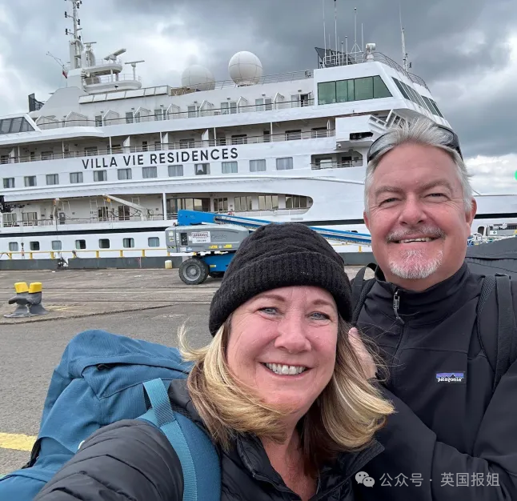 (原始链接: https://mmbiz.qpic.cn/sz_mmbiz_png/VnKUHtWf7xx1DA9Err24k8XjOmaic1CMrXABDmE2NWRibHD2T4l12RTsCpQefs6SiatMuACMYsXOf11vqD6iazicURA/640?wx_fmt=png&from=appmsg)
- 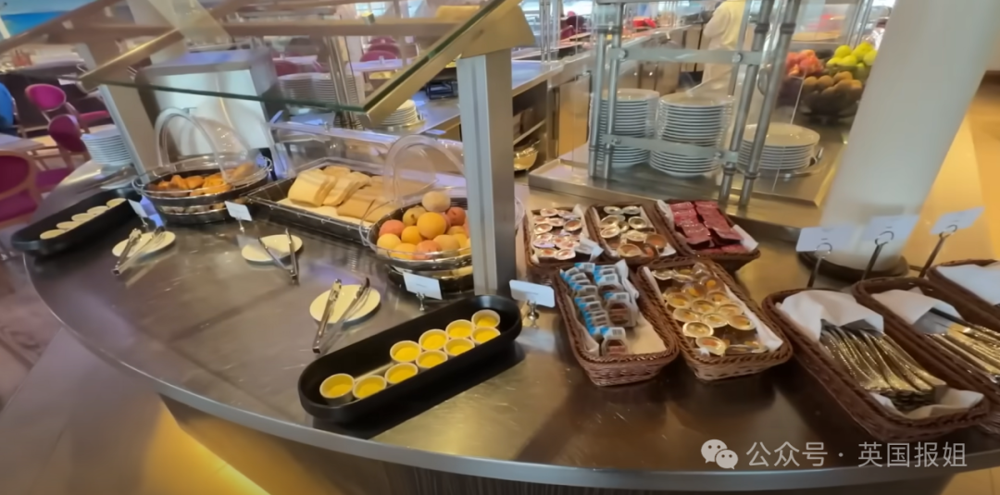 (原始链接: https://mmbiz.qpic.cn/sz_mmbiz_png/VnKUHtWf7xx1DA9Err24k8XjOmaic1CMrLHL1AJPS9vvBeARDRgGcnp14LL0hc4thLFO2xhceoiboDf7qmLQwKkQ/640?wx_fmt=png&from=appmsg)
- 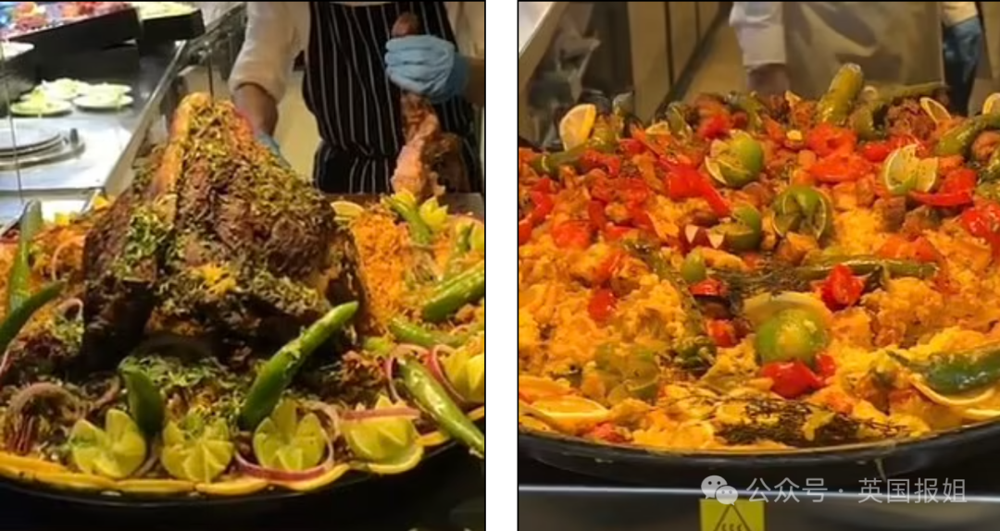 (原始链接: https://mmbiz.qpic.cn/sz_mmbiz_png/VnKUHtWf7xx1DA9Err24k8XjOmaic1CMr4NQzibWDhodJ241AaEGSTpRqHz4nib6uXHEVB5aTH7wKxdicd9KC8ZoEA/640?wx_fmt=png&from=appmsg)
- 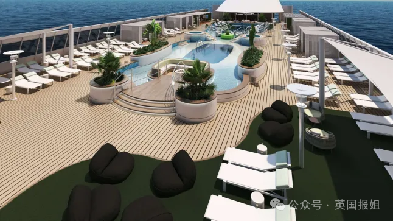 (原始链接: https://mmbiz.qpic.cn/sz_mmbiz_png/VnKUHtWf7xx1DA9Err24k8XjOmaic1CMrnxRB2iapFpotCdg3Tp3DPdGx3mBlnNM0ia4JJOaZzz0bxicu5wpSYicH2A/640?wx_fmt=png&from=appmsg)
- 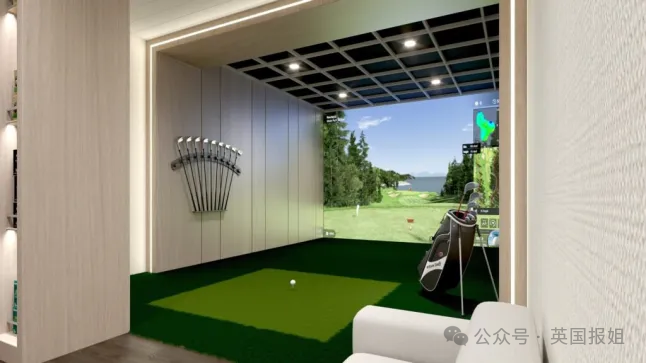 (原始链接: https://mmbiz.qpic.cn/sz_mmbiz_png/VnKUHtWf7xx1DA9Err24k8XjOmaic1CMrUZdAePsOrDIM3dibfHKXLhZkZn9IbjP1arSLhTRYPv7WoHRB9icVIhiaQ/640?wx_fmt=png&from=appmsg)
- 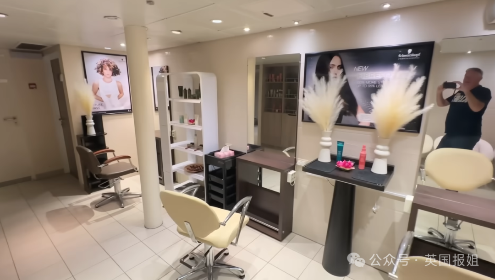 (原始链接: https://mmbiz.qpic.cn/sz_mmbiz_png/VnKUHtWf7xx1DA9Err24k8XjOmaic1CMra7KwjF5CnmFdia4S0nsqFtGaCd6jZSMnJ2GFpfQfgVvicFGXZFOYLLfA/640?wx_fmt=png&from=appmsg)
- 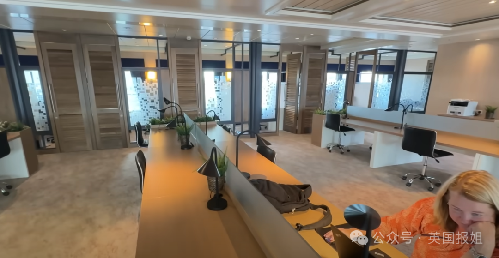 (原始链接: https://mmbiz.qpic.cn/sz_mmbiz_png/VnKUHtWf7xx1DA9Err24k8XjOmaic1CMrdxgJHo4PEZz4wbN76icOjyvMTQf1JtmP4Rkibh4axRur6q07mEdnWQQQ/640?wx_fmt=png&from=appmsg)
- 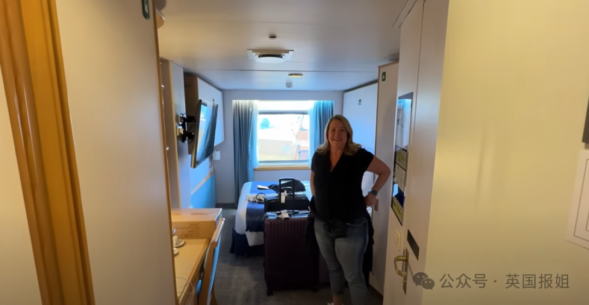 (原始链接: https://mmbiz.qpic.cn/sz_mmbiz_png/VnKUHtWf7xx1DA9Err24k8XjOmaic1CMrcjCZmpNmh8V9NOtZ1e0RMN0icJiaSWPkGvcvFAemQj79PG4kQRUBjujw/640?wx_fmt=png&from=appmsg)
- 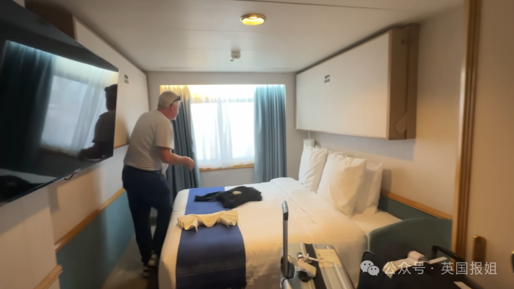 (原始链接: https://mmbiz.qpic.cn/sz_mmbiz_png/VnKUHtWf7xx1DA9Err24k8XjOmaic1CMr45PoXTnAmibACzBMlYrmJ5CP4Alcq7U1SvJNfI1BibYEP6G29KoHiaYmA/640?wx_fmt=png&from=appmsg)
- 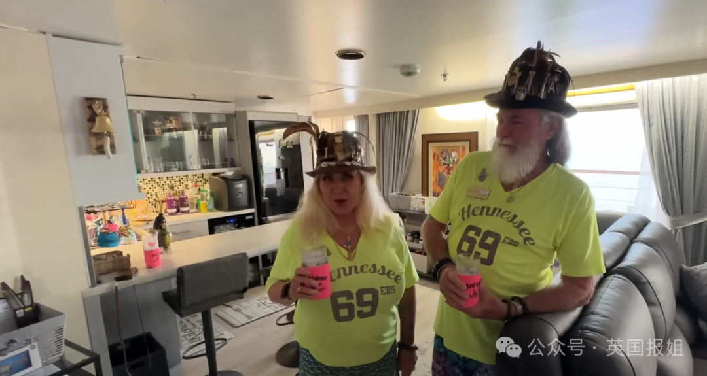 (原始链接: https://mmbiz.qpic.cn/sz_mmbiz_png/VnKUHtWf7xx1DA9Err24k8XjOmaic1CMrGick1KGpOSTJgibE6xBicHHNfU9CrPe5jE1URgbDSQXIrPVHxty4HTjUA/640?wx_fmt=png&from=appmsg)
- 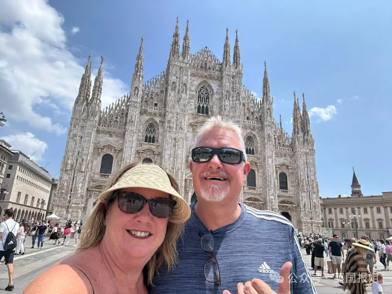 (原始链接: https://mmbiz.qpic.cn/sz_mmbiz_png/VnKUHtWf7xx1DA9Err24k8XjOmaic1CMrk1amQ0hsb8m5uPiafmsblC29THVMpJM9oXIUTGQZwyQJandXwjXmLaQ/640?wx_fmt=png&from=appmsg)
- 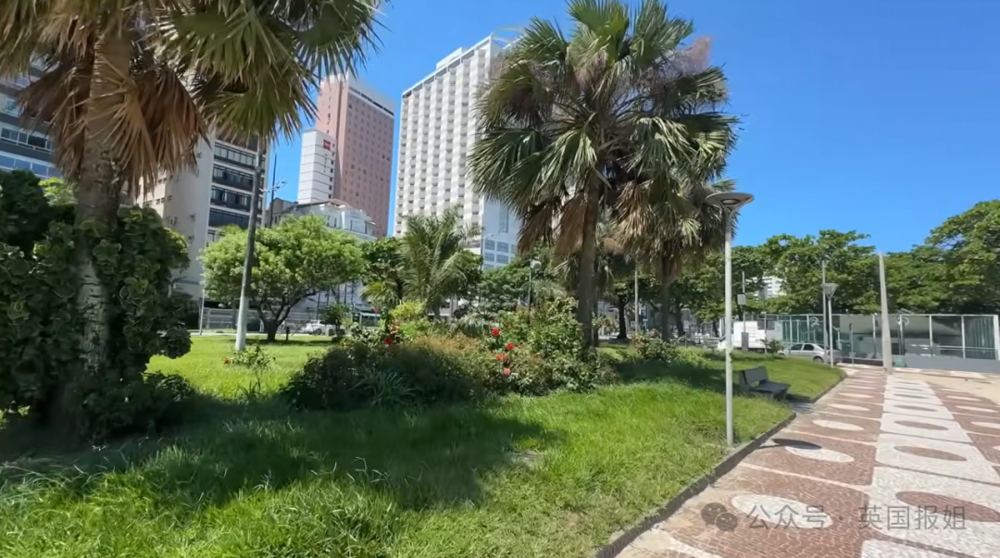 (原始链接: https://mmbiz.qpic.cn/sz_mmbiz_png/VnKUHtWf7xx1DA9Err24k8XjOmaic1CMrgC1oKISrs8cQ7LBZ9m2ng0IJhlXzNefQVEQkt6XicBalyh5eiaxbQ7KQ/640?wx_fmt=png&from=appmsg)
- 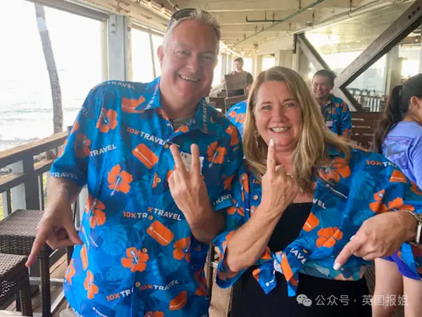 (原始链接: https://mmbiz.qpic.cn/sz_mmbiz_png/VnKUHtWf7xx1DA9Err24k8XjOmaic1CMrBfNuTLyKTMSMadnNDfAS8h37K2JKIhvwt6FJce3QhnQicj7YKWNlngA/640?wx_fmt=png&from=appmsg)
- 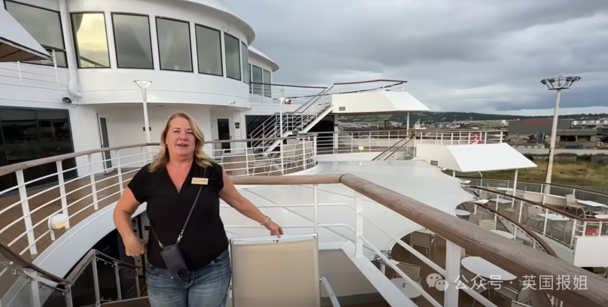 (原始链接: https://mmbiz.qpic.cn/sz_mmbiz_png/VnKUHtWf7xx1DA9Err24k8XjOmaic1CMr48aicR8cibk4haZ0MSF8ZD6XONV2jDiaViaSk9DFbAwgXXVh0lWhXBicCkw/640?wx_fmt=png&from=appmsg)
- 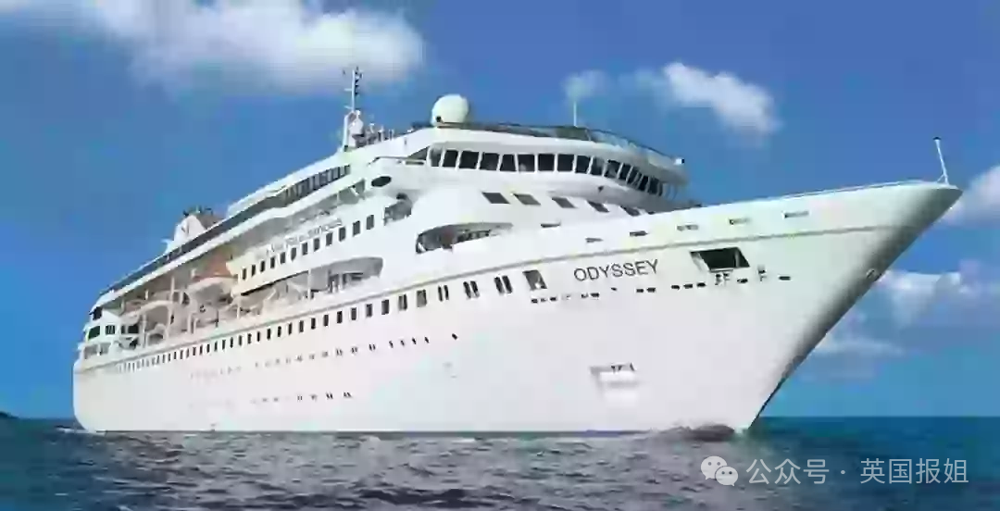 (原始链接: https://mmbiz.qpic.cn/sz_mmbiz_png/VnKUHtWf7xx1DA9Err24k8XjOmaic1CMruzicicDhe5m3DarG2W6JOy7YUic78XTzesPetG5X4Nhvj7lPxU7A5eWww/640?wx_fmt=png&from=appmsg)
- 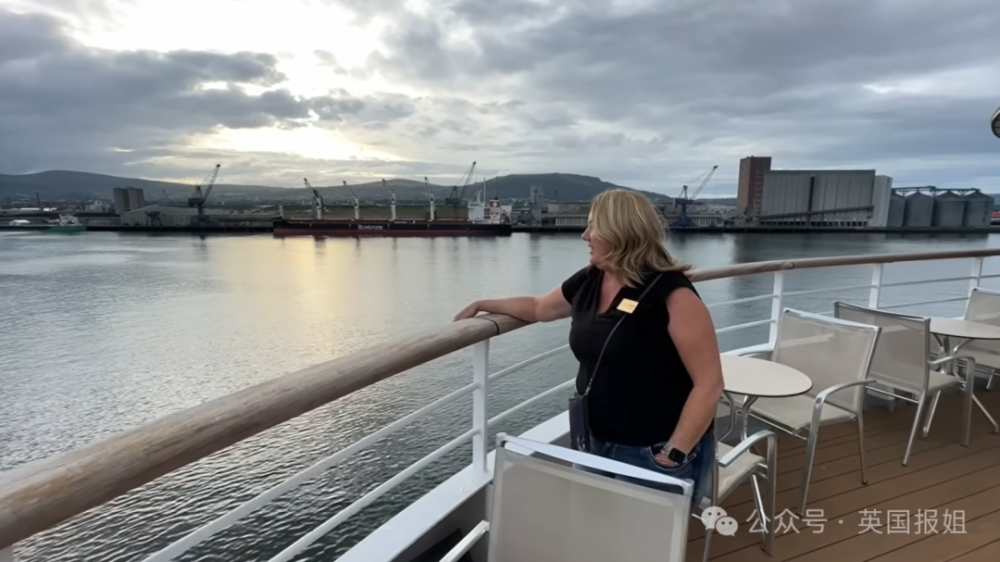 (原始链接: https://mmbiz.qpic.cn/sz_mmbiz_png/VnKUHtWf7xx1DA9Err24k8XjOmaic1CMrhUYexkdkDMBJ6h13lbvON2T4BhQI05fxUZleeqUVM58JibkykXfhktQ/640?wx_fmt=png&from=appmsg)
- 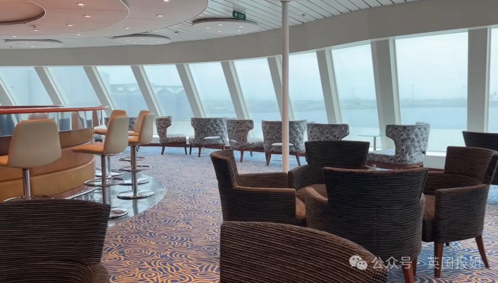 (原始链接: https://mmbiz.qpic.cn/sz_mmbiz_png/VnKUHtWf7xx1DA9Err24k8XjOmaic1CMrqGPTsvZ60GaBey6b3XWCUq74MYrjUhAkhHzlsa6OZKYdkc8kGInnmQ/640?wx_fmt=png&from=appmsg)
- 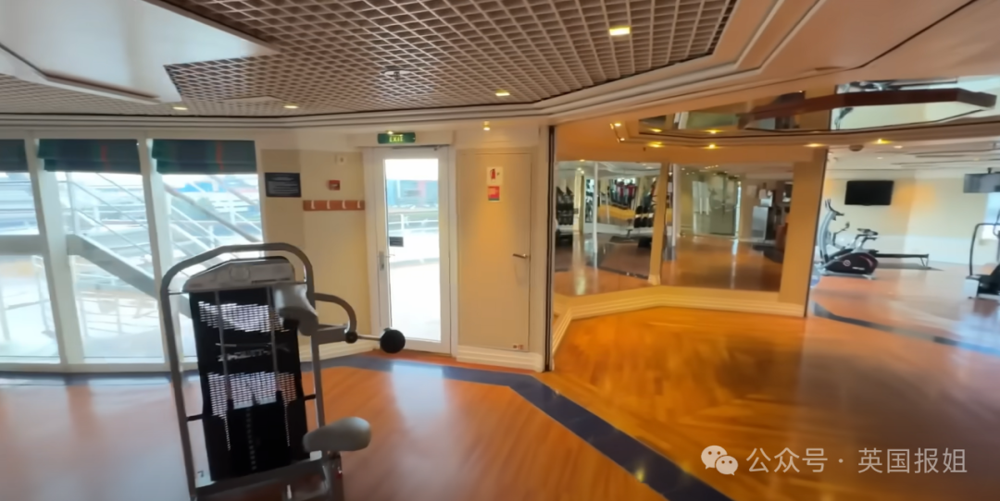 (原始链接: https://mmbiz.qpic.cn/sz_mmbiz_png/VnKUHtWf7xx1DA9Err24k8XjOmaic1CMrDaNsF39b3CbNcx0yiciatfLCVerIn3gFne9p2z9jhZhYs3liabec9tqKA/640?wx_fmt=png&from=appmsg)
-  (原始链接: https://mmbiz.qpic.cn/sz_mmbiz_png/VnKUHtWf7xx1DA9Err24k8XjOmaic1CMrV3uB46PejWG1vicrlzxlcsZVuSnteCALjicXoF7BBWrntpTBt3CkKIsg/640?wx_fmt=png&from=appmsg)
- 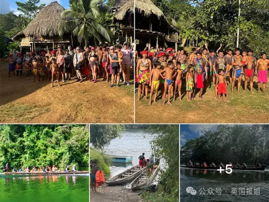 (原始链接: https://mmbiz.qpic.cn/sz_mmbiz_png/VnKUHtWf7xx1DA9Err24k8XjOmaic1CMrroON5LghMibKqb0PqyoeDdKcm4calPKfbXgPaOSLr0lRX6wZicsjQkmQ/640?wx_fmt=png&from=appmsg)
- 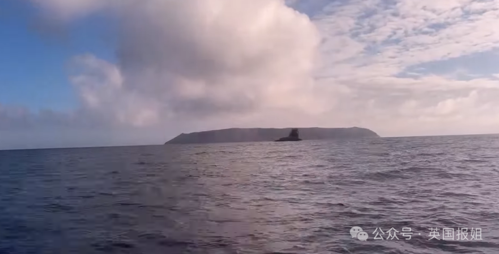 (原始链接: https://mmbiz.qpic.cn/sz_mmbiz_png/VnKUHtWf7xx1DA9Err24k8XjOmaic1CMrWibLtQkj8Fwhphf64qJy5DxSgbEsg4N2cNStfibHG3eG8jTNPDDU9qkg/640?wx_fmt=png&from=appmsg)
- 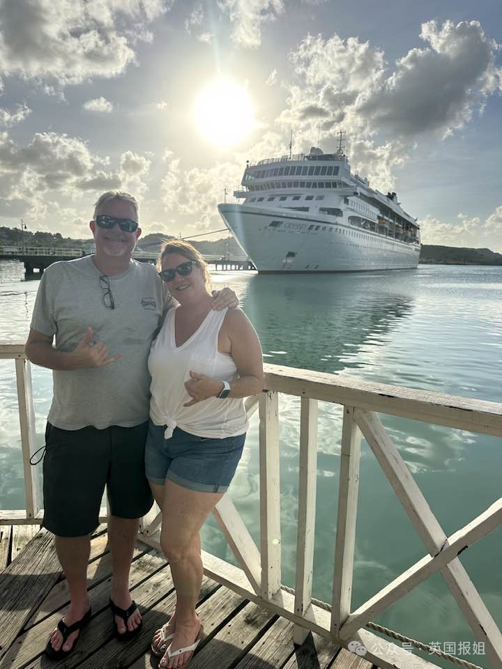 (原始链接: https://mmbiz.qpic.cn/sz_mmbiz_png/VnKUHtWf7xx1DA9Err24k8XjOmaic1CMryV7giaIvwfH7F5rtrK13dfF0CUf3c3JJA5LYwY6btNMszzJc4ic1icvwg/640?wx_fmt=png&from=appmsg)
- 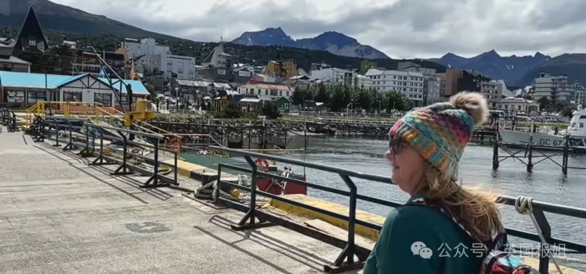 (原始链接: https://mmbiz.qpic.cn/sz_mmbiz_png/VnKUHtWf7xx1DA9Err24k8XjOmaic1CMrlc8IFMHGjOcPEuzK2SlPuPkah19Qic6lRXryjnJrRj4TxIjoPD10UwA/640?wx_fmt=png&from=appmsg)
- 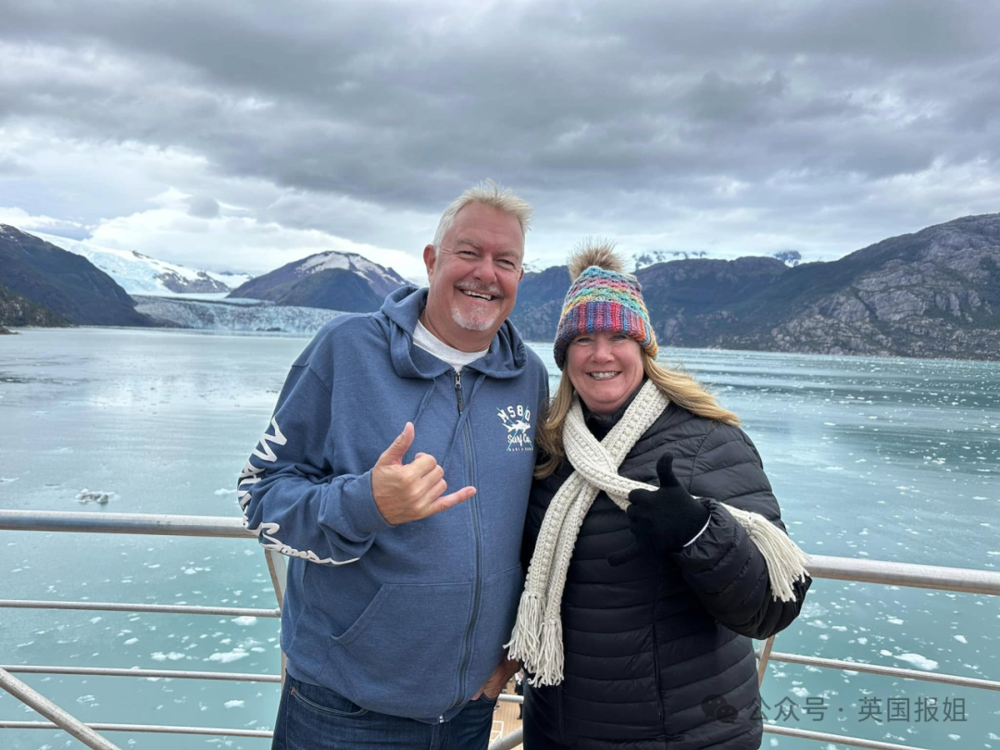 (原始链接: https://mmbiz.qpic.cn/sz_mmbiz_png/VnKUHtWf7xx1DA9Err24k8XjOmaic1CMrKY074JB4wulgsVkOFqVJOjAY1OGiarlvuI40eVp3m7DRZdZyCnzeQWQ/640?wx_fmt=png&from=appmsg)
- 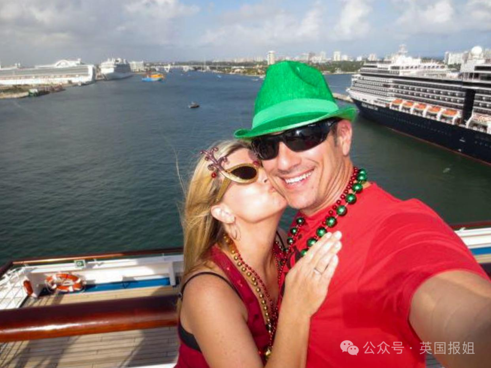 (原始链接: https://mmbiz.qpic.cn/sz_mmbiz_png/VnKUHtWf7xx1DA9Err24k8XjOmaic1CMr3zF6C52slicb2Bq8jHd3DLBibicJKDfnxVDw81mDBoibwNXzHpJDNbNwmQ/640?wx_fmt=png&from=appmsg)
- 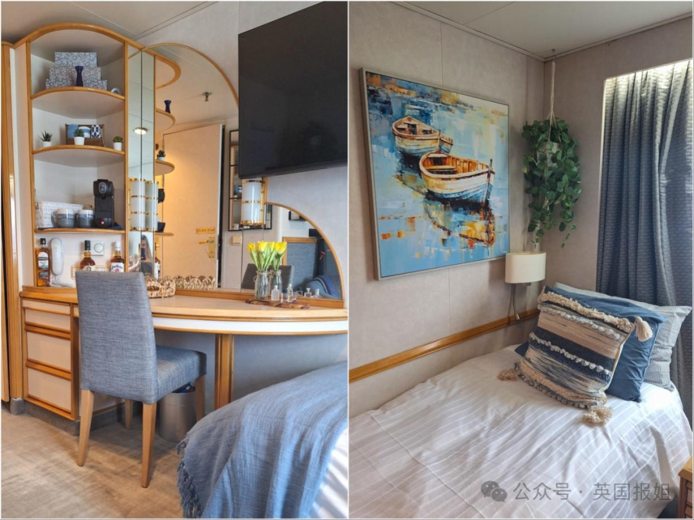 (原始链接: https://mmbiz.qpic.cn/sz_mmbiz_png/VnKUHtWf7xx1DA9Err24k8XjOmaic1CMrC9ssuibov3yCQZun80EVUqu6sHcToCcjI9Tbm9WiaEtJtJyZfsnWvTdg/640?wx_fmt=png&from=appmsg)
- 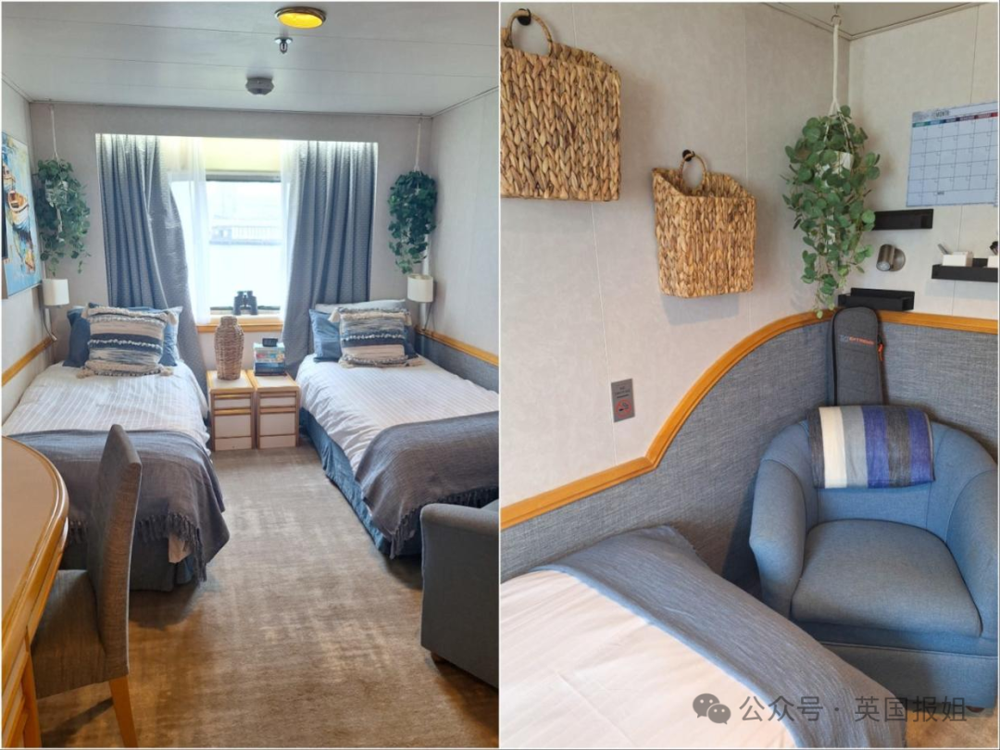 (原始链接: https://mmbiz.qpic.cn/sz_mmbiz_png/VnKUHtWf7xx1DA9Err24k8XjOmaic1CMrS4Vcqh9EHVricicnGZZt6icaEaONCQkeoWq7aSGnwPTS6ofbzMZGkUqFw/640?wx_fmt=png&from=appmsg)
- 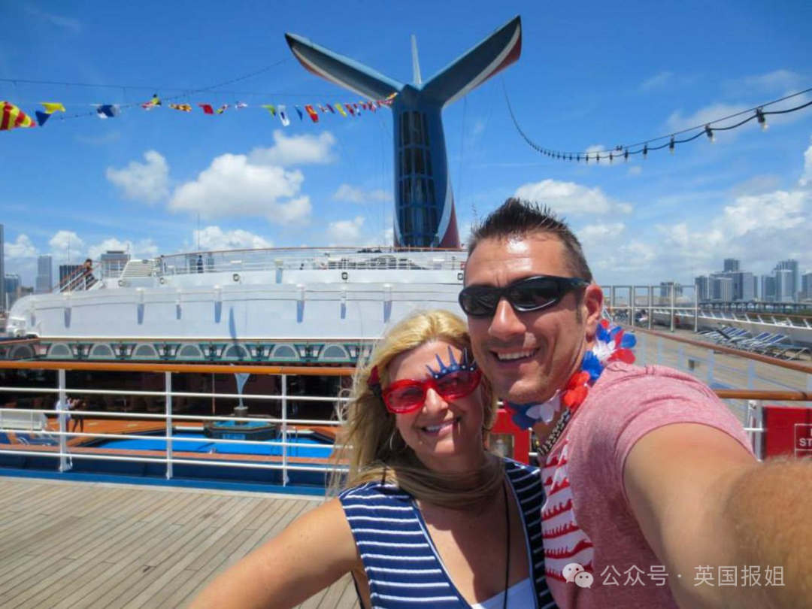 (原始链接: https://mmbiz.qpic.cn/sz_mmbiz_png/VnKUHtWf7xx1DA9Err24k8XjOmaic1CMrZ6NM1vsgRLLEUibUhTLoTqYmNdxGP0ibtuxTMPpGZjxD0KAmW5vfgdVw/640?wx_fmt=png&from=appmsg)
- 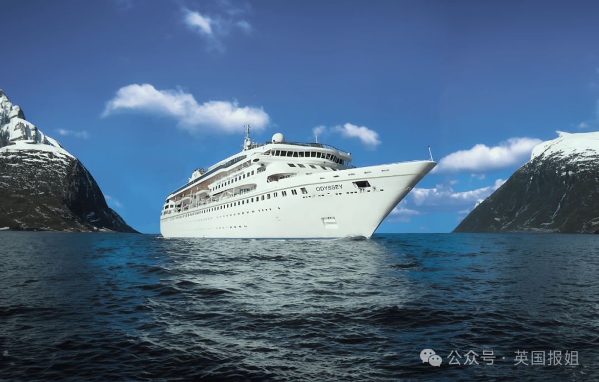 (原始链接: https://mmbiz.qpic.cn/sz_mmbiz_png/VnKUHtWf7xx1DA9Err24k8XjOmaic1CMrtfHAWl49pxDaia1bATrpQTg50VtbHEgxqCXWtTcA6Ju9Jc6ORbDrW8w/640?wx_fmt=png&from=appmsg)
- 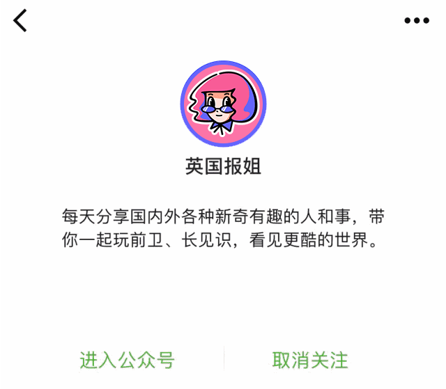 (原始链接: https://mmbiz.qpic.cn/sz_mmbiz_gif/VnKUHtWf7xx6wyMEWFUdHdia44tNvAOuYtXQXHcdYXv1zlcZXmQe3DGbmbroSkXgzsUrdTME9cpNkJSJiaNl6ic8Q/640?wx_fmt=gif&wxfrom=5&wx_lazy=1&wx_co=1&tp=webp)
-  (原始链接: https://mmbiz.qpic.cn/sz_mmbiz_gif/VnKUHtWf7xx6wyMEWFUdHdia44tNvAOuY2MOjZyKqQ08GGubEgQqOnZsTnTicIXlFHBjzyAaeOep9YXvKPnIRDuA/640?wx_fmt=gif&wxfrom=5&wx_lazy=1&wx_co=1&tp=webp)
-  (原始链接: https://mmbiz.qpic.cn/sz_mmbiz_gif/VnKUHtWf7xxjqZqteQ38zK8ExfVBO348NAicCibQXXs2q371uvOYH6zLZQQXicNJoRePDr7ZibVFVVfwaRTykZWmAw/640?wx_fmt=gif&wxfrom=5&wx_lazy=1&wx_co=1&tp=webp)
