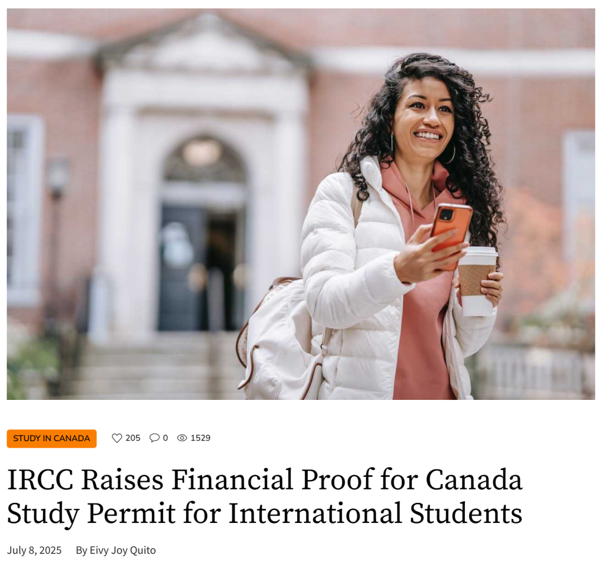
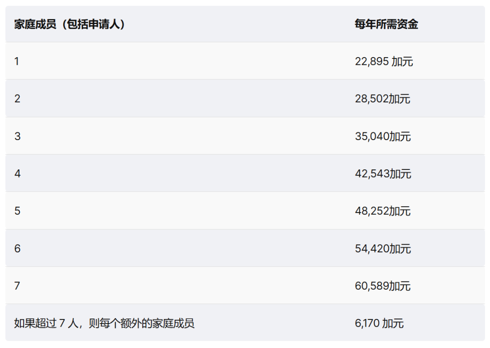
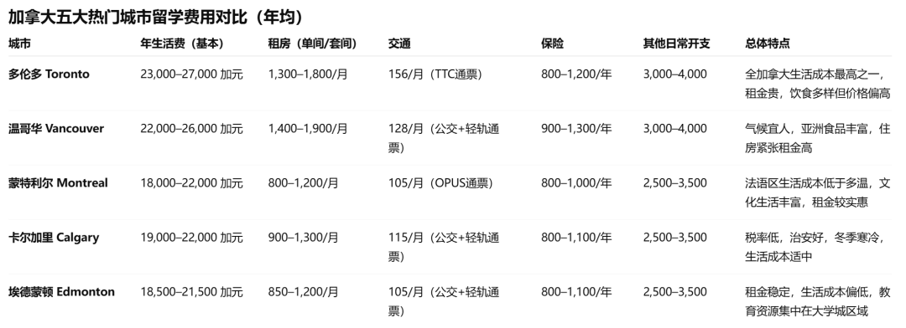
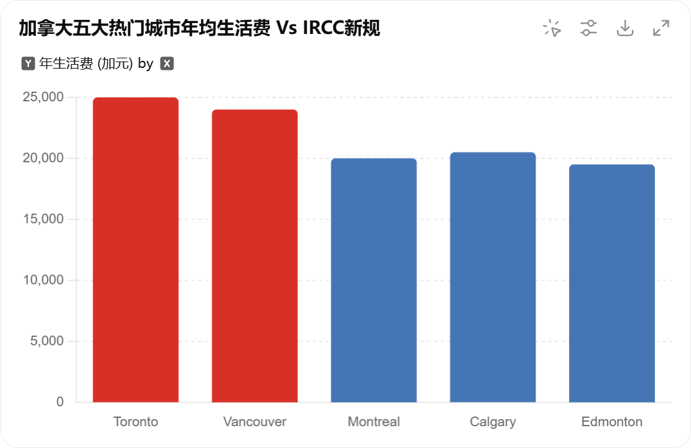
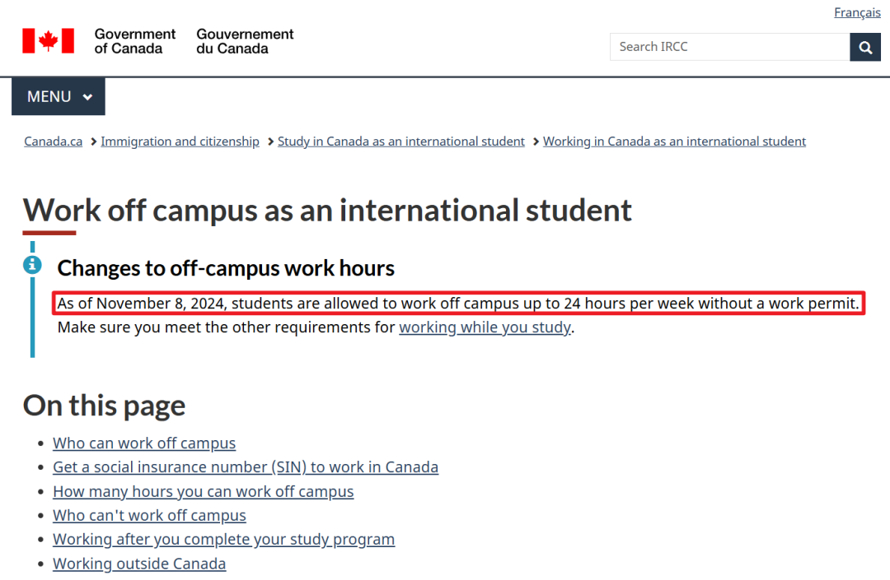
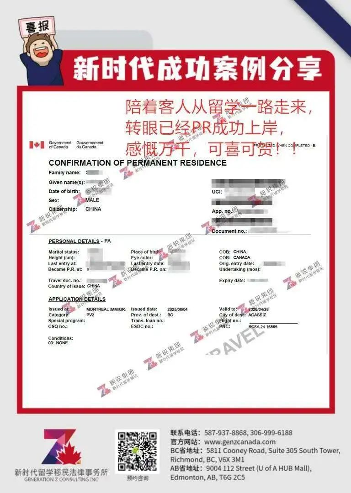

# 无标题

**链接地址:** https://mp.weixin.qq.com/s?__biz=MzUyNzA2NTAwNg==&mid=2247506706&idx=1&sn=e18653cbf5bbf520c13a98a3a778a169&chksm=fbd8ede034d32833bd669d7a4836d91988fb9af7c91738a56992598263e7f7ce2a989513ce5f&mpshare=1&scene=2&srcid=0813MsGxBIWcx1vkptrycziT&sharer_shareinfo=d87f1602d2d2264eb5ed6054b14cf1fe&sharer_shareinfo_first=d87f1602d2d2264eb5ed6054b14cf1fe#rd
**作者:** 你身边的签证专家
**获取时间:** 2025/8/28 18:45:35
**图片数量:** 22

---

## 原始HTML内容

<section style="box-sizing: border-box;font-style: normal;font-weight: 400;text-align: justify;font-size: 16px;color: rgb(62, 62, 62);" data-pm-slice="0 0 []"><section style="text-align: center;margin-top: 10px;margin-bottom: 10px;line-height: 0;box-sizing: border-box;"><section style="max-width: 100%;vertical-align: middle;display: inline-block;line-height: 0;box-sizing: border-box;" nodeleaf=""></section></section><section style="text-align: center;margin-top: 10px;margin-bottom: 10px;line-height: 0;box-sizing: border-box;"><section style="max-width: 100%;vertical-align: middle;display: inline-block;line-height: 0;box-sizing: border-box;" nodeleaf=""></section></section>
 
<section style="font-size: 19px;text-align: center;margin: 10px 0px 3px;box-sizing: border-box;"><section style="display: inline-block;border: 1px solid rgb(188, 65, 65);background-color: rgb(188, 65, 65);width: 1.8em;height: 1.8em;line-height: 1.8em;border-radius: 100%;margin-left: auto;margin-right: auto;font-size: 16px;color: rgb(255, 255, 255);box-sizing: border-box;">
<strong style="box-sizing: border-box;">1</strong>
</section></section><section style="text-align: center;margin: 0px;box-sizing: border-box;"><section style="display: inline-block;width: 0px;height: 0px;vertical-align: top;overflow: hidden;border-style: solid;border-width: 9px 6px 0px;border-color: rgb(188, 65, 65) rgba(255, 255, 255, 0) rgba(255, 255, 255, 0);box-sizing: border-box;"><svg viewBox="0 0 1 1" style="float:left;line-height:0;width:0;vertical-align:top;"></svg></section></section><section style="margin: 0px 0px 10px;text-align: center;justify-content: center;display: flex;flex-flow: row;box-sizing: border-box;"><section style="display: inline-block;width: auto;vertical-align: middle;background-color: rgba(109, 155, 209, 0.1);min-width: 10%;max-width: 100%;flex: 0 0 auto;height: auto;align-self: center;padding: 12px;margin: 0px;box-sizing: border-box;"><section style="color: rgb(109, 155, 209);text-align: justify;box-sizing: border-box;">
<strong style="box-sizing: border-box;">留学资金门槛翻倍涨</strong> 
</section></section></section><section style="font-size: 14px;padding: 0px 15px;letter-spacing: 1px;box-sizing: border-box;">
 

对于计划赴加拿大留学的学生和家庭来说，一条直接影响“钱袋子”的政策已经正式落地——自2025年9月起，加拿大学习签证的<strong style="box-sizing: border-box;">生活资金门槛将全面上调至22,900加元</strong>。

 

新时代留学移民一直强调，<strong style="box-sizing: border-box;">“留学要趁早”</strong>，不仅是因为移民和签证政策风向会变，还因为<strong style="box-sizing: border-box;">成本真的是一年比一年高</strong>。几年前，这笔生活资金证明的要求还在10,000加元左右，如今已经翻倍还多，短短几年就上涨到两万多加元，而且不含学费和旅行费用。

 
</section><section style="text-align: center;margin-top: 10px;margin-bottom: 10px;line-height: 0;box-sizing: border-box;"><section style="max-width: 100%;vertical-align: middle;display: inline-block;line-height: 0;width: 90%;height: auto;box-sizing: border-box;" nodeleaf=""></section></section><section style="font-size: 14px;padding: 0px 15px;letter-spacing: 1px;box-sizing: border-box;">
 

对很多家庭来说，这不仅是账面数字的变化，更意味着留学规划的起跑线被整体抬高。如果再等上几年，按照加拿大的通胀和生活成本趋势，<strong style="box-sizing: border-box;">这个数字很可能继续走高</strong>。今天，我们就从新规细节到背后逻辑，再到应对方案，帮你看清政策的真相与趋势，做到早准备、早申请、早落位，让孩子的<strong style="box-sizing: border-box;">留学之路不被“钱”绊住脚</strong>。
</section>
 

 
<section style="font-size: 19px;text-align: center;margin: 10px 0px 3px;box-sizing: border-box;"><section style="display: inline-block;border: 1px solid rgb(188, 65, 65);background-color: rgb(188, 65, 65);width: 1.8em;height: 1.8em;line-height: 1.8em;border-radius: 100%;margin-left: auto;margin-right: auto;font-size: 16px;color: rgb(255, 255, 255);box-sizing: border-box;">
<strong style="box-sizing: border-box;">2</strong>
</section></section><section style="text-align: center;margin: 0px;box-sizing: border-box;"><section style="display: inline-block;width: 0px;height: 0px;vertical-align: top;overflow: hidden;border-style: solid;border-width: 9px 6px 0px;border-color: rgb(188, 65, 65) rgba(255, 255, 255, 0) rgba(255, 255, 255, 0);box-sizing: border-box;"><svg viewBox="0 0 1 1" style="float:left;line-height:0;width:0;vertical-align:top;"></svg></section></section><section style="margin: 0px 0px 10px;text-align: center;justify-content: center;display: flex;flex-flow: row;box-sizing: border-box;"><section style="display: inline-block;width: auto;vertical-align: middle;background-color: rgba(109, 155, 209, 0.1);min-width: 10%;max-width: 100%;flex: 0 0 auto;height: auto;align-self: center;padding: 12px;margin: 0px;box-sizing: border-box;"><section style="color: rgb(109, 155, 209);text-align: justify;box-sizing: border-box;">
<strong style="box-sizing: border-box;">生活资金提高至22,900加元</strong>
</section></section></section><section style="font-size: 14px;padding: 0px 15px;letter-spacing: 1px;box-sizing: border-box;">
 

自2025年9月1日起，加拿大移民、难民和公民事务部（IRCC）将学习许可（Study Permit）申请的最低生活资金要求<strong style="box-sizing: border-box;">，从2024年的20,635加元提升至22,895加元</strong>，<strong style="box-sizing: border-box;">涨幅高达10.95%</strong>。这是继2024年一次性大幅上调后，<strong style="box-sizing: border-box;">又一次明显的年度增长</strong>。

 
</section><section style="text-align: center;margin-top: 10px;margin-bottom: 10px;line-height: 0;box-sizing: border-box;"><section style="max-width: 100%;vertical-align: middle;display: inline-block;line-height: 0;width: 90%;height: auto;box-sizing: border-box;" nodeleaf=""></section></section><section style="font-size: 14px;padding: 0px 15px;letter-spacing: 1px;box-sizing: border-box;">
 

这一标准基于加拿大统计局发布的低收入门槛（LICO）制定，意味着<strong style="box-sizing: border-box;">这笔资金只是生活开支的最低参考线</strong>，并不包含学费、机票、医疗保险等其他留学成本。按照现行算法，如果是家庭申请，资金证明将按人数叠加。例如：

 

单人：22,895加元

主申请人+配偶：28,502加元

一家三口（主申请人+配偶+一个孩子）：35,040加元 以上数字还需加上第一学年的全部学费和旅行费用，才是<strong style="box-sizing: border-box;">完整的资金准备门槛</strong>。

 
</section><section style="text-align: center;margin-top: 10px;margin-bottom: 10px;line-height: 0;box-sizing: border-box;"><section style="max-width: 100%;vertical-align: middle;display: inline-block;line-height: 0;width: 90%;height: auto;box-sizing: border-box;" nodeleaf=""></section></section><section style="font-size: 14px;padding: 0px 15px;letter-spacing: 1px;box-sizing: border-box;">
 

从历史来看，这一数字的涨幅非常惊人——在<strong style="box-sizing: border-box;">2023年之前，留学生活资金要求多年维持在10,000加元左右</strong>；2024年一次性翻倍至20,635加元，如今又在一年内增加逾2,200加元。短短三年间，资金门槛的绝对值已增长超过一倍，对预算紧张的家庭冲击明显。

 
</section><section style="transform: scale(0.9);-webkit-transform: scale(0.9);-moz-transform: scale(0.9);-o-transform: scale(0.9);transform-origin: center center;-webkit-transform-origin: center center;-moz-transform-origin: center center;-o-transform-origin: center center;margin-top: -6px;margin-bottom: -6px;box-sizing: border-box;"><section style="margin: 10px 0%;text-align: left;justify-content: flex-start;display: flex;flex-flow: row;box-sizing: border-box;"><section style="display: inline-block;vertical-align: middle;width: 50%;padding: 0px 5px 0px 0px;align-self: center;flex: 0 0 auto;box-sizing: border-box;"><section style="text-align: center;margin: 0px 0%;line-height: 0;box-sizing: border-box;"><section style="max-width: 100%;vertical-align: middle;display: inline-block;line-height: 0;box-sizing: border-box;" nodeleaf=""></section></section></section><section style="display: inline-block;vertical-align: middle;width: 50%;padding: 0px 0px 0px 5px;align-self: center;flex: 0 0 auto;box-sizing: border-box;"><section style="text-align: center;margin: 0px 0%;line-height: 0;box-sizing: border-box;"><section style="max-width: 100%;vertical-align: middle;display: inline-block;line-height: 0;box-sizing: border-box;" nodeleaf=""></section></section></section></section></section><section style="transform: scale(0.9);-webkit-transform: scale(0.9);-moz-transform: scale(0.9);-o-transform: scale(0.9);transform-origin: center center;-webkit-transform-origin: center center;-moz-transform-origin: center center;-o-transform-origin: center center;margin-top: -6px;margin-bottom: -6px;box-sizing: border-box;"><section style="margin: 10px 0%;text-align: left;justify-content: flex-start;display: flex;flex-flow: row;box-sizing: border-box;"><section style="display: inline-block;vertical-align: middle;width: 50%;padding: 0px 5px 0px 0px;align-self: center;flex: 0 0 auto;box-sizing: border-box;"><section style="text-align: center;margin: 0px 0%;line-height: 0;box-sizing: border-box;"><section style="max-width: 100%;vertical-align: middle;display: inline-block;line-height: 0;box-sizing: border-box;" nodeleaf=""></section></section></section><section style="display: inline-block;vertical-align: middle;width: 50%;padding: 0px 0px 0px 5px;align-self: center;flex: 0 0 auto;box-sizing: border-box;"><section style="text-align: center;margin: 0px 0%;line-height: 0;box-sizing: border-box;"><section style="max-width: 100%;vertical-align: middle;display: inline-block;line-height: 0;box-sizing: border-box;" nodeleaf=""></section></section></section></section></section><section style="font-size: 14px;padding: 0px 15px;letter-spacing: 1px;box-sizing: border-box;">
 

<strong style="box-sizing: border-box;">适用范围</strong>
<ul style="list-style-type: disc;box-sizing: border-box;padding-left: 20px;list-style-position: outside;" class="list-paddingleft-2"><li style="box-sizing: border-box;">
2025年9月1日及之后递交的学签申请，需按照新标准提供资金证明
</li><li style="box-sizing: border-box;">
已递交且未被退回的申请，将按原标准审理，不受新规影响

 
</li></ul>
留子们，以后跟爸妈申请生活费的时候，<strong style="box-sizing: border-box;">记得把这份官方解读甩过去</strong>——这可不是你想要，是加拿大移民局直接“大开口”的。新时代能替你们撑腰的就到这儿了，拿走不谢。
</section>
 

 
<section style="font-size: 19px;text-align: center;margin: 10px 0px 3px;box-sizing: border-box;"><section style="display: inline-block;border: 1px solid rgb(188, 65, 65);background-color: rgb(188, 65, 65);width: 1.8em;height: 1.8em;line-height: 1.8em;border-radius: 100%;margin-left: auto;margin-right: auto;font-size: 16px;color: rgb(255, 255, 255);box-sizing: border-box;">
<strong style="box-sizing: border-box;">3</strong>
</section></section><section style="text-align: center;margin: 0px;box-sizing: border-box;"><section style="display: inline-block;width: 0px;height: 0px;vertical-align: top;overflow: hidden;border-style: solid;border-width: 9px 6px 0px;border-color: rgb(188, 65, 65) rgba(255, 255, 255, 0) rgba(255, 255, 255, 0);box-sizing: border-box;"><svg viewBox="0 0 1 1" style="float:left;line-height:0;width:0;vertical-align:top;"></svg></section></section><section style="margin: 0px 0px 10px;text-align: center;justify-content: center;display: flex;flex-flow: row;box-sizing: border-box;"><section style="display: inline-block;width: auto;vertical-align: middle;background-color: rgba(109, 155, 209, 0.1);min-width: 10%;max-width: 100%;flex: 0 0 auto;height: auto;align-self: center;padding: 12px;margin: 0px;box-sizing: border-box;"><section style="color: rgb(109, 155, 209);text-align: justify;box-sizing: border-box;">
<strong style="box-sizing: border-box;">加拿大五大热门城市留学费用对比</strong>
</section></section></section><section style="font-size: 14px;padding: 0px 15px;letter-spacing: 1px;box-sizing: border-box;">
 

加拿大不同城市的生活成本差距明显，<strong style="box-sizing: border-box;">多伦多、温哥华的年均开支普遍高于IRCC新规22,900加元标准</strong>，而蒙特利尔、卡尔加里、埃德蒙顿相对接近或低于这一线。

 

了解各地租金、交通、日常消费差异，有助于学生和家庭结合预算做出更合理的留学选址与资金规划。

 
</section><section style="text-align: center;margin-top: 10px;margin-bottom: 10px;line-height: 0;box-sizing: border-box;"><section style="max-width: 100%;vertical-align: middle;display: inline-block;line-height: 0;width: 90%;height: auto;box-sizing: border-box;" nodeleaf=""></section></section><section style="text-align: center;margin-top: 10px;margin-bottom: 10px;line-height: 0;box-sizing: border-box;"><section style="max-width: 100%;vertical-align: middle;display: inline-block;line-height: 0;width: 90%;height: auto;box-sizing: border-box;" nodeleaf=""></section></section><section style="font-size: 14px;padding: 0px 15px;letter-spacing: 1px;box-sizing: border-box;">
 

根据IRCC的新规<strong style="box-sizing: border-box;">（单人生活资金22,900加元）</strong>，多伦多和温哥华的实际生活开支已逼近甚至超出官方最低标准——这意味着在这些城市读书，你需要<strong style="box-sizing: border-box;">额外准备至少10%–15%的应急金</strong>才能从容应对房租和生活波动。而蒙特利尔、卡尔加里、埃德蒙顿等城市的实际生活成本则相对接近新标准，甚至略低，对预算有限的留学生更友好。

 

<strong style="box-sizing: border-box;">总结：</strong>

<strong style="box-sizing: border-box;"> </strong>
<ul style="list-style-type: disc;box-sizing: border-box;padding-left: 20px;list-style-position: outside;" class="list-paddingleft-2"><li style="box-sizing: border-box;">
预算充裕 → 可选多伦多、温哥华，享受国际化大都市资源
</li><li style="box-sizing: border-box;">
追求性价比 → 可考虑蒙特利尔（法语优势）、卡尔加里或埃德蒙顿（生活成本低，租金稳定）
</li></ul>
 
</section><section style="font-size: 19px;text-align: center;margin: 10px 0px 3px;box-sizing: border-box;"><section style="display: inline-block;border: 1px solid rgb(188, 65, 65);background-color: rgb(188, 65, 65);width: 1.8em;height: 1.8em;line-height: 1.8em;border-radius: 100%;margin-left: auto;margin-right: auto;font-size: 16px;color: rgb(255, 255, 255);box-sizing: border-box;">
<strong style="box-sizing: border-box;">4</strong>
</section></section><section style="text-align: center;margin: 0px;box-sizing: border-box;"><section style="display: inline-block;width: 0px;height: 0px;vertical-align: top;overflow: hidden;border-style: solid;border-width: 9px 6px 0px;border-color: rgb(188, 65, 65) rgba(255, 255, 255, 0) rgba(255, 255, 255, 0);box-sizing: border-box;"><svg viewBox="0 0 1 1" style="float:left;line-height:0;width:0;vertical-align:top;"></svg></section></section><section style="margin: 0px 0px 10px;text-align: center;justify-content: center;display: flex;flex-flow: row;box-sizing: border-box;"><section style="display: inline-block;width: auto;vertical-align: middle;background-color: rgba(109, 155, 209, 0.1);min-width: 10%;max-width: 100%;flex: 0 0 auto;height: auto;align-self: center;padding: 12px;margin: 0px;box-sizing: border-box;"><section style="color: rgb(109, 155, 209);text-align: justify;box-sizing: border-box;">
<strong style="box-sizing: border-box;">生活资金上涨背后原因：三大驱动力</strong>
</section></section></section><section style="font-size: 14px;padding: 0px 15px;letter-spacing: 1px;box-sizing: border-box;">
 
</section><section style="display: flex;width: 100%;flex-flow: column;box-sizing: border-box;"><section style="z-index: auto;box-sizing: border-box;"><section style="text-align: left;justify-content: flex-start;display: flex;flex-flow: row;margin: 20px 0px;transform: translate3d(15px, 0px, 0px);-webkit-transform: translate3d(15px, 0px, 0px);-moz-transform: translate3d(15px, 0px, 0px);-o-transform: translate3d(15px, 0px, 0px);box-sizing: border-box;"><section style="display: inline-block;vertical-align: middle;width: auto;background-color: rgb(188, 65, 65);min-width: 5%;max-width: 100%;flex: 0 0 auto;height: auto;align-self: center;box-sizing: border-box;"><section style="text-align: center;transform: translate3d(10px, 0px, 0px);-webkit-transform: translate3d(10px, 0px, 0px);-moz-transform: translate3d(10px, 0px, 0px);-o-transform: translate3d(10px, 0px, 0px);margin: -4px 0px;box-sizing: border-box;"><section style="display: inline-block;width: 42px;height: 42px;vertical-align: top;overflow: hidden;border-radius: 235px;background-color: rgb(233, 224, 245);border-style: solid;border-width: 7px;border-color: rgb(255, 255, 255);box-sizing: border-box;"><section style="margin: 1px 0px 0px;box-sizing: border-box;"><section style="color: rgb(0, 0, 0);box-sizing: border-box;">
<strong style="box-sizing: border-box;">01</strong>
</section></section></section></section></section><section style="display: inline-block;vertical-align: middle;width: auto;align-self: center;flex: 0 0 auto;min-width: 5%;max-width: 100%;height: auto;padding: 0px 0px 0px 10px;box-sizing: border-box;"><section style="text-align: justify;color: rgb(0, 0, 0);box-sizing: border-box;">
<strong style="box-sizing: border-box;">生活成本上涨</strong>
</section></section></section></section></section><section style="font-size: 14px;padding: 0px 15px;letter-spacing: 1px;box-sizing: border-box;">
加拿大住房、食品、交通等开支持续飙升，尤其是多伦多、温哥华等大城市，生活成本上涨速度快于通胀。提高资金门槛，是为了让留学生有能力应对真实的生活成本。

 
</section><section style="display: flex;width: 100%;flex-flow: column;box-sizing: border-box;"><section style="z-index: auto;box-sizing: border-box;"><section style="text-align: left;justify-content: flex-start;display: flex;flex-flow: row;margin: 20px 0px;transform: translate3d(15px, 0px, 0px);-webkit-transform: translate3d(15px, 0px, 0px);-moz-transform: translate3d(15px, 0px, 0px);-o-transform: translate3d(15px, 0px, 0px);box-sizing: border-box;"><section style="display: inline-block;vertical-align: middle;width: auto;background-color: rgb(188, 65, 65);min-width: 5%;max-width: 100%;flex: 0 0 auto;height: auto;align-self: center;box-sizing: border-box;"><section style="text-align: center;transform: translate3d(10px, 0px, 0px);-webkit-transform: translate3d(10px, 0px, 0px);-moz-transform: translate3d(10px, 0px, 0px);-o-transform: translate3d(10px, 0px, 0px);margin: -4px 0px;box-sizing: border-box;"><section style="display: inline-block;width: 42px;height: 42px;vertical-align: top;overflow: hidden;border-radius: 235px;background-color: rgb(233, 224, 245);border-style: solid;border-width: 7px;border-color: rgb(255, 255, 255);box-sizing: border-box;"><section style="margin: 1px 0px 0px;box-sizing: border-box;"><section style="color: rgb(0, 0, 0);box-sizing: border-box;">
<strong style="box-sizing: border-box;">02</strong>
</section></section></section></section></section><section style="display: inline-block;vertical-align: middle;width: auto;align-self: center;flex: 0 0 auto;min-width: 5%;max-width: 100%;height: auto;padding: 0px 0px 0px 10px;box-sizing: border-box;"><section style="text-align: justify;color: rgb(0, 0, 0);box-sizing: border-box;">
<strong style="box-sizing: border-box;">保护学生权益</strong>
</section></section></section></section></section><section style="font-size: 14px;padding: 0px 15px;letter-spacing: 1px;box-sizing: border-box;">
资金不足的留学生往往被迫打多份低薪工、甚至陷入劳工剥削。新规希望让学生专注于学业，减少因生计奔波而带来的学业与安全风险。

 
</section><section style="display: flex;width: 100%;flex-flow: column;box-sizing: border-box;"><section style="z-index: auto;box-sizing: border-box;"><section style="text-align: left;justify-content: flex-start;display: flex;flex-flow: row;margin: 20px 0px;transform: translate3d(15px, 0px, 0px);-webkit-transform: translate3d(15px, 0px, 0px);-moz-transform: translate3d(15px, 0px, 0px);-o-transform: translate3d(15px, 0px, 0px);box-sizing: border-box;"><section style="display: inline-block;vertical-align: middle;width: auto;background-color: rgb(188, 65, 65);min-width: 5%;max-width: 100%;flex: 0 0 auto;height: auto;align-self: center;box-sizing: border-box;"><section style="text-align: center;transform: translate3d(10px, 0px, 0px);-webkit-transform: translate3d(10px, 0px, 0px);-moz-transform: translate3d(10px, 0px, 0px);-o-transform: translate3d(10px, 0px, 0px);margin: -4px 0px;box-sizing: border-box;"><section style="display: inline-block;width: 42px;height: 42px;vertical-align: top;overflow: hidden;border-radius: 235px;background-color: rgb(233, 224, 245);border-style: solid;border-width: 7px;border-color: rgb(255, 255, 255);box-sizing: border-box;"><section style="margin: 1px 0px 0px;box-sizing: border-box;"><section style="color: rgb(0, 0, 0);box-sizing: border-box;">
<strong style="box-sizing: border-box;">03</strong>
</section></section></section></section></section><section style="display: inline-block;vertical-align: middle;width: auto;align-self: center;flex: 0 0 auto;min-width: 5%;max-width: 100%;height: auto;padding: 0px 0px 0px 10px;box-sizing: border-box;"><section style="text-align: justify;color: rgb(0, 0, 0);box-sizing: border-box;">
<strong style="box-sizing: border-box;">对齐国际标准</strong>
</section></section></section></section></section><section style="font-size: 14px;padding: 0px 15px;letter-spacing: 1px;box-sizing: border-box;">
新金额与加拿大统计局的低收入门槛（LICO）接轨，既保证留学生的生活稳定性，也体现了政策对真实成本的反映。
</section>
 

 
<section style="font-size: 19px;text-align: center;margin: 10px 0px 3px;box-sizing: border-box;"><section style="display: inline-block;border: 1px solid rgb(188, 65, 65);background-color: rgb(188, 65, 65);width: 1.8em;height: 1.8em;line-height: 1.8em;border-radius: 100%;margin-left: auto;margin-right: auto;font-size: 16px;color: rgb(255, 255, 255);box-sizing: border-box;">
<strong style="box-sizing: border-box;">5</strong>
</section></section><section style="text-align: center;margin: 0px;box-sizing: border-box;"><section style="display: inline-block;width: 0px;height: 0px;vertical-align: top;overflow: hidden;border-style: solid;border-width: 9px 6px 0px;border-color: rgb(188, 65, 65) rgba(255, 255, 255, 0) rgba(255, 255, 255, 0);box-sizing: border-box;"><svg viewBox="0 0 1 1" style="float:left;line-height:0;width:0;vertical-align:top;"></svg></section></section><section style="margin: 0px 0px 10px;text-align: center;justify-content: center;display: flex;flex-flow: row;box-sizing: border-box;"><section style="display: inline-block;width: auto;vertical-align: middle;background-color: rgba(109, 155, 209, 0.1);min-width: 10%;max-width: 100%;flex: 0 0 auto;height: auto;align-self: center;padding: 12px;margin: 0px;box-sizing: border-box;"><section style="color: rgb(109, 155, 209);text-align: justify;box-sizing: border-box;">
<strong style="box-sizing: border-box;">应对策略：四步化解资金压力</strong>
</section></section></section>
 
<section style="text-align: left;justify-content: flex-start;display: flex;flex-flow: row;margin: 10px 0px;transform: translate3d(15px, 0px, 0px);-webkit-transform: translate3d(15px, 0px, 0px);-moz-transform: translate3d(15px, 0px, 0px);-o-transform: translate3d(15px, 0px, 0px);box-sizing: border-box;"><section style="display: inline-block;vertical-align: middle;width: auto;background-color: rgb(188, 65, 65);min-width: 5%;max-width: 100%;flex: 0 0 auto;height: auto;align-self: center;padding: 4px;box-sizing: border-box;"><section style="font-size: 19px;margin: 0px 0%;text-align: center;box-sizing: border-box;"><section style="display: inline-block;border: 1px solid rgb(255, 255, 255);background-color: rgb(255, 255, 255);width: 1.8em;height: 1.8em;line-height: 1.8em;border-radius: 100%;margin-left: auto;margin-right: auto;font-size: 15px;color: rgb(188, 65, 65);box-sizing: border-box;">
<strong style="box-sizing: border-box;">1</strong>
</section></section></section><section style="display: inline-block;vertical-align: middle;width: auto;align-self: center;flex: 0 0 auto;min-width: 5%;max-width: 100%;height: auto;margin: 0px 0px 0px 11px;box-sizing: border-box;"><section style="text-align: justify;box-sizing: border-box;">
<strong style="box-sizing: border-box;">提前规划预算</strong>
</section></section></section><section style="font-size: 14px;padding: 0px 15px;letter-spacing: 1px;box-sizing: border-box;">
重新计算总成本（学费+生活费+旅行费用），<strong style="box-sizing: border-box;">一线城市建议额外预留10%–15%的应急金</strong>。

 
</section><section style="text-align: left;justify-content: flex-start;display: flex;flex-flow: row;margin: 10px 0px;transform: translate3d(15px, 0px, 0px);-webkit-transform: translate3d(15px, 0px, 0px);-moz-transform: translate3d(15px, 0px, 0px);-o-transform: translate3d(15px, 0px, 0px);box-sizing: border-box;"><section style="display: inline-block;vertical-align: middle;width: auto;background-color: rgb(188, 65, 65);min-width: 5%;max-width: 100%;flex: 0 0 auto;height: auto;align-self: center;padding: 4px;box-sizing: border-box;"><section style="font-size: 19px;margin: 0px 0%;text-align: center;box-sizing: border-box;"><section style="display: inline-block;border: 1px solid rgb(255, 255, 255);background-color: rgb(255, 255, 255);width: 1.8em;height: 1.8em;line-height: 1.8em;border-radius: 100%;margin-left: auto;margin-right: auto;font-size: 15px;color: rgb(188, 65, 65);box-sizing: border-box;">
<strong style="box-sizing: border-box;">2</strong>
</section></section></section><section style="display: inline-block;vertical-align: middle;width: auto;align-self: center;flex: 0 0 auto;min-width: 5%;max-width: 100%;height: auto;margin: 0px 0px 0px 11px;box-sizing: border-box;"><section style="text-align: justify;box-sizing: border-box;">
<strong style="box-sizing: border-box;">争取奖学金与助学金 </strong>
</section></section></section><section style="font-size: 14px;padding: 0px 15px;letter-spacing: 1px;box-sizing: border-box;">
优先申请与专业相关的奖学金，如STEM领域资助额更高；关注政府、院校及第三方平台信息，如Vanier CGS博士奖学金每年可获5万加元。

 
</section><section style="text-align: center;margin-top: 10px;margin-bottom: 10px;line-height: 0;box-sizing: border-box;"><section style="max-width: 100%;vertical-align: middle;display: inline-block;line-height: 0;width: 90%;height: auto;box-sizing: border-box;" nodeleaf=""></section></section><section style="font-size: 14px;padding: 0px 15px;letter-spacing: 1px;box-sizing: border-box;">
 
</section><section style="text-align: left;justify-content: flex-start;display: flex;flex-flow: row;margin: 10px 0px;transform: translate3d(15px, 0px, 0px);-webkit-transform: translate3d(15px, 0px, 0px);-moz-transform: translate3d(15px, 0px, 0px);-o-transform: translate3d(15px, 0px, 0px);box-sizing: border-box;"><section style="display: inline-block;vertical-align: middle;width: auto;background-color: rgb(188, 65, 65);min-width: 5%;max-width: 100%;flex: 0 0 auto;height: auto;align-self: center;padding: 4px;box-sizing: border-box;"><section style="font-size: 19px;margin: 0px 0%;text-align: center;box-sizing: border-box;"><section style="display: inline-block;border: 1px solid rgb(255, 255, 255);background-color: rgb(255, 255, 255);width: 1.8em;height: 1.8em;line-height: 1.8em;border-radius: 100%;margin-left: auto;margin-right: auto;font-size: 15px;color: rgb(188, 65, 65);box-sizing: border-box;">
<strong style="box-sizing: border-box;">3</strong>
</section></section></section><section style="display: inline-block;vertical-align: middle;width: auto;align-self: center;flex: 0 0 auto;min-width: 5%;max-width: 100%;height: auto;margin: 0px 0px 0px 11px;box-sizing: border-box;"><section style="text-align: justify;box-sizing: border-box;">
<strong style="box-sizing: border-box;">合法兼职 </strong>
</section></section></section><section style="font-size: 14px;padding: 0px 15px;letter-spacing: 1px;box-sizing: border-box;">
<strong style="box-sizing: border-box;">学期中每周校外工作不超过24小时</strong>，假期可全职；常见岗位包括校园助教、图书馆管理员、零售店员，既能补贴生活，又积累加拿大工作经验。

 
</section><section style="text-align: left;justify-content: flex-start;display: flex;flex-flow: row;margin: 10px 0px;transform: translate3d(15px, 0px, 0px);-webkit-transform: translate3d(15px, 0px, 0px);-moz-transform: translate3d(15px, 0px, 0px);-o-transform: translate3d(15px, 0px, 0px);box-sizing: border-box;"><section style="display: inline-block;vertical-align: middle;width: auto;background-color: rgb(188, 65, 65);min-width: 5%;max-width: 100%;flex: 0 0 auto;height: auto;align-self: center;padding: 4px;box-sizing: border-box;"><section style="font-size: 19px;margin: 0px 0%;text-align: center;box-sizing: border-box;"><section style="display: inline-block;border: 1px solid rgb(255, 255, 255);background-color: rgb(255, 255, 255);width: 1.8em;height: 1.8em;line-height: 1.8em;border-radius: 100%;margin-left: auto;margin-right: auto;font-size: 15px;color: rgb(188, 65, 65);box-sizing: border-box;">
<strong style="box-sizing: border-box;">4</strong>
</section></section></section><section style="display: inline-block;vertical-align: middle;width: auto;align-self: center;flex: 0 0 auto;min-width: 5%;max-width: 100%;height: auto;margin: 0px 0px 0px 11px;box-sizing: border-box;"><section style="text-align: justify;box-sizing: border-box;">
<strong style="box-sizing: border-box;">资金证明合规化</strong>
</section></section></section><section style="font-size: 14px;padding: 0px 15px;letter-spacing: 1px;box-sizing: border-box;">
银行流水需覆盖近4个月，电子签章齐全；优选五大国有银行或大型商业银行出具证明；办理GIC（担保投资证）存入指定加拿大金融机构，金额至少1万加元。

 
</section><section style="text-align: center;margin-top: 10px;margin-bottom: 10px;line-height: 0;box-sizing: border-box;"><section style="max-width: 100%;vertical-align: middle;display: inline-block;line-height: 0;width: 90%;height: auto;box-sizing: border-box;" nodeleaf=""></section></section><section style="font-size: 14px;padding: 0px 15px;letter-spacing: 1px;box-sizing: border-box;">
 

短期看，资金门槛的提升<strong style="box-sizing: border-box;">会让部分学生推迟入学或转向低成本地区</strong>，但对于经济基础扎实的学生，留学过程将更稳定、安全。

 

长期来看，资金充裕的学生更有可能顺利完成学业，进入加拿大就业市场，并通过毕业工签（PGWP）积累经验，提升EE快速通道（Express Entry）移民评分。

 
</section><section style="text-align: center;justify-content: center;display: flex;flex-flow: row;margin: 10px 0px;box-sizing: border-box;"><section style="display: inline-block;vertical-align: middle;width: auto;align-self: center;flex: 0 0 auto;min-width: 5%;max-width: 100%;height: auto;box-sizing: border-box;"><section style="margin: 7px 0px 0px;line-height: 0;box-sizing: border-box;"><section style="max-width: 100%;vertical-align: middle;display: inline-block;line-height: 0;width: 78px;height: auto;box-sizing: border-box;" nodeleaf=""></section></section></section><section style="display: inline-block;vertical-align: middle;width: auto;align-self: center;flex: 0 0 auto;min-width: 5%;max-width: 100%;height: auto;padding: 0px 0px 0px 6px;box-sizing: border-box;"><section style="margin: 3px 0px 0px;line-height: 0;box-sizing: border-box;"><section style="max-width: 100%;vertical-align: middle;display: inline-block;line-height: 0;width: 19px;height: auto;box-sizing: border-box;" nodeleaf=""></section></section></section><section style="display: inline-block;vertical-align: middle;width: auto;min-width: 5%;max-width: 100%;flex: 0 0 auto;height: auto;align-self: center;box-sizing: border-box;"><section style="transform: perspective(0px);-webkit-transform: perspective(0px);-moz-transform: perspective(0px);-o-transform: perspective(0px);transform-style: flat;box-sizing: border-box;"><section style="margin: 0px;line-height: 0;transform: rotateX(180deg) rotateY(180deg);-webkit-transform: rotateX(180deg) rotateY(180deg);-moz-transform: rotateX(180deg) rotateY(180deg);-o-transform: rotateX(180deg) rotateY(180deg);box-sizing: border-box;"><section style="max-width: 100%;vertical-align: middle;display: inline-block;line-height: 0;width: 78px;height: auto;box-sizing: border-box;" nodeleaf=""></section></section></section></section></section>
 
<section style="font-size: 14px;padding: 0px 15px;letter-spacing: 1px;box-sizing: border-box;">
 

在新时代看来，加拿大此次提高留学生活资金门槛，不是单纯的“门槛加高”，而是对留学生的<strong style="box-sizing: border-box;">经济能力进行筛选</strong>，让真正能承担生活与学业成本的学生留下来。

 
</section><section style="text-align: center;margin-top: 10px;margin-bottom: 10px;line-height: 0;box-sizing: border-box;"><section style="max-width: 100%;vertical-align: middle;display: inline-block;line-height: 0;width: 90%;height: auto;box-sizing: border-box;" nodeleaf=""></section></section><section style="font-size: 14px;padding: 0px 15px;letter-spacing: 1px;box-sizing: border-box;">
 

但很多学生和家长在规划加拿大留学时，容易把注意力集中在大学排名或学费高低上，但<strong style="box-sizing: border-box;">真实的留学决策远不止这些表面因素</strong>。

 

城市的生活成本、当地就业市场、行业发展趋势、毕业后工签（PGWP）政策、甚至移民评分体系的细节，都会直接影响未来的职业发展与身份规划。如果前期只看排名和费用，很可能在学业后半段才发现<strong style="box-sizing: border-box;">就业受限、移民加分不足，陷入被动局面</strong>。

 
</section><section style="text-align: center;margin-top: 10px;margin-bottom: 10px;line-height: 0;box-sizing: border-box;"><section style="max-width: 100%;vertical-align: middle;display: inline-block;line-height: 0;box-sizing: border-box;" nodeleaf=""></section></section><section style="text-align: center;font-size: 12px;color: rgb(121, 121, 121);box-sizing: border-box;">
（近期成功案例一览）
</section><section style="font-size: 14px;padding: 0px 15px;letter-spacing: 1px;box-sizing: border-box;">
 

新时代留学移民建议，<strong style="box-sizing: border-box;">把留学规划当作一条完整的路线来设计</strong>——从选校、选专业，到毕业后的就业落点与移民通道，都要提前打通思路。我们熟悉加拿大各省的政策差异和最新动态，可以为你定制<strong style="box-sizing: border-box;">“从学签到身份”的一站式方案</strong>，让留学投资发挥最大价值，也让你的未来走得更稳、更远。

 
</section>
 
<section style="padding: 0px 15px;font-size: 12px;color: rgb(121, 121, 121);box-sizing: border-box;">
<strong style="box-sizing: border-box;">参考信息：</strong>

<strong style="box-sizing: border-box;"> </strong>

<strong style="box-sizing: border-box;">https://immigcanada.com/ircc-raises-financial-proof-for-canada-study-permit/</strong>
</section>
 

 
<section style="text-align: left;justify-content: flex-start;display: flex;flex-flow: row;margin: 10px 0px 0px;box-sizing: border-box;"><section style="display: inline-block;vertical-align: top;width: auto;align-self: stretch;flex: 0 0 auto;background-color: rgb(188, 65, 65);min-width: 5%;max-width: 100%;height: auto;padding: 9px 9px 0px 20px;box-sizing: border-box;"><section style="text-align: justify;font-size: 18px;color: rgb(252, 252, 252);box-sizing: border-box;">
<strong style="box-sizing: border-box;">阅读更多</strong>
</section></section><section style="display: inline-block;vertical-align: top;width: auto;min-width: 5%;max-width: 100%;flex: 0 0 auto;height: auto;align-self: stretch;box-sizing: border-box;"><section style="box-sizing: border-box;"><section style="display: inline-block;width: 0px;height: 0px;vertical-align: top;overflow: hidden;border-style: solid;border-width: 45px 0px 0px 19px;border-color: rgba(255, 255, 255, 0) rgba(255, 255, 255, 0) rgba(255, 255, 255, 0) rgb(188, 65, 65);box-sizing: border-box;"><svg viewBox="0 0 1 1" style="float:left;line-height:0;width:0;vertical-align:top;"></svg></section></section></section></section><section style="margin: 0px 0px 10px;box-sizing: border-box;"><section style="background-color: rgb(188, 65, 65);height: 3px;box-sizing: border-box;"><svg viewBox="0 0 1 1" style="float:left;line-height:0;width:0;vertical-align:top;"></svg></section></section><section data-cacheurl="" data-remoteid="" style="margin: 10px 0%;text-align: left;justify-content: flex-start;display: flex;flex-flow: row;width: 100%;background-position: 45.4954% 45.3759%;background-repeat: repeat;background-size: 108.814%;background-attachment: scroll;padding: 30px;align-self: flex-start;box-sizing: border-box;background-image: url(&quot;https://mmbiz.qpic.cn/mmbiz_jpg/904kUibXm7Y5CWklzm08zUxyDEyjx0YEolWEkwyxnsozp2jvLBu2zS89iaJUVefVkdsdUicUA7tpzFUuNWccCz2Qg/640?wx_fmt=jpeg&amp;from=appmsg&quot;);"><section style="text-align: justify;justify-content: flex-start;display: flex;flex-flow: row;width: 100%;background-color: rgba(62, 62, 62, 0.61);padding: 10px;border-width: 0px;border-style: none;border-color: rgb(62, 62, 62);align-self: flex-start;box-sizing: border-box;"><section style="text-align: left;color: rgb(255, 255, 255);font-size: 14px;width: 100%;box-sizing: border-box;">
<strong style="box-sizing: border-box;"><a class="normal_text_link" target="_blank" style="color: rgb(255, 255, 255);" href="https://mp.weixin.qq.com/s?__biz=MzUyNzA2NTAwNg==&amp;mid=2247506513&amp;idx=1&amp;sn=16ba4e1ffc26477ad5a679874d2ea860&amp;scene=21#wechat_redirect" textvalue="美国签证“免面试”时代谢幕，14岁以下、79岁以上统统要面签，续签也难逃！……" data-itemshowtype="0" linktype="text" data-linktype="2">美国签证“免面试”时代谢幕，14岁以下、79岁以上统统要面签，续签也难逃！……</a></strong>
</section></section></section><section data-cacheurl="" data-remoteid="" style="margin: 10px 0%;text-align: left;justify-content: flex-start;display: flex;flex-flow: row;width: 100%;background-position: 61.6687% 46.5499%;background-repeat: repeat;background-size: 107.269%;background-attachment: scroll;padding: 30px;align-self: flex-start;box-sizing: border-box;background-image: url(&quot;https://mmbiz.qpic.cn/mmbiz_png/904kUibXm7Y5CWklzm08zUxyDEyjx0YEowuehWMS3h825fxJxmvnOT3fQWfvicUkwO1Mxf0X6O64MdIWbYia6ZMgg/640?wx_fmt=png&amp;from=appmsg&quot;);"><section style="text-align: justify;justify-content: flex-start;display: flex;flex-flow: row;width: 100%;background-color: rgba(62, 62, 62, 0.61);padding: 10px;border-width: 0px;border-style: none;border-color: rgb(62, 62, 62);align-self: flex-start;box-sizing: border-box;"><section style="text-align: left;color: rgb(255, 255, 255);font-size: 14px;width: 100%;box-sizing: border-box;">
<strong style="box-sizing: border-box;"><a class="normal_text_link" target="_blank" style="color: rgb(255, 255, 255);" href="https://mp.weixin.qq.com/s?__biz=MzUyNzA2NTAwNg==&amp;mid=2247506371&amp;idx=1&amp;sn=4818b596d41e936919d7c58b3b46ddc5&amp;scene=21#wechat_redirect" textvalue="特朗普又来“抢劫”了！推出赴美签证押金高达15,000美元，8月20日启动试点！…" data-itemshowtype="0" linktype="text" data-linktype="2">特朗普又来“抢劫”了！推出赴美签证押金高达15,000美元，8月20日启动试点！…</a></strong>
</section></section></section><section data-cacheurl="" data-remoteid="" style="margin: 10px 0%;text-align: left;justify-content: flex-start;display: flex;flex-flow: row;width: 100%;background-position: 60.0182% 56.77%;background-repeat: repeat;background-size: 106.757%;background-attachment: scroll;padding: 30px;align-self: flex-start;box-sizing: border-box;background-image: url(&quot;https://mmbiz.qpic.cn/mmbiz_png/904kUibXm7Y5CWklzm08zUxyDEyjx0YEoret9mBNCgaPyZWARyONcp2kkAdateciclWicAbPt4sfOPMWhxmicaCdjQ/640?wx_fmt=png&amp;from=appmsg&quot;);"><section style="text-align: justify;justify-content: flex-start;display: flex;flex-flow: row;width: 100%;background-color: rgba(62, 62, 62, 0.61);padding: 10px;border-width: 0px;border-style: none;border-color: rgb(62, 62, 62);align-self: flex-start;box-sizing: border-box;"><section style="text-align: center;color: rgb(255, 255, 255);font-size: 14px;width: 100%;box-sizing: border-box;">
<strong style="box-sizing: border-box;"><a class="normal_text_link" target="_blank" style="color: rgb(255, 255, 255);" href="https://mp.weixin.qq.com/s?__biz=MzUyNzA2NTAwNg==&amp;mid=2247506338&amp;idx=1&amp;sn=bfd3953b4bbd210b41852c9f2b75c33a&amp;scene=21#wechat_redirect" textvalue="IRCC突调超级签证门槛：2025年起担保人收入要求全线上涨！探亲也讲“经济实力”！……" data-itemshowtype="0" linktype="text" data-linktype="2">IRCC突调超级签证门槛：2025年起担保人收入要求全线上涨！探亲也讲“经济实力”！……</a></strong>
</section></section></section><section data-cacheurl="" data-remoteid="" style="margin: 10px 0%;text-align: left;justify-content: flex-start;display: flex;flex-flow: row;width: 100%;background-position: 26.1451% 43.7557%;background-repeat: repeat;background-size: 104.35%;background-attachment: scroll;padding: 30px;align-self: flex-start;box-sizing: border-box;background-image: url(&quot;https://mmbiz.qpic.cn/mmbiz_jpg/904kUibXm7Y5CWklzm08zUxyDEyjx0YEoOnibBlWJMAhQKopTzQtVuiajQvzzlFVvy5wJgNJb5FZicSic3veeHliaGNg/640?wx_fmt=jpeg&amp;from=appmsg&quot;);"><section style="text-align: justify;justify-content: flex-start;display: flex;flex-flow: row;width: 100%;background-color: rgba(62, 62, 62, 0.61);padding: 10px;border-width: 0px;border-style: none;border-color: rgb(62, 62, 62);align-self: flex-start;box-sizing: border-box;"><section style="text-align: center;color: rgb(255, 255, 255);font-size: 14px;width: 100%;box-sizing: border-box;">
<strong style="box-sizing: border-box;"><a class="normal_text_link" target="_blank" style="color: rgb(255, 255, 255);" href="https://mp.weixin.qq.com/s?__biz=MzUyNzA2NTAwNg==&amp;mid=2247506290&amp;idx=1&amp;sn=b33860fb7cccf9742dbf8ef26413eda9&amp;scene=21#wechat_redirect" textvalue="加拿大拒签信改革！签证官“拒签原文理由”将直接附上，7月29日正式实施！……" data-itemshowtype="0" linktype="text" data-linktype="2">加拿大拒签信改革！签证官“拒签原文理由”将直接附上，7月29日正式实施！……</a></strong>
</section></section></section><section style="text-align: center;font-size: 12px;color: rgb(180, 180, 180);box-sizing: border-box;">
（点击文字阅读）
</section><section style="margin: 10px 0%;text-align: left;justify-content: flex-start;display: flex;flex-flow: row;width: 100%;background-color: rgb(216, 202, 160);line-height: 0;align-self: flex-start;box-sizing: border-box;"><section data-cacheurl="" data-remoteid="" style="text-align: justify;justify-content: flex-start;display: flex;flex-flow: row;width: 100%;background-position: 0% 0%;background-repeat: repeat;background-size: 1.56658%;background-attachment: scroll;padding: 0px;align-self: flex-start;box-sizing: border-box;background-image: url(&quot;https://mmbiz.qpic.cn/mmbiz_png/904kUibXm7Y5CWklzm08zUxyDEyjx0YEodVoH9H5PYK5gFIzoA2WhiaQJtPVgdHpdRsyJqiacmzPfADSR5Ttxg7iaQ/640?wx_fmt=png&amp;from=appmsg&quot;);"><section style="text-align: center;width: 100%;box-sizing: border-box;"><section style="display: inline-block;width: 100%;height: 11px;vertical-align: top;overflow: hidden;background-color: rgba(255, 255, 255, 0);box-sizing: border-box;"><svg viewBox="0 0 1 1" style="float:left;line-height:0;width:0;vertical-align:top;"></svg></section></section></section></section><section style="text-align: center;margin-top: 10px;margin-bottom: 10px;line-height: 0;box-sizing: border-box;"><section style="max-width: 100%;vertical-align: middle;display: inline-block;line-height: 0;box-sizing: border-box;" nodeleaf=""></section></section><section style="text-align: center;margin-top: 10px;margin-bottom: 10px;line-height: 0;box-sizing: border-box;"><section style="max-width: 100%;vertical-align: middle;display: inline-block;line-height: 0;box-sizing: border-box;" nodeleaf=""></section></section><section style="text-align: center;margin-top: 10px;margin-bottom: 10px;line-height: 0;box-sizing: border-box;"><section style="max-width: 100%;vertical-align: middle;display: inline-block;line-height: 0;box-sizing: border-box;" nodeleaf=""></section></section><section style="text-align: center;margin-top: 10px;margin-bottom: 10px;line-height: 0;box-sizing: border-box;"><section style="max-width: 100%;vertical-align: middle;display: inline-block;line-height: 0;box-sizing: border-box;" nodeleaf=""></section></section></section><section> </section>
<mp-style-type data-value="3"></mp-style-type>

---

## 纯文本内容

1留学资金门槛翻倍涨对于计划赴加拿大留学的学生和家庭来说，一条直接影响“钱袋子”的政策已经正式落地——自2025年9月起，加拿大学习签证的生活资金门槛将全面上调至22,900加元。新时代留学移民一直强调，“留学要趁早”，不仅是因为移民和签证政策风向会变，还因为成本真的是一年比一年高。几年前，这笔生活资金证明的要求还在10,000加元左右，如今已经翻倍还多，短短几年就上涨到两万多加元，而且不含学费和旅行费用。对很多家庭来说，这不仅是账面数字的变化，更意味着留学规划的起跑线被整体抬高。如果再等上几年，按照加拿大的通胀和生活成本趋势，这个数字很可能继续走高。今天，我们就从新规细节到背后逻辑，再到应对方案，帮你看清政策的真相与趋势，做到早准备、早申请、早落位，让孩子的留学之路不被“钱”绊住脚。2生活资金提高至22,900加元自2025年9月1日起，加拿大移民、难民和公民事务部（IRCC）将学习许可（Study Permit）申请的最低生活资金要求，从2024年的20,635加元提升至22,895加元，涨幅高达10.95%。这是继2024年一次性大幅上调后，又一次明显的年度增长。这一标准基于加拿大统计局发布的低收入门槛（LICO）制定，意味着这笔资金只是生活开支的最低参考线，并不包含学费、机票、医疗保险等其他留学成本。按照现行算法，如果是家庭申请，资金证明将按人数叠加。例如：单人：22,895加元主申请人+配偶：28,502加元一家三口（主申请人+配偶+一个孩子）：35,040加元以上数字还需加上第一学年的全部学费和旅行费用，才是完整的资金准备门槛。从历史来看，这一数字的涨幅非常惊人——在2023年之前，留学生活资金要求多年维持在10,000加元左右；2024年一次性翻倍至20,635加元，如今又在一年内增加逾2,200加元。短短三年间，资金门槛的绝对值已增长超过一倍，对预算紧张的家庭冲击明显。适用范围2025年9月1日及之后递交的学签申请，需按照新标准提供资金证明已递交且未被退回的申请，将按原标准审理，不受新规影响留子们，以后跟爸妈申请生活费的时候，记得把这份官方解读甩过去——这可不是你想要，是加拿大移民局直接“大开口”的。新时代能替你们撑腰的就到这儿了，拿走不谢。3加拿大五大热门城市留学费用对比加拿大不同城市的生活成本差距明显，多伦多、温哥华的年均开支普遍高于IRCC新规22,900加元标准，而蒙特利尔、卡尔加里、埃德蒙顿相对接近或低于这一线。了解各地租金、交通、日常消费差异，有助于学生和家庭结合预算做出更合理的留学选址与资金规划。根据IRCC的新规（单人生活资金22,900加元），多伦多和温哥华的实际生活开支已逼近甚至超出官方最低标准——这意味着在这些城市读书，你需要额外准备至少10%–15%的应急金才能从容应对房租和生活波动。而蒙特利尔、卡尔加里、埃德蒙顿等城市的实际生活成本则相对接近新标准，甚至略低，对预算有限的留学生更友好。总结：预算充裕 → 可选多伦多、温哥华，享受国际化大都市资源追求性价比 → 可考虑蒙特利尔（法语优势）、卡尔加里或埃德蒙顿（生活成本低，租金稳定）4生活资金上涨背后原因：三大驱动力01生活成本上涨加拿大住房、食品、交通等开支持续飙升，尤其是多伦多、温哥华等大城市，生活成本上涨速度快于通胀。提高资金门槛，是为了让留学生有能力应对真实的生活成本。02保护学生权益资金不足的留学生往往被迫打多份低薪工、甚至陷入劳工剥削。新规希望让学生专注于学业，减少因生计奔波而带来的学业与安全风险。03对齐国际标准新金额与加拿大统计局的低收入门槛（LICO）接轨，既保证留学生的生活稳定性，也体现了政策对真实成本的反映。5应对策略：四步化解资金压力1提前规划预算重新计算总成本（学费+生活费+旅行费用），一线城市建议额外预留10%–15%的应急金。2争取奖学金与助学金优先申请与专业相关的奖学金，如STEM领域资助额更高；关注政府、院校及第三方平台信息，如Vanier CGS博士奖学金每年可获5万加元。3合法兼职学期中每周校外工作不超过24小时，假期可全职；常见岗位包括校园助教、图书馆管理员、零售店员，既能补贴生活，又积累加拿大工作经验。4资金证明合规化银行流水需覆盖近4个月，电子签章齐全；优选五大国有银行或大型商业银行出具证明；办理GIC（担保投资证）存入指定加拿大金融机构，金额至少1万加元。短期看，资金门槛的提升会让部分学生推迟入学或转向低成本地区，但对于经济基础扎实的学生，留学过程将更稳定、安全。长期来看，资金充裕的学生更有可能顺利完成学业，进入加拿大就业市场，并通过毕业工签（PGWP）积累经验，提升EE快速通道（Express Entry）移民评分。在新时代看来，加拿大此次提高留学生活资金门槛，不是单纯的“门槛加高”，而是对留学生的经济能力进行筛选，让真正能承担生活与学业成本的学生留下来。但很多学生和家长在规划加拿大留学时，容易把注意力集中在大学排名或学费高低上，但真实的留学决策远不止这些表面因素。城市的生活成本、当地就业市场、行业发展趋势、毕业后工签（PGWP）政策、甚至移民评分体系的细节，都会直接影响未来的职业发展与身份规划。如果前期只看排名和费用，很可能在学业后半段才发现就业受限、移民加分不足，陷入被动局面。（近期成功案例一览）新时代留学移民建议，把留学规划当作一条完整的路线来设计——从选校、选专业，到毕业后的就业落点与移民通道，都要提前打通思路。我们熟悉加拿大各省的政策差异和最新动态，可以为你定制“从学签到身份”的一站式方案，让留学投资发挥最大价值，也让你的未来走得更稳、更远。参考信息：https://immigcanada.com/ircc-raises-financial-proof-for-canada-study-permit/阅读更多美国签证“免面试”时代谢幕，14岁以下、79岁以上统统要面签，续签也难逃！……特朗普又来“抢劫”了！推出赴美签证押金高达15,000美元，8月20日启动试点！…IRCC突调超级签证门槛：2025年起担保人收入要求全线上涨！探亲也讲“经济实力”！……加拿大拒签信改革！签证官“拒签原文理由”将直接附上，7月29日正式实施！……（点击文字阅读）

---

## 图片列表

-  (原始链接: https://mmbiz.qpic.cn/mmbiz_jpg/904kUibXm7Y5CWklzm08zUxyDEyjx0YEoFJJs9bGYGSSQiaueoCg3YJHeNeHEYVdLV8yMClsiaQfvqiavEdQozL3kQ/640?wx_fmt=jpeg&from=appmsg)
-  (原始链接: https://mmbiz.qpic.cn/mmbiz_png/904kUibXm7Y5CWklzm08zUxyDEyjx0YEo1VFB0Ynop5jqQ6IRBlmToqUcIyddzko8QhwufDUuvKaGFrdv42cw8w/640?wx_fmt=png&from=appmsg)
-  (原始链接: https://mmbiz.qpic.cn/mmbiz_png/904kUibXm7Y5CWklzm08zUxyDEyjx0YEoRqKWDXkrgubO0OyBaibnBDQJHpRndPAPiaYkDAUxLMAloSfibLugGL2ww/640?wx_fmt=png&from=appmsg)
-  (原始链接: https://mmbiz.qpic.cn/mmbiz_png/904kUibXm7Y5CWklzm08zUxyDEyjx0YEoaNibkCib0bD2OicHhLNs4ANpZpIiccgYG9RwNBWVZiarz76WYwH3nUTE3oA/640?wx_fmt=png&from=appmsg)
-  (原始链接: https://mmbiz.qpic.cn/mmbiz_png/904kUibXm7Y5CWklzm08zUxyDEyjx0YEom2sdwcqXYYFgWz4z3TCz6cRtBofVr6Q5LMEzZU0Z3yWia3G13yNV2vQ/640?wx_fmt=png&from=appmsg)
-  (原始链接: https://mmbiz.qpic.cn/mmbiz_jpg/904kUibXm7Y5CWklzm08zUxyDEyjx0YEop9S7YHz5QibmzjsRXptMMIeibtXzHfYvHqNPD7DUhdvBb0HYjKHcWptg/640?wx_fmt=jpeg&from=appmsg)
-  (原始链接: https://mmbiz.qpic.cn/mmbiz_jpg/904kUibXm7Y5CWklzm08zUxyDEyjx0YEoEvZpDTh5880IoL2eoYhDx3otwQDAXjhkRNQCfWzDeoA3Rywoftibg9Q/640?wx_fmt=jpeg&from=appmsg)
-  (原始链接: https://mmbiz.qpic.cn/mmbiz_jpg/904kUibXm7Y5CWklzm08zUxyDEyjx0YEows8GUnVHeyjTw6Rjm31L2sjt0ChvibuEPClso3BR8Ud3oaErIwyHAXw/640?wx_fmt=jpeg&from=appmsg)
-  (原始链接: https://mmbiz.qpic.cn/mmbiz_jpg/904kUibXm7Y5CWklzm08zUxyDEyjx0YEojXyl2cMKlqVjyU53drXia4icOokBLTZ7Sd57aY7q0gorMiaAYAQ2BoSXA/640?wx_fmt=jpeg&from=appmsg)
-  (原始链接: https://mmbiz.qpic.cn/mmbiz_png/904kUibXm7Y5CWklzm08zUxyDEyjx0YEoOjFbTf817Bq2ibgSa3aEzDW2vGtJGJEGWfYhOAdOAMebdic5e5d0ndTA/640?wx_fmt=png&from=appmsg)
-  (原始链接: https://mmbiz.qpic.cn/mmbiz_png/904kUibXm7Y5CWklzm08zUxyDEyjx0YEoYTXunyKUQCDBHZV1JJA6ItAnibtGNRvUiabe4ibZQIRWSrZOo4mn1JXIw/640?wx_fmt=png&from=appmsg)
-  (原始链接: https://mmbiz.qpic.cn/mmbiz_png/904kUibXm7Y5CWklzm08zUxyDEyjx0YEoZZqN2L7MWb6sA3rG8PPzR8g4lLxLDeeiam9NEFufbSWmuBuJW3wAhRw/640?wx_fmt=png&from=appmsg)
-  (原始链接: https://mmbiz.qpic.cn/mmbiz_png/904kUibXm7Y5CWklzm08zUxyDEyjx0YEohRCbeBoyrbicFNicweS6frpzdQLibzQpS0pxaibNUmVXDriaPxPmyhEPmhQ/640?wx_fmt=png&from=appmsg)
-  (原始链接: https://mmbiz.qpic.cn/mmbiz_png/904kUibXm7Y5CWklzm08zUxyDEyjx0YEo7xPymydwM0EkiagDktlEqOvlI46geC8zqdxcTebGISGeULqa9d9DADw/640?wx_fmt=png&from=appmsg)
-  (原始链接: https://mmbiz.qpic.cn/mmbiz_png/904kUibXm7Y5CWklzm08zUxyDEyjx0YEoJFTHPH1DbQeuicNGOAyFgKuOADZUe70icgy8tePqUd8vBeo335vIcMvQ/640?wx_fmt=png&from=appmsg)
-  (原始链接: https://mmbiz.qpic.cn/mmbiz_png/904kUibXm7Y5CWklzm08zUxyDEyjx0YEo7xPymydwM0EkiagDktlEqOvlI46geC8zqdxcTebGISGeULqa9d9DADw/640?wx_fmt=png&from=appmsg)
-  (原始链接: https://mmbiz.qpic.cn/mmbiz_png/904kUibXm7Y5CWklzm08zUxyDEyjx0YEo0gah7lVPq062VMC1ZwgMGOSsZ0g7Xwfia2XjWj3oQ7oljEBbfrbtOcw/640?wx_fmt=png&from=appmsg)
-  (原始链接: https://mmbiz.qpic.cn/mmbiz_jpg/904kUibXm7Y5CWklzm08zUxyDEyjx0YEotSNCyHGbFcUjXORbvsiadITHmEkb1dWbKNibzRmnzB5xGPWXaUKD8VEw/640?wx_fmt=jpeg&from=appmsg)
-  (原始链接: https://mmbiz.qpic.cn/mmbiz_png/904kUibXm7Y5CWklzm08zUxyDEyjx0YEoLhriaHFch1o6yB5IvjKlpqeSNh2hO6zULync7kQA7r96IMcGI5s6t9w/640?wx_fmt=png&from=appmsg)
-  (原始链接: https://mmbiz.qpic.cn/mmbiz_jpg/904kUibXm7Y5CWklzm08zUxyDEyjx0YEoPhm7ctZsJplYf9tkxoia92MQickm6EfwDGFpVY9NTNLFUBYhlCfAlznw/640?wx_fmt=jpeg&from=appmsg)
-  (原始链接: https://mmbiz.qpic.cn/mmbiz_jpg/904kUibXm7Y5CWklzm08zUxyDEyjx0YEouib3ciaA1pMTLb2TUWKV885UqBrc7MhZoQjrba3bFUmedUdEBFGbwU5w/640?wx_fmt=jpeg&from=appmsg)
-  (原始链接: https://mmbiz.qpic.cn/mmbiz_jpg/904kUibXm7Y5CWklzm08zUxyDEyjx0YEofhswkkEHKkibknIUPu7Wxv8ZcWibD5ic30QDsrPzhN9sexdXxCficxxqpw/640?wx_fmt=jpeg&from=appmsg)
