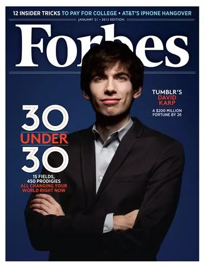

# 无标题

**链接地址:** https://mp.weixin.qq.com/s?__biz=MzI4NDYyNjAwNw==&mid=2247490668&idx=1&sn=b44a54c2c58fc39555460b4ad707d0c1&chksm=ea3bc35f6de904b0cd1cb4016d5190edaf05ff7da6daec0591602f822da93fef54fc79269663&mpshare=1&scene=2&srcid=0817QI1pS6KchtJhNgs3N7Oo&sharer_shareinfo=a6112e4b68a059ee717c22dec4e5f717&sharer_shareinfo_first=a6112e4b68a059ee717c22dec4e5f717#rd
**作者:** 欢迎转发
**获取时间:** 2025/8/28 18:45:24
**图片数量:** 22

---

## 原始HTML内容

<section style="box-sizing: border-box;font-style: normal;font-weight: 400;text-align: justify;font-size: 16px;color: rgb(62, 62, 62);" data-pm-slice="0 0 []"><section style="text-align: center;justify-content: center;display: flex;flex-flow: row;margin: 10px 0px;box-sizing: border-box;"><section style="display: inline-block;vertical-align: top;width: auto;align-self: flex-start;flex: 0 0 auto;min-width: 5%;max-width: 100%;height: auto;box-sizing: border-box;"><section style="justify-content: center;display: flex;flex-flow: row;margin: 0px;box-sizing: border-box;"><section style="display: inline-block;vertical-align: bottom;width: auto;align-self: flex-end;flex: 0 0 auto;background-color: rgb(237, 102, 15);min-width: 5%;max-width: 100%;height: auto;padding: 3px 8px;border-top-left-radius: 7px;border-bottom-right-radius: 7px;overflow: hidden;margin: 0px;border-bottom-left-radius: 7px;box-sizing: border-box;"><section style="color: rgb(255, 255, 255);font-size: 15px;box-sizing: border-box;">
<strong style="box-sizing: border-box;">点击蓝字</strong>
</section></section><section style="display: inline-block;vertical-align: top;width: auto;flex: 0 0 0%;height: auto;line-height: 0;align-self: flex-start;box-sizing: border-box;"><section style="transform: perspective(0px);-webkit-transform: perspective(0px);-moz-transform: perspective(0px);-o-transform: perspective(0px);transform-style: flat;box-sizing: border-box;"><section style="transform: rotateX(180deg) rotateY(180deg);-webkit-transform: rotateX(180deg) rotateY(180deg);-moz-transform: rotateX(180deg) rotateY(180deg);-o-transform: rotateX(180deg) rotateY(180deg);box-sizing: border-box;"><section style="display: inline-block;width: 0px;height: 0px;vertical-align: top;overflow: hidden;border-style: solid;border-width: 5px 7px 0px 0px;border-color: rgba(255, 255, 255, 0) rgb(237, 102, 15) rgba(255, 255, 255, 0) rgba(255, 255, 255, 0);box-sizing: border-box;"><section style="text-align: justify;box-sizing: border-box;">
 
</section></section></section></section></section></section></section><section style="display: inline-block;vertical-align: top;width: auto;min-width: 5%;max-width: 100%;flex: 0 0 auto;height: auto;margin: 0px;box-sizing: border-box;"><section style="justify-content: center;display: flex;flex-flow: row;margin: 6px 0px 0px;box-sizing: border-box;"><section style="display: inline-block;vertical-align: bottom;width: auto;flex: 0 0 0%;height: auto;line-height: 0;align-self: flex-end;box-sizing: border-box;"><section style="display: inline-block;width: 0px;height: 0px;vertical-align: top;overflow: hidden;border-style: solid;border-width: 5px 7px 0px 0px;border-color: rgba(255, 255, 255, 0) rgb(161, 218, 245) rgba(255, 255, 255, 0) rgba(255, 255, 255, 0);box-sizing: border-box;"><section style="text-align: justify;box-sizing: border-box;">
 
</section></section></section><section style="display: inline-block;vertical-align: bottom;width: auto;align-self: flex-end;flex: 0 0 auto;background-color: rgb(161, 218, 245);min-width: 5%;max-width: 100%;height: auto;padding: 2px 8px 3px;border-top-left-radius: 7px;border-top-right-radius: 7px;border-bottom-right-radius: 7px;overflow: hidden;margin: 0px;box-sizing: border-box;"><section style="color: rgb(255, 255, 255);font-size: 15px;box-sizing: border-box;">
<strong style="box-sizing: border-box;">关注我们</strong>
</section></section></section></section></section>
 
<section style="text-align: center;margin: 10px 0px 0px;line-height: 0;box-sizing: border-box;"><section style="max-width: 100%;vertical-align: middle;display: inline-block;line-height: 0;width: 100%;height: auto;box-sizing: border-box;" nodeleaf=""></section></section><section style="text-align: left;justify-content: flex-start;display: flex;flex-flow: row;margin: 10px 0px;box-sizing: border-box;"><section style="display: inline-block;vertical-align: top;width: auto;align-self: flex-start;flex: 0 0 auto;min-width: 5%;max-width: 100%;height: auto;box-sizing: border-box;"><section style="text-align: center;justify-content: center;display: flex;flex-flow: row;margin: 0px;box-sizing: border-box;"><section style="display: inline-block;vertical-align: bottom;width: auto;flex: 0 0 0%;height: auto;line-height: 0;align-self: flex-end;box-sizing: border-box;"><section style="display: inline-block;width: 0px;height: 0px;vertical-align: top;overflow: hidden;border-style: solid;border-width: 5px 7px 0px 0px;border-color: rgba(255, 255, 255, 0) rgb(237, 102, 15) rgba(255, 255, 255, 0) rgba(255, 255, 255, 0);box-sizing: border-box;"><section style="text-align: justify;box-sizing: border-box;">
 
</section></section></section><section style="display: inline-block;vertical-align: bottom;width: auto;align-self: flex-end;flex: 0 0 auto;background-color: rgb(237, 102, 15);min-width: 5%;max-width: 100%;height: auto;padding: 0px 8px;border-top-left-radius: 7px;border-top-right-radius: 7px;border-bottom-right-radius: 7px;overflow: hidden;margin: 0px;box-sizing: border-box;"><section style="color: rgb(255, 255, 255);font-size: 13px;box-sizing: border-box;">
<strong style="box-sizing: border-box;">序</strong>
</section></section></section></section><section style="display: inline-block;vertical-align: top;width: auto;flex: 100 100 0%;height: auto;margin: 0px 0px 0px 12px;box-sizing: border-box;"><section style="margin: 0.5em 0px;box-sizing: border-box;"><section style="background-color: rgb(219, 219, 219);height: 1px;box-sizing: border-box;"><svg viewBox="0 0 1 1" style="float:left;line-height:0;width:0;vertical-align:top;"></svg></section></section><section style="text-align: justify;font-size: 14px;line-height: 2;letter-spacing: 2px;box-sizing: border-box;">
 

午后3点的办公室，灯光刺眼，但你今天的所有工作早已被AI工具提前完成。你假装忙碌地敲击着键盘，心里却担心因为工作量不饱和和被老板察觉并解雇。这些曾经需要花一整天加班才能做完的工作，如今AI几分钟就能生成出来，而你花的心血与经验，<strong style="box-sizing: border-box;">在招聘市场上越来越“不值钱”</strong>。

 最近部门裁掉了两位同事，理由是<strong style="box-sizing: border-box;">“流程自动化”</strong>，可你心里清楚，这只是开始。招聘网站上，行业岗位减少了三分之一，新发布的职位更倾向于招聘<strong style="box-sizing: border-box;">“懂点技术”的跨界人才</strong>，而不是单纯的PPT高手、文案编辑或中层管理。

 

在这样的环境里，很多白领陷入一种尴尬：学历依旧挂在简历显眼的位置，但招聘方更关心你能否上手一台设备、调试一套系统、完成一个跨领域的任务。<strong style="box-sizing: border-box;">“失业”，成为悬挂在每一个白领头顶的达摩克里斯之剑。</strong>

 

<strong style="box-sizing: border-box;">这正是“新领”（New Collar）崛起的时代信号</strong>。它介于蓝领与白领之间，却打破了传统的学历天花板——不以文凭论高低，而是以技能和专业认证来定薪酬。未来五年，职场最大的红利，很可能落在<strong style="box-sizing: border-box;">“高技能+实战力”的新领岗位</strong>。

 
</section><section style="text-align: justify;box-sizing: border-box;">
 
</section></section></section><section style="text-align: left;justify-content: flex-start;display: flex;flex-flow: row;margin: 10px 0px;box-sizing: border-box;"><section style="display: inline-block;width: 100%;vertical-align: top;align-self: flex-start;flex: 0 0 auto;background-color: rgb(246, 246, 246);border-radius: 7px;overflow: hidden;box-sizing: border-box;"><section style="justify-content: flex-start;display: flex;flex-flow: row;box-sizing: border-box;"><section style="display: inline-block;vertical-align: middle;width: auto;align-self: center;flex: 0 0 auto;min-width: 5%;max-width: 100%;height: auto;box-sizing: border-box;"><section style="justify-content: flex-start;display: flex;flex-flow: row;margin: 0px;box-sizing: border-box;"><section style="display: inline-block;vertical-align: bottom;width: auto;align-self: flex-end;flex: 0 0 auto;background-color: rgb(237, 102, 15);min-width: 5%;max-width: 100%;height: auto;padding: 3px 8px;border-top-left-radius: 7px;border-bottom-right-radius: 7px;overflow: hidden;margin: 0px;border-bottom-left-radius: 7px;box-sizing: border-box;"><section style="text-align: center;margin: 4px 0px;box-sizing: border-box;"><section style="color: rgb(255, 255, 255);font-size: 15px;box-sizing: border-box;">
<strong style="box-sizing: border-box;">名词解析</strong>
</section></section></section><section style="display: inline-block;vertical-align: top;width: auto;flex: 0 0 0%;height: auto;line-height: 0;align-self: flex-start;box-sizing: border-box;"><section style="transform: perspective(0px);-webkit-transform: perspective(0px);-moz-transform: perspective(0px);-o-transform: perspective(0px);transform-style: flat;box-sizing: border-box;"><section style="text-align: center;transform: rotateX(180deg) rotateY(180deg);-webkit-transform: rotateX(180deg) rotateY(180deg);-moz-transform: rotateX(180deg) rotateY(180deg);-o-transform: rotateX(180deg) rotateY(180deg);box-sizing: border-box;"><section style="display: inline-block;width: 0px;height: 0px;vertical-align: top;overflow: hidden;border-style: solid;border-width: 5px 7px 0px 0px;border-color: rgba(255, 255, 255, 0) rgb(237, 102, 15) rgba(255, 255, 255, 0) rgba(255, 255, 255, 0);box-sizing: border-box;"><section style="text-align: justify;box-sizing: border-box;">
 
</section></section></section></section></section></section></section><section style="display: inline-block;vertical-align: middle;width: auto;min-width: 5%;max-width: 100%;flex: 0 0 auto;height: auto;align-self: center;padding: 0px 0px 0px 5px;box-sizing: border-box;"><section style="text-align: justify;box-sizing: border-box;">
<strong style="box-sizing: border-box;">“新领”时代崛起，你的位置在哪里？</strong>
</section></section></section></section></section>
 
<section style="font-size: 14px;line-height: 2;letter-spacing: 2px;padding: 0px 15px;box-sizing: border-box;">
<strong style="box-sizing: border-box;">喂！新领是个什么东东？</strong>

 

拜托，打工人已经够焦虑了，谁还想听新名词添堵？但这次，BadaB不是在制造热门词汇，而是想让你从底层逻辑上理清职场正在发生的变化——<strong style="box-sizing: border-box;">岗位在变、需求在变，规则也在变</strong>。与其被动挨打，不如根据市场的真实需求，<strong style="box-sizing: border-box;">提前准备自己，让自己更符合被选择的条件</strong>。
</section>
 
<section style="text-align: left;justify-content: flex-start;display: flex;flex-flow: row;margin: 10px 0px;box-sizing: border-box;"><section style="display: inline-block;width: auto;vertical-align: top;align-self: flex-start;flex: 0 0 auto;background-color: rgb(246, 246, 246);border-radius: 7px;overflow: hidden;min-width: 5%;max-width: 100%;height: auto;box-sizing: border-box;"><section style="justify-content: flex-start;display: flex;flex-flow: row;box-sizing: border-box;"><section style="display: inline-block;vertical-align: middle;width: auto;align-self: center;flex: 0 0 auto;min-width: 5%;max-width: 100%;height: auto;box-sizing: border-box;"><section style="justify-content: flex-start;display: flex;flex-flow: row;margin: 0px;box-sizing: border-box;"><section style="display: inline-block;vertical-align: bottom;width: auto;align-self: flex-end;flex: 0 0 auto;background-color: rgb(161, 218, 245);min-width: 5%;max-width: 100%;height: auto;padding: 3px 8px;border-top-left-radius: 7px;border-bottom-right-radius: 7px;overflow: hidden;margin: 0px;border-bottom-left-radius: 7px;box-sizing: border-box;"><section style="text-align: center;margin: 4px 0px;box-sizing: border-box;"><section style="color: rgb(255, 255, 255);font-size: 15px;box-sizing: border-box;">
<b style="box-sizing: border-box;">01</b>
</section></section></section><section style="display: inline-block;vertical-align: top;width: auto;flex: 0 0 0%;height: auto;line-height: 0;align-self: flex-start;box-sizing: border-box;"><section style="transform: perspective(0px);-webkit-transform: perspective(0px);-moz-transform: perspective(0px);-o-transform: perspective(0px);transform-style: flat;box-sizing: border-box;"><section style="text-align: center;transform: rotateX(180deg) rotateY(180deg);-webkit-transform: rotateX(180deg) rotateY(180deg);-moz-transform: rotateX(180deg) rotateY(180deg);-o-transform: rotateX(180deg) rotateY(180deg);box-sizing: border-box;"><section style="display: inline-block;width: 0px;height: 0px;vertical-align: top;overflow: hidden;border-style: solid;border-width: 5px 7px 0px 0px;border-color: rgba(255, 255, 255, 0) rgb(161, 218, 245) rgba(255, 255, 255, 0) rgba(255, 255, 255, 0);box-sizing: border-box;"><section style="text-align: justify;box-sizing: border-box;">
 
</section></section></section></section></section></section></section><section style="display: inline-block;vertical-align: middle;width: auto;min-width: 5%;max-width: 100%;flex: 0 0 auto;height: auto;align-self: center;padding: 0px 13px 0px 5px;box-sizing: border-box;"><section style="text-align: justify;box-sizing: border-box;">
<b style="box-sizing: border-box;">什么是“新领”（New Collar）</b>
</section></section></section></section></section><section style="font-size: 14px;line-height: 2;letter-spacing: 2px;padding: 0px 15px;box-sizing: border-box;">
 
</section><section style="text-align: center;margin-top: 10px;margin-bottom: 10px;line-height: 0;box-sizing: border-box;"><section style="max-width: 100%;vertical-align: middle;display: inline-block;line-height: 0;width: 90%;height: auto;box-sizing: border-box;" nodeleaf=""></section></section><section style="font-size: 14px;line-height: 2;letter-spacing: 2px;padding: 0px 15px;box-sizing: border-box;">
 

<strong style="box-sizing: border-box;">“新领”（New Collar）</strong>一词由IBM前首席执行官Ginni Rometty提出，目的是打破传统的“名校文凭=高薪”逻辑，<strong style="box-sizing: border-box;">强调技能导向（Skills-based）而非学历导向（Degree-based）的职场思维</strong>。

 
</section><section style="margin-top: 10px;margin-bottom: 10px;text-align: center;box-sizing: border-box;"><section style="padding-left: 1em;padding-right: 1em;display: inline-block;box-sizing: border-box;">
<strong style="box-sizing: border-box;">Tumblr创始人David Karp的故事</strong>
</section><section style="border: 1px solid rgb(192, 200, 209);margin-top: -1em;padding: 20px 10px 10px;background-color: rgb(239, 239, 239);box-sizing: border-box;"><section style="margin-top: 10px;margin-bottom: 10px;line-height: 0;box-sizing: border-box;"><section style="max-width: 100%;vertical-align: middle;display: inline-block;line-height: 0;box-sizing: border-box;" nodeleaf=""></section></section><section style="text-align: justify;font-size: 13px;padding: 0px 15px;box-sizing: border-box;">
 

<strong style="box-sizing: border-box;">David Karp 是“新领”理念的典型代表</strong>——这位1986年纽约出生的创业者在中学辍学、几乎没有学历，却凭借自学的编程和产品设计能力，17岁就进入互联网行业工作，最终创立了博客平台 Tumblr，并在 26 岁时以 11 亿美元将其卖给雅虎，成为当时硅谷最年轻的亿万富翁之一。这样的故事在硅谷并不少见，也再次印证了技能与实战，比文凭更能决定你的职场高度。

 
</section></section></section><section style="font-size: 14px;line-height: 2;letter-spacing: 2px;padding: 0px 15px;box-sizing: border-box;">
 

在Rometty看来，许多现代高薪岗位并不需要耗时四年的本科学位，而是依赖于短期可获得的专业技能、行业认证和实战经验。这些岗位往往处在技术、服务与运营的交界处，既需要动手能力，也要求一定的思维与沟通水平，因此<strong style="box-sizing: border-box;">既不同于传统“蓝领”的体力劳动，也区别于传统“白领”的纯管理和文案工作</strong>。

 
</section>
 
<section style="text-align: left;justify-content: flex-start;display: flex;flex-flow: row;margin: 10px 0px;box-sizing: border-box;"><section style="display: inline-block;width: 100%;vertical-align: top;align-self: flex-start;flex: 0 0 auto;background-color: rgb(246, 246, 246);border-radius: 7px;overflow: hidden;box-sizing: border-box;"><section style="justify-content: flex-start;display: flex;flex-flow: row;box-sizing: border-box;"><section style="display: inline-block;vertical-align: middle;width: auto;align-self: center;flex: 0 0 auto;min-width: 5%;max-width: 100%;height: auto;box-sizing: border-box;"><section style="justify-content: flex-start;display: flex;flex-flow: row;margin: 0px;box-sizing: border-box;"><section style="display: inline-block;vertical-align: bottom;width: auto;align-self: flex-end;flex: 0 0 auto;background-color: rgb(237, 102, 15);min-width: 5%;max-width: 100%;height: auto;padding: 3px 8px;border-top-left-radius: 7px;border-bottom-right-radius: 7px;overflow: hidden;margin: 0px;border-bottom-left-radius: 7px;box-sizing: border-box;"><section style="text-align: center;margin: 4px 0px;box-sizing: border-box;"><section style="color: rgb(255, 255, 255);font-size: 15px;box-sizing: border-box;">
<strong style="box-sizing: border-box;">就业方向</strong>
</section></section></section><section style="display: inline-block;vertical-align: top;width: auto;flex: 0 0 0%;height: auto;line-height: 0;align-self: flex-start;box-sizing: border-box;"><section style="transform: perspective(0px);-webkit-transform: perspective(0px);-moz-transform: perspective(0px);-o-transform: perspective(0px);transform-style: flat;box-sizing: border-box;"><section style="text-align: center;transform: rotateX(180deg) rotateY(180deg);-webkit-transform: rotateX(180deg) rotateY(180deg);-moz-transform: rotateX(180deg) rotateY(180deg);-o-transform: rotateX(180deg) rotateY(180deg);box-sizing: border-box;"><section style="display: inline-block;width: 0px;height: 0px;vertical-align: top;overflow: hidden;border-style: solid;border-width: 5px 7px 0px 0px;border-color: rgba(255, 255, 255, 0) rgb(237, 102, 15) rgba(255, 255, 255, 0) rgba(255, 255, 255, 0);box-sizing: border-box;"><section style="text-align: justify;box-sizing: border-box;">
 
</section></section></section></section></section></section></section><section style="display: inline-block;vertical-align: middle;width: auto;min-width: 5%;max-width: 100%;flex: 0 0 auto;height: auto;align-self: center;padding: 0px 0px 0px 5px;box-sizing: border-box;"><section style="text-align: justify;box-sizing: border-box;">
<strong style="box-sizing: border-box;">高潜力“新领”领域有哪些？</strong>
</section></section></section></section></section><section style="font-size: 14px;line-height: 2;letter-spacing: 2px;padding: 0px 15px;box-sizing: border-box;">
 

高潜力“新领”领域的优势不仅在于工作内容难以被人工智能替代，更在于它们往往拥有<strong style="box-sizing: border-box;">优渥的薪资水平和清晰的晋升通道</strong>。对于希望稳定收入、提升专业价值、并在未来5—10年保持职场竞争力的打工人来说，这些BadaB精挑细选的方向值得你们重点关注！以下列出的岗位和薪酬区间，结合了加拿大本地招聘市场的真实数据，可作为屏幕前正在焦虑转型规划各位的参考：

 
</section><section style="text-align: left;justify-content: flex-start;display: flex;flex-flow: row;margin: 10px 0px;box-sizing: border-box;"><section style="display: inline-block;width: auto;vertical-align: top;align-self: flex-start;flex: 0 0 auto;background-color: rgb(246, 246, 246);border-radius: 7px;overflow: hidden;min-width: 5%;max-width: 100%;height: auto;box-sizing: border-box;"><section style="justify-content: flex-start;display: flex;flex-flow: row;box-sizing: border-box;"><section style="display: inline-block;vertical-align: middle;width: auto;align-self: center;flex: 0 0 auto;min-width: 5%;max-width: 100%;height: auto;box-sizing: border-box;"><section style="justify-content: flex-start;display: flex;flex-flow: row;margin: 0px;box-sizing: border-box;"><section style="display: inline-block;vertical-align: bottom;width: auto;align-self: flex-end;flex: 0 0 auto;background-color: rgb(161, 218, 245);min-width: 5%;max-width: 100%;height: auto;padding: 3px 8px;border-top-left-radius: 7px;border-bottom-right-radius: 7px;overflow: hidden;margin: 0px;border-bottom-left-radius: 7px;box-sizing: border-box;"><section style="text-align: center;margin: 4px 0px;box-sizing: border-box;"><section style="color: rgb(255, 255, 255);font-size: 15px;box-sizing: border-box;">
<b style="box-sizing: border-box;">01</b>
</section></section></section><section style="display: inline-block;vertical-align: top;width: auto;flex: 0 0 0%;height: auto;line-height: 0;align-self: flex-start;box-sizing: border-box;"><section style="transform: perspective(0px);-webkit-transform: perspective(0px);-moz-transform: perspective(0px);-o-transform: perspective(0px);transform-style: flat;box-sizing: border-box;"><section style="text-align: center;transform: rotateX(180deg) rotateY(180deg);-webkit-transform: rotateX(180deg) rotateY(180deg);-moz-transform: rotateX(180deg) rotateY(180deg);-o-transform: rotateX(180deg) rotateY(180deg);box-sizing: border-box;"><section style="display: inline-block;width: 0px;height: 0px;vertical-align: top;overflow: hidden;border-style: solid;border-width: 5px 7px 0px 0px;border-color: rgba(255, 255, 255, 0) rgb(161, 218, 245) rgba(255, 255, 255, 0) rgba(255, 255, 255, 0);box-sizing: border-box;"><section style="text-align: justify;box-sizing: border-box;">
 
</section></section></section></section></section></section></section><section style="display: inline-block;vertical-align: middle;width: auto;min-width: 5%;max-width: 100%;flex: 0 0 auto;height: auto;align-self: center;padding: 0px 13px 0px 5px;box-sizing: border-box;"><section style="text-align: justify;box-sizing: border-box;">
<strong style="box-sizing: border-box;">技术类新领岗位</strong>
</section></section></section></section></section><section style="text-align: right;margin: 10px 0px -90px;line-height: 0;box-sizing: border-box;"><section style="max-width: 100%;vertical-align: middle;display: inline-block;line-height: 0;width: 83%;height: auto;border-radius: 16px;overflow: hidden;box-sizing: border-box;" nodeleaf=""></section></section>
 
<section style="text-align: left;justify-content: flex-start;display: flex;flex-flow: row;margin: 10px 0px;box-sizing: border-box;"><section style="display: inline-block;width: 85%;vertical-align: top;align-self: flex-start;flex: 0 0 auto;background-color: rgb(246, 246, 246);border-radius: 13px;overflow: hidden;padding: 26px 24px;height: auto;box-sizing: border-box;"><section style="justify-content: flex-start;display: flex;flex-flow: row;transform: translate3d(-3px, 0px, 0px);-webkit-transform: translate3d(-3px, 0px, 0px);-moz-transform: translate3d(-3px, 0px, 0px);-o-transform: translate3d(-3px, 0px, 0px);margin: 0px 0px 10px;box-sizing: border-box;"><section style="display: inline-block;vertical-align: bottom;width: auto;min-width: 5%;max-width: 100%;flex: 0 0 auto;height: auto;padding: 0px 9px 0px 0px;align-self: flex-end;box-sizing: border-box;"><section style="text-align: justify;line-height: 1;box-sizing: border-box;">
<strong style="box-sizing: border-box;">云计算运维工程师</strong>
</section></section><section style="display: inline-block;vertical-align: bottom;width: auto;flex: 0 0 0%;height: auto;line-height: 0;align-self: flex-end;box-sizing: border-box;"><section style="text-align: center;box-sizing: border-box;"><section style="display: inline-block;width: 0px;height: 0px;vertical-align: top;overflow: hidden;border-style: solid;border-width: 5px 7px 0px 0px;border-color: rgba(255, 255, 255, 0) rgb(161, 218, 245) rgba(255, 255, 255, 0) rgba(255, 255, 255, 0);box-sizing: border-box;"><section style="text-align: justify;box-sizing: border-box;">
 
</section></section></section></section><section style="display: inline-block;vertical-align: bottom;width: auto;align-self: flex-end;flex: 0 0 auto;background-color: rgb(161, 218, 245);min-width: 5%;max-width: 100%;height: auto;padding: 0px 8px;border-top-left-radius: 7px;border-top-right-radius: 7px;border-bottom-right-radius: 7px;overflow: hidden;margin: 0px;box-sizing: border-box;"><section style="text-align: center;box-sizing: border-box;"><section style="color: rgb(255, 255, 255);font-size: 14px;box-sizing: border-box;">
<strong style="box-sizing: border-box;">$70,000-$120,000</strong>
</section></section></section></section><section style="margin: 13px 0px 10px;box-sizing: border-box;"><section style="background-color: rgb(219, 219, 219);height: 1px;box-sizing: border-box;"><svg viewBox="0 0 1 1" style="float:left;line-height:0;width:0;vertical-align:top;"></svg></section></section><section style="text-align: justify;font-size: 13px;box-sizing: border-box;">
负责云端服务器与平台的日常运行、维护与优化，确保系统稳定、安全、高效运作。需熟悉云架构和自动化部署。
</section><section style="text-align: justify;box-sizing: border-box;">
 
</section><section style="justify-content: flex-start;display: flex;flex-flow: row;transform: translate3d(-3px, 0px, 0px);-webkit-transform: translate3d(-3px, 0px, 0px);-moz-transform: translate3d(-3px, 0px, 0px);-o-transform: translate3d(-3px, 0px, 0px);margin: 0px 0px 10px;box-sizing: border-box;"><section style="display: inline-block;vertical-align: bottom;width: auto;min-width: 5%;max-width: 100%;flex: 0 0 auto;height: auto;padding: 0px 9px 0px 0px;align-self: flex-end;box-sizing: border-box;"><section style="text-align: justify;line-height: 1;box-sizing: border-box;">
<strong style="box-sizing: border-box;">数据安全分析师</strong>
</section></section><section style="display: inline-block;vertical-align: bottom;width: auto;flex: 0 0 0%;height: auto;line-height: 0;align-self: flex-end;box-sizing: border-box;"><section style="text-align: center;box-sizing: border-box;"><section style="display: inline-block;width: 0px;height: 0px;vertical-align: top;overflow: hidden;border-style: solid;border-width: 5px 7px 0px 0px;border-color: rgba(255, 255, 255, 0) rgb(161, 218, 245) rgba(255, 255, 255, 0) rgba(255, 255, 255, 0);box-sizing: border-box;"><section style="text-align: justify;box-sizing: border-box;">
 
</section></section></section></section><section style="display: inline-block;vertical-align: bottom;width: auto;align-self: flex-end;flex: 0 0 auto;background-color: rgb(161, 218, 245);min-width: 5%;max-width: 100%;height: auto;padding: 0px 8px;border-top-left-radius: 7px;border-top-right-radius: 7px;border-bottom-right-radius: 7px;overflow: hidden;margin: 0px;box-sizing: border-box;"><section style="text-align: center;box-sizing: border-box;"><section style="color: rgb(255, 255, 255);font-size: 14px;box-sizing: border-box;">
<strong style="box-sizing: border-box;">$80,000-$130,000</strong>
</section></section></section></section><section style="margin: 13px 0px 10px;box-sizing: border-box;"><section style="background-color: rgb(219, 219, 219);height: 1px;box-sizing: border-box;"><svg viewBox="0 0 1 1" style="float:left;line-height:0;width:0;vertical-align:top;"></svg></section></section><section style="text-align: justify;font-size: 13px;box-sizing: border-box;">
监测、分析并防御网络安全威胁，制定数据保护策略，防止信息泄露或系统入侵。
</section><section style="text-align: justify;box-sizing: border-box;">
 
</section><section style="justify-content: flex-start;display: flex;flex-flow: row;transform: translate3d(-3px, 0px, 0px);-webkit-transform: translate3d(-3px, 0px, 0px);-moz-transform: translate3d(-3px, 0px, 0px);-o-transform: translate3d(-3px, 0px, 0px);margin: 0px 0px 10px;box-sizing: border-box;"><section style="display: inline-block;vertical-align: bottom;width: auto;min-width: 5%;max-width: 100%;flex: 0 0 auto;height: auto;padding: 0px 9px 0px 0px;align-self: flex-end;box-sizing: border-box;"><section style="text-align: justify;line-height: 1;box-sizing: border-box;">
<strong style="box-sizing: border-box;">AI模型训练与标注专家</strong>
</section></section><section style="display: inline-block;vertical-align: bottom;width: auto;flex: 0 0 0%;height: auto;line-height: 0;align-self: flex-end;box-sizing: border-box;"><section style="text-align: center;box-sizing: border-box;"><section style="display: inline-block;width: 0px;height: 0px;vertical-align: top;overflow: hidden;border-style: solid;border-width: 5px 7px 0px 0px;border-color: rgba(255, 255, 255, 0) rgb(161, 218, 245) rgba(255, 255, 255, 0) rgba(255, 255, 255, 0);box-sizing: border-box;"><section style="text-align: justify;box-sizing: border-box;">
 
</section></section></section></section><section style="display: inline-block;vertical-align: bottom;width: auto;align-self: flex-end;flex: 0 0 auto;background-color: rgb(161, 218, 245);min-width: 5%;max-width: 100%;height: auto;padding: 0px 8px;border-top-left-radius: 7px;border-top-right-radius: 7px;border-bottom-right-radius: 7px;overflow: hidden;margin: 0px;box-sizing: border-box;"><section style="text-align: center;box-sizing: border-box;"><section style="color: rgb(255, 255, 255);font-size: 14px;box-sizing: border-box;">
<strong style="box-sizing: border-box;">$60,000-$100,000</strong>
</section></section></section></section><section style="margin: 13px 0px 10px;box-sizing: border-box;"><section style="background-color: rgb(219, 219, 219);height: 1px;box-sizing: border-box;"><svg viewBox="0 0 1 1" style="float:left;line-height:0;width:0;vertical-align:top;"></svg></section></section><section style="text-align: justify;font-size: 13px;box-sizing: border-box;">
通过数据收集、清洗与标注，为人工智能模型提供训练素材，优化模型的识别与预测效果。
</section></section></section>
 
<section style="text-align: left;justify-content: flex-start;display: flex;flex-flow: row;margin: 10px 0px;box-sizing: border-box;"><section style="display: inline-block;width: auto;vertical-align: top;align-self: flex-start;flex: 0 0 auto;background-color: rgb(246, 246, 246);border-radius: 7px;overflow: hidden;min-width: 5%;max-width: 100%;height: auto;box-sizing: border-box;"><section style="justify-content: flex-start;display: flex;flex-flow: row;box-sizing: border-box;"><section style="display: inline-block;vertical-align: middle;width: auto;align-self: center;flex: 0 0 auto;min-width: 5%;max-width: 100%;height: auto;box-sizing: border-box;"><section style="justify-content: flex-start;display: flex;flex-flow: row;margin: 0px;box-sizing: border-box;"><section style="display: inline-block;vertical-align: bottom;width: auto;align-self: flex-end;flex: 0 0 auto;background-color: rgb(161, 218, 245);min-width: 5%;max-width: 100%;height: auto;padding: 3px 8px;border-top-left-radius: 7px;border-bottom-right-radius: 7px;overflow: hidden;margin: 0px;border-bottom-left-radius: 7px;box-sizing: border-box;"><section style="text-align: center;margin: 4px 0px;box-sizing: border-box;"><section style="color: rgb(255, 255, 255);font-size: 15px;box-sizing: border-box;">
<b style="box-sizing: border-box;">02</b>
</section></section></section><section style="display: inline-block;vertical-align: top;width: auto;flex: 0 0 0%;height: auto;line-height: 0;align-self: flex-start;box-sizing: border-box;"><section style="transform: perspective(0px);-webkit-transform: perspective(0px);-moz-transform: perspective(0px);-o-transform: perspective(0px);transform-style: flat;box-sizing: border-box;"><section style="text-align: center;transform: rotateX(180deg) rotateY(180deg);-webkit-transform: rotateX(180deg) rotateY(180deg);-moz-transform: rotateX(180deg) rotateY(180deg);-o-transform: rotateX(180deg) rotateY(180deg);box-sizing: border-box;"><section style="display: inline-block;width: 0px;height: 0px;vertical-align: top;overflow: hidden;border-style: solid;border-width: 5px 7px 0px 0px;border-color: rgba(255, 255, 255, 0) rgb(161, 218, 245) rgba(255, 255, 255, 0) rgba(255, 255, 255, 0);box-sizing: border-box;"><section style="text-align: justify;box-sizing: border-box;">
 
</section></section></section></section></section></section></section><section style="display: inline-block;vertical-align: middle;width: auto;min-width: 5%;max-width: 100%;flex: 0 0 auto;height: auto;align-self: center;padding: 0px 13px 0px 5px;box-sizing: border-box;"><section style="text-align: justify;box-sizing: border-box;">
<strong style="box-sizing: border-box;">医疗与健康科技</strong>
</section></section></section></section></section><section style="text-align: right;margin: 10px 0px -90px;line-height: 0;box-sizing: border-box;"><section style="max-width: 100%;vertical-align: middle;display: inline-block;line-height: 0;width: 83%;height: auto;border-radius: 16px;overflow: hidden;box-sizing: border-box;" nodeleaf=""></section></section>
 
<section style="text-align: left;justify-content: flex-start;display: flex;flex-flow: row;margin: 10px 0px;box-sizing: border-box;"><section style="display: inline-block;width: 85%;vertical-align: top;align-self: flex-start;flex: 0 0 auto;background-color: rgb(246, 246, 246);border-radius: 13px;overflow: hidden;padding: 26px 24px;height: auto;box-sizing: border-box;"><section style="justify-content: flex-start;display: flex;flex-flow: row;transform: translate3d(-3px, 0px, 0px);-webkit-transform: translate3d(-3px, 0px, 0px);-moz-transform: translate3d(-3px, 0px, 0px);-o-transform: translate3d(-3px, 0px, 0px);margin: 0px 0px 10px;box-sizing: border-box;"><section style="display: inline-block;vertical-align: bottom;width: auto;min-width: 5%;max-width: 100%;flex: 0 0 auto;height: auto;padding: 0px 9px 0px 0px;align-self: flex-end;box-sizing: border-box;"><section style="text-align: justify;line-height: 1;box-sizing: border-box;">
<strong style="box-sizing: border-box;">医疗影像技术员</strong>
</section></section><section style="display: inline-block;vertical-align: bottom;width: auto;flex: 0 0 0%;height: auto;line-height: 0;align-self: flex-end;box-sizing: border-box;"><section style="text-align: center;box-sizing: border-box;"><section style="display: inline-block;width: 0px;height: 0px;vertical-align: top;overflow: hidden;border-style: solid;border-width: 5px 7px 0px 0px;border-color: rgba(255, 255, 255, 0) rgb(161, 218, 245) rgba(255, 255, 255, 0) rgba(255, 255, 255, 0);box-sizing: border-box;"><section style="text-align: justify;box-sizing: border-box;">
 
</section></section></section></section><section style="display: inline-block;vertical-align: bottom;width: auto;align-self: flex-end;flex: 0 0 auto;background-color: rgb(161, 218, 245);min-width: 5%;max-width: 100%;height: auto;padding: 0px 8px;border-top-left-radius: 7px;border-top-right-radius: 7px;border-bottom-right-radius: 7px;overflow: hidden;margin: 0px;box-sizing: border-box;"><section style="text-align: center;box-sizing: border-box;"><section style="color: rgb(255, 255, 255);font-size: 14px;box-sizing: border-box;">
<strong style="box-sizing: border-box;">$60,000-$90,000</strong>
</section></section></section></section><section style="margin: 13px 0px 10px;box-sizing: border-box;"><section style="background-color: rgb(219, 219, 219);height: 1px;box-sizing: border-box;"><svg viewBox="0 0 1 1" style="float:left;line-height:0;width:0;vertical-align:top;"></svg></section></section><section style="text-align: justify;font-size: 13px;box-sizing: border-box;">
操作X光、MRI、CT等影像设备，采集并处理患者影像数据，为医生诊断提供关键参考。
</section><section style="text-align: justify;box-sizing: border-box;">
 
</section><section style="justify-content: flex-start;display: flex;flex-flow: row;transform: translate3d(-3px, 0px, 0px);-webkit-transform: translate3d(-3px, 0px, 0px);-moz-transform: translate3d(-3px, 0px, 0px);-o-transform: translate3d(-3px, 0px, 0px);margin: 0px 0px 10px;box-sizing: border-box;"><section style="display: inline-block;vertical-align: bottom;width: auto;min-width: 5%;max-width: 100%;flex: 0 0 auto;height: auto;padding: 0px 9px 0px 0px;align-self: flex-end;box-sizing: border-box;"><section style="text-align: justify;line-height: 1;box-sizing: border-box;">
<strong style="box-sizing: border-box;">康复与护理协调员</strong>
</section></section><section style="display: inline-block;vertical-align: bottom;width: auto;flex: 0 0 0%;height: auto;line-height: 0;align-self: flex-end;box-sizing: border-box;"><section style="text-align: center;box-sizing: border-box;"><section style="display: inline-block;width: 0px;height: 0px;vertical-align: top;overflow: hidden;border-style: solid;border-width: 5px 7px 0px 0px;border-color: rgba(255, 255, 255, 0) rgb(161, 218, 245) rgba(255, 255, 255, 0) rgba(255, 255, 255, 0);box-sizing: border-box;"><section style="text-align: justify;box-sizing: border-box;">
 
</section></section></section></section><section style="display: inline-block;vertical-align: bottom;width: auto;align-self: flex-end;flex: 0 0 auto;background-color: rgb(161, 218, 245);min-width: 5%;max-width: 100%;height: auto;padding: 0px 8px;border-top-left-radius: 7px;border-top-right-radius: 7px;border-bottom-right-radius: 7px;overflow: hidden;margin: 0px;box-sizing: border-box;"><section style="text-align: center;box-sizing: border-box;"><section style="color: rgb(255, 255, 255);font-size: 14px;box-sizing: border-box;">
<strong style="box-sizing: border-box;">$50,000-$85,000</strong>
</section></section></section></section><section style="margin: 13px 0px 10px;box-sizing: border-box;"><section style="background-color: rgb(219, 219, 219);height: 1px;box-sizing: border-box;"><svg viewBox="0 0 1 1" style="float:left;line-height:0;width:0;vertical-align:top;"></svg></section></section><section style="text-align: justify;font-size: 13px;box-sizing: border-box;">
制定并监督患者康复计划，协调医疗团队与患者家属，确保治疗过程顺利进行。
</section></section></section>
 
<section style="text-align: left;justify-content: flex-start;display: flex;flex-flow: row;margin: 10px 0px;box-sizing: border-box;"><section style="display: inline-block;width: auto;vertical-align: top;align-self: flex-start;flex: 0 0 auto;background-color: rgb(246, 246, 246);border-radius: 7px;overflow: hidden;min-width: 5%;max-width: 100%;height: auto;box-sizing: border-box;"><section style="justify-content: flex-start;display: flex;flex-flow: row;box-sizing: border-box;"><section style="display: inline-block;vertical-align: middle;width: auto;align-self: center;flex: 0 0 auto;min-width: 5%;max-width: 100%;height: auto;box-sizing: border-box;"><section style="justify-content: flex-start;display: flex;flex-flow: row;margin: 0px;box-sizing: border-box;"><section style="display: inline-block;vertical-align: bottom;width: auto;align-self: flex-end;flex: 0 0 auto;background-color: rgb(161, 218, 245);min-width: 5%;max-width: 100%;height: auto;padding: 3px 8px;border-top-left-radius: 7px;border-bottom-right-radius: 7px;overflow: hidden;margin: 0px;border-bottom-left-radius: 7px;box-sizing: border-box;"><section style="text-align: center;margin: 4px 0px;box-sizing: border-box;"><section style="color: rgb(255, 255, 255);font-size: 15px;box-sizing: border-box;">
<b style="box-sizing: border-box;">03</b>
</section></section></section><section style="display: inline-block;vertical-align: top;width: auto;flex: 0 0 0%;height: auto;line-height: 0;align-self: flex-start;box-sizing: border-box;"><section style="transform: perspective(0px);-webkit-transform: perspective(0px);-moz-transform: perspective(0px);-o-transform: perspective(0px);transform-style: flat;box-sizing: border-box;"><section style="text-align: center;transform: rotateX(180deg) rotateY(180deg);-webkit-transform: rotateX(180deg) rotateY(180deg);-moz-transform: rotateX(180deg) rotateY(180deg);-o-transform: rotateX(180deg) rotateY(180deg);box-sizing: border-box;"><section style="display: inline-block;width: 0px;height: 0px;vertical-align: top;overflow: hidden;border-style: solid;border-width: 5px 7px 0px 0px;border-color: rgba(255, 255, 255, 0) rgb(161, 218, 245) rgba(255, 255, 255, 0) rgba(255, 255, 255, 0);box-sizing: border-box;"><section style="text-align: justify;box-sizing: border-box;">
 
</section></section></section></section></section></section></section><section style="display: inline-block;vertical-align: middle;width: auto;min-width: 5%;max-width: 100%;flex: 0 0 auto;height: auto;align-self: center;padding: 0px 13px 0px 5px;box-sizing: border-box;"><section style="text-align: justify;box-sizing: border-box;">
<strong style="box-sizing: border-box;">绿色能源与可持续发展</strong>
</section></section></section></section></section><section style="text-align: right;margin: 10px 0px -90px;line-height: 0;box-sizing: border-box;"><section style="max-width: 100%;vertical-align: middle;display: inline-block;line-height: 0;width: 83%;height: auto;border-radius: 16px;overflow: hidden;box-sizing: border-box;" nodeleaf=""></section></section>
 
<section style="text-align: left;justify-content: flex-start;display: flex;flex-flow: row;margin: 10px 0px;box-sizing: border-box;"><section style="display: inline-block;width: 85%;vertical-align: top;align-self: flex-start;flex: 0 0 auto;background-color: rgb(246, 246, 246);border-radius: 13px;overflow: hidden;padding: 26px 24px;height: auto;box-sizing: border-box;"><section style="justify-content: flex-start;display: flex;flex-flow: row;transform: translate3d(-3px, 0px, 0px);-webkit-transform: translate3d(-3px, 0px, 0px);-moz-transform: translate3d(-3px, 0px, 0px);-o-transform: translate3d(-3px, 0px, 0px);margin: 0px 0px 10px;box-sizing: border-box;"><section style="display: inline-block;vertical-align: bottom;width: auto;min-width: 5%;max-width: 100%;flex: 0 0 auto;height: auto;padding: 0px 9px 0px 0px;align-self: flex-end;box-sizing: border-box;"><section style="text-align: justify;line-height: 1;box-sizing: border-box;">
<strong style="box-sizing: border-box;">光伏/风电技术员</strong>
</section></section><section style="display: inline-block;vertical-align: bottom;width: auto;flex: 0 0 0%;height: auto;line-height: 0;align-self: flex-end;box-sizing: border-box;"><section style="text-align: center;box-sizing: border-box;"><section style="display: inline-block;width: 0px;height: 0px;vertical-align: top;overflow: hidden;border-style: solid;border-width: 5px 7px 0px 0px;border-color: rgba(255, 255, 255, 0) rgb(161, 218, 245) rgba(255, 255, 255, 0) rgba(255, 255, 255, 0);box-sizing: border-box;"><section style="text-align: justify;box-sizing: border-box;">
 
</section></section></section></section><section style="display: inline-block;vertical-align: bottom;width: auto;align-self: flex-end;flex: 0 0 auto;background-color: rgb(161, 218, 245);min-width: 5%;max-width: 100%;height: auto;padding: 0px 8px;border-top-left-radius: 7px;border-top-right-radius: 7px;border-bottom-right-radius: 7px;overflow: hidden;margin: 0px;box-sizing: border-box;"><section style="text-align: center;box-sizing: border-box;"><section style="color: rgb(255, 255, 255);font-size: 14px;box-sizing: border-box;">
<strong style="box-sizing: border-box;">$55,000-$95,000</strong>
</section></section></section></section><section style="margin: 13px 0px 10px;box-sizing: border-box;"><section style="background-color: rgb(219, 219, 219);height: 1px;box-sizing: border-box;"><svg viewBox="0 0 1 1" style="float:left;line-height:0;width:0;vertical-align:top;"></svg></section></section><section style="text-align: justify;font-size: 13px;box-sizing: border-box;">
负责太阳能或风力发电设备的安装、调试与维护，确保可再生能源系统高效运行。
</section><section style="text-align: justify;box-sizing: border-box;">
 
</section><section style="justify-content: flex-start;display: flex;flex-flow: row;transform: translate3d(-3px, 0px, 0px);-webkit-transform: translate3d(-3px, 0px, 0px);-moz-transform: translate3d(-3px, 0px, 0px);-o-transform: translate3d(-3px, 0px, 0px);margin: 0px 0px 10px;box-sizing: border-box;"><section style="display: inline-block;vertical-align: bottom;width: auto;min-width: 5%;max-width: 100%;flex: 0 0 auto;height: auto;padding: 0px 9px 0px 0px;align-self: flex-end;box-sizing: border-box;"><section style="text-align: justify;line-height: 1;box-sizing: border-box;">
<strong style="box-sizing: border-box;">建筑节能顾问</strong>
</section></section><section style="display: inline-block;vertical-align: bottom;width: auto;flex: 0 0 0%;height: auto;line-height: 0;align-self: flex-end;box-sizing: border-box;"><section style="text-align: center;box-sizing: border-box;"><section style="display: inline-block;width: 0px;height: 0px;vertical-align: top;overflow: hidden;border-style: solid;border-width: 5px 7px 0px 0px;border-color: rgba(255, 255, 255, 0) rgb(161, 218, 245) rgba(255, 255, 255, 0) rgba(255, 255, 255, 0);box-sizing: border-box;"><section style="text-align: justify;box-sizing: border-box;">
 
</section></section></section></section><section style="display: inline-block;vertical-align: bottom;width: auto;align-self: flex-end;flex: 0 0 auto;background-color: rgb(161, 218, 245);min-width: 5%;max-width: 100%;height: auto;padding: 0px 8px;border-top-left-radius: 7px;border-top-right-radius: 7px;border-bottom-right-radius: 7px;overflow: hidden;margin: 0px;box-sizing: border-box;"><section style="text-align: center;box-sizing: border-box;"><section style="color: rgb(255, 255, 255);font-size: 14px;box-sizing: border-box;">
<strong style="box-sizing: border-box;">$60,000-$100,000</strong>
</section></section></section></section><section style="margin: 13px 0px 10px;box-sizing: border-box;"><section style="background-color: rgb(219, 219, 219);height: 1px;box-sizing: border-box;"><svg viewBox="0 0 1 1" style="float:left;line-height:0;width:0;vertical-align:top;"></svg></section></section><section style="text-align: justify;font-size: 13px;box-sizing: border-box;">
评估建筑能耗，提出节能改造方案，帮助客户降低能源成本并符合环保标准。
</section></section></section>
 
<section style="text-align: left;justify-content: flex-start;display: flex;flex-flow: row;margin: 10px 0px;box-sizing: border-box;"><section style="display: inline-block;width: auto;vertical-align: top;align-self: flex-start;flex: 0 0 auto;background-color: rgb(246, 246, 246);border-radius: 7px;overflow: hidden;min-width: 5%;max-width: 100%;height: auto;box-sizing: border-box;"><section style="justify-content: flex-start;display: flex;flex-flow: row;box-sizing: border-box;"><section style="display: inline-block;vertical-align: middle;width: auto;align-self: center;flex: 0 0 auto;min-width: 5%;max-width: 100%;height: auto;box-sizing: border-box;"><section style="justify-content: flex-start;display: flex;flex-flow: row;margin: 0px;box-sizing: border-box;"><section style="display: inline-block;vertical-align: bottom;width: auto;align-self: flex-end;flex: 0 0 auto;background-color: rgb(161, 218, 245);min-width: 5%;max-width: 100%;height: auto;padding: 3px 8px;border-top-left-radius: 7px;border-bottom-right-radius: 7px;overflow: hidden;margin: 0px;border-bottom-left-radius: 7px;box-sizing: border-box;"><section style="text-align: center;margin: 4px 0px;box-sizing: border-box;"><section style="color: rgb(255, 255, 255);font-size: 15px;box-sizing: border-box;">
<b style="box-sizing: border-box;">04</b>
</section></section></section><section style="display: inline-block;vertical-align: top;width: auto;flex: 0 0 0%;height: auto;line-height: 0;align-self: flex-start;box-sizing: border-box;"><section style="transform: perspective(0px);-webkit-transform: perspective(0px);-moz-transform: perspective(0px);-o-transform: perspective(0px);transform-style: flat;box-sizing: border-box;"><section style="text-align: center;transform: rotateX(180deg) rotateY(180deg);-webkit-transform: rotateX(180deg) rotateY(180deg);-moz-transform: rotateX(180deg) rotateY(180deg);-o-transform: rotateX(180deg) rotateY(180deg);box-sizing: border-box;"><section style="display: inline-block;width: 0px;height: 0px;vertical-align: top;overflow: hidden;border-style: solid;border-width: 5px 7px 0px 0px;border-color: rgba(255, 255, 255, 0) rgb(161, 218, 245) rgba(255, 255, 255, 0) rgba(255, 255, 255, 0);box-sizing: border-box;"><section style="text-align: justify;box-sizing: border-box;">
 
</section></section></section></section></section></section></section><section style="display: inline-block;vertical-align: middle;width: auto;min-width: 5%;max-width: 100%;flex: 0 0 auto;height: auto;align-self: center;padding: 0px 13px 0px 5px;box-sizing: border-box;"><section style="text-align: justify;box-sizing: border-box;">
<strong style="box-sizing: border-box;">高级制造与智能生产</strong>
</section></section></section></section></section><section style="text-align: right;margin: 10px 0px -90px;line-height: 0;box-sizing: border-box;"><section style="max-width: 100%;vertical-align: middle;display: inline-block;line-height: 0;width: 83%;height: auto;border-radius: 16px;overflow: hidden;box-sizing: border-box;" nodeleaf=""></section></section>
 
<section style="text-align: left;justify-content: flex-start;display: flex;flex-flow: row;margin: 10px 0px;box-sizing: border-box;"><section style="display: inline-block;width: 85%;vertical-align: top;align-self: flex-start;flex: 0 0 auto;background-color: rgb(246, 246, 246);border-radius: 13px;overflow: hidden;padding: 26px 24px;height: auto;box-sizing: border-box;"><section style="justify-content: flex-start;display: flex;flex-flow: row;transform: translate3d(-3px, 0px, 0px);-webkit-transform: translate3d(-3px, 0px, 0px);-moz-transform: translate3d(-3px, 0px, 0px);-o-transform: translate3d(-3px, 0px, 0px);margin: 0px 0px 10px;box-sizing: border-box;"><section style="display: inline-block;vertical-align: bottom;width: auto;min-width: 5%;max-width: 100%;flex: 0 0 auto;height: auto;padding: 0px 9px 0px 0px;align-self: flex-end;box-sizing: border-box;"><section style="text-align: justify;line-height: 1;box-sizing: border-box;">
<strong style="box-sizing: border-box;">机器人运维与调试</strong>
</section></section><section style="display: inline-block;vertical-align: bottom;width: auto;flex: 0 0 0%;height: auto;line-height: 0;align-self: flex-end;box-sizing: border-box;"><section style="text-align: center;box-sizing: border-box;"><section style="display: inline-block;width: 0px;height: 0px;vertical-align: top;overflow: hidden;border-style: solid;border-width: 5px 7px 0px 0px;border-color: rgba(255, 255, 255, 0) rgb(161, 218, 245) rgba(255, 255, 255, 0) rgba(255, 255, 255, 0);box-sizing: border-box;"><section style="text-align: justify;box-sizing: border-box;">
 
</section></section></section></section><section style="display: inline-block;vertical-align: bottom;width: auto;align-self: flex-end;flex: 0 0 auto;background-color: rgb(161, 218, 245);min-width: 5%;max-width: 100%;height: auto;padding: 0px 8px;border-top-left-radius: 7px;border-top-right-radius: 7px;border-bottom-right-radius: 7px;overflow: hidden;margin: 0px;box-sizing: border-box;"><section style="text-align: center;box-sizing: border-box;"><section style="color: rgb(255, 255, 255);font-size: 14px;box-sizing: border-box;">
<strong style="box-sizing: border-box;">$65,000-$110,000</strong>
</section></section></section></section><section style="margin: 13px 0px 10px;box-sizing: border-box;"><section style="background-color: rgb(219, 219, 219);height: 1px;box-sizing: border-box;"><svg viewBox="0 0 1 1" style="float:left;line-height:0;width:0;vertical-align:top;"></svg></section></section><section style="text-align: justify;font-size: 13px;box-sizing: border-box;">
安装、测试和维护工业机器人系统，确保生产流程的稳定与高效。
</section><section style="text-align: justify;box-sizing: border-box;">
 
</section><section style="justify-content: flex-start;display: flex;flex-flow: row;transform: translate3d(-3px, 0px, 0px);-webkit-transform: translate3d(-3px, 0px, 0px);-moz-transform: translate3d(-3px, 0px, 0px);-o-transform: translate3d(-3px, 0px, 0px);margin: 0px 0px 10px;box-sizing: border-box;"><section style="display: inline-block;vertical-align: bottom;width: auto;min-width: 5%;max-width: 100%;flex: 0 0 auto;height: auto;padding: 0px 9px 0px 0px;align-self: flex-end;box-sizing: border-box;"><section style="text-align: justify;line-height: 1;box-sizing: border-box;">
<strong style="box-sizing: border-box;">工业3D打印工程师</strong>
</section></section><section style="display: inline-block;vertical-align: bottom;width: auto;flex: 0 0 0%;height: auto;line-height: 0;align-self: flex-end;box-sizing: border-box;"><section style="text-align: center;box-sizing: border-box;"><section style="display: inline-block;width: 0px;height: 0px;vertical-align: top;overflow: hidden;border-style: solid;border-width: 5px 7px 0px 0px;border-color: rgba(255, 255, 255, 0) rgb(161, 218, 245) rgba(255, 255, 255, 0) rgba(255, 255, 255, 0);box-sizing: border-box;"><section style="text-align: justify;box-sizing: border-box;">
 
</section></section></section></section><section style="display: inline-block;vertical-align: bottom;width: auto;align-self: flex-end;flex: 0 0 auto;background-color: rgb(161, 218, 245);min-width: 5%;max-width: 100%;height: auto;padding: 0px 8px;border-top-left-radius: 7px;border-top-right-radius: 7px;border-bottom-right-radius: 7px;overflow: hidden;margin: 0px;box-sizing: border-box;"><section style="text-align: center;box-sizing: border-box;"><section style="color: rgb(255, 255, 255);font-size: 14px;box-sizing: border-box;">
<strong style="box-sizing: border-box;">$70,000-$120,000</strong>
</section></section></section></section><section style="margin: 13px 0px 10px;box-sizing: border-box;"><section style="background-color: rgb(219, 219, 219);height: 1px;box-sizing: border-box;"><svg viewBox="0 0 1 1" style="float:left;line-height:0;width:0;vertical-align:top;"></svg></section></section><section style="text-align: justify;font-size: 13px;box-sizing: border-box;">
操作和维护3D打印设备，负责产品建模、打印与质量检测，应用于制造、医疗等领域。
</section></section></section><section style="font-size: 14px;line-height: 2;letter-spacing: 2px;padding: 0px 15px;box-sizing: border-box;">
 
</section><section style="text-align: left;justify-content: flex-start;display: flex;flex-flow: row;margin: 10px 0px;box-sizing: border-box;"><section style="display: inline-block;width: 100%;vertical-align: top;align-self: flex-start;flex: 0 0 auto;background-color: rgb(246, 246, 246);border-radius: 7px;overflow: hidden;box-sizing: border-box;"><section style="justify-content: flex-start;display: flex;flex-flow: row;box-sizing: border-box;"><section style="display: inline-block;vertical-align: middle;width: auto;align-self: center;flex: 0 0 auto;min-width: 5%;max-width: 100%;height: auto;box-sizing: border-box;"><section style="justify-content: flex-start;display: flex;flex-flow: row;margin: 0px;box-sizing: border-box;"><section style="display: inline-block;vertical-align: bottom;width: auto;align-self: flex-end;flex: 0 0 auto;background-color: rgb(237, 102, 15);min-width: 5%;max-width: 100%;height: auto;padding: 3px 8px;border-top-left-radius: 7px;border-bottom-right-radius: 7px;overflow: hidden;margin: 0px;border-bottom-left-radius: 7px;box-sizing: border-box;"><section style="text-align: center;margin: 4px 0px;box-sizing: border-box;"><section style="color: rgb(255, 255, 255);font-size: 15px;box-sizing: border-box;">
<strong style="box-sizing: border-box;">职业特点</strong>
</section></section></section><section style="display: inline-block;vertical-align: top;width: auto;flex: 0 0 0%;height: auto;line-height: 0;align-self: flex-start;box-sizing: border-box;"><section style="transform: perspective(0px);-webkit-transform: perspective(0px);-moz-transform: perspective(0px);-o-transform: perspective(0px);transform-style: flat;box-sizing: border-box;"><section style="text-align: center;transform: rotateX(180deg) rotateY(180deg);-webkit-transform: rotateX(180deg) rotateY(180deg);-moz-transform: rotateX(180deg) rotateY(180deg);-o-transform: rotateX(180deg) rotateY(180deg);box-sizing: border-box;"><section style="display: inline-block;width: 0px;height: 0px;vertical-align: top;overflow: hidden;border-style: solid;border-width: 5px 7px 0px 0px;border-color: rgba(255, 255, 255, 0) rgb(237, 102, 15) rgba(255, 255, 255, 0) rgba(255, 255, 255, 0);box-sizing: border-box;"><section style="text-align: justify;box-sizing: border-box;">
 
</section></section></section></section></section></section></section><section style="display: inline-block;vertical-align: middle;width: auto;min-width: 5%;max-width: 100%;flex: 0 0 auto;height: auto;align-self: center;padding: 0px 0px 0px 5px;box-sizing: border-box;"><section style="text-align: justify;box-sizing: border-box;">
<strong style="box-sizing: border-box;">“新领”工作有什么特质？</strong>
</section></section></section></section></section>
 
<section style="text-align: center;margin-top: 10px;margin-bottom: 10px;line-height: 0;box-sizing: border-box;"><section style="max-width: 100%;vertical-align: middle;display: inline-block;line-height: 0;width: 90%;height: auto;border-style: solid;border-width: 5px;border-color: rgb(237, 102, 15);box-sizing: border-box;" nodeleaf=""></section></section><section style="font-size: 14px;line-height: 2;letter-spacing: 2px;padding: 0px 15px;box-sizing: border-box;">
 

<strong style="box-sizing: border-box;">不完全依赖学历</strong>

本科或硕士学位不再是硬性门槛，敲门砖已经敲不开职场的门了！

 

<strong style="box-sizing: border-box;">技能与认证优先</strong>

技能培训和实操能力，往往比学历更能打动雇主。无论是技术认证、行业资格，还是实际操作经验，都比一纸文凭更能证明你的价值。

 

<strong style="box-sizing: border-box;">实战价值高</strong>

强调能否解决问题、交付成果，而非只会理论分析。

<strong style="box-sizing: border-box;"> </strong>

<strong style="box-sizing: border-box;">薪酬具有竞争力</strong>

在北美和欧洲市场，一些新领岗位的起薪就能超过当地白领的中位数，并且随着技能熟练度提升，薪酬上涨空间大，还被招聘企业抢破头。

<strong style="box-sizing: border-box;"> </strong>

<strong style="box-sizing: border-box;">跨学科背景</strong>

既要懂技术，又要懂行业业务逻辑，甚至还要有一定的沟通与项目管理能力。因此从业者必须具备较强的学习能力，能够在技术快速迭代和行业变化中不断更新技能，保持竞争力。

 
</section><section style="text-align: center;margin-top: 10px;margin-bottom: 10px;line-height: 0;box-sizing: border-box;"><section style="max-width: 100%;vertical-align: middle;display: inline-block;line-height: 0;width: 90%;height: auto;border-style: solid;border-width: 5px;border-color: rgb(237, 102, 15);box-sizing: border-box;" nodeleaf=""></section></section>
 
<section style="text-align: left;justify-content: flex-start;display: flex;flex-flow: row;margin: 10px 0px;box-sizing: border-box;"><section style="display: inline-block;width: 100%;vertical-align: top;align-self: flex-start;flex: 0 0 auto;background-color: rgb(246, 246, 246);border-radius: 7px;overflow: hidden;box-sizing: border-box;"><section style="justify-content: flex-start;display: flex;flex-flow: row;box-sizing: border-box;"><section style="display: inline-block;vertical-align: middle;width: auto;align-self: center;flex: 0 0 auto;min-width: 5%;max-width: 100%;height: auto;box-sizing: border-box;"><section style="justify-content: flex-start;display: flex;flex-flow: row;margin: 0px;box-sizing: border-box;"><section style="display: inline-block;vertical-align: bottom;width: auto;align-self: flex-end;flex: 0 0 auto;background-color: rgb(237, 102, 15);min-width: 5%;max-width: 100%;height: auto;padding: 3px 8px;border-top-left-radius: 7px;border-bottom-right-radius: 7px;overflow: hidden;margin: 0px;border-bottom-left-radius: 7px;box-sizing: border-box;"><section style="text-align: center;margin: 4px 0px;box-sizing: border-box;"><section style="color: rgb(255, 255, 255);font-size: 15px;box-sizing: border-box;">
<strong style="box-sizing: border-box;">转型路径</strong>
</section></section></section><section style="display: inline-block;vertical-align: top;width: auto;flex: 0 0 0%;height: auto;line-height: 0;align-self: flex-start;box-sizing: border-box;"><section style="transform: perspective(0px);-webkit-transform: perspective(0px);-moz-transform: perspective(0px);-o-transform: perspective(0px);transform-style: flat;box-sizing: border-box;"><section style="text-align: center;transform: rotateX(180deg) rotateY(180deg);-webkit-transform: rotateX(180deg) rotateY(180deg);-moz-transform: rotateX(180deg) rotateY(180deg);-o-transform: rotateX(180deg) rotateY(180deg);box-sizing: border-box;"><section style="display: inline-block;width: 0px;height: 0px;vertical-align: top;overflow: hidden;border-style: solid;border-width: 5px 7px 0px 0px;border-color: rgba(255, 255, 255, 0) rgb(237, 102, 15) rgba(255, 255, 255, 0) rgba(255, 255, 255, 0);box-sizing: border-box;"><section style="text-align: justify;box-sizing: border-box;">
 
</section></section></section></section></section></section></section><section style="display: inline-block;vertical-align: middle;width: auto;min-width: 5%;max-width: 100%;flex: 0 0 auto;height: auto;align-self: center;padding: 0px 0px 0px 5px;box-sizing: border-box;"><section style="text-align: justify;box-sizing: border-box;">
<strong style="box-sizing: border-box;">从白领到新领的进阶五步法</strong>
</section></section></section></section></section>
 
<section style="font-size: 14px;line-height: 2;letter-spacing: 2px;padding: 0px 15px;box-sizing: border-box;">
在AI和自动化加速重塑职场的背景下，转型新领岗位并不意味着<strong style="box-sizing: border-box;">“从零开始”</strong>，而是一个有规划、有步骤的升级过程：
</section>
 
<section style="text-align: left;justify-content: flex-start;display: flex;flex-flow: row;margin: 10px 0px;box-sizing: border-box;"><section style="display: inline-block;width: auto;vertical-align: top;align-self: flex-start;flex: 0 0 auto;background-color: rgb(246, 246, 246);border-radius: 7px;overflow: hidden;min-width: 5%;max-width: 100%;height: auto;box-sizing: border-box;"><section style="justify-content: flex-start;display: flex;flex-flow: row;box-sizing: border-box;"><section style="display: inline-block;vertical-align: middle;width: auto;align-self: center;flex: 0 0 auto;min-width: 5%;max-width: 100%;height: auto;box-sizing: border-box;"><section style="justify-content: flex-start;display: flex;flex-flow: row;margin: 0px;box-sizing: border-box;"><section style="display: inline-block;vertical-align: bottom;width: auto;align-self: flex-end;flex: 0 0 auto;background-color: rgb(161, 218, 245);min-width: 5%;max-width: 100%;height: auto;padding: 3px 8px;border-top-left-radius: 7px;border-bottom-right-radius: 7px;overflow: hidden;margin: 0px;border-bottom-left-radius: 7px;box-sizing: border-box;"><section style="text-align: center;margin: 4px 0px;box-sizing: border-box;"><section style="color: rgb(255, 255, 255);font-size: 15px;box-sizing: border-box;">
<b style="box-sizing: border-box;">01</b>
</section></section></section><section style="display: inline-block;vertical-align: top;width: auto;flex: 0 0 0%;height: auto;line-height: 0;align-self: flex-start;box-sizing: border-box;"><section style="transform: perspective(0px);-webkit-transform: perspective(0px);-moz-transform: perspective(0px);-o-transform: perspective(0px);transform-style: flat;box-sizing: border-box;"><section style="text-align: center;transform: rotateX(180deg) rotateY(180deg);-webkit-transform: rotateX(180deg) rotateY(180deg);-moz-transform: rotateX(180deg) rotateY(180deg);-o-transform: rotateX(180deg) rotateY(180deg);box-sizing: border-box;"><section style="display: inline-block;width: 0px;height: 0px;vertical-align: top;overflow: hidden;border-style: solid;border-width: 5px 7px 0px 0px;border-color: rgba(255, 255, 255, 0) rgb(161, 218, 245) rgba(255, 255, 255, 0) rgba(255, 255, 255, 0);box-sizing: border-box;"><section style="text-align: justify;box-sizing: border-box;">
 
</section></section></section></section></section></section></section><section style="display: inline-block;vertical-align: middle;width: auto;min-width: 5%;max-width: 100%;flex: 0 0 auto;height: auto;align-self: center;padding: 0px 13px 0px 5px;box-sizing: border-box;"><section style="text-align: justify;box-sizing: border-box;">
<b style="box-sizing: border-box;">技能盘点，不要盲目提升</b>
</section></section></section></section></section><section style="font-size: 14px;line-height: 2;letter-spacing: 2px;padding: 0px 15px;box-sizing: border-box;">
系统梳理自己的能力清单，明确哪些技能可以直接迁移到新领岗位，哪些是需要补充的短板。建议列出目标岗位的核心要求，与自身情况做对照表，找到<strong style="box-sizing: border-box;">差距</strong>。热门行业并不适合每个人！

 
</section><section style="text-align: center;margin-top: 10px;margin-bottom: 10px;line-height: 0;box-sizing: border-box;"><section style="max-width: 100%;vertical-align: middle;display: inline-block;line-height: 0;width: 90%;height: auto;border-style: solid;border-width: 5px;border-color: rgb(237, 102, 15);box-sizing: border-box;" nodeleaf=""></section></section><section style="font-size: 14px;line-height: 2;letter-spacing: 2px;padding: 0px 15px;box-sizing: border-box;">
 
</section><section style="text-align: left;justify-content: flex-start;display: flex;flex-flow: row;margin: 10px 0px;box-sizing: border-box;"><section style="display: inline-block;width: auto;vertical-align: top;align-self: flex-start;flex: 0 0 auto;background-color: rgb(246, 246, 246);border-radius: 7px;overflow: hidden;min-width: 5%;max-width: 100%;height: auto;box-sizing: border-box;"><section style="justify-content: flex-start;display: flex;flex-flow: row;box-sizing: border-box;"><section style="display: inline-block;vertical-align: middle;width: auto;align-self: center;flex: 0 0 auto;min-width: 5%;max-width: 100%;height: auto;box-sizing: border-box;"><section style="justify-content: flex-start;display: flex;flex-flow: row;margin: 0px;box-sizing: border-box;"><section style="display: inline-block;vertical-align: bottom;width: auto;align-self: flex-end;flex: 0 0 auto;background-color: rgb(161, 218, 245);min-width: 5%;max-width: 100%;height: auto;padding: 3px 8px;border-top-left-radius: 7px;border-bottom-right-radius: 7px;overflow: hidden;margin: 0px;border-bottom-left-radius: 7px;box-sizing: border-box;"><section style="text-align: center;margin: 4px 0px;box-sizing: border-box;"><section style="color: rgb(255, 255, 255);font-size: 15px;box-sizing: border-box;">
<b style="box-sizing: border-box;">02</b>
</section></section></section><section style="display: inline-block;vertical-align: top;width: auto;flex: 0 0 0%;height: auto;line-height: 0;align-self: flex-start;box-sizing: border-box;"><section style="transform: perspective(0px);-webkit-transform: perspective(0px);-moz-transform: perspective(0px);-o-transform: perspective(0px);transform-style: flat;box-sizing: border-box;"><section style="text-align: center;transform: rotateX(180deg) rotateY(180deg);-webkit-transform: rotateX(180deg) rotateY(180deg);-moz-transform: rotateX(180deg) rotateY(180deg);-o-transform: rotateX(180deg) rotateY(180deg);box-sizing: border-box;"><section style="display: inline-block;width: 0px;height: 0px;vertical-align: top;overflow: hidden;border-style: solid;border-width: 5px 7px 0px 0px;border-color: rgba(255, 255, 255, 0) rgb(161, 218, 245) rgba(255, 255, 255, 0) rgba(255, 255, 255, 0);box-sizing: border-box;"><section style="text-align: justify;box-sizing: border-box;">
 
</section></section></section></section></section></section></section><section style="display: inline-block;vertical-align: middle;width: auto;min-width: 5%;max-width: 100%;flex: 0 0 auto;height: auto;align-self: center;padding: 0px 13px 0px 5px;box-sizing: border-box;"><section style="text-align: justify;box-sizing: border-box;">
<strong style="box-sizing: border-box;">快速充能，首选实战项目</strong>
</section></section></section></section></section><section style="font-size: 14px;line-height: 2;letter-spacing: 2px;padding: 0px 15px;box-sizing: border-box;">
根据差距选择认证课程或短期培训项目，<strong style="box-sizing: border-box;">优先考虑市场需求量大、行业认可度高的证书或技能培训</strong>。 许多新领岗位的核心技能在6-12个月内就可以掌握，例如AWS云计算、医疗影像操作、网络安全基础等。

 
</section><section style="text-align: left;justify-content: flex-start;display: flex;flex-flow: row;margin: 10px 0px;box-sizing: border-box;"><section style="display: inline-block;width: auto;vertical-align: top;align-self: flex-start;flex: 0 0 auto;background-color: rgb(246, 246, 246);border-radius: 7px;overflow: hidden;min-width: 5%;max-width: 100%;height: auto;box-sizing: border-box;"><section style="justify-content: flex-start;display: flex;flex-flow: row;box-sizing: border-box;"><section style="display: inline-block;vertical-align: middle;width: auto;align-self: center;flex: 0 0 auto;min-width: 5%;max-width: 100%;height: auto;box-sizing: border-box;"><section style="justify-content: flex-start;display: flex;flex-flow: row;margin: 0px;box-sizing: border-box;"><section style="display: inline-block;vertical-align: bottom;width: auto;align-self: flex-end;flex: 0 0 auto;background-color: rgb(161, 218, 245);min-width: 5%;max-width: 100%;height: auto;padding: 3px 8px;border-top-left-radius: 7px;border-bottom-right-radius: 7px;overflow: hidden;margin: 0px;border-bottom-left-radius: 7px;box-sizing: border-box;"><section style="text-align: center;margin: 4px 0px;box-sizing: border-box;"><section style="color: rgb(255, 255, 255);font-size: 15px;box-sizing: border-box;">
<b style="box-sizing: border-box;">03</b>
</section></section></section><section style="display: inline-block;vertical-align: top;width: auto;flex: 0 0 0%;height: auto;line-height: 0;align-self: flex-start;box-sizing: border-box;"><section style="transform: perspective(0px);-webkit-transform: perspective(0px);-moz-transform: perspective(0px);-o-transform: perspective(0px);transform-style: flat;box-sizing: border-box;"><section style="text-align: center;transform: rotateX(180deg) rotateY(180deg);-webkit-transform: rotateX(180deg) rotateY(180deg);-moz-transform: rotateX(180deg) rotateY(180deg);-o-transform: rotateX(180deg) rotateY(180deg);box-sizing: border-box;"><section style="display: inline-block;width: 0px;height: 0px;vertical-align: top;overflow: hidden;border-style: solid;border-width: 5px 7px 0px 0px;border-color: rgba(255, 255, 255, 0) rgb(161, 218, 245) rgba(255, 255, 255, 0) rgba(255, 255, 255, 0);box-sizing: border-box;"><section style="text-align: justify;box-sizing: border-box;">
 
</section></section></section></section></section></section></section><section style="display: inline-block;vertical-align: middle;width: auto;min-width: 5%;max-width: 100%;flex: 0 0 auto;height: auto;align-self: center;padding: 0px 13px 0px 5px;box-sizing: border-box;"><section style="text-align: justify;box-sizing: border-box;">
<strong style="box-sizing: border-box;">策略求职：经验和作品才是“硬通货”</strong>
</section></section></section></section></section><section style="font-size: 14px;line-height: 2;letter-spacing: 2px;padding: 0px 15px;box-sizing: border-box;">
在简历和面试中突出技能证明——包括项目作品集、行业认证、实操案例，而非仅仅罗列学历和工作年限。适当调整求职方向，<strong style="box-sizing: border-box;">优先选择技能匹配度高的岗位，而不是一味追求职位头衔</strong>。

 
</section><section style="text-align: center;margin-top: 10px;margin-bottom: 10px;line-height: 0;box-sizing: border-box;"><section style="max-width: 100%;vertical-align: middle;display: inline-block;line-height: 0;width: 90%;height: auto;border-style: solid;border-width: 5px;border-color: rgb(237, 102, 15);box-sizing: border-box;" nodeleaf=""></section></section><section style="font-size: 14px;line-height: 2;letter-spacing: 2px;padding: 0px 15px;box-sizing: border-box;">
 
</section><section style="text-align: left;justify-content: flex-start;display: flex;flex-flow: row;margin: 10px 0px;box-sizing: border-box;"><section style="display: inline-block;width: auto;vertical-align: top;align-self: flex-start;flex: 0 0 auto;background-color: rgb(246, 246, 246);border-radius: 7px;overflow: hidden;min-width: 5%;max-width: 100%;height: auto;box-sizing: border-box;"><section style="justify-content: flex-start;display: flex;flex-flow: row;box-sizing: border-box;"><section style="display: inline-block;vertical-align: middle;width: auto;align-self: center;flex: 0 0 auto;min-width: 5%;max-width: 100%;height: auto;box-sizing: border-box;"><section style="justify-content: flex-start;display: flex;flex-flow: row;margin: 0px;box-sizing: border-box;"><section style="display: inline-block;vertical-align: bottom;width: auto;align-self: flex-end;flex: 0 0 auto;background-color: rgb(161, 218, 245);min-width: 5%;max-width: 100%;height: auto;padding: 3px 8px;border-top-left-radius: 7px;border-bottom-right-radius: 7px;overflow: hidden;margin: 0px;border-bottom-left-radius: 7px;box-sizing: border-box;"><section style="text-align: center;margin: 4px 0px;box-sizing: border-box;"><section style="color: rgb(255, 255, 255);font-size: 15px;box-sizing: border-box;">
<b style="box-sizing: border-box;">04</b>
</section></section></section><section style="display: inline-block;vertical-align: top;width: auto;flex: 0 0 0%;height: auto;line-height: 0;align-self: flex-start;box-sizing: border-box;"><section style="transform: perspective(0px);-webkit-transform: perspective(0px);-moz-transform: perspective(0px);-o-transform: perspective(0px);transform-style: flat;box-sizing: border-box;"><section style="text-align: center;transform: rotateX(180deg) rotateY(180deg);-webkit-transform: rotateX(180deg) rotateY(180deg);-moz-transform: rotateX(180deg) rotateY(180deg);-o-transform: rotateX(180deg) rotateY(180deg);box-sizing: border-box;"><section style="display: inline-block;width: 0px;height: 0px;vertical-align: top;overflow: hidden;border-style: solid;border-width: 5px 7px 0px 0px;border-color: rgba(255, 255, 255, 0) rgb(161, 218, 245) rgba(255, 255, 255, 0) rgba(255, 255, 255, 0);box-sizing: border-box;"><section style="text-align: justify;box-sizing: border-box;">
 
</section></section></section></section></section></section></section><section style="display: inline-block;vertical-align: middle;width: auto;min-width: 5%;max-width: 100%;flex: 0 0 auto;height: auto;align-self: center;padding: 0px 13px 0px 5px;box-sizing: border-box;"><section style="text-align: justify;box-sizing: border-box;">
<strong style="box-sizing: border-box;">行业切入与人脉建立别忽视</strong>
</section></section></section></section></section><section style="font-size: 14px;line-height: 2;letter-spacing: 2px;padding: 0px 15px;box-sizing: border-box;">
新领岗位对行业熟悉度和圈子资源同样看重。与其盲目投简历，不如先<strong style="box-sizing: border-box;">盘活你已有的人脉</strong>——来自原行业的同事、客户、合作伙伴都是宝贵的桥梁。通过他们，你可以横向切入相关领域的岗位，减少从零起步的试错成本。

 
</section><section style="text-align: left;justify-content: flex-start;display: flex;flex-flow: row;margin: 10px 0px;box-sizing: border-box;"><section style="display: inline-block;width: auto;vertical-align: top;align-self: flex-start;flex: 0 0 auto;background-color: rgb(246, 246, 246);border-radius: 7px;overflow: hidden;min-width: 5%;max-width: 100%;height: auto;box-sizing: border-box;"><section style="justify-content: flex-start;display: flex;flex-flow: row;box-sizing: border-box;"><section style="display: inline-block;vertical-align: middle;width: auto;align-self: center;flex: 0 0 auto;min-width: 5%;max-width: 100%;height: auto;box-sizing: border-box;"><section style="justify-content: flex-start;display: flex;flex-flow: row;margin: 0px;box-sizing: border-box;"><section style="display: inline-block;vertical-align: bottom;width: auto;align-self: flex-end;flex: 0 0 auto;background-color: rgb(161, 218, 245);min-width: 5%;max-width: 100%;height: auto;padding: 3px 8px;border-top-left-radius: 7px;border-bottom-right-radius: 7px;overflow: hidden;margin: 0px;border-bottom-left-radius: 7px;box-sizing: border-box;"><section style="text-align: center;margin: 4px 0px;box-sizing: border-box;"><section style="color: rgb(255, 255, 255);font-size: 15px;box-sizing: border-box;">
<b style="box-sizing: border-box;">05</b>
</section></section></section><section style="display: inline-block;vertical-align: top;width: auto;flex: 0 0 0%;height: auto;line-height: 0;align-self: flex-start;box-sizing: border-box;"><section style="transform: perspective(0px);-webkit-transform: perspective(0px);-moz-transform: perspective(0px);-o-transform: perspective(0px);transform-style: flat;box-sizing: border-box;"><section style="text-align: center;transform: rotateX(180deg) rotateY(180deg);-webkit-transform: rotateX(180deg) rotateY(180deg);-moz-transform: rotateX(180deg) rotateY(180deg);-o-transform: rotateX(180deg) rotateY(180deg);box-sizing: border-box;"><section style="display: inline-block;width: 0px;height: 0px;vertical-align: top;overflow: hidden;border-style: solid;border-width: 5px 7px 0px 0px;border-color: rgba(255, 255, 255, 0) rgb(161, 218, 245) rgba(255, 255, 255, 0) rgba(255, 255, 255, 0);box-sizing: border-box;"><section style="text-align: justify;box-sizing: border-box;">
 
</section></section></section></section></section></section></section><section style="display: inline-block;vertical-align: middle;width: auto;min-width: 5%;max-width: 100%;flex: 0 0 auto;height: auto;align-self: center;padding: 0px 13px 0px 5px;box-sizing: border-box;"><section style="text-align: justify;box-sizing: border-box;">
<strong style="box-sizing: border-box;">持续迭代与技能升级</strong>
</section></section></section></section></section><section style="font-size: 14px;line-height: 2;letter-spacing: 2px;padding: 0px 15px;box-sizing: border-box;">
<strong style="box-sizing: border-box;">新领的主要竞争力在于技能的时效性。</strong>进入岗位后，最重要的是更新自己的认知，保持前沿，不能因为找到工作就停止学习。定期更新知识储备，例如学习新工具、升级认证等级、扩展跨领域技能，<strong style="box-sizing: border-box;">让自己的能力始终匹配甚至超越市场需求</strong>。多关注行业趋势和技术走向，确保自己一直站在行业需求曲线的前端，不然很快又会被落下了！

 
</section><section style="font-size: 14px;line-height: 2;letter-spacing: 2px;padding: 0px 15px;box-sizing: border-box;">
 
</section><section style="text-align: left;justify-content: flex-start;display: flex;flex-flow: row;margin: 10px 0px;box-sizing: border-box;"><section style="display: inline-block;width: 100%;vertical-align: top;align-self: flex-start;flex: 0 0 auto;background-color: rgb(246, 246, 246);border-radius: 7px;overflow: hidden;box-sizing: border-box;"><section style="justify-content: flex-start;display: flex;flex-flow: row;box-sizing: border-box;"><section style="display: inline-block;vertical-align: middle;width: auto;align-self: center;flex: 0 0 auto;min-width: 5%;max-width: 100%;height: auto;box-sizing: border-box;"><section style="justify-content: flex-start;display: flex;flex-flow: row;margin: 0px;box-sizing: border-box;"><section style="display: inline-block;vertical-align: bottom;width: auto;align-self: flex-end;flex: 0 0 auto;background-color: rgb(237, 102, 15);min-width: 5%;max-width: 100%;height: auto;padding: 3px 8px;border-top-left-radius: 7px;border-bottom-right-radius: 7px;overflow: hidden;margin: 0px;border-bottom-left-radius: 7px;box-sizing: border-box;"><section style="text-align: center;margin: 4px 0px;box-sizing: border-box;"><section style="color: rgb(255, 255, 255);font-size: 15px;box-sizing: border-box;">
<strong style="box-sizing: border-box;">结语</strong>
</section></section></section><section style="display: inline-block;vertical-align: top;width: auto;flex: 0 0 0%;height: auto;line-height: 0;align-self: flex-start;box-sizing: border-box;"><section style="transform: perspective(0px);-webkit-transform: perspective(0px);-moz-transform: perspective(0px);-o-transform: perspective(0px);transform-style: flat;box-sizing: border-box;"><section style="text-align: center;transform: rotateX(180deg) rotateY(180deg);-webkit-transform: rotateX(180deg) rotateY(180deg);-moz-transform: rotateX(180deg) rotateY(180deg);-o-transform: rotateX(180deg) rotateY(180deg);box-sizing: border-box;"><section style="display: inline-block;width: 0px;height: 0px;vertical-align: top;overflow: hidden;border-style: solid;border-width: 5px 7px 0px 0px;border-color: rgba(255, 255, 255, 0) rgb(237, 102, 15) rgba(255, 255, 255, 0) rgba(255, 255, 255, 0);box-sizing: border-box;"><section style="text-align: justify;box-sizing: border-box;">
 
</section></section></section></section></section></section></section><section style="display: inline-block;vertical-align: middle;width: auto;min-width: 5%;max-width: 100%;flex: 0 0 auto;height: auto;align-self: center;padding: 0px 0px 0px 5px;box-sizing: border-box;"><section style="text-align: justify;box-sizing: border-box;">
<strong style="box-sizing: border-box;">持续进步才是你的职场护城河</strong>
</section></section></section></section></section><section style="font-size: 14px;line-height: 2;letter-spacing: 2px;padding: 0px 15px;box-sizing: border-box;">
 

向“新领”转型不是让你放弃白领工作，而是给自己加装一圈更坚固的<strong style="box-sizing: border-box;">职场护城河</strong>，让你在AI和自动化的大浪潮里拥有更高的职场议价权。转型也不必“一刀切”地彻底转行，其实先在原有领域<strong style="box-sizing: border-box;">横向扩展技能</strong>，就能快速增加职场竞争力。

 
</section><section style="text-align: center;margin-top: 10px;margin-bottom: 10px;line-height: 0;box-sizing: border-box;"><section style="max-width: 100%;vertical-align: middle;display: inline-block;line-height: 0;width: 90%;height: auto;border-style: solid;border-width: 5px;border-color: rgb(237, 102, 15);box-sizing: border-box;" nodeleaf=""></section></section><section style="font-size: 14px;line-height: 2;letter-spacing: 2px;padding: 0px 15px;box-sizing: border-box;">
 但也别一股脑冲进所谓的红海赛道——热度高往往意味着竞争激烈、门槛水涨船高，等你学成，可能发现市场已经供大于求，<strong style="box-sizing: border-box;">坑比机会还多</strong>。更不要闭着眼选技能，今天的风口明天可能就变成了冷门。真正聪明的做法，是<strong style="box-sizing: border-box;">把行业趋势和本地市场需求当成你的导航地图</strong>，先看需求在哪里，再规划技能怎么学，才能避开盲目跟风的内耗。

 

如果你正卡在职业选择的十字路口，或者想知道自己学什么、怎么学才能最快提薪，快来和我们聊聊吧！

 <strong style="box-sizing: border-box;">BadaB 可以为你提供：</strong>
<ul style="list-style-type: disc;box-sizing: border-box;padding-left: 20px;list-style-position: outside;" class="list-paddingleft-2"><li style="box-sizing: border-box;">
<strong style="box-sizing: border-box;">职业背景诊断与转型可行性分析</strong>
</li><li style="box-sizing: border-box;">
<strong style="box-sizing: border-box;">个性化技能学习路径规划</strong>
</li><li style="box-sizing: border-box;">
<strong style="box-sizing: border-box;">本地市场和行业趋势研判</strong>
</li><li style="box-sizing: border-box;">
<strong style="box-sizing: border-box;">求职策略优化（简历、面试、LinkedIn）</strong>
</li><li style="box-sizing: border-box;">
<strong style="box-sizing: border-box;">跨领域求职人脉拓展建议</strong>
</li></ul>
 

别等失业焦虑拍到你肩膀、半夜惊醒才开始慌张补课。预约BadaB的<strong style="box-sizing: border-box;">一对一职场咨询</strong>，把职业升级这件事提前布局。让我们帮你看清趋势、避开雷区、锁定机会，少走弯路、多拿筹码，用更高效、更聪明的方式和变化赛跑！

 

 
</section><section style="margin-top: 10px;margin-bottom: 10px;box-sizing: border-box;"><section style="width: 100%;text-align: left;box-sizing: border-box;"><section style="display: inline-block;vertical-align: top;max-width: 100%;border-radius: 3px 3px 0px 0px;margin-right: 3px;background-color: rgb(237, 128, 15);color: rgb(255, 255, 255);font-size: 18px;padding-left: 6px;padding-right: 6px;box-sizing: border-box;">
<strong style="box-sizing: border-box;">往期精选</strong>
</section><section></section></section><section style="width: 100%;font-size: 0px;margin-top: -2px;box-sizing: border-box;"><section style="display: inline-block;vertical-align: top;width: 100%;margin-right: -6px;border-bottom: 2px solid rgb(237, 128, 15);box-sizing: border-box;"><svg viewBox="0 0 1 1" style="float:left;line-height:0;width:0;vertical-align:top;"></svg></section><section style="display: inline-block;vertical-align: top;margin-top: -2px;width: 6px;height: 6px;border-radius: 50%;background-color: rgb(237, 128, 15);box-sizing: border-box;"><svg viewBox="0 0 1 1" style="float:left;line-height:0;width:0;vertical-align:top;"></svg></section></section></section><section data-cacheurl="" data-remoteid="" style="margin: 10px 0%;text-align: left;justify-content: flex-start;display: flex;flex-flow: row;width: 100%;background-position: 55.6015% 13.0676%;background-repeat: repeat;background-size: 100.637%;background-attachment: scroll;padding: 30px;align-self: flex-start;box-sizing: border-box;background-image: url(&quot;https://mmbiz.qpic.cn/mmbiz_jpg/cY0qSDjdkFefHylcOjD6sJS9ibyDpFgVgug0ThUZwuwdVuB4BmoxKG9ElFOibDroxNVEJo7ASFI1ttmEhoDv71fw/640?wx_fmt=jpeg&amp;from=appmsg&quot;);"><section style="text-align: justify;justify-content: flex-start;display: flex;flex-flow: row;width: 100%;background-color: rgba(188, 65, 65, 0.22);padding: 10px;border-width: 0px;border-style: none;border-color: rgb(62, 62, 62);align-self: flex-start;box-sizing: border-box;"><section style="text-align: left;color: rgb(255, 255, 255);font-size: 14px;text-shadow: rgb(76, 2, 24) 2px 0px 2px;width: 100%;box-sizing: border-box;">
<strong style="box-sizing: border-box;"><a class="normal_text_link" target="_blank" style="color: rgb(255, 255, 255);" href="https://mp.weixin.qq.com/s?__biz=MzI4NDYyNjAwNw==&amp;mid=2247490565&amp;idx=1&amp;sn=f784f41cae994f0d14d323cf72bd30cd&amp;scene=21#wechat_redirect" textvalue="别被“妈妈岗”困住：全职带娃的职场空窗期后，职业重启的正确打开方式！" data-itemshowtype="0" linktype="text" data-linktype="2">别被“妈妈岗”困住：全职带娃的职场空窗期后，职业重启的正确打开方式！</a></strong>
</section></section></section><section style="margin-top: 0px;margin-bottom: 0px;box-sizing: border-box;"><section data-cacheurl="" data-remoteid="" style="margin: 10px 0%;text-align: left;justify-content: flex-start;display: flex;flex-flow: row;width: 100%;background-position: 383.509% 15.2312%;background-repeat: repeat;background-size: 100.637%;background-attachment: scroll;padding: 30px;align-self: flex-start;box-sizing: border-box;background-image: url(&quot;https://mmbiz.qpic.cn/mmbiz_png/cY0qSDjdkFefHylcOjD6sJS9ibyDpFgVgHHU5krTOgxMl73vLLP73RcclDqoCSjia06SUhAafwJXVAQ4QjO576fQ/640?wx_fmt=png&amp;from=appmsg&quot;);"><section style="text-align: justify;justify-content: flex-start;display: flex;flex-flow: row;width: 100%;background-color: rgba(188, 65, 65, 0.22);padding: 10px;border-width: 0px;border-style: none;border-color: rgb(62, 62, 62);align-self: flex-start;box-sizing: border-box;"><section style="text-align: left;color: rgb(255, 255, 255);font-size: 14px;width: 100%;box-sizing: border-box;">
<strong style="box-sizing: border-box;"><a class="normal_text_link" target="_blank" style="color: rgb(255, 255, 255);" href="https://mp.weixin.qq.com/s?__biz=MzI4NDYyNjAwNw==&amp;mid=2247490450&amp;idx=1&amp;sn=e4c9615adf9122f4dad1562605b2ac28&amp;scene=21#wechat_redirect" textvalue="出海不是复制粘贴：中国企业加国落地最容易忽视的人力资源五大陷阱！" data-itemshowtype="0" linktype="text" data-linktype="2">出海不是复制粘贴：中国企业加国落地最容易忽视的人力资源五大陷阱！</a></strong>
</section></section></section></section><section style="margin-top: 0px;margin-bottom: 0px;box-sizing: border-box;"><section data-cacheurl="" data-remoteid="" style="margin: 10px 0%;text-align: left;justify-content: flex-start;display: flex;flex-flow: row;width: 100%;background-position: 383.509% 15.2312%;background-repeat: repeat;background-size: 100.637%;background-attachment: scroll;padding: 30px;align-self: flex-start;box-sizing: border-box;background-image: url(&quot;https://mmbiz.qpic.cn/mmbiz_png/cY0qSDjdkFefHylcOjD6sJS9ibyDpFgVgShWXSYyGBVTwZpyibNKeu3Hq5zl8akuiaPc0hSyqau7RRcGOe5n70HFA/640?wx_fmt=png&amp;from=appmsg&quot;);"><section style="text-align: justify;justify-content: flex-start;display: flex;flex-flow: row;width: 100%;background-color: rgba(188, 65, 65, 0.22);padding: 10px;border-width: 0px;border-style: none;border-color: rgb(62, 62, 62);align-self: flex-start;box-sizing: border-box;"><section style="text-align: left;color: rgb(255, 255, 255);font-size: 14px;width: 100%;box-sizing: border-box;">
<strong style="box-sizing: border-box;"><a class="normal_text_link" target="_blank" style="color: rgb(255, 255, 255);" href="https://mp.weixin.qq.com/s?__biz=MzI4NDYyNjAwNw==&amp;mid=2247490325&amp;idx=1&amp;sn=242af03ea7d58a3a690d3072771ea1f9&amp;scene=21#wechat_redirect" textvalue="别再不好意思请年假啦！阿省打工人年假申请全流程解析：" data-itemshowtype="0" linktype="text" data-linktype="2">别再不好意思请年假啦！阿省打工人年假申请全流程解析：</a></strong>
</section></section></section></section><section style="margin: 10px 0%;text-align: left;justify-content: flex-start;display: flex;flex-flow: row;box-sizing: border-box;"><section style="display: inline-block;width: 100%;vertical-align: top;background-color: rgb(249, 245, 239);padding: 8px;box-shadow: rgb(207, 207, 207) 0.707107px 0.707107px 2px;align-self: flex-start;flex: 0 0 auto;box-sizing: border-box;"><section style="text-align: justify;box-sizing: border-box;">
 
</section><section style="text-align: center;margin: 0px 0% 20px;justify-content: center;display: flex;flex-flow: row;box-sizing: border-box;"><section style="display: inline-block;vertical-align: middle;width: 41%;align-self: center;flex: 0 0 auto;box-sizing: border-box;"><section style="justify-content: center;display: flex;flex-flow: row;box-sizing: border-box;"><section style="display: inline-block;vertical-align: top;width: 50%;box-shadow: rgb(0, 0, 0) 0px 0px 0px;align-self: flex-start;flex: 0 0 auto;box-sizing: border-box;"><section style="margin: 0px 0%;box-sizing: border-box;"><section style="padding: 4px;display: inline-block;background-color: rgb(237, 128, 15);box-sizing: border-box;"><section style="border-color: rgb(255, 255, 255);width: 1.6em;height: 1.6em;border-style: solid;border-width: 1px;font-size: 28px;line-height: 1.5em;color: rgb(255, 255, 255);box-sizing: border-box;">
號
</section></section></section></section><section style="display: inline-block;vertical-align: top;width: 50%;align-self: flex-start;flex: 0 0 auto;box-sizing: border-box;"><section style="margin: 0px 0%;box-sizing: border-box;"><section style="padding: 4px;display: inline-block;background-color: rgb(237, 128, 15);box-sizing: border-box;"><section style="border-color: white;width: 1.6em;height: 1.6em;border-style: solid;border-width: 1px;font-size: 28px;line-height: 1.5em;color: rgb(255, 255, 255);box-sizing: border-box;">
外
</section></section></section></section></section></section><section style="display: inline-block;vertical-align: middle;width: 59%;align-self: center;flex: 0 0 auto;box-sizing: border-box;"><section style="line-height: 1.4;font-size: 18px;color: rgb(218, 87, 12);box-sizing: border-box;">
<b style="box-sizing: border-box;">阿省求职招聘微信群</b>
</section></section></section><section style="text-align: center;margin-top: 10px;margin-bottom: 10px;line-height: 0;box-sizing: border-box;"><section style="max-width: 100%;vertical-align: middle;display: inline-block;line-height: 0;box-sizing: border-box;" nodeleaf=""></section></section><section style="text-align: center;font-size: 12px;color: rgb(180, 180, 180);box-sizing: border-box;">
欢迎扫码添加小助手微信加入群组
</section><section style="color: rgb(62, 62, 62);text-align: center;box-sizing: border-box;">
<strong style="box-sizing: border-box;"> </strong>

<strong style="box-sizing: border-box;">如果你需要一对一</strong>

<strong style="box-sizing: border-box;">职业规划和系统的建议，</strong>

<strong style="box-sizing: border-box;">请找我们！</strong>

<strong style="box-sizing: border-box;"> </strong>

<strong style="box-sizing: border-box;"></strong><strong style="box-sizing: border-box;">如果你需要修改简历和cover letter，</strong>

<strong style="box-sizing: border-box;">培训面试，建立LinkedIn主页</strong><strong style="box-sizing: border-box;"></strong>

<strong style="box-sizing: border-box;">请找我们！</strong>

<strong style="box-sizing: border-box;"> </strong>

<strong style="box-sizing: border-box;">如果你需要来自</strong>

<strong style="box-sizing: border-box;">人力资源顾问的</strong><strong style="box-sizing: border-box;">模拟面试，</strong>

<strong style="box-sizing: border-box;">请找我们！</strong>

<strong style="box-sizing: border-box;"> </strong>
</section><section style="justify-content: flex-start;display: flex;flex-flow: row;margin: 10px 0px;box-sizing: border-box;"><section style="display: inline-block;vertical-align: middle;width: auto;align-self: center;flex: 100 100 0%;padding: 0px 0px 0px 10px;height: auto;box-sizing: border-box;"><section style="transform: rotateZ(357deg);-webkit-transform: rotateZ(357deg);-moz-transform: rotateZ(357deg);-o-transform: rotateZ(357deg);box-sizing: border-box;"><section style="justify-content: flex-start;display: flex;flex-flow: row;box-sizing: border-box;"><section style="display: inline-block;width: 100%;vertical-align: top;align-self: flex-start;flex: 0 0 auto;box-sizing: border-box;"><section style="text-align: center;margin: 10px 0px -10px;isolation: isolate;line-height: 0;box-sizing: border-box;"><section style="max-width: 100%;vertical-align: middle;display: inline-block;line-height: 0;width: 23px;height: auto;box-sizing: border-box;" nodeleaf=""></section></section><section style="text-align: center;justify-content: center;display: flex;flex-flow: row;margin: 0px 0px 10px;box-sizing: border-box;"><section style="display: inline-block;width: 100%;vertical-align: top;align-self: flex-start;flex: 0 0 auto;background-color: rgb(255, 255, 255);padding: 15px 15px 20px;height: auto;box-shadow: rgb(147, 147, 147) 0px 0px 5px;box-sizing: border-box;"><section style="margin: 0px 0px 20px;line-height: 0;box-sizing: border-box;"><section style="max-width: 100%;vertical-align: middle;display: inline-block;line-height: 0;box-sizing: border-box;" nodeleaf=""></section></section></section></section></section></section></section></section><section style="display: inline-block;vertical-align: middle;width: 45%;align-self: center;flex: 0 0 auto;padding: 0px;height: auto;margin: 0px -15px;z-index: 3;box-sizing: border-box;"><section style="transform: rotateZ(5deg);-webkit-transform: rotateZ(5deg);-moz-transform: rotateZ(5deg);-o-transform: rotateZ(5deg);box-sizing: border-box;"><section style="justify-content: flex-start;display: flex;flex-flow: row;box-sizing: border-box;"><section style="display: inline-block;width: 100%;vertical-align: top;align-self: flex-start;flex: 0 0 auto;box-sizing: border-box;"><section style="text-align: center;margin: 10px 0px -10px;isolation: isolate;line-height: 0;box-sizing: border-box;"><section style="max-width: 100%;vertical-align: middle;display: inline-block;line-height: 0;width: 23px;height: auto;box-sizing: border-box;" nodeleaf=""></section></section><section style="text-align: center;justify-content: center;display: flex;flex-flow: row;margin: 0px 0px 10px;box-sizing: border-box;"><section style="display: inline-block;width: 100%;vertical-align: top;align-self: flex-start;flex: 0 0 auto;background-color: rgb(255, 255, 255);padding: 17px 17px 20px;height: auto;box-shadow: rgb(147, 147, 147) 0px 0px 5px;box-sizing: border-box;"><section style="margin: 0px 0px 20px;line-height: 0;box-sizing: border-box;"><section style="max-width: 100%;vertical-align: middle;display: inline-block;line-height: 0;box-sizing: border-box;" nodeleaf=""></section></section></section></section></section></section></section></section><section style="display: inline-block;vertical-align: middle;width: auto;align-self: center;flex: 100 100 0%;height: auto;padding: 0px 10px 0px 0px;box-sizing: border-box;"><section style="transform: rotateZ(357deg);-webkit-transform: rotateZ(357deg);-moz-transform: rotateZ(357deg);-o-transform: rotateZ(357deg);box-sizing: border-box;"><section style="justify-content: flex-start;display: flex;flex-flow: row;box-sizing: border-box;"><section style="display: inline-block;width: 100%;vertical-align: top;align-self: flex-start;flex: 0 0 auto;box-sizing: border-box;"><section style="text-align: center;margin: 10px 0px -10px;isolation: isolate;line-height: 0;box-sizing: border-box;"><section style="max-width: 100%;vertical-align: middle;display: inline-block;line-height: 0;width: 23px;height: auto;box-sizing: border-box;" nodeleaf=""></section></section><section style="text-align: center;justify-content: center;display: flex;flex-flow: row;margin: 0px 0px 10px;box-sizing: border-box;"><section style="display: inline-block;width: 100%;vertical-align: top;align-self: flex-start;flex: 0 0 auto;background-color: rgb(255, 255, 255);padding: 15px 15px 20px;height: auto;box-shadow: rgb(147, 147, 147) 0px 0px 5px;box-sizing: border-box;"><section style="margin: 0px 0px 20px;line-height: 0;box-sizing: border-box;"><section style="max-width: 100%;vertical-align: middle;display: inline-block;line-height: 0;box-sizing: border-box;" nodeleaf=""></section></section></section></section></section></section></section></section></section><section style="color: rgb(62, 62, 62);text-align: center;box-sizing: border-box;">
 
</section><section style="text-align: justify;padding: 0px 15px;box-sizing: border-box;">
BadaB会不定期地在微信群中更新大家最想了解的<strong style="box-sizing: border-box;">北美职场经验和建议</strong>，还有一些<strong style="box-sizing: border-box;">内部的岗位招聘信</strong><strong style="box-sizing: border-box;">息</strong>哦~希望找工作和就业中的打工人们加入群组，<strong style="box-sizing: border-box;">让我们一起在职场中乘风破浪，披荆斩棘吧！</strong>
</section><section style="text-align: justify;box-sizing: border-box;">
 
</section></section></section>
 
<section style="margin: 10px 0%;text-align: center;justify-content: center;display: flex;flex-flow: row;width: 100%;background-color: rgba(255, 174, 174, 0.13);padding: 0px 10px;align-self: flex-start;box-sizing: border-box;"><section style="display: flex;flex-flow: row;margin: -5px 0%;justify-content: center;width: 100%;box-sizing: border-box;"><section style="display: inline-block;width: auto;vertical-align: middle;min-width: 10%;max-width: 100%;flex: 0 0 auto;height: auto;border-style: solid;border-width: 1px;border-color: rgb(237, 128, 15);padding: 4px;background-color: rgb(255, 255, 255);box-shadow: rgb(255, 255, 255) 0px 0px 0px inset;align-self: center;box-sizing: border-box;"><section style="justify-content: center;display: flex;flex-flow: row;width: 100%;border-width: 0px;background-color: rgba(255, 174, 174, 0.13);padding: 0px 10px;align-self: flex-start;box-sizing: border-box;"><section style="color: rgb(106, 106, 106);letter-spacing: 1px;text-align: justify;width: 100%;box-sizing: border-box;">
<strong style="box-sizing: border-box;">关于我们</strong>
</section></section></section></section></section>
 
<section style="text-align: center;margin: 10px 0%;justify-content: center;display: flex;flex-flow: row;box-sizing: border-box;"><section style="display: inline-block;width: 90%;vertical-align: top;border-style: solid;border-width: 2px;border-color: rgb(237, 128, 15);letter-spacing: 0px;padding: 10px;align-self: flex-start;flex: 0 0 auto;box-sizing: border-box;"><section style="justify-content: center;display: flex;flex-flow: row;box-sizing: border-box;"><section style="display: inline-block;vertical-align: middle;width: 40%;padding: 0px;align-self: center;flex: 0 0 auto;box-sizing: border-box;"><section style="margin: 0px 0%;line-height: 0;box-sizing: border-box;"><section style="max-width: 100%;vertical-align: middle;display: inline-block;line-height: 0;border-width: 0px;width: 100%;box-sizing: border-box;" nodeleaf=""></section></section></section><section style="display: inline-block;vertical-align: middle;width: 60%;padding: 0px 0px 0px 10px;align-self: center;flex: 0 0 auto;box-sizing: border-box;"><section style="margin: 0px 0% 5px;box-sizing: border-box;"><section style="display: inline-block;border: 2px solid rgb(237, 128, 15);padding: 0.1em 0.3em;background-color: rgb(237, 128, 15);color: rgb(255, 255, 255);font-size: 12px;box-sizing: border-box;">
<strong style="box-sizing: border-box;">Ada &nbsp;Tai</strong>
</section></section><section style="margin: 0px 0%;box-sizing: border-box;"><section style="font-size: 13px;box-sizing: border-box;">
<strong style="box-sizing: border-box;">MBA, CPHR, SHRM-SCP</strong>
</section></section><section style="justify-content: center;display: flex;flex-flow: row;box-sizing: border-box;"><section style="display: inline-block;vertical-align: middle;width: 10%;border-width: 0px;align-self: center;flex: 0 0 auto;box-sizing: border-box;"><section style="margin: 5px 0%;text-align: left;font-size: 0px;box-sizing: border-box;"><section style="padding: 4px;display: inline-block;background-color: rgb(237, 128, 15);box-sizing: border-box;"><section style="border-color: rgba(255, 255, 255, 0);width: 1.6em;height: 1.6em;border-style: solid;border-width: 1px;text-align: center;line-height: 1.5em;color: rgb(255, 255, 255);box-sizing: border-box;">
 
</section></section></section></section><section style="display: inline-block;vertical-align: middle;width: 90%;align-self: center;flex: 0 0 auto;box-sizing: border-box;"><section style="font-size: 12px;text-align: justify;box-sizing: border-box;">
修改简历与求职信
</section></section></section><section style="justify-content: center;display: flex;flex-flow: row;box-sizing: border-box;"><section style="display: inline-block;vertical-align: middle;width: 10%;align-self: center;flex: 0 0 auto;box-sizing: border-box;"><section style="margin: 5px 0%;text-align: left;font-size: 0px;box-sizing: border-box;"><section style="padding: 4px;display: inline-block;background-color: rgb(237, 128, 15);box-sizing: border-box;"><section style="border-color: rgba(255, 255, 255, 0);width: 1.6em;height: 1.6em;border-style: solid;border-width: 1px;text-align: center;line-height: 1.5em;color: rgb(255, 255, 255);box-sizing: border-box;">
 
</section></section></section></section><section style="display: inline-block;vertical-align: middle;width: 90%;align-self: center;flex: 0 0 auto;box-sizing: border-box;"><section style="font-size: 12px;text-align: justify;box-sizing: border-box;">
培训面试
</section></section></section><section style="justify-content: center;display: flex;flex-flow: row;box-sizing: border-box;"><section style="display: inline-block;vertical-align: middle;width: 10%;border-width: 0px;align-self: center;flex: 0 0 auto;box-sizing: border-box;"><section style="margin: 5px 0%;text-align: left;font-size: 0px;box-sizing: border-box;"><section style="padding: 4px;display: inline-block;background-color: rgb(237, 128, 15);box-sizing: border-box;"><section style="border-color: rgba(255, 255, 255, 0);width: 1.6em;height: 1.6em;border-style: solid;border-width: 1px;text-align: center;line-height: 1.5em;color: rgb(255, 255, 255);box-sizing: border-box;">
 
</section></section></section></section><section style="display: inline-block;vertical-align: middle;width: 90%;align-self: center;flex: 0 0 auto;box-sizing: border-box;"><section style="font-size: 12px;text-align: justify;box-sizing: border-box;">
建立LinkedIn Profile
</section></section></section><section style="justify-content: center;display: flex;flex-flow: row;box-sizing: border-box;"><section style="display: inline-block;vertical-align: middle;width: 10%;align-self: center;flex: 0 0 auto;box-sizing: border-box;"><section style="margin: 5px 0%;text-align: left;font-size: 0px;box-sizing: border-box;"><section style="padding: 4px;display: inline-block;background-color: rgb(237, 128, 15);box-sizing: border-box;"><section style="border-color: rgba(255, 255, 255, 0);width: 1.6em;height: 1.6em;border-style: solid;border-width: 1px;text-align: center;line-height: 1.5em;color: rgb(255, 255, 255);box-sizing: border-box;">
 
</section></section></section></section><section style="display: inline-block;vertical-align: middle;width: 90%;align-self: center;flex: 0 0 auto;box-sizing: border-box;"><section style="font-size: 12px;text-align: justify;box-sizing: border-box;">
职业评估与规划、社交培训
</section></section></section><section style="justify-content: center;display: flex;flex-flow: row;box-sizing: border-box;"><section style="display: inline-block;vertical-align: middle;width: 10%;align-self: center;flex: 0 0 auto;box-sizing: border-box;"><section style="margin: 5px 0%;text-align: left;font-size: 0px;box-sizing: border-box;"><section style="padding: 4px;display: inline-block;background-color: rgb(237, 128, 15);box-sizing: border-box;"><section style="border-color: rgba(255, 255, 255, 0);width: 1.6em;height: 1.6em;border-style: solid;border-width: 1px;text-align: center;line-height: 1.5em;color: rgb(255, 255, 255);box-sizing: border-box;">
 
</section></section></section></section><section style="display: inline-block;vertical-align: middle;width: 90%;align-self: center;flex: 0 0 auto;box-sizing: border-box;"><section style="font-size: 12px;text-align: justify;box-sizing: border-box;">
求职、职场文化等多种讲座
</section></section></section></section></section></section></section><section style="margin: 20px 0%;box-sizing: border-box;"><section style="letter-spacing: 2px;font-size: 14px;color: rgba(51, 51, 51, 0.61);padding: 0px 20px;line-height: 2;box-sizing: border-box;">
 

Ada Tai 毕业于埃尔伯塔大学工商管理硕士学位,并拥有加拿大和美国“注册人力资源管理师”资格证。十几年来 Ada 一直在不同的领域从事人力资源的管理工作。在最近的几年时间里，Ada与她的团队BadaB Consulting Inc. 已成功帮助超过500名不同年龄和职业背景的求职者找到心仪的工作，并帮助他们克服职场困难，向理想的职业成长方向稳步前进。
</section></section>
 
<section style="display: flex;flex-flow: row;margin: 10px 0%;text-align: center;justify-content: center;box-sizing: border-box;"><section style="display: inline-block;vertical-align: middle;width: auto;flex: 0 0 0%;align-self: center;height: auto;box-sizing: border-box;"><section style="box-sizing: border-box;"><section style="display: inline-block;width: 90px;height: 150px;vertical-align: top;overflow: hidden;border-style: solid;border-width: 4px;border-color: rgb(255, 226, 196);box-sizing: border-box;"><svg viewBox="0 0 1 1" style="float:left;line-height:0;width:0;vertical-align:top;"></svg></section></section></section><section style="display: inline-block;vertical-align: middle;width: auto;flex: 89.2857 89.2857 0%;align-self: center;height: auto;background-color: rgb(255, 255, 255);margin: 0px 0px 0px -65px;box-sizing: border-box;"><section style="display: flex;flex-flow: row;justify-content: center;box-sizing: border-box;"><section style="display: inline-block;vertical-align: middle;width: auto;padding: 0px 5px 0px 0px;flex: 0 0 0%;height: auto;align-self: center;box-sizing: border-box;"><section style="display: flex;flex-flow: row;justify-content: center;box-sizing: border-box;"><section style="display: inline-block;width: 120px;vertical-align: top;flex: 0 0 auto;height: auto;align-self: flex-start;box-sizing: border-box;"><section style="margin: 0px 0%;line-height: 0;box-sizing: border-box;"><section style="max-width: 100%;vertical-align: middle;display: inline-block;line-height: 0;width: 100%;border-color: rgba(118, 178, 124, 0);border-width: 5px;border-style: solid;box-shadow: rgb(0, 0, 0) 0px 0px 0px;box-sizing: border-box;" nodeleaf=""></section></section></section></section></section><section style="display: inline-block;vertical-align: middle;width: auto;padding: 0px 0px 0px 5px;flex: 100 100 0%;height: auto;align-self: center;box-sizing: border-box;"><section style="margin: 0px 0%;box-sizing: border-box;"><section style="color: rgb(121, 121, 121);font-size: 12px;text-align: justify;box-sizing: border-box;">
微信号 : badab101

新浪微博：BadaB_Consulting

小红书：5288561530

LinkedIn：BadaB Consulting Inc.

Facebook：BadaB Consulting Inc.

YouTube:&nbsp;BadaB Consulting Inc.

Website：www.badab101.com
</section></section></section></section></section></section><section style="font-size: 14px;padding: 0px 20px;letter-spacing: 2px;color: rgb(121, 121, 121);line-height: 2;box-sizing: border-box;">
 
</section></section><section> </section>
<mp-style-type data-value="3"></mp-style-type>

---

## 纯文本内容

点击蓝字关注我们序午后3点的办公室，灯光刺眼，但你今天的所有工作早已被AI工具提前完成。你假装忙碌地敲击着键盘，心里却担心因为工作量不饱和和被老板察觉并解雇。这些曾经需要花一整天加班才能做完的工作，如今AI几分钟就能生成出来，而你花的心血与经验，在招聘市场上越来越“不值钱”。最近部门裁掉了两位同事，理由是“流程自动化”，可你心里清楚，这只是开始。招聘网站上，行业岗位减少了三分之一，新发布的职位更倾向于招聘“懂点技术”的跨界人才，而不是单纯的PPT高手、文案编辑或中层管理。在这样的环境里，很多白领陷入一种尴尬：学历依旧挂在简历显眼的位置，但招聘方更关心你能否上手一台设备、调试一套系统、完成一个跨领域的任务。“失业”，成为悬挂在每一个白领头顶的达摩克里斯之剑。这正是“新领”（New Collar）崛起的时代信号。它介于蓝领与白领之间，却打破了传统的学历天花板——不以文凭论高低，而是以技能和专业认证来定薪酬。未来五年，职场最大的红利，很可能落在“高技能+实战力”的新领岗位。名词解析“新领”时代崛起，你的位置在哪里？喂！新领是个什么东东？拜托，打工人已经够焦虑了，谁还想听新名词添堵？但这次，BadaB不是在制造热门词汇，而是想让你从底层逻辑上理清职场正在发生的变化——岗位在变、需求在变，规则也在变。与其被动挨打，不如根据市场的真实需求，提前准备自己，让自己更符合被选择的条件。01什么是“新领”（New Collar）“新领”（New Collar）一词由IBM前首席执行官Ginni Rometty提出，目的是打破传统的“名校文凭=高薪”逻辑，强调技能导向（Skills-based）而非学历导向（Degree-based）的职场思维。Tumblr创始人David Karp的故事David Karp 是“新领”理念的典型代表——这位1986年纽约出生的创业者在中学辍学、几乎没有学历，却凭借自学的编程和产品设计能力，17岁就进入互联网行业工作，最终创立了博客平台 Tumblr，并在 26 岁时以 11 亿美元将其卖给雅虎，成为当时硅谷最年轻的亿万富翁之一。这样的故事在硅谷并不少见，也再次印证了技能与实战，比文凭更能决定你的职场高度。在Rometty看来，许多现代高薪岗位并不需要耗时四年的本科学位，而是依赖于短期可获得的专业技能、行业认证和实战经验。这些岗位往往处在技术、服务与运营的交界处，既需要动手能力，也要求一定的思维与沟通水平，因此既不同于传统“蓝领”的体力劳动，也区别于传统“白领”的纯管理和文案工作。就业方向高潜力“新领”领域有哪些？高潜力“新领”领域的优势不仅在于工作内容难以被人工智能替代，更在于它们往往拥有优渥的薪资水平和清晰的晋升通道。对于希望稳定收入、提升专业价值、并在未来5—10年保持职场竞争力的打工人来说，这些BadaB精挑细选的方向值得你们重点关注！以下列出的岗位和薪酬区间，结合了加拿大本地招聘市场的真实数据，可作为屏幕前正在焦虑转型规划各位的参考：01技术类新领岗位云计算运维工程师$70,000-$120,000负责云端服务器与平台的日常运行、维护与优化，确保系统稳定、安全、高效运作。需熟悉云架构和自动化部署。数据安全分析师$80,000-$130,000监测、分析并防御网络安全威胁，制定数据保护策略，防止信息泄露或系统入侵。AI模型训练与标注专家$60,000-$100,000通过数据收集、清洗与标注，为人工智能模型提供训练素材，优化模型的识别与预测效果。02医疗与健康科技医疗影像技术员$60,000-$90,000操作X光、MRI、CT等影像设备，采集并处理患者影像数据，为医生诊断提供关键参考。康复与护理协调员$50,000-$85,000制定并监督患者康复计划，协调医疗团队与患者家属，确保治疗过程顺利进行。03绿色能源与可持续发展光伏/风电技术员$55,000-$95,000负责太阳能或风力发电设备的安装、调试与维护，确保可再生能源系统高效运行。建筑节能顾问$60,000-$100,000评估建筑能耗，提出节能改造方案，帮助客户降低能源成本并符合环保标准。04高级制造与智能生产机器人运维与调试$65,000-$110,000安装、测试和维护工业机器人系统，确保生产流程的稳定与高效。工业3D打印工程师$70,000-$120,000操作和维护3D打印设备，负责产品建模、打印与质量检测，应用于制造、医疗等领域。职业特点“新领”工作有什么特质？不完全依赖学历本科或硕士学位不再是硬性门槛，敲门砖已经敲不开职场的门了！技能与认证优先技能培训和实操能力，往往比学历更能打动雇主。无论是技术认证、行业资格，还是实际操作经验，都比一纸文凭更能证明你的价值。实战价值高强调能否解决问题、交付成果，而非只会理论分析。薪酬具有竞争力在北美和欧洲市场，一些新领岗位的起薪就能超过当地白领的中位数，并且随着技能熟练度提升，薪酬上涨空间大，还被招聘企业抢破头。跨学科背景既要懂技术，又要懂行业业务逻辑，甚至还要有一定的沟通与项目管理能力。因此从业者必须具备较强的学习能力，能够在技术快速迭代和行业变化中不断更新技能，保持竞争力。转型路径从白领到新领的进阶五步法在AI和自动化加速重塑职场的背景下，转型新领岗位并不意味着“从零开始”，而是一个有规划、有步骤的升级过程：01技能盘点，不要盲目提升系统梳理自己的能力清单，明确哪些技能可以直接迁移到新领岗位，哪些是需要补充的短板。建议列出目标岗位的核心要求，与自身情况做对照表，找到差距。热门行业并不适合每个人！02快速充能，首选实战项目根据差距选择认证课程或短期培训项目，优先考虑市场需求量大、行业认可度高的证书或技能培训。许多新领岗位的核心技能在6-12个月内就可以掌握，例如AWS云计算、医疗影像操作、网络安全基础等。03策略求职：经验和作品才是“硬通货”在简历和面试中突出技能证明——包括项目作品集、行业认证、实操案例，而非仅仅罗列学历和工作年限。适当调整求职方向，优先选择技能匹配度高的岗位，而不是一味追求职位头衔。04行业切入与人脉建立别忽视新领岗位对行业熟悉度和圈子资源同样看重。与其盲目投简历，不如先盘活你已有的人脉——来自原行业的同事、客户、合作伙伴都是宝贵的桥梁。通过他们，你可以横向切入相关领域的岗位，减少从零起步的试错成本。05持续迭代与技能升级新领的主要竞争力在于技能的时效性。进入岗位后，最重要的是更新自己的认知，保持前沿，不能因为找到工作就停止学习。定期更新知识储备，例如学习新工具、升级认证等级、扩展跨领域技能，让自己的能力始终匹配甚至超越市场需求。多关注行业趋势和技术走向，确保自己一直站在行业需求曲线的前端，不然很快又会被落下了！结语持续进步才是你的职场护城河向“新领”转型不是让你放弃白领工作，而是给自己加装一圈更坚固的职场护城河，让你在AI和自动化的大浪潮里拥有更高的职场议价权。转型也不必“一刀切”地彻底转行，其实先在原有领域横向扩展技能，就能快速增加职场竞争力。但也别一股脑冲进所谓的红海赛道——热度高往往意味着竞争激烈、门槛水涨船高，等你学成，可能发现市场已经供大于求，坑比机会还多。更不要闭着眼选技能，今天的风口明天可能就变成了冷门。真正聪明的做法，是把行业趋势和本地市场需求当成你的导航地图，先看需求在哪里，再规划技能怎么学，才能避开盲目跟风的内耗。如果你正卡在职业选择的十字路口，或者想知道自己学什么、怎么学才能最快提薪，快来和我们聊聊吧！BadaB 可以为你提供：职业背景诊断与转型可行性分析个性化技能学习路径规划本地市场和行业趋势研判求职策略优化（简历、面试、LinkedIn）跨领域求职人脉拓展建议别等失业焦虑拍到你肩膀、半夜惊醒才开始慌张补课。预约BadaB的一对一职场咨询，把职业升级这件事提前布局。让我们帮你看清趋势、避开雷区、锁定机会，少走弯路、多拿筹码，用更高效、更聪明的方式和变化赛跑！往期精选别被“妈妈岗”困住：全职带娃的职场空窗期后，职业重启的正确打开方式！出海不是复制粘贴：中国企业加国落地最容易忽视的人力资源五大陷阱！别再不好意思请年假啦！阿省打工人年假申请全流程解析：號外阿省求职招聘微信群欢迎扫码添加小助手微信加入群组如果你需要一对一职业规划和系统的建议，请找我们！如果你需要修改简历和cover letter，培训面试，建立LinkedIn主页请找我们！如果你需要来自人力资源顾问的模拟面试，请找我们！BadaB会不定期地在微信群中更新大家最想了解的北美职场经验和建议，还有一些内部的岗位招聘信息哦~希望找工作和就业中的打工人们加入群组，让我们一起在职场中乘风破浪，披荆斩棘吧！关于我们Ada  TaiMBA, CPHR, SHRM-SCP修改简历与求职信培训面试建立LinkedIn Profile职业评估与规划、社交培训求职、职场文化等多种讲座Ada Tai 毕业于埃尔伯塔大学工商管理硕士学位,并拥有加拿大和美国“注册人力资源管理师”资格证。十几年来 Ada 一直在不同的领域从事人力资源的管理工作。在最近的几年时间里，Ada与她的团队BadaB Consulting Inc. 已成功帮助超过500名不同年龄和职业背景的求职者找到心仪的工作，并帮助他们克服职场困难，向理想的职业成长方向稳步前进。微信号 : badab101新浪微博：BadaB_Consulting小红书：5288561530LinkedIn：BadaB Consulting Inc.Facebook：BadaB Consulting Inc.YouTube: BadaB Consulting Inc.Website：www.badab101.com

---

## 图片列表

-  (原始链接: https://mmbiz.qpic.cn/mmbiz_png/cY0qSDjdkFefHylcOjD6sJS9ibyDpFgVgwpwFKibbC5em0Cn9zgZfH7Dtg6U5w9atgZPwdcuKibBHr5HCsvN9GrMw/640?wx_fmt=png&from=appmsg)
-  (原始链接: https://mmbiz.qpic.cn/mmbiz_png/cY0qSDjdkFefHylcOjD6sJS9ibyDpFgVgBeE1Nia9tKa26510Nun2Jwzs1LOvWEibW94WZVl4TJ3Y1smBth4UxnHw/640?wx_fmt=png&from=appmsg)
-  (原始链接: https://mmbiz.qpic.cn/mmbiz_jpg/cY0qSDjdkFefHylcOjD6sJS9ibyDpFgVg5kkqvOLHnNSIhoIkj060FpUuk28giblRQbu0iasvm4FfOBt4Lnx1rghw/640?wx_fmt=jpeg&from=appmsg)
-  (原始链接: https://mmbiz.qpic.cn/mmbiz_png/cY0qSDjdkFefHylcOjD6sJS9ibyDpFgVgN5PqbOJhZeCcRYfXDzibWzjv9SlLCFXl1ib60QMty9OBibgKewunFf8ug/640?wx_fmt=png&from=appmsg)
-  (原始链接: https://mmbiz.qpic.cn/mmbiz_png/cY0qSDjdkFefHylcOjD6sJS9ibyDpFgVgY9MleibEibXgnEbQIGk20xsDfhKCYFKOMsO5BFkeC5IkPuZbJTqvUZrA/640?wx_fmt=png&from=appmsg)
-  (原始链接: https://mmbiz.qpic.cn/mmbiz_png/cY0qSDjdkFefHylcOjD6sJS9ibyDpFgVg9roibVvZupfX0mEX4UwnHp1B9OYibmap7xEHbxvZahWT5n8OBRrRnicog/640?wx_fmt=png&from=appmsg)
-  (原始链接: https://mmbiz.qpic.cn/mmbiz_png/cY0qSDjdkFefHylcOjD6sJS9ibyDpFgVglZvDM2LxctTvjJgpJjk41klIaqeNrgbXeuN7O6OL1XPGFkCBFUSn7w/640?wx_fmt=png&from=appmsg)
-  (原始链接: https://mmbiz.qpic.cn/mmbiz_png/cY0qSDjdkFefHylcOjD6sJS9ibyDpFgVgI21icpIBCWGbU2uJwF9Wb9icMspGNX7ibWkktXdnr6R6wF0JW8PHd74JQ/640?wx_fmt=png&from=appmsg)
-  (原始链接: https://mmbiz.qpic.cn/mmbiz_png/cY0qSDjdkFefHylcOjD6sJS9ibyDpFgVgV8HalK7YA1yH3s2190ZO7jicQNF31QVrusjwziaDKO92c3Sw0qjvoOGg/640?wx_fmt=png&from=appmsg)
-  (原始链接: https://mmbiz.qpic.cn/mmbiz_png/cY0qSDjdkFefHylcOjD6sJS9ibyDpFgVgumCH2EHwpEFhdzvL182mtl5h5bI9iaRQ8U72qFIJxQWZoN5FOGnquyg/640?wx_fmt=png&from=appmsg)
-  (原始链接: https://mmbiz.qpic.cn/mmbiz_png/cY0qSDjdkFefHylcOjD6sJS9ibyDpFgVgeicn7h94G3aZWHy4PwoNHElzu8jiaP252rjBiaUFruxDKd2jAd4LLw7mQ/640?wx_fmt=png&from=appmsg)
-  (原始链接: https://mmbiz.qpic.cn/mmbiz_png/cY0qSDjdkFefHylcOjD6sJS9ibyDpFgVgh9MLn9LrUdIeQB6u7ricPtkXmeFNDnFbSiaHORdpeGbMZW7N7E2H6Fmw/640?wx_fmt=png&from=appmsg)
-  (原始链接: https://mmbiz.qpic.cn/mmbiz_png/cY0qSDjdkFefHylcOjD6sJS9ibyDpFgVghYk1yo6PgzA7k74k2aAb8Ayl9NpPeZmjayKxm6LWOlmqBcBd6zicKbw/640?wx_fmt=png&from=appmsg)
-  (原始链接: https://mmbiz.qpic.cn/mmbiz_png/cY0qSDjdkFefHylcOjD6sJS9ibyDpFgVgGrGtp3YOYaibPzvqBbvEAgR4FQw8LXQrl6wMOeVibAmsquph6bv8KvTA/640?wx_fmt=png&from=appmsg)
-  (原始链接: https://mmbiz.qpic.cn/mmbiz_png/cY0qSDjdkFefHylcOjD6sJS9ibyDpFgVg9ZpyaGv58yIHK07HpQVALpTibKGPaR6gNBicGzaX5ywpibIx0vqW1u6gw/640?wx_fmt=png&from=appmsg)
-  (原始链接: https://mmbiz.qpic.cn/mmbiz_jpg/cY0qSDjdkFefHylcOjD6sJS9ibyDpFgVgfbUELXW6kzvq4RpTHAvh8QM8YHFnrzok76WdKMTicyEt3hcJQibwtaqw/640?wx_fmt=jpeg&from=appmsg)
-  (原始链接: https://mmbiz.qpic.cn/mmbiz_png/cY0qSDjdkFefHylcOjD6sJS9ibyDpFgVg9ZpyaGv58yIHK07HpQVALpTibKGPaR6gNBicGzaX5ywpibIx0vqW1u6gw/640?wx_fmt=png&from=appmsg)
-  (原始链接: https://mmbiz.qpic.cn/mmbiz_jpg/cY0qSDjdkFefHylcOjD6sJS9ibyDpFgVg8AxPicVkEHD4znnia9hcdpcicib56ZDA4icj8cHkaaXgF53ibCRdYbx43k3g/640?wx_fmt=jpeg&from=appmsg)
-  (原始链接: https://mmbiz.qpic.cn/mmbiz_png/cY0qSDjdkFefHylcOjD6sJS9ibyDpFgVg9ZpyaGv58yIHK07HpQVALpTibKGPaR6gNBicGzaX5ywpibIx0vqW1u6gw/640?wx_fmt=png&from=appmsg)
-  (原始链接: https://mmbiz.qpic.cn/mmbiz_jpg/cY0qSDjdkFefHylcOjD6sJS9ibyDpFgVgk876wwswibJRy6YWw1UyyvhZNwTHv0FaI8uINxfHOJ77KRt8kCyGHaQ/640?wx_fmt=jpeg&from=appmsg)
-  (原始链接: https://mmbiz.qpic.cn/mmbiz_jpg/cY0qSDjdkFefHylcOjD6sJS9ibyDpFgVgicenvDJic3KMIQftg3X0kOT7nayEO6qoTpR5vzyh2d5iaSCNU4zCyia01A/640?wx_fmt=jpeg&from=appmsg)
-  (原始链接: https://mmbiz.qpic.cn/mmbiz_jpg/cY0qSDjdkFefHylcOjD6sJS9ibyDpFgVgib8DnNrP4qnlWtj3ibnEGfPug8IbFx8pcvA437ysat0t0ibicdIvBYiblwQ/640?wx_fmt=jpeg&from=appmsg)
