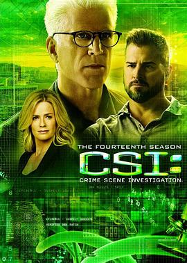

# 犯罪现场调查 第十四季 (豆瓣)

**链接地址:** http://www.douban.com/doubanapp/dispatch?uri=/subject/24700906/interest/963910683
**作者:** 
**获取时间:** 2025/8/28 23:20:27
**图片数量:** 42

---

## 原始HTML内容

  
    

    
    

    <link href="//img3.doubanio.com/dae/accounts/resources/ba98e9b/shire/bundle.css" rel="stylesheet" type="text/css">

  

    

  <a href="https://accounts.douban.com/passport/login?source=movie" class="nav-login" rel="nofollow">登录/注册</a>

    

  <a href="https://www.douban.com/doubanapp/app?channel=top-nav" class="lnk-doubanapp">下载豆瓣客户端</a>
  

    <a href="https://www.douban.com/doubanapp/app?channel=qipao" class="tip-link">豆瓣 6.0 全新发布</a>
    <a href="javascript: void 0;" class="tip-close">×</a>
  

  

    
豆瓣

    
扫码直接下载

    

      <a href="https://www.douban.com/doubanapp/redirect?channel=top-nav&amp;direct_dl=1&amp;download=iOS">iPhone</a>
      ·
      <a href="https://www.douban.com/doubanapp/redirect?channel=top-nav&amp;direct_dl=1&amp;download=Android" class="download-android">Android</a>
    

  

    

  <ul>
    <li class="">
      <a href="https://www.douban.com" target="_blank" data-moreurl-dict="{&quot;from&quot;:&quot;top-nav-click-main&quot;,&quot;uid&quot;:&quot;0&quot;}">豆瓣</a>
    </li>
    <li class="">
      <a href="https://book.douban.com" target="_blank" data-moreurl-dict="{&quot;from&quot;:&quot;top-nav-click-book&quot;,&quot;uid&quot;:&quot;0&quot;}">读书</a>
    </li>
    <li class="on">
      <a href="https://movie.douban.com" data-moreurl-dict="{&quot;from&quot;:&quot;top-nav-click-movie&quot;,&quot;uid&quot;:&quot;0&quot;}">电影</a>
    </li>
    <li class="">
      <a href="https://music.douban.com" target="_blank" data-moreurl-dict="{&quot;from&quot;:&quot;top-nav-click-music&quot;,&quot;uid&quot;:&quot;0&quot;}">音乐</a>
    </li>
    <li class="">
      <a href="https://www.douban.com/podcast/" target="_blank" data-moreurl-dict="{&quot;from&quot;:&quot;top-nav-click-podcast&quot;,&quot;uid&quot;:&quot;0&quot;}">播客</a>
    </li>
    <li class="">
      <a href="https://www.douban.com/location" target="_blank" data-moreurl-dict="{&quot;from&quot;:&quot;top-nav-click-location&quot;,&quot;uid&quot;:&quot;0&quot;}">同城</a>
    </li>
    <li class="">
      <a href="https://www.douban.com/group" target="_blank" data-moreurl-dict="{&quot;from&quot;:&quot;top-nav-click-group&quot;,&quot;uid&quot;:&quot;0&quot;}">小组</a>
    </li>
    <li class="">
      <a href="https://read.douban.com/?dcs=top-nav&amp;dcm=douban" target="_blank" data-moreurl-dict="{&quot;from&quot;:&quot;top-nav-click-read&quot;,&quot;uid&quot;:&quot;0&quot;}">阅读</a>
    </li>
    <li class="">
      <a href="https://fm.douban.com/?from_=shire_top_nav" target="_blank" data-moreurl-dict="{&quot;from&quot;:&quot;top-nav-click-fm&quot;,&quot;uid&quot;:&quot;0&quot;}">FM</a>
    </li>
    <li class="">
      <a href="https://time.douban.com/?dt_time_source=douban-web_top_nav" target="_blank" data-moreurl-dict="{&quot;from&quot;:&quot;top-nav-click-time&quot;,&quot;uid&quot;:&quot;0&quot;}">时间</a>
    </li>
    <li class="">
      <a href="https://market.douban.com/?utm_campaign=douban_top_nav&amp;utm_source=douban&amp;utm_medium=pc_web" target="_blank" data-moreurl-dict="{&quot;from&quot;:&quot;top-nav-click-market&quot;,&quot;uid&quot;:&quot;0&quot;}">豆品</a>
    </li>
  </ul>

  

    

    

    <link href="//img3.doubanio.com/dae/accounts/resources/ba98e9b/movie/bundle.css" rel="stylesheet" type="text/css">

  

  

    

      <a href="https://movie.douban.com">豆瓣电影</a>
    

    

      <form action="https://search.douban.com/movie/subject_search" method="get">
        <fieldset>
          <legend>搜索：</legend>
          <label for="inp-query">
          </label>
          
<input id="inp-query" name="search_text" size="22" maxlength="60" placeholder="搜索电影、电视剧、综艺、影人" value="">

          
<input type="submit" value="搜索">

          <input type="hidden" name="cat" value="1002">
        </fieldset>
      </form>
    

  

  

  

    

  <ul>
    <li><a href="https://movie.douban.com/cinema/nowplaying/">影讯&amp;购票</a>
    </li>
    <li><a href="https://movie.douban.com/explore">选电影</a>
    </li>
    <li><a href="https://movie.douban.com/tv/">选剧集</a>
    </li>
    <li><a href="https://movie.douban.com/chart">排行榜</a>
    </li>
    <li><a href="https://movie.douban.com/review/best/">影评</a>
    </li>
    <li><a href="https://movie.douban.com/annual/2024/?fullscreen=1&amp;dt_from=movie_navigation">2024年度榜单</a>
    </li>
    <li><a href="https://c9.douban.com/app/standbyme-2024/?autorotate=false&amp;fullscreen=true&amp;hidenav=true&amp;monitor_screenshot=true&amp;df_from=web_navigation" target="_blank">2024年度报告</a>
    </li>
  </ul>

    
  

    

    
    

        

        
    

        

    <h1>
        犯罪现场调查 第十四季 CSI: Crime Scene Investigation Season 14
            (2013)
    </h1>

        

            

            
            

                
    

        

            

                
                

    

                

        导演: <a href="https://www.douban.com/personage/27526102/" rel="v:directedBy">阿莱克·斯迈特</a> 
        编剧: <a href="https://www.douban.com/personage/27373541/">安东尼·E·祖克尔</a> 
        主演: <a href="https://www.douban.com/personage/27219538/" rel="v:starring">特德·丹森</a> / <a href="https://www.douban.com/personage/27237682/" rel="v:starring">乔治·艾德斯</a> / <a href="https://www.douban.com/personage/27228461/" rel="v:starring">艾瑞克·兹曼达</a> / <a href="https://www.douban.com/personage/27246481/" rel="v:starring">罗伯特·大卫·豪尔</a> / <a href="https://www.douban.com/personage/27223683/" rel="v:starring">伊莉莎白·哈诺伊斯</a> / <a href="https://www.douban.com/personage/27260454/" rel="v:starring">保罗·吉尔福伊尔</a> / <a href="https://www.douban.com/personage/27215018/" rel="v:starring">乔雅·福克斯</a> / <a href="https://www.douban.com/personage/27237872/" rel="v:starring">华莱士·朗翰</a> 
        类型: 剧情 / 悬疑 / 犯罪 
        
        制片国家/地区: 美国 
        语言: 英语 
        首播: 2013-09-25(美国) 
        季数: 14 
        集数: 22 
        单集片长: 60分钟 
        
        IMDb: tt3096182 

            

            
                

<link rel="stylesheet" href="https://img3.doubanio.com/cuphead/movie-static/download-output-image/index.7aaa3.css">

    

        

            

                豆瓣评分
            

          

            
            <a class="download-output-image" href="#">引用</a>
          

        

        

    <strong class="ll rating_num" property="v:average">8.7</strong>
    
    

        

        

                <a href="comments" class="rating_people">
                    4145人评价
                </a>
        

    

    
        

        
        
            5星
        
        

        47.6%
         
        

        

        
        
            4星
        
        

        40.8%
         
        

        

        
        
            3星
        
        

        10.9%
         
        

        

        
        
            2星
        
        

        0.6%
         
        

        

        
        
            1星
        
        

        0.1%
         
        

    

        

            好于 <a href="/typerank?type_name=剧情&amp;type=11&amp;interval_id=40:30&amp;action=">39% 剧情片</a> 
            好于 <a href="/typerank?type_name=犯罪&amp;type=3&amp;interval_id=70:60&amp;action=">65% 犯罪片</a> 
        

            
        

        
            

        
            <a href="https://www.douban.com/reason=collectwish&amp;ck=" rel="nofollow" class="j a_show_login colbutt ll" name="pbtn-24700906-wish">
                想看
            </a>
            <a href="https://www.douban.com/reason=collectdo&amp;ck=" rel="nofollow" class="j a_show_login colbutt ll" name="pbtn-24700906-do">
                在看
            </a>
            <a href="https://www.douban.com/reason=collectcollect&amp;ck=" rel="nofollow" class="j a_show_login colbutt ll" name="pbtn-24700906-collect">
                看过
            </a>
        

            
    
    评价:
     

            
            
            
            
            
    
    <input id="n_rating" type="hidden" value="">
    

        

        

    <ul class="ul_subject_menu bicelink color_gray pt6 clearfix">
        
    
        
                
                  <li> 
    &nbsp;
        <a onclick="moreurl(this, {from:'mv_sbj_wr_cmnt_login'})" class="j a_show_login" href="https://www.douban.com/register?reason=review" rel="nofollow">写短评</a>
 </li>
                  <li> 
    
    &nbsp;
        <a onclick="moreurl(this, {from:'mv_sbj_wr_rv_login'})" class="j a_show_login" href="https://www.douban.com/register?reason=review" rel="nofollow">写影评</a>
 </li>
                    <li> 
   

   
    
    
    <a href="#" data-type="电视剧" data-url="https://movie.douban.com/subject/24700906/" data-desc="电视剧《犯罪现场调查 第十四季 CSI: Crime Scene Investigation Season 14》 (来自豆瓣) " data-title="电视剧《犯罪现场调查 第十四季 CSI: Crime Scene Investigation Season 14》 (来自豆瓣) " data-pic="https://img1.doubanio.com/view/photo/s_ratio_poster/public/p2509247590.jpeg" class="bn-sharing ">
        分享到
    </a> &nbsp;&nbsp;
    
    <link rel="stylesheet" href="https://img1.doubanio.com/f/vendors/e8a7261937da62636d22ca4c579efc4a4d759b1b/css/ui/dialog.css">
    
    
    

  </li>
            

    </ul>

    

        
            

<link rel="stylesheet" href="https://img3.doubanio.com/cuphead/movie-static/mod/share.ee737.css" type="text/css">

    

        
        <a href="/accounts/register?reason=recommend" class="j a_show_login lnk-sharing" share-id="24700906" data-mode="plain" data-name="犯罪现场调查 第十四季 CSI: Crime Scene Investigation Season 14‎ (2013)" data-type="movie" data-desc="导演 阿莱克·斯迈特 主演 特德·丹森 / 乔治·艾德斯 / 美国 / 8.7分(4145评价)" data-href="https://movie.douban.com/subject/24700906/" data-image="https://img1.doubanio.com/view/photo/s_ratio_poster/public/p2509247590.jpg" data-properties="{}" data-redir="" data-text="" data-apikey="" data-curl="" data-count="10" data-object_kind="1002" data-object_id="24700906" data-target_type="rec" data-target_action="1" data-action_props="{&quot;subject_url&quot;:&quot;https:\/\/movie.douban.com\/subject\/24700906\/&quot;,&quot;subject_title&quot;:&quot;犯罪现场调查 第十四季 CSI: Crime Scene Investigation Season 14‎ (2013)&quot;}">推荐</a>

        
    

        

    

    
        

    <h2>
        <i>犯罪现场调查 第十四季的分集短评</i>
              · · · · · ·
    </h2>

    

    
    

            

            <a class=" item" href="/subject/24700906/episode/1/">1集</a>
            

            <a class=" item" href="/subject/24700906/episode/2/">2集</a>
            

            <a class=" item" href="/subject/24700906/episode/3/">3集</a>
            

            <a class=" item" href="/subject/24700906/episode/4/">4集</a>
            

            <a class=" item" href="/subject/24700906/episode/5/">5集</a>
            

            <a class=" item" href="/subject/24700906/episode/6/">6集</a>
            

            <a class=" item" href="/subject/24700906/episode/7/">7集</a>
            

            <a class=" item" href="/subject/24700906/episode/8/">8集</a>
            

            <a class=" item" href="/subject/24700906/episode/9/">9集</a>
            

            <a class=" item" href="/subject/24700906/episode/10/">10集</a>
            

            <a class=" item" href="/subject/24700906/episode/11/">11集</a>
            

            <a class=" item" href="/subject/24700906/episode/12/">12集</a>
            

            <a class=" item" href="/subject/24700906/episode/13/">13集</a>
            

            <a class=" item" href="/subject/24700906/episode/14/">14集</a>
            

            <a class=" item" href="/subject/24700906/episode/15/">15集</a>
            

            <a class=" item" href="/subject/24700906/episode/16/">16集</a>
            

            <a class=" item" href="/subject/24700906/episode/17/">17集</a>
            

            <a class=" item" href="/subject/24700906/episode/18/">18集</a>
            

            <a class=" item" href="/subject/24700906/episode/19/">19集</a>
            

            <a class="hide item" href="/subject/24700906/episode/20/">20集</a>
            

            <a class="hide item" href="/subject/24700906/episode/21/">21集</a>
            

            <a class="hide item" href="/subject/24700906/episode/22/">22集</a>

            <a href="#" class="ep_more"></a>

    

    

    
    
        
            
            
    <h2>
        <i>犯罪现场调查 第十四季的剧情简介</i>
              · · · · · ·
    </h2>

            

                    
                        
                                　　CSI的故事背景设在赌城拉斯维加斯，以真人真事改编，讲述刑事警察局的法庭犯罪调查员如何在作案现场取得证据破案的故事。调查员的名言是“死尸会说话”，他们利用指纹、鞋印、子弹壳、血迹、毛发、纤维、尸体伤痕等微小证据，经过仔细的分析研究后，寻得破案的关键。 解开谜团的过程颇有吸引力。
                        
                        

                        

            

    

    

<link rel="stylesheet" href="https://img3.doubanio.com/cuphead/movie-static/celebrity/celebrities_section.610da.css">

  
    <h2>
        <i>犯罪现场调查 第十四季的演职员</i>
              · · · · · ·
            
            (
                <a href="/subject/24700906/celebrities">全部 144</a>
            )
            
    </h2>

  <ul class="celebrities-list from-subject __oneline">
        
    
  
  <li class="celebrity">
    

  <a href="https://www.douban.com/personage/27526102/" title="阿莱克·斯迈特 Alec Smight" class="">
      

    

  </a>

    

      <a href="https://www.douban.com/personage/27526102/" title="阿莱克·斯迈特 Alec Smight" class="name">阿莱克·斯迈特</a>

      导演

    

  </li>

        
    
  
  <li class="celebrity">
    

  <a href="https://www.douban.com/personage/27256675/" title="伊戈尔·艾吉尔森 Eagle Egilsson" class="">
      

    

  </a>

    

      <a href="https://www.douban.com/personage/27256675/" title="伊戈尔·艾吉尔森 Eagle Egilsson" class="name">伊戈尔·艾吉尔森</a>

      导演

    

  </li>

        
    
  
  <li class="celebrity">
    

  <a href="https://www.douban.com/personage/27219538/" title="特德·丹森 Ted Danson" class="">
      

    

  </a>

    

      <a href="https://www.douban.com/personage/27219538/" title="特德·丹森 Ted Danson" class="name">特德·丹森</a>

      演员

    

  </li>

        
    
  
  <li class="celebrity">
    

  <a href="https://www.douban.com/personage/27237682/" title="乔治·艾德斯 George Eads" class="">
      

    

  </a>

    

      <a href="https://www.douban.com/personage/27237682/" title="乔治·艾德斯 George Eads" class="name">乔治·艾德斯</a>

      演员

    

  </li>

        
    
  
  <li class="celebrity">
    

  <a href="https://www.douban.com/personage/27228461/" title="艾瑞克·兹曼达 Eric Szmanda" class="">
      

    

  </a>

    

      <a href="https://www.douban.com/personage/27228461/" title="艾瑞克·兹曼达 Eric Szmanda" class="name">艾瑞克·兹曼达</a>

      演员

    

  </li>

        
    
  
  <li class="celebrity">
    

  <a href="https://www.douban.com/personage/27246481/" title="罗伯特·大卫·豪尔 Robert David Hall" class="">
      

    

  </a>

    

      <a href="https://www.douban.com/personage/27246481/" title="罗伯特·大卫·豪尔 Robert David Hall" class="name">罗伯特·大卫·豪尔</a>

      演员

    

  </li>

  </ul>

    

<link rel="stylesheet" href="https://img1.doubanio.com/f/verify/a5bc0bc0aea4221d751bc4809fd4b0a1075ad25e/entry_creator/dist/author_subject/style.css">

    

    
        

<link rel="stylesheet" href="https://img1.doubanio.com/cuphead/movie-static/subject/photos_section.45abd.css">

    
    

        
    
    
    <h2>
        <i>犯罪现场调查 第十四季的图片</i>
              · · · · · ·
            
            (
                <a href="https://movie.douban.com/subject/24700906/all_photos">图片109</a>&nbsp;·&nbsp;<a href="https://movie.douban.com/subject/24700906/mupload">添加</a>
            )
            
    </h2>

        <ul class="related-pic-bd  ">
                <li>
                    
                </li>
                <li>
                    
                </li>
                <li>
                    
                </li>
                <li>
                    
                </li>
                <li>
                    
                </li>
        </ul>
    

    
          

<link rel="stylesheet" href="https://img3.doubanio.com/cuphead/movie-static/episode/index.17b17.css">

  
  <a class="comment_btn j a_show_login" href="https://www.douban.com/register?reason=discussion" rel="nofollow">
      发起新的讨论
  </a>

    <h2>
        <i>讨论区</i>
              · · · · · ·
            
            (
                <a href="https://movie.douban.com/subject/24700906/discussion/">全部</a>
            )
            
    </h2>

<a href="https://movie.douban.com/subject/24700906/discussion/" class="on">最新</a>
<a href="https://movie.douban.com/subject/24700906/discussion/?sort=vote" data-epid="hot">热门</a>
  <a href="https://movie.douban.com/subject/24700906/discussion/?ep_num=1" data-epid="735729" data-num="1">1集</a>
  <a href="https://movie.douban.com/subject/24700906/discussion/?ep_num=2" data-epid="735730" data-num="2">2集</a>
  <a href="https://movie.douban.com/subject/24700906/discussion/?ep_num=3" data-epid="735731" data-num="3">3集</a>
  <a href="https://movie.douban.com/subject/24700906/discussion/?ep_num=4" data-epid="735732" data-num="4">4集</a>
  <a href="https://movie.douban.com/subject/24700906/discussion/?ep_num=5" data-epid="735733" data-num="5">5集</a>
  <a href="https://movie.douban.com/subject/24700906/discussion/?ep_num=6" data-epid="735734" data-num="6">6集</a>
  <a href="https://movie.douban.com/subject/24700906/discussion/?ep_num=7" data-epid="735735" data-num="7">7集</a>
  <a href="https://movie.douban.com/subject/24700906/discussion/" data-epid="more" title="更多">…</a>
  <a href="https://movie.douban.com/subject/24700906/discussion/?ep_num=8" data-epid="735736" data-num="8" class="more-item">8集</a>
  <a href="https://movie.douban.com/subject/24700906/discussion/?ep_num=9" data-epid="735737" data-num="9" class="more-item">9集</a>
  <a href="https://movie.douban.com/subject/24700906/discussion/?ep_num=10" data-epid="735738" data-num="10" class="more-item">10集</a>
  <a href="https://movie.douban.com/subject/24700906/discussion/?ep_num=11" data-epid="735739" data-num="11" class="more-item">11集</a>
  <a href="https://movie.douban.com/subject/24700906/discussion/?ep_num=12" data-epid="735740" data-num="12" class="more-item">12集</a>
  <a href="https://movie.douban.com/subject/24700906/discussion/?ep_num=13" data-epid="735741" data-num="13" class="more-item">13集</a>
  <a href="https://movie.douban.com/subject/24700906/discussion/?ep_num=14" data-epid="735742" data-num="14" class="more-item">14集</a>
  <a href="https://movie.douban.com/subject/24700906/discussion/?ep_num=15" data-epid="735743" data-num="15" class="more-item">15集</a>
  <a href="https://movie.douban.com/subject/24700906/discussion/?ep_num=16" data-epid="735744" data-num="16" class="more-item">16集</a>
  <a href="https://movie.douban.com/subject/24700906/discussion/?ep_num=17" data-epid="735745" data-num="17" class="more-item">17集</a>
  <a href="https://movie.douban.com/subject/24700906/discussion/?ep_num=18" data-epid="735746" data-num="18" class="more-item">18集</a>
  <a href="https://movie.douban.com/subject/24700906/discussion/?ep_num=19" data-epid="735747" data-num="19" class="more-item">19集</a>
  <a href="https://movie.douban.com/subject/24700906/discussion/?ep_num=20" data-epid="735748" data-num="20" class="more-item">20集</a>
  <a href="https://movie.douban.com/subject/24700906/discussion/?ep_num=21" data-epid="735749" data-num="21" class="more-item">21集</a>
  <a href="https://movie.douban.com/subject/24700906/discussion/?ep_num=22" data-epid="735750" data-num="22" class="more-item">22集</a>

  

<table>
  <thead>
  <tr>
    <td>讨论</td>
    <td>作者</td>
    <td nowrap="nowrap">回应</td>
    <td align="right">最后回应</td>
  </tr>
  </thead>
  <tbody>
  
  <tr>
    <td class="title">
      <a href="https://movie.douban.com/subject/24700906/discussion/637795608/" title="[第14集] 被法医老爷爷笑死">[第14集] 被法医老爷爷笑死</a>
        [图]
    </td>
    <td><a href="https://www.douban.com/people/47968213/">Momo</a></td>
    <td class="reply-num"></td>
    <td class="time">2025-04-19 05:40</td>
  </tr>
  
  <tr>
    <td class="title">
      <a href="https://movie.douban.com/subject/24700906/discussion/57065065/" title="[第18集] 猜中了开头 没有猜中结尾">[第18集] 猜中了开头 没有猜中结尾</a>
    </td>
    <td><a href="https://www.douban.com/people/51266289/">木有鱼丸</a></td>
    <td class="reply-num">28</td>
    <td class="time">2024-02-27 09:57</td>
  </tr>
  
  <tr>
    <td class="title">
      <a href="https://movie.douban.com/subject/24700906/discussion/637236616/" title="尼克也成大叔了   大叔jm要离开了吗？老将走了太多了">尼克也成大叔了   大叔jm要离开了吗？老将走了太多了</a>
    </td>
    <td><a href="https://www.douban.com/people/227070317/"> 虎妈   焦真</a></td>
    <td class="reply-num"></td>
    <td class="time">2022-06-01 21:48</td>
  </tr>
  
  <tr>
    <td class="title">
      <a href="https://movie.douban.com/subject/24700906/discussion/616649387/" title="[第9集] Sara不知道Beyonce是谁">[第9集] Sara不知道Beyonce是谁</a>
    </td>
    <td><a href="https://www.douban.com/people/80395068/">momo</a></td>
    <td class="reply-num"></td>
    <td class="time">2020-04-29 00:32</td>
  </tr>
  
  <tr>
    <td class="title">
      <a href="https://movie.douban.com/subject/24700906/discussion/57229815/" title="[第19集] 暂时是本季最佳">[第19集] 暂时是本季最佳</a>
    </td>
    <td><a href="https://www.douban.com/people/Zizou_Vam/">托尼·王大拿</a></td>
    <td class="reply-num">2</td>
    <td class="time">2017-04-06 12:55</td>
  </tr>
  
  <tr>
    <td class="title">
      <a href="https://movie.douban.com/subject/24700906/discussion/56804724/" title="[第15集] 骨子里就是bitch">[第15集] 骨子里就是bitch</a>
    </td>
    <td><a href="https://www.douban.com/people/staryingnn/">长星照耀十三州</a></td>
    <td class="reply-num">2</td>
    <td class="time">2014-09-03 12:23</td>
  </tr>
  
  <tr>
    <td class="title">
      <a href="https://movie.douban.com/subject/24700906/discussion/56788555/" title="[第15集] 麻痹啊，还要标题">[第15集] 麻痹啊，还要标题</a>
    </td>
    <td><a href="https://www.douban.com/people/57409980/">任平生</a></td>
    <td class="reply-num"></td>
    <td class="time">2014-02-21 23:24</td>
  </tr>
  </tbody>
</table>

<a href="https://movie.douban.com/subject/24700906/discussion/">&gt; 全部讨论7条</a>

  

<table>
  <thead>
  <tr>
    <td>讨论</td>
    <td>作者</td>
    <td nowrap="nowrap">回应</td>
    <td align="right">最后回应</td>
  </tr>
  </thead>
  <tbody>
  
  <tr>
    <td class="title">
      <a href="https://movie.douban.com/subject/24700906/discussion/57065065/" title="[第18集] 猜中了开头 没有猜中结尾">[第18集] 猜中了开头 没有猜中结尾</a>
    </td>
    <td><a href="https://www.douban.com/people/51266289/">木有鱼丸</a></td>
    <td class="reply-num">28</td>
    <td class="time">2024-02-27 09:57</td>
  </tr>
  
  <tr>
    <td class="title">
      <a href="https://movie.douban.com/subject/24700906/discussion/57229815/" title="[第19集] 暂时是本季最佳">[第19集] 暂时是本季最佳</a>
    </td>
    <td><a href="https://www.douban.com/people/Zizou_Vam/">托尼·王大拿</a></td>
    <td class="reply-num">2</td>
    <td class="time">2017-04-06 12:55</td>
  </tr>
  
  <tr>
    <td class="title">
      <a href="https://movie.douban.com/subject/24700906/discussion/56804724/" title="[第15集] 骨子里就是bitch">[第15集] 骨子里就是bitch</a>
    </td>
    <td><a href="https://www.douban.com/people/staryingnn/">长星照耀十三州</a></td>
    <td class="reply-num">2</td>
    <td class="time">2014-09-03 12:23</td>
  </tr>
  
  <tr>
    <td class="title">
      <a href="https://movie.douban.com/subject/24700906/discussion/637795608/" title="[第14集] 被法医老爷爷笑死">[第14集] 被法医老爷爷笑死</a>
        [图]
    </td>
    <td><a href="https://www.douban.com/people/47968213/">Momo</a></td>
    <td class="reply-num"></td>
    <td class="time">2025-04-19 05:40</td>
  </tr>
  
  <tr>
    <td class="title">
      <a href="https://movie.douban.com/subject/24700906/discussion/637236616/" title="尼克也成大叔了   大叔jm要离开了吗？老将走了太多了">尼克也成大叔了   大叔jm要离开了吗？老将走了太多了</a>
    </td>
    <td><a href="https://www.douban.com/people/227070317/"> 虎妈   焦真</a></td>
    <td class="reply-num"></td>
    <td class="time">2022-06-01 21:48</td>
  </tr>
  
  <tr>
    <td class="title">
      <a href="https://movie.douban.com/subject/24700906/discussion/616649387/" title="[第9集] Sara不知道Beyonce是谁">[第9集] Sara不知道Beyonce是谁</a>
    </td>
    <td><a href="https://www.douban.com/people/80395068/">momo</a></td>
    <td class="reply-num"></td>
    <td class="time">2020-04-29 00:32</td>
  </tr>
  
  <tr>
    <td class="title">
      <a href="https://movie.douban.com/subject/24700906/discussion/56788555/" title="[第15集] 麻痹啊，还要标题">[第15集] 麻痹啊，还要标题</a>
    </td>
    <td><a href="https://www.douban.com/people/57409980/">任平生</a></td>
    <td class="reply-num"></td>
    <td class="time">2014-02-21 23:24</td>
  </tr>
  </tbody>
</table>

<a href="https://movie.douban.com/subject/24700906/discussion/?sort=vote">&gt; 全部讨论7条</a>

    

    
        

<link rel="stylesheet" href="https://img3.doubanio.com/cuphead/movie-static/subject/recommendations.61283.css">

        

    

    
        

    
    <link rel="stylesheet" href="https://img1.doubanio.com/f/vendors/d63a579a99fd372b4398731a279a1382e6eac71e/subject-comments/comments-section.css">

    

        

            
            
        <a class="comment_btn j a_show_login" href="https://www.douban.com/register?reason=review" rel="nofollow">
            我要写短评
        </a>

            
    <h2>
        <i>犯罪现场调查 第十四季的短评</i>
              · · · · · ·
            
            (
                <a href="https://movie.douban.com/subject/24700906/comments?status=P">全部 782 条</a>
            )
            
    </h2>

        

        

        

                
        

                        <a id="hot-comments-tab" href="comments" data-id="hot" class="on">热门</a>&nbsp;/&nbsp;
                        <a id="new-comments-tab" href="comments?sort=time" data-id="new" class="j a_show_login">最新</a>&nbsp;/&nbsp;
                        <a id="following-comments-tab" href="comments?sort=follows" data-id="following" class="j a_show_login">好友</a>
        

    

        

            
    

        
        

            
    
    

        <h3>
            
                    7

                    <input value="730157047" type="hidden">
                    <a href="javascript:;" data-id="730157047" class="j a_show_login" onclick="">有用</a>

                <!-- 删除短评 -->
            
            
                <a href="https://www.douban.com/people/toyprayer/">Toy</a>
                    看过
                    
                
                    2014-05-29 17:50:50
                
                
            
        </h3>
        

            
                Nick又胖了啊!哎,Jim真心可怜,完完全全的孤家寡人了!Ep05,全剧第300集,看到结尾在证物房里,Sara拿出曾经被Greg戴在头上在实验室里跳舞结果被老G抓了个正着的舞女头饰,看着那一件件他们曾经办过的离奇Case的证物,那些已经离开的人们－W,C姐,老G以及一整集未出现的Nick,还有片尾最后一个镜头－老G的签名.
        

        

    

    

        

        
        

            
    
    

        <h3>
            
                    3

                    <input value="729876562" type="hidden">
                    <a href="javascript:;" data-id="729876562" class="j a_show_login" onclick="">有用</a>

                <!-- 删除短评 -->
            
            
                <a href="https://www.douban.com/people/deadcolour/">Fan要坚强</a>
                    看过
                    
                
                    2014-01-24 01:52:22
                
                
            
        </h3>
        

            
                说真的有点看不下去了 不仅cliche还总想搞爆破刺激眼球那一套俗烂 追CSI是为了high tech和 quirky logical thinking哇 编剧一天到晚给金发阿姨编男朋友是怎么个回事儿
        

        

    

    

        

        
        

            
    
    

        <h3>
            
                    1

                    <input value="755063362" type="hidden">
                    <a href="javascript:;" data-id="755063362" class="j a_show_login" onclick="">有用</a>

                <!-- 删除短评 -->
            
            
                <a href="https://www.douban.com/people/81249317/">meowmeowmeow</a>
                    看过
                    
                
                    2014-06-09 08:01:07
                
                
            
        </h3>
        

            
                Great cast ensemble. One of the best seasons!
        

        

    

    

        

        
        

            
    
    

        <h3>
            
                    21

                    <input value="730878874" type="hidden">
                    <a href="javascript:;" data-id="730878874" class="j a_show_login" onclick="">有用</a>

                <!-- 删除短评 -->
            
            
                <a href="https://www.douban.com/people/SEVEN.ELEVEN/">☜超龄儿童</a>
                    看过
                    
                
                    2013-12-03 16:27:32
                
                
            
        </h3>
        

            
                最爱这部剧！不过真心讨厌芬恩！
                
                
        

        

    

    

        

        
        

            
    
    

        <h3>
            
                    12

                    <input value="746984329" type="hidden">
                    <a href="javascript:;" data-id="746984329" class="j a_show_login" onclick="">有用</a>

                <!-- 删除短评 -->
            
            
                <a href="https://www.douban.com/people/68460447/">carrot的巴赫</a>
                    看过
                    
                
                    2013-11-21 22:29:05
                
                
            
        </h3>
        

            
                十三年，早已不是单纯的电视剧，就像一种约定，说好的，不再见。
        

        

    

    

        

                
                    &gt; <a href="comments?sort=new_score&amp;status=P" data-moreurl-dict="{&quot;subject_id&quot;:&quot;24700906&quot;,&quot;from&quot;:&quot;tv-more-comments&quot;,&quot;bid&quot;:&quot;_71Z11Ru5oo&quot;}">
                        更多短评
                            782条
                    </a>
        

        

            

            

            

                <a class="qa" href="/help/opinion#t2-q0" target="_blank">为什么被折叠？</a>
                <a class="btn-unfold" href="#">有一些短评被折叠了</a>
                

                    评论被折叠，是因为发布这条评论的账号行为异常。评论仍可以被展开阅读，对发布人的账号不造成其他影响。如果认为有问题，可以<a href="https://help.douban.com/help/ask?category=movie">联系</a>豆瓣电影。
                

            

            

            

            
        

        

            
    

        

            你关注的人还没写过短评
        

        

    

    

            
            
        

    

<!--        此处是挂载其他页面，不是注释！不是注释！不是注释！-->
        

<link rel="stylesheet" href="https://img1.doubanio.com/misc/mixed_static/292deb5ae8f760a3.css">

    <section id="reviews-wrapper" class="reviews mod movie-content">
        <header>
            
                <a href="new_review" rel="nofollow" class="create-review comment_btn " data-isverify="False" data-verify-url="https://www.douban.com/accounts/phone/verify?redir=https://movie.douban.com/subject/24700906/new_review">
                    我要写剧评
                </a>
            <h2>
                    犯罪现场调查 第十四季的剧评 · · · · · ·

                    ( <a href="reviews">全部 8 条</a> )
            </h2>
        </header>

            
            

                                <a href="javascript:;;" class="cur" data-sort="">热门</a>
            

            

            

        
    

            
    
    

        

            
    
    <header class="main-hd">
        

        <a href="https://www.douban.com/people/232343711/" class="name">小黑</a>
            

        2021-12-25 18:59:32

    </header>

            

                <h2><a href="https://movie.douban.com/review/14091235/">十四季分集剧情</a></h2>

                

                    

                            
这篇剧评可能有剧透

                        S14E02 拿钱跑 案件1  赌场谋杀案  报案人：不详  参与调查：尼克，S姐，小G，摩根，芬利，DB 四王赌场正在豪赌，在兑换筹码的时候，赌场突然断电，劫匪抢走了100万美元的钞票和筹码并打死赌场保安，在警方的追逐中突然死亡，发现筹码及钞票都是假的，劫匪全身肿大，全身多处骨...

                        &nbsp;(<a href="javascript:;" id="toggle-14091235-copy" class="unfold" title="展开">展开</a>)
                    

                

                

                    

                

                

                    <a href="javascript:;" class="action-btn up" data-rid="14091235" title="有用">
                        
                        
                                7
                        
                    </a>
                    <a href="javascript:;" class="action-btn down" data-rid="14091235" title="没用">
                        
                        
                        
                    </a>
                    <a href="https://movie.douban.com/review/14091235/#comments" class="reply ">0回应</a>

                    <a href="javascript:;;" class="fold hidden">收起</a>
                

            

        

    

            
    
    

        

            
    
    <header class="main-hd">
        

        <a href="https://www.douban.com/people/142626638/" class="name">diandian002010</a>
            

        2016-05-11 23:22:44

    </header>

            

                <h2><a href="https://movie.douban.com/review/7891143/">致我最爱的犯罪现场调查拉斯维加斯篇</a></h2>

                

                    

                        我对刑侦悬疑类的剧集都毫无抵抗力，我开始看《犯罪现场调查》是在2010年，从此就一发不可收拾，彻底迷上了这部充满了悬疑与科学的剧，当时这部剧已经播到第十季了，追完不过瘾的我把落下的九季都一一补了回来。 这部剧可以说是刑侦调查教科书似的剧集。CSI给我打开了一个全新...

                        &nbsp;(<a href="javascript:;" id="toggle-7891143-copy" class="unfold" title="展开">展开</a>)
                    

                

                

                    

                

                

                    <a href="javascript:;" class="action-btn up" data-rid="7891143" title="有用">
                        
                        
                                7
                        
                    </a>
                    <a href="javascript:;" class="action-btn down" data-rid="7891143" title="没用">
                        
                        
                        
                    </a>
                    <a href="https://movie.douban.com/review/7891143/#comments" class="reply ">3回应</a>

                    <a href="javascript:;;" class="fold hidden">收起</a>
                

            

        

    

            
    
    

        

            
    
    <header class="main-hd">
        

        <a href="https://www.douban.com/people/IOMOVIE/" class="name">VV灰仔</a>
            

        2014-03-17 16:03:02

    </header>

            

                <h2><a href="https://movie.douban.com/review/6592209/">犯罪现场调查</a></h2>

                

                    

                        大爱的美剧，从第一季一直追到十四季，想想人家都跟拍了十四年啦！艾德斯和福克斯都老了······不得不承认，美国在犯罪侦查和鉴定方面的确很先进，这也有力的避免了大量冤假错案的发生。记得几年前刚看第一季时，一看是2001年的，还犹豫要不要跳过去。但是看了之后，感慨...

                        &nbsp;(<a href="javascript:;" id="toggle-6592209-copy" class="unfold" title="展开">展开</a>)
                    

                

                

                    

                

                

                    <a href="javascript:;" class="action-btn up" data-rid="6592209" title="有用">
                        
                        
                                3
                        
                    </a>
                    <a href="javascript:;" class="action-btn down" data-rid="6592209" title="没用">
                        
                        
                        
                    </a>
                    <a href="https://movie.douban.com/review/6592209/#comments" class="reply ">0回应</a>

                    <a href="javascript:;;" class="fold hidden">收起</a>
                

            

        

    

            
    
    

        

            
    
    <header class="main-hd">
        

        <a href="https://www.douban.com/people/232343711/" class="name">小黑</a>
            

        2021-12-26 21:53:56

    </header>

            

                <h2><a href="https://movie.douban.com/review/14095015/">十四季熟脸</a></h2>

                

                    

                        s14E02  赌场保安的妻子（Karen Branston）由泰柔娜·派丽丝饰演，代表作：《旺达幻世》《广告狂人》常驻. S14E03  酒吧老板由约翰·拉岑贝格饰演，美国著名的配音演员《超人总动员》《辛普森一家》等动画片都由这位老爷子配音. S14E04 米歇尔由辛希亚·阿戴-罗宾森饰演，《生...

                        &nbsp;(<a href="javascript:;" id="toggle-14095015-copy" class="unfold" title="展开">展开</a>)
                    

                

                

                    

                

                

                    <a href="javascript:;" class="action-btn up" data-rid="14095015" title="有用">
                        
                        
                                1
                        
                    </a>
                    <a href="javascript:;" class="action-btn down" data-rid="14095015" title="没用">
                        
                        
                        
                    </a>
                    <a href="https://movie.douban.com/review/14095015/#comments" class="reply ">0回应</a>

                    <a href="javascript:;;" class="fold hidden">收起</a>
                

            

        

    

            
    
    

        

            
    
    <header class="main-hd">
        

        <a href="https://www.douban.com/people/144120774/" class="name">小鬼</a>
            

        2016-09-27 10:07:20

    </header>

            

                <h2><a href="https://movie.douban.com/review/8103165/">当好奇变成一种情节</a></h2>

                

                    

                        作为一只大学狗，一直对刑侦剧情有独钟，机缘巧合下看到了这部剧，于是一发不可收拾。 从第一季开始，确实有点失望，因为不是我期望的俊男美女的组合，即使在2000年，几位主演的皱纹也十分明显。但是看过了一集之后，便毫无抵抗力的被吸引了，Grissom有种特别的魅力，引领着我...

                        &nbsp;(<a href="javascript:;" id="toggle-8103165-copy" class="unfold" title="展开">展开</a>)
                    

                

                

                    

                

                

                    <a href="javascript:;" class="action-btn up" data-rid="8103165" title="有用">
                        
                        
                                1
                        
                    </a>
                    <a href="javascript:;" class="action-btn down" data-rid="8103165" title="没用">
                        
                        
                        
                    </a>
                    <a href="https://movie.douban.com/review/8103165/#comments" class="reply ">0回应</a>

                    <a href="javascript:;;" class="fold hidden">收起</a>
                

            

        

    

            
    
    

        

            
    
    <header class="main-hd">
        

        <a href="https://www.douban.com/people/149566263/" class="name">简单拌着简单J</a>

        2021-05-03 16:28:08

    </header>

            

                <h2><a href="https://movie.douban.com/review/13521696/">第14季的重点观感</a></h2>

                

                    

                        1.Finn 也是实惨了吧 一上来就被Russell 安排去调查Greg 小可爱 搞得大家紧张兮兮都对她也紧张不友好; 姐妹放松周末 Morgan , Sarah 一起出去玩，在酒吧勾搭上一个男的，居然还是强奸杀人犯，要被打，被车子撞，被调查; 再往后 和那个记者John 被卷进一个案子,被FBI 调查. 2全...

                        &nbsp;(<a href="javascript:;" id="toggle-13521696-copy" class="unfold" title="展开">展开</a>)
                    

                

                

                    

                

                

                    <a href="javascript:;" class="action-btn up" data-rid="13521696" title="有用">
                        
                        
                        
                    </a>
                    <a href="javascript:;" class="action-btn down" data-rid="13521696" title="没用">
                        
                        
                        
                    </a>
                    <a href="https://movie.douban.com/review/13521696/#comments" class="reply ">0回应</a>

                    <a href="javascript:;;" class="fold hidden">收起</a>
                

            

        

    

            
    
    

        

            
    
    <header class="main-hd">
        

        <a href="https://www.douban.com/people/139022171/" class="name">布丁🍮黄桃子🍑</a>
            

        2020-10-27 02:17:30

    </header>

            

                <h2><a href="https://movie.douban.com/review/12937383/">喜欢Russell</a></h2>

                

                    

                            
这篇剧评可能有剧透

                        1 ：男人DB👨🏻太帅了！ 自信，自给自足，理性，沉着， 卓越、够专业，精明， 有爱心，可靠，有责任感， 有人生追求 身材好，追求健康 居然年龄上是大叔大爷👨🏻‍🦳了，可是非常有魅力，是最想嫁的男人类型😯，相比之下几套房子啥的都不算什么了，当然DB本身也...

                        &nbsp;(<a href="javascript:;" id="toggle-12937383-copy" class="unfold" title="展开">展开</a>)
                    

                

                

                    

                

                

                    <a href="javascript:;" class="action-btn up" data-rid="12937383" title="有用">
                        
                        
                        
                    </a>
                    <a href="javascript:;" class="action-btn down" data-rid="12937383" title="没用">
                        
                        
                        
                    </a>
                    <a href="https://movie.douban.com/review/12937383/#comments" class="reply ">0回应</a>

                    <a href="javascript:;;" class="fold hidden">收起</a>
                

            

        

    

        

                <a class="btn-unfold" href="#">有一些影评被折叠了</a>
                    <a class="qa" href="https://help.douban.com/opinion?app=movie#t1-q2">为什么被折叠？</a>
            
评论被折叠，是因为发布这条评论的帐号行为异常。评论仍可以被展开阅读，对发布人的账号不造成其他影响。如果认为有问题，可以<a href="https://help.douban.com/help/ask?category=movie">联系</a>豆瓣电影。

        

        

                
    
    

        

            
    
    <header class="main-hd">
        

        <a href="https://www.douban.com/people/sissi222/" class="name">火树</a>
            

        2013-12-16 16:54:27

    </header>

            

                <h2><a href="https://movie.douban.com/review/6463741/">11集 The Lost Reindeer</a></h2>

                

                    

                        The Lost Reindeer  Once upon a time,there was a reindeer named Winston.  Winston was lost.  He wandered the city instead of delivering toys in the frost.   Winston searched every roof and chimney.  Where, oh, where could jolly Santa be?  Winston turned the ...

                        &nbsp;(<a href="javascript:;" id="toggle-6463741-copy" class="unfold" title="展开">展开</a>)
                    

                

                

                    

                

                

                    <a href="javascript:;" class="action-btn up" data-rid="6463741" title="有用">
                        
                        
                                2
                        
                    </a>
                    <a href="javascript:;" class="action-btn down" data-rid="6463741" title="没用">
                        
                        
                        
                    </a>
                    <a href="https://movie.douban.com/review/6463741/#comments" class="reply ">1回应</a>

                    <a href="javascript:;;" class="fold hidden">收起</a>
                

            

        

    

        

    

    <!-- COLLECTED JS -->
    <!-- COLLECTED CSS -->

    

    <link rel="stylesheet" href="https://img1.doubanio.com/f/zerkalo/88118a282439e312283e886ea4c3d3e9849a8fa4/css/review/editor/ng/setting_standalone.css">
    
    
    
    
    
    
    

                

                    &gt;
                        <a href="reviews">
                            更多剧评
                                8篇
                        </a>
                

    </section>
<!-- COLLECTED JS -->

     

    
            

                    

    <a href="https://movie.douban.com/subject/24700906/tv_discuss">&gt; 查看 犯罪现场调查 第十四季 的分集短评（全部267条）</a>

            

    

            

            

                

    

    <!-- douban ad begin -->
    

    <!-- douban ad end -->

    

    

    

    

    
        

    
    
    <h2>
        <i>以下片单推荐</i>
              · · · · · ·
            
            (
                <a href="https://movie.douban.com/subject/24700906/doulists">全部</a>
            )
            
    </h2>

    
    <ul>
            
                <li>
                    <a href="https://www.douban.com/doulist/329709/" target="_blank">为毛我这么爱看探案剧！</a>
                    (virginia)
                </li>
            
                <li>
                    <a href="https://www.douban.com/doulist/243201/" target="_blank">·最爱罪案剧·</a>
                    (Toy)
                </li>
            
                <li>
                    <a href="https://www.douban.com/doulist/20184555/" target="_blank">一个人看电视（二）</a>
                    (鹿小羽)
                </li>
            
                <li>
                    <a href="https://www.douban.com/doulist/233292/" target="_blank">英伦与北美，风味绝佳。</a>
                    (apeachgugu)
                </li>
            
                <li>
                    <a href="https://www.douban.com/doulist/44515599/" target="_blank">每一集都是独立故事的犯罪剧集</a>
                    (钱💰妙丽Muriel)
                </li>
    </ul>

    
        

    
    
    <h2>
        <i>谁在看这部剧集</i>
              · · · · · ·
    </h2>

    
    <ul>
            
            <li>
                
                

                    <a href="https://www.douban.com/people/268945086/">豆友yvaahmuTWo</a>
                    

                        8月27日
                        看过
                        

                    

                

            </li>
            
            <li>
                
                

                    <a href="https://www.douban.com/people/176966365/">是天天呀</a>
                    

                        8月24日
                        想看
                        

                    

                

            </li>
            
            <li>
                
                

                    <a href="https://www.douban.com/people/290637982/">Lemon</a>
                    

                        8月24日
                        看过
                        

                    

                

            </li>
    </ul>

    
    

        
            <a href="https://movie.douban.com/subject/24700906/comments?status=N">239人在看</a>
                &nbsp;/&nbsp;
            <a href="https://movie.douban.com/subject/24700906/comments?status=P">5952人看过</a>
                &nbsp;/&nbsp;
            <a href="https://movie.douban.com/subject/24700906/comments?status=F">1493人想看</a>
    

    

<!-- douban ad begin -->

<!-- douban ad end -->

     

    

订阅犯罪现场调查 第十四季的影评:  
    <a href="https://movie.douban.com/feed/subject/24700906/reviews"> feed: rss 2.0</a>

            

            

                
    
<!-- douban ad begin -->

<!-- douban ad end -->

    <!-- douban ad begin -->
    

    <!-- douban ad end -->

            

        

    

        
    

            

        

    © 2005－2025 douban.com, all rights reserved 北京豆网科技有限公司

    <a href="https://www.douban.com/about">关于豆瓣</a>
    · <a href="https://www.douban.com/jobs">在豆瓣工作</a>
    · <a href="https://www.douban.com/about?topic=contactus">联系我们</a>
    · <a href="https://www.douban.com/about/legal">法律声明</a>
    
    · <a href="https://help.douban.com/?app=movie" target="_blank">帮助中心</a>
    · <a href="https://www.douban.com/doubanapp/">移动应用</a>

    

    

    
        
        
    <link rel="stylesheet" type="text/css" href="https://img1.doubanio.com/f/vendors/e8a7261937da62636d22ca4c579efc4a4d759b1b/css/ui/dialog.css">
    <link rel="stylesheet" type="text/css" href="https://img1.doubanio.com/cuphead/movie-static/mod/login_pop.b2f60.css">
    
    
    

    
    
    
    
    
    
    
    
    
    

    
    
    

    

    
  

      

    <!-- dae-web-movie--default-5f9cb85759-q4gcc-->

  

---

## 纯文本内容

var _body_start = new Date();

    
    

    

  
    

  登录/注册

    
  下载豆瓣客户端
  
    豆瓣 6.0 全新发布
    ×
  
  
    豆瓣
    扫码直接下载
    
      iPhone
      ·
      Android
    
  

    

  
    
      豆瓣
    
    
      读书
    
    
      电影
    
    
      音乐
    
    
      播客
    
    
      同城
    
    
      小组
    
    
      阅读
    
    
      FM
    
    
      时间
    
    
      豆品
    
  

  

  ;window._GLOBAL_NAV = {
    DOUBAN_URL: "https://www.douban.com",
    N_NEW_NOTIS: 0,
    N_NEW_DOUMAIL: 0
  };

    

    

    

  
  
    
      豆瓣电影
    
    
      
        
          搜索：
          
          
          
          
          
        
      
    
  
  
  
    

  
    影讯&购票
    
    选电影
    
    选剧集
    
    排行榜
    
    影评
    
    2024年度榜单
    
    2024年度报告
    
  

    
  

  <li data-link="{{= url}}">
            <a href="{{= url}}" onclick="moreurl(this, {from:'movie_search_sugg', query:'{{= keyword }}', subject_id:'{{= id}}', i: '{{= index}}', type: '{{= type}}'})">
            
            

                <em>{{= title}}</em>
                {{if year}}
                    {{= year}}
                {{/if}}
                {{if sub_title}}
                     {{= sub_title}}
                {{/if}}
                {{if address}}
                     {{= address}}
                {{/if}}
                {{if episode}}
                    {{if episode=="unknow"}}
                         集数未知
                    {{else}}
                         共{{= episode}}集
                    {{/if}}
                {{/if}}
            

        </a>
        </li>
  

    

    
    
        

        
    
        

    
        犯罪现场调查 第十四季 CSI: Crime Scene Investigation Season 14
            (2013)
    

        
            

            
            
                
    
        
            
                
                

    
        
   

                

        导演: 阿莱克·斯迈特
        编剧: 安东尼·E·祖克尔
        主演: 特德·丹森 / 乔治·艾德斯 / 艾瑞克·兹曼达 / 罗伯特·大卫·豪尔 / 伊莉莎白·哈诺伊斯 / 保罗·吉尔福伊尔 / 乔雅·福克斯 / 华莱士·朗翰
        类型: 剧情 / 悬疑 / 犯罪
        
        制片国家/地区: 美国
        语言: 英语
        首播: 2013-09-25(美国)
        季数: 14
        集数: 22
        单集片长: 60分钟
        
        IMDb: tt3096182

$(function(){
    var limit = 5
    $('#info .attrs').each(function() {
        var $list = $(this).find('a')
        var $attrs = $(this)

        if($list.length > limit) {
            $attrs.empty()
            $list.each(function(idx) {
                if (idx+1 === $list.length) {
                    $('').prepend($(this)).appendTo($attrs);
                } else {
                    $(' / ').prepend($(this)).appendTo($attrs);
                }
            })

            $attrs.append('<a href="javascript:;" class="more-attrs" title="显示更多">更多...</a>')
            $('.more-attrs').on('click', function() {
                $(this).parent().find('span').show()
                $(this).hide()
            })

            $attrs.find('span').slice(limit).hide()
        }
    })
})

            
            
                

    
        
            
                豆瓣评分
            
          
            
            引用
          
        
        

    8.7
    
    
        
        
                
                    4145人评价
                
        
    

    
        
        
        
            5星
        
        
        47.6%
        
        
        
        
        
            4星
        
        
        40.8%
        
        
        
        
        
            3星
        
        
        10.9%
        
        
        
        
        
            2星
        
        
        0.6%
        
        
        
        
        
            1星
        
        
        0.1%
        
        

    
        
            好于 39% 剧情片
            好于 65% 犯罪片
        

            
        
        
            

        
            
                想看
            
            
                在看
            
            
                看过
            
        
            
    
    评价:
     

            
            
        
            
            
        
            
            
        
            
            
        
            
            
        
    
    
    

        

        

    
        
    
        
                
                   
     
        写短评
 
                   
    
     
        写影评
 
                     
   

   
    
    
    
        分享到
       
    
    
    
    
    

  
            

    

    
        $(function(){
            $(".ul_subject_menu li.rec .bn-sharing").bind("click", function(){
                $.get("/blank?sbj_page_click=bn_sharing");
            });
        });
    

        
            

    
        
    <form class="movie-share" action="/j/share" method="POST">
        

            

                <textarea name="text" class="share-text" cols="72" data-mention-api="https://api.douban.com/shuo/in/complete?alt=xd&amp;callback=?"></textarea>
                <input type="hidden" name="target-id" value="24700906">
                <input type="hidden" name="target-type" value="0">
                <input type="hidden" name="title" value="犯罪现场调查 第十四季 CSI: Crime Scene Investigation Season 14‎ (2013)">
                <input type="hidden" name="desc" value="导演 阿莱克·斯迈特 主演 特德·丹森 / 乔治·艾德斯 / 美国 / 8.7分(4145评价)">
                <input type="hidden" name="redir" value=""/>
                

            

            

                    
                <strong>犯罪现场调查 第十四季 CSI: Crime Scene Investigation Season 14‎ (2013)</strong>
                
导演 阿莱克·斯迈特 主演 特德·丹森 / 乔治·艾德斯 / 美国 / 8.7分(4145评价)

                
&nbsp;

            

        

        

            

                

                140
                
                    <input type="submit" value="推荐" />
                
            

        

    </form>
    
    

        <ul>
            {{#users}}
            <li id="{{uid}}">
              {{{username}}}&nbsp;({{{uid}}})
            </li>
            {{/users}}
        </ul>
    

    

        
        推荐

        
            $(function() {
                $('.collect_btn', '#interest_sect_level').each(function() {
                    Douban.init_collect_btn(this);
                });
                $('html').delegate(".indent .rec-sec .lnk-sharing", "click", function() {
                    moreurl(this, {
                        from : 'mv_sbj_db_share'
                    });
                });
            });
        
    
        

    
    
        

    
        犯罪现场调查 第十四季的分集短评
              · · · · · ·
    

    

    
    

            

            1集
            

            2集
            

            3集
            

            4集
            

            5集
            

            6集
            

            7集
            

            8集
            

            9集
            

            10集
            

            11集
            

            12集
            

            13集
            

            14集
            

            15集
            

            16集
            

            17集
            

            18集
            

            19集
            

            20集
            

            21集
            

            22集

            

    

    

    
    
        
            
            
    
        犯罪现场调查 第十四季的剧情简介
              · · · · · ·
    

            
                    
                        
                                　　CSI的故事背景设在赌城拉斯维加斯，以真人真事改编，讲述刑事警察局的法庭犯罪调查员如何在作案现场取得证据破案的故事。调查员的名言是“死尸会说话”，他们利用指纹、鞋印、子弹壳、血迹、毛发、纤维、尸体伤痕等微小证据，经过仔细的分析研究后，寻得破案的关键。 解开谜团的过程颇有吸引力。
                        
                        
                        

            

    

    

  
    
        犯罪现场调查 第十四季的演职员
              · · · · · ·
            
            (
                全部 144
            )
            
    

  
        
    
  
  
    

  
      
    
  

    
      阿莱克·斯迈特

      导演

    
  

        
    
  
  
    

  
      
    
  

    
      伊戈尔·艾吉尔森

      导演

    
  

        
    
  
  
    

  
      
    
  

    
      特德·丹森

      演员

    
  

        
    
  
  
    

  
      
    
  

    
      乔治·艾德斯

      演员

    
  

        
    
  
  
    

  
      
    
  

    
      艾瑞克·兹曼达

      演员

    
  

        
    
  
  
    

  
      
    
  

    
      罗伯特·大卫·豪尔

      演员

    
  

  

    

    

    var answerObj = {
      ISALL: 'False',
      TYPE: 'tv',
      SUBJECT_ID: '24700906',
      USER_ID: 'None'
    }

    
        

    
    
        
    
    
    
        犯罪现场调查 第十四季的图片
              · · · · · ·
            
            (
                图片109 · 添加
            )
            
    

        
                
                    
                
                
                    
                
                
                    
                
                
                    
                
                
                    
                
        
    

    
          

  
  
      发起新的讨论
  

    
        讨论区
              · · · · · ·
            
            (
                全部
            )
            ...

---

## 图片列表

-  (原始链接: https://img1.doubanio.com/view/photo/s_ratio_poster/public/p2509247590.jpg)
-  (原始链接: https://img2.doubanio.com/cuphead/movie-static/pics/reference.png)
-  (原始链接: https://img1.doubanio.com/f/vendors/2520c01967207a1735171056ec588c8c1257e5f8/pics/rating_icons/star_hollow_hover.png)
-  (原始链接: https://img1.doubanio.com/f/vendors/2520c01967207a1735171056ec588c8c1257e5f8/pics/rating_icons/star_hollow_hover.png)
-  (原始链接: https://img1.doubanio.com/f/vendors/2520c01967207a1735171056ec588c8c1257e5f8/pics/rating_icons/star_hollow_hover.png)
-  (原始链接: https://img1.doubanio.com/f/vendors/2520c01967207a1735171056ec588c8c1257e5f8/pics/rating_icons/star_hollow_hover.png)
-  (原始链接: https://img1.doubanio.com/f/vendors/2520c01967207a1735171056ec588c8c1257e5f8/pics/rating_icons/star_hollow_hover.png)
-  (原始链接: https://img9.doubanio.com/cuphead/movie-static/pics/short-comment.gif)
-  (原始链接: https://img1.doubanio.com/cuphead/movie-static/pics/add-review.gif)
-  (原始链接: https://img1.doubanio.com/view/photo/sqxs/public/p2160876278.jpg)
-  (原始链接: https://img3.doubanio.com/view/photo/sqxs/public/p2602679753.jpg)
-  (原始链接: https://img3.doubanio.com/view/photo/sqxs/public/p2602679622.jpg)
-  (原始链接: https://img1.doubanio.com/view/photo/sqxs/public/p2602678250.jpg)
-  (原始链接: https://img1.doubanio.com/view/photo/sqxs/public/p2198488428.jpg)
-  (原始链接: https://img2.doubanio.com/cuphead/movie-static/pics/comment/iphone.png)
-  (原始链接: https://img2.doubanio.com/icon/u232343711-1.jpg)
-  (原始链接: https://img1.doubanio.com/f/zerkalo/536fd337139250b5fb3cf9e79cb65c6193f8b20b/pics/up.png)
-  (原始链接: https://img1.doubanio.com/f/zerkalo/68849027911140623cf338c9845893c4566db851/pics/down.png)
-  (原始链接: https://img2.doubanio.com/icon/u142626638-1.jpg)
-  (原始链接: https://img1.doubanio.com/f/zerkalo/536fd337139250b5fb3cf9e79cb65c6193f8b20b/pics/up.png)
-  (原始链接: https://img1.doubanio.com/f/zerkalo/68849027911140623cf338c9845893c4566db851/pics/down.png)
-  (原始链接: https://img9.doubanio.com/icon/u59874565-5.jpg)
-  (原始链接: https://img1.doubanio.com/f/zerkalo/536fd337139250b5fb3cf9e79cb65c6193f8b20b/pics/up.png)
-  (原始链接: https://img1.doubanio.com/f/zerkalo/68849027911140623cf338c9845893c4566db851/pics/down.png)
-  (原始链接: https://img2.doubanio.com/icon/u232343711-1.jpg)
-  (原始链接: https://img1.doubanio.com/f/zerkalo/536fd337139250b5fb3cf9e79cb65c6193f8b20b/pics/up.png)
-  (原始链接: https://img1.doubanio.com/f/zerkalo/68849027911140623cf338c9845893c4566db851/pics/down.png)
-  (原始链接: https://img2.doubanio.com/icon/u144120774-1.jpg)
-  (原始链接: https://img1.doubanio.com/f/zerkalo/536fd337139250b5fb3cf9e79cb65c6193f8b20b/pics/up.png)
-  (原始链接: https://img1.doubanio.com/f/zerkalo/68849027911140623cf338c9845893c4566db851/pics/down.png)
-  (原始链接: https://img3.doubanio.com/icon/u149566263-2.jpg)
-  (原始链接: https://img1.doubanio.com/f/zerkalo/536fd337139250b5fb3cf9e79cb65c6193f8b20b/pics/up.png)
-  (原始链接: https://img1.doubanio.com/f/zerkalo/68849027911140623cf338c9845893c4566db851/pics/down.png)
-  (原始链接: https://img9.doubanio.com/icon/u139022171-4.jpg)
-  (原始链接: https://img1.doubanio.com/f/zerkalo/536fd337139250b5fb3cf9e79cb65c6193f8b20b/pics/up.png)
-  (原始链接: https://img1.doubanio.com/f/zerkalo/68849027911140623cf338c9845893c4566db851/pics/down.png)
-  (原始链接: https://img3.doubanio.com/icon/u45731414-3.jpg)
-  (原始链接: https://img1.doubanio.com/f/zerkalo/536fd337139250b5fb3cf9e79cb65c6193f8b20b/pics/up.png)
-  (原始链接: https://img1.doubanio.com/f/zerkalo/68849027911140623cf338c9845893c4566db851/pics/down.png)
-  (原始链接: https://img2.doubanio.com/icon/u268945086-1.jpg)
-  (原始链接: https://img9.doubanio.com/icon/u176966365-6.jpg)
-  (原始链接: https://img2.doubanio.com/icon/u290637982-1.jpg)
