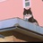

# 移动迷宫2 (豆瓣)

**链接地址:** http://www.douban.com/doubanapp/dispatch?uri=/subject/25995508/interest/974366186
**作者:** 
**获取时间:** 2025/8/28 23:18:40
**图片数量:** 61

---

## 原始HTML内容

  
    

    
    

    <link href="//img3.doubanio.com/dae/accounts/resources/ba98e9b/shire/bundle.css" rel="stylesheet" type="text/css">

  

    

  <a href="https://accounts.douban.com/passport/login?source=movie" class="nav-login" rel="nofollow">登录/注册</a>

    

  <a href="https://www.douban.com/doubanapp/app?channel=top-nav" class="lnk-doubanapp">下载豆瓣客户端</a>
  

    <a href="https://www.douban.com/doubanapp/app?channel=qipao" class="tip-link">豆瓣 6.0 全新发布</a>
    <a href="javascript: void 0;" class="tip-close">×</a>
  

  

    
豆瓣

    
扫码直接下载

    

      <a href="https://www.douban.com/doubanapp/redirect?channel=top-nav&amp;direct_dl=1&amp;download=iOS">iPhone</a>
      ·
      <a href="https://www.douban.com/doubanapp/redirect?channel=top-nav&amp;direct_dl=1&amp;download=Android" class="download-android">Android</a>
    

  

    

  <ul>
    <li class="">
      <a href="https://www.douban.com" target="_blank" data-moreurl-dict="{&quot;from&quot;:&quot;top-nav-click-main&quot;,&quot;uid&quot;:&quot;0&quot;}">豆瓣</a>
    </li>
    <li class="">
      <a href="https://book.douban.com" target="_blank" data-moreurl-dict="{&quot;from&quot;:&quot;top-nav-click-book&quot;,&quot;uid&quot;:&quot;0&quot;}">读书</a>
    </li>
    <li class="on">
      <a href="https://movie.douban.com" data-moreurl-dict="{&quot;from&quot;:&quot;top-nav-click-movie&quot;,&quot;uid&quot;:&quot;0&quot;}">电影</a>
    </li>
    <li class="">
      <a href="https://music.douban.com" target="_blank" data-moreurl-dict="{&quot;from&quot;:&quot;top-nav-click-music&quot;,&quot;uid&quot;:&quot;0&quot;}">音乐</a>
    </li>
    <li class="">
      <a href="https://www.douban.com/podcast/" target="_blank" data-moreurl-dict="{&quot;from&quot;:&quot;top-nav-click-podcast&quot;,&quot;uid&quot;:&quot;0&quot;}">播客</a>
    </li>
    <li class="">
      <a href="https://www.douban.com/location" target="_blank" data-moreurl-dict="{&quot;from&quot;:&quot;top-nav-click-location&quot;,&quot;uid&quot;:&quot;0&quot;}">同城</a>
    </li>
    <li class="">
      <a href="https://www.douban.com/group" target="_blank" data-moreurl-dict="{&quot;from&quot;:&quot;top-nav-click-group&quot;,&quot;uid&quot;:&quot;0&quot;}">小组</a>
    </li>
    <li class="">
      <a href="https://read.douban.com/?dcs=top-nav&amp;dcm=douban" target="_blank" data-moreurl-dict="{&quot;from&quot;:&quot;top-nav-click-read&quot;,&quot;uid&quot;:&quot;0&quot;}">阅读</a>
    </li>
    <li class="">
      <a href="https://fm.douban.com/?from_=shire_top_nav" target="_blank" data-moreurl-dict="{&quot;from&quot;:&quot;top-nav-click-fm&quot;,&quot;uid&quot;:&quot;0&quot;}">FM</a>
    </li>
    <li class="">
      <a href="https://time.douban.com/?dt_time_source=douban-web_top_nav" target="_blank" data-moreurl-dict="{&quot;from&quot;:&quot;top-nav-click-time&quot;,&quot;uid&quot;:&quot;0&quot;}">时间</a>
    </li>
    <li class="">
      <a href="https://market.douban.com/?utm_campaign=douban_top_nav&amp;utm_source=douban&amp;utm_medium=pc_web" target="_blank" data-moreurl-dict="{&quot;from&quot;:&quot;top-nav-click-market&quot;,&quot;uid&quot;:&quot;0&quot;}">豆品</a>
    </li>
  </ul>

  

    

    

    <link href="//img3.doubanio.com/dae/accounts/resources/ba98e9b/movie/bundle.css" rel="stylesheet" type="text/css">

  

  

    

      <a href="https://movie.douban.com">豆瓣电影</a>
    

    

      <form action="https://search.douban.com/movie/subject_search" method="get">
        <fieldset>
          <legend>搜索：</legend>
          <label for="inp-query">
          </label>
          
<input id="inp-query" name="search_text" size="22" maxlength="60" placeholder="搜索电影、电视剧、综艺、影人" value="">

          
<input type="submit" value="搜索">

          <input type="hidden" name="cat" value="1002">
        </fieldset>
      </form>
    

  

  

  

    

  <ul>
    <li><a href="https://movie.douban.com/cinema/nowplaying/">影讯&amp;购票</a>
    </li>
    <li><a href="https://movie.douban.com/explore">选电影</a>
    </li>
    <li><a href="https://movie.douban.com/tv/">选剧集</a>
    </li>
    <li><a href="https://movie.douban.com/chart">排行榜</a>
    </li>
    <li><a href="https://movie.douban.com/review/best/">影评</a>
    </li>
    <li><a href="https://movie.douban.com/annual/2024/?fullscreen=1&amp;dt_from=movie_navigation">2024年度榜单</a>
    </li>
    <li><a href="https://c9.douban.com/app/standbyme-2024/?autorotate=false&amp;fullscreen=true&amp;hidenav=true&amp;monitor_screenshot=true&amp;df_from=web_navigation" target="_blank">2024年度报告</a>
    </li>
  </ul>

    
  

    

    
    

        

        
    

        

    <h1>
        移动迷宫2 Maze Runner: The Scorch Trials
            (2015)
    </h1>

        

            

            
            

                
    

        

            

                
                

    

                

        导演: <a href="https://www.douban.com/personage/27543214/" rel="v:directedBy">韦斯·鲍尔</a> 
        编剧: <a href="https://www.douban.com/personage/27553856/">T·S·诺林</a> / <a href="https://www.douban.com/personage/27552261/">詹姆斯·达什纳</a> 
        主演: <a href="https://www.douban.com/personage/27481710/" rel="v:starring">迪伦·奥布莱恩</a> / <a href="https://www.douban.com/personage/27236919/" rel="v:starring">卡雅·斯考达里奥</a> / <a href="https://www.douban.com/personage/27222392/" rel="v:starring">托马斯·布罗迪-桑斯特</a> / <a href="https://www.douban.com/personage/27253904/" rel="v:starring">吉安卡罗·埃斯波西托</a> / <a href="https://www.douban.com/personage/27250717/" rel="v:starring">艾丹·吉伦</a> / <a href="https://www.douban.com/personage/27552264/" rel="v:starring">李起弘</a> / <a href="https://www.douban.com/personage/27205765/" rel="v:starring">巴里·佩珀</a> / <a href="https://www.douban.com/personage/27237629/" rel="v:starring">莉莉·泰勒</a> / <a href="https://www.douban.com/personage/27219495/" rel="v:starring">派翠西娅·克拉克森</a> / <a href="https://www.douban.com/personage/27552268/" rel="v:starring">德克斯特·达登</a> / <a href="https://www.douban.com/personage/27552271/" rel="v:starring">亚历山大·弗洛里斯</a> / <a href="https://www.douban.com/personage/27482272/" rel="v:starring">雅库布·洛弗兰德</a> / <a href="https://www.douban.com/personage/27494585/" rel="v:starring">罗莎·萨拉查</a> / <a href="https://www.douban.com/personage/27555632/" rel="v:starring">特里·戴尔·帕克斯</a> / <a href="https://www.douban.com/personage/27555631/" rel="v:starring">凯瑟琳·史密斯-麦格林</a> / <a href="https://www.douban.com/personage/27494589/" rel="v:starring">凯瑟琳·麦克纳马拉</a> / <a href="https://www.douban.com/personage/27503417/" rel="v:starring">娜塔莉·伊曼纽尔</a> 
        类型: 动作 / 科幻 / 冒险 
        
        制片国家/地区: 美国 
        语言: 英语 
        上映日期: 2015-11-04(中国大陆) / 2015-09-18(美国) 
        片长: 131分钟 
        又名: 移动迷宫2：烧痕审判 / 移动迷宫：焦土试炼(台/港) / 灼热试炼 / The Maze Runner Chapter II: The Scorch Trials / Maze Runner 2 
        IMDb: tt4046784 

        官方小站:
        <a href="https://site.douban.com/foxmovies/room/39207250/" target="_blank">《移动迷宫2》专题页</a>

            

            
                

<link rel="stylesheet" href="https://img3.doubanio.com/cuphead/movie-static/download-output-image/index.7aaa3.css">

    

        

            

                豆瓣评分
            

          

            
            <a class="download-output-image" href="#">引用</a>
          

        

        

    <strong class="ll rating_num" property="v:average">6.1</strong>
    
    

        

        

                <a href="comments" class="rating_people">
                    131270人评价
                </a>
        

    

    
        

        
        
            5星
        
        

        6.9%
         
        

        

        
        
            4星
        
        

        18.2%
         
        

        

        
        
            3星
        
        

        51.4%
         
        

        

        
        
            2星
        
        

        19.8%
         
        

        

        
        
            1星
        
        

        3.7%
         
        

    

        

            好于 <a href="/typerank?type_name=动作&amp;type=5&amp;interval_id=70:60&amp;action=">69% 动作片</a> 
            好于 <a href="/typerank?type_name=科幻&amp;type=17&amp;interval_id=70:60&amp;action=">68% 科幻片</a> 
        

            
        

        
            

        
            <a href="https://www.douban.com/reason=collectwish&amp;ck=" rel="nofollow" class="j a_show_login colbutt ll" name="pbtn-25995508-wish">
                想看
            </a>
            <a href="https://www.douban.com/reason=collectcollect&amp;ck=" rel="nofollow" class="j a_show_login colbutt ll" name="pbtn-25995508-collect">
                看过
            </a>
        

            
    
    评价:
     

            
            
            
            
            
    
    <input id="n_rating" type="hidden" value="">
    

        

        

    <ul class="ul_subject_menu bicelink color_gray pt6 clearfix">
        
    
        
                
                  <li> 
    &nbsp;
        <a onclick="moreurl(this, {from:'mv_sbj_wr_cmnt_login'})" class="j a_show_login" href="https://www.douban.com/register?reason=review" rel="nofollow">写短评</a>
 </li>
                  <li> 
    
    &nbsp;
        <a onclick="moreurl(this, {from:'mv_sbj_wr_rv_login'})" class="j a_show_login" href="https://www.douban.com/register?reason=review" rel="nofollow">写影评</a>
 </li>
                    <li> 
   

   
    
    
    <a href="#" data-type="电影" data-url="https://movie.douban.com/subject/25995508/" data-desc="电影《移动迷宫2 Maze Runner: The Scorch Trials》 (来自豆瓣) " data-title="电影《移动迷宫2 Maze Runner: The Scorch Trials》 (来自豆瓣) " data-pic="https://img3.doubanio.com/view/photo/s_ratio_poster/public/p2276189752.jpeg" class="bn-sharing ">
        分享到
    </a> &nbsp;&nbsp;
    
    <link rel="stylesheet" href="https://img1.doubanio.com/f/vendors/e8a7261937da62636d22ca4c579efc4a4d759b1b/css/ui/dialog.css">
    
    
    

  </li>
            

    </ul>

    

        
            

<link rel="stylesheet" href="https://img3.doubanio.com/cuphead/movie-static/mod/share.ee737.css" type="text/css">

    

        
        <a href="/accounts/register?reason=recommend" class="j a_show_login lnk-sharing" share-id="25995508" data-mode="plain" data-name="移动迷宫2 Maze Runner: The Scorch Trials‎ (2015)" data-type="movie" data-desc="导演 韦斯·鲍尔 主演 迪伦·奥布莱恩 / 卡雅·斯考达里奥 / 美国 / 6.1分(131270评价)" data-href="https://movie.douban.com/subject/25995508/" data-image="https://img3.doubanio.com/view/photo/s_ratio_poster/public/p2276189752.jpg" data-properties="{}" data-redir="" data-text="" data-apikey="" data-curl="" data-count="10" data-object_kind="1002" data-object_id="25995508" data-target_type="rec" data-target_action="0" data-action_props="{&quot;subject_url&quot;:&quot;https:\/\/movie.douban.com\/subject\/25995508\/&quot;,&quot;subject_title&quot;:&quot;移动迷宫2 Maze Runner: The Scorch Trials‎ (2015)&quot;}">推荐</a>

        
    

        

    

    

    

    
    
        
            
            
    <h2>
        <i>移动迷宫2的剧情简介</i>
              · · · · · ·
    </h2>

            

                    
                        
                                　　托马斯（迪伦·欧布莱恩 Dylan O'Brien 饰）、米诺（李基弘 Ki Hong Lee 饰）一行人被带到一座神秘的庇护所，这个机构由表里不一的詹森（艾丹·吉伦 Aidan Gillen 饰）所管理，詹森为他们提供安稳且舒适的环境，并下令让幽地斗士们在医疗实验室中接受一连串的测试，詹森向托马斯保证将会把他们送到更加安全的保护区与其他对“闪焰症病毒”免疫的年轻人一同居住。察觉事有蹊跷的托马斯决定再次带领他的伙伴们逃出詹森的掌控，然而等待他们的，却是比迷宫更加危险的焦土。
                                     
                                　　影片改编自詹姆斯·达什纳撰写的同名反乌托邦科幻小说三部曲的第二部。
                        
                        

                        

            

    

    

<link rel="stylesheet" href="https://img3.doubanio.com/cuphead/movie-static/celebrity/celebrities_section.610da.css">

  
    <h2>
        <i>移动迷宫2的演职员</i>
              · · · · · ·
            
            (
                <a href="/subject/25995508/celebrities">全部 35</a>
            )
            
    </h2>

  <ul class="celebrities-list from-subject __oneline">
        
    
  
  <li class="celebrity">
    

  <a href="https://www.douban.com/personage/27543214/" title="韦斯·鲍尔 Wes Ball" class="">
      

    

  </a>

    

      <a href="https://www.douban.com/personage/27543214/" title="韦斯·鲍尔 Wes Ball" class="name">韦斯·鲍尔</a>

      导演

    

  </li>

        
    
  
  <li class="celebrity">
    

  <a href="https://www.douban.com/personage/27481710/" title="迪伦·奥布莱恩 Dylan O'Brien" class="">
      

    

  </a>

    

      <a href="https://www.douban.com/personage/27481710/" title="迪伦·奥布莱恩 Dylan O'Brien" class="name">迪伦·奥布莱恩</a>

      饰 托马斯 Thomas

    

  </li>

        
    
  
  <li class="celebrity">
    

  <a href="https://www.douban.com/personage/27236919/" title="卡雅·斯考达里奥 Kaya Scodelario" class="">
      

    

  </a>

    

      <a href="https://www.douban.com/personage/27236919/" title="卡雅·斯考达里奥 Kaya Scodelario" class="name">卡雅·斯考达里奥</a>

      饰 特蕾莎 Teresa

    

  </li>

        
    
  
  <li class="celebrity">
    

  <a href="https://www.douban.com/personage/27222392/" title="托马斯·布罗迪-桑斯特 Thomas Brodie-Sangster" class="">
      

    

  </a>

    

      <a href="https://www.douban.com/personage/27222392/" title="托马斯·布罗迪-桑斯特 Thomas Brodie-Sangster" class="name">托马斯·布罗迪-桑斯特</a>

      饰 纽特 Newt

    

  </li>

        
    
  
  <li class="celebrity">
    

  <a href="https://www.douban.com/personage/27253904/" title="吉安卡罗·埃斯波西托 Giancarlo Esposito" class="">
      

    

  </a>

    

      <a href="https://www.douban.com/personage/27253904/" title="吉安卡罗·埃斯波西托 Giancarlo Esposito" class="name">吉安卡罗·埃斯波西托</a>

      饰 乔治 Jorge

    

  </li>

        
    
  
  <li class="celebrity">
    

  <a href="https://www.douban.com/personage/27250717/" title="艾丹·吉伦 Aidan Gillen" class="">
      

    

  </a>

    

      <a href="https://www.douban.com/personage/27250717/" title="艾丹·吉伦 Aidan Gillen" class="name">艾丹·吉伦</a>

      饰 詹森 Janson

    

  </li>

  </ul>

    

<link rel="stylesheet" href="https://img1.doubanio.com/f/verify/a5bc0bc0aea4221d751bc4809fd4b0a1075ad25e/entry_creator/dist/author_subject/style.css">

    

    
        

<link rel="stylesheet" href="https://img1.doubanio.com/cuphead/movie-static/subject/photos_section.45abd.css">

    
    

        
    
    
    <h2>
        <i>移动迷宫2的视频和图片</i>
              · · · · · ·
            
            (
                <a href="https://movie.douban.com/subject/25995508/trailer#trailer">预告片21</a>&nbsp;|&nbsp;<a href="https://movie.douban.com/subject/25995508/all_photos">图片484</a>&nbsp;·&nbsp;<a href="https://movie.douban.com/subject/25995508/mupload">添加</a>
            )
            
    </h2>

        <ul class="related-pic-bd  ">
                <li class="label-trailer">
                    <a class="related-pic-video" href="https://movie.douban.com/trailer/185849/#content" title="预告片" style="background-image:url(https://img2.doubanio.com/img/trailer/medium/2278277291.jpg)">
                        
预告片

                    </a>
                </li>
                <li>
                    
                </li>
                <li>
                    
                </li>
                <li>
                    
                </li>
                <li>
                    
                </li>
        </ul>
    

    

    

    

        
    <h2>
        <i>移动迷宫2的获奖情况</i>
              · · · · · ·
            
            (
                <a href="https://movie.douban.com/subject/25995508/awards/">全部</a>
            )
            
    </h2>

    

        
        <ul class="award">
            <li>
                <a href="https://movie.douban.com/awards/annie/43/">第43届动画安妮奖</a>
            </li>
            <li>最佳真人电影动画效果(提名)</li>
            <li></li>
        </ul>

    
        

<link rel="stylesheet" href="https://img3.doubanio.com/cuphead/movie-static/subject/recommendations.61283.css">

        

    

        
        
    <h2>
        <i>喜欢这部电影的人也喜欢</i>
              · · · · · ·
    </h2>

        
    
    

        <dl>
            <dt>
                
            </dt>
            <dd>
                <a href="https://movie.douban.com/subject/26004132/?from=subject-page">移动迷宫3：死亡解药</a>
                5.3
            </dd>
        </dl>
        <dl>
            <dt>
                
            </dt>
            <dd>
                <a href="https://movie.douban.com/subject/25794212/?from=subject-page">分歧者2：绝地反击</a>
                6.1
            </dd>
        </dl>
        <dl>
            <dt>
                
            </dt>
            <dd>
                <a href="https://movie.douban.com/subject/10047547/?from=subject-page">饥饿游戏3：嘲笑鸟(下)</a>
                6.5
            </dd>
        </dl>
        <dl>
            <dt>
                
            </dt>
            <dd>
                <a href="https://movie.douban.com/subject/6873042/?from=subject-page">明日世界</a>
                6.4
            </dd>
        </dl>
        <dl>
            <dt>
                
            </dt>
            <dd>
                <a href="https://movie.douban.com/subject/7054604/?from=subject-page">变形金刚4：绝迹重生</a>
                6.7
            </dd>
        </dl>
        <dl>
            <dt>
                
            </dt>
            <dd>
                <a href="https://movie.douban.com/subject/3338862/?from=subject-page">终结者：创世纪</a>
                6.9
            </dd>
        </dl>
        <dl>
            <dt>
                
            </dt>
            <dd>
                <a href="https://movie.douban.com/subject/4014396/?from=subject-page">神奇四侠2015</a>
                4.8
            </dd>
        </dl>
        <dl>
            <dt>
                
            </dt>
            <dd>
                <a href="https://movie.douban.com/subject/6532822/?from=subject-page">生化危机5：惩罚</a>
                6.4
            </dd>
        </dl>
        <dl>
            <dt>
                
            </dt>
            <dd>
                <a href="https://movie.douban.com/subject/3718424/?from=subject-page">金刚狼2</a>
                6.7
            </dd>
        </dl>
        <dl>
            <dt>
                
            </dt>
            <dd>
                <a href="https://movie.douban.com/subject/5154799/?from=subject-page">木星上行</a>
                5.5
            </dd>
        </dl>
    

    

    

    
        

    
    <link rel="stylesheet" href="https://img1.doubanio.com/f/vendors/d63a579a99fd372b4398731a279a1382e6eac71e/subject-comments/comments-section.css">

    

        

            
            
        <a class="comment_btn j a_show_login" href="https://www.douban.com/register?reason=review" rel="nofollow">
            我要写短评
        </a>

            
    <h2>
        <i>移动迷宫2的短评</i>
              · · · · · ·
            
            (
                <a href="https://movie.douban.com/subject/25995508/comments?status=P">全部 30735 条</a>
            )
            
    </h2>

        

        

        

                
        

                        <a id="hot-comments-tab" href="comments" data-id="hot" class="on">热门</a>&nbsp;/&nbsp;
                        <a id="new-comments-tab" href="comments?sort=time" data-id="new" class="j a_show_login">最新</a>&nbsp;/&nbsp;
                        <a id="following-comments-tab" href="comments?sort=follows" data-id="following" class="j a_show_login">好友</a>
        

    

        

            
    

        
        

            
    
    

        <h3>
            
                    1162

                    <input value="958031967" type="hidden">
                    <a href="javascript:;" data-id="958031967" class="j a_show_login" onclick="">有用</a>

                <!-- 删除短评 -->
            
            
                <a href="https://www.douban.com/people/hyuk35zm/">我不绝望</a>
                    看过
                    
                
                    2015-09-11 00:22:32
                
                
            
        </h3>
        

            
                一整儿就一直let's go let's go gogogogogogo! 
        

        

    

    

        

        
        

            
    
    

        <h3>
            
                    718

                    <input value="957823443" type="hidden">
                    <a href="javascript:;" data-id="957823443" class="j a_show_login" onclick="">有用</a>

                <!-- 删除短评 -->
            
            
                <a href="https://www.douban.com/people/3540441/">同志亦凡人中文站</a>
                    看过
                    
                
                    2015-09-10 08:53:55
                
                
            
        </h3>
        

            
                上部是男主把大家带到水深火热的现实世界，这部是女主送大家去当植物人。遇上这对不做不死的奇葩，队友真是倒了八辈子的霉！！！！！！
        

        

    

    

        

        
        

            
    
    

        <h3>
            
                    334

                    <input value="958604663" type="hidden">
                    <a href="javascript:;" data-id="958604663" class="j a_show_login" onclick="">有用</a>

                <!-- 删除短评 -->
            
            
                <a href="https://www.douban.com/people/21771687/">七姐Clau☁dia</a>
                    看过
                    
                
                    2015-09-13 10:34:53
                
                
            
        </h3>
        

            
                越来越往惊悚片靠了，不再像青少年电影，从节奏感来说要比饥饿游戏和分歧者好多了，影片结尾和mad max 4结尾类似：逃逸的路上没有天国，推倒暴政本身才能建立自己的天国。
        

        

    

    

        

        
        

            
    
    

        <h3>
            
                    201

                    <input value="974934869" type="hidden">
                    <a href="javascript:;" data-id="974934869" class="j a_show_login" onclick="">有用</a>

                <!-- 删除短评 -->
            
            
                <a href="https://www.douban.com/people/tjz230/">影志</a>
                    看过
                    
                
                    2015-11-07 00:42:37
                
                
            
        </h3>
        

            
                我这个迷宫控，就指望那可爱的小迷宫动来动去过瘾，但是迷宫呢？这一部系列特色基本看不到，剧情全靠追逐和逃生牵引，拍出来的感觉就是《饥饿游戏》+《终结者》+《我是传奇》+《僵尸世界大战》。
        

        

    

    

        

        
        

            
    
    

        <h3>
            
                    880

                    <input value="959814238" type="hidden">
                    <a href="javascript:;" data-id="959814238" class="j a_show_login" onclick="">有用</a>

                <!-- 删除短评 -->
            
            
                <a href="https://www.douban.com/people/1740620/">VivianCoalA</a>
                    看过
                    
                
                    2015-09-17 20:21:17
                
                
            
        </h3>
        

            
                跑步和健身真的太重要了！跑过丧尸！跑赢人生！
                
                
        

        

    

    

        

                
                    &gt; <a href="comments?sort=new_score&amp;status=P">
                        更多短评
                            30735条
                    </a>
        

        

            

            

            

                <a class="qa" href="/help/opinion#t2-q0" target="_blank">为什么被折叠？</a>
                <a class="btn-unfold" href="#">有一些短评被折叠了</a>
                

                    评论被折叠，是因为发布这条评论的账号行为异常。评论仍可以被展开阅读，对发布人的账号不造成其他影响。如果认为有问题，可以<a href="https://help.douban.com/help/ask?category=movie">联系</a>豆瓣电影。
                

            

            

            

            
        

        

            
    

        

            你关注的人还没写过短评
        

        

    

    

            
            
        

    

<!--        此处是挂载其他页面，不是注释！不是注释！不是注释！-->
        

<link rel="stylesheet" href="https://img1.doubanio.com/misc/mixed_static/292deb5ae8f760a3.css">

    <section id="reviews-wrapper" class="reviews mod movie-content">
        <header>
            
                <a href="new_review" rel="nofollow" class="create-review comment_btn " data-isverify="False" data-verify-url="https://www.douban.com/accounts/phone/verify?redir=https://movie.douban.com/subject/25995508/new_review">
                    我要写影评
                </a>
            <h2>
                    移动迷宫2的影评 · · · · · ·

                    ( <a href="reviews">全部 199 条</a> )
            </h2>
        </header>

            
            

                                <a href="javascript:;;" class="cur" data-sort="">热门</a>
            

            

            

        
    

            
    
    

        

            
    
    <header class="main-hd">
        

        <a href="https://www.douban.com/people/54278419/" class="name">天真热啊</a>
            

        2015-09-21 10:15:17

    </header>

            

                <h2><a href="https://movie.douban.com/review/7604295/">看完捉急系列</a></h2>

                

                    

                            
这篇影评可能有剧透

                        怎么说, 这类青春类电影都是一个特色, 就是看起来让人非常的捉急.....因为主角们总是在智商掉线....  我木有看第一部, 所以就说说第二部....总的来说, 就是地球又一次发生了瘟疫, 然后丧尸遍地, 然后主角一行人在一个庇护所类似物开始了故事.  主角团队标配: 看似中庸,然而凡是...

                        &nbsp;(<a href="javascript:;" id="toggle-7604295-copy" class="unfold" title="展开">展开</a>)
                    

                

                

                    

                

                

                    <a href="javascript:;" class="action-btn up" data-rid="7604295" title="有用">
                        
                        
                                256
                        
                    </a>
                    <a href="javascript:;" class="action-btn down" data-rid="7604295" title="没用">
                        
                        
                                88
                        
                    </a>
                    <a href="https://movie.douban.com/review/7604295/#comments" class="reply ">87回应</a>

                    <a href="javascript:;;" class="fold hidden">收起</a>
                

            

        

    

            
    
    

        

            
    
    <header class="main-hd">
        

        <a href="https://www.douban.com/people/EverybodyFool/" class="name">正一KL</a>
            

        2015-11-03 09:57:26

    </header>

            

                <h2><a href="https://movie.douban.com/review/7647290/">不是我针对Minho（感想+花絮）</a></h2>

                

                    

                            
这篇影评可能有剧透

                        先说几个感触比较深的情节：  在Thomas发现孩子们都被送到实验室挂烤鸭后，他就回宿舍带朋友们逃离了。虽然这个做法无可厚非，但是全程竟然没有圣母站粗来说，我们为什么不救其他小盆友啊？虽然他们可以先逃跑再想办法，但至少有个人提一下啊喂！这不是杰克苏拯救全人类的故事...

                        &nbsp;(<a href="javascript:;" id="toggle-7647290-copy" class="unfold" title="展开">展开</a>)
                    

                

                

                    

                

                

                    <a href="javascript:;" class="action-btn up" data-rid="7647290" title="有用">
                        
                        
                                225
                        
                    </a>
                    <a href="javascript:;" class="action-btn down" data-rid="7647290" title="没用">
                        
                        
                                52
                        
                    </a>
                    <a href="https://movie.douban.com/review/7647290/#comments" class="reply ">88回应</a>

                    <a href="javascript:;;" class="fold hidden">收起</a>
                

            

        

    

            
    
    

        

            
    
    <header class="main-hd">
        

        <a href="https://www.douban.com/people/58854842/" class="name">汤平</a>
            

        2015-10-23 17:33:25

    </header>

            

                <h2><a href="https://movie.douban.com/review/7636250/">迷宫外大战丧尸之逃逃逃！！！</a></h2>

                

                    

                        相对于第一部的情节紧张和悬疑情节来说，第二部显着鸡肋了，基本上是为了将来第三部做铺垫，但是要是不看呢，心里还好奇是什么样子，还怕以后想起来再看衔接不上。其实这个片子第二部，实体和迷宫一点关系都没有，上一部结尾留了悬念，在外面是升级的考验。  影片开始当托马斯...

                        &nbsp;(<a href="javascript:;" id="toggle-7636250-copy" class="unfold" title="展开">展开</a>)
                    

                

                

                    

                

                

                    <a href="javascript:;" class="action-btn up" data-rid="7636250" title="有用">
                        
                        
                                198
                        
                    </a>
                    <a href="javascript:;" class="action-btn down" data-rid="7636250" title="没用">
                        
                        
                                56
                        
                    </a>
                    <a href="https://movie.douban.com/review/7636250/#comments" class="reply ">38回应</a>

                    <a href="javascript:;;" class="fold hidden">收起</a>
                

            

        

    

            
    
    

        

            
    
    <header class="main-hd">
        

        <a href="https://www.douban.com/people/47821826/" class="name">芳心暗许</a>
            

        2015-11-06 10:00:43

    </header>

            

                <h2><a href="https://movie.douban.com/review/7650477/">奔跑吧！丝带！</a></h2>

                

                    

                                 为什么续集都不咋地好看呢？全都是铺垫铺垫，饥饿游戏第三部（上），是的，第三部还有个上下！这捞钱的姿势真是......看得我快睡过去了，现在（下）都快出来了，我会去看的，为了完结。         话说关注移动迷宫这个系列电影全都是因为男主。少狼里面人气特别高的丝...

                        &nbsp;(<a href="javascript:;" id="toggle-7650477-copy" class="unfold" title="展开">展开</a>)
                    

                

                

                    

                

                

                    <a href="javascript:;" class="action-btn up" data-rid="7650477" title="有用">
                        
                        
                                42
                        
                    </a>
                    <a href="javascript:;" class="action-btn down" data-rid="7650477" title="没用">
                        
                        
                                10
                        
                    </a>
                    <a href="https://movie.douban.com/review/7650477/#comments" class="reply ">7回应</a>

                    <a href="javascript:;;" class="fold hidden">收起</a>
                

            

        

    

            
    
    

        

            
    
    <header class="main-hd">
        

        <a href="https://www.douban.com/people/charlottezr/" class="name">尤野</a>
            

        2015-11-07 23:49:43

    </header>

            

                <h2><a href="https://movie.douban.com/review/7652359/">一部由无数尿点组成的史诗级烂片</a></h2>

                

                    

                            
这篇影评可能有剧透

                        好久没有这么强烈地写影评欲望了，这部电影，让我一刻都不敢耽搁下笔的时间。 我怕我耽搁一刻，就会忘了那些我如数家珍的，想要吐槽的点。 《移动迷宫》系列，号称美国青少年反乌托邦题材三大代表作之一，另外两部是，大表姐主演的《饥饿游戏》系列，和疑似大表姐的二表姐主演...

                        &nbsp;(<a href="javascript:;" id="toggle-7652359-copy" class="unfold" title="展开">展开</a>)
                    

                

                

                    

                

                

                    <a href="javascript:;" class="action-btn up" data-rid="7652359" title="有用">
                        
                        
                                70
                        
                    </a>
                    <a href="javascript:;" class="action-btn down" data-rid="7652359" title="没用">
                        
                        
                                8
                        
                    </a>
                    <a href="https://movie.douban.com/review/7652359/#comments" class="reply ">19回应</a>

                    <a href="javascript:;;" class="fold hidden">收起</a>
                

            

        

    

            
    
    

        

            
    
    <header class="main-hd">
        

        <a href="https://www.douban.com/people/12498440/" class="name">麻美麻美</a>
            

        2015-11-06 16:22:15

    </header>

            

                <h2><a href="https://movie.douban.com/review/7650874/">所以说，到底为啥要进行迷宫试验？</a></h2>

                

                    

                            
这篇影评可能有剧透

                        先三星  因为，微博上一直有小伙伴刷移动迷宫的动图，小鲜肉看上去很诱人，再加上2上映了，而且本人办了附近电影院一张电影卡看电影不要钱，本着不看白不看的原则，昨天晚上补了1，今天就顶着小雪去看2了  昨天看到了玖建，然后今天又看到了指头叔还有弥桑黛，很惊喜  但依旧掩...

                        &nbsp;(<a href="javascript:;" id="toggle-7650874-copy" class="unfold" title="展开">展开</a>)
                    

                

                

                    

                

                

                    <a href="javascript:;" class="action-btn up" data-rid="7650874" title="有用">
                        
                        
                                49
                        
                    </a>
                    <a href="javascript:;" class="action-btn down" data-rid="7650874" title="没用">
                        
                        
                                9
                        
                    </a>
                    <a href="https://movie.douban.com/review/7650874/#comments" class="reply ">8回应</a>

                    <a href="javascript:;;" class="fold hidden">收起</a>
                

            

        

    

            
    
    

        

            
    
    <header class="main-hd">
        

        <a href="https://www.douban.com/people/50041427/" class="name">sharen24</a>
            

        2015-09-12 14:49:21

    </header>

            

                <h2><a href="https://movie.douban.com/review/7597324/">诚实剧透：迷宮行者2: 焦土試煉</a></h2>

                

                    

                            
这篇影评可能有剧透

                        開頭是主角 Thomas 在做夢，夢到自己小時候在一個雪夜人擠人的火車站，被母親送上列車，與車上其他孩子一起開走，車站裡全是揮手告別的家長。車上角落坐著上一集最後假裝自殺的白衣熟女。  忽然驚醒，發現還在直升機上（連著上一集結尾逃出來的人被直升機救走）。直升機落地落...

                        &nbsp;(<a href="javascript:;" id="toggle-7597324-copy" class="unfold" title="展开">展开</a>)
                    

                

                

                    

                

                

                    <a href="javascript:;" class="action-btn up" data-rid="7597324" title="有用">
                        
                        
                                56
                        
                    </a>
                    <a href="javascript:;" class="action-btn down" data-rid="7597324" title="没用">
                        
                        
                                12
                        
                    </a>
                    <a href="https://movie.douban.com/review/7597324/#comments" class="reply ">8回应</a>

                    <a href="javascript:;;" class="fold hidden">收起</a>
                

            

        

    

            
    
    

        

            
    
    <header class="main-hd">
        

        <a href="https://www.douban.com/people/ohmyfriends/" class="name">至少有十年</a>
            

        2015-11-05 15:46:31

    </header>

            

                <h2><a href="https://movie.douban.com/review/7649515/">用了130分钟来诠释什么是“绿茶婊”？</a></h2>

                

                    

                        真想说一句这特么啥玩意，抛开影片背景，一群小鲜肉因恐惧而展开了长达130分钟的逃亡，才出了大门眨眼八个人变成了七个，导演你别看我是近视眼就欺负我。。。行，算七个人吧，再加上后面加入的“父女”俩，共9个，先说说人物刻画，本人觉得主角的刻画是最失败的，颜值先输了大...

                        &nbsp;(<a href="javascript:;" id="toggle-7649515-copy" class="unfold" title="展开">展开</a>)
                    

                

                

                    

                

                

                    <a href="javascript:;" class="action-btn up" data-rid="7649515" title="有用">
                        
                        
                                39
                        
                    </a>
                    <a href="javascript:;" class="action-btn down" data-rid="7649515" title="没用">
                        
                        
                                9
                        
                    </a>
                    <a href="https://movie.douban.com/review/7649515/#comments" class="reply ">10回应</a>

                    <a href="javascript:;;" class="fold hidden">收起</a>
                

            

        

    

            
    
    

        

            
    
    <header class="main-hd">
        

        <a href="https://www.douban.com/people/134956103/" class="name">纪翌</a>
            

        2015-09-23 14:17:12

    </header>

            

                <h2><a href="https://movie.douban.com/review/7606139/">【严重剧透】霸道总裁式Bromance大过天</a></h2>

                

                    

                        恐腐慎入。剧透慎入。  继第一部thomas打架和闯入迷宫成功引起霸道总裁的注意后，第二部简直是墨镜最佳广告，不配带墨镜无法观影啊......不过总体上，即使不以腐的角度来看，导演在嘴炮minho和坚韧thomas的bromance互动上真的下了不少笔墨。  1.我的人只有我能碰 秉承了第一部...

                        &nbsp;(<a href="javascript:;" id="toggle-7606139-copy" class="unfold" title="展开">展开</a>)
                    

                

                

                    

                

                

                    <a href="javascript:;" class="action-btn up" data-rid="7606139" title="有用">
                        
                        
                                29
                        
                    </a>
                    <a href="javascript:;" class="action-btn down" data-rid="7606139" title="没用">
                        
                        
                                7
                        
                    </a>
                    <a href="https://movie.douban.com/review/7606139/#comments" class="reply ">9回应</a>

                    <a href="javascript:;;" class="fold hidden">收起</a>
                

            

        

    

            
    
    

        

            
    
    <header class="main-hd">
        

        <a href="https://www.douban.com/people/159457903/" class="name">青年人电影协会</a>
            

        2017-08-31 13:48:22

    </header>

            

                <h2><a href="https://movie.douban.com/review/8786094/">二次迷宫</a></h2>

                

                    

                        托马斯（迪伦·欧布莱恩 Dylan O'Brien 饰）、米诺（李基弘 Ki Hong Lee 饰）一行人被带到一座神秘的庇护所，这个机构由表里不一的詹森（艾丹·吉伦 Aidan Gillen 饰）所管理，詹森为他们提供安稳且舒适的环境，并下令让幽地斗士们在医疗实验室中接受一连串的测试，詹森向托马...

                        &nbsp;(<a href="javascript:;" id="toggle-8786094-copy" class="unfold" title="展开">展开</a>)
                    

                

                

                    

                

                

                    <a href="javascript:;" class="action-btn up" data-rid="8786094" title="有用">
                        
                        
                                23
                        
                    </a>
                    <a href="javascript:;" class="action-btn down" data-rid="8786094" title="没用">
                        
                        
                                3
                        
                    </a>
                    <a href="https://movie.douban.com/review/8786094/#comments" class="reply ">0回应</a>

                    <a href="javascript:;;" class="fold hidden">收起</a>
                

            

        

    

    

    <!-- COLLECTED JS -->
    <!-- COLLECTED CSS -->

    

    <link rel="stylesheet" href="https://img1.doubanio.com/f/zerkalo/88118a282439e312283e886ea4c3d3e9849a8fa4/css/review/editor/ng/setting_standalone.css">
    
    
    
    
    
    
    

                

                    &gt;
                        <a href="reviews">
                            更多影评
                                199篇
                        </a>
                

    </section>
<!-- COLLECTED JS -->

     

    
            

                    
                    

                            <a class="comment_btn j a_show_login" href="https://www.douban.com/register?reason=review" rel="nofollow">添加新讨论</a>
                        
    <h2>
        讨论区
         &nbsp; ·&nbsp; ·&nbsp; ·&nbsp; ·&nbsp; ·&nbsp; ·
    </h2>

                    

                    
  <table class="olt"><tbody><tr><td></td><td></td><td></td><td></td></tr>
        
        <tr>
          <td class="pl"><a href="https://movie.douban.com/subject/25995508/discussion/637629780/" title="怎么有个小男孩跑着跑着就没了?">怎么有个小男孩跑着跑着就没了?</a></td>
          <td class="pl">来自<a href="https://www.douban.com/people/162478047/">辞岸</a></td>
          <td class="pl">3 回应</td>
          <td class="pl">2025-07-18 21:07:43</td>
        </tr>
        
        <tr>
          <td class="pl"><a href="https://movie.douban.com/subject/25995508/discussion/637816852/" title="目前看到54分钟多还是觉得没那么难看">目前看到54分钟多还是觉得没那么难看</a></td>
          <td class="pl">来自<a href="https://www.douban.com/people/177358812/">Killing</a></td>
          <td class="pl"></td>
          <td class="pl">2025-06-10 17:31:16</td>
        </tr>
        
        <tr>
          <td class="pl"><a href="https://movie.douban.com/subject/25995508/discussion/637816394/" title="看到快30分钟了，感觉挺好看的呀？">看到快30分钟了，感觉挺好看的呀？</a></td>
          <td class="pl">来自<a href="https://www.douban.com/people/177358812/">Killing</a></td>
          <td class="pl"></td>
          <td class="pl">2025-06-09 17:56:54</td>
        </tr>
        
        <tr>
          <td class="pl"><a href="https://movie.douban.com/subject/25995508/discussion/637617702/" title="女主这表子">女主这表子</a></td>
          <td class="pl">来自<a href="https://www.douban.com/people/211890894/">X</a></td>
          <td class="pl">3 回应</td>
          <td class="pl">2025-04-20 19:23:44</td>
        </tr>
        
        <tr>
          <td class="pl"><a href="https://movie.douban.com/subject/25995508/discussion/637740375/" title="第一部是异型，第二部是丧尸">第一部是异型，第二部是丧尸</a></td>
          <td class="pl">来自<a href="https://www.douban.com/people/128527142/">一梦朝阳</a></td>
          <td class="pl"></td>
          <td class="pl">2024-12-04 14:04:51</td>
        </tr>
  </tbody></table>

                    

                        <a href="/subject/25995508/discussion/" rel="nofollow">
                            &gt; 去这部影片的讨论区（全部33条）
                        </a>
                    

            

        
    
        
                
                    

    

        <h2>
                关于《移动迷宫2》的问题
                · · · · · ·
            
                (<a href="https://movie.douban.com/subject/25995508/questions/?from=subject">
                    全部39个
                </a>)
            
        </h2>

        <!-- 
    
    <a class='j a_show_login comment_btn'
        href='https://movie.douban.com/subject/25995508/questions/ask/?from=subject'>我来提问</a>
 -->
    

    

        <ul>
            <li>
                
                    <a href="https://movie.douban.com/subject/25995508/questions/26034/?from=subject">
                        这是要成为美剧的节奏么？
                    </a>
                
                
                    7人回答
                
            </li>
            <li>
                
                    <a href="https://movie.douban.com/subject/25995508/questions/61842/?from=subject">
                        为什么开始逃出来总共是8个人，后来进入商场从丧尸堆里逃出来变成7个人，少了一个人？
                    </a>
                
                
                    29人回答
                
            </li>
        </ul>

        
&gt;
            <a href="https://movie.douban.com/subject/25995508/questions/?from=subject">
                全部39个问题
            </a>
        

    

            

    

            

            

                

    

        

    
    

    
    <h2>
        在哪儿看这部电影
            &nbsp;·&nbsp;·&nbsp;·&nbsp;·&nbsp;·&nbsp;·
    </h2>

    
    <ul class="bs">
                
                <li>
                        <a class="playBtn" data-cn="腾讯视频" data-impression-track="https://frodo.douban.com/rohirrim/video_tracking/impression?subject_id=25995508&amp;video_type=movie&amp;video_id=546778&amp;source=qq&amp;user_id=&amp;bid=Xw-ZfXHy9xI&amp;platform=pc&amp;location=vendor_subject" data-click-track="https://frodo.douban.com/rohirrim/video_tracking/click?subject_id=25995508&amp;video_type=movie&amp;video_id=546778&amp;source=qq&amp;user_id=&amp;bid=Xw-ZfXHy9xI&amp;platform=pc&amp;location=vendor_subject" data-pic="https://img3.doubanio.com/cuphead/movie-static/pics/video-qq.png" href="https://www.douban.com/link2/?url=https%3A%2F%2Fv.qq.com%2Fx%2Fcover%2F1ibc94exzsdjr1y.html%3Fptag%3Dnewdouban.movie&amp;subtype=1&amp;type=online-video" target="_blank">
                        腾讯视频
                        </a>
                    
                    
                        VIP免费观看
                    
                </li>
                
                <li>
                        <a class="playBtn" data-cn="哔哩哔哩" data-impression-track="https://frodo.douban.com/rohirrim/video_tracking/impression?subject_id=25995508&amp;video_type=movie&amp;video_id=984462&amp;source=bilibili&amp;user_id=&amp;bid=Xw-ZfXHy9xI&amp;platform=pc&amp;location=vendor_subject" data-click-track="https://frodo.douban.com/rohirrim/video_tracking/click?subject_id=25995508&amp;video_type=movie&amp;video_id=984462&amp;source=bilibili&amp;user_id=&amp;bid=Xw-ZfXHy9xI&amp;platform=pc&amp;location=vendor_subject" data-pic="https://img9.doubanio.com/cuphead/movie-static/pics/video-bilibili.png" href="https://www.douban.com/link2/?url=https%3A%2F%2Fm.bilibili.com%2Fbangumi%2Fplay%2Fss46339%3Fbsource%3Ddoubanh5&amp;subtype=8&amp;type=online-video" target="_blank">
                        哔哩哔哩
                        </a>
                    
                    
                        单片付费
                    
                </li>
                
                <li>
                        <a class="playBtn" data-cn="爱奇艺" data-impression-track="https://frodo.douban.com/rohirrim/video_tracking/impression?subject_id=25995508&amp;video_type=movie&amp;video_id=351760&amp;source=iqiyi&amp;user_id=&amp;bid=Xw-ZfXHy9xI&amp;platform=pc&amp;location=vendor_subject" data-click-track="https://frodo.douban.com/rohirrim/video_tracking/click?subject_id=25995508&amp;video_type=movie&amp;video_id=351760&amp;source=iqiyi&amp;user_id=&amp;bid=Xw-ZfXHy9xI&amp;platform=pc&amp;location=vendor_subject" data-pic="https://img1.doubanio.com/cuphead/movie-static/pics/video-iqiyi-new.png" href="https://www.douban.com/link2/?url=http%3A%2F%2Fwww.iqiyi.com%2Fv_19rrnr3uoo.html%3Fvfm%3Dm_331_dbdy%26fv%3D4904d94982104144a1548dd9040df241&amp;subtype=9&amp;type=online-video&amp;link2key=db56854900" target="_blank">
                        爱奇艺
                        </a>
                    
                    
                        VIP免费观看
                    
                </li>
                
                <li>
                        <a class="playBtn" data-cn="优酷视频" data-impression-track="https://frodo.douban.com/rohirrim/video_tracking/impression?subject_id=25995508&amp;video_type=movie&amp;video_id=998924&amp;source=youku&amp;user_id=&amp;bid=Xw-ZfXHy9xI&amp;platform=pc&amp;location=vendor_subject" data-click-track="https://frodo.douban.com/rohirrim/video_tracking/click?subject_id=25995508&amp;video_type=movie&amp;video_id=998924&amp;source=youku&amp;user_id=&amp;bid=Xw-ZfXHy9xI&amp;platform=pc&amp;location=vendor_subject" data-pic="https://img1.doubanio.com/cuphead/movie-static/pics/video-youku-new.png" href="https://www.douban.com/link2/?url=https%3A%2F%2Fm.youku.com%2Falipay_video%2Fid_395a437efeb111e49e2a.html%3Frefer%3Desfhz_operation.xuka.xj_00003036_000000_FNZfau_19010900&amp;subtype=3&amp;type=online-video&amp;link2key=db56854900" target="_blank">
                        优酷视频
                        </a>
                    
                    
                        VIP免费观看
                    
                </li>

    </ul>

    <!-- douban ad begin -->
    

    <!-- douban ad end -->

    

    

    

    

    
        

    
    
    <h2>
        <i>以下片单推荐</i>
              · · · · · ·
            
            (
                <a href="https://movie.douban.com/subject/25995508/doulists">全部</a>
            )
            
    </h2>

    
    <ul>
            
                <li>
                    <a href="https://www.douban.com/doulist/730752/" target="_blank">【值得期待的新片】</a>
                    (大宸)
                </li>
            
                <li>
                    <a href="https://www.douban.com/doulist/13712178/" target="_blank">评价人数超过十万的电影</a>
                    (依然饭特稀)
                </li>
            
                <li>
                    <a href="https://www.douban.com/doulist/1657752/" target="_blank">不把每部都看齐就硌硬 10th Anniv.</a>
                    (日耳man)
                </li>
            
                <li>
                    <a href="https://www.douban.com/doulist/14105526/" target="_blank">╚影╗2016的详细电影攻略评价</a>
                    (深夜球迷)
                </li>
            
                <li>
                    <a href="https://www.douban.com/doulist/1641439/" target="_blank">全球电影票房总排行榜</a>
                    (I can fly)
                </li>
    </ul>

    
        

    
    
    <h2>
        <i>谁在看这部电影</i>
              · · · · · ·
    </h2>

    
    <ul>
            
            <li>
                
                

                    <a href="https://www.douban.com/people/Kk-rnd/">百乐啤酒鸭</a>
                    

                        1小时前
                        看过
                        
    

                    

                

            </li>
            
            <li>
                
                

                    <a href="https://www.douban.com/people/262061487/">ゼロツー</a>
                    

                        2小时前
                        看过
                        

                    

                

            </li>
            
            <li>
                
                

                    <a href="https://www.douban.com/people/55785418/">豆东东</a>
                    

                        2小时前
                        看过
                        
    

                    

                

            </li>
    </ul>

    
    

        
            <a href="https://movie.douban.com/subject/25995508/comments?status=P">304400人看过</a>
                &nbsp;/&nbsp;
            <a href="https://movie.douban.com/subject/25995508/comments?status=F">16526人想看</a>
    

    

<!-- douban ad begin -->

<!-- douban ad end -->

     

    

订阅移动迷宫2的评论:  
    <a href="https://movie.douban.com/feed/subject/25995508/reviews"> feed: rss 2.0</a>

            

            

                
    
<!-- douban ad begin -->

<!-- douban ad end -->

    <!-- douban ad begin -->
    

    <!-- douban ad end -->

            

        

    

        
    

            

        

    © 2005－2025 douban.com, all rights reserved 北京豆网科技有限公司

    <a href="https://www.douban.com/about">关于豆瓣</a>
    · <a href="https://www.douban.com/jobs">在豆瓣工作</a>
    · <a href="https://www.douban.com/about?topic=contactus">联系我们</a>
    · <a href="https://www.douban.com/about/legal">法律声明</a>
    
    · <a href="https://help.douban.com/?app=movie" target="_blank">帮助中心</a>
    · <a href="https://www.douban.com/doubanapp/">移动应用</a>

    

    

    <!-- COLLECTED JS -->
        
        
    <link rel="stylesheet" type="text/css" href="https://img1.doubanio.com/f/vendors/e8a7261937da62636d22ca4c579efc4a4d759b1b/css/ui/dialog.css">
    <link rel="stylesheet" type="text/css" href="https://img1.doubanio.com/cuphead/movie-static/mod/login_pop.b2f60.css">
    
    
    

    
    
    
    
    
    
    
    
    
    

    
    
    

    

    
  

      

    <!-- dae-web-movie--default-5f9cb85759-m6rwc-->

  

---

## 纯文本内容

var _body_start = new Date();

    
    

    

  
    

  登录/注册

    
  下载豆瓣客户端
  
    豆瓣 6.0 全新发布
    ×
  
  
    豆瓣
    扫码直接下载
    
      iPhone
      ·
      Android
    
  

    

  
    
      豆瓣
    
    
      读书
    
    
      电影
    
    
      音乐
    
    
      播客
    
    
      同城
    
    
      小组
    
    
      阅读
    
    
      FM
    
    
      时间
    
    
      豆品
    
  

  

  ;window._GLOBAL_NAV = {
    DOUBAN_URL: "https://www.douban.com",
    N_NEW_NOTIS: 0,
    N_NEW_DOUMAIL: 0
  };

    

    

    

  
  
    
      豆瓣电影
    
    
      
        
          搜索：
          
          
          
          
          
        
      
    
  
  
  
    

  
    影讯&购票
    
    选电影
    
    选剧集
    
    排行榜
    
    影评
    
    2024年度榜单
    
    2024年度报告
    
  

    
  

  <li data-link="{{= url}}">
            <a href="{{= url}}" onclick="moreurl(this, {from:'movie_search_sugg', query:'{{= keyword }}', subject_id:'{{= id}}', i: '{{= index}}', type: '{{= type}}'})">
            
            

                <em>{{= title}}</em>
                {{if year}}
                    {{= year}}
                {{/if}}
                {{if sub_title}}
                     {{= sub_title}}
                {{/if}}
                {{if address}}
                     {{= address}}
                {{/if}}
                {{if episode}}
                    {{if episode=="unknow"}}
                         集数未知
                    {{else}}
                         共{{= episode}}集
                    {{/if}}
                {{/if}}
            

        </a>
        </li>
  

    

    
    
        

        
    
        

    
        移动迷宫2 Maze Runner: The Scorch Trials
            (2015)
    

        
            

            
            
                
    
        
            
                
                

    
        
   

                

        导演: 韦斯·鲍尔
        编剧: T·S·诺林 / 詹姆斯·达什纳
        主演: 迪伦·奥布莱恩 / 卡雅·斯考达里奥 / 托马斯·布罗迪-桑斯特 / 吉安卡罗·埃斯波西托 / 艾丹·吉伦 / 李起弘 / 巴里·佩珀 / 莉莉·泰勒 / 派翠西娅·克拉克森 / 德克斯特·达登 / 亚历山大·弗洛里斯 / 雅库布·洛弗兰德 / 罗莎·萨拉查 / 特里·戴尔·帕克斯 / 凯瑟琳·史密斯-麦格林 / 凯瑟琳·麦克纳马拉 / 娜塔莉·伊曼纽尔
        类型: 动作 / 科幻 / 冒险
        
        制片国家/地区: 美国
        语言: 英语
        上映日期: 2015-11-04(中国大陆) / 2015-09-18(美国)
        片长: 131分钟
        又名: 移动迷宫2：烧痕审判 / 移动迷宫：焦土试炼(台/港) / 灼热试炼 / The Maze Runner Chapter II: The Scorch Trials / Maze Runner 2
        IMDb: tt4046784

        官方小站:
        《移动迷宫2》专题页

$(function(){
    var limit = 5
    $('#info .attrs').each(function() {
        var $list = $(this).find('a')
        var $attrs = $(this)

        if($list.length > limit) {
            $attrs.empty()
            $list.each(function(idx) {
                if (idx+1 === $list.length) {
                    $('').prepend($(this)).appendTo($attrs);
                } else {
                    $(' / ').prepend($(this)).appendTo($attrs);
                }
            })

            $attrs.append('<a href="javascript:;" class="more-attrs" title="显示更多">更多...</a>')
            $('.more-attrs').on('click', function() {
                $(this).parent().find('span').show()
                $(this).hide()
            })

            $attrs.find('span').slice(limit).hide()
        }
    })
})

            
            
                

    
        
            
                豆瓣评分
            
          
            
            引用
          
        
        

    6.1
    
    
        
        
                
                    131270人评价
                
        
    

    
        
        
        
            5星
        
        
        6.9%
        
        
        
        
        
            4星
        
        
        18.2%
        
        
        
        
        
            3星
        
        
        51.4%
        
        
        
        
        
            2星
        
        
        19.8%
        
        
        
        
        
            1星
        
        
        3.7%
        
        

    
        
            好于 69% 动作片
            好于 68% 科幻片
        

            
        
        
            

        
            
                想看
            
            
                看过
            
        
            
    
    评价:
     

            
            
        
            
            
        
            
            
        
            
            
        
            
            
        
    
    
    

        

        

    
        
    
        
                
                   
     
        写短评
 
                   
    
     
        写影评
 
                     
   

   
    
    
    
        分享到
       
    
    
    
    
    

  
            

    

    
        $(function(){
            $(".ul_subject_menu li.rec .bn-sharing").bind("click", function(){
                $.get("/blank?sbj_page_click=bn_sharing");
            });
        });
    

        
            

    
        
    <form class="movie-share" action="/j/share" method="POST">
        

            

                <textarea name="text" class="share-text" cols="72" data-mention-api="https://api.douban.com/shuo/in/complete?alt=xd&amp;callback=?"></textarea>
                <input type="hidden" name="target-id" value="25995508">
                <input type="hidden" name="target-type" value="0">
                <input type="hidden" name="title" value="移动迷宫2 Maze Runner: The Scorch Trials‎ (2015)">
                <input type="hidden" name="desc" value="导演 韦斯·鲍尔 主演 迪伦·奥布莱恩 / 卡雅·斯考达里奥 / 美国 / 6.1分(131270评价)">
                <input type="hidden" name="redir" value=""/>
                

            

            

                    
                <strong>移动迷宫2 Maze Runner: The Scorch Trials‎ (2015)</strong>
                
导演 韦斯·鲍尔 主演 迪伦·奥布莱恩 / 卡雅·斯考达里奥 / 美国 / 6.1分(131270评价)

                
&nbsp;

            

        

        

            

                

                140
                
                    <input type="submit" value="推荐" />
                
            

        

    </form>
    
    

        <ul>
            {{#users}}
            <li id="{{uid}}">
              {{{username}}}&nbsp;({{{uid}}})
            </li>
            {{/users}}
        </ul>
    

    

        
        推荐

        
            $(function() {
                $('.collect_btn', '#interest_sect_level').each(function() {
                    Douban.init_collect_btn(this);
                });
                $('html').delegate(".indent .rec-sec .lnk-sharing", "click", function() {
                    moreurl(this, {
                        from : 'mv_sbj_db_share'
                    });
                });
            });
        
    
        

    
    

    

    
    
        
            
            
    
        移动迷宫2的剧情简介
              · · · · · ·
    

            
                    
                        
                                　　托马斯（迪伦·欧布莱恩 Dylan O'Brien 饰）、米诺（李基弘 Ki Hong Lee 饰）一行人被带到一座神秘的庇护所，这个机构由表里不一的詹森（艾丹·吉伦 Aidan Gillen 饰）所管理，詹森为他们提供安稳且舒适的环境，并下令让幽地斗士们在医疗实验室中接受一连串的测试，詹森向托马斯保证将会把他们送到更加安全的保护区与其他对“闪焰症病毒”免疫的年轻人一同居住。察觉事有蹊跷的托马斯决定再次带领他的伙伴们逃出詹森的掌控，然而等待他们的，却是比迷宫更加危险的焦土。
                                    
                                　　影片改编自詹姆斯·达什纳撰写的同名反乌托邦科幻小说三部曲的第二部。
                        
                        
                        

            

    

    

  
    
        移动迷宫2的演职员
              · · · · · ·
            
            (
                全部 35
            )
            
    

  
        
    
  
  
    

  
      
    
  

    
      韦斯·鲍尔

      导演

    
  

        
    
  
  
    

  
      
    
  

    
      迪伦·奥布莱恩

      饰 托马斯 Thomas

    
  

        
    
  
  
    

  
      
    
  

    
      卡雅·斯考达里奥

      饰 特蕾莎 Teresa

    
  

        
    
  
  
    

  
      
    
  

    
      托马斯·布罗迪-桑斯特

      饰 纽特 Newt

    
  

        
    
  
  
    

  
      
    
  

    
      吉安卡罗·埃斯波西托

      饰 乔治 Jorge

    
  

        
    
  
  
    

  
      
    
  

    
      艾丹·吉伦

      饰 詹森 Janson

    
  

  

    

    

    var answerObj = {
      ISALL: 'False',
      TYPE: 'movie',
      SUBJECT_ID: '25995508',
      USER_ID: 'None'
    }

    
        

    
    
        
    
    
    
        移动迷宫2的视频和图片
              · · · · · ·
            
            (
                预告片21 | 图片484 · 添加
            )
            
    

        
                
                    
                        预告片
                    
                
                
                    
                
                
                    
                
                
                    
                
                
                    
                
        
    

    

    

.award li { display: inline; margin-right: 5px }
.awards { margin-bottom: 20px }
.awards h2 { background: none; color: #000; font-size: 14px; padding-bottom: 5px; margin-bottom: 8px; border-bottom: 1px dashed #dddddd }
.awards .year { color: #666666; margin-left: -5px }
.mod { margin-bottom: 25px }
.mod .hd { margin-bottom: 10px }
.mod .hd h2 {margin:24px 0 3px 0}

    
        
    
        移动迷宫2的获奖情况
              · · · · · ·
            
            (
            ...

---

## 图片列表

-  (原始链接: https://img3.doubanio.com/view/photo/s_ratio_poster/public/p2276189752.jpg)
-  (原始链接: https://img2.doubanio.com/cuphead/movie-static/pics/reference.png)
-  (原始链接: https://img1.doubanio.com/f/vendors/2520c01967207a1735171056ec588c8c1257e5f8/pics/rating_icons/star_hollow_hover.png)
-  (原始链接: https://img1.doubanio.com/f/vendors/2520c01967207a1735171056ec588c8c1257e5f8/pics/rating_icons/star_hollow_hover.png)
-  (原始链接: https://img1.doubanio.com/f/vendors/2520c01967207a1735171056ec588c8c1257e5f8/pics/rating_icons/star_hollow_hover.png)
-  (原始链接: https://img1.doubanio.com/f/vendors/2520c01967207a1735171056ec588c8c1257e5f8/pics/rating_icons/star_hollow_hover.png)
-  (原始链接: https://img1.doubanio.com/f/vendors/2520c01967207a1735171056ec588c8c1257e5f8/pics/rating_icons/star_hollow_hover.png)
-  (原始链接: https://img9.doubanio.com/cuphead/movie-static/pics/short-comment.gif)
-  (原始链接: https://img1.doubanio.com/cuphead/movie-static/pics/add-review.gif)
-  (原始链接: https://img2.doubanio.com/view/photo/sqxs/public/p2263183431.jpg)
-  (原始链接: https://img2.doubanio.com/view/photo/sqxs/public/p2244834651.jpg)
-  (原始链接: https://img9.doubanio.com/view/photo/sqxs/public/p2255317124.jpg)
-  (原始链接: https://img1.doubanio.com/view/photo/sqxs/public/p2232692889.jpg)
-  (原始链接: https://img9.doubanio.com/view/photo/s_ratio_poster/public/p2508618114.jpg)
-  (原始链接: https://img3.doubanio.com/view/photo/s_ratio_poster/public/p2246877123.jpg)
-  (原始链接: https://img9.doubanio.com/view/photo/s_ratio_poster/public/p2282434035.jpg)
-  (原始链接: https://img1.doubanio.com/view/photo/s_ratio_poster/public/p2242653338.jpg)
-  (原始链接: https://img3.doubanio.com/view/photo/s_ratio_poster/public/p2187231762.jpg)
-  (原始链接: https://img2.doubanio.com/view/photo/s_ratio_poster/public/p2262649521.jpg)
-  (原始链接: https://img3.doubanio.com/view/photo/s_ratio_poster/public/p2239463272.jpg)
-  (原始链接: https://img3.doubanio.com/view/photo/s_ratio_poster/public/p1727862902.jpg)
-  (原始链接: https://img3.doubanio.com/view/photo/s_ratio_poster/public/p2151837507.jpg)
-  (原始链接: https://img9.doubanio.com/view/photo/s_ratio_poster/public/p2230222544.jpg)
-  (原始链接: https://img2.doubanio.com/cuphead/movie-static/pics/comment/iphone.png)
-  (原始链接: https://img3.doubanio.com/icon/u54278419-3.jpg)
-  (原始链接: https://img1.doubanio.com/f/zerkalo/536fd337139250b5fb3cf9e79cb65c6193f8b20b/pics/up.png)
-  (原始链接: https://img1.doubanio.com/f/zerkalo/68849027911140623cf338c9845893c4566db851/pics/down.png)
-  (原始链接: https://img1.doubanio.com/icon/u37142357-10.jpg)
-  (原始链接: https://img1.doubanio.com/f/zerkalo/536fd337139250b5fb3cf9e79cb65c6193f8b20b/pics/up.png)
-  (原始链接: https://img1.doubanio.com/f/zerkalo/68849027911140623cf338c9845893c4566db851/pics/down.png)
-  (原始链接: https://img9.doubanio.com/icon/u58854842-14.jpg)
-  (原始链接: https://img1.doubanio.com/f/zerkalo/536fd337139250b5fb3cf9e79cb65c6193f8b20b/pics/up.png)
-  (原始链接: https://img1.doubanio.com/f/zerkalo/68849027911140623cf338c9845893c4566db851/pics/down.png)
-  (原始链接: https://img1.doubanio.com/icon/u47821826-9.jpg)
-  (原始链接: https://img1.doubanio.com/f/zerkalo/536fd337139250b5fb3cf9e79cb65c6193f8b20b/pics/up.png)
-  (原始链接: https://img1.doubanio.com/f/zerkalo/68849027911140623cf338c9845893c4566db851/pics/down.png)
-  (原始链接: https://img1.doubanio.com/icon/u4384153-19.jpg)
-  (原始链接: https://img1.doubanio.com/f/zerkalo/536fd337139250b5fb3cf9e79cb65c6193f8b20b/pics/up.png)
-  (原始链接: https://img1.doubanio.com/f/zerkalo/68849027911140623cf338c9845893c4566db851/pics/down.png)
-  (原始链接: https://img3.doubanio.com/icon/u12498440-2.jpg)
-  (原始链接: https://img1.doubanio.com/f/zerkalo/536fd337139250b5fb3cf9e79cb65c6193f8b20b/pics/up.png)
-  (原始链接: https://img1.doubanio.com/f/zerkalo/68849027911140623cf338c9845893c4566db851/pics/down.png)
-  (原始链接: https://img1.doubanio.com/icon/user_normal.jpg)
-  (原始链接: https://img1.doubanio.com/f/zerkalo/536fd337139250b5fb3cf9e79cb65c6193f8b20b/pics/up.png)
-  (原始链接: https://img1.doubanio.com/f/zerkalo/68849027911140623cf338c9845893c4566db851/pics/down.png)
-  (原始链接: https://img9.doubanio.com/icon/u36884031-6.jpg)
-  (原始链接: https://img1.doubanio.com/f/zerkalo/536fd337139250b5fb3cf9e79cb65c6193f8b20b/pics/up.png)
-  (原始链接: https://img1.doubanio.com/f/zerkalo/68849027911140623cf338c9845893c4566db851/pics/down.png)
-  (原始链接: https://img2.doubanio.com/icon/u134956103-1.jpg)
-  (原始链接: https://img1.doubanio.com/f/zerkalo/536fd337139250b5fb3cf9e79cb65c6193f8b20b/pics/up.png)
-  (原始链接: https://img1.doubanio.com/f/zerkalo/68849027911140623cf338c9845893c4566db851/pics/down.png)
-  (原始链接: https://img1.doubanio.com/icon/u159457903-8.jpg)
-  (原始链接: https://img1.doubanio.com/f/zerkalo/536fd337139250b5fb3cf9e79cb65c6193f8b20b/pics/up.png)
-  (原始链接: https://img1.doubanio.com/f/zerkalo/68849027911140623cf338c9845893c4566db851/pics/down.png)
-  (原始链接: https://img3.doubanio.com/cuphead/movie-static/pics/video-qq.png)
-  (原始链接: https://img9.doubanio.com/cuphead/movie-static/pics/video-bilibili.png)
-  (原始链接: https://img1.doubanio.com/cuphead/movie-static/pics/video-iqiyi-new.png)
-  (原始链接: https://img1.doubanio.com/cuphead/movie-static/pics/video-youku-new.png)
-  (原始链接: https://img3.doubanio.com/icon/u276208853-3.jpg)
-  (原始链接: https://img9.doubanio.com/icon/u262061487-6.jpg)
-  (原始链接: https://img3.doubanio.com/icon/u55785418-2.jpg)
