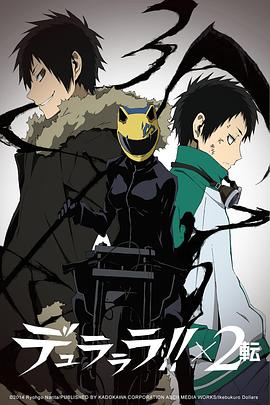

# 樱子小姐的脚下埋着尸体 (豆瓣)

**链接地址:** http://www.douban.com/doubanapp/dispatch?uri=/subject/26330440/interest/976760333
**作者:** 
**获取时间:** 2025/8/28 23:17:08
**图片数量:** 55

---

## 原始HTML内容

  
    

    
    

    <link href="//img3.doubanio.com/dae/accounts/resources/ba98e9b/shire/bundle.css" rel="stylesheet" type="text/css">

  

    

  <a href="https://accounts.douban.com/passport/login?source=movie" class="nav-login" rel="nofollow">登录/注册</a>

    

  <a href="https://www.douban.com/doubanapp/app?channel=top-nav" class="lnk-doubanapp">下载豆瓣客户端</a>
  

    <a href="https://www.douban.com/doubanapp/app?channel=qipao" class="tip-link">豆瓣 6.0 全新发布</a>
    <a href="javascript: void 0;" class="tip-close">×</a>
  

  

    
豆瓣

    
扫码直接下载

    

      <a href="https://www.douban.com/doubanapp/redirect?channel=top-nav&amp;direct_dl=1&amp;download=iOS">iPhone</a>
      ·
      <a href="https://www.douban.com/doubanapp/redirect?channel=top-nav&amp;direct_dl=1&amp;download=Android" class="download-android">Android</a>
    

  

    

  <ul>
    <li class="">
      <a href="https://www.douban.com" target="_blank" data-moreurl-dict="{&quot;from&quot;:&quot;top-nav-click-main&quot;,&quot;uid&quot;:&quot;0&quot;}">豆瓣</a>
    </li>
    <li class="">
      <a href="https://book.douban.com" target="_blank" data-moreurl-dict="{&quot;from&quot;:&quot;top-nav-click-book&quot;,&quot;uid&quot;:&quot;0&quot;}">读书</a>
    </li>
    <li class="on">
      <a href="https://movie.douban.com" data-moreurl-dict="{&quot;from&quot;:&quot;top-nav-click-movie&quot;,&quot;uid&quot;:&quot;0&quot;}">电影</a>
    </li>
    <li class="">
      <a href="https://music.douban.com" target="_blank" data-moreurl-dict="{&quot;from&quot;:&quot;top-nav-click-music&quot;,&quot;uid&quot;:&quot;0&quot;}">音乐</a>
    </li>
    <li class="">
      <a href="https://www.douban.com/podcast/" target="_blank" data-moreurl-dict="{&quot;from&quot;:&quot;top-nav-click-podcast&quot;,&quot;uid&quot;:&quot;0&quot;}">播客</a>
    </li>
    <li class="">
      <a href="https://www.douban.com/location" target="_blank" data-moreurl-dict="{&quot;from&quot;:&quot;top-nav-click-location&quot;,&quot;uid&quot;:&quot;0&quot;}">同城</a>
    </li>
    <li class="">
      <a href="https://www.douban.com/group" target="_blank" data-moreurl-dict="{&quot;from&quot;:&quot;top-nav-click-group&quot;,&quot;uid&quot;:&quot;0&quot;}">小组</a>
    </li>
    <li class="">
      <a href="https://read.douban.com/?dcs=top-nav&amp;dcm=douban" target="_blank" data-moreurl-dict="{&quot;from&quot;:&quot;top-nav-click-read&quot;,&quot;uid&quot;:&quot;0&quot;}">阅读</a>
    </li>
    <li class="">
      <a href="https://fm.douban.com/?from_=shire_top_nav" target="_blank" data-moreurl-dict="{&quot;from&quot;:&quot;top-nav-click-fm&quot;,&quot;uid&quot;:&quot;0&quot;}">FM</a>
    </li>
    <li class="">
      <a href="https://time.douban.com/?dt_time_source=douban-web_top_nav" target="_blank" data-moreurl-dict="{&quot;from&quot;:&quot;top-nav-click-time&quot;,&quot;uid&quot;:&quot;0&quot;}">时间</a>
    </li>
    <li class="">
      <a href="https://market.douban.com/?utm_campaign=douban_top_nav&amp;utm_source=douban&amp;utm_medium=pc_web" target="_blank" data-moreurl-dict="{&quot;from&quot;:&quot;top-nav-click-market&quot;,&quot;uid&quot;:&quot;0&quot;}">豆品</a>
    </li>
  </ul>

  

    

    

    <link href="//img3.doubanio.com/dae/accounts/resources/ba98e9b/movie/bundle.css" rel="stylesheet" type="text/css">

  

  

    

      <a href="https://movie.douban.com">豆瓣电影</a>
    

    

      <form action="https://search.douban.com/movie/subject_search" method="get">
        <fieldset>
          <legend>搜索：</legend>
          <label for="inp-query">
          </label>
          
<input id="inp-query" name="search_text" size="22" maxlength="60" placeholder="搜索电影、电视剧、综艺、影人" value="">

          
<input type="submit" value="搜索">

          <input type="hidden" name="cat" value="1002">
        </fieldset>
      </form>
    

  

  

  

    

  <ul>
    <li><a href="https://movie.douban.com/cinema/nowplaying/">影讯&amp;购票</a>
    </li>
    <li><a href="https://movie.douban.com/explore">选电影</a>
    </li>
    <li><a href="https://movie.douban.com/tv/">选剧集</a>
    </li>
    <li><a href="https://movie.douban.com/chart">排行榜</a>
    </li>
    <li><a href="https://movie.douban.com/review/best/">影评</a>
    </li>
    <li><a href="https://movie.douban.com/annual/2024/?fullscreen=1&amp;dt_from=movie_navigation">2024年度榜单</a>
    </li>
    <li><a href="https://c9.douban.com/app/standbyme-2024/?autorotate=false&amp;fullscreen=true&amp;hidenav=true&amp;monitor_screenshot=true&amp;df_from=web_navigation" target="_blank">2024年度报告</a>
    </li>
  </ul>

    
  

    

    
    

        

        
    

        

    <h1>
        樱子小姐的脚下埋着尸体 櫻子さんの足下には死体が埋まっている
            (2015)
    </h1>

        

            

            
            

                
    

        

            

                
                

    

                

        导演: <a href="https://www.douban.com/personage/27587323/" rel="v:directedBy">加藤诚</a> / <a href="https://www.douban.com/personage/34972994/" rel="v:directedBy">别所诚人</a> / <a href="https://www.douban.com/personage/34978085/" rel="v:directedBy">木野目优</a> / <a href="https://www.douban.com/personage/34977938/" rel="v:directedBy">守田艺成</a> / <a href="https://www.douban.com/personage/27587815/" rel="v:directedBy">菊池胜也</a> / <a href="https://www.douban.com/personage/34971866/" rel="v:directedBy">南川达马</a> / <a href="https://www.douban.com/personage/30450427/" rel="v:directedBy">铃木薰</a> / <a href="https://www.douban.com/personage/34974771/" rel="v:directedBy">渡部周</a> 
        编剧: <a href="https://www.douban.com/personage/30256523/">伊神贵世</a> / <a href="https://www.douban.com/personage/27493668/">吉冈孝夫</a> / <a href="https://www.douban.com/personage/27587887/">太田紫织</a> 
        主演: <a href="https://www.douban.com/personage/27418703/" rel="v:starring">伊藤静</a> / <a href="https://www.douban.com/personage/27588215/" rel="v:starring">榎木淳弥</a> / <a href="https://www.douban.com/personage/27588280/" rel="v:starring">今村彩夏</a> / <a href="https://www.douban.com/personage/27247905/" rel="v:starring">石田彰</a> / <a href="https://www.douban.com/personage/27257111/" rel="v:starring">高桥广树</a> / <a href="https://www.douban.com/personage/27221036/" rel="v:starring">柿原彻也</a> 
        类型: 动画 / 悬疑 / 犯罪 
        官方网站: <a href="http://sakurakosan.jp" rel="nofollow" target="_blank">sakurakosan.jp</a> 
        制片国家/地区: 日本 
        语言: 日语 
        首播: 2015-10-07(日本) 
        
        集数: 12 
        单集片长: 24分钟 
        
        IMDb: tt5194246 

            

            
                

<link rel="stylesheet" href="https://img3.doubanio.com/cuphead/movie-static/download-output-image/index.7aaa3.css">

    

        

            

                豆瓣评分
            

          

            
            <a class="download-output-image" href="#">引用</a>
          

        

        

    <strong class="ll rating_num" property="v:average">7.5</strong>
    
    

        

        

                <a href="comments" class="rating_people">
                    12910人评价
                </a>
        

    

    
        

        
        
            5星
        
        

        19.0%
         
        

        

        
        
            4星
        
        

        43.9%
         
        

        

        
        
            3星
        
        

        33.0%
         
        

        

        
        
            2星
        
        

        3.6%
         
        

        

        
        
            1星
        
        

        0.5%
         
        

    

        

            好于 <a href="/typerank?type_name=犯罪&amp;type=3&amp;interval_id=70:60&amp;action=">68% 犯罪片</a> 
            好于 <a href="/typerank?type_name=动画&amp;type=25&amp;interval_id=70:60&amp;action=">68% 动画片</a> 
        

            
        

        
            

        
            <a href="https://www.douban.com/reason=collectwish&amp;ck=" rel="nofollow" class="j a_show_login colbutt ll" name="pbtn-26330440-wish">
                想看
            </a>
            <a href="https://www.douban.com/reason=collectdo&amp;ck=" rel="nofollow" class="j a_show_login colbutt ll" name="pbtn-26330440-do">
                在看
            </a>
            <a href="https://www.douban.com/reason=collectcollect&amp;ck=" rel="nofollow" class="j a_show_login colbutt ll" name="pbtn-26330440-collect">
                看过
            </a>
        

            
    
    评价:
     

            
            
            
            
            
    
    <input id="n_rating" type="hidden" value="">
    

        

        

    <ul class="ul_subject_menu bicelink color_gray pt6 clearfix">
        
    
        
                
                  <li> 
    &nbsp;
        <a onclick="moreurl(this, {from:'mv_sbj_wr_cmnt_login'})" class="j a_show_login" href="https://www.douban.com/register?reason=review" rel="nofollow">写短评</a>
 </li>
                  <li> 
    
    &nbsp;
        <a onclick="moreurl(this, {from:'mv_sbj_wr_rv_login'})" class="j a_show_login" href="https://www.douban.com/register?reason=review" rel="nofollow">写影评</a>
 </li>
                    <li> 
   

   
    
    
    <a href="#" data-type="电视剧" data-url="https://movie.douban.com/subject/26330440/" data-desc="电视剧《樱子小姐的脚下埋着尸体 櫻子さんの足下には死体が埋まっている》 (来自豆瓣) " data-title="电视剧《樱子小姐的脚下埋着尸体 櫻子さんの足下には死体が埋まっている》 (来自豆瓣) " data-pic="https://img9.doubanio.com/view/photo/s_ratio_poster/public/p2272738726.jpeg" class="bn-sharing ">
        分享到
    </a> &nbsp;&nbsp;
    
    <link rel="stylesheet" href="https://img1.doubanio.com/f/vendors/e8a7261937da62636d22ca4c579efc4a4d759b1b/css/ui/dialog.css">
    
    
    

  </li>
            

    </ul>

    

        
            

<link rel="stylesheet" href="https://img3.doubanio.com/cuphead/movie-static/mod/share.ee737.css" type="text/css">

    

        
        <a href="/accounts/register?reason=recommend" class="j a_show_login lnk-sharing" share-id="26330440" data-mode="plain" data-name="樱子小姐的脚下埋着尸体 櫻子さんの足下には死体が埋まっている‎ (2015)" data-type="movie" data-desc="导演 加藤诚 主演 伊藤静 / 榎木淳弥 / 日本 / 7.5分(12910评价)" data-href="https://movie.douban.com/subject/26330440/" data-image="https://img9.doubanio.com/view/photo/s_ratio_poster/public/p2272738726.jpg" data-properties="{}" data-redir="" data-text="" data-apikey="" data-curl="" data-count="10" data-object_kind="1002" data-object_id="26330440" data-target_type="rec" data-target_action="1" data-action_props="{&quot;subject_url&quot;:&quot;https:\/\/movie.douban.com\/subject\/26330440\/&quot;,&quot;subject_title&quot;:&quot;樱子小姐的脚下埋着尸体 櫻子さんの足下には死体が埋まっている‎ (2015)&quot;}">推荐</a>

        
    

        

    

    
        

    <h2>
        <i>樱子小姐的脚下埋着尸体的分集短评</i>
              · · · · · ·
    </h2>

    

    
    

            

            <a class=" item" href="/subject/26330440/episode/1/">1集</a>
            

            <a class=" item" href="/subject/26330440/episode/2/">2集</a>
            

            <a class=" item" href="/subject/26330440/episode/3/">3集</a>
            

            <a class=" item" href="/subject/26330440/episode/4/">4集</a>
            

            <a class=" item" href="/subject/26330440/episode/5/">5集</a>
            

            <a class=" item" href="/subject/26330440/episode/6/">6集</a>
            

            <a class=" item" href="/subject/26330440/episode/7/">7集</a>
            

            <a class=" item" href="/subject/26330440/episode/8/">8集</a>
            

            <a class=" item" href="/subject/26330440/episode/9/">9集</a>
            

            <a class=" item" href="/subject/26330440/episode/10/">10集</a>
            

            <a class=" item" href="/subject/26330440/episode/11/">11集</a>
            

            <a class=" item" href="/subject/26330440/episode/12/">12集</a>

    

    

    
    
        
            
            
    <h2>
        <i>樱子小姐的脚下埋着尸体的剧情简介</i>
              · · · · · ·
    </h2>

            

                    
                        
                                　　在寒冷的北海道旭川市某处，生活着以美人自居的大小姐九条樱子（伊藤静 配音）。除了有些自恋外，樱子还有用死尸骨头制作标本的怪癖，其对于验尸更有着较深的学识。也许正是对尸体、骨骼那有着近乎偏执的异乎寻常的喜爱，让樱子接二连三卷入各种匪夷所思的死亡事件中。在此过程中，普通高中生馆胁正太郎（榎木淳弥 配音）也被樱子牵着鼻子跑来跑去，见证着每一个案件被侦破的瞬间。对于死者来说，恰恰因为有了樱子这样的怪人，才让他们的冤屈得以昭雪……
                                     
                                　　本片根据太田紫织的同名轻小说改编。
                        
                        <a href="https://movie.douban.com/help/movie#t0-qs">©豆瓣</a>
            

    

    

<link rel="stylesheet" href="https://img3.doubanio.com/cuphead/movie-static/celebrity/celebrities_section.610da.css">

  
    <h2>
        <i>樱子小姐的脚下埋着尸体的演职员</i>
              · · · · · ·
            
            (
                <a href="/subject/26330440/celebrities">全部 28</a>
            )
            
    </h2>

  <ul class="celebrities-list from-subject __oneline">
        
    
  
  <li class="celebrity">
    

  <a href="https://www.douban.com/personage/27587323/" title="加藤诚 Katou Makoto" class="">
      

    

  </a>

    

      <a href="https://www.douban.com/personage/27587323/" title="加藤诚 Katou Makoto" class="name">加藤诚</a>

      导演

    

  </li>

        
    
  
  <li class="celebrity">
    

  <a href="https://www.douban.com/personage/34972994/" title="别所诚人 Makoto Bessho" class="">
      

    

  </a>

    

      <a href="https://www.douban.com/personage/34972994/" title="别所诚人 Makoto Bessho" class="name">别所诚人</a>

      导演

    

  </li>

        
    
  
  <li class="celebrity">
    

  <a href="https://www.douban.com/personage/27418703/" title="伊藤静 Shizuka Ito" class="">
      

    

  </a>

    

      <a href="https://www.douban.com/personage/27418703/" title="伊藤静 Shizuka Ito" class="name">伊藤静</a>

      配音

    

  </li>

        
    
  
  <li class="celebrity">
    

  <a href="https://www.douban.com/personage/27588215/" title="榎木淳弥 Junya Enoki" class="">
      

    

  </a>

    

      <a href="https://www.douban.com/personage/27588215/" title="榎木淳弥 Junya Enoki" class="name">榎木淳弥</a>

      配音

    

  </li>

        
    
  
  <li class="celebrity">
    

  <a href="https://www.douban.com/personage/27588280/" title="今村彩夏 Ayaka Imamura" class="">
      

    

  </a>

    

      <a href="https://www.douban.com/personage/27588280/" title="今村彩夏 Ayaka Imamura" class="name">今村彩夏</a>

      配音

    

  </li>

        
    
  
  <li class="celebrity">
    

  <a href="https://www.douban.com/personage/27247905/" title="石田彰 Akira Ishida" class="">
      

    

  </a>

    

      <a href="https://www.douban.com/personage/27247905/" title="石田彰 Akira Ishida" class="name">石田彰</a>

      配音

    

  </li>

  </ul>

    

<link rel="stylesheet" href="https://img1.doubanio.com/f/verify/a5bc0bc0aea4221d751bc4809fd4b0a1075ad25e/entry_creator/dist/author_subject/style.css">

    

    
        

<link rel="stylesheet" href="https://img1.doubanio.com/cuphead/movie-static/subject/photos_section.45abd.css">

    
    

        
    
    
    <h2>
        <i>樱子小姐的脚下埋着尸体的图片</i>
              · · · · · ·
            
            (
                <a href="https://movie.douban.com/subject/26330440/all_photos">图片194</a>&nbsp;·&nbsp;<a href="https://movie.douban.com/subject/26330440/mupload">添加</a>
            )
            
    </h2>

        <ul class="related-pic-bd  ">
                <li>
                    
                </li>
                <li>
                    
                </li>
                <li>
                    
                </li>
                <li>
                    
                </li>
                <li>
                    
                </li>
        </ul>
    

    
          

<link rel="stylesheet" href="https://img3.doubanio.com/cuphead/movie-static/episode/index.17b17.css">

  
  <a class="comment_btn j a_show_login" href="https://www.douban.com/register?reason=discussion" rel="nofollow">
      发起新的讨论
  </a>

    <h2>
        <i>讨论区</i>
              · · · · · ·
            
            (
                <a href="https://movie.douban.com/subject/26330440/discussion/">全部</a>
            )
            
    </h2>

<a href="https://movie.douban.com/subject/26330440/discussion/" class="on">最新</a>
<a href="https://movie.douban.com/subject/26330440/discussion/?sort=vote" data-epid="hot">热门</a>
  <a href="https://movie.douban.com/subject/26330440/discussion/?ep_num=1" data-epid="953343" data-num="1">1集</a>
  <a href="https://movie.douban.com/subject/26330440/discussion/?ep_num=2" data-epid="953344" data-num="2">2集</a>
  <a href="https://movie.douban.com/subject/26330440/discussion/?ep_num=3" data-epid="953345" data-num="3">3集</a>
  <a href="https://movie.douban.com/subject/26330440/discussion/?ep_num=4" data-epid="953346" data-num="4">4集</a>
  <a href="https://movie.douban.com/subject/26330440/discussion/?ep_num=5" data-epid="953347" data-num="5">5集</a>
  <a href="https://movie.douban.com/subject/26330440/discussion/?ep_num=6" data-epid="953348" data-num="6">6集</a>
  <a href="https://movie.douban.com/subject/26330440/discussion/?ep_num=7" data-epid="953349" data-num="7">7集</a>
  <a href="https://movie.douban.com/subject/26330440/discussion/" data-epid="more" title="更多">…</a>
  <a href="https://movie.douban.com/subject/26330440/discussion/?ep_num=8" data-epid="953350" data-num="8" class="more-item">8集</a>
  <a href="https://movie.douban.com/subject/26330440/discussion/?ep_num=9" data-epid="953351" data-num="9" class="more-item">9集</a>
  <a href="https://movie.douban.com/subject/26330440/discussion/?ep_num=10" data-epid="953352" data-num="10" class="more-item">10集</a>
  <a href="https://movie.douban.com/subject/26330440/discussion/?ep_num=11" data-epid="953353" data-num="11" class="more-item">11集</a>
  <a href="https://movie.douban.com/subject/26330440/discussion/?ep_num=12" data-epid="953354" data-num="12" class="more-item">12集</a>

  

<table>
  <thead>
  <tr>
    <td>讨论</td>
    <td>作者</td>
    <td nowrap="nowrap">回应</td>
    <td align="right">最后回应</td>
  </tr>
  </thead>
  <tbody>
  
  <tr>
    <td class="title">
      <a href="https://movie.douban.com/subject/26330440/discussion/616690038/" title="【考古完成】期待第二季欢迎来到深渊，樱子和正太郎很像侑子和夏目">【考古完成】期待第二季欢迎来到深渊，樱子和正太...</a>
    </td>
    <td><a href="https://www.douban.com/people/3923014/">蓝若惜</a></td>
    <td class="reply-num">4</td>
    <td class="time">2021-10-25 23:19</td>
  </tr>
  
  <tr>
    <td class="title">
      <a href="https://movie.douban.com/subject/26330440/discussion/612766073/" title="[第6集] 不错,很有深意">[第6集] 不错,很有深意</a>
    </td>
    <td><a href="https://www.douban.com/people/snowhz/">猜对了</a></td>
    <td class="reply-num">2</td>
    <td class="time">2021-02-18 11:21</td>
  </tr>
  
  <tr>
    <td class="title">
      <a href="https://movie.douban.com/subject/26330440/discussion/612586305/" title="[第1集] 剧情莫名有点蠢啊，虽然画风和制作看起来挺好的 ...">[第1集] 剧情莫名有点蠢啊，虽然画风和制作看起来...</a>
    </td>
    <td><a href="https://www.douban.com/people/lccc/">豆友2605372</a></td>
    <td class="reply-num">4</td>
    <td class="time">2020-06-21 22:37</td>
  </tr>
  
  <tr>
    <td class="title">
      <a href="https://movie.douban.com/subject/26330440/discussion/616689982/" title="[第10集] 这个蝴蝶应该是金田一里提到的黑死蝶也就是枯叶蝶">[第10集] 这个蝴蝶应该是金田一里提到的黑死蝶也就...</a>
        [图]
    </td>
    <td><a href="https://www.douban.com/people/3923014/">蓝若惜</a></td>
    <td class="reply-num"></td>
    <td class="time">2020-06-21 21:30</td>
  </tr>
  
  <tr>
    <td class="title">
      <a href="https://movie.douban.com/subject/26330440/discussion/616689889/" title="[第2集] 第二集家里满地的垃圾想到地狱少女3里女主御景柚姬">[第2集] 第二集家里满地的垃圾想到地狱少女3里女主...</a>
        [图]
    </td>
    <td><a href="https://www.douban.com/people/3923014/">蓝若惜</a></td>
    <td class="reply-num"></td>
    <td class="time">2020-06-21 19:20</td>
  </tr>
  </tbody>
</table>

<a href="https://movie.douban.com/subject/26330440/discussion/">&gt; 全部讨论5条</a>

  

<table>
  <thead>
  <tr>
    <td>讨论</td>
    <td>作者</td>
    <td nowrap="nowrap">回应</td>
    <td align="right">最后回应</td>
  </tr>
  </thead>
  <tbody>
  
  <tr>
    <td class="title">
      <a href="https://movie.douban.com/subject/26330440/discussion/616690038/" title="【考古完成】期待第二季欢迎来到深渊，樱子和正太郎很像侑子和夏目">【考古完成】期待第二季欢迎来到深渊，樱子和正太...</a>
    </td>
    <td><a href="https://www.douban.com/people/3923014/">蓝若惜</a></td>
    <td class="reply-num">4</td>
    <td class="time">2021-10-25 23:19</td>
  </tr>
  
  <tr>
    <td class="title">
      <a href="https://movie.douban.com/subject/26330440/discussion/612586305/" title="[第1集] 剧情莫名有点蠢啊，虽然画风和制作看起来挺好的 ...">[第1集] 剧情莫名有点蠢啊，虽然画风和制作看起来...</a>
    </td>
    <td><a href="https://www.douban.com/people/lccc/">豆友2605372</a></td>
    <td class="reply-num">4</td>
    <td class="time">2020-06-21 22:37</td>
  </tr>
  
  <tr>
    <td class="title">
      <a href="https://movie.douban.com/subject/26330440/discussion/612766073/" title="[第6集] 不错,很有深意">[第6集] 不错,很有深意</a>
    </td>
    <td><a href="https://www.douban.com/people/snowhz/">猜对了</a></td>
    <td class="reply-num">2</td>
    <td class="time">2021-02-18 11:21</td>
  </tr>
  
  <tr>
    <td class="title">
      <a href="https://movie.douban.com/subject/26330440/discussion/616689982/" title="[第10集] 这个蝴蝶应该是金田一里提到的黑死蝶也就是枯叶蝶">[第10集] 这个蝴蝶应该是金田一里提到的黑死蝶也就...</a>
        [图]
    </td>
    <td><a href="https://www.douban.com/people/3923014/">蓝若惜</a></td>
    <td class="reply-num"></td>
    <td class="time">2020-06-21 21:30</td>
  </tr>
  
  <tr>
    <td class="title">
      <a href="https://movie.douban.com/subject/26330440/discussion/616689889/" title="[第2集] 第二集家里满地的垃圾想到地狱少女3里女主御景柚姬">[第2集] 第二集家里满地的垃圾想到地狱少女3里女主...</a>
        [图]
    </td>
    <td><a href="https://www.douban.com/people/3923014/">蓝若惜</a></td>
    <td class="reply-num"></td>
    <td class="time">2020-06-21 19:20</td>
  </tr>
  </tbody>
</table>

<a href="https://movie.douban.com/subject/26330440/discussion/?sort=vote">&gt; 全部讨论5条</a>

    

    
        

<link rel="stylesheet" href="https://img3.doubanio.com/cuphead/movie-static/subject/recommendations.61283.css">

    

        
        
    <h2>
        <i>喜欢这部剧集的人也喜欢</i>
              · · · · · ·
    </h2>

        
    
    

        <dl>
            <dt>
                
            </dt>
            <dd>
                <a href="https://movie.douban.com/subject/26271871/?from=subject-page" data-moreurl-dict="{&quot;subject_id&quot;:&quot;26330440&quot;,&quot;from&quot;:&quot;tv-recommended-subject&quot;,&quot;bid&quot;:&quot;EoazCbpg2xk&quot;}">全部成为F</a>
                7.7
            </dd>
        </dl>
        <dl>
            <dt>
                
            </dt>
            <dd>
                <a href="https://movie.douban.com/subject/4920563/?from=subject-page" data-moreurl-dict="{&quot;subject_id&quot;:&quot;26330440&quot;,&quot;from&quot;:&quot;tv-recommended-subject&quot;,&quot;bid&quot;:&quot;EoazCbpg2xk&quot;}">哥特萝莉侦探事件簿</a>
                8.2
            </dd>
        </dl>
        <dl>
            <dt>
                
            </dt>
            <dd>
                <a href="https://movie.douban.com/subject/24752306/?from=subject-page" data-moreurl-dict="{&quot;subject_id&quot;:&quot;26330440&quot;,&quot;from&quot;:&quot;tv-recommended-subject&quot;,&quot;bid&quot;:&quot;EoazCbpg2xk&quot;}">野良神</a>
                8.7
            </dd>
        </dl>
        <dl>
            <dt>
                
            </dt>
            <dd>
                <a href="https://movie.douban.com/subject/26163258/?from=subject-page" data-moreurl-dict="{&quot;subject_id&quot;:&quot;26330440&quot;,&quot;from&quot;:&quot;tv-recommended-subject&quot;,&quot;bid&quot;:&quot;EoazCbpg2xk&quot;}">K 第二季</a>
                7.6
            </dd>
        </dl>
        <dl>
            <dt>
                
            </dt>
            <dd>
                <a href="https://movie.douban.com/subject/7065178/?from=subject-page" data-moreurl-dict="{&quot;subject_id&quot;:&quot;26330440&quot;,&quot;from&quot;:&quot;tv-recommended-subject&quot;,&quot;bid&quot;:&quot;EoazCbpg2xk&quot;}">散华礼弥</a>
                7.5
            </dd>
        </dl>
        <dl>
            <dt>
                
            </dt>
            <dd>
                <a href="https://movie.douban.com/subject/20438714/?from=subject-page" data-moreurl-dict="{&quot;subject_id&quot;:&quot;26330440&quot;,&quot;from&quot;:&quot;tv-recommended-subject&quot;,&quot;bid&quot;:&quot;EoazCbpg2xk&quot;}">弹丸论破 希望的学园和绝望高...</a>
                7.6
            </dd>
        </dl>
        <dl>
            <dt>
                
            </dt>
            <dd>
                <a href="https://movie.douban.com/subject/26427106/?from=subject-page" data-moreurl-dict="{&quot;subject_id&quot;:&quot;26330440&quot;,&quot;from&quot;:&quot;tv-recommended-subject&quot;,&quot;bid&quot;:&quot;EoazCbpg2xk&quot;}">只有我不在的街道</a>
                8.9
            </dd>
        </dl>
        <dl>
            <dt>
                
            </dt>
            <dd>
                <a href="https://movie.douban.com/subject/5967233/?from=subject-page" data-moreurl-dict="{&quot;subject_id&quot;:&quot;26330440&quot;,&quot;from&quot;:&quot;tv-recommended-subject&quot;,&quot;bid&quot;:&quot;EoazCbpg2xk&quot;}">神的记事本</a>
                7.0
            </dd>
        </dl>
        <dl>
            <dt>
                
            </dt>
            <dd>
                <a href="https://movie.douban.com/subject/26087257/?from=subject-page" data-moreurl-dict="{&quot;subject_id&quot;:&quot;26330440&quot;,&quot;from&quot;:&quot;tv-recommended-subject&quot;,&quot;bid&quot;:&quot;EoazCbpg2xk&quot;}">无头骑士异闻录第二季：转</a>
                8.9
            </dd>
        </dl>
        <dl>
            <dt>
                
            </dt>
            <dd>
                <a href="https://movie.douban.com/subject/26754730/?from=subject-page" data-moreurl-dict="{&quot;subject_id&quot;:&quot;26330440&quot;,&quot;from&quot;:&quot;tv-recommended-subject&quot;,&quot;bid&quot;:&quot;EoazCbpg2xk&quot;}">超自然9人组</a>
                7.9
            </dd>
        </dl>
    

    

    

    
        

    
    <link rel="stylesheet" href="https://img1.doubanio.com/f/vendors/d63a579a99fd372b4398731a279a1382e6eac71e/subject-comments/comments-section.css">

    

        

            
            
        <a class="comment_btn j a_show_login" href="https://www.douban.com/register?reason=review" rel="nofollow">
            我要写短评
        </a>

            
    <h2>
        <i>樱子小姐的脚下埋着尸体的短评</i>
              · · · · · ·
            
            (
                <a href="https://movie.douban.com/subject/26330440/comments?status=P">全部 2899 条</a>
            )
            
    </h2>

        

        

        

                
        

                        <a id="hot-comments-tab" href="comments" data-id="hot" class="on">热门</a>&nbsp;/&nbsp;
                        <a id="new-comments-tab" href="comments?sort=time" data-id="new" class="j a_show_login">最新</a>&nbsp;/&nbsp;
                        <a id="following-comments-tab" href="comments?sort=follows" data-id="following" class="j a_show_login">好友</a>
        

    

        

            
    

        
        

            
    
    

        <h3>
            
                    49

                    <input value="976752817" type="hidden">
                    <a href="javascript:;" data-id="976752817" class="j a_show_login" onclick="">有用</a>

                <!-- 删除短评 -->
            
            
                <a href="https://www.douban.com/people/47031618/">薄荷</a>
                    看过
                    
                
                    2015-11-13 09:38:41
                
                
            
        </h3>
        

            
                好吧 来个中肯的评论。我之所以在追这部并不是因为推理有多华丽丽（要看推理的还请去隔壁几百集的柯南家=w=）说实话 樱子小姐脚下埋得不是尸体而是赤裸裸的现实。现实生活中哪有那么多谋杀 樱子小姐只不过是看到了我们不想看到或者容易忽略的地方
        

        

    

    

        

        
        

            
    
    

        <h3>
            
                    17

                    <input value="1004914957" type="hidden">
                    <a href="javascript:;" data-id="1004914957" class="j a_show_login" onclick="">有用</a>

                <!-- 删除短评 -->
            
            
                <a href="https://www.douban.com/people/henry1984zoro/">半澤直叔</a>
                    看过
                    
                
                    2016-01-28 10:48:09
                
                
            
        </h3>
        

            
                屎一样的十月番里简直算是好看到炸裂的存在，虽然其实也就那么回事。画风蛮好的，主要人物都蛮可爱的，柿子这酱油打的……
        

        

    

    

        

        
        

            
    
    

        <h3>
            
                    16

                    <input value="1121720245" type="hidden">
                    <a href="javascript:;" data-id="1121720245" class="j a_show_login" onclick="">有用</a>

                <!-- 删除短评 -->
            
            
                <a href="https://www.douban.com/people/36166996/">DoubleHelix</a>
                    看过
                    
                
                    2017-07-27 14:51:21
                
                
            
        </h3>
        

            
                在现在的动画业界下当属良心佳作
        

        

    

    

        

        
        

            
    
    

        <h3>
            
                    9

                    <input value="971851172" type="hidden">
                    <a href="javascript:;" data-id="971851172" class="j a_show_login" onclick="">有用</a>

                <!-- 删除短评 -->
            
            
                <a href="https://www.douban.com/people/54131075/">樱夏枫雪</a>
                    看过
                    
                
                    2016-04-18 22:39:52
                
                
            
        </h3>
        

            
                简直就是我的菜~无法抵抗~狂追~
        

        

    

    

        

        
        

            
    
    

        <h3>
            
                    22

                    <input value="990780289" type="hidden">
                    <a href="javascript:;" data-id="990780289" class="j a_show_login" onclick="">有用</a>

                <!-- 删除短评 -->
            
            
                <a href="https://www.douban.com/people/fuyuwinter/">[已注销]</a>
                    看过
                    
                
                    2015-12-24 16:33:36
                
                
            
        </h3>
        

            
                其实不就是每集等着看无限骨制吗 要是你没被柯南洗礼过的话这部可以当法医学最初级入门 然而本该是严肃的题材吧 感情戏又写得有些矫情 叙事风格上就产生出一种精分的效果:一会是冷冰冰的事实一会是云里雾里的对白 而类似题材的黄昏乙女在说人话这方面处理得就好很多
        

        

    

    

        

                
                    &gt; <a href="comments?sort=new_score&amp;status=P" data-moreurl-dict="{&quot;subject_id&quot;:&quot;26330440&quot;,&quot;from&quot;:&quot;tv-more-comments&quot;,&quot;bid&quot;:&quot;EoazCbpg2xk&quot;}">
                        更多短评
                            2899条
                    </a>
        

        

            

            

            

                <a class="qa" href="/help/opinion#t2-q0" target="_blank">为什么被折叠？</a>
                <a class="btn-unfold" href="#">有一些短评被折叠了</a>
                

                    评论被折叠，是因为发布这条评论的账号行为异常。评论仍可以被展开阅读，对发布人的账号不造成其他影响。如果认为有问题，可以<a href="https://help.douban.com/help/ask?category=movie">联系</a>豆瓣电影。
                

            

            

            

            
        

        

            
    

        

            你关注的人还没写过短评
        

        

    

    

            
            
        

    

<!--        此处是挂载其他页面，不是注释！不是注释！不是注释！-->
        

<link rel="stylesheet" href="https://img1.doubanio.com/misc/mixed_static/292deb5ae8f760a3.css">

    <section id="reviews-wrapper" class="reviews mod movie-content">
        <header>
            
                <a href="new_review" rel="nofollow" class="create-review comment_btn " data-isverify="False" data-verify-url="https://www.douban.com/accounts/phone/verify?redir=https://movie.douban.com/subject/26330440/new_review">
                    我要写剧评
                </a>
            <h2>
                    樱子小姐的脚下埋着尸体的剧评 · · · · · ·

                    ( <a href="reviews">全部 17 条</a> )
            </h2>
        </header>

            
            

                                <a href="javascript:;;" class="cur" data-sort="">热门</a>
            

            

            

        
    

            
    
    

        

            
    
    <header class="main-hd">
        

        <a href="https://www.douban.com/people/anitama0815/" class="name">AniTama</a>
            

        2015-11-16 18:08:57

    </header>

            

                <h2><a href="https://movie.douban.com/review/7660725/">从樱子小姐和全部成为F来看写实系动画</a></h2>

                

                    

                        作者：mjn  十月新番的《樱子小姐》和《全部成为F》算是近期写实系动画里非常典型的代表了。写实系动画的话题在之前的第二期讲解中提到过，但没有展开讲。这次就围绕这两部作品进行一下更深入的讨论，当中也会涉及到其他作品。  首先从特征上分析一下什么是写实流的演出。直白...

                        &nbsp;(<a href="javascript:;" id="toggle-7660725-copy" class="unfold" title="展开">展开</a>)
                    

                

                

                    

                

                

                    <a href="javascript:;" class="action-btn up" data-rid="7660725" title="有用">
                        
                        
                                45
                        
                    </a>
                    <a href="javascript:;" class="action-btn down" data-rid="7660725" title="没用">
                        
                        
                                7
                        
                    </a>
                    <a href="https://movie.douban.com/review/7660725/#comments" class="reply ">7回应</a>

                    <a href="javascript:;;" class="fold hidden">收起</a>
                

            

        

    

            
    
    

        

            
    
    <header class="main-hd">
        

        <a href="https://www.douban.com/people/78766374/" class="name">小朱</a>
            

        2015-12-01 20:09:50

    </header>

            

                <h2><a href="https://movie.douban.com/review/7677857/">伪推理动漫重点不是推理</a></h2>

                

                    

                        这部动漫被我3集弃了。 …… 后来因为看到anitama的视频又重新拾起来了。目前看到第八话，不由心生感慨：“伪推理动漫重点不是推理。” 骨头社的《哥特萝莉侦探事件簿》，被很多人诟病推理烂，其实这部动漫是爱情片，推理不是重点。 京都的《冰菓》，被人说推理烂，其实这是一...

                        &nbsp;(<a href="javascript:;" id="toggle-7677857-copy" class="unfold" title="展开">展开</a>)
                    

                

                

                    

                

                

                    <a href="javascript:;" class="action-btn up" data-rid="7677857" title="有用">
                        
                        
                                22
                        
                    </a>
                    <a href="javascript:;" class="action-btn down" data-rid="7677857" title="没用">
                        
                        
                                5
                        
                    </a>
                    <a href="https://movie.douban.com/review/7677857/#comments" class="reply ">9回应</a>

                    <a href="javascript:;;" class="fold hidden">收起</a>
                

            

        

    

            
    
    

        

            
    
    <header class="main-hd">
        

        <a href="https://www.douban.com/people/123754808/" class="name">星陨</a>
            

        2016-12-31 20:31:38

    </header>

            

                <h2><a href="https://movie.douban.com/review/8265578/">这算推理吗……</a></h2>

                

                    

                        没有什么致命缺点，却也没有什么亮点的一作。故事与其说是推理，不如说是单纯的解谜，女主一边科普一边解决事件，并没有什么观众参与的余地。单元剧的形式从始至终，然而并没有什么太精彩的故事，主线故事和幕后BOSS刚刚露头，动画就结束了，感觉就像看了个小说的续章。人物塑...

                        &nbsp;(<a href="javascript:;" id="toggle-8265578-copy" class="unfold" title="展开">展开</a>)
                    

                

                

                    

                

                

                    <a href="javascript:;" class="action-btn up" data-rid="8265578" title="有用">
                        
                        
                                4
                        
                    </a>
                    <a href="javascript:;" class="action-btn down" data-rid="8265578" title="没用">
                        
                        
                                2
                        
                    </a>
                    <a href="https://movie.douban.com/review/8265578/#comments" class="reply ">0回应</a>

                    <a href="javascript:;;" class="fold hidden">收起</a>
                

            

        

    

            
    
    

        

            
    
    <header class="main-hd">
        

        <a href="https://www.douban.com/people/141874758/" class="name">大人的童话</a>
            

        2016-04-06 17:09:40

    </header>

            

                <h2><a href="https://movie.douban.com/review/7842552/">骨头不会说谎</a></h2>

                

                    

                          作者：大人的童话  “樱花本雪白，因为吸取了血，才染成淡红，樱花树下埋藏的尸体越多，花就开得越灿烂。”日本民间流传着这样的传说。   樱子小姐的脚下埋藏着尸体，该作的名字大概来源于此。  馆胁正太郎，本来是一个随处可见的普通中学生，但对于死亡，比起避而远之的同龄...

                        &nbsp;(<a href="javascript:;" id="toggle-7842552-copy" class="unfold" title="展开">展开</a>)
                    

                

                

                    

                

                

                    <a href="javascript:;" class="action-btn up" data-rid="7842552" title="有用">
                        
                        
                                6
                        
                    </a>
                    <a href="javascript:;" class="action-btn down" data-rid="7842552" title="没用">
                        
                        
                        
                    </a>
                    <a href="https://movie.douban.com/review/7842552/#comments" class="reply ">0回应</a>

                    <a href="javascript:;;" class="fold hidden">收起</a>
                

            

        

    

            
    
    

        

            
    
    <header class="main-hd">
        

        <a href="https://www.douban.com/people/141901372/" class="name">Rec.</a>
            

        2019-08-14 00:42:37

    </header>

            

                <h2><a href="https://movie.douban.com/review/10406507/">献给被囚于往者的人</a></h2>

                

                    

                        片头这句刚看的时候有点不理解。 然而追完平平淡淡的12集就会发现，这部番事实上无关破案，推理亦不是主要，而是为了治愈那些沉浸于死亡的悲伤的人们。 尊重死亡，才能更好的热爱生命。人固有一死，但能带去那边的不是金钱或其他身外之物，而是珍视某人及被珍视的记忆。 死，不...

                        &nbsp;(<a href="javascript:;" id="toggle-10406507-copy" class="unfold" title="展开">展开</a>)
                    

                

                

                    

                

                

                    <a href="javascript:;" class="action-btn up" data-rid="10406507" title="有用">
                        
                        
                                1
                        
                    </a>
                    <a href="javascript:;" class="action-btn down" data-rid="10406507" title="没用">
                        
                        
                        
                    </a>
                    <a href="https://movie.douban.com/review/10406507/#comments" class="reply ">0回应</a>

                    <a href="javascript:;;" class="fold hidden">收起</a>
                

            

        

    

            
    
    

        

            
    
    <header class="main-hd">
        

        <a href="https://www.douban.com/people/166198751/" class="name">lion</a>
            

        2017-09-01 02:06:34

    </header>

            

                <h2><a href="https://movie.douban.com/review/8787386/">如野花般，鲜而不惊</a></h2>

                

                    

                        从人设上面来说比较新颖，一个喜欢研究骨头，爱好法医的女主，但是新颖有时是要背负代价的，当她拿着一个沾满苍蝇的骨头容易让很多观众感觉到厌恶。  作为悬疑故事来说，不是很吸引人，冲突代入感不强，没有激起我很想往下看的心理，也没有让人感觉非常惊艳的情节。虽然说推理...

                        &nbsp;(<a href="javascript:;" id="toggle-8787386-copy" class="unfold" title="展开">展开</a>)
                    

                

                

                    

                

                

                    <a href="javascript:;" class="action-btn up" data-rid="8787386" title="有用">
                        
                        
                                4
                        
                    </a>
                    <a href="javascript:;" class="action-btn down" data-rid="8787386" title="没用">
                        
                        
                                1
                        
                    </a>
                    <a href="https://movie.douban.com/review/8787386/#comments" class="reply ">0回应</a>

                    <a href="javascript:;;" class="fold hidden">收起</a>
                

            

        

    

            
    
    

        

            
    
    <header class="main-hd">
        

        <a href="https://www.douban.com/people/139223602/" class="name">杨杨杨12</a>
            

        2016-02-21 22:04:35

    </header>

            

                <h2><a href="https://movie.douban.com/review/7784060/">不一样的推理动漫</a></h2>

                

                    

                        ”只要偶然发生两次三次，人类就会祭出‘命运’这种无聊透顶的话。其实只要可能性不为零， 不论发生什么都是‘ 必然’ ” ——九条樱子  “腐尸”，“恋骨癖”，“连环悬案”。。。这些让人不寒而栗，毛骨悚然的关键词，再加上令人浮想联翩的标题，无疑让“樱子小姐的脚下埋着...

                        &nbsp;(<a href="javascript:;" id="toggle-7784060-copy" class="unfold" title="展开">展开</a>)
                    

                

                

                    

                

                

                    <a href="javascript:;" class="action-btn up" data-rid="7784060" title="有用">
                        
                        
                                2
                        
                    </a>
                    <a href="javascript:;" class="action-btn down" data-rid="7784060" title="没用">
                        
                        
                        
                    </a>
                    <a href="https://movie.douban.com/review/7784060/#comments" class="reply ">1回应</a>

                    <a href="javascript:;;" class="fold hidden">收起</a>
                

            

        

    

            
    
    

        

            
    
    <header class="main-hd">
        

        <a href="https://www.douban.com/people/Jirve/" class="name">Jirve</a>
            

        2024-04-29 13:11:34

    </header>

            

                <h2><a href="https://movie.douban.com/review/15909534/">冷门番推荐 无聊可以补补</a></h2>

                

                    

                        因为是推理类型的动漫所以我当初没想太多就选择追番。 直到各类事件的发生，我才发觉，这番在本质上和 古书堂事件手帖 是一个类型的作品。 推理是包装，作品只是想借这一形式写写有关尸体和骨头的事情。 献给 已死之人 的作品，不过BOSS的出现也多少为这部作品增添悬疑推理的味...

                        &nbsp;(<a href="javascript:;" id="toggle-15909534-copy" class="unfold" title="展开">展开</a>)
                    

                

                

                    

                

                

                    <a href="javascript:;" class="action-btn up" data-rid="15909534" title="有用">
                        
                        
                        
                    </a>
                    <a href="javascript:;" class="action-btn down" data-rid="15909534" title="没用">
                        
                        
                        
                    </a>
                    <a href="https://movie.douban.com/review/15909534/#comments" class="reply ">0回应</a>

                    <a href="javascript:;;" class="fold hidden">收起</a>
                

            

        

    

            
    
    

        

            
    
    <header class="main-hd">
        

        <a href="https://www.douban.com/people/139223602/" class="name">杨杨杨12</a>
            

        2016-02-21 22:00:33

    </header>

            

                <h2><a href="https://movie.douban.com/review/7784056/">不一样的推理动漫</a></h2>

                

                    

                         ”只要偶然发生两次三次，人类就会祭出‘命运’这种无聊透顶的话。其实只要可能性不为零， 不论发生什么都是‘ 必然’ ” ——九条樱子   图片  “腐尸”，“恋骨癖”，“连环悬案”。。。这些让人不寒而栗，毛骨悚然的关键词，再加上令人浮想联翩的标题，无疑让“樱子小姐的...

                        &nbsp;(<a href="javascript:;" id="toggle-7784056-copy" class="unfold" title="展开">展开</a>)
                    

                

                

                    

                

                

                    <a href="javascript:;" class="action-btn up" data-rid="7784056" title="有用">
                        
                        
                        
                    </a>
                    <a href="javascript:;" class="action-btn down" data-rid="7784056" title="没用">
                        
                        
                        
                    </a>
                    <a href="https://movie.douban.com/review/7784056/#comments" class="reply ">0回应</a>

                    <a href="javascript:;;" class="fold hidden">收起</a>
                

            

        

    

    

    <!-- COLLECTED JS -->
    <!-- COLLECTED CSS -->

    

    <link rel="stylesheet" href="https://img1.doubanio.com/f/zerkalo/88118a282439e312283e886ea4c3d3e9849a8fa4/css/review/editor/ng/setting_standalone.css">
    
    
    
    
    
    
    

                

                    &gt;
                        <a href="reviews">
                            更多剧评
                                17篇
                        </a>
                

    </section>
<!-- COLLECTED JS -->

     

    
            

                    

    <a href="https://movie.douban.com/subject/26330440/tv_discuss">&gt; 查看 樱子小姐的脚下埋着尸体 的分集短评（全部27条）</a>

            

    

            

            

                

    

        

    
    

    
    <h2>
        在哪儿看这部剧集
            &nbsp;·&nbsp;·&nbsp;·&nbsp;·&nbsp;·&nbsp;·
    </h2>

    
    <ul class="bs">
                
                <li>
                        <a class="playBtn" data-pic="https://img9.doubanio.com/cuphead/movie-static/pics/video-bilibili.png" data-cn="哔哩哔哩" data-source="8" data-impression-track="https://frodo.douban.com/rohirrim/video_tracking/impression?subject_id=26330440&amp;video_type=tv&amp;video_id=963905&amp;source=bilibili&amp;user_id=&amp;bid=EoazCbpg2xk&amp;platform=pc&amp;location=vendor_subject" data-click-track="https://frodo.douban.com/rohirrim/video_tracking/click?subject_id=26330440&amp;video_type=tv&amp;video_id=963905&amp;source=bilibili&amp;user_id=&amp;bid=EoazCbpg2xk&amp;platform=pc&amp;location=vendor_subject" href="javascript: void 0;">
                            哔哩哔哩
                        </a>
                    
                    
                        免费观看
                    
                </li>

    </ul>

    <!-- douban ad begin -->
    

    <!-- douban ad end -->

    

    

    

    

    
        

    
    
    <h2>
        <i>以下片单推荐</i>
              · · · · · ·
            
            (
                <a href="https://movie.douban.com/subject/26330440/doulists">全部</a>
            )
            
    </h2>

    
    <ul>
            
                <li>
                    <a href="https://www.douban.com/doulist/11469996/" target="_blank">不可磨灭的少女心</a>
                    (KayCorleone)
                </li>
            
                <li>
                    <a href="https://www.douban.com/doulist/3530995/" target="_blank">名字起这么吊，你家里人知道吗</a>
                    (UFO)
                </li>
            
                <li>
                    <a href="https://www.douban.com/doulist/487209/" target="_blank">那些总是让人回味的动画~不得不看的动画作品~</a>
                    (沫沫沫沫秦)
                </li>
            
                <li>
                    <a href="https://www.douban.com/doulist/39663773/" target="_blank">动漫集结（专注收集精品作+话题作+部分个人爱好作=^_^=）</a>
                    (yimuxueji)
                </li>
            
                <li>
                    <a href="https://www.douban.com/doulist/1500311/" target="_blank">石田彰TV角色</a>
                    (佛米)
                </li>
    </ul>

    
        

    
    
    <h2>
        <i>谁在看这部剧集</i>
              · · · · · ·
    </h2>

    
    <ul>
            
            <li>
                
                

                    <a href="https://www.douban.com/people/290702329/">欠你一场雨</a>
                    

                        今天凌晨
                        想看
                        

                    

                

            </li>
            
            <li>
                
                

                    <a href="https://www.douban.com/people/288266088/">momo</a>
                    

                        昨天
                        看过
                        
    

                    

                

            </li>
            
            <li>
                
                

                    <a href="https://www.douban.com/people/184797392/">Remon</a>
                    

                        昨天
                        想看
                        

                    

                

            </li>
    </ul>

    
    

        
            <a href="https://movie.douban.com/subject/26330440/comments?status=N">531人在看</a>
                &nbsp;/&nbsp;
            <a href="https://movie.douban.com/subject/26330440/comments?status=P">15300人看过</a>
                &nbsp;/&nbsp;
            <a href="https://movie.douban.com/subject/26330440/comments?status=F">5048人想看</a>
    

    

<!-- douban ad begin -->

<!-- douban ad end -->

     

    

订阅樱子小姐的脚下埋着尸体的影评:  
    <a href="https://movie.douban.com/feed/subject/26330440/reviews"> feed: rss 2.0</a>

            

            

                
    
<!-- douban ad begin -->

<!-- douban ad end -->

    <!-- douban ad begin -->
    

    <!-- douban ad end -->

            

        

    

        
    

            

        

    © 2005－2025 douban.com, all rights reserved 北京豆网科技有限公司

    <a href="https://www.douban.com/about">关于豆瓣</a>
    · <a href="https://www.douban.com/jobs">在豆瓣工作</a>
    · <a href="https://www.douban.com/about?topic=contactus">联系我们</a>
    · <a href="https://www.douban.com/about/legal">法律声明</a>
    
    · <a href="https://help.douban.com/?app=movie" target="_blank">帮助中心</a>
    · <a href="https://www.douban.com/doubanapp/">移动应用</a>

    

    

    
        
        
    <link rel="stylesheet" type="text/css" href="https://img1.doubanio.com/f/vendors/e8a7261937da62636d22ca4c579efc4a4d759b1b/css/ui/dialog.css">
    <link rel="stylesheet" type="text/css" href="https://img1.doubanio.com/cuphead/movie-static/mod/login_pop.b2f60.css">
    
    
    

    
    
    
    
    
    
    
    
    
    

    
    
    

    

    
  

      

    <!-- dae-web-movie--default-5f9cb85759-gn2d9-->

  

---

## 纯文本内容

var _body_start = new Date();

    
    

    

  
    

  登录/注册

    
  下载豆瓣客户端
  
    豆瓣 6.0 全新发布
    ×
  
  
    豆瓣
    扫码直接下载
    
      iPhone
      ·
      Android
    
  

    

  
    
      豆瓣
    
    
      读书
    
    
      电影
    
    
      音乐
    
    
      播客
    
    
      同城
    
    
      小组
    
    
      阅读
    
    
      FM
    
    
      时间
    
    
      豆品
    
  

  

  ;window._GLOBAL_NAV = {
    DOUBAN_URL: "https://www.douban.com",
    N_NEW_NOTIS: 0,
    N_NEW_DOUMAIL: 0
  };

    

    

    

  
  
    
      豆瓣电影
    
    
      
        
          搜索：
          
          
          
          
          
        
      
    
  
  
  
    

  
    影讯&购票
    
    选电影
    
    选剧集
    
    排行榜
    
    影评
    
    2024年度榜单
    
    2024年度报告
    
  

    
  

  <li data-link="{{= url}}">
            <a href="{{= url}}" onclick="moreurl(this, {from:'movie_search_sugg', query:'{{= keyword }}', subject_id:'{{= id}}', i: '{{= index}}', type: '{{= type}}'})">
            
            

                <em>{{= title}}</em>
                {{if year}}
                    {{= year}}
                {{/if}}
                {{if sub_title}}
                     {{= sub_title}}
                {{/if}}
                {{if address}}
                     {{= address}}
                {{/if}}
                {{if episode}}
                    {{if episode=="unknow"}}
                         集数未知
                    {{else}}
                         共{{= episode}}集
                    {{/if}}
                {{/if}}
            

        </a>
        </li>
  

    

    
    
        

        
    
        

    
        樱子小姐的脚下埋着尸体 櫻子さんの足下には死体が埋まっている
            (2015)
    

        
            

            
            
                
    
        
            
                
                

    
        
   

                

        导演: 加藤诚 / 别所诚人 / 木野目优 / 守田艺成 / 菊池胜也 / 南川达马 / 铃木薰 / 渡部周
        编剧: 伊神贵世 / 吉冈孝夫 / 太田紫织
        主演: 伊藤静 / 榎木淳弥 / 今村彩夏 / 石田彰 / 高桥广树 / 柿原彻也
        类型: 动画 / 悬疑 / 犯罪
        官方网站: sakurakosan.jp
        制片国家/地区: 日本
        语言: 日语
        首播: 2015-10-07(日本)
        
        集数: 12
        单集片长: 24分钟
        
        IMDb: tt5194246

$(function(){
    var limit = 5
    $('#info .attrs').each(function() {
        var $list = $(this).find('a')
        var $attrs = $(this)

        if($list.length > limit) {
            $attrs.empty()
            $list.each(function(idx) {
                if (idx+1 === $list.length) {
                    $('').prepend($(this)).appendTo($attrs);
                } else {
                    $(' / ').prepend($(this)).appendTo($attrs);
                }
            })

            $attrs.append('<a href="javascript:;" class="more-attrs" title="显示更多">更多...</a>')
            $('.more-attrs').on('click', function() {
                $(this).parent().find('span').show()
                $(this).hide()
            })

            $attrs.find('span').slice(limit).hide()
        }
    })
})

            
            
                

    
        
            
                豆瓣评分
            
          
            
            引用
          
        
        

    7.5
    
    
        
        
                
                    12910人评价
                
        
    

    
        
        
        
            5星
        
        
        19.0%
        
        
        
        
        
            4星
        
        
        43.9%
        
        
        
        
        
            3星
        
        
        33.0%
        
        
        
        
        
            2星
        
        
        3.6%
        
        
        
        
        
            1星
        
        
        0.5%
        
        

    
        
            好于 68% 犯罪片
            好于 68% 动画片
        

            
        
        
            

        
            
                想看
            
            
                在看
            
            
                看过
            
        
            
    
    评价:
     

            
            
        
            
            
        
            
            
        
            
            
        
            
            
        
    
    
    

        

        

    
        
    
        
                
                   
     
        写短评
 
                   
    
     
        写影评
 
                     
   

   
    
    
    
        分享到
       
    
    
    
    
    

  
            

    

    
        $(function(){
            $(".ul_subject_menu li.rec .bn-sharing").bind("click", function(){
                $.get("/blank?sbj_page_click=bn_sharing");
            });
        });
    

        
            

    
        
    <form class="movie-share" action="/j/share" method="POST">
        

            

                <textarea name="text" class="share-text" cols="72" data-mention-api="https://api.douban.com/shuo/in/complete?alt=xd&amp;callback=?"></textarea>
                <input type="hidden" name="target-id" value="26330440">
                <input type="hidden" name="target-type" value="0">
                <input type="hidden" name="title" value="樱子小姐的脚下埋着尸体 櫻子さんの足下には死体が埋まっている‎ (2015)">
                <input type="hidden" name="desc" value="导演 加藤诚 主演 伊藤静 / 榎木淳弥 / 日本 / 7.5分(12910评价)">
                <input type="hidden" name="redir" value=""/>
                

            

            

                    
                <strong>樱子小姐的脚下埋着尸体 櫻子さんの足下には死体が埋まっている‎ (2015)</strong>
                
导演 加藤诚 主演 伊藤静 / 榎木淳弥 / 日本 / 7.5分(12910评价)

                
&nbsp;

            

        

        

            

                

                140
                
                    <input type="submit" value="推荐" />
                
            

        

    </form>
    
    

        <ul>
            {{#users}}
            <li id="{{uid}}">
              {{{username}}}&nbsp;({{{uid}}})
            </li>
            {{/users}}
        </ul>
    

    

        
        推荐

        
            $(function() {
                $('.collect_btn', '#interest_sect_level').each(function() {
                    Douban.init_collect_btn(this);
                });
                $('html').delegate(".indent .rec-sec .lnk-sharing", "click", function() {
                    moreurl(this, {
                        from : 'mv_sbj_db_share'
                    });
                });
            });
        
    
        

    
    
        

    
        樱子小姐的脚下埋着尸体的分集短评
              · · · · · ·
    

    

    
    

            

            1集
            

            2集
            

            3集
            

            4集
            

            5集
            

            6集
            

            7集
            

            8集
            

            9集
            

            10集
            

            11集
            

            12集

    

    

    
    
        
            
            
    
        樱子小姐的脚下埋着尸体的剧情简介
              · · · · · ·
    

            
                    
                        
                                　　在寒冷的北海道旭川市某处，生活着以美人自居的大小姐九条樱子（伊藤静 配音）。除了有些自恋外，樱子还有用死尸骨头制作标本的怪癖，其对于验尸更有着较深的学识。也许正是对尸体、骨骼那有着近乎偏执的异乎寻常的喜爱，让樱子接二连三卷入各种匪夷所思的死亡事件中。在此过程中，普通高中生馆胁正太郎（榎木淳弥 配音）也被樱子牵着鼻子跑来跑去，见证着每一个案件被侦破的瞬间。对于死者来说，恰恰因为有了樱子这样的怪人，才让他们的冤屈得以昭雪……
                                    
                                　　本片根据太田紫织的同名轻小说改编。
                        
                        ©豆瓣
            

    

    

  
    
        樱子小姐的脚下埋着尸体的演职员
              · · · · · ·
            
            (
                全部 28
            )
            
    

  
        
    
  
  
    

  
      
    
  

    
      加藤诚

      导演

    
  

        
    
  
  
    

  
      
    
  

    
      别所诚人

      导演

    
  

        
    
  
  
    

  
      
    
  

    
      伊藤静

      配音

    
  

        
    
  
  
    

  
      
    
  

    
      榎木淳弥

      配音

    
  

        
    
  
  
    

  
      
    
  

    
      今村彩夏

      配音

    
  

        
    
  
  
    

  
      
    
  

    
      石田彰

      配音

    
  

  

    

    

    var answerObj = {
      ISALL: 'False',
      TYPE: 'tv',
      SUBJECT_ID: '26330440',
      USER_ID: 'None'
    }

    
        

    
    
        
    
    
    
        樱子小姐的脚下埋着尸体的图片
              · · · · · ·
            
            (
                图片194 · 添加
            )
            
    

        
                
                    
                
                
                    
                
                
                    
                
                
                    
                
                
                    
                
        
    

    
          

  
  
      发起新的讨论
  

    
        讨论区
              · · · · · ·
            
            (
                全部
            )
            
    

最新
热门
  1集
  2集
  3集
  4集
  5集
  6集
  7集
  …
  8集
  9集
  10集
  11集
  12集

  

  
  
    讨论
    作者
    回应
    最后回应
  
  
  
  
  
    
      【考古完成】期待第二季欢迎来到深渊，樱子和正太...
    
    蓝若惜
    4
    2021-10-25 23:19
  
  
  
    
      [第6集] 不错,很...

---

## 图片列表

-  (原始链接: https://img9.doubanio.com/view/photo/s_ratio_poster/public/p2272738726.jpg)
-  (原始链接: https://img2.doubanio.com/cuphead/movie-static/pics/reference.png)
-  (原始链接: https://img1.doubanio.com/f/vendors/2520c01967207a1735171056ec588c8c1257e5f8/pics/rating_icons/star_hollow_hover.png)
-  (原始链接: https://img1.doubanio.com/f/vendors/2520c01967207a1735171056ec588c8c1257e5f8/pics/rating_icons/star_hollow_hover.png)
-  (原始链接: https://img1.doubanio.com/f/vendors/2520c01967207a1735171056ec588c8c1257e5f8/pics/rating_icons/star_hollow_hover.png)
-  (原始链接: https://img1.doubanio.com/f/vendors/2520c01967207a1735171056ec588c8c1257e5f8/pics/rating_icons/star_hollow_hover.png)
-  (原始链接: https://img1.doubanio.com/f/vendors/2520c01967207a1735171056ec588c8c1257e5f8/pics/rating_icons/star_hollow_hover.png)
-  (原始链接: https://img9.doubanio.com/cuphead/movie-static/pics/short-comment.gif)
-  (原始链接: https://img1.doubanio.com/cuphead/movie-static/pics/add-review.gif)
-  (原始链接: https://img9.doubanio.com/view/photo/sqxs/public/p2297124614.jpg)
-  (原始链接: https://img9.doubanio.com/view/photo/sqxs/public/p2283200595.jpg)
-  (原始链接: https://img1.doubanio.com/view/photo/sqxs/public/p2300986610.jpg)
-  (原始链接: https://img1.doubanio.com/view/photo/sqxs/public/p2281554149.jpg)
-  (原始链接: https://img1.doubanio.com/view/photo/sqxs/public/p2297124168.jpg)
-  (原始链接: https://img3.doubanio.com/view/photo/s_ratio_poster/public/p2266516113.jpg)
-  (原始链接: https://img1.doubanio.com/view/photo/s_ratio_poster/public/p1971352568.jpg)
-  (原始链接: https://img9.doubanio.com/view/photo/s_ratio_poster/public/p2916984505.jpg)
-  (原始链接: https://img9.doubanio.com/view/photo/s_ratio_poster/public/p2272739544.jpg)
-  (原始链接: https://img9.doubanio.com/view/photo/s_ratio_poster/public/p1623205666.jpg)
-  (原始链接: https://img2.doubanio.com/view/photo/s_ratio_poster/public/p1967434491.jpg)
-  (原始链接: https://img2.doubanio.com/view/photo/s_ratio_poster/public/p2326879831.jpg)
-  (原始链接: https://img9.doubanio.com/view/photo/s_ratio_poster/public/p2257391876.jpg)
-  (原始链接: https://img1.doubanio.com/view/photo/s_ratio_poster/public/p2254168528.jpg)
-  (原始链接: https://img1.doubanio.com/view/photo/s_ratio_poster/public/p2387754839.jpg)
-  (原始链接: https://img3.doubanio.com/icon/u134193249-2.jpg)
-  (原始链接: https://img1.doubanio.com/f/zerkalo/536fd337139250b5fb3cf9e79cb65c6193f8b20b/pics/up.png)
-  (原始链接: https://img1.doubanio.com/f/zerkalo/68849027911140623cf338c9845893c4566db851/pics/down.png)
-  (原始链接: https://img3.doubanio.com/icon/u78766374-2.jpg)
-  (原始链接: https://img1.doubanio.com/f/zerkalo/536fd337139250b5fb3cf9e79cb65c6193f8b20b/pics/up.png)
-  (原始链接: https://img1.doubanio.com/f/zerkalo/68849027911140623cf338c9845893c4566db851/pics/down.png)
-  (原始链接: https://img9.doubanio.com/icon/u123754808-4.jpg)
-  (原始链接: https://img1.doubanio.com/f/zerkalo/536fd337139250b5fb3cf9e79cb65c6193f8b20b/pics/up.png)
-  (原始链接: https://img1.doubanio.com/f/zerkalo/68849027911140623cf338c9845893c4566db851/pics/down.png)
-  (原始链接: https://img3.doubanio.com/icon/u141874758-2.jpg)
-  (原始链接: https://img1.doubanio.com/f/zerkalo/536fd337139250b5fb3cf9e79cb65c6193f8b20b/pics/up.png)
-  (原始链接: https://img1.doubanio.com/f/zerkalo/68849027911140623cf338c9845893c4566db851/pics/down.png)
-  (原始链接: https://img2.doubanio.com/icon/u141901372-51.jpg)
-  (原始链接: https://img1.doubanio.com/f/zerkalo/536fd337139250b5fb3cf9e79cb65c6193f8b20b/pics/up.png)
-  (原始链接: https://img1.doubanio.com/f/zerkalo/68849027911140623cf338c9845893c4566db851/pics/down.png)
-  (原始链接: https://img9.doubanio.com/icon/u166198751-4.jpg)
-  (原始链接: https://img1.doubanio.com/f/zerkalo/536fd337139250b5fb3cf9e79cb65c6193f8b20b/pics/up.png)
-  (原始链接: https://img1.doubanio.com/f/zerkalo/68849027911140623cf338c9845893c4566db851/pics/down.png)
-  (原始链接: https://img2.doubanio.com/icon/u139223602-1.jpg)
-  (原始链接: https://img1.doubanio.com/f/zerkalo/536fd337139250b5fb3cf9e79cb65c6193f8b20b/pics/up.png)
-  (原始链接: https://img1.doubanio.com/f/zerkalo/68849027911140623cf338c9845893c4566db851/pics/down.png)
-  (原始链接: https://img3.doubanio.com/icon/u141433246-7.jpg)
-  (原始链接: https://img1.doubanio.com/f/zerkalo/536fd337139250b5fb3cf9e79cb65c6193f8b20b/pics/up.png)
-  (原始链接: https://img1.doubanio.com/f/zerkalo/68849027911140623cf338c9845893c4566db851/pics/down.png)
-  (原始链接: https://img2.doubanio.com/icon/u139223602-1.jpg)
-  (原始链接: https://img1.doubanio.com/f/zerkalo/536fd337139250b5fb3cf9e79cb65c6193f8b20b/pics/up.png)
-  (原始链接: https://img1.doubanio.com/f/zerkalo/68849027911140623cf338c9845893c4566db851/pics/down.png)
-  (原始链接: https://img9.doubanio.com/cuphead/movie-static/pics/video-bilibili.png)
-  (原始链接: https://img3.doubanio.com/icon/u290702329-3.jpg)
-  (原始链接: https://img2.doubanio.com/icon/u288266088-1.jpg)
-  (原始链接: https://img2.doubanio.com/icon/u184797392-1.jpg)
