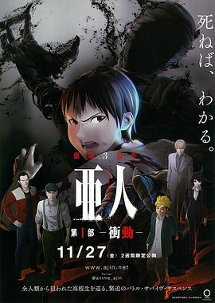
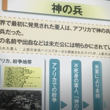
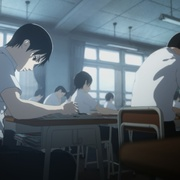
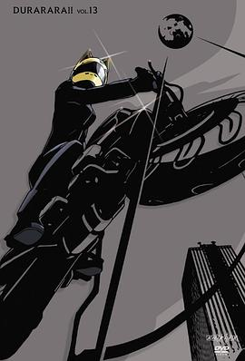
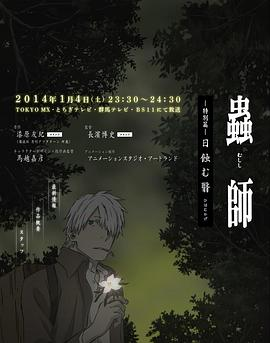
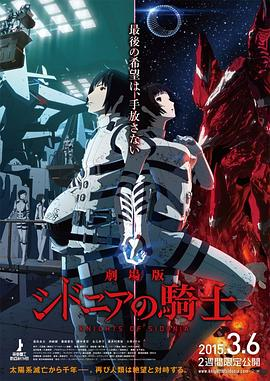
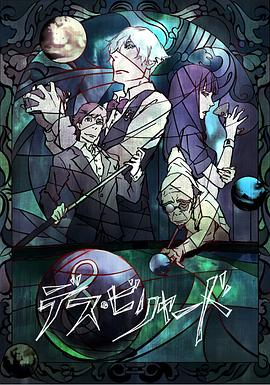

# 亚人1：冲动 (豆瓣)

**链接地址:** http://www.douban.com/doubanapp/dispatch?uri=/subject/26386465/interest/1001945712
**作者:** 
**获取时间:** 2025/8/28 22:57:53
**图片数量:** 56

---

## 原始HTML内容

  
    

    
    

    <link href="//img3.doubanio.com/dae/accounts/resources/ba98e9b/shire/bundle.css" rel="stylesheet" type="text/css">

  

    

  <a href="https://accounts.douban.com/passport/login?source=movie" class="nav-login" rel="nofollow">登录/注册</a>

    

  <a href="https://www.douban.com/doubanapp/app?channel=top-nav" class="lnk-doubanapp">下载豆瓣客户端</a>
  

    <a href="https://www.douban.com/doubanapp/app?channel=qipao" class="tip-link">豆瓣 6.0 全新发布</a>
    <a href="javascript: void 0;" class="tip-close">×</a>
  

  

    
豆瓣

    
扫码直接下载

    

      <a href="https://www.douban.com/doubanapp/redirect?channel=top-nav&amp;direct_dl=1&amp;download=iOS">iPhone</a>
      ·
      <a href="https://www.douban.com/doubanapp/redirect?channel=top-nav&amp;direct_dl=1&amp;download=Android" class="download-android">Android</a>
    

  

    

  <ul>
    <li class="">
      <a href="https://www.douban.com" target="_blank" data-moreurl-dict="{&quot;from&quot;:&quot;top-nav-click-main&quot;,&quot;uid&quot;:&quot;0&quot;}">豆瓣</a>
    </li>
    <li class="">
      <a href="https://book.douban.com" target="_blank" data-moreurl-dict="{&quot;from&quot;:&quot;top-nav-click-book&quot;,&quot;uid&quot;:&quot;0&quot;}">读书</a>
    </li>
    <li class="on">
      <a href="https://movie.douban.com" data-moreurl-dict="{&quot;from&quot;:&quot;top-nav-click-movie&quot;,&quot;uid&quot;:&quot;0&quot;}">电影</a>
    </li>
    <li class="">
      <a href="https://music.douban.com" target="_blank" data-moreurl-dict="{&quot;from&quot;:&quot;top-nav-click-music&quot;,&quot;uid&quot;:&quot;0&quot;}">音乐</a>
    </li>
    <li class="">
      <a href="https://www.douban.com/podcast/" target="_blank" data-moreurl-dict="{&quot;from&quot;:&quot;top-nav-click-podcast&quot;,&quot;uid&quot;:&quot;0&quot;}">播客</a>
    </li>
    <li class="">
      <a href="https://www.douban.com/location" target="_blank" data-moreurl-dict="{&quot;from&quot;:&quot;top-nav-click-location&quot;,&quot;uid&quot;:&quot;0&quot;}">同城</a>
    </li>
    <li class="">
      <a href="https://www.douban.com/group" target="_blank" data-moreurl-dict="{&quot;from&quot;:&quot;top-nav-click-group&quot;,&quot;uid&quot;:&quot;0&quot;}">小组</a>
    </li>
    <li class="">
      <a href="https://read.douban.com/?dcs=top-nav&amp;dcm=douban" target="_blank" data-moreurl-dict="{&quot;from&quot;:&quot;top-nav-click-read&quot;,&quot;uid&quot;:&quot;0&quot;}">阅读</a>
    </li>
    <li class="">
      <a href="https://fm.douban.com/?from_=shire_top_nav" target="_blank" data-moreurl-dict="{&quot;from&quot;:&quot;top-nav-click-fm&quot;,&quot;uid&quot;:&quot;0&quot;}">FM</a>
    </li>
    <li class="">
      <a href="https://time.douban.com/?dt_time_source=douban-web_top_nav" target="_blank" data-moreurl-dict="{&quot;from&quot;:&quot;top-nav-click-time&quot;,&quot;uid&quot;:&quot;0&quot;}">时间</a>
    </li>
    <li class="">
      <a href="https://market.douban.com/?utm_campaign=douban_top_nav&amp;utm_source=douban&amp;utm_medium=pc_web" target="_blank" data-moreurl-dict="{&quot;from&quot;:&quot;top-nav-click-market&quot;,&quot;uid&quot;:&quot;0&quot;}">豆品</a>
    </li>
  </ul>

  

    

    

    <link href="//img3.doubanio.com/dae/accounts/resources/ba98e9b/movie/bundle.css" rel="stylesheet" type="text/css">

  

  

    

      <a href="https://movie.douban.com">豆瓣电影</a>
    

    

      <form action="https://search.douban.com/movie/subject_search" method="get">
        <fieldset>
          <legend>搜索：</legend>
          <label for="inp-query">
          </label>
          
<input id="inp-query" name="search_text" size="22" maxlength="60" placeholder="搜索电影、电视剧、综艺、影人" value="">

          
<input type="submit" value="搜索">

          <input type="hidden" name="cat" value="1002">
        </fieldset>
      </form>
    

  

  

  

    

  <ul>
    <li><a href="https://movie.douban.com/cinema/nowplaying/">影讯&amp;购票</a>
    </li>
    <li><a href="https://movie.douban.com/explore">选电影</a>
    </li>
    <li><a href="https://movie.douban.com/tv/">选剧集</a>
    </li>
    <li><a href="https://movie.douban.com/chart">排行榜</a>
    </li>
    <li><a href="https://movie.douban.com/review/best/">影评</a>
    </li>
    <li><a href="https://movie.douban.com/annual/2024/?fullscreen=1&amp;dt_from=movie_navigation">2024年度榜单</a>
    </li>
    <li><a href="https://c9.douban.com/app/standbyme-2024/?autorotate=false&amp;fullscreen=true&amp;hidenav=true&amp;monitor_screenshot=true&amp;df_from=web_navigation" target="_blank">2024年度报告</a>
    </li>
  </ul>

    
  

    

    
    

        

        
    

        

    <h1>
        亚人1：冲动 亜人 第1部 衝動
            (2015)
    </h1>

        

            

            
            

                
    

        

            

                
                

    

                

        导演: <a href="https://www.douban.com/personage/27539789/" rel="v:directedBy">濑下宽之</a> / <a href="https://www.douban.com/personage/27579097/" rel="v:directedBy">安藤裕章</a> 
        编剧: <a href="https://www.douban.com/personage/27579098/">濑古浩司</a> / <a href="https://www.douban.com/personage/27579099/">樱井画门</a> 
        主演: <a href="https://www.douban.com/personage/27224300/" rel="v:starring">宫野真守</a> / <a href="https://www.douban.com/personage/27497340/" rel="v:starring">细谷佳正</a> / <a href="https://www.douban.com/personage/27370268/" rel="v:starring">大塚芳忠</a> / <a href="https://www.douban.com/personage/27224988/" rel="v:starring">樱井孝宏</a> / <a href="https://www.douban.com/personage/27547977/" rel="v:starring">小松未可子</a> / <a href="https://www.douban.com/personage/27226273/" rel="v:starring">平川大辅</a> / <a href="https://www.douban.com/personage/27497422/" rel="v:starring">洲崎绫</a> / <a href="https://www.douban.com/personage/27585187/" rel="v:starring">木下浩之</a> / <a href="https://www.douban.com/personage/34896285/" rel="v:starring">山本格</a> / <a href="https://www.douban.com/personage/27550620/" rel="v:starring">朝井彩加</a> / <a href="https://www.douban.com/personage/35134436/" rel="v:starring">合田绘利</a> / <a href="https://www.douban.com/personage/27494954/" rel="v:starring">大桥贤一郎</a> 
        类型: 剧情 / 动画 / 悬疑 / 惊悚 / 犯罪 
        官方网站: <a href="http://www.ajin.net" rel="nofollow" target="_blank">www.ajin.net</a> 
        制片国家/地区: 日本 
        语言: 日语 
        上映日期: 2015-11-27(日本) 
        片长: 106分钟 
        又名: 亚人 剧场版1 
        IMDb: tt5234428 

            

            
                

<link rel="stylesheet" href="https://img3.doubanio.com/cuphead/movie-static/download-output-image/index.7aaa3.css">

    

        

            

                豆瓣评分
            

          

            
            <a class="download-output-image" href="#">引用</a>
          

        

        

    <strong class="ll rating_num" property="v:average">8.6</strong>
    
    

        

        

                <a href="comments" class="rating_people">
                    12057人评价
                </a>
        

    

    
        

        
        
            5星
        
        

        44.3%
         
        

        

        
        
            4星
        
        

        42.5%
         
        

        

        
        
            3星
        
        

        11.5%
         
        

        

        
        
            2星
        
        

        1.2%
         
        

        

        
        
            1星
        
        

        0.4%
         
        

    

        

            好于 <a href="/typerank?type_name=剧情&amp;type=11&amp;interval_id=75:65&amp;action=">72% 剧情片</a> 
            好于 <a href="/typerank?type_name=犯罪&amp;type=3&amp;interval_id=90:80&amp;action=">89% 犯罪片</a> 
        

            
        

        
            

        
            <a href="https://www.douban.com/reason=collectwish&amp;ck=" rel="nofollow" class="j a_show_login colbutt ll" name="pbtn-26386465-wish">
                想看
            </a>
            <a href="https://www.douban.com/reason=collectcollect&amp;ck=" rel="nofollow" class="j a_show_login colbutt ll" name="pbtn-26386465-collect">
                看过
            </a>
        

            
    
    评价:
     

            
            
            
            
            
    
    <input id="n_rating" type="hidden" value="">
    

        

        

    <ul class="ul_subject_menu bicelink color_gray pt6 clearfix">
        
    
        
                
                  <li> 
    &nbsp;
        <a onclick="moreurl(this, {from:'mv_sbj_wr_cmnt_login'})" class="j a_show_login" href="https://www.douban.com/register?reason=review" rel="nofollow">写短评</a>
 </li>
                  <li> 
    
    &nbsp;
        <a onclick="moreurl(this, {from:'mv_sbj_wr_rv_login'})" class="j a_show_login" href="https://www.douban.com/register?reason=review" rel="nofollow">写影评</a>
 </li>
                    <li> 
   

   
    
    
    <a href="#" data-type="电影" data-url="https://movie.douban.com/subject/26386465/" data-desc="电影《亚人1：冲动 亜人 第1部 衝動》 (来自豆瓣) " data-title="电影《亚人1：冲动 亜人 第1部 衝動》 (来自豆瓣) " data-pic="https://img1.doubanio.com/view/photo/s_ratio_poster/public/p2267694939.jpeg" class="bn-sharing ">
        分享到
    </a> &nbsp;&nbsp;
    
    <link rel="stylesheet" href="https://img1.doubanio.com/f/vendors/e8a7261937da62636d22ca4c579efc4a4d759b1b/css/ui/dialog.css">
    
    
    

  </li>
            

    </ul>

    

        
            

<link rel="stylesheet" href="https://img3.doubanio.com/cuphead/movie-static/mod/share.ee737.css" type="text/css">

    

        
        <a href="/accounts/register?reason=recommend" class="j a_show_login lnk-sharing" share-id="26386465" data-mode="plain" data-name="亚人1：冲动 亜人 第1部 衝動‎ (2015)" data-type="movie" data-desc="导演 濑下宽之 主演 宫野真守 / 细谷佳正 / 日本 / 8.6分(12057评价)" data-href="https://movie.douban.com/subject/26386465/" data-image="https://img1.doubanio.com/view/photo/s_ratio_poster/public/p2267694939.jpg" data-properties="{}" data-redir="" data-text="" data-apikey="" data-curl="" data-count="10" data-object_kind="1002" data-object_id="26386465" data-target_type="rec" data-target_action="0" data-action_props="{&quot;subject_url&quot;:&quot;https:\/\/movie.douban.com\/subject\/26386465\/&quot;,&quot;subject_title&quot;:&quot;亚人1：冲动 亜人 第1部 衝動‎ (2015)&quot;}">推荐</a>

        
    

        

    

    

    

    
    
        
            
            
    <h2>
        <i>亚人1：冲动的剧情简介</i>
              · · · · · ·
    </h2>

            

                    
                        
                                　　“亚人”是1980年代开始渐渐出现在人类视野之中的新人种，他们源自于人类，有着和人类一样的外貌，却有着不老不死的肉身，只有一个人类死亡之后，才能够判断他是否为亚人。人类恐惧亚人身上所蕴藏的强大力量，对他们发起了严酷的追捕和研究。
                                     
                                　　永井圭（宫野真守 配音）是一位平凡的少年，拥有高超的智商和优秀的成绩，某日，在一场交通事故中，永井圭不幸丧生，随后变为亚人，遭到了军方的通缉。在童年好友海斗（细谷佳正 配音）的帮助下，永井圭踏上了逃亡的旅途，期间遇到了身份神秘的帽子男佐藤（大冢芳忠 配音），虽然佐藤和永井圭同为亚人，但不知为何，佐藤将永井圭视为了敌人。
                        
                        <a href="https://movie.douban.com/help/movie#t0-qs">©豆瓣</a>
            

    

    

<link rel="stylesheet" href="https://img3.doubanio.com/cuphead/movie-static/celebrity/celebrities_section.610da.css">

  
    <h2>
        <i>亚人1：冲动的演职员</i>
              · · · · · ·
            
            (
                <a href="/subject/26386465/celebrities">全部 18</a>
            )
            
    </h2>

  <ul class="celebrities-list from-subject __oneline">
        
    
  
  <li class="celebrity">
    

  <a href="https://www.douban.com/personage/27539789/" title="濑下宽之 Hiroyuki Seshita" class="">
      

    

  </a>

    

      <a href="https://www.douban.com/personage/27539789/" title="濑下宽之 Hiroyuki Seshita" class="name">濑下宽之</a>

      导演

    

  </li>

        
    
  
  <li class="celebrity">
    

  <a href="https://www.douban.com/personage/27579097/" title="安藤裕章 Hiroaki Andô" class="">
      

    

  </a>

    

      <a href="https://www.douban.com/personage/27579097/" title="安藤裕章 Hiroaki Andô" class="name">安藤裕章</a>

      导演

    

  </li>

        
    
  
  <li class="celebrity">
    

  <a href="https://www.douban.com/personage/27224300/" title="宫野真守 Mamoru Miyano" class="">
      

    

  </a>

    

      <a href="https://www.douban.com/personage/27224300/" title="宫野真守 Mamoru Miyano" class="name">宫野真守</a>

      配 永井圭

    

  </li>

        
    
  
  <li class="celebrity">
    

  <a href="https://www.douban.com/personage/27497340/" title="细谷佳正 Yoshimasa Hosoya" class="">
      

    

  </a>

    

      <a href="https://www.douban.com/personage/27497340/" title="细谷佳正 Yoshimasa Hosoya" class="name">细谷佳正</a>

      配 海斗

    

  </li>

        
    
  
  <li class="celebrity">
    

  <a href="https://www.douban.com/personage/27370268/" title="大塚芳忠 Hôchû Ôtsuka" class="">
      

    

  </a>

    

      <a href="https://www.douban.com/personage/27370268/" title="大塚芳忠 Hôchû Ôtsuka" class="name">大塚芳忠</a>

      配 佐藤

    

  </li>

        
    
  
  <li class="celebrity">
    

  <a href="https://www.douban.com/personage/27224988/" title="樱井孝宏 Takahiro Sakurai" class="">
      

    

  </a>

    

      <a href="https://www.douban.com/personage/27224988/" title="樱井孝宏 Takahiro Sakurai" class="name">樱井孝宏</a>

      配 戸崎

    

  </li>

  </ul>

    

<link rel="stylesheet" href="https://img1.doubanio.com/f/verify/a5bc0bc0aea4221d751bc4809fd4b0a1075ad25e/entry_creator/dist/author_subject/style.css">

    

    
        

<link rel="stylesheet" href="https://img1.doubanio.com/cuphead/movie-static/subject/photos_section.45abd.css">

    
    

        
    
    
    <h2>
        <i>亚人1：冲动的视频和图片</i>
              · · · · · ·
            
            (
                <a href="https://movie.douban.com/subject/26386465/trailer#trailer">预告片2</a>&nbsp;|&nbsp;<a href="https://movie.douban.com/subject/26386465/all_photos">图片87</a>&nbsp;·&nbsp;<a href="https://movie.douban.com/subject/26386465/mupload">添加</a>
            )
            
    </h2>

        <ul class="related-pic-bd  ">
                <li class="label-trailer">
                    <a class="related-pic-video" href="https://movie.douban.com/trailer/183781/#content" title="预告片" style="background-image:url(https://img9.doubanio.com/img/trailer/medium/2268768476.jpg)">
                        
预告片

                    </a>
                </li>
                <li>
                    
                </li>
                <li>
                    
                </li>
                <li>
                    
                </li>
                <li>
                    
                </li>
        </ul>
    

    

    

    
        

<link rel="stylesheet" href="https://img3.doubanio.com/cuphead/movie-static/subject/recommendations.61283.css">

        

    

        
        
    <h2>
        <i>喜欢这部电影的人也喜欢</i>
              · · · · · ·
    </h2>

        
    
    

        <dl>
            <dt>
                
            </dt>
            <dd>
                <a href="https://movie.douban.com/subject/26675621/?from=subject-page">亚人2：冲突</a>
                8.4
            </dd>
        </dl>
        <dl>
            <dt>
                
            </dt>
            <dd>
                <a href="https://movie.douban.com/subject/11499092/?from=subject-page">空之境界 未来福音</a>
                9.1
            </dd>
        </dl>
        <dl>
            <dt>
                
            </dt>
            <dd>
                <a href="https://movie.douban.com/subject/6844861/?from=subject-page">命运石之门剧场版：负荷领域...</a>
                8.9
            </dd>
        </dl>
        <dl>
            <dt>
                
            </dt>
            <dd>
                <a href="https://movie.douban.com/subject/5992987/?from=subject-page">无头骑士异闻录：天下泰平</a>
                8.8
            </dd>
        </dl>
        <dl>
            <dt>
                
            </dt>
            <dd>
                <a href="https://movie.douban.com/subject/25774760/?from=subject-page">虫师 蚀日之翳</a>
                9.3
            </dd>
        </dl>
        <dl>
            <dt>
                
            </dt>
            <dd>
                <a href="https://movie.douban.com/subject/26265989/?from=subject-page">希德尼娅的骑士 剧场版</a>
                8.3
            </dd>
        </dl>
        <dl>
            <dt>
                
            </dt>
            <dd>
                <a href="https://movie.douban.com/subject/20266598/?from=subject-page">死亡台球</a>
                8.0
            </dd>
        </dl>
        <dl>
            <dt>
                
            </dt>
            <dd>
                <a href="https://movie.douban.com/subject/10558440/?from=subject-page">乐园追放</a>
                8.2
            </dd>
        </dl>
        <dl>
            <dt>
                
            </dt>
            <dd>
                <a href="https://movie.douban.com/subject/20473395/?from=subject-page">K 剧场版</a>
                7.9
            </dd>
        </dl>
        <dl>
            <dt>
                
            </dt>
            <dd>
                <a href="https://movie.douban.com/subject/25928796/?from=subject-page">野良神 OAD2</a>
                8.7
            </dd>
        </dl>
    

    

    

    
        

    
    <link rel="stylesheet" href="https://img1.doubanio.com/f/vendors/d63a579a99fd372b4398731a279a1382e6eac71e/subject-comments/comments-section.css">

    

        

            
            
        <a class="comment_btn j a_show_login" href="https://www.douban.com/register?reason=review" rel="nofollow">
            我要写短评
        </a>

            
    <h2>
        <i>亚人1：冲动的短评</i>
              · · · · · ·
            
            (
                <a href="https://movie.douban.com/subject/26386465/comments?status=P">全部 2823 条</a>
            )
            
    </h2>

        

        

        

                
        

                        <a id="hot-comments-tab" href="comments" data-id="hot" class="on">热门</a>&nbsp;/&nbsp;
                        <a id="new-comments-tab" href="comments?sort=time" data-id="new" class="j a_show_login">最新</a>&nbsp;/&nbsp;
                        <a id="following-comments-tab" href="comments?sort=follows" data-id="following" class="j a_show_login">好友</a>
        

    

        

            
    

        
        

            
    
    

        <h3>
            
                    13

                    <input value="1023476987" type="hidden">
                    <a href="javascript:;" data-id="1023476987" class="j a_show_login" onclick="">有用</a>

                <!-- 删除短评 -->
            
            
                <a href="https://www.douban.com/people/olivecurtain/">岚行</a>
                    看过
                    
                
                    2016-03-21 13:05:38
                
                
            
        </h3>
        

            
                "突变亚人种"完全可算一种类型故事了,这部的发展方式遵循套路,却保有极有趣的个性.以近期动画化的来说,有的宣泄躁郁有的凝视魂灵,这里则是"極めて合理的".同理心缺失却接纳了基本社会规则的主角会引领观众演算底限的道义.Polygon稳稳走在正道,已经取得更多余地,不变的是利落与节制.然我挺想看这部改2D
        

        

    

    

        

        
        

            
    
    

        <h3>
            
                    39

                    <input value="1000992185" type="hidden">
                    <a href="javascript:;" data-id="1000992185" class="j a_show_login" onclick="">有用</a>

                <!-- 删除短评 -->
            
            
                <a href="https://www.douban.com/people/gruel_/">穗尔Sybil</a>
                    看过
                    
                
                    2016-01-17 16:45:30
                
                
            
        </h3>
        

            
                日本动漫复苏了吗？！好看！！
        

        

    

    

        

        
        

            
    
    

        <h3>
            
                    23

                    <input value="996925584" type="hidden">
                    <a href="javascript:;" data-id="996925584" class="j a_show_login" onclick="">有用</a>

                <!-- 删除短评 -->
            
            
                <a href="https://www.douban.com/people/65157272/">燕孩孩</a>
                    看过
                    
                
                    2016-01-07 12:18:55
                
                
            
        </h3>
        

            
                男主性格很创新，眯眯眼都是怪物开眼后不得了果然是二次元通用。
        

        

    

    

        

        
        

            
    
    

        <h3>
            
                    7

                    <input value="1027538652" type="hidden">
                    <a href="javascript:;" data-id="1027538652" class="j a_show_login" onclick="">有用</a>

                <!-- 删除短评 -->
            
            
                <a href="https://www.douban.com/people/PandaMovieMusic/">Panda的影音</a>
                    看过
                    
                
                    2016-04-02 22:16:35
                
                
            
        </h3>
        

            
                披着科幻外衣但内核设定更接近魔幻的动画片。运用三维技术但风格却模拟手绘，制作上并不精致，故事却挺精彩。为赏金而抓捕永井圭→这个世界生存的人类大多会被物质操控思想；永井圭不杀生反救人→善良与邪恶，其实就在自己脑海的一念之间；海舍命陪君子地救助永井圭→对不起，我总觉得友情深得像真爱…
        

        

    

    

        

        
        

            
    
    

        <h3>
            
                    16

                    <input value="1003454480" type="hidden">
                    <a href="javascript:;" data-id="1003454480" class="j a_show_login" onclick="">有用</a>

                <!-- 删除短评 -->
            
            
                <a href="https://www.douban.com/people/moneylatem/">Jin</a>
                    看过
                    
                
                    2016-01-24 10:33:20
                
                
            
        </h3>
        

            
                人物心理状态和动作戏都太赞。
        

        

    

    

        

                
                    &gt; <a href="comments?sort=new_score&amp;status=P">
                        更多短评
                            2823条
                    </a>
        

        

            

            

            

                <a class="qa" href="/help/opinion#t2-q0" target="_blank">为什么被折叠？</a>
                <a class="btn-unfold" href="#">有一些短评被折叠了</a>
                

                    评论被折叠，是因为发布这条评论的账号行为异常。评论仍可以被展开阅读，对发布人的账号不造成其他影响。如果认为有问题，可以<a href="https://help.douban.com/help/ask?category=movie">联系</a>豆瓣电影。
                

            

            

            

            
        

        

            
    

        

            你关注的人还没写过短评
        

        

    

    

            
            
        

    

<!--        此处是挂载其他页面，不是注释！不是注释！不是注释！-->
        

<link rel="stylesheet" href="https://img1.doubanio.com/misc/mixed_static/292deb5ae8f760a3.css">

    <section id="reviews-wrapper" class="reviews mod movie-content">
        <header>
            
                <a href="new_review" rel="nofollow" class="create-review comment_btn " data-isverify="False" data-verify-url="https://www.douban.com/accounts/phone/verify?redir=https://movie.douban.com/subject/26386465/new_review">
                    我要写影评
                </a>
            <h2>
                    亚人1：冲动的影评 · · · · · ·

                    ( <a href="reviews">全部 18 条</a> )
            </h2>
        </header>

            
            

                                <a href="javascript:;;" class="cur" data-sort="">热门</a>
            

            

            

        
    

            
    
    

        

            
    
    <header class="main-hd">
        

        <a href="https://www.douban.com/people/sugarcane3055/" class="name">一根树杈</a>
            

        2016-01-03 00:42:54

    </header>

            

                <h2><a href="https://movie.douban.com/review/7717903/">关于永井“天然黑”和“奇怪”的性格</a></h2>

                

                    

                            
这篇影评可能有剧透

                        写在前面的话： 这篇漫评不是想判断永井是好人还是坏人，只是想分析永井一些行为的动机和状况，我觉得当我们尽量全面的分析出他一些行为产生的原因后，就不会在单纯简单的说【他是个天然腹黑的人】或者【其实他是个好人】了。 那样的判断太武断，比如当我们赞同一个人或者讨厌...

                        &nbsp;(<a href="javascript:;" id="toggle-7717903-copy" class="unfold" title="展开">展开</a>)
                    

                

                

                    

                

                

                    <a href="javascript:;" class="action-btn up" data-rid="7717903" title="有用">
                        
                        
                                168
                        
                    </a>
                    <a href="javascript:;" class="action-btn down" data-rid="7717903" title="没用">
                        
                        
                                8
                        
                    </a>
                    <a href="https://movie.douban.com/review/7717903/#comments" class="reply ">24回应</a>

                    <a href="javascript:;;" class="fold hidden">收起</a>
                

            

        

    

            
    
    

        

            
    
    <header class="main-hd">
        

        <a href="https://www.douban.com/people/139989064/" class="name">YayA</a>
            

        2016-01-04 19:27:43

    </header>

            

                <h2><a href="https://movie.douban.com/review/7720861/">【亚人剧场版】【吐槽向】总之这可能是我见过性格最有意思的男主角</a></h2>

                

                    

                            
这篇影评可能有剧透

                        怪不得没人，原来都在这个TAG里面，我还以为自己跳了个冷坑http://movie.douban.com/subject/26608268/discussion/613015850/ ====================================================================== 第一次上来写东西，本人没看过原作漫画，昨天刚看的剧场版第一集，原作的...

                        &nbsp;(<a href="javascript:;" id="toggle-7720861-copy" class="unfold" title="展开">展开</a>)
                    

                

                

                    

                

                

                    <a href="javascript:;" class="action-btn up" data-rid="7720861" title="有用">
                        
                        
                                117
                        
                    </a>
                    <a href="javascript:;" class="action-btn down" data-rid="7720861" title="没用">
                        
                        
                                13
                        
                    </a>
                    <a href="https://movie.douban.com/review/7720861/#comments" class="reply ">31回应</a>

                    <a href="javascript:;;" class="fold hidden">收起</a>
                

            

        

    

            
    
    

        

            
    
    <header class="main-hd">
        

        <a href="https://www.douban.com/people/anitama0815/" class="name">AniTama</a>
            

        2015-12-08 12:41:52

    </header>

            

                <h2><a href="https://movie.douban.com/review/7684524/">剧场版《亚人》第一部大热上映舞台见面会REPO以及电影剧透</a></h2>

                

                    

                            
这篇影评可能有剧透

                         作者： 马太  2015年12月5日，在东京TOHO日本桥举办了剧场版《亚人》第一部《冲动》的大热舞台见面会。当天到场的嘉宾有 宫野真守 ， 小松未可子， 福山润 。舞台见面会在整场电影结束后开始，在阅览舞台见面会REPO之前，如果不在意 剧透 的，不妨先看本文后半部分的剧情简单...

                        &nbsp;(<a href="javascript:;" id="toggle-7684524-copy" class="unfold" title="展开">展开</a>)
                    

                

                

                    

                

                

                    <a href="javascript:;" class="action-btn up" data-rid="7684524" title="有用">
                        
                        
                                8
                        
                    </a>
                    <a href="javascript:;" class="action-btn down" data-rid="7684524" title="没用">
                        
                        
                                5
                        
                    </a>
                    <a href="https://movie.douban.com/review/7684524/#comments" class="reply ">3回应</a>

                    <a href="javascript:;;" class="fold hidden">收起</a>
                

            

        

    

            
    
    

        

            
    
    <header class="main-hd">
        

        <a href="https://www.douban.com/people/anitama0815/" class="name">AniTama</a>
            

        2016-01-18 17:11:34

    </header>

            

                <h2><a href="https://movie.douban.com/review/7740474/">动画影像的新挑战与新时代——剧场版与TV版的双管齐下</a></h2>

                

                    

                            
这篇影评可能有剧透

                         作者：LIAR  由桜井画門原作、累计发行部数突破390万的人气作品《亚人》改编的剧场版动画第1部《亚人 -冲动-》于去年11月27日在日本限定两周公开上映，TV动画也于上周MBS/TBS的“Anime-ISM”档播出。   舞台发生在存在着不死生命体“亚人”的世界。高校生永井圭因为一场交通事...

                        &nbsp;(<a href="javascript:;" id="toggle-7740474-copy" class="unfold" title="展开">展开</a>)
                    

                

                

                    

                

                

                    <a href="javascript:;" class="action-btn up" data-rid="7740474" title="有用">
                        
                        
                                10
                        
                    </a>
                    <a href="javascript:;" class="action-btn down" data-rid="7740474" title="没用">
                        
                        
                                1
                        
                    </a>
                    <a href="https://movie.douban.com/review/7740474/#comments" class="reply ">0回应</a>

                    <a href="javascript:;;" class="fold hidden">收起</a>
                

            

        

    

            
    
    

        

            
    
    <header class="main-hd">
        

        <a href="https://www.douban.com/people/lichuano/" class="name">水之痕迹</a>
            

        2016-01-06 21:38:43

    </header>

            

                <h2><a href="https://movie.douban.com/review/7724283/">黑暗系的设定</a></h2>

                

                    

                            世界观设定是各国政府发现稀有的不死之人（即亚人），就抓捕来当小白鼠研究，一次一次的kill掉、复活、kill掉、...。而男主在一次车祸中被目睹复活，就从开始的惊慌逃亡到后来冷静行事。     男主的性格是“成为出色的人，为此，只做必须做的事，只选择必要的东西。”“因...

                        &nbsp;(<a href="javascript:;" id="toggle-7724283-copy" class="unfold" title="展开">展开</a>)
                    

                

                

                    

                

                

                    <a href="javascript:;" class="action-btn up" data-rid="7724283" title="有用">
                        
                        
                                2
                        
                    </a>
                    <a href="javascript:;" class="action-btn down" data-rid="7724283" title="没用">
                        
                        
                                1
                        
                    </a>
                    <a href="https://movie.douban.com/review/7724283/#comments" class="reply ">0回应</a>

                    <a href="javascript:;;" class="fold hidden">收起</a>
                

            

        

    

            
    
    

        

            
    
    <header class="main-hd">
        

        <a href="https://www.douban.com/people/richor/" class="name">Richor</a>
            

        2015-12-01 23:33:37

    </header>

            

                <h2><a href="https://movie.douban.com/review/7678051/">充满既视感的一次观影经历。</a></h2>

                

                    

                        海报上写着「2 週間限定公開」，抵不住饥饿营销，于是趁「映画の日」晃去新宿看了一下。  首先是视觉方面的观感，为了营造真实感，人物似乎用了 3D 建模而非原画，整体感觉有些像 RWBY ，人物表情和动作微微僵硬，当然打斗还是很利落。背景却意外有些水彩质感的笔触，并非完全...

                        &nbsp;(<a href="javascript:;" id="toggle-7678051-copy" class="unfold" title="展开">展开</a>)
                    

                

                

                    

                

                

                    <a href="javascript:;" class="action-btn up" data-rid="7678051" title="有用">
                        
                        
                                4
                        
                    </a>
                    <a href="javascript:;" class="action-btn down" data-rid="7678051" title="没用">
                        
                        
                                1
                        
                    </a>
                    <a href="https://movie.douban.com/review/7678051/#comments" class="reply ">5回应</a>

                    <a href="javascript:;;" class="fold hidden">收起</a>
                

            

        

    

            
    
    

        

            
    
    <header class="main-hd">
        

        <a href="https://www.douban.com/people/tobewithwho/" class="name">倥偬</a>
            

        2016-01-23 21:37:23

    </header>

            

                <h2><a href="https://movie.douban.com/review/7746896/">一些瞎扯</a></h2>

                

                    

                            
这篇影评可能有剧透

                         首先我要说，这是一部制作精良的动画，目前来看肯定是要追的。 制作精良，肯定会追。 制作精良，肯定会追。 制作精良，肯定会追。 重点说三遍，是为了表达我不是无脑喷。 画面精良帧数多，人设分明，打斗绝不偷工减料，也没有用乏味对话拖时间的剧情，配乐燃且赞，分镜可圈可...

                        &nbsp;(<a href="javascript:;" id="toggle-7746896-copy" class="unfold" title="展开">展开</a>)
                    

                

                

                    

                

                

                    <a href="javascript:;" class="action-btn up" data-rid="7746896" title="有用">
                        
                        
                                2
                        
                    </a>
                    <a href="javascript:;" class="action-btn down" data-rid="7746896" title="没用">
                        
                        
                        
                    </a>
                    <a href="https://movie.douban.com/review/7746896/#comments" class="reply ">1回应</a>

                    <a href="javascript:;;" class="fold hidden">收起</a>
                

            

        

    

            
    
    

        

            
    
    <header class="main-hd">
        

        <a href="https://www.douban.com/people/51436861/" class="name">是打发阿道夫</a>
            

        2016-01-04 18:30:24

    </header>

            

                <h2><a href="https://movie.douban.com/review/7720792/">人渣男主，外挂不死之身</a></h2>

                

                    

                            
这篇影评可能有剧透

                        剧情简介：男主圭是亚人， 亚人是不死之身，一日男主被卡车撞死，同学们发现他是亚人，于是在基友的帮助下逃亡中，中途被同是亚人的反派佐藤暗算，送去做实验，最后逃出来的故事，故事亮点：不死之身恰到好处的应用点是这部片子最大的亮点，可见作者对“不死身”的设定做了大量...

                        &nbsp;(<a href="javascript:;" id="toggle-7720792-copy" class="unfold" title="展开">展开</a>)
                    

                

                

                    

                

                

                    <a href="javascript:;" class="action-btn up" data-rid="7720792" title="有用">
                        
                        
                                2
                        
                    </a>
                    <a href="javascript:;" class="action-btn down" data-rid="7720792" title="没用">
                        
                        
                                1
                        
                    </a>
                    <a href="https://movie.douban.com/review/7720792/#comments" class="reply ">0回应</a>

                    <a href="javascript:;;" class="fold hidden">收起</a>
                

            

        

    

            
    
    

        

            
    
    <header class="main-hd">
        

        <a href="https://www.douban.com/people/173219241/" class="name">Lush Life</a>
            

        2022-07-15 08:32:37

    </header>

            

                <h2><a href="https://movie.douban.com/review/14514511/">经典“世界与我”的辩证</a></h2>

                

                    

                            
这篇影评可能有剧透

                        当年接触《亚人》时正好可以追着第二季的剧版看。虽然过去几年，但这部作品在我看来仍是经典。这部剧和东京喰种的主题类似，将设定概括归类都是“错的不是我，是这个世界（的偏见）”。无独有偶，两部作品的主角都是向往和平避免争端的，但是却不得不卷入各派利益的纠纷，同时...

                        &nbsp;(<a href="javascript:;" id="toggle-14514511-copy" class="unfold" title="展开">展开</a>)
                    

                

                

                    

                

                

                    <a href="javascript:;" class="action-btn up" data-rid="14514511" title="有用">
                        
                        
                        
                    </a>
                    <a href="javascript:;" class="action-btn down" data-rid="14514511" title="没用">
                        
                        
                        
                    </a>
                    <a href="https://movie.douban.com/review/14514511/#comments" class="reply ">0回应</a>

                    <a href="javascript:;;" class="fold hidden">收起</a>
                

            

        

    

            
    
    

        

            
    
    <header class="main-hd">
        

        <a href="https://www.douban.com/people/133434942/" class="name">远见</a>
            

        2018-02-14 15:47:27

    </header>

            

                <h2><a href="https://movie.douban.com/review/9150691/">《亚人》全程高潮，全程热血，全程吸引人。碾压海贼王，火影。。</a></h2>

                

                    

                        1、从5年前就养成了一个习惯，看完电影就一定要看看豆瓣的影评，但是看了5年也没有评论过一次，今天要为了《亚人》动漫第一季男主角而评论，因为那个男主角实在是太恶心了。长相恶心+性格恶心。 2、《亚人》太好看了，是我今年看过最好看的日本动漫，跟进击的巨人一样，全程被...

                        &nbsp;(<a href="javascript:;" id="toggle-9150691-copy" class="unfold" title="展开">展开</a>)
                    

                

                

                    

                

                

                    <a href="javascript:;" class="action-btn up" data-rid="9150691" title="有用">
                        
                        
                        
                    </a>
                    <a href="javascript:;" class="action-btn down" data-rid="9150691" title="没用">
                        
                        
                                1
                        
                    </a>
                    <a href="https://movie.douban.com/review/9150691/#comments" class="reply ">0回应</a>

                    <a href="javascript:;;" class="fold hidden">收起</a>
                

            

        

    

    

    <!-- COLLECTED JS -->
    <!-- COLLECTED CSS -->

    

    <link rel="stylesheet" href="https://img1.doubanio.com/f/zerkalo/88118a282439e312283e886ea4c3d3e9849a8fa4/css/review/editor/ng/setting_standalone.css">
    
    
    
    
    
    
    

                

                    &gt;
                        <a href="reviews">
                            更多影评
                                18篇
                        </a>
                

    </section>
<!-- COLLECTED JS -->

     

    
            

                    
                    

                            <a class="comment_btn j a_show_login" href="https://www.douban.com/register?reason=review" rel="nofollow">添加新讨论</a>
                        
    <h2>
        讨论区
         &nbsp; ·&nbsp; ·&nbsp; ·&nbsp; ·&nbsp; ·&nbsp; ·
    </h2>

                    

                    
  <table class="olt"><tbody><tr><td></td><td></td><td></td><td></td></tr>
        
        <tr>
          <td class="pl"><a href="https://movie.douban.com/subject/26386465/discussion/616557150/" title="电影和剧集什么关系 浓缩版吗 不是的话 先看哪个">电影和剧集什么关系 浓缩版吗 不是的话 先看哪个</a></td>
          <td class="pl">来自<a href="https://www.douban.com/people/149960666/">扉间大人</a></td>
          <td class="pl">2 回应</td>
          <td class="pl">2022-11-11 03:19:16</td>
        </tr>
        
        <tr>
          <td class="pl"><a href="https://movie.douban.com/subject/26386465/discussion/616844720/" title="有人喜欢海斗桑咩">有人喜欢海斗桑咩</a></td>
          <td class="pl">来自<a href="https://www.douban.com/people/229228514/">比巴卜</a></td>
          <td class="pl"></td>
          <td class="pl">2020-12-29 00:19:09</td>
        </tr>
        
        <tr>
          <td class="pl"><a href="https://movie.douban.com/subject/26386465/discussion/616460886/" title="当然是因为海桑，才喜欢上这部电影的">当然是因为海桑，才喜欢上这部电影的</a></td>
          <td class="pl">来自<a href="https://www.douban.com/people/164259941/">木风3</a></td>
          <td class="pl"></td>
          <td class="pl">2019-10-24 15:34:20</td>
        </tr>
  </tbody></table>

                    

                        <a href="/subject/26386465/discussion/" rel="nofollow">
                            &gt; 去这部影片的讨论区（全部3条）
                        </a>
                    

            

        
    
        
                
                    

    

        <h2>
                关于《亚人1：冲动》的问题
                · · · · · ·
            
                (<a href="https://movie.douban.com/subject/26386465/questions/?from=subject">
                    全部3个
                </a>)
            
        </h2>

        <!-- 
    
    <a class='j a_show_login comment_btn'
        href='https://movie.douban.com/subject/26386465/questions/ask/?from=subject'>我来提问</a>
 -->
    

    

        <ul>
            <li>
                
                    <a href="https://movie.douban.com/subject/26386465/questions/68603/?from=subject">
                        白毛户崎的跟班下村泉是真心要帮男主角的吗？
                    </a>
                
                
                    3人回答
                
            </li>
            <li>
                
                    <a href="https://movie.douban.com/subject/26386465/questions/68005/?from=subject">
                        剧场版跟TV版有什么关联吗？
                    </a>
                
                
                    2人回答
                
            </li>
        </ul>

        
&gt;
            <a href="https://movie.douban.com/subject/26386465/questions/?from=subject">
                全部3个问题
            </a>
        

    

            

    

            

            

                

    

    <!-- douban ad begin -->
    

    <!-- douban ad end -->

    

    

    

    

    
        

    
    
    <h2>
        <i>以下片单推荐</i>
              · · · · · ·
            
            (
                <a href="https://movie.douban.com/subject/26386465/doulists">全部</a>
            )
            
    </h2>

    
    <ul>
            
                <li>
                    <a href="https://www.douban.com/doulist/1236864/" target="_blank">恐怖 诡异 惊悚 黑色系动画推荐</a>
                    (茶杯GENIE)
                </li>
            
                <li>
                    <a href="https://www.douban.com/doulist/1657752/" target="_blank">不把每部都看齐就硌硬 10th Anniv.</a>
                    (日耳man)
                </li>
            
                <li>
                    <a href="https://www.douban.com/doulist/545743/" target="_blank">樱井孝宏不确定疯魔症</a>
                    (petrichor)
                </li>
            
                <li>
                    <a href="https://www.douban.com/doulist/35898420/" target="_blank">高分电影</a>
                    (豆瓣电影)
                </li>
            
                <li>
                    <a href="https://www.douban.com/doulist/11469996/" target="_blank">不可磨灭的少女心</a>
                    (KayCorleone)
                </li>
    </ul>

    
        

    
    
    <h2>
        <i>谁在看这部电影</i>
              · · · · · ·
    </h2>

    
    <ul>
            
            <li>
                
                

                    <a href="https://www.douban.com/people/290099535/">成玲子</a>
                    

                        今天凌晨
                        看过
                        

                    

                

            </li>
            
            <li>
                
                

                    <a href="https://www.douban.com/people/290014364/">Triste</a>
                    

                        8月27日
                        看过
                        
    

                    

                

            </li>
            
            <li>
                
                

                    <a href="https://www.douban.com/people/87684450/">yyy</a>
                    

                        8月27日
                        看过
                        
    

                    

                

            </li>
    </ul>

    
    

        
            <a href="https://movie.douban.com/subject/26386465/comments?status=P">18301人看过</a>
                &nbsp;/&nbsp;
            <a href="https://movie.douban.com/subject/26386465/comments?status=F">8431人想看</a>
    

    

<!-- douban ad begin -->

<!-- douban ad end -->

     

    

订阅亚人1：冲动的评论:  
    <a href="https://movie.douban.com/feed/subject/26386465/reviews"> feed: rss 2.0</a>

            

            

                
    
<!-- douban ad begin -->

<!-- douban ad end -->

    <!-- douban ad begin -->
    

    <!-- douban ad end -->

            

        

    

        
    

            

        

    © 2005－2025 douban.com, all rights reserved 北京豆网科技有限公司

    <a href="https://www.douban.com/about">关于豆瓣</a>
    · <a href="https://www.douban.com/jobs">在豆瓣工作</a>
    · <a href="https://www.douban.com/about?topic=contactus">联系我们</a>
    · <a href="https://www.douban.com/about/legal">法律声明</a>
    
    · <a href="https://help.douban.com/?app=movie" target="_blank">帮助中心</a>
    · <a href="https://www.douban.com/doubanapp/">移动应用</a>

    

    

    <!-- COLLECTED JS -->
        
        
    <link rel="stylesheet" type="text/css" href="https://img1.doubanio.com/f/vendors/e8a7261937da62636d22ca4c579efc4a4d759b1b/css/ui/dialog.css">
    <link rel="stylesheet" type="text/css" href="https://img1.doubanio.com/cuphead/movie-static/mod/login_pop.b2f60.css">
    
    
    

    
    
    
    
    
    
    
    
    
    

    
    
    

    

    
  

      

    <!-- dae-web-movie--default-5f9cb85759-dq6wp-->

  

---

## 纯文本内容

var _body_start = new Date();

    
    

    

  
    

  登录/注册

    
  下载豆瓣客户端
  
    豆瓣 6.0 全新发布
    ×
  
  
    豆瓣
    扫码直接下载
    
      iPhone
      ·
      Android
    
  

    

  
    
      豆瓣
    
    
      读书
    
    
      电影
    
    
      音乐
    
    
      播客
    
    
      同城
    
    
      小组
    
    
      阅读
    
    
      FM
    
    
      时间
    
    
      豆品
    
  

  

  ;window._GLOBAL_NAV = {
    DOUBAN_URL: "https://www.douban.com",
    N_NEW_NOTIS: 0,
    N_NEW_DOUMAIL: 0
  };

    

    

    

  
  
    
      豆瓣电影
    
    
      
        
          搜索：
          
          
          
          
          
        
      
    
  
  
  
    

  
    影讯&购票
    
    选电影
    
    选剧集
    
    排行榜
    
    影评
    
    2024年度榜单
    
    2024年度报告
    
  

    
  

  <li data-link="{{= url}}">
            <a href="{{= url}}" onclick="moreurl(this, {from:'movie_search_sugg', query:'{{= keyword }}', subject_id:'{{= id}}', i: '{{= index}}', type: '{{= type}}'})">
            
            

                <em>{{= title}}</em>
                {{if year}}
                    {{= year}}
                {{/if}}
                {{if sub_title}}
                     {{= sub_title}}
                {{/if}}
                {{if address}}
                     {{= address}}
                {{/if}}
                {{if episode}}
                    {{if episode=="unknow"}}
                         集数未知
                    {{else}}
                         共{{= episode}}集
                    {{/if}}
                {{/if}}
            

        </a>
        </li>
  

    

    
    
        

        
    
        

    
        亚人1：冲动 亜人 第1部 衝動
            (2015)
    

        
            

            
            
                
    
        
            
                
                

    
        
   

                

        导演: 濑下宽之 / 安藤裕章
        编剧: 濑古浩司 / 樱井画门
        主演: 宫野真守 / 细谷佳正 / 大塚芳忠 / 樱井孝宏 / 小松未可子 / 平川大辅 / 洲崎绫 / 木下浩之 / 山本格 / 朝井彩加 / 合田绘利 / 大桥贤一郎
        类型: 剧情 / 动画 / 悬疑 / 惊悚 / 犯罪
        官方网站: www.ajin.net
        制片国家/地区: 日本
        语言: 日语
        上映日期: 2015-11-27(日本)
        片长: 106分钟
        又名: 亚人 剧场版1
        IMDb: tt5234428

$(function(){
    var limit = 5
    $('#info .attrs').each(function() {
        var $list = $(this).find('a')
        var $attrs = $(this)

        if($list.length > limit) {
            $attrs.empty()
            $list.each(function(idx) {
                if (idx+1 === $list.length) {
                    $('').prepend($(this)).appendTo($attrs);
                } else {
                    $(' / ').prepend($(this)).appendTo($attrs);
                }
            })

            $attrs.append('<a href="javascript:;" class="more-attrs" title="显示更多">更多...</a>')
            $('.more-attrs').on('click', function() {
                $(this).parent().find('span').show()
                $(this).hide()
            })

            $attrs.find('span').slice(limit).hide()
        }
    })
})

            
            
                

    
        
            
                豆瓣评分
            
          
            
            引用
          
        
        

    8.6
    
    
        
        
                
                    12057人评价
                
        
    

    
        
        
        
            5星
        
        
        44.3%
        
        
        
        
        
            4星
        
        
        42.5%
        
        
        
        
        
            3星
        
        
        11.5%
        
        
        
        
        
            2星
        
        
        1.2%
        
        
        
        
        
            1星
        
        
        0.4%
        
        

    
        
            好于 72% 剧情片
            好于 89% 犯罪片
        

            
        
        
            

        
            
                想看
            
            
                看过
            
        
            
    
    评价:
     

            
            
        
            
            
        
            
            
        
            
            
        
            
            
        
    
    
    

        

        

    
        
    
        
                
                   
     
        写短评
 
                   
    
     
        写影评
 
                     
   

   
    
    
    
        分享到
       
    
    
    
    
    

  
            

    

    
        $(function(){
            $(".ul_subject_menu li.rec .bn-sharing").bind("click", function(){
                $.get("/blank?sbj_page_click=bn_sharing");
            });
        });
    

        
            

    
        
    <form class="movie-share" action="/j/share" method="POST">
        

            

                <textarea name="text" class="share-text" cols="72" data-mention-api="https://api.douban.com/shuo/in/complete?alt=xd&amp;callback=?"></textarea>
                <input type="hidden" name="target-id" value="26386465">
                <input type="hidden" name="target-type" value="0">
                <input type="hidden" name="title" value="亚人1：冲动 亜人 第1部 衝動‎ (2015)">
                <input type="hidden" name="desc" value="导演 濑下宽之 主演 宫野真守 / 细谷佳正 / 日本 / 8.6分(12057评价)">
                <input type="hidden" name="redir" value=""/>
                

            

            

                    
                <strong>亚人1：冲动 亜人 第1部 衝動‎ (2015)</strong>
                
导演 濑下宽之 主演 宫野真守 / 细谷佳正 / 日本 / 8.6分(12057评价)

                
&nbsp;

            

        

        

            

                

                140
                
                    <input type="submit" value="推荐" />
                
            

        

    </form>
    
    

        <ul>
            {{#users}}
            <li id="{{uid}}">
              {{{username}}}&nbsp;({{{uid}}})
            </li>
            {{/users}}
        </ul>
    

    

        
        推荐

        
            $(function() {
                $('.collect_btn', '#interest_sect_level').each(function() {
                    Douban.init_collect_btn(this);
                });
                $('html').delegate(".indent .rec-sec .lnk-sharing", "click", function() {
                    moreurl(this, {
                        from : 'mv_sbj_db_share'
                    });
                });
            });
        
    
        

    
    

    

    
    
        
            
            
    
        亚人1：冲动的剧情简介
              · · · · · ·
    

            
                    
                        
                                　　“亚人”是1980年代开始渐渐出现在人类视野之中的新人种，他们源自于人类，有着和人类一样的外貌，却有着不老不死的肉身，只有一个人类死亡之后，才能够判断他是否为亚人。人类恐惧亚人身上所蕴藏的强大力量，对他们发起了严酷的追捕和研究。
                                    
                                　　永井圭（宫野真守 配音）是一位平凡的少年，拥有高超的智商和优秀的成绩，某日，在一场交通事故中，永井圭不幸丧生，随后变为亚人，遭到了军方的通缉。在童年好友海斗（细谷佳正 配音）的帮助下，永井圭踏上了逃亡的旅途，期间遇到了身份神秘的帽子男佐藤（大冢芳忠 配音），虽然佐藤和永井圭同为亚人，但不知为何，佐藤将永井圭视为了敌人。
                        
                        ©豆瓣
            

    

    

  
    
        亚人1：冲动的演职员
              · · · · · ·
            
            (
                全部 18
            )
            
    

  
        
    
  
  
    

  
      
    
  

    
      濑下宽之

      导演

    
  

        
    
  
  
    

  
      
    
  

    
      安藤裕章

      导演

    
  

        
    
  
  
    

  
      
    
  

    
      宫野真守

      配 永井圭

    
  

        
    
  
  
    

  
      
    
  

    
      细谷佳正

      配 海斗

    
  

        
    
  
  
    

  
      
    
  

    
      大塚芳忠

      配 佐藤

    
  

        
    
  
  
    

  
      
    
  

    
      樱井孝宏

      配 戸崎

    
  

  

    

    

    var answerObj = {
      ISALL: 'False',
      TYPE: 'movie',
      SUBJECT_ID: '26386465',
      USER_ID: 'None'
    }

    
        

    
    
        
    
    
    
        亚人1：冲动的视频和图片
              · · · · · ·
            
            (
                预告片2 | 图片87 · 添加
            )
            
    

        
                
                    
                        预告片
                    
                
                
                    
                
                
                    
                
                
                    
                
                
                    
                
        
    

    

    

.award li { display: inline; margin-right: 5px }
.awards { margin-bottom: 20px }
.awards h2 { background: none; color: #000; font-size: 14px; padding-bottom: 5px; margin-bottom: 8px; border-bottom: 1px dashed #dddddd }
.awards .year { color: #666666; margin-left: -5px }
.mod { margin-bottom: 25px }
.mod .hd { margin-bottom: 10px }
.mod .hd h2 {margin:24px 0 3px 0}

    
        

        
    
        
        
    
        喜欢这部电影的人也喜欢
              · · · · · ·
    

        
    
    
        
            
                
                    
                
            
            
                亚人2：冲突
                8.4
            
        
        
            
                
                    
                
            
            
                空之境界 未来福音
                9.1
            
        
...

---

## 图片列表

-  (原始链接: https://img1.doubanio.com/view/photo/s_ratio_poster/public/p2267694939.jpg)
-  (原始链接: https://img2.doubanio.com/cuphead/movie-static/pics/reference.png)
-  (原始链接: https://img1.doubanio.com/f/vendors/2520c01967207a1735171056ec588c8c1257e5f8/pics/rating_icons/star_hollow_hover.png)
-  (原始链接: https://img1.doubanio.com/f/vendors/2520c01967207a1735171056ec588c8c1257e5f8/pics/rating_icons/star_hollow_hover.png)
-  (原始链接: https://img1.doubanio.com/f/vendors/2520c01967207a1735171056ec588c8c1257e5f8/pics/rating_icons/star_hollow_hover.png)
-  (原始链接: https://img1.doubanio.com/f/vendors/2520c01967207a1735171056ec588c8c1257e5f8/pics/rating_icons/star_hollow_hover.png)
-  (原始链接: https://img1.doubanio.com/f/vendors/2520c01967207a1735171056ec588c8c1257e5f8/pics/rating_icons/star_hollow_hover.png)
-  (原始链接: https://img9.doubanio.com/cuphead/movie-static/pics/short-comment.gif)
-  (原始链接: https://img1.doubanio.com/cuphead/movie-static/pics/add-review.gif)
-  (原始链接: https://img1.doubanio.com/view/photo/sqxs/public/p2266733438.jpg)
-  (原始链接: https://img9.doubanio.com/view/photo/sqxs/public/p2266734076.jpg)
-  (原始链接: https://img3.doubanio.com/view/photo/sqxs/public/p2266734083.jpg)
-  (原始链接: https://img1.doubanio.com/view/photo/sqxs/public/p2266734080.jpg)
-  (原始链接: https://img1.doubanio.com/view/photo/s_ratio_poster/public/p2327065799.jpg)
-  (原始链接: https://img1.doubanio.com/view/photo/s_ratio_poster/public/p2037135869.jpg)
-  (原始链接: https://img3.doubanio.com/view/photo/s_ratio_poster/public/p1957382613.jpg)
-  (原始链接: https://img3.doubanio.com/view/photo/s_ratio_poster/public/p2194457432.jpg)
-  (原始链接: https://img9.doubanio.com/view/photo/s_ratio_poster/public/p2159520526.jpg)
-  (原始链接: https://img9.doubanio.com/view/photo/s_ratio_poster/public/p2215213024.jpg)
-  (原始链接: https://img9.doubanio.com/view/photo/s_ratio_poster/public/p1887652454.jpg)
-  (原始链接: https://img3.doubanio.com/view/photo/s_ratio_poster/public/p2163672942.jpg)
-  (原始链接: https://img3.doubanio.com/view/photo/s_ratio_poster/public/p2183105552.jpg)
-  (原始链接: https://img3.doubanio.com/view/photo/s_ratio_poster/public/p2195618252.jpg)
-  (原始链接: https://img9.doubanio.com/icon/u76290312-24.jpg)
-  (原始链接: https://img1.doubanio.com/f/zerkalo/536fd337139250b5fb3cf9e79cb65c6193f8b20b/pics/up.png)
-  (原始链接: https://img1.doubanio.com/f/zerkalo/68849027911140623cf338c9845893c4566db851/pics/down.png)
-  (原始链接: https://img3.doubanio.com/icon/u139989064-2.jpg)
-  (原始链接: https://img1.doubanio.com/f/zerkalo/536fd337139250b5fb3cf9e79cb65c6193f8b20b/pics/up.png)
-  (原始链接: https://img1.doubanio.com/f/zerkalo/68849027911140623cf338c9845893c4566db851/pics/down.png)
-  (原始链接: https://img3.doubanio.com/icon/u134193249-2.jpg)
-  (原始链接: https://img1.doubanio.com/f/zerkalo/536fd337139250b5fb3cf9e79cb65c6193f8b20b/pics/up.png)
-  (原始链接: https://img1.doubanio.com/f/zerkalo/68849027911140623cf338c9845893c4566db851/pics/down.png)
-  (原始链接: https://img3.doubanio.com/icon/u134193249-2.jpg)
-  (原始链接: https://img1.doubanio.com/f/zerkalo/536fd337139250b5fb3cf9e79cb65c6193f8b20b/pics/up.png)
-  (原始链接: https://img1.doubanio.com/f/zerkalo/68849027911140623cf338c9845893c4566db851/pics/down.png)
-  (原始链接: https://img3.doubanio.com/icon/u40066237-3.jpg)
-  (原始链接: https://img1.doubanio.com/f/zerkalo/536fd337139250b5fb3cf9e79cb65c6193f8b20b/pics/up.png)
-  (原始链接: https://img1.doubanio.com/f/zerkalo/68849027911140623cf338c9845893c4566db851/pics/down.png)
-  (原始链接: https://img1.doubanio.com/icon/u65120909-8.jpg)
-  (原始链接: https://img1.doubanio.com/f/zerkalo/536fd337139250b5fb3cf9e79cb65c6193f8b20b/pics/up.png)
-  (原始链接: https://img1.doubanio.com/f/zerkalo/68849027911140623cf338c9845893c4566db851/pics/down.png)
-  (原始链接: https://img3.doubanio.com/icon/u70613318-3.jpg)
-  (原始链接: https://img1.doubanio.com/f/zerkalo/536fd337139250b5fb3cf9e79cb65c6193f8b20b/pics/up.png)
-  (原始链接: https://img1.doubanio.com/f/zerkalo/68849027911140623cf338c9845893c4566db851/pics/down.png)
-  (原始链接: https://img3.doubanio.com/icon/u51436861-7.jpg)
-  (原始链接: https://img1.doubanio.com/f/zerkalo/536fd337139250b5fb3cf9e79cb65c6193f8b20b/pics/up.png)
-  (原始链接: https://img1.doubanio.com/f/zerkalo/68849027911140623cf338c9845893c4566db851/pics/down.png)
-  (原始链接: https://img9.doubanio.com/icon/u173219241-4.jpg)
-  (原始链接: https://img1.doubanio.com/f/zerkalo/536fd337139250b5fb3cf9e79cb65c6193f8b20b/pics/up.png)
-  (原始链接: https://img1.doubanio.com/f/zerkalo/68849027911140623cf338c9845893c4566db851/pics/down.png)
-  (原始链接: https://img3.doubanio.com/icon/u133434942-2.jpg)
-  (原始链接: https://img1.doubanio.com/f/zerkalo/536fd337139250b5fb3cf9e79cb65c6193f8b20b/pics/up.png)
-  (原始链接: https://img1.doubanio.com/f/zerkalo/68849027911140623cf338c9845893c4566db851/pics/down.png)
-  (原始链接: https://img3.doubanio.com/icon/u290099535-3.jpg)
-  (原始链接: https://img3.doubanio.com/icon/u290014364-2.jpg)
-  (原始链接: https://img2.doubanio.com/icon/u87684450-1.jpg)
